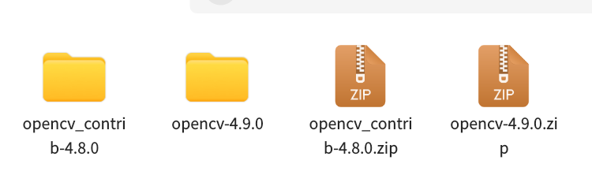

# Kylin

## 软件安装

### 1 opencv



```shell
# opencv-4.9.0.zip 源文件解压
cd /opencv-4.9.0
mkdir bulid
sudo -s  #一定要在管理员模式下编译
cd bulid  # 上级目录一定要有CMakeList.txt
sudo cmake ..
sudo make -j 4/8/10
sudo make install
```

**添加opencv依赖库**

```shell
sudo apt-get install build-essential
```


### 2 **opencv-contrib**

```shell

```


### 3 QT

#### 3.1**离线安装：**

官网下载：https://download.qt.io/archive/qt/5.12/5.12.10/


```shell
chmod 777 qt-opensource-linux-x64-5.12.10.run	# 打开权限
./qt-opensource-linux-x64-5.12.10.run			# 直接运行
sudo apt-get install g++						# 安装完成后安装g++/gcc
sudo apt-get install libgl1-mesa-dev			# 环境安装
opt/Qt5.12.10/Tools/QtCreator/bin				# 此目录下直接运行qtcreator
```

配置qmake：

```shell
cd /
sudo vim ~/.bashrc
export QTDIR=/home/qt/Tools/QtCreator 			# 这个路径根据自己安装的位置进行配置
export LD_LIBRARY_PATH=$LD_LIBRARY_PATH:$QTDIR/lib
export PATH=$PATH:$QTDIR/bin
qmake --version									# 检测
```

#### 3.2**在线安装：**

```shell
sudo apt update									# 更新apt安装源	
sudo apt install qt5-default qtcreator			# 安装Qt组件和Qt Creator
qmake --version									# 检测
qtcreator										# 检查Qt Creator是否安装成功
```


