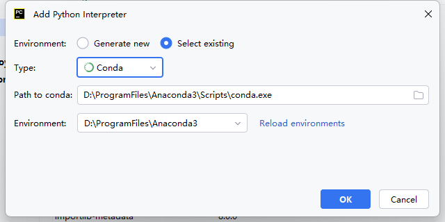

# 一、Anaconda下载路径配置

配置文件路径：**"C:\用户\用户名\.condarc"**

```c++
channels:
  - https://mirrors.tuna.tsinghua.edu.cn/anaconda/pkgs/main/
  - defaults
envs_dirs:
  - D:\ProgramFiles\Anaconda3envs\envs
pkgs_dirs:
  - D:\ProgramFiles\Anaconda3envs\pkgs
show_channel_urls: true
```


# 二、pycharm配置conda

- Anaconda3的下载路径-->conda.exe
- 点击Reload environment



