# 1、OpenSSL

## 1.1 数据的加密和解密

### 1.1.1 加密三要素

（密钥+加密算法）+ 明文  ===> 密文

（密钥+解码算法）+ 密文  ===> 明文


**三要素：**

* 明文/密文
	* 明文：需要加密的数据
	* 密文：需要解密的数据
* 算法
	* 加密算法
	* 解密算法
	* **加密和解密使用的算法应该是相反的,互逆的.**
		* 经过加密后的数据必须能够通过使用解密算法将加密数据**还原**成原来的数据
* 秘钥
	* 指定长度的字符串(该秘钥不是加密算法提供的,是**由用户提供的**)
	* 不同的加密算法使用的秘钥的长度是不同的
	* 数据加密必须有秘钥


### 1.1.2 常用的加密方式

**1 对称加密**

* 加密和解密所使用的是同一个秘钥
* 特点:
	* 秘钥分发困难
	* 加密效率高

**2 非对称加密**

加密和解密所使用的秘钥不同-是一个秘钥对

* 公钥-可以公开的秘钥
* 私钥-不能公开
* 传输的数据对谁更重要,谁就用私钥
	* 如果使用公钥加密,必须使用私钥解密
	* 如果使用私钥加密,必须使用公钥解密

**3 应用场景**

* 开通网银，用户会拿到一个U盾，私钥
* 银行拿公钥

**4 特点**

* 秘钥分发简单
* 加密效率低
* 安全级别高

* **Openssl已经封装好了很多加密算法**


### 1.1.3 常用的加密算法


# 2、Git

当多个人共同维护同一个项目时，git的作用就体现出来了。

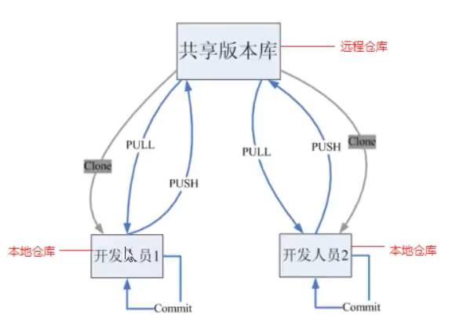

## 2.1 git工作流程

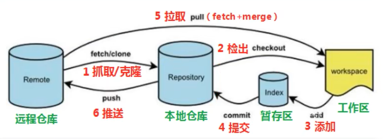

命令如下:

* clone(克隆):从远程仓库中克隆代码到本地仓库
* checkout(检出):从本地仓库中检出一个仓库分支然后进行修订
* add(添加):在提交前先将代码提交到暂存区
* commit(提交):提交到本地仓库。本地仓库中保存修改的各个历史版本
* fetch (抓取): 从远程库，抓取到本地仓库，不进行任何的合并动作，一般操作比较少。
* pull (拉取): 从远程库拉到本地库，自动进行合并(merge)，然后放到到工作区，相当于fetch+merge
* push(推送):修改完成后，需要和团队成员共享代码时，将代码推送到远程仓库

### 2.1.1 基本环境配置

安装好git后一定要**设置邮箱和用户名**：

```shell
git config --global user.name "itwang"
git config --global user.email "wl@itwang.com"
```

查看配置信息：

```shell
git config --global user.name
git config --global user.email
```

**创建配置文件**：

```shell
touch ~/.bashrc
```

在.bashrc文件中输入内容：

```shell
# 用于输出git提交日志
alias git-log='git log --pretty=oneline --all --graph --abbrev-commit'
# 用于输出当前目录所有文件及基本信息
alias ll='ls -al'
```

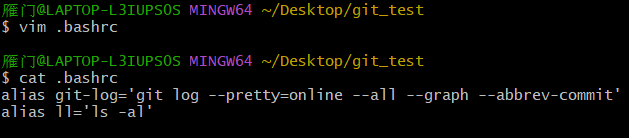

打开gitbash,执行.bashrc

```shell
source ~/.bashrc
```

.bashrc**一定是创建在根目录下**

**解决乱码问题**：

1.打开gitbash：

```shell
git config --global core.quotepath false
```

2.$(git_home)/etc/bash.bashrc 文件末尾加入

```SHELL
export LANG="zh_CN.UTF-8"
export LC_ALL="zh_CN.UTF-8"
```


### 2.1.2 获取本地仓库

要使用Git对我们的代码进行版本控制，首先需要获得本地仓库

* 在电脑的任意位置创建一个空目录(例如test)作为我们的本地Git仓库
* 进入这个目录中，点击右键打开`Git bash`窗口
* 执行命令`git init`进行初始化
* 如果创建成功后可在文件夹下看到隐藏的`.git`目录。

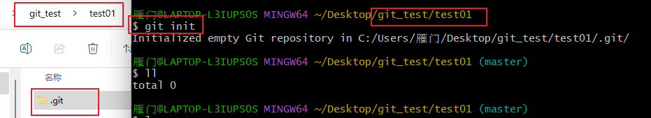


### 2.1.3 基础操作指令

Git工作目录下对于文件的**修改**(增加、删除、更新)会存在几个状态，这些修改的状态会随着我们执行Git的命令而发生变化。

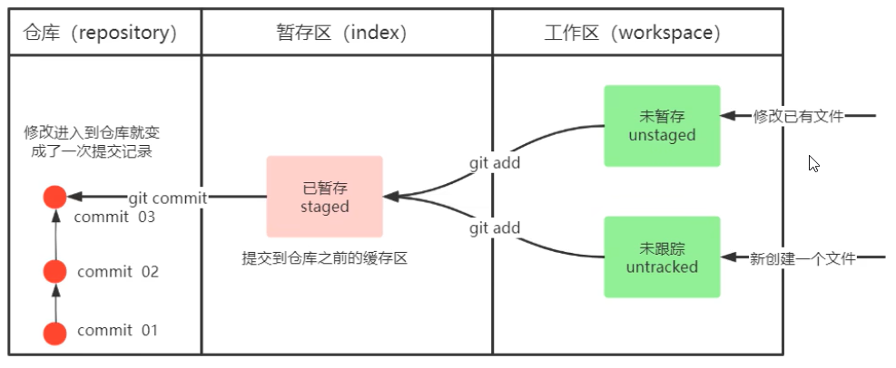

1.  **状态之间的转换**：

	* `git add    ` 			(工作区--->暂存区)


	* `git commit   `       (暂存区--->本地仓库)

2. **查看修改的状态**（status）:（暂存区、工作区）
	* `git status`

3. **添加工作区到暂存区(add)** ：

	* 作用：添加工作区一个或多个文件的修改到暂存区 

	* 命令形式：`git add 单个文件名|通配符 `
		* 将所有修改加入暂存区：`git add .`

4. **提交暂存区到本地仓库(commit)** 

	* 作用：提交暂存区内容到本地仓库的当前分支 

	* 命令形式：`git commit -m '注释内容‘`

5. **查看提交日志(log)**

*  配置的别名 `git-log` 就包含了这些参数，所以后续可以直接使用指令 git-log 

	* 作用:查看提交记录 

	* 命令形式：git log [option] 

		* options 

			* --all 显示所有分支 

			* --pretty=oneline 将提交信息显示为一行 

			* --abbrev-commit 使得输出的commitId更简短 

			* --graph 以图的形式显示

6. **回退到某个提交版本**

* 作用：版本切换 
* 命令形式：`git reset --hard commitID `
	* commitID 可以使用 git-log 或 git log 指令查看 
* 如何查看已经删除的记录？ 
	* `git reflog` 
	* 这个指令可以看到已经删除的提交记录

7. **添加文件至忽略列表**

	般我们总会有些文件无需纳入Git 的管理，也不希望它们总出现在未跟踪文件列表。 通常都是些自动生成的文件，比如日志文件，或者编译过程中创建的临时文件等。 在这种情况下，我们可以在工作目录 中创建一个名为 .gitignore 的文件（文件名称固定），列出要忽略的文件模式。下面是一个示例：

	```shell
	# no .a files
	*.a
	# but do track lib.a, even though you're ignoring .a files above
	!lib.a
	# only ignore the TODO file in the current directory, not subdir/TODO
	/TODO
	# ignore all files in the build/ directory
	build/
	# ignore doc/notes.txt, but not doc/server/arch.txt
	doc/*.txt
	# ignore all .pdf files in the doc/ directory
	doc/**/*.pdf
	```

	

8. **查看分支**

	```shell
	git branch	 				  # 查看本地分支
	git branch 分支名			   	# 创建本地分支
	git checkout 分支名		   	# 切换分支
	git checkout -b 分支名			# 创建并切换
	git merge 分支名称			   # 合并分支,要合并到master，首先得切换到master，然后将其他的合并到master
	git branch -d b1 			 # 删除分支时，需要做各种检查
	git branch -D b1 			 # 不做任何检查，强制删除
	```

	​	分支冲突：

	​		当两个分支上对文件的修改可能会存在冲突，例如同时修改了同一个文件的同一行，这时就需要手动解 决冲突，解决冲突步骤如		下：

	  * 处理文件中冲突的地方 
	  * 将解决完冲突的文件加入暂存区(add)
	  * 提交到仓库(commit) 冲突部分的内容处理如下所示：

	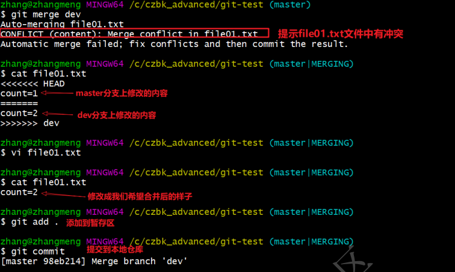

​		

**分支**：

* master ： Git 的默认分支名字。它并不是一个特殊分支、跟其它分支完全没有区别。 之所以几乎每一个仓库都有 master 分支，是因为 git init 命令默认创建它，并且大多数人都懒得去改动它。


* origin ：Git 克隆的仓库服务器的默认名字。


* origin/master：是当本地的 master 分支同步到服务时的名字。如果分支名称为 ForDebug、当分支同步到服务器时、会看到服务器上的名字为 origin/ForDebug。

**新建分支并同步到服务器**：

1. GIT 初始化：本地默认分支叫 master、服务器默认名为 origin
2. 本地创建新工程
3. 本地工程更新、同步到本地分支 master
4. 本地分支 master 同步到服务器上、服务器节点变成 orgin/master
5. 本地创建分支名为 branch
6. 更新本地分支 branch
7. 本地分支 branch 同步到服务器上、服务器节点变成 orgin/branch
8. 更新本地分支 master
9. 用本地分支 master 更新服务器节点 orgin/master
10. 本地分支branch合并到主干 master

几乎所有的版本控制系统都以某种形式支持分支。 使用分支意味着你可以把你的工作从开发主线上分离 开来进行重大的Bug修改、开发新的功能，以免影响开发主线。 在开发中，一般有如下分支使用原则与流程： 

* master （生产） 分支 线上分支，主分支，中小规模项目作为线上运行的应用对应的分支； 
* develop（开发）分支 是从master创建的分支，一般作为开发部门的主要开发分支，如果没有其他并行开发不同期上线 要求，都可以在此版本进行开发，阶段开发完成后，需要是合并到master分支,准备上线。 
* feature/xxxx分支 从develop创建的分支，一般是同期并行开发，但不同期上线时创建的分支，分支上的研发任务完 成后合并到develop分支。
*  hotfix/xxxx分支， 从master派生的分支，一般作为线上bug修复使用，修复完成后需要合并到master、test、 develop分支。
*  还有一些其他分支，在此不再详述，例如test分支（用于代码测试）、pre分支（预上线分支）等 等。

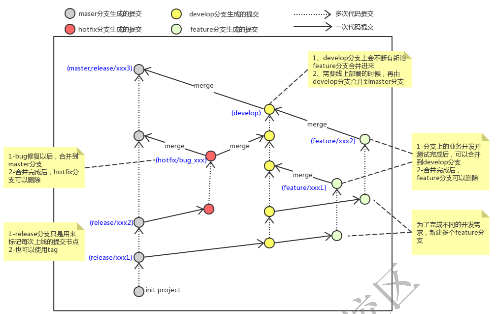


### 2.1.4 基本流程：

* 随机创建文件夹作为本地仓库进行初始化，文件夹下会生成`.git`文件

	```shell
	git init 
	```

* 拷贝文件进本地仓库

* 提交文件到暂存区

	```shell
	git add test.txt		# 提交单独文件
	git add .				# 通配符(.)-->提交所有文件
	```

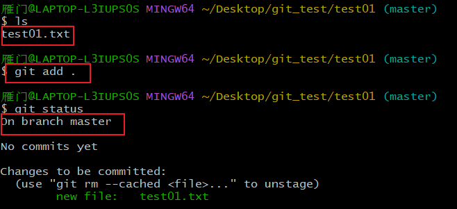

​		提交到暂存区能看到，默认在master分支中。

* 提交文件到本地仓库

	```shell
	git commit -m "add file01"   		#add file01是注释随便写
	```

	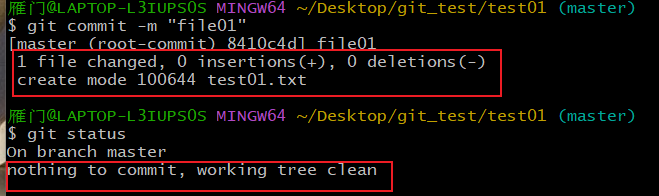

* 查看文件提交到哪里了

	```shell
	git log
	git log --pretty=oneline --abbrev-commit --all --graph
	```

	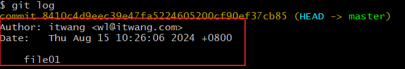

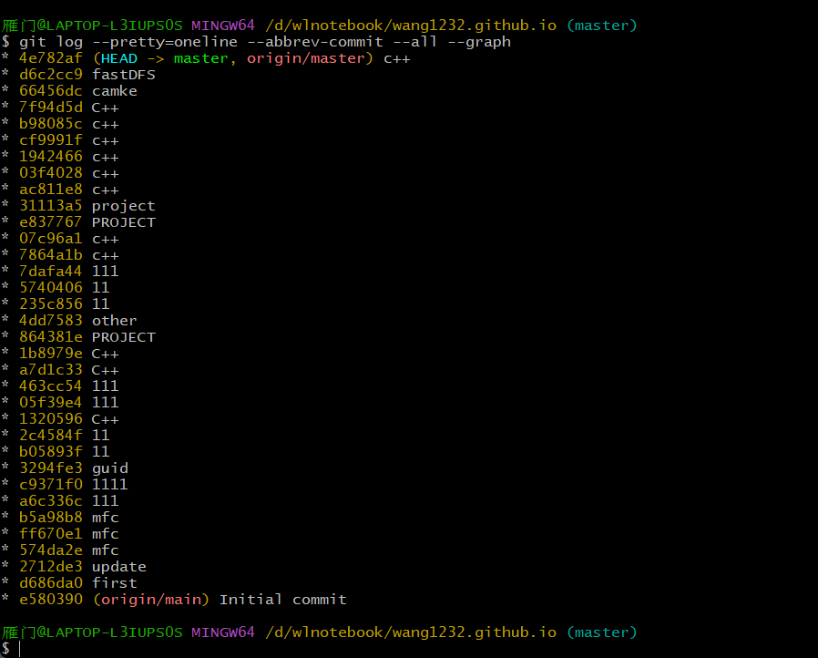

能看到我的提交记录，每一行前面的字符是提交的ID，可以做回退使用。后面的字符是我提交时写的注释。


## 2.2 GitHub远程仓库

### **2.2.1 绑定账号**

**1、将本地端git软件和github端绑定同一账号：**

```shell
# 这里-C后面加注册github时用的邮箱
ssh-keygen -t rsa -C "wanglei17691109707@gmail.com"
```

生成的密钥文件就在此路径下：

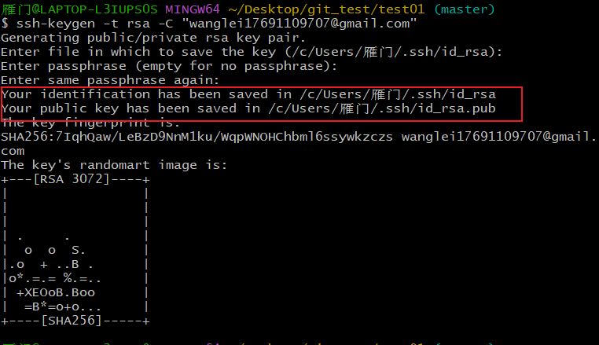

该路径下的.pub文件是公钥，公钥可以放心地告诉任何人。

**2、绑定公钥**

登陆GitHub，点击头像下面的“settings”，选择“SSH Keys：，填上任意Title，在Key文本框里粘贴id_rsa.pub文件的内容（用文本打开就可以），就完成啦。

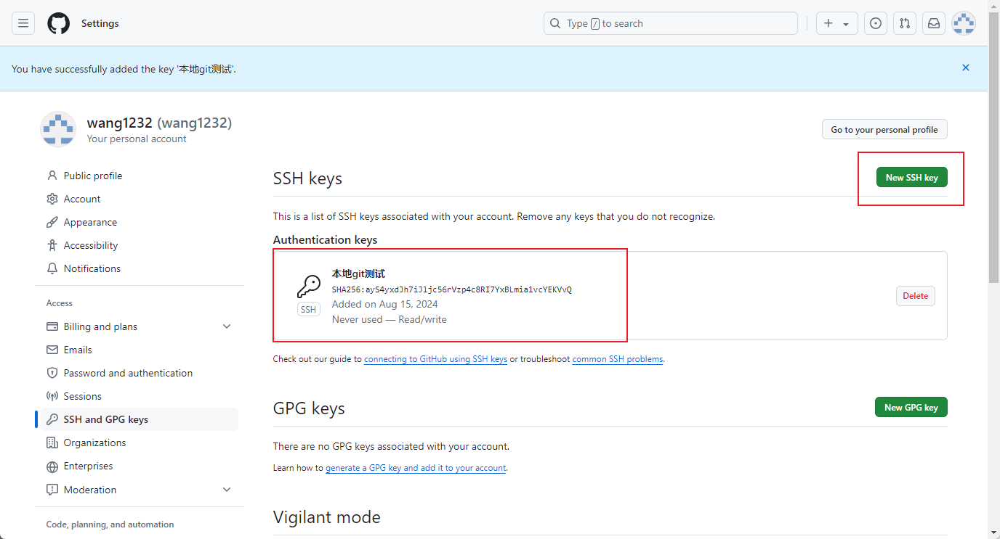

验证公钥是否配置成功：第一次进入需要输入yes

```shell
ssh -T git@github.com
ssh -T git@gitee.com
```

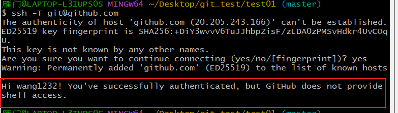

3、连接本地git仓库

注册好登录GitHub，选择右上角＋号中的，New repository。在Repository name填入仓库名字（也可以在Description 添加一些描述），其他保持默认设置，点击“Create repository”按钮，就成功地创建了一个新的Git仓库。

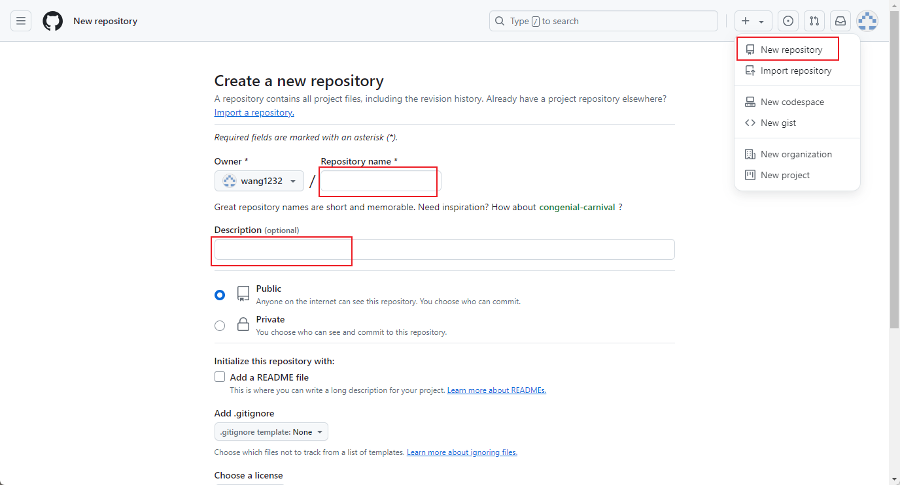

创建成功后这是仓库的地址：

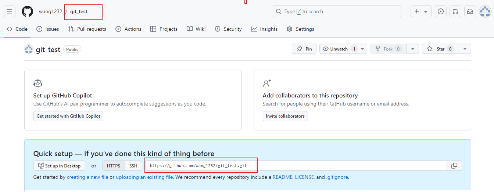

```shell
https://github.com/wang1232/git_test.git
```

4、推送本地仓库的内容到GitHub仓库

```shell
# 添加一个远程仓库，其地址是https://github.com/wang1232/git_test.git，其名称为origin 
git remote add origin https://github.com/wang1232/git_test.git 
```

回车不报错及添加成功，通过：

```shell
git remote					# 查看仓库是否添加成功
```

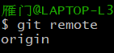

**推送**本地代码给远程仓库：

```shell
# 给master分支的origin仓库推送内容
git push origin master
git push origin master:master     # 本地分支与远端分支绑定
```

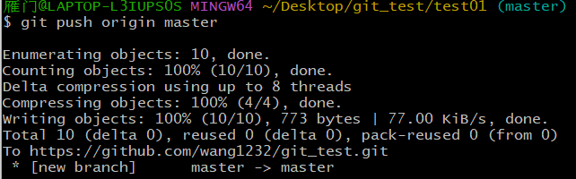