# 1 github克隆别人的项目给自己 

## 1.1 默认HTTPS 协议链接

1.新建一个仓库：

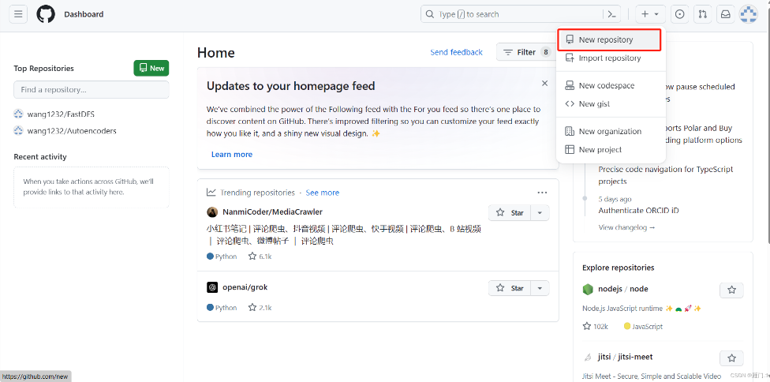

2.填写项目名称：

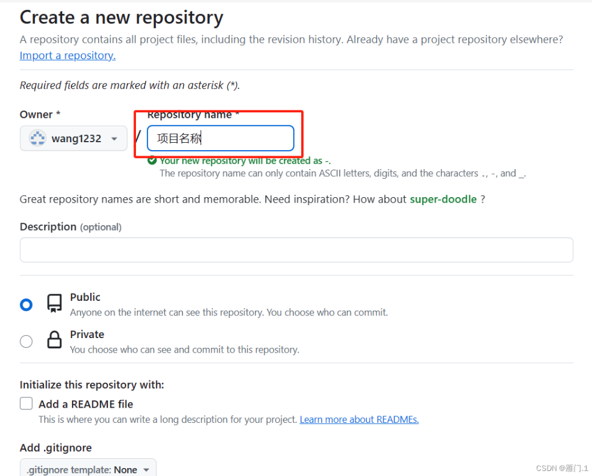

3、不需要勾选readme，直接创建：

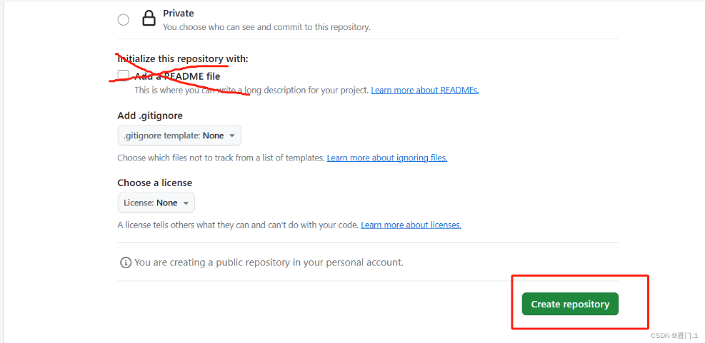

4.创建完成，后面即仓库地址

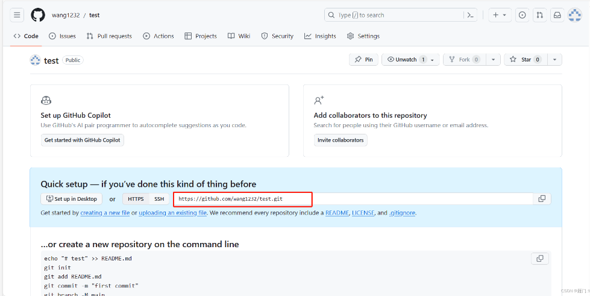

指令开始：

这里注意如果不想在c盘克隆，在其他盘创建一个文件夹cd过去即可。

1.clone你需要的项目

```cpp
git clone xxx
```

2.进入项目目录

```cpp
cd xxx
```

3.删除原有的git信息，有问题一直回车

```cpp
rm -r .git
```

4.初始化git

```cpp
git init
```

5.讲本地代码添加到仓库

```cpp
git add .
git commit -m “xxx” //xxx是下图中的备注，随便打也可以
```

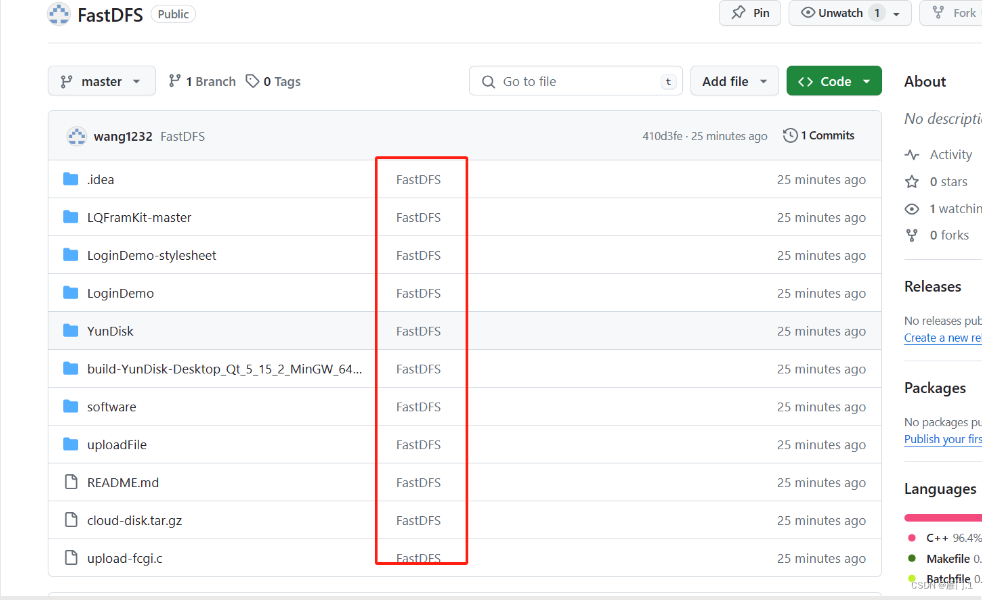

6.在git官网上新建一个项目，注意不要生成README文件，参考上面即可。
7.关联远程库

```cpp
git remote add origin 远程库地址
//即上面的本地仓库的地址
```
8.提交代码，等待上传完毕

```cpp
git push --set-upstream origin master
```

出现以下错误：
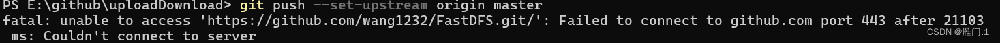

解决方法：

```c++
git config --global http.sslVerify "false"
```


## 1.2 SSH 协议链接

有时候虽然有梯子，但是git push一直报403的错误，此时使用SSH好于HTTPS

GitHub 同时支持 HTTPS 和 SSH 协议，SSH 协议无需依赖 443 端口，且配置完成后后续无需重复验证，更适合长期使用，步骤如下：

1. **检查本地是否已有 SSH 密钥对**

   打开终端（Windows 用 Git Bash/CMD，Mac/Linux 用终端），执行命令：

   ```
   ls -la ~/.ssh
   ```

   若能看到 `id_rsa`（私钥）和 `id_rsa.pub`（公钥），或 `id_ed25519`/`id_ed25519.pub`，说明已有密钥对，直接跳转到步骤 3；若没有，执行步骤 2 生成。

2. **生成 SSH 密钥对**

   执行以下命令（替换为你的 GitHub 注册邮箱），一路回车默认配置即可（无需设置密码，若需要密钥密码可自行输入）：

   ```
   ssh-keygen -t ed25519 -C "your_email@example.com"
   ```

   （若系统不支持 ed25519 算法，可使用 `ssh-keygen -t rsa -b 4096 -C "your_email@example.com"`）

3. **复制 SSH 公钥内容**

   先查看公钥文件内容，执行对应命令：

   - 若生成的是 ed25519 密钥：

     ```
     cat ~/.ssh/id_ed25519.pub
     ```

   - 若生成的是 rsa 密钥：

     ```
     cat ~/.ssh/id_rsa.pub
     ```

   复制终端输出的全部内容（以 `ssh-ed25519` 或 `ssh-rsa` 开头，以你的邮箱结尾）。

4. **在 GitHub 上添加 SSH 公钥**

   1. 登录 GitHub，点击右上角头像 → `Settings` → 左侧导航栏 `SSH and GPG keys` → 点击 `New SSH key`。
   2. `Title` 可自定义（如「My Laptop」），`Key type` 选择 `Authentication key`。
   3. 将复制的公钥内容粘贴到 `Key` 输入框中，点击 `Add SSH key` 完成添加。

5. **修改本地 Git 仓库的远程地址为 SSH 格式**

   先查看当前远程地址（确认是 HTTPS 格式）：

   ```c++
   git remote -v
   ```

   再删除原有 HTTPS 格式的远程地址，添加 SSH 格式地址（替换为你的仓库地址，可从 GitHub 仓库页面「Code」→「SSH」复制）：

   ```c++
   # 删除原有远程地址（origin 是远程仓库别名，默认都是 origin）
   git remote rm origin
   
   # 添加 SSH 格式远程地址（示例，替换为你的仓库 SSH 地址）
   git remote add origin git@github.com:wang1232/work.git
   ```

6. **验证连接并执行 push**

   先验证 SSH 连接是否成功：

   ```
   ssh -T git@github.com
   ```

   首次连接会提示 `Are you sure you want to continue connecting (yes/no)?`，输入 `yes` 回车，若看到 `Hi XXX! You've successfully authenticated` 说明连接成功。

   最后重新执行 push 命令：

   ```c++
   git push --set-upstream origin master
   ```


# 2 Typora与GitHub链接

1、密钥生成

```shell
ssh-keygen -o
```

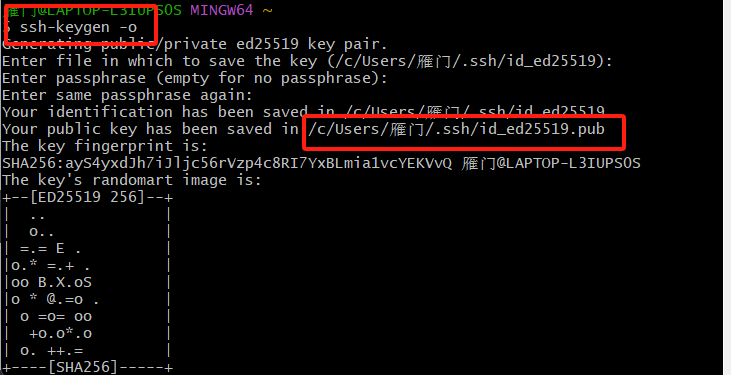

打开这个目录，里面的pub文件存放的密钥：

```shell
cat  /c/Users/雁门/.ssh/id_ed25519.pub
```

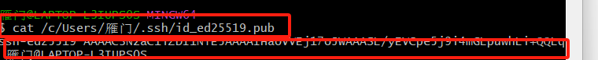

复制密钥到生成即可：


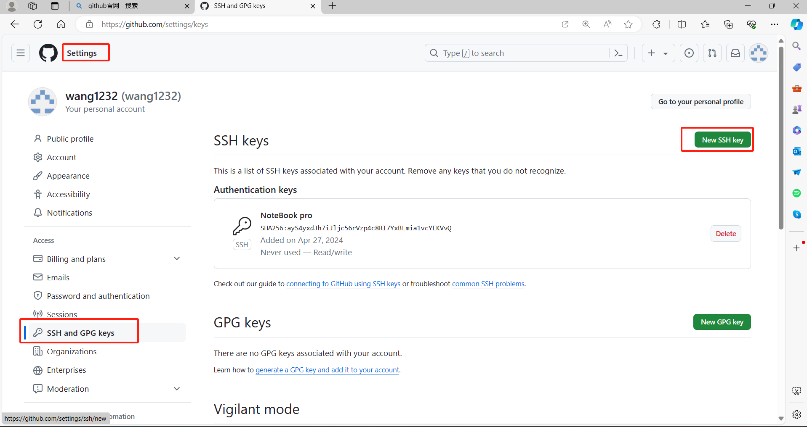

2、切换新目录-->笔记存放的地方


3、链接新建的私人仓库

```shell
git clone https://github.com/wang1232/NoteBook.git
```

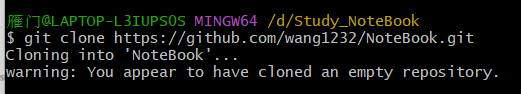

4、开始上传

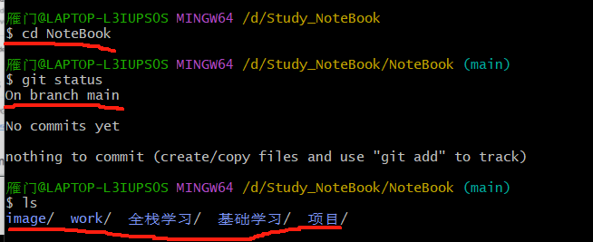

```shell
git add .
git commit -m "add new file"
git push
```


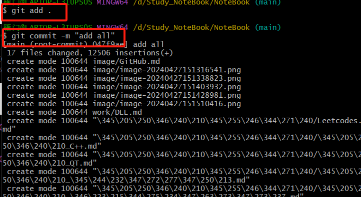

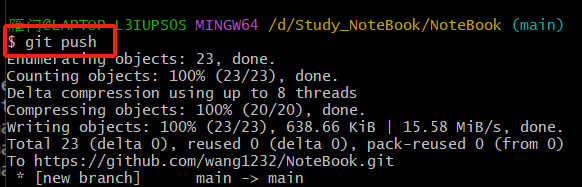


# 3 vscode与github

```
git status
git add .
git commit -m "1111"
git branch
git push origin master
```

## 3.1 下载Git

vscode中使用github首先第一步得下载Git，可以自己从官网下载也可以直接打开vscode：

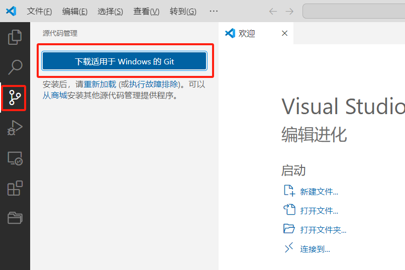

下载完成后进行傻瓜式安装即可。参考：[Git 详细安装教程（详解 Git 安装过程的每一个步骤）_git安装-CSDN博客](https://blog.csdn.net/mukes/article/details/115693833)

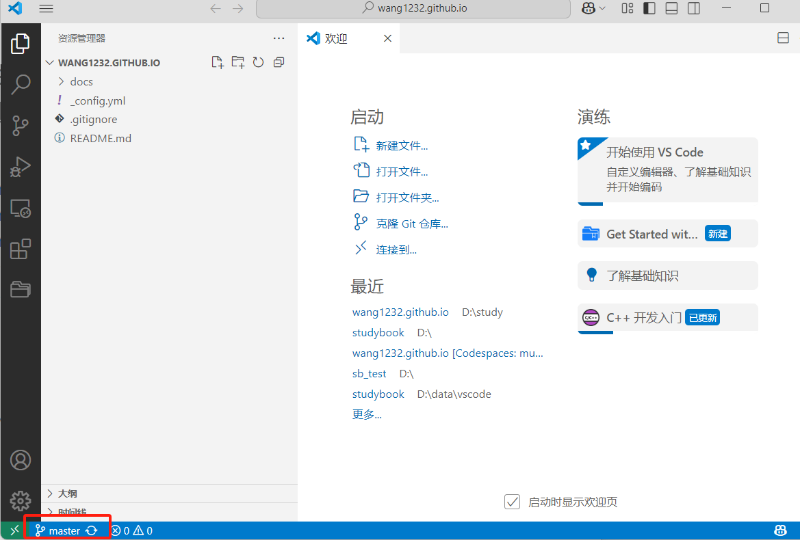

## 3.2 开始克隆

点击克隆git仓库，当选择从远程克隆仓库时，**输入远程仓库地址（一定要输入仓库的地址按下回车）**，按下回车即可：

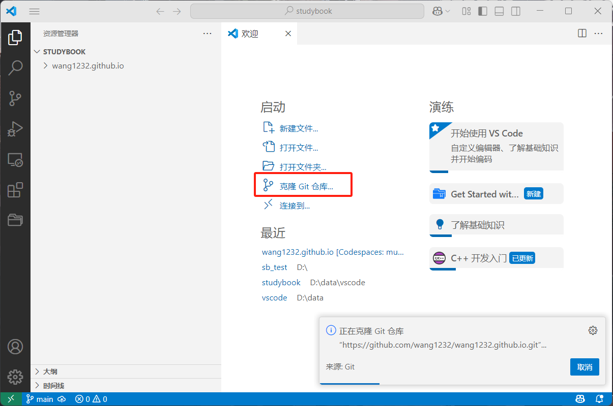

点击之后会在这输入，点击之后会让你选择自己的本地下载位置，随意选择即可：

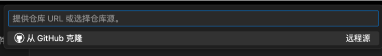


# 4 typora图像格式问题

直接处理文件夹下的所有.md文件

```python
import os
import traceback
from bs4 import BeautifulSoup
from bs4.element import Tag


class TransformMD(object):
    def __init__(self):
        if not os.path.exists("transformed"):
            os.mkdir("transformed")

    def trans_img(self, line):
        """
        将  标签转换为 Markdown 图片格式。
        """
        soup = BeautifulSoup(line, "html.parser")
        newLine = ''
        for content in soup.contents:
            if isinstance(content, Tag) and content.name == "img":
                url = content.get("src", "")
                alt = content.get("alt", "")
                newLine += f""
            else:
                newLine += str(content)
        return newLine

    def transform(self, filename):
        try:
            name = os.path.basename(filename)
            savepath = os.path.join("transformed", name[:-3] + "-transformed" + name[-3:])
            with open(filename, "r", encoding="utf-8") as r, open(savepath, "w", encoding="utf-8") as w:
                for line in r:
                    if "<img" in line:
                        w.write(self.trans_img(line))
                    else:
                        w.write(line)
        except Exception as e:
            print(f"处理文件时出错: {filename}")
            traceback.print_exc()

    def transformDir(self, dirname):
        """
        转换指定目录中的所有 Markdown 文件。
        """
        for path, _, file_list in os.walk(dirname):
            for file_name in file_list:
                if file_name.lower().endswith(".md"):
                    full_path = os.path.join(path, file_name)
                    print(f"正在处理文件: {full_path}")  # 打印调试信息
                    self.transform(full_path)


if __name__ == '__main__':
    TMD = TransformMD()
    TMD.transformDir("D:/Study_NoteBook/NoteBook/杂/")
```

