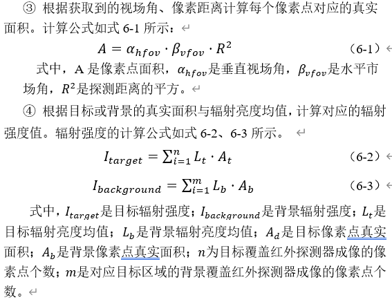
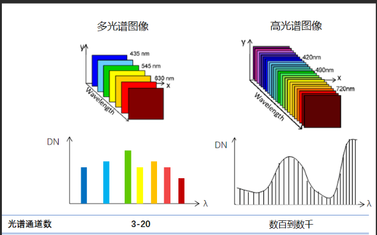
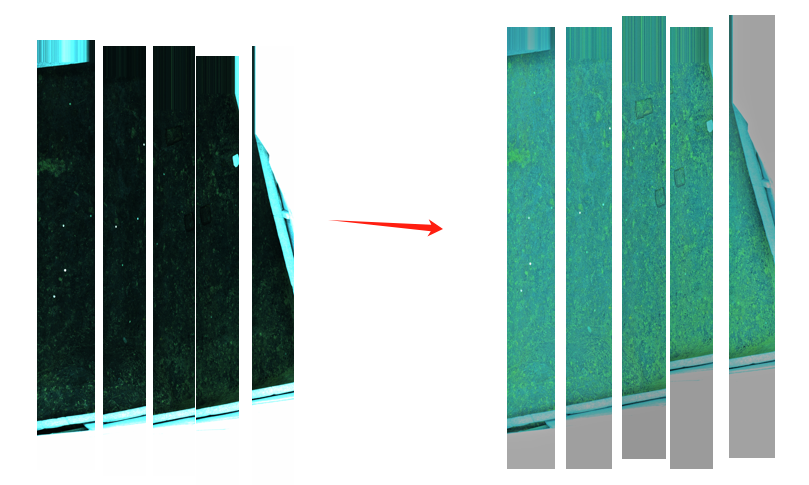

# 多光谱图像

波段：表示不同光谱区域的通道或层。每个波段都捕捉了地表反射或发射的电磁辐射在不同波长范围内的信息。图像的波段通常以灰度图像的形式呈现，每个像素的**亮度值**代表了该像素在特定波段下的**辐射强度**。通过组合多个波段的图像数据，可以创建出多光谱图像或高光谱图像。

辐射亮度计算辐射强度： 



波长范围：

* 光谱仪器能够覆盖的波长区间。波长范围越宽，表示仪器能够覆盖更多的光谱信息。

光谱分辨率：

* 光谱仪器能够区分或记录的两个相邻波长之间的差异，是传感器所能记录的电磁波谱中**某一特定的波长范围值**。衡量了光谱仪器区分两个相邻波长或频率的能力。
* 光谱分辨率取决于其包含的波段数量和每个波段的带宽。
	* **波段数量越多，带宽越窄，光谱分辨率越高**。

可见光波段:

* 波长在约380nm到780nm之间的光

多光谱和高光谱图像与普通图像的不同主要包括光谱分辨率、波段数量、数据量和应用领域等方面。

**光谱分辨率**

* 普通图像（RGB图像）：
	* 光谱分辨率较低，通常只有三个波段（红、绿、蓝），每个波段覆盖的光谱范围较宽。提供的光谱信息有限，主要用于视觉感知。
* 多光谱图像：
	* 光谱分辨率中等，通常包含3到10个波段，覆盖从可见光到近红外的不同光谱范围。每个波段的光谱范围较宽。提供了较丰富的光谱信息，能够用于物质识别和分类。
	* 多光谱图像其实可以看做是高光谱的一种情况，即成像的波段数量比高光谱图像少，一般只有几个到十几个。由于光谱信息其实也就对应了色彩信息，所以多波段遥感图像可以得到地物的色彩信息，但是**空间分辨率较低**。更进一步，光谱通道越多，其分辨物体的能力就越强，即光谱分辨率越高。
* 高光谱图像：
	* **光谱分辨率很高**，通常包含几十到几百个波段，每个波段覆盖的光谱范围很窄，能够捕捉到非常细微的光谱差异。提供了非常**详细的光谱信息**，能够进行精确的光谱分析和材料识别。
	
	* 高光谱是由很多通道组成的图像，具体有多少个通道，这需要看传感器的波长分辨率，每一个通道捕捉指定波长的光。把光谱想象成一条直线，由于波长分辨率的存在，每隔一定距离才能“看到”一个波长。“看到”这个波长就可以收集这个波长及其附近一个小范围的波段对应的信息，形成一个通道。**也就是一个波段对应一个通道**。



****

# **图像拼接**

**图像预处理**

* 图像去噪
	* 滤波算法

* 图像失真校正
* 图像去渐晕
	* 渐晕模型

* 图像复原
	* 逆滤波
	* 维纳滤波

* 辐射校正：对图像进行辐射校正，消除传感器差异和大气影响。
	* 直方图均衡化

* 光谱校正：校正不同光谱通道之间的偏移和差异。
	* 白平衡

**图像配准：**

将多幅图像进行匹配、叠加的过程。应当能够估计待拼接图像之间可能存在的缩放、旋转、仿射变换、投影变换以及亮度和颜色等变化。

找到待配准图像与参考图像的模板或特征点的对应位置，然后根据对应关系建立参考图像与待配准图像之间的**转换数学模型，将待配准图像转换到参考图像的坐标系中，**确定两图像之间的重叠区域。精确配准的关键是寻找一个能很好描述两幅图像转换关系的数据模型。

* **基于模板匹配方法**

	* 差值平方和 (TM_SQDIFF): 通过计算模板与搜索区域中所有对应位置像素点的像素平方差之和来衡量两者相似度。计算结果越小表示越相似，当计算结果为0时表示两者完全相同。
	* 归一化差值平方和 (TM_SQDIFF_NORMED): 与差值平方和类似，但加了一个归一化操作，以确保当模板和搜索区域的亮度都乘以某个系数后，**相似度值**保持不变。
	* **相关系数** (TM_CCORR): 采用模板和搜索区域的相关系数作为衡量指标，相关系数越大表示两者越相似。
	* 归一化相关系数 (TM_CCORR_NORMED): 对比相关系数，多了一个归一化操作，也是为了确保亮度变化时相似度保持稳定。
	* 去均值相关系数 (TM_CCOEFF): 与相关系数类似，但在计算时模板和搜索区域都减去各自的均值。

* **基于边缘匹配方法**

	* 边缘提取: 利用算法提取图像的边缘特征，然后对这些边缘特征进行匹配分析，以找到最佳的配准参数。
		* 常用的边缘检测算子：
			* robert cross
			* sobel
			* Kirsch
			* 拉普拉斯
			* Canny
	* 交互方差分析: 在提取边缘图像后，通过计算交互方差来搜索配准参数，以达到最佳的匹配效果。
	* Lipschitz指数特征点提取: 利用Lipschitz指数找到边缘的突变点作为特征点，然后进行图像配准。

* **基于特征匹配方法**

	* 特征检测与描述
		* **SIFT**（Scale-Invariant Feature Transform）：检测图像中的关键点，并计算其局部描述子，具有尺度和旋转不变性。
		* **SURF**（Speeded Up Robust Features）：加速版的SIFT算法，计算速度更快，适合实时应用。
		* **ORB**（Oriented FAST and Rotated BRIEF）：结合FAST特征检测和BRIEF特征描述的算法，具有较高的计算效率和较好的匹配性能。
	* 特征匹配
		* **BFMatcher**（Brute-Force Matcher）：暴力匹配算法，通过逐个比较描述子，找到距离最近的匹配对。
		* **FLANN**（Fast Library for Approximate Nearest Neighbors）：基于近似最近邻搜索的快速匹配算法，适合大规模特征点匹配。
	* 配准方法
		* **RANSAC**（Random Sample Consensus）：通过随机抽样的方法，估计图像之间的变换模型，剔除误匹配点，提高配准的精度。
		* **ICP**（Iterative Closest Point）：通过迭代的方式最小化两个点集之间的距离，用于精细配准。

* **基于密集方法**

	* 光流法
		* **Lucas-Kanade 光流法**: 通过追踪图像中的局部区域运动来估计光流场。
		* **Pyramidal Lucas-Kanade**: 通过金字塔图像进行多尺度估计，以处理较大位移。

* 相位相关法
	* **相位相关法（Phase Correlation）**: 通过傅里叶变换和逆变换计算图像之间的相位差，适用于全局平移变换。

* **基于学习的方法**

	* **深度学习**: 使用卷积神经网络（CNN）等深度学习方法进行特征提取和匹配，近年来成为图像配准领域的研究热点。


**图像拼接：**

矫正差异，消除缝隙，消除图像配准算法产生的误差累积、色彩差异。

* **直接拼接**
	* 当前算法在图像融合时，简单地将变换后的第二张图像与第一张图像直接拼接在一起。这种方法没有考虑重叠区域的颜色和亮度差异，也没有进行复杂的过渡处理，可能会在拼接处产生明显的接缝

* 基于能量谱的最佳拼接线搜寻
	* 基于能量谱进行最优拼接线搜寻的技术，其本质是图像梯度谱的结合，用结构和特征谱来确定图像区域的显著特征。


* 基于图割的最佳拼接线搜寻
	* 将图像间重叠区域的图像像素 点视为图结构中的节点。在图像的重叠区域内，寻找一条能够精准、有效连接两幅图像的、使其实现无缝拼接的线。则将最佳拼接线寻优问题转化为图割理论中的寻找最优节点连接带权限问题。
* 渐变融合

	* 渐变融合方法通过对重叠区域进行加权平均，使两幅图像在拼接处平滑过渡。这种方法计算简单且易于实现，但可能会出现模糊或重影效果。

* 多频段融合

	* 多频段融合方法（如拉普拉斯金字塔融合）通过将图像分解为多个频段，并在每个频段上进行融合，然后再合成最终图像。该方法能够处理复杂的光照和颜色变化，效果较好，但计算复杂度较高。


# python

图像预处理：

* 对原始图像 进行 HSV 空间变换
* 利用双边滤波函数代替中心环绕函数(Retinex 算法)对亮度分量(V)进行增强.
* 结合HSV分量



```python
import cv2
import numpy as np
import os

def retinex_bilateral(img, sigma_space, sigma_color):
    retinex = np.zeros_like(img, dtype=np.float32)
    for sigma_s, sigma_c in zip(sigma_space, sigma_color):
        blur = cv2.bilateralFilter(img, d=0, sigmaColor=sigma_c, sigmaSpace=sigma_s)
        retinex += np.log10(img.astype(np.float32) + 1.0) - np.log10(blur.astype(np.float32) + 1.0)
    retinex = retinex / len(sigma_space)
    return retinex


def enhance_image(image_path):
    # 读取图像
    img = cv2.imread(image_path)
    if img is None:
        print(f"Error: Could not open or find the image {image_path}")
        return None

    # 转换为HSV
    hsv = cv2.cvtColor(img, cv2.COLOR_BGR2HSV)
    h, s, v = cv2.split(hsv)

    # 增强亮度分量
    sigma_space = [15, 80, 250]  # 双边滤波的空间标准差
    sigma_color = [30, 150, 300]  # 双边滤波的颜色标准差
    v_retinex = retinex_bilateral(v, sigma_space, sigma_color)

    # 归一化增强后的亮度分量
    v_enhanced = cv2.normalize(v_retinex, None, 0, 255, cv2.NORM_MINMAX, dtype=cv2.CV_8UC1)

    # 合并增强后的亮度分量和原来的H、S分量
    enhanced_hsv = cv2.merge([h, s, v_enhanced])

    # 转换回BGR
    enhanced_img = cv2.cvtColor(enhanced_hsv, cv2.COLOR_HSV2BGR)

    return enhanced_img


def process_images(image_paths, output_dir='enhanced_images'):
    if not os.path.exists(output_dir):
        os.makedirs(output_dir)  # 输出目录

    enhanced_images = []
    for image_path in image_paths:
        enhanced_img = enhance_image(image_path)
        if enhanced_img is not None:
            enhanced_images.append(enhanced_img)
            output_path = os.path.join(output_dir, 'enhanced_' + os.path.basename(image_path))
            cv2.imwrite(output_path, enhanced_img)
    return enhanced_images

image_paths = ['./img/20210114-01.bmp', './img/20210114-02.bmp', './img/20210114-03.bmp', './img/20210114-04.bmp', './img/20210114-05.bmp']
enhanced_images = process_images(image_paths)
```

