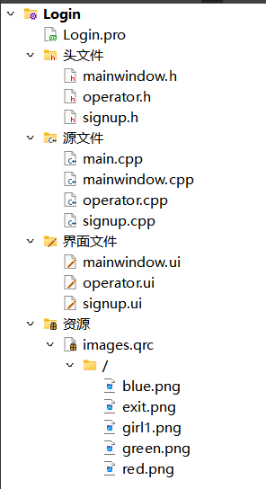
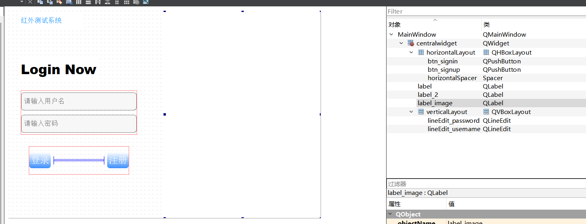
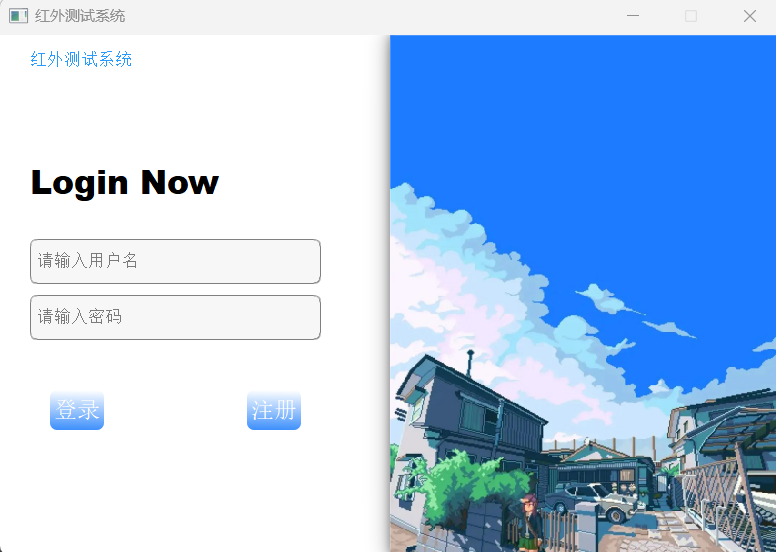
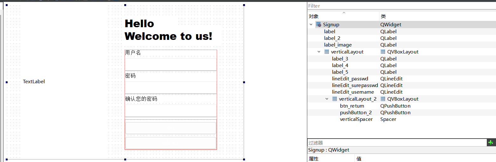
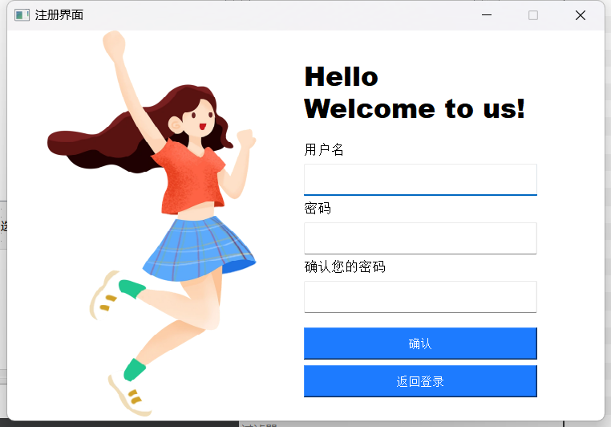
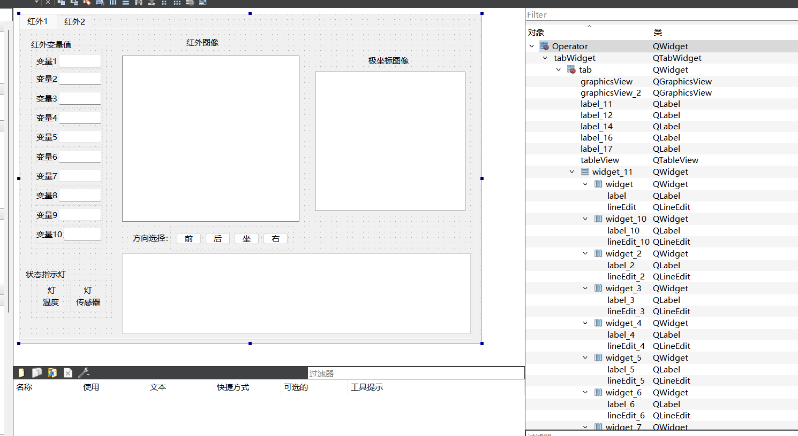
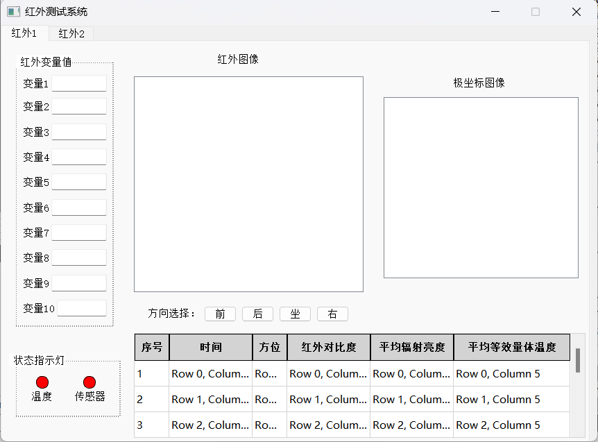

# 1 项目介绍

项目介绍：通过编写客户端和服务端，服务端负责连接硬件并传输数据，客户端负责接收数据并进行处理。


# 2 界面设计

## 2.1 客户端

* mianwindow编写登录
* signup编写注册
* operator编写操作



.pro

```c++
QT       += core gui sql

greaterThan(QT_MAJOR_VERSION, 4): QT += widgets

CONFIG += c++11

# The following define makes your compiler emit warnings if you use
# any Qt feature that has been marked deprecated (the exact warnings
# depend on your compiler). Please consult the documentation of the
# deprecated API in order to know how to port your code away from it.
DEFINES += QT_DEPRECATED_WARNINGS

# You can also make your code fail to compile if it uses deprecated APIs.
# In order to do so, uncomment the following line.
# You can also select to disable deprecated APIs only up to a certain version of Qt.
#DEFINES += QT_DISABLE_DEPRECATED_BEFORE=0x060000    # disables all the APIs deprecated before Qt 6.0.0

SOURCES += \
    main.cpp \
    mainwindow.cpp \
    operator.cpp \
    signup.cpp

HEADERS += \
    mainwindow.h \
    operator.h \
    signup.h

FORMS += \
    mainwindow.ui \
    operator.ui \
    signup.ui

# Default rules for deployment.
qnx: target.path = /tmp/$${TARGET}/bin
else: unix:!android: target.path = /opt/$${TARGET}/bin
!isEmpty(target.path): INSTALLS += target

RESOURCES += \
    images.qrc
```


### 2.1.1 登录





mainwindow.h

```c++
#ifndef MAINWINDOW_H
#define MAINWINDOW_H

#include <QMainWindow>
#include <QSqlDatabase> //数据驱动
#include <QSqlQuery> //数据库执行语句
#include <QMessageBox>//消息盒子
#include <QDebug>
void sqlite_Init();

QT_BEGIN_NAMESPACE
namespace Ui { class MainWindow; }
QT_END_NAMESPACE

class MainWindow : public QMainWindow
{
    Q_OBJECT

public:
    MainWindow(QWidget *parent = nullptr);
    ~MainWindow();

private slots:
    void on_btn_signin_clicked();

    void on_btn_signup_clicked();

private:
    Ui::MainWindow *ui;
};
#endif // MAINWINDOW_H

```

mainwindow.cpp

```c++
#include "mainwindow.h"
#include "ui_mainwindow.h"
#include "signup.h"
#include "operator.h"
#include <QGraphicsDropShadowEffect>
#pragma execution_character_set("utf-8")

MainWindow::MainWindow(QWidget *parent)
    : QMainWindow(parent)
    , ui(new Ui::MainWindow)
{
    ui->setupUi(this);
    this->setWindowTitle("红外测试系统");
    this->setFixedSize(780,520);
    QPixmap *pix = new QPixmap(":/blue.png");
    QSize sz = ui->label_image->size();
    ui->label_image->setPixmap(pix->scaled(sz));

    //设置阴影
    QGraphicsDropShadowEffect *shadow = new QGraphicsDropShadowEffect(this);
    shadow->setOffset(-3, 0);
    shadow->setColor(QColor("#888888"));
    shadow->setBlurRadius(30);
    ui->label_image->setGraphicsEffect(shadow);


}

MainWindow::~MainWindow()
{
    delete ui;
}

void sqlite_Init()
{

    QSqlDatabase db = QSqlDatabase::addDatabase("QSQLITE");
    db.setDatabaseName("user.db");
    if(!db.open())
    {
        qDebug()<<"open error";
    }
    //create excle
    QString createsql=QString("create table if not exists user(id integer primary key autoincrement,"
                        "username ntext unique not NULL,"
                        "password ntext not NULL)");
    QSqlQuery query;
    if(!query.exec(createsql)){
        qDebug()<<"table create error";
    }
    else{
        qDebug()<<"table create success";
    }
}


void MainWindow::on_btn_signin_clicked()
{
    sqlite_Init();
    QString username = ui->lineEdit_username->text();
    QString password = ui->lineEdit_password->text();
    if(username == nullptr && password == nullptr){
        QMessageBox::warning(this, "登录认证", "登录失败，用户名或密码为空！");
    }

    // 读取文件并检查用户名和密码
    QFile file("user_credentials.txt");
    if (!file.open(QIODevice::ReadOnly)) {
        QMessageBox::warning(this, "登录失败", "无法打开文件进行验证");
        return;
    }


    QTextStream in(&file);
    bool loginSuccess = false;
    while (!in.atEnd()) {
        QStringList credentials = in.readLine().split(",");
        if (credentials.size() == 2 && credentials[0] == username && credentials[1].trimmed() == password) {
            loginSuccess = true;
            break;
        }
    }
    file.close();
    if (loginSuccess && username != nullptr && password != nullptr) {
        QMessageBox::information(this, "登录认证", "登录成功！");
        // 这里可以跳转到主界面
        Operator *s = new Operator;
        s->show();
        this->close();
    } else if(!loginSuccess){
        QMessageBox::warning(this, "登录认证", "登录失败，用户名或密码错误！");
    }

}

void MainWindow::on_btn_signup_clicked()   //注册界面
{
    this->close();
    Signup *s = new Signup;
    s->show();
}
```


### 2.1.2 注册






signup.h

```c++
#ifndef SIGNUP_H
#define SIGNUP_H

#include <QWidget>
#include <QFile>

namespace Ui {
class Signup;
}

class Signup : public QWidget
{
    Q_OBJECT

public:
    explicit Signup(QWidget *parent = nullptr);
    ~Signup();

private slots:
    void on_pushButton_2_clicked();

    void on_btn_return_clicked();

private:
    Ui::Signup *ui;
};

#endif // SIGNUP_H

```

signup.cpp

```c++
#include "signup.h"
#include "ui_signup.h"
#include "mainwindow.h"
#pragma execution_character_set("utf-8")

Signup::Signup(QWidget *parent) :
    QWidget(parent),
    ui(new Ui::Signup)
{
    ui->setupUi(this);
    this->setWindowTitle("注册界面");
    this->setFixedSize(745,486);
    QPixmap *pix = new QPixmap(":/girl1.png");
    QSize sz = ui->label_image->size();
    ui->label_image->setPixmap(pix->scaled(sz));
}

Signup::~Signup()
{
    delete ui;
}

//返回登录按钮
void Signup::on_btn_return_clicked()
{
    MainWindow *w = new MainWindow;
    w->show();
    this->close();
}

//注册按钮
void Signup::on_pushButton_2_clicked()
{
    QString username = ui->lineEdit_username->text();
    QString password = ui->lineEdit_passwd->text();
    QString surepass = ui->lineEdit_surepasswd->text();
    //判断密码是否一致
    if(password == surepass)
    {
        QString sql=QString("insert into user(username,password) values('%1','%2');")
                .arg(username).arg(password);
        // 将用户名和密码保存到文件
        QFile file("user_credentials.txt");
        // 文件打不开
        if (!file.open(QIODevice::WriteOnly | QIODevice::Append))
        {
            QMessageBox::warning(this, "注册失败", "无法打开文件保存数据");
            return;
        }

        QTextStream out(&file);
        out << username << "," << password << "\n";
        file.close();

        QMessageBox::information(this, "注册成功", "您已成功注册！");


    }else{
        QMessageBox::information(this,"注册认证","两次密码输入不一致");
    }
}
```


### 2.1.3 数据处理






operator.h

```c++
#ifndef OPERATOR_H
#define OPERATOR_H

#include <QWidget>
#include <QLabel>

namespace Ui {
class Operator;
}

class Operator : public QWidget
{
    Q_OBJECT

public:
    explicit Operator(QWidget *parent = nullptr);
    ~Operator();

private:
    Ui::Operator *ui;
};

#endif // OPERATOR_H

```

operator.cpp

```c++
#include "operator.h"
#include "ui_operator.h"
#pragma execution_character_set("utf-8")


#include <QStandardItemModel>
void setLED(QLabel* label,int color,int size);


// 若数据会不断更新，可以封装一个更新序号列的函数
void updateRowNumbers(QStandardItemModel *model) {
    for (int row = 0; row < model->rowCount(); ++row) {
        model->setItem(row, 0, new QStandardItem(QString::number(row + 1))); // 更新序号
    }
}
// 每次新增数据或行更新时调用updateRowNumbers(model)即可

Operator::Operator(QWidget *parent) :
    QWidget(parent),
    ui(new Ui::Operator)
{
    ui->setupUi(this);
    ui->tableView->horizontalHeader()->setStretchLastSection(true);
    ui->tableView->verticalHeader()->setVisible(false);

    this->setWindowTitle("红外测试系统");
    this->setFixedSize(860,600);

    // 指示灯
    setLED(ui->led1, 1, 16);
    setLED(ui->led2, 1, 16);


    // 表格设置
    // 标题栏
    QStandardItemModel *model = new QStandardItemModel(5, 6);  // 例如，5行3列
    // 设置每列的标题
    model->setHeaderData(0, Qt::Horizontal, QObject::tr("序号"));
    model->setHeaderData(1, Qt::Horizontal, QObject::tr("时间"));
    model->setHeaderData(2, Qt::Horizontal, QObject::tr("方位"));
    model->setHeaderData(3, Qt::Horizontal, QObject::tr("红外对比度"));
    model->setHeaderData(4, Qt::Horizontal, QObject::tr("平均辐射亮度"));
    model->setHeaderData(5, Qt::Horizontal, QObject::tr("平均等效量体温度"));

    // 动态更新序号列
    for (int row = 0; row < model->rowCount(); ++row) {
        model->setItem(row, 0, new QStandardItem(QString::number(row + 1))); // 设置序号从1开始
    }
    // 表格：为模型填充数据
    for(int row = 0; row < 6; ++row) {
        for(int col = 1; col < 6; ++col) {
            QStandardItem *item = new QStandardItem(QString("Row %1, Column %2").arg(row).arg(col));
            model->setItem(row, col, item);
            updateRowNumbers(model);
        }
    }
    // 将模型设置给 TableView
    ui->tableView->setModel(model);
    // 手动设置每一列的宽度
    ui->tableView->setColumnWidth(0, 50);  // 序号列宽度
    ui->tableView->setColumnWidth(1, 120); // 时间列宽度
    ui->tableView->setColumnWidth(2, 50);  // 方位列宽度
    ui->tableView->setColumnWidth(3, 120); // 红外对比度列宽度
    ui->tableView->setColumnWidth(4, 120); // 平均辐射亮度列宽度
    ui->tableView->setColumnWidth(5, 120); // 平均等效量体温度列宽度


    //wight设置
    ui->widget_11->setStyleSheet("QWidget#widget_11 { border: 1px dashed black; }");
    ui->widget_13->setStyleSheet("QWidget#widget_13 { border: 1px dashed black; }");


    // label设置
    ui->label_14->setStyleSheet("background-color: white; padding: 2px;");
    ui->label_16->setStyleSheet("background-color: white; padding: 2px;");
}

void setLED(QLabel* label,int color,int size){
    // 将label中的文字清空
    label->setText("");
    // 先设置矩形大小
    // 如果ui界面设置的label大小比最小宽度和高度小，矩形将被设置为最小宽度和最小高度；
    // 如果ui界面设置的label大小比最小宽度和高度大，矩形将被设置为最大宽度和最大高度；
    QString min_width = QString("min-width: %1px;").arg(size);              // 最小宽度：size
    QString min_height = QString("min-height: %1px;").arg(size);            // 最小高度：size
    QString max_width = QString("max-width: %1px;").arg(size);              // 最小宽度：size
    QString max_height = QString("max-height: %1px;").arg(size);            // 最小高度：size
    // 再设置边界形状及边框
    QString border_radius = QString("border-radius: %1px;").arg(size/2);    // 边框是圆角，半径为size/2
    QString border = QString("border:1px solid black;");                    // 边框为1px黑色
    // 最后设置背景颜色
    QString background = "background-color:";
    switch (color) {
    case 0:
        // 灰色
        background += "rgb(190,190,190)";
        break;
    case 1:
        // 红色
        background += "rgb(255,0,0)";
        break;
    case 2:
        // 绿色
        background += "rgb(0,255,0)";
        break;
    case 3:
        // 黄色
        background += "rgb(255,255,0)";
        break;
    default:
        break;
    }

    const QString SheetStyle = min_width + min_height + max_width + max_height + border_radius + border + background;
    label->setStyleSheet(SheetStyle);
}
Operator::~Operator()
{
    delete ui;
}
```

表格qss设计：

```c++
QTableView {
    gridline-color: #D3D3D3; /* 设置网格线为浅灰色，保持与标题栏一致 */
    border: 1px solid #D3D3D3; /* 将外边框设置为浅灰色 */
}

QHeaderView::section {
    background-color: #D3D3D3; /* 设置表头背景颜色为浅灰色 */
    color: black; /* 设置表头文字颜色为黑色 */
    padding: 4px; /* 设置表头单元格内边距 */
    font-weight: bold; /* 设置表头文字加粗 */
    border:1px solid black;; /* 表头外边框设置为浅灰色 */
    border-bottom: 1px solid black; /* 设置表头底部边框为黑色，实现内框效果 */

}

QTableView::item:selected {
    background-color: #D3D3D3; /* 设置选中单元格的背景颜色为浅蓝色（可选） */
    color: #000000; /* 设置选中单元格的文字颜色为黑色 */
}
```

