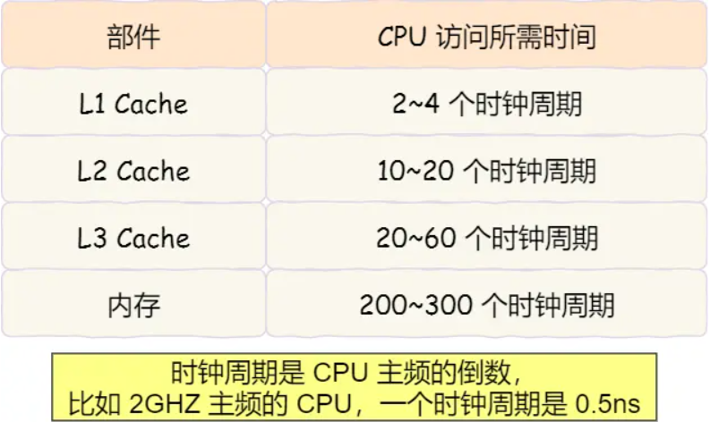
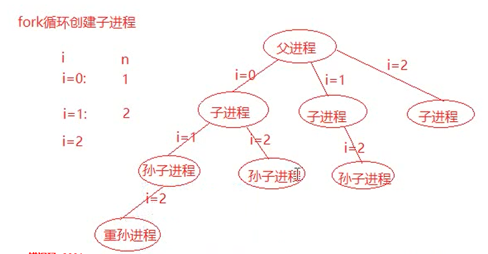
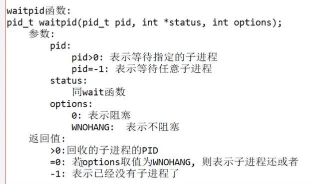

# 一、系统

## 1 CPU

### 1.1 32/64位的区别

CPU 想要操作「内存地址」就需要「地址总线」

* 如果地址总线只有1条，那每次只能表示「0 或 1」这两种地址，所以 CPU 能操作的内存地址最大数量为 2(2^1)个(注意，不要理解成同时能操作2个内存地址);

* 如果地址总线有2条，那么能表示 00、01、10、11 这四种地址，所以 CPU 能操作的内存地址最大数量为 4(2^2)个。

那么，想要 CPU 操作 4G 大的内存，那么就需要 32 条地址总线，因为`2^32 = 4G` 。

知道了线路位宽的意义后，我们再来看看 CPU 位宽。

CPU 的位宽最好不要小于线路位宽，比如 32 位 CPU 控制 40 位宽的地址总线和数据总线的话，工作起来就会非常复杂且麻烦，所以 32 位的 CPU 最好和 32 位宽的线路搭配，因为 **32 位 CPU 一次最多只能操作32 位宽的地址总线和数据总线**。

如果用 32 位 CPU 去加和两个 64 位大小的数字，就需要把这 2 个 64 位的数字分成 2 个低位 32 位数字和2 个高位 32 位数字来计算，先加个两个低位的 32 位数字，算出进位，然后加和两个高位的 32 位数字最后再加上进位，就能算出结果了，可以发现 32 位 CPU 并不能一次性计算出加和两个 64 位数字的结男

对于 **64 位 CPU 就可以一次性算出加和两个 64 位数字的结果**，因为 64 位 CPU 可以一次读入 64 位的数字,8个字节，并且 64 位 CPU 内部的逻辑运算单元也支持 64 位数字的计算。

但是并不代表 64 位 CPU 性能比 32 位 CPU 高很多，很少应用需要算超过 32 位的数字，所以如果计算的数额不超过 32 位数字的情况下，32 位和 64 位 CPU 之间没什么区别的，只有当计算超过 32 位数字的情况下，64 位的优势才能体现出来。

另外，**32 位 CPU 最大只能操作 4GB 内存**，就算你装了8GB 内存条，也没用。而 **64位 CPU 寻址范围则很大，理论最大的寻址空间为` 2^64`**。

32位和64位的还有一个区别就是**数据在内存对齐的方式不同**。

* 32位编译模式下，默认以4字节对齐。这意味着变量的存储地址应该是4的整数倍。例如，一个int类型的数据（通常占4个字节）在32位系统中，其存储地址可能是0、4、8、12等
* 64位编译模式下，默认以8字节对齐。这意味着变量的存储地址应该是8的整数倍。例如，一个double类型的数据（通常占8个字节）在64位系统中，其存储地址可能是0、8、16、24等。
* 编译器在编译程序时会自动处理内存对齐的问题。程序员也可以通过特定的编译器指令或属性来修改默认的对齐方式。

### 1.2 程序的执行过程：

* 
	第一步，CPU 读取「程序计数器」的值，这个值是指令的内存地址，然后 CPU 的「控制单元」操作「地址总线」指定需要访问的内存地址，接着通知内存设备准备数据，数据准备好后通过「数据总线将指令数据传给 CPU，CPU 收到内存传来的数据后，将这个指令数据存入到「指令寄存器」。
* 第二步，「程序计数器」的值自增，表示指向下一条指令。这个自增的大小，由CPU 的位宽决定，比如 32 位的 CPU，指令是4个字节，需要4个内存地址存放，因此「程序计数器」的值会自增 4;
* 第三步，CPU 分析「指令寄存器」中的指令，确定指令的类型和参数，如果是计算类型的指令，就把指令交给「逻辑运算单元」运算:如果是存储类型的指令，则交由「控制单元」执行;

简单总结一下就是，一个程序执行的时候，CPU 会根据程序计数器里的内存地址，从内存里面把需要执行的指令读取到指令寄存器里面执行，然后根据指令长度自增，开始顺序读取下一条指令。

CPU 从程序计数器读取指令、到执行、再到下一条指令，这个过程会不断循环，直到程序执行结束，这个不断循环的过程被称为 **CPU 的指令周期**。


### 1.3 存储器


### 1.4 CPU Cache

#### 1.4.1 **分类：**

* 为了弥补CPU与内存之间的性能差异，引入CPU Cache,也称高速缓存,CPU Cache 通常分为大小不等的三级缓存，分别是 **L1 Cache、L2 Cache 和 L3 Cache。**一般L1 Cache最小最快（32KB），、L2 Cache（128KB） L3 Cache最大最慢（256KB）。
* 其中，L1 Cache 通常会分为「数据缓存」和「指令缓存」，这意味着数据和指令在 L1 Cache 这一层是分开缓存的，它两的大小通常是一样的。
* 另外，L3 Cache比L1 Cache 和 L2 Cache 大很多，这是因为 L1 Cache 和 L2 Cache 都是每个 CPU 核心独有的，而 L3 Cache 是多个 CPU 核心共享的。

程序执行时，会先将内存中的数据加载到共享的 L3 Cache 中，再加载到每个核心独有的 L2 Cache，最后进入到最快的 L1 Cache，之后才会被 CPU 读取。


越靠近 CPU 核心的缓存其访问速度越快，CPU 访问 L1 Cache 只需要 2~4 个时钟周期，访问 L2 Cache大约 10~20个时钟周期，访问L3Cache 大约 20~60个时钟周期，而访问内存速度大概在 200~388 个时钟周期之间。




#### 1.4.2 **CPU Cache读取过程：**

CPU Cache 的数据是从内存中读取过来的，它是以一小块一小块读取数据的，而不是按照单个数组元素来读取数据的，在 CPU Cache 中的，这样一小块一小块的数据，称为 **Cache Line(缓存块)**

你可以在你的 Linux 系统，用下面这种方式来査看 CPU 的 Cache Line，你可以看我服务器的 L1 CacheLine 大小是 64 字节，也就意味着 L1 Cache 一次载入数据的大小是 64 字节。


比如，有一个 `int array[100]`的数组，当载入`array[0]`时，由于这个数组元素的大小在内存只占 4字节，不足 64 字节，CPU 就会**顺序加载**数组元素到 `array[15]`，意味着 `array[0]~array[15]`数组元素都会被缓存在 CPU Cache 中了，因此当下次访问这些数组元素时，会直接从 CPU Cache 读取，而不用再从内存中读取，大大提高了 CPU 读取数据的性能。

事实上，CPU 读取数据的时候，无论数据是否存放到 Cache 中，CPU 都是**先访问 Cache**，只有当 Cache中找不到数据时，**才会去访问内存**，并把内存中的数据读入到 Cache 中，CPU 再从 CPU Cache 读取数据。


这样的访问机制，跟我们使用「内存作为硬盘的缓存」的逻辑是一样的，如果内存有缓存的数据，则直接返回，否则要访问龟速一般的硬盘。

#### 1.4.3 CPU内存映射

那 CPU 怎么知道要访问的内存数据，是否在Cache 里?如果在的话，如何找到 Cache 对应的数据呢?

我们从最简单、基础的直接映射 Cache(Direct Mapped Cache) 说起，来看看整个 CPU Cache 的数据结构和访问逻辑。

* 直接映射就是把内存块的地址始终「映射」在一个 CPU Cache Line(缓存块)的地址，至于映射关系实现方式，则是使用「取模运算!，取模运算的结果就是内存块地址对应的CPUCache Line(缓存块)的地址。


## 2 内核：

计算机是由各种外部硬件设备组成的，比如内存、cpu、硬盘等，如果每个应用都要和这些硬件设备对接通信协议，那这样太累了，所以这个中间人就由内核来负责，让**内核作为应用连接硬件设备的桥梁**，应用程序只需关心与内核交互，不用关心硬件的细节


**内核的的能力：**现代操作系统，内核一般会提供 4 个基本能力：

* 管理进程、线程，决定哪个进程、线程使用 CPU，也就是进程调度的能力；
* 管理内存，决定内存的分配和回收，也就是内存管理的能力； 
* 管理硬件设备，为进程与硬件设备之间提供通信能力，也就是硬件通信能力；
* 提供系统调用，如果应用程序要运行更高权限运行的服务，那么就需要有系统调用，它是用户程序与操作系统之间的接口。


**内核工作：**

内核具有很高的权限，可以控制 cpu、内存、硬盘等硬件，而应用程序具有的权限很小，因此大多数操作系统，把内存分成了两个区域:

* 内核空间，这个内存空间只有内核程序可以访问；
* 用户空间，这个内存空间专门给应用程序使用；

用户空间的代码只能访问一个局部的内存空间，而**内核空间的代码可以访问所有内存空间**。因此，当程序使用用户空间时，我们常说该程序在**用户态**执行，而当程序使内核空间时，程序则在**内核态**执行。

应用程序如果需要进入内核空间，就需要通过系统调用，下面来看看系统调用的过程：


内核程序执行在内核态，用户程序执行在用户态。当**应用程序使用系统调用时，会产生一个中断**。发生中断后， CPU 会中断当前在执行的用户程序，转而跳转到中断处理程序，**也就是开始执行内核程序**。**内核处理完后，主动触发中断**，把 CPU 执行权限交回给用户程序，回到用户态继续工作。


### 2.1 Linux 的设计

Linux 内核设计的理念主要有这几个点!

* `MultiTask`，多任务；
* `SMP`，对称多处理
* `ELF`，可执行文件链接格式
* `Monolithic Kernel`，宏内核

**MultiTask**:
MultiTask 的意思是多任务，代表着 Linux 是一个多任务的操作系统。

多任务意味着可以有多个任务同时执行，这里的「同时」可以是并发或并行:

* 对于单核 CPU 时，可以让每个任务执行一小段时间，时间到就切换另外一个任务，从宏观角度看,段时间内执行了多个任务，这被称为并发。
* 对于多核 CPU 时，多个任务可以同时被不同核心的 CPU 同时执行，这被称为并行。


**SMP:**

* SMP 的意思是**对称多处理**，代表着每个 **CPU 的地位是相等的，对资源的使用权限也是相同的，多个 CPU共亨同一个内存，每个 CPU 都可以访问完整的内存和硬件资源。**
* 这个特点决定了 Linux 操作系统不会有某个 CPU 单独服务应用程序或内核程序，而是**每个程序都可以被分配到任意一个 CPU 上被执行**。


**ELF:**

ELF 的意思是可执行文件链接格式，它是 Linux 操作系统中可执行文件的存储格式，你可以从下图看到它的结构：


ELF 把文件分成了一个个分段，每一个段都有自己的作用,另外，ELF 文件有两种索引，Program header table 中记录了「运行时」所需的段，而 Section headertable 记录了二进制文件中各个「段的首地址」。


**Monolithic Kernel**：宏内核

* **Linux 内核架构就是宏内核，意味着 Linux 的内核是一个完整的可执行程序，且拥有最高的权限**。

* 宏内核的特征是系统内核的所有模块，比如进程调度、内存管理、文件系统、设备驱动等，**都运行在内核态**。

与宏内核相反的是**微内核**，微内核架构的内核只保留最基本的能力，比如进程调度、虚拟机内存、中断等，把一些应用放到了用户空间，比如驱动程序、文件系统等。这样服务与服务之间是隔离的，单个服务出现故障或者完全攻击，也不会导致整个操作系统挂掉，提高了操作系统的稳定性和可靠性。

还有一种内核叫**混合类型内核**，它的架构有点像微内核，**内核里面会有一个最小版本的内核**，然后其他模块会在这个基础上搭建，然后实现的时候会跟宏内核类似，也就是把整个内核做成一个完整的程序，大部分服务都在内核中，这就像是宏内核的方式包裹着一个微内核。


**windows内核设计：**

* Windows 和 Linux 一样，同样支持 MultiTask和 SMP，但不同的是，Window 的内核设计是**混合型内核**；

* Windows 的可执行文件的格式与 Linux 也不同，所以这两个系统的可执行文件是不可以在对方上运行的。
* Windows 的可执行文件格式叫 PE，称为可移植执行文件，扩展名通常是.exe、.d11 、.sys 等


### 2.2 虚拟内存

#### 2.2.1 虚拟内存的引入

**单片机的 CPU 是直接操作内存的「物理地址」**。


在这种情况下，要想**在内存中同时运行两个程序是不可能的**，因为两个程序都引用了物理地址。如果第一个程序在 2000 的位置写入一个新的值，将会擦掉第二个程序存放在相同位置上的所有内容，所以同时运行两个程序是根本行不通的，这两个程序会立刻崩溃。

因此：

* 可以把进程所使用的地址「隔离」开来，即**让操作系统为每个进程分配独立的一套「虚拟地址」**，人人都有，大家自己玩自己的地址就行，互不干涉。但是有个前提每个进程都不能访问物理地址

* 操作系统会提供一种机制，将不同进程的虚拟地址和不同内存的物理地址映射起来。
* 如果程序要访问虚拟地址的时候，由操作系统转换成不同的物理地址，这样不同的进程运行的时候，写入的是不同的物理地址，这样就不会冲突了。

于是，这里就引出了两种地址的概念：

* 我们程序所使用的内存地址叫做**虚拟内存地址**(Virtual Memory Address)
* 实际存在硬件里面的空间地址叫**物理内存地址**(Physical Memory Address)

操作系统引入了虚拟内存，进程持有的虚拟地址会通过 CPU 芯片中的内存管理单元(MMU)的映射关系，来转换变成物理地址，然后再通过物理地址访问内存，如下图所示:


* 内存是用来存放和交换数据的，虚拟内存是一种**内存管理技术**，它**允许操作系统在物理内存（RAM）不足时，将部分暂时不使用的数据或代码交换到磁盘（通常是硬盘或SSD）上，以此来扩展可用内存的大小**。
	* 将磁盘分为4KB大小一页的页面，一部分的页面会保存在内存中，当CPU对内存进行访问时，如果访问的页面不在内存中，可以从磁盘加载对应的部分。内存不够时也可以把长期不访问的页面保存到磁盘中，这种做法叫做虚拟内存
	* 将长期经常用的存放在虚拟内存的指令和数据会被系统分配虚拟地址；


例如：

* `mov REG, 1000`指令中的1000就是虚拟地址，内存管理单元MMU将虚拟地址转换为物理地址，通过总线就可以访问内存，内存从总线中获取物理地址，其对虚拟地址是不知道的


**地址转换**：

MMU为了进行地址转换，需要一个记录虚拟地址到物理地址页框的映射关系，即页表，对于下图虚拟内存有64kb，实际物理内存只有32KB，因此最多只有一半的页面在内存中。页面的映射没有顺序


#### 2.2.2 虚拟内存有什么作用

* 第一，**分配内存**：**虚拟内存可以使得进程对运行内存超过物理内存大小**，因为程序运行符合局部性原理，CPU 访问内存会有很明显的重复访问的倾向性，对于那些没有被经常使用到的内存，我们可以把它换出到物理内存之外，比如硬盘上的 swap 区域。
* 第二，**防止进程间相互影响**：由于**每个进程都有自己的页表，所以每个进程的虚拟内存空间就是相互独立的**。进程也没有办法访问其他进程的页表，所以这些页表是私有的，这就解决了多进程之间地址冲突的问题。
* 第三，**提高安全性：**页表里的页表项中除了物理地址之外，还有一些标记属性的比特，比如控制一个页的读写权限标记该页是否存在等。在内存访问方面，操作系统提供了更好的安全性。


#### 2.2.3 内存申请

应用程序通过 malloc 函数申请内存的时候，实际上申请的是虚拟内存，此时并不会分配物理内存。

当应用程序**读写了这块虚拟内存**，CPU 就会去访问这个虚拟内存，这时会发现这个虚拟内存没有映射到物理内存，CPU 就会产生**缺页中断**，进程会从用户态切换到内核态，并将缺页中断交给内核的 Page FaultHandler(缺页中断函数)处理。

缺页中断处理函数会看是否有空闲的物理内存:

* 如果有，就直接分配物理内存，并建立虚拟内存与物理内存之间的映射关系
* 如果没有空闲的物理内存，那么内核就会开始进行回收内存区 的工作，如果回收内存工作结束后，空闲的物理内存仍然无法满足此次物理内存的申请，那么内核就会放最后的大招了触发 OOM(Out ofMemory)机制。

在不同的系统中，申请的内存大小超过实际内存大小：

* 在 32 位操作系统，因为进程最大只能申请3 GB 大小的虚拟内存，所以直接申请 8G 内存，会申请失败。
* 在 64 位操作系统，因为进程最大只能申请 128 TB 大小的虚拟内存，即使物理内存只有 4GB，申请 8G内存也是没问题，因为申请的内存是虚拟内存。

程序申请的虚拟内存，如果没有被使用，它是不会占用物理空间的。当访问这块虚拟内存后，操作系统才会进行物理内存分配。

如果申请物理内存大小超过了空闲物理内存大小，就要看操作系统有没有开启 Swap 机制:

* 如果没有开启 Swap 机制，程序就会直接 OOM；
* 如果有开启 Swap 机制，程序可以正常运行。


## 2 进程和线程

* 程序：编译好的二进制文件，在磁盘上，是一个静态的概念。

* 进程：一个启动的程序，是资源分配的基本单位，占用系统资源，一个进程都有自己的PID。

	* 每个进程在内核中都有一个进程控制块（PCB）来维护进程相关的信息，linux内核的进程控制块是task_struct结构体。

	* 进程控制块在内核中的进程控制区域中

	* task_struct中包含：

		* PID

		* 进程的状态（就绪、运行、挂起、停止）

		* 进程切换所需要保存和恢复的一些CPU寄存器

		* 描述虚拟地址空间的信息

		* 描述控制终端的信息

		* 当前的工作目录

			* getcwd -pwd :获取当前目录

		* umask掩码

			* 创建目录的默认权限 **drwxrwxrwx**,可以通过umask/chmod进行更改

		* 文件描述符表，包含很多指向file结构体的指针

		* 信号相关的信息

		* 用户id和组id

		* 会话和进程组

			* PPID：父进程ID
			* PID：进程ID
			* PGID：组ID，当一个进程创建了好多个子进程后，处于同一簇
			* SID：会话ID

			

		* 进程使用的资源上限

			* ulimit -a
				* stack size:栈控件大小
				* max user processes：最大线程数

			

		线程：程序执行的基本单位

* 同一个程序可以加载为不同的进程

### 1.1.1 并发和并行

* 并发：在一个时间段内，在同一个CPU上，同时运行多个程序。
	* 每一个时间段都可以分为很多时间片，每个进程轮流的使用时间片（时间轮转），一个时间片内只能有一个进程执行
* 并行：两个及两个以上的程序在同一时刻（同一个时间片内）发生

​	进程的优先级：系统进程最高，因此对于进程来说，并不是


### 1.1.2 进程切换

* **一个进程切换到另一个进程运行，称为进程的上下文切换**。
* 进程是由内核管理和调度的，所以**进程的切换只能发生在内核态**。所以，进程的上下文切换不仅包含了虚拟内存、栈、全局变量等用户空间的资源，还包括了内核堆栈、密存器等内核空间的资源。
* 通常，会把**交换的信息保存在进程的 PCB**，当要运行另外一个进程的时候，我们需要从这个进程的 PCB取出上下文，然后恢复到 CPU 中，这使得这个进程可以继续执行。


**进程上下文切换有哪些场景:**


* 不可忽略或捕捉的信号—**SIGSTOP和SIGKILL**
	*  当信号发生时，忽略信号几乎适用于所有的信号，不过有两个信号除外，SIGSTOP和SIGKILL。

```shell
# kill -SIGSTOP -ID  //让进程暂停进入挂起状态
#kill -SIGCONT -ID //让程序继续执行
```


### 1.1.3 线程切换

* **线程是进程当中的一条执行流程**

* 同一个进程内多个线程之间可以共享代码段、数据段、打开的文件等资源，但每个线程各自都有一套独立的寄存器和栈，这样可以确保线程的控制流是相对独立的。

* 当进程中的一个线程崩溃时会导致其所属进程的所有线程崩溃，这里**仅针对 C/C++语言**


**切换：**

对于线程和进程，我们可以这么理解:

* 当进程只有一个线程时，可以认为进程就等于线程;
* 当进程拥有多个线程时，这些**线程会共享相同的虚拟内存和全局变量等资源，这些资源在上下文切换时是不需要修改的**;

这还得看线程是不是属于同一个进程:

* 当两个线程不是属于同一个进程，则切换的过程就跟进程上下文切换一样;
* 当两个线程是属于同一个进程，因为虚拟内存是共享的，所以在**切换时，虚拟内存这些资源就保持不动，只需要切换线程的私有数据、寄存器等不共享的数据;**


## 3 fork创建子进程函数

* 函数作用：创建子进程
* 原型：pid t fork(void)
	* 函数参数：无
	* 返回值：进程PID
* 原理：fork函数会**复制**当前进程的内存空间及数据（包括堆栈、数据段、代码段等），PCB也会复制。只不过一些PID等信息会变。新创建的子进程几乎与父进程完全相同，包括环境变量、打开的文件描述符、工作目录等，但是它们有一些关键的区别，如 PID、PPID（父进程 ID）、以及其他一些与进程执行相关的状态信息。
* **该函数调用一次，但是返回两次**，两次返回的区别是**子进程的返回值是0**，**父进程的返回值>0**


```c
#include<stdio.h>
#include<stdlib.h>
#include<string.h>
#include<sys/types.h>
#include<unistd.h>

int main(){
        //sonprocesser
        pid_t pid = fork();
        if(pid<0){
                perror("fork error");
                return -1;
        }else if(pid>0){
                printf("father:[%d],pid==[%d],fpid = [%d]\n",pid,getpid(),getppid());
        }else if(pid == 0){
                printf("child:pid == [%d]\n,fpid = [%d]\n",getpid(),getppid());
        }
        return 0;
}
```

当父进程创建完子进程，父进程与子进程谁先抢到cpu谁先执行，而父进程先死掉，子进程会变为孤儿进程，被一号进程领养。

vim:删除所有内容（普通模式下ggdG）


循环创建子进程：

```c
#include<stdio.h>
#include<stdlib.h>
#include<string.h>
#include<sys/types.h>
#include<unistd.h>
int main(){
        //sonprocesser
        for(int i = 0;i<3;i++){
                pid_t pid = fork();
                if(pid<0){
                        perror("fork error");
                return -1;
                }else if(pid>0){
                        printf("father:[%d],pid==[%d],ppid = [%d]\n",pid,getpid(),getppid());
                }else if(pid == 0){
                        printf("child:pid == [%d],fpid = [%d]\n",getpid(),getppid());
                    	//break;
                }
        }
        return 0;
}
```

对于循环创建子进程的结果来看：

* 代码循环了三次，但是创建了7个子进程，且**父进程不完全相同，子进程也会创建子进程**


* 这是由于**子进程由父进程复制而来，代码段是完全相同的**，因此子进程也会创建子进程
* 因此第i次创建的进程个数是2^(i)，总共n次创建的进程个数是2^(n)，子进程个数2^(n)-1。
* 这里只需要在if(pid == 0)判断子进程中break即可。



* 子进程尽管是复制父进程的，**代码段相同，但是两个进程的虚拟内存空间相互独立**，地址发生改变。**子进程与父进程不共享全局变量**，即虽然在两个进程中的**全局变量地址相同**，但是父进程/子进程修改变量时是不会影响另一个进程的。
	* 这里如果是对变量进行**读**操作，那么两个全局变量地址相同，是映射的一片空间。
	* 但是如果父进程要对全局变量进行修改等操作，**系统会自动拷贝一份全局变量作为副本，然后对副本进行操作**，操作完成后将副本再映射回去给父进程，子进程要进行修改时，情况相同。
		* 这里这么做的主要目的还是节省内存，当有一片很大的结构体时


### **1.2.1 ps与kill命令**


## **4 exec函数族**

* 有的时候需要**在一个进程里面执行其他的命令或者是用户自定义的应用程序**,此时就用到了exec 函数族当中的函数，
* 使用方法一般都是**在父进程里面调用fork 创建子进程，然后在子进程里面调用exec函数拉起可执行程序**。


* 这里一般excel()比较适合执行自己写的执行文件（.exe/.c/.cpp等）
* excelp()比较适合执行系统指令（ls、ps等），因为指令的环境变量肯定已经加载了
	* 路径可以用which ls查看

```c
int execl(const char*path,const char *arg,.../*(char *)NULL*/
int execl("./bin.usr","ls","-l",NULL);
```

假设要再子进程中查看当前列表信息，调用execl函数以后，**子进程的代码段会被ls命令的代码替换掉**，此时**子进程的地址空间与PID不发生变化**，而代码段发生了替换，堆栈的中数据也会被替换，新的代码需要适应当前的环境。

```c
pid  = fork();
if(pid == 0){ //子进程pid == 0
    execl("./test","test","hello","nihao","666");  //test hello nihao 666
    execlp("ls","ls","-l",NULL);
}
```


## 5 进程回收

​       当一个进程退出之后,进程能够回收自己的用户区的资源,但是**不能回收内核空间的PCB资源**，必须由它的父进程调用 wait 或者 waitpid函数完成对子进程的回收，避免造成系统资源的浪费。

### 1.4.1、孤儿进程

* 概念
	* 若子进程的父进程已经死掉，而子进程还活着，这就是孤儿进程
* 为了保证每一个子进程都有一个父进程，孤儿进程会由init进程(1号进程)领养，当父进程退出后，由init进程循环wait()完成对孤儿进程资源的回收。
* 这种机制确保了即使父进程已经终止，子进程也不会变成僵尸进程

### 1.4.2、僵尸进程

* 概念：

	* 僵尸进程是指那些已经完成了执行（即已经调用了`exit()`），但仍在进程表中占有一个条目的进程。这些进程的进程描述符仍然存在，因为它们的退出状态还没有被其父进程读取（通过`wait()`或`waitpid()`系统调用）。

	* 正常来说，所有进程的子进程都会进入僵尸进程的状态。操作系统会为死掉的进程，保存一部分进程信息，类似PID这种信息，以供父进程查看，当父进程不想用了，便应该定期发起回收僵尸进程的操作。但是如果没有进行回收，僵尸进程就会累积，会出现大量的无效的pid占用，这样的话就会出现，cpu资源够用，内存资源够用，但是没办法开启新的进程。


* 概念
	* 已经结束了但是还不能释放的**子进程**为僵尸进程，当进程后面出现<defunct>时，该进程就是僵尸进程。
	* 僵尸进程虽然运行实体消失，但是仍然在内核的进程表中占据一条记录
		* 子进程退出之后**父进程没有调用wait/waitpid获取子进程的状态信息**，没有完成对子进程的回收，**子进程的进程描述符仍然保存在系统**中，就不会被释放
	* 僵尸进程不能被kill -9命令杀死，因为是已经死掉的进程
* 处理进程
	* 对于僵尸进程临时的处理可以**将其父进程杀死，然后其会被init进程领养，由init进程瞬间释放**。
	* 利用**wait函数**回收子进程：子进程退出时向父进程发送SIGCHILD信号，父进程处理SIGCHILD信号，调用wait()或者waitpid()，让父进程阻塞等待僵尸进程的出现，处理完再继续运行父进程
		* 函数原型
			* pid_t wait(int *status);
		* 函数作用
			* 阻塞并等待子进程退出
			* 回收子进程残留资源
			* 获取子进程的结束状态
		* 返回值
			* 成功：清理掉的子进程ID
			* 失败：-1（没有子进程）

```c
#include<stdio.h>
#include<stdlib.h>
#include<string.h>
#include<sys/types.h>
#include<unistd.h>
#include<sys/wait.h> //头文件

int main(){
        //sonprocesser
        pid_t pid = fork();
        if(pid<0){
                perror("fork error");
                return -1;
        }else if(pid>0){
                printf("father:[%d],pid==[%d],fpid = [%d]\n",pid,getpid(),getppid());
            	int status;
                pid_t wpid = wait(&status);  //当存在子进程时。阻塞等待回收
                printf("wpid == [%d]",wpid);
            	if(WIFEXITED(status)) //正常退出
                {
					printf("child normal exit,satus == [%d]\n",WEXITSTATUS(status));
                }else if(WIFSIGNALED(status)){ //被信号杀死
					printf("child killed by signal,status == [%d]\n",WTERMSIG(status));
                }
        }else if(pid == 0)
        {      
                printf("child:pid == [%d]\n,fpid = [%d]\n",getpid(),getppid());
                execlp("ls","-l",NULL);
                sleep(5);
        }
        return 0;
}
```


* waitpid函数




```c
#include<stdio.h>
#include<stdlib.h>
#include<string.h>
#include<sys/types.h>
#include<unistd.h>
#include<sys/wait.h> //头文件

int main2  (){
        //sonprocesser
        pid_t pid = fork();
        if(pid<0){
                perror("fork error");
                return -1;
        }else if(pid>0){
                printf("father:[%d],pid==[%d],fpid = [%d]\n",pid,getpid(),getppid());
				int status;
				//pid_t wpid = wait(&status);
				pid_t wpid = waitpid(pid,&status,0);  //等同于wait
				pid_t wpid = waitpid(-1,&status,0);  //-1表示等待任意子进程，WNOHANG：不阻塞
                printf("wpid == [%d]",wpid);
            	if(wpid>0){    //wpid>0才能判断子进程的状态
					if(WIFEXITED(status)) //正常退出
                	{
						printf("child normal exit,satus == [%d]\n",WEXITSTATUS(status));
                	}else if(WIFSIGNALED(status)) //被信号杀死
                    { 
						printf("child killed by signal,status == [%d]\n",WTERMSIG(status));
                	}
                }
            	else if(wpid == 0){  //子进程还活着
                    printf("child is exit,wpid == [%d]\n",wpid);
                }
            	else if(wpid<0){ //子进程死光了
					printf("no child is exit,wpid == [%d]\n",wpid);
                }
        }
        else if(pid == 0)
        {      
                printf("child:pid == [%d]\n,fpid = [%d]\n",getpid(),getppid());
                execlp("ls","-l",NULL);
                sleep(5);
        }
        return 0;
}
```


## 6 进程通信

* 塾练使用 pipe 进行父子进程间通信
* 熟练使用 pipe 进行兄弟进程间通信
* 熟练使用fifo进行无血缘关系的进程间通信
* 使用mmap,进行有血缘关系的进程间通信
* 使用 mmap,进行无血缘关系的进程间通信


### 1.5.1、管道通信

#### 1.5.1.1、匿名管道

* 管道通信是最基本的IPC机制，也称匿名管道，应用于**有血缘关系的进程**之间，完成数据传递。
* 匿名管道是半双工的，同一时间内，它只能用于单向通信
	* **亲缘关系的进程之间共享文件描述符**。当创建管道时，操作系统会为管道分配两个文件描述符，一个用于读操作，另一个用于写操作。这些文件描述符是在进程的用户空间中创建的，并且**只能被创建它们的进程及其子进程访问**。对于通过fork函数创建的**子进程，它会继承父进程的文件描述符，因此可以访问和操作相同的管道**。
		* 管道要在创建子进程之前创建才可以访问。
* 调用pipe函数即可创建一个管道


* 管道的本质是一块**内存缓冲区**，内部使用**环形队列**实现
	* 默认缓冲区大小为4K，可以使用ulimit-a获取大小，实际上缓冲区大小会随数据压力做适当调整。
* 由两个文件描述符引用，一个表示读端，一个表示写端。
* 规定数据从管道的写端流入管道，读端流出，**且流动是单向的**。
	* 当进程A的数据进入管道，被进程B读出以后，**管道中的数据就没有了**，主要是为了防止管道满了。
* 当两个进程都终结的时候，管道也自动消失
* **管道的读端和写端默认都是阻塞的。**
	* write()函数写满了会阻塞，read()函数没有数据会阻塞。
	* 一个进程同时拥有管道的读端和写端文件描述符，那么在执行读写操作时可能会产生混淆或错误
		* 因此，**通信双方的进程写数据的一方需要把fd[0]先close掉，读的一方需要把fd[1]close掉**

##### 1、pipe函数

```C++
int pipe(int fd[2]); 
//创建一个管道，并将两个文件描述符（一个用于读，一个用于写,由内核提供）放在fd数组中。fd[0]通常用于读操作，而fd[1]用于写操作。
int pipe(int *fd);
```

* 先创建管道

* 再创建子进程
* 父进程关闭fd[0]（读），然后进行write
* 子进程关闭fd[1]（写），然后进行read

```c
#include<stdio.h>
#include<stdlib.h>
#include<string.h>
#include<sys/types.h>
#include<unistd.h>


int main(){
        //pipe创建管道，进程描述符由内核提供
        //int pipe(int fd[2]);
        int fd[2];
        int ret = pipe(fd);
        if(ret<0){
                perror("pipe error");
                return -1;
        }
        //fork()：创建子进程
        pid_t pid = fork();
        if(pid<0){
                perror("fork error");
                return -1;
        }else if(pid > 0){
                close(fd[0]); //父进程先关闭读
                write(fd[1],"hello world",strlen("hello world");
        }else if(pid == 0){
                close(fd[1]); //子进程先关闭写
                char buf[64];
                memset(buf,0x00,sizeof(buf)); //数组初始化
                int n = read(fd[0],buf,sizeof(buf)); //当管道没有数据时阻塞，即使子进程先执行没有数据也会阻塞
            	printf("read over,n==[%d],buf == [%s]\n",n,buf);            
        }
        return 0;
}
```


##### 2、| grep

在linux中，利用|grep来充当管道，主要利用了重定向技术。

```shell
ps aux | grep bash
```

* 先将ps aux在在终端的输出结果（标准输出 /dev/tty）先重定向到管道的写端fd[1]，也就是说不再往标准输出写了。
	* 重定向,dup2(fd[1],STDOUT_FILENO);
* 最终再利用重定向将下一个命令的标准输入重定向到管道读端fd[0]，最终输出在屏幕上。
	* dup2(fd[0],STDOUT_FILENO);

* 在UNIX和Linux中，每个进程都有三个文件描述符：stdin（文件描述符0）、stdout（文件描述符1）和stderr（文件描述符2）。
* 当您使用管道（`|`）时，shell会创建一个匿名管道，并将前一个命令的stdout重定向到管道的写端（write end），然后将下一个命令的stdin重定向到管道的读端（read end）。
	* **stdin（标准输入，文件描述符0）**
	* **stdout（标准输出，文件描述符1)**
	* **stderr（标准错误输出，文件描述符2）**

**利用c语言实现ps aux | grep bash：**

* execlp函数和dup2重定向


##### 3、管道的读写操作

**读操作：**

* 有数据：
	* 正常读，返回读出的字节数
* 无数据
	* 写端全部关闭
		* read解除阻塞，返回0，相当于读文件读到了尾部
	* 写端没有全部关闭
		* read阻塞，直到有数据写入管道或者所有的写端都被关闭

**写操作：**

* 读端全部关闭
	* 管道破裂，进程终止，内核会给进程发送信号
		* 匿名管道是单向的，有一个明确的读端和一个写端，如果允许写端在没有任何读端的情况下继续写入数据，那么这些数据将永远无法被读取，从而导致系统资源的浪费。为了避免这种情况，**操作系统**采取了措施来防止这种无意义的写入操作。
* 读端没有全部关闭
	* 缓冲区写满了
		* write阻塞
	* 缓冲区没有满
		* 继续write


#### 1.5.1.2、命名管道

通过命名管道（FIFO），**不具有血缘关系**的进程也能交换数据。

FIFO 是 Linux基础文件类型中的一种(文件类型为 p，可通过ls -l查看文件类型)。但 FIFO 文件在磁盘上**没有数据块，文件大小为0**，仅仅用来**标识内核中一条通道**。进程可以打开这个文件进行read/write，实际上是在**读写内核缓冲区**，这样就实现了进程间通信。


创建管道：

* 使用命令 mkfifo
	* 命名格式：mkfifo 管道名
		* 当mkfifo创建管道后
* 使用函数接口
	* int mkfifo(const char *pathname,mode_t mode)；
		* pathname：即将创建的FIFO文件路径，如果文件存在需要先删除
		* mode：和open的参数相同。
	* 参数说明和返回值可以查看man 3 mkfifo

* 当**创建了一个FIFO文件，就会为其分配一块内核缓冲区，操作时不能直接操作内核缓冲区，必须通过操作FIFO文件**。
* 创建完成后，就可以使用open函数打开它，常见的I/O函数都可用与FIFO，入close、read、write、unlink等
* **FIFO严格遵守先进先出**（队列），对FIFO 的**读总是从开始处返回数据**，对它们的**写则把数据添加到末尾**。它们不支持诸如lseek()等文件定位操作。
	* 当数据被写入 FIFO 时，它会在 FIFO 的末端添加。而当有进程从 FIFO 中读取数据时，它会从 FIFO 的开始处获取数据。

##### FIFO

实现任意两个进程之间的通信

* 进程A：
	* 创建一个fifo文件：mkfifo领命，或者函数
	* open  fifo文件---获得一个文件描述符
	* write(fd,"xxx",...)----写fifo文件
* 进程B：
	* 打开fifo文件----获得文件描述符fd
	* 读fifo文件，---read（fd,buf,sizeof(buf));
	* close(fd)----关闭fifo文件

​	**写文件：**启动时优先启动写文件

```c
#include<stdio.h>
#include<stdlib.h>
#include<string.h>
#include<sys/types.h>
#include<unistd.h>
#include<sys/stat.h> // man 2 open
#include<fcntl.h>

int main(){
	//创建fifo文件
	int ret = mkfifo("./myfifo",0777);
	if(ret<0){
		perror("mkfifo error");
		return -1;
	}
	//打开FIFO文件
	int fd = open("./myfifo",O_RDWR);
	if(fd < 0){
		perror("open error");
		return -1;
	}
	//写fifo文件-->写完不能关闭文件
	write(fd,"hello world",strlen("hello world"));	
	return 0;	
}
```

**读文件：**

```c
#include<stdio.h>
#include<stdlib.h>
#include<string.h>
#include<sys/types.h>
#include<unistd.h>
#include<sys/stat.h> // man 2 open
#include<fcntl.h>

int main(){
	//打开FIFO文件
	int fd = open("./myfifo",O_RDWR);
	if(fd < 0){
		perror("open error");
		return -1;
	}
	//读fifo文件
	char buf[64];
	memset(buf,0x00,sizeof(buf));
	itn n = read(fd,buf,sizeof(buf));
	//关闭文件
	close(fd);
	return 0;	
}
```


#### 1.5.1.3 内存映射区

​		存储映射 I/0(Memory-mapped l/0)使一个**磁盘文件与存储空间中的一个缓冲区相映射**。从缓冲区中取数据，就相当于读文件中的相应字节;将数据写入缓冲区，则会将数据写入文件。这样，就可在不使用read和write 函数的情况下，使用地址(指针)完成 I/0 操作。
使用存储映射这种方法，首先应通知内核，将一个指定文件映射到存储区域中。这个映射工作可以通过mmap函数来实现，当映射完毕后就可以直接操作内存。


##### mmap函数与munmap函数

函数原型：

* void mmap(void *addr,size_t lenth,int port,int flags,int fd,off_t offset)；

返回值：

* 成功：**返回创建的映射首地址**
* 失败：MAP_FAILED宏

参数：

* addr: 指定映射的起始地址，通常为NULL，由系统指定
* length:映射到内存的文件长度
* port:映射区的保护方式
	* 读：PORT_READ
	* 写：PORT_WRITE
	* 读写：PORT_READ | PORT_WRITE
* flags：映射区的特性
	* MAP_SHARED：写入映射区的数据会写入文件，且允许其他映射文件共享
	* MAP_PRIVATE:对映射区的修改不会对文件产生影响。
* fd：打开的文件描述符
	* fd = open();
* offset：从文件的那个位置开始映射，一般传0。


```c
#include<stdio.h>
#include<stdlib.h>
#include<string.h>
#include<sys/types.h>
#include<unistd.h>
#include<sys/stat.h> // man 2 open
#include<fcntl.h>

int main(){
	//void mmap(void *addr,size_t lenth,int port,int flags,int fd,off_t offset)；
    int fd = open("./test.log",O_RDWR);
    if(fd<0){
		perror("open fail");
        return -1;
    }
    int len = lseek(fd,0,SEEK_END);
    
	void *addr = mmap(NULL,len,PORT_READ | PORT_WRITE,MAP_SHARED,fd,0);
    pid_t pid = fork();
    if(pid<0){
		perror("fork error");
        return -1;
    }else  
}
```


### 1.5.2、信号

* 信号也是为了进程间进行通信，进程A先**发送给内核**，内核给进程B发送信号，当进程B收到信号后，**不管程序执行到程序的什么位置，都要暂停运行，去处理信号（信号的优先级高），**处理完毕后再继续执行。信号时软件层面上实现的终端，早期被成为软中断。
* **每个进程收到的所有信号都是由内核负责发送的**。


#### 1.5.2.1、信号的状态


#### 1.5.2.2、信号的处理方式

* 执行默认动作
* 忽略信号（丢弃不处理）
* 捕捉信号（调用户的自定义的处理函数）


#### 1.5.2.3、信号的特质

信号的实现方式决定了信号有很高的延时性，但是对于用户来说时间很短暂。

linux中内核的进程控制块PCB是一个结构体，task_struct除了包含进程id、状态、工作目录、用户id，组id，文件描述符，还包含了信号相关的信息，主要**指阻塞信号集和未决策信号集**。

#### 1.5.2.4、信号的相关函数

**signal函数**：

* 函数作用：注册信号捕捉函数
* 函数原型：
	* typedef void (*sighandler_t)(int)
	* sighandler_t signal(int signum,sighandler_t handler)
* 参数：
	* signum:信号编号
	* handler：信号处理函数

案例：

* 先创建pipe管道，创建出内核缓冲区
* 内核产生信号发送给进程

```C
#include<stdio.h>
#include<stdlib.h>
#include<string.h>
#include<sys/types.h>
#include<unistd.h>
#include<fcntl.h>
//信号处理函数
void sighandler(int signo){
	printf(" signo == [%d] ",signo); //打印信号编号
}
int main(){
        //pipe创建管道，进程描述符由内核提供
        //int pipe(int fd[2]);
        int fd[2];
        int ret = pipe(fd);
        if(ret<0){
                perror("pipe error");
                return -1;
        }
    	//创建SIGPIPE信号处理函数
    	signal(SIGPIPE,sighandler);  //内核产生信号，发送给当前进程
    	close(fd[0]);
    	write(fd[1],"hello world",strlen("hello world"));
    	return 0;
}
```


## 7 守护进程

Daemon(精灵)进程：

* 是linux中的**后台服务进程**（1号进程），通常**独立于控制终端**并且**周期性的执行某种任务**或者等待处理某些发生的事件。一般采用以d结尾的，如vsftpd。
* Linux的大多数服务器就是用守护进程的方式实现的，如web服务器进程http等
* Linux后台的一些系统服务进程，没有控制终端，不能和用户进行交互。一直运行着，不受用户登录注销影响，其都是守护进程。如：与读入缓输出机制的实现，ftp服务器，nfs服务器等

特点：

* Linux后台服务进程
* 独立于控制终端
* 周期性的执行某种任务
* 不受用户登录和注销的影响
* 一般采用d结尾的名字

### 1.6.1、进程组和会话

**进程组：**

* 进程组是一个或多个进程的集合，每个进程都属于一个进程组，引入进程组是为了方便管理进程，当父进程创建子进程的时候，默认子进程与父进程属于同一个进程组。
* 进程组 ID==第一个进程 ID(组长进程)。如父进程创建了多个子进程，父进程和多个子进程同属于一个组，而由于父进程是进程组里的第一个进程，所以父进程就是这个组的组长，组长ID==父进程ID。
* 可以使用 kil -SIGKILL-进程组 ID(负的)来将整个进程组内的进程全部杀死。
* 只要进程组中有一个进程存在，进程组就存在，与组长进程是否终止无关。
* 进程组生存期:从进程组创建到最后一个进程离开

**会话：**

* 一个会话是一个或多个进程组的集合。
* **创建会话的进程不能是进程组组长（父进程）**
* 创建会话的进程成为一个进程组的组长进程，同时也成为会话的会长。
* 需要有 root 权限(ubuntu不需要)
* 新创建的会话丢弃原有的控制终端
* 建立新会话时，先调用 fork，父进程终止，子进程调用setsid函数


### 1.6.2、守护进程的创建

**1、fork创建子进程，父进程退出**

* 子进程继承了父进程的进程组ID,但具有一个新的进程ID,这样就保证了子进程不是一个进程组的组长ID,这对于下面要做的setsid 函数的调用是必要的前提条件

**2、子进程调用setsid函数创建新会话**

* 调用该函数
	* 该子进程会成为新会话的首进程，是会话的会长
	* 成为一个新进程组的组长进程，是进程组组长
	* 不受控制终端的影响

3、改变当前工作目录 chdir

* 如:a.out在U盘上，启动这个程序，这个程序的当前的工作目录就是这个盘，如果u盘拔掉后进程的当前工作目录将消失，a.out 将不能正常工作。
* 这一**步骤可省略**，只要保证当前工作目录一直在就可以

4、重设文件掩码 mode&~umask

* 文件掩码用来在创建文件时计算文件权限
* 子进程会继承父进程的掩码
* 增加子进程程序操作的灵活性
* umask(0000);
* 这一**步骤可省略**。一般的用户权限为0002

5、关闭文件描述符

* 守护进程不受控制终端的影响所以可以关闭，以释放资源
* close(STDIN_FILENO);
* close(STDOUT_FILENO)；
* close(STDERR_FILENO);
* 内核分配文件描述符是按照最小未被使用来分配的。

**6、执行核心工作**

* 守护进程的核心代码逻辑


**案例：**

每隔2s钟获取获取一次系统时间，并将时间写入磁盘文件，

* 首先要按照1.3介绍的守护进行的步骤创建一个守护进程，
* 每隔2S钟:使用setitimer函数设置时钟，该时钟发送的是SIGALRM信号，
* 信号操作:注册信号处理函数,signal或者sigaction，
* 还有一个信号处理函数获取一次系统时间:time函数的使用，ctime函数的使用
* 写入磁盘文件:文件操作函数:open write close

```c
#include<stdio.h>
#include<stdlib.h>
#include<string.h>
#include<sys/types.h>
#include<unistd.h>
#include<signal.h>
#inlcude<time.h>
#include<fcntl.h>
#inlcude<sys/time.h>
myfunc(){
    //打开文件
    int fd = open("mydemo.log",O_RDWR|O_CREAT);
    if(fd<0){
		return;
    }
    //获取当前工作时间
    time_t t;
    time(&t);
    char *p = ctime(&t);
    close(fd);
    return;
}
int main(){
	//父进程创建子进程，父进程退出
    pid_t pid = fork();
    if(pid < 0 || pid>0){
        exit(0);
    }
    //子进程调用setsid函数创建会话
    setsid();
    //改变工作目录
    chdir("/home/user_wang/test");
    //改变文件掩码
    umask(0000);
    //关闭标准输入，输出和错误文件描述符
    close(STDIN_FILENO);
	close(STDOUT_FILENO)；
	close(STDERR_FILENO);
    //核心操作
    //注册信号处理函数
    struct sigaction act;
    act.sa_handler = myfunc;
    act.sa_flags = 0;
    sigemptyset(&act.sa_mask);
    sigaction(SIGALRM,&act,NULL);
    
    //设置时钟信号
    struct itimerval tm;
    tm.it interval.tv_sec = 2;
    tm.it interval.tv_usec =0
    tm.it_value.tv_sec = 3;
    tm.it_value.tv_usec =0;
	setitimer(ITIMER_REAL, &tm, NULL);
    
    while(1){
		sleep();
    }
    return 0;
}
```


## 8 线程

* 轻量级的进程(LWP:light weightprocess)，在Linux环境下线程的本质仍是进程。
* 进程:拥有独立的地址空间，拥有PCB，相当于独居。
* 线程:有 PCB，但没有独立的地址空间，多个线程共享**进程空间**,共享进程中定义的**全局变量**，相当于合租。
* 创建进程与创建线程都采用了clone函数**，创建进程是复制空间，创建线程是共享空间。**
	* ps -Lf 进程id
	* 可以查看该进程下由多少个线程


线程共享资源

* 文件描述符表
* 每种信号的处理方式
* 当前工作目录
* 用户 ID 和组 ID
* 内存地址空间(text/.data/.bss/heap/共享库)

线程非共享资源:

* **线程 id**
* **处理器现场和栈指针**(内核栈)
* **独立的栈空间(**用户空间栈)
* errno 变量
* 信号屏蔽字
* 调度优先级

线程的优点：

* 提高程序并发性
* 开销小
* 数据通信、共享数据方便


### **pthread_create()**

作用：

* 创建线程

原型：

* ```c
	int pthread_create(pthread_t *thread,const pthread_attr_t *attr, void *(*routine)(void*),void *arg)
	```

	* pthread_t：传出参数，**标识线程**，保存系统为我们分配好的**线程ID**，当前Linux中可理解为：typedef unsigned long int pthread_t。

	* attr：通常传NULL，表示使用线程默认属性。若想使用具体属性也可以修改该参数。

	* start_routine：函数指针，指向线程主函数(**线程体**)，该函数运行结束，则线程结束。

	* arg：线程主函数执行期间所使用的参数。

返回值

* 成功，返回0
* 失败，返回错误号

常用的函数：

* pthread_t pthread_self();  //获得线程ID并打印

注意：不能在一个线程中调用exit或者_exit，整个进程的所有线程都会退出。

```C
#include<stdio.h>
#include<stdlib.h>
#include<string.h>
#include<sys/types.h>
#include<unistd.h>
#include<pthread.h>
struct Test{
    int data;
    char name[64];
}

void *mythread(void *arg){
    struct Test *p = (struct Test *)arg; //接收自定义类型
    //int n = *(int *)arg; //接收基本数据类型
    printf("[%d][%s]",t->data,t->name);
    printf("child thread, pid = [%d],id ==[%ld]\n",getpid(),pthread_self()); //打印当前进程ID与线程ID
}

// int pthread_create(pthread_t *thread,const pthread_attr_t *attr, void *(*routine)(void*),void *arg)
int main(){
    Test t;
    t.data = 10;
    memset(&t,0x00,sizeof(struct Test));
    strcpy(t.name,"hello");
    //创建子线程
    pthread_t thread;
    //int ret =  pthread_create(&thread,NULL,mythread,NULL);
    int ret =  pthread_create(&thread,NULL,mythread,&n);  //内置类型传参
    int ret =  pthread_create(&thread,NULL,mythread,&t); //自定义类型传参
    if(ret != 0){
        printf("create error,[%s]\n",strerror(ret));
        return -1;
    }
    sleep(1); //这里主程序结束后，线程也会回收，因此需要阻塞一下让函数指针能调用回调函数。
    return 0;
}
```

#### 循环创建多个子线程

```C
void *mythread(void *arg){
    int i = *(int *)arg; //接收基本数据类型
    printf("[%d], pid = [%d],id ==[%ld]\n",i,getpid(),pthread_self());
}
int main(){
    //创建子线程
    int ret;
    int i = 0;
    int n = 5;
    pthread_t thread[5]; //存储创建的线程的标识符
    for(i = 0;i<5;i++){  //这里的i是被所有线程共享的
		int ret =  pthread_create(&thread,NULL,mythread,&i);
        if(ret != 0){
        	printf("create error,[%s]\n",strerror(ret));
        	return -1;
    	}
        sleep(1); //可以让线程不共享同一个i
    }
    return 0;
}
```


```C
void *mythread(void *arg){
    int i = *(int *)arg; //接收基本数据类型
    printf("[%d], pid = [%d],id ==[%ld]\n",i,getpid(),pthread_self());
}
int main(){
    //创建子线程
    int ret;
    int i = 0;
    int n = 5;
    pthread_t thread[5];
    for(i = 0;i<5;i++){  //这里的i是被所有线程共享的
        arr[i] = i;
		int ret =  pthread_create(&thread,NULL,mythread,&arr[i]);
        if(ret != 0){
        	printf("create error,[%s]\n",strerror(ret));
        	return -1;
    	}
    }
   //等待子线程退出 
   for(t = 0; t < 5; t++){  
      pthread_join(threads[t], NULL);  
   }  
  
   pthread_exit(NULL); 
    return 0;
}
```


### pthread_exit()

​		在线程中禁止调用exit函数，否则会导致整个进程退出，取而代之的是调用pthread_exit函数，这个函数是**使一个线程退出**，如果主线程调用pthread_exit函数也不会使整个进程退出，**不影响其他线程的执行**。

函数描述

* 将单个线程退出

 函数原型

* void pthread_exit(void *retval);  

函数参数

* retval表示线程退出状态，通常传NULL

​		另注意，pthread_exit或者return返回的指针所指向的内存单元必须**是全局的或者是用malloc分配的**，不能在线程函数的栈上分配，因为当其它线程得到这个返回指针时线程函数已经退出了，栈空间就会被回收。

```C
void *mythread(void *arg){
    int n = *(int *)arg; //接收基本数据类型
    printf("child thread, pid = [%d],id ==[%ld]\n",getpid(),pthread_self());
    pthread_exit(NULL); //线程退出
}

// int pthread_create(pthread_t *thread,const pthread_attr_t *attr, void *(*routine)(void*),void *arg)
int main(){
    Test t;
    t.data = 10;
    memset(&t,0x00,sizeof(struct Test));
    strcpy(t.name,"hello");
    //创建子线程
    pthread_create thread;
    int ret =  pthread_create(&thread,NULL,mythread,&n);  //内置类型传参
    if(ret != 0){
        printf("create error,[%s]\n",strerror(ret));
        return -1;
    }
    //pthread_exit(NULL); //当在主函数中进行线程退出，主线程会退出，但是不影响子线程
    sleep(1); //这里主程序结束后，线程也会回收，因此需要阻塞一下让函数指针能调用回调函数。
    return 0;
}
```

​		pthread_exit函数只是使一个线程退出，假如**子线程里面调用了exit函数，会使整个进程终止**；如果**主线程调用了pthread_exit函数，并不影响子线程，只是使主线程自己退出**，那么子线程就会变成僵尸线程。


### pthread_join()

函数描述：

* **阻塞主线程等待子线程退出，获取线程退出状态**。其作用，对应进程中的waitpid() 函数。

函数原型：

* int pthread_join(pthread_t thread, void **retval); 

函数返回值：

* 成功：0；

* 失败：错误号

函数参数： 

* thread：线程ID

* retval：存储线程结束状态，整个指针和pthread_exit的参数是同一块内存地址。

```C
int a = 9;
void *mythread(void *arg){
    int n = *(int *)arg; //接收基本数据类型
    printf("child thread, pid = [%d],id ==[%ld]\n",getpid(),pthread_self());
    pthread_exit(&a); //线程退出
}

// int pthread_create(pthread_t *thread,const pthread_attr_t *attr, void *(*routine)(void*),void *arg)
int main(){
    Test t;
    t.data = 10;
    memset(&t,0x00,sizeof(struct Test));
    strcpy(t.name,"hello");
    //创建子线程
    pthread_create thread;
    int ret =  pthread_create(&thread,NULL,mythread,&n);  //内置类型传参
    if(ret != 0){
        printf("create error,[%s]\n",strerror(ret));
        return -1;
    }
    //回收子线程
    void *p = NULL;
    pthread_join(thread,&p);
    printf("child exit status:[%d],[%p]\n",*p,p);
    sleep(1); //这里主程序结束后，线程也会回收，因此需要阻塞一下让函数指针能调用回调函数。
    return 0;
}
```


### pthread_detach()

* 线程分离状态：指定该状态，线程主动与主控线程断开关系。线程结束后，其**退出状态不由其他线程获取，而直接自己自动释放**。网络、多线程服务器常用。
* 进程若有该机制，将不会产生僵尸进程。僵尸进程的产生主要由于进程死后，大部分资源被释放，一点残留资源仍存于系统中，导致内核认为该进程仍存在。
* 也可使用 pthread_create函数参2(线程属性)来设置线程分离。
* pthread_detach函数是在创建线程之后调用的。

函数描述

* **实现线程分离**

函数原型

* int pthread_detach(pthread_t thread);    

函数返回值

* 成功：0；

* 失败：错误号

​		一般情况下，**线程终止后，其终止状态一直保留到其它线程调用pthread_join获取它的状态为止**。但是线程也可以被置为detach状态，这样的**线程一旦终止就立刻回收它占用的所有资源**，而不保留终止状态。不能对一个已经处于detach状态的线程调用pthread_join，这样的调用将返回EINVAL错误。也就是说，如果已经**对一个线程调用了pthread_detach就不能再调用pthread_join**了。

```C
void *mythread(void *arg){
    printf("child thread, pid = [%d],id ==[%ld]\n",getpid(),pthread_self());
}

int main(){
    Test t;
    t.data = 10;
    memset(&t,0x00,sizeof(struct Test));
    strcpy(t.name,"hello");
    //创建子线程
    pthread_create thread;
    int ret =  pthread_create(&thread,NULL,mythread,&n);  //内置类型传参
    if(ret != 0){
        printf("create error,[%s]\n",strerror(ret));
        return -1;
    }
    //线程分离
	pthread_detach(thread);
    
    ret = pthread_join(thread,NULL); //验证线程是否为分离属性
    if(ret!=0){
        printf("pthread_join error,[%s]",strerror(ret));
    }
    	`	
    sleep(1);
    return 0;
}
```


### prthead_cancel()

函数描述

* **杀死(取消)线程**。其作用，对应进程中 kill() 函数。

函数原型

* int pthread_cancel(pthread_t thread);     

函数返回值

* 成功：0；

* 失败：错误号

【注意】：**线程的取消并不是实时的**，而有一定的延时。**需要等待线程到达某个取消点(检查点)**。

类似于玩游戏存档，必须到达指定的场所(存档点，如：客栈、仓库、城里等)才能存储进度。杀死线程也不是立刻就能完成，必须要到达取消点。

取消点：是线程检查是否被取消，并按请求进行动作的一个位置。通常是一些系统调用creat，open，pause，close，read，write..... 执行命令。man 7 pthreads可以查看具备这些取消点的系统调用列表。可粗略认为一个系统调用(进入内核)即为一个取消点。还以通过调用

**pthread_testcancel函数**

* 设置一个取消点。

* 函数原型：void pthread_testcancel(void);

```C
void *mythread(void *arg){
    while(1){
		int a;
        int b;
        //设置取消点
        pthread_testcancel();
    }
}

int main(){
    Test t;
    t.data = 10;
    memset(&t,0x00,sizeof(struct Test));
    strcpy(t.name,"hello");
    //创建子线程
    pthread_t thread; //保存线程ID
    int ret =  pthread_create(&thread,NULL,mythread,NULL);  //内置类型传参
    if(ret != 0){
        printf("create error,[%s]\n",strerror(ret));
        return -1;
    }
    //取消子线程
    pthread_cancel(thread);
    
    pthread_join(thread,NULL); //阻塞主线程等待子线程执行完毕	`	
    return 0;
}
```


### pthread_equal()

函数描述：

* 比较两个线程ID是否相等。

函数原型

* int pthread_equal(pthread_t t1, pthread_t t2);

注意：这个函数是为了以能够扩展使用的， 有可能Linux在未来线程ID pthread_t 类型被修改为结构体实现。


### pthread_attr_t

​		linux下线程的属性是可以根据实际项目需要，进行设置，之前讨论的线程都是采用线程的默认属性，默认属性已经可以解决绝大多数开发时遇到的问题，如果对程序的性能提出更高的要求，则需要设置线程属性，本节以设置线程的分离属性为例讲解设置线程属性。

线程的分离状态决定一个线程以什么样的方式来终止自己，有两种状态：

* 非分离状态：**线程的默认属性是非分离状态，**这种情况下，原有的线程等待创建的线程结束。只有当pthread_join()函数返回时，创建的线程才算终止，才能释放自己占用的系统资源。

* 分离状态：**分离线程没有被其他的线程所等待，自己运行结束了，线程也就终止了**，马上释放系统资源。应该根据自己的需要，选择适当的分离状态。

在**创建线程之前设置线程属性**分为以下步骤

第1步：定义线程属性类型类型的变量

* **pthread_attr_t attr;**  

第2步：对线程属性变量进行初始化

* **int pthread_attr_init (pthread_attr_t* attr);**

第3步：设置线程为分离属性

* **int pthread_attr_setdetachstate( pthread_attr_t attr, int detachstate);**

参数:

* attr: 线程属性

* detachstate:

	* PTHREAD_CREATE_DETACHED(分离)

	* PTHREAD_CREATE_JOINABLE（非分离)

​        注意：这一步完成之后调用pthread_create函数创建线程，

​                  则创建出来的线程就是分离线程；其实上述三步就是

​                  pthread_create的第二个参数做准备工作。

第4步：释放线程属性资源

* int pthread_attr_destroy(pthread_attr_t *attr);

参数：线程属性

```c
int main(){
    //定义prthead_attr_t变量
    prthead_attr_t attr;
    //初始化attr变量
    int pthread_attr_init (pthread_attr_t* attr);
    //设置分离属性
    int pthread_attr_setdetachstate( &attr,PTHREAD_CREATE_DETACHED);
    
    //创建子线程
    pthread_t thread; //保存线程ID
    int ret =  pthread_create(&thread,NULL,mythread,NULL);  //内置类型传参
    if(ret != 0){
        printf("create error,[%s]\n",strerror(ret));
        return -1;
    }
    
    //释放线程属性
    pthread_attr_destroy(&attr);
    //验证线程是否为分离属性，当分离成功时，ret!=0
    ret = pthread_join(thread,NULL); //阻塞主线程等待子线程执行完毕，阻塞成功返回0`
    if(ret!=0){
        printf("pthread_join error,[%s]",strerror(ret));
    }
    return 0;
}
```

线程与进程函数对比：

| **进程**         | **线程**       |
| ---------------- | -------------- |
| **fork**         | pthread_create |
| **exit**         | pthread_exit   |
| **wait/waitpid** | pthread_join   |
| **kill**         | pthread_cancel |
| **getpid**       | pthread_self   |


## 9 线程同步

线程同步，指一个线程发出某一功能调用时，在没有得到结果之前，该调用不返回。同时其它线程为保证数据一致性，不能调用该功能。

```c
#define NUM 5000
int number = 0;  //number是线程1和线程2共享的全局变量
void *mythread1(void *arg){
	int i = 0;
    int n;
    for(i = 0;i<NUM;i++){
		n = number;
        n++;
        number = n;
        printf("1:[%d]\n",number);
        usleep(300);
    }
}
void *mythread2(void *arg){
	int i = 0;
    int n;
    for(i = 0;i<NUM;i++){
		n = number;
        n++;
        number = n;
        printf("2:[%d]\n",number);
        unsleep(300);
    }
}


int main(){
    //创建子线程2
    pthread_create thread1;
    int ret =  pthread_create(&thread1,NULL,mythread1,NULL);  //内置类型传参
    if(ret != 0){
        printf("create error,[%s]\n",strerror(ret));
        return -1;
    }
    //创建子线程2
    pthread_create thread2;
    int ret =  pthread_create(&thread2,NULL,mythread2,NULL);  //内置类型传参
    if(ret != 0){
        printf("create error,[%s]\n",strerror(ret));
        return -1;
    }
    
    pthread_join(thread1,NULL);
    pthread_join(thread2,NULL);
    return 0;
}
```

**代码片段说明**

* 代码中使用调用usleep是为了让两个子线程能够轮流使用CPU，避免一个子线程在一个时间片内完成5000次数数。

* 对number执行++操作，使用了中间变量n是为了尽可能的模拟cpu时间片用完而让出cpu的情况

**测试结果**

* 经过多次测试最后的结果显示，有可能会出现number值少于5000*2=10000的情况。

**分析原因**

* 假如子线程A执行完了n++操作，还没有将n的值赋值给number失去了cpu的执行权，此时n=101，理论上下一步应该将n返回给number，并修改number的值，但是此时时间片用，完n没有返回给number，number仍是100。
* 子线程B得到了cpu执行权，而子线程B，也是从头开始，n++之后，执行完了number=n，number = 101，而后失去了cpu的执行权；
* 此时子线程A又重新得到cpu的执行权，并从之前的断点重新开始执行number=n操作，这样会把线程B刚刚写回number的值被覆盖了，造成number值不符合预期的值（这里本身线程1和线程2各执行执行一遍，number = 102.此时却成了101）。


**数据混乱的原因**

* 资源共享（独享资源则不会） 

* 调度随机（线程操作共享资源的先后顺序不确定）  

* 线程间缺乏必要的同步机制。

**如何解决问题**

* 原子操作的概念
	* **原子操作**指的是**该操作要么不做，要么就完成。**

* 使用互斥锁解决同步问题
	* 使用互斥锁其实是模拟原子操作，互斥锁示意图：


​		Linux中提供一把互斥锁**mutex（也称之为互斥量）**。每个线程在对资源操作前都尝试先加锁，成功加锁才能操作，操作结束解锁。

资源还是共享的，线程间也还是竞争的，但通过“锁”就将资源的访问变成互斥操作，而后与时间有关的错误也不会再产生了。

​		线程1访问共享资源的时候要先判断锁是否锁着，如果**锁着就阻塞等待**；若锁是解开的就将这把锁加锁，此时可以访问共享资源，访问完成后释放锁，这样其他线程就有机会获得锁。

​		**同一时刻，只能有一个线程持有该锁，只要该线程未完成操作就不释放锁。**

​    	**使用互斥锁之后，两个线程由并行操作变成了串行操作，效率降低了，但是数据不一致的问题得到解决了**。


### 1.8.1、互斥锁

* 线程A和线程B共同访问共享资源，当线程A想访问共享资源的时候，要**先获得锁**，
* 如果锁被占用，则加锁不成功需要阻塞等待对方释放锁;
* 若锁没有被占用，则获得锁成功--加锁，
* 然后操作共享资源，操作完之后，必须解锁，同理B也是和A一样，

#### 1.8.1.1、**API**

##### **锁：**

`pthread_mutex_t`类型

* 其本质是一个结构体，为简化理解，应用时可忽略其实现细节，简单当成整数看待。

* `pthread_mutex_t` `mutex`; 锁的声明，变量mutex只有两种取值1、0。


##### **锁的初始化：**

`thread_mutex_init`函数

函数描述：

*  初始化一个互斥锁(互斥量) ---> 初值可看作1

函数原型：

* ```c
  int pthread_mutex_init(pthread_mutex_t *restrict mutex, const pthread_mutexattr_t *restrict attr);
  ```

  函数参数

  * mutex：传出参数，调用时应传 &mutex     

  * attr：互斥锁属性。是一个传入参数，通常传NULL，选用默认属性(线程间共享)。
  	* **restrict**：关键字：
  		* 只用于限制指针，告诉编译器，所有修改该指针指向内存中内容的操作，只能通过本指针完成。不能通过除本指针以外的其他变量或指针修改互斥量mutex的两种初始化方式：


* **静态初始化：**如果互斥锁 mutex 是静态分配的（定义在全局，或加了static关键字修饰），可以直接使用宏进行初始化。

​				pthead_mutex_t **muetx** = **PTHREAD_MUTEX_INITIALIZER**;

* **动态初始化：**局部变量应采用动态初始化。

​			**pthread_mutex_init**(&mutex, NULL)


##### 销毁锁：

`pthread_mutex_destroy`函数

 函数描述

* 销毁一个互斥锁

函数原型

* ```c
	int pthread_mutex_destroy(pthread_mutex_t *mutex);
	```

	 函数参数

	*  mutex—互斥锁变量


##### **加锁**：

`pthread_mutex_lock`函数

函数描述

* 对互斥所加锁，可理解为将mutex--

函数原型

* ```c
	int pthread_mutex_lock(pthread_mutex_t *mutex);
	```

	函数参数

	* mutex—互斥锁变量


##### 解锁：

`pthread_mutex_unlock`函数

函数描述

* 对互斥所解锁，可理解为将mutex++

函数原型

* ```c
	int pthread_mutex_unlock(pthread_mutex_t *mutex);
	```

	

##### 尝试加锁

`pthread_mutex_trylock`函数

函数描述

* 尝试加锁

函数原型

* ```c
	int pthread_mutex_trylock(pthread_mutex_t *mutex);
	```

函数参数

* mutex—互斥锁变量


#### 1.8.1.2、加锁与解锁


```c
#define NUM 5000
int number = 0;  //number是线程1和线程2共享的全局变量
pthread_mutex_t mutex; //定义一把互斥锁：定义在全局变量的位置

void *mythread1(void *arg){
	int i = 0;
    int n;
    for(i = 0;i<NUM;i++){
        //加锁:获取互斥锁，锁被占用则等待
        prthead_mutex_lock(&mutex); 
		n = number;
        n++;
        number = n;
        printf("1:[%d]\n",number);
        //解锁：释放互斥锁
        pthread_mutex_unlock(&mutex); 
    }
}
void *mythread2(void *arg){
	int i = 0;
    int n;
    for(i = 0;i<NUM;i++){
        //加锁
        prthead_mutex_lock(&mutex);
		n = number;
        n++;
        number = n;
        printf("1:[%d]\n",number);
        //解锁
        pthread_mutex_unlock(&mutex);
    }
}


int main(){
    
    //互斥锁的初始化：不能写到子线程中去
    pthread_mutex_init(&mutex,NULL); 
        
    //创建子线程1
    pthread_create thread1;
    int ret =  pthread_create(&thread1,NULL,mythread1,NULL);  //内置类型传参
    if(ret != 0){
        printf("create error,[%s]\n",strerror(ret));
        return -1;
    }
    //创建子线程2
    pthread_create thread2;
    int ret =  pthread_create(&thread2,NULL,mythread2,NULL);  //内置类型传参
    if(ret != 0){
        printf("create error,[%s]\n",strerror(ret));
        return -1;
    }
    
    pthread_join(thread1,NULL);
    pthread_join(thread2,NULL);
    
    //释放锁
    pthread_mutex_destroy(&mutex);
    return 0;
}
```


### 1.8.2、死锁

常见的死锁有两种：

* 自己锁自己
	* 锁两次
	* 加锁不释放


* 线程A拥有A锁，请求获得B锁，线程B拥有B锁，请求获得A锁，这样造成线程A和线程B都不释放自己的锁，还都想得到对方的锁，从而产生死锁


如何**解决死锁**:

* 让线程按照一定的顺序去访问共享资源
* 在访问其他锁的时候，需要先将自己的锁解开
* 调用pthread_mutex_trylock，如果加锁不成功会立刻返回


### 1.8.3、读写锁

#### **1.8.3.1、概念**

*  读写锁是**一把锁**。
* 读写锁也叫共享-独占锁。当读写锁以**读模式锁住时，它是以共享模式锁住**的；当它以**写模式锁住时，它是以独占模式锁住**的。**写独占、读共享。**

**读写锁使用场合**

* 读写锁非常适合于对数据结构读的次数远大于写的情况。

**读写锁特性**  

* 读写锁是“写模式加锁”时，解锁前，所有使用该锁加锁的其他线程都会被阻塞。即当一个写者需要访问资源时，它会加写锁（wrlock）。此时，**任何试图加读锁或写锁的线程都会被阻塞**，直到写者释放其写锁。（写独占）即**写者会阻塞读者和写者**。

* 读写锁是“读模式加锁”时，如果线程以读模式对其加锁成功，其他线程的读锁会自动加锁成功；此时，读锁加锁成功后，如果线程又要写加锁，则线程会被阻塞，**读写锁是互斥的**。即**读者会阻塞写者，但不会阻塞其他读者**。

* 读写锁是“读模式加锁”时， **既有试图以写模式加锁的线程，也有试图以读模式加锁的线程**。那么读写锁会阻塞随后的读模式锁请求。**优先满足写模式锁**。读锁、写锁并行阻塞，**写锁优先级高**。


**读写锁场景练习:**

* 线程A加写锁成功, 线程B请求读锁
	* 线程B阻塞, 
	* 当线程A解锁之后, 线程B加锁成功
* 线程A持有读锁（已成功加锁）, 线程B请求写锁
	* 线程B会阻塞;
	* 当线程A解锁之后, 线程B加锁成功
* 线程A拥有读锁（已成功加锁）, 线程B请求读锁
	* 线程B请求锁成功

* 线程A持有读锁（已成功加锁）, 然后线程B请求写锁, 然后线程C请求读锁
	* 线程B和C都阻塞;
	* 当A释放锁之后, B先获得锁, C阻塞
	* 当B释放锁之后, C获得锁	

* 线程A持有写锁（已成功加锁）, 然后线程B请求读锁, 然后线程C请求写锁
	* 线程B和C都阻塞;
	* 当线程A解锁之后, C先获得锁, B阻塞;
	* 当C解锁之后, B获得锁


#### 1.8.3.2、API

**定义一把读写锁**

* ```c
	pthread_rwlock_t rwlock;
	```

**初始化读写锁**

* ```c
	int pthread_rwlock_init( pthread_rwlock_t *restrict rwlock, const pthread_rwlockattr_t *restrict attr);
	```

* 函数参数

	* rwlock-读写锁

	* attr-读写锁属性，传NULL为默认属性

 **销毁读写锁**

* ```C
	int pthread_rwlock_destroy(pthread_rwlock_t *rwlock);    
	```

**加读锁**

* ```C
	int pthread_rwlock_rdlock(pthread_rwlock_t *rwlock);       
	```

**尝试加读锁**

* ```C
	int pthread_rwlock_tryrdlock(pthread_rwlock_t *rwlock);
	```

**加写锁**

* ```C
	int pthread_rwlock_wrlock(pthread_rwlock_t *rwlock);
	```

**尝试加写锁**

* ```C
	int pthread_rwlock_trywrlock(pthread_rwlock_t *rwlock);
	```

**解锁**

* ```c
	int pthread_rwlock_unlock(&pthread_rwlock_t *rwlock);
	```

读写锁使用步骤:
	1 先定义一把读写锁:
		pthread_rwlock_t rwlock;
	2 初始化读写锁
		pthread_rwlock_init(&rwlock, NULL);
	3 加锁
		pthread_rwlock_rdlock(&rwlock);---->加读锁
		pthread_rwlock_wrlock(&rwlock);---->加写锁
		////////////////////////
		共享资源出现的位置
		/////////////////////////
	4 解锁
		pthread_rwlock_unlock(&rwlock);
	5 释放锁
		pthread_rwlock_destroy(&rwlock);


#### 1.8.3.3、加锁与解锁

```C
#include<pthread.h>
int number = 0;
//写线程回调函数
void *thread_write(void *arg){
	int i = *(int *)arg;
    int cur;
    while(1){
        cur = number;
        cur++;
        usleep(500);
        number = cur;  //写number自增
        printf("[%d]-W:[%d]\n",i,cur);
    }
}
//读线程回调函数
void *thread_read(void *arg){
	int i = *(int *)arg;
    int cur;
    while(1){
        pthread_rwlock_rdlock(&rwlock);
        cur = number;  //读number
		printf("[%d]-R:[%d]\n",i,cur);
        sleep(400);
    }
}

int main(){
    //创建子线程
    int n = 8;
    int i = 0;
    int arr[8];
    pthread_t thread[8]; //标识符
    for(i = 0;i<3;i++){ //创建三个写线程
        arr[i] = i;
        pthread_create(&thread[i],NULL,thread_write,&arr[i]);
    }
    for(i = 0;i<8;i++){ //创建5个读线程
        arr[i] = i;
        pthread_create(&thread[i],NULL,thread_read,&arr[i]);
    }
    
    //回收子线程
    int j=0;
    for(j=0;j<n;j++){
		pthread_join(&thead[j],NULL);
    }
}
```


没加锁时，读写由于时间片轮转的原因，会不断切换。

```C
#include<pthread.h>
int number = 0;
//定义一把读写锁
pthread_rwlock_t rwlock;

//写线程回调函数
void *thread_write(void *arg){
	int i = *(int *)arg;
    int cur;
    while(1){
        //对临界资源加写锁
        pthread_rwlock_wrlock(&rwlock);
        
        cur = number;
        cur++;
        usleep(500);
        number = cur;  //写number自增
        printf("[%d]-W:[%d]\n",i,cur);
        
        //解锁
        pthread_rwlock_unlock(&rwlock);
    }
}
//读线程回调函数
void *thread_read(void *arg){
	int i = *(int *)arg;
    int cur;
    while(1){
        //加读锁
        pthread_rwlock_rdlock(&rwlock);
        
        cur = number;  //读number
		printf("[%d]-R:[%d]\n",i,cur);
        
        //解锁
        pthread_rwlock_unlock(&rwlock);
        //不能加到sleep后面，要不然就是白等时间
        usleep(400);
    }
}

int main(){
    //创建子线程
    int n = 8;
    int i = 0;
    int arr[8];
    pthread_t thread[8]; //标识符
    
    //读写锁初始化
    pthread_rwlock_init(&rwlock,NULL);
    
    for(i = 0;i<3;i++){ //创建三个写线程
        arr[i] = i;
        pthread_create(&thread[i],NULL,thread_write,&arr[i]);
    }
    for(i = 3;i<8;i++){ //创建5个读线程
        arr[i] = i;
        pthread_create(&thread[i],NULL,thread_read,&arr[i]);
    }
    
    //回收子线程
    int j=0;
    for(j=0;j<n;j++){
		pthread_join(&thread[j],NULL);
    }
    
    //释放锁
    pthread_rwlock_destroy(&rwlock);
}
```


#### 1.8.3.4、互斥锁与读写锁的区别

1. 访问控制：
	* 互斥锁：在任何时刻，都只能有一个线程或进程访问被保护的共享资源，无论是进行读操作还是写操作。
	* 读写锁：区分读者和写者。在**写加锁状态下，只有一个线程可以访问共享资源**；在**读加锁**状态下，**可以有多个线程同时读取共享资源，但此时不允许有线程进行写操作**。
2. 等待策略：
	* 互斥锁：当获取锁操作失败时，线程会进入睡眠状态，等待锁释放时被唤醒。
	* 读写锁：在写加锁状态下，如果有其他线程试图以读或写模式加锁，它们将被阻塞；在读加锁状态下，如果有其他线程试图以写模式加锁，它将被阻塞，但其他试图以读模式加锁的线程仍可以获得访问权（只要当前没有写者）。
3. 并发性：
	* 互斥锁：由于其严格的互斥特性，并发性相对较低。
	* 读写锁：通过允许多个读者同时访问共享资源，提高了并发性。这在读取数据的频率远大于写数据的频率的场景中特别有用。
4. 性能开销：
	* 互斥锁：在锁争用时，可能存在进程的睡眠与唤醒，以及context的切换，这带来的开销较大。但在加锁时间较长的场景中，互斥锁可能是一个更好的选择。
	* 读写锁：虽然允许多个读者同时访问，但在写加锁状态下，所有读者和写者都将被阻塞，这可能导致某些情况下的性能下降。
5. 适用场景：
	* 互斥锁：适用于需要严格保证同一时刻只有一个线程访问共享资源的场景。
	* 读写锁：适用于读取数据的频率远大于写数据的频率的场景，如缓存系统、数据库系统等。


### 1.8.4、条件变量

#### 1.8.4.1、概念

**条件本身不是锁**！但它也可以造成线程阻塞。通常与互斥锁配合使用。给多线程提供一个会合的场所。

* 使用互斥量保护共享数据;

* 使用**条件变量可以使线程阻塞, 等待某个条件的发生, 当条件满足的时候解除阻塞**.

条件变量的两个动作:

* 条件不满足, 阻塞线程

* 条件满足, **通知**阻塞的**线程解除阻塞**, 开始工作.


#### 1.8.4.2、相关函数

* `pthread_cond_t cond`;

​	函数描述：定义一个条件变量

* ```C
  int pthread_cond_init(pthread_cond_t *restrict cond,const pthread_condattr_t *restrict attr);
  ```

  * 函数描述:**初始化条件变量**

  * 函数参数: 

  	* cond: 条件变量

  	* attr: 条件变量属性, 通常传NULL

  * 函数返回值:成功返回0, 失败返回错误号


* ```c
  int pthread_cond_destroy(pthread_cond_t *cond);
  ```

  * 函数描述: **销毁条件变量**
  * 函数参数: 条件变量

  * 返回值: 成功返回0, 失败返回错误号


* ```C
  int pthread_cond_wait(pthread_cond_t *restrict cond,pthread_mutex_t *restrict mutex);
  ```

  * 函数描述: 
  	* **条件不满足, 引起线程阻塞并解锁;**

  	* **条件满足, 解除线程阻塞, 并加锁**

  * 函数参数:

    * cond: 条件变量

    * mutex: 互斥锁变量

  * 函数返回值: 成功返回0, 失败返回错误号

  

* ```
	int pthread_cond_signal(pthread_cond_t *cond);
	```

	* 函数描述: **唤醒至少一个阻塞在该条件变量上的线程**

	* 函数参数: 条件变量
	* 函数返回值: 成功返回0, 失败返回错误号


#### 1.8.4.3、生产者消费者模型

##### 单线程

```C
#include<stdio.h>
#include<stdlib.h>
#include<string.h>
#include<sys/types.h>
#include<unistd.h>
#include<pthread.h>
typedef struct ListNode{
	int data;
    struct ListNode *next;
}ListNode;
ListNode *head = NULL;  //全局变量head，线程共享资源
//定义互斥锁
pthread_mutex_t mutex; //定义一把互斥锁：定义在全局变量的位置

//定义条件变量
pthread_cond_t cond;

//生产者线程
void *producer(void *arg){
    ListNode *Node = NULL;
    while(1){
		//生产一个结点
        Node = (ListNode *)molloc(sizeof(ListNode));
        Node->data = 10;
        if(Node == NULL){
            printf("malloc error");
            exit(-1);
        }
        //加锁：锁应该出现在共享资源出现的上下文
        prthead_mutex_lock(&mutex); 
        //共享资源head
        Node->next = head;
        head = Node;
        
        //解锁：释放互斥锁
        pthread_mutex_unlock(&mutex); 
        //解锁之后，通知消费者进程解除阻塞并加锁
        pthread_cond_signal(&cond);
        
        sleep(5); //不加sleep的话，由于while一直循环，且执行太快，会导致堆内存耗尽。
    }
}

//消费者线程
void *consumer(void *arg){
   	ListNode *Node = NULL;
    while(1){
        //加锁：锁应该出现在共享资源出现的上下文
        prthead_mutex_lock(&mutex); 
        
        if(head == NULL){ 
            //head是空，条件不满足，应该阻塞等待生产者生产一个新结点,然后自动解锁，以至于让生产者能访问head共享资源
            //当生产了一个新结点，条件满足（被生产者线程调用函数通知），解除阻塞并加锁
            //这里注意：如过有很多个消费者都因为没有产品而阻塞，当生产者唤醒时，可能会唤醒很多个消费者线程
            //此时，这些线程会被锁阻塞，因为同一时间只能有一个线程获得锁。
            pthread_cond_wait(&cond,&mutex);
        }
		printf("C:[%d]",head->NULL); //由于头插法，所以最新的数据都是头节点，而消费者就是要消费刚生产出来的东西
        Node = head;  //消费完成后，产品就没了，释放头节点
        head = head->next;
        
        //解锁：释放互斥锁
        pthread_mutex_unlock(&mutex);
        
        free(Node); 
        sleep(5);
    }
}

int main(){
       
    int ret;
    pthread_t thread1;
    pthread_t thread2;
    
    //互斥锁的初始化：不能写到子线程中去
    pthread_mutex_init(&mutex,NULL); 
    
    //条件变量的初始化
    pthread_cond_init(&cond,NULL);
        
    //创建生产者模型
    ret = pthread_create(&thread1,NULL,&producer,NULL);
    if(ret!=0){
        printf("create error,[%d]\n",strerr(ret));
        return -1;
    }
    //创建消费者模型
    ret = pthread_create(&thread2,NULL,&consumer,NULL);
    if(ret!=0){
        printf("create error,[%d]\n",strerr(ret));
        return -1;
    }
    
    //等待线程结束
    pthread_join(thread1,NULL);
    pthread_join(thread2,NULL);
    
    //释放锁
    pthread_mutex_destroy(&mutex);    
    //释放条件变量
    pthread_cond_destroy(&cond);
    
    return 0;
}
```


##### 多线程

```c
#include<stdio.h>
#include<stdlib.h>
#include<string.h>
#include<sys/types.h>
#include<unistd.h>
#include<pthread.h>
typedef struct ListNode{
	int data;
    struct ListNode *next;
}ListNode;
ListNode *head = NULL;  //全局变量head，线程共享资源
//定义互斥锁
pthread_mutex_t mutex; //定义一把互斥锁：定义在全局变量的位置

//定义条件变量
pthread_cond_t cond;

//生产者线程
void *producer(void *arg){
    ListNode *Node = NULL;
    int n = *(int *)arg;  //接收n
    while(1){
		//生产一个结点
        Node = (ListNode *)malloc(sizeof(ListNode));
        if(Node == NULL){
            printf("malloc error");
            exit(-1);
        }
        Node->data = 10;
        printf("P[%d]:[%d]\n",n,Node->data);
        
        //加锁：锁应该出现在共享资源出现的上下文
        prthread_mutex_lock(&mutex); 
        //共享资源head
        Node->next = head;
        head = Node;
        
        //解锁：释放互斥锁
        pthread_mutex_unlock(&mutex); 
        //解锁之后，通知消费者进程解除阻塞并加锁
        pthread_cond_signal(&cond);
        
        sleep(5); //不加sleep的话，由于while一直循环，且执行太快，会导致堆内存耗尽。
    }
}

//消费者线程
void *consumer(void *arg){
   	ListNode *Node = NULL;
    int n = *(int *)arg;
    while(1){
        //加锁：锁应该出现在共享资源出现的上下文
        prthead_mutex_lock(&mutex); 
        
        while(head == NULL){ //等待非空
            //head是空，没有产品，条件不满足，应该阻塞等待生产者生产一个新结点,然后自动解锁，以至于让生产者能访问head共享资源
            //当生产了一个新结点，条件满足（被生产者线程调用函数通知），解除阻塞并加锁
            pthread_cond_wait(&cond,&mutex);
        }
		printf("C:[%d],[%d]",n,head->data); //由于头插法，所以最新的数据都是头节点，而消费者就是要消费刚生产出来的东西
        Node = head;  //消费完成后，产品就没了，释放头节点
        head = head->next;
        
        //解锁：释放互斥锁
        pthread_mutex_unlock(&mutex);
        
        free(Node); 
        sleep(5);
    }
}

int main(){
       
    int ret;
    pthread_t thread1[5];
    pthread_t thread2[5];
    
    //互斥锁的初始化：不能写到子线程中去
    pthread_mutex_init(&mutex,NULL); 
    
    //条件变量的初始化
    pthread_cond_init(&cond,NULL);
    
    int arr[5];
    int i = 0;
    for(i = 0;i<5;i++){
        arr[i] = i; //线程标识
		//创建生产者模型
    	ret = pthread_create(&thread1[i],NULL,&producer,&arr[i]);
    	if(ret!=0){
        	printf("create error,[%d]\n",strerr(ret));
        	return -1;
    	}
        //创建消费者模型
    	ret = pthread_create(&thread2,NULL,&consumer,&arr[i]);
    	if(ret!=0){
        	printf("create error,[%d]\n",strerr(ret));
        	return -1;
    	}
    }
   
    //等待线程结束
    for(i =0;i<5;i++){
    	pthread_join(thread1[i],NULL);
    	pthread_join(thread2[i],NULL);
    }
    
    //释放锁
    pthread_mutex_destroy(&mutex);    
    //释放条件变量
    pthread_cond_destroy(&cond);
    
    return 0;
}
```


#### 1.8.4.4、互斥锁和条件变量的关系

条件变量（Condition Variable）和互斥锁（Mutex）在并发编程中经常一起使用，它们之间的关系是相辅相成的，用于实现线程间的同步。具体来说：

**互斥锁（Mutex）**

​		互斥锁用于保护共享资源，确保同一时间只有一个线程能够访问该资源。当一个线程获取了互斥锁并访问共享资源时，其他尝试获取该锁的线程将会被阻塞，直到持有锁的线程释放锁。这样可以避免数据竞争（data race）和其他同步问题。

**条件变量（Condition Variable）**

​		条件变量用于实现线程间的**等待/通知机制**。一个线程可以在某个**条件不满足**时等待（wait）在条件变量上，释放它持有的互斥锁并进入休眠状态，同时允许其他线程访问共享资源。当某个线程改变了条件使得原先等待的线程可以继续执行时，它会通过通知（signal）或广播（broadcast）操作来唤醒等待在条件变量上的一个或多个线程。这些被唤醒的线程会重新尝试获取互斥锁并继续执行。

**关系**

1. **互斥锁保护条件变量**：条件变量通常与互斥锁一起使用，因为**等待在条件变量上的线程在休眠期间会释放互斥锁**，允许其他线程访问共享资源。当线程被唤醒并尝试重新获取互斥锁时，互斥锁确保只有一个线程能够继续执行。
2. **协同工作实现同步**：互斥锁和条件变量协同工作，以实现线程间的同步。互斥锁保护共享资源，而条件变量则允许线程在特定条件下等待或唤醒。
3. **避免死锁**：虽然互斥锁和条件变量都可以导致死锁（当两个或多个线程无限期地等待一个资源时），但正确使用它们可以避免死锁。例如，在调用条件变量的等待函数之前，必须确保已经获取了相应的互斥锁，并在等待之后立即再次尝试获取该锁。这样可以确保在唤醒时线程能够继续执行。


**优点：**

条件变量（condition variables）和互斥锁（mutexes）一起使用时，提供了线程间同步和通信的强大机制，具有以下优点：

1. **避免忙等待（Busy Waiting）**：
	当线程需要等待某个条件成立时（例如，等待队列中有数据可供消费），使用条件变量可以让线程进入阻塞状态，而不是持续检查条件是否满足（即忙等待）。这可以节省CPU资源，因为线程在阻塞时不会占用CPU时间。
2. **精确控制**：
	互斥锁确保了对共享资源的互斥访问，而条件变量则允许线程在特定条件不满足时阻塞，并在条件满足时被唤醒。这种组合允许程序员精确地控制线程何时应该继续执行。
3. **避免死锁**：
	当正确地使用互斥锁和条件变量时，可以极大地降低死锁的风险。例如，条件变量的`pthread_cond_wait()`函数在调用时会自动释放互斥锁，允许其他线程访问共享资源。当条件满足时，线程被唤醒并重新获取互斥锁，从而避免了死锁。
4. **高效性**：
	条件变量和互斥锁的结合使用通常比使用其他同步机制（如信号量）更高效。这是因为条件变量允许线程在条件不满足时阻塞，而不是持续轮询条件是否满足。此外，条件变量通常与特定的互斥锁关联，这有助于减少不必要的竞争和冲突。
5. **灵活性**：
	条件变量和互斥锁提供了很大的灵活性，可以用于实现各种复杂的同步和通信模式。例如，可以使用多个条件变量来等待不同的条件，或者使用条件变量来实现生产者-消费者问题中的多生产者多消费者场景。
6. **可移植性**：
	条件变量和互斥锁是POSIX线程（pthreads）库的一部分，因此它们在支持POSIX标准的操作系统上都是可用的。这使得使用这些机制编写的代码具有很高的可移植性。
7. **易于理解和维护**：
	虽然正确使用条件变量和互斥锁需要一定的技巧和经验，但一旦掌握了这些概念，就可以编写出清晰、易于理解和维护的并发代码。此外，许多编程语言和库都提供了对条件变量和互斥锁的支持，这使得这些机制在实际应用中非常普遍。


### 1.8.5、信号量

#### 1.8.5.1、信号量介绍

​     信号量相当于多把锁, 可以理解为是加强版的互斥锁

#### 1.8.5.2、相关函数

定义信号量 sem_t sem;

* int sem_init(sem_t *sem, int pshared, unsigned int value);   

	* 函数描述: 初始化信号量

	* 函数参数:

		* sem: 信号量变量

		* pshared: 0表示线程同步, 1表示进程同步

		* value: 最多有几个线程操作共享数据

		* 函数返回值:
			* 成功返回0,
			* 失败返回-1, 并设置errno值

* int sem_wait(sem_t *sem);

	* 函数描述: 调用该函数一次, 相当于sem--, 当sem为0的时候, 引起阻塞

	* 函数参数: 信号量变量

	* 函数返回值: 成功返回0, 失败返回-1, 并设置errno值

* int sem_post(sem_t *sem);

	* 函数描述: 调用一次, 相当于sem++

	* 函数参数: 信号量变量

	* 函数返回值: 成功返回0, 失败返回-1, 并设置errno值

* int sem_trywait(sem_t *sem);

	* 函数描述: 尝试加锁, 若失败直接返回, 不阻塞

	* 函数参数: 信号量变量

	* 函数返回值: 成功返回0, 失败返回-1, 并设置errno值

* int sem_destroy(sem_t *sem);

	* 函数描述: 销毁信号量

	* 函数参数: 信号量变量

	* 函数返回值: 成功返回0, 失败返回-1, 并设置errno值


#### 1.8.5.3、生产者与消费者模型

```C
#include<semphore.h>
typedef struct ListNode{
	int data;
    struct ListNode *next;
}ListNode;
ListNode *head = NULL;  //全局变量head，线程共享资源
//定义信号量
sem_t sem_producer;
sem_t sem_consumer;

//生产者线程
void *producer(void *arg){
    ListNode *Node = NULL;
    while(1){
		//生产一个结点
        Node = (ListNode *)molloc(sizeof(ListNode));
        Node->data = 10;
        if(Node == NULL){
            printf("malloc error");
            exit(-1);
        }
        //加信号量
        sem_wait(&sem_producer); //一开始就是5个，相当于sem--
        //共享资源head
        Node->next = head;
        head = Node;
        
        //解信号量，通知消费者
        sem_post(&sem_conuser); //相当于sem++
        
        sleep(5); //不加sleep的话，由于while一直循环，且执行太快，会导致堆内存耗尽。
    }
}

//消费者线程
void *consumer(void *arg){
   	ListNode *Node = NULL;
    while(1){
        //加信号量
        sem_wait(&sem_consumer);  //相当于--
        
		printf("C:[%d]",head->NULL); //由于头插法，所以最新的数据都是头节点，而消费者就是要消费刚生产出来的东西
        Node = head;  //消费完成后，产品就没了，释放头节点
        head = head->next;
        
        //解信号量：消费者消费一个，生产者就可以生产一个，生产池固定大小？
        sem_post(&sem_producer); //相当于++
        
        free(Node); 
        sleep(5);
    }
}

int main(){
       
    int ret;
    pthread_t thread1;
    pthread_t thread2;
    
	//信号量初始化
    sem_init(&sem_producer,0,5); //开始先生产5个，生产滴6个就会阻塞
    sem_init(&sem_consumer,0,0);  
    
    //创建生产者模型
    ret = pthread_create(&thread1,NULL,&producer,NULL);
    if(ret!=0){
        printf("create error,[%d]\n",strerr(ret));
        return -1;
    }
    //创建消费者模型
    ret = pthread_create(&thread2,NULL,&consumer,NULL);
    if(ret!=0){
        printf("create error,[%d]\n",strerr(ret));
        return -1;
    }
    
    //等待线程结束
    pthread_join(thread1,NULL);
    pthread_join(thread2,NULL);
    
    //释放信号量
    sem_destroy(&sem_producer);
    sem_destroy(&sem_consumer);
    
    return 0;
}
```


