# xxx、STL

STL标准库六大组件：容器(container)、算法(algorithm)、迭代器(iterator)、仿函数(functors)、适配器(adapter)、空间配置器(allocator)

* **`容器(container)`：** **数据结构**，主要用来存放数据

* **`算法(algorithm)`**：常用的算法：sort、search从实现的角度看STL算法是一种函数模板

* **`迭代器(iterator)`**：**泛型指针，容器和算法之间的粘合剂**，有五种类型及其衍生变化，从实现的角度看，迭代器是一种将operator*、operator->，operator++、operator--等指针相关操作予以重载的class template

	* 所有容器都有自己的迭代器

	* **原生指针**也是一种迭代器

		```c++
		int arr[5] = {1,3,4,4,7};
		int *p = arr;
		for(int i = 0;i<5;i++){cout << *(p++) << endl;} //可以进行++操作
		```

* **`仿函数(functors)`**：行为类似函数，**可作为算法的某种策略**，从实现的角度看，仿函数是一种重载了operator()的class/class template，一般函数指针可以视为狭义的仿函数。

	* 一般的函数可以实现变量的相加相减。**仿函数可以用来实现自己定义的类对象的相加相减，**类的属性可能是一个人，一个房子等等

* **`适配器(adapter)`**：一种修饰**容器、仿函数、或迭代器**接口的东西。

	* 例如：stl提供的queue和stack，虽然看似容器，其实只能算作一种容器适配器，因为他们底部完全借助deque，所有的操作都由底层deque供应。

* **`配置器(allocator)`**：**负责对容器的空间配置与管**理，从实现的角度看，配置器是一个实现了动态空间配置、空间管理、空间释放的class template。

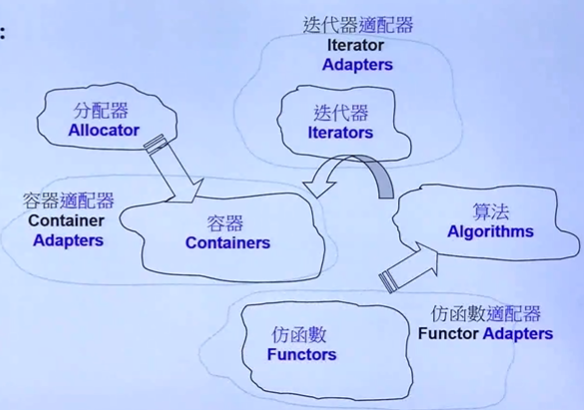

**交互关系总结**:

* **容器与配置器**：容器通过配置器获取数据的存储空间。
* **算法与迭代器**：算法通过迭代器存取容器中的内容。
* **仿函数与算法**：仿函数可以协助算法完成不同的策略变化。
* **适配器与其他组件**：适配器通过封装或扩展其他组件的功能，来提供新的接口或行为。


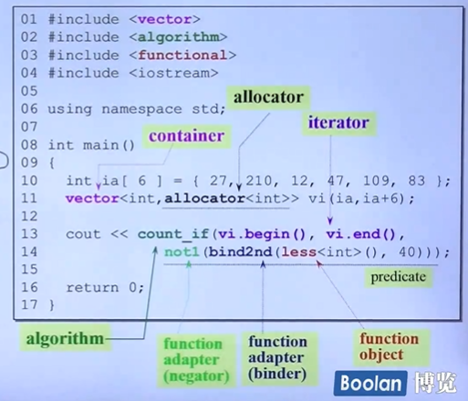

* 容器在定义时都会默认使用一个空间配置器（alloctor），空间配置器用来分配内存一般不进行显示的声明。

* bind2d是仿函数适配器，用来绑定第二个参数

	


## **1 iterator **与 traits

### 1.1 iterator 概念

**iterator设计思路**

* 迭代器是一种**行为类似指针的对象**，而指针的行为中最常见也最重要的便是内容提领（derference）和成员访问（member access）
* 因此，迭代器最重要的编程工作就是根据不同的容器操完成对**对operator*（解引用操作符）和operator->（成员访问操作符）、++、==进行重载**，形成针对每个容器的特定操作接口。
* 是作为容器与STL算法的粘合剂，每一种STL都有专属的迭代器
* 提供一个遍历容器内部的接口，因此迭代器内部必须保存一个与容器相关联的指针，然后重载各种运算符来遍历（和智能指针类似）
* 常用的迭代器：value type、difference type、pointer、reference、iterator catagoly；

iterator响应型别：

* 

### 1.2 traits编程技法


### 1.3 ++it和it++哪个好

* ++it返回一个引用，it++返回一个对象

1. **返回值**:
	* `++it`：这是前缀递增操作符。它先将迭代器`it`递增到下一个元素，然后返回递增后的迭代器。
	* `it++`：这是后缀递增操作符。它**先返回当前迭代器`it`的副本**，**然后将原始迭代器`it`递增到下一个元素。**
		* `it++`通常是通过在迭代器类中定义一个特殊的**成员函数**来实现的，这个函数接受一个哑参数（通常为`int`类型且未使用）以区分前缀和后缀形式。当调用`it++`时，编译器会生成一个迭代器的副本，调用这个函数，并将这个副本返回给调用者。然后，**在函数内部，迭代器对象本身会被递增**。
2. **效率**：
	* 在大多数情况下，现代C++编译器会对这些操作进行优化，使得`++it`和`it++`的效率几乎相同。但是，理论上讲，`++it`可能会比`it++`稍微快一些，因为它不需要**创建和返回迭代器的副本**。然而，这种差异在大多数情况下都是可以忽略的，除非你正在处理大量数据或者对性能有极高的要求。
3. **使用场景**：
	* 当你不关心递增前的迭代器值时，或者需要立即使用递增后的迭代器时，可以使用`++it`。
	* 当你需要在递增迭代器之前保留迭代器的当前值时，可以使用`it++`。例如，你可能想将当前元素的值存储起来，然后再移动到下一个元素。


```c++
//++i实现代码
int &operator++(){
	*this +=1;
	return *this;  //返回一个指向当前对象的解引用，允许进行链式操作
}
//i++实现代码
int operator++(){
	int temp = *this;
	++*this;  //调用++i
	return temp;
}
```


### 1.4 return *this:

返回一个指向当前对象的引用能够实现链式操作，是因为通**过引用可以连续调用同一个对象的不同方法，而不需要每次都显式地写出对象的名字。**

**当一个方法返回当前对象的引用时，这个返回值可以被用来继续调用该对象的其他方法。**这样，你可以将多个方法调用串联在一起，形成一个长长的表达式，其中每个方法调用都依赖于前一个方法的返回结果。

```c++
class Builder {  
public:  
    Builder& addFeatureA() { 
        return *this; // 返回当前对象的引用，以便进行链式操作  
    }    
    Builder& addFeatureB() {   
        return *this; // 返回当前对象的引用  
    }    
    void finalize() {    
    }  
};  
int main() {  
    Builder builder;    
    // 使用链式操作连续调用方法  
    builder.addFeatureA().addFeatureB().finalize();  
    return 0;  
}
```


## 2、算法

### 2.1、HashTbale

STL中的hashtable（哈希表）使用的是**拉链法**解决hash冲突。

* 拉链法：将大小为M的数组的每一个元素指向一个链表，链表中的每一个节点都存储散列值为该索引的键值对


## 3、空间配置器

这里说明的配置器都是SGI STL提供的配置器，配置的对象是**内存**

* SGI STL配置器与标准规范不同，其名称为alloc而并非allocator，且不接受任何参数。

* 采用SGI配置器写法：

	```c++
	vector<int,std::alloc> v;				 // in GCC
	vector<int, std::allocator<int> > iv;    // 标准说法 in VC or CB
	```

* SGI STL的每一个容器都已经指定缺省的空间器为alloc

* SGI STL也有标准的空间配置器allocator但是不经常使用，也不建议使用

	* allocator只是基层内存配置/释放行为（operator::new/operator::delete）的一层包装，并没有考虑到效率上的增强


**空间配置器：**

* 空间配置器就是**给容器分配空间的**。像我们平时使用new和delete动态分配释放对象内存一样。空间配置器也封装了这些功能。但是STL的空间配置器不仅仅只简单调用分配空间，它在一些地方都做了优化来提升性能。

* 我们在调用new动态分配对象内存时:
	* 通常会先调用malloc分配空间然后调用默认构造函数。
	* 通过delete来释放内存时，会先调用默认析构函数来析构对象，然后调用free来释放空间。
	* 在new/delete中把这两步封装在了一起。
* 而在STL中空间分配则是将这两阶段操作区分开来。
	* **内存配置和释放操作**由成员函数**alloc:allocate()和alloc:deallocate()**负责。
	* **对象的构造和析构**由::**construct()96和::destory()**负责。

```c++
template<typename_Tp,typename_Alloc = std::allocator<_Tp> >
	class vector:protected_Vector_base<_Tp,_Alloc>{};
template<class T,class allocator _RWSTD_COMPLEX_DEFAULT(allocator<T>) >
    class vector
template<class T,class Allocator<T> >
    class vector
```

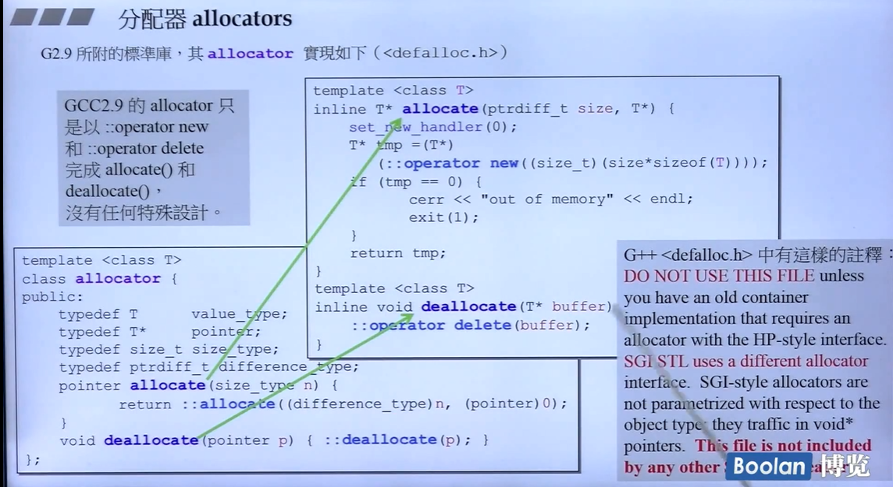


### 3.1 两级空间配置器

**目的：**

* 在堆上动态开辟内存时，频繁的使用开辟和释放内存，以及每次都调用malloc、free函数会造成堆上产生很多外部碎片，浪费空间。当外部碎片增多，内存分配器在找不到合适内存的情况下需要**合并空闲块**，浪费时间。

**原理：**二级空间配置器

* 当开辟内存<=128bytes时，即视为开辟**小块内存，调用二级空间配置器**
* 当开辟内存>128bytes时，即视为开辟**大块内存，调用一级空间配置器**
	* **一级空间配置器allocator采用malloc和free来 管理内存，和C++标准库中提供的allocator是一样的**
	* **但其二级空间配置器allocator采用了基于freelist 自由链表原理的内存池机制实现内存管理。（16个自由链表+内存池）**
		* **内存池**：预先申请一块较大的内存资源作为备用，当需要内存时，直接从这块空间资源中获取。当空间不够时，再使用`malloc`申请补充。
		* **哈希桶**：用于管理小块内存，每个哈希桶对应一个特定大小的内存块。当用户需要申请或释放小块内存时，通过哈希函数找到对应的哈希桶进行操作。
		* **内存对齐**：为了提高内存访问的效率，SGI-STL**将用户申请的内存块向上对齐到8字节的整数倍**（在64位平台上）。


```C++
//空间配置函数的内部实现原理
//allocate()函数，首先判断区块大小，大于128bytes就调用第一级配置器，小于128bytes就检查对应的free list.
//如果free list之内有可用的区块，就直接拿来用，如果没有可用区块，就将区块大小调至8倍数边界，然后调用refill(),
//准备为freelist重新填充空间。refill() 后面再写
// n>0
static void* allocate(size_t n)
{
	obj * volatile * my_free_list;
	obj * result;
 
	//大于128就调用第一级配置器
	if (n > (size_t)_MAX_BYTES)
	{
		return (malloc_alloc::allocate(n));
	}
 
	//寻找16个free lists中适当的一个
	my_free_list = free_list + FREELIST_INDEX(n);
	result = *my_free_list;
	if (result == 0)
	{
		//没有找到可用的free list,准备重新填充free list
		void *r = refill(ROUND_UP(n));
		return r;
	}
 
	//调整free list
	*my_free_list = result->free_list_link;
	return (result);
}
```

GC2.9 alloc的行为模式：**16个freelist**如下:(0~15)

* 从#0开始维护8个byte，#1维护16个byte，#2维护24个byte......每一个都比前一个多8个字节
* 当容器需要内存时，内存分配器负责分配大小，那么容器的内存大小就会被内存对齐被重新分配大小，比如50就会被分配为56（8的倍数），此时分配器就会查找那个链表可以对56进行负责。如果能负责的那个链表并没有管理其他内存块，类似下图也就是说下面没有挂其他链表，是空的。那么空间配置器allocators便会**使用malloc**向内存申请内存块，申请完毕后将内存切块串成**单链表**挂在节点下面。

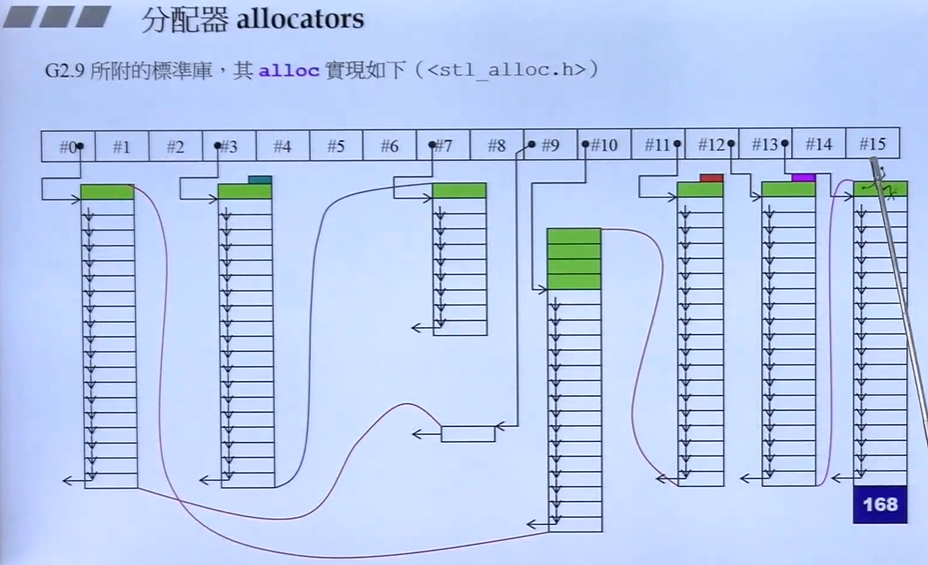


### 3.2 配置器使用

```c++
//std内涵alloctor
//使用std::alloctor以外的allocator，需要自行#include
#include <ext\array_allocator.h>
#include <ext\mt_allocator.h>
#include <ext\mollc_allocator.h>
#include <ext\new_allocator.h>
#include <ext\debug_allocator.h>
#include <ext\_pool_alloc.h>
#icnldue <ext\bitmap_allocator.h>
```

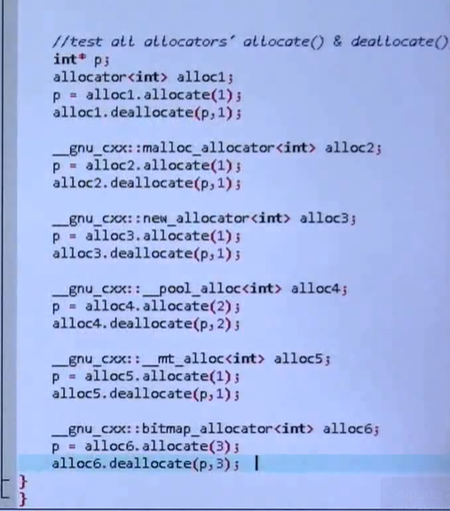


## **4、容器**

* 在C++标准模板库（STL）中，容器的迭代器范围通常是遵循**“前闭后开”**区间（即半开区间）的约定。这意味着迭代器范围 `[begin, end)` 涵盖了从 `begin` 指向的元素开始，一直到 `end` 指向的元素之前（但不包括 `end` 指向的元素本身）的所有元素。

	```c++
	Container<T>::iterator it = c.begin();   //利用迭代器遍历容器
	for(;it != c.end();++it){}
	```

**对容器的访问访问：**

```c++
for(decl : coll ){ it }
for(int i : {1,2,3,4,5,6} ){std::cout << i << endl;}
std::vector<double> vec;
for(auto elem : vec){
	std::cout << elem << endl;
}
for(auto &elem : vec){
	elem *= 3;
}
```


**常用容器**：

* 序列式容器：array、vector、dequeue、list、foward-list
	* 按照存放顺序
* 关联式容器：set/multiset
	* multi相比普通的容器，元素能重复
* 无序容器：unordered set/Multiset、unordered map/Multimap。

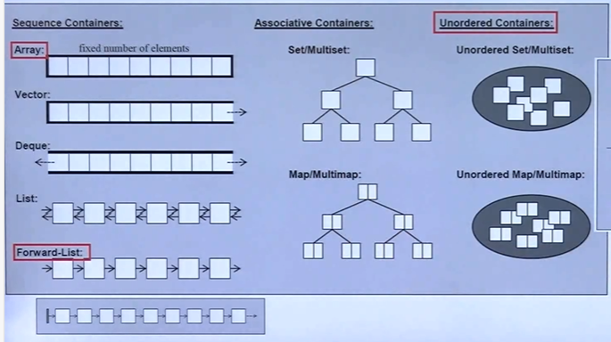

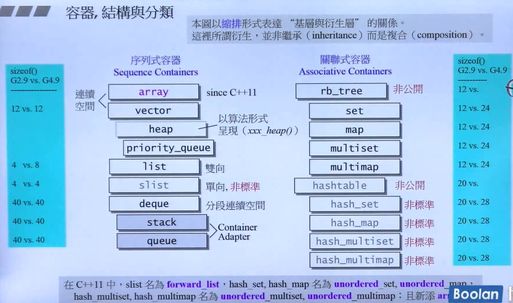

容器的底层实现如下：

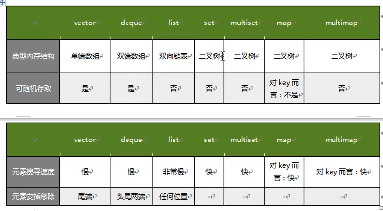


​     

### 4.1 序列式容器


#### 4.1.1 vector 容器

##### 4.1.1.1 基本概念

* vector可以理解为单端数组，v.push_back和v.pop_back只会在尾端进行操作。

* vector除了v.begin()和v.end()，还有v.rend()(指向最后一个元素)和v.rbegin()（指向前一个元素的上一个元素），因此可以实现逆序遍历。

* **vector维护一个线性空间**，所以无论元素的类别如何，普通指针都可以作为vector的迭代器，因为vector所具有的操作行为，如operator*（+、-、+=、-=、++、--），可以任意挑选元素进行操作,普通指针天生具有这样的功能，因此**vector支持随机存取，提供的是随机访问迭代器。**
* vector 以两个迭代器start、finish分别指向配置得来的连续空间中已经被使用的范围，并以迭代器end_of_storage指向整块连续空间（含备用空间）的尾端。

* 容量（capacity）：为了降低空间配置的速度成本，vector实际配置的大小可能比客户端需求量更大一些，以备将来可能的扩充，这便是容量的概念。

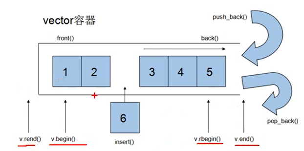

##### **4.1.1.2 API:**

```c++
#include<vector>
#include<algthorim>
vector<int v>
v.push_back(xx);

//遍历元素
vector<int>::iterator itBegin = v.begin();  //v.begin()起始迭代器，指向v的第一个元素
vector<int>::iterator itend = v.end(); //v.end():结束迭代器，指向容器v的最后一个元素的下一个位置

while(itBegin != itend){
	cout << *itBegin << endl;
    itBegin++;
}

for(vector<int>::iterator it = v.begin();it!=v.end();it++){
	cout << *it << endl;
}

void print(int val){ //回调函数
    cout << val << endl;
}
for_each(v.begin(),v.end(),print);

//每一个容器都有其专属的迭代器：自定义数据类型
class person{
public:
    int m_age;
    string m_name;
public:
    person(const int &age,const string &m_name){
        m_age = age;
        this->m_name = m_name;
    }
};
person p(18,"wangbada");
person p1(81,"huanggou");
vector<person> v;
v.push_back(p);
v.push_back(p1);
for(vector<person>::iterator it = v.begin();it!= v.end();it++){ //每一个容器都有其专属的迭代器：自定义数据类型
	cout << (*it).m_age << (*it).m_name << endl;  //(*it)-->person p
}

//存放指针
vector<person *> v;
v.push_back(&p);
v.push_back(&p1);
v.emplace_back(str);  // 该函数在vector的末尾直接构造一个新的元素，并将str作为这个新元素的初始值。
for(vector<person *>::iterator it =v.begin();it!v.end();it++){
	cout << (*it)->m_name << (*it)->m_age << endl;  //（*it)--->person *p
}

//容器嵌套
vector<vector<int>> v;
vector<int> v1;
vector<int< v2;
vector<int> v3;
v.push_back(v1);
v.push_back(v2);
v,push_back(v3);
for(vector<vector<int>>::iterator it = v.begin();it!= v.end();it++){
    // *it === vector<int> v
	for(vector<int>::iterator vit = (*it).begin();vit!=(*it).end();vit++){
        cout << *vit << " ";
    }
    cout << endl;
}
```


**vector构造函数:**

* vector 以两个迭代器start、finish分别指向配置得来的连续空间中已经被使用的范围，并以迭代器end_of_storage指向整块连续空间（含备用空间）的尾端。

```c++
template<class T,class Alloc = alloc>
class vector{
public:
    iterator start;				//	表示目前使用空间的头
    iterator finish;			//	表示目前使用空间的尾
    iterator end_of_storage;	//	表示目前可用空间的头
protected：
    iterator begin() { return start; }
    iterator end() { return size;}
    size_type size() const { return;}
    
}
vector<int> v; 					//采用模板类实现，默认构造函数
vector(v.begin(),v.end()); 		//将v[begin(),end())区间的元素拷贝给本身
vector<int> v2(v.begin(),v.end());  //本质上是有参构造，只不过两个参数是迭代器
vector(n,elem); 				//构造函数将n个elem拷贝给自身
vector(const vector &vec); 		//拷贝构造函数

//assgin
v.assgin(v1.begin(),v1.end());
v.swap(v2);
```


##### 4.1.1.3 vector 迭代器与控制器


**迭代器：**

```c++
template<class T,class Alloc = alloc>
class vector{
	typedef T;
	typedef value_type* iterator; 			// vector的迭代器是普通指针
    ...
}
```

**控制器：**

* vector缺省alloc作为空间配置器，并以此另外定义了一个data_allocator,为的是更方便以元素大小为配置单位
* `data_allocator::allocate(n)`：表示配置n个空间

```c++
template<class T,class Alloc = alloc>
class vector{
	prtected:
	typedef simple_alloc<value_type,Alloc> data_allocator;
    .....
}
```


##### 4.1.1.4 vector相关算法

**逆序遍历（非质变算法）：**

* vector除了v.begin()（指向第一个元素）和v.end()（指向最后一个元素的下一个位置）
* 还有v.rend()(指向最后一个元素)和v.rbegin()（指向前一个元素的上一个元素），因此可以实现逆序遍历。

```c++
for(vector<int>::reverse_iterator it = v.rbegin();it! = v.rend();it++){
	cout << *it << endl;
}
```


**vector随机存取：**

​		**vector维护一个线性空间**，所以无论元素的类别如何，普通指针都可以作为vector的迭代器，因为vector所具有的操作行为，如operator*（+、-、+=、-=、++、--），可以任意挑选元素进行操作,普通指针天生具有这样的功能，因此**vector支持随机存取，提供的是随机访问迭代器。**支持**跳跃式访问**。

```c++
vector<int>::iterator it = v.begin();
it = it + 3;
cout << *it << endl;  //只要不报错，这个迭代器就支持跳跃式访问
```

​		List容器便不支持随机访问。


**vector扩容规则：**

* **显示扩容：**
	* resize() 重置大小
	* reserve() 预留空间 
		* 两种扩容的区别：
			* reserve()是改变的是vector的capacity不是size，因此很多内存空间是野的，使用[]访问会越界。
			* reserve()预留分配内存后，空间未满的情况，不会引起重新分配。

			* resize()只改变元素的数目，不改变vector的容量大小，但是会使容器真正具有new_size个对象。

* **默认扩容**：
	* 当capacity == size() 时，添加新元素会导致vector扩容

	* vector首先申请内存空间，将旧空间的元素拷贝到新空间，释放旧空间。

	* 扩容后由于旧空间已经释放，内部元素的地址会改变，原先的迭代器（指针）会失效，因此需要**重新写一个迭代器（指针）指向新的内存空间。**

	* vector默认是成倍扩容
		* 对比发现，采用成倍扩容方式可以保证**常数的时间复杂度**，而增加指定大小的容量只能达到O(n)的时间复杂度。

	* 根据编译器的不同，mscv,win+vs是1.5倍扩展，linux+gcc和clang是2倍扩展
		* 增长因子一般就在(1,2),既要保证不能浪费堆空间，又要保证下一次申请的内存必然大于之前分配内存的总和。 

```c++
	//新的空间地址通过vector提供的成员函数来获取
	std::vector<int> vec = {1, 2, 3};        
    int* ptr = &vec[1]; // 指向vec旧空间中的第二个元素，值为2        
    // 现在向vec中添加元素，触发扩容  
    vec.push_back(4);        
    // 扩容后，ptr指向的内存可能已经被释放或重新分配  
    // 因此，ptr现在是一个悬挂指针，使用它是不安全的  
    // ptr = &vec[1]; // 这是错误的，因为vec已经重新分配了内存        
    // 正确的做法是在扩容后重新获取指向新元素的指针  
    int* new_ptr = &vec[1]; // 获取扩容后vec中第二个元素的地址        
    // 输出新指针指向的值，应该是2（如果vec没有改变顺序）  
    std::cout << "The value pointed by new_ptr is: " << *new_ptr << std::endl; 

	const size_t_type len = old_size + max(old_size,n);
```

**STL中的哈希表扩容：**

* 创建一个新的内存空间，该空间是旧空间两倍大最接近的质数
* 将旧空间的数通过指针的转换，插入新空间（这里并没有将数据直接从旧空间拷贝到新空间，而是通过指针转换两个空间的地址）
* 通过swap函数将新空间与旧空间交换，销毁新空间。

​		**STL中swap函数：**

* 除了数组，其他容器在交换后本质上是将**内存地址（指针）进行了交换**，而元素本身在内存中的位置是没有变化的。

```
template<class T> void swap(T &a,T &b)
{
 T c(std::move(a)); //move移动语义
 a = std::move(b);
 b = std::move(c);
}
```


**vector空间收缩：**

erase、clear()都只能删除和清空元素，但是vector的内存占用还在，所有的内存空间只有在vector析构的时候才会被系统回收。

* resize() 函数

* 可以用**swap收缩内存**：匿名对象+初始化
	* 这里的vector<int>(v),类型+(初始化)，相当于创建匿名对象，然后用v去初始化，那么这里匿名对象的大小就和v一样。
	* 而这里的swap就相当于用v和匿名对象进行交换操作（交换指针）
	* **匿名对象**的特点就是在**当前行(表达式结尾)执行完成后会释放掉其指向的内容**
		* 释放由系统自动回收

```c++
vector<int>(v).swap(v); 
vector().swap(v);
```

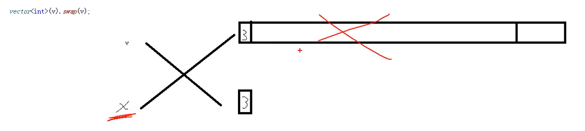

另外可以使用deque，进行空间动态缩小。


**v.push_back()**：

* v.push_back向尾部插入元素 
	* 当空间够用时，首先会创建这个元素，然后再将这个元素拷贝或者移动到容器中
	* 不够用时，插入的过程和vector扩容的过程一样，会不断的申请新的内存空间，并拷贝旧空间的元素。
	* 需要调用**拷贝构造函数**和**转移构造函数**
* 频繁的使用v.push_back()
	* 会导致频繁的内存重新分配和元素复制，会导致性能下降。
* 与emplace_back()的区别
	* **emplace_back()**是零拷贝技术，插入的元素原地构造，**不需要触发拷贝构造和转移构造**


例如：

```c++
template<class T,class Alloc>
void vector<T,Alloc>::insert_aux(iterator position,const T&x){
	if(finish != end_of_staorage){ 					//有备用空间（capacity()-size()）
     	// 在备用空间的起始处建立一个元素，并以vector最后一个元素值为其初值
     	construct(finish,*(finish-1));
        ++finish;
        T x_copy = x;
        copy_backward(position,finish-2,finish-1);
        *posotion = x_copy;
    }else{														// 已无备用空间
        const size_type old_size = size();						// 原空间进行备份
        const size_type len = old_size != 0 ? 2 *old_size :1;  	// 如果刚开始的空间为0，必须放一个元素进去
        // 以上分配原则：如果原大小为0，则分配一个元素，要不然0的倍数还是0
        
        iterator new_start = data_allocator::allocate(len);		//分配器分配内存
        iterator new_finish = new_start;
        
        try{
			new_finsih = uninitialized_copy(start,position,new_start);		// 将原vector的内容拷贝到新vector
            construct(new_finish,x);				// 为新元素设初值x
            ++new_finish; 							// 调整
            new_finish = uninitialized_copy(position,finish,new_finish);	// 安插点后的内容
        }
        catch(...){
			destory(new_start,new_finish);
            data_allocator::deallocate(new_start,len);
            throw;
        }
        //释放原空间
        destroy(begin(),end());
        deallocate();
        //调正迭代器，指向新的vector
        start = new_start;
        finish = new_finish;
        end_of_storage = new_start + len;
    }
}
void push_back(const T&x){
	if(finish != end_of_staorage){  //  有备用空间（capacity()-size()）
		construct(finish,x);
        ++finish;
    }else     						// 没有备用空间
        insert_aux(end(),x);
}

vector<int> v;
for(int i= 0；i<10000;i++)
	v.push_back(i);        //会不断扩容
```


**手撕vector**

```c++
#include<iostream>
using namespace std;

template<typename T>
class MyVector{
public:
    typedef T value; //值
    typedef T *iterator; //vector里面的iterator本质是一个指针
    typedef T& reference; 
    
protected:
    iterator m_Data; //头指针
    iterator  start; //起始位置
    int m_len; //数组长度
    int pos; //当前位置
    
public:
    MyVector(int len = 0):m_Data(nullptr),start(nullptr),m_len(len),pos(0){
		if(len > 0){
            //创建一个数组
            m_Data = new value[len];
        }
    }
}
```


#### 4.1.2 list容器

##### 4.1.2.1  概念

* 序列式容器，底层为**环形双向链表**，`std::list`提供了双向迭代器，允许向前和向后遍历链表。对任何元素的插入和删除移除永远都是常数时间。
	* 如果需要在链表的特定位置找到节点（例如，通过值查找），则可能需要遍历链表，这可能需要线性时间。

* 维护非连续空间，每次插入/删除一个元素，就配置/释放一个元素空间，**list的插入和删除操作都不会造成原有的迭代器失效**
* 尾部节点也是指向最后一个节点的下一位（空白节点），因此是前闭后开的区间结构
	* list是环形链表，但是为了遵循STL规范，在最后一个环形链表的尾端加上一个空白节点，便符合STL规范“前闭后开”。
* list空间管理采用**alloc空间配置器**，为了方便以节点大小为配置单位，还定义了一个**list_node_alloctor函数**可以一次性配置多个节点。
	* `list_node_allocator`封装了对内存分配和释放的细节，使得 `std::list` 可以更方便地以节点为单位进行内存管理。通过使用 `list_node_allocator`，`std::list` 可以一次性分配多个节点空间，从而提高内存分配的效率，并减少内存碎片。
	* **allocate**：用于分配新的节点空间。这个函数会向操作系统请求一定大小的内存块，并返回一个指向该内存块的指针。
	* **deallocate**：用于释放之前分配的节点空间。这个函数会将给定的内存块归还给操作系统。
	* **construct** 和 **destroy**：这两个函数通常不是 `list_node_allocator` 的一部分，但它们与内存管理紧密相关。`construct` 用于在已分配的内存块上构造对象，而 `destroy` 用于销毁对象并释放其资源，但不释放内存块本身。
* list由于双向性，支持在头部front和尾部back两个方向进行push和pop操作.

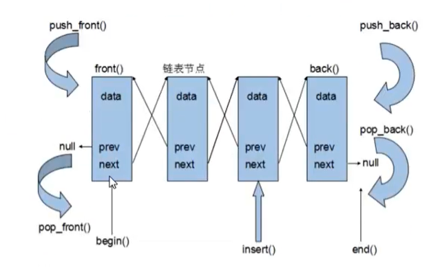

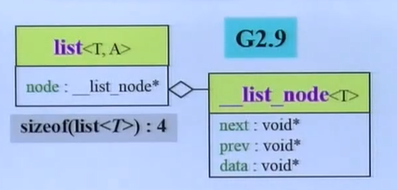

```c++
// GC 2.9
template<class T,class Alloc = alloc>
class list {
protected:
	typedef _list_node<T> list_node
    typedef simple_alloc<list_node,Alloc> list_node_allocator; 	// list_node_alloctor
public:
    typedef list_node* link_type;   // 有一个指针list_node，因此sizeof（list）的大小是4
    typedef _list_iterator<T,T&,T*> iterator;
protected:
    link_type node;  				// 只需要一个指针，便可以表示整个环形双向链表
    ....
};
//list 节点结构
template <class T>
struct _list_node {
    typdedef void* void_pointer;
    void_pointer prev;
    void_pointer next;
    T data;
};
//list 迭代器
template<class T>
struct _list_iterator{
	typedef T value_type;
    typedef Ptr pointer;
    typedef Ref reference;
    
    link_type node;  				//迭代器内部需要普通指针指向list节点
    ...
};
```

观察上述代码能看到：

* list本身和list节点的构造是不同的结构，需要分开设计


##### 4.1.2.2 list迭代器

* list是链表结构，不保证节点是连续存储，因此不能使用普通指针作为迭代器
* list是双向链表，需要迭代器有迁移、后移的能力，所以list提供的是`bidirectional iterators`
	* `Bidirectional iterators` 是 C++ 标准库迭代器类别中的一种，它们支持向前和向后遍历容器中的元素。与只能向前移动的迭代器（如输入迭代器）不同，双向迭代器提供了两个主要的操作：`++` 用于向前移动迭代器，`--` 用于向后移动迭代器。`*`和`->`用于提取。

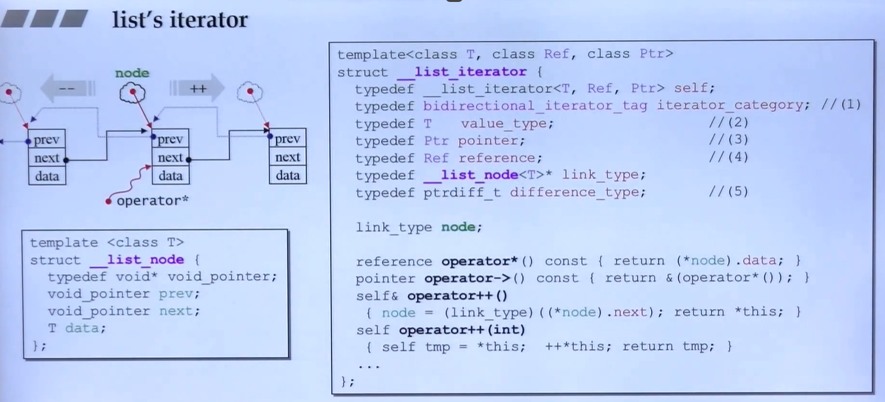


```c++
#include <iostream>  
#include <list>  
  
int main() {  
    std::list<int> myList = {1, 2, 3, 4, 5};  
  
    // 使用双向迭代器遍历 list  
    auto it = myList.begin(); // 获取双向迭代器  
    while (it != myList.end()) {  
        std::cout << *it << " "; // 访问当前元素  
        ++it; // 向前移动迭代器  
  
        if (*it == 4) {  
            --it; // 当发现元素 4 时，向后回退迭代器  
            break; // 假设我们在这里停止遍历  
        }  
    }  
  
    // 注意：上面的循环实际上在发现 4 时会回退迭代器，但随后会再次向前移动（因为循环条件），  
    // 所以最终 it 会指向 5。为了正确展示回退，我们可以稍微修改循环或添加一些打印语句。  
  
    // 正确展示回退后的迭代器位置  
    if (it != myList.end()) {  
        std::cout << "\n回退后迭代器指向的元素是: " << *it; // 应该输出 4  
    }  
  
    return 0;  
}  
  
// 注意：上面的代码示例在逻辑上有一个小问题，即循环会在发现 4 后立即退出，但我们的意图是展示回退。  
// 为了更清晰地展示回退，你可能想要调整循环条件或使用其他逻辑。
```


##### 4.1.2.3  API

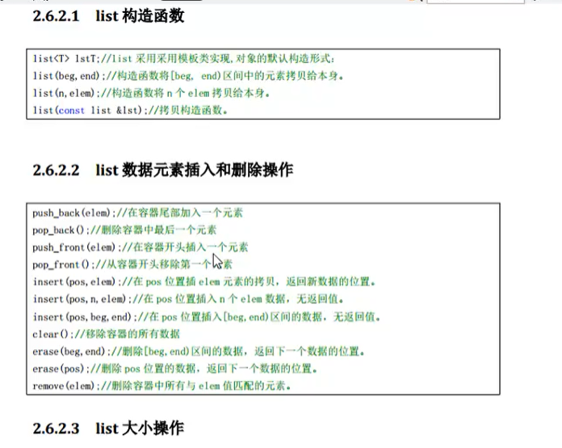


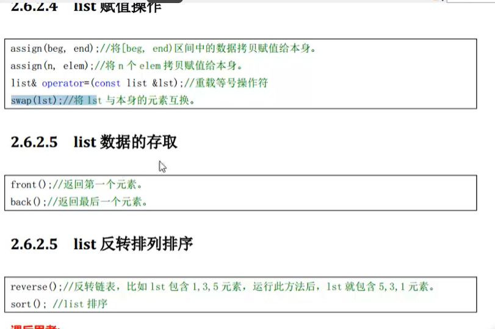


```c++
#include<list>
//初始化
list<int> l;
list<int> l2(10,10); //有参构造
list<int> l3(l2);
list<int> l4(l3.begin(),l3.end());

for(list<int>::iterator it = l.begin(),it!=l.end();it++){
	cout << *it << endl; //*it是int类型
}

//插入删除
l.push_back(10); //尾插
l.push_front(200); //头插
l.insert(l.begin(),300); //头插
l.insert(l.end(),300); //尾插
l.insert(l.end(),300); //尾插
list<int>::iterator it = l.begin();
it++;
it++;
l.insert(it,500);
l.pop_back();//尾删
l.pop_front(); //头删
l.earse(l.begin(),l.end());
l.remove(10); //删除所有匹配元素
l.unique(10);	//当出现连续且相同的元素，移除一个

//大小操作
l.size();
l.empty();
l.resize();

//赋值操作
l.assgin(10,10);
l2 = l1;
l2.swap(l); //交换
l.front(); //头元素
l.back(); //尾元素

//反转
l.reverse(); //倒序
l.sort(); //正序
bool nosort(int a,int b){
    return a>b;
}
l.sort(nosort); //倒序
```

此外除了基础的操作之外：list还提供了一个**迁移操作**：

* 迁移：将某连续范围内的元素迁移到某个特定位置之前
* transfer并非公开接口，list公开的是接合操作`splice`

```c++
int iv[5] = {5,6,7,8,9};
list<int> lis(iv,iv+5);

//假设 lis2的内容为0 2 99 3 4
it = find(lis2.begin(),lis2.end(),99);
lis2.splice(it,lis);			// 0 2 56789 99 3 4
lis2.sort();					// 0 2 3 4 5 6 7 8 9 99
```


##### 4.1.2.4 slist(forward_list)

**概念：**

list是双向链表、slit是单向链表，两者的主要区别是：list的迭代器是双向的，后者的迭代器是单向的，slist不如list灵活但是其所耗空间小，操作快。

**API**：

slit提供了inset_after()、erase_after()、push_front()

```c++
template<typename T>
class slist{
	static listnode* create_node(const value_type& x); //配置空间构造元素
	static void destroy_node(list_node* node){} //析构函数、释放空间
private:
	list_node_base node;
public:
	iterator begin(){}
	iterator end(){}
	size_type size(){}
	bool empty(){}
	void swap(slist &L){} //交换两个slist，只交换两个头节点
	reference front(){} //取头部元素
	void push_front(const value &x){} //头部插入元素
	void pop_front(){} //从头部取走元素
};

#include<forward_list>
forward_list<int> f;
f.push_front(10);
f.push_front(20);
f.push_front(30);
f.push_front(40);
forward_list<int>::iterator it1 = f.begin();
forward_list<int>::iterator it2 = f.end();
for(;it1!=it2;++it){
	cout <<*it1 << endl;  //40 30 20 10
}
it1 = find(f.begin(),f.end(),20); //寻找20的位置  
if(it1! = it2){
	it.insert_after(it1,99); //插入99
}
for(auto it:f){
    cout << it << " "; //40 30 20 99 10
}
it1 = find(f.begin(),f.end(),20); //寻找20的位置  
if(it1! = it2){
	it.erase_after(it1); //删除99，20的下一个元素
}
for(auto it:f){
    cout << it << " "; //40 30 20 10
}
```


#### 4.1.3 string容器

##### 4.1.3.1、string与char*之间的关系

* string继承自basic_string，是对char*进行了封装，封装的string包含了char数组，容量，长度等属性
	* char*是一个指针，string是一个类
* string可以进行**动态扩展**，在每次扩展的时候另外申请一块原空间大小**两倍**的空间，然后将原字符串拷贝过去，并加上新增加的内容（等比**vector扩容**）。
* string不用考虑释放和越界，string管理char*所分配的内存，每一次string的复制，取值都由string类负责维护。

##### 4.1.3.2 API：

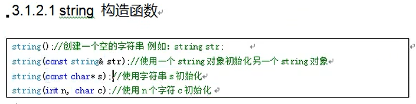


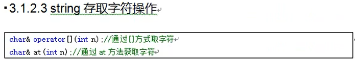

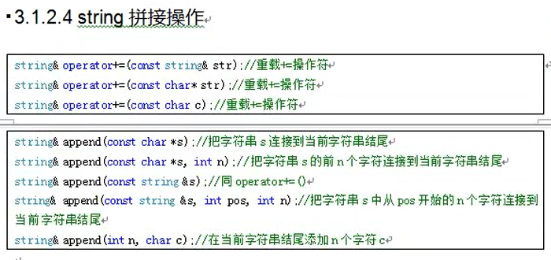

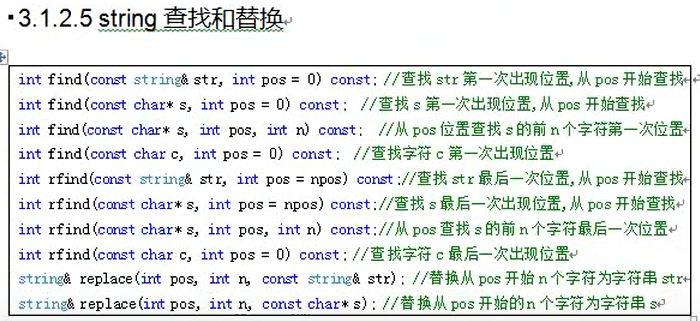

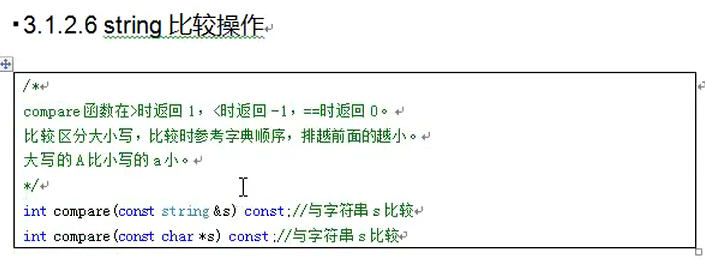

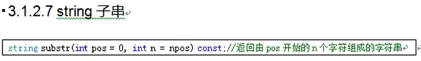


```c++
//构造函数
string str;
string str2(str);
string str3 = str;
string str4(10,'s');
//赋值
str = "abc";
str.assign(str);
str.assign("abcde",3); //abc
str.assign(str,0,2); //ac
//存取字符
for(int i = 0;i<str.size();i++){
	cout << str[i] << endl;
    cout << str.at(i) << endl; //[]与at的区别，[]访问越界会直接挂掉，at访问越界，会抛出out_of_range异常 
}
//拼接
str += str2;
str.append("abc");
//查找
str = "bacde"
str.find("de"); //从0开始，返回d的位置，没有返回-1
str.replace(1,3,"11111");//将1~3位置的字符替换为"11111",超过3个后面字符串有多长都会替换
//比较
str.compare(str2); //str>str2:>0 str<str2:<0 str==str2:==0 从前往后比
//字串
str.substr(0,5); //截取从0开始的5个位置的字串
//子串：截取用户名
string email = "zhangsan@sina.com"
int pos = email.find('@'); // 8
string userName = str.substr(0,pos); //zhangsan
//子串：截取网站字符
string str = "www.xatu.sb.edu";
int initpos = 0;
int end = -1;
while(true){
    if(end == -1){
        string tempstr0 = substr(start,str.size()-start); //处理最后一个edu
        break;
    }
	int pos = str.fin('.',start); //从0开始
	string tempstr = substr(start,pos-start);
    start = pos+1; //避开"."
}
```


#### 4.1.4 deque容器

##### 4.1.4.1 概念

底层为**双端数组**，可以在两端进行插入和删除。

* deque和vector一样也**支持随机存取**，vector是单向开口的连续性空间，而deque是**双向开口（可以在两端进行插入和删除）的连续性空间**，也就是说可以在头尾两端分别做元素的插入和删除操作，但其头部操作效率奇差。
* deque允许**常数时间内对头端进行元素插入和删除操作**
* deque**没有容量的概念，其是动态的以分段的连续空间组合而成，随时可以增加一段新的空间并链接起来**，deque的最大任务就是如何维护这个整体的连续性，像vector那样“因为空间不足而重新分配“，并就行复制和释放原空间”的操作并不会出现在deque身上，因此deque**没有提供所谓的空间保留功能**
* deque提供随机访问的迭代器，但是其迭代器并不是普通的指针，其复杂程度比vector高级，因此对deque进行排序，可以先将元素复制给vector，利用sort排序后，再复制回deque。

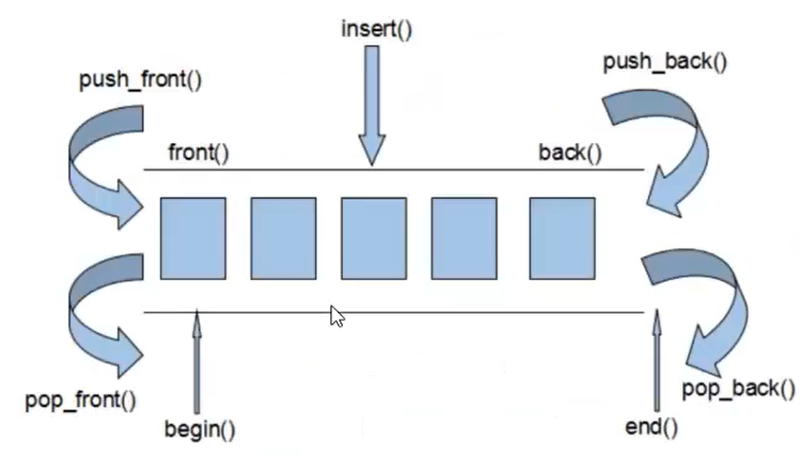

##### 4.1.4.2 deque中控器

* deque逻辑上看是连续空间，其实由一段一段的定量连续空间组成，一旦有必要在deque的前端或尾端增加新空间，便配置一定量的连续空间，串接在整个deque的头端和尾端。
* 要分段有要连续就必须要有**中控器**（类似vector，扩容规则也类似），deque采用一块连续空间map，其中每个元素（节点）都是指针，指向另一段连续线性空间（缓冲区），缓冲区才是deque的存储空间主体，SGI STL允许指定缓冲区大小，默认0表示将使用512bytes缓冲区。
* map扩容时，比如原空间为8，需要扩充到16，会扩充到16的中段，方便向前和向后扩充

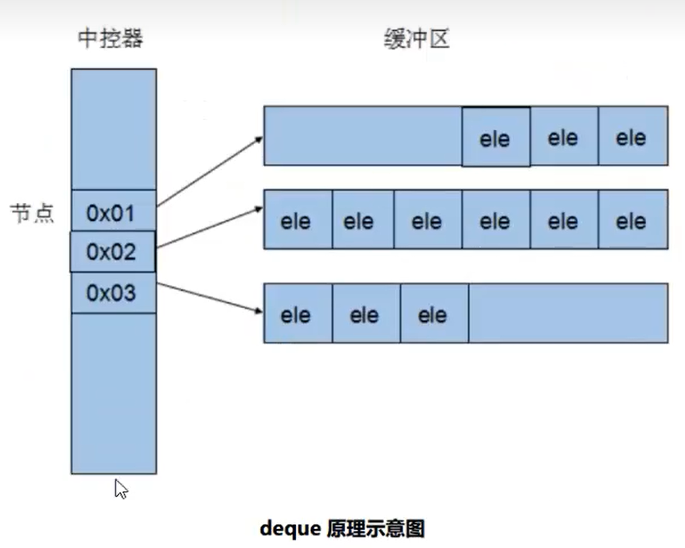

```c++
template<class T,class Alloc = alloc,size_t Bufsiz = 0>
class deque{
public:
	typedef T value_type;
	typedef value_type* pointer;
	...
	
protected:
	typedef pointer *map_pointer;
protected:
	map_pointer map;  	// 指向map，map是块连续空间，期内的每个元素都是一个指针（节点）。指向一块缓冲区
    size_type map_size; // map可容纳多少指针
    ...
}
```

* 观察代码可以看到：map其实是一个T**，也就是说其是一个二级指针，管理一系列一级指针，而当map使用率满载，便需要再找一块更大的空间来作为map（reallocate_map）


##### 4.1.4.3 deque迭代器


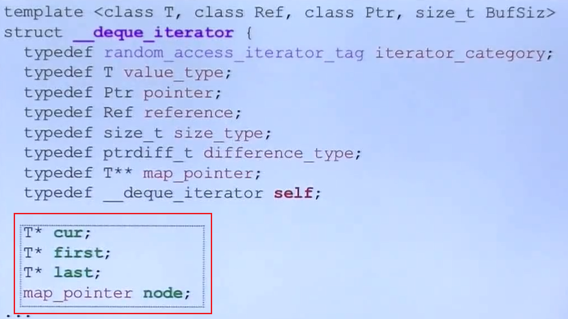

* node指向控制中心map。first和last为每一个分段的指针，指向该缓冲区的头一个元素和最后一个元素，标明缓冲区的边界。
* deque是分段连续空间，维护空间连续性的任务主要由迭代器的 `operator++` 、`operator--`两个运算子上
* deque迭代器主要功能在于：
	* 能够指出分段连续空间（缓冲区）在哪里
	* 其次必须能够判断自己是否已经处于在缓冲区的边缘，如果是，一旦前进或者后退就必须跳跃至另一个上一个或者下一个缓冲区，为了能够正确跳跃，deque必须随时掌握map
* 一个迭代器的大小是`4×4=16`（指针大小为4），因此一个deque包含了两个迭代器：`start(16)+finish(16)`+两个指针：`map(4)、mapsize(4)` = `40`

```c++
//++i
self & operator++(){
	++cur;
	if(cur == last) {
		set_node(node + 1);
		cur = first;
	}
	return *this;
}
//i++
self operator++(int){
    self tmp = *this;
    ++*this;
    return tmp;
}
//--i
self & operator++(){
	if(cur == first) {
		set_node(node - 1);
		cur = first;
	}
    --cur;
	return *this;
}
//i--
self operator--(int){
    self tmp = *this;
    --*this;
    return tmp;
}
```


##### 4.1.4.4 deque数据结构

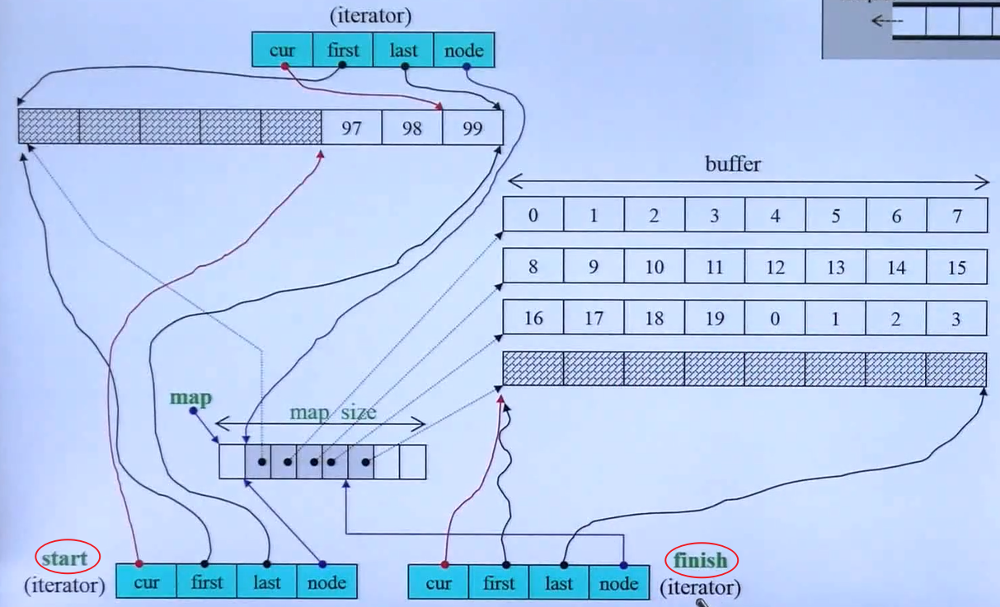

* deque维护一个指向的map的指针和start、finish两个迭代器、分别指向第一个缓冲区的第一个元素和最后一个缓冲区的最后一个元素

```c++
template<class T,class Alloc = alloc,size_t Bufsiz = 0>
class deque{
public:
	typedef T value_type;
	typedef value_type* pointer;
    typedef size_t size_type;
public:
    typedef _deque_iterator<T,T&,T*,Bufsize> iterator;
protected：
	iterator start;			// 第一个节点
    iterator finish;		// 表现为最后一个节点
    map_pointer map;		// 指向map，map是连续空间
    size_type map_size;		// map中有多少指针
```


##### 4.1.4.5 API

* 双端插入和删除元素效率较高.
* 指定位置插入也会导致数据元素移动,降低效率,
* 可随机存取,效率高.

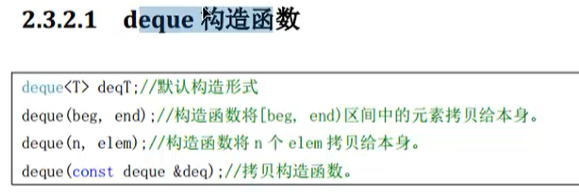


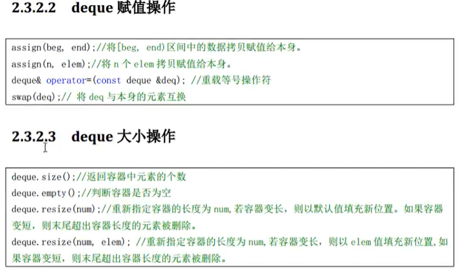


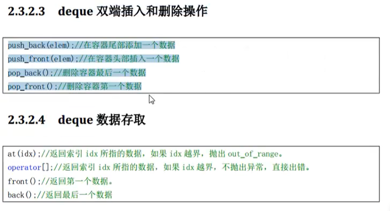

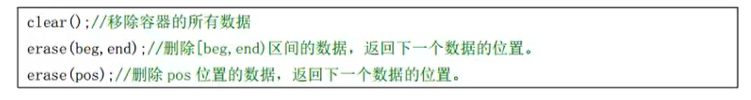


```c++
#include<deque>
//初始化
deque<int> d;
deque<int> d(10,5);
deque<int> d2(d.begin(),d.end());
deque<int> d3(d2);
deque<int,alloc,8> ideq(20,9);		// 缓冲区大小为8（个元素），并令其保留20个元素空间，每个元素初值为9

//打印
for(deque<int>::iterator it = d.begin();it!=d.end();++it){
	cout << *it << endl;
}

//赋值
deque<int> d;
d.assgin(10,5); //10个5
d2.assgin(d.begin(),d.enda());
d3 = d2;
d3.swap(d2);

//大小操作
if(d.empty()){
    cout << id empty << endl;
}
d.size(); 		//大小:finish-start
d.resize(5); 	//扔掉末尾超出的元素
d.resize(15,5); //超出的部分以5填充

//插入与删除
d.push_back(444); 	//尾插
d.push_front(505); 	//头插
d.pop_front(100); 	//头部弹出
d.pop_back(200); 	//尾部弹出
d.clear(); 			//清除所有元素
d.earse(5,10); 		//删除5~10之间的元素
d.earse(6); 		//删除6号位的元素
```


#### 4.1.5 stack容器

* 是一种先入后出的数据结构，
* 只有一个出口，只允许在栈顶新增元素，移除元素
* 只有栈顶元素可以被外界使用，不具有遍历功能，没有迭代器
* **栈不能遍历,不支持随机存取，只能通过 top 从栈顶获取和删除元素.**

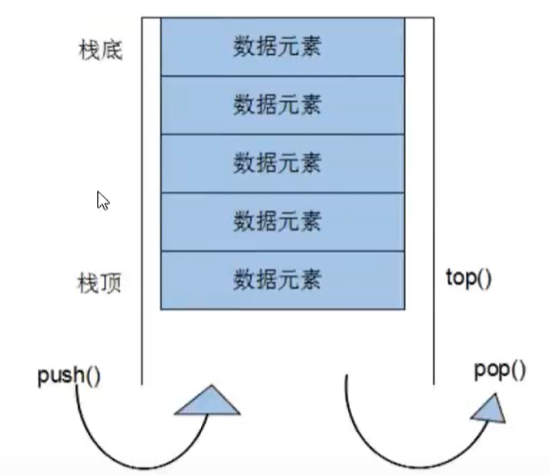


```c++
#include<stack>
//初始化
stack<int> s;
stack<int> s2(s);

//操作
s.push(10); //压栈
s.pop(10); //出栈

//打印栈顶数据
s.empty();
s.size();
cout << s.top() <<endl; 
```


#### 4.1.6 queue 容器

* 底层为**双端队列**，先进先出
* 队列能在两端插入和删除，但是插入和删除时单向的，**在一端插入，必须在另一端删除**
* 不能进行遍历，不提供迭代器
* 不支持随机访问

```c++
#include<queue>
//初始化
queue<int> q;
q.push(10);
q.pop();  //删除对头
cout << q.front() << endl; //对头元素
cout << q.back() << endl; //队尾元素
```

stack和queue其实都是对deque的另类改装：

* stack和queue都不允许遍历，因此都没有迭代器
* stack和queue都可以选择list和deque作为底层结构
* queue不可以选择vector作为底层结构，stack可以

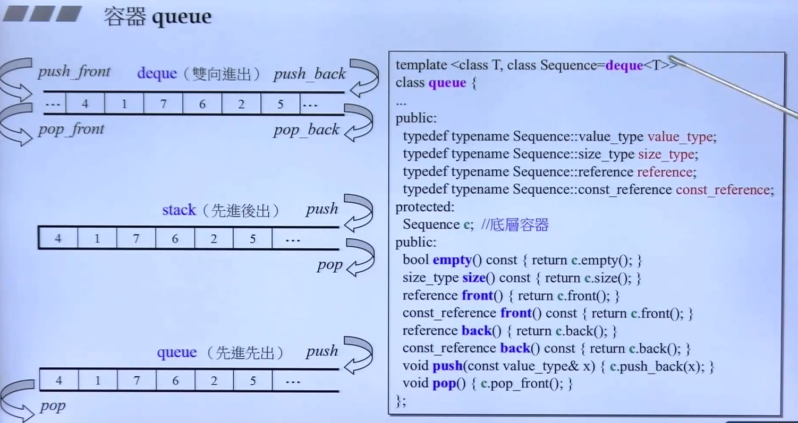


#### 4.1.7 priority_queue

* 提供了一个**基于优先级堆的最大堆**。这意味着队列中的每个元素都有一个优先级，元素按照优先级的降序（最大堆）或升序（最小堆，但标准 `priority_queue` 默认是最大堆）被排列。优先级最高的元素总是在队列的顶部。
* `priority_queue` 主要用于需要快速访问最大（或最小）元素的场景，如调度问题、图算法中的 Dijkstra 算法等。

**基本操作:**

* **构造函数**：可以创建一个空的 `priority_queue`，也可以提供一个初始的容器（如 `vector`）作为元素来源，并可以指定一个比较函数来决定元素的优先级。
* **push**：向 `priority_queue` 中添加一个元素。
* **pop**：移除并返回 `priority_queue` 中优先级最高的元素（即队首元素）。
* **top**：返回 `priority_queue` 中优先级最高的元素（即队首元素），但不移除它。
* **empty**：检查 `priority_queue` 是否为空。
* **size**：返回 `priority_queue` 中元素的数量。


#### 4.1.8 heap

* heap不属于STL容器组件，是priority_queue的助手，priority_queue允许用户以任何次序将元素推入容器内，但取出是一定是从优先权最高的元素开始取，binary max heap（大根堆）就是有这样的特性，适合作为priority_queue的底层机制。

* binary heap就是一种完全二叉树，也就说除了叶子节点外，整颗binary heap是填满的，而最底层的叶子节点从左往右不得有孔隙。


### 4.2 关联式容器

#### 4.2.1 树

RB-tree:红黑树（Red-Black Tree）是一种**自平衡的二叉查找树**。它通过特定的操作来保持树的平衡，以确保在最坏的情况下基本动态集合操作的时间复杂度保持在O(log n)。这里的n是树中元素的数量。红黑树通过每个节点上存储的一个额外的位来表示节点的颜色（红色或黑色），以及通过确保树满足五个性质来维持平衡。

红黑树的五个性质是：

1. 节点是红色或黑色。
	* 每个节点都被赋予红色或黑色的颜色。
2. 根节点是黑色。
	* 这有助于从根到叶子的最长的可能路径（黑色节点）不会比最短的可能路径（也全是黑色节点）长两倍以上。
3. 所有叶子（NIL节点，空节点）都是黑色。
	* 这些叶子节点实际上不存储在树中，但是操作起来就像它们是树的一部分，且都是黑色的。这是一个方便的假设，它简化了某些算法。
4. 如果一个节点是红色的，则它的两个子节点都是黑色的。
	* 这确保了从根到叶子的任何路径上不会有两个连续的红色节点。
5. 从任一节点到其每个叶子的所有简单路径都包含相同数目的黑色节点。
	* 这意味着树是平衡的。

红黑树的基本操作包括搜索、插入、删除和旋转（左旋和右旋）。在插入或删除节点后，红黑树可能会违反上述性质中的一个或多个。为了恢复这些性质，红黑树通过重新着色节点和进行特定的树旋转（左旋和右旋）来执行一系列的调整。

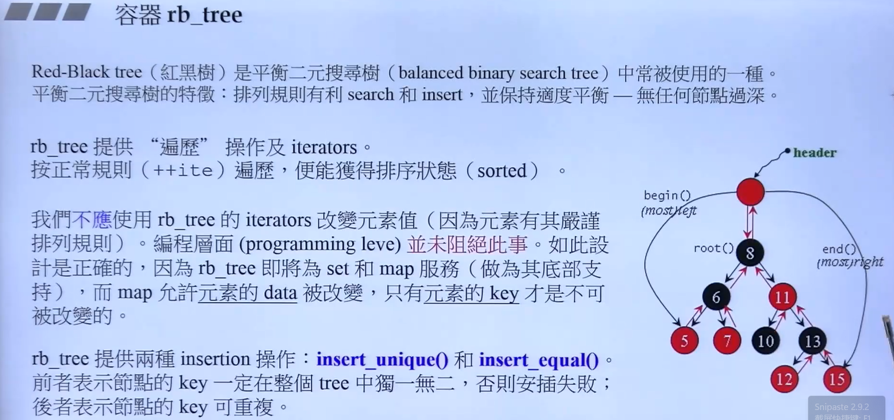

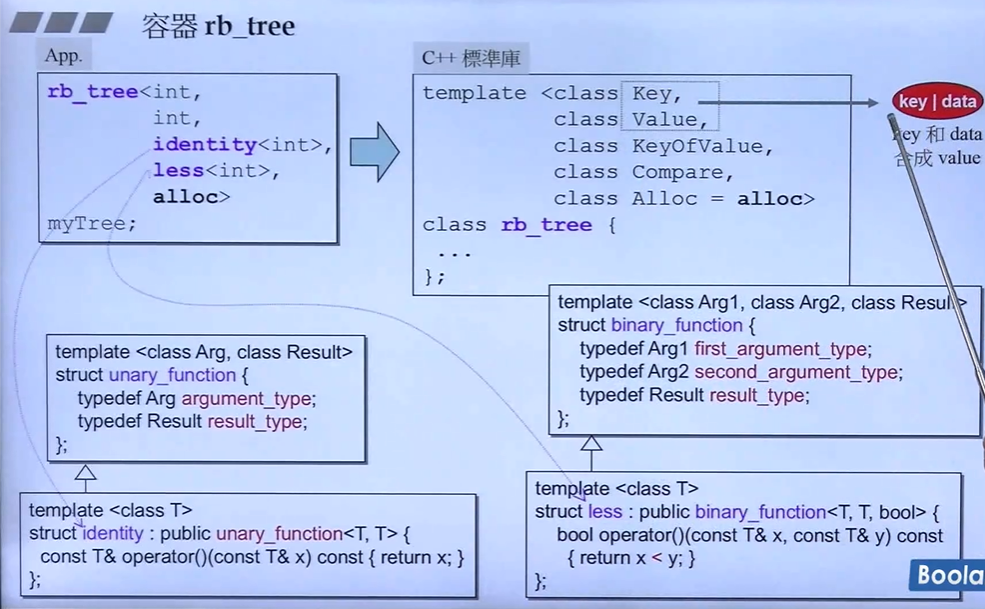


#### 4.2.2 set容器

##### 4.2.2.1 set/multiset容器特性

set/multiset的**底层实现都是红黑树**，红黑树是平衡二叉树的一种

**set特性：**

* 所有**元素的键值都会自动排序**(从小至大)
* set的**元素只有键值**，是一种值的集合。其元素都是唯一的，并且只包含一个关键字，这个关键字既是用于排序的依据，也是元素本身的值。也就是说，`set`**中的元素没有与关键字相关联的值（value）**
	
* set**不允许相同的两个键值**
	* set.count()：查找set中有没有这个元素，要么是0，要么是1
	* s.insert():插入相同的值会失败
		* typedef pair<iterator,bool> _Pairib; //插入的底层，其实返回的也是队组，不过一个是迭代器，一个bool类型
			* 当插入成功返回迭代器iterator，bool = True;
			* 插入失败不会返回迭代器，bool = false;
			* 所以插入的操作不会提前判断set中有没有相同元素，只有插进去了，会返回对组，其中bool = false;
* set的iterator是一种const_iterator
	* **不能通过迭代器修改set元素的值**，因为set元素值就是其键值，关系到set元素的排序规则
	* set的插入删除操作，不会导致迭代器失效。
* 对set容器的插入和删除不会影响之前的迭代器。除了被删除的那个

**multiset特性：**

* 和set完全相同，唯一的不同是允许键值重复。
* 在C++标准库中，`std::set`和`std::map`提供了`insert`成员函数，该函数的行为类似于`insert_unique`，因为它不允许插入重复的元素。
	* 向`std::set`或`std::map`这样的基于红黑树的容器中插入一个唯一的元素。如果尝试插入的元素已经存在于树中，则插入操作将失败（或返回表示失败的状态，具体取决于实现）。这是通过比较元素的关键字（在`std::map`中是键值对的键，在`std::set`中是元素本身）来实现的。

* 而`std::multiset`和`std::multimap`同样提供了`insert`成员函数，但它们的`insert`操作允许插入重复的元素，因此可以看作是`insert_equal`的实现。
	* `insert_equal`允许向红黑树（或基于红黑树的容器，如`std::multiset`或`std::multimap`）中插入可能重复的元素。即使元素已经存在于树中，插入操作也会成功，并且树中将包含该元素的多个副本。通常不是二叉搜索树（BST）的标准行为，但红黑树（在`std::multiset`和`std::multimap`的上下文中）通过维护一个**有序的序列**（可能包含重复项）来支持这一点。
	* 插入重复元素时，并不需要移动已经存在的元素，而是将新元素作为一个新的节点**插入到子树的右节点一直插入重复元素，所有相同值的元素形成一种"链状"结构，主要向右延伸**。通过颜色和旋转调整来确保整棵树保持平衡。这样的处理使得红黑树能够有效地处理包括重复值在内的多种数据，同时维持其对搜索、插入和删除操作的高效率。


**API：**

```c++
class mycompareInt{  //仿函数
public:
    bool operator()(int v,int v2){
        return v>v2;
    }
}
set<int> s;
//set容器的自定义排序要在插入之前
set<int,mycompareInt> s; //compare是仿函数，这里不能用回调函数,倒序排序
multiset<int> ms;  //
s.empty(); //判空
s.insert(5); //插入元素
s.erase(30); //删除元素值为30的元素
s.erase(beg,end); //删除此区间的元素
s.erase(pos); //删除pos位置的元素
s.find(key); //查找键值key是否存在，返回的是该键的元素的迭代器，若不存在返回s.end()的迭代器;
		set<int>::iterator pos = s.find(30);
		if(pos != s.end())  //有这个值
		if(pos == s.end())  //没有这个值
s.lower_bound(keyElem); //返回第一个key>=keyElem的迭代器
		set<int>::iterator pos2 = s.lower_bound(30);
		auto pos2 - s.lower_bound(30);
		if(pos != s.end()){ //没遍历完成一直遍历
            return *pos2;
s.upper_bound(keyElem); ////返回第一个key>keyElem的迭代器
        set<int>::iterator pos2 = s.lower_bound(30);
		if(pos != s.end()){ //没遍历完成一直遍历
            return *pos2;
s.equal_range(keyElem); //同时返回容器中key与keyelem相等的上下限的两个迭代器
         pair<set<int>::iterator,set<int>::iterator> ret = s.equal_range(30);
         if(ret.first != s.end())
             return *ret.first;  //返回第一个迭代器 = lower_bound的值
         if(ret.second != s.end())
             return *ret.second; //返回第二个迭代器 = upper_bound的值
S.count(key);//查找键值为key的元素个数（0/1）
```

 **pair：**对组

```c++
pair<string,int> p("tom",18);  //队组的有参构造
pair<string,int> p = make_pair("tom",18);
cout << p.first << p.second << endl;
```


##### 4.2.2.2 unordered_set/unordered_multiset

* 本质和set功能保持一致，底层为**hash_table**(散列表)，插入删除都是常数级别，但是元素无序。

* 在插入元素时，`unordered_set` 会先计算元素的哈希值，然后在相应的桶中查找该元素。由于 `unordered_set` 中的元素是唯一的，它使用等于比较运算符（`==`）来检查桶中的元素是否与要插入的元素相同。：如果桶中的某个元素与要插入的元素相等，则插入操作会被忽略，因为 `unordered_set` 不允许重复元素。

```c++
#include<unordered_set>

unordered_set<int> us;
us.insert(x);
us.empty(); //判空
us.insert(5); //插入元素
us.erase(30); //删除元素值为30的元素
us.count(30); //0/1
us.find(30); //插入

  
int main() {  
    // 创建一个 unordered_multiset 并初始化  
    unordered_multiset<int> myUnorededMultiSet = {10, 20, 50, 30, 10, 100, 70, 30, 40};  
  
    // 打印所有元素  
    std::cout << "myMultiSet元素表列:" << std::endl;  
    for (auto num : myUnorededMultiSet) {  
        std::cout << num << " ";  
    }  
    std::cout << std::endl;  
  
    // 查找元素并打印其数量  
    std::cout << "myUnorededMultiSet.count(100) = " << myUnorededMultiSet.count(100) << std::endl;  
    std::cout << "myUnorededMultiSet.count(30) = " << myUnorededMultiSet.count(30) << std::endl;  
  
    // 查找元素并打印其迭代器  
    auto it = myUnorededMultiSet.find(20);  
    if (it != myUnorededMultiSet.end()) {  
        std::cout << "找到元素: " << *it << std::endl;  
    } else {  
        std::cout << "未找到元素" << std::endl;  
    }  
  
    // 使用 equal_range 查找元素范围并打印  
    auto range = myUnorededMultiSet.equal_range(30);  
    std::cout << "键 == 30 对应的值:" << std::endl;  
    for (auto it = range.first; it != range.second; ++it) {  
        std::cout << *it << " ";  
    }  
    std::cout << std::endl;  
  
    return 0;  
}
```


#### 4.2.2 map容器特性

##### 4.2.2.1 map/multimap

**Map特性:**

* 所有的元素的键值都会自动排序
* 底层是**红黑树**
* **所有元素都是pair，同时拥有实值和键值**，pair的第一元素是键值，第二元素是实值，不允许两个元素具有相同的键值
* **不能通过迭代器改变map的键值，但是可以修改实值**。
* 容器元素进行新增操作或者删除操作时，操作之前的所有选代器，在操作完成之后依然有效，当然被删除的那个元素的选代器必然是例外。
* map中的元素按照二叉搜素树存储，进行**中序遍历**得到有序遍历。

**Multimap特性：**

* 键值可重复
* 适用场景：当需要处理一对一多的数据关系时，可以使用`multimap`。

**unordered_map特性**：

* **唯一键**：每个键在`unordered_map`中必须是唯一的。尝试插入一个已存在的键将导致其对应的值被新值替换。
* map与multimap都是存储的key-value的值，可以通过key快速找到value，而unordered_map不会根据key值的大小进行排序。而是根据键的哈希值分布到不同的桶（bucket）中。这意味着遍历`unordered_map`时，元素的顺序是不确定的。
* unordered_map内部是**无序的**，存储时是根据key的hash值判断元素是否相等。
* unordered_map采用**拉链法**解决hash冲突。

**API：**

```c++
map<int,string> m;
m.insert(pair<int,string>(18,"shabi")); //插入
m.insert(make_pair(18,"shabi"));
m.insert(map<int,string>::value_type(3,30));
m[4] = 40;  	//使用这种方式进行插入时，如果没有key=4的键，会自动生成这样一个键
for(map<int,string>::iterator it = m.begin();it != m.end();it++){  //遍历
	cout << it->first << it->second << endl;
}
m.earse(3);  	//删除传入key值
m.find(3);  	//按照键值查找，返回迭代器
	map<int,string>::iterator ret = m.fin(3);
	if(ret != m.end())   	// 检查迭代器 it 是否还没有到达容器的末尾	
    	{  cout << ret->first << ret->second << endl; }
m.count(3); 	//统计key = 3
m.lower_bound(keyElem); 	// 返回第一个key>=keyElem的迭代器
	map<int,string>::iterator ret = m.lower_bound(keyElem);
	if(ret != m.end()){  cout << ret->first << ret->second << endl; }
m.upper_bound(keyElem); 	// 返回第一个key>keyElem的迭代器
        map<int,string>::iterator ret = m.upper_bound(keyElem);
		if(ret != m.end()){  cout << ret->first << ret->second << endl; }
m.equal_range(keyElem); 	// 同时返回容器中key与keyelem相等的上下限的两个迭代器
         pair<map<int,string>::iterator,map<int,string>::iterator> ret = m.equal_range(30);
         if(ret.first != s.end())
             cout << ret.first->first << ret.first->second << endl;  //返回第一个迭代器 = lower_bound的值
         if(ret.second != s.end())
             cout << ret.second->first << ret.second->second << endl; //返回第二个迭代器 = upper_bound的值

unordered_map<string,vector<string>> mp;
mp[key].emplace_back(str);		// 在mp这个map中，对于键为key的元素，如果它不存在，则创建一个新的元素（其值为一个空的vector），然后在该vector的末尾添加一个由str初始化的新元素。如果键为key的元素已经存在，则直接在该元素的vector值末尾添加这个新元素。
```

**map中[]和find的区别：**

* 下标运算符[]：是**将关键码作为下标去查找，并返回对应的值**；如果**不存在**这个关键码，就将一个具有该关键码和提供的对应值的项**插入map**中；
* find：是根据关键码进行查找，找到了就返回该位置的迭代器，找不到就返回尾迭代器。


##### **4.2.2.2unordered_map**


KPI:

`unordered_map` 提供了多种成员函数来操作容器中的元素，包括但不限于：

1. 插入操作：
	* `insert()`：插入一个或多个键值对。
	* `emplace()`：在容器内部直接构造键值对，避免额外的复制或移动操作。
	* `emplace_hint()`：使用提示原位构造键值对，可能会提高插入效率。
	* `try_emplace()`（C++17 引入）：尝试在容器内部直接构造键值对，如果键已存在则不进行插入。
2. 删除操作：
	* `erase()`：删除一个或多个键值对，可以通过键、迭代器或迭代器范围来指定要删除的元素。
	* `clear()`：清空容器中的所有元素。
3. 查找操作：
	* `find()`：查找具有特定键的键值对，如果找到则返回指向该键值对的迭代器，否则返回 `end()`。
	* `count()`：返回匹配特定键的键值对数量（对于 `unordered_map`，这个值要么是 0，要么是 1）。
	* `operator[]`：通过键访问对应的值，如果键不存在则插入该键并默认构造其值（C++11 引入了 `emplace` 和 `try_emplace` 作为更安全的替代方案）。
	* `at()`：通过键访问对应的值，如果键不存在则抛出 `std::out_of_range` 异常。
4. 桶操作（与unordered_set类似）：
	* `bucket_count()`：返回容器中的桶数。
	* `bucket_size(n)`：返回第 n 个桶中的元素数。
	* `bucket(key)`：返回键为 key 的元素所在的桶的索引。
	* `load_factor()`：返回每个桶的平均元素数（负载因子）。
	* `max_load_factor()`：返回或设置容器的最大负载因子。
	* `rehash(n)`：设置桶的数量为 n，并重新哈希。
	* `reserve(n)`：预留足够的空间来存储 n 个元素，可能会增加桶的数量。
5. 其他操作：
	* `size()`：返回容器中的元素数量。
	* `empty()`：检查容器是否为空。
	* `swap()`：交换两个 `unordered_map` 的内容。
	* `get_allocator()`：返回分配器。
	* `max_size()`：返回容器可以容纳的最大元素个数。
	* `hash_function()`：返回哈希函数。
	* `key_eq()`：返回比较键是否相等的函数。

```c++
#include <iostream>  
#include <unordered_map>  
  
int main() {  
    // 创建一个 unordered_map 并初始化  
    std::unordered_map<int, std::string> um = {{1, "one"}, {2, "two"}, {3, "three"}};  
  
    // 插入新的键值对  
    um[4] = "four";  
  
    // 使用键访问值  
    std::cout << "Key 2: " << um[2] << std::endl;  
  
    // 查找键值对  
    auto it = um.find(3);  
    if (it != um.end()) {  
        std::cout << "Found key 3: " << it->second << std::endl;  
    } else {  
        std::cout << "Key 3 not found" << std::endl;  
    }  
  
    // 遍历所有键值对  
    for (const auto& pair : um) {  
        std::cout << "Key: " << pair.first << ", Value: " << pair.second << std::endl;  
    }  
  
    // 删除键值对  
    um.erase(2);  
  
    // 检查是否删除成功  
    if (um.find(2) == um.end()) {  
        std::cout << "Key 2 has been erased" << std::endl;  
    }  
  
    return 0;  
}
```

**存储原理：**

* 底层是哈希表，有同一键上的的元素用链表链接起来。
	* 当出现一个新结点时，先将key和value封装成一个结点
	* 再调用key的hashCode方法调用key的哈希码
	* 再通过哈希函数将hashcode转换为桶的下标
	* 当某一个键值后面的结点超过8个以后，链表会变成**红黑树**，当红黑树链表结点数量少于6个，会重新变为单链表。

**扩容**：

* hash table表格内的元素成为桶（bucket）,而桶所链接的元素成为节点（node），其存入桶元素的容器为stl本身很重要的序列式容器-vector
	* vector有动态扩容能力，无需人工干预

* 当向容器中添加元素时，会判断当前元素个数，如果≥阈值，即当前数组的长度乘以加载因子的值的时候，就要自动扩容。
* 扩容就是重新计算容量，像hashmap中不断的添加元素。


​                            

## 5、STL容器汇总


### 1、vector与list的区别

vector：

* 和动态数组类似，**拥有一片连续的内存空间**，迭代器可以作为指针使用，并且起始地址不变，因此**能高效的随机存取**，时间复杂度为O(1);
* 但也正是因为内存空间是连续的，**在进行插入和删除时，会造成内存的拷贝**，时间复杂度为O(n);
* vector可以实现动态增长，但是在中间和头部插入和删除，需要移动大量元素。

list:

* List底层为双向链表，内存空间是不连续的，只能通过指针访问数据。**list访问要遍历整个链表**，**因此随机存取效率很低**，时间复杂度为O（n）。

* 由于双向链表的特点，**支持双向遍历**，每个链表节点包含三个信息：元素本身、指向前一个元素的结点指针，和指向下一个元素的结点指针，因此**能高效的插入和删除，**

	


### 2、STL中迭代器失效的情况

在STL（Standard Template Library）中，不同类型的容器提供了不同类型的迭代器以访问和遍历其元素。大部分STL容器都支持迭代器，但并不是所有容器都为每个元素提供一个单独的迭代器。实际上，迭代器是一种对象，它允许程序员按顺序访问容器中的元素。

以下是STL中一些常见容器及其迭代器支持情况：

1. 顺序容器
	* `std::vector`：有迭代器，支持随机访问迭代器，可以通过索引直接访问任意位置的元素。
	* `std::list`：有迭代器，支持双向迭代器，可以向前和向后遍历元素，但不支持直接通过索引访问。
	* `std::deque`：有迭代器，通常也支持随机访问迭代器，但具体实现可能因库而异。
	* `std::array`：虽然不直接提供迭代器成员函数（如`begin()`和`end()`），但由于其内部本质上是一个固定大小的数组，可以通过指针或基于索引的访问来遍历元素。
	* `std::forward_list`：有迭代器，但仅支持单向迭代器，只能向前遍历元素。
2. 关联容器
	* `std::map`、`std::multimap`：有迭代器，支持双向迭代器，用于遍历键值对。
	* `std::set`、`std::multiset`：有迭代器，同样支持双向迭代器，用于遍历唯一的元素。
	* `std::unordered_map`、`std::unordered_multimap`：有迭代器，支持前向迭代器，用于遍历哈希表中的键值对。
	* `std::unordered_set`、`std::unordered_multiset`：有迭代器，支持前向迭代器，用于遍历哈希表中的唯一元素。
3. 容器适配器
	* `std::stack`、`std::queue`、`std::priority_queue`：这些容器适配器通常不提供迭代器，因为它们的设计目的是通过特定的接口（如`push`、`pop`、`top`等）来访问元素，而不是通过迭代器遍历。


在STL（Standard Template Library）容器中，迭代器是一种用于访问容器中元素的对象。然而，在某些情况下，对容器的操作可能会导致迭代器失效，即迭代器不再指向有效的元素或变得不可预测。以下是一些常见的会导致迭代器失效的操作：

1. **插入操作**：
	* **`insert`**：在容器的特定位置插入一个或多个元素。这可能会使指向插入点之后元素的迭代器失效，因为插入操作可能会重新分配容器的内部空间或移动元素。但是，指向插入点之前元素的迭代器仍然有效。
		* 尾插：vector：size<capacity时，插入操作导致尾迭代器失效。size == capacity时，所有迭代器失效（重新分配空间）
	* **`emplace`** 和 **`emplace_back`**：这些方法与 `insert` 类似，但直接在容器中构造元素，也可能导致类似的迭代器失效问题。
2. **删除操作**：
	* **`erase`**：从容器中删除一个或多个元素。这会使指向被删除元素或其后元素的迭代器失效。删除操作可能会导致容器重新分配空间或移动元素，因此与删除点相关的迭代器都可能不再有效。
3. **容器修改操作**：
	* **`resize`**：改变容器的大小。如果容器变大，新添加的元素可能会使指向原容器末尾之后的迭代器失效。如果容器变小，删除的元素及其后的迭代器都会失效。
	* **`clear`**：删除容器中的所有元素。这将使所有迭代器失效，因为容器中不再有任何元素可供它们指向。
	* **`swap`**：交换两个容器的内容。这会导致两个容器中原有的迭代器都失效，因为它们现在指向了不同的容器。
4. **重新分配**：
	* 当容器（如 `std::vector`）在插入元素时达到其容量限制时，它可能需要重新分配更大的内存空间。这种重新分配操作会导致所有指向容器中元素的迭代器失效，因为元素的内存位置可能发生了变化。
5. **修改关联容器**：
	* 对于关联容器（如 `std::map`, `std::set` 等），当插入或删除元素时，可能会导致容器的内部结构发生变化（如红黑树的重新平衡）。这可能会使指向容器中元素的迭代器失效，尤其是当这些迭代器指向被删除或重新定位的元素时。


### 3、set与map的区别

* set与map底层都是红黑树，因此插入删除等操作的时间复杂度都在O（logn）内

* `td::set`和`std::map`都是STL（Standard Template Library）中的关联容器，它们的主要区别体现在以下几个方面：

1. **存储的数据类型**：

* **实现map的红黑树的节点数据类型是key+value，而实现set的节点数据类型是key值。
	* `std::set`中的元素都是唯一的，并且只包含一个关键字（key），这个关键字既是用于排序的依据，也是元素本身的值。也就是说，`set`中的元素没有与关键字相关联的值（value）。
	* `std::map`中的元素是键值对（key-value pairs），其中关键字（key）用于排序和索引，而值（value）是与关键字相关联的数据。`map`中的关键字也是唯一的，但是value值可以重复。

2. **迭代器类型**：

* `std::set`的迭代器**允许访问关键字，但不允许修改关键字**（因为这会破坏容器的排序性质）。
* `std::map`的**迭代器允许访问和修改值（value）**，**但不允许修改关键字（key）**。同样，这是为了保持容器的排序性质。

3. **支持的操作**：

* `std::set`不支持下标操作，因为它没有与关键字相关联的值。
* `std::map`支持下标操作，可以使用关键字作为下标来访问或修改与之关联的值。

在底层实现上，`std::set`和`std::map`通常都是基于红黑树实现的，因此它们都能保持元素的排序状态。这使得在迭代器遍历或查找元素时能够保持顺序。


### 4、list和queue之间的区别

* list底层为**双向环形链表**，其节点存储空间不连续，不能像vector一样以普通指针作为迭代器。
* list的**插入和结合都不会造成原有的迭代器失效**
* deque底层是双端队列，先进先出，头尾两端都可以做插入删除操作，但是同一时刻的插入和删除是单向的。
* deque与vector的区别在于：
	* deque允许常数时间内对其头端进行元素的插入和移除
		* 在`vector`的头部插入或删除元素通常是一个效率较低的操作，因为它可能需要移动大量的元素以保持数据的连续性。
		* `deque`被设计为允许在常数时间内对其头部进行元素的插入和移除。这是通过其内部的多段连续空间结构实现的，**每个段都可以独立地处理其头尾部的操作，而无需移动其他段的元素。**
	* deque没有容量概念，其**以动态的分段连续空间组合而成，随时可以增加一段新的空间并链接起来**
		* `deque`没有像`vector`那样的单一容量概念。它是由多个固定大小的块（或称为节点）组成的，这些块通过指针或迭代器链接在一起。当需要在`deque`的某个端点添加新元素时，如果当前块没有足够的空间，`deque`会简单地分配一个新的块并将其链接到现有块上。
	* deque没有所谓的空间保留功能
		* `vector`提供了`reserve`成员函数，允许你预先分配一定量的内存空间。这可以避免在后续添加元素时由于需要重新分配内存而导致的性能开销。但是，这也意味着即**使`vector`的大小减小，已分配的内存空间也不会自动释放**，除非你显式地调用`shrink_to_fit`成员函数
		* 由于`deque`的动态分段连续空间结构，它并没有`vector`那样的显式空间保留功能。它会自动根据需要添加或移除内存块，以适应其大小的变化


### 5、STL各容器对应的迭代器


**容器**                                                    																																		**迭代器**

------

vector、deque                                                                                                                                                                     随机访问迭代器

------

stack、queue、priority_queue                                                                                                                                        无

------

list、（multi）set/map                                                                                                                                                       双向迭代器

------

unordered_(multi)set/map、forward_list                                                                                                                        前向迭代器

------

