# 1、内存

大多数程序的执行发生在**虚拟内存**中。当你运行一个程序时，操作系统会将程序的代码、数据以及栈和堆等内存区域加载到虚拟内存中。程序在虚拟内存中执行时，它使用的是虚拟地址，而不是物理地址。虚拟内存的管理和映射工作由操作系统负责，它通过内存管理单元（MMU）来实现虚拟地址到物理地址的映射，并且在需要时将数据从磁盘加载到内存中，或者将不再需要的数据从内存交换出去。

## 1.1、C的内存四区模型

内存四区模型主要包括代码区、全局区（或静态存储区）、栈区和堆区。以下是这四个区域的特性：

**代码区**：

* 内容：存放**函数体的二进制代码**，由操作系统进行管理。
* 特性
	* 共享性：代码区是共享的，对于频繁执行的程序，只需要在内存中有一份代码即可。
	* 只读性：代码区是只读的，以防止程序意外地修改了它的指令。
	* 初始化：在程序编译时确定，由编译器和链接器负责生成和放置

**全局区（或静态存储区）**.data/.bss/.rodata：

* 内容
	* 存放**全局变量和静态变量**。
	* 存放**常量**，包括常量和字符串常量。
* 特性
	* 生命周期：全局区内的变量**在程序编译阶段就已经分配好了内存空间并初始化**，且在程序的整个运行期间都存在。
	* 不可修改性：静态存储区内的常量一经初始化，不可修改。全局常变量存放在静态常量区，不可以通过指针或引用间接修改。
		* 全局变量和函数的释放是由操作**系统自动回收内存**
			* 如果全局变量引用了动态分配的资源，那么需要确保在程序结束前适当地释放这些资源。
		* 全局作用域中的**类对象才会调用析构进行释放**

**栈区**：

* 内容：由编译器自动分配释放，存放函数的参数值、局部变量等。
* 特性
	* 生命周期：栈区的内容从函数左括号开始，到右括号为止。函数结束后，内存自动释放回收。
	* 生长方向：栈区向下生长，数值逐渐减小。
	* 栈区的内存会自动释放
	* **函数内的局部变量**（不包括静态局部变量）以及函**数调用的参数**通常存放在栈上

**堆区**：

* 内容：由程序员分配和释放。

* 特性
	* 管理：堆区的内容由程序员自己开辟，手动释放。如果程序员不释放，程序结束时由系统回收。
	
	* 生长方向：堆区向上生长，数值逐渐增大。
	
	* 由程序员分配和释放的内存区域，通常使用 `malloc`、`calloc`、`realloc` 和 `free` 等函数在C语言中管理。在高级语言中，如Python，垃圾回收机制负责自动管理堆上的内存。
	
		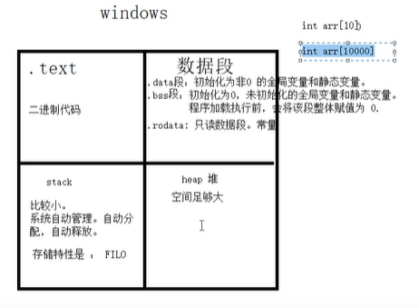


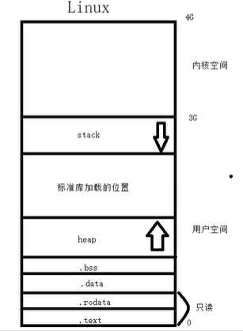

堆和栈都是程序运行时才分配的空间。

## 1.2、C++内存六区模型

栈、堆、自由存储区、全局/静态存储区、常量存储区、代码区

其中：

自由存储区和堆比较类似，堆是由操作系统维护的一块内存，提供了动态分配的功能，是一种底层的内存管理方式，直接涉及到操作系统的内存管理策略。自由存储区是C++的一个抽象概念，在C++中使用new和delete进行内存的申请和释放的区域被称为自由存储区。

虽然在部分编译器的实现中，自由存储区和堆两块内存都使用同一种管理方式，但它们在概念上是有所区别的。堆是具体的内存区域，而自由存储区则是一种内存管理的抽象概念。

而常量存储区和c中的.rodata段是相同的，存放的是常量，不允许修改，代码区和.text代码段的作用相同，存放函数体的二进制代码。


## 1.2、全局变量和局部变量有什么区别

* 声明周期不一样：全局变量随着主程序创建而创建，随主程序销毁而销毁；局部变量在局部函数内部，甚至局部循环体等内部存在，退出就不存在了。
* 使用方式不同：通过声明后的全局变量在程序的各个部分都可以使用，存储在全局数据段，局部变量分配在堆栈区，只能在局部使用


## 1.3、内存对齐

**概念：**

实质：空间交换时间

> 一个变量占用n个字节，则该变量的起始地址必须是n的整数倍即:存放起始地址 %n=0。
>
> 如果是结构体，那么结构体的起始地址是其**最宽**数据类型成员的整数倍。

在结构体中：

> * 内存的分配顺序是按照声明的顺序
> * 第一个成员在结构体偏移量位0的地址处
> * 未特殊说明或指定，其他成员按结构体中size最大的成员对齐。
> * 结构体大小为最大对齐数的整数倍。


**根本原因：**

CPU需求，和CPU访问的总线宽度有关，提高CPU查询效率，浪费了空间但是提升了CPU读取速度。

例子：CPU在读取数据时，CPU位数32，总线宽度为32，4字节。那么以**整除以4**的地址开始读取数据，如果不进行内存对齐，连续存放数据。对于变量C读取时需要读取两次并进行拼接。

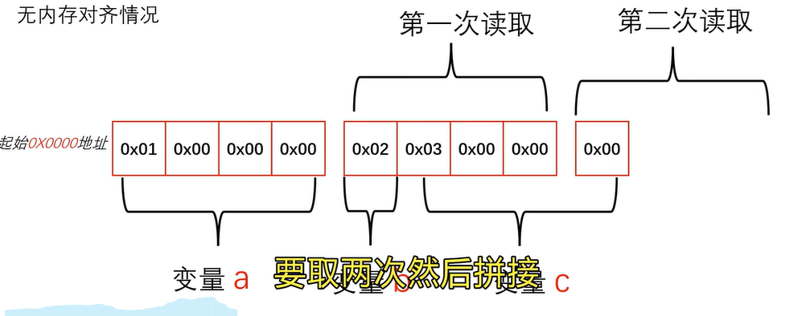

内存对齐后，都以4字节存储，对于变量C只需要读取一次：

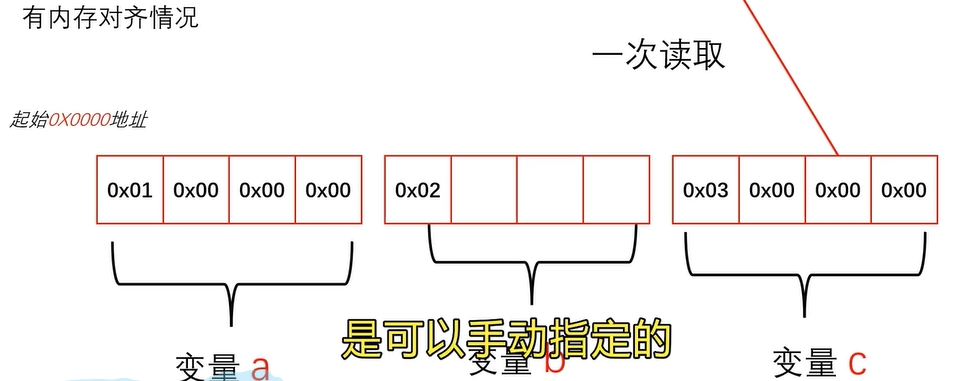


**新特性：**

C++11引入了新特性：

* alignas：(指定结构体的对齐方式)
	* alignas指定的(结构体)对齐方式必须≥数据成员类型，小于自然对齐的最小单位，则被忽略。
	* 对于单字节的对齐方式，应使用#pragma pack(push,1)或_attribute_((packed))
* alignof：(计算类型的对齐方式)

```c++
struct alignas(4) info{
	unit8_t a;
	unit16_t b;
    alignas(8) char d;
    alignas(double) int e;
	unit8_t c;
};
```

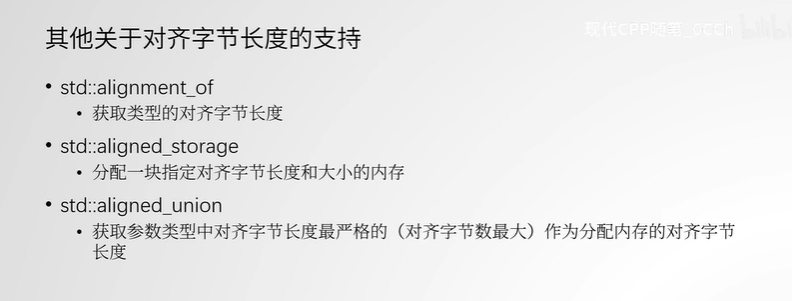

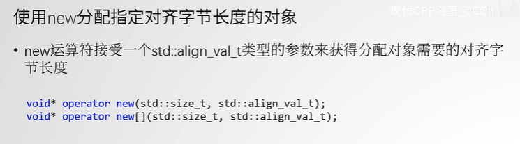


# 2、指针与引用

## **2.1 、指针和引用的区别**

指针：

引用：

* 引用的本质是指针常量的伪装，也是指针


## **2.2、传递参数时，什么时候使用指针(*)，什么时候使用引用(&)。**

* 返回函数内局部变量的内存的时候用**指针**，使用指针需要开辟内存，用完要记得释放指针，不然会内存泄漏。
* **类**对象作为参数传递使用**引用**。
* 对栈空间大小比较敏感（递归）时使用**引用**，引用作为别名传递时不需要创建临时变量，开销更小。


## **2.3、指针类型的区分**

```c++
int *p[10]; //指针数组，强调数组概念，是一个数组变量，数组大小为10，数组内每个元素都是指向int类型的指针变量。
int (*p)[10]; //数组指针，强调指针，只有一个变量是指针类型，指向的是一个int类型，大小为10的数组.
int *p(int) //函数声明，函数名为p，参数是int类型，返回值为int*类型。
int (*p)(int) //函数指针，强调是指针，指针指向的函数具有int类型参数，返回值是int型。
```


## 2.4、指针和函数

**返回的值是指针的函数：**

```c++
int *func(){
	int a = 10;
	int *p = &a;
	return p;
}
```

**指向函数的指针**:函数指针

* 函数指针指向的是特殊的数据类型，函数的类型是由其返回的数据类型和其参数列表共同决定的，而函数的名称则不是类型的一部分。
* 一个函数名就是一个指针，其指向函数的代码
	* 函数地址就是该函数的进入点，也就是调用函数的地址
		* 函数的调用：可以通过函数名调用，可以通过指向函数的指针
		* 函数指针还运行将函数作为变元传递给其他函数

```c++
int (*p)(const int&,const int&) = nullptr; //()的优先级大于*
int func(const int &a,const int &b){
	int c = a+b;
	return c;
}
p = func; //p指向func
p = &func;
int result = p(10,20); //30

#include <stdio.h>
// 带有函数指针参数的函数
int applyOperation(int (*p)(int), int value) { //函数指针作为变元传递给函数
    int result = p(value);
    return result;
}

// 一个简单的函数，对输入值进行平方操作
int square(int x) {
    return x * x;
}
// 另一个简单的函数，对输入值进行立方操作
int cube(int x) {
    return x * x * x;
}

int main(){
    int inputValue = 5;
    applyOperation(square, inputValue); //将函数作为参数给另一个函数
    applyOperation(cube, inputValue);
    return 0;
}
```

* 函数指针的存在意义：
	* 函数也有地址，我们希望在同一个函数中通过使用相同的形参在不同的时间使用产生不同的效果。


## **2.5、指针常量和常量指针**

**指针常量**：**是一个指针，指向的是只读变量**（const int *p），无法通过指针来修改该常量的值，但是可以通过其他途径。

**常量指针**：指针本身是一个对象，而引用不是，因此能被定为常量，一个不能更改其指向的指针。**指针是个常量，必须初始化**，初始化完成后，便不能更改(即存放在指针上的地址无法更改)（int *const p）


## **2.6、数组名和指针**

* 二者均可通过增减偏移量来访问数组中的元素

* 数组名不是真正意义上的指针，可以理解为常指针，所以数组名没有自增、自减操作。
* 当数组名当作形参传递给调用函数后，就失去了原有特性，退化成一般指针，多了自增、自减操作，但是sizeof运算符不能再得到原数组的大小了。


## 2.7、野指针和悬空指针

都是指向无效内存区域（不可控不安全的区域）的指针，访问行为会导致未定义行为。

**野指针**：

* 指的是未初始化的指针
	* 产生原因：指针未及时初始化
	* 解决方法：置空或者及时初始化

**悬空指针**：

* 指针最初指向的内存已经被释放了的一种指针；
	* 产生原因：指针free或者delete之后没有及时置空
		* 一个指针变量，其存储的地址曾经是某个动态分配的内存块的地址，内存已经被释放了（`free`、`delete`），而指针变量本身的值（即它所存储的地址）并没有被设置为`nullptr`或指向另一个有效的内存地址。
	* 解决方法：释放操作后立马置空，使用**智能指针**


## 2.8、形参与实参的区别

* 形参变量只有**在被调用时才分配内存单元**，在未调用时都是没有分配内存空间的，在**调用结束后，即刻释放所分配的内存单元**，因此**形参只有在函数内部才有效**，函数调用结束后则不能再使用该形参变量。
* 实参无论是那种类型的量，在进行函数调用时必须有确定的值，才能传递给形参，在传递时会产生一个临时变量。
* 形参与实参在数量、类型、顺序上必须完全一致。
* 函数调用时，只能将实参传递给形参，不能将形参的值反向的传递给形参，因此函数调用只会修改形参的值，不会修改实参的。


## 2.9、值传递、引用传递、指针传递的区别

* **值传递**：
	
	* 有一个形参向函数所属的栈拷贝数据的过程，如果值传递的对象是类对象，或者是大的结构体对象，将消耗一定的时间和空间。
	* 为了将实际参数（实参）传递给函数，会创建一个或多个**临时对象来存储实参的值**。这些临时对象就是实参的副本。
	* 在值传递中，每个实参的副本都会被创建在函数调用的**栈帧**中，作为形参。这个副本是实参的一个独立拷贝，它在函数执行期间存在，并且其生命周期与函数调用的生命周期相同。
	* 在**函数内部对形参**（即**实参的副**本）的任何修改都**不会影响到原始的实参**。
	
	总结：
	
	​	在值传递中，函数参数是被调用时传递的值的副本。也就是说，在调用函数时，会将实参的值复制一份传递给形参，函数内部操作的是这个副本。
* **指针传递**：
	
	* 也有一个形参向函数所属的栈**拷贝**数据的过程，但是拷贝的数据是一个固定为4字节的**地址**（拷贝的是实参的地址，指向的是实参）
	* **指针传递本质和值传递一样**，都是传递数值的过程，唯一的区别是一个传的具体数值给寄存器，一个**传的数值的地址给寄存器**。
		* 寄存器是主调函数向被调函数输入参数的载体
	
	总结：
	
	​	在指针传递中，函数参数是指向实参的指针。指针传递本质和值传递一样，因此也要给形参分配存储单元，也就是说，在调用函数时，会将实参的地址传递给形参，函数内部通过指针来访问实参的值。
* **引用传递：**
	* 也有一个形参向函数所属的栈**拷贝**数据的过程，但其是针对地址的，相当于为该数据所在地址起了一个别名（地址）。
	* 被调函数的形参也作为局部变量在栈中**开辟了内存空间**，但是这是存放的是由主调函数放进来的实参变量的地址。
	
	总结：
	
	​	在引用传递中，函数参数是对实参的引用。也就是说，在调用函数时，实参和形参引用的是同一个对象，函数内部对形参的修改会直接影响到实参。
	
	
	
	**引用传递和指针传递的不同**
	
	* 引用传递和指针传递是不同的，虽然他们都是在被调函数栈空间上的一个局部变量，但是任何对于引用参数的处理都会通过一个**间接寻址**的方式操作主调函数中的相关变量。
	* 从编译的角度讲，程序在编译时分别将指针和引用添加到符号表中，符号表上记录的是变量名及变量所对应地址。
		* 指针变量在符号表上对应的地址值位指针变量的地址值，而引用在符号表上对应的地址值为引用对象的地址值（与实参名字不同，但是地址相同）
		* 在符号表生成之后，指针的值可以改变其指向（指针变量的值可以修改），而引用对象则不能修改。
* 效率上讲：指针传递和引用传递比值传递效率高，因为只需要复制指针和地址。值传递有生成副本的时间和空间消耗
* 当函数有多个 返回值时，不能用普通的return的方式实现，需要通过地址/指针传递
* 数组作为参数的函数调用方式是地址传递，形参和实参都指向相同的内存空间，调用完成后，形参指针被销毁，但是所指向的内存空间依然存在，不能也不会被销毁。

**案例：**

```c++
void func1()
{
     int *pa = NULL;
     func2(pa); /// 函数返回后pa仍然是空指针，错误点在于这里是值传递，传递pa并不能影响到*pa，传递的是pa的一个拷贝，
    			/// 且由于 pa 存储的是 NULL，这个地址值（即 NULL）本身并没有指向任何有效的内存区域。
     delete pa; /// pa仍然是空指针，pb申请的空间并没有被delete掉
}
 
void func2(int *pb)
//void func2(int *&pb)  //修改使用引用传递即可
{
    pb = new int(5); /// pb重新申请了堆空间，错误点在于没有释放
    				///在 func2 内部对 pb 所做的任何修改，且都不会影响到 func1 中的 pa
}
```


# 3、堆和栈

## **3.1、c++中的内存区域**

**栈：**由编译器在需要的时候分配，在不需要的时候自动清除的变量存储区。里面通常是**局部变量，函数参数和返回值**等。

**堆：**由new分配的内存块，他们的释放编译器不去管，由我们的应用程序去控制，一般一个new对应一个delete。如果程序员没有释放掉，那么在程序结束后，操作系统会自动回收。

**自由存储区：**通过new操作符进行内存申请，该内存即为自由存储区。

**全局/静态存储区**：全局变量和静态变量被分配到同一块内存中，在以前的c语言中。全局变量又分为初始化的和未初始化的，在c++里面没有这个区分了，他们共同占用同一块内存。

**常量存储区**：这是一块比较特殊的存储区，里面存放的是常量，不允许修改。


## **3.2、 程序运行时的内存区域**

C++ 程序在运行时也会按照不同的功能划分不同的段，C++ 程序使用的内存分区一般包括：栈、堆、全局/静态存储区、常量存储区、代码区。
栈：目前绝大部分 CPU 体系都是基于栈来运行程序，栈中主要存放函数的**局部变量、函数参数、返回地址**等，栈空间一般由操作系统进行默认分配或者程序指定分配，栈空间在进程生存周期一直都存在，当进程退出时，操作系统才会对栈空间进行回收。

堆：动态申请的内存空间，就是由 malloc 函数或者 new 函数分配的内存块，由程序控制它的分配和释放，可以在程序运行周期内随时进行申请和释放，如果进程结束后还没有释放，操作系统会自动回收。我们可以利用

全局区/静态存储区：主要为 .bss 段和 .data 段，存放全局变量和静态变量，程序运行结束操作系统自动释放，在 C 中，未初始化的放在 .bss 段中，初始化的放在 .data 段中，C++ 中不再区分了。

常量存储区：.rodata 段，存放的是常量，不允许修改，程序运行结束自动释放。

代码区：.text 段，存放代码，不允许修改，但可以执行。编译后的二进制文件存放在这里。

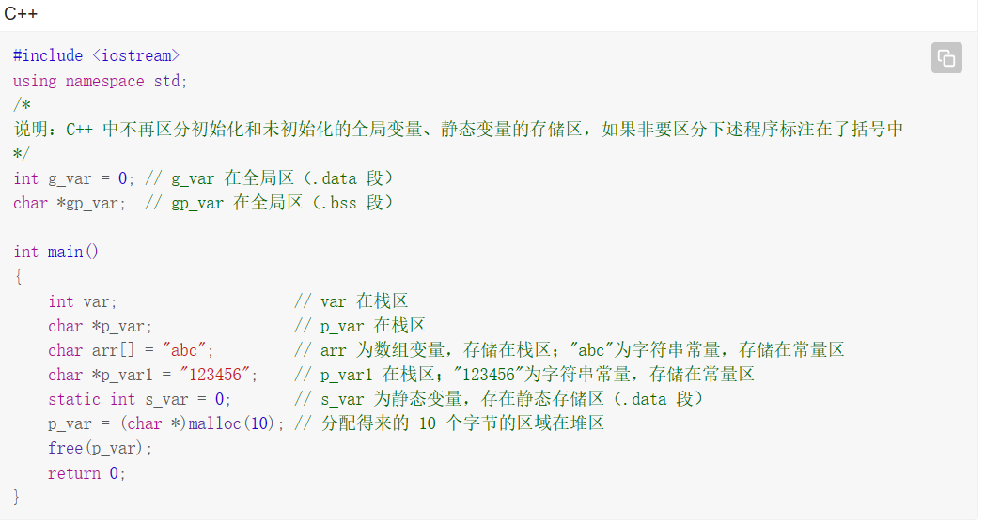


## **3.3、堆和栈在内存管理的区别**

堆（Heap）和栈（Stack）是计算机内存中两种不同的区域，用于存储程序运行时的数据。它们都位于**虚拟内存**中，但在物理内存上的分配和管理方式不同。

而对于代码来说，当考虑到变量的生命周期时，堆与栈的区别就体现出来了。这个变量的生命周期到底是局限在函数内部，还是超越函数，而在栈帧中对局部变量的管理也只是移动指针（寄存器）即可。

* **管理方式不同**: **栈**是由编译器自动申请和释放空间，**堆**是需要程序员手动申请和释放;

	* 栈和堆同时动态的，栈空间存储局部变量和函数调用的信息，每个函数调用的开始和结束都会导致栈空间的减少。

* **空间大小不同**: <u>**栈**的空间是有限的</u>，是一片连续的内存区域，操作系统预设好的，在32位平台下，VC6下默认为1M，**堆**并不连续，受限于计算机系统中的有效的虚拟内存，最大可以到4G;

* **能否产生碎片**: **栈**和数据结构中的栈原理相同，在弹出一个元素之前，上一个已经弹出了，不会产生碎片，而程序员如果不停地调用new,delete会造成很多内存碎片;

* **生长方向不同**: <u>**堆**开口向上</u>，生长方向是向上的，也就是向着内存地址增加的方向，刚好相反,<u>**栈**开口向下</u>，向着内存减小的方向生长，上面为高地址，向下为低地址。同时栈的内存存放方向是高位字节放在高地址，低位字节放在低地址。

* **分配方式不同**: **堆**都是动态分配的，没有静态分配的堆，栈有静态分配和动态分配。**栈**的静态分配是编译器完成的，比如局部变量的分配。动态分配由alloca 函数进行分配，但是栈的动态分配和堆是不同的，它的动态分配是由编译器进行释放，无需我们手工实现。

* **分配效率不同: **<u>**栈**的效率比堆高很多</u>。栈是机器系统提供的数据结构，计算机在底层提供栈的支持，分配专门的寄存器来存放栈的地址，压栈出栈都有相应的指令，因此比较快。**堆**是由库函数提供的，机制很复杂，库的数会按照一定的算法进行搜索内存，并且获取堆的内容需要两次访问，第一次访问指针，第二次根据指针保存的地址访问内存，因此比较慢。

	**堆通常的使用场景**

	* **创建大型对象或数组**：当对象或数组的大小在栈上分配可能会导致栈溢出时，可以使用堆内存。
	* **动态数据结构**：如链表、树和图等，它们的大小在程序运行时可能会变化，因此通常使用堆内存来存储它们的节点。
	* **对象生命周期管理**：当需要控制对象的生命周期，使其超过创建它的作用域时，可以使用堆内存。


## 3.4、栈（方法调用的原理）

* **栈帧**：为单个过程分配的把部分栈成为栈帧（也就是函数{}包含的部分）；
	* 栈帧可以认为是程序栈的一段，其有两个端点，一个表示起始地址，开始地址指针寄存器ebp，一个标识结束地址，结束地址指针寄存器esp。
	* **ebp寄存器**：基址指针寄存器（帧指针寄存器），它内存放一个指针，**该指针指向系统栈最上面一个栈帧的底部**。在函数调用时，ebp**被用来保存当前栈帧的基址**，从而可以方便地访问函数的局部变量和参数。通过ebp，程序可以在函数调用和返回过程中维护正确的执行上下文。
	* **esp寄存器**：栈指针寄存器，用于指向当前整个栈的栈顶（下一个压入栈的活动记录的顶部）。它内存放一个指针，**该指针永远指向系统栈最上面一个栈帧的栈顶**。当数据被压入栈时，esp的值会减小(栈是向下生长的)；当数据从栈中弹出时，esp的值会增大。通过esp，程序可以控制和管理栈上的数据。
	
* **栈是由一系列栈帧（Stack Frame）构成的**。栈帧是编译器用来实现函数调用的一种数据结构，它保存了函数调用期间的局部变量、**返回地址**、操作数栈等信息。**每当一个函数被调用时，就会在栈上创建一个新的栈帧**，用来保存该函数执行时的状态。当函数执行完毕后，对应的栈帧就会被销毁，释放其占用的内存空间。因此，栈的结构就是由这些栈帧构成的，每个栈帧都对应着一次函数调用。

	* 返回地址：被调用函数执行结束后跳回的地方。
	* **call指令**：每一个函数都保存在代码段中，当一个函数调用另一个函数时，会调用**call**指令，call指令会调转到被调用函数的入口地址处开始执行，即会将下一条指令的地址存入内存。
	* **ret指令**：而每一个函数最后又有一个**ret**指令，负责在函数结束后跳回到调用处继续执行后。
	* **rip寄存器**：
		* `rip`（或称为`RIP`，具体取决于汇编器的语法和文档）是程序计数器寄存器，它始终存储着CPU当前正在执行的指令的地址。因此，无论是否执行`call`指令或发生函数调用，`rip`都会在使用中。
		* 每当CPU执行一条指令时，它都会从`rip`寄存器中读取下一条要执行的指令的地址。在执行过程中，`rip`的值会自动递增以指向下一条指令。即使在函数内部执行指令时，`rip`也在不断地更新，以反映当前执行的指令位置。
		* 当执行`call`指令时，`rip`的值会被临时保存（通常压入堆栈），以便在函数返回时能够恢复执行点。然后，`rip`的值会被设置为被调用函数的起始地址，从而开始执行该函数。

	* 栈有bp栈基和sp栈指针

	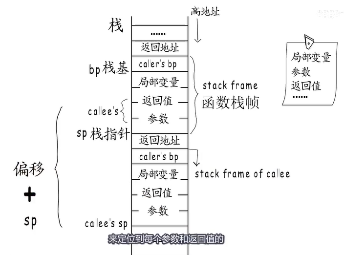

* **栈的扩展**：栈帧的大小在编译期间确定，当函数需要的空间不够用时，编译器可以在函数头部插入检测代码，如果需要”栈增长“，需要另外分配另外一段较大栈空间，然后将旧空间的值复制过来。最后释放旧的栈空间。

* 一个栈帧对应一个过程，每一个栈指针+4的位置存储函数返回的地址，每一个栈帧都建立在调用者的下方，当被调用者执行完毕时，这一段栈帧会被释放。由于栈帧是向地址递减的方向延申，因此如果将栈指针减去一定的值，就相当于给栈帧分配了一定空间的内存。如果将栈的指针加上一定的值，也就是向上移动，那么就相当于压缩了栈帧的长度，也就是说内存被释放了。

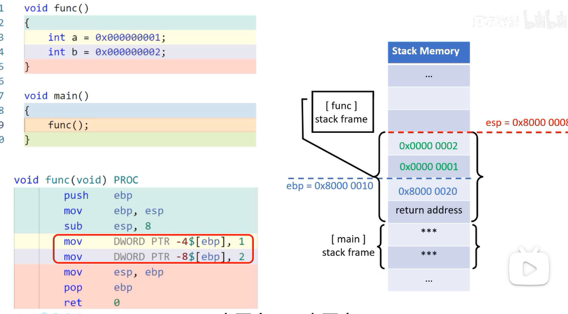

如图：

* 首先是main函数的栈帧，esp标识栈顶的内存地址（在系统最上面一个栈的顶部），edp用来标识main函数的栈帧基地址（在系统最上面一个栈的底部）
	* **sub指令**：可以从一个寄存器或内存位置中减去另一个值，并将结果存储在指定的寄存器或内存位置中
* 其次是func函数的栈帧，esp和edp的位置如同main函数，一个在栈帧顶一个在栈帧底。

**指令执行过程：**

* 首先将寄存器edp的初始值，压入栈顶，esp向上移动（可以保证在最后调用完成后返回时能回到最初的edp状态）。

* 其次，通过mov指令，将esp的值给edp。现在edp指向马上要调用的func的函数的基地址。

* 然后，通过sub指令，将esp提升8个水位线，用来保存func函数的调用信息，给两个临时变量分配堆栈内存，func()函数的栈帧设置完成。

	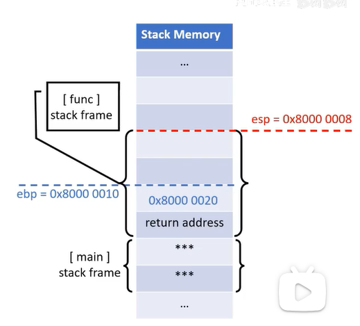

* 然后通过mov指令对ab进行赋值

* 当函数返回时，为了恢复main函数的栈帧，通过mov指令，先将edp的内容给esp，降低esp水位线，保证esp与edp持平，然后通过pop指令，将事先压入栈顶的edp值返换给寄存器edp，即将edp回到初始main函数的栈底，而这里由于0x80000020（edp刚开始的基地址）被pop，因此esp也下降指向main函数栈帧的顶部。

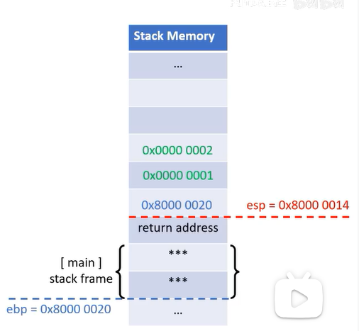


**注意：**

* 虽然函数调用的相关信息（如堆栈帧）保存在栈上，但函数本身的代码（即函数体）并不直接存储在栈上。**函数体通常存储在程序的代码段**或文本段中，这是程序的只读部分，而栈用于存储程序运行时的动态数据。
* 函数调用时，rip寄存器、ebp寄存器和esp寄存器是协同工作的。rip寄存器负责指令的执行和跳转，ebp寄存器帮助访问函数的局部变量和参数，而esp寄存器则管理着数据的压入和弹出操作。它们共同确保函数调用的正确执行和程序的流畅运行。

**总结：**

* 操作系统会为每个任务分配：一段内存，当作任务堆栈，cpu提供两个寄存器esp和edp用来标识当前函数对堆栈的使用情况，随着函数的调用，函数的栈帧会逐层堆叠，互不重合，当函数逐层返回，栈帧会被清理，但是内存不会释放。
* 正括号（{）用来保护上层主调函数的栈帧，并设置被调函数的栈帧，反括号用来放弃被调函数的栈帧，同时恢复主调函数的栈帧，这样被调函数执行完后，主调函数就能继续执行
* edp寄存器保存当前函数的栈帧基地址，配合一定的偏移，就可以读写函数体内的临时变量，如果一个变量通过edp寄存器间接访问，那么这个变量往往是临时变量
* 不同编译器对栈帧的实现方法不同，但思路一样
* rdp和rsp是x86-64位寄存器，edp和esp是x86-32位寄存器，两者功能类似，只是在不同的系统中。


## 3.5、C++函数的压栈过程

##### 1、函数的压栈过程

```c++
int f(int n){
	cout << n << endl;
	return n;
}
void func(int param1,int param2){
	int var1 = param1;
	int var2 = param2;
	printf("var1 = %d,var2= %d",f(var1),f(var2));
}
int main(int argc,char *argv[]){
	func(1,2);
    return 0;    
}
//输出结果
printf: 2 1 var1=1,var2=2 
cout: var1=1,var2=2 1 2 //cout是按照正常顺序执行，有严格的调用顺序
```

* 当函数从入口函数main函数开始执行时，编译器会将我们操作系统的运行状态，main函数的返回地址、main的参数（从左往右）、main函数中的变量、进行依次压栈；

	* 调用者函数使用call指令调用被调函数，并把call指令的下一条指令的地址当成返回地址压入栈中。
	* 在被调函数中，被调函数会先保存调用者函数的栈低地址（push edp)，然后再保存调用者函数的栈顶地址。
		* 即：move edp esp

	* 在被调函数中，从edp的位置开始存放被调函数的局部变量和临时变量，并且将这些变量的地址按照定义时的顺序依次减小。

* 当main函数开始调用func()函数时，编译器会将main函数的运行状态进行压栈，再将func()函数的返回地址、func()函数的**参数从左往右**、func()定义变量依次压栈。

	* c中，对函数参数的扫描是从右往左**，c++中函数参数是从左往右入栈的**
	
* 当func()调用f()时，编译器将将func的运行状态进行压栈，再将f()函数的返回地址、函数的参数从左往右、f()定义变量依次压栈。

* 根据输出结果能看到，f(var1),f(var2)依次入栈，先执行f(var2)。再执行f(var1)，最后打印整个字符串，将栈中的变量依次弹出，最后主函数返回。

	

**函数的调用过程：**

* 从栈空间分配存储空间
* 从实参的存储空间复制值到形参栈空间
* 进行运算

##### **2、临时变量作为返回值时的处理过程**

临时变量，在函数调用过程中是被压到程序进程的栈中，当函数退出时，临时变量出栈，即临时变量被销毁，但是临时变量占用的内存空间没有被清空，还可以被分配给其他变量。

* 函数调用结束后，返回值被临时存储到寄存器中，并没有放到堆和栈中，当退出函数的时候，临时变量可能被销毁，但是返回值被放到寄存器中与临时变量的生命周期没有关系了。
* 需要返回值的话，一般赋值操作可以获取                                                                                   


# 4、new与delete

## 4.1、C++中的几种new

典型的new有三种：plain new、northrow new和placement new

##### 1、**plain new**：

* 也就是普通的new，plain_new在空间分配失败的情况下，抛出std::bad_alloc而不是NULL。
	* **bad_alloc是C++标准库中的一个异常类，用于表示内存分配失败的情况**。

```c++
int main(){
	try{
		char *p = new char[100];
		delete p;
	}
	catch (const bad_alloc &ex){
		cout << ex.what() << endl;  //bad allocation
	}
	return 0;
}
```

底层实现：

```c++
void *operator new(std::size_t) throw(std::bad_alloc);
void delete delete(void *) throw;
```

##### **2、nothrow new:**

**内存空间申请失败时**不会返回异常，而是**返回nullptr**

```c++
int *p = new(std::nothrow) int;
if(p == nullptr)
```

底层实现：

```c++
 void *operator new(std::size_t,const std::nothrow_t&) throw
 void operator delete(void *) throw();
```

##### 3、**placement new（定位new）：**

定位new允许在一块已经分配成功的内存上**重新构造对象或对象数组**，其**不分配内存**，而是接收一个指针，在指针指向的位置构造对象。

* palcement new的主要用途时**反复使用一块较大的动态分配的内存来构造不同类型的对象或者他们的数组**。
* palacement new**构造起来的对象数组，必须显式的调用其析构函数进行销毁**，**且不能使用delete**。
	* palacement new构造的对象或数组不一定等于原来分配的内存大小，使用delete会造成内存泄漏或者在之后释放内存时出错。

```c++
class person{
public:
	int m_age;
	string m_name;
public:
	person(){
		this->m_age = 10;
		this->m_name = "wang";
	}
	~person(){}
}

person *p = new(nothrow) person;
person *q = new(p) person;  //定位new，只要p所指向的空间足够person创建就不会失败

q->person::~person(); //显示调用析构去释放，不能使用delete
delete p;
p = nullprt;
```

底层实现：

```c++
void *operator new(size_t,void*);
void operator delete(void*,void*);
person *q = new(p) person();
	void *mem = operator new(sizeof(person),p);
	person *q = (person *)mem;
	q->person::person();
```


## 4.2、new的重载

```c++
class Airplane{
public:
    Airplane *next;
private:
	static const int BLOCK_SIZE;
	static Airplane *headOfFreelist;  //指向Airplane类型对象的指针，headOfFreelist是变量名
}
Airplane *Airplane::headofFreelist;  //类外初始化.默认为0
const int Airplane::BLOCK_SIZE = 512;

void *Airplane::operator new(size_t size){
    Airplane *p = headofFreelist;  //p = 0
    if(p){
        headofFreelist = p->next;
    }
    else{
        Airplane *newBlock = static_cast<Airplane *>(::operator new(BLOCK_SIZE *sizeof(Airplane)));
        //利用全局的operator new申请了BLOCK_SIZE*sizeof(Airplane)大小的内存空间，并强转给临时对象newBlock
        for(int i = 1;i<BLOCK_SIZE-1;i++){
			newBlock[i].next = &newBlock[i+1];
        }
        newBlock[BLOCK_SIZE-1].next = 0;
        p = newBlock;
      headofFreelist = &newBlock[1];  
    }
    return p;
}
```

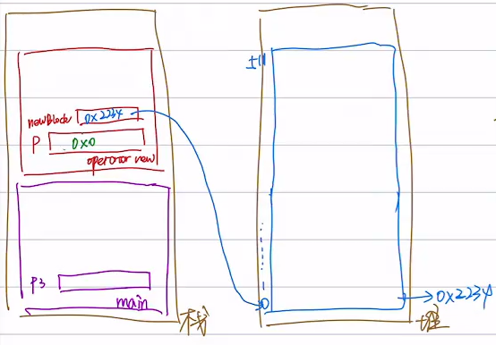


## **4.3、new/delete和malloc/free的区别**

**相同点：**

* 都是为了申请一片可以自由管理的内存空间，用于内存的动态申请和释放。

**不同点：**

* new/delete是c++运算符，可以重载，malloc/free是c/c++语言标准库函数；

* new分配的位置是在自由存储区，malloc分配的位置是在堆中；

* new自动计算要分配的空间大小，malloc需要手工计算；

* new是类型安全的（返回对象类型的指针需要和对象类型一致），malloc不是。malloc的返回值是void*，其会自动进行类型转化，但是一般在写的时候也会根据类型进行强转。

	

* new调用operator new的标准库函数进行内存空间的分配**并调用相关对象的构造函数**。

	delete对指针所指向的对象**运行适当的析构函数**，然后通过operator delete标准库函数释放该对象的内存。

* new封装了malloc，直接free不会报错，但这只是释放内存，不会析构对象。

* malloc和free返回的是void*指针类型，new和delete返回的是具体类型指针。

* new可以重载，new底层是operator new与construct（构造），可以自己重写，malloc由系统提供不能重载。

* new申请内存分配失败会返回bad_alloc异常，malloc返回NULL；

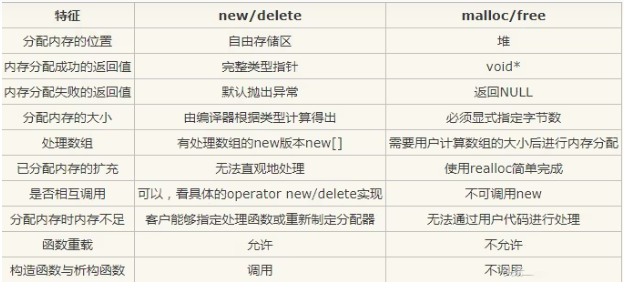

```c++
person *p = new person; //本质上两种写法没有区别，都是再对上分配一个person对象
person *p = new person(); //更清晰地表明你正在调用构造函数
```


## **4.4、new与delete的实现过程**

**new：**

* **对于简单数据类型**：

	* 直接调用operator new运算符分配内存

	* new [] 数组类型，先计算好大小再分配内存

```c++
int *p = new int(5);
int *p = new int[5];
test *p  = new test();
	void * mem = operator new(sizeof(test));  //申请内存
	test *p = (test *) mem; //指针转化
	p->test::test(); //调用构造函数
```

* **对于复杂数据类型**：

	* **首先**掉用operator new运算符，**分配**对象类型的**内存**，来保存对象，

	* **其次**，运行该类型的**构造函数**，用指定初始化构造对象，

	* 最后**返回**执行新分配并构造后的对象的**指针**。
		* 对于复杂类中的new [] 数组空间申请，会将指针**p的前四个字节写入数组大小n**，然后调用n次构造函数。
		* `new[]` 为数组中的**每个对象调用构造函数**，而 `delete[]` 则为数组中的**每个对象调用析构函数**。

**delete：**

* **对于简单数据类型：**
	* 默认调用free函数，直接释放内存

	```
	p->~test();
	operator delete(P);
	```
	
* **对于复杂数据类型**：

	* 首**先**对指针指向的对象运行适当的**析构**函数，然**后**通过调用名为operator delete运算符**释放**该对象的**内存**。
		* 因此可以看出析构函数不会释放内存，delete才会释放内存，析构函数只是包含了调用这些操作符的代码。
	* 如果指针p指向new[]分配的内存，会有4个字节存储数组大小，实际分配内存地址为[p-4]，而delete实际释放的也就是p-4指向的内存。因此new与delete对应，new[]与delete[]对应，这也是**delete能知道释放内存大小的原因**。
	
	```c++
	test *t = new test[3]{test(1),test(2),test(3)};
	delete [] t;  //正常的话会调用三次构造与析构，顺序仍然是先构造的后析构
	delete t; //报错，只会执行一次析构，并且返回异常
	```
	
	


## 4.5、malloc/free的实现原理


## **4.6、free内存回收**

​		**堆的内存管理机制**：系统中有一个记录空闲内存地址的**链表**，系统收到程序申请时，遍历该链表，寻找一个大于申请空间的堆结点，删除链表中的该结点，并将该结点空间分配给程序(new也是遵循这样的规则)。

​		被free回收的内存首先被ptmalloc使用双链表保存起来（类似快表），当用户下一次申请内存的时候，会尝试从这些内存中寻找合适的返回，这样可以避免频繁的系统调用，占用过多的系统资源。同时ptmalloc会对小内存块进行合并，避免过多的内存碎片。


## 4.7、delete p、delete [] p、allocator的区别

* `delete p` 用于释放通过 `new` 操作符分配的**单个对象**的内存，p是一个指向数据类型的指针。
* `delete[] p` 用于释放通过 `new[]` 操作符分配的**对象数组**的内存，`p` 是一个指向 `int` 数组的指针
* 动态数组管理new一个数组时，[]必须是一个整数，但是不一定是常量整数，普通数组必须是一个常量整数。
* new动态数组返回的不是数组类型，而是一个元素类型的指针，**指向数据类型的数组的第一个元素的地址。**
	* delete[]时，会**调用数组中每个元素的析构函数**
	* delete[]会直接释放存储数组的那一片内存块。
* allocator允许分配内存与初始化分离，先申请一片内存空间不进行初始化，需要的时候才进行初始化。


# 5、静态链接和动态链接

## **5.1、符号与符号表**

**符号定义**：为程序中的实体（如变量、函数、类型等）分配一个唯一的名称

**符号引用**：代码中通过使用符号名来访问或操作已定义的实体。

局部变量、函数参数等临时变量temp分配在`栈`中，不会在过程外被引用，因此`不是符号定义`

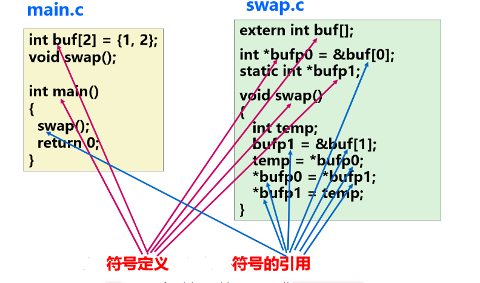


**强符号：**函数名和已初始化的全局变量名

**弱符号： ** **`未初始化`的全局变量名**

**符号表：**符号表是程序/单元中“符号”的列表。符号通常是变量或函数的名称。**符号表可用于确定变量或函数在内存中的位置**。目标文件中有一个称为**符号表的数据结构**，**它将目标文件中的不同项目映射到链接器可以理解的名称**。

汇编过程：

源代码-->预处理-->编译-->优化-->汇编-->链接-->可执行文件

**预处理：**

读取c源程序，对其中的伪指令(#开头的指令)和特殊符号进行处理。包括宏定义替换、条件编译指令、头文件包含指令、特殊符号。最终生成一个没有宏定义、条件编译指令、头文件包含指令、特殊符号的输出文件。.i文件

**编译指令：**

编译程序所要作得工作就是通过词法分析与语法分析，再确认所有的指令都符合语法规则之后，将其翻译为等价的中间代码表示或汇编代码。.s文件

**汇编过程：**

将汇编语言代码翻译成目标机器指令的过程。.o文件

**链接阶段：**

将有关的目标文件彼此连接，也即将在一个文件中引用的符号同该符号在另一个文件中的定义链接起来

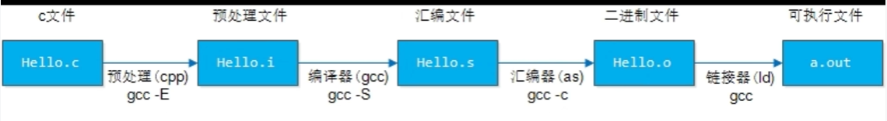

在链接阶段，根据编译器过程中处理方式的不同，链接可以分为静态链接和动态链接。

## 5.2、静态链接

静态链接

静态链接器以一组可重定位目标文件为输入，生成一个完全链接的可执行目标文件作为输出。

* 将所有需要的函数的二进制代码都包含到可执行文件中去，完成所有符号引用的一种链接方式。
* 静态链接库以.a/.lib作为文件后缀，
* 静态库会将代码打包进可执行文件中，在程序执行时可直接使用

符合解析：每个符号对应一个函数、一个全局变量、一个静态变量，符号解析的目的将每个符号引用与符号定义关联起来。

重定位：链接器通过每个符号定义与一个内存位置关联起来，然后修改所有对这些符号的引用，使它们指向这个内存位置。

**优点：**

* 静态库直接将库打包进程序，最终可执行文件的执行比较快

**缺点：**

* 但是如果很多文件使用同一块静态库，那么打包后每个可执行文件都会有相同的静态库，占内存，
* 如果静态库需要更新的话，依赖静态库的程序也需要重新进行链接。


## 5.3、动态链接

特点：

* 在链接的时候，不直接拷贝相应的依赖库的代码，而是通过记录一系列符号和参数，在程序运行或加载时将这些信息传递给操作系统，由操作系统将所需要的依赖库加载到内存中，然后**程序在运行到指定代码时，去执行内存中已经加载的依赖库的代码**，最终达到运行时链接的目的。
* 动态链接库以.so/.dll作为文件后缀。
* 动态链接库不会将代码打包到可执行文件中，而是打包动态库的名称等信息，每个程序只存放了动态库的虚拟地址，程序运行时会根据这些信息将动态库加载到内存中，才可以使用动态库中的代码。

优点：

* 动态链接可以实现进程间资源共享，程序A需要某一动态库中，再将动态库加载进入内存，当程序B也需要使用时，就不需要再加载了，两个程序共享动态库。


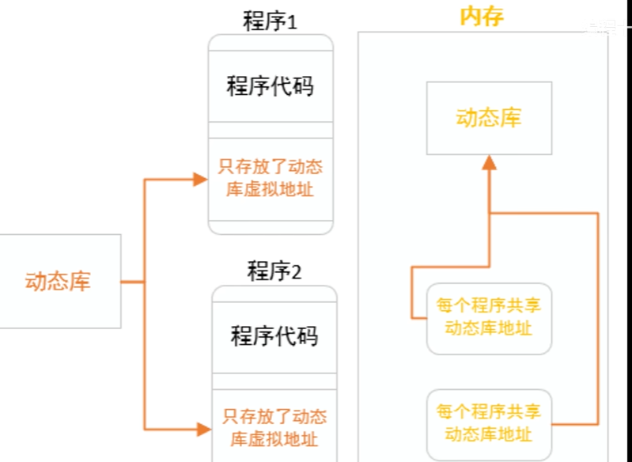


# 6、宏定义

## **6.1、宏定义和函数、typedef的区别**

**宏**：简单的字符替换，编译时编译器替换，定义的参数没有类型且运行时不存在函数调用，不进行类型检查，没有返回值，执行起来更快。

**函数调用：**运行时需要跳转到具体调用函数，具有返回值，参数具有类型，需要检查类型。

## **6.2、宏定义和typedef的区别**

* 宏主要用于定义常量即书写复杂内容，Typedef主要用于定义类型别名。
* 宏替换在**编译阶段之前（预处理阶段）**，属于文本插入；typedef是编译的一部分。
* 宏不检查类型，typedef会检查数据类型。
* 宏不是语句，不需要加分号，typedef是语句，加分号标识结束。
* 对指针的操作不同


## **6.3、变量声明和定义的区别**

* 声明仅仅是把变量的声明的位置及类型提供给编译器，并不分配内存空间；定义需要在定义的地方为其分配内存空间
* 相同变量可以在多处定义（外部声明extern），但是只能定义一次。
	* extern将一个文件的全局变量拓展到整个项目，实现变量在不同文件的共享
	
	

## **6.4、sizeof和strlen之间的区别**

* sizeof是运算符，不是函数，strlen字符处理的库函数
* sizeof参数可以是任何类型或者数据；strlen参数只能是字符指针且结尾是‘/0’结尾的字符串。
* sizeof值在编译时确定，所以不能用来得到动态分配（运行是分配）存储空间的大小。
	* c++中则调用_msize()函数获取动态分配内存空间大小
	* sizeof不能重载
	
	

## 6.5、宏定义和内联函数的区别

* 宏定义只在**编译前**做了简单的字符串替换；而内联函数可以在**编译时**进行参数类型检查，且具有返回值。

* 内联函数在编译时直接将函数代码嵌入到目标代码中，在函数的调用点直接将函数的代码进行展开处理，省去函数调用的开销提高执行效率。并且进行**参数类型检查，具有返回值，可以实现重载。**

* 宏定义时要注意书写，否则容易出现歧义，内联函数不会产生歧义。

	内联函数使用场景：

	* 宏定义可以使用的地方都可以使用内联函数
	
	* 作为类成员接口函数来读写类的私有成员或者保护成员，会提高效率。(参考单例模式代码)
	
		
	

## 6.6、内联函数

```c++
#include<iostream>
inline int sum(int x,int y){
	return x+y;
}
int main(){
    int a = 10;
    int b = 20;
    //函数调用的开销：此处有标准的函数调用过程，包含函数压栈、函数栈帧的开辟和回退过程
    int ret = sum(a,b); //直接展开
}
```

当**函数调用的开销已经远远大于函数的执行开销**的时候可以使用内联函数：

* inline内联函数：在编译过程中，就**没有函数开销**了，在函数的调用点直接把函数的代码进行展开处理
* inline函数不再生成响应的**函数符号**。
* **递归**不会被编译器处理成内联函数
	* inline只是建议编译器将函数处理为内联函数，并不一定声明就是内联函数
* **debug版本，inline是不起作用的**，因为要进行调试，只在release版本下才能出现

不能把所有的函数都写成内联函数：

* 当函数体内有循环，递归等，导致函数的执行开销远远大于函数调用，内联没有意义
* 函数体内的代码较长时，将导致内存消耗太大


## 6.5、NULL与nullptr

**NULL:**

* c语言中NULL被定义为(void *)，c++中NULL被定义为整数0
	* c++允许函数重载，如果把NULL作为参数，无法分辨整数和指针的区别

**nullptr:**

* nullptr是明确的指针类型。
* 可以明确区分整型和指针类型，能够根据环境自动转换成相应的指针类型，但不会被转换为任何整型，所以不会造成参数传递错误


# **7、struct和class**

## 7.1、struct和class的区别

**相同点：**

* 两者都有成员函数、共有和私有部分。
* 任何可以使用class完成的工作，是同struct同样可以完成

**不同点：**

* 当不指定成员的公私有时，struct默认共有，class默认私有。
* struct默认共有继承、class默认私有继承；
* class是引用类型，实例化时在堆中分配空间，栈中保存的只是引用（地址）；struct是值类型，在栈中分配空间。

## 7.2、 class中三种接口的访问和继承权限


# 8、const和static

## **8.1 、const和static的区别**

**static：**

* **不考虑类的情况下：**
	* **隐藏。** **加了static的全局变量和函数只能在本文件所在的编译模块中使用**，将全局变量的外部链接属性修改为内部链接属性。
		* 当同时编译多个文件时，所有未加static前缀的全局变量和函数都具有全局可见性。
	* **默认初始化为0，**包括未初始化的全局变量和静态变量，都保存在数据段中的.bss段中。
		* 全局变量也具有这一特性，因为全局变量和静态变量都存放在静态数据区(.bss和.data)，在静态区，所有的字节默认值都是0x00。
	* **static在函数内部调用，始终存在**，**只进行一次初始化**，不会被释放掉，**具有全局变量特性**，改变了其生存周期。
		* static局部变量在编译前就要分配内存空间，存储在静态数据区的变量也会在程序刚开始运行时就完成初始化，也是唯一的一次初始化。
		* 全局变量和static对象会在首次使用时(在代码出现的顺序)才会进行构造，并通过atexit()进行管理，程序结束时，按照构造的反方向进行析构调用。

```c++
void func(){
    int s_num = 0; //每次
	static int num = 0; //只初始化一次
	num++;  //不释放
    cout << s_num << endl;
	count << num <<endl;
}
for(int i = 0;i<3;i++){
	func();
}   //s_num: 0 0 0  num: 1 2 3
```

* **考虑类的情况下**：
	* **static成员变量**:
		* 无论创建多少个类的对象，静态成员变量**只有一个副本存在于内存中**，它们是**与类本身关联的，而不是与类的对象关联的**。
		* **只与类关联，不与类的对象关联**，在类的命名空间中。static成员变量在编译阶段就要分配内存空间。**因此是共享的，不属于具体某个对象**，在**类内声明，类外初始化**，初始化时不需要标为static；可以被非static成员函数任意访问。
			* 通常存储在全局数据区（静态存储区）
				* 初始化为0，或者未初始化存在.bss段
				* 初始化非0.存在.data段
			* `static`成员变量的**内存分配发生在运行时**，它们的地址在编译后就已经确定了
		* 可以通过对象和类名进行调用
		* 也有访问权限，不能访问private数据
	* **static成员函数**：
		* **不具有this指针**，**只能访问类的static成员变量**，**不能被声明为const、虚函数和volatile**；
			* 没有this指针，所有不能被virtual修饰，**static本身也不属于任何对象或者实例,属于整个类所拥有，所以加上virtual没有实际意义**，而且虚函数的实现是为每个类对象分配一个vptr指针，但是**虚函数指针是通过this指针调用的**。
		* 可以被非static成员函数任意访问：因为静态成员为所有类对象所共享。
		  * 不能访问非static成员：因为没有与之关联的特定对象，也没有 `this` 指针来引用对象的成员变量，无法区分某一个成员变量到底修饰的那个对象。
		  * 不能访问非static成员函数：因为没有this指针
		* 可以通过对象和类名进行调用
		* 也有访问权限，不能访问private数据

```c++
class Student{
public:
	static int m_a;    
};
int Student::m_a = 10;
Student A; 
A.m_a = 100;
Student B;
A.m_a = 200; 
cout << A.m_a << endl; //这里通过对象访问数据，最终的m_a就是200，因为所有对象共享,即使通过A.m_a调用，但是B.m_a已经修改了。
cout << Student::m_a << endl; //这里也是类外初始化的原因，可以直接通过类名来访问数据，通过对象访问要调用构造函数进行初始化，但是通过类名访问，不需要经过构造函数初始化，因此需要类外初始化
```

 **const:**

* 不考虑类的情况：
	* const常量在**定义时必须初始化**，**之后无法修改**。
	* 在函数声明中。**const可以修饰形参**，表示它是一个输入参数，**在函数内部不可以修改其值**。
		* const形参可以接收const和非const类型的实参.
* 考虑类的情况
	* **const成员变量**：不能在类定义外部初始化，**只能通过构造函数初始化列表进行初始化**，**并且必须有构造函数**；不同类对其const数据成员的值可以不同，所以不能再类中声明初始化。
	* **const成员函数**：表明这是一个**常函数**，不能修改类的成员变量
	  * **const对象只能调用类的const成员函数**；非const对象都可以调用，不可以改变非mutable数据的值。
	  	* **mutable**：和const是相反的，让变量永远处于可变状态，可以突破const限制，可以在const修饰的成员函数中修改成员变量。
	  * const成员函数可以访问：非const对象的的非const数据成员、const数据成员、const对象内的所有成员。

```C++
class person{
public:
	int m_a;
    mutable int m_b;
    void add() const{ //const修饰成员函数
		m_a = 10;  //错误，不可修改，this指针已经被const修改为指针常量
        m_b = 20； //正确
    }
}
```

**problem:**

如何在main函数的函数体执行之前就打印文本？

* 单例模式——>static:static成员变量编译前便要分配内存。**类在实例化时在分配内存空间，static先于类的创建**

```C++
class Student{
private:
    Student(){cout << "先输出" << endl;};
    Student(const Student &s){}
    static Student *stu;
public:
    static Student *getInstance(){
        return stu;
    }
};

Student *Student::stu = new Student;

void test(){
    Student *p=Student::getInstance();
}

int main(){
    cout << "后输出" << endl;
    test();                 //这里test尽管在上后面的输出文本后面，但是由于static成员变量在编译结点就要分配内存空间，也就会							执行Student *Student::stu = new Student;语句并调用其相关构造函数。
}
// 先输出
// 后输出
```

**static成员变量为什么在数据段？**

1. **生命周期**：数据段（包括全局和静态存储区）用于存储那些在整个程序执行期间都存在的变量。`static`成员变量不属于任何特定的对象实例，而是属于类本身。因此，它们的**生命周期与程序的整个运行时间一样长，这符合数据段的特性**。
2. **初始化**：`static`成员变量**必须在程序开始执行之前就被初始化**。这意味着它们不能在运行时被动态地分配内存。**数据段是在程序加载时就已经分配好的内存区域**，因此`static`成员变量被放置在这里以便在程序启动时就能被正确地初始化。
3. **共享性**：虽然`static`成员变量存储在数据段中，但这并不妨碍它们被类的所有对象共享。存储位置的选择主要是基于其生命周期和初始化需求，而不是基于其共享性质。实际上，由于`static`成员变量只有一个实例，所以无论你从哪个对象访问它，你都会得到相同的值。
4. **作用域**：`static`成员变量的作用域是全局的，这意味着它们可以在程序的任何位置被访问（当然，通过类的作用域解析运算符`::`）。将它们放在数据段中有助于确保这种全局访问性。

**static变量和全局变量的区别：**

* 隐藏，且static只初始化一次，防止在其他文件单元被引用。


## **8.2、顶层const和底层const**

* **顶层const**：（int * const p = &a）指的是const修饰的变量本身是一个常量，无法修改。（常量指针）
* **底层const**：（int const *p = &a）指的是cons修饰的变量所指向的对象是一个常量。（指针常量）

**区分：**

* 执行对象的拷贝时有限制，常量的底层const不能赋值给非常量的底层const。
* 使用命名的强制类型转换函数const_cast时，只能改变运算对象的底层const。


# 9、关键字

## 9.1、分清重写、重载和隐藏

**重载(overload)**：

​		通过是**同一个类**当中由两个及两个以上的同名函数，但是其有不同的参数列表，重载和函数是否是虚函数无关。

**重写(override)**：

​		派生类的重写了父类中的同名同形参的虚函数，但是其函数体不同，重写要求与基类虚函数有相同的参数个数，参数类型，返回值类型。

**隐藏(overwrite)**：

* 是指基类函数，无论它是**否为虚函数**，当派生类出现同名函数时，如果**函数形参不同于基类函数**，则基类函数会被**隐藏**,即调用的话调用的是派生类的成员变量和成员函数。
* 如果**派生函数与基类形参相同**，则需确定基类函数是否是虚函数，如果**是虚函数则是重写**，否则基类也会被隐藏。
* 和重载的区别也是不在一个类中。

**重载和重写的区别：**

* 重载是在同一个类中。重写是在具有继承关系的父类和子类之间
* 重载要求参数列表不同，对返回值没有要求；重写要求与基类虚函数有相同的参数个数，参数类型，返回值类型。
* 重载根据调用时的实参表参与形参表的对应关系来选择函数体，重写的调用方法根据对象类型决定。

**override**

override的作用是**指定子类函数要重写父类的虚函数**，当编译错误时，编译器不会将其当作新函数进行编译。

```c++
calss A{
public:
	virtual void func();
}；
class B:public A{
	virtual void func() override; //指定子类是父类虚函数的重写
};
```

**final**

当**不希望某个类被继承，或者不希望某个虚函数被重写**，可以在类名后或者函数后添加final关键字。

```c++
calss A{
public:
	virtual void func() final;//无法被重写
}；
class B:public A{
	virtual void func(); //会报错
};
class C final:B{  //指明C是不可以被继承的
	void func();
} 
```


## **9.2、explicit**关键字

* 用来修饰类的构造函数的**声明**上
* 作用于**单个参数**的构造函数

```c++
Struct B{
	explicit B(int){}
	exclicit operator bool const(return true);
}
```

* explicit关键字修饰构造函数时，**不允许**出现**隐式转换**和**复制初始化**（拷贝初始化）。

```c++
A a = 1; //不允许，复制初始化
A a2 = {1};//不允许，复制列表初始化
A a3 = (A)1; //允许static_cast的显示转换
A a4 = a3; //不允许，隐式转换
```

* explicit关键字修饰转换函数时，可以防止隐式转换，但**按语境转换**除外。

```c++
A a(1); //直接初始化
bool a2(a); //按语境转化，bool中除了0时false，其他都是true
```


## 9.3、extern关键字

extern关键字是为了能够在C++中使用C语言，告诉编译器这部分代码是C语言写的,一般都声明在头文件中。

```c++
//xx.h
extern int add(...)

//xx.c
int add(){}

//xx.cpp
extern "C"{
    #include "xx.h"
}
```


## 9.4、volatile关键字

**概念：**

volatile关键字和const关键字对应，修饰变量时，编译器对访问该变量的代码就不再进行优化。

* 能**保证对特殊地址的稳定访问**。
* **防止指令重排序**,保证其指令的执行顺序与程序指明的顺序一致，不会发生顺序变换
	* 编译器对代码的优化：
		* 对于以下代码，当编译器发现两次从i读数据的代码之间没有对i进行操作，他就会把上次读的数据保存再b中，而不是从i里面重新读取，这样的话，当i是一个寄存器变量或者表示一个端口数据就容易出错，因为一般的**对象编译器或将其拷贝放在寄存器中用以加快指令的执行速度。**


```c++
volatile int i = 10;
int a = i;
...
int b = i;
```

​	volatile指出变量是随时可变的，每次使用一个变量必须从其地址中读取,即**系统总是重新从它所在的内存中读取数据**，因此每一时刻线程读取到该变量的值都是内存中**最新的值**。

**使用环境：**

* 中断服务程序中修改的供其它程序检测的变量需要加volatile； 
*  多任务环境下各任务间共享的标志应该加volatile，即多线程并发共享变量时； 
*  存储器映射的硬件寄存器通常也要加volatile说明，因为每次对它的读写都可能由不同意义；

**volatile指针**：

与const修饰此类似，volatile也有：

* 修饰由指针的指向的对象，数据时const（指针常量）、或者volatile的：

```c++
volatile char *pre;
```

* 指针自身的值，一个代表地址的整数变量时const（常量指针）、volatile的

```c++
char *volatile pre;
```

**多线程下的volatile**：

当多个线程都要用到某一个变量且该变量的值会被改变时，应该用volatile，该关键字会防止优化编译器把变量**装入到CPU内存寄存器**中，如果变量被装入寄存器，那么两个线程有可能一个使用内存中的变量，一个使用寄存器中的变量，这回造成程序的错误执行。

```c++
volatile BOOL bstop = False；

//一个线程
while(!bstop){}
bstop = false;
return;

//另一个线程
bstop = True;
while(bstop); //等待上面的线程终止
```

如果bstop不使用volatile申明，那么这个循环将是一个死循环，因为bstop已经读取到了寄存器中，寄存器中bStop的值永远不会变成FALSE，加上volatile，程序在执行时，每次均从内存中读出bstop的值，就不会死循环了。

**底层实现原理：**

保证可见性与有序性

**可见性：**

* 当一个变量被声明为 volatile 时，它会告诉编译器和CPU将该变量存储在主内存中，而不是线程的本地内存中。即每个线程读取的都是主内存中最新的值，**避免了多线程并发下的数据不一致问题**。

​		当线程A和线程B都保存了a变量的本地内存副本，当线程A的a被修改时，会立马将数据更新到主内存，同时当B要使用变量a时，会清除线程B的本地内存副本数据并同步主内存数据。


**有序性：**

* 重排序可以分为**编译器重排序和处理器重排序**，valatile保证有序性，就是通过分别**限制这两种类型的重排序**。

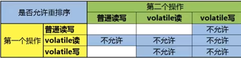


为了实现volatile的内存语义，编译器再生成字节码时会在指令序列中插入**内存屏障**来禁止特定类型的处理器重排序。

* 在每个volatile写操作的前面插入一个StoreStore屏障
* 在每个volatile写操作的后面插入一个StoreLoad屏障
* 在每个volatile读操作的后面插入一个LoadLoad屏障
* 在每个volatile读操作的后面插入一个LoadStore屏障

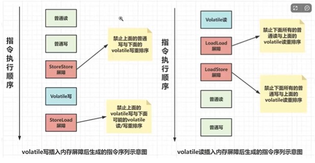


## 9.5、using 关键字

可以改变基类成员在派生类中的访问权限

* 但是只能改变基类中public和protected成员的访问权限，不能改变private成员的访问权限。

```c++
class person {
public:
    int m_a = 10;
protected:
    int m_c = 30;
};
class student:public person{
public:
    using person::m_c;  //把基类中的protected属性m_c改为public
private:
    using person::m_a; //把基类中的public属性m_a改为private
};
student stu;
stu.m_c = 10; //原本是不能访问的，但是using关键字把基类中的protected属性m_c改为public，便可以操作
```


## 9.6、noexcept关键字

* 当一个函数被标记为`noexcept`时，编译器可以假设该函数不会抛出异常，并据此生成更高效的代码。如果这样的函数确实抛出了异常，程序会调用`std::terminate`来终止执行，这通常会导致程序崩溃。
* 在移动构造函数和移动赋值运算符中使用`noexcept`是特别重要的，因为移动操作通常不会失败，并且不应该抛出异常。如果移动操作抛出异常，那么它可能会破坏源对象和目标对象的状态，导致资源泄漏或其他未定义行为。


## 9.7、finnal关键字

* 希望某个类**不被继承**
* 希望某个虚函数**不被重写**

```c++
class Base{
	virtual void foo();
};
class A : public Base{
	void foo() final;		//foo被override且是最后一个override，其在子类中不能被重写
};
class B final :A{			//指明B是不可以被继承的
	void foo() override;	//错误，foo已经在A中被final了，不能被重写
};
class C：B{};				//错误，B已经被final了不能被继承
```


# 10、面向对象的三大特性

## 10.1、封装

C++引入class这个类的概念，将数据和操作数据的方法（代码）封装捆绑在一起，避免外界干扰和不确定性访问。也就是把客观事物封装成抽象的类，并且类可以把自己的数据和方法只让可信的类或对象操作，对不可信的进行隐藏。

* 例如在类中：
	* 将公共的数据或方法使用public修饰，而不希望被访问的数据或方法使用private修饰。

```c++
classname Memmber; //将类的实例化这样一个变量起名为对象，因此面向对象编程
```


### 10.1.1 类的权限

**访问权限：**

* public修饰的变量和函数，在类的内部和外部都可以访问
* private：修饰的元素只能在类内访问
	* 私有成员只能被类的成员函数或友元函数访问，这是封装性的一种体现，用于隐藏类的内部实现细节，只允许通过类的公有接口（如公有成员函数）与外部交互。但**成员函数本身**并不受这个限制，因为**它们是类内部的一部分，有权访问类的所有成员**。

* protected：修饰的变量和函数只能在类内和派生类中访问

派生类可以继承基类中除了构造/析构/赋值运算重载函数之外的成员，但这些成员的访问属性在派生类中也可以调整，只有当**基类和派生类的修饰符都是public时**，外部才可以访问。

**继承权限：**

* public继承（公有继承）：父类成员在子类中保持原有的访问级别
* private继承（私有继承）：父类成员在子类中变为private成员
* protected（保护继承）：父类中public成员会变成protected，父类中protected、private成员仍是protected、private。
* 如果继承时不写则默认派生类为class是private继承，而派生类为struct默认是public继承

```c++
class student::public/protected/private person{};
```

**子类和父类的关系：**

继承只是通过父类可以快速构建子类的语法技术，继承后得到子类和父类是两个独立的类。

子类的对象和父类的对象是两个独立的对象，没有任何关系，只是在构建过程的模板有部分相同。


## 10.2、继承

让某种类型对象获得另一个类型对象的属性和方法。


### 10.2.1 继承的三种方式：

* 实现继承：指使用基类的属性和方法而无需额外编码的能力
* 接口继承：仅使用属性和方法的名称、但是子类必须提供实现的能力。
* 可视继承：子类使用基类的外观和实现代码的能力（c++不怎么用）

```c++
class person {
public:
	int m_age;
	string m_name;
	string m_tel;
public:
	person() {
		m_age = 18;
		m_name = "zhangsan";
		m_tel = "111";
	}
	void sing() {
		cout << "唱歌" << endl;
	}
	void setname(const string &name) {
		m_name = name;
	}
	void set_tel(const string& tel) {
		m_tel = tel;
	}
};

class student :public person {
public:
	string xingbie;
public:
	student() { xingbie = "女"; }
	void show() {
		cout << m_age << m_name << m_tel << xingbie << endl; //这里的m_age、m_name、m_tel都是父类的
	}
};

int main() {
	student stu;
	stu.show();  //18zhangsan111女  //这里stu能继承父类的所有成员变量和成员函数
	return 0;
}
```

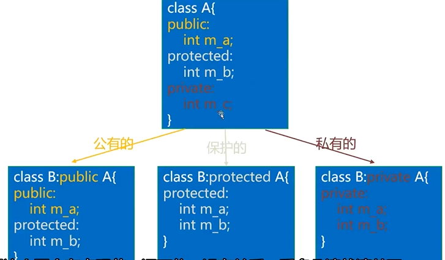


### 10.2.2 继承的对象模型

* 创建派生类对象时，先调用父类的构造函数，再调用子类的构造函数
* 销毁派生类对象时，先调用派生类的析构函数，在调用基类的析构函数（**先构造的后析构，后构造的先析构**）
	* 这里需要注意的是，c++**强制规定**了如果执行了派生类的析构函数，那么接下来必须执行基类的析构函数。
* 创建派生类对象只会申请一次内存，**派生类对象包含了基类对象的内存空间**，**this指针相同**。
* 使用sizeof计算派生类对象的空间大小，得到的时基类的所有成员（包括私有成员）+派生类对象所有成员的大小。
* 基类的private成员在类外是不能访问的，在派生类中也是不可见的，但是**如果直接操作内存，可以用指针突破语法限制**。
	* memset函数：void *memset(void *s, int c, size_t n);可以将每一块内存中的全部设置为指定的值。
* 继承时，基类的**构造函数、析构函数、赋值运算符和友元函数**都无法继承。


### 10.2.3 基类的构造

派生类的构造函数：

* 创建派生类对象时，先调用父类的构造函数，再调用子类的构造函数
* 如果没指定基类构造函数，将使用基类的默认构造函数
* 可以用初始化列表指明要使用的基类构造函数 

```c++
class person{
public:
    int m_age;
    string m_name;
public:
    person():m_age(0),m_name("wangbadan"){} //初始化列表
    person(int age,string name):m_age(age),m_name(name){}
    person(const person &per):m_age(per.m_age),m_name(per.m_name){}
};
class sutdent:public person{
public:
    int height;
    student():height(0){}
    stuent():height(0),person(){} //调用基类的默认构造函数
    //用初始化列表指明要使用的基类构造函数 
    student(int age,string name,int height):person(age,name),height(height){} //调用基类的第二个初始化列表构造函																			数，前两个age和name参数是给基类的
    student(const person &per,int height):A(a),height(height){} //调用基类的拷贝构造函数
}
```


### 10.2.4 名字遮蔽和类作用域

当派生类成员函数或者成员变量和基类的重名时：

* 如果形参不同，则会被隐藏（关键字overwrite），即通过构造子类对象调用时，调用的时子类中的成员。
* 如果形参相同，基类的成员函数为虚函数则是重写（关键字override），如果不是，还是隐藏。


### 10.2.5 继承的特殊关系

* 如果继承方式是公有的，则派生类对象可以使用基类成员
* 可以把**派生类对象赋值给基类对象（包括私有成员），但是会舍弃非基类的成员**,也就是说可以用子类赋值给父类，但是父类无法调用子类的成员变量和函数。
	* 如果你试图将一个派生类对象赋值给一个基类对象（而不是指针或引用），会发生**对象切片（slicing）**，这会导致派生类特有的部分被丢弃。

* 基类指针可以在不进行显示转换的情况下指向派生类对象
* 基类引用可以在不进行显示转换的情况下引用派生类对象
	* **基类指针或引用只能调用基类的方法，不能调用派生类的方法**
	* 可以用派生类构造基类
	* 如果函数的形参是基类。实参可以用派生类
		* **用派生类给基类对象赋值，本质上是调用基类的赋值函数**

	* C++要求指针和引用类型与赋给的类型匹配，这一规则对继承来说是例外，
		* **当使用多态时，基类指针可以直接操作子类空间**。


```C++
class A{
public:
	int m_a;
private:
	int m_b;
public:
    A():m_a(0),m_b(0){}
    void show(){cout << m_a << m_b << endl;}
    void setmb(const int &b)
        m_b = b;
    }
}
class B:public A{
public:
    int m_c = 100;
    void show(){cout << m_c << endl;} 
}
int main(){
    A *a = &b;  //类是自定义数据类型，如果不是虚函数，通过基类指针只能操控基类的空间
    a.show();  //如果A中的show是虚函数，那么调用的就是子类B的show函数，但是这里没有virtual，所以调用的是父类A的show()
    B b;
    b.show(); //通过对象B
}
```

**注意：**

* 如果**将某个类用作基类**，**该类必须定义而非声明**。
* 在类中写 `int m;` 是一个成员变量的声明，同时也是一个定义。在C++中，当你在类定义中声明一个成员变量（如 `int m;`），这既是一个声明，告诉编译器类中有一个名为 `m` 的整数类型的成员，同时也是一个定义，因为它在类的上下文中为 `m` 分配了空间。
* 对于非静态成员变量，它们实际上是在每个类的实例（对象）中分配空间的，而不是在类本身中。因此，`int m;` 的定义是针对每个对象的，而不是针对类本身的。类定义只是说明了对象将包含哪些成员变量和成员函数。

m

## 10.3、多态

### **10.3.1 虚函数：**

```c++
class A{};
class B{                                    
public:										
	void func1(){}                             
	void func2(){}
};
class C{
public:
    void func1();
    void func2();
    virtual void func3();
};
A a;  //sizeof(a) == 1; 类的实例化存储在堆中，大小至少为1
B b;  //sizeof(b) == 1; 类的成员函数属于类的组成部分，不会占类对象的内存空间
C c;  //sizeof(c) == 4; 当引入虚函数进类中，编译器会向类中插入成员变量虚函数表指针(vptr)，其大小根据位数不同而不同
```

* **虚函数指针：**在含有虚函数的类**实例化对象**时，对象地址的**前四个字节**存储的**指向虚表的指针**，因此虚函数指针的存放位置和申请对象的位置有关，new的话就是在堆中，对象在栈中就是在栈中。
	* 对于有虚函数的类在编译时，编译器会向类的**构造函数中添加为虚函数指针赋值的语句**，当创建类的对象时，会执行构造函数，便会使vptr指向类的vpbl。
	* **两次赋值：**在继承层次中，由于先构造父类，因此会先将基类的虚表地址赋值给父类的虚函数表指针。在子类构造初始化时，又会初始化将子类的虚表地址赋值给子类的虚函数指针。
* **虚表：**当类中存在至少一个虚函数时，编译器会在**编译期**间为类生成一个**虚函数表**(virtual table)，来**支持动态绑定和多态性**。当编译、链接生成可执行文件后，这个类及伴随此类的虚函数表会保存在可执行文件中，在可执行文件执行时，也会**一同放入内存**当中。
	* 虚表的创建时机：当编译时，编译器发现类中有virtual字段时就会生成虚函数表。而**虚函数表存放的位置是全局数据区的只读数据段中**，虚表中存放的是**函数指针**，虚表是存放虚函数地址的数组。
* **构造函数不能声明为虚函数**，构造函数是为了初始化对象的状态，而虚函数是为了实现多态，当构造一个对象时，对象的内存里面有虚函数指针，虚函数指针指向类的虚表，虚表存放虚函数地址，对象没有完全构造完成是无法使用虚函数的。
* **inline函数**（直接嵌入）不能声明为虚函数，因为inline函数没有地址，无法存放到虚表中。

​		

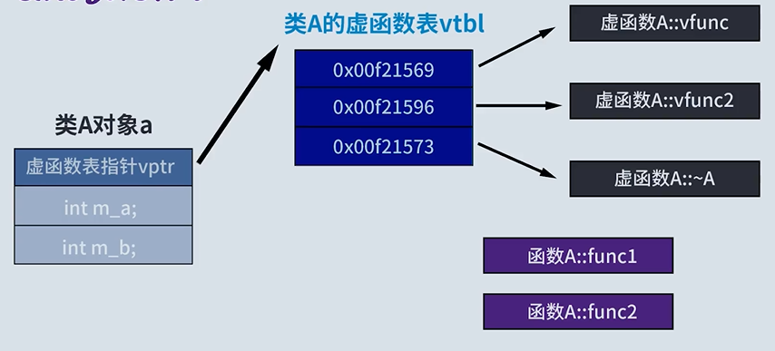


### 10.3.2 多态

**概念：**

​		同一事物表现出不同事物的能力，即不同对象发送同一消息，不同的对象在接收时会产生不同的行为，**重载实现编译时(静态)多态，虚函数实现运行时(动态)多态。**

​		多态是在不同继承关系的类对象，去调用同一函数。当类中定义了虚函数，而我们要去调用这个虚函数，才存在了多态的可能。

**核心思想：**

​		用基类指针指向派生类对象，结合虚函数技术，调用派生类的成员函数。

**多态调用虚函数：**

普通的代码中二进制文件就有成员函数的地址

* ​		创建基类指针，让他指向派生类对象，用基类指针调用派生类的成员函数。
* ​		通过虚函数指针找到虚函数表，通过查询虚函数表找到虚函数的入口地址并执行虚函数。


**多态的调用：**

* ​		程序中既存在父类也存在子类，父类中必须含有虚函数，子类中也必须重写父类中的虚函数。
* ​        父类指针指向子类对象，或父类引用绑定子类对象，即**父类指针指向子类空间**。

```C++
class Base{
public:
	virtual void myfunc(){
        cout << "父类" << endl;
    }
};
class pre:public Base{
public:
    void myfunc() override{  //重写
		cout << "子类" << endl;
    }
};
Base *p = new pre();  //Base *p = nullptr; p = new pre;
p->myfunc();  //子类（多态调用）

Base base;
base.myfunc(); //父类（直接调用，不是多态）

Base *pa = &base; 
pa->myfunc(); //多态调用（引用）

delete p; //这里仍然需要释放--
//智能指针可以不用释放
unique_ptr<Base> p = make_unique<pre>();
p->myfunc();
```

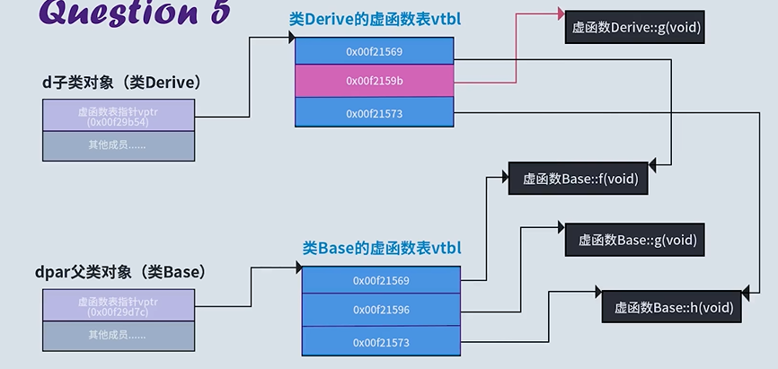


### 	  10.3.3 动态绑定机制：

​		虚函数(动态多态)才有动态绑定。

​		派生类会继承基类的虚表指针和虚表(这也是为了让基类和派生类保持相同的内存模型)，派生类对基类的虚函数**没有重写时**，派生类的虚表指针指向的是派生类的虚表，但是虚表当中的虚函数地址仍是基类中的虚函数地址；**当有重写时**，派生类的虚表中的被重写的函数地址将会**覆盖原本的基类中的函数地址**，此时通过指针去调用，**指针所操作的空间是由其指向的类型决定的**，指针是由父类定义的，其实调用的还是基类的函数，但是由于是虚函数，当通过虚函数指针去查找虚表时，虚表中被重写的函数的地址已经不同，调用的是子类重写的函数，这属于**间接调用**；当派生类有自己的虚函数，在自己的虚表中将此虚函数地址添加在后面。	

**动态绑定的实现：**

```c++
class A{
    virtual func(){}
    A()
	virtual ~A(){} //这样通过父类指针调用的就是派生类的析构函数
}；
class B:public A{
    func() override{}
    B()
    ~B(){}
};
B b; //先调用父类的构造。再调用派生类的构造
A *a = new B(); //指针实现
a.func(); //B:func()
b.func(); //B:func()
A &a = b; //引用实现
a.func(); //B:func()
b.func(); //B:func()
```


### 		10.3.4 纯虚函数：

```C++
class A{
public:
	virtual void func(void) = 0; //纯虚函数
}；
```

* 一旦类中由纯虚函数，那么该类就是抽象类
	* **抽象类不能实例化对象**,但仍可以使用基类指针或者引用来操控派生类空间；
	* 抽象类必须被继承，同时子类必须重写父类的所有纯虚函数，否则子类也是抽象类；
	* 抽象类的主要目的是设计类的接口，实现多态。


### 		**10.3.5 虚析构**

在父类指针申请了(new)临时指针指向子类空间，是要进行释放的的，但是这里由于指针是父类的类型，delete只会调用父类的析构，并不会调用子类的析构，不会释放子类析构，这样只申请不释放，会造成**内存泄漏**，因此父类的析构函数前面也要加virtual，这样就**可以通过父类指针释放掉所有子类空间**。


```c++
class A{
    A()
	virtual ~A(){} //这样通过父类指针调用的就是派生类的析构函数
}；
class B:public A{
    B()
    ~B(){}
};
A a; //只会调用调用类的构造函数和析构函数
B b; //先调用父类的构造。再调用派生类的构造
A *a = new B;
delete a; //只会调用基类的构造和析构，然后调用派生类的构造函数，但是不会调用派生类的析构函数，解决方法->将析构函数也设置为	a = nullptr;			virtual
```

​		子类的析构函数也是通过从父类所继承的虚函数指针所调用，而虚函数表中的析构函数地址会自动修改为子类析构函数地址，不用进行重写。在析构了子类之后，也会自动调用父类析构。

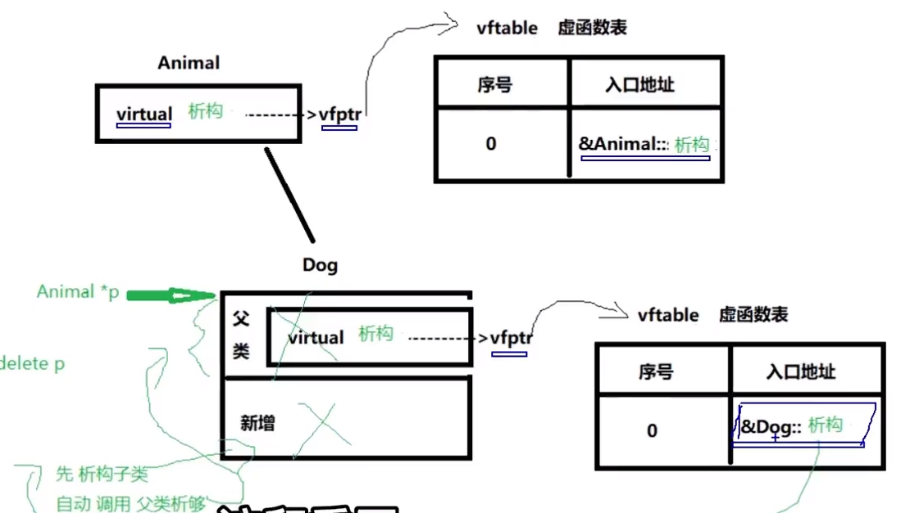

​		**补：**

​		即使派生类不重写析构函数，基类也应该写上虚析构函数，因为通过父指针无法操控派生类的成员函数和成员变量，因此必须协商虚析构。


### 10.3.6 纯虚析构

```c++
class A{
public:
	virtual void test() = 0;
    virtual void test() = 0{cout << "纯虚函数也可以在基类中实现"}
	virtual ~A() = 0;{cout<< "代码实现" << endl;} //纯虚析构：必须在父类中也添加虚析构函数
};
A::~A(){
	delete p;
}
class B:public A{
public:
   void test() override{
       cout << "这是重写" << endl;
   }
}
//
//创建抽象类指针指向派生类对象
B b;
A *a = &b;
a->test();
//创建抽象类引用指向派生类对象
B b;
A &a = b;
a->test();
```

纯虚析构的本质:

* 是析构函数，各个类的回收工作。而且析构函数不能被继承。
* 必须为纯虚析构函数提供一个函数体，因为当前类的析构释放必须由当前类的析构函数决定。
* 纯虚析构函数必须有**有代码实现**。

纯虚函数：

* 纯虚函数也必须重写
* 抽象类可以创建抽象类指针或者引用指向派生类对象
* 基类的纯虚函数也可以实现


### 10.3.7 静态类型和动态类型，静态绑定和动态绑定

* 静态类型：静态类型是指在**编译时已确定**每一个变量的类型，时对象在声明时**明确指定的类型**，不会在运行时改变。
* 动态类型：是在**运行期**时根据变量的实际值来确定其类型，通常是指一个指针或引用目前所指对象的类型。
* 静态绑定：绑定的是静态类型，所对应的函数或属性依赖于对象的静态类型。在**编译期**就确定调用哪个函数或方法，主要适用于静态方法和非虚函数，编译器会根据函数或方法的名称和参数类型来确定调用方式
* 动态绑定：绑定的是动态类型，所对应的函数或属性依赖于对象的动态类型。根据对象的实际类型来决定调用哪个函数。这意味着在**运行时**才能确定调用哪个函数或方法。这主要适用于虚函数和多态。

```c++
class A{
public:
	/*virtual*/ void func(){}
};
class B:public A{
public:
	void func(){}
}
class C:public B{
public:
	void func(){}
}
C *pc = new C(); //pc的静态类型是它声明的类型C*，动态类型也是C*
B* pb = new B(); //pb的静态类型和动态类型都是B*
A *pa = pc;  //pa的静态类型是A*，动态类型是pa所指向的对象pc的类型C*
pa = pb; //pa的静态类型是A*，但是动态类型更改了，现在是B*
C *pull = nullptr; //pull的静态类型是其声明的类型C*，没有动态类型
pa->func(); //B::func()父类是虚函数，pa的静态类型永远是A*，动态类型是B*
pc->func(); //c::func() 静态与动态类型都是C*

pull->func(); //基类A加了func(重写)，显示空指针异常，因为func是虚函数，动态绑定时，在运行时调用func()发现pull是空指针。
		//不加virtual时(隐藏),C::func() 空指针也可以调用函数，因为这是在编译期就确定了（静态绑定），和指针是否为空没有关系。
```

* 基类A中的func如果不是虚函数，那么无论pa、pb、pc指向那个子类对象，对func的调用都是在定义pa、pb、pc时的**静态类型决定，早已在编译期就去确定了**
* 同样的**空指针也能调用非虚函数而不报错**，因此静态绑定不能实现多态。
* 如果func是虚函数，所有的调用都要等到运行时根据其指向对象的类型才能确定，比起静态绑定有性能损失，但是能实现多态绑定。

### 10.3.8、静态绑定和动态绑定的区别

* 静态绑定发生在编译期，动态绑定发生在运行期
* 对象的动态类型可以更改，但是静态类型无法更改；
* 想实现多态，必须用动态绑定
* 在继承中除了虚函数是动态绑定，其他都是静态绑定

```c++
class MyClass {  
public:  
    void myFunction() {  
        std::cout << "MyClass::myFunction()" << std::endl;  
    }  
};  
  
int main() {  
    MyClass obj;  
    obj.myFunction(); // 编译器在编译期就能确定调用的是MyClass::myFunction  
    return 0;  
}
```


### 10.3.9、类中如何实现静态分配和动态分配

* 实现静态分配可以把new、delete运算符重载为private属性，动态分配可以把构造和析构设置protected属性，在用子类来动态创建。
* 建立类的对象有两种方式：
	* 静态建立：静态建立一个对象。由编译器为对象在栈空间中分配内存
	* 动态建立：A *a = new A();，利用new运算符为对象在堆中分配内存。
* 只有new运算符可以把对象创建在堆上，所以限制new运算符，设为private，就可以实现类对象只能建立在栈上。


## 10.4 、类型转换

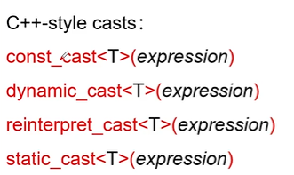

### **10.4.1、RTTI运行时类型识别：**

* 是C++语言的一个特性，它允许程序在运行时查询对象的实际类型。
* RTTI提供了两个主要的运算符：`dynamic_cast`和`typeid`，以及`type_info`类，它们一起工作以在运行时确定对象的类型。
* 运行阶段类型识别（RTTI）**为程序在运行阶段确定对象的类型**，只适用于包含虚函数的类，即继承层次结构中的多态对象

#### **dynamic_cast**

* dynamic_cast运算符**只能转换具有继承关系的指针或者引用**。

  * 只能由子类型转换为父类型。在 C++ 中，将子类指针或引用隐式转换为父类指针或引用是自动且安全的，无论基类是否包含虚函数
  * 可以由父类型转换为子类型（基类必须包含虚函数）

* **不能转换基础数据类型，不能转换非继承关系的指针和引用**

* 转换前会进行**运行时检查转换是否有效**，子类指针可以转换为父类指针，类型安全父类型转换为子类型（基类必须包含虚函数）

  * dynamic_cast向下转换**只适用于包含虚函数的类**
  * dynamic_cast 可以将派生类指针转换为基类指针，这种画蛇添足的做法没有意义。
  * dynamic_cast 可以用于引用，但是，没有与空指针对应的引用值（引用的目标不能是空指针），如果转换请求不正确，会出现 bad_cast 异常。

  **语法：**派生类指针 = dynamic_cast<派生类类型 *>(基类指针);

  基类指针可以调用派生类对象，如何知道基类指针所指向的是那种派生类的对象呢？

```c++
class person{
public:
    virtual void test(){}
    virtual void test1(){}
    virtual void test3(){}
    virtual ~person(){}
}
class student:public person{
public:
	void test() override { cout << "章建雄大二比";}
    void test1() override {cout << "章建雄是我儿";}
}
person *p; //父类指针
student *ps = (student *)p; //c风格的强制转换，可以将基类指针p赋值给派生类指针ps,程序员必须保证目标类型正确
student *ps = dynamic_cast<student>(p); //将基类指针转换为派生类指针
if(ps!=nullptr){
    ps->test();
}
delete p;
```

#### typeid

* `typeid`运算符用于在运行时获取对象的实际类型。它返回一个对`type_info`对象的引用，该对象封装了有关类型的信息。

```c++
Base* basePtr = new Derived;  
const type_info& type = typeid(*basePtr);  
cout << "Type is: " << type.name() << endl;
```

#### type_info

* `type_info`是一个标准库类，它封装了有关类型的信息。你通常不会直接创建`type_info`对象，而是通过`typeid`运算符获取它们的引用。`type_info`类提供了一些成员函数来比较类型信息（如`operator==`和`before`），以及获取类型的名称（如`name`）。


### 10.4.2、static_cast

```c++
staitc_cast<T>(expression)
```

* 用于非多态类型的转换
	* 基础数据类型的转换，具有继承关系的指针或者引用（不涉及虚函数的类）
	* **不能转换基础类型指针，不能转换类对象指针**
* **不会进行运行时检查**

```c++
double d = 3.14;
int i = static_cast<double>(d);
class student{}
class child:public student{}
student *p = NULL;
child *ptr = static_cast<child *>(p); //父指针转子指针(不涉及虚函数)
child *p1 = NULL;
student *ptr1 = static_cast<student *>(p1); //子类指针转换父类指针
student stu;
student &stu_t = stu; //父类引用
child &chi = tatic_cast<child>(stu_t); //父类引用转换为子类引用，子类引用也可以转换为父类引用
```


### 10.4.3、const_cast

* `const_cast`用于**添加或移除类型的`const`或`volatile`限定符**
	* 这里的修改不是修改之前的变量，而是创建一个新变量指向同一块内存。
* 主要用于修改指向`const`对象的指针或引用，以便能够修改该对象
* 可以进行基础类型的转换

```c++
const int a = 10; 
int* p = const_cast<int*>(&a); // 移除const限定符，但修改*p是未定义行为
const int &b = a;
int &c = const_cast<int>(b);
c = 20; //此时c、b、a都是20，因为全部指向同一块内存。
const int *p = nullptr;
int *p2 = const_cast<int*>(p); //移除const
int *p = nullptr;
const int *p2 = const_cast<const int *>(p); //增加const
```


### 10.4.4、reinterpret_cast

* 强制类型转换，只能转换指针
* 提供了一种低级别的转换机制，它重新解释给定的位模式。
* 几乎不做任何类型检查
* 常用于硬件操作、将整数转换为指针、以及处理函数指针等场景

```c++
int i = 12345;  
char* p = reinterpret_cast<char*>(&i); // 将int*转换为char*
class person{}
class student{}
person *per = NULL;
student *stu = reinterpret_cast<student*>(per); //强制转换不相关的对象指针

typedef void (*FUNC)(int,int);
typedef int(*FUNC2)(int, char*);
FUNC func;  //函数指针
FUNC2 func2= reinterpret_cast<FUNC2>(func);
```


## 10.5、继承机制中的对象之间如何转换、指针和引用之间如何让转换

* **向上转换型**
	* 将派生类的指针或引用转换为基类的指针或引用，这是自动进行的，而且向上转换时是类型安全的。
* **向下转换型**
	* 将基类的指针或引用转换为派生类类的指针或引用，由于一个基类可能对应很多派生类，所以转换不会自动进行，而且向下类型转换必须加动态类型识别技术。
	* RTTI，dynamic_cast

```c++
class person{
    virtual test(){}
};
class student:public person{};
student stu;
person *per = &stu;  //向上类型转化
person *p = new student();
student *stu1 = dynamic_cast<student>(p) //向下类型转换
```


# 11、构造与析构

## **11.1、构造函数与析构函数**

特殊函数：由**系统自动执行**，在程序中**不可显式的调用**。

* **构造函数**：建立对象时，对对象的数据成员进行初始化。
	* 与类同名
	* 没有返回值，不需要类型
	* 默认构造函数是无参的，无函数体的，显式定义的话，编译器就不再自动生成
	* 可以被重载，可以有多个，可以定义多个参数与参数类型不同的构造函数。
	* **定义对象的同时，构造函数被自动调用**。在建立对象时系统会为对象分配内存空间，此时先执行构造函数，就把指定的初值送到对应成员变量的存储单元中。
	* 构造函数中对于内置类型是不做处理的，对于自定义类型会调用其构造函数！
		* 内置类型：字符，整型，浮点数等
		* 自定义类型：struct、class等
* **析构函数**：对象的声明周期结束时回收对象，撤销对象的。
	* 与类同名
	* 没有返回值
	* 只有一个，无参
	* 不能重载，当类存在资源申请的时候就需要些析构函数，否则会造成资源泄露。
	* **静态(static)局部对象**在函数调用结束，对象并不会释放掉，当main函数结束或者调用exit函数结束程序时，才会调用析构函数。
	* 如果定义了一个全局的变量，则在程序的流程离开其作用域时，调用该全局对象的析构函数！
	* 当用new建立对象时，当用delete运算符释放该对象时先调用析构函数，再调用operator delete库函数释放内存！
	* 对于析构函数对于内置类型在销毁时系统会自动回收内存，而对于自定义类型会调用其析构函数！
* **不同对象的调用顺序**：
	* **先构造的后析构，后构造的先析构**。
		* 例如父类和子类的继承关系
	* 如果**在全局范围定义对象**，那么它的构造函数在本文件模块中的所有函数执行之前调用。
	* 如果一个程序包含多个文件，那么它的构造函数的调用顺序是不确定的，当main函数结束或者调用exit结束程序时，调用析构函数！
	* 如果定义局部对象，那么定义时自动调用构造函数，函数调用结束时，调用析构函数！
	* 如果定义**静态(static)函数**，则只在程序调用的第一次调用构造函数（只初始化一次），当main函数结束时或者调用exit函数时调用析构函数！

**构造函数和析构函数的调用时机**：

* **构造函数**
	* 对象实例化
	* 对象拷贝：使用已经创建的对象去初始化另一个对象
	* 列表初始化
	* 值传递或者返回时：当对象作为值传递给函数，或者从函数作为值返回时，会创建临时对象，并调用相应的构造函数（可能是复制构造函数、移动构造函数，或者是其他重载的构造函数）。
* **析构函数：**
	* 对象生命周期结束时：对象离开其作用域
	* 对象被销毁时
	* 程序结束时：所有的全局对象和静态对象的析构函数都会被调用，

**problem：**

**构造函数和析构函数可以恶抛异常吗？**

都不可以，应该保证对对象的正常构造和对资源的释放，不应该终止下来。

* 构造函数应该避免抛出异常
	* 构造函数抛出异常后，后面的构造将不会执行，对象的析构将不会被执行。
	* 构造函数抛出异常时，本应该在析构函数中被delete的对象没有被delete，会导致内存泄露
	* 当对象发生部分构造时，已经构造完毕的子对象(非动态分配)将会逆序地被析构。
* 析构函数不应该抛出异常
	* 其他程序正常，仅析构异常：那么当析构抛出异常，则异常点之后的程序都不会执行，如果析构函数在异常点之后执行了某些必要的动作如释放某些资源，则这些动作将不会被执行，造成内存泄漏
	* 其他程序异常，且析构异常：通常异常发生时，C++机制会调用已经构造过的对象的析构函数来释放资源，若此时析构也异常了，则前一个异常还没处理，又有新的异常，或造成程序崩溃。

**析构异常了怎么办？**

* 若析构函数抛出异常，调用std::abort()来终止程序
* 在析构函数中catch捕获异常并作处理，吞下异常；
* 如果客户需要对某个操作函数运行期间抛出的异常做出反应，class应该提供普通函数执行该操作，而非在析构函数中。

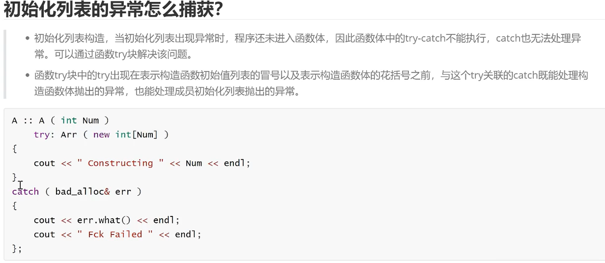


## 11.2 、C++的所有构造函数

※左值：能取地址的值；右值：没办法取地址的值。

* 默认构造函数
* 初始化构造函数（有参）
* 拷贝构造函数(左值引用&)
* 移动构造函数（move和右值引用&&）

* 委托构造函数
* 转换构造函数

```c++
class Student{
public:
    int age;
    int num;
public:
    Student(){ //默认构造函数
        this->age = 18;
        this->num = 110;
    }
    Student(int b):	Student(18,110){} //委托构造函数
    Student(int a,int b):age(a),num(b){} //初始化构造函数 -->同时作为委托的代理构造函数
    
    Student(const Student &S){ //拷贝构造函数
		this->age = S.age;
        this->num = S.age;
    }
    Student &operator=(const Student &stu){ //拷贝重载运算符，当输入参数为左值时，调用拷贝重载运算符
		age = stu.age;
        num = stu.num;
        return *this;
    }
    
    Student(const Student &&s) noexcept{ //移动构造函数->右值引用
										//移动构造函数一般不应该抛出异常，因为原则上它不应该申领任何资源
    }
    Student &operator=(Student &&s) noexcept{//当输入参数为右值时，调用移动赋值运算符
			if(this == &a)
                return *this;
        	age = std::move(s.age);
        	num = std::move(s.num);
        	return *this;
    }
    Student(int r){ //转换构造函数->单参，且参数类型不同，需要转换
        this->age = r;
        this->num = 11000;
    }
    ~Student(){}
}

    Stirng s = "hello world"; //拷贝初始化
    vector<string> v;
    v.push_back(str);  //调用常用的拷贝构造
	v.push_back(move(str)); //调用移动构造函数

struct person{
	string name;
	int age;
	person(string m_name,int m_age):name(m_name),age(m_age){}  //初始构造函数
	person(const person &other):name(move(other.name)),age(move(other.age)){}  //拷贝构造函数
	person(person && other):name(move(other.name)),age(move(other.age)) noexcept{} //移动构造函数
};
```


## 11.3 、移动构造函数

**移动构造函数**（move和右值引用&&）

**移动语义**(std::move)：将**其他对象（通常为临时对象）拥有的内存资源“移为己用”**；

* move()能把**左值强制转换为右值,用以实现移动语义**
* move是将对象的状态或者所有权从一个对象转移到另一个对象，**只是转移，没有内存的搬迁或者内存拷贝**，因此转移所有权效率比较高。

**移动构造函数：从一个临时对象（右值）转移资源（如内存、文件句柄等）到另一个对象，而不是复制这些资源。**

* 将对象A的所有权转移给对象B
* 对于同一块内存，原来用来存放对象A，发生对象移动后，用来存放对象B
* 发生对象移动后，原有的对象A将不再被使用。
	* 和拷贝赋值运算符一样，移动构造函数也是二元运算符"operator="的重载，它只能被定义为类的成员函数，不能被定义为普通函数
	* 移动构造函数在构造对象的时候**避免了拷贝一个新的对象**，**只是浅拷贝指针**。
		* 浅拷贝的危险之处就在于两个指针指向同一片空间，为了防止旧指针释放内存空间，可以置空旧指针。
	* 移动构造函数**可以重复利用原有的内存空间，提供了代码效率**
	* 移动构造函数的**形参是(&&)右值引用或者将亡值的引用**，而不是(&)左值引用。
		* 亡值：当右值完成初始化或赋值的任务后，它的资源已经移动给了其他对象，这时这个右值就变成了所谓的“亡值”。
	* 当一个对象发生移动以后，**不会自主销毁**，我们可以在移动构造函数的代码逻辑中**显式地让该对象被析构**。

```c++
class Foo{
public:
    Foo() = default;
    ~Foo() = default;
    Foo(const Foo& foo) = default;
    Foo(Foo&& foo) noexcept{
        std::cout << "Foo(Foo&&)\n";
    }
    Foo& operator=(Foo&&) noexcept = default;
    Foo& operator=(const Foo&) = default;
};

void f(Foo foo){
    (void) foo;
}

Foo g() {
    Foo f;
    return f;
}

int main() {
    Foo f1,f2;
    Foo dst(std::move(f1)); // 调用移动构造函数
    Foo dst2 = std::move(f1); // 调用移动构造函数
    f(std::move(dst2)); // 调用移动构造函数
    // 由于rvo的存在，并不会调用拷贝或者移动构造函数
    // 如果把rvo关掉-fno-elide-constructors，在没有移动构造函数的情况下会调用拷贝构造函数
    Foo f = g(); 
    return 0;
}

class MyClass {  
private:  
    int* data;  
    size_t size;  
  
public:  
    MyClass(size_t n) : size(n), data(new int[n]) {  
        // 初始化数据...  
    }  
  
    // 移动构造函数，标记为noexcept  
    MyClass(MyClass&& other) noexcept : size(other.size), data(other.data) {  
        other.data = nullptr;  
        other.size = 0;  
    }  
  
    // 移动赋值运算符，标记为noexcept  
    MyClass& operator=(MyClass&& other) noexcept {  
        if (this != &other) {  
            delete[] data;  
            size = other.size;  
            data = other.data;  
            other.data = nullptr;  
            other.size = 0;  
        }  
        return *this;  
    }  
  
    // 析构函数...  
    ~MyClass() {  
        delete[] data;  
    }  
  
    // 禁用拷贝构造函数和拷贝赋值运算符...  
    MyClass(const MyClass&) = delete;  
    MyClass& operator=(const MyClass&) = delete;  
};

int main(){
    MyClass ret1(18,20);
    MyClass ret2(std::move(ret1)); //调用构造函数
    ret2 = std::move(ret1); //赋值运算符
}
```

**移动构造函数的调用：**

* 初始化:T a = move(b); b的类型是T;
* 函数实参传递:f(std::move(a));a的类型是T，f是 Ret(T t);
* 函数返回:在像 T f() 这样的函数中的 return a;，其中 a 的类型是 `T`，且 `T` 有移动构造函数。

**构造函数之间的区别：**

* 移动构造函数的参数是右值引用，拷贝构造函数是左值引用
	* noexcept是为了防止在移动构造函数转移资源时，因为出现异常而导致资源还没转移完就中断了。


## 11.4 、委托构造函数

**需求：**

​		有的程序需要构造很多构造函数，对于特定的成员变量每个构造函数都得初始化，会造成代码冗余。

​		类的构造函数可以在初始化列表的位置调用该类的另一个构造函数，这个构造函数就叫委托构造函数，其将构造对象的工作委托给了另一个构造函数,另一个构造函数成为代理构造函数。所以初始化时会先执行代理构造函数的函数构造，在执行委托构造函数的函数体。

```c++
class Student{
private:
    int age;
    string name;
    void comminit(){}
public:
    Student():Student(18,"wang"){} //委托构造函数
    Student(int m_age):Student(20,"zhang"){}  //委托构造函数
    Student(string m_name):Student(30,"jiang"){}  //委托构造函数
    Student(int m_age,string m_name):age(m_age),name(m_name){comminit();}  //代理构造函数
}
```

* 每个构造函数都可以委托另一个构造函数为代理
* 不要递归循环委托
* 委托构造函数的执行顺序是先执行代理构造函数的初始化列表，然后执行代理构造函数的主体，最后执行委托构造函数的主体
* 如果在代理构造函数执行完成后，委托构造函数主体抛出了异常，则自动调用该类型的析构函数
* 如果一个构造函数为委托构造函数，那么其初始化列表里就不能对数据成员和基类进行初始化

**代理构造函数模板：**

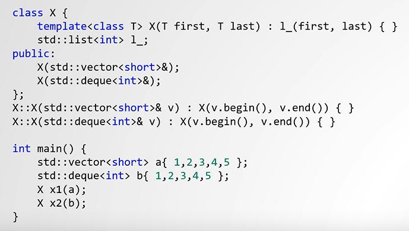


## **11.5、深拷贝与浅拷贝**

**浅拷贝**：通过拷贝构造函数实现的，当程序员不主动的编写拷贝构造函数和重载赋值函数，编译器会以浅拷贝的方式自动生成这些函数，但是**只复制指向某个对象的指针**，将此对象的地址给新的对象，并**不会创建一片新的内存**，新旧对象共享一块内存。

* 浅拷贝只复制对象的成员变量值，而不复制动态分配的资源或指针所指向的数据
* 当成员变量
	* 新对象的内存没释放，造成**内存泄漏**
	*  新旧对象指向了同一块内存，**任何一方的值改变都会修改另一方的值**
	* **在对象被析构时，空间被释放了两次**

**深拷贝**：需要**手动的编写拷贝构造函数与赋值运算符**，**会开辟一片新的空间存放数据**（new），**不共享内存**，修改新对象，旧对象保持不变。

* 一个对象以值传递的方式传入函数体
* 一个对象以值传递的方式从函数体返回
* 一个对象需要通过另一个对象进行初始化

**使用时机：**

* **浅拷贝：**
	* 当对象中的成员变量不包含指针或动态分配的资源时，通常可以使用浅拷贝。
* **深拷贝：**
	* 当对象中包含指针或动态分配的资源时，通常需要使用深拷贝。
	* 如果类显示的写了析构函数，通常需要深拷贝，以确保每个对象拥有自己的资源副本，并在对象生命周期结束时正确地释放资源。


```c++
vector<int> vec1 = {1,2,3};
vector<int> vec2 =vec1; //浅拷贝->创建了vec1的一个拷贝。但共享相同的资源-->拷贝初始化，不涉及指针变量
vec2[0] = 100;


Student(const Student &s){
    name = s.name; //浅拷贝
    name = new char(20); //深拷贝
    memcpy(name,s.name,strlen(s.name));
}
```


## **11.6、拷贝构造函数**

**概念：**

​	拷贝构造函数(复制构造函数)的基本写法：（单形参列表）

```c++
Foo(FOO &S)
Foo(const Foo&S) //最常用的写法
Foo(const volatile &s);
Foo(volatile &s);
```

​	在建立对象时可用**同一类的另一个对象来初始化该对象的存储空间**，这是所用的构造函数成为拷贝构造函数。

**需求**：

* 当类成员没有指针成员的时候其实是可以不用编写拷贝构造函数的，利用ObjA = ObjB来赋值是没有问题的。
* 但是当有**指针成员**，用来存放动态申请的字符串的地址，在类中使用new方法动态申请内存并让指针指向该空间，再进行简单的类对象赋值（ObjA = ObjB）之后，两个对象的指针将同时指向那片内存空间，这样很有可能会导致同一块内存释放两次。
* 使用拷贝构造函数，先申请指针所指向的内存空间，再将空间的内容拷贝（所以使用&）过来，这样各自指向各自的空间。

* 拷贝构造函数的参数是**引用**，一般加const，防止修改原本的对象数据。如果把一个真实的类对象作为参数	传递到拷贝构造函数，会引起无穷递归 。
* 拷贝构造函数再不显式定义的情况下，编译器会自动构造一个缺省的拷贝构造函数。

```c++
class Person{
public:
	int age;
	Person(){} //无参构造
	Person(int age){//有参构造
		this.age = age;
	} 
	Person(const Person &p){  //拷贝构造函数
		age  = p.age;  //这里是浅拷贝，默认的拷贝构造便会进行值拷贝,因为这里不涉及指针
	}
};

Person p; //匿名
Person p(18); //传递的是int类型的值，对应有参构造，
Person P2(p); //调用拷贝构造，传递的是类对象-->初始化新的对象
Person p = 10; //隐式法
```

编译器默认添加的三个函数：构造函数（空实现）、析构函数（空实现）、拷贝构造（值拷贝），即使已经写了有参构造函数，编译器不在提供默认构造函数，仍会提供拷贝构造函数。

**拷贝构造函数的调用时机**：

提供同类型的实参就能调用。

* 1、已经创建好的对象来初始化新的对象；
* 2、值传递的方式给函数参数传值（非引用情况下）；值传递的本质就是调用拷贝构造函数，创建一个新的对象。

```c++
void dowork(Person p){  //这里相当于创建了一个新的临时对象   
} 
void test(){
	Person p1(100);
    dowork(p1);   //调用拷贝构造-->值传递的方式给函数参数传值
}
```

* 3、以值返回的方式返回局部对象
	* 对于此类情况，只会发生在windows系统，在linux系统下，这样并不会调用拷贝构造函数


```c++
Person dowork2(){ //这里返回的是值，不能返回引用，引用在函数调用完成会被释放掉
	Person p;
    return p; //以值方式 返回局部对象，return时这里相当于临时创建并拷贝了一个新的匿名对象，是没有名称的
}
void test1(){
	person p = dowork2(); //可以认为将新的对象拷贝给p，名称变为p，声明周期也就成了p的生命周期
}							//函数执行完成先析构局部对象，再析构临时对象
```


**拷贝赋值运算符：**对类对象进行赋值

基础拷贝赋值运算符：

```c++
Class A{
    A& operator=(A a){
        //xxx
        return *this;
    }
    A& operator=(A &a){
        //xxx
        return *this;
    }
	A& operator  = (const A &a){  //最常用
		// xxxx
		return *this;
	}
    A& operator=(const volatile A &a){
        //xxx
        return *this;
    }
    A& operator=(volatile A &a){
        //xxx
        return *this
    }
};
```

* 拷贝[赋值运算符](https://so.csdn.net/so/search?q=赋值运算符&spm=1001.2101.3001.7020)是二元运算符"operator="的重载，它只能被定义为类的成员函数，不能被定义为普通函数。
* 拷贝赋值运算符**把右操作数的成员数据拷贝给左操作数的成员**。
* 为了避免对象在拷贝过程中的不必要的复制，拷贝赋值运算符**返回类型为引用类型**。
*  拷贝赋值运算符运行结束一般会**返回指向该对象的this指针**，方便被连续调用。
* 拷贝赋值运算符的使用场景和拷贝构造函数不一样，如果对一个已经构造过的对象进行拷贝赋值，则此时并不会调用拷贝构造函数，而是调用拷贝赋值运算符。
* 在重载赋值运算符的时候，也可以让拷贝赋值运算符复制不同类型的对象，只需要在重载的函数内部增加相应的类型转换逻辑即可实现。
* 当没有自定义的移动构造函数、移动赋值运算符、拷贝赋值运算符时，编译器会自动生成一个**inline public隐式拷贝赋值运算符**；

**为什么要使用拷贝赋值运算符：**

​		用户在使用语句ObjB = ObjA的时候，或许ObjB的pStr已经指向了动态申请的空间，如果直接简单将其指向的地址覆盖，就会导致内存泄露，所以需要对=赋值操作符进行重载，在重载函数中判断pStr如果已经指向了动态申请的空间，就先将其释放。

**拷贝运算符和拷贝构造函数是什么关系**：

​		=赋值操作符重载比拷贝构造函数做得要多，它除了完成拷贝构造函数所完成的拷贝动态申请的内存的数据之外，还释放了原本自己申请的内存空间。


## **11.7、拷贝初始化和直接初始化**

* 当用于类类型对象时，初始化的拷贝形式和直接形式有所不同：
	* 直接初始化**直接调用于实参匹配的构造函数**；
		* 直接初始化时，构造函数用于直接创建对象，没有临时对象的创建或涉及。
		* 可以调用**任何可用的构造函数**
	* 拷贝初始化**总是调用拷贝构造函数**。拷贝初始化首先适用指定构造函数**创建一个临时对象**，然后拷贝构造函数将那个临时对象拷贝到正在创建的对象。

```c++
1、String s("hello world"); //直接初始化
2、String s2(s); //直接初始化
3、String s3 = "hello world"; //拷贝初始化,先将字符串“hello world”创建临时对象，
						   //再把临时对象作为参数，使用拷贝构造函数构造S3
4、String s4 = s3;	//拷贝初始化s4，相当于隐式调用拷贝构造函数，而不是调用复制运算符
```

**这里注意：**

* 当拷贝构造函数为private时，3和4便会报错
* 当构造函数被explicit关键字修饰时，拷贝构造函数的隐式调用便会出错。


## **11.8、初始化和赋值的区别**

**初始化**的含义时在**创建对象**时赋予一个初值；

**赋值**是将对象的当前值擦掉，以一个新值代替。

* 对于简单类型（内置类型等）来说，初始化和赋值没有什么区别
* 对于类和复杂类型来说，这两者最主要的区别便是有没有创建新的对象。

```c++
class A{
public:
    int num_1;
    int nunm_2;
public:
    A(int a,int b):num_1(a),num_2(b);
    A(const A &a){}  //拷贝构造函数
    A& operator = (const A &a){ //拷贝复制运算符：是二元运算符“operator=”的重载；
        						//只能定义为类的成员函数，不能定义为普通函数。
        num1 = num1+1;
        num2 = num2+1;
        cout << "重载" << endl;
        return *this;
    };
};
A a(1,2); //直接初始化
A b = a; //拷贝初始化调用拷贝构造函数
A C;
C = a;//赋值操作,对象C已创建，对象a中 num1 = 1，num2 = 2；对象C中num1 = 2,num2 = 2;
A a = new A(); //直接初始化
```

*  拷贝初始化和赋值操作是不同的操作，它们分别涉及到拷贝构造函数和赋值运算符重载。

* 拷贝初始化是在创建对象时从一个已有的对象中初始化新对象，这时候会调用拷贝构造函数来完成初始化。例如：

```c++
cppCopy codeMyClass obj1; // 创建对象
MyClass obj2 = obj1; // 拷贝初始化，调用拷贝构造函数
```

* 在这个例子中，`obj2` 是通过从 `obj1` 中拷贝初始化得到的，这会调用 `MyClass` 类的拷贝构造函数。
* 而赋值操作是在对象已经存在的情况下，将一个已有对象的状态赋值给另一个对象。这时候会调用赋值运算符重载来完成赋值操作。例如：

```c++
cppCopy codeMyClass obj1; // 创建对象
MyClass obj2; // 创建另一个对象
obj2 = obj1; // 赋值操作，调用赋值运算符重载
```

* 在这个例子中，`obj2` 已经存在，赋值操作将 `obj1` 的状态赋值给 `obj2`，这会调用 `MyClass` 类的赋值运算符重载。
* 因此，尽管拷贝初始化和赋值操作都涉及到对象之间的状态复制，但它们是不同的操作，并且分别调用了拷贝构造函数和赋值运算符重载。

# 12、类

## 12.1、类的成员

**类的成员函数**

* 类的成员函数是类定义的一部分，它们描述了类对象可以执行的操作。
* 成员函数的代码通常存储在程序的**代码段，静态函数也不例外**，**类的数据成员存储在数据段或者堆/栈上**，因此**所有对象实例共享相同的成员函数代码**，而不是每个对象都有自己的函数副本。
* 当成员函数被调用时，编译器会隐式地传递一个指向调用对象的指针（通常称为`this`指针）。这使得成员函数能够访问和修改对象的数据成员。

**类的成员变量：**

* **非静态成员变量**：是对象的一部分，因此它们会被分配在堆内存（如果对象是动态分配的）或栈内存（如果对象是作为函数局部变量创建的）中。每个对象实例都有自己的非静态成员变量的副本。
* **静态成员变量**：静态成员变量与类本身相关联，而不是与类的特定实例相关联。在C++中，静态成员变量通常存储在全局/静态存储区，这取决于它们的初始化方式和链接属性。所有对象实例共享同一个静态成员变量的内存地址。	

​		类的定义本身（包括成员变量和数据类型）并不直接存储在代码区。类的定义提供了如何创建对象以及对象如何行为的说明，但实际的类对象数据（即对象的实例）存储在堆区或栈区，取决于对象的创建方式（使用`new`运算符在堆上创建，或在函数内部作为局部变量在栈上创建）。


## 12.2、this指针

特点：

* 隐式的在每个成员函数中，**只能在成员函数中使用**，全局函数、静态函数都不能使用this。
* 实际上，**成员函数默认第一个参数为（T *const this**）。
	* 因此**this在成员函数的开始前构造，在成员函数的结束后清除**，这个生命周期同任何一个函数的参数是一样的，没有任何区别，当调用一个类的成员函数时，**编译器将类的指针作为函数的this参数传递进去**。
* 指向被调用的成员函数所属的**对象**的首地址。
	* 一个对象的this指针并不属于对象的本身的一部分，不会影响sizeof(对象)的结果，更像是一个指向对象本身的指针，在成员函数被调用时由编译器自动传入。
	* **this指针的存放位置会因编译器不同而会有不同的放置位置**（栈、寄存器、全局变量）。

作用：

* 解决命名冲突
* 作为非静态函数的隐含形参，对类中各成员的访问都可以通过this指针。

```c++
class person{
public:
	int age;
	string m_name;
public:
	person(int age,string name){
        this->age = age;  //当类成员变量和对象的属性命名相同时，this指针避免命名冲突
        m_name = name;
    }
    void func(person &p){  //这里其实this被隐含了，正确的应该是void func(person *this,person &p)
        if(age == p.age)  //if(this->age == p.age)
            return xxx;
    }
    frined person operatpr+(const person &a,const person&b);    
};
    person operator(const person&a,const person &b){  //运算符重载
        return person(a.age + b.age);
    }
    std::ostream poerator<<(std::ostream& os,person &per){
        os << per.age ;
        return os;
    }

void test(){
    person p(18,"wang");
    person p1(18);
    person p2(20);
    person p3 = p1 + p2;
    cout << p3 << endl;
}
```

**this指针是如何找到类实例后的函数：**

* 大多数编译器通过ecx（寄数寄存器）传递this指针，在call指令之前，编译器会把对应的对象地址放到eax中，this指针通过函数参数的首参来进行传递，this指针在函数调用前生成。
* 在类的对象空间中，只有类的数据成员和虚函数指针，不包含代码内容，**调用成员函数时，隐含的传递一个this指针，让成员函数知道是哪个对象在调用它。**
* 类在实例化时，只分配类中的变量空间，并没有为函数分配空间。函数的返回地址、中间变量在栈中，函数代码的二进制形式在.代码区。

**this指针只有在成员函数中才有定义：**

* 因此，当获得一个对象后，也不同通过对象使用this指针，所以无法知道一个对象的this指针的位置，只有在成员函数里才有this指针的位置（&this）。

**每个类编译后，是否创建一个类中函数表保存函数指针，以便来调用函数？**

* 普通的类函数都不会创建一个函数表来保存函数指针，只有虚函数才会被放到虚函数表中
* 通过对象调用一个虚函数时，编译器实际上是通过`this`指针来查找vtable，并**间接地调用**vtable中相应虚函数的地址。这样，如果对象属于一个派生类，并且该派生类重写了基类中的虚函数，那么vptr将指向派生类的vtable，从而实现多态性。
* 而即使是虚函数，如果编译期明确知道调用那个函数（静态绑定），编译器就不会通过函数表中的指针来间接调用，而是直接调用该函数。正是由于this指针的存在，用来指向不同的对象，从而确保不同对象之间调用相同的函数可以互不干扰。

**在成员函数中调用delete this会出现什么问题？对象还可以使用吗？**

* delete this之后，类对象的内存空间会被释放掉，在delete this之后进行的其他函数的调用，只要不涉及this指针的内容，都能正常运行。
* delete this释放了类对象的内存空间，但是内存空间却并不是马上回收到系统中，可能是缓冲或者其他什么原因。此时这段内存是可以访问的，但是其中的值却不确定。
* 如果**在类的析构函数中调用delete this会导致堆栈溢出**，因为delete的本身就会调用析构函数，然后释放内存，当delete之后，析构函数中又调用delete this，形成无线递归析构。造成堆栈溢出。

**this指针调用成员变量时，堆栈会发生什么变化？**

当建立了类的多个对象时，在调用类的成员函数时，你并不知道具体那个对象在调用，此时可以通过查看this指针来查看具体那个对象在调用，**this指针首先入栈，然后成员函数的参数从右向左入栈，然后返回地址入栈**。

## 12.3、类成员的初始化方式

赋值初始化和列表初始化

* **赋值初始化：**
	* 在函数体内部进行初始化
	* **函数体内部的初始化**是在所有数据成员被**分配内存空间后才进行**的
	* 赋值初始化会创建临时对象，临时对象会降低代码效率
* 列表初始化
	* 在构造函数的冒号后面使用初始化列表
	* 初始化列表是**给数据成员分配内存空间时就进行初始化**
	* 初始化顺序是由类的成员声明顺序决定的，而不是初始化列表顺序

**成员列表初始化：**

* 初始化一个**const成员**时
* 初始化一个**引用成员**时
* 当**调用一个基类的构造函数**，而它拥有一组参数
* 当**调用**一个成员类的构造函数，其拥有一组参数。
	* **成员对象**：对象作为类的成员，如果他有构造函数，且构造函数参数不为空，必须使用列表初始化

```c++
class Base{
public:
	const int age;
	int &ref;
public:
	Base(int value):age(value){}  ///引用成员/const成员
	Base(int &ref):ref(ref){}
};

class son:public Base{
 public:
    son(int value,int &ref):Base(age,ref); //调用一个基类的构造函数
    son(int value,int &ref):B(age,ref); //成员对象初始化
private:
    Base B; //成员对象
};
```

**初始化列表比在函数体中赋值快的原因是：**

* 对于自定义类型，成员列表初始化在对象创建时直接调用每个成员变量的构造函数来初始化它们，而函数体内赋值则是先调用默认构造函数创建对象，然后在函数体内对成员变量进行赋值、拷贝、移动等操作。因此，成员列表初始化避免了额外的构造和赋值操作，提高了初始化的效率。
* 对于内置类型，对象成员变量的初始化发生在进入构造函数之前，列表初始化和函数体赋值初始化没有什么区别


## 12.4、类与类之间的关系

* **继承**
	* 当要实现代码复用时，用继承可以将基类的方法和属性继承过来，同时也可以写新的方法来扩展或者重写基类方法。
	* 继承的缺点：
		* 父类的内部细节对子类是可见的
		* 子类是父类的一种高耦合，当对父类的方法做出了修改的话（比如增加一个参数），则子类的方法必须做出相应的修改（初始化）（多态中子类中**重写**的函数名和形参列表必须和父类一致）。
* **组合**
	* 继承和组合都是为了实现代码复用，其**将对象作为另一个类的成员变量来使用**，从而建立类之间的关系。
	* 当前对象只能通过所包含的那个对象去调用方法，所以所包含的对象的内部细节对当前对象是不可见的。
	* 当前对象与包含的对象是一个低耦合关系，如果修改包含对象的类中代码不需要修改当前对象类的代码
	* **类的组合必须使用初始化列表的方式**，

```c++
#include <string>

// Composition example
class Engine {
private:
    int horsepower;
public:
    Engine(int hp) : horsepower(hp) {}
    int getHorsepower() const { return horsepower; }
};

class Car {
private:
    std::string make;
    std::string model;
    int year;
    Engine engine; //Engine类对象
public:
    Car(const std::string& make, const std::string& model, int year, int horsepower)
        : make(make), model(model), year(year), engine(horsepower) {}

    void drive() const {
        std::cout << "The " << year << " " << make << " " << model << " is driving with "
            << engine.getHorsepower() <<; //通过对象能调用其类的public成员函数
    }
};
//Engine 类代表了一个引擎，被 Car 类所拥有。
//Car 类拥有一个 Engine 类的实例作为其一部分，实现了组合。
```


## 12.5、阻止类的实例化：

1、将类定义为抽象基类或者将构造函数设为私有

2、不运行在类外创建对象，只在类内部创建对象

```c++
class MyClass {
private:
    MyClass() {} // 私有构造函数

public:
    static MyClass createInstance() {
        return MyClass(); // 内部创建对象
    }
};
```

**友元类或函数：** 友元类或函数可以访问类的私有成员，因此可以允许特定的类或函数来创建对象。

```c++
cppCopy codeclass MyClass {
private:
    MyClass() {} // 私有构造函数

    friend class MyFriendClass;
    friend void createMyClassObject();
};

class MyFriendClass {
public:
    void createObject() {
        MyClass obj; // 在友元类中创建对象
    }
};
void createMyClassObject() {
    MyClass obj; // 在友元函数中创建对象
}
```

## **12.6、类对象的大小和什么有关**

* 类的非静态成员变量
* 内存对齐另外分配的空间大小
* 虚函数指针会在类对象中
* 该类是派生类是，派生类继承基类部分的数据成员也会在派生类的空间中。


# 13、大小端存储

小端存储：字数据的高字节存在高地址，低字节存在低地址（栈）

大端存储：字数据的高字节存在低地址，低字节存在高地址（堆）

**union联合体判断大小端存储：**

* 这里注意的是union共享一段内存，这里的共享不是说多个成员同时装入一个共用体变量，而是能赋值任意类型的值，但同一时间只能赋值一个，后面在赋值会被覆盖。

```C++
union un1{
	short a;
    char ch[sizeof(short)];
};
int main(){
	un1 vlaue;
    value.a = 0X1234;  //两个字节
    if(value.ch[0] == 12) //大端存储
    if(value.ch[0] == 34) //小端存储
}
```


# 14、标准异常

C++中对多个异常的处理：

引入异常处理机制：执行一个函数的过程中发现异常，可以不用再本函数内立即进行处理，而是立即抛出该异常，让函数的调用者直接或者间接处理这个问题。

异常处理机制包含三个模块：try(检查)、throw(抛出)、catch(捕获)。

## 14.1、try、throw、catch关键字

* try语句包含可能会引发异常的代码
* catch语句用于捕获和处理异常
	* **严格的类型匹配**：try中的异常类型要与catch捕获的异常类型相同
* throw显式的抛出异常

```c++
class myexception{
public:
    myexception(){};
    myexception(const myexception &e){}
    ~myexception(){};
}

double test(double x,double y){
	if(y == 0){
		throw y;
	}
	return x/y;
}

int mydivide(int a,int b){
	person p1;  //栈解旋，从try代码块开始到throw抛出异常之前，所有栈上的数据都会被释放掉，释放的顺序和构造顺序相反（栈的LILO）
    person p2;
    throw;
}

void dowork(){
	throw myexception(); //抛出匿名的异常自定义类型对象-->调用默认构造函数
}
int main(){
	try{  //定义异常
		test(2,3);
        dowork();
	}
	catch(double){  //抛出的异常是double类型-->捕获异常
		cout << " 不对"  << endl;
	}
    catch(...){} //...代表可以捕获任何异常（不推荐）
    catch(){
		throw; //捕获到了异常，但是不想处理，继续上上抛出这个异常
    }
    //自定义数据类型的捕获
 	catch(myexception e){ //以值的方式调用匿名对象，会调用拷贝构造函数,效率低
        cout << "自定义异常类型捕获" << endl;
    }
    catch(myexception &e){} //用&e来接受抛出的匿名对像myexception,等价于(&e=myexception();)只会调用默认构造函数，效率高
    catch(myexception *e){} //用*e来接收匿名对象，必须抛出匿名对象的地址-->throw &myexception();
    						//*e:这样对象会提前释放掉，不能非法操作。
}
```

这里对自定义类型myexception的抛出和catch的接收：


​			当抛出myexception()对象时，可以用e/&e的方式去接收

​			抛出&myexception()的对象时用*e的方式去接受

​			&e接收等价于&e=myexception()；相当于起别名，不会提前释放掉对象

​						可以throw new myexception();在catch中delete e;

​			*e只是作为一个指针指向匿名对象，表达式完毕便会提前释放掉


## 14.2、函数的异常声明列表

```c
int func() throw(int，double,A,B,C){....};  //int、double、A、B、C是异常类型的名称，它们表示函数func可能抛出的异常类型。当指定没有类型，能抛出的异常只能这一类。
```


## 14.3、异常的多态使用

* 提供基类异常类
	* class basexception
	* 纯虚函数 printf
* 子类空指针异常和越界异常继承基类
* 重写printf

```c++
//异常基类
class basexception{
public:
    virtual void printf() = 0; //纯虚函数
};
//空指针异常
class NULLexception:public basexception{
public:
    virtual void printf() override{  //重写
        cout << "空指针异常" << endl;
    }
};
//越界异常
class outofrange:public basexception{
public:
    virtual void printf() override{
        cout << "越界异常" << endl;
    }
};

void dowork(){
    throw NULLexception(); //抛出子类空指针异常
}
void test(){
    try{
        dowork();
    }
    catch(basexception &e){ //相当于父类引用接收子类对象
        cout << e.printf() << endl;  //一个printf有多种形态
    }
}
```


## 14.4、C++标准异常类exception

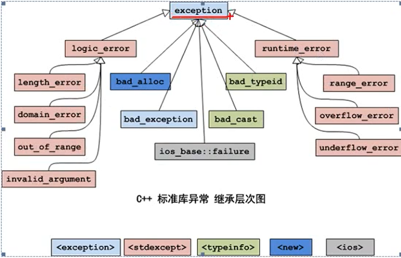

```c++
#include<stdexcept>
class person{
public:
    int age;
	person(int age){
        if(age <0 || age > 150)
        	throw out_of_range("这不是人");
        else
            this->age = age;
    }
};
void test(){
    try{
        person p(151);
    }
    catch(out_of_range &e){
    //catch(exception &e)  //同样可以用基类引用接收-->多态
        cout << e.what() << endl;  //what()可以获取到out_of_range的字符串
    }
}
//继承异常基类
class myexception:public exception{
    
}
```


# 15、智能指针

## 15.1、C++堆栈内分配流程与内存泄漏

概念：当程序未能释放掉不再使用的内存的情况

当new了一片空间，但是不delete指针，释放空间，便会造成**内存泄漏**，也就是说当申请了一片内存空间，但在使用完后不进行显式的释放，这块内存不能被再次使用。

```c++
void func(int *a){
	a = new int(10);
}
int main(){
	int c=30; 
	func(&c);
	return 0;
}
```

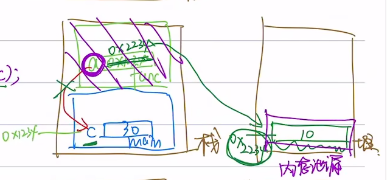

​	在main中定义的代码和调用的函数，通常会被存储在栈中，在栈中创建了常量c = 30，然后将地址c的地址传递给函数func，此时a中存放了c的地址，*a指向c的内存空间。而a利用new在堆上重新申请了一片内存空间，申请并构造完后返回指针给a，a中的地址便发生变化指向了新的内存空间（堆）。当func(&c)执行完毕，由操作系统释放掉，那么a的空间也会被释放掉，此时没有指针指向堆区新申请的空间了，**此时没有delete便会内存泄漏**

代码改进：

```c++
void func(int **a){ //a里面存放的c指针的地址
	*a = new int (10);  //在对上开辟一段内存，并将地址赋值给*a，但是此时a中的地址是c，*a也指向c，因此会将堆内存的地址给c
}
int main(){
	int *c = nullptr;
	func(&c);  //这里是取指针c的地址，作为实参
}
//当func执行完成后，内存回收，但是c里面已经是新开辟的堆内存的地址，*c指向堆，这里形参int* *a的作用就是用*a指向的位置来接收new返回指针，而不是a本身用来存放指针，因此即使func释放了，也会有指针指向堆内存，。
```

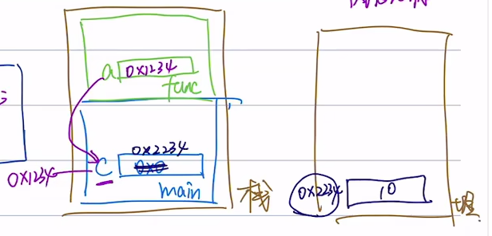

**内存泄漏的避免：**

* new 和delete成对出现
* 对象数组的释放一定用delete[]
* 多态时，一定要基类的析构函数声明为**虚函数**。
* 使用智能指针


## 15.2、智能指针

* 智能指针是类模板，在栈上创建智能指针对象，把普通指针交给智能指针对象
* 智能指针过期时，调用析构函数释放普通指针的内存
* 智能指针就是类，类中有一个成员，管理着原始指针，负责自动释放动态分配的对象，防止堆栈溢出。
	* 智能指针就是⼀个类，当超出了类的 作⽤域时，类会⾃动调⽤析构函数，析构函数会⾃动释放资源。所以智能指针的作⽤原理就是 在函数结束时⾃动释放内存空间，不需要⼿动释放内存空间

**智能指针删除器：**

* 在默认情况下，智能指针过期的时候，用 delete 原始指针;释放它管理的资源。
* 程序员可以自定义删除器，改变智能指针释放资源的行为。
* 删除器可以是全局函数、仿函数和 Lambda 表达式，**形参为原始指针**。
	* 自定义删除器的目的肯定是想在释放资源时，做点其他事情。

```c++
class A{
public:
	//自定义删除器
	void deletefunc(A *a){ //删除器，普通函数
		delete a;
    }
    struct deleteclass{ //删除器，仿函数
        void operator()(A *a){
		delete a;
        }
    };
    auto deletelamb = [](A *a){ //删除器，lambda表达式
		delete a;
    }; 
};

shared_ptr<A> p(new A("狗蛋"),deletefunc);
unique_ptr<A,decltype(deletefunc)*> p(new A("狗蛋"),deletefunc);
```


### 1、独占资源unique_ptr

#### 1.1、概念

* uniuqe_ptr独享它指向的对象，同时只有一个unique_ptr指向同一个对象
* **当unique_ptr被销毁时，指向的对象也被销毁**
	
* unique_ptr默认情况下大小等同于原始指针
	
* unique_ptr**不能使用拷贝构造函数，不可用于隐式转换初始化**,**只允许移动**,移动之后源指针被置空。
* unique_ptr作为继承层次结构中对象的工厂函数返回类型。
* 不能用unique_ptr管理不是new分配的内存
* **不能作为函数参数值传递**，只能引用和指针传递

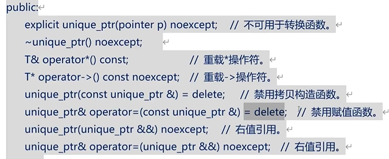

```c++
#include<memory>
template<typename T,typename D = default_delete<T>>  //第一个参数是指针模板类型，第二个参数是指定删除器，默认为delete
class unique_ptr{
public:
private:
   pointer ptr; //内置指针，指向被管理的对象地址
}
//使用场景
class A{
public:
    string name;
    A(){cout << "构造函数" << endl;}
    ~A(){cout << "析构函数" << endl;}
}
A *p = new A("狗蛋"); //普通指针p，p表示被管理的指针，指向new出来的对象的地址
unique_ptr<A> pu(p); // 将p拷贝给pu，不能使用同一个普通指针初始化多个unique_ptr对象

unique_ptr<A> pu(new A("西施"));  //最常用的方法，通过匿名对象

unique_ptr<A> pu;
pu = unique<A>(new A("西施")); //匿名对象
unique_ptr<A> uptr = unique<A>(new A("西施"));
unique_ptr<A> pu= make_unique<A>("西施");


cout << pu->name << (*pu).name << endl; //智能指针重载了->和*
void func(unique_ptr<A> pu) //错误,不能作为函数参数值传递，只能引用和指针传递
    
void func(unique_ptr<A> *pu){ //正确-->传地址}
func(&pu); //调用
```


#### **1.2、使用方法：**

* 将一个unique_ptr赋值给另一个时，如果源unique_ptr是一个临时右值，编译可以通过，但是如果源unique_ptr将存在一段时间，编译器禁止这样做，一般用于函数的返回值

```c++
unique_ptr<A> p0(new A("西施"));
unique_ptr<A> p1;
p1 = p0; //错误,禁止拷贝构造
p0 = unique_ptr<A>(new A("西施")); //用匿名对象给p0赋值，匿名对象在此行代码完成后便会释放掉
```

* 将unique_ptr赋值为nullptr会释放对象

```c++
unique_ptr<A> p0(new A("西施"));
p0 = nullptr; //释放-->构造+析构
```

* release()释放对原始指针的控制权，将unique_ptr**置空**，返回裸指针。（可用于将unique_ptr传递给子函数，子函数将负责释放对象）
	* p.get()：
		* 返回裸指针
		* 能获取到类中管理的原始指针指向的地址

	* &pu:unique_ptr申请一个对象也有自己的地址，和管理的指针的地址不同


```c++
void func(const unique_ptr<A> *a){} //不进行显式的释放，不对unique_ptr进行负责
void func2(unique_ptr<A> *a){
	delete a;  //对指针负责，由函数来释放指针
}
unique_ptr<A> p0(new A("西施"));
func1(p0.get());  //func需要一个指针，不对unique_ptr进行负责
func2(p0.release());  //func2需要一个指针，对unique_ptr进行负责
```

* std::move()可以转移对原始对象的控制权（可用于将unqiue_ptr传递给子函数，子函数形参也是unique_ptr）

```c++
void func4(unique_ptr<A> a){}
fun4(std::move(p0)); //func4需要一个指针，对unique_ptr进行负责,将原始指针的控制权交给func4函数中的形参
```

* reset()释放对象

```c++
p0.reset(); 
p0.reset(nullptr); //释放p0对象指向的资源对象
p0.reset(new B("狗蛋")); //释放p0对象指向的资源对象，同时指向新的对象
```

* swap()：交换两个unique_ptr的控制权

```c++
void swap(unique_ptr<T> &_right);
```

* unique_ptr也可以像普通指针那样，当指向一个类的继承体系的基类对象时，也具有多态性质，如同使用裸指针管理基类对象和派生类对象那样

* unique_ptr**不是绝对安全的**，程序中通过**exit()**退出，全局的unique_ptr可以自动释放，但是局部的unique_ptr无法释放(无法析构，只会构造)

```c++
unique<A> p(new A("西施"));
void test(){
	unique<A> p1(new A("西施"));
}
int main(){
	test();
	exit(0); //全局p可以调用构造和析构，test()局部中的p1只能调用构造
	//return 都可以释放
}
```

* unique_ptr提供了支持数组的具体化版本

数组版本的unique_ptr，重载了操作符[]，操作符[]返回的是引用，可以作为左值使用

```c++
unique_ptr<int[]> arr(new int[3]{33,22,11});
unique_ptr<A[]> arr2(new A[2]{string("西施"),string("狗蛋")});
cout << arr[0] << endl;
cout << arr[0].name << endl;
```


### 2、共享指针shared_ptr

#### 2.1、概念

* shared_ptr**共享它指向的对象，多个shared_ptr指向相同（关联）的对象**，在**内部采用计数机制**来实现。
	* 当新的shared_ptr与对象相关联时，引用计数增加1
	* 当shared_ptr超出作用域时，引用计数减1，当引用计数为0时，则表示没有任何shared_ptr与对象关联，则释放该对象
	* p.use_count()获取引用计数值

```c++
//使用场景
class A{
public:
    string name;
    A(){cout << "构造函数" << endl;}
    ~A(){cout << "析构函数" << endl;}
}
//调用
//初始化
A *p = new A("狗蛋");
shared_ptr<A> p0(p); //拷贝初始化
shared_ptr<A> p0 = make_shared<A>("西施");  //常用

shared_ptr<A> p0(new A("张三"));  //匿名初始化
shared_ptr<A> p1(p0);  //用已经存在的shared_ptr初始化p1，计数+1
shared_ptr<A> p2 = p1; //隐式拷贝，计数+1

cout << p0.use_count(); //获取引用计数值-->3
cout << p0->name;
```


#### **2.2、使用方法：**

* 同样重载了*和->重载运算符，可以像指针一样使用shared_ptr
* use_count()：返回引用计数器的值
* unique()方法，如果use_count为1返货true，否则返回false
* shared_ptr**支持赋值**，左值的shared_ptr的计数器将减一，右值的shared_ptr的计数器值将加一。

```c++
shared_ptr<A> pa0(new A("狗蛋"));
shared_ptr<A> pa1 = pa0; //计数+1
shared_ptr<A> pa2 = pao;
cout << pa0.use_count(); //3

shared<A> pb0(new A("西施"));
shared_ptr pb1 = pb0; //计数+1
cout << pb0.use_count(); //2

pb1 = pa1;
cout << pa0.use_count; //4
cout << pb0.use_count; //1
pb0 = pa0; //当我再次指定时，已经没有pb指向西施了，全都指向狗蛋，此时，pb0在指向资源狗蛋的同时，释放资源西施
```

* get()返回裸指针
* 不能使用同一个裸指针初始化多个shared_ptr
* 不能使用shared_ptr管理不是new分配的内存

**注意：**

* shared_ptr与unique_ptr不同，有拷贝构造函数和赋值运算符重载
* shared_ptr**没有release()函数**，因为多个指针共享一个对象，要不要释放对原始指针的控制权，不是由一个shared_ptr说了算的。
* std::move()可以转移对原始指针的控制权,还**可以将unique_ptr转移为shared_ptr;**
* reset()可以改变与资源的关联关系

```
p.reset(); //解除与资源的关系，计数器-1
p.reset(new A("张三")); //解除与资源的关系，资源的引用计数减一。关联新的资源
```

* swap()：交换两个shared_ptr的控制权

```c++
void swap(shared_ptr<T> &_right);
```

* shared_ptr也可以像普通指针那样，当指向一个类的继承体系的基类对象时，也具有多态性质，如同使用裸指针管理基类对象和派生类对象那样

* shared_ptr**不是绝对安全的**，程序中通过**exit()**退出，全局的shared_ptr可以自动释放，但是局部的shared_ptr无法释放(无法析构，只会构造)

* shared_ptr提供了支持数组的具体化版本
	* 数组版本的shared_ptr，重载了操作符[]，操作符[]返回的是引用，可以作为左值使用
* shared_ptr的线程安全：
	* shared_ptr的引用计数本身时线程安全（引用计数时原子操作）
	* 多个线程同时读一个shared_ptr对象是线程安全的。
	* 如果多个线程同时对同一个shared_ptr对象进行读写，则需要加锁
	* 多线程读写 shared_ptr所指向的同一个对象，不管是相同的 shared_ptr对象，还是不同的shared_ptr对象，也需要加锁保护。


### 3、弱智能指针weak_ptr

shared_ptr计数器计数归0时，资源会释放掉，但是当出现**循环引用**时，计数器无法归0，资源无法释放掉。

* 循环引用：两个对象互相使用一个shared_ptr成员变量指向对方
* 实际上，如果不存在循环引用，也就不用使用weak_ptr
* 指向shared_ptr所管理的对象但不影响其生命周期。即只引用，不计数。

```c++
class A{
public:
	A(){}
	~A(){}
	shared_ptr<B> m_b; //A类的m_p成员指向B类的资源
};
class B{
public:
	B(){}
	~B(){}
	shared_ptr<A> m_a; //B类的m_p成员指向A类的资源
};

shared_ptr<A> pa = make_shared<A>("西施");
shared_ptr<B> pb = make_shared<B>("狗蛋");
pa->m_b = pb;  //指向pb:m_a,m_b-->2
pb->m_a = pa;  //指向pa:m_b,m_a-->2
//循环引用了,当出了main的作用域，对方指向的对象没有析构，那我也不析构
//此时，出作用域，后构造的先析构，pb先析构，此时的析构会释放对象本身的智能指针，但是外界还有指针m_b指向对象pb，因此pb对象不能被析构释放掉，因为还有指针指向它，计数为1，pa同理。而且pa与pb相互引用，都在等对方先释放
```

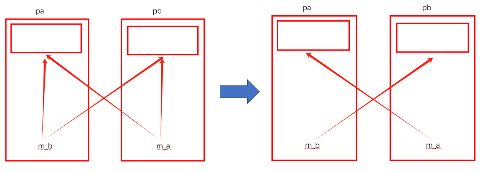

**引入weak_ptr:**

```c++
class A{
public:
	A(){}
	~A(){}
	weak_ptr<B> m_b; //A类的m_p成员指向B类的资源
};
class B{
public:
	B(){}
	~B(){}
    shared_ptr<A> m_a;
	//weak_ptr<A> m_p; //B类的m_p成员指向A类的资源
};

shared_ptr<A> pa = make_shared<A>("西施");
shared_ptr<B> pb = make_shared<B>("狗蛋");
pa->m_b = pb;
pb->m_a = pa;  //这里不再循环
```

#### 3.1、使用方法

* weak_ptr是为了配合shared_ptr而引入的，它**指向一个由shared_ptr管理的资源但是不影响资源的生命周期**，即将一个weak_ptr绑定到一个shared_ptr**不会改变shared_ptr的引用计数**

* 无论是否由weak_ptr指向，如果最后一个指向资源的shared_ptr被销毁，资源也就被释放掉

	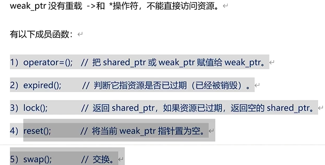

```c++
if(pa->m_p.expired() == true)
    cout << "语句块内部：pa->m_p已过期"
else
    cout << pa->m_p.lock()->m_name << endl; //没过期便将weak_ptr用lock()提升为shared_ptr，这里在单线程中是安全的，但是这两步并不是原子的，可能在提升的过程中，资源已经被其他线程释放了，因此多线程不能这么实现
```


#### 3.2、线程安全

* weak_ptr不控制对象的声明周期，但是，他知道对象是否活着
* 用lock()函数把它可以提升为shared_ptr，如果对象还或者，返回有效的shared_ptr。如果对象已经死了，提升会失败，返回一个空的shared_ptr
* 提升的行为是lock()线程安全的	

多线程下：

```c++
shared_ptr<B> pp = pa->m_p.lock(); //将weak_ptr用lock()提升为shared_ptr
if(pp == nullptr)
    cout << "语句块内部：pa->m_p已过期"
else
    cout << pp->m_name << endl; //没过期便将weak_ptr用lock()提升为shared_ptr
```


### 4、auto_ptr

* 主要是为了解决，有异常抛出时发生内存泄漏的问题。因为异常发生无法正常释放内存。

 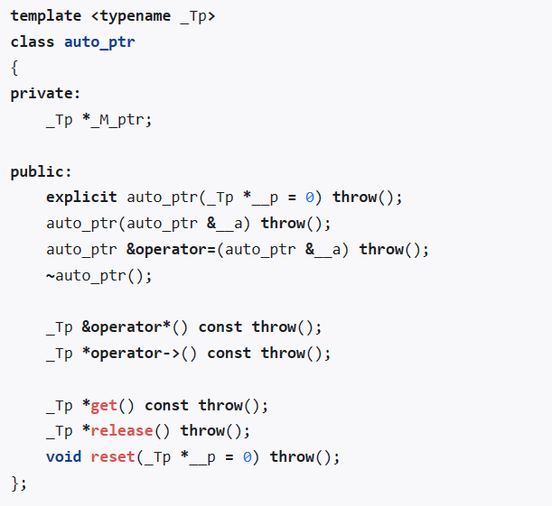

```c++
template<typename T>
class smart_ptr{
private:
	T * m_ptr;
public:
	explicit smart_ptr(T *ptr = nullptr):m_ptr(ptr){}
    ~smart_ptr(){
        delete m_ptr;
	}
    smart_ptr(const smart_ptr &) = delete;
    smart_ptr &operator=(const smart_ptr &) = delete;
    smart_ptr(smart_ptr && other){  //移动拷贝构造
		m_ptr = other.release();  //将other所有东西进行移动
    }
    smart_ptr &operator=(smart_ptr rhs){ //移动赋值运算符
		rhs.swap(*this); 
        return *this;
    }
    T *release(){  //转移auto的所有权
        T *ptr = m_ptr; //获取m_ptr
        m_ptr = nullptr; //m_ptr所有权交出后，置空
        return ptr;
    }
    T swap(smart &rhs){
		swap(m_ptr,rhs.m_ptr)
    }
    
    T* get() const{return m_ptr;}
    T& operator*() const{return *m_ptr;}
    T *operator->() const{return m_ptr;}
    operator bool() const{return m_ptr;}
};

class person{
    public:
    virtual ~person(){}
};
class student:public person{
public:
    ~student(){}
};
int main(){
    smart_ptr<student> ptr(new student);
    smart_ptr<student> p2;
    p2 = move(ptr);
}
```

* auto_ptr构造时取得某个对象的控制权，再析构时释放该对象，实际上是创建了一个auto_ptr类型的局部对象，该局部对象析构时，会将自身所拥有的指针空间释放掉，所以不会有内存泄漏
* auto_ptr的构造函数为explicit，阻止了一般指针隐式转换为auto_ptr的构造，因此必须用auto_ptr的构造函数创建对象。
* auto_ptr对象析构会删除其所拥有的指针，所以避免多个auto_ptr指向同一对象
* atuo_ptr析构中，用的delete而不是delete[]，所以不能管理数组
* T *get()获取auto_ptr所拥有的指针，T *release()，释放auto_ptr所有权，并将所有用的指针反回


### 5、手写智能指针需要实现那些函数

构造函数、拷贝构造函数、赋值构造函数、析构函数、移动函数。


## **15.3、**RAⅡ

RAⅡ：资源获取即初始化，也就说在**构造函数中申请分配资源，在析构函数中释放资源**。

C++的语言机制保证了，当一个对象创建的时候，会自动调用构造函数，当对象超出作用域的时候会自动调用析构函数，所以，在RAⅡ的指导下，我们使用类来管理资源，将资源和对象的声明周期绑定。

而智能指针shared_ptr和unique_ptr即RAⅡ最具代表的实现，使用智能指针，可以实现自动的内存管理，不用担心忘记delete。


# 16、对象复用和零拷贝

## 16.1、对象复用

* 对象复用本质是一种设计模式：flyweight享元模式
* 通过将对象存储到**对象池**中实现对象的重复利用，这样可以避免多次创建重复对象的开销，节约系统资源

## 16.2、零拷贝

* 一种避免CPU将数据从一块内存拷贝到另一块存储的技术
* 可以减少数据拷贝和共享总线操作的次数


# 17、模板类

模板类的代码通常在.h中

* 模板类很特殊，由template<...>处理的任何东西都意味着**编译器在当时不为它分配存储空间**，其**一直处于等待状态知道被一个模板实例**告知，在编译器和连接器的某一处，有一机制能去掉指定模板的多重定义。

	* **连接器（Linker）**：
		* 连接器是将多个目标文件和库文件组合在一起，生成可执行文件的程序。
		* 在编译过程中，源代码通常会被编译成多个目标文件，每个目标文件包含一个或多个函数或变量的定义和实现。
		* 连接器的作用是解析目标文件之间的符号引用关系，将它们合并成一个单独的可执行文件。
		* 连接器还负责解析外部库文件的引用，并将它们链接到可执行文件中，以便程序能够调用库中的函数或变量。

* 当编译器只看到模板的声明时，他不能实例化该模板，只能创建一个具有外部连接的符号并期待连接器能够将符号的地址决议出来。

* 当编译器在编译过程中遇到模板的声明时，它会生成对应的符号表明这个模板的存在，但并不会生成该模板的实际代码。这样做的好处是可以避免在编译阶段生成大量相似的代码，而是将模板的实例化推迟到链接阶段。

* 然后，在**链接阶段，连接器负责解析这些模板的外部符号**，并找到对应的实例化定义。如果找不到对应的实例化定义，链接过程将失败，并生成链接错误。

	* 这里的理解是，假设在一个文件**test.h**中写了了一个模板类:

	```c++
	test.h
	template<typename T>
	class Array {
	private:
	    T* elements;
	    int size;
	public:
	    Array(int size);
	    ~Array();
	    T& operator[](int index);
	    int getSize() const;
	};
	
	template<typename T>
	Array<T>::Array(int size) : size(size) {
	    elements = new T[size];
	}
	```

	main.cpp

	```c++
	// main.cpp
	
	#include <iostream>
	#include "Array.h"  // 包含模板类的声明
	
	int main() {
	    Array<int> intArray(5);  // 创建一个存储 int 类型的数组
	    for (int i = 0; i < intArray.getSize(); ++i) {
	        intArray[i] = i * 10;
	    }
	    for (int i = 0; i < intArray.getSize(); ++i) {
	        std::cout << intArray[i] << " ";
	    }
	    std::cout << std::endl;
	
	    return 0;
	}
	```

	* 然后我在mian.cpp包含其声明#include<test.h>，编译器只会看到 `Array` 类的声明，不会生成模板的实际代码。然后，在链接阶段，连接器会解析 `Array<int>` 的实例化定义，并找到对应的模板实例化定义，例如 `Array<int>::Array(int)`、`Array<int>::operator[](int)` 等。连接器会将这些实例化定义链接到可执行文件中，以便程序可以正确运行。
	* **但是**如果main.cpp中包含了#include<test.h>，且在文件中使用了 `Array<int>` ，但是在test.h中没有对模板进行实例化定义，此时便会出错。

* 这种延迟实例化的方式使得模板的编译速度更快，因为编译器只需处理模板的声明，而不需要生成模板的实际代码，这些代码将在链接时由连接器处理。


# 18、重载运算符

## 18.1、cout和printf有什么区别

* **cout**
	* cout是C++中的标准输出流，cout<<后可以跟不同的类型，是因为**cout<<已存在针对各种类型数据的重载，所以自动识别数据的类型**
	* 可以输出各种对象、容器和自定义类型，并且可以使用流操作符 `<<` 进行链式输出。
	* 输出过程会首先将输出字符放入缓冲区，然后输出到屏幕。

* **printf:**
	* `printf` 是C语言中的标准输出函数，使用格式化字符串来指定输出格式，需要手动指定数据类型和格式控制符，
	* 是无缓冲输出，有输出立即输出


## 18.2、重载运算符

重新定义已有的运算符，使其适用于用户自定义的数据类型或者类对象。

* **只能重载已有的运算符**，对于重载的运算符，其优先级和结合律必须和内置类型一致，不能更改运算符个数。
* 引入重载运算符，可以实现类的多态。
* 当重载运算符**是成员函数时**，this绑定到左侧运算符对象，即**成员运算符的参数数量比操作数少一个，**但**至少含有一个类类型的参数**。
* 标运算符 `[]`必须是成员函数。
* **从参数的个数判断到底定义的是那种运算符**，当运算符既是一元运算符又是二元运算符（+，-，*，&）
	* -一元运算符是负号，二元运算符是减法


**两种重载方式**：成员运算符与非成员运算符

* **非成员运算符（友元）**：

```c++
class myclass {
public:
	friend myclass operator+(const myclass& a, const myclass& b);
    friend myclass operator-(const myclass &a.const myclass &b);
	friend ostream& operator<<(ostream& out, const myclass& a);
    
    friend myclass operator-(const myclass &a);       
public:
	int val;
	explicit myclass(int val) :val(val){} //explicit使用于单参数的构造函数
};

myclass operator+(const myclass& a, const myclass& b) {  //加法重载（二元运算符）
	return myclass(a.val + b.val);
}
myclass operator-(const myclass &a,const myclass &b){  //减法重载（二元运算符）
	return myclass(a.val-b.val);
}
myclass operator-(const myclass &a){  //减法重载（一元运算符）
	return myclass(-a.val);
    
};

ostream& operator<<(ostream& out, const myclass& a) {  //<<左移运算符重载
	out << a.val;
	return out;
}

```

**成员运算符**：

```c++
#include<iostream>
using namespace std;

class myclass {
private:
    int arr[10];
public:
	int val;
    
	myclass operator+(const myclass& b) {  //左侧绑定this指针对象val，二元运算符加法
		return myclass(val + b.val);
	}
    myclass operator-(const myclass &a){  //二元运算符减法
        return myclass(val-a.val);
    }
    myclas operator-(){
		return myclass(-val); //一元运算符减法
    }
    myclass &operator++(){  //自增前缀，没有参数
    	val++;  
    	return *this;
	}
	myclass &operator++(int){  //自增后缀，多了一个int参数，但是用的时候不传参
		val++;
    	return *this;
	}
    myclass &operator=(int i){  //赋值运算符
        val = i;
        return *this;  //返回值必须是this对象的引用
    }
    myclass &operator[](int index){
		return arr[index];
    } 
	friend ostream& operator<<(ostream& out, const myclass& a);
    
public:	
	explicit myclass(int val) :val(val){}
};

ostream& operator<<(ostream& out, const myclass& a) {  //<<不能作为成员运算符
	out << a.val;
	return out;
}

int main() {
	myclass a(3);
	myclass b(5);
	cout << a + b << endl; //加法运算符
    a++; //后缀自增运算符
    ++a; //前缀自增运算符
    a = 10; //赋值运算符
    myclass arr;
    arr[0] = 10; //下标运算符
}
```

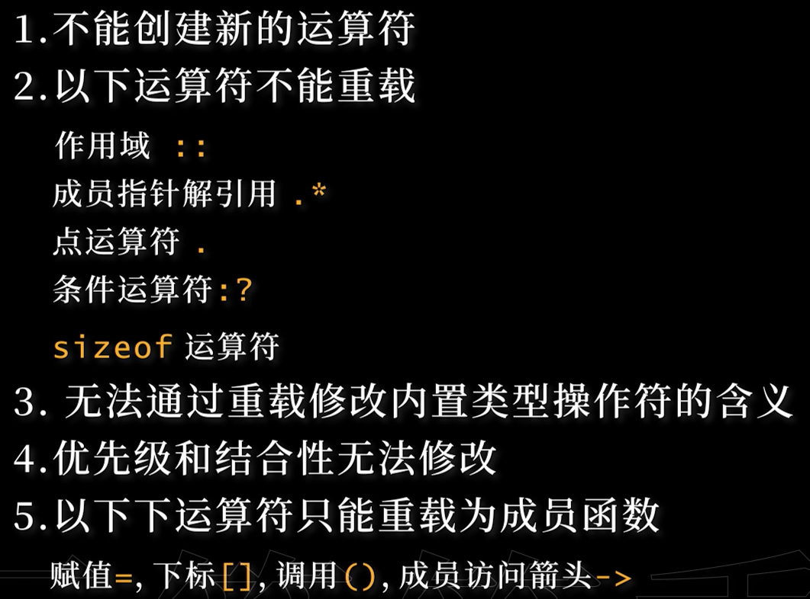


**另外：**

* string s = “abc”; 其实，abc并不是string类型，这也是赋值运算符的功劳。
* 复制构造函数适用于创建时新对象的初始化，赋值运算符适用于已有对象的赋值。
	* 这里可以用explicit关键字，区分开，不允许用另一对象来初始化新对象


## 18.3、函数重载的匹配顺序

1. 函数名查找
2. 确定候选函数（参数匹配）
3. 寻找最佳匹配（尽可能少地进行类型转换，或者说尽可能精确地匹配实参类型和形参类型）


# **19、lambda表达式**

匿名函数/闭包，用于定义并创建匿名的函数对象

* 变量捕获：可以捕获、修改（按照引用捕获）外部变量
	* 写法：
		* [&] 所有变量都按引用捕获，函数体内可以使用lambda所在范围内所有可见的局部变量
		* [=] 所有变量都按值捕获，函数体内可以使用lambda所在范围内所有可见的局部变量
		* [&,=N] 按值捕获N，其他变量都按照引用捕获
		* [this] 在类中捕获当前实例的指针，可以使用lambda所在类中的成员变量

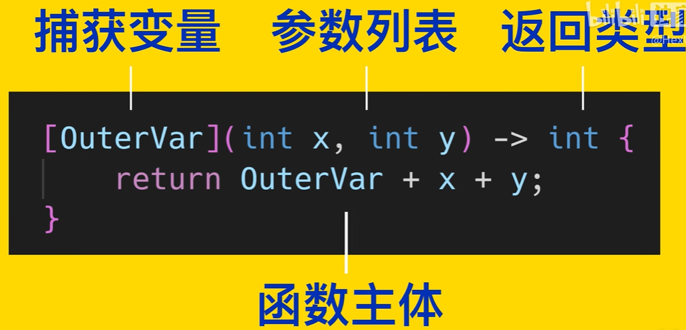


```c++
auto f = [](int a,int b)->int{
	return a+b;
}
f(1,2); // 3
```

```c++
int N = 100,M = 10;
auto g = [N,&M](int i){
	M = 20;
	return N*i;
}
g(10); //1000
M; //20
```


# 20、friend(友元)

* 打破了类的封装性和数据的隐藏性。
* 是C++提供的外部函数的一种辅助方法
* 友元提高程序的运行效率

友元提供了不同类的成员函数之间、类的成员函数和一般函数之间进行数据共享的机制。

## 20.1、友元函数

* 类中friend修饰的函数
* 普通函数是友元函数
* 友元赋予友元函数中的**对象**具有打破权限的一个功能，并不是能够直接访问类中的数据，因此要访问类中的数据，**必须传入一个对象或者定义一个对象。**
	* 以一个对象为参数或者在当前函数中定义的对象
	* **友元函数不属于任何类**，是定义在类外的函数，不受类的权限限定。
	* 必须是友元函数中的对象才可以访问类中的任何属性的数据成员，即使返回该对象也脱离了友元函数，不再具有友元属性。
	* **一个函数可以是多个类的友元函数**，但必须在每个类中进行声明。

```c++
class person{
public:
	friend int func(int x,person &per); //声明
    friend int func2(int x,person *per); //指针也可以实现友元，操作的是地址，和引用一样
    frined person * returnobject(); //直接返回友元对象
private:
	int age;
    void print_test(){
	cout << "你好" << endl;
    }
};
int func(int x.person &per){  //类外定义，传入对象，访问private成员
    per.age = x;
    per.print_test();
    person p; //创建临时对象也可以访问
    p.age = y;
    p.print_test();
	return per.age;
}
int func2(int x.person *per){  //类外定义，传入对象，访问private成员
    per->age = x;
    per->print_test();
    person *p =new person(); //new一个对象也可以访问
    p->age = y;
    p->print_test();
	return per.age;
}
person * returnobject(){ //返回友元中的对象变量
    person *p = new person();
    p->age = 18;
    return p;
}
int main(){
	person p;
    func(1,p);
    person p2 = new person();
    func2(2,p2);
    returnobject()->age; //错误的，无法访问private成员，当对象脱离友元函数后，便不具有友元打破封装的属性
    return 0;
}
```

**以另一个类的成员函数为友元函数**：

```c++
class student; //声明类的存在，防止友元声明报错，这和编译顺序有关
class person{
    friend void student::print(person &p);//另一类中要使用的话必须进行声明
public:
	string name;
private:
	void print(){}
};
class student{
public:
    void print(person &p){  //传入person类对象
		return p.print();
    }
};
```


## 20.2、友元类

* 在A类中声明B类为友元类，B类中的所有**A类对象**都具有无视权限限定的一个功能。
	* B类对象无法访问A类数据
* 都是赋予**对象**具有打破封装的权力。
* 友元类中，类的组合形式也无视权限。
* 友元类不能被继承
* 友元关系不具有继承性和传递性。

```c++
#include <iostream>
class person{
public:
    person(int age,string name):m_age(age),m_name(name){}
	friend class student;  //声明友元类
private:
	int m_age;
	string m_name;
};
class student{
public:
    void show(int x,string str,person &p){
		p.m_age = x;
        p.m_name = str;
        person *p1= new person(); //同样可以创建临时对象
        p1->m_age = x;
        p1->m_name = str;
        cout << p.age << p.name << endl;
    }
    
};
int main(){
    class person per;
    class studen stu;
    stu.show(18,"wangbadan",per);
}
```

**组合的形式实现友元类：**

```c++
#include <iostream>
class person{
public:
    person(int age,string name):m_age(age),m_name(name){}
	friend class student;  //声明友元类
private:
	int m_age;
	string m_name;
};
class student{
private:
    int stu_id;
    person per; //组合声明
public:
	student(int age,string name,int id):per(age,name),stu_id(id){} //列表初始化
    void show(){
		per.m_age = 100;
        per.m_name = "wangbadan"; //可以直接访问private成员
    }
};
```

**互为友元类：**

* 这里需要注意的就是编译顺序
* 创建类对象去调用类的成员函数，必须在类的定义之后

```c++
class person{
public:
	friend class student;
    void print();
private:
	void per_show();
};
class student{
public:
	int stu;
	friend class person;
    void print(){
		person *p = new person();
        p->print();
    }
private:
	void stu_show(){}
};
void person::print(){  //通过person类调用student类的print()函数，这里一定要注意编译顺序，必须写到student类的后面
	student *stu = new student();
    stu->print(); 
}
```


## 20.3为什么友元函数必须在类内声明

因为编译器必须能够读取这个结构的声明以理解这个数据类型的大小、行为等方面的所有规则。

有一条规则在任何关系都很重要，那就是谁可以访问我的私有部分。


# 21、左值和右值

## 1、左值和右值

左值和右值是表达式的分类，主要根据表达式的可寻址性和生命周期来区分。

左值：

* **有持久的存储位置（表达式结束后仍旧存在），可以被取址**
* 可以获取地址的表达式，能出现在赋值语句的左边，对该表达式可以进行赋值。

* 但是const修饰的表达式，可以取地址，但是在初始化之后便无法再进行赋值。
* 变量，数组元素、结构体/类的实例、函数返回值(引用/非常量对象)

右值：

* **临时性的、不再需要的表达式结果**
* **无法获取地址**的对象，由常量值、函数返回值（值类型，该值没有被用于初始化一个左值引用）、lamba表达式，函数参数（即使参数是右值引用）、通常的字面量等
* 无法获取右值的地址，但是可以进行改变，定义了右值的右值引用时就可以更改右值
	* 右值又分为纯右值和将亡值
		* 纯右值就是临时变量和不跟对象关联的字面量值
		* 将亡值就是要转移的对象

## **2、i++和++i**

i++：

* i++是右值
	* 在i++操作中，编译器会首先生成一份i的临时拷贝，然后才会对i进行递增，最后返回临时拷贝的资源，这个拷贝是一个临时对象，没有持久的存储位置。

++i:

* ++i是左值，直接递增后马上返回其自身

```c++
int get_val(){
	return x;  //右值
}
void set_val(int val){
    x = val; //x是左值，val右值
}
void set_val2(int && val); //val是右值
int main(){
    x++; //右值
    ++x; //左值
    int y = get_val(); //正确，y是左值，get_val()是右值（临时）
    set_val(6); //参数是右值
    set_val(x); //此时的参数val是左值
}
```


## **3、左值引用和右值引用**

左值引用：

* 传统的c++引用(&)

右值引用：

右值引用的目的是过移动语义来避免无谓拷贝问题，通过**move语义可以将临时生成的左值中的资源无代价的转移到另一个对象中去**，通过完美转发来解决不能按照参数实际类型来转发的问题。这样可以避免内存空间的释放和分配，能够延长变量值的声明周期

* 右值引用关联到右值时，右值被存储到特定的位置，右值引用指向该特定位置。
* 右值值引用不能绑定到任何的左值，要想绑定一个左值到右值引用，通常需要std::move()将左值转换为右值。
* 通过右值引用的声明，右值有“重获新生”，其生命周期与右值引用类型变量的声明周期是一样的，只要该变量还活着，该右值临时变量将会一直存在下去
* 右值引用独立于左值和右值，即右值引用类型可能是左值也可能是右值
* T &&t在发生自动类型推断时，是左值还是右值取决于它的初始化

```c++
template<typename T>
void func(T && t){
	cout << t << endl;
}
int getint(){
	return 5;
}
int main(){
	int a = 10;
    int &b = a; //正确，a已经创建，左值初始化左值，b是左值引用
    int &c = 10; //错误，c是左值不能使用右值初始化，10没有存储位置是临时的
    int &&rref = std::move(value); // 正确，rref是一个右值引用，绑定到value转换后的右值上
    int &&d = 10; //正确
    const int &f = 10; //正确，左值常引用相当于万能型，可以用左值或者右值初始化
    const int &f = a; //正确
    const int &&h = 10; //正确，右值常引用，但是h有固定地址，是左值
    const int &&h = a; //错误
    const int &aa = h; //正确
    int &i = getint(); //错误，左值不能用临时变量（右值）初始化
    int &&i = getint(); //正确
    func(10); //t是右值
    func(a);//t是左值
    return 0;
}
```


# xxx、STL

STL六大组件：容器、算法、迭代器、仿函数、适配器、空间配置器

原生指针也是迭代器

```c++
int arr[5] = {1,3,4,4,7};
int *p = arr;
for(int i = 0;i<5;i++){cout << *(p++) << endl;} //可以
```

广义上看，STL主要分为3类：**algorithm（算法）、container（容器）、iterator（迭代器）**，


## **1、迭代器**

* 迭代器是一种抽象的概念，通过迭代器可以在不了解容器内部原理的情况下遍历容器
* 是作为容器与STL算法的粘合剂
* 提供一个遍历容器内部的接口，因此迭代器内部必须保存一个与容器相关联的指针，然后重载各种运算符来遍历（和智能指针类似）
* 常用的迭代器：value type、difference type、pointer、reference、iterator catagoly；


### 1、++it和it++哪个好

* ++it返回一个引用，it++返回一个对象

1. **返回值**:
	* `++it`：这是前缀递增操作符。它先将迭代器`it`递增到下一个元素，然后返回递增后的迭代器。
	* `it++`：这是后缀递增操作符。它**先返回当前迭代器`it`的副本**，**然后将原始迭代器`it`递增到下一个元素。**
		* `it++`通常是通过在迭代器类中定义一个特殊的**成员函数**来实现的，这个函数接受一个哑参数（通常为`int`类型且未使用）以区分前缀和后缀形式。当调用`it++`时，编译器会生成一个迭代器的副本，调用这个函数，并将这个副本返回给调用者。然后，**在函数内部，迭代器对象本身会被递增**。
2. **效率**：
	* 在大多数情况下，现代C++编译器会对这些操作进行优化，使得`++it`和`it++`的效率几乎相同。但是，理论上讲，`++it`可能会比`it++`稍微快一些，因为它不需要**创建和返回迭代器的副本**。然而，这种差异在大多数情况下都是可以忽略的，除非你正在处理大量数据或者对性能有极高的要求。
3. **使用场景**：
	* 当你不关心递增前的迭代器值时，或者需要立即使用递增后的迭代器时，可以使用`++it`。
	* 当你需要在递增迭代器之前保留迭代器的当前值时，可以使用`it++`。例如，你可能想将当前元素的值存储起来，然后再移动到下一个元素。


```c++
//++i实现代码
int &operator++(){
	*this +=1;
	return *this;  //返回一个指向当前对象的解引用，允许进行链式操作
}
//i++实现代码
int operator++(){
	int temp = *this;
	++*this;  //调用++i
	return temp;
}
```


### 2、return *this:

返回一个指向当前对象的引用能够实现链式操作，是因为通**过引用可以连续调用同一个对象的不同方法，而不需要每次都显式地写出对象的名字。**

**当一个方法返回当前对象的引用时，这个返回值可以被用来继续调用该对象的其他方法。**这样，你可以将多个方法调用串联在一起，形成一个长长的表达式，其中每个方法调用都依赖于前一个方法的返回结果。

```c++
class Builder {  
public:  
    Builder& addFeatureA() { 
        return *this; // 返回当前对象的引用，以便进行链式操作  
    }    
    Builder& addFeatureB() {   
        return *this; // 返回当前对象的引用  
    }    
    void finalize() {    
    }  
};  
int main() {  
    Builder builder;    
    // 使用链式操作连续调用方法  
    builder.addFeatureA().addFeatureB().finalize();  
    return 0;  
}
```


## 2、算法

### 2.1、HashTbale

STL中的hashtable（哈希表）使用的是**拉链法**解决hash冲突。

* 拉链法：将大小为M的数组的每一个元素指向一个链表，链表中的每一个节点都存储散列值为该索引的键值对


## 3、空间配置器

* 空间配置器就是**给容器分配空间的**。像我们平时使用new和delete动态分配释放对象内存一样。空间配置器也封装了这些功能。但是STL的空间配置器不仅仅只简单调用分配空间，它在一些地方都做了优化来提升性能。

* 我们在调用new动态分配对象内存时:
	* 通常会先调用malloc分配空间然后调用默认构造函数。
	* 通过delete来释放内存时，会先调用默认析构函数来析构对象，然后调用free来释放空间。
	* 在new/delete中把这两步封装在了一起。
* 而在STL中空间分配则是将这两阶段操作区分开来。
	* **内存配置和释放操作**由成员函数**alloc:allocate()和alloc:deallocate()**负责。
	* **对象的构造和析构**由::**construct()96和::destory()**负责。


### 3.1、两级空间配置器

**目的：**

* 在堆上动态开辟内存时，频繁的使用开辟和释放内存，以及每次都调用malloc、free函数会造成堆上产生很多外部碎片，浪费空间。当外部碎片增多，内存分配器在找不到合适内存的情况下需要**合并空闲块**，浪费时间。

**原理：**二级空间配置器

* 当开辟内存<=128bytes时，即视为开辟小块内存，调用二级空间配置器
* 当开辟内存>128bytes时，即视为开辟大块内存，调用一级空间配置器
	* **一级空间配置器allocator采用malloc和free来 管理内存，和C++标准库中提供的allocator是一样的**
	* **但其二级空间配置器allocator采用了基于freelist 自由链表原理的内存池机制实现内存管理。（16个自由链表+内存池）**


```C++
//空间配置函数的内部实现原理
//allocate()函数，首先判断区块大小，大于128bytes就调用第一级配置器，小于128bytes就检查对应的free list.
//如果free list之内有可用的区块，就直接拿来用，如果没有可用区块，就将区块大小调至8倍数边界，然后调用refill(),
//准备为freelist重新填充空间。refill() 后面再写
// n>0
static void* allocate(size_t n)
{
	obj * volatile * my_free_list;
	obj * result;
 
	//大于128就调用第一级配置器
	if (n > (size_t)_MAX_BYTES)
	{
		return (malloc_alloc::allocate(n));
	}
 
	//寻找16个free lists中适当的一个
	my_free_list = free_list + FREELIST_INDEX(n);
	result = *my_free_list;
	if (result == 0)
	{
		//没有找到可用的free list,准备重新填充free list
		void *r = refill(ROUND_UP(n));
		return r;
	}
 
	//调整free list
	*my_free_list = result->free_list_link;
	return (result);
}
```


## **4、容器**

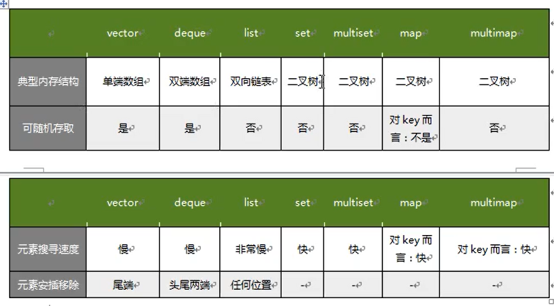


### 1、vector

vector是动态空间。

**遍历：**

```c++
#include<vector>
#include<algthorim>
vector<int v>
v.push_back(xx);

//遍历元素
vector<int>::iterator itBegin = v.begin();  //v.begin()起始迭代器，指向v的第一个元素
vector<int>::iterator itend = v.end(); //v.end():结束迭代器，指向容器v的最后一个元素的下一个位置

while(itBegin != itend){
	cout << *itBegin << endl;
    itBegin++;
}

for(vector<int>::iterator it = v.begin();it!=v.end();it++){
	cout << *it << endl;
}

void print(int val){ //回调函数
    cout << val << endl;
}
for_each(v.begin(),v.end(),print);

//每一个容器都有其专属的迭代器：自定义数据类型
class person{
public:
    int m_age;
    string m_name;
public:
    person(const int &age,const string &m_name){
        m_age = age;
        this->m_name = m_name;
    }
};
person p(18,"wangbada");
person p1(81,"huanggou");
vector<person> v;
v.push_back(p);
v.push_back(p1);
for(vector<person>::iterator it = v.begin();it!= v.end();it++){ //每一个容器都有其专属的迭代器：自定义数据类型
	cout << (*it).m_age << (*it).m_name << endl;  //(*it)-->person p
}

//存放指针
vector<person *> v;
v.push_back(&p);
v.push_back(&p1);
for(vector<person *>::iterator it =v.begin();it!v.end();it++){
	cout << (*it)->m_name << (*it)->m_age << endl;  //（*it)--->person *p
}

//容器嵌套
vector<vector<int>> v;
vector<int> v1;
vector<int< v2;
vector<int> v3;
v.push_back(v1);
v.push_back(v2);
v,push_back(v3);
for(vector<vector<int>>::iterator it = v.begin();it!= v.end();it++){
    // *it === vector<int> v
	for(vector<int>::iterator vit = (*it).begin();vit!=(*it).end();vit++){
        cout << *vit << " ";
    }
    cout << endl;
}
```

vector可以理解为单端数组，v.push_back和v.pop_back只会在尾端进行操作。

vector除了v.begin()和v.end(),还有v.rend()(指向最后一个元素)和v.rbegin()（指向前一个元素的上一个元素），因此可以实现逆序遍历。

**vector维护一个线性空间**，所以无论元素的类别如何，普通指针都可以作为vector的迭代器，因为vector所具有的操作行为，如operator*（+、-、+=、-=、++、--），可以任意挑选元素进行操作,普通指针天生具有这样的功能，因此**vector支持随机存取，提供的是随机访问迭代器。**


**vector构造函数:**

```c++
vector<int> v; //采用模板类实现，默认构造函数
vector(v.begin(),v.end()); //将v[begin(),end())区间的元素拷贝给本身
vector<int> v2(v.begin(),v.end());  //本质上是有参构造，只不过两个参数是迭代器
vector(n,elem); //构造函数将n个elem拷贝给自身
vector(const vector &vec); //拷贝构造函数


//assgin
v.assgin(v1.begin(),v1.end());
v.swap(v2);
```


动态开辟的二维数组。元素在内存连续存放。随机存取任何元素都能在常数时间完成。在尾端增删元素具有较佳的性能。

vector底层为**单端数组/动态数组**，v.push_back和v.pop_back只会在尾端进行操作。

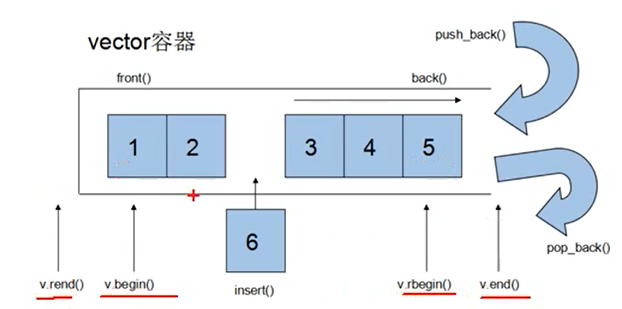


#### **1.1 、逆序遍历（非质变算法）：**

* vector除了v.begin()（指向第一个元素）和v.end()（指向最后一个元素的下一个位置）
* 还有v.rend()(指向最后一个元素)和v.rbegin()（指向前一个元素的上一个元素），因此可以实现逆序遍历。

```c++
for(vector<int>::reverse_iterator it = v.rbegin();it! = v.rend();it++){
	cout << *it << endl;
}
```


#### **1.2 、vector随机存取：**

​		**vector维护一个线性空间**，所以无论元素的类别如何，普通指针都可以作为vector的迭代器，因为vector所具有的操作行为，如operator*（+、-、+=、-=、++、--），可以任意挑选元素进行操作,普通指针天生具有这样的功能，因此**vector支持随机存取，提供的是随机访问迭代器。**支持**跳跃式访问**。

```c++
vector<int>::iterator it = v.begin();
it = it + 3;
cout << *it << endl;  //只要不报错，这个迭代器就支持跳跃式访问
```

​		List容器便不支持随机访问。


#### **1.3、vector扩容规则：**

* **显示扩容：**
	* resize() 重置大小
	* reserve() 预留空间
		* 两种扩容的区别：
			* reserve()是改变的是vector的capacity不是size，因此很多内存空间是野的，使用[]访问会越界。
			* reserve()预留分配内存后，空间未满的情况，不会引起重新分配。
			
			* resize()只改变元素的数目，不改变vector的容量大小，但是会使容器真正具有new_size个对象。
	
* **默认扩容**：
	
	* vector首先申请内存空间，将旧空间的元素拷贝到新空间，释放旧空间。
	
	* 扩容后由于旧空间已经释放，内部元素的地址会改变，原先的迭代器（指针）会失效，因此需要**重新写一个迭代器（指针）指向新的内存空间。**
	
	* vector默认是成倍扩容
		* 对比发现，采用成倍扩容方式可以保证**常数的时间复杂度**，而增加指定大小的容量只能达到O(n)的时间复杂度。
	
	* 根据编译器的不同，mscv,win+vs是1.5倍扩展，linux+gcc和clang是2倍扩展
	  * 增长因子一般就在(1,2),既要保证不能浪费堆空间，又要保证下一次申请的内存必然大于之前分配内存的总和。 
	

```c++
	//新的空间地址通过vector提供的成员函数来获取
	std::vector<int> vec = {1, 2, 3};        
    int* ptr = &vec[1]; // 指向vec旧空间中的第二个元素，值为2        
    // 现在向vec中添加元素，触发扩容  
    vec.push_back(4);        
    // 扩容后，ptr指向的内存可能已经被释放或重新分配  
    // 因此，ptr现在是一个悬挂指针，使用它是不安全的  
    // ptr = &vec[1]; // 这是错误的，因为vec已经重新分配了内存        
    // 正确的做法是在扩容后重新获取指向新元素的指针  
    int* new_ptr = &vec[1]; // 获取扩容后vec中第二个元素的地址        
    // 输出新指针指向的值，应该是2（如果vec没有改变顺序）  
    std::cout << "The value pointed by new_ptr is: " << *new_ptr << std::endl; 

	const size_t_type len = old_size + max(old_size,n);
```

**STL中的哈希表扩容：**

* 创建一个新的内存空间，该空间是旧空间两倍大最接近的质数
* 将旧空间的数通过指针的转换，插入新空间（这里并没有将数据直接从旧空间拷贝到新空间，而是通过指针转换两个空间的地址）
* 通过swap函数将新空间与旧空间交换，销毁新空间。

​		**STL中swap函数：**

* 除了数组，其他容器在交换后本质上是将**内存地址（指针）进行了交换**，而元素本身在内存中的位置是没有变化的。

```
template<class T> void swap(T &a,T &b)
{
 T c(std::move(a)); //move移动语义
 a = std::move(b);
 b = std::move(c);
}
```


#### 1.4、vector空间收缩

erase、clear()都只能删除和清空元素，但是vector的内存占用还在，所有的内存空间只有在vector析构的时候才会被系统回收。

* resize() 函数

* 可以用**swap收缩内存**：匿名对象+初始化
	* 这里的vector<int>(v),类型+(初始化)，相当于创建匿名对象，然后用v去初始化，那么这里匿名对象的大小就和v一样。
	* 而这里的swap就相当于用v和匿名对象进行交换操作（交换指针）
	* **匿名对象**的特点就是在**当前行(表达式结尾)执行完成后会释放掉其指向的内容**
		* 释放由系统自动回收

```c++
vector<int>(v).swap(v); 
vector().swap(v);
```

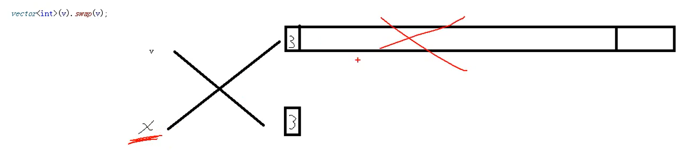

另外可以使用deque，进行空间动态缩小。


#### **1.5、v.push_back()**

* v.push_back向尾部插入元素 
	* 当空间够用时，首先会创建这个元素，然后再将这个元素拷贝或者移动到容器中
	* 不够用时，插入的过程和vector扩容的过程一样，会不断的申请新的内存空间，并拷贝旧空间的元素。
	* 需要调用**拷贝构造函数**和**转移构造函数**
* 频繁的使用v.push_back()
	* 会导致频繁的内存重新分配和元素复制，会导致性能下降。
* 与emplace_back()的区别
  * **emplace_back()**是零拷贝技术，插入的元素原地构造，**不需要触发拷贝构造和转移构造**


例如：

```c++
vector<int> v;
for(int i= 0；i<10000;i++)
	v.push_back(i);        //会不断扩容
```


#### 1.6、手撕vector

```c++
#include<iostream>
using namespace std;

template<typename T>
class MyVector{
public:
    typedef T value; //值
    typedef T *iterator; //vector里面的iterator本质是一个指针
    typedef T& reference; 
    
protected:
    iterator m_Data; //头指针
    iterator  start; //起始位置
    int m_len; //数组长度
    int pos; //当前位置
    
public:
    MyVector(int len = 0):m_Data(nullptr),start(nullptr),m_len(len),pos(0){
		if(len > 0){
            //创建一个数组
            m_Data = new value[len];
        }
    }
}
```


### 2、string容器

#### 2.1、string与char*之间的关系

* string继承自basic_string，是对char*进行了封装，封装的string包含了char数组，容量，长度等属性
	* char*是一个指针，string是一个类
* string可以进行**动态扩展**，在每次扩展的时候另外申请一块原空间大小**两倍**的空间，然后将原字符串拷贝过去，并加上新增加的内容（等比**vector扩容**）。
* string不用考虑释放和越界，string管理char*所分配的内存，每一次string的复制，取值都由string类负责维护。

#### 2.2、**API：**


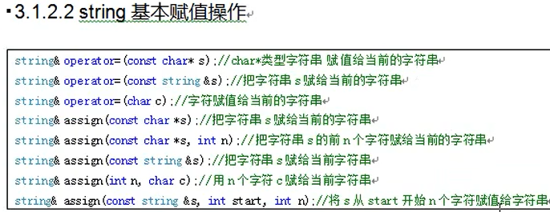

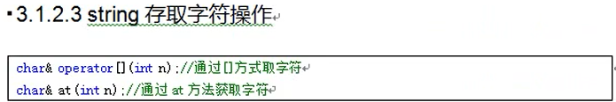


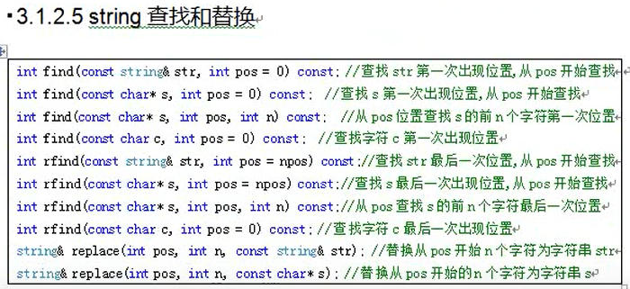

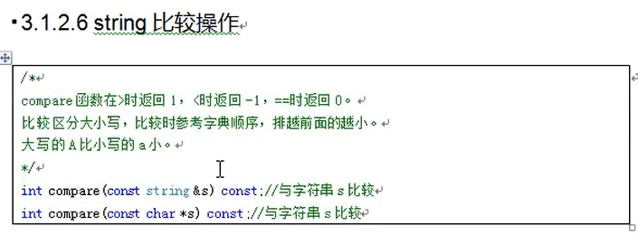


```c++
//构造函数
string str;
string str2(str);
string str3 = str;
string str4(10,'s');
//赋值
str = "abc";
str.assign(str);
str.assign("abcde",3); //abc
str.assign(str,0,2); //ac
//存取字符
for(int i = 0;i<str.size();i++){
	cout << str[i] << endl;
    cout << str.at(i) << endl; //[]与at的区别，[]访问越界会直接挂掉，at访问越界，会抛出out_of_range异常 
}
//拼接
str += str2;
str.append("abc");
//查找
str = "bacde"
str.find("de"); //从0开始，返回d的位置，没有返回-1
str.replace(1,3,"11111");//将1~3位置的字符替换为"11111",超过3个后面字符串有多长都会替换
//比较
str.compare(str2); //str>str2:>0 str<str2:<0 str==str2:==0 从前往后比
//字串
str.substr(0,5); //截取从0开始的5个位置的字串
//子串：截取用户名
string email = "zhangsan@sina.com"
int pos = email.find('@'); // 8
string userName = str.substr(0,pos); //zhangsan
//子串：截取网站字符
string str = "www.xatu.sb.edu";
int initpos = 0;
int end = -1;
while(true){
    if(end == -1){
        string tempstr0 = substr(start,str.size()-start); //处理最后一个edu
        break;
    }
	int pos = str.fin('.',start); //从0开始
	string tempstr = substr(start,pos-start);
    start = pos+1; //避开"."
}
```


### 3、deque容器

#### 3.1、概念

底层为**双端数组**，可以在两端进行插入和删除。

* deque和vector一样也**支持随机存取**，vector是单向开口的连续性空间，而deque是**双向开口（可以在两端进行插入和删除）的连续性空间**
* deque允许**常数时间内对头端进行元素插入和删除操作**
* deque**没有容量的概念，其是动态的以分段的连续空间组合而成，随时可以增加一段新的空间并链接起来**，deque的最大任务就是如何维护这个整体的连续性，像vector那样“因为空间不足而重新分配，并就行复制和释放原空间”的操作并不会出现在deque身上，因此deque**没有提供所谓的空间保留功能**
* 中控器负责保存每一段内存的地址
* deque提供随机访问的迭代器，但是其迭代器并不是普通的指针，其复杂程度比vector高级，因此对deque进行排序，可以先将元素复制给vector，利用sort排序后，再复制回deque。


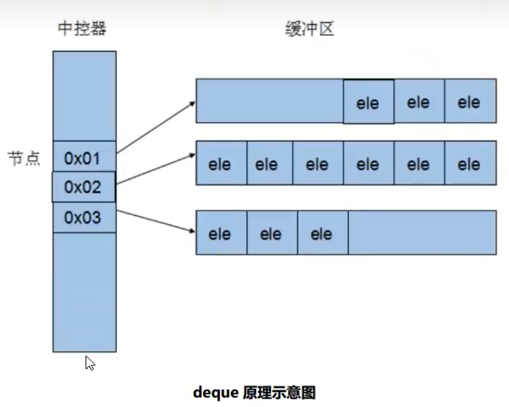


#### 3.2、API

* 双端插入和删除元素效率较高.
* 指定位置插入也会导致数据元素移动,降低效率,
* 可随机存取,效率高.


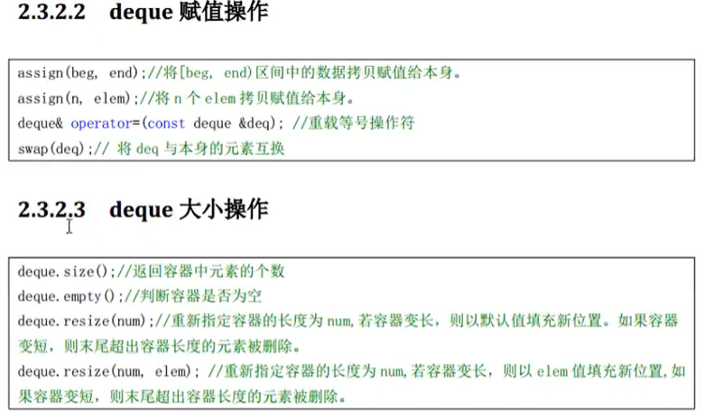


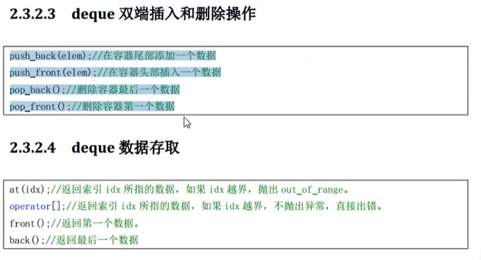


```c++
#include<deque>
//初始化
deque<int> d;
deque<int> d(10,5);
deque<int> d2(d.begin(),d.end());
deque<int> d3(d2);

//打印
for(deque<int>::iterator it = d.begin();it!=d.end();++it){
	cout << *it << endl;
}

//赋值
deque<int> d;
d.assgin(10,5); //10个5
d2.assgin(d.begin(),d.enda());
d3 = d2;
d3.swap(d2);

//大小操作
if(d.empty()){
    cout << id empty << endl;
}
d.size(); //大小
d.resize(5); //扔掉末尾超出的元素
d.resize(15,5); //超出的部分以5填充

//插入与删除
d.push_back(444); //尾插
d.push_front(505); //头插
d.pop_front(100); //头部弹出
d.pop_back(200); //尾部弹出
d.clear(); //清除所有元素
d.earse(5,10); //删除5~10之间的元素
d.earse(6); //删除6号位的元素
```


### 4、stack容器

* 是一种先入后出的数据结构，
* 只有一个出口，只允许在栈顶新增元素，移除元素
* 只有栈顶元素可以被外界使用，不具有遍历功能，没有迭代器
* **栈不能遍历,不支持随机存取，只能通过 top 从栈顶获取和删除元素.**


```c++
#include<stack>
//初始化
stack<int> s;
stack<int> s2(s);

//操作
s.push(10); //压栈
s.pop(10); //出栈

//打印栈顶数据
s.empty();
s.size();
cout << s.top() <<endl; 
```


### 5、queue 容器

* 底层为**双端队列**，先进先出
* 队列能在两端插入和删除，但是插入和删除时单向的，**在一端插入，必须在另一端删除**
* 不能进行遍历，不提供迭代器
* 不支持随机访问

```c++
#include<queue>
//初始化
queue<int> q;
q.push(10);
q.pop();  //删除对头
cout << q.front() << endl; //对头元素
cout << q.back() << endl; //队尾元素
```


### 6、list容器

#### 6.1、概念

* 底层为环形双向链表，使用一个指针便可以遍历整个链表

* list的插入和删除操作都不会造成原有的迭代器失效
* 尾部节点也是指向最后一个节点的下一位（空白节点），因此是前闭后开的区间结构
* list空间管理采用alloc空间配置器，为了方便以节点大小为配置单位，还定义了一个list_node_alloctor函数可以一次性配置多个节点。
* list由于双向性，支持在头部front和尾部back两个方向进行push和pop操作


#### 6.2 、API


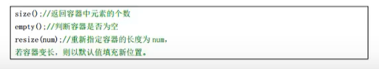

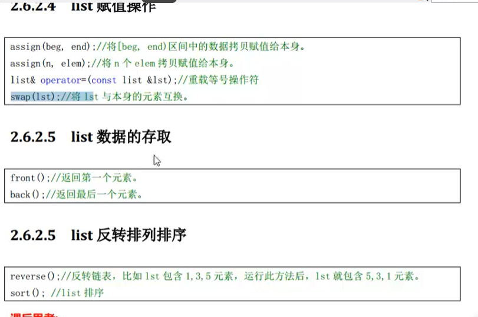


```c++
#include<list>
//初始化
list<int> l;
list<int> l2(10,10); //有参构造
list<int> l3(l2);
list<int> l4(l3.begin(),l3.end());

for(list<int>::iterator it = l.begin(),it!=l.end();it++){
	cout << *it << endl; //*it是int类型
}

//插入删除
l.push_back(10); //尾插
l.push_front(200); //头插
l.insert(l.begin(),300); //头插
l.insert(l.end(),300); //尾插
l.insert(l.end(),300); //尾插
list<int>::iterator it = l.begin();
it++;
it++;
l.insert(it,500);
l.pop_back();//尾删
l.pop_front(); //头删
l.earse(l.begin(),l.end());
l.remove(10); //删除所有匹配元素

//大小操作
l.size();
l.empty();
l.resize();

//赋值操作
l.assgin(10,10);
l2 = l1;
l2.swap(l); //交换
l.front(); //头元素
l.back(); //尾元素

//反转
l.reverse(); //倒叙
l.sort(); //正序
bool nosort(int a,int b){
    return a>b;
}
l.sort(nosort); //倒序
```


#### 6.3、slist

**概念：**

list是双向链表、slit是单向链表，两者的主要区别是：list的迭代器是双向的，后者的迭代器是单向的，slist不如list灵活但是其所耗空间小，操作快。

**API**：

slit提供了inset_after()、erase_after()、push_front()

```c++
template<typename T>
class slist{
	static listnode* create_node(const value_type& x); //配置空间构造元素
	static void destroy_node(list_node* node){} //析构函数、释放空间
private:
	list_node_base node;
public:
	iterator begin(){}
	iterator end(){}
	size_type size(){}
	bool empty(){}
	void swap(slist &L){} //交换两个slist，只交换两个头节点
	reference front(){} //取头部元素
	void push_front(const value &x){} //头部插入元素
	void pop_front(){} //从头部取走元素
};

#include<forward_list>
forward_list<int> f;
f.push_front(10);
f.push_front(20);
f.push_front(30);
f.push_front(40);
forward_list<int>::iterator it1 = f.begin();
forward_list<int>::iterator it2 = f.end();
for(;it1!=it2;++it){
	cout <<*it1 << endl;  //40 30 20 10
}
it1 = find(f.begin(),f.end(),20); //寻找20的位置  
if(it1! = it2){
	it.insert_after(it1,99); //插入99
}
for(auto it:f){
    cout << it << " "; //40 30 20 99 10
}
it1 = find(f.begin(),f.end(),20); //寻找20的位置  
if(it1! = it2){
	it.erase_after(it1); //删除99，20的下一个元素
}
for(auto it:f){
    cout << it << " "; //40 30 20 10
}
```


### 7、set容器

#### 7.1、set/multiset容器特性

set/multiset的**底层实现都是红黑树**，红黑树是平衡二叉树的一种

**set特性：**

* 所有**元素的键值都会自动排序**(从小至大)
* set的**元素既是键值又是实值**
	* 其元素都是唯一的，并且只包含一个关键字，这个关键字既是用于排序的依据，也是元素本身的值。也就是说，`set`**中的元素没有与关键字相关联的值（value）**

* set**不允许相同的两个键值**
  * set.count()：查找set中有没有这个元素，要么是0，要么是1
  * s.insert():插入相同的值会失败
  	* typedef pair<iterator,bool> _Pairib; //插入的底层，其实返回的也是队组，不过一个是迭代器，一个bool类型
  		* 当插入成功返回迭代器iterator，bool = True;
  		* 插入失败不会返回迭代器，bool = false;
  		* 所以插入的操作不会提前判断set中有没有相同元素，只有插进去了，会返回对组，其中bool = false;
* set的iterator是一种const_iterator
  * **不能通过迭代器修改set元素的值**，因为set元素值就是其键值，关系到set元素的排序规则
* 对set容器的插入和删除不会影响之前的迭代器。除了被删除的那个

**multiset特性：**

* 和set完全相同，唯一的不同是允许键值重复。

**API：**

```c++
class mycompareInt{  //仿函数
public:
    bool operator()(int v,int v2){
        return v>v2;
    }
}
set<int> s;
//set容器的自定义排序要在插入之前
set<int,mycompareInt> s; //compare是仿函数，这里不能用回调函数,倒序排序
multiset<int> ms;  //
s.empty(); //判空
s.insert(5); //插入元素
s.erase(30); //删除元素值为30的元素
s.erase(beg,end); //删除此区间的元素
s.erase(pos); //删除pos位置的元素
s.find(key); //查找键值key是否存在，返回的是该键的元素的迭代器，若不存在返回s.end()的迭代器;
		set<int>::iterator pos = s.find(30);
		if(pos != s.end())  //有这个值
		if(pos == s.end())  //没有这个值
s.lower_bound(keyElem); //返回第一个key>=keyElem的迭代器
		set<int>::iterator pos2 = s.lower_bound(30);
		if(pos != s.end()){ //没遍历完成一直遍历
            return *pos2;
s.upper_bound(keyElem); ////返回第一个key>keyElem的迭代器
        set<int>::iterator pos2 = s.lower_bound(30);
		if(pos != s.end()){ //没遍历完成一直遍历
            return *pos2;
s.equal_range(keyElem); //同时返回容器中key与keyelem相等的上下限的两个迭代器
         pair<set<int>::iterator,set<int>::iterator> ret = s.equal_range(30);
         if(ret.first != s.end())
             return *ret.first;  //返回第一个迭代器 = lower_bound的值
         if(ret.second != s.end())
             return *ret.second; //返回第二个迭代器 = upper_bound的值
S.count(key);//查找键值为key的元素个数（0/1）
```

 **pair：**对组

```c++
pair<string,int> p("tom",18);  //队组的有参构造
pair<string,int> p = make_pair("tom",18);
cout << p.first << p.second << endl;
```


#### 7.2、unordered_set

底层为**哈希表**。

```c++
unordered_set<int,int> us;
us.insert(x);
us.empty(); //判空
us.insert(5); //插入元素
us.erase(30); //删除元素值为30的元素
us.count(30); //0/1
```


### 8、map容器特性

#### 8.1、map/multimap/unordered_map容器

**Map特性:**

* 所有的元素的键值都会自动排序
* 底层是**红黑树**
* **所有元素都是pair，同时拥有实值和键值**，pair的第一元素是键值，第二元素是实值，不允许两个元素具有相同的键值
* **不能通过迭代器改变map的键值，但是可以修改实值**。
* 容器元素进行新增操作或者删除操作时，操作之前的所有选代器，在操作完成之后依然有效，当然被删除的那个元素的选代器必然是例外。
* map中的元素按照二叉搜素树存储，进行**中序遍历**得到有序遍历。

**Multimap特性：**

* 键值可重复
* 适用场景：当需要处理一对一多的数据关系时，可以使用`multimap`。

**unordered_map（hashmap）特性**：

* map与multimap都是存储的key-value的值，可以通过key快速找到value，而unordered_map不会根据key值的大小进行排序。
* unordered_map内部是无需的，存储时是根据key的hash值判断元素是否相等。
* unordered_map采用拉链法解决hash冲突

**API：**

```c++
map<int,string> m;
m.insert(pair<int,string>(18,"shabi")); //插入
m.insert(make_pair(18,"shabi"));
m.insert(map<int,string>::value_type(3,30));
m[4] = 40;  //使用这种方式进行插入时，如果没有key=4的键，会自动生成这样一个键
for(map<int,string>::iterator it = m.begin();it != m.end();it++){  //遍历
	cout << it->first << it->second << endl;
}
m.earse(3);  //删除传入key值
m.find(3);  //按照键值查找，返回迭代器
	map<int,string>::iterator ret = m.fin(3);
	if(ret != m.end()){  cout << ret->first << ret->second << endl; }
m.count(3); //统计key = 3
m.lower_bound(keyElem); //返回第一个key>=keyElem的迭代器
	map<int,string>::iterator ret = m.lower_bound(keyElem);
	if(ret != m.end()){  cout << ret->first << ret->second << endl; }
m.upper_bound(keyElem); ////返回第一个key>keyElem的迭代器
        map<int,string>::iterator ret = m.upper_bound(keyElem);
		if(ret != m.end()){  cout << ret->first << ret->second << endl; }
m.equal_range(keyElem); //同时返回容器中key与keyelem相等的上下限的两个迭代器
         pair<map<int,string>::iterator,map<int,string>::iterator> ret = m.equal_range(30);
         if(ret.first != s.end())
             cout << ret.first->first << ret.first->second << endl;  //返回第一个迭代器 = lower_bound的值
         if(ret.second != s.end())
             cout << ret.second->first << ret.second->second << endl; //返回第二个迭代器 = upper_bound的值
```

**map中[]和find的区别：**

* 下标运算符[]：是**将关键码作为下标去查找，并返回对应的值**；如果**不存在**这个关键码，就将一个具有该关键码和提供的对应值的项**插入map**中；
* find：是根据关键码进行查找，找到了就返回该位置的迭代器，找不到就返回尾迭代器。


#### **8.2、Hashmap**

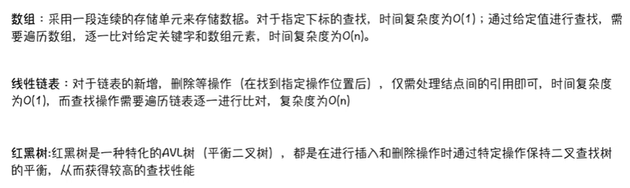

* 存储：put()
* 查询：get()

```c++
Map<String,int> mp = new Map("zhangsan",18);
```

**存储原理：**

* 底层是数组，有同一键上的的元素用链表链接起来。
	* 当出现一个新结点时，先将key和value封装成一个结点
	* 再调用key的hashCode方法调用key的哈希码
	* 再通过哈希函数将hashcode转换为桶的下标
	* 当某一个键值后面的结点超过8个以后，链表会变成**红黑树**，当红黑树链表结点数量少于6个，会重新变为单链表。

**扩容**：

* hash table表格内的元素成为桶（bucket）,而桶所链接的元素成为节点（node），其存入桶元素的容器为stl本身很重要的序列式容器-vector
	* vector有动态扩容能力，无需人工干预

* 当向容器中添加元素时，会判断当前元素个数，如果≥阈值，即当前数组的长度乘以加载因子的值的时候，就要自动扩容。
* 扩容就是重新计算容量，像hashmap中不断的添加元素。


## 5、STL容器汇总


### 1、vector与list的区别

vector：

* 和动态数组类似，**拥有一片连续的内存空间**，迭代器可以作为指针使用，并且起始地址不变，因此**能高效的随机存取**，时间复杂度为O(1);
* 但也正是因为内存空间是连续的，**在进行插入和删除时，会造成内存的拷贝**，时间复杂度为O(n);
* vector可以实现动态增长，但是在中间和头部插入和删除，需要移动大量元素。

list:

* List底层为双向链表，内存空间是不连续的，只能通过指针访问数据。**list访问要遍历整个链表**，**因此随机存取效率很低**，时间复杂度为O（n）。

* 由于双向链表的特点，**支持双向遍历**，每个链表节点包含三个信息：元素本身、指向前一个元素的结点指针，和指向下一个元素的结点指针，因此**能高效的插入和删除，**

	


### 2、STL中迭代器失效的情况

在STL（Standard Template Library）中，不同类型的容器提供了不同类型的迭代器以访问和遍历其元素。大部分STL容器都支持迭代器，但并不是所有容器都为每个元素提供一个单独的迭代器。实际上，迭代器是一种对象，它允许程序员按顺序访问容器中的元素。

以下是STL中一些常见容器及其迭代器支持情况：

1. 顺序容器
	* `std::vector`：有迭代器，支持随机访问迭代器，可以通过索引直接访问任意位置的元素。
	* `std::list`：有迭代器，支持双向迭代器，可以向前和向后遍历元素，但不支持直接通过索引访问。
	* `std::deque`：有迭代器，通常也支持随机访问迭代器，但具体实现可能因库而异。
	* `std::array`：虽然不直接提供迭代器成员函数（如`begin()`和`end()`），但由于其内部本质上是一个固定大小的数组，可以通过指针或基于索引的访问来遍历元素。
	* `std::forward_list`：有迭代器，但仅支持单向迭代器，只能向前遍历元素。
2. 关联容器
	* `std::map`、`std::multimap`：有迭代器，支持双向迭代器，用于遍历键值对。
	* `std::set`、`std::multiset`：有迭代器，同样支持双向迭代器，用于遍历唯一的元素。
	* `std::unordered_map`、`std::unordered_multimap`：有迭代器，支持前向迭代器，用于遍历哈希表中的键值对。
	* `std::unordered_set`、`std::unordered_multiset`：有迭代器，支持前向迭代器，用于遍历哈希表中的唯一元素。
3. 容器适配器
	* `std::stack`、`std::queue`、`std::priority_queue`：这些容器适配器通常不提供迭代器，因为它们的设计目的是通过特定的接口（如`push`、`pop`、`top`等）来访问元素，而不是通过迭代器遍历。


在STL（Standard Template Library）容器中，迭代器是一种用于访问容器中元素的对象。然而，在某些情况下，对容器的操作可能会导致迭代器失效，即迭代器不再指向有效的元素或变得不可预测。以下是一些常见的会导致迭代器失效的操作：

1. **插入操作**：
	* **`insert`**：在容器的特定位置插入一个或多个元素。这可能会使指向插入点之后元素的迭代器失效，因为插入操作可能会重新分配容器的内部空间或移动元素。但是，指向插入点之前元素的迭代器仍然有效。
		* 尾插：vector：size<capacity时，插入操作导致尾迭代器失效。size == capacity时，所有迭代器失效（重新分配空间）
	* **`emplace`** 和 **`emplace_back`**：这些方法与 `insert` 类似，但直接在容器中构造元素，也可能导致类似的迭代器失效问题。
2. **删除操作**：
	* **`erase`**：从容器中删除一个或多个元素。这会使指向被删除元素或其后元素的迭代器失效。删除操作可能会导致容器重新分配空间或移动元素，因此与删除点相关的迭代器都可能不再有效。
3. **容器修改操作**：
	* **`resize`**：改变容器的大小。如果容器变大，新添加的元素可能会使指向原容器末尾之后的迭代器失效。如果容器变小，删除的元素及其后的迭代器都会失效。
	* **`clear`**：删除容器中的所有元素。这将使所有迭代器失效，因为容器中不再有任何元素可供它们指向。
	* **`swap`**：交换两个容器的内容。这会导致两个容器中原有的迭代器都失效，因为它们现在指向了不同的容器。
4. **重新分配**：
	* 当容器（如 `std::vector`）在插入元素时达到其容量限制时，它可能需要重新分配更大的内存空间。这种重新分配操作会导致所有指向容器中元素的迭代器失效，因为元素的内存位置可能发生了变化。
5. **修改关联容器**：
	* 对于关联容器（如 `std::map`, `std::set` 等），当插入或删除元素时，可能会导致容器的内部结构发生变化（如红黑树的重新平衡）。这可能会使指向容器中元素的迭代器失效，尤其是当这些迭代器指向被删除或重新定位的元素时。


### 3、set与map的区别

* set与map底层都是红黑树，因此插入删除等操作的时间复杂度都在O（logn）内

`td::set`和`std::map`都是STL（Standard Template Library）中的关联容器，它们的主要区别体现在以下几个方面：

1. **存储的数据类型**：

* **实现map的红黑树的节点数据类型是key+value，而实现set的节点数据类型是value**（只有一个值，既是键值又是数据值）。
	* `std::set`中的元素都是唯一的，并且只包含一个关键字（key），这个关键字既是用于排序的依据，也是元素本身的值。也就是说，`set`中的元素没有与关键字相关联的值（value）。
	* `std::map`中的元素是键值对（key-value pairs），其中关键字（key）用于排序和索引，而值（value）是与关键字相关联的数据。`map`中的关键字也是唯一的。

2. **迭代器类型**：

* `std::set`的迭代器**允许访问关键字，但不允许修改关键字**（因为这会破坏容器的排序性质）。
* `std::map`的**迭代器允许访问和修改值（value）**，**但不允许修改关键字（key）**。同样，这是为了保持容器的排序性质。

3. **支持的操作**：

* `std::set`不支持下标操作，因为它没有与关键字相关联的值。
* `std::map`支持下标操作，可以使用关键字作为下标来访问或修改与之关联的值。

在底层实现上，`std::set`和`std::map`通常都是基于红黑树实现的，因此它们都能保持元素的排序状态。这使得在迭代器遍历或查找元素时能够保持顺序。


### 4、list和queue之间的区别

* list底层为**双向环形链表**，其节点存储空间不连续，不能像vector一样以普通指针作为迭代器。
* list的**插入和结合都不会造成原有的迭代器失效**
* deque底层是双端队列，先进先出，头尾两端都可以做插入删除操作，但是同一时刻的插入和删除是单向的。
* deque与vector的区别在于：
	* deque允许常数时间内对其头端进行元素的插入和移除
		* 在`vector`的头部插入或删除元素通常是一个效率较低的操作，因为它可能需要移动大量的元素以保持数据的连续性。
		* `deque`被设计为允许在常数时间内对其头部进行元素的插入和移除。这是通过其内部的多段连续空间结构实现的，**每个段都可以独立地处理其头尾部的操作，而无需移动其他段的元素。**
	* deque没有容量概念，其**以动态的分段连续空间组合而成，随时可以增加一段新的空间并链接起来**
		* `deque`没有像`vector`那样的单一容量概念。它是由多个固定大小的块（或称为节点）组成的，这些块通过指针或迭代器链接在一起。当需要在`deque`的某个端点添加新元素时，如果当前块没有足够的空间，`deque`会简单地分配一个新的块并将其链接到现有块上。
	* deque没有所谓的空间保留功能
		* `vector`提供了`reserve`成员函数，允许你预先分配一定量的内存空间。这可以避免在后续添加元素时由于需要重新分配内存而导致的性能开销。但是，这也意味着即**使`vector`的大小减小，已分配的内存空间也不会自动释放**，除非你显式地调用`shrink_to_fit`成员函数
		* 由于`deque`的动态分段连续空间结构，它并没有`vector`那样的显式空间保留功能。它会自动根据需要添加或移除内存块，以适应其大小的变化


### 5、STL各容器对应的迭代器


**容器**                                                    																																		**迭代器**

------

vector、deque                                                                                                                                                                     随机访问迭代器

------

stack、queue、priority_queue                                                                                                                                        无

------

list、（multi）set/map                                                                                                                                                       双向迭代器

------

unordered_(multi)set/map、forward_list                                                                                                                        前向迭代器

------


# YYY、特殊函数

## 1、offsetof宏

* 获取结构成员相对于结构开头的字节偏移量

```c++
#include<stddef.h>
struct S{
	int x;
	char y;
	int z;
	double a;
};
cout << offsetof(S,x) << endl; //0
cout << offsetof(S,y) << endl;  //4
cout << offsetof(S,z) << endl; //8
cout << offsetof(S,a) << endl; //16
```


## 2、两个浮点数的比较

对于两个浮点数的大小比较，不能直接用==，因为计算机存在误差，只能通过相减之后的绝对值与预先设定的精度进行比较。

```c++
#include <stdio.h>  
#include <math.h>  
#include <float.h> // 包含FLT_EPSILON等浮点数的特性  
  
int approximatelyEqual(double a, double b, double epsilon) {  
    return fabs(a - b) < epsilon;  
}  
  
int main() {  
    double x = 0.1;  
    double y = 0.3 / 3.0;  
    double epsilon = DBL_EPSILON; // DBL_EPSILON是double类型能表示的最小正数  
  
    if (approximatelyEqual(x, y, epsilon)) {  
        printf("x and y are approximately equal.\n");  
    } else {  
        printf("x and y are not approximately equal.\n");  
    }  
    return 0;  
}
```


## **3、main函数中的内存结构**

* main函数的返回值必须是int，这样返回值才能传递给程序激活者，标识程序正常退出
* 对于main(int argc,char *argv[])函数的参数处理，一般会调用**getopt()**函数处理。

```c++
int main(int argc,char *argv[]){}
//char *argc[]:需要输入argc个参数，每个参数都是char类型输入，一次存放在数组里，数组是argv[]，所有的参数在指针
//int argc：char *指向的内存中，数组的元素个数为argc个，第一个参数是程序的名称。
```


## 4、一个空类中默认会添加那些函数

```c++
empty()；//缺省构造函数
empty(const empty &);//缺省拷贝构造函数
~empty();//析构函数
empty &operator =(const empty &);//赋值运算符
```


## 5、strcy、memcpy、sprintf函数

* **strcpy**

	* 只复制字符串
	* 不需要指定长度，遇到被复制的字符的串结束符'\0'才结束，所以容易溢出

	```c++
	char source[] = "Hello, world!";
	char destination[20];
	strcpy(destination, source);
	```

* **strncpy**

  * 将指定长度的字符串复制到字符数组中

  * 将`src`所指向的字符串中以`src`地址开始的前`n`个字节复制到`dest`所指的数组中

  * `dest`必须有足够的空间放置n个字符。
    * 如果`src`字符串的长度小于`n`，那么`dest`的剩余部分将用'\0'填充。

    * 如果`src`字符串的长度大于或等于`n`，那么`dest`将不会以null字符结尾，这可能导致未定义的行为。


  ```c++
  char *strncpy(char *strDest,const char *strDrc ,int pos);
      char src[20] = "Hello, world!";  
      char dest[10];       
      strncpy(dest, src, 5);  
      dest[5] = '\0';  // 手动添加null字符  
  ```

  

* **memcpy**:

  * 可以赋值任意内容，两个对象是两个任意可操作的内存地址，例如字符数组、整型、结构体、类等
  * 根据第三个参数决定复制长度
  * 主要实现内存块间的拷贝

  ```c++
  char source[] = "Hello, world!";
  char destination[20];
  memcpy(destination, source, sizeof(source));
  ```

* **sprintf**

  * 源操作符对象可以是多种类型，目的操作对象是字符串

  * 实现其他类型到字符串的转化

  	```c
  	char str[100];
  	int num = 10;
  	sprintf(str, "The number is: %d", num);
  	```

  	

## 6、memset成员函数

* 数组初始化函数
* 直接对内存进行操作
* 对类中的int.char,struct等类型的变量也可以在构造函数中，将对象的内存全部置为0.
	* 类中**有虚函数时，不能这么初始化**
	* 类中**含有C++类型的对象不能这么初始化**
		* 这些对象可能包含复杂的构造函数、析构函数和成员变量。直接使用 `memset` 来初始化这些对象可能会跳过它们的构造函数调用，导致对象处于未定义状态。

```c++
memset(this,0,sizeof(*this))
```

```c++
#include<csting>
int a[10];
memset(a,0,sizeof(a));
struct list{
	int a;
    char b;
};
memet(&list,0,sizeof(list));
```


## 7、回调函数

callback

* 和普通函数没有本质区别
	* 对于普通函数而言，由程序员书写时，函数的定义和调用都由自己完成，定义和使用都是分离的
* 回调函数要求传入的参数是函数变量（把函数也当成一个变量）
	* 调用的函数跟不关心，函数调用的是什么，只需要知道再哪里调用即可
	* 通过函数指针调用
	* 回调函数是**由用户实现**的，**由内核执行**（信号）。

```C++
int applyOperation(int (*p)(int), int value) { //函数指针作为变元传递给函数
    int result = p(value);
    return result;
}

// 一个简单的函数，对输入值进行平方操作
int square(int x) {
    return x * x;
}
// 另一个简单的函数，对输入值进行立方操作
int cube(int x) {
    return x * x * x;
}

int main(){
    int inputValue = 5;
    applyOperation(square, inputValue); //将函数作为参数给另一个函数
    applyOperation(cube, inputValue);
    return 0;
}
```

* 当发生某件事时，系统或其他函数会自动调用你定义的一段函数
* 回调函数就相当于一个中断处理函数，由系统再符合你设定的条件时会自动调用。为此需要做三件事：
	* 声明
	* 定义
	* 设置触发条件，就是在**函数中把回调函数名转换为地址作为一个参数**，以便系统调用
* 回调函数就是一个**通过函数指针调用的函数，将函数的指针（地址）作为参数传递给另一个函数**，而这个指针被用为调用它所指向的函数时，这就是回调函数。


## 8、auto、decltype、decltype(auto)

### 8.1 、auto

可以让编译器替我们去分析表达式所属的类型，和原来那些只对应某种特定的类型说明符。

* auto让编译器通过初始值来进行类型推演，从而活得定义变量的类型，所以说**auto定义的变量必须有初始值**。

```c++
//普通类型
int a = 1,b = 2;
auto c = a+b; //c:int

//const类型
const int a = 1;
auto b = a; //a是顶层const，会被忽略，因此b是int类型
auto c = &a; //a是一个常量，对常量取地址是一种底层const，所以c是const int*类型
const auto d = a;  //当希望推断出来的const为顶层const，就需要在auto前加const

//引用和指针类型
int x = 2;
int &y = x;
auto z = y; //z是int类型
auto &p = y; // p是int&类型
auto p2 = &x; //p2是int*类型
```


### 8.2 、decltype

**引入的目的：**

有时我们希望，可以**从表达式种推断要定义变量的类型，但却不用表达式的值去初始化变量**。或者函数的返回值类型为某个表达式的值类型。

**引入的作用：**

**选择并返回操作数的数据类型**。在此过程中，**编译器只是分析表达式并得到它的类型，却不进行实际的计算表达式的值**

```c++
int func() {return 0};
int a = 0;

//普通类型
decltype(func()) sum = 5; //sum的类型式函数func的返回值类型int，但是不会实际调用func只是分析其返回值类型
decltype(a) b = 5; //a:int-->b:int


//const类型,无论是顶层const还是底层const，decltype都会保留
const int c = 3;
decltype(c) a = 5; //顶层const
int e = 5;
const int *f = &e;
decltype(f) g = f; //g是底层const

//引用和指针类型,表达式是引用类型，decltype也是引用类型
const int e = 5;
int &a = e;
decltype(a) b = 5;  //b是引用类型int&

//当表达式是引用类型，但是想要得到这个引用所指向的类型，需要修改表达式
const int e = 5;
int &a = e;
decltype(a+0) b = 5;  //b是int类型

//对指针的解引用操作返回的是引用类型
int i= 3,j = 6,*p = &i;
decltype(*p) t = j; //t是int&类型，t和j绑定在一起

//如果一个表达式不是引用，但是我们需要推断引用，那么可以加上一对括号，就可以变为引用类型
int i= 3；
decltype((i)) j = i; //j是int&类型和i绑定在一起。
```

**decltype(auto)**：

可以用来声明变量以及指示函数返回类型。

在使用时，会将“="左边的表达式替换为auto，再根据decltype的语法规则来确定类型。

```C++
int e = 1;
const int *f = &e; //底层const
decltype(auto) j = f; //j：const int*，指向e
```

