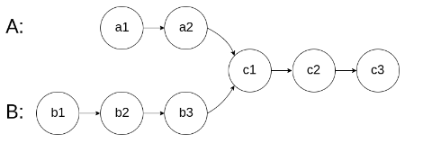

# 算法与数据结构

## 一、数据结构

### 1.1、顺序表

#### 模板：

动态顺序表：

```c++
#define eleType int  //修改int此处即可

struct List{
	eleType *elements;//数组指针
    int size; //元素个数
    int capacity; //容量大小
};

//初始化
void initList(List *L,int capacity){
	L->elements = new eleType[capacity];
    L->size = 0;
    L->capacity = capacity;
}

//释放空间
void destoryList(List *L){
	delete [] L->elements;
}

//返回数组元素个数
int getsizeList(List *L){
    return L->size;
}

//判空
bool isemptyList(List *L){
    return L->size == 0;
}

//插入元素(下标)
void insertList(List *L,int index, eleType value){
    if(index<0 || index > L->size){
        throw invalid_argument("invalid_index");
	}
    if(L->size == L->capacity){
        int new_capacity = L->capacity * 2;
        eleType *new_elements = new eleType[new_capacity];
        for(int i = 0;i<L->size;i++){
            new_elements[i] = L->elements[i];
        }
        delete [] elements;
        L->elements = new_elements;
        L->capacity = new_capacity;
        for(int j = L->size;j>index;j--){
            L->elements[j] = L->elements[j-1];
		}
        L->elements[index] = value;
        L->size++;
	}
}

//按照位序删除元素
eleType deleteList(List *L,int index){
	if(index<0 || index > L->size){
        throw invalid_argument("invalid_index");
	}
    eleType result = L->elements[index-1];
    for(int i = index;i<L->size;i++){
        L->elements[index-1] = L->elements[index];
	}
    L->size--;
    return result;
}

//按照位序获取元素
eleType getList(List *L,int index){
	if(index<0 || index > L->size){
        throw invalid_argument("invalid_index");
	}
    return L->elements[index-1];
}

//输出
void printList(List *L){
	for(int i = 0;i<L->size;i++){
        cout << L->elements[i] << endl;
	}
}
```

### 1.2、链表

#### **模板**：

链表：

```c++
#define eleType int
struct ListNode{
	struct ListNode *next;
	eleType data;
	ListNode(eleType d):next(nullptr),data(d){}
}


class SList{
private:
	ListNode *head;
	int size;
public:
	SList();
	SList():head(nullptr),size(0){} # 列表初始化
	~SList();
	void insert(int index,eleType value);
	void delete(int index);
	ListNode *find(eleType value);
	ListNode *get(int index);
	void update(index,eleType value);
	void print();
};

//构造初始化
void SList::SList(){
	this->size = 0;
	this->head = NULL;
}


```

### 1.3、二叉树

每个节点最多有两颗子树（0，1，2）：左子树，右子树

对于二叉树，以顺序表存储其结点，当结点为空时，索引表为空：


当指导其父结点索引n，其左孩子索引2n,右孩子结点索引2n+1。

#### 模板：

```c++
template<typename T>
struct TreeNode{
	T value; //结点值
	TreeNode *left; //左孩子指针
	TreeNode *right; //右孩子指针
	TreeNode():val(0),left(NULL),rihgt(NULL){}
	TreeNode(T x):val(x),left(NULL),right(NULL){}
};
template<typename T>
class Tree{
private:
	TreeNode<T> *nodes; //结点顺序表
    TreeNode<T> *root; //根结点
    size_t nodeSize; //总共右多少个结点（数组-分布在堆上）
    
    TreeNode<T> * Create(T a[],int size,int nodeid,T nullNode);//创建树
    					//(数组, 数组个数,   nodeid ,nullNode标记)
    void visit(TreeNode<T> *node); //打印结点
    void preorder(TreeNode<T> *node); //前序遍历
    void inorder(TreeNode<T> *node); //中序遍历
    void postorder(TreeNode<T> *node); //后序遍历
    void leverorder(TreeNode<T> *node); //深度遍历
public:
    Tree();
    Tree(int maxnodes);
    ~Tree();
    TreeNode<T> *GetTreeNode(int id); //根据结点
    void createTree(T a[],int size,T nullNode); //传入一个顺序表存入的树生成二叉树
    void preorderTree(); //前序遍历 //外部调用从根结点开始
    void inorderTree(); //中序遍历
    void postorderTree(); //后序遍历
}

//构造函数
template<typename T>
Tree<T>::Tree(){
	nodeSize = 1000;
    nodes = new TreeNode<T>[nodeSize];
}

template<typename T>
Tree<T>::Tree(int maxnodes){
    nodeSize = maxnodes;
	nodes = new TreeNode<T>[nodesSize];
}

//析构
template<typename T>
Tree<T>::~Tree(){
	delete [] nodes;
}

//根据id返回树节点
template<typename T>
TreeNode<T> *GetTreeNode(int nodesid){
	return &nodes[id];
}

//打印结点
template<typename T>
void Tree<T>::visit(TreeNode<T> *node){
	cout << node->val;
}

//前序遍历
template<typename T>
void Tree<T>::preorder(TreeNode<T> *node){
	if(node){
        visit(node); //根
        preorder(node->left); //左
        preorder(node->right); //右
    }
}

//中序遍历
template<typename T>
void Tree<T>::inorder(TreeNode<T> *node){
	if(node){
        inorder(node->left);//左
        visit(node); //根
        inorder(node->right); 右
	}
}

//后序遍历
template<typename T>
void Tree<T>::postorder(TreeNode<T> *node){
	if(node){
        postorder(node->left); //左
        postorder(node->right); //右
        visit(node); //根
    }
}

//用户遍历调用,从根节点开始
template<typename T>
void Tree<T>::preorderTree(){
    preorder(root);
}

template<typename T>
void Tree<T>::inorderTree(){
    inorder(root);
}

template<typename T>
void Tree<T>::postorderTree(){
    postorder(root);
}

//创建根节点
template<typename T>
void Tree<T>::createTree(T a[],int size,T nullNode){
	root = Create(a,size,1,nullNode);
}

//创建树
template<typename T>
TreeNode<T>* Tree<T>::Create(T a[],int size.int nodeid,T nullNode){
	if(nodeid >= size || a[nodeid] = nullNode)
        return NULL; //空树
    TreeNode<T> *nowNode = getTreeNode(nodeid); //获取根结点
    nowNode->val = a[nodeid];
    nowNode->left = Create(a,size,nodeid*2,nullNode);
    nowNode->right = Create(a,size,nodeid*2+1,nullNode);
    return nowNode;
}

int main(){
	const char nullNpde = '-';
    char a[15] = {
        nullNpde,'a','b','c','d',
        nullNpde,'e','f','g','h',
        nullNode,nullNode,nullNode,nullNode,'i'
    };
    Tree<char> T(15);
    T.CreateTree(a,15,nullNpde);
    T.preoderTree();
    T.inorderTree();
    T.postorderTree();
    return 0;
}
```


#### 1.3.1  树的遍历

核心思想：**递归**


##### 1.3.1.1  前序遍历：

根->左->右

(A  B  C)

A (D B E) C

A (0 D F) B E C

A D F B E (0 C G)

A D F B E C (H G 0)

A D F B E C H G

##### 1.3.1.2 中序遍历：

左、根、右

##### 1.3.1.3 后序遍历

左、右、根

#### 1.3.2 二叉搜索树


### 1.4、图

#### 1.4.1 邻接矩阵

对于一个有n个顶点的图，邻接矩阵是一个n*n的方阵，有向图兼容无向图，无向图按主对角线对称。

##### 模板

```C++
#include<iostream>
usina=g namespace std;
#def inf -1 //初始化元素

class Graph{
private:
	int vertices; //顶点个数
    int **edges; //邻接矩阵-二维指针数组
public:
    Graph(int vertices);
    ~Graph();
    void aggEdge(int u,int v,int w);//从u向v添加边，权重为w
    void printGraph();
};

//构造
Graph::Graph(int vertices){
	this->vertices = vertices;
    edges = new int* [vertices];
    for(int i = 0;i<vertices;i++){ //二维矩阵的建立
       edges[i] = new int[vertices];
       for(int j = 0;j<vertices;j++){
			edges[i][j] = inf; //初始化
       } 
	}
}

//析构
Graph::~Graph(){
	for(int i = 0;i<vertices;i++){
		delete [] edges[i];
    }
    delete [] edges;
}

//增加权重边
void Graph::addEdge(int u,int v,int w){
	edges[u][v] = w;
}

//输出
void Graph::printGraph(){
	for(int i = 0;i<vertices;i++){
		for(int j = 0;j<vertices;j++){
			cout << edges[i][j] << " ";
        }
        cout << endl;
    }
}

int main(){
	int vertices = 5;
    Graph graph(vertices);
    Graph.addEdege(0,1,1);
    
    Graph.printGraph();
    
    return 0;
    
}
```

#### 1.4.2 邻接表

对于图中的每个顶点，维护一个由与其相邻的顶点组成的列表。

实现方式:vector,静态数组，链表（稀疏图）

##### 模板：

链表+数组实现

```c++
#include<iostream>

class Graph{
private:
	struct EdgeNode{ //边结点结构体
		int vertex; //弧尾顶点编号
		int weight; //边权
		EdgeNode *next; //下一个边结点
	};
	struct VertexNode{ //顶点结点结构体
		int vertex;//狐头
		EdgeNode *firstEdge; //指向链表头
	};
	int vertices; //结点个数
	VertexNode *nodes; //动态数组存放结点
public:
	Graph(int vertices);
	~Graph();
	void addEdege(int u,int v,int w);//增加权重便
	void printGraph();
};

Graph::Graph(int vertices){
	this->vertices = vertices;
    this->nodes = new VertexNode[vertices]; //顶点结点
    for(int i = 0;i<vertices;i++){
        nodes[i].vertex = 1; //狐头
        nodes[i].firstEdge = NULL; //链表结点为空
	}
}

Graph::~Graph(){
	for(int i = 0;i<vertices;i+=){
        EdgeNode *curr = nodes[i].firstEdge; //指向链表头
        while(curr){
			EdgeNode * temp = curr;
            curr = curr->next;
            delete temp;
        }
	}
    delete [] nodes;
}

Graph::addEdge(int u,int v,int w){
	EdgeNode *newNode = new EdgeNode; //生成边结点
    newNode->vertices = v; //弧尾
    newNode->weight = w;
    newNode->next = nodes[u].firstEdge;
    nodes[u].firstEdge = newNode;
}

void Graph::printGraph(){
	for(int i = 0;i <vertices;i++){
        EdgeNode *curr = nodes[i].firstEdge;
        cout << " Vertices" << i << ":"; //打印
        while(curr){
			cout << curr->vertex << "(" << curr->weight << ")";
            curr = curr->next;
        }
        cout << endl;
	}
}

int main(){
	Graph graph(5);
    graph.addEdge(0，1，4);
    graph.addEdge(0, 2, 2);
    graph.addEdge(1，2, 3);
    graph.addEdge(2, 3, 5);
    graph.addEdge(3, 4, 2);
	graph.printGraph();
	return 0;
}
```


### 1.5、哈希表（散列表）

**哈希函数：**

* 根据数组的大小求模运算
	* （关键字）%（数组大小：一般设为质数）

**冲突的解决方式：**

* 链表解决：二级指针，每一个二级指针相当于存放了一堆一级指针（类似数组）
* 开放地址：
	* 线性探测法：寻找空位，新位置 = 原始位置+i （i是查找次数）
	* 平法探测法：新位置 = 原始位置+i^2（i是查找次数）
	* 双哈希：
		* 新位置 = 原始位置+i*hash2（关键字）
		* hash = 关键字 mod 13（13为数组大小）
		* hash2 = 7-（关键字 mod 7）

**哈希表满了：**

* 哈希表数据的存储超过70%，就可以新建一个新的哈希表
* 新表的尺寸是旧表的2倍以上，选择一个质数
* 把之前的数据再次通过哈希表搬进去
* 表越满，性能越差，冲突越大。

#### hash模板(链表)：

```c++
#include<iostream>
using namespace std;

template<typename KeyType, typename ValueType>  //键和值都是任意类型
class HashNode { //哈希结点
public:
    KeyType key; //键
    ValueType value; //值
    HashNode * next;
public:
    HashNode(const KeyType& key, const ValueType& value) {
        this->key = key;
        this->value = value;
        this->next = NULL;
    }
};

template<typename KeyType,typename ValueType>
class HashTable {
private:
    int size; //哈希表大小
    HashNode<KeyType, ValueType>** table; //二级指针

    int hash(const KeyType& key) const {
        int hashkey = key % size;  //哈希函数
        if (hashkey < 0) {
            hashkey += size; //哈希值不能小于0，要不然加上size偏移。
        }
        return hashkey;
    }
public:
    HashTable(int size = 256);
    ~HashTable();
    void insert(const KeyType& key, const ValueType& value);
    void remove(const KeyType& Key);
    bool find(const KeyType& key, ValueType& value) const;
};

template<typename KeyType,typename ValueType>
HashTable<KeyType, ValueType>::HashTable(int size) {
    this->size = size;
    this->table = new HashNode<KeyType, ValueType>* [size];  //指针数组，存放了size个一级指针
    for (int i = 0; i < size; i++) {
        this->table[i] = NULL;
    }
}

template<typename KeyType,typename ValueType>
HashTable<KeyType, ValueType>::~HashTable() {
    for (int i = 0; i < size; i++) {
        if (table[i]) { //链表非空
            HashNode<KeyType, ValueType>* current = table[i];// 链表非空，将其头节点给一个临时变量
            while (current) {
                HashNode<KeyType, ValueType>* next = current->next; //遍历一级链表
                delete current;
                current = next;
            }
            table[i] = nullptr;
        }
    }
    delete table;
    table = NULL;
}

template<typename KeyType,typename ValueType>
void HashTable<KeyType, ValueType>::insert(const KeyType &key,const ValueType &value) {
    int index = hash(key);  //获取键值
    HashNode<KeyType, ValueType>* now = new HashNode<KeyType, ValueType>(key, value); //申请一个hash结点
    if (table[index] == NULL) { //table[index]是每个一级链表的头结点
        table[index] = now;  //如果hash表上的该键链表上没有值（这里index 指向链表的头节点）,将新的hash结点赋给头节点
    }
    else {  //有值的话便进行头插法，保证复杂度为O（1）
        now->next = table[index];
        table[index] = now;
    }
}

template<typename KeyType,typename ValueType>
void HashTable<KeyType, ValueType>::remove(const KeyType &key) {
    int index = hash[key];
    if (table[index]) {  //当索引链表存在
        if (table[index]->key == key) { //要删除的键是否和链表头的键相等
            HashNode<KeyType, ValueType>* next = table[index]->next;  //相等的话删除链表头
            delete table[index];
            table[index] = next;
        }
        else { //要删除的键是不是链表头-->开始遍历
            HashNode<KeyType, ValueType>* current = table[index];
            while (current->next &&current->next->key != key) { 
                current = current->next;
            }
            if (current->next) {
                HashNode<KeyType, ValueType>* next = current->next->next;
                delete current->next;
                current->next = next;
            }
        }
    }
}

template<typename KeyType, typename ValueType>
bool HashTable<KeyType, ValueType>::find(const KeyType& key, ValueType& value)const {
    int index = hash(key);
    if (table[index]) {
        if (table[index]->key == key) { //键是否为链表头
            value = table[index]->value;
            return true;
            cout << " 存在 " << value << endl;
        }
        else {
            HashNode<KeyType, ValueType>* current = table[index];
            while (current->next && current->next->key != key) { 
                current = current->next;
            }
            if (current->next) { //当current不为空，传参的键一定和键值相等
                value = current->next->value;
                return true;
                cout << "存在" << value << endl;
            }
        }
        return false;//不存在直接false
        cout << "不存在" << value << endl;
    }
}

int main() {
    HashTable<int, char> h(1000);
    h.insert(1, 'a');
    h.insert(2, 'b');
    h.insert(3, 'c');
    h.insert(4, 'd');
    h.insert(41245646,'e');

    char val;
    if (!h.find(43, val)) {
        cout << "没有43" << endl;
    }
    if (h.find(41245646, val)) {
        cout << "41245646 is" << val << endl;  //41245646 is e
    }
    return 0;
}
```


## 二、算法

### 1、二分查找

#### 模板:

左闭右闭:

核心思想：保持闭合的一致性

```c++;
int left = 0 //左闭
int right = nums.size()-1; //右闭
int middle = 0;
while(left<=right){   //闭合
	middle = (left+right)/2;
	if(nums[middle] > target ){
		right = middle-1;  //闭合
	}
	 else if(nums[middle] < target){
		left = middle+1; //闭区间不包含middle
	}else return middle;
}
return left; //这里注意left与middle之间的关系，不同的题不同
```

#### 例题：

1. **搜索插入位置**

​		给定一个排序数组和一个目标值，在数组中找到目标值，并返回其索引。
​		如果目标值不存在于数组中，返回它将会被按顺序插入的位置。
​		请必须使用时间复杂度为 O(logn) 的算法。

```c++
class Solution {
public:
    int searchInsert(vector<int>& nums, int target) {
        int left = 0;
        int right = nums.size()-1; //左闭右闭
        int middle = 0;
        while (left <= right) {   
            middle = (left + right)/2;
            if (nums[middle] == target) {
                return middle;
            }
            if (nums[middle] < target) {
                left = middle+1;
            }
            if (nums[middle] > target) {
                right = middle-1;
            }
        } 
        return left; //左指针的位置=middle
    }
};
```

**2. x的平方根**

​		给你一个非负整数 x ，计算并返回 x 的 算术平方根 。
​		由于返回类型是整数，结果只保留 整数部分 ，小数部分将被 舍去 。
​		注意：不允许使用任何内置指数函数和算符，例如 pow(x, 0.5) 或者 x ** 0.5 。

```c++
class Solution {
public:
    int mySqrt(int x) {
        int left = 0;
        int right = x;
        int middle = 0;
        while (left <= right) {
            middle = (left + right) / 2;
            if (middle * middle > x) {
                right =middle  - 1;
            }
            else if (middle * middle < x) {
                left =middle  + 1;
            }
            else return middle;
        }
        return left-1;  //当left>right循环裂开 
    }
};
```

**3.统计和小于目标的下表对数目**

​		给你一个下标从 **0** 开始长度为 `n` 的整数数组 `nums` 和一个整数 `target` 

​		请你返回满足 `0 <= i < j < n` 且 `nums[i] + nums[j] < target` 的下标对 `(i, j)` 的数目。

> ​    输入：nums = [-6,2,5,-2,-7,-1,3], target = -2
> ​    输出：10
> ​    解释：总共有 10 个下标对满足题目描述：
>
> * (0, 1) ，0 < 1 且 nums[0] + nums[1] = -4 < target
> * (0, 3) ，0 < 3 且 nums[0] + nums[3] = -8 < target
> * (0, 4) ，0 < 4 且 nums[0] + nums[4] = -13 < target
> * (0, 5) ，0 < 5 且 nums[0] + nums[5] = -7 < target
> * (0, 6) ，0 < 6 且 nums[0] + nums[6] = -3 < target
> * (1, 4) ，1 < 4 且 nums[1] + nums[4] = -5 < target
> * (3, 4) ，3 < 4 且 nums[3] + nums[4] = -9 < target
> * (3, 5) ，3 < 5 且 nums[3] + nums[5] = -3 < target
> * (4, 5) ，4 < 5 且 nums[4] + nums[5] = -8 < target
> * (4, 6) ，4 < 6 且 nums[4] + nums[6] = -4 < target


**暴力解法：**

```c++
class Solution {
public:
    int countPairs(vector<int>& nums, int target) {
        int count = 0;
        for(int i = 0;i<nums.size();i++) {
            for (int j = 1; j < nums.size(); j++) {
                if (i<j && nums[i] + nums[j] < target) {
                    count++;
                }
                else break;
            }
        }
        return count;
    }
};
```

**双指针：**

```c++
class Solution {
public:
    int countPairs(vector<int>& nums, int target) {
        sort(nums.begin(),nums.end());
        int left = 0;
        int right = nums.size()-1;
        int count = 0;
        while (left < right) {
            if (nums[left] + nums[right]<target) {
                count = count + right - left;  //计数
                left++;
            }
            else right--;
        }
        return count;
    }
};
```


### 2、滑动窗口

#### 模板：

思想：

​	滑动窗使用思路(寻找最长)
​	--核心:左右双指针(L，R)在起始点，R向右逐位滑动循环
​	--每次滑动过程中
​	如果 : 窗内元索满足条件，R向右扩大窗口，并更新最优结果如果:窗内元素不满足条件，L向右缩小窗口
​	--R到达结尾

​	滑动窗使用思路(寻找最短)
​	核心 : 左右双指针(L，R)在起始点，R向右逐位滑动循环
​	-- 每次滑动过程中
​	如果 : 窗内元素满足条件，L向右缩小窗口，并更新最优结果
​	如果 : 窗内元素不满足条件，R向右扩大窗口
​	--R到达结尾

```
//代码
int left, right, result, bestresult; //左指针，右指针，当前结果，最优结果
//最长
while (右指针没有结尾) {
	//窗口扩大 右指针移动,更新result
	right++;
	result++;
	while (result 不满足条件) {
		//左指针向右移动
		left++;
	}
	//更新最优结果bestresult;
	right++;
}
//返回bestresult;

//最短
while (右指针没有结尾) {
	//窗口扩大 加入right对应元素,更新result
	result++;
	while (result 满足条件) {
		//更新bestresult
		// 窗口缩小 移除left对应元素，左指针向右移动，
		move[left];
		left++;
	}
	//更新最优结果bestresult;
	right++;
}
//返回bestresult;
```

#### 例题：

### 3、贪心

根据局部最优找到全局最优


### 4、树

#### 4.1例题

 **1. 完全二叉树的结点个数**

```
class Solution {
public:
    int countNodes(TreeNode* root) {
        if(root == NULL){
        return 0；
        }	
        int left = 	countNodes(root->left);
        int right = countNodes(root->right);
        return left+right+1;  //二叉树的结点个数=左子树节点数+右子树节点数+1(根节点)
        }
    }
};
```

### 5、数组

**1.找出数组排序后的目标下标**

​	给你一个下标从 **0** 开始的整数数组 `nums` 以及一个目标元素 `target` 。

​	目标下标是一个满足 `nums[i] == target` 的下标 `i` 。

​	将 `nums` 按 **非递减** 顺序排序后，返回由 `nums` 中目标下标组成的列表。如果不存在目标下标，返回一个 **空** 列	表。返回的列表必须按 **递增** 顺序排列。

> ```
> 输入：nums = [1,2,5,2,3], target = 2
> 输出：[1,2]
> 解释：排序后，nums 变为 [1,2,2,3,5] 。
> 满足 nums[i] == 2 的下标是 1 和 2 。
> ```

```
class Solution {
public:
    vector<int> targetIndices(vector<int>& nums, int target) {
        sort(nums.begin(),nums.end());
        vector<int> v;
        for(int i = 0;i<nums.size();i++){
            if(nums[i] == target)
                v.push_back(i);
        }
        return v;
    }
};
```

### 6、链表

**203.移除链表元素**

题意：删除链表中等于给定值 val 的所有节点。

> 示例 1： 输入：head = [1,2,6,3,4,5,6], val = 6 输出：[1,2,3,4,5]
>
> 示例 2： 输入：head = [], val = 1 输出：[]
>
> 示例 3： 输入：head = [7,7,7,7], val = 7 输出：[]

```
class Solution {
public:
    ListNode* removeElements(ListNode* head, int val) {
		while(head != NULL&&head->val == val){
			ListNode *temp = head;
			head = head->next;
			delete temp;
		}
		ListNode *p = head;
		while(p!=NULL && p->next!= NULL){
			if(p->next->val == val){
				ListNode *tem = p->next;
				p->next = p->next->next;
				delete tem;
			}else{
			p = p->next;
			}	
		}
		return head;
		}
};
```

**707、设计构造链表**

```c++
class MyLinkedList {
private:
    struct ListNode {
        struct ListNode* next;
        eleType data;
        ListNode(eleType d) :data(d), next(NULL) {}
    };
    ListNode* head;
    int size;
public:
	//构造函数
    MyLinkedList() {
        this->head = new ListNode(0);
        this->size = 0;
    }
	//根据位置获取元素
    int get(int index) {
        if (index <0 || index>size-1) {
            return -1;
        }
        ListNode* p = head;
        for(int i = 1;i<=index;i++){
            p = p->next;
        }
        return p->data;
    }
	//头插
    void addAtHead(int val) {
        ListNode* newnode = new ListNode(val);
        newnode->next = head;
        head = newnode;
        size++;
    }
	//尾插
    void addAtTail(int val) {
        ListNode* node = new ListNode(val);
        ListNode* p = head;
        while (p->next!=NULL) {
            p = p->next;
        }
        p->next = node;
        size++;
    }
	//在下标位置插如元素
    void addAtIndex(int index, int val) {
        if (index<0 || index>size) {
            throw invalid_argument("invalid_index");
        }
        if (index == size) {
            addAtTail(val);
        }
        ListNode* p = head;
        ListNode* newnode = new ListNode(val);
        for (int i = 0; i < index-1; i++) {
            p = p->next;
        }
        newnode->next = p->next;
        p->next = newnode;
        size++;
    }
	//删除下标位置的元素
    void deleteAtIndex(int index) {
        if (index<0 || index>size) {
            throw invalid_argument("invalid_index");
        }
        if (index == 0){
            ListNode* temp = head;
            head = head->next;
            delete temp;
        }
        else {
            ListNode* p = head;
            for (int i = 0; i < index-1; i++) {
                p = p->next;
            }
            p->next = p->next->next;
            delete p->next;
        }
    }
	//输出链表
    void printlinklit() {
        ListNode* p = head;
        for(int i = 0;i<size;i++) {
            cout << p->data << " ";
            p = p->next; 
        }
        cout << endl;
    }
};
```

**206、反转链表**

给你单链表的头节点 `head` ，请你反转链表，并返回反转后的链表。

**双指针法：**

```c++
/**
 * Definition for singly-linked list.
 * struct ListNode {
 *     int val;
 *     ListNode *next;
 *     ListNode() : val(0), next(nullptr) {}
 *     ListNode(int x) : val(x), next(nullptr) {}
 *     ListNode(int x, ListNode *next) : val(x), next(next) {}
 * };
 */
//核心思想：对结点的bao'c
class Solution {
public:
    ListNode* reverseList(ListNode* head) {
		ListNode *first = head;
        ListNode *second = NULL;
		ListNode *third;//存储结点
        while(first){
			third = first->next;  //保存下一个结点
            first->next = second; //反转
           	second = first;
            first = third;
        }
        return first;
    }
};
```

**24、两两交换链表中的节点**

给你一个链表，两两交换其中相邻的节点，并返回交换后链表的头节点。你必须在不修改节点内部的值的情况下完成本题（即，只能进行节点交换）

> ```C++
> 输入：head = [1,2,3,4]
> 输出：[2,1,4,3]
> ```

```c++
class Solution {
public:
    ListNode* swapPairs(ListNode* head) {
		ListNode *p = head;
		while(p!=NULL && p->next!=NULL){
            ListNode *temp = p; //头节点
			//结点交换
            ListNode *temp1 = p->next; //头节点的下一个		
            p = temp1;
            p->next = temp;
			//更新结点
			p = p->next;
		}
		return p;
    }
};
```

**19、删除链表的第n个结点**

给你一个链表，删除链表的倒数第 `n` 个结点，并且返回链表的头结点。

暴力：

```c++
/**
 * Definition for singly-linked list.
 * struct ListNode {
 *     int val;
 *     ListNode *next;
 *     ListNode() : val(0), next(nullptr) {}
 *     ListNode(int x) : val(x), next(nullptr) {}
 *     ListNode(int x, ListNode *next) : val(x), next(next) {}
 * };
 */
class Solution {
public:
    ListNode* removeNthFromEnd(ListNode* head, int n) {
		ListNode *p = head;
		int count = 0;
		while(p){
            count++;
            p = p->next;
		}
        if(count == n){  //处理头节点
			ListNode *pp = head;
            head = head->next;
            delete pp;
        }else{
        ListNode *temp = head;
		for(int i = 1;i<count-n;i++){ //当这里从1开始，count = n时便会报错
            temp = temp->next;            
        }
        ListNode *pre = temp->next;
        temp->next = temp->next->next;
        delete pre;
        }
        return head;
    }
};
```

双指针法：

```c++
class Solution {
public:
    //快指针 = 满指针+n+1，这是快指针刚好为空时，满指针指向要删除结点的限一个结点
    ListNode* removeNthFromEnd(ListNode* head, int n) {
		ListNode *slow = head;
        ListNode *fast = head;
        int i = 1;
        while(fast!=NULL&&i<n){
            fast = fast->next;
        }
        if(fast == NULL){
            ListNode *p = head;
            head = head->next;
            delete head;
        }
        else{
        while(fast){
            fast = fast->next;
            slow = slow->next;
        }
        ListNode *pre = slow->next;
        slow->next = slow->next->next;
        delete pre;
        return head;
    }
};
```

**160、相交链表**

给你两个单链表的头节点 `headA` 和 `headB` ，请你找出并返回两个单链表相交的起始节点。如果两个链表不存在相交节点，返回 `null` 



```C++
/*** Definition for singly-linked list.
 * struct ListNode {
 *     int val;
 *     ListNode *next;
 *     ListNode(int x) : val(x), next(NULL) {}
 * };*/
class Solution {
public:
    ListNode *getIntersectionNode(ListNode *headA, ListNode *headB) {
 		ListNode *pre = headA;
        ListNode *pre1 = headB;
        ListNode *p; //存放数据
        int A_count = 0;
        int B_count = 0;
        while(pre){
            A_count++; //统计A链表
            pre = pre->next;
        }
        while(pre1){ //统计B链表
            B_count++;
            pre1 = pre1->next;
        }
        if(A_count >= B_count){ //比较长度
           	ListNode *pre3 = headA;
            int gap = A_count - B_count;
            int i = 1;
            while(pre3!= NULL&&i<gap){
               pre3 = pre3->next;
            }
            ListNode *pre4 = headB;
            for(int i = 0;i<B_count;i++){
                if(pre3!= NULL&&pre3 != pre4)
				    pre3 = pre3->next;
                	pre4 = pre4->next;
                if(pre3 == pre4)
                   	p = pre3;
                    break;
            }
        }
        if(A_count < B_count){ //比较长度
           	ListNode *pre5 = headB;
            int gap = B_count - A_count;
            int i = 1;
            while(pre5!= NULL&&i<gap){
               pre5 = pre5->next;
            }
            ListNode *pre6 = headA;
            for(int i = 0;i<A_count;i++){
                if(pre5!= NULL&&pre5 != pre6)
				    pre5 = pre5->next;
                	pre6 = pre6->next;
                if(pre5 == pre6)
                   	p = pre5;
                    break;
            }
        }
       return p;
       delete pre;
       delete pre1;
    }
};
```

**142、环形链表**

给定一个链表的头节点  `head` ，返回链表开始入环的第一个节点。 *如果链表无环，则返回 `null`。*


```C++
/**
 * Definition for singly-linked list.
 * struct ListNode {
 *     int val;
 *     ListNode *next;
 *     ListNode(int x) : val(x), next(NULL) {}
 * };
 */
//核心思想:双指针，快指针比满指针多走一步，两个指针如果会相遇，那么就是环形链表。
//而从相遇的点和头节点分别再发出一个指针开始遍历，则相遇的点为环形入口
class Solution {
public:
    ListNode *getCycle(ListNode *head){ //获取第一次相遇时的指针
	    ListNode *first = head; //快指针
        ListNode *second = head; //满指针
        while(first!=NULL&&first->next!=NULL){
			first = first->next->next;
            second = second->next;
            if(first == second){
                break;
            }
        }
        return first;
        delete first;
        delete second;
    }
    ListNode *detectCycle(ListNode *head) { //通过第二次相遇
        ListNode *temp = head;
		ListNode *p = getCycle(temp);
        ListNode *pre = head;
        ListNode *result;
        if(pre == NULL||pre->next == NULL)
            return NULL;     
        while(p){
            if(p == pre){
                result = p;
            	break; 
            }
            if(p!=pre){
			p = p->next;
            pre = pre->next;
            }
        }
        return result;
        delete temp;
        delete p;
        delete pre;
        delete result;
    }
};
```

### 7、哈希表

**242、有效的字母异位词**

给定两个字符串 `*s*` 和 `*t*` ，编写一个函数来判断 `*t*` 是否是 `*s*` 的字母异位词。

**注意：**若 `*s*` 和 `*t*` 中每个字符出现的次数都相同，则称 `*s*` 和 `*t*` 互为字母异位词。

```c++
class Solution {
public:
    bool isAnagram(string s, string t) {
         int num_table[26] = {0}; //26个字母
         for(int i = 0;i<s.size();i++){
         	num_table[s[i]-'a']++;  //太厉害啦，让每个字母-a，就可以从0开始填充数组
		}
		for(int j = 0;j<t.size();j++){
			num_table[t[j]-'a']--; //太厉害啦，直接让hash数组开始减小，作为最终的比较
		}
		for(int k = 0;k<26;k++){
			if(num_table[k]!=0){  //当hash中没有0时，两个字符串互为字母异位词。
				return false;
			}
		}
		return true;
    }
};
```

**349、两个数组的交集**

给定两个数组 `nums1` 和 `nums2` ，返回 *它们的 交集* 。输出结果中的每个元素一定是 **唯一** 的。我们可以 **不考虑输出结果的顺序** 。

> ```
> 输入：nums1 = [4,9,5], nums2 = [9,4,9,8,4]
> 输出：[9,4]
> 解释：[4,9] 也是可通过的
> ```

```c++
class Solution {
public:
    vector<int> intersection(vector<int>& nums1, vector<int>& nums2) {
    	set<int> s;
		for(int i = 0;i<nums1.size();i++){
			for(int j= 0;j<nums2.size();j++){
				if(nums1[i] == nums2[j]){
					s.insert(nums1[i]);
				}
			}
		}
		vector<int> v;
		for(set<int>::iterator it = s.begin();it != s.end();it++){
			v.push_back(*it);
		}
		return v;
    }
};
```

**采用unorderd_set:**

```c++
class Solution {
public:
    vector<int> intersection(vector<int>& nums1, vector<int>& nums2) {
        unordered_set<int> result_set; // 存放结果，之所以用set是为了给结果集去重
        unordered_set<int> nums_set(nums1.begin(), nums1.end());
        for (int num : nums2) {
            // 发现nums2的元素 在nums_set里又出现过
            if (nums_set.find(num) != nums_set.end()) {
                result_set.insert(num);
            }
        }
        return vector<int>(result_set.begin(), result_set.end());
    }
};
```

**202、快乐数**

> **「快乐数」** 定义为：
>
> * 对于一个正整数，每一次将该数替换为它每个位置上的数字的平方和。
> * 然后重复这个过程直到这个数变为 1，也可能是 **无限循环** 但始终变不到 1。
> * 如果这个过程 **结果为** 1，那么这个数就是快乐数。
>
> 如果 `n` 是 *快乐数* 就返回 `true` ；不是，则返回 `false` 。
>
> ```
> 输入：n = 19
> 输出：true
> 解释：
> 1^2 + 9^2 = 82
> 8^2 + 2^2 = 68
> 6^2 + 8^2 = 100
> 1^2 + 0^2 + 0^2 = 1
> ```

```c++
//此题的核心问题是判断无限循环的边界-->当已经出现中的结果再出现时，就是快乐数
class Solution {
public:
    vector<int> nums(int n){
	    vector<int> v;
		int x = n%10; //个位数
        v.push_back(x);
        n = (int)(n/10); //十位数
        while(n){
            v.push_back(n);
            n = (int)(n/10);
        }
        return v;
    }
    bool isHappy(int n) {
		vector<int> vm(nums(n).begin(),nums(n).end());
        int sum = 0;
        set<int> s;
        while(sum != 1){
        	for(int i = 0;i<vm.size();i++){
            	sum = sum + vm[i]*vm[i];
        	}
            vm = nums(sum);
        	s.insert(sum);
            if(s.find(sum) != s.end())
                return false;
        }
        if(sum == 1)
            return true;
};
```

**1、两数之和**

给定一个整数数组 `nums` 和一个整数目标值 `target`，请你在该数组中找出 **和为目标值** *`target`* 的那 **两个** 整数，并返回它们的数组下标。你可以假设每种输入只会对应一个答案。但是，数组中同一个元素在答案里不能重复出现。你可以按任意顺序返回答案。

**暴力：**

```c++
class Solution {
public:
    vector<int> twoSum(vector<int>& nums, int target) {
        vector<int> v(2);
        for(int i = 0;i<nums.size()-1;i++){
            for(int j = i+1;j<nums.size();j++){
				if(nums[i]+nums[j] == target){
					v[0] = i;
                    v[1] = j;
                }
            }
        }
        return v;
    }
};
```

