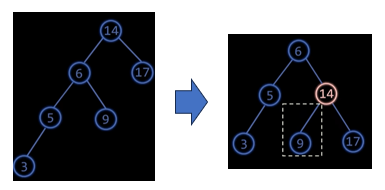
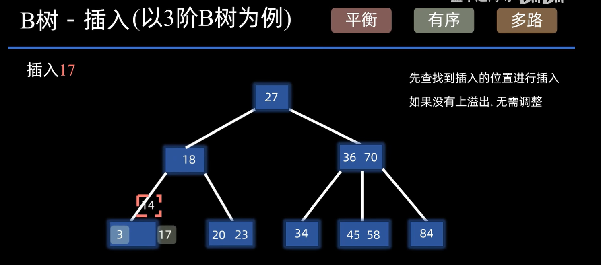
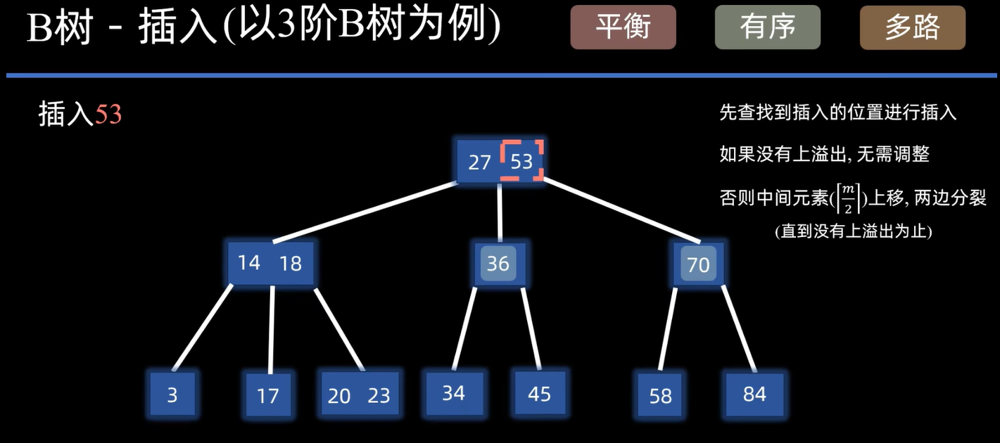
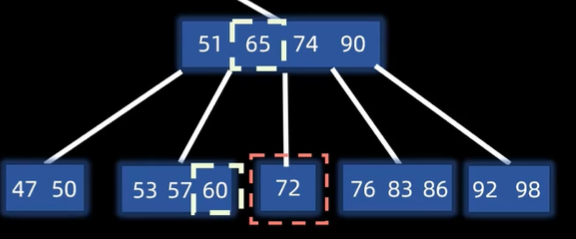
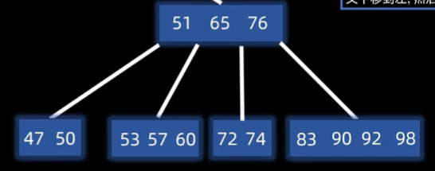
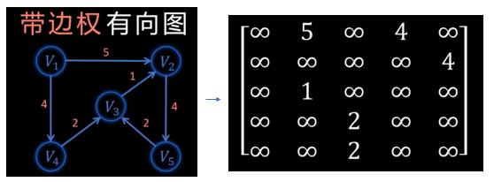
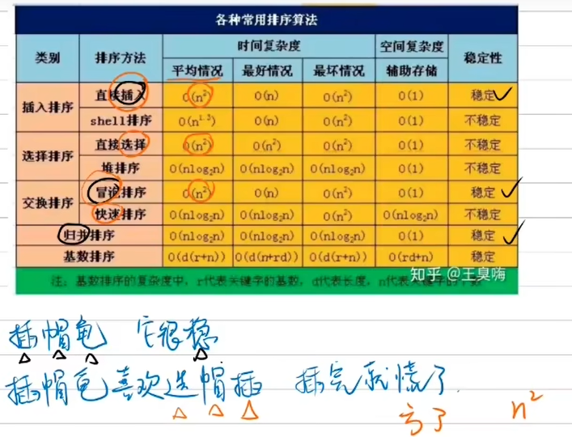

# 算法与数据结构

## 一、数据结构

### 1.1 顺序表

#### 模板：

动态顺序表：

```c++
#define eleType int  //修改int此处即可

struct List{
	eleType *elements;//数组指针
    int size; //元素个数
    int capacity; //容量大小
};

//初始化
void initList(List *L,int capacity){
	L->elements = new eleType[capacity];
    L->size = 0;
    L->capacity = capacity;
}

//释放空间
void destoryList(List *L){
	delete [] L->elements;
}

//返回数组元素个数
int getsizeList(List *L){
    return L->size;
}

//判空
bool isemptyList(List *L){
    return L->size == 0;
}

//插入元素(下标)
void insertList(List *L,int index, eleType value){
    if(index<0 || index > L->size){
        throw invalid_argument("invalid_index");
	}
    if(L->size == L->capacity){
        int new_capacity = L->capacity * 2;
        eleType *new_elements = new eleType[new_capacity];
        for(int i = 0;i<L->size;i++){
            new_elements[i] = L->elements[i];
        }
        delete [] elements;
        L->elements = new_elements;
        L->capacity = new_capacity;
        for(int j = L->size;j>index;j--){
            L->elements[j] = L->elements[j-1];
		}
        L->elements[index] = value;
        L->size++;
	}
}

//按照位序删除元素
eleType deleteList(List *L,int index){
	if(index<0 || index > L->size){
        throw invalid_argument("invalid_index");
	}
    eleType result = L->elements[index-1];
    for(int i = index;i<L->size;i++){
        L->elements[index-1] = L->elements[index];
	}
    L->size--;
    return result;
}

//按照位序获取元素
eleType getList(List *L,int index){
	if(index<0 || index > L->size){
        throw invalid_argument("invalid_index");
	}
    return L->elements[index-1];
}

//输出
void printList(List *L){
	for(int i = 0;i<L->size;i++){
        cout << L->elements[i] << endl;
	}
}
```

### 1.2 链表

#### **模板**：

链表：

```c++
#define eleType int
struct ListNode{
	struct ListNode *next;
	eleType data;
	ListNode(eleType d):next(nullptr),data(d){}
}


class SList{
private:
	ListNode *head;
	int size;
public:
	SList();
	SList():head(nullptr),size(0){} # 列表初始化
	~SList();
	void insert(int index,eleType value);
	void delete(int index);
	ListNode *find(eleType value);
	ListNode *get(int index);
	void update(index,eleType value);
	void print();
};

//构造初始化
void SList::SList(){
	this->size = 0;
	this->head = NULL;
}
```

### 1.3树

每个节点最多有两颗子树（0，1，2）：左子树，右子树

对于二叉树，以顺序表存储其结点，当结点为空时，索引表为空：


当指导其父结点索引n，其左孩子索引2n,右孩子结点索引2n+1。

#### 模板：

```c++
template<typename T>
struct TreeNode{
	T value; //结点值
	TreeNode *left; //左孩子指针
	TreeNode *right; //右孩子指针
	TreeNode():val(0),left(NULL),rihgt(NULL){}
	TreeNode(T x):val(x),left(NULL),right(NULL){}
};
template<typename T>
class Tree{
private:
	TreeNode<T> *nodes; //结点顺序表
    TreeNode<T> *root; //根结点
    size_t nodeSize; //总共右多少个结点（数组-分布在堆上）
    
    TreeNode<T> * Create(T a[],int size,int nodeid,T nullNode);//创建树
    					//(数组, 数组个数,   nodeid ,nullNode标记)
    void visit(TreeNode<T> *node); //打印结点
    void preorder(TreeNode<T> *node); //前序遍历
    void inorder(TreeNode<T> *node); //中序遍历
    void postorder(TreeNode<T> *node); //后序遍历
    void leverorder(TreeNode<T> *node); //深度遍历
public:
    Tree();
    Tree(int maxnodes);
    ~Tree();
    TreeNode<T> *GetTreeNode(int id); //根据结点
    void createTree(T a[],int size,T nullNode); //传入一个顺序表存入的树生成二叉树
    void preorderTree(); //前序遍历 //外部调用从根结点开始
    void inorderTree(); //中序遍历
    void postorderTree(); //后序遍历
}

//构造函数
template<typename T>
Tree<T>::Tree(){
	nodeSize = 1000;
    nodes = new TreeNode<T>[nodeSize];
}

template<typename T>
Tree<T>::Tree(int maxnodes){
    nodeSize = maxnodes;
	nodes = new TreeNode<T>[nodesSize];
}

//析构
template<typename T>
Tree<T>::~Tree(){
	delete [] nodes;
}

//根据id返回树节点
template<typename T>
TreeNode<T> *GetTreeNode(int nodesid){
	return &nodes[id];
}

//打印结点
template<typename T>
void Tree<T>::visit(TreeNode<T> *node){
	cout << node->val;
}

//前序遍历
template<typename T>
void Tree<T>::preorder(TreeNode<T> *node){
	if(node){
        visit(node); //根
        preorder(node->left); //左
        preorder(node->right); //右
    }
}

//中序遍历
template<typename T>
void Tree<T>::inorder(TreeNode<T> *node){
	if(node){
        inorder(node->left);//左
        visit(node); //根
        inorder(node->right); 右
	}
}

//后序遍历
template<typename T>
void Tree<T>::postorder(TreeNode<T> *node){
	if(node){
        postorder(node->left); //左
        postorder(node->right); //右
        visit(node); //根
    }
}

//用户遍历调用,从根节点开始
template<typename T>
void Tree<T>::preorderTree(){
    preorder(root);
}

template<typename T>
void Tree<T>::inorderTree(){
    inorder(root);
}

template<typename T>
void Tree<T>::postorderTree(){
    postorder(root);
}

//创建根节点
template<typename T>
void Tree<T>::createTree(T a[],int size,T nullNode){
	root = Create(a,size,1,nullNode);
}

//创建树
template<typename T>
TreeNode<T>* Tree<T>::Create(T a[],int size.int nodeid,T nullNode){
	if(nodeid >= size || a[nodeid] = nullNode)
        return NULL; //空树
    TreeNode<T> *nowNode = getTreeNode(nodeid); //获取根结点
    nowNode->val = a[nodeid];
    nowNode->left = Create(a,size,nodeid*2,nullNode);
    nowNode->right = Create(a,size,nodeid*2+1,nullNode);
    return nowNode;
}

int main(){
	const char nullNpde = '-';
    char a[15] = {
        nullNpde,'a','b','c','d',
        nullNpde,'e','f','g','h',
        nullNode,nullNode,nullNode,nullNode,'i'
    };
    Tree<char> T(15);
    T.CreateTree(a,15,nullNpde);
    T.preoderTree();
    T.inorderTree();
    T.postorderTree();
    return 0;
}
```


#### 1.3.1  树的遍历

核心思想：**递归**


##### 1.3.1.1  前序遍历：

根->左->右

(A  B  C)

A (D B E) C

A (0 D F) B E C

A D F B E (0 C G)

A D F B E C (H G 0)

A D F B E C H G

##### 1.3.1.2 中序遍历：

左、根、右

##### 1.3.1.3 后序遍历

左、右、根

#### 1.3.2 二叉搜索树

二叉搜索树是一种节点值满足特定排序的二叉树，具体定义如下：

* 每个节点都有一个值。
* 若它的左子树不为空，则左子树上所有节点的值都小于根节点的值。
* 若它的右子树不为空，则右子树上所有节点的值都大于根节点的值。
* 它的左、右子树也分别为二叉搜索树。

**操作：**

1. **查找操作**：从根节点开始，根据待查找值与节点值的比较结果，决定是继续在左子树查找、右子树查找还是查找成功。
2. **插入操作**：为了将新节点插入到树中，可以从根节点开始，根据新节点值与当前节点值的比较结果，决定是插入到左子树还是右子树。如果当前节点为空，则新节点成为新的叶子节点。
3. **删除操作**：
	* 删除节点如果A只有一个子节点，直接将A的子节点连接至A的父节点
	* 如果A有两个子节点，就以右子树内最小节点（右子节点开始一直往左走到底部）取代A。


**性质**：

二叉搜索树具有以下几个重要性质：

1. **有序性**：二叉搜索树中序遍历的结果是按照节点值的大小顺序排列的，即遍历结果是一个递增序列。
2. **查找效率**：在平衡的情况下，对于含有n个节点的二叉搜索树，查找、插入和删除操作的时间复杂度均为O(log n)。这使得它在大规模数据处理中具有明显的优势。
3. **广泛应用**：二叉搜索树在各种算法和程序设计中都有广泛的应用，如数据库索引、编译器符号表等。同时，它也是其他高级数据结构（如平衡二叉树AVL树、红黑树）的基础。


#### 1.3.3 平衡二叉搜索树

树形平衡没有绝对的标准，但不能有一个节点过深。但是当有序的数组构建树时，会破坏平衡性，查找效率会退化为O(n)：


平衡二叉树和二叉搜索树的插入、查找、删除是一样的，只不过会检查是否失衡，会根据旋转来平衡：


#### 1.3.4 AVL树

**定义**：AVL树（Adelson-Velsky and Landis Tree）是一种自平衡的二叉查找树（Binary Search Tree，BST），它能够在插入和删除节点时自动调整树的结构，以保持树的平衡性。

**特点**：AVL树通过维护每个节点的平衡因子（左子树高度减去右子树高度的差值）来实现平衡。平衡因子的取值范围是-1、0和1。当平衡因子的绝对值超过1时，AVL树就需要进行旋转操作来重新平衡，以保证整棵树的深度为O(logN)。

**失衡情况：**当AVL平衡二叉树失衡了需要进行自旋：

* **左旋：**逆时针


当发生冲突时，冲突的左孩变右孩


* **右旋：**顺时针


当发生冲突时，冲突的右孩变左孩




#### **1.3.5 红黑树**

红黑树满足以下五条性质：

1. **节点颜色**：每个节点要么是红色，要么是黑色。
2. **根节点颜色**：根节点是黑色。
3. **叶子节点**：每个叶子节点（NIL节点，空节点）是黑色。
4. **红色节点**：如果一个节点是红色的，则它的两个子节点都是黑色的（即不存在两个连续的红色节点）。
5. **黑色节点路径**：从任一节点到其每个叶子的所有路径都包含相同数目的黑色节点。


**AVL树与红黑树的区别：**


**红黑树的插入：**


**红黑树的删除：**和二叉搜索树是一样的


**红黑树删除黑色节点：**


#### 1.3.6 B树(多叉平衡搜索树)

**B树原理：**

1. **多路搜索树**：B树是一种多路搜索树，也被称为平衡多路查找树。与二叉搜索树不同，B树的每个节点可以拥有多个子节点和键值，且**B树仍然符合二叉搜索树的性质，左子树的节点键值都小于根节点，右子树的节点键值都大于根节点。**
2. 节点结构：
	* **键值**：**节点中的键值按照升序排列**，并作为子树的分隔键。
	* **子节点指针**：每个键值将节点分割成多个子树，每个子树由一个子节点指针指向。
	* **叶子节点**：叶子节点不包含键值对应的记录，但通常包含指向实际记录的指针。
3. **阶（Order）或分支因子（Branch Factor）**：B树的阶或分支因子通常用字母m表示，它定义了节点可以拥有的最大子节点数（即m个子节点）。因此，**一个节点最多可以有m-1个键值。非根节点至少需要有⌈m/2⌉（向上取整）个子节点，以保持树的平衡。**
4. **平衡性**：B树是一种高度平衡的数据结构，**所有叶子节点都位于同一层**。这种平衡性确保了所有查找、插入和删除操作的时间复杂度都是O(log n)，其中n是树中元素的数量。


**B树的目的：**

* 红黑树是在内存中进行处理的，但是当数据量大的时候明显不合适，就需要硬盘去处理，硬盘是无法和cpu进行交互的，只有先调入内存才可以。硬盘IO(硬盘—>内存—>CPU)。

* B树的设计目的主要是为了**减少磁盘I/O操作的次数**，例如查询操作，原本的二叉树需要从根节点开始每个节点都进行比较，而每次比较都要先次硬盘先把节点找到，在把节点从磁盘取到内存，再进行比较。


B树通过以下方式实现这一目标：

1. **减少树的高度**：通过增加节点的分支因子（即每个节点可以包含更多的键值），B树能够显著减少树的高度，从而减少访问磁盘的次数。
2. **保持树的平衡**：B树通过保持所有叶子节点在同一层，确保了所有操作（查找、插入、删除）的最坏情况时间复杂度都是O(log n)。这种平衡性使得B树在处理大量数据时能够保持稳定的性能。
3. **优化大块数据的读写操作**：B树为系统大块数据的读写操作做了优化，减少了定位记录时所经历的中间过程，从而加快存取速度。

这里其实硬盘读取物理地址连续的多个字节和读取单个字节耗时几乎没什么区别，**B树访问结点是在硬盘进行的，结点内的数据操作是在内存中进行的。**


**B树的查找：**

B树的节点查找和二叉树是一样的，从根节点开始，将节点从磁盘读取到内存比较，当进入m阶子树时，每一个节点都有m-1个数时，此m-1个数可以进行二分查找或者折半查找。当查找失败时，会进入失败结点（NULL结点）。这里要注意：**B树访问结点是在硬盘进行的，结点内的查找操作是在内存中进行的**。b树的查找时随机IO，但是遍历得用中序遍历。


**B数的插入：**

B数的插入再超出结点的键值数量时，就需要调整，调整规则为：

* 以第[m/2]（m-2向上取整）个元素为基准，将结点元素分为三部分，将基准元素上移到父节点，剩下分开的左半部分和右半部分分别形成两个结点。





* 如果插入分裂上移也导致父节点也溢出了，那么便继续以中间元素作为基准继续上移。




* 当分裂上移到根节点时， 如果还是溢出 ，则继续上溢出 ，**创建新的根节点**                                                                                                                                                                                                                                     


**B树的构建：**不断的重复分裂上移

* 首先构建一个结点，当我想构建4阶B树时，我首先在一个结点里不断插入m个元素，当插入第m个元素后，会上溢出，中间元素（[m]/2）上移，两边分裂：


* 当按照二叉搜索树的规则继续插入，每一次上溢出都进行分裂上移


**B树的删除：**

* 和二叉树的删除一样，当删除结点有两个及以上结点时，利用右子树的最小值（沿右子树结点一直遍历左分支）进行替换。
* 这里需要注意的是m阶B树的结点个数中的元素最高为m-1，最低为[m/2]-1,如果删除元素后，结点内元素个数低于[m/2]-1，则会**下溢出。**
* 下溢出之后，元素个数不足，便需要向兄弟结点去借，但是借的同时，父节点也得跟着动。
* 如果**向左兄弟借**：先将父节点中的元素，处于这两个元素区间内的元素移动到子节点，在将**左子节点的最大值**移动到父节点





* 如果**往右兄弟借**，那么规则也是父节点元素下移，**右节点的最小值上移**


* 如果**左右结点都不够借**，那么就将其**和左右任意一个结点进行合并，但是同样需要将父节点下移一起合并**。




* 但是如果父节点下移，导致父节点也下溢出了，那么也会看父节点兄弟结点能不能借
	* 父节点的兄弟能借
		* 兄弟是右子树结点，则**父节点的父节点下移和父节点合并**，**右子树结点的最小值上移**，但是这里要**注意**：
			* 右子树结点的最小值上移时，他是有子树的，需要**将子树也直接移动到**父节点处。


#### 1.3.7 B+树

b+树的元素存储形式和b树一样，但是其叶子结点层利用链表指针链接在一起，可以通过头节点快速遍历


* b+树通常作为数据库索引结构，那么每个元素，都包含指向对应记录存储地址的指针，此时，结点内的元素被成为关键字（key），通过关键字包含的指针，可以索引到数据库中的某一条记录


* 对于一个数据库表，作为数据文件存放在硬盘中，将ID作为索引，当利用ID进行查找时，可以**使用B+树那个结点的关键字的指针索引到对应的记录**，也就是说关键字指针存放的是对应记录的地址

	* B+树本身也是一个索引表，叶子结点包含了所有的关键子，当需要**遍历索引**的时候，**就是遍历链表**非常方便，

	* 同时如果**随机的访问某个结点，可以利用b+树进行快速查找**，可以实现O（logN）的快速查找，非叶子节点部分可以看作对索引（叶子结点）的索引。对于下图，叶子结点层是对数据文件中记录的索引，中间层是对叶子节点层关键字的索引，最上面的根节点又是对下一层的索引。那么通过对根结点的指向，可以快速指定到关键字对应的记录。

	* B+树和B树的不同就是，**B+树的结点元素个数和分支个数是相同的**，**一个元素对应一个子树**，而b树的结点元素个数是比分支少一个

	* B+树的**非叶子结点上的每个元素都是其子节点的最大值**

		


**B+树与B树作为索引的区别：**

B+树的插入删除和B树类似，主要区别如下：

* B+树

	* B+树**叶子结点包含全部关键字及指向响应记录的指针**，**非叶子节点只作为索引对叶子结点进行查找**，**非叶子节点的数据并不包含指针**。

	* B+树中**结点有m个分支，该结点就有m个元素个数**，B+树**叶子结点被两个指针指向**，一个来自父节点指针，一个来自叶子节点层的链表指针。因此B+树**兼顾顺序查找和随机查找**和范围查找（父节点存放的都是）
	* 这里注意，B+树的所有查找最终都会落到叶子节点上，只有叶结点层的关键字能索引到对应的记录，父节点虽然也有关键字的副本，但只是只作为查找使用，结点本身没有指针指向记录。

* B树：

	* B树的**所有结点的关键字都有直接指向对应记录的指针**
	* B树也有指向root的指针，可以实现随机查找，但是**B树的顺序查找/范围查找只能中序遍历**。


### 1.4 图

#### 1.4.1 邻接矩阵

图的存储以邻接矩阵（二维数组）作为数据结构。

对于一个有n个顶点的图，邻接矩阵是一个n*n的方阵，有向图兼容无向图，无向图按主对角线对称。

**对于有向图：**存储方式就是按照`i行j列`,连接方式是单向的。如下，V1连接（指向）V2，因此第1行第2列为1，V2连接（指向）V5，因此第2行第5列为1，以此类推。




**对于无向图：**存储方式也是按照`i行j列`，连接是双向的。如图所示，V1连接V2，V2也连接V1，因此第1行第2列为1，第2行第1列也为1，依次类推。


* 邻接矩阵优点：
	* 容易计算两个顶点间是否有边。`if(a[3][2]==1)`
	* 容易计算顶点的度,行有几个元素就有几个出度，列有几个元素就有几个入度。度=入度+出度。

**模板：**

```C++
#include<iostream>
usina=g namespace std;
#def inf -1 //初始化元素

class Graph{
private:
	int vertices; //顶点个数
    int **edges; //邻接矩阵-二维指针数组
public:
    Graph(int vertices);
    ~Graph();
    void aggEdge(int u,int v,int w);//从u向v添加边，权重为w
    void printGraph();
};

//构造
Graph::Graph(int vertices){
	this->vertices = vertices;
    edges = new int* [vertices];
    for(int i = 0;i<vertices;i++){ //二维矩阵的建立
       edges[i] = new int[vertices];
       for(int j = 0;j<vertices;j++){
			edges[i][j] = inf; //初始化
       } 
	}
}

//析构
Graph::~Graph(){
	for(int i = 0;i<vertices;i++){
		delete [] edges[i];
    }
    delete [] edges;
}

//增加权重边
void Graph::addEdge(int u,int v,int w){
	edges[u][v] = w;
}

//输出
void Graph::printGraph(){
	for(int i = 0;i<vertices;i++){
		for(int j = 0;j<vertices;j++){
			cout << edges[i][j] << " ";
        }
        cout << endl;
    }
}

int main(){
	int vertices = 5;
    Graph graph(vertices);
    Graph.addEdege(0,1,1);
    
    Graph.printGraph();
    
    return 0;
    
}
```

#### 1.4.2 邻接表

对于图中的每个顶点，维护一个由与其相邻的顶点组成的列表。

实现方式:vector,静态数组，链表（稀疏图）

有向图：


无向图：


**模板**：

链表+数组实现

```c++
#include<iostream>

class Graph{
private:
	struct EdgeNode{ //边结点结构体
		int vertex; //弧尾顶点编号
		int weight; //边权
		EdgeNode *next; //下一个边结点
	};
	struct VertexNode{ //顶点结点结构体
		int vertex;//狐头
		EdgeNode *firstEdge; //指向链表头
	};
	int vertices; //结点个数
	VertexNode *nodes; //动态数组存放结点
public:
	Graph(int vertices);
	~Graph();
	void addEdege(int u,int v,int w);//增加权重便
	void printGraph();
};

Graph::Graph(int vertices){
	this->vertices = vertices;
    this->nodes = new VertexNode[vertices]; //顶点结点
    for(int i = 0;i<vertices;i++){
        nodes[i].vertex = 1; //狐头
        nodes[i].firstEdge = NULL; //链表结点为空
	}
}

Graph::~Graph(){
	for(int i = 0;i<vertices;i+=){
        EdgeNode *curr = nodes[i].firstEdge; //指向链表头
        while(curr){
			EdgeNode * temp = curr;
            curr = curr->next;
            delete temp;
        }
	}
    delete [] nodes;
}

Graph::addEdge(int u,int v,int w){
	EdgeNode *newNode = new EdgeNode; //生成边结点
    newNode->vertices = v; //弧尾
    newNode->weight = w;
    newNode->next = nodes[u].firstEdge;
    nodes[u].firstEdge = newNode;
}

void Graph::printGraph(){
	for(int i = 0;i <vertices;i++){
        EdgeNode *curr = nodes[i].firstEdge;
        cout << " Vertices" << i << ":"; //打印
        while(curr){
			cout << curr->vertex << "(" << curr->weight << ")";
            curr = curr->next;
        }
        cout << endl;
	}
}

int main(){
	Graph graph(5);
    graph.addEdge(0，1，4);
    graph.addEdge(0, 2, 2);
    graph.addEdge(1，2, 3);
    graph.addEdge(2, 3, 5);
    graph.addEdge(3, 4, 2);
	graph.printGraph();
	return 0;
}
```


#### 1.4.3 深度优先遍历

* 深度优先遍历序列不唯一，主打一个不断深入，无法深入就进行回退。
* 当结点如果没有出度进行深度优先遍历了，就可以换其他结点进行开始

有向图：


无向图：


对于无向图的非连通的无向图：


#### 1.4.4 广度优先遍历

* 层层遍历，将每个结点的连通点首先遍历完，再进入下一层。每一层按照顺序进行扩散遍历。

有向图：


无向图：


### 1.5 哈希表（散列表）

**哈希函数：**

* 根据数组的大小求模运算
	* （关键字）%（数组大小：一般设为质数）

**冲突的解决方式：**

* 链表解决：二级指针，每一个二级指针相当于存放了一堆一级指针（类似数组）
* 开放地址：
	* 线性探测法：寻找空位，新位置 = 原始位置+i （i是查找次数）
	* 平法探测法：新位置 = 原始位置+i^2（i是查找次数）
	* 双哈希：
		* 新位置 = 原始位置+i*hash2（关键字）
		* hash = 关键字 mod 13（13为数组大小）
		* hash2 = 7-（关键字 mod 7）

**哈希表满了：**

* 哈希表数据的存储超过70%，就可以新建一个新的哈希表
* 新表的尺寸是旧表的2倍以上，选择一个质数
* 把之前的数据再次通过哈希表搬进去
* 表越满，性能越差，冲突越大。

#### hash模板(链表)：

```c++
#include<iostream>
using namespace std;

template<typename KeyType, typename ValueType>  //键和值都是任意类型
class HashNode { //哈希结点
public:
    KeyType key; //键
    ValueType value; //值
    HashNode * next;
public:
    HashNode(const KeyType& key, const ValueType& value) {
        this->key = key;
        this->value = value;
        this->next = NULL;
    }
};

template<typename KeyType,typename ValueType>
class HashTable {
private:
    int size; //哈希表大小
    HashNode<KeyType, ValueType>** table; //二级指针

    int hash(const KeyType& key) const {
        int hashkey = key % size;  //哈希函数
        if (hashkey < 0) {
            hashkey += size; //哈希值不能小于0，要不然加上size偏移。
        }
        return hashkey;
    }
public:
    HashTable(int size = 256);
    ~HashTable();
    void insert(const KeyType& key, const ValueType& value);
    void remove(const KeyType& Key);
    bool find(const KeyType& key, ValueType& value) const;
};

template<typename KeyType,typename ValueType>
HashTable<KeyType, ValueType>::HashTable(int size) {
    this->size = size;
    this->table = new HashNode<KeyType, ValueType>* [size];  //指针数组，存放了size个一级指针
    for (int i = 0; i < size; i++) {
        this->table[i] = NULL;
    }
}

template<typename KeyType,typename ValueType>
HashTable<KeyType, ValueType>::~HashTable() {
    for (int i = 0; i < size; i++) {
        if (table[i]) { //链表非空
            HashNode<KeyType, ValueType>* current = table[i];// 链表非空，将其头节点给一个临时变量
            while (current) {
                HashNode<KeyType, ValueType>* next = current->next; //遍历一级链表
                delete current;
                current = next;
            }
            table[i] = nullptr;
        }
    }
    delete table;
    table = NULL;
}

template<typename KeyType,typename ValueType>
void HashTable<KeyType, ValueType>::insert(const KeyType &key,const ValueType &value) {
    int index = hash(key);  //获取键值
    HashNode<KeyType, ValueType>* now = new HashNode<KeyType, ValueType>(key, value); //申请一个hash结点
    if (table[index] == NULL) { //table[index]是每个一级链表的头结点
        table[index] = now;  //如果hash表上的该键链表上没有值（这里index 指向链表的头节点）,将新的hash结点赋给头节点
    }
    else {  //有值的话便进行头插法，保证复杂度为O（1）
        now->next = table[index];
        table[index] = now;
    }
}

template<typename KeyType,typename ValueType>
void HashTable<KeyType, ValueType>::remove(const KeyType &key) {
    int index = hash[key];
    if (table[index]) {  //当索引链表存在
        if (table[index]->key == key) { //要删除的键是否和链表头的键相等
            HashNode<KeyType, ValueType>* next = table[index]->next;  //相等的话删除链表头
            delete table[index];
            table[index] = next;
        }
        else { //要删除的键是不是链表头-->开始遍历
            HashNode<KeyType, ValueType>* current = table[index];
            while (current->next &&current->next->key != key) { 
                current = current->next;
            }
            if (current->next) {
                HashNode<KeyType, ValueType>* next = current->next->next;
                delete current->next;
                current->next = next;
            }
        }
    }
}

template<typename KeyType, typename ValueType>
bool HashTable<KeyType, ValueType>::find(const KeyType& key, ValueType& value)const {
    int index = hash(key);
    if (table[index]) {
        if (table[index]->key == key) { //键是否为链表头
            value = table[index]->value;
            return true;
            cout << " 存在 " << value << endl;
        }
        else {
            HashNode<KeyType, ValueType>* current = table[index];
            while (current->next && current->next->key != key) { 
                current = current->next;
            }
            if (current->next) { //当current不为空，传参的键一定和键值相等
                value = current->next->value;
                return true;
                cout << "存在" << value << endl;
            }
        }
        return false;//不存在直接false
        cout << "不存在" << value << endl;
    }
}

int main() {
    HashTable<int, char> h(1000);
    h.insert(1, 'a');
    h.insert(2, 'b');
    h.insert(3, 'c');
    h.insert(4, 'd');
    h.insert(41245646,'e');

    char val;
    if (!h.find(43, val)) {
        cout << "没有43" << endl;
    }
    if (h.find(41245646, val)) {
        cout << "41245646 is" << val << endl;  //41245646 is e
    }
    return 0;
}
```


### 1.6 排序算法



#### **1.6.1 直接插入排序**

**算法思想：**

* 将每个元素拿出来，直接和前面的进行比较，找到对应的位置进行插入，相同的元素按照插入顺序排序。


#### 1.6.2 希尔排序

* 将原本的表通过不同的步长分成若干个子表，然后对每一轮不同的步长分成的子表都进行排序，直到最终排序完整。
* 分割方法按照步长进行分割，第一轮步长一般按照希尔增量序列：`表的长度/2取整`或者`表的长度/4`，`表的长度/8取整`。后面就是按照`第一轮步长/2`进行分表，直到最终的步长为1。
* 每一个步长将两端的数据作为子表。
* 对子表进行直接插入排序

**案例：**

**第一轮步长 ：**8/2 =4


* 子表有4个，分别有两个元素
	* 子表是逻辑上的子表，其实表还是按照原本的连续空间进行存储，


* 对步长为4的子表进行排序的结果如下：


**第二轮步长：**4/2 = 2

* 步长为2时，会将第一轮排序完的结果分成两个子表，每个子表四个元素


* 子表排序完如下：


**第三轮步长**：2/2 =1


#### 1.6.3 冒泡排序

* 从后两两对比，更小的往前放
* 比较方法是每次取相邻的两个进行对比，前一个比后一个大则交换，前一个比后一个小则不变

**案例：**

* 第一轮比较：
	* 27与49进行比较，27比49小，两个位置都不变；
	* 13和27进行比较，13比27小，两个位置都不变；
	* 76和13进行比较，76比13大，交换位置；
	* 97和13进行比较，97比13大，交换位置.......直到最小的冒泡到顶部。
* 对于相同的元素进行比较，两个位置都不变。


#### 1.6.4 快速排序

* 快速排序就是选择一个元素作为枢轴（比如第一个元素），按顺序比较，将比枢轴小的放左边，比枢轴大的放右边。
* 利用两个指针：low和high指针
	* 最开始low指针指向第一个元素的位置，high指针指向最后一个元素的位置
	* 当每次比较完成，比枢轴小的放到第一个位置，low++，比枢轴大的放最后一个位置。high--；
	* 直到low和high相遇
	* 然后对子表再进行这样的操作

**案例：**

* 选择第一个元素50为基准元素，low指针和high指针分别指向两端，此时low空了一个元素，从high开始比较


* high指向的40比50小，放到50左边空的位置，low++，high指向的地方空了


* 再利用low指向的60和50去比，60比50大，放到右边空的位置，high--，low指空。


* 以此类推直到high指针和low指针相遇即为枢轴所在的位置，第一轮所有元素比较并移动完毕。然后再对枢轴的两个子表分别进行这样的操作。


* 直到所有的元素划分完毕：


利用递归实现快排：

```c++
int partition(vector<int> &arr,int low,int high){
	int pivot = arr[low];						// 选择第一个元素作为基准
	while(low < high){
        while(low < high && arr[high]>=pivot)	// arr[high]的元素比基准大或者相等
            high--;								// 大/相等就不管这个元素继续移动指针
        arr[low] = arr[high];					// 直到遇到第一个小的，跳出循环后，将小的放左边
        while(low < high && arr[low]<=pivot)	// 大的位置空出了一个后，再比较小的
            low++;								// 小/相等就不管这个元素继续移动指针
        arr[high] = arr[low];					// 跳出循环后，将大的放右边
    }
	arr[low] = pivot;							// 最终low与high相遇，放基准元素
    return low;									// 返回当前基准的位置
}

void QuickSort(vector<int> &arr,int low,int high){
	if(low<high){
		int pivotpos = partition(arr,low,high);		//获取基准位置
        QuickSort(arr,low,pivotpos-1);				// 处理基准位置的左子集
        QuickSort(arr,pivotpos+1,high);				// 处理基准位置的右子集
    }
}

int main(){
    vector<int> arr = {10, 7, 8, 9, 1, 5};  
    int n = arr.size();  
    QuickSort(arr, 0, n-1);
    return 0;
}
```


#### 1.6.5 简单排序

* 一直照最小的往前面放，直接交换即可


#### 1.6.6 堆排序

堆排序使用了堆这种数据结构

* 堆必须是一个完全二叉树

	* 完全二叉树只允许最后一行不为满
	* 最后一行必须从左往右排序
	* 最后一行元素之间不可以有间隔

* 堆根据堆序性分为大根堆和小根堆

	* 堆节点下标为i时，左子节点下标为2i+1；右子节点下标为2i+2

* 堆的基本操作分为上滤和下滤：

	* 上滤即子节点上溯
	* 下滤即根节点下溯

* 堆的构建：

	* 对于一个完全二叉树：

		* 需要将破坏了堆序性的根节点和最大子节点（左子节点）进行比较，将根节点进行下滤，直到该元素大于其子节点或到达底部为止。复杂度为O（log(N)）;

		

		* 子节点破坏了堆序性时，需要上滤。

			

	* 当往堆里插入一个元素时，首先会在树的最底部构建叶子节点，然后进行比较上滤

		


* **大根堆（完全二叉树）：**最大值位于堆的根部，优先级最高,大根堆可以用用一个vector和一组heap实现max heap
	* vector中的存储是按照大顶堆的顺序排序的
	* 大根堆最大值位于堆的根部，其编号从上到下，从左到右，堆的顺序从0开始因此可以用一个数组表示一个堆树。
	* 大根堆必须要求根节点大于子节点，也就是从上到下必须是从大到小的，但是每一层从右到左可以不遵循这个规则


* **堆的应用**：

	* **优先队列**：小根堆的根节点就是最小元素

		

	* 当弹出根节点（最小元素）之后，将堆中最大的元素放入根节点然后进行下滤即可重新恢复小根堆

		


因此，堆排序就是将大根堆的根节点依次弹出。

**堆排序的主要步骤：**

1. 构建堆（Build Heap）：
	* 将待排序序列构造成一个大顶堆（或小顶堆），此时，整个序列的最大值（或最小值）就是堆顶的根节点。
	* 构建堆的过程通常是从最后一个非叶子节点开始，从后往前调整每个节点，保证每个节点都满足堆的性质。
2. 堆顶元素与堆尾元素交换：
	* 将堆顶元素（最大值或最小值）与堆尾元素交换，此时，整个序列的最大值（或最小值）就被放到了序列的末尾。
3. 调整堆并重复：
	* 将剩余的n-1个序列重新构造成一个堆，这样会得到n个元素的次小值。再将其与堆尾元素交换，以此类推，直到整个序列有序。

```c++
#include <iostream>  
#include <vector>  
using namespace std;  
  
// 交换函数  
void swap(int& a, int& b) {  
    int temp = a;  
    a = b;  
    b = temp;  
}  
  
// 上浮调整  
void heapify(vector<int>& arr, int n, int i) {  
    int largest = i; 		// 初始化最大为根  
    int left = 2 * i + 1; 	// 左 = 2*i + 1  
    int right = 2 * i + 2; 	// 右 = 2*i + 2  
  
    // 如果左子节点大于根  
    if (left < n && arr[left] > arr[largest])  
        largest = left;  	// 将下标给largest
  
    // 如果右子节点大于目前的最大  
    if (right < n && arr[right] > arr[largest])  
        largest = right;  	// 将下标给largest
  
    // 如果largest != i，即有左子节点挥或者右子节点大于根 
    if (largest != i) {  
        swap(arr[i], arr[largest]);  // 交换节点
  
        // 递归地调整受影响的子树  
        heapify(arr, n, largest);  //i已经交换到largest的位置了
    }  
}  
  
// 堆排序函数  
void heapSort(vector<int>& arr) {  
    int n = arr.size();  
  
    // 构建最大堆  
    for (int i = n / 2 - 1; i >= 0; i--)  //将索引i初始化为n / 2 - 1，即最后一个非叶子节点开始。
        heapify(arr, n, i);  
  
    // 一个个从堆顶取出元素。  
    for (int i = n - 1; i > 0; i--) {  
        // 移动当前根到末尾  
        swap(arr[0], arr[i]);             // 交换末尾元素与根节点
  
        // 调用 max heapify 在减少的堆上  
        heapify(arr, i, 0);  
    }  
}  
  
// 辅助函数，打印数组  
void printArray(const vector<int>& arr) {  
    for (int i = 0; i < arr.size(); i++)  
        cout << arr[i] << " ";  
    cout << endl;  
}  
  
// 主函数测试堆排序  
int main() {  
    vector<int> arr = {12, 11, 13, 5, 6, 7};  
    heapSort(arr);  
    cout << "Sorted array is \n";  
    printArray(arr);  
    return 0;  
}
```


#### 1.6.7 归并排序

归并排序（Merge Sort）是一种分而治之的排序算法。它将数组分成两半，对每半部分递归地应用归并排序，然后将排序好的两半合并在一起。

**归并排序的主要步骤：**

* 分解：
	* 将当前区间一分为二，直到子区间长度为1（即每个子区间只包含一个元素，此时认为该子区间已经排序完成）。
* 递归进行排序并合并：
	* 递归地对子区间进行归并排序。
	* 将已排序的子区间合并成一个大的有序区间，直到合并为1个完整的区间。
	* 合并操作是归并排序中的核心，它负责**将两个已排序的子序列合并成一个有序的序列**。
	* 合并过程中，**通过比较两个子序列的元素，依次将它们放入一个新的临时数组中，最后再将临时数组中的元素复制回原数组。**


**归并排序的特点：**

* **稳定性**：归并排序是稳定的排序算法，即相等元素的相对顺序在排序前后保持不变。
* **时间复杂度**：归并排序的时间复杂度为O(n log n)，其中n是数组的长度。这是因为每次分解都将问题规模减半，而合并操作的时间复杂度与数组长度成正比。
* **空间复杂度**：归并排序的空间复杂度主要来自于合并过程中使用的临时数组，因此空间复杂度为O(n)。如果采用迭代方式（非递归）实现归并排序，并且使用原地归并的技巧，可以在一定程度上减少空间消耗，但通常仍然需要额外的空间来辅助排序。

```c++
#include <iostream>  
#include <vector>  
  
// 合并函数，合并两个已排序的部分  
void merge(std::vector<int>& arr, int left, int mid, int right) {  
    std::vector<int> temp(right - left + 1);  
    int i = left, j = mid + 1, k = 0;  
  
    // 合并到临时数组中  
    while (i <= mid && j <= right) {  
        if (arr[i] <= arr[j]) {  
            temp[k++] = arr[i++];  
        } else {  
            temp[k++] = arr[j++];  
        }  
    }  
  
    // 复制剩余的元素  
    while (i <= mid) {  
        temp[k++] = arr[i++];  
    }  
    while (j <= right) {  
        temp[k++] = arr[j++];  
    }  
  
    // 将临时数组的内容复制回原数组  
    for (i = left, k = 0; i <= right; i++, k++) {  
        arr[i] = temp[k];  
    }  
}  
  
// 归并排序的主函数  
void mergeSort(std::vector<int>& arr, int left, int right) {  
    if (left < right) {  
        int mid = left + (right - left) / 2;  
  
        // 对左半部分进行归并排序  
        mergeSort(arr, left, mid);  
        // 对右半部分进行归并排序  
        mergeSort(arr, mid + 1, right);  
  
        // 合并两个已排序的部分  
        merge(arr, left, mid, right);  
    }  
}  
  
// 测试归并排序  
int main() {  
    std::vector<int> arr = {12, 11, 13, 5, 6, 7};  
    int n = arr.size();  
  
    std::cout << "Given array is \n";  
    for (int i = 0; i < n; i++)  
        std::cout << arr[i] << " ";  
    std::cout << "\n";  
  
    mergeSort(arr, 0, n - 1);  
  
    std::cout << "\nSorted array is \n";  
    for (int i = 0; i < n; i++)  
        std::cout << arr[i] << " ";  
    std::cout << "\n";  
  
    return 0;  
}
```


## 二、算法

### 1、二分查找

#### 模板:

左闭右闭:

核心思想：保持闭合的一致性

```c++
int left = 0 //左闭
int right = nums.size()-1; //右闭
int middle = 0;
while(left<=right){   //闭合
	middle = (left+right)/2;
	if(nums[middle] > target ){
		right = middle-1;  //闭合
	}
	 else if(nums[middle] < target){
		left = middle+1; //闭区间不包含middle
	}else return middle;
}
return left; //这里注意left与middle之间的关系，不同的题不同
```

#### 例题：

1. **搜索插入位置**

​		给定一个排序数组和一个目标值，在数组中找到目标值，并返回其索引。
​		如果目标值不存在于数组中，返回它将会被按顺序插入的位置。
​		请必须使用时间复杂度为 O(logn) 的算法。

```c++
class Solution {
public:
    int searchInsert(vector<int>& nums, int target) {
        int left = 0;
        int right = nums.size()-1; //左闭右闭
        int middle = 0;
        while (left <= right) {   
            middle = (left + right)/2;
            if (nums[middle] == target) {
                return middle;
            }
            if (nums[middle] < target) {
                left = middle+1;
            }
            if (nums[middle] > target) {
                right = middle-1;
            }
        } 
        return left; //左指针的位置=middle
    }
};
```

**2. x的平方根**

​		给你一个非负整数 x ，计算并返回 x 的 算术平方根 。
​		由于返回类型是整数，结果只保留 整数部分 ，小数部分将被 舍去 。
​		注意：不允许使用任何内置指数函数和算符，例如 pow(x, 0.5) 或者 x ** 0.5 。

```c++
class Solution {
public:
    int mySqrt(int x) {
        int left = 0;
        int right = x;
        int middle = 0;
        while (left <= right) {
            middle = (left + right) / 2;
            if (middle * middle > x) {
                right =middle  - 1;
            }
            else if (middle * middle < x) {
                left =middle  + 1;
            }
            else return middle;
        }
        return left-1;  //当left>right循环裂开 
    }
};
```

**3.统计和小于目标的下表对数目**

​		给你一个下标从 **0** 开始长度为 `n` 的整数数组 `nums` 和一个整数 `target` 

​		请你返回满足 `0 <= i < j < n` 且 `nums[i] + nums[j] < target` 的下标对 `(i, j)` 的数目。

> ​    输入：nums = [-6,2,5,-2,-7,-1,3], target = -2
> ​    输出：10
> ​    解释：总共有 10 个下标对满足题目描述：
>
> * (0, 1) ，0 < 1 且 nums[0] + nums[1] = -4 < target
> * (0, 3) ，0 < 3 且 nums[0] + nums[3] = -8 < target
> * (0, 4) ，0 < 4 且 nums[0] + nums[4] = -13 < target
> * (0, 5) ，0 < 5 且 nums[0] + nums[5] = -7 < target
> * (0, 6) ，0 < 6 且 nums[0] + nums[6] = -3 < target
> * (1, 4) ，1 < 4 且 nums[1] + nums[4] = -5 < target
> * (3, 4) ，3 < 4 且 nums[3] + nums[4] = -9 < target
> * (3, 5) ，3 < 5 且 nums[3] + nums[5] = -3 < target
> * (4, 5) ，4 < 5 且 nums[4] + nums[5] = -8 < target
> * (4, 6) ，4 < 6 且 nums[4] + nums[6] = -4 < target


**暴力解法：**

```c++
class Solution {
public:
    int countPairs(vector<int>& nums, int target) {
        int count = 0;
        for(int i = 0;i<nums.size();i++) {
            for (int j = 1; j < nums.size(); j++) {
                if (i<j && nums[i] + nums[j] < target) {
                    count++;
                }
                else break;
            }
        }
        return count;
    }
};
```

**双指针：**

```c++
class Solution {
public:
    int countPairs(vector<int>& nums, int target) {
        sort(nums.begin(),nums.end());
        int left = 0;
        int right = nums.size()-1;
        int count = 0;
        while (left < right) {
            if (nums[left] + nums[right]<target) {
                count = count + right - left;  //计数
                left++;
            }
            else right--;
        }
        return count;
    }
};
```


### 2、滑动窗口

#### 模板：

思想：

​	滑动窗使用思路(寻找最长)
​	--核心:左右双指针(L，R)在起始点，R向右逐位滑动循环
​	--每次滑动过程中
​	如果 : 窗内元索满足条件，R向右扩大窗口，并更新最优结果如果:窗内元素不满足条件，L向右缩小窗口
​	--R到达结尾

​	滑动窗使用思路(寻找最短)
​	核心 : 左右双指针(L，R)在起始点，R向右逐位滑动循环
​	-- 每次滑动过程中
​	如果 : 窗内元素满足条件，L向右缩小窗口，并更新最优结果
​	如果 : 窗内元素不满足条件，R向右扩大窗口
​	--R到达结尾

```c++
//代码
int left, right, result, bestresult; //左指针，右指针，当前结果，最优结果
//最长
while (右指针没有结尾) {
	//窗口扩大 右指针移动,更新result
	right++;
	result++;
	while (result 不满足条件) {
		//左指针向右移动
		left++;
	}
	//更新最优结果bestresult;
	right++;
}
//返回bestresult;

//最短
while (右指针没有结尾) {
	//窗口扩大 加入right对应元素,更新result
	result++;
	while (result 满足条件) {
		//更新bestresult
		// 窗口缩小 移除left对应元素，左指针向右移动，
		move[left];
		left++;
	}
	//更新最优结果bestresult;
	right++;
}
//返回bestresult;
```

#### 例题：

### 3、贪心

根据局部最优找到全局最优，即最近最优原则。


### 4、树

#### 4.1例题

 **1. 完全二叉树的结点个数**

```c++
class Solution {
public:
    int countNodes(TreeNode* root) {
        if(root == NULL){
        return 0；
        }	
        int left = 	countNodes(root->left);
        int right = countNodes(root->right);
        return left+right+1;  //二叉树的结点个数=左子树节点数+右子树节点数+1(根节点)
        }
    }
};
```

### 5、数组

**1.找出数组排序后的目标下标**

​	给你一个下标从 **0** 开始的整数数组 `nums` 以及一个目标元素 `target` 。

​	目标下标是一个满足 `nums[i] == target` 的下标 `i` 。

​	将 `nums` 按 **非递减** 顺序排序后，返回由 `nums` 中目标下标组成的列表。如果不存在目标下标，返回一个 **空** 列	表。返回的列表必须按 **递增** 顺序排列。

> ```
> 输入：nums = [1,2,5,2,3], target = 2
> 输出：[1,2]
> 解释：排序后，nums 变为 [1,2,2,3,5] 。
> 满足 nums[i] == 2 的下标是 1 和 2 。
> ```

```
class Solution {
public:
    vector<int> targetIndices(vector<int>& nums, int target) {
        sort(nums.begin(),nums.end());
        vector<int> v;
        for(int i = 0;i<nums.size();i++){
            if(nums[i] == target)
                v.push_back(i);
        }
        return v;
    }
};
```

### 6、链表

**203.移除链表元素**

题意：删除链表中等于给定值 val 的所有节点。

> 示例 1： 输入：head = [1,2,6,3,4,5,6], val = 6 输出：[1,2,3,4,5]
>
> 示例 2： 输入：head = [], val = 1 输出：[]
>
> 示例 3： 输入：head = [7,7,7,7], val = 7 输出：[]

```
class Solution {
public:
    ListNode* removeElements(ListNode* head, int val) {
		while(head != NULL&&head->val == val){
			ListNode *temp = head;
			head = head->next;
			delete temp;
		}
		ListNode *p = head;
		while(p!=NULL && p->next!= NULL){
			if(p->next->val == val){
				ListNode *tem = p->next;
				p->next = p->next->next;
				delete tem;
			}else{
			p = p->next;
			}	
		}
		return head;
		}
};
```

**707、设计构造链表**

```c++
class MyLinkedList {
private:
    struct ListNode {
        struct ListNode* next;
        eleType data;
        ListNode(eleType d) :data(d), next(NULL) {}
    };
    ListNode* head;
    int size;
public:
	//构造函数
    MyLinkedList() {
        this->head = new ListNode(0);
        this->size = 0;
    }
	//根据位置获取元素
    int get(int index) {
        if (index <0 || index>size-1) {
            return -1;
        }
        ListNode* p = head;
        for(int i = 1;i<=index;i++){
            p = p->next;
        }
        return p->data;
    }
	//头插
    void addAtHead(int val) {
        ListNode* newnode = new ListNode(val);
        newnode->next = head;
        head = newnode;
        size++;
    }
	//尾插
    void addAtTail(int val) {
        ListNode* node = new ListNode(val);
        ListNode* p = head;
        while (p->next!=NULL) {
            p = p->next;
        }
        p->next = node;
        size++;
    }
	//在下标位置插如元素
    void addAtIndex(int index, int val) {
        if (index<0 || index>size) {
            throw invalid_argument("invalid_index");
        }
        if (index == size) {
            addAtTail(val);
        }
        ListNode* p = head;
        ListNode* newnode = new ListNode(val);
        for (int i = 0; i < index-1; i++) {
            p = p->next;
        }
        newnode->next = p->next;
        p->next = newnode;
        size++;
    }
	//删除下标位置的元素
    void deleteAtIndex(int index) {
        if (index<0 || index>size) {
            throw invalid_argument("invalid_index");
        }
        if (index == 0){
            ListNode* temp = head;
            head = head->next;
            delete temp;
        }
        else {
            ListNode* p = head;
            for (int i = 0; i < index-1; i++) {
                p = p->next;
            }
            p->next = p->next->next;
            delete p->next;
        }
    }
	//输出链表
    void printlinklit() {
        ListNode* p = head;
        for(int i = 0;i<size;i++) {
            cout << p->data << " ";
            p = p->next; 
        }
        cout << endl;
    }
};
```

**206、反转链表**

给你单链表的头节点 `head` ，请你反转链表，并返回反转后的链表。

**双指针法：**

```c++
/**
 * Definition for singly-linked list.
 * struct ListNode {
 *     int val;
 *     ListNode *next;
 *     ListNode() : val(0), next(nullptr) {}
 *     ListNode(int x) : val(x), next(nullptr) {}
 *     ListNode(int x, ListNode *next) : val(x), next(next) {}
 * };
 */
//核心思想：对结点的bao'c
class Solution {
public:
    ListNode* reverseList(ListNode* head) {
		ListNode *first = head;
        ListNode *second = NULL;
		ListNode *third;//存储结点
        while(first){
			third = first->next;  //保存下一个结点
            first->next = second; //反转
           	second = first;
            first = third;
        }
        return first;
    }
};
```

**24、两两交换链表中的节点**

给你一个链表，两两交换其中相邻的节点，并返回交换后链表的头节点。你必须在不修改节点内部的值的情况下完成本题（即，只能进行节点交换）

> ```C++
> 输入：head = [1,2,3,4]
> 输出：[2,1,4,3]
> ```

```c++
class Solution {
public:
    ListNode* swapPairs(ListNode* head) {
		ListNode *p = head;
		while(p!=NULL && p->next!=NULL){
            ListNode *temp = p; //头节点
			//结点交换
            ListNode *temp1 = p->next; //头节点的下一个		
            p = temp1;
            p->next = temp;
			//更新结点
			p = p->next;
		}
		return p;
    }
};
```

**19、删除链表的第n个结点**

给你一个链表，删除链表的倒数第 `n` 个结点，并且返回链表的头结点。

暴力：

```c++
/**
 * Definition for singly-linked list.
 * struct ListNode {
 *     int val;
 *     ListNode *next;
 *     ListNode() : val(0), next(nullptr) {}
 *     ListNode(int x) : val(x), next(nullptr) {}
 *     ListNode(int x, ListNode *next) : val(x), next(next) {}
 * };
 */
class Solution {
public:
    ListNode* removeNthFromEnd(ListNode* head, int n) {
		ListNode *p = head;
		int count = 0;
		while(p){
            count++;
            p = p->next;
		}
        if(count == n){  //处理头节点
			ListNode *pp = head;
            head = head->next;
            delete pp;
        }else{
        ListNode *temp = head;
		for(int i = 1;i<count-n;i++){ //当这里从1开始，count = n时便会报错
            temp = temp->next;            
        }
        ListNode *pre = temp->next;
        temp->next = temp->next->next;
        delete pre;
        }
        return head;
    }
};
```

双指针法：

```c++
class Solution {
public:
    //快指针 = 满指针+n+1，这是快指针刚好为空时，满指针指向要删除结点的限一个结点
    ListNode* removeNthFromEnd(ListNode* head, int n) {
		ListNode *slow = head;
        ListNode *fast = head;
        int i = 1;
        while(fast!=NULL&&i<n){
            fast = fast->next;
        }
        if(fast == NULL){
            ListNode *p = head;
            head = head->next;
            delete head;
        }
        else{
        while(fast){
            fast = fast->next;
            slow = slow->next;
        }
        ListNode *pre = slow->next;
        slow->next = slow->next->next;
        delete pre;
        return head;
    }
};
```

**160、相交链表**

给你两个单链表的头节点 `headA` 和 `headB` ，请你找出并返回两个单链表相交的起始节点。如果两个链表不存在相交节点，返回 `null` 


```C++
/*** Definition for singly-linked list.
 * struct ListNode {
 *     int val;
 *     ListNode *next;
 *     ListNode(int x) : val(x), next(NULL) {}
 * };*/
class Solution {
public:
    ListNode *getIntersectionNode(ListNode *headA, ListNode *headB) {
 		ListNode *pre = headA;
        ListNode *pre1 = headB;
        ListNode *p; //存放数据
        int A_count = 0;
        int B_count = 0;
        while(pre){
            A_count++; //统计A链表
            pre = pre->next;
        }
        while(pre1){ //统计B链表
            B_count++;
            pre1 = pre1->next;
        }
        if(A_count >= B_count){ //比较长度
           	ListNode *pre3 = headA;
            int gap = A_count - B_count;
            int i = 1;
            while(pre3!= NULL&&i<gap){
               pre3 = pre3->next;
            }
            ListNode *pre4 = headB;
            for(int i = 0;i<B_count;i++){
                if(pre3!= NULL&&pre3 != pre4)
				    pre3 = pre3->next;
                	pre4 = pre4->next;
                if(pre3 == pre4)
                   	p = pre3;
                    break;
            }
        }
        if(A_count < B_count){ //比较长度
           	ListNode *pre5 = headB;
            int gap = B_count - A_count;
            int i = 1;
            while(pre5!= NULL&&i<gap){
               pre5 = pre5->next;
            }
            ListNode *pre6 = headA;
            for(int i = 0;i<A_count;i++){
                if(pre5!= NULL&&pre5 != pre6)
				    pre5 = pre5->next;
                	pre6 = pre6->next;
                if(pre5 == pre6)
                   	p = pre5;
                    break;
            }
        }
       return p;
       delete pre;
       delete pre1;
    }
};
```

**142、环形链表**

给定一个链表的头节点  `head` ，返回链表开始入环的第一个节点。 *如果链表无环，则返回 `null`。*


```C++
/**
 * Definition for singly-linked list.
 * struct ListNode {
 *     int val;
 *     ListNode *next;
 *     ListNode(int x) : val(x), next(NULL) {}
 * };
 */
//核心思想:双指针，快指针比满指针多走一步，两个指针如果会相遇，那么就是环形链表。
//而从相遇的点和头节点分别再发出一个指针开始遍历，则相遇的点为环形入口
class Solution {
public:
    ListNode *getCycle(ListNode *head){ //获取第一次相遇时的指针
	    ListNode *first = head; //快指针
        ListNode *second = head; //满指针
        while(first!=NULL&&first->next!=NULL){
			first = first->next->next;
            second = second->next;
            if(first == second){
                break;
            }
        }
        return first;
        delete first;
        delete second;
    }
    ListNode *detectCycle(ListNode *head) { //通过第二次相遇
        ListNode *temp = head;
		ListNode *p = getCycle(temp);
        ListNode *pre = head;
        ListNode *result;
        if(pre == NULL||pre->next == NULL)
            return NULL;     
        while(p){
            if(p == pre){
                result = p;
            	break; 
            }
            if(p!=pre){
			p = p->next;
            pre = pre->next;
            }
        }
        return result;
        delete temp;
        delete p;
        delete pre;
        delete result;
    }
};
```

### 7、哈希表

**242、有效的字母异位词**

给定两个字符串 `*s*` 和 `*t*` ，编写一个函数来判断 `*t*` 是否是 `*s*` 的字母异位词。

**注意：**若 `*s*` 和 `*t*` 中每个字符出现的次数都相同，则称 `*s*` 和 `*t*` 互为字母异位词。

```c++
class Solution {
public:
    bool isAnagram(string s, string t) {
         int num_table[26] = {0}; //26个字母
         for(int i = 0;i<s.size();i++){
         	num_table[s[i]-'a']++;  //太厉害啦，让每个字母-a，就可以从0开始填充数组
		}
		for(int j = 0;j<t.size();j++){
			num_table[t[j]-'a']--; //太厉害啦，直接让hash数组开始减小，作为最终的比较
		}
		for(int k = 0;k<26;k++){
			if(num_table[k]!=0){  //当hash中没有0时，两个字符串互为字母异位词。
				return false;
			}
		}
		return true;
    }
};
```

**349、两个数组的交集**

给定两个数组 `nums1` 和 `nums2` ，返回 *它们的 交集* 。输出结果中的每个元素一定是 **唯一** 的。我们可以 **不考虑输出结果的顺序** 。

> ```
> 输入：nums1 = [4,9,5], nums2 = [9,4,9,8,4]
> 输出：[9,4]
> 解释：[4,9] 也是可通过的
> ```

```c++
class Solution {
public:
    vector<int> intersection(vector<int>& nums1, vector<int>& nums2) {
    	set<int> s;
		for(int i = 0;i<nums1.size();i++){
			for(int j= 0;j<nums2.size();j++){
				if(nums1[i] == nums2[j]){
					s.insert(nums1[i]);
				}
			}
		}
		vector<int> v;
		for(set<int>::iterator it = s.begin();it != s.end();it++){
			v.push_back(*it);
		}
		return v;
    }
};
```

**采用unorderd_set:**

```c++
class Solution {
public:
    vector<int> intersection(vector<int>& nums1, vector<int>& nums2) {
        unordered_set<int> result_set; // 存放结果，之所以用set是为了给结果集去重
        unordered_set<int> nums_set(nums1.begin(), nums1.end());
        for (int num : nums2) {
            // 发现nums2的元素 在nums_set里又出现过
            if (nums_set.find(num) != nums_set.end()) {
                result_set.insert(num);
            }
        }
        return vector<int>(result_set.begin(), result_set.end());
    }
};
```

**202、快乐数**

> **「快乐数」** 定义为：
>
> * 对于一个正整数，每一次将该数替换为它每个位置上的数字的平方和。
> * 然后重复这个过程直到这个数变为 1，也可能是 **无限循环** 但始终变不到 1。
> * 如果这个过程 **结果为** 1，那么这个数就是快乐数。
>
> 如果 `n` 是 *快乐数* 就返回 `true` ；不是，则返回 `false` 。
>
> ```
> 输入：n = 19
> 输出：true
> 解释：
> 1^2 + 9^2 = 82
> 8^2 + 2^2 = 68
> 6^2 + 8^2 = 100
> 1^2 + 0^2 + 0^2 = 1
> ```

```c++
//此题的核心问题是判断无限循环的边界-->当已经出现中的结果再出现时，就是快乐数
class Solution {
public:
    vector<int> nums(int n){
	    vector<int> v;
		int x = n%10; //个位数
        v.push_back(x);
        n = (int)(n/10); //十位数
        while(n){
            v.push_back(n);
            n = (int)(n/10);
        }
        return v;
    }
    bool isHappy(int n) {
		vector<int> vm(nums(n).begin(),nums(n).end());
        int sum = 0;
        set<int> s;
        while(sum != 1){
        	for(int i = 0;i<vm.size();i++){
            	sum = sum + vm[i]*vm[i];
        	}
            vm = nums(sum);
        	s.insert(sum);
            if(s.find(sum) != s.end())
                return false;
        }
        if(sum == 1)
            return true;
};
```


## 三、hot100

### 3.1 哈希表

#### **3.1.1 两数之和**

给定一个整数数组 `nums` 和一个整数目标值 `target`，请你在该数组中找出 **和为目标值** *`target`* 的那 **两个** 整数，并返回它们的数组下标。你可以假设每种输入只会对应一个答案。但是，数组中同一个元素在答案里不能重复出现。你可以按任意顺序返回答案。

**暴力：**

```c++
class Solution {
public:
    vector<int> twoSum(vector<int>& nums, int target) {
        vector<int> v(2);
        for(int i = 0;i<nums.size()-1;i++){
            for(int j = i+1;j<nums.size();j++){
				if(nums[i]+nums[j] == target){
					v[0] = i;
                    v[1] = j;
                }
            }
        }
        return v;
    }
};
```

**哈希表：**

解决思路：

* 建一个哈希表，对于每一个 `x`，我们首先查询哈希表中是否存在 `target - x`，然后将 `x` 插入到哈希表中，即可保证不会让 `x` 和自己匹配。
	* 首先创建一个空的unordered_map（hashtable）
	* 开始循环（第一次循环，hashtable中还没有键值对，后面一个个入map）
		* 计算差值
		* 通过构建迭代器来查找差值
		* 判断：迭代器没有遍历到末尾，即查找到了
		* 将当前nums[i]的值和索引i压入unordered_map，方便后续查找（这里就是将nums的值赋值进hashtable，只不过hashtable查找效率高）

```c++
class Solution {
public:
    vector<int> twoSum(vector<int>& nums, int target) {
        vector<int> v;
        unordered_map<int,int> htable;
        for(int i = 0;i<nums.size();i++){
            int x = target - nums[i];					// 查找target - i
            unordered_map<int,int>::iterator ret = htable.find(x);	// 创建查找的迭代器
            if(ret != htable.end()){ 			// 迭代器没有遍历到末尾，即查找到了
				return {ret->second,i};			// 返回一个pair，包含map中找到的值和整数I 
            }
            htable[nums[i]] = i;	// 当前元素的值nums[i]及其索引i作为键值对插入到哈希表hashtable中，以便后续查找。
        }
        return {};
    }
};
```


#### 3.1.2 字母异位词

给你一个字符串数组，请你将 **字母异位词** 组合在一起。可以按任意顺序返回结果列表。**字母异位词** 是由重新排列源单词的所有字母得到的一个新单词。

```c++
输入: strs = ["eat", "tea", "tan", "ate", "nat", "bat"]
输出:        [["bat"],["nat","tan"],["ate","eat","tea"]]
```

**我滴暴力：**

（1）排序：将每个元素进行排序

（2）两两比较合并，将相等的元素进行合并

（3）输出，将合并的元素放入二维数组

```c++
class Solution {
public:
    vector<vector<string>> groupAnagrams(vector<string>& strs) {
		vector<vector<string>> v;
        vector<string> v2;
        vector<string> v3(strs);
        for(int i = 0;i<v3.size();i++){		// 新的vector用来排序比较
			sort(v3[i].begin(),v3[i].end());
        }
        for(int i = 0;i<strs.size();i++){
            if(strs[i]=="0"){   			// 碰到0就跳出开始下一个循环
                continue;
            }
            v2.push_back(strs[i]);
            for(int j = i+1;j<strs.size();j++){
				if(v3[i] == v3[j]){
					v2.push_back(strs[j]);
                    strs[j]="0";			// 遇到相同的给v2，然后将该位置赋值0
                    v3[j]="0";				// 用来比较的v3，也赋值0
                }
            }
            strs[i]="0";					// 将比较过的置0
            v3[i]="0";
            v.push_back(v2);				// v2进入v
            v2.clear();						// 置空v2
        }
        return v;
	}
};
```

**官方题解：**

* 采用unordered_map结构
	* unordered_map元素为键值对，不允许键值重复，实值可以，键值和实值可以为不同类型，底层为哈希表，利用拉链法解决冲突
* 解题思路：
	* 先将str数组里的字符都作为键值插入unordered_map
	* 创建需要比较的键值（排序好的）
	* 再将元素利用emplace_back插入,新字符会创建在对应键值的桶末尾。

```c++
class Solution {
public:
    vector<vector<string>> groupAnagrams(vector<string>& strs) {
			unordered_map<string,vector<string>> mp;
        	for(int i = 0;i<strs.size();++i){
				string key = strs[i];
                sort(key.begin(),key.end());
                mp[key].emplace_back(strs[i]);
            }
        	vector<vector<string>> v;
        	for(unordered_map<string,vector<string>>::iterator it = mp.begin();it != mp.end();it++){	//						
				v.push_back(it->second);
            }
        return v;
    }
};
```


#### 3.1.3最长连续序列

给定一个未排序的整数数组 `nums` ，找出数字连续的最长序列（不要求序列元素在原数组中连续）的长度。请你设计并实现时间复杂度为 `O(n)` 的算法解决此问题。

```c++
输入：nums = [100,4,200,1,3,2]
输出：4
解释：最长数字连续序列是 [1, 2, 3, 4]。 它的长度为 4。
```

**我滴暴力：**

```c++
class Solution {
public:
    int longestConsecutive(vector<int>& nums) {
        	if(nums.empty()) return 0;
			sort(nums.begin(),nums.end());
        	int count = 1;					// 累计连续变量
        	int same_num_count = 0;
        	for(int i=1;i<nums.size();++i){
                if(nums[i] == nums[i-1]){	// 重复了
                    same_num_count++;
                }
				if(nums[i] == nums[i-1]+1-same_num_count){ //没重复，按顺序累计
                    count++;
                }
            }
        return count;
    }
};
```

哈希：

```c++
class Solution {
public:
    int longestConsecutive(vector<int>& nums) {
        	if(nums.empty()) return 0;
			unordered_set<int> st;
        	int count = 1;
        	vector<int> v2;
        	int temp = 0;
        	for(int i = 0;i<nums.size();i++){
                st.insert(nums[i]);
            }
        	vector<int> v(st.begin(),st.end());
        	sort(v.begin(),v.end());
        	for(int i=1;i<v.size();++i){
				if(v[i] == v[i-1]+1){ 	//没重复，按顺序累计
                    count++;
                }
                if(v[i] != v[i-1]+1){ 	//没重复，按顺序累计
                    temp = count;
                    count = 1;
                }
            }
        return max(temp,count);
    }
};
```


### 3.2 双指针

#### 283. 移动零

给定一个数组 `nums`，编写一个函数将所有 `0` 移动到数组的末尾，同时保持非零元素的相对顺序。

**请注意** ，必须在不复制数组的情况下原地对数组进行操作。

```c++
输入: nums = [0,1,0,3,12]
输出: [1,3,12,0,0]
```

双指针：

```c++
class Solution {
public:
    void moveZeroes(vector<int>& nums) {
        int n = nums.size(), left = 0, right = 0;
        while (right < n) {
            if (nums[right]!=0) {
                swap(nums[left], nums[right]);
                left++;
            }
            right++;
        }
    }
};

```


#### 11. 盛最多水的容器

给定一个长度为 `n` 的整数数组 `height` 。有 `n` 条垂线，第 `i` 条线的两个端点是 `(i, 0)` 和 `(i, height[i])` 。找出其中的两条线，使得它们与 `x` 轴共同构成的容器可以容纳最多的水。返回容器可以储存的最大水量。


解题思路：找面积**最大值**

```c++
class Solution {
public:
    int maxArea(vector<int>& height) {
        int first = 0;
        int last = height.size()-1;
        vector<int> v;
        while(first<last){
        	int size = (last-first)*(height[first]<height[last]?height[first]:height[last]);
            v.push_back(size);
            if (height[first] <= height[last]){
               first++; 
            }else{
                last--;
            }
        }
        sort(v.begin(),v.end());
        int len = v.size()-1;
        return v[len];
    }
};
```


### 3.3 **链表：**

#### 160.相交链表


**解题核心**：相交的元素不只是值相等，元素在内存中的位置也一样，采用**unordered_set**对比

```c++
#Include<iostream>
#include<vector>
#include<unordered_set>

struct ListNode{
	int val;
	ListNode *next;
	ListNode(int x):val(x),next(null){}
};
class Solution{
public:
	ListNode *getIntersectionNode(ListNode *headA,ListNode *headB){
        unordered_set<ListNode *> st;
        ListNode *prA = headA;
        ListNode *prB = headB;
        while(prA!= NULL){
			st.insert(prA);
            prA = prA->next;
        }
        while(prB != NULL){
            if(st.count(prB)==1){   //count函数，有此元素返回1，没有返回0
                return prB;
            }
            prB = prB->next;
        }
        return nullptr;
    }    
};
```


#### 206.反转链表

给你单链表的头节点 `head` ，请你反转链表，并返回反转后的链表。

**解题核心：**链表为单链表，反转需要申请一个**临时节点**去保存节点元素。

```c++
#include<iostream>

struct ListNode{
	int val;
	ListNode *next;
	ListNode(int x):val(x),next(null){}
}

class Solution{
public:
    ListNode *reverseList(ListNode *head){
        ListNode *pre = head;
        ListNode *temp;					//存储节点
        ListNode *next_node = NULL;  	//下一个节点
        while(pre != NULL){
            temp = pre->next;			//保存下一个节点
            pre->next = next_node;		//反转指针
            next_node = pre;			
            pre = temp;       
    	}
    	return next_node;
    }
};

```


#### 224.回文链表

给你一个单链表的头节点 `head` ，请你判断该链表是否为回文链表。如果是，返回 `true` ；否则，返回 `false` 。


```c++
struct ListNode{
	int val;
	ListNode *next;
	ListNode(int x):val(x),next(NULL){}
}; 
class Solution {
public:
    bool isPalindrome(ListNode* head) {
		ListNode *pre = head;
        vector<int> v;
        while(pre != NULL){				//给数组
			v.push_back(pre->val);
            pre = pre->next;
        }
        int first = 0;					//双指针
        int last = v.size();
        for(int i = 0;i<last/2;i++){
            if(v[first] != v[last-1]){	
                return false;
            }
            first++;
            last--;
        }
        return true;
    }
};
```


#### 141.环形链表


**解题核心：**判断unordered_set中有没有和自己一样的元素（**先对比后插入**）。

```c++
#include<iostream>
#include<unordered_set>
using namespace std;

struct ListNode{
	int val;
	ListNode *next;
	ListNode(int x):val(x),next(nullptr){}
};

class Solution {
public:
    bool hasCycle(ListNode *head) {
        unordered_set<ListNode *> st;
        ListNode *temp = head;
        while(temp!=NULL){
            if(st.count(temp) == 1){
                return true;
            }
            st.insert(temp);
            temp = temp->next;
        }
        return false;
    }
};
```


#### 21.合并两个有序链表

将两个升序链表合并为一个新的 **升序** 链表并返回。新链表是通过拼接给定的两个链表的所有节点组成的。 

解题核心：**迭代**

```c++
#include<iostream>
#include<vector>

using namespace std;

struct ListNode{
    int val;
    ListNode *next;
    ListNode(int x):val(x),next(nullptr){}
};

class Solution {
public:
    ListNode* mergeTwoLists(ListNode* list1, ListNode* list2) {
		ListNode *pre = new ListNode(0);			//创造一个头节点
        ListNode *temp = pre;
        if(list1 == nullptr){
            return list2;
        }
        if(list2 == nullptr){
            return list1;
        }
        while(list1!=NULL && list2!=NULL){
			if(list1->val<list2->val){
				temp->next = list1;
                list1 = list1->next;
            }else{
                temp->next = list2;
                list2 = list2->next;
            }
            temp = temp->next;
        }
        temp->next = list1 == nullptr ? list2 :list1;
        
        return pre->next;
    }
};
```


#### 2.两数相加

给你两个 **非空** 的链表，表示两个非负的整数。它们每位数字都是按照 **逆序** 的方式存储的，并且每个节点只能存储 **一位** 数字。

请你将两个数相加，并以相同形式返回一个表示和的链表。

你可以假设除了数字 0 之外，这两个数都不会以 0 开头。


```c++
#include<iostream>
using namespace std;

struct ListNode{
    int val;
    ListNode *next;
    ListNode(int x):val(x),next(NULL){}
};

class Solution {
public:
    ListNode* addTwoNumbers(ListNode* l1, ListNode* l2) {
        if(l1 == NULL){
            return l2;
        }
        if(l2 == NULL){
			return l1;
        }
        int count = 0;
        while(l1!=NULL && l2!=NULL){
           if((l1->val+l2->val)>=10){
                int x = (l1->val+l2->val)%10;
                l1->val = x;
                count = 1;
                l1 = l1->next;
                l2 = l2->next;
            }
			if((l1->val+l2->val)<10 && count == 0){
                l1->val = l1->val+l2->val;
                l1 = l1->next;
                l2 = l2->next;
            }
            if((l1->val+l2->val)<10 && count == 1){
                if((l1->val+l2->val+1)==10){
                	l1->val = 0;
                	l1 = l1->next;
                	l2 = l2->next;
                }else{
                    l1->val = l1->val+l2->val+1;
                    l1 = l1->next;
                    l2 = l2->next;                    
                }
            }
        }
        return l1;
    }
};
```


#### 19.删除链表的第N个结点

给你一个链表，删除链表的倒数第 `n` 个结点，并且返回链表的头结点。

```c++
struct ListNode{
    int val;
    ListNode *next;
    ListNode(int x):val(x),next(nullptr){}
};
class Solution {
public:
    ListNode* removeNthFromEnd(ListNode* head, int n) {
        // 虚拟头节点
        ListNode *test = new ListNode(0);
        test->next = head;
        // 链表长度
        ListNode *pre = head;
        int count = 1;
        while(pre->next != NULL){
            pre = pre->next;
            count++;
        }
        // 开始查找删除
        ListNode *temp = tes;
        for(int i = 1;i<count-n+1;++i){
			temp = temp->next;
        }
        temp->next = temp->next->next;
        delete del_node;
        return test->next;
    }
};
```


#### 24. 两两交换节点

给你一个链表，两两交换其中相邻的节点，并返回交换后链表的头节点。你必须在不修改节点内部的值的情况下完成本题（即，只能进行节点交换）。


```c++
struct ListNode{
    int val;
    ListNode *next;
    ListNode(int x):val(x),next(nullptr){}
};

class Solution {
public:
    ListNode* swapPairs(ListNode* head) {
        ListNode *dummy= new ListNode(0);
        dummy->next = head;
        ListNode *pre = dummy->next; 
        
        while(pre&&pre->next != NULL){
            ListNode *temp_node = node1;
            node1 = node2;
            node2 = temp_node;
			swap(pre,pre->next);
            pre = pre->next;
        }
        return dummy->next;
    }
};
```


### 3.4 二叉树

#### **94. 二叉树的中序遍历**

给定一个二叉树的根节点 `root` ，返回 *它的 **中序** 遍历* 。

解题核心：**左中右进行递归**。

```c++
#include<iostream>

struct TreeNode{
    int val;
    TreeNode *left;
    TreeNode *right;
    TreeNode(int x):val(x),left(NULL),right(NULL){}
};

class Solution {
public:
    void inorder(TreeNode* root,vector<int> &res) {
        if(!root){
            return;
        }
        inorder(root->left,res);
        res.push_back(root->val);
        inorder(root->right,res);
    }
    vector<int> inorderTraversal(TreeNode *root){
        vector<int> v;
        inorder(root,v);
        return v;
    }    
};
```


#### 104.二叉树的最大深度

给定一个二叉树 `root` ，返回其最大深度。

二叉树的 **最大深度** 是指从根节点到最远叶子节点的最长路径上的节点数。

```c++
struct TreeNode{
	int val;
	TreeNode *left;
	TreeNode *right;
	TreeNode(int x):val(x),left(nullptr),right(nullptr){};
};

class Solution {
public:
    int maxDepth(TreeNode* root) {
        if(root == NULL) return 0;
    	int lmax = maxDepth(root->left);
        int rmax = maxDepth(root->right);
        int max = lmax>rmax?lmax:rmax;
        return max+1;
    }
};
```


#### 226.反转二叉树

给你一棵二叉树的根节点 `root` ，翻转这棵二叉树，并返回其根节点。


```c++
struct TreeNode{
	int val;
	TreeNode *left;
	TreeNode *right;
	TreeNode(int x):val(x),left(nullptr),right(nullptr){}
};
class Solution {
public:
    TreeNode* invertTree(TreeNode* root) {
    	TreeNode *temp = new TreeNode(0);
		temp = root->left;
		root->left = root->right;
		root->right = temp;
        invertTree(root->left);
        invertTree(root->right);
        return root;
    }
};
```


#### 101.对称二叉树

给你一个二叉树的根节点 `root` ， 检查它是否轴对称。


```c++
struct TreeNode{
	int val;
    TreeNode *left;
    TreeNode *right;
    TreeNode(int x):val(x),left(nullptr),right(nullptr);
};

class Solution {
public:
    //中序遍历:左根右
    void inorder(TreeNode *root,vector<int> &res){
        if(!root){
            res.push_back(101);
            cout << "101" << endl;
            return;
        }
        if(root->left !=nullptr || root->right !=nullptr){
            inorder(root->left,res);
            res.push_back(root->val);
            cout << root->val << endl;
            inorder(root->right,res); 
        }else{
			res.push_back(root->val);
            cout << root->val << endl;
        } 
    }
    //右根左
    void inorder1(TreeNode *root,vector<int> &res){
        if(!root){
            res.push_back(101);
            cout << "101" << endl;
            return;
        }
        if(root->left !=nullptr || root->right !=nullptr){
            inorder1(root->right,res);
            res.push_back(root->val);
            cout << root->val << endl;
            inorder1(root->left,res);               
        }else{
			res.push_back(root->val);
            cout << root->val << endl;
        }     
    }
    bool isSymmetric(TreeNode* root) {
        if(root == nullptr) return true;
        vector<int> v;
        vector<int> v1;
        inorder(root,v);
        cout <<  endl;
        inorder1(root,v1);
		for(int i = 0;i<v.size();++i){
            if(v[i]!=v1[i]) return false;
        }
        return true;
    }
};
```

**递归：**

* 两个check是因为一个父节点有两个子节点，分别比较一个父节点的左子节点和另一个父节点的右子节点，比较一个父节点的右子节点和另一个父节点的左子节点（比较值是否相等）
* 刚开始q和p都指向root

```c++
class Solution {
public:
    bool check(TreeNode *p, TreeNode *q) {
        if (!p && !q) return true;
        if (!p || !q) return false;
        return p->val == q->val && check(p->left, q->right) && check(p->right, q->left);
    }

    bool isSymmetric(TreeNode* root) {
        return check(root, root);
    }
};
```


#### 543.二叉树的直径

给你一棵二叉树的根节点，返回该树的 **直径** 。

二叉树的 **直径** 是指树中任意两个节点之间最长路径的 **长度** 。这条路径可能经过也可能不经过根节点 `root` 。

两节点之间路径的 **长度** 由它们之间边数表示。

```c++
struct TreeNode{
    int val;
    TreeNode *left;
    TreeNode *right;
    TreeNode(int x):val(x),left(nullptr),right(nullptr);
};
class Solution {
public:
    int diameterOfBinaryTree(TreeNode* root) {
        
    }
};
```


### 3.5 滑动窗口

#### 3. 无重复字符的最长子串

给定一个字符串 `s` ，请你找出其中不含有重复字符的 **最长** **子串**的长度。

**示例 1:**

```c++
输入: s = "abcabcbb"
输出: 3 
解释: 因为无重复字符的最长子串是 "abc"，所以其长度为 3。
```

**代码：**

```c++
class Solution {
public:
    int lengthOfLongestSubstring(string s) {
		unordered_set<string> st;
        
        }
    }
};
```

