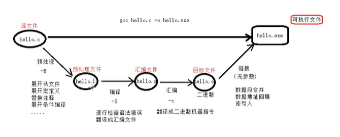

# LINUX

GCC编译流程：



```c++
gcc main.c -o main  //c
g++ main.cpp -o main //c++
    ./main  //执行
```

## **常用指令：**

**mv**：移动+改名

```c++
mv test.txt test1.txt  //改名
mv ./test/test.txt ./test1  //移动-->拷贝赋值删除
```

**tar:** 压缩与解压

```c++
// tar zcvf 压缩文件名称.tar.gz  被压缩文件
tar zcvf test.tar.gz ./test/test.txt  //gzip格式压缩
tar jcvf test.tar.bz2 ./test/test.txt  //bzip2格式压缩
tar zxvf test.tar.gz  //解压
tar jxvf test.tar.gz
```

**which**:查看指令存放位置

```shell
which ls  -->/usr/bin/ls
```

**passwd**：更改密码

**chmod/umask**：更改文件权限

创建目录的默认权限 **drwxrwxrwx**


权限每三个为一组二进制数，更改为那种权限，只需要更改数字即可。

```shell
chmod 143 ./test/test.txt
chmod 143 ./test/test.txt -R  # -R的作用是将该目录（test）下所有的文件都改为143权限
chmod -R 777 文件夹    
```


**kill**：杀死进程

```shell
kill  -9 进程号
pkill -9 进程名称
```

**vim:**


```c++
	dd:删除光标行  //数字+dd-->剪切几行
	yy:复制       //数字+yy-->复制几行
	u：撤销操作 
    gg：跳到首行
    GG：跳到尾行
	gg = GG ：自动排版代码
	*：调转到光标处的代码字符的下一处
	/+字符：对字符进行查找   按n键跳转下一个
```

**SSH**：

```c++
ssh 用户名@主机IP           //连接一个主机
ssh -p 端口号 用户名@主机IP  //连接主机一个具体进程
exit   //注销
```


**getwd--pwd:**

获取当前工作目录

**env：**设置环境变量

```nginx
env 				//显示当前shell会话的所有环境变量及其对应的值
```

