MSDN网址：http://msdn.microsoft.com/en-us/dn308572.aspx

## MFC


* MFC是一个大的类库
* MFC是一个应用程序框架
* MFC封装了很多类甚至是程序流程

**MFC分类**

win32程序与MFC程序的主要区别在于能不能调用MFC程序，能调用就是MFC，不能调用就是win32程序。

**MFC控制台程序**

**vs2022**创建win32程序：

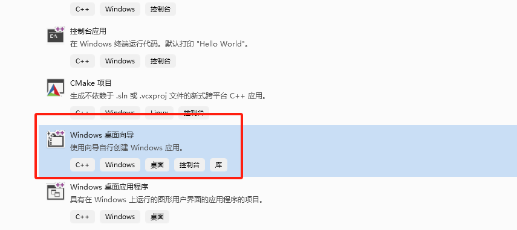

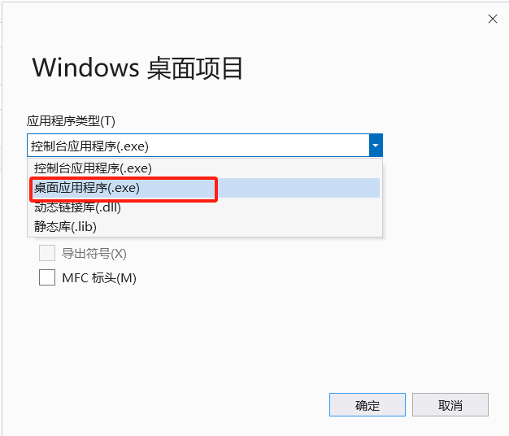


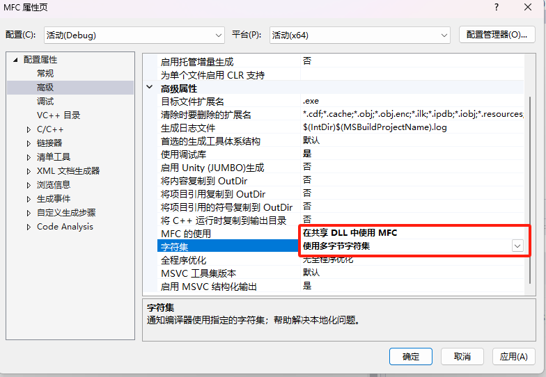


## 一、windows消息机制

1. **SDK和 API**
    **SDK**:软件开发工具包(SoftwareDevelopmentKit)，一般都是一些被软件工程师用于为特定的软件包、软件框架、硬件平台、操作系统等建立应用软件的开发工具的集合。

  **API函数**:Windows操作系统提供给应用程序编程的接口(Application Programming Interface)。Windows应用程序API函数是通过C语言实现的，所有主要的 Windows函数都在 Windows.h头文件中进行了声明。Windows 操作系统提供了 1000 多种 API函数。

2. **窗口和句柄.**
    **窗口**是 Windows 应用程序中一个非常重要的元素，一个 Windows应用程序至少要有一个窗口称为主窗口，窗口是屏幕上的一块矩形区域，是 Windows 应用程序与用户进行交互的接口。利用窗口可以接收用户的输入、以及显示输出。一个应用程序窗口通常都包含标题栏、菜单栏、系统菜单、最小化框、最大化框、 可调边框，有的还有滚动条。

​		**句柄：**在 Windows 应用程序中，窗口是通过窗口句柄( HWND)来标识的，我们要对某个窗口进行操作，首先就要得到这个窗口的句		柄。句柄(HANDLE)是Windows 程序中一个重要的概念，使用也非常频繁。在 Windows 程序中，有各种各样的资源(窗口、图标、光		标,画刷等)，系统在创建这些资源时会为它们分配内存，并返回标识这些资源的**标识号**，即句柄。在后面的内容中我们还会看到图标		句柄(HICON)、光标句柄(HCURSOR)和画刷句柄(HBRUSH)。

3. **消息与消息队列.**
   
      Windows 程序设计是一种完全不同于传统的 DOS 方式的程序设计方法。它是一种事件驱动方式的程序设计模式，主要是基于消息的。
      
      **消息系统的组成：三部分**
      
      1. **消息队列**：Windows为所有的应用程序维护一个消息队列。当操作系统有消息需要传递给应用程序时，这些消息会被放入消息队列中。每个线程（GUI线程）都有自己的消息队列，用于接收和存储操作系统发送给应用程序的消息。
      2. **消息循环**：应用程序通过消息循环来检查和处理消息队列中的消息。在消息循环中，应用程序会不断地从消息队列中取出消息，并将其发送给相应的窗口过程函数进行处理。
      3. **窗口过程**：每个窗口都有一个窗口过程（Window Procedure），它是一个回调函数，用于接收和处理传递给窗口的消息。窗口过程根据消息的类型和需要执行相应的逻辑，如绘图、更新窗口状态、响应用户输入等。
      
      **消息的处理流程：**
      
      * **消息的产生**：当发生用户输入（如鼠标点击、键盘输入）或系统事件（如窗口尺寸改变、定时器事件）时，操作系统会生成相应的消息。
      * **消息的投递**：操作系统将生成的消息放入相应线程的消息队列中，并通知该线程有新消息到达。
      * **消息的检索**：在消息循环中，应用程序通过调用GetMessage函数从消息队列中取出一条消息，并将其存储在MSG结构体变量中。
      * **消息的预处理**：在将消息发送给窗口过程之前，应用程序可以对消息进行一些预处理，如键盘消息的转换（TranslateMessage函数）。
      * **消息的分发**：通过调用DispatchMessage函数，应用程序将消息分发给相应的窗口过程函数（回调函数）进行处理。DispatchMessage函数会根据消息中的窗口句柄找到对应的窗口过程函数，并将消息传递给它。
      * **消息的处理**：窗口过程函数根据消息的类型和需要执行相应的逻辑。处理完消息后，窗口过程函数会返回一个值给Windows，表示消息已被处理。

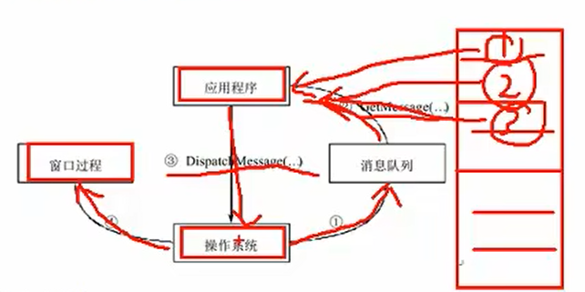

具体流程：

4. **winmain函数**

  当 Windows 操作系统启动一个程序时，它调用的就是该程序的Winain 函数(实际是由插入到可执行文件中的启动代码调用的)
  Winmain 是 Windows 程序的入口点函数（即程序入口，和c++的main函数一样），与 DOS 程序的入口点函数main 的作用相同，当 Winmain 函数结束或返回时，Windows 应用程序结束。

```c
int WINAPI WinMain(  
  HINSTANCE hInstance,       // 当前实例的句柄  
  HINSTANCE hPrevInstance,   // 前一个实例的句柄（在 Win32 中始终为 NULL）  
  PSTR    lpCmdLine,         // 指向命令行参数的指针  
  int     nCmdShow            // 控制窗口如何显示的命令  
);
```

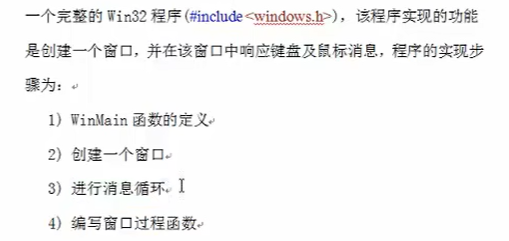


### **MFC消息映射**

消息映射是一个将消息和成员函数相互关联的表。比如，框架窗口接收到一个鼠标左击消息，MFC将搜索该窗口的消息映射，如果存在一个处理 WM_LBUTTONDOWN 消息的处理程序，然后就调用OnLButtonDown（响应的回调函数）。

* MFC中，每个专门的处理函数单独处理每个消息。这些处理函数通常是某一类的成员函数
* 消息映射表是一个静态表，它列出了该类能够处理的所有消息以及对应的处理函数。

MFC中使用消息映射机制(定义和管理消息映射表)必须有两个宏机制：

* 在头文件声明中，声明***DECLARE_MESSAGE_MAP()***（声明宏）
* 在源文件中必须有***BEGIN_MESSAGE_MAP()***和***END_MESSAGE_MAP()***（起始宏和结束宏）
	* BEGIN_MESSAGE_MAP()中第一个参数为窗口名称，即为那个窗口扩展消息映射
	* 第二个参数为基类名称

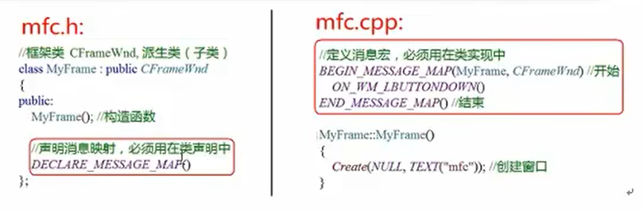

**消息映射类型：**

**1. 系统消息**

* 系统消息是由Windows系统产生的消息，如WM_PAINT（窗口需要重绘）、WM_DESTROY（窗口即将被销毁）等。

**2. 命令消息**

* 命令消息是由用户通过菜单、工具栏按钮、加速键等产生的WM_COMMAND通知消息。这些消息属于应用程序自己定义的消息。

**3. 控件通知消息**

* 控件通知消息是由控件（如按钮、列表框等）产生的WM_COMMAND通知消息，用于向父窗口通知某种情况（如用户更改了编辑控件中的文本）。


### MFC字符集


```c++
	//统计字符串长度
	int num = 0;
	const char * p = "aaaa";
	num = strlen(p);
	cout << num << endl;

	//统计宽字节的字符串长度
	const wchar_t* p2 = L"bbbb";
	num = wcslen(p2);
	cout << num << endl;

	//char *与CString之间的转换
	//char * ->CString
	const char* p3 = "ccc";
	CString str = CString(p3);
```


## 二、项目创建

### **1.底层实现**

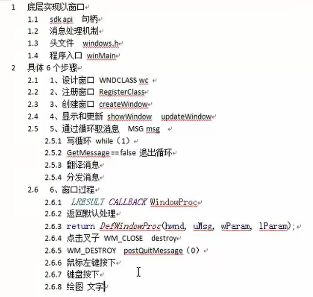

**底层**基础实现：**源文件**中创建window.c

```c
#include <Windows.h>
#pragma comment(lib,"User32.lib")
#pragma comment(lib,"Gdi32.lib")

//6、回调函数 
//CALLBACK宏 代表__stdcall参数的传递顺序；从左到右依次入栈，并在函数返回前 清空堆栈
LRESULT CALLBACK WindowProc(
	HWND hwnd,				//消息所属的窗口句柄
	UINT uMsg,				//具体消息名称
	WPARAM wParam,			//键盘附加消息
	LPARAM lParam)			//鼠标附加消息
{
	switch (uMsg) {
	case WM_CLOSE:
        //所有以xxxWindow为结尾的方法都不会进入到消息队列中，而是直接执行调用回调函数
		DestroyWindow(hwnd);  //DestroyWindow 发送另一个消息WM_DESTROY
		break;
	case WM_DESTROY:
		PostQuitMessage(0);  //真正的退出操作，不加这个的话程序会在后台默认运行需要杀掉
		break;
	case WM_LBUTTONDOWN:		//鼠标左键按下
		{
		int xPos = LOWORD(lParam);
		int yPos = HIWORD(lParam);

		char buf[1024];
		wsprintf(buf, TEXT("x = %d,y=%d"),xPos,yPos);

		MessageBox(hwnd, buf, TEXT("鼠标左键按下"),MB_OK);
		break;
		}
	case WM_KEYDOWN:  //键盘
		MessageBox(hwnd, TEXT("键盘按下"), TEXT("鼠标左键按下"), MB_OK);
		break;
	case WM_PAINT:   //绘图
		{
		PAINTSTRUCT ps;
		HDC hdc = BeginPaint(hwnd, &ps);
		TextOut(hdc, 100, 100, TEXT("HELLO"), strlen("HELLO"));
		EndPaint(hwnd, &ps);
		}
		
	}

	//返回默认处理方式
	return DefWindowProc(hwnd, uMsg, wParam, lParam);
}


//程序入口
//WINAPI 代表__stdcall参数的传递顺序；从左到右依次入栈，并在函数返回前 清空堆栈
int WINAPI WinMain(
	HINSTANCE hInstance,       // 当前实例的句柄  
	HINSTANCE hPrevInstance,   // 前一个实例的句柄（在 Win32 中始终为 NULL）  
	PSTR    lpCmdLine,         // 指向命令行参数的指针  
	int     nCmdShow            // 控制窗口如何显示的命令  
) 
{
	//1、窗口设计
	//2、注册窗口
	//3、创建窗口
	//4、显示和更新
	//5、通过循环取消息
	//6、处理消息（窗口过程）

	//1、窗口设计
	WNDCLASS wc;
	wc.cbClsExtra = 0;								//类的额外内存
	wc.cbWndExtra = 0;								//窗口的额外内存
	wc.hbrBackground = GetStockObject(WHITE_BRUSH);	//设置背景，使用GetStockObjectAPI实现
	wc.hCursor = LoadCursor(NULL,IDC_HAND);		//设置光标->光标为手
	wc.hIcon = LoadIcon(NULL,IDI_ERROR);					//设置图标，第一个参数为NULL代表使用系统提供的光标
	wc.hInstance = hInstance;  //应用程序示例句柄，传入winmain中的形参即可
	wc.lpfnWndProc = WindowProc;  //窗口过程（回调函数）
	wc.lpszClassName = TEXT("WIN");  //指定窗口名称
	wc.lpszMenuName = NULL; //菜单名称
	wc.style = 0;  //显示风格 0为默认风格

	//2、注册窗口类
	RegisterClass(&wc);

	//3、创建窗口
	/*CreateWindow(
	lpClassName,	类名(窗口名称)
	lpWindowName,	标题名
	dwStyle,		风格:WS_OVERLAPPEDWINDOW混合风格
	x,				窗口坐标
	y,
	nWidth,			窗口宽高
	nHeight,
	hWndParent,		父窗口
	hMenu,			菜单
	hInstance,		实例句柄
	lpParam			附加值 鼠标附加值
	)*/
	HWND hwnd = CreateWindow(wc.lpszClassName, TEXT("WINDOWS"), WS_OVERLAPPEDWINDOW, CW_USEDEFAULT, CW_USEDEFAULT, CW_USEDEFAULT, CW_USEDEFAULT, NULL, NULL, hInstance, NULL);

	//4、显示和更新
	ShowWindow(hwnd,SW_SHOWNORMAL);

	//5、通过循环取消息
	/*
	typedef struct tagMSG {
    HWND        hwnd;       主窗口句柄
    UINT        message;	具体消息名称
    WPARAM      wParam;		附加消息，键盘消息
    LPARAM      lParam;		附加消息，鼠标消息
    DWORD       time;		消息产生时间
    POINT       pt;			附加消息 鼠标消息 x y
	*/
	MSG msg;
	while (1) {
		/*
		GetMessageW(
		_Out_ LPMSG lpMsg,			消息
		_In_opt_ HWND hWnd,			捕获窗口，填NULL捕获所有窗口
		_In_ UINT wMsgFilterMin,	最小和最大的过滤的消息，
		_In_ UINT wMsgFilterMax);	填0捕获所有消息
		*/
		if (GetMessage(&msg,NULL,0,0) == FALSE) {  //消息是false值
			break;
		}
		//分发前，会进行翻译消息-->因为不是所有消息都需要显示，比如ctrl+cv是复制操作并不需要显示
		TranslateMessage(&msg);
		//不为false，是其他消息进行分发
		DispatchMessage(&msg);
	}


	return 0;
}
```

​		新版本在使用MFC版本时可能不匹配，打开VS installer，**不要使用单个组件下载**，选择**使用c++的桌面开发**中的最新版本。

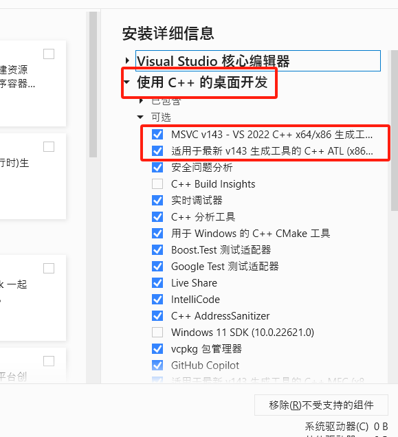


### 2.**MFC窗口实现**：(WIN32应用程序)


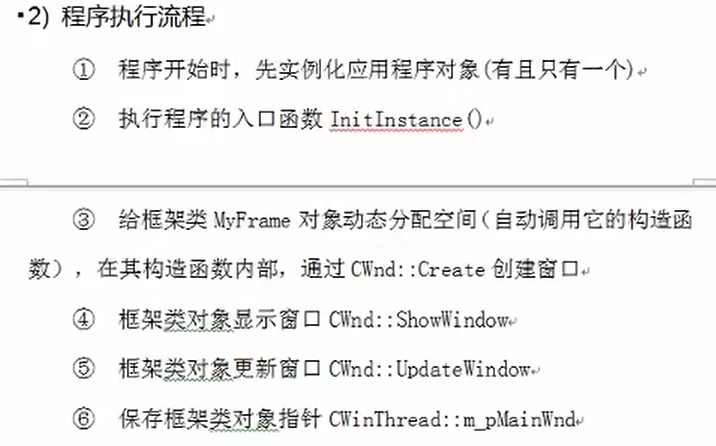

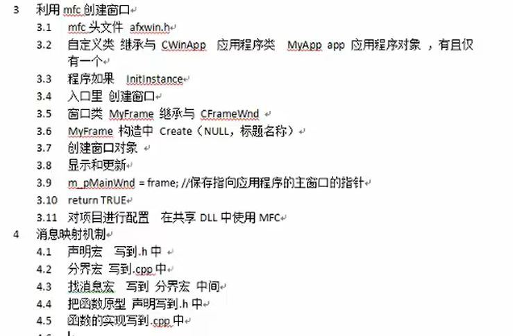


**mfc.h**

```c++
#include<afxwin.h>

//应用程序类CWinApp,派生类子类
class MyApp :public CWinApp {
public:
	//程序入口
	virtual BOOL InitInstance();
};

//框架类
class MyFrame :public CFrameWnd {
public:
	MyFrame();  //构造函数

	afx_msg void OnLButtonDown(UINT, CPoint);		//鼠标宏声明
	afx_msg void OnKeyDown(UINT, UINT, UINT);		//键盘宏声明
	afx_msg void OnPaint();							//绘图宏声明
	//声明宏
	DECLARE_MESSAGE_MAP();
};
```

**mfc.cpp**

```c++
#include "mfc.h"

MyApp app;  //程序类实例化对象

BOOL MyApp::InitInstance() {  			//程序入口
	///创建窗口
	MyFrame* frame = new MyFrame;  		//创建框架类对象

	frame->ShowWindow(SW_SHOWNORMAL); 	//显示窗口
	frame->UpdateWindow();  			//更新窗口

	m_pMainWnd = frame;  				//保存框架类对象指针

	return TRUE;
}

//分界宏
BEGIN_MESSAGE_MAP(MyFrame, CFrameWnd)  	//开始

	ON_WM_LBUTTONDOWN()  				//鼠标事件:左键按下

	ON_WM_KEYDOWN()						//键盘事件：键盘按下

END_MESSAGE_MAP()  						//结束

MyFrame::MyFrame(){
	Create(NULL, TEXT("mfc")); 			//创建窗口
}

void MyFrame::OnLButtonDown(UINT, CPoint point) {  //鼠标事件
	//TCHAR buf[1024];
	//wsprintf(buf, TEXT("x = %d,y = %d", point.x, point.y));

	//MessageBox(buf);

	CString str;
	str.Format(TEXT("x = %d,y = %d"), point.x, point.y);

	MessageBox(str);

}

void MyFrame::OnKeyDown(UINT key, UINT, UINT)
{
	CString str;
	str.Format(TEXT("按下了%c键"), key);

	MessageBox(str);
}

void MyFrame::OnPaint()
{
	CPaintDC dc(this);

	dc.TextOut(100, 100, TEXT("为了部落！"),5);
}
```


### 3.**MFC窗口实现**：(MFC应用程序)

程序创建：

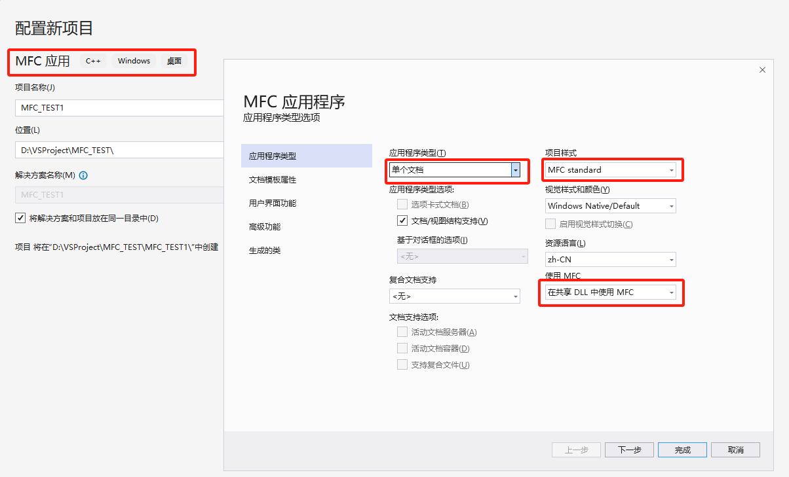

MFC生成的类有四种：APP,MainFrame,View,Doc

* View类用于显示
* Doc用于管理文档

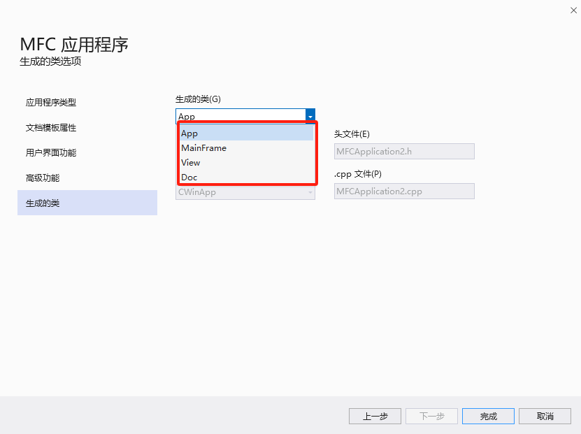

四个类的源文件和头文件如下：

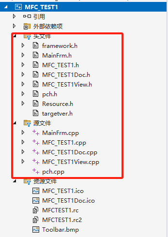

对于MFC项目不在观察解决资源管理器，主要看类视图，四个类都在其中：

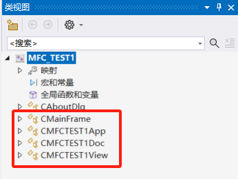


当需要写消息时，比如鼠标点击宏，记不住宏可以右键View点击属性，出现属性框后点击消息，找到其中的WM LBUTONDOWN进行添加：

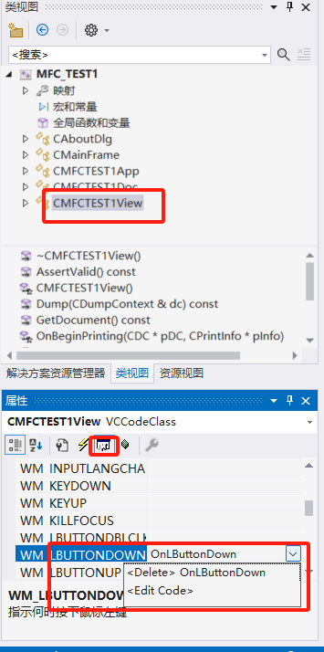

添加完毕：

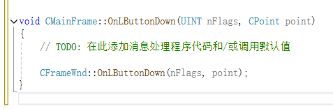


```c++
void CMFCTEST1View::OnLButtonDown(UINT nFlags, CPoint point)
{
	// TODO: 在此添加消息处理程序代码和/或调用默认值

	CView::OnLButtonDown(nFlags, point);
	CString str;
	str.Format(TEXT("x = %d,y = %d"), point.x, point.y);

	MessageBox(str);
}
```


## 三、基础控件

项目创建：

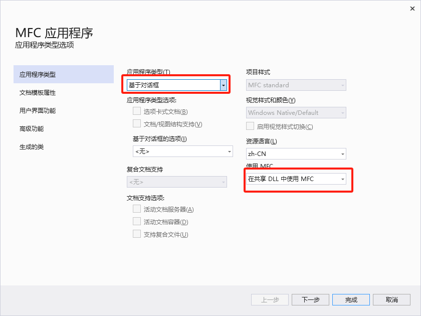

对于创建生成的默认界面都在**资源文件**当中，点击.rc文件：

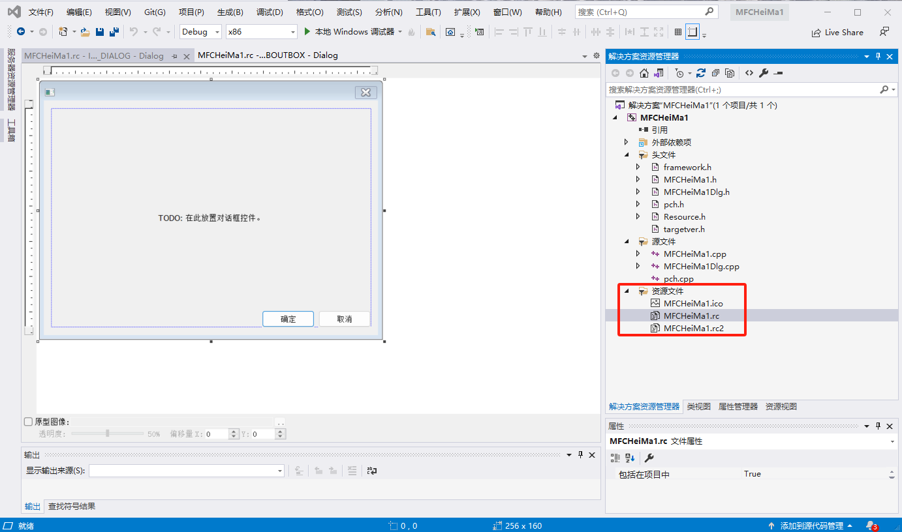

点击之后，Dialog即相关窗口，ABOUT为关于对话框，MFCHEIMA1_DIALOG为默认生成对话框：

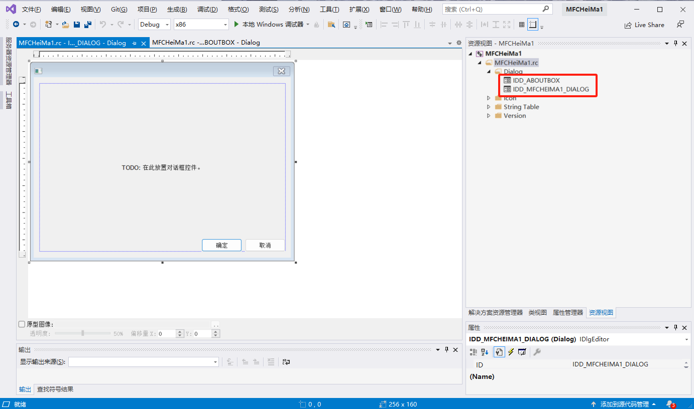

对于窗口的更改除了代码也可以直接快捷工具箱（视图->工具箱或者快捷键`Ctrl+Alt+X`）添加：

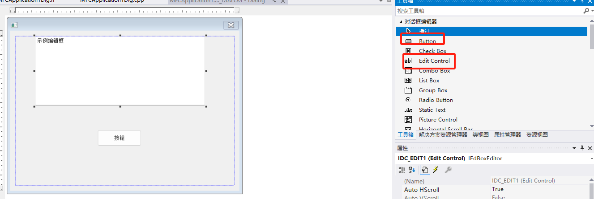

对于控件，左键选中控件，右键点击属性。可在右下角修改**ID、名称**等属性：

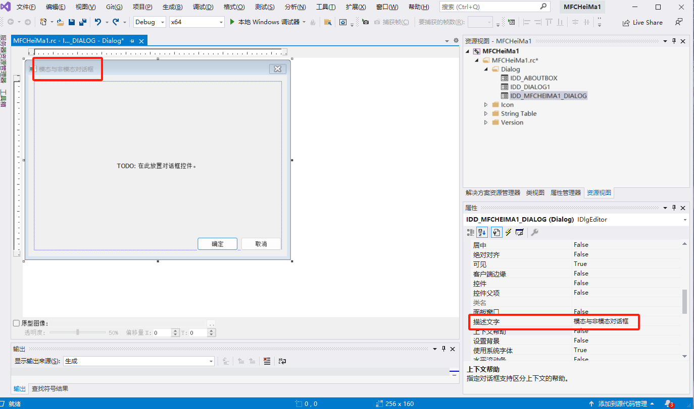


### 1、编辑框与按钮

**对于编辑框**：需要绑定ID与字符串操作：

* 在**MFCApplicationDlg.h**中添加成员变量，用于在编辑框中显示：

```c++
// CMFCApplication1Dlg 对话框
class CMFCApplication1Dlg : public CDialogEx
{
// 构造
public:
	CMFCApplication1Dlg(CWnd* pParent = nullptr);	// 标准构造函数

......

private:
	CString str;   //首先添加编辑框1字符串成员变量str
};

```

* 在**MFCApplicationDlg.cpp**中与编辑框和str成员变量进行绑定：

```c++
void CMFCApplication1Dlg::DoDataExchange(CDataExchange* pDX)
{
	CDialogEx::DoDataExchange(pDX);
	DDX_Text(pDX, IDC_EDIT1,str);   //绑定编辑框ID，与字符串变量
}
```

* **双击按钮**添加按钮的事件函数OnBnClickedButton1，默认在**MFCApplicationDlg.cpp**中

```c++
//按钮的函数
void CMFCApplication1Dlg::OnBnClickedButton1()
{
	// TODO: 在此添加控件通知处理程序代码
	UpdateData(TRUE);		//此函数将编辑框的所有值都放在str中，TRUE表示取到了编辑框的值
	str = str + _T("ABC");  //将str加上ABC
	UpdateData(FALSE);		//将加了ABC的str进行更新显示
}
```

结果：不断的点击按钮将不断的添加ABC：

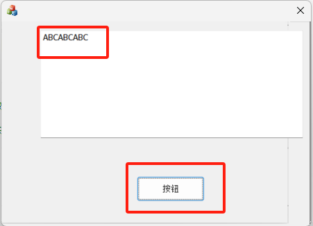

再次添加按钮2与编辑框：点击按钮2将编辑框1的内容给编辑框2

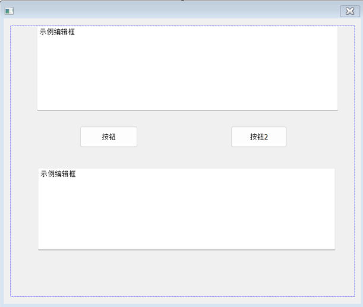

**MFCApplicationDlg.h**

```c++
// CMFCApplication1Dlg 对话框
class CMFCApplication1Dlg : public CDialogEx
{
// 构造
public:
	CMFCApplication1Dlg(CWnd* pParent = nullptr);	// 标准构造函数

......

private:
	CString str;				//编辑框1字符串成员变量str
	CString str2;				//编辑框2字符串成员变量str2
public:
	afx_msg void OnBnClickedButton1();
	afx_msg void OnBnClickedButton2();
};
```

**MFCApplicationDlg.cpp：**

```c++
void CMFCApplication1Dlg::DoDataExchange(CDataExchange* pDX)
{
	CDialogEx::DoDataExchange(pDX);
	DDX_Text(pDX, IDC_EDIT1,str);  		//绑定编辑框1ID，与字符串变量str
	DDX_Text(pDX, IDC_EDIT2,str2);		//绑定编辑框2ID，与字符串变量str2
}

void CMFCApplication1Dlg::OnBnClickedButton2()
{
	// TODO: 在此添加控件通知处理程序代码
	UpdateData(TRUE);					//将编辑框的所有值都放在str2中
	str2 = str;							//将str的内容给str2
	str = " ";							//str置空
	UpdateData(FALSE);
}
```

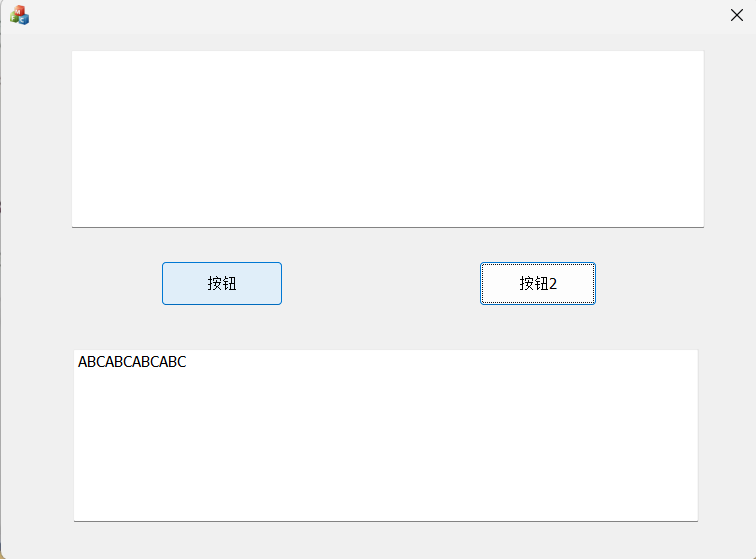


### 2、模态对话框与非模态对话框

1.对于模态与非模态对话框，首先**添加按钮**：

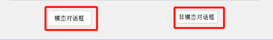

2.对话框必须要弹出一个新的窗口，因此 必须**新建新窗口**：

​				右键点击本窗口的Dialog：

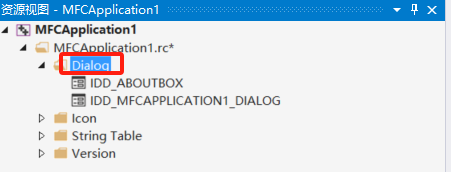

​				插入两个新窗口：

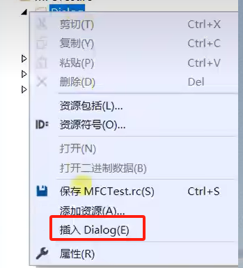

​				新窗口如下：两个窗口分别表示一个模态对话框与非模态对话框

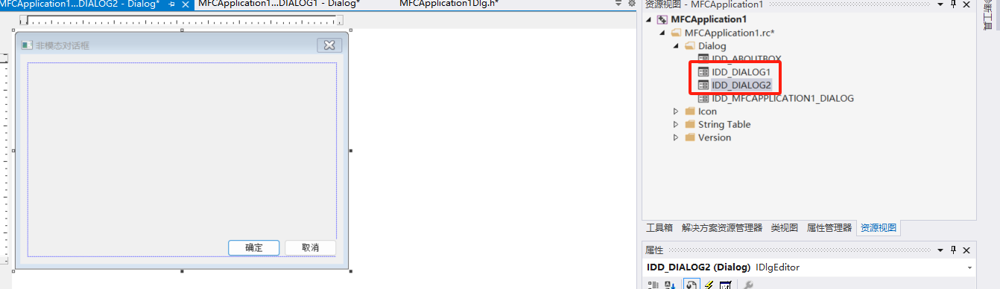

3.窗口创建好之后，现在只有UI文件，必须自己**创建关于两个窗口的类**：

​			右键点击窗口添加类：

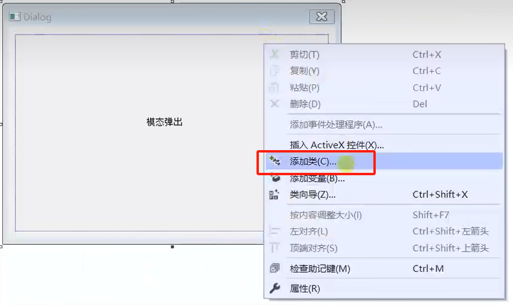

​			添加MFC类：

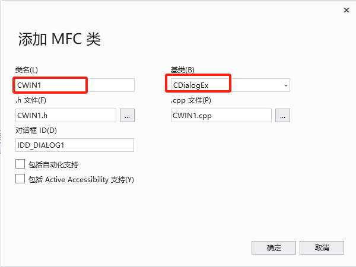

​			添加好之后会生成关于类的.h与.cpp文件：对于新生成的两个对话框如果需要添加东西则在其文件中添加。


4.接下来**关联按钮与窗口**：只需要将窗口的类包含进按钮所在的文件中：

**MFCApplicationDlg.h:**

​				首先在主窗口的MFCApplicationDlg.h包含头文件并声明两个模态框的类的变量：

```C++
#pragma once
#include "CWIN1.h"		//包含窗口1
#include "CWIN2.h"

// CMFCApplication1Dlg 对话框
class CMFCApplication1Dlg : public CDialogEx
{
// 构造
public:
	CMFCApplication1Dlg(CWnd* pParent = nullptr);	// 标准构造函数

......

private:
	CWIN1 cw1;			//窗口1变量
	CWIN2 cw2;			//窗口2变量

};
```

**MFCApplicationDlg.cpp**:

​				然后双击按钮生成事件函数，在MFCApplicationDlg.cpp中调用窗口：

```c++
//模态
void CMFCApplication1Dlg::OnBnClickedButton3()
{
	// TODO: 在此添加控件通知处理程序代码
	cw1.DoModal();   				//DoModal调用模态窗口
}
//非模态
void CMFCApplication1Dlg::OnBnClickedButton4()
{
	// TODO: 在此添加控件通知处理程序代码
	cw2.Create(IDD_DIALOG2);		//绑定窗口ID
	cw2.ShowWindow(SW_NORMAL);		//展示窗口
}
```

​				而对于非模态窗口的创建，在OnBnClickedButton4中创建容易导致重复初始化的问题，因此最好在主窗口的初始化中一起初始化：

```c++
BOOL CMFCApplication1Dlg::OnInitDialog()
{
	CDialogEx::OnInitDialog();

	......

	// TODO: 在此添加额外的初始化代码
	cw2.Create(IDD_DIALOG2);		//绑定窗口ID

	return TRUE;  // 除非将焦点设置到控件，否则返回 TRUE
}
//非模态
void CMFCApplication1Dlg::OnBnClickedButton4()
{
	// TODO: 在此添加控件通知处理程序代码
	cw2.ShowWindow(SW_NORMAL);		//展示窗口
}
```


## 四、MFC多线程

**线程类：CwinThread**

### 1、类外使用：

**AfxBeginThread的基本用法**

1. **包含头文件**：在需要使用AfxBeginThread的文件中，首先需要包含afxwin.h头文件。

	```c++
	#include <afxwin.h>
	```

2. **定义线程函数**：定义一个线程函数，该函数需要符合特定的函数原型，即返回一个UINT值，并接受一个LPVOID类型的参数。

	```c++
	UINT MyThreadFunction(LPVOID pParam)  
	{  
	    // 线程执行的代码  
	    return 0;  
	}
	```

3. **创建线程**：在需要创建线程的地方，调用AfxBeginThread函数，并将线程函数和传递给线程函数的参数作为参数传递给AfxBeginThread。

	```c++
	CWinThread* pThread = AfxBeginThread(MyThreadFunction, pParam);
	```

	其中，`MyThreadFunction`是上一步定义的线程函数，`pParam`是传递给线程函数的参数。

4. **操作线程**：创建线程后，可以通过返回的`CWinThread*`指针对线程进行操作，如获取线程ID、线程句柄等。

	```c++
	DWORD dwThreadId = pThread->m_nThreadID;  
	HANDLE hThreadHandle = pThread->m_hThread;
	```

5.  **暂停线程**：SuspendTread()

```c++
pThread = SuspendTread();
```

**AfxBeginThread的参数**

AfxBeginThread函数有多种重载形式，但基本的参数包括：

* **pfnThreadProc**：指向线程函数的指针。
* **pParam**：传递给线程函数的参数。
* **nPriority**（可选）：线程的优先级。
* **nStackSize**（可选）：线程的堆栈大小。
* **dwCreateFlags**（可选）：创建线程的标志，如CREATE_SUSPENDED表示创建挂起的线程。
* **lpSecurityAttrs**（可选）：线程的安全属性。


### 2、类内使用：

在MFC（Microsoft Foundation Classes）中，`CDialog` 类是用于创建和管理对话框的基类。当你想要在一个对话框类中创建并管理一个线程时，你不能直接在对话框类中定义线程函数（如 `ThreadProc`）为成员函数，因为MFC的线程函数需要是静态的或者全局的，并且它们不能访问类的非静态成员变量（除非通过某种方式传递指向类实例的指针）。

然而，你可以定义一个静态成员函数或全局函数作为线程函数，并在其中通过参数传递的方式访问对话框类的实例。下面是一个如何在 `CMultiBoardSyncGrabDemoDlg` 类中创建并管理线程的示例：

**1. 定义线程函数**

首先，你需要定义一个静态成员函数或全局函数作为线程函数。这里，我们将其定义为静态成员函数：

```cpp
class CMultiBoardSyncGrabDemoDlg : public CDialog  
{  
    // ... 其他成员 ...  
  
    // 静态线程函数  
    static UINT ThreadProc(LPVOID lpParam);  
  
    // 线程控制变量（可选）  
    CWinThread* m_pThread;  
  
    // ... 其他成员 ...  
};  
  
UINT CMultiBoardSyncGrabDemoDlg::ThreadProc(LPVOID lpParam)  
{  
    CMultiBoardSyncGrabDemoDlg* pDlg = reinterpret_cast<CMultiBoardSyncGrabDemoDlg*>(lpParam);  
  
    // 现在你可以通过 pDlg 访问对话框类的成员了  
    // 注意：确保在访问任何成员之前，对话框类的实例仍然是有效的  
  
    // 执行线程任务  
    // ...  
  
    return 0; // 线程返回码  
}
```

**2. 在对话框类中创建线程**

然后，在对话框类的某个成员函数中创建线程：

```cpp
void CMultiBoardSyncGrabDemoDlg::OnBnClickedStartButton() // 假设这是启动按钮的点击事件处理函数  
{  
    // 创建线程  
    m_pThread = AfxBeginThread(ThreadProc, this);  
  
    // 检查线程是否成功创建  
    if (m_pThread == NULL)  
    {  
        AfxMessageBox(_T("无法创建线程！"));  
    }  
}
```

**3. 注意事项**

* 确保在访问对话框类的任何成员之前，对话框实例仍然是有效的。如果对话框被销毁，那么通过 `lpParam` 传递的指针将指向无效的内存。
* 线程函数 `ThreadProc` 必须是静态的，因为它不能直接访问类的非静态成员。我们通过将对话框实例的指针作为参数传递给线程函数来绕过这个限制。
* 如果你的线程需要长时间运行或执行耗时的操作，请确保你的UI（用户界面）在此期间仍然响应。这通常意味着你应该避免在UI线程中执行耗时的操作，而是将这些操作放在工作线程中执行。
* 当你的线程完成其任务时，它将自动结束。但是，你可以通过调用 `CWinThread::PostThreadMessage` 方法来发送消息给对话框，以便在UI线程中处理线程的结果或更新UI。

