# 一、基本概念

## 1 MySQL的登录

*  以管理员的身份打开终端输入（win+x选中终端管理员）

```mysql
 mysql -uroot -p123456
```

* 不显示密码登录

```sql
 mysql -uroot -p
```

当输入完成进行回车（enter）出现下面的图片进行输入密码即可进入：


## 2 语句分类

* DQL：[数据库查询语句]（凡是带有select关键字的都是数据库查询语句）

```mysql
select…
```

* DML：数据库操作语言：（凡是对数据库中**表格的数据**进行操作的语句都是数据库操作语句）

```sql
insert（增）
delete（删）
update（改）
```

* DDL：数据定义语言（凡是带有create、drop、alter关键字的都是DDL。其主要对**表的结构**进行操作，例如增删改某一记录（行）或者某一字段（列））。

```sql
create（新建）
drop（删除）
alter（修改）
```

* TCL:事务控制语言

```sql
commit（事务提交）
rollback（事务回滚）
```

* DCL：数据控制语言

```sql
grant（授权）
revoke（撤销权限）
```

* 其他语句：

```sql
select version();  	#（查看MySQL版本号）
select database();	#（查看当前在使用那个数据库）
```

注意，在输入语句时，mysql不见分号不执行，必须由分号结束语句才会执行，当然也可以输入\c来终止输入：

## 3 常用语句

### 3.1 导入数据

* 导入sql文件，当出现query ok，及导入成功。

```sql
source 文件路径  #注意，这个指令不加分号
```

* 查看数据库

```sql
show databases;
```

* 使用数据库

```sql
 use 数据库名称;
```

* 创建数据库

```sql
 create database 数据库名称;
```


### 3.2 查询（DQL）

#### 3.2.1 简单查询

* 查看表数据：

```sql
select 
	*
from 
	表名;
```

* 查看表的结构：

```sql
desc 表名;
```

* 从表中只查询一个字段：

```sql
select 
	字段名 
from 
	表名;
```

* 查询两个字段或者多个字段,只需用逗号隔开字段名：

```sql
select 
	字段名1,字段名2 
from 
	表名;
```

* 给列名取别名：数据库只是在显示时用这个别名，但是在数据库中还是原来的名字，select语句只是查询语句。而且别名中不能有空格，当你想加空格或者其中文名时应该给别名加单引号或者双引号，但是双引号在mysql中可以使用，Oracle中是无法使用的：

```sql
select 
	字段名 as 别名  # 字段名 as '字段名'
from 
	表名;
```

* 对某一字段的运算：

```sqlite
select 
	字段名*10
from 
	表名;
```


​	

#### 3.2.2 条件查询

条件查询语法格式：

```sql
select
	字段名
from
	表名
where
	条件;
order by 
	字段名 [ASC|DESC];   # 升序/降序
```

常用运算符：

|        运算符         |                   描述                   |                        示例                        |
| :-------------------: | :--------------------------------------: | :------------------------------------------------: |
|          `=`          |                   等于                   |               `WHERE column = value`               |
|     `<>` 或 `!=`      |                  不等于                  | `WHERE column <> value` 或 `WHERE column != value` |
|          `>`          |                   大于                   |               `WHERE column > value`               |
|          `<`          |                   小于                   |               `WHERE column < value`               |
|         `>=`          |                 大于等于                 |              `WHERE column >= value`               |
|         `<=`          |                 小于等于                 |              `WHERE column <= value`               |
| `BETWEEN ... AND ...` |       在两个值之间（包含这两个值）       |      `WHERE column BETWEEN value1 AND value2`      |
|         `IN`          |               在一系列值中               |      `WHERE column IN (value1, value2, ...)`       |
|        `LIKE`         | 模糊匹配（通常与通配符`%`或`_`一起使用） |           `WHERE column LIKE 'pattern%'`           |
|       `IS NULL`       |              检查是否为NULL              |               `WHERE column IS NULL`               |
|     `IS NOT NULL`     |             检查是否不为NULL             |             `WHERE column IS NOT NULL`             |
|         `AND`         |       逻辑与（所有条件都必须为真）       |         `WHERE condition1 AND condition2`          |
|         `OR`          |      逻辑或（至少一个条件必须为真）      |          `WHERE condition1 OR condition2`          |
|         `NOT`         |         逻辑非（反转条件的结果）         |               `WHERE NOT condition`                |

* `>`：查询citymessage表中人数大于10000的名称和id

```sql
select 
	title,id 
from 
	citymessage 
where 
	num>10000：
```

* `between and`：查询citymessage表中人数介于8000和20000的名称和id、way

```sql
select * from citymessage where num between 8000 and 20000;
select * from citymessage where num>=8000 and num <= 20000;
```

* `null`：在对null进行查询时要注意使用is null 不能使用‘=’符号：

```sql
 select 字段名 from 表名 where is null;
```

* `and和or同时出现`：查询id为47,48然后人数大于2000的数据（and优先级比or高）

```sql
select * from citymessage where num>2000 and (id=47 or id=48);
```

* `in与not in`：in其实相当于多个or,例如当我们想查询id为44,45,46的数据可以这样写：

```sql
select * from citymessage where id in (44,45,46);
```

not in 便表示不在in的几个数据的其他数据。

```sql
select * from citymessage where id not in (44,45,46);
```

* `like`：模糊查询：like（配合%和_）

```sql
select * from citymessage where title like '%甘肃%';
```

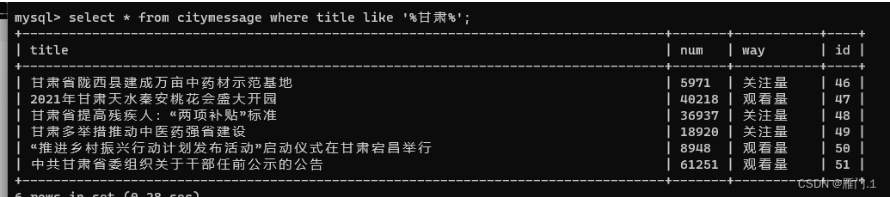

如果一定要找到第二个字是肃的数据，可以这样写：

```sql
select * from citymessage where title like '_肃%';
```

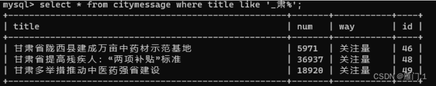

当你想找到字符里面有下划线(_)的，一定要**先转义**再查询：

```sql
select * from 表名 where 字段名 like '%\_%';
```


#### 3.2.3 排序

排序总在最后执行。

* 默认排序（升序）

```sql
select * from 表名 order by 字段名;
```

* 指定降序：

```sql
select * from 表名 order by 字段名 desc;
```

* 多段排序：先把id按照升序进行排列，当id一样的情况下，在对num进行升序排列。

```sql
select * from citymessage order by id asc,num asc;
```

* 综合应用：在表citymessage中找出num在2000和8000之间，且id按照降序排列的数据：

```sql
select 
	* 
from 
	citymessage
where 
	num between 2000 and 8000 
order by 
	id desc;
```


#### 3.2.4 数据处理

##### 3.2.4.1 单行处理函数

* `substr `取子串：

```sql
substr(被截取的字符串的字段名,起始下标,截取长度))；		# 这里注意起始下标从1开始，不能从0开始
select 
	substr(title,1,5) as '别名' 
from 
	citymessage;
```

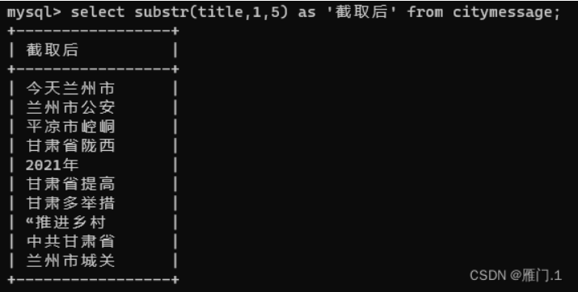

​	当然还可以与模糊查询一起用，比如现在要查询前两个字是甘肃的title：

```sql
select * from citymessage where title like '甘肃%';
select * from citymessage where substr(title,1,2) = '甘肃';
```

* `concat`：拼接字符串

```sql
select concat(title,num) from citymessage;
```

单纯的加减运算字符还是±。

* `length`：取长度

```sql
select length(title) from citymessage;
```

* `lower、upper`（转换小写、转换大写）

```sql
select lower/upper (字段名) from 表名;
select lower(title) from citymessage; 
select upper(title) from citymessage;
```

concat、length、substr、supper几者合用:比如当我们希望某一字段的所有字符串首字母大写(upper)：

```sql
select 
	concat(upper(substr(title,1,1)),substr(title,2,length(title)-1))
from 
	citymessage;
```

* `trim`:去空格

```sql
select 
	* 
from 
	citymessage 
where 
	id = trim(45);
```

* `round`:四舍五入。除了0以外，正数便是保留几位小数，0即保留到整数。负数便是保留到几分位，如-1是十分位，-2是百分位。保留规则均是四舍五入。

```sql
select
	round(title,0) 
from 
	citymessage;
```

* `rand`：生成随机数（<1的随机数）

```sql
select 
	rand() 
from 
	citymessage;
# 生成100以内，且保留整数的随机数
select 
	round(rand()*100) 
from 
	citymessage;
```

* `infull`：专门处理null的数据，可以将null转换为具体数值。会将null当做具体的0，否则在数据库中的运算但凡有null参与，结果都为null。

```sql
select 
	ifnull(id,0) 
from 
	citymessage;
```

* case… when … then… when…then… else … end;

id为45时num上涨10%，当id为50时num上涨50%,其他num正常。

```sql
select
	*,case id when 45 then num*1.1 when 50 then num*1.5 else num end
from
	citymessage;
```


##### 3.2.4.2 多行处理函数

多行函数在使用时：

* 必须先进行分组在进行计算。没有分组则计算整张表。
* 分组函数自动处理null，不需提前对null进行处理。
* count(字段名)统计的是改字段下所有不为null的字符串个数，count(*)统计该表总行数。

`count`：计数

```sql
select count(id) from citymessage;
select count(*) from citymessage;
```

`max`：最大值

```sql
select max(id) from citymessage;
```

`min`：最小值

```sql
select min(id) from citymessage;
```

`avg`：平均值

```sql
select avg(id) from citymessage;
```

`sum`：求和

```sql
select sum(id) from citymessage;
```


#### 3.2.5 分组查询(group by)

分组查询一定要**先对表进行分组，再进行查询**，所以分组函数也不能直接使用在where后面。
查询指令编写顺序：

```sql
select->from ->where ->group by -> order by
```

指令执行顺序：

```sql
from->where ->group by ->select -> order by
```

* `group by`:

比如我查询一下，**每种工作的工资和，并且找到其中最高的工资**：但是这里需要注意的是，在分组后，select后面只能加上分组字段和数据操作函数,不能添加其他字段,否则mysql中可能会输出一个错误的结果，但是Oracle中会直接报错。

```sql
select 
	job,sum(salary)		# 不能再添加其他字段
from 
	表名
group by
	job
order by
	asc;
```

当需要查询**某个部门某个工作岗位的最高工资**时，你会发现这里需要分组两次，其实这里可以直接将两个查询直接放在一起：

```sql
select
	部门,岗位,max(工资)
from
	表名
group by
	部门,岗位;
```

* `having`(必须与group by连用)

查询**某个部门的最高工资，且工资必须大于5000的**

```sql
select
	部门,max(工资)
from
	表名
where
	工资>5000
group by
	部门;
```

使用having进行再此筛选可以这样写:

```sql
select
	部门,max(工资)
from
	表名
group by
	部门
having 
	max(工资)>5000;
```

**优化策略**：优选选择where。

* `去除重复记录`

这里要注意的是当有个字段名出现时，去除重复记录时属于联合去除，也就是将两个字段的数据结合起来，**去除其中都在各自字段属于重复的数据。**

```sql
select 
	distinct 字段名,字段名...
from 
	表名;
```

比如我要**统计工作岗位的种类的数量，那么就要先去除重复岗位数据，每种只保留一个，在进行计数**：

```sql
select 
	count(distinct 岗位)
from 
	表名; 
```


#### 3.2.6 连接查询

连接查询即跨越多张表查询数据。

**表的连接方式：**

1. 内连接：
	* 等值连接
	* 非等值连接
	* 自连接
2. 外连接：
	* 左外连接			
	* 右外连接

3. 全连接


##### 3.2.6.1 笛卡尔积现象：

* 当两张[表连接](https://so.csdn.net/so/search?q=表连接&spm=1001.2101.3001.7020)时没有任何条件限制会发生`笛卡尔积现象`,即两个不同表中的不同字段数据会进行一对一匹配，最终生成字段1×字段2数量的数据。

* ```sql

	select 字段名,字段名 from 表名,表名;
	```
	
	为了避免笛卡尔积现象，连接时必须加条件：
	
	```sql
	select
		字段名,字段名
	from
		表1，表2
	where 
		表1.字段 = 表2.字段;
	```
	
	**查询每个员工对应的部门名称**。这里能看到第一张表每个员工（ename）有个部门编号（deptno），第二张表每个部门编号（deptno）对应一个部门名称（dname）。
	
	```sql
	select 
		ename,dname
	from 
		emp,dept
	where
		emp.deptno = dept.deptno;
	```


##### 3.2.6.2 内连接（等值连接）

* **等值连接**（条件为等量关系）：`inner join … on …`

* `INNER JOIN` 是一种用于结合来自两个或多个表中的行的操作。当两个表中存在至少一个匹配的行时，`INNER JOIN` 会返回这些匹配的行。如果表之间有至少一个匹配，则返回结果集；如果没有匹配，则不会返回任何行。

	基本语法：
	
	```sql
	SELECT columns  
	FROM table1  
	INNER JOIN table2  
	ON table1.common_field = table2.common_field;
	```
	
	**查询每个员工所在的部门名称**，显示员工名（ename）和部门名（dname）

```sql
select 
	e.ename,d.dname
from 
	emp e,dept d
where
	e.deptno = d.deptno;
```

利用等值连接可以这样写：

```sql
select 
	e.ename,d.name
from 
	emp e
inner join
	dept d
on
	e.deptno = d.deptno;
```


##### 3.2.6.3 非等值连接

基础语法：

```sql
SELECT 表1.字段1, 表2.字段2, ...  
FROM 表1  
JOIN 表2  
ON 表1.字段 操作符 表2.字段;
```

其中，`操作符`可以是`<`、`>`、`<=`、`>=`、`<>`等比较运算符。

**示例：**

假设我们有两个表：`orders`（订单表）和`shipping_rates`（运费表）。我们想要**根据订单金额找到对应的运费区间**。

`orders`表结构：

| order_id | amount |
| -------- | ------ |
| 1        | 50.00  |
| 2        | 75.00  |
| 3        | 200.00 |

`shipping_rates`表结构：

| rate_id | amount_min | amount_max | rate  |
| ------- | ---------- | ---------- | ----- |
| 1       | 0.00       | 99.99      | 5.00  |
| 2       | 100.00     | 199.99     | 10.00 |
| 3       | 200.00     | 299.99     | 15.00 |

```sql
SELECT o.order_id, o.amount, sr.rate  
FROM orders o  
JOIN shipping_rates sr  
ON o.amount >= sr.amount_min AND o.amount <= sr.amount_max;
ON o.amount between sr.amount_min AND sr.amount_max;
```


##### 3.2.6.4 自连接

* 表与其自身进行连接操作。在自连接中，一个表在查询中被视为两个不同的表，并通过它们之间的共同属性（通常是主键或外键）来连接

**基本语法：**

```sql
SELECT a.column1, b.column2  
FROM table_name a  
JOIN table_name b  
ON a.common_field = b.related_field;
```

**案例：**

假设我们有一个名为 `employees` 的表，它包含员工的ID、姓名以及他们经理的ID（这里假设经理也是员工表中的一条记录）。

| employee_id | name    | manager_id |
| ----------- | ------- | ---------- |
| 1           | Alice   | NULL       |
| 2           | Bob     | 1          |
| 3           | Charlie | 1          |
| 4           | David   | 2          |

如果我们想要**查询每个员工及其经理的姓名**，我们可以使用自连接：

```sql
select 
	e.name as employee_name, m.name as manager_name  
from 
	employees e  
left join 
	employees m 
on 
	e.manager_id = m.employee_id;
```

在这个查询中，`employees` 表被当作两个表来处理：`e`（代表员工）和 `m`（代表经理）。通过 `e.manager_id = m.employee_id` 这个连接条件，我们能够将每个员工与其对应的经理关联起来。注意，这里使用了 `LEFT JOIN` 来确保即使某个员工没有经理（即 `manager_id` 为 `NULL`），该员工的信息也会出现在结果集中，但其经理的姓名将显示为 `NULL`。


##### 3.2.6.5 外连接

外连接（Outer Join）是SQL中用于查询两个或多个表时的一种连接方式，它允许查询结果中包含那些在连接条件中没有匹配的行。外连接主要分为三种类型：左外连接（Left Outer Join）、右外连接（Right Outer Join）和全外连接（Full Outer Join）。这些连接类型在SQL查询中用于满足不同的数据检索需求。

**左外连接**：

* 左外连接以左表（LEFT JOIN左侧的表）为基础，返回左表中的所有行。如果左表中的行在右表中有匹配的行，则返回这些匹配的行；如果左表中的行在右表中没有匹配的行，则结果中右表的部分将包含NULL值。

```sql
SELECT 
	a.*, b.*  
FROM 
	table1 a  
LEFT JOIN 
	table2 b 
ON 
	a.id = b.a_id;
```

在这个示例中，即使`table2`中没有与`table1`中某些`id`相匹配的`a_id`，这些`table1`中的行仍然会出现在查询结果中，而对应的`table2`的列将包含NULL值。


**右外连接（Right Outer Join）**

* 右外连接与左外连接相反，它以右表（RIGHT JOIN右侧的表）为基础，返回右表中的所有行。如果右表中的行在左表中有匹配的行，则返回这些匹配的行；如果右表中的行在左表中没有匹配的行，则结果中左表的部分将包含NULL值。

```sql
SELECT 
	a.*, b.*  
FROM 
	table1 a  
RIGHT JOIN 
	table2 b 
ON 
	a.id = b.a_id;
```

在这个示例中，即使`table1`中没有与`table2`中某些`a_id`相匹配的`id`，这些`table2`中的行仍然会出现在查询结果中，而对应的`table1`的列将包含NULL值。


**全外连接**：

全外连接返回左表和右表中的所有行。当左表中的行在右表中没有匹配时，结果中右表的部分将包含NULL值；同样，当右表中的行在左表中没有匹配时，结果中左表的部分也将包含NULL值。需要注意的是，并非所有的数据库系统都直接支持全外连接（如MySQL，但在较新版本中可能通过UNION操作符实现类似效果）。

```sql
SELECT 
	a.*, b.*  
FROM 
	table1 a  
FULL OUTER JOIN 
	table2 b 
ON 
	a.id = b.a_id;
```

在这个示例中，无论是`table1`还是`table2`中的行，即使它们之间没有匹配，也会出现在查询结果中，不足的部分将用NULL值填充。


##### 3.2.6.6 多表查询应用

基础语法：

```sql
select 
  ...
from
	表a
join 
	表b
on
	表a和表b的连接条件
join
	表c
on
	表a和表c的连接条件
...
```

**数据库设计：**

1. Employees（员工表）
	* EmployeeID (员工ID, 主键)
	* EmployeeName (员工名)
	* DepartmentID (部门ID, 外键)
	* Salary (薪资)
2. Departments（部门表）
	* DepamentID (部门ID, 主键)
	* DepartmentName (部门名)
3. SalaryGrades（薪资等级表）
	* GradeID (薪资等级ID, 主键)
	* MinimumSalary (最低薪资)
	* MaximumSalary (最高薪资)
	* GradeName (薪资等级名)

**SQL查询**：

要**找出每个员工的部门名称以及工资等级，并显示员工名、部门名、薪资、薪资等级**，我们需要使用`JOIN`操作来连接这三个表。具体地，我们可以首先连接`Employees`和`Departments`表来找出每个员工的部门名称，然后再将结果与`SalaryGrades`表连接来找出每个员工的薪资等级。

```sql
SELECT   
    E.EmployeeName,  
    D.DepartmentName,  
    E.Salary,  
    SG.GradeName  
FROM   
    Employees E  
JOIN   
    Departments D ON E.DepartmentID = D.DepartmentID  
JOIN   
    SalaryGrades SG ON E.Salary BETWEEN SG.MinimumSalary AND SG.MaximumSalary;
```


#### 3.2.7 子查询

子查询即对select的嵌套：

```sql
select 
	..(selrct)
from
	..(select)
where
	..(select)
```

* where中的子查询

**找出比最低工资高的员工姓名和编号**：

```sql
select 
	ename,empno
from
	emp
where
	select sal>(select min(sal) from emp);
	//sal>min(sal);  //这里是错误的注意多行处理函数只能在select中出现
```

* from中的子查询
	* rom中的子查询，可以将其查询结果当做一张临时表。

**找出每个岗位的平均薪资的工资等级：**

首先第一步：按照工作岗位分组查询每个岗位的平均工资。

```sql
select
	job,avg(sal)
from 
	emp
group by
	job;
```

把上面的查询结果当做一张表来进行多表查询其平均工资等级。

```sql
select
	s.grade,t.*
from 
	(select
		job,avg(sal) as avgsal  # 这里必须给avg(sal)起别名
	from 
			emp
	group by
			job;)  t
join 
	salgrade
on
	t.avgsal between s.losal and hisal;
	# 不起别名，avg带上括号会被认为是函数，但是函数又必须在select后面。
	# t.avg(sal) between s.losal and hisal; 
```


#### 3.2.8 **union**合并查询结果

查询工资等于800和1k的员工名：

```sql
select
	ename
from
	emp
where 
	sal=800 or sal = 1000;
```

那么用union可以这样写：

```sql
select ename from emp where sal=800 
union
select ename from emp where sal = 1000;
```


#### **3.2.9** limit 取有限数据

**limit会将查询集的一部分取出，经常用于`分页查询`中。在mysql当中limit在order by之后执行。**

**基本语法：**

```sql
SELECT column1, column2, ...  
FROM table_name  
WHERE condition  
LIMIT number;
```

**案例：**

**按照降序查询前五个id的num**：

```sql
select 
	num,id
from 
	citymessage;
order by 
	desc
limit
	5;
	# 一个数字：取前五
	# 0,5; # 两个数字是：0表示起始位置，5表示所取数据的长度
```

这里需要**注意**，limit num1,num2;这里取值和数组类似。
num1从0开始，num2取得时候前后都要算，例如我要取`[5,9]`之间的数据，那么num1从0开始算第五条数据应该是4，而5,6,7,8,9刚好五个数字，所以应该是：`limit 4,5`


#### 3.2.10 分页

当你想要实现分页功能时，`LIMIT`子句经常与`OFFSET`子句一起使用。`OFFSET`子句指定在开始返回记录之前要跳过的记录数。

案例：

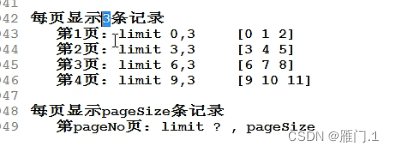

这里其实能看到一个规律就是limit num1,num2，其中`num1=（页码数-1）*每页记录数，`num2=每页记录数，即：`num1 = （页码数-1）*num2`。


### 3.3 创建（DDL）

#### 3.3.1 建表

**基本语法：**

```sql
create table 表名(
		字段名1 数据类型,
		字段名2 数据类型, 
		字段名3 数据类型,
		...);
```

常见的语法类型：

```sql
varchar：可变长度字符串，最长255，可以实际的数据长度动态分配空间，可节省资源。
   char：定长字符串，最长255，不管实际数据长度，直接分配固定指定空间存储数据，使用不恰当可能会导致空间浪费。
		 但是char相对于varchar效率更高，因为不必处理空间。
		 所以一般固定长度的都选char，例如：身份证号、性别等
    int：数字中的整型。
 bigint：数字中的长整型。
  float：单精度浮点型数据。
 double：双精度浮点型数据。
datatime：长日期类型。
   data：短日期类型。
   clob：字符大对象，超过255字符的都要用，最多可以存储4G的字符串，一般可以存储一些说明、文章。
   blob：二进制大对象，专门用来存储图片、声音、视频等媒体数据。往blob插入数据时需要IO流。
```

**案例：**

创建一个宿舍表room：（宿舍号r_id、人数num、姓名name、学号t_id）：

```sql
create table room(
			r_id varchar(10),
			num char(6),
			name varchar(10),
			t_id bigint);
```

对表的查询结果也可以快速建表：

```sql
create table 表2 as select * from 表1;
```


#### 3.3.2 约束

* 约束对应的英语单词: constraint
* 在创建表的时候，我们可以给表中的字段加上一些约束，来保证这个表中数据的完整性、有效性！
* 约束的作用就是为了保证:表中的数据有效！

约束包含：

* 非空约束: not null
* 唯一性约束: unique
* 主键约束: primary key(简称PK)
* 外键约束: foreign key (简称FK）
* 检查约束: check (mysql不支持，oracle支持）

##### 3.3.2.1 非空约束

非空约束约束的字段不能NULL。

**语法：**

```sql
create table 表名(
	字段名 数据类型 not null,
	...
	...);
# 案例
create table room(
			id bigint not null,
			name varchar(20) not null,
			sex char(10) not null);
```


##### 3.3.2.2 唯一性约束

唯一性约束unique约束的字段不能重复，但是可以为NULL。

* **单字段独立唯一性（列级约束）**
	* 建表时对某个字段进行约束，只会影响这一个字段。

```sql
create table room(
		id bigint unique,
		name varchar(20) not null,
		sex char(10) not null);
```


* **多字段联合唯一性（表级约束）**
	* 多字段联合唯一性即多个字段都内容都得一样才会报错。

```sql
create table person(
		id bigint unique,
		name varchar(255) ,
		email varchar(255),
		unique(id,name,email));
```


* **not null 和unique联合**

```sql
create table person(
		id bigint not null unique,
		name varchar(255)  unique,
		email varchar(255) unique);
```


##### 3.3.2.3 主键约束

* 主键约束（primary）:就是一种约束。
	* 主键字段:该字段上添加了主键约束，这样的字段叫做主键字段。
	* 主键值:主键字段中的每一个值都叫做:主键值。
* 什么是主键?有啥用?
	* 主键值是每一行记录的唯一标识。
	* 主键值是每一行记录的身份证号! ! !
	* 任何一张表都应该有主键，没有主键的表是无效的。

```sql
create table t_room(
		t_id bigint primary key, 
		t_name varchar(20) unique,
		t_sex char(10) unique);
```

* 当把primary key添加到字段后面是列级约束，把primary key添加到语句后面为表级约束

```sql
create table t_room(
		t_id bigint primary key, 
		t_name varchar(20) unique,
		t_sex char(10) unique,
		primary key(id,name)); 
```

* 列级约束和表级约束：

​		表级约束主要是给多个字段联合起来添加约束,一个字段做主键是单一主键，多个字段是复合主键，和unique的作用是一样的。

另外：

* 一张表，主键约束只能添加1个，主键只能有1个。

* 主键值建议使用:int、bigint、char等类型.

* 不建议使用: varchar来做主键。主键值一般都是数字，一般都是定长的。

​	

主键还可以进行：

* `自然主键`:主键值是一个自然数，和业务没关系。
* `业务主键`:主键值和业务紧密关联，例如拿银行卡账号做主键值。这就是业务主键!
	* 业务主键不好，因为主键一旦和业务挂钩，那么当业务发生变动的时候可能会影响到主键值，所以业务主键不建议使用。尽使用自然主键。


##### 3.3.3.4 auto_increment

在mysql中有一种机制可以自动维护一个主键值：`auto_increment.`

```sql
create table room3(
    -> id int primary key auto_increment,
    -> name varchar(255));
```

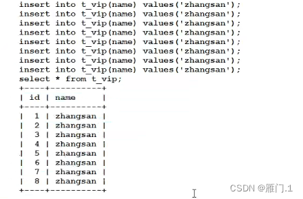

能看到当重复插入时，mysql会按照自增的方式从1开始，**以1递增，自动排号**。


##### 3.3.3.5 外键约束

* 外键约束:一种约束(foreign key)
	* 外键字段:该字段上添加了外键约束.
	* 外键值:外键字段当中的每一个值。
* **保证数据的参照完整性**：外键约束确保了一个表中的外键字段只能包含另一个表（被参照表）主键字段中存在的值。这有助于维护两个表之间数据的一致性。
* **级联更新和删除**：在数据库设计中，经常需要当一个表中的数据发生变化时（如更新或删除），另一个表中的数据也相应地进行更新或删除。外键约束支持级联操作，可以自动完成这些任务。
* **查询优化**：通过外键，数据库系统可以更高效地执行涉及多个表的查询操作，因为它知道哪些表是相互关联的。

```c++
删除表的顺序?
	先删子表，再删父表。
创建表的顺序?
	先创建父，再创建子。
删除数据的顺序?
	先删了子，再删父.
插入数据的顺序?
	先插入父，再插入子。
```

**案例：**

1. 建立班级表和学生表,两个表通过**班级号**对应起来。

```sql
# 班级表
 create table t_class(
     class_num int primary key, 	# 班级号
     class_name char(10) not null,	# 班级名称
     class_person int); 			# 班级人数
# 学生表
create table t_tudent(
    t_id int primary key auto_increment, 	# 学生学号
    t_name varchar(20) not null, 			# 学生姓名
    t_class int, 							# 学生所在班级号
    foreign key(t_class) references t_class(class_num));	# 外键约束语法，和班级表链接起来
```

2. 当对班级号进行约束之后插入数据：

```sql
mysql> insert into t_class values(1,'高一一班',30);
Query OK, 1 row affected (0.44 sec)

mysql> insert into t_class values(2,'高一二班',30);
Query OK, 1 row affected (0.40 sec)

mysql> insert into t_class values(3,'高一三班',30);
Query OK, 1 row affected (0.41 sec)
```

3. 但是向学生表中插入数据时便会报错：无法向子记录插入或更新，因为已经进行外键约束。

```sql
mysql> insert into t_tudent values(111,'爱过的吴京',1);
Query OK, 1 row affected (0.42 sec)

mysql> insert into t_tudent values(112,'爱国的吴京',6);
ERROR 1452 (23000): Cannot add or update a child row: a foreign key constraint fails (`test_wl`.`t_tudent`, CONSTRAINT `t_tudent_ibfk_1` FOREIGN KEY (`t_class`) REFERENCES `t_class` (`class_num`))
```

因为班级号为6的班级在班级表中并不存在，所以学生表中也无法进行插入，即保证数据的有效性。
这里需要注意的是：
**字表中的外键引用的不一定是父表中的主键，但是一定要有唯一性约束，不能重复。**


### 3.4 增删改（DML）

#### 3.4.1 增（insert）

基本语法：

```sql
insert into表名(字段名1,字段名2,字段名3) values(值1,值2,值3);
insert into 表名 values(值1,值2,值3);					# 表名里的字段也可以省略，但是后面的插入值便必须全部输入
```

次性插入多条语句：

```sql
insert into room3 values
		(541,3,'蒋文隆',2206210738),
		(541,3,'蒋文隆',2206210738);
```

可以将查询结果插入另一张表，**前提是表的字段名必须一致**，但是这种方式很少用：

```sql
insert into room2 select * from room;
```


* **default**:

除了这里进行对空表插入值，也可以在建表时对字段指定默认值(default)。

```sql
create table room2(
			r_id varchar(10),
			num char(6) default 6, # default指定默认值
			name varchar(10),
			t_id bigint);
```


* **format**:format数字格式化.

基本语法：

```sql
format(数字,'格式');
select ename,format(sal,'$999,999') as sal from emp;   #对薪水进行千分位显示.
```


**str_to_date**：将字符串转化为日期，即将字符串varchar类型转换为data类型。

语法格式：

```sql
str_to_date('字符串日期',日期格式);
```

先建一个表：

```sql
create table t_user(
    name varchar(20),
    id bigint,
    birth date,
    sex char(10));
# 插入
insert into t_user values('章健雄',2206210762,'1997-01-01',male);
```

这里的birth是date类型的，但传入的’1997-1-1’是字符串类型的，这里便可以进行**转化**：

mysql日期格式：

```sql
%Y 年
%m 月
%d 日
%h 时
%i 分
%s 秒
```

```sql
str_to_date('1997-01-01','%Y-%m-%d')
insert into t_user values(
						'章健雄',
						2206210762,
						str_to_date('1997-01-01','%Y-%m-%d'),
						'男');
```


* **data_format**：将日期转换为字符串，将data类型转换为具有一定格式的varchar类型。

**语法格式：**

```sql
data_format(日期类型数据,'日期格式')
```

mysql中查询也会**自动转换**：

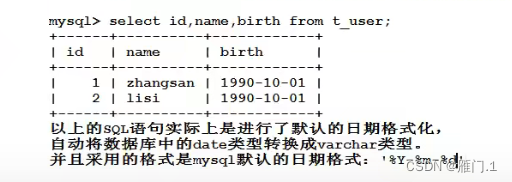

**案例：**

```sql
select name,id,date_format(birth,'%Y/%m/%d') as 'new birth' from t_user;
```

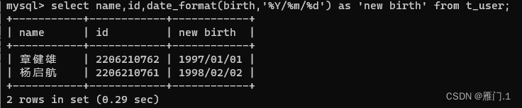


* **date和datetime的区别：**

	* `date`是短日期，只包含年月日。mysql默认短日期格式：`%Y-%m-%d`

	* `datetime`是长日期，包含年月日时分秒。mysql默认长日期格式：`%Y-%m-%d %h:%i:%s`

	* 那么在mysql当中怎么获取当前系统时间:`now()`函数，该函数获取的时间是`datetime`类型的。

	* 在使用时便直接可以用now()代替某一字段数据。例如：

```sql
insert into 表名 values(数据1,数据2,now());
```


#### 3.4.2 改（update）

语法格式：

```sql
update 
	表名 
set 
	字名1=值1,字段名2=值2,字段名3=值3...
where 
	条件
```

**注意:**没有条件限制会导致所有数据全部更新。

案例：将room3的name改为杨启航

```sql
update room3 set name = '杨启航' where id = 2206310838;
```


#### 3.4.3 删

* **delete**

	* 语法格式:这里注意delete删除数据，只会清除数据但是数据在硬盘的真实存储空间还在。

	* 优点：支持rollback，后面还可以在恢复数据。

	* 缺点：删除效率低。

```sql
delete from 表名 where 条件;
delete from rooms where id = 2206310838;
delete from 表名;			  # 整表删除
```

* **truncate**

	* 还有一种`快速删表`的方法：`truncate`(属于DDL语句)

	* 这种删除效率比较高，表被一次截断，物理删除。

	* 这种删除缺点:不支持回滚这种

	* 删除优点: 快速。

```sql
truncate table 表名;
```

* **drop**
	* 这里delete和truncate其实都是删除表中的数据，其实表的结构还在，只有当时用drop语句时才是真正的将表删除：

```sql
drop table 表名;
```


## 4 存储引擎

* 存储引擎是MysQ中特有的一个术语，其它数据库中没有。
* oracle中有，但是不叫这个名字。
* 实际上**存储引擎是一个表存储/组织数据的方式**。

* 不同的存储引擎，表存储数据的方式不同。

### 4.1 使用

案例：

首先展示创建表的语句

```sql
show create tbale 表名;
```

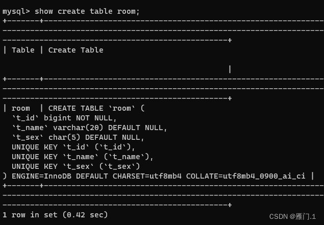

* 能看到最后的`ENGINE=InnoDB DEFAULT`（ENGINNE来指定存储引擎，mysql默认为InnoDB）
* `CHARSET=utf8mb4`，CHARSET来指定这张表的字符编码方式，mysql默认的字符编码方式是:utf8。

建表：

```sql
create table room(
		id int primary key,
		name varchar(10),
		num int)engine = InnoDB default charset=utf8/utf8mb4;
```

查看当前数据库支持那些存储引擎：support:YES 即表示支持。

```sql
show engines \G  # 没有分号
```

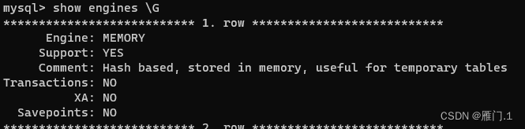


### 4.2 存储引擎

#### 4.2.1 MyISAM：

* MylSAM存储引擎是 MysQL 最常用的引擎，它管理的表具有以下特征:
	* 使用三个文件表示每个表:
		* 格式文件 - 存储表结构的定义 (mytable.frm)
		* 数据文件 - 存储表行的内容 (mytable.MYD)
		* 索引文件 - 存储表上索引 (mytable.MYI),索引可以缩小扫面范围，提高检索效率。
	* 灵活的 AUTO INCREMENT 字段处理
	* 可被转换为压缩、只读表来节省空间(优势)

对于一张表来说，只有是主键，或者加有unique约束的字段上会自动创建索引。


#### 4.2.2 InnoDB

* InnoDB 存储引擎是 MysQL 的缺省引擎，它管理的表具有下列主要特征:
	* 每个InnoDB 表在数据库目录中以.frm 格式文件表示InnoDB 表空间 tablespace 被用于存	储表的内容提供一组用来记录事务性活动的日志文件
	* 用 COMMIT(提交)、SAVEPOINT 及 ROLLBACK(回滚)支持事务处理
	* 提供全 ACID 兼容
	* 在 MySQL 服务器崩溃后提供自动恢复
	* 多版本(MVcc) 和行级锁定
	* 支持外键及引用的完整性，包括级联删除和更新

* nnoDB最大的特点就是支持事务:以保证数据的安全。效率不是很高，并且也不能压缩，不能转换为只读，不能很好的节省存储空间。


#### 4.2.3 MEMORY

* 使用 MEMORY 存储引擎的表，其数据存储在内存中，且行的长度固定，这两个特点使得 MEMORY 存储引警非常快。
* MEMORY 存储引警管理的表具有下列特征:
	* 在数据库目录内，每个表均以.frm 格式的文件表示
	* 表数据及索引被存储在内存中。(查询快)
	* 表级锁机制。
	* 不能包含 TEXT 或 BLOB 字段
	* MEMORY 存储引擎以前被称为 HEAP 引警

* 优点:查询效率是最高的MEMORY引擎
* 缺点:不安全，关机之后数据消失。因为数据和索引都是在内存当中。


* 选择合适的存储引擎
	* MyISAM 表最适合于大量的数据读而少量数据更新的混合操作。MyISAM 表的另一种适用情形是使用压缩的只读表。
	* 如果查询中包含较多的数据更新操作，应使用 InnoDB。其行级锁机制和多版本的支持为数据读取和更新的混合操作提供了良好的并发机制。
	* 可使用 MEMORY 存储引擎来存储非永久需要的数据，或者是能够从基于磁盘的表中重新生成的数据。


## 5 事务

### 5.1 概念

* 事务：就是一个完整的业务逻辑。
* 什么是一个完整的业务逻辑?
	* 假设转账，从A账户向B账户中转账10000
	* 将A账户的钱减去10000
	* 将B账户的钱加上10000，这就是一个完整的业务逻辑。
	* 以上的操作是一个最小的工作单元，要么同时成功，要么同时失败，不可再分。
* 这两个update语句要求必须同时成功或者同时失败，这样才能保证钱是正确的。

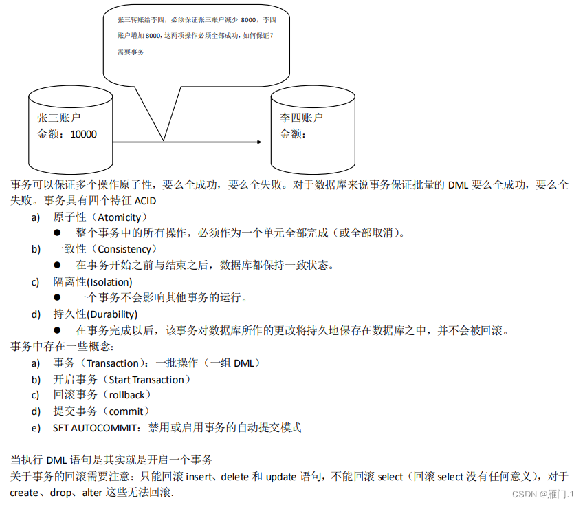

**事务是如何同时失败和成功的？**

* InnoDB存储引擎:提供一组用来记录事务性活动的日志文件

案例：假设这是一个事务

```sql
事务开启了:
insert
insert
insert
delete
update
update
update
事务结束了!
```

* 在事务的执行过程中，每一条DML的操作都会记录到“事务性活动的日志文件”中。
* 在事务的执行过程中，我们可以提交事务，也可以回滚事务。


### 5.2 相关语句

* 只有DML（insert、delete、update）语句才会有事务这一说，其它语句和事务无关!!!
* 只有以上的三个语句和事务有关系，其它都没有关系。因为 只有这三个语句是数据库表中数据进行增、删、改的。只要你的操作一旦涉及到数据的增、删、改，那么就一定要考虑安全问题。数据安全第一位!!!

#### 5.2.1 事务的提交回滚

* 将之前所有的DML操作全部撤销，并且清空事务性活动的日志文件。
* 回滚事务标志着，事务的结束。并且是一种全都失败的结束。

```sql
# 事务提交：
commit
# 事务回滚：
rollback
```

* **mysql默认情况下是支持自动提交事务的，而回滚只能回滚到上一次的提交点。**自动提交即每执行一条DML语句，则提交一次!

**案例：**

```sql
select * from room2;
delete from room2;
rollback;
select * from room2;
```

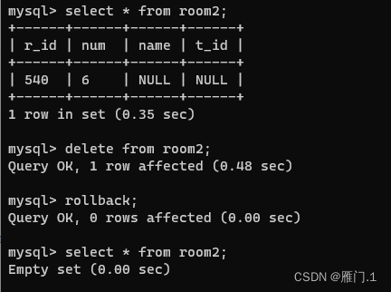

​         这里能看到明明已经进行了回滚，room2这张表中的数据仍然还是被delete了,这就是因为mysql中默认自动提交的，即delete之后便会自动进行一次提交，即这个事务已经进行提交并结束，所以rollback回滚不了。那么便需要开启事务，关闭原有的自动提交机制：

```sql
# 关闭自动提交机制，开启事务：
start transaction;
```

案例：

```sql
start transaction;
insert into room2 values(544,6,'wang',231);
rollback;
```

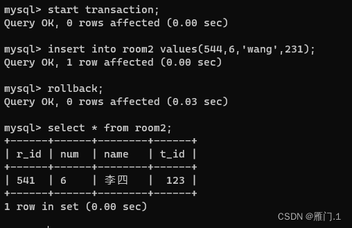

这里能看到插入被回滚了。

### 5.3 事务的四大特性（ACID）

* A：原子性:
	* 说明事务是最小的工作单元。不可再分。
* C:一致性:
	* 所有事务要求，在同一个事务当中，所有操作必须同时成功，或者同时失败，以保证数据的一致性。
* I:隔离性（**重点**）
	* A事务和B事务之间县有一定的隔离教室A和教室B之间有一道墙，这道墙就是隔离性。
	* A事务在操作一张表的时候，另一个事务B也操作这张表会那样?? ?
* D:持久性
	* 事务最终结束的一个保障。事务提交，就相当于将没有保存到硬盘上的数据保存到硬盘上!


#### 5.3.1 隔离的四个级别

```c++
（1）读未提交: read uncommitted（事务的最低隔离级别）《没有提交就读到了》
	什么是读未提交?
		事务A可以读取到事务B未提交的数据。
		这种隔离级别存在的问题就是:脏读现象! (Dirty Read)，我们称读到了脏数据。
		这种隔离级别一般都是理论上的，大多数的数据库隔离级别都是二档起步!
（2）读已提交: read committed《提交之后才能读到》
	什么是读已提交?
		事务A只能读取到事务B提交之后的数据。
	这种隔离级别解决了什么问题?
		解决了脏读的现象。
	这种隔离级别存在什么问题?
		不可重复读取数据。
		在事务开启之后，第一次读到的数据是3条，当前事务还没有结束，
		可能第二次再读取的时候，读到的数据是4条，3不等于4称为不可重复读取。
	这种隔离级别是比较真实的数据，每一次读到的数据是绝对的真实。
	oracle中默认的事务级别就是这个！！！！
（3）可重复读: repeatable read《提交之后也读不到，永远读取的都是刚开启事务时的数据》
	什么是可重复读取?
	事务A开启之后，不管是多久，每一次在事务A中读取到的数据都是一致的。
	即使事务B将数据已经修改，并且提交了，
	事务A读取到的数据还是没有发生改变，这就是可重复读。
	早晨9点开始开启了事务，只要事务不结束，到晚上9点，读到的数据还是那样!
	读到的是假象（备份或者快照），不够绝对的真实。
	mysql中默认的事务级别就是这个！！！！！
（4）序列化/串行化: serializable（事务的最高隔离级别）
	这是最高隔离级别，效率最低。解决了所有的问题。
	这种隔离级别表示事务排队，不能并发！
	在执行一个事务的同时，其他事务无法执行！
	synchronized，线程同步(事务同步)！
	每一次读取到的数据都是最真实的，并且效率是最低的。
```


**隔离级别查看：**

```sql
select @@transaction_isolation;
```

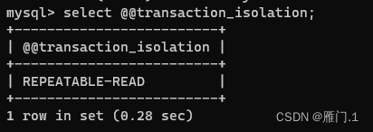

设置当前全局隔离级别为读未提交:

```sql
set global transaction isolation level read uncommitted;
                                        read committed; 	# 读已提交
                                        repeatable read; 	# 可重复读
                                        serializable; 		# 序列化
```

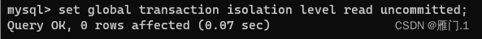

设置之后重新退出再次登录查询：能看到被更改为读未提交。

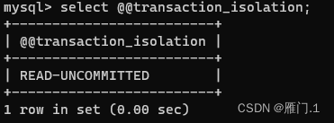

**测试(读未提交)**：打开两个终端窗口

```sql
第一个窗口：
1、进入数据库查询表，明显能看到是空表
	select  * from room;
2、关闭mysql默认提交事务
	start transaction;
第二个窗口：
1、关闭mysql默认提交事务
	start transaction;
2、对表进行插入，但不提交：
	insert into room values(123,'wang',561);
第一个窗口：
1、对表进行查询能发现其中有数据了：
	select  * from room;
```

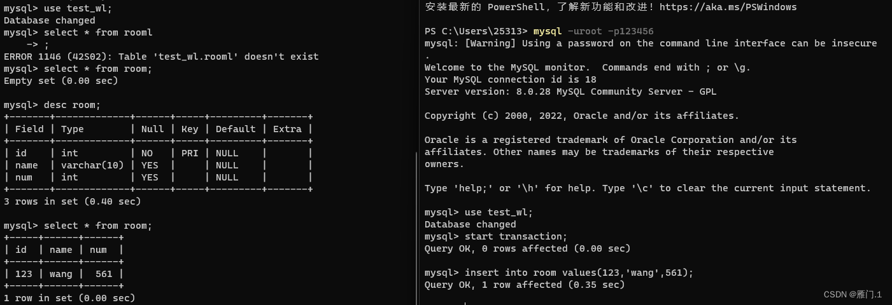

**测试（读已提交）：**

```sql
第一个窗口：
1、进入数据库查询表，明显能看到是空表
	select  * from room;
2、关闭mysql默认提交事务
	start transaction;
第二个窗口：
1、关闭mysql默认提交事务
	start transaction;
2、对表进行插入，但不提交：
	insert into room values(123,'wang',561);
第一个窗口：
1、对表进行查询，没有数据：
	select  * from room;
第二个窗口：
1、对insert进行提交
	commit;
第一个窗口
	1、对表进行查询：发现有数据了
	select * from room;
```

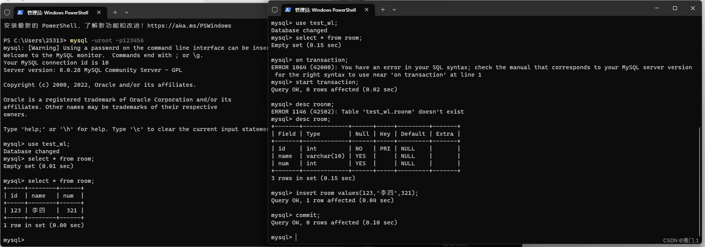

**测试（可重复读）：**

```sql
第一个窗口：
1、将隔离等级设置为可重复读：
	set global transaction isolation level repeatable read;
2、启动事务，关闭自动提交：
	start transaction;
3、查表有数据
	select * from room;
第二个窗口：
1、启动事务：
	start transaction;
2、删除表格：
	delete from room;
3、提交：
	commit;
第一个窗口：
1、再此进行查询：仍然有数据
	select * from room;
```

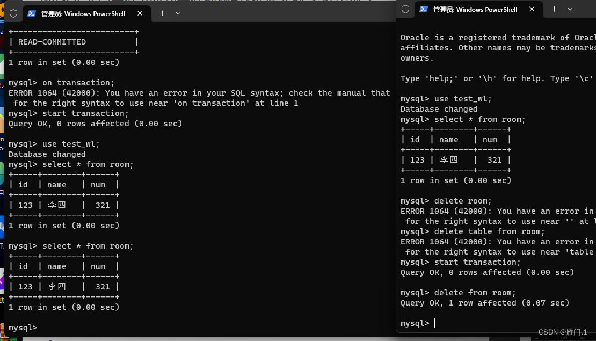

**测试（序列化）:**

```sql
第一个窗口：
1、将隔离级别设置成序列化：
	set global transaction isolation level serializable;
2、启动事务：
	start transaction;
3、插入数据
	insert room values(12,'你好',56);
第二个窗口：
1、启动事务：
	start transaction;
2、查询表，发现无法继续运行了，一直在光标闪动
	select * from room;
第一个窗口：
1、提交事务：提交完成后，第二个窗口自动输出查询结果
	commit;
```

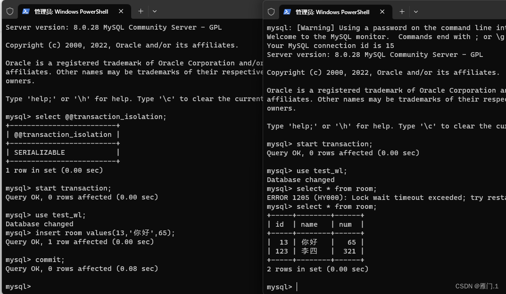


## 6 索引

### 6.1 基本概念

* 索引是在数据库表的字段上添加的，是为了提高查询效率存在的一种机制，一张表的一个字段可以添加一个索引，索引相当于一本书的目录，是为了缩小扫描范围而存在的一种机制。
* 当然，多个字段联合起来也可以添加索引。

对于一本字典来说，查找某个汉字有两种方式:

* ①一页一页挨着找，直到找到为止，这种查找方式属于全字典扫描第一种方式:效率比较低。
* ②第二种方式:先通过目录(索引) 去定位一个大概的位置，然后直接定位到这个位置，做局域性扫描，缩小扫描的范围，快速的查找。这种查找方式属于通过索引检索，效率较高。

如果查找某字段时，改字段上没有添加索引(目录)或者说没有给该字段创建索引，MysQL会进行全扫描，会将该字段上的每一个值都比对一遍。效率比较低

* MySQL在查询方面主要就是**两种方式:**
	* 第一种方式:**全表扫描**
	* 第二种方式:根据**索引检索**。例如给某一字段加上索引，那么只需进行区域扫描。

**注意:**

* 在实际中，汉语字典前面的目录是排序的，按照a b c d e f…排序，为什么排序呢?因为只有排序了才会有区间查找这一说! (缩小扫描范围其实就是扫描某个区间罢了!
* 在mysql数据库当中索引也是需要排序的，并且这个所以的排序和TreeSet数据结构相同。TreeSet (TreeMap)底层是一个**自平衡的二又树**!在mysql当中**索引是一个B-Tree数据结构**。
* **索引左小右大原则存放，采用中序遍历方式遍历数据**（先访问左子树，再访问根节点，再访问右子树）。


### 6.2 **索引分类**

索引是各种数据库进行优化的重要手段。优化的时候优先考的因素就是索引，索引在数据库当中的分类：

* **单一索引:**一个字段上添加索引。
* **复合索引:** 两个字段或者更多的字段上添加索引。
* **主键索引:**主键上添加索引。
* **唯一性索引:** 具有unique约束的字段上添加索引，但是索引效率不高（都唯一了还索引个p）


### 6.3 实现原理

* **提醒1：**在任何数据库当中主键上都会自动添加索引对象，另外在mysql当中，一个字段上如果有unique约束的话，也会自动创建索引对象。

* **提醒2**：在任何数据库中，任何一张表的任何一条记录在硬盘存储上都有一个硬盘的物理存储编号。

* **提醒3：**在mysql当中，索引是一个单独的对象，不同的存储引擎以不同的形式存在，

	* 在MyISAM存储引擎中，索引存储在一个`.MYI`文件中。

	* 在InnoDB存储引警中索引存储在一个逻辑名称叫做`tablespace`的当中。

	* 在MEMORY存储引擎当中索引被存储在`内存`当中。

不管索引存储在哪里，在**mysql中索引都是一个树的形式存在。**

索引的树形式（B-tree）：

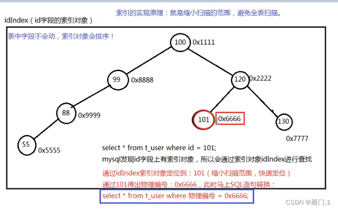

注意：**主键和unique字段上都会自动添加索引！**

什么条件下考虑对字段添加索引？

* 数据量庞大（根据硬件环境不同）
* 该字段经常出现在where后面，以条件的形式存在，也就是该字段经常被扫描
* 该字段很少的DML操作（因为DML之后，索引需要重新排序）


**创建索引**：

要给room表里的name字段加上索引：

```sql
create index 索引名称 on 表名(字段名);
create index room_name_index on room(name);
```

**删除索引**：

```sql
drop index 索引名称 on 表名;
drop index room_name_index on room;
```

**查看sql语句是否使用索引进行检索**：

```sql
explain select * from t_room where t_name = '吴京';
```

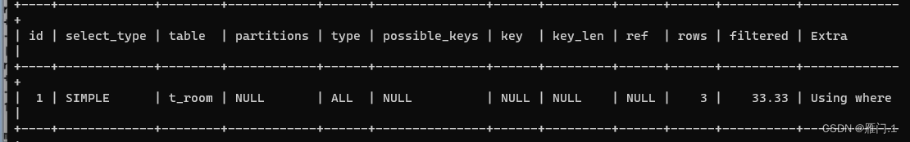

* `id`：查询的标识符，如果查询包含子查询或联合（UNION），则每个子查询或联合部分都会有一个唯一的ID。
* `select_type`：查询的类型，比如SIMPLE（简单SELECT，不使用UNION或子查询等）。
* `table`：被查询的表名。
* `partitions`：查询将访问的分区（如果表是分区表的话）。
* `type`：连接类型，对于单表查询，它通常表示如何查找行（比如ALL表示全表扫描，ref表示使用非唯一性索引或唯一性索引的前缀来查找单个匹配行）。
* `possible_keys`：显示可能应用在这张表上的索引，以便找到需要的行。
* `key`：**实际使用的索引。如果为NULL，则没有使用索引。**
* `key_len`：**使用的索引的长度**。在不是所有的索引列都被查询的情况下，这是决定性能的一个重要因素。
* `ref`：显示索引的哪一列或常量被用于查找值。
* `rows`：MySQL认为必须检查的用来返回请求数据的行数。
* `filtered`：表示返回结果的行占开始找到符合表条件的行的百分比。
* `Extra`：包含不适合在其他列中显示但对执行计划非常重要的额外信息。

添加了索引后：

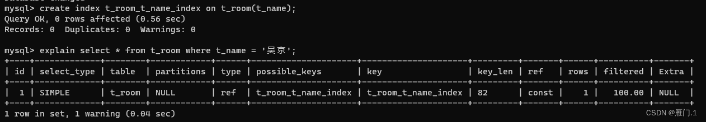


**index_merge:**

* 我们的 where 中可能有多个条件(或者join)涉及到多个字段，
	* 它们之间进行 AND 或者 OR，那么此时就有可能会使用到 index merge 技术。
* index merge 技术如果简单的说，其实就是：
	* 对多个索引分别进行条件扫描，然后将它们各自的结果进行合并(intersect/union)。


**索引的失效**：

* 模糊查询以%开头时

	```sql
	select * from t_room where t_name like '%T';
	```

	* 这里即使t_name加上索引，也不会走索引，因为走索引必须避免“%”开始！这是一种优化的手段/策略。当使用模糊查询且以百分号为开头，索引便会失效。

* 使用or的时候，要求or两边的字段必须都要有索引，才会走索引，如果有其中有一个字段没有字段，那么另一个字段索引也会失效。

* 使用复合索引的时候没有使用左侧的列查找，索引失效

	* 复合索引：两个字段或者更多的字段联合起来添加一个索引，叫做复合索引。

	```sql
	create index 索引名 on 表名(字段名1，字段名2);
	```

	* 那么查询时只有使用左边的字段名1查询才会用到索引，利用字段2查询便会失效。

* 当where当中的索引列参加了运算，索引失效。
* 在where当中索引列使用了函数。
* 类型转换时索引失效。


## 7 视图

### 7.1 概念

* view：视图即从不同的角度看待同一份数据。
* 我们可以面向视图对象进行增删改查，对视图对象的增删改查，会导致原表被操作!

* 注意：只有[DQL](https://so.csdn.net/so/search?q=DQL&spm=1001.2101.3001.7020)（查询）语句才能以view的形式创建。

### 7.2 操作

**创建视图**：

将一个表的查询结果当做视图

```sql
create view table_view as select * from table;
```

**创建视图对象：**

```sql
create view_table_view as select * from table_view;
```

**删除视图：**

```sql
drop view table_view;
```


## **8 DBA**

**新建用户：**

```sql
create user wanglei indentified by '123456';
```

**数据的导入导出**（数据备份）：导出,导出时不必要登录数据库，直接在终端窗口进行导入。

```sql
mysqldump -uroot 数据库名 > 存放位置\备份文件名.sql -uroot -p你的密码 
mysql dump test_wl>E:\test_wl.sql -uroot -p123456;
```

**导入**

```sql
source 文件路径/文件名
source E:\test_wl.sql
```

