# 1 MySQL的登录

*  以管理员的身份打开终端输入（win+x选中终端管理员）

```mysql
 mysql -uroot -p123456
```

* 不显示密码登录

```sql
 mysql -uroot -p
```

当输入完成进行回车（enter）出现下面的图片进行输入密码即可进入：


# 2 语句分类

* DQL：[数据库查询语句]（凡是带有select关键字的都是数据库查询语句）

```mysql
select…
```

* DML：数据库操作语言：（凡是对数据库中**表格的数据**进行操作的语句都是数据库操作语句）

```sql
insert（增）
delete（删）
update（改）
```

* DDL：数据定义语言（凡是带有create、drop、alter关键字的都是DDL。其主要对**表的结构**进行操作，例如增删改某一记录（行）或者某一字段（列））。

```sql
create（新建）
drop（删除）
alter（修改）
```

* TCL:事务控制语言

```sql
commit（事务提交）
rollback（事务回滚）
```

* DCL：数据控制语言

```sql
grant（授权）
revoke（撤销权限）
```

* 其他语句：

```sql
select version();  	#（查看MySQL版本号）
select database();	#（查看当前在使用那个数据库）
```

注意，在输入语句时，mysql不见分号不执行，必须由分号结束语句才会执行，当然也可以输入\c来终止输入：

# 3 常用语句

## 3.1 导入数据

* 导入sql文件，当出现query ok，及导入成功。

```sql
source 文件路径  #注意，这个指令不加分号
```

* 查看数据库

```sql
show databases;
```

* 使用数据库

```sql
 use 数据库名称;
```

* 创建数据库

```sql
 create database 数据库名称;
```


## 3.2 查询（DQL）

### 3.2.1 简单查询

* 查看表数据：

```sql
select 
	*
from 
	表名;
```

* 查看表的结构：

```sql
desc 表名;
```

* 从表中只查询一个字段：

```sql
select 
	字段名 
from 
	表名;
```

* 查询两个字段或者多个字段,只需用逗号隔开字段名：

```sql
select 
	字段名1,字段名2 
from 
	表名;
```

* 给列名取别名：数据库只是在显示时用这个别名，但是在数据库中还是原来的名字，select语句只是查询语句。而且别名中不能有空格，当你想加空格或者其中文名时应该给别名加单引号或者双引号，但是双引号在mysql中可以使用，Oracle中是无法使用的：

```sql
select 
	字段名 as 别名  # 字段名 as '字段名'
from 
	表名;
```

* 对某一字段的运算：

```sqlite
select 
	字段名*10
from 
	表名;
```


​	

### 3.2.2 条件查询

条件查询语法格式：

```sql
select
	字段名
from
	表名
where
	条件;
order by 
	字段名 [ASC|DESC];   # 升序/降序
```

常用运算符：

|        运算符         |                   描述                   |                        示例                        |
| :-------------------: | :--------------------------------------: | :------------------------------------------------: |
|          `=`          |                   等于                   |               `WHERE column = value`               |
|     `<>` 或 `!=`      |                  不等于                  | `WHERE column <> value` 或 `WHERE column != value` |
|          `>`          |                   大于                   |               `WHERE column > value`               |
|          `<`          |                   小于                   |               `WHERE column < value`               |
|         `>=`          |                 大于等于                 |              `WHERE column >= value`               |
|         `<=`          |                 小于等于                 |              `WHERE column <= value`               |
| `BETWEEN ... AND ...` |       在两个值之间（包含这两个值）       |      `WHERE column BETWEEN value1 AND value2`      |
|         `IN`          |               在一系列值中               |      `WHERE column IN (value1, value2, ...)`       |
|        `LIKE`         | 模糊匹配（通常与通配符`%`或`_`一起使用） |           `WHERE column LIKE 'pattern%'`           |
|       `IS NULL`       |              检查是否为NULL              |               `WHERE column IS NULL`               |
|     `IS NOT NULL`     |             检查是否不为NULL             |             `WHERE column IS NOT NULL`             |
|         `AND`         |       逻辑与（所有条件都必须为真）       |         `WHERE condition1 AND condition2`          |
|         `OR`          |      逻辑或（至少一个条件必须为真）      |          `WHERE condition1 OR condition2`          |
|         `NOT`         |         逻辑非（反转条件的结果）         |               `WHERE NOT condition`                |

* `>`：查询citymessage表中人数大于10000的名称和id

```sql
select 
	title,id 
from 
	citymessage 
where 
	num>10000：
```

* `between and`：查询citymessage表中人数介于8000和20000的名称和id、way

```sql
select * from citymessage where num between 8000 and 20000;
select * from citymessage where num>=8000 and num <= 20000;
```

* `null`：在对null进行查询时要注意使用is null 不能使用‘=’符号：

```sql
 select 字段名 from 表名 where is null;
```

* `and和or同时出现`：查询id为47,48然后人数大于2000的数据（and优先级比or高）

```sql
select * from citymessage where num>2000 and (id=47 or id=48);
```

* `in与not in`：in其实相当于多个or,例如当我们想查询id为44,45,46的数据可以这样写：

```sql
select * from citymessage where id in (44,45,46);
```

not in 便表示不在in的几个数据的其他数据。

```sql
select * from citymessage where id not in (44,45,46);
```

* `like`：模糊查询：like（配合%和_）

```sql
select * from citymessage where title like '%甘肃%';
```


如果一定要找到第二个字是肃的数据，可以这样写：

```sql
select * from citymessage where title like '_肃%';
```


当你想找到字符里面有下划线(_)的，一定要**先转义**再查询：

```sql
select * from 表名 where 字段名 like '%\_%';
```


### 3.2.3 排序

排序总在最后执行。

* 默认排序（升序）

```sql
select * from 表名 order by 字段名;
```

* 指定降序：

```sql
select * from 表名 order by 字段名 desc;
```

* 多段排序：先把id按照升序进行排列，当id一样的情况下，在对num进行升序排列。

```sql
select * from citymessage order by id asc,num asc;
```

* 综合应用：在表citymessage中找出num在2000和8000之间，且id按照降序排列的数据：

```sql
select 
	* 
from 
	citymessage
where 
	num between 2000 and 8000 
order by 
	id desc;
```


### 3.2.4 数据处理

#### 3.2.4.1 单行处理函数

* `substr `取子串：

```sql
substr(被截取的字符串的字段名,起始下标,截取长度))；		# 这里注意起始下标从1开始，不能从0开始
select 
	substr(title,1,5) as '别名' 
from 
	citymessage;
```


​	当然还可以与模糊查询一起用，比如现在要查询前两个字是甘肃的title：

```sql
select * from citymessage where title like '甘肃%';
select * from citymessage where substr(title,1,2) = '甘肃';
```

* `concat`：拼接字符串

```sql
select concat(title,num) from citymessage;
```

单纯的加减运算字符还是±。

* `length`：取长度

```sql
select length(title) from citymessage;
```

* `lower、upper`（转换小写、转换大写）

```sql
select lower/upper (字段名) from 表名;
select lower(title) from citymessage; 
select upper(title) from citymessage;
```

concat、length、substr、supper几者合用:比如当我们希望某一字段的所有字符串首字母大写(upper)：

```sql
select 
	concat(upper(substr(title,1,1)),substr(title,2,length(title)-1))
from 
	citymessage;
```

* `trim`:去空格

```sql
select 
	* 
from 
	citymessage 
where 
	id = trim(45);
```

* `round`:四舍五入。除了0以外，正数便是保留几位小数，0即保留到整数。负数便是保留到几分位，如-1是十分位，-2是百分位。保留规则均是四舍五入。

```sql
select
	round(title,0) 
from 
	citymessage;
```

* `rand`：生成随机数（<1的随机数）

```sql
select 
	rand() 
from 
	citymessage;
# 生成100以内，且保留整数的随机数
select 
	round(rand()*100) 
from 
	citymessage;
```

* `infull`：专门处理null的数据，可以将null转换为具体数值。会将null当做具体的0，否则在数据库中的运算但凡有null参与，结果都为null。

```sql
select 
	ifnull(id,0) 
from 
	citymessage;
```

* case… when … then… when…then… else … end;

id为45时num上涨10%，当id为50时num上涨50%,其他num正常。

```sql
select
	*,case id when 45 then num*1.1 when 50 then num*1.5 else num end
from
	citymessage;
```


#### 3.2.4.2 多行处理函数

多行函数在使用时：

* 必须先进行分组在进行计算。没有分组则计算整张表。
* 分组函数自动处理null，不需提前对null进行处理。
* count(字段名)统计的是改字段下所有不为null的字符串个数，count(*)统计该表总行数。

`count`：计数

```sql
select count(id) from citymessage;
select count(*) from citymessage;
```

`max`：最大值

```sql
select max(id) from citymessage;
```

`min`：最小值

```sql
select min(id) from citymessage;
```

`avg`：平均值

```sql
select avg(id) from citymessage;
```

`sum`：求和

```sql
select sum(id) from citymessage;
```


### 3.2.5 分组查询(group by)

分组查询一定要**先对表进行分组，再进行查询**，所以分组函数也不能直接使用在where后面。
查询指令编写顺序：

```sql
select->from ->where ->group by -> order by
```

指令执行顺序：

```sql
from->where ->group by ->select -> order by
```

* `group by`:

比如我查询一下，**每种工作的工资和，并且找到其中最高的工资**：但是这里需要注意的是，在分组后，select后面只能加上分组字段和数据操作函数,不能添加其他字段,否则mysql中可能会输出一个错误的结果，但是Oracle中会直接报错。

```sql
select 
	job,sum(salary)		# 不能再添加其他字段
from 
	表名
group by
	job
order by
	asc;
```

当需要查询**某个部门某个工作岗位的最高工资**时，你会发现这里需要分组两次，其实这里可以直接将两个查询直接放在一起：

```sql
select
	部门,岗位,max(工资)
from
	表名
group by
	部门,岗位;
```

* `having`(必须与group by连用)

查询**某个部门的最高工资，且工资必须大于5000的**

```sql
select
	部门,max(工资)
from
	表名
where
	工资>5000
group by
	部门;
```

使用having进行再此筛选可以这样写:

```sql
select
	部门,max(工资)
from
	表名
group by
	部门
having 
	max(工资)>5000;
```

**优化策略**：优选选择where。

* `去除重复记录`

这里要注意的是当有个字段名出现时，去除重复记录时属于联合去除，也就是将两个字段的数据结合起来，**去除其中都在各自字段属于重复的数据。**

```sql
select 
	distinct 字段名,字段名...
from 
	表名;
```

比如我要**统计工作岗位的种类的数量，那么就要先去除重复岗位数据，每种只保留一个，在进行计数**：

```sql
select 
	count(distinct 岗位)
from 
	表名; 
```


### 3.2.6 连接查询

连接查询即跨越多张表查询数据。

**表的连接方式：**

1. 内连接：
	* 等值连接
	* 非等值连接
	* 自连接
2. 外连接：
	* 左外连接			
	* 右外连接

3. 全连接


#### 3.2.6.1 笛卡尔积现象：

* 当两张[表连接](https://so.csdn.net/so/search?q=表连接&spm=1001.2101.3001.7020)时没有任何条件限制会发生`笛卡尔积现象`,即两个不同表中的不同字段数据会进行一对一匹配，最终生成字段1×字段2数量的数据。

```
select 字段名,字段名 from 表名,表名;
```

为了避免笛卡尔积现象，连接时必须加条件：

```sql
select
	字段名,字段名
from
	表1，表2
where 
	表1.字段 = 表2.字段;
```

**查询每个员工对应的部门名称**。这里能看到第一张表每个员工（ename）有个部门编号（deptno），第二张表每个部门编号（deptno）对应一个部门名称（dname）。

```sql
select 
	ename,dname
from 
	emp,dept
where
	emp.deptno = dept.deptno;
```


#### 3.2.6.2 内连接（等值连接）

* **等值连接**（条件为等量关系）：`inner join … on …`

* `INNER JOIN` 是一种用于结合来自两个或多个表中的行的操作。当两个表中存在至少一个匹配的行时，`INNER JOIN` 会返回这些匹配的行。如果表之间有至少一个匹配，则返回结果集；如果没有匹配，则不会返回任何行。

基本语法：

```sql
SELECT columns  
FROM table1  
INNER JOIN table2  
ON table1.common_field = table2.common_field;
```

**查询每个员工所在的部门名称**，显示员工名（ename）和部门名（dname）

```sql
select 
	e.ename,d.dname
from 
	emp e,dept d
where
	e.deptno = d.deptno;
```

利用等值连接可以这样写：

```sql
select 
	e.ename,d.name
from 
	emp e
inner join
	dept d
on
	e.deptno = d.deptno;
```


#### 3.2.6.3 非等值连接

基础语法：

```sql
SELECT 表1.字段1, 表2.字段2, ...  
FROM 表1  
JOIN 表2  
ON 表1.字段 操作符 表2.字段;
```

其中，`操作符`可以是`<`、`>`、`<=`、`>=`、`<>`等比较运算符。

**示例：**

假设我们有两个表：`orders`（订单表）和`shipping_rates`（运费表）。我们想要**根据订单金额找到对应的运费区间**。

`orders`表结构：

| order_id | amount |
| -------- | ------ |
| 1        | 50.00  |
| 2        | 75.00  |
| 3        | 200.00 |

`shipping_rates`表结构：

| rate_id | amount_min | amount_max | rate  |
| ------- | ---------- | ---------- | ----- |
| 1       | 0.00       | 99.99      | 5.00  |
| 2       | 100.00     | 199.99     | 10.00 |
| 3       | 200.00     | 299.99     | 15.00 |

```sql
SELECT o.order_id, o.amount, sr.rate  
FROM orders o  
JOIN shipping_rates sr  
ON o.amount >= sr.amount_min AND o.amount <= sr.amount_max;
ON o.amount between sr.amount_min AND sr.amount_max;
```


#### 3.2.6.4 自连接

* 表与其自身进行连接操作。在自连接中，一个表在查询中被视为两个不同的表，并通过它们之间的共同属性（通常是主键或外键）来连接

**基本语法：**

```sql
SELECT a.column1, b.column2  
FROM table_name a  
JOIN table_name b  
ON a.common_field = b.related_field;
```

**案例：**

假设我们有一个名为 `employees` 的表，它包含员工的ID、姓名以及他们经理的ID（这里假设经理也是员工表中的一条记录）。

| employee_id | name    | manager_id |
| ----------- | ------- | ---------- |
| 1           | Alice   | NULL       |
| 2           | Bob     | 1          |
| 3           | Charlie | 1          |
| 4           | David   | 2          |

如果我们想要**查询每个员工及其经理的姓名**，我们可以使用自连接：

```sql
select 
	e.name as employee_name, m.name as manager_name  
from 
	employees e  
left join 
	employees m 
on 
	e.manager_id = m.employee_id;
```

在这个查询中，`employees` 表被当作两个表来处理：`e`（代表员工）和 `m`（代表经理）。通过 `e.manager_id = m.employee_id` 这个连接条件，我们能够将每个员工与其对应的经理关联起来。注意，这里使用了 `LEFT JOIN` 来确保即使某个员工没有经理（即 `manager_id` 为 `NULL`），该员工的信息也会出现在结果集中，但其经理的姓名将显示为 `NULL`。


#### 3.2.6.5 外连接

外连接（Outer Join）是SQL中用于查询两个或多个表时的一种连接方式，它允许查询结果中包含那些在连接条件中没有匹配的行。外连接主要分为三种类型：左外连接（Left Outer Join）、右外连接（Right Outer Join）和全外连接（Full Outer Join）。这些连接类型在SQL查询中用于满足不同的数据检索需求。

**左外连接**：

* 左外连接以左表（LEFT JOIN左侧的表）为基础，返回左表中的所有行。如果左表中的行在右表中有匹配的行，则返回这些匹配的行；如果左表中的行在右表中没有匹配的行，则结果中右表的部分将包含NULL值。

```sql
SELECT 
	a.*, b.*  
FROM 
	table1 a  
LEFT JOIN 
	table2 b 
ON 
	a.id = b.a_id;
```

在这个示例中，即使`table2`中没有与`table1`中某些`id`相匹配的`a_id`，这些`table1`中的行仍然会出现在查询结果中，而对应的`table2`的列将包含NULL值。


**右外连接（Right Outer Join）**

* 右外连接与左外连接相反，它以右表（RIGHT JOIN右侧的表）为基础，返回右表中的所有行。如果右表中的行在左表中有匹配的行，则返回这些匹配的行；如果右表中的行在左表中没有匹配的行，则结果中左表的部分将包含NULL值。

```sql
SELECT 
	a.*, b.*  
FROM 
	table1 a  
RIGHT JOIN 
	table2 b 
ON 
	a.id = b.a_id;
```

在这个示例中，即使`table1`中没有与`table2`中某些`a_id`相匹配的`id`，这些`table2`中的行仍然会出现在查询结果中，而对应的`table1`的列将包含NULL值。


**全外连接**：

全外连接返回左表和右表中的所有行。当左表中的行在右表中没有匹配时，结果中右表的部分将包含NULL值；同样，当右表中的行在左表中没有匹配时，结果中左表的部分也将包含NULL值。需要注意的是，并非所有的数据库系统都直接支持全外连接（如MySQL，但在较新版本中可能通过UNION操作符实现类似效果）。

```sql
SELECT 
	a.*, b.*  
FROM 
	table1 a  
FULL OUTER JOIN 
	table2 b 
ON 
	a.id = b.a_id;
```

在这个示例中，无论是`table1`还是`table2`中的行，即使它们之间没有匹配，也会出现在查询结果中，不足的部分将用NULL值填充。


#### 3.2.6.6 多表查询应用

基础语法：

```sql
select 
  ...
from
	表a
join 
	表b
on
	表a和表b的连接条件
join
	表c
on
	表a和表c的连接条件
...
```

**数据库设计：**

1. Employees（员工表）
	* EmployeeID (员工ID, 主键)
	* EmployeeName (员工名)
	* DepartmentID (部门ID, 外键)
	* Salary (薪资)
2. Departments（部门表）
	* DepamentID (部门ID, 主键)
	* DepartmentName (部门名)
3. SalaryGrades（薪资等级表）
	* GradeID (薪资等级ID, 主键)
	* MinimumSalary (最低薪资)
	* MaximumSalary (最高薪资)
	* GradeName (薪资等级名)

**SQL查询**：

要**找出每个员工的部门名称以及工资等级，并显示员工名、部门名、薪资、薪资等级**，我们需要使用`JOIN`操作来连接这三个表。具体地，我们可以首先连接`Employees`和`Departments`表来找出每个员工的部门名称，然后再将结果与`SalaryGrades`表连接来找出每个员工的薪资等级。

```sql
SELECT   
    E.EmployeeName,  
    D.DepartmentName,  
    E.Salary,  
    SG.GradeName  
FROM   
    Employees E  
JOIN   
    Departments D ON E.DepartmentID = D.DepartmentID  
JOIN   
    SalaryGrades SG ON E.Salary BETWEEN SG.MinimumSalary AND SG.MaximumSalary;
```


### 3.2.7 子查询

子查询即对select的嵌套：

```sql
select 
	..(selrct)
from
	..(select)
where
	..(select)
```

* where中的子查询

**找出比最低工资高的员工姓名和编号**：

```sql
select 
	ename,empno
from
	emp
where
	select sal>(select min(sal) from emp);
	//sal>min(sal);  //这里是错误的注意多行处理函数只能在select中出现
```

* from中的子查询
 * rom中的子查询，可以将其查询结果当做一张临时表。

**找出每个岗位的平均薪资的工资等级：**

首先第一步：按照工作岗位分组查询每个岗位的平均工资。

```sql
select
	job,avg(sal)
from 
	emp
group by
	job;
```

把上面的查询结果当做一张表来进行多表查询其平均工资等级。

```sql
select
	s.grade,t.*
from 
	(select
		job,avg(sal) as avgsal  # 这里必须给avg(sal)起别名
	from 
			emp
	group by
			job;)  t
join 
	salgrade
on
	t.avgsal between s.losal and hisal;
	# 不起别名，avg带上括号会被认为是函数，但是函数又必须在select后面。
	# t.avg(sal) between s.losal and hisal; 
```


### 3.2.8 **union**合并查询结果

查询工资等于800和1k的员工名：

```sql
select
	ename
from
	emp
where 
	sal=800 or sal = 1000;
```

那么用union可以这样写：

```sql
select ename from emp where sal=800 
union
select ename from emp where sal = 1000;
```


### **3.2.9** limit 取有限数据

**limit会将查询集的一部分取出，经常用于`分页查询`中。在mysql当中limit在order by之后执行。**

**基本语法：**

```sql
SELECT column1, column2, ...  
FROM table_name  
WHERE condition  
LIMIT number;
```

**案例：**

**按照降序查询前五个id的num**：

```sql
select 
	num,id
from 
	citymessage;
order by 
	desc
limit
	5;
	# 一个数字：取前五
	# 0,5; # 两个数字是：0表示起始位置，5表示所取数据的长度
```

这里需要**注意**，limit num1,num2;这里取值和数组类似。
num1从0开始，num2取得时候前后都要算，例如我要取`[5,9]`之间的数据，那么num1从0开始算第五条数据应该是4，而5,6,7,8,9刚好五个数字，所以应该是：`limit 4,5`


### 3.2.10 分页

当你想要实现分页功能时，`LIMIT`子句经常与`OFFSET`子句一起使用。`OFFSET`子句指定在开始返回记录之前要跳过的记录数。

案例：


这里其实能看到一个规律就是limit num1,num2，其中`num1=（页码数-1）*每页记录数，`num2=每页记录数，即：`num1 = （页码数-1）*num2`。


### 3.3 创建（DDL）

#### 3.3.1 建表

**基本语法：**

```sql
create table 表名(
		字段名1 数据类型,
		字段名2 数据类型, 
		字段名3 数据类型,
		...);
```

常见的语法类型：

```sql
varchar：可变长度字符串，最长255，可以实际的数据长度动态分配空间，可节省资源。
   char：定长字符串，最长255，不管实际数据长度，直接分配固定指定空间存储数据，使用不恰当可能会导致空间浪费。
		 但是char相对于varchar效率更高，因为不必处理空间。
		 所以一般固定长度的都选char，例如：身份证号、性别等
    int：数字中的整型。
 bigint：数字中的长整型。
  float：单精度浮点型数据。
 double：双精度浮点型数据。
datatime：长日期类型。
   data：短日期类型。
   clob：字符大对象，超过255字符的都要用，最多可以存储4G的字符串，一般可以存储一些说明、文章。
   blob：二进制大对象，专门用来存储图片、声音、视频等媒体数据。往blob插入数据时需要IO流。
```

**案例：**

创建一个宿舍表room：（宿舍号r_id、人数num、姓名name、学号t_id）：

```sql
create table room(
			r_id varchar(10),
			num char(6),
			name varchar(10),
			t_id bigint);
```

对表的查询结果也可以快速建表：

```sql
create table 表2 as select * from 表1;
```


#### 3.3.2 约束

* 约束对应的英语单词: constraint
* 在创建表的时候，我们可以给表中的字段加上一些约束，来保证这个表中数据的完整性、有效性！
* 约束的作用就是为了保证:表中的数据有效！

约束包含：

* 非空约束: not null
* 唯一性约束: unique
* 主键约束: primary key(简称PK)
* 外键约束: foreign key (简称FK）
* 检查约束: check (mysql不支持，oracle支持）

##### 3.3.2.1 非空约束

非空约束约束的字段不能NULL。

**语法：**

```sql
create table 表名(
	字段名 数据类型 not null,
	...
	...);
# 案例
create table room(
			id bigint not null,
			name varchar(20) not null,
			sex char(10) not null);
```


##### 3.3.2.2 唯一性约束

唯一性约束unique约束的字段不能重复，但是可以为NULL。

* **单字段独立唯一性（列级约束）**
 * 建表时对某个字段进行约束，只会影响这一个字段。

```sql
create table room(
		id bigint unique,
		name varchar(20) not null,
		sex char(10) not null);
```


* **多字段联合唯一性（表级约束）**
 * 多字段联合唯一性即多个字段都内容都得一样才会报错。

```sql
create table person(
		id bigint unique,
		name varchar(255) ,
		email varchar(255),
		unique(id,name,email));
```


* **not null 和unique联合**

```sql
create table person(
		id bigint not null unique,
		name varchar(255)  unique,
		email varchar(255) unique);
```


##### 3.3.2.3 主键约束

* 主键约束（primary）:就是一种约束。
 * 主键字段:该字段上添加了主键约束，这样的字段叫做主键字段。
	* 主键值:主键字段中的每一个值都叫做:主键值。
* 什么是主键?有啥用?
 * 主键值是每一行记录的唯一标识。
	* 主键值是每一行记录的身份证号! ! !
	* 任何一张表都应该有主键，没有主键的表是无效的。

```sql
create table t_room(
		t_id bigint primary key, 
		t_name varchar(20) unique,
		t_sex char(10) unique);
```

* 当把primary key添加到字段后面是列级约束，把primary key添加到语句后面为表级约束

```sql
create table t_room(
		t_id bigint primary key, 
		t_name varchar(20) unique,
		t_sex char(10) unique,
		primary key(id,name)); 
```

* 列级约束和表级约束：

​		表级约束主要是给多个字段联合起来添加约束,一个字段做主键是单一主键，多个字段是复合主键，和unique的作用是一样的。

另外：

* 一张表，主键约束只能添加1个，主键只能有1个。

* 主键值建议使用:int、bigint、char等类型.

* 不建议使用: varchar来做主键。主键值一般都是数字，一般都是定长的。

​	

主键还可以进行：

* `自然主键`:主键值是一个自然数，和业务没关系。
* `业务主键`:主键值和业务紧密关联，例如拿银行卡账号做主键值。这就是业务主键!
 * 业务主键不好，因为主键一旦和业务挂钩，那么当业务发生变动的时候可能会影响到主键值，所以业务主键不建议使用。尽使用自然主键。


##### 3.3.3.4 auto_increment

在mysql中有一种机制可以自动维护一个主键值：`auto_increment.`

```sql
create table room3(
    -> id int primary key auto_increment,
    -> name varchar(255));
```


能看到当重复插入时，mysql会按照自增的方式从1开始，**以1递增，自动排号**。


##### 3.3.3.5 外键约束

* 外键约束:一种约束(foreign key)
 * 外键字段:该字段上添加了外键约束.
	* 外键值:外键字段当中的每一个值。
* **保证数据的参照完整性**：外键约束确保了一个表中的外键字段只能包含另一个表（被参照表）主键字段中存在的值。这有助于维护两个表之间数据的一致性。
* **级联更新和删除**：在数据库设计中，经常需要当一个表中的数据发生变化时（如更新或删除），另一个表中的数据也相应地进行更新或删除。外键约束支持级联操作，可以自动完成这些任务。
* **查询优化**：通过外键，数据库系统可以更高效地执行涉及多个表的查询操作，因为它知道哪些表是相互关联的。

```c++
删除表的顺序?
	先删子表，再删父表。
创建表的顺序?
	先创建父，再创建子。
删除数据的顺序?
	先删了子，再删父.
插入数据的顺序?
	先插入父，再插入子。
```

**案例：**

1. 建立班级表和学生表,两个表通过**班级号**对应起来。

```sql
# 班级表
 create table t_class(
     class_num int primary key, 	# 班级号
     class_name char(10) not null,	# 班级名称
     class_person int); 			# 班级人数
# 学生表
create table t_tudent(
    t_id int primary key auto_increment, 	# 学生学号
    t_name varchar(20) not null, 			# 学生姓名
    t_class int, 							# 学生所在班级号
    foreign key(t_class) references t_class(class_num));	# 外键约束语法，和班级表链接起来
```

2. 当对班级号进行约束之后插入数据：

```sql
mysql> insert into t_class values(1,'高一一班',30);
Query OK, 1 row affected (0.44 sec)

mysql> insert into t_class values(2,'高一二班',30);
Query OK, 1 row affected (0.40 sec)

mysql> insert into t_class values(3,'高一三班',30);
Query OK, 1 row affected (0.41 sec)
```

3. 但是向学生表中插入数据时便会报错：无法向子记录插入或更新，因为已经进行外键约束。

```sql
mysql> insert into t_tudent values(111,'爱过的吴京',1);
Query OK, 1 row affected (0.42 sec)

mysql> insert into t_tudent values(112,'爱国的吴京',6);
ERROR 1452 (23000): Cannot add or update a child row: a foreign key constraint fails (`test_wl`.`t_tudent`, CONSTRAINT `t_tudent_ibfk_1` FOREIGN KEY (`t_class`) REFERENCES `t_class` (`class_num`))
```

因为班级号为6的班级在班级表中并不存在，所以学生表中也无法进行插入，即保证数据的有效性。
这里需要注意的是：
**字表中的外键引用的不一定是父表中的主键，但是一定要有唯一性约束，不能重复。**


### 3.4 增删改（DML）

**DML语句涉及的内存及磁盘操作：**

**数据存储**：数据库中的数据最终存储在磁盘上。DML语句的执行结果（如插入、更新或删除的数据）需要被持久化到磁盘上，以确保数据的持久性和可靠性。

**日志记录**：在执行DML语句时，DBMS会记录相关的日志信息，如redo日志（用于记录数据变更操作，以便在系统崩溃后恢复数据）和undo日志（用于记录事务的撤销信息，以便在事务回滚时撤销之前的操作）。这些日志信息通常存储在磁盘上的日志文件中。

**索引维护**：DML语句的执行可能会影响到数据库中的索引。例如，插入新数据可能需要更新索引，删除数据可能需要从索引中移除相应的条目。索引的更新也会涉及到磁盘I/O操作。

#### 3.4.1 增（insert）

基本语法：

```sql
insert into表名(字段名1,字段名2,字段名3) values(值1,值2,值3);
insert into 表名 values(值1,值2,值3);					# 表名里的字段也可以省略，但是后面的插入值便必须全部输入
```

次性插入多条语句：

```sql
insert into room3 values
		(541,3,'蒋文隆',2206210738),
		(541,3,'蒋文隆',2206210738);
```

可以将查询结果插入另一张表，**前提是表的字段名必须一致**，但是这种方式很少用：

```sql
insert into room2 select * from room;
```


* **default**:

除了这里进行对空表插入值，也可以在建表时对字段指定默认值(default)。

```sql
create table room2(
			r_id varchar(10),
			num char(6) default 6, # default指定默认值
			name varchar(10),
			t_id bigint);
```


* **format**:format数字格式化.

基本语法：

```sql
format(数字,'格式');
select ename,format(sal,'$999,999') as sal from emp;   #对薪水进行千分位显示.
```


**str_to_date**：将字符串转化为日期，即将字符串varchar类型转换为data类型。

语法格式：

```sql
str_to_date('字符串日期',日期格式);
```

先建一个表：

```sql
create table t_user(
    name varchar(20),
    id bigint,
    birth date,
    sex char(10));
# 插入
insert into t_user values('章健雄',2206210762,'1997-01-01',male);
```

这里的birth是date类型的，但传入的’1997-1-1’是字符串类型的，这里便可以进行**转化**：

mysql日期格式：

```sql
%Y 年
%m 月
%d 日
%h 时
%i 分
%s 秒
```

```sql
str_to_date('1997-01-01','%Y-%m-%d')
insert into t_user values(
						'章健雄',
						2206210762,
						str_to_date('1997-01-01','%Y-%m-%d'),
						'男');
```


* **data_format**：将日期转换为字符串，将data类型转换为具有一定格式的varchar类型。

**语法格式：**

```sql
data_format(日期类型数据,'日期格式')
```

mysql中查询也会**自动转换**：


**案例：**

```sql
select name,id,date_format(birth,'%Y/%m/%d') as 'new birth' from t_user;
```


* **date和datetime的区别：**

 * `date`是短日期，只包含年月日。mysql默认短日期格式：`%Y-%m-%d`

	* `datetime`是长日期，包含年月日时分秒。mysql默认长日期格式：`%Y-%m-%d %h:%i:%s`

	* 那么在mysql当中怎么获取当前系统时间:`now()`函数，该函数获取的时间是`datetime`类型的。

	* 在使用时便直接可以用now()代替某一字段数据。例如：

```sql
insert into 表名 values(数据1,数据2,now());
```


#### 3.4.2 改（update）

语法格式：

```sql
update 
	表名 
set 
	字名1=值1,字段名2=值2,字段名3=值3...
where 
	条件
```

**注意:**没有条件限制会导致所有数据全部更新。

案例：将room3的name改为杨启航

```sql
update room3 set name = '杨启航' where id = 2206310838;
```


#### 3.4.3 删

* **delete**

 * 语法格式:这里注意delete删除数据，只会清除数据但是数据在硬盘的真实存储空间还在。

	* 优点：支持rollback，后面还可以在恢复数据。

	* 缺点：删除效率低。

```sql
delete from 表名 where 条件;
delete from rooms where id = 2206310838;
delete from 表名;			  # 整表删除
```

* **truncate**

 * 还有一种`快速删表`的方法：`truncate`(属于DDL语句)

	* 这种删除效率比较高，表被一次截断，物理删除。

	* 这种删除缺点:不支持回滚这种

	* 删除优点: 快速。

```sql
truncate table 表名;
```

* **drop**
 * 这里delete和truncate其实都是删除表中的数据，其实表的结构还在，只有当时用drop语句时才是真正的将表删除：

```sql
drop table 表名;
```


# 4 存储引擎

* 存储引擎是MysQ中特有的一个术语，其它数据库中没有。
* oracle中有，但是不叫这个名字。
* 实际上**存储引擎是一个表存储/组织数据的方式**。

* 不同的存储引擎，表存储数据的方式不同。

## 4.1 使用

案例：

首先展示创建表的语句

```sql
show create tbale 表名;
```


* 能看到最后的`ENGINE=InnoDB DEFAULT`（ENGINNE来指定存储引擎，mysql默认为InnoDB）
* `CHARSET=utf8mb4`，CHARSET来指定这张表的字符编码方式，mysql默认的字符编码方式是:utf8。

**建表：**

```sql
create table room(
		id int primary key,
		name varchar(10),
		num int)engine = InnoDB default charset=utf8/utf8mb4;
```

查看当前数据库支持那些存储引擎：support:YES 即表示支持。

```sql
show engines \G  # 没有分号
```


## 4.2 存储引擎

### 4.2.1 MyISAM：

* MylSAM存储引擎是 MysQL 最常用的引擎，它管理的表具有以下特征:
 * 使用三个文件表示每个表:
	* 格式文件 - 存储表结构的定义 (mytable.frm)
	 * 数据文件 - 存储表行的内容 (mytable.MYD)
		* 索引文件 - 存储表上索引 (mytable.MYI),索引可以缩小扫面范围，提高检索效率。
	* 灵活的 AUTO INCREMENT 字段处理
	* 可被转换为压缩、只读表来节省空间(优势)

对于一张表来说，只有是主键，或者加有unique约束的字段上会自动创建索引。


### 4.2.2 InnoDB

关于InnoDB存储引擎的详细介绍，可以从其**逻辑存储结构、架构、事务原理以及MVCC**四个方面来阐述。

#### 4.2.2.1 存储结构

InnoDB存储引擎的架构包括**内存结构和磁盘结构**两大部分。

**内存结构：**

* **Buffer Pool（缓冲池）**：InnoDB向操作系统申请的一段连续的内存空间，用于缓存数据页和索引页，缓冲区里面存放的是经常操作的真实数据，在**执行增删改查时，先操作缓冲池中的数据，然后在以一定频率将缓冲区的数据刷新到磁盘**，从而减少磁盘IO，加快处理速度。
     * 缓冲池以page页为单位，底层采用链表数据结构管理page。根据状态将page分为三种类型：
          * free page:空闲page，未被使用。
          * clean page:被使用page，数据没有被修改过。
               * dirty page:脏页，被使用page，数据被修改过，也中数据与磁盘的数据产生了不一致。

* **Change Buffer（更改缓冲区）**：Change Buffer是InnoDB存储引擎中的一个特性，主要用于优化非唯一二级索引的更新操作。当InnoDB执行DML（数据操纵语言）操作，如INSERT、UPDATE、DELETE，并且这些操作影响到非唯一二级索引时，如果对应的索引页（Page）不在Buffer Pool（缓冲池）中，InnoDB不会立即将这些更改写入磁盘，而是将这些更改存储在Change Buffer中。在未来数据被读取时，再将数据合并恢复到buffer pool中，再将合并后的数据刷新到磁盘，减少磁盘I/O，提高写性能。
* **Adaptive Hash Index**：根据索引列的查找模式自动构建哈希索引，用于优化对Buffer pool 数据的查询，InnoDB存储引擎会监控对表上各索引页的查询，如果观察到hash索引可以提升速度，则建立hash索引，优化查询性能。
* **Log Buffer**：用于缓存要写入到磁盘中的redo log和undo log，减少磁盘I/O次数。

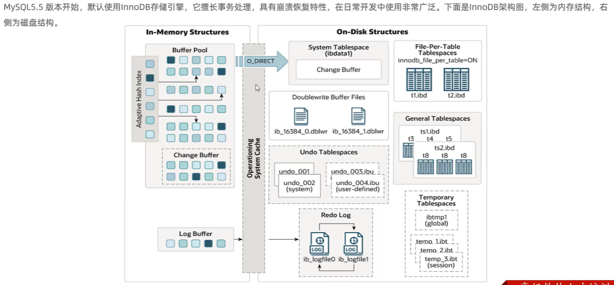

**磁盘结构：**

* **表空间（Tablespaces）**：InnoDB使用表空间来管理存储**表和索引**的数据文件，是更改缓冲区的存储区域。每个表空间包含一个或多个数据文件，这些文件实际上存储数据表和索引。这也是最外层的空间。
	* 表是数据库中最顶层的逻辑结构，用于存储具有相同结构的数据记录集合。在InnoDB中，表是根据主键顺序组织存放的，这种表称为索引组织表（Index Organized Table）。
		* 一个mysql实例可以包含多个表空间，用于存储记录、索引等数据（.ibd文件）
		* 每个表的文件表空间包含单个InnoDB表的数据和索引，并存储


```sql
# 查找文件
mysql->show variables like '%data_file_path%';
# idata1即为系统表空间
create tablesapce 表空间名 add datafile 'myit.idb' engine=innodb; 	# 创建表空间
use 数据库名：														# 使用数据库
create table a(  													# 创建表并关联表空间
	id int primary key auto_increment,
    name varchar(10)
) engine=innodb tablespace 表空间名
```

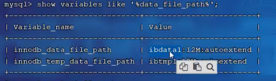

* **段（Segments）**：表包含多个段，用于存储不同类型的数据，包含数据段、索引段、回滚段等。**InnoDB就是索引组织表，数据段就是B+树的叶子节点，索引段即为B+树的非叶子节点。段用来管理多个EXtent（区）。**

	* 数据段存储B+树的叶子节点，即表中的实际数据行；索引段则存储B+树的非叶子节点，用于加快数据的检索速度。

	* 段是由多个区组成的，段并不直接对应表空间中某一个连续的物理区域，而是一个逻辑上的概念。

* **区（Extent）**：一个段包含多个区，每个区的大小通常为1MB，是InnoDB进行磁盘读写的最小单元。区用于管理连续的存储空间，以提高I/O操作的效率。

	* **特点**：在数据量大的时候，InnoDB会按区为单位为索引分配空间，这样可以减少随机I/O的发生，提高数据访问的速度。

* **页（Page）**：区又由一组页组成，通常为16KB大小，**页是InnoDB磁盘管理的最小单位**，一个区中有64个连续的页。用于存储数据库相关的所有内容，包括数据行记录、索引信息、系统信息等。
	* **内部结构**：页的结构包括文件头（File Header）、页头（Page Header）、最大最小记录（Infimum+Supremum）、用户记录（User Records）、空闲空间（Free Space）、页目录（Page Directory）和文件尾（File Tailer）等部分。其中，用户记录部分用于存储表中的实际数据行。

* **行（Row）**：数据行存储在表的叶子页中，每一行代表一条记录和字段。

 * 在InnoDB中，数据是按行进行存放的，每行记录包含了该记录的字段值、事务ID、回滚指针、字段指针等信息。
  * **行格式**：InnoDB支持多种行格式，包括Compact、Redundant、Dynamic和Compressed等。不同的行格式在存储效率和兼容性方面有所不同，但都能够高效地存储和访问表中的数据。


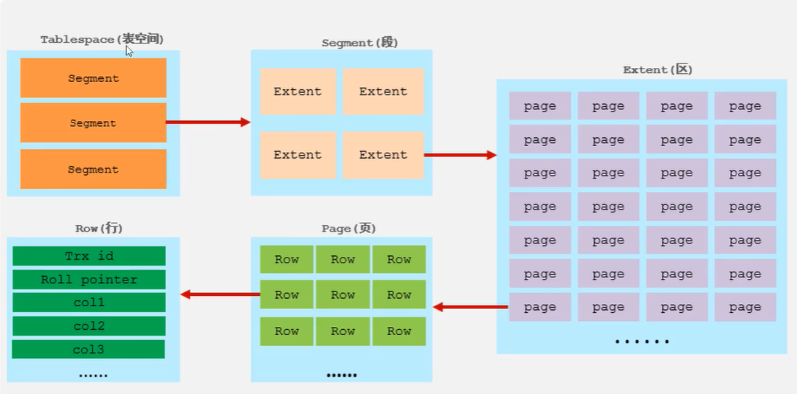

**后台线程：**

* 后台线程的作用就是将内存的数据在合适的时机刷新到磁盘中

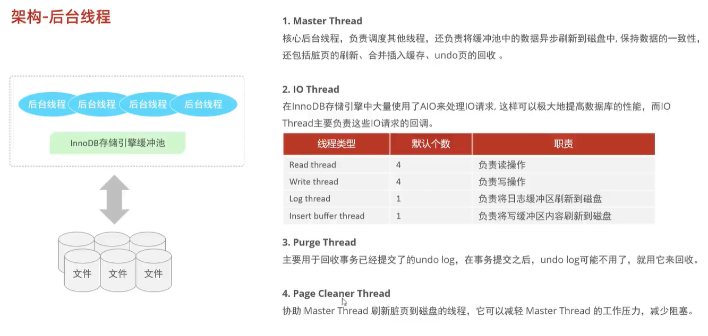


#### 4.2.2.2 事务原理

* redo log日志解决事务的持久性，详细见6.1。

* undo log 解决事务的原子性，详细见6.1，


#### 4.2.2.3 MVCC多版本并发控制

##### 1. 基本概念

* MVCC利用隐藏字段、undo log版本链、readview来控制在快照读时具体提取的那个版本
* MVCC+锁 来保证事务的隔离性

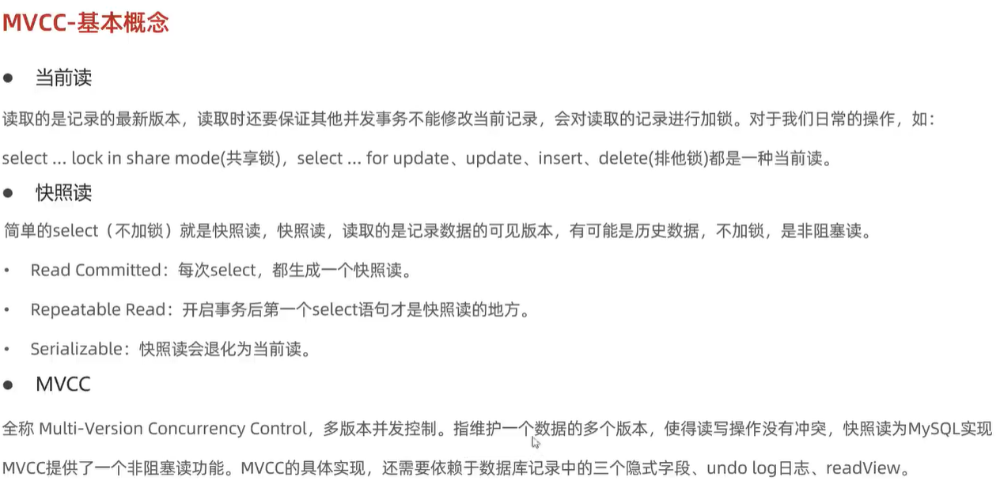

##### 2. 表的隐藏字段

* mysql会自动为表添加三个隐藏字段

```sql
# 查看.abd（表空间）文件信息
ibdsdi 表名.idb 
```

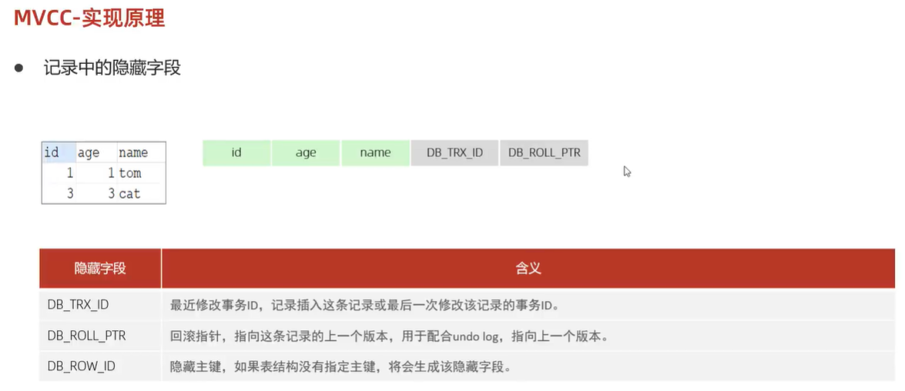

##### 3. undo log日志


##### 4. undo log版本链

* 假设插入一个记录，此时表中隐藏字段事务ID是1，回滚指针为空

* 开启事务2，事务2中update记录，此时undo log日志中添加没修改前的记录，其地址值0x00001，DB_TRX_ID中ID改为2，回滚指针指向没修改前的记录的地址值0x00001。

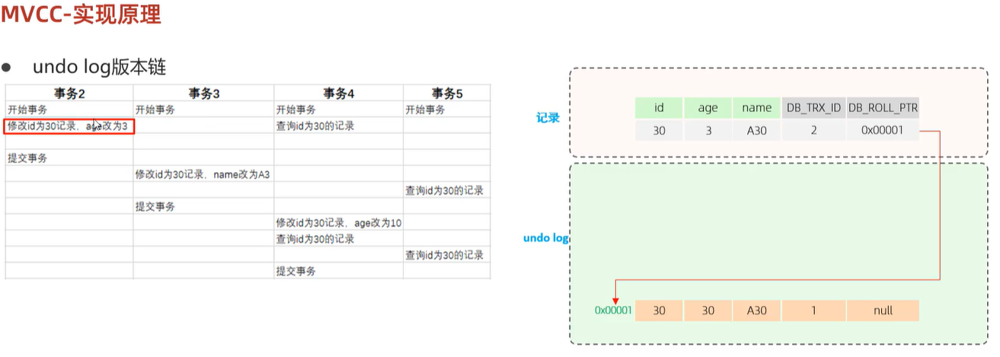

* 开启事务3，此时如果在进行修改，同理undo log日志中添加没修改前的记录，其地址值0x00002，DB_TRX_ID中ID改为3，回滚指针指向没修改前的记录的地址值0x00002。其他同理，这样不同事务或相同事务对同一条记录进行修改，会导致该记录的undolog生成一条记录版本链表，链表的头部是最新的旧记录，链表尾部是最早的旧记录。

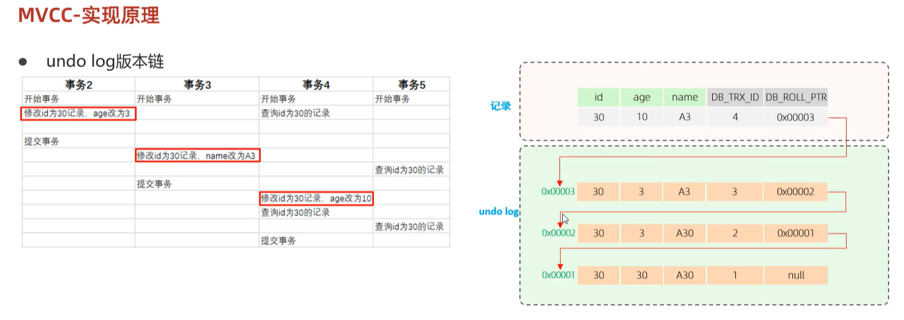

##### 5. readview

* 版本链虽然存放了所有修改记录，但是回滚操作并不独立依靠版本链。
* readview创建了四个核心字段分别记录了不同的事务ID

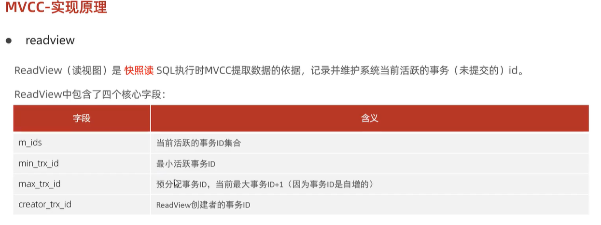

**版本链访问规则：**

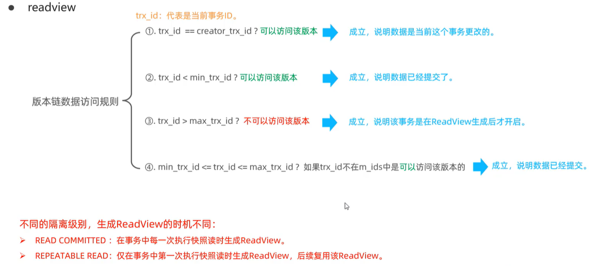


**读以提交(RC)隔离级别下：**

* 对于事务5的查询，读以提交(RC)隔离级别下，**不同的事件会创建不同的ReadView**

* creator_trx_id为当前事务ID：5

* m_ids为活跃事务id:{3,4,5},只要事务没提交都算正在活跃

* min_trx_id和max_trx_id分当前活跃的最小ID和最大事务ID+1

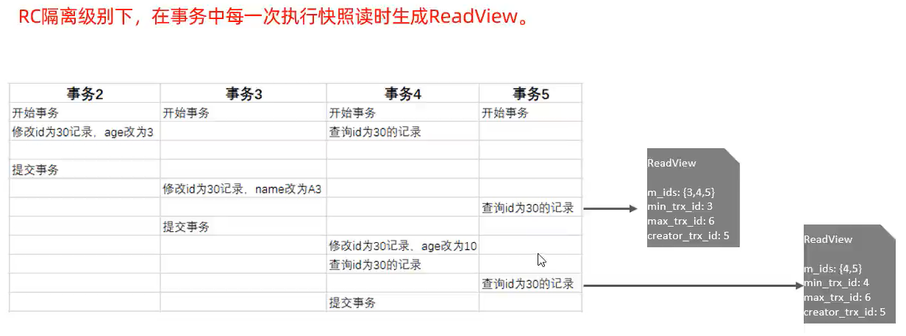

* 按照当前版本链回滚进行数据提取的规则如下：(一直查询直到有一个规则满足为止)
	* 首先当前最新修改事务ID，DB_TRX_ID是4，不等于当前查询事务ID，不可以访问该版本，也说明数据当时不是这个事务5更改的
	* DB_TRX_ID是4大于最小活跃事务ID，说明事务4还没提交
	* DB_TRX_ID是4小于最大活跃事务ID+1，说明事务是在readview生成前就开启
	* DB_TRX_ID是4在3和6之间，也在m_ids之间，说明事务还没提交，此时前三个条件都不满足不可以访问该版本也就说明要回滚的记录并不是事务4
	* 同理接下来3也是如此。前三个都不满足
	* 当到2时，条件2满足，此时回滚的记录就是0x00002，将记录进行返回
* 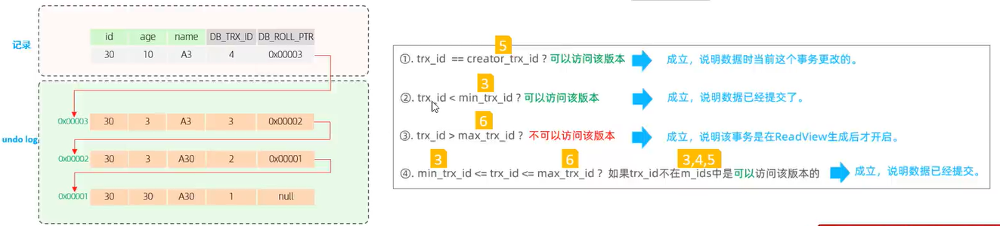


**可重复读的情况下**

* 对于事务5查询，可重复读的情况下，不同的事件不会创建不同的ReadView，会沿用上一个readView
* 其主要原理是因为，可重复读每次在本事务读取的数据都是一样的，其加锁了，而读以提交当其他事务提交了修改等操作，回影响到数据的变化。
* 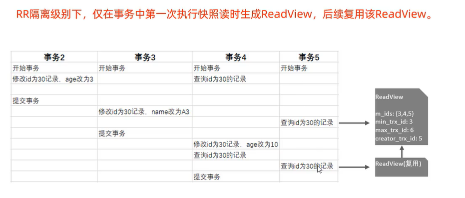


**总结：**

* InnoDB 存储引擎是 MysQL 的缺省引擎，它管理的表具有下列主要特征:
 * 每个InnoDB 表在数据库目录中以.frm 格式文件表示InnoDB 表空间 tablespace 被用于存储表的内容提供一组用来记录事务性活动的日志文件
	* 用 COMMIT(提交)、SAVEPOINT 及 ROLLBACK(回滚)支持事务处理
	* 提供全 ACID 兼容
	* 在 MySQL 服务器崩溃后提供自动恢复
	* 多版本(MVcc) 和行级锁定
	* 支持外键及引用的完整性，包括级联删除和更新

* innoDB最大的特点就是支持事务:以保证数据的安全。效率不是很高，并且也不能压缩，不能转换为只读，不能很好的节省存储空间。


### 4.2.3 MEMORY

* 使用 MEMORY 存储引擎的表，其数据存储在内存中，且行的长度固定，这两个特点使得 MEMORY 存储引警非常快。
* MEMORY 存储引警管理的表具有下列特征:
 * 在数据库目录内，每个表均以.frm 格式的文件表示
	* 表数据及索引被存储在内存中。(查询快)
	* 表级锁机制。
	* 不能包含 TEXT 或 BLOB 字段
	* MEMORY 存储引擎以前被称为 HEAP 引警

* 优点:查询效率是最高的MEMORY引擎
* 缺点:不安全，关机之后数据消失。因为数据和索引都是在内存当中。


* 选择合适的存储引擎
 * MyISAM 表最适合于大量的数据读而少量数据更新的混合操作。MyISAM 表的另一种适用情形是使用压缩的只读表。
	* 如果查询中包含较多的数据更新操作，应使用 InnoDB。其行级锁机制和多版本的支持为数据读取和更新的混合操作提供了良好的并发机制。
	* 可使用 MEMORY 存储引擎来存储非永久需要的数据，或者是能够从基于磁盘的表中重新生成的数据。


# 5 事务

## 5.1 概念

* 事务：就是一个完整的业务逻辑，是一个操作的集合。
* 什么是一个完整的业务逻辑?
 * 假设转账，从A账户向B账户中转账10000
	* 将A账户的钱减去10000
	* 将B账户的钱加上10000，这就是一个完整的业务逻辑。
	* 以上的操作是一个最小的工作单元，要么同时成功，要么同时失败，不可再分。
* 这两个update语句要求必须同时成功或者同时失败，这样才能保证钱是正确的。


**事务是如何同时失败和成功的？**

* InnoDB存储引擎:提供一组用来记录事务性活动的日志文件

案例：假设这是一个事务

```sql
事务开启了:
insert
insert
insert
delete
update
update
update
事务结束了!
```

* 在事务的执行过程中，每一条DML的操作都会记录到“事务性活动的日志文件”中。
* 在事务的执行过程中，我们可以提交事务，也可以回滚事务。


## 5.2 相关语句

* 只有DML（insert、delete、update）语句才会有事务这一说，其它语句和事务无关!!!
* 只有以上的三个语句和事务有关系，其它都没有关系。因为 只有这三个语句是数据库表中数据进行增、删、改的。只要你的操作一旦涉及到数据的增、删、改，那么就一定要考虑安全问题。数据安全第一位!!!

### 5.2.1 事务的提交回滚

* 将之前所有的DML操作全部撤销，并且清空事务性活动的日志文件。
* 回滚事务标志着，事务的结束。并且是一种全都失败的结束。

```sql
# 事务提交：
commit
# 事务回滚：
rollback
```

* **mysql默认情况下是支持自动提交事务的，而回滚只能回滚到上一次的提交点。**自动提交即每执行一条DML语句，则提交一次!

**案例：**

```sql
select * from room2;
delete from room2;
rollback;
select * from room2;
```


​         这里能看到明明已经进行了回滚，room2这张表中的数据仍然还是被delete了,这就是因为mysql中默认自动提交的，即delete之后便会自动进行一次提交，即这个事务已经进行提交并结束，所以rollback回滚不了。那么便需要开启事务，关闭原有的自动提交机制：

```sql
# 关闭自动提交机制，开启事务：
start transaction;
```

案例：

```sql
start transaction;
insert into room2 values(544,6,'wang',231);
rollback;
```


这里能看到插入被回滚了。

## 5.3 事务的四大特性（ACID）

* A：原子性:
	* 通过undolog实现
	* 说明**事务是最小的操作工作单元**。不可再分，要么全部失败要么全部成功。

* C:一致性:
	* AID的实现共同保证了一致性的实现，是我们的根本追求
		* 所有事务要求，在同一个事务当中，所有操作必须同时成功，或者同时失败，以保证**数据的一致性**。

* I:隔离性（**重点**）
	* 数据库系统提供的隔离机制，保证事务在不受外部并发操作影响的独立环境下运行

* D:持久性
	* 通过redolog实现->将随机读写转为顺序读写
	* 事务一旦提交或回滚，它对数据库中的数据的改变就是永久的。
	* 事务最终结束的一个保障。事务提交，就相当于将没有保存到硬盘上的数据保存到硬盘上!


* 事务的**原子性、一致性、持久性依靠两个日志redo log和undo log保证**
* **隔离性通过锁和MVCC实现**


### 5.3.1 隔离的四个级别

```c++
（1）读未提交: read uncommitted（事务的最低隔离级别）《没有提交就读到了》
	什么是读未提交?
		事务A可以读取到事务B未提交的数据。
		这种隔离级别存在的问题就是:脏读现象! (Dirty Read)，我们称读到了脏数据。
		这种隔离级别一般都是理论上的，大多数的数据库隔离级别都是二档起步!
（2）读已提交: read committed《提交之后才能读到》
	什么是读已提交?
		事务A只能读取到事务B提交之后的数据。
	这种隔离级别解决了什么问题?
		解决了脏读的现象。
	这种隔离级别存在什么问题?
		不可重复读取数据。
		在事务开启之后，第一次读到的数据是3条，当前事务还没有结束，
		可能第二次再读取的时候，读到的数据是4条，3不等于4称为不可重复读取。
	这种隔离级别是比较真实的数据，每一次读到的数据是绝对的真实。
	oracle中默认的事务级别就是这个！！！！
（3）可重复读: repeatable read《提交之后也读不到，永远读取的都是刚开启事务时的数据》
	什么是可重复读取?
	事务A开启之后，不管是多久，每一次在事务A中读取到的数据都是一致的。
	即使事务B将数据已经修改，并且提交了，
	事务A读取到的数据还是没有发生改变，这就是可重复读。
	早晨9点开始开启了事务，只要事务不结束，到晚上9点，读到的数据还是那样!
	读到的是假象（备份或者快照），不够绝对的真实。
	mysql中默认的事务级别就是这个！！！！！
（4）序列化/串行化: serializable（事务的最高隔离级别）
	这是最高隔离级别，效率最低。解决了所有的问题。
	这种隔离级别表示事务排队，不能并发！
	在执行一个事务的同时，其他事务无法执行！
	synchronized，线程同步(事务同步)！
	每一次读取到的数据都是最真实的，并且效率是最低的。
```


**隔离级别查看：**

```sql
select @@transaction_isolation;
```


设置当前全局隔离级别为读未提交:

```sql
set global transaction isolation level read uncommitted;
                                        read committed; 	# 读已提交
                                        repeatable read; 	# 可重复读
                                        serializable; 		# 序列化
```


设置之后重新退出再次登录查询：能看到被更改为读未提交。


* **测试(读未提交)**：打开两个终端窗口

```sql
第一个窗口：
1、进入数据库查询表，明显能看到是空表
	select  * from room;
2、关闭mysql默认提交事务
	start transaction;
第二个窗口：
1、关闭mysql默认提交事务
	start transaction;
2、对表进行插入，但不提交：
	insert into room values(123,'wang',561);
第一个窗口：
1、对表进行查询能发现其中有数据了：
	select  * from room;
```


* **测试（读已提交）：**

```sql
第一个窗口：
1、进入数据库查询表，明显能看到是空表
	select  * from room;
2、关闭mysql默认提交事务
	start transaction;
第二个窗口：
1、关闭mysql默认提交事务
	start transaction;
2、对表进行插入，但不提交：
	insert into room values(123,'wang',561);
第一个窗口：
1、对表进行查询，没有数据：
	select  * from room;
第二个窗口：
1、对insert进行提交
	commit;
第一个窗口
	1、对表进行查询：发现有数据了
	select * from room;
```


* **测试（可重复读）：**

```sql
第一个窗口：
1、将隔离等级设置为可重复读：
	set global transaction isolation level repeatable read;
2、启动事务，关闭自动提交：
	start transaction;
3、查表有数据
	select * from room;
第二个窗口：
1、启动事务：
	start transaction;
2、删除表格：
	delete from room;
3、提交：
	commit;
第一个窗口：
1、再此进行查询：仍然有数据
	select * from room;
```


* **测试（序列化）:**

```sql
第一个窗口：
1、将隔离级别设置成序列化：
	set global transaction isolation level serializable;
2、启动事务：
	start transaction;
3、插入数据
	insert room values(12,'你好',56);
第二个窗口：
1、启动事务：
	start transaction;
2、查询表，发现无法继续运行了，一直在光标闪动
	select * from room;
第一个窗口：
1、提交事务：提交完成后，第二个窗口自动输出查询结果
	commit;
```


# 6 日志

MySQL 的日志系统是一个强大的工具，它帮助开发者、数据库管理员（DBA）追踪和记录数据库的活动，以便进行性能调优、问题诊断、数据恢复等。MySQL 支持多种类型的日志，每种日志都有其特定的用途和记录的信息类型。以下是一些常见的 MySQL 日志类型：

**日志系统：**

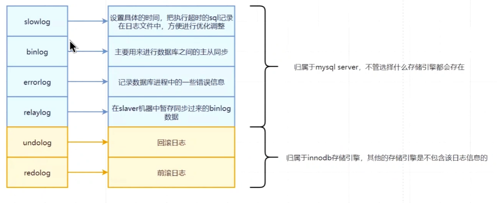

* **slow query log：慢查询日志**
	* 慢查询日志记录了执行时间超过 `long_query_time` 值（执行超时）的所有查询。这对于性能调优和发现性能瓶颈非常有用。
	* 配置方法：在 MySQL 的配置文件中设置 `slow_query_log`、`slow_query_log_file` 和 `long_query_time` 参数。
* **binlog：二进制日志**
	* 二进制日志记录了所有的更改数据（DML）的语句（如 INSERT、UPDATE、DELETE）以及可能更改数据的 DDL 语句（如 ALTER TABLE）。主要配合中继日志用来**进行数据库之间的主从同步**，这对于数据复制和数据恢复至关重要。
	* 配置方法：在 MySQL 的配置文件中设置 `log_bin` 参数。
* **relay log：中继日志**
	* 在 MySQL 复制配置中，中继日志用于在从服务器（Slave）上记录从主服务器（Master）接收到的二进制日志事件。这些事件随后被应用到从服务器的数据上，以实现数据同步。
	* 配置通常涉及复制相关的设置，而不是直接设置中继日志的参数。
* binlog与binlog在主从同步（master和slaver数据库保证数据一致）中的配合：
	* 首先master中在进行一些列DML操作时，会生成binlog二进制日志
	* master和slaver数据库之间会有一个线程IO thread
	* IO thread会拉起binlog日志存放到slaver中
	* slaver需要接收binlog，将binlog进行暂存，存放名称为relay log
	* sql thread会读取relay log数据并进行数据投放，这样就可以保证数据同步

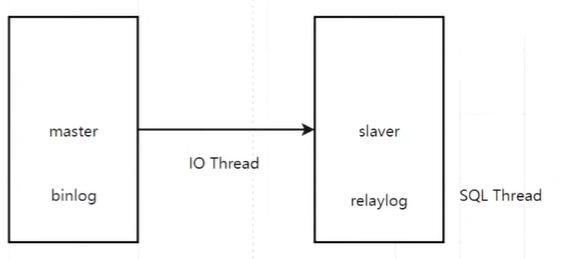

* **errorlog：错误日志**
	* 错误日志记录了启动、运行或停止 mysqld 时出现的问题。如果 mysqld 崩溃，它也会在错误日志中记录信息。这对于了解服务器的健康状况和定位问题非常有用。
	* 配置方法：在 MySQL 的配置文件（通常是 `my.cnf` 或 `my.ini`）中设置 `log_error` 参数。
* **undo log：撤销日志**
	* 回滚日志，记录的是数据的历史版本信息，是**逻辑日志**，用来保证原子性和MVCC
	* 撤销日志也是 InnoDB 存储引擎特有的，用于提供事务的原子性和一致性。当事务需要**回滚**时，撤销日志被用来撤销事务中所做的更改。
	* 撤销日志的管理主要由 InnoDB 存储引擎自动处理，但可以通过调整相关参数来优化其性能。
* **redolog：重做日志**
	* 重做日志是 InnoDB 存储引擎特有的日志，记录的是事务提交时数据页的**物理修改**，用于**确保事务的持久性**。在事务提交时，**事务所做的更改首先被写入重做日志**，然后**在适当的时候被刷新到磁盘上**。这有**助于在系统崩溃/异常时恢复事务**。而当事务提交后，redolog的意义也就不大了。
		* 事务提交之后会将所欲的修改信息都存储到该日志中，用于刷新脏页到磁盘时，万一发生错误，可以进行数据恢复。
	* 重做日志的配置通常通过调整 InnoDB 的相关参数来实现，如 `innodb_log_file_size` 和 `innodb_log_files_in_group`。


## 6.1 日志支持事务原理

* redo log解决事务的持久性。

* undo log 解决事务的原子性
* redo log和undo log共同保证事务的一致性

### 6.1.1 **redo log**

对于DML语句，例如update：

* 会首先从内存的buffer pool查询有没有更改的这条数据的数据
* 没有就从磁盘中拿出来缓冲到buffer pool中，那么update就可以直接操作缓冲区的数据
* 当update更新了之后，缓冲区的数据发生了改变，但是磁盘的数据没有发生改变，此时的数据页是脏页。
* 那么此时便需要等待一个时机，后台线程将内存中的数据刷新到磁盘当中，此时缓冲区的数据和磁盘的数据保持一致。但是如果脏页在从内存刷新到磁盘时发生错误，而内存修改成功了，update语句返回给用户的数据的信息是修改成功，但是此时内存与磁盘却不一致。
* 而日志redo log就可以解决这一问题：
	* 内存会首先将增删改的数据记录在redo log buffer中，redo log buffer记录数据页的物理变化，当**事务提交时**，会将redo log buffer的数据页物理变化刷新到磁盘中，进行永久性的存储，如果脏页在从内存刷新到磁盘时发生错误，便可以利用redo log buffer中的数据进行恢复
	* **疑问：**为什么不直接在提交时就将buffer pool中的修改内容刷新到磁盘中，还整个redo log buffer呢
	* **解答：**一般一组事务有很多记录，因为修改的数据页可能分散在磁盘的不同位置，因此记录都是随机操作物理数据页的，此时会**涉及大量随机的磁盘IO**，但利用到redo log buffer时，先将redo log buffer的数据页变化刷新到磁盘，由于其是log文件，log文件是追加的，就是**顺序磁盘IO**，此时性能循序高于随机。
		* **日志先行（Write-Ahead Logging, WAL）**：redo log的一个重要特性是确保在数据实际写入磁盘之前，相应的日志记录已经写入磁盘。这保证了即使在数据库崩溃的情况下，也能通过重放redo log来恢复数据到事务提交时的状态，从而保持数据的一致性。
		* **追加写入**：Log日志通常采用追加写入的方式，即新的日志记录总是被添加到日志文件的末尾。这种写入方式本身就是顺序的，因为每次写入都发生在文件的最后，不需要在磁盘上随机寻找写入位置。
		* **固定格式**：Log日志通常具有固定的格式和大小，这使得写入操作更加高效和可预测。数据库系统可以预先分配足够的磁盘空间给日志文件，以避免在写入过程中频繁地进行磁盘空间分配和回收。

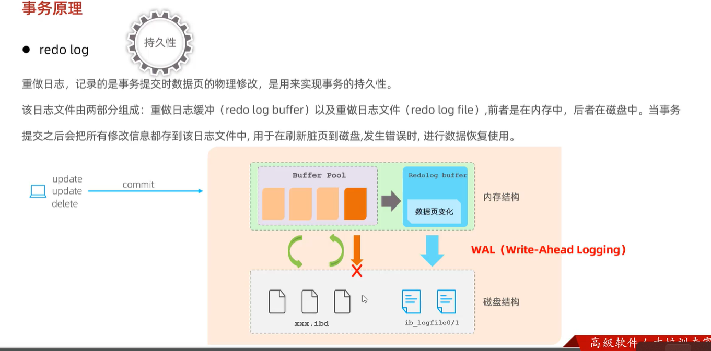


1. InnoDB Buffer Pool：
	* InnoDB Buffer Pool是一个内存结构，用于缓存磁盘上的数据页和索引页。当事务对表中的数据进行修改时，这些修改首先会发生在Buffer Pool中的缓存页上。
	* 在事务提交之前，这些修改后的数据页（即脏页）通常不会立即刷新到磁盘上，而是留在Buffer Pool中，以提高性能。后台线程会根据一定的策略（如检查点机制）定期将这些脏页刷新到磁盘。
2. Redo Log Buffer：
	* Redo Log Buffer是一个内存中的缓冲区，用于临时存储事务的修改操作（即重做日志）。这些重做日志记录了数据页的物理变化，如页号、偏移量和新的数据值。
	* 在事务执行过程中，每当对数据进行修改时，都会生成一条重做日志并写入Redo Log Buffer。
	* 当事务提交时，这些重做日志会从Redo Log Buffer中刷新到磁盘上的Redo Log文件中，以确保在数据库崩溃时能够利用这些日志进行数据恢复。


### 6.1.2 undo log

* 回滚日志，用于记录数据被修改前的信息，作用包含两个:提供回滚 和 MVCC(多版本并发控制)。
* undo log和redolog记录物理日志不一样，它是逻辑日志。
* 因为要进行回滚，所以里面记录的都是相反的操作。可以认为当delete一条记录时，undolog中会记录一条对应的insert记录，反之亦然，当update一条记录时，它记录一条对应相反的update记录。当执行rollback时，就可以从undolog中的逻辑记录读取到相应的内容并进行回滚。

**Undo Log保证事务原子性的机制：**

* **记录操作前的状态**：Undo Log记录了事务执行前数据库的状态，这是实现回滚的基础。
* **回滚操作**：如果事务在执行过程中遇到错误或者需要回滚，数据库系统会利用Undo Log中的信息，将数据库状态恢复到事务开始前的状态。这包括撤销事务中所有的插入、更新和删除操作。
* **并发控制**：为了保证事务的并发执行，InnoDB采用了回滚段（Rollback Segment）的方式来维护Undo Log的并发写入和持久化。每个回滚段可以包含多个Undo Log Segment，支持大量的并发事务执行。

**具体实现方式**：

* **Insert操作**：对于插入操作，Undo Log会记录插入记录的主键信息，以便在回滚时根据主键删除该记录。
* **Delete操作**：对于删除操作，Undo Log会记录被删除记录的内容，以便在回滚时重新插入该记录。但是，实际的回滚操作可能只涉及将记录的“已删除”标志位清除，而不是真正地重新插入记录。
* **Update操作**：对于更新操作，Undo Log会记录更新前的数据状态。在回滚时，系统会将数据恢复到更新前的状态。如果更新操作涉及主键的更改，则可能需要记录两条Undo Log：一条用于撤销对旧记录的delete mark操作，另一条用于插入新的记录。

**Undo** **Log的生成和销毁**：

* **生成**：在事务开始时，每当对数据库进行插入、更新或删除等修改操作时，数据库系统会生成相应的Undo Log。这些日志记录了操作前的数据状态，以便在需要时进行恢复。
* **销毁**：事务提交时，并不会立即删除Undo Log。InnoDB存储引擎会将该事务对应的Undo Log放入到删除列表中，然后通过后台线程（如purge thread）进行回收处理。这样做是为了确保在事务提交后的一段时间内，如果系统发生故障，仍然可以利用Undo Log进行恢复。

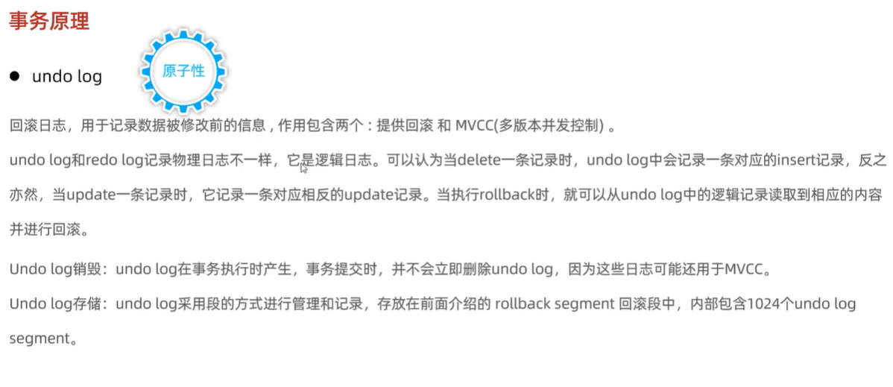


# 7 索引

## 7.1 基本概念

innodb以页为数据存储的基本单位，默认大小为16Kb，即磁盘往内存保存，最第一次为16kb，内存往磁盘刷新最低为一个页16kb。在页中，记录是以主键为顺序，由小到大串联而成的单向链表，每一个数据页中，innodb会自动添加两条记录（最小记录和最大记录），当数据页中的记录太多怎么办，怎么查找记录？

为了方便遍历，innodb将记录分为若干个小组，每个小组选出组内最大的一条记录作为组长，组长记录组员个数，然后将组长的地址拿出来编成目录，此目录为槽，槽在物理空间是连续的，因此可以用二分法进行槽的快速查找。

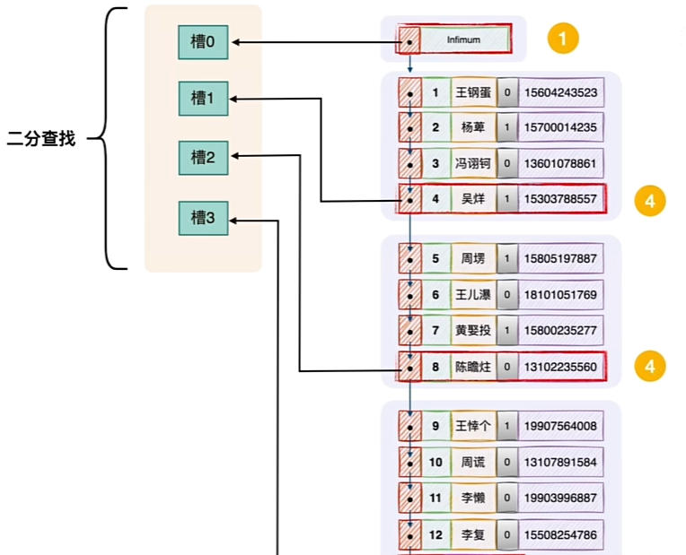


当一个页不够用时，可以再申请页进行存储，页与页之间通过双向链表进行连接，为了方便查找那条记录具体在哪个页，建立目录项记录，记录了每个数据页的最小主键值和对应的数据页号，而目录项如果一个页不够，就继续建立新的目录项记录，同时为目录项建立目录项，这样就构成了**索引，即B+树**。

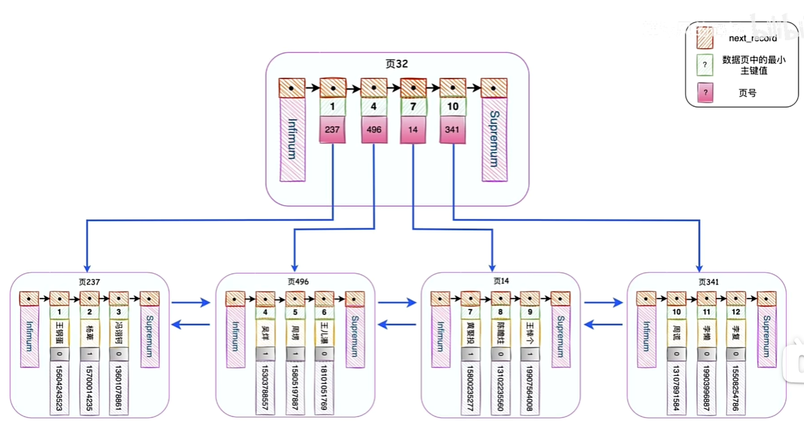


**注意:**

* innoDB的一切搜索操作最终都会在B+树的叶子结点展开
* **B树索引左小右大原则存放，采用中序遍历方式遍历数据**（先访问左子树，再访问根节点，再访问右子树）。
* 如果一个表中既没有主键也有没有unique键，innoDB会为每一条记录自动添加一个默认主键，因此**innoDB的索引是一定存在的**。

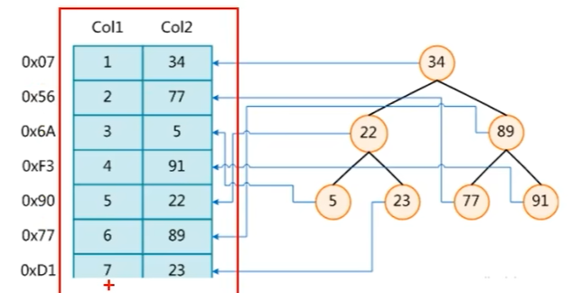

* **索引查找**：
	* **对于B树或B+树索引**：MySQL会使用索引来快速定位到数据在磁盘上的位置。对于等值查询（如`WHERE column = value`），MySQL可以直接在索引中找到对应的条目，并快速定位到数据行。对于范围查询（如`WHERE column > value`），MySQL会利用索引的有序性来遍历索引树，直到找到满足条件的所有行。虽然这种遍历方式在某些方面与中序遍历相似（因为它也是按照索引键的顺序进行遍历），但它是由MySQL的索引引擎自动处理的，用户不需要手动进行。
	* **对于哈希索引**：MySQL会使用哈希函数来计算查询条件的哈希值，并在哈希表中查找对应的条目。哈希索引的查找速度非常快，因为它们提供了接近常数的查找时间。但是，哈希索引不支持范围查询和排序操作。

* **回表**：如果查询的列不是索引列的一部分（即所谓的“覆盖索引”），MySQL需要在找到索引对应的行指针后，再回到主表中检索这些列的值。这个过程称为“回表”。
* **结果合并**：如果查询涉及多个表（如JOIN操作），MySQL会将各个表的结果集进行合并，得到最终的查询结果。


**案例：**

假设我们有一个名为`students`的表，其中包含学生的信息，表结构如下：

```sql
CREATE TABLE students (  
    student_id INT AUTO_INCREMENT,  
    name VARCHAR(100),  
    age INT,  
    PRIMARY KEY (student_id)  
);
```

在这个例子中，`student_id`被指定为主键。因此，InnoDB会为`students`表创建一个主键索引（也是聚集索引），其中索引的键值就是`student_id`的值。

当数据被插入到这个表中时，它们会按照`student_id`的顺序被**物理地存储在磁盘上**。例如，如果我们插入以下数据：

```sql
INSERT INTO students (name, age) VALUES ('Alice', 20);  
INSERT INTO students (name, age) VALUES ('Bob', 21);  
INSERT INTO students (name, age) VALUES ('Charlie', 22);
```

假设这些插入操作分别给`student_id`分配了1、2、3的值（这是自动递增的结果），那么这些记录就会按照`student_id`为1、2、3的顺序被存储在磁盘上。

由于数据是按照主键索引的顺序物理存储的，因此通过主键索引来访问数据会非常快。例如，如果我们想查询`student_id`为2的学生信息，InnoDB可以**直接定位到磁盘上存储该记录的物理位置**，而不需要扫描整个表。

此外，由于聚集索引的这种特性，它还会影响到其他非主键索引（也称为非聚集索引）的行为。在InnoDB中，非聚集索引的叶子节点不存储行的完整数据，而是存储主键的值（即聚集索引的键值）。这意味着，当通过非聚集索引来访问数据时，InnoDB需要执行一个额外的步骤，称为“回表”，即使用非聚集索引找到对应的主键值，然后再通过主键索引来检索实际的数据行。


## 7.2 **索引分类**

索引是各种数据库进行优化的重要手段。优化的时候优先考的因素就是索引，索引在数据库当中的分类：

* **单一索引:**一个字段上添加索引。
* **复合索引:** 两个字段或者更多的字段上添加索引
	* 其他字段创建索引，磁盘空间会被浪费，而根据主键查找用户记录的速度很快，因此，可以根据其他字段先快速找到主键，然后在根据主键进行查找用户记录。
	* 因此，可以建立一个B+树，树的叶子节点不存放完整的用户记录，只存放该字段列和主键列。而在这个树中，由于是按照该字段创建的索引，叶子结点页中的所有记录和目录记录结点的记录都按照该字段值进行排序，而不按照主键值。
	* **目录记录页中不仅会存放该字段值，也会存放主键值**：为了方便回表查记录

* **主键索引:**主键上添加索引，按照主键的大小对用户记录和数据页进行排序，**记录用单向链表连接**，**数据页使用双向链表连接**。
* **唯一性索引:** 具有unique约束的字段上添加索引，但是索引效率不高（都唯一了还索引个p）


## 7.3 实现原理

* **提醒1：**在任何数据库当中主键上都会自动添加索引对象，另外在mysql当中，一个字段上如果有unique约束的话，也会自动创建索引对象。

* **提醒2**：在任何数据库中，任何一张表的任何一条记录在硬盘存储上都有一个硬盘的物理存储编号。

* **提醒3：**在mysql当中，索引是一个单独的对象，不同的存储引擎以不同的形式存在，

 * 在MyISAM存储引擎中，索引存储在一个`.MYI`文件中。

	* 在InnoDB存储引警中索引存储在一个逻辑名称叫做`tablespace`的当中。

	* 在MEMORY存储引擎当中索引被存储在`内存`当中。

不管索引存储在哪里，在**mysql中索引都是一个树的形式存在。**

索引的树形式（B-tree）：


注意：**主键和unique字段上都会自动添加索引！**

什么条件下考虑对字段添加索引？

* 数据量庞大（根据硬件环境不同）
* 该字段经常出现在where后面，以条件的形式存在，也就是该字段经常被扫描
* 该字段很少的DML操作（因为DML之后，索引需要重新排序）


**创建索引**：

要给room表里的name字段加上索引：

```sql
create index 索引名称 on 表名(字段名);
create index room_name_index on room(name);
```

**删除索引**：

```sql
drop index 索引名称 on 表名;
drop index room_name_index on room;
```

**查看sql语句是否使用索引进行检索**：

```sql
explain select * from t_room where t_name = '吴京';
```


* `id`：查询的标识符，如果查询包含子查询或联合（UNION），则每个子查询或联合部分都会有一个唯一的ID。
* `select_type`：查询的类型，比如SIMPLE（简单SELECT，不使用UNION或子查询等）。
* `table`：被查询的表名。
* `partitions`：查询将访问的分区（如果表是分区表的话）。
* `type`：连接类型，对于单表查询，它通常表示如何查找行（比如ALL表示全表扫描，ref表示使用非唯一性索引或唯一性索引的前缀来查找单个匹配行）。
* `possible_keys`：显示可能应用在这张表上的索引，以便找到需要的行。
* `key`：**实际使用的索引。如果为NULL，则没有使用索引。**
* `key_len`：**使用的索引的长度**。在不是所有的索引列都被查询的情况下，这是决定性能的一个重要因素。
* `ref`：显示索引的哪一列或常量被用于查找值。
* `rows`：MySQL认为必须检查的用来返回请求数据的行数。
* `filtered`：表示返回结果的行占开始找到符合表条件的行的百分比。
* `Extra`：包含不适合在其他列中显示但对执行计划非常重要的额外信息。

添加了索引后：


**index_merge:**

* 我们的 where 中可能有多个条件(或者join)涉及到多个字段，
 * 它们之间进行 AND 或者 OR，那么此时就有可能会使用到 index merge 技术。
* index merge 技术如果简单的说，其实就是：
 * 对多个索引分别进行条件扫描，然后将它们各自的结果进行合并(intersect/union)。


**索引的失效**：

* 模糊查询以%开头时

```sql
select * from t_room where t_name like '%T';
```

* 这里即使t_name加上索引，也不会走索引，因为走索引必须避免“%”开始！这是一种优化的手段/策略。当使用模糊查询且以百分号为开头，索引便会失效。

* 使用or的时候，要求or两边的字段必须都要有索引，才会走索引，如果有其中有一个字段没有字段，那么另一个字段索引也会失效。

* 使用复合索引的时候没有使用左侧的列查找，索引失效

 * 复合索引：两个字段或者更多的字段联合起来添加一个索引，叫做复合索引。

	```sql
	create index 索引名 on 表名(字段名1，字段名2);
	```

	* 那么查询时只有使用左边的字段名1查询才会用到索引，利用字段2查询便会失效。

* 当where当中的索引列参加了运算，索引失效。

* 在where当中索引列使用了函数。

* 类型转换时索引失效。


# 8 视图

## 8.1 概念

* view：视图即从不同的角度看待同一份数据。
* 我们可以面向视图对象进行增删改查，对视图对象的增删改查，会导致原表被操作!

* 注意：只有[DQL](https://so.csdn.net/so/search?q=DQL&spm=1001.2101.3001.7020)（查询）语句才能以view的形式创建。

## 8.2 操作

**创建视图**：

将一个表的查询结果当做视图

```sql
create view table_view as select * from table;
```

**创建视图对象：**

```sql
create view_table_view as select * from table_view;
```

**删除视图：**

```sql
drop view table_view;
```

其他数据库操作：

**新建用户：**

```sql
create user wanglei indentified by '123456';
```

**数据库的导入导出**（数据备份）：导出,导出时不必要登录数据库，直接在终端窗口进行导入。

```sql
mysqldump -uroot 数据库名 > 存放位置\备份文件名.sql -uroot -p你的密码 
mysql dump test_wl>E:\test_wl.sql -uroot -p123456;
```

**导入**

```sql
source 文件路径/文件名
source E:\test_wl.sql
```


# 9 锁

### 9.1 概念

**分类：**

* 从**粒度上**区分：Mysql的锁主要分为**全局锁、表锁和行锁**。
* 从**模式上**区分：mysql的锁主要分为**乐观锁和悲观锁。**

* 还有为了协调行锁和表锁关系，支持多粒度（表锁和行锁共存）的**意向锁**。

* 

**概念：**

* **全局锁**：会锁定整个数据库实例，使得在锁定期间，只有持有锁的用户（或进程）可以执行操作，其他所有连接都会被阻塞。
* **读锁(共享锁)：**它阻止其他用户更新数据，但允许他们读取数据。这在你需要在一段时间内保持数据一致性时很有用。

* **写锁(排他锁)：**它阻止其他用户读取和更新数据。这在你需要修改一些大量的数据，并且不希望其他用户在这段时间内干扰时很有用。
* **表锁：**表锁会锁定整张表，用户在对表进行更新操作（INSERT、UPDATE、DELETE等）时会自动给表加锁。其他用户则只能等待锁释放后才能对表进行写操作，但可以同时读取表中的数据。
* **行锁：**行锁可以最大程度地支持并发处理（高并发），但也带来了最大的锁开销。行锁只在存储引擎层实现，如InnoDB存储引擎就支持行锁。行锁可以减少数据库操作的冲突，提高并发度，其加锁粒度最小，但加锁的开销也最大，加锁慢，且会出现死锁。
* 行锁分为共享锁（S锁）和排他锁（X锁）。共享锁允许事务读一行数据，排他锁允许获得排他锁的事务更新数据。
  * **行锁**：开销大，加锁慢；会出现死锁；锁定粒度最小，发生锁冲突的概率最低，并发度也最高。

**应用场景**：

* **并发读取**

​	在读取数据密集的应用中，多个事务可能同时需要读取同一份数据。此时，通过给数据加上**读锁**，可以**允许多个事务同时读取，而不会产生冲突，**从而提高系统的并发处理能力。

* **数据一致性保护**

​	在需要对数据进行修改的场景下，写锁保证了在事务修改数据期间，其他事务不能读取或修改这些数据，从而避免了数据的不一致性问题。

* **锁升级**

​	在某些情况下，可能会存在锁升级的情况。例如，一个事务开始时对数据加了读锁，但在执行过程中发现需要修改数据，此时需要将读锁升级为写锁。然而，需要注意的是，MySQL的InnoDB存储引擎并不支持直接从读锁升级到写锁，而是需要释放读锁后再申请写锁，这可能会导致死锁或性能问题。

* **长时间运行的查询**

​	对于长时间运行的查询，特别是那些涉及大量数据读取的查询，使用读锁可以避免其他事务对这些数据进行修改，从而保证了查询结果的一致性。

**注意事项**

* **锁粒度**：InnoDB支持行级锁，但表级锁（包括读写锁）在某些操作（如全表扫描、ALTER TABLE等）中仍然会被使用。了解不同操作的锁粒度对于优化并发性能非常重要。
* **死锁**：在并发系统中，死锁是一个常见问题。当两个或多个事务相互等待对方释放锁时，就会发生死锁。MySQL有死锁检测和解决机制，但开发者仍需要避免编写可能导致死锁的代码。
* **性能影响**：锁的使用会对数据库性能产生影响。过多的锁争用（Lock Contention）会导致性能下降。因此，在设计数据库和编写SQL语句时，需要考虑如何减少锁的使用和锁争用。


### 9.2 全局锁

#### 9.2.1 **实现方式：**

* **FLUSH TABLES WITH READ LOCK (FTWRL)**：这是MySQL提供的一个命令，用于锁定所有表，以便进行全局读锁定。执行这个命令后，其他线程（包括新的连接）不能对任何表进行更新操作，直到锁被释放。但是，已经打开的表可以继续进行读操作。需要注意的是，FTWRL命令并不会阻塞那些正在执行中的事务。

```sql
flush tables with read lock;			# 加锁
unlock tables;							# 释放锁
```

* **mysqldump的--single-transaction选项**：虽然这不是直接的全局锁，但在使用InnoDB存储引擎时，可以通过`mysqldump`的`--single-transaction`选项来避免全局锁。这个选项会启动一个事务来读取数据库的一致性快照，而不需要锁定整个数据库。这对于InnoDB表的全库备份是非常有用的。

```sql
mysqldump --single-transaction -uroot -p 数据库名>存放位置\备份文件名.sql
```


​	

#### **9.2.2 测试：**

**加全局锁导出数据**：

```sql
第一个窗口：
1、开启全局锁：
	flush tables with read lock;
第二个窗口：
1、更新数据：
	update employee set name = '测试名' where id = 1;    # 陷入阻塞，插入操作无法进行
第三个窗口：
1、导出数据库，查看插入是否成功
	mysqldump -uroot -p 数据库名 > 存放位置\备份文件名.sql	# 导出查看还是原来的数据，没有插入成功
第一个窗口：
1、释放全局锁：
	unlock tables;
第二个窗口：
1、重新更新数据：
	update employee set name = '测试名' where id = 1;    # 更新成功
```


### 9.3 表锁

#### 9.3.1 概念

**表锁：**表锁会锁定整张表，用户在对表进行更新操作（INSERT、UPDATE、DELETE等）时会自动给表加锁。其他用户则只能等待锁释放后才能对表进行写操作，但可以同时读取表中的数据。

* 表锁主要用在MyISAM、MEMORY、CSV等存储引擎中。对于MyISAM表，其默认操作就是表级锁，而且只有表级锁。
* **特点：**开销小，加锁快；不会出现死锁；锁定粒度大，发生锁冲突的概率最高，并发度最低。

**表锁也分为两种：**

* **表共享读锁**(Table Read Lock）：又称为表读锁，允许一个事务锁定的表进行读取操作不允许其他事务对其进行写操作，但是可以进行读操作。读锁之间是不会互相阻塞的。
* **表独占写锁**(Table Write Lock）：又称为表写锁，允许一个事务锁定的表进行读取和写入(更新)操作，但是其他任何事务都不能再对该表进行任何操作，必须等待表写锁结束。写锁会阻塞其他所有锁，包括读锁和写锁。
 * 在MVSQL中，对MyISAM表的读操作，会自动加上读锁，对MyISAM表的写操作，会自动加上写锁。InnoDB引擎在必要情况下会使用表锁，但主要是使用行锁来实现多版本并发控制

**应用场景：**

* **读密集型应用：**如果你的应用主要进行读取操作，很少进行写入操作，那么使用表级锁可能是一个好选择。因为表级读锁不会阻塞其他的读锁，所以这种场景下表级锁能够提供很高的性能
* **写操作不频繁的场景：**表级锁对写操作的处理并不高效，因为一个写锁会阻塞所有其他的锁，无论它们是读锁还是写锁。但是，如果你的应用不需要频繁地进行写操作，或者可以容忍写操作的延迟，那么使用表级锁可能是可行的。
* **数据量不大的简单应用：**如果数据库的数据量不大，那么即使在写操作中，由于锁定整张9表，对性能的影响也不头，
* **全表更新或者删除：**在某些情况下，可能需要对一张表进行全表的更新或者删除操作，例如，删除表中的所有记录，或者更新表中所有记录的某个字段的值。在这种情况下，使用表级锁是合适的。


**MySQL哪些命令会发生表级锁**：

* **ALTER TABLE：**这个命令用于更改表的结构，如添加列、删除列、改变列的类型等。执行这个命令的时候，MySQL需要锁定整个表以防止在更改过程中有新的数据写入。
* **DROP TABLE 和 TRUNCATE TABLE**：这两个命令都会导致表级锁。DROP TABLE命令会删除整个表，而TRUNCATE TABLE命令会删除表中的所有数据。在执行这些命令的时候，MySQL需要锁定整个表以防止在删除过程中有新的数据写入。
* **LOCK TABLES：**这个命令可以显式地为一个或多个表加上读锁或写锁。LOCK TABLES命令后面可以跟上一系列的表名和锁模式，用来指定需要锁定哪些表，以及使用什么样的锁模式。例如，LOCK TABLES t1 WRITE,t2 READ;命令会给表t1加上写锁，给表t2加上读锁。全表扫描或大范围扫描:对于MVISAM存储引擎，全表扫描或大范围扫描会触发表级锁。
* **FLUSH TABLES WITH READ LOCK(FTWRL)：**这个命令可以给所有表加上全局读锁，其他会话在此期间不能对数据进行修改。


#### 9.3.2 实现方式

```sql
lock tables employee read;		# 给员工表加读锁
lock tables employee write;		# 给员工表加写锁
show OPEN TABLES where In_use > 0;  # 查看表有没有加上锁，表被锁定，状态会显示为“Locked”
unlock tables;					# 解锁
```


**MySQL表锁风险点:**

* **性能下降:**因为表锁会锁定整个表，所以在高并发的环境中，它可能导致大量的请求阻塞从而降低性能。对于读取和写入混合密集的负载，表锁可能会成为一个性能瓶颈。
* **并发性能差:**表锁的最大问题在于其并发性能。一旦一个线程对表获得了写锁，其他线程的任何读写操作都会被阻塞，直到写锁被释放。同样的，如果一个读锁被持有，那么其他的写操作将被阻塞。这就使得并发性能大大降低。
* **可能导致锁等待和超时:**在高并发的环境中，由于表级锁的粒度较大，可能会有很多线程在等待锁，如果等待的时间过长，可能会导致锁超时，进一步影响应用的性能和可用性。
* **写操作影响大:**如果一个长时间运行的写操作(比如大数据量的UPDATE或者INSERT语句)获取了写锁，那么会阻塞所有其他的读操作和写操作，直到这个写操作完成。
* **死锁的可能性:**虽然表锁本身不会出现死锁，但在多表操作中，如果没有按照一定的顺序获得锁，可能会导致死锁。

为了避免这些问题，我们通常会选择InnoDB存储引擎，它主要使用行级锁，可以提供更好的并发性能，并且在一定程度上减少了锁争用的问题。而且，InnoDB还支持事务，可以保证数据的一致性和完整性。在实际应用中，我们应该根据具体的业务需求和系统负载，选择合适的存储引擎和锁策略。


### 9.4 行锁

#### 9.4.1 概念

* 行级锁是MySQL中的一种锁定机制，它可以对数据库表中的单独一行进行锁定。相比于表级锁和页锁，行级锁的粒度更小，因此在处理高并发事务时，能提供更好的并发性能和更少的锁冲突。然而，行级锁也需要更多的内存和CPU资源，因为需要对每一行都进行管理。在MVSQL中，**行级锁主要由InnoDB存储引擎提供**。
* InnoDB支持两种类型的行级锁:共享锁(S锁)和排他锁(X锁)。
	* **共享锁(S锁):**共享锁也称为读锁，"它允许一个事务读取一行数据。当一行数据被共享锁锁定时，其他事务可以读取这行数据，但不能对其进行修改。
	* **排他锁(X锁):**排他锁也称为写锁，它允许一个事务读取和修改一行数据。当一行数据被排他锁锁定时，其他事务不能读取也不能修改这行数据。

* 在实际使用中，InnoDB还提供了一种名为“间隙锁”(Gap Lock)的特性。间隙锁不仅锁定一个具体的行，还锁定它前后的“间隙”，即这一行之前的行和之后的行之间的空间。间隙锁可以防止其他事务插入新的行到已锁定行的前后，从而可以解决一些并发问题。
* **行锁只有在事务种有效**，也就是说，只有在一个事务开始(BEGIN)后并在事务提交(COMMIT)或回滚(ROLLBACK)之前，才能对数据行进行锁定。如果在非事务环境中执行SQL语句，那么InnoDB会在语句执行结束后立即释放所有的锁。

**应用场景：**

* **高并发读写操作:**在需要高并发读写操作的场景中，行级锁可以提高性能和并发性，因为它允许多个事务并发地操作不同的行。
* **单行操作:**对于需要操作单行数据的SQL语句(例如基于主键或者唯一索引的UPDATE.DELETE和INSERT语句)，行级锁可以提供较好的并发性和性能。
* **短期锁:**在需要对数据行进行短时间锁定的情况下，行级锁可以防止长时间阻塞其他事务
* **实现并发控制:**在需要确保数据一致性和隔离性的事务中，行级锁是实现并发控制的重要机制。
* **复杂的事务处理:**在需要对多行数据进行复杂处理的事务中，可以使用行级锁来锁定这些行，防止在事务处理过程中数据被其他事务修改。
* 使用行级锁需要注意，由于行级锁的锁定粒度较小，它可能会消耗更多的系统资源(例如内存和CPU)，特别是在处理大量数据时。此外，使用行级锁也可能导致死锁，需要使用合适的策略来避免死锁，例如在事务中按照一定的顺序锁定行。


**MySQL那些命令会导致发生行锁**

在MySQL中，主要是InnoDB存储引擎提供了行级锁(Row Level Locking)。一般来说，以下这些类型的操作会导致InnoDB对数据行进行加锁:

* **SELECT .. FOR UPDATE:**这种查询会对选定的行添加一个排他锁(X锁)，这意味着其他事务不能修改这些行，也不能对这些行添加共享锁。

* **SELECT .. LOCK IN SHARE MODE:**这种查询会对选定的行添加一个共享锁(S锁)，这意味着其他事务不能修改这些行，但可以对这些行添加共享锁。

* **INSERT**:插入操作会对新添加的行添加一个排他锁(X锁)

* **UPDATE:**更新操作会对被更新的行添加一个排他锁(X锁)

* **DELETE:**删除操作会对被删除的行添加一个排他锁(X锁)

​	这些加锁操作都是在事务中进行的，即只有在事务开始(BEGIN)后并在事务提交(COMMIT)或回滚(ROLLBACK)之前，才会对数据行进行加锁。如果在非事务环境中执行上述SQL语句，那么InnoDB会在语句执行结束后立即释放所有的锁，


#### 9.4.2 实现方式

```sql
# 关闭自动提交机制，开启事务：
start transaction;
SELECT * from employee where id = 1 for UPDATE;  		# 加写锁

select * from performance_schema.data_locks;			# 查询锁

# 修改语句，加了行锁，即使没有提交事务，虽然锁还在，但是在本事务内还是可以update的
# 在其他事务/线程/终端，只要没提交事务，便无法更改，直到提交事务/回滚释放锁为止
update employee set name='beijing' where id=1;

commit;		# 提交事务，释放锁
rollback;	# 回滚，释放锁
```

* `performance_schema` 是一个用于监控 MySQL 服务器性能的数据库

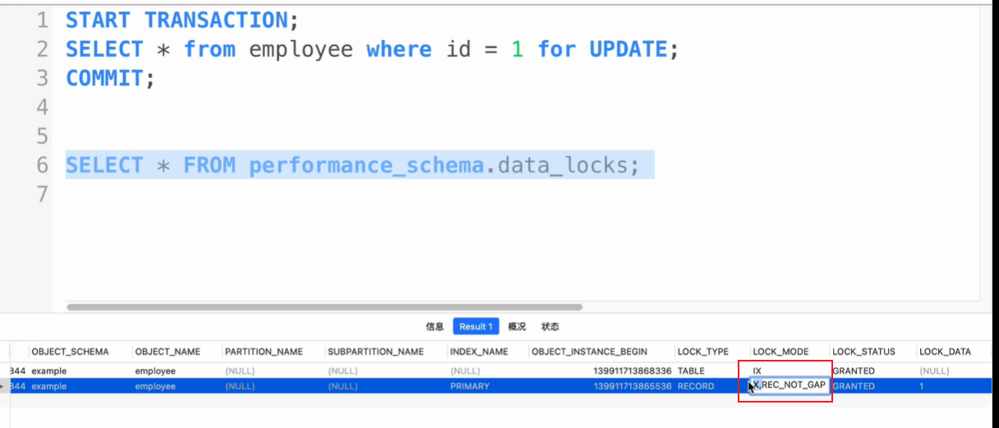


**MySQL行锁有什么风险点**：

尽管行级锁(Row-Level Locking)可以提供高并发性并减少锁冲突，但在使用过程中也可能遇到一些风险和问题，主要包括以下几点:

* **死锁:**当两个或更多的事务相互等待对方释放资源时，就会发生死锁。例如，事务1锁定了行A并试图锁定行B，同时事务2锁定了行B并试图锁定行A，这就形成了死锁。**MSQL会检测到死锁并终止其中一个事务**，但这仍可能导致性能问题和事务失败。
* **锁升级:**如果一个事务试图锁定的行过多，InnoDB可能会将锁从行级升级为表级，这就可能导致更多的锁冲突。
* **锁等待:**如果一个事务已经锁定了某行，其他试图访问这行的事务就必须等待，这可能导致2性能下降。如果有大量的事务在等待锁，就可能导致系统出现性能瓶颈。
* **资源消耗:**行级锁需要更多的内存来存储锁信息，而且需要更多的CPU时间来处理锁请求和释放锁。如果数据库中的行数非常多，或者并发事务的数量非常多，这可能会导致显著的资源消耗。
* **难以调试和排查:**由于行级锁的粒度较小，如果出现性能问题或锁冲突，可能需要复杂的调试和排查工作来找出问题的原因。


### 9.5 乐观锁

#### 9.5.1 概念

* 乐观锁(Optimistic Locking)是一种在数据库操作中用于处理并发问题的技术。
* 它的基本思想是：
	* 乐观锁（Optimistic Locking）是一种在数据库管理系统中用于管理并发控制的技术，它假设多用户并发的事务在处理时**不会互相干扰**，只有在提交更新时才检查是否有冲突。如果检测到冲突（即其他事务已经修改了数据），则当前事务会被回滚。
* 在MySQL中，**乐观锁并没有内置的实现，但是可以通过一些编程技巧来实现。**
 * 一种常见的实现方式是**使用版本号(或时间戳)字段**。版本号和时间戳的作用是帮助系统识别数据在读取和写入之间是否被其他事务修改过。
	* 每当一条记录被修改时，就增加版本号(或更新时间戳)。
	 * 在更新数据时，系统会检查当前事务中的版本号是否与数据库中的版本号相匹配。如果匹配，说明数据在读取后未被其他事务修改，可以安全更新；如果不匹配，说明数据已被其他事务修改，当前事务需要被回滚或采取其他措施。
		* 这样就可以保证只有当记录没有被其他事务修改时，当前事务的更改才会被提交。
		* 乐观锁的优点在于，由于大部分时间都不需要锁定，所以在冲突较少的情况下可以获得较高的并发性能。
		* 然而，如果冲突较多，那么乐观锁可能会导致大量的事务回滚，从而影响性能。因此，选择使用乐观锁还是其他锁定技术，需要根据实际的并发情况和性能需求来决定。

**ABA问题**：

ABA 问题是指一个值原来是 A，变成了 B，然后又变回了 A，但是使用版本号或简单的时间戳可能无法检测到这种变化，因为从版本号或时间戳的角度看，值最终仍然是 A。为了更精确地检测数据的变化，可以在乐观锁的实现中结合使用版本号和时间戳。

* **结合使用版本号和时间戳**：在这种方式下，每次更新数据时，不仅版本号增加，时间戳也会更新为当前时间（或更精确的时间戳）。这样，即使数据最终回到了原始状态（版本号相同），但由于时间戳的不同，系统也能识别出数据在读取和写入之间确实发生了变化。
* **使用更复杂的版本控制**：除了简单的递增版本号，还可以考虑使用更复杂的版本控制策略，比如将版本号和数据的哈希值结合使用，这样即使数据内容最终相同，但由于哈希值的变化，也能检测到数据在读取和写入之间被修改过。


**乐观锁有哪些使用场景**：

乐观锁(Optimistic Locking)是一种对并发控制的策略，适用于以下的应用场景:

* **低冲突环境**:在多数情况下，数据并发修改的冲突较低，即同一时间内，同一条数据不会被多个事务同时修改。
	* 在**高冲突环境**下，每次还得将版本号和时间戳拿出来再去比较，在资源消耗上还不如阻塞其他线程等待我处理完成
* **读多写少的场景:**在读操作远多于写操作的情况下，乐观锁可以避免由于频繁的读操作导致的不必要的锁定开销。
	* 读并不会破环数据库的数据，只有写的时候才需要拿数据进行对比，写比较少开销小
* **短事务操作:**如果数据库的事务都是简短并且快速完成的，那么使用乐观锁可以减少因为等待锁而导致的时间消耗。
	* 当冲突比较少时，当1秒钟我就有一个请求，而1分钟才处理一个事务，那么1分钟就可以积攒60个请求，运用乐观锁的话就会导致60个请求全部失败，冲突就会很高，所以乐观锁需要在短事务种进行操作
* **分布式系统:**在分布式系统中，由于网络延迟等原因，事务冲突的可能性较低，因此乐观锁是一个合适的选择。
* **互联网应用:**对于互联网应用，如电子商务网站，用户浏览商品和下单等操作，多数情况下是读取操作，且并发修改同一条数据的几率较小，因此使用乐观锁可以提高系统性能。

需要注意的是，如果事务冲突的可能性较高，或者需要长时间锁定某个资源，那么使用乐观锁可能会导致大量的事务冲突和回滚，这种情况下，悲观锁或者其他并发控制技术可能会是更好的选择。


#### 9.5.2 实现方式

乐观锁的实现通常依赖于数据库中的某个版本字段（如`version`或`timestamp`），在更新数据时检查这个字段的值是否自上次读取后发生了变化。

```sql
CREATE TABLE product (  
    id INT PRIMARY KEY,  
    name VARCHAR(255),  
    stock INT,  
    version INT DEFAULT 0  # 版本从0开始
);

SELECT *from product WHERE id=1;
UPDATE product set name = '张三',version= version + 1 WHERE id = 1 and version = 0;	# 当版本为0时，才会+1
```


**乐观锁的缺点**

* **冲突检测:**在高并发的环境中，乐观锁可能会导致大量的冲突。因为乐观锁只有在提交事务时才检查是否有冲突，如果多个事务在同一时间操作同一行，那么只有一个事务能提交成功，其他的事务都需要回滚并重新尝试。
* **处理开销:**在冲突发生时，需要进行回滚和重试，这可能会增加系统的开销。在一些场景中，这可能会导致性能下降。
* **版本管理:**乐观锁通常通过版本号(或时间戳)来检测冲突。这就要求系统能够正确地管理这些版本号，否则可能会导致错误的冲突检测。
* **编程复杂性:**使用乐观锁需要更复杂的编程，因为程序需要处理可能发生的冲突和重试。总的来说，乐观锁是一种有效的并发控制策略，但在冲突较多的情况下，可能会带来更大的开销和编程复杂性。因此，是否选择使用乐观锁，需要根据应用的具体需求和场景来决定。


### 9.6 悲观锁

#### 9.6.1 概念

* 乐观锁和悲观锁相反，乐观锁的核心思想是没有人和他冲突，悲观锁的思想是有人和他冲突。
* 悲观锁(Pessimistic Locking)**是一种并发控制的方法**，基于一个假设:
	* 认为数据在并发处理过程中很可能会出现冲突。
	* 因此，为了保证数据的完整性和一致性，每次在读写数据时都会先加锁，这样可以避免其他事务进行并发的读写操作。是否使用悲观锁需要根据应用的具体需求和场景来决定。在冲突较少，但需要保证数据完整性和一致性的情况下，可以考虑使用悲观锁。


#### 9.6.2 实现方式

在数据库中，悲观锁是一种并发控制方法，其实现就是通过全局、表、行锁进行实现：

1. **行级锁（Row-Level Locks）**：数据库系统可以自动地对正在被事务修改的行加上锁，以防止其他事务对这些行进行修改。行级锁粒度最小，但管理开销最大。
2. **表级锁（Table-Level Locks）**：虽然表级锁不是专门为悲观锁设计的（它也可以用于其他目的，如防止DDL操作与DML操作冲突），但在某些情况下，整个表可能会被锁定，以防止任何修改。表级锁粒度最大，但管理开销最小。
3. **显示锁定（Explicit Locks）**：在SQL中，可以使用特定的语句来显式地请求对数据库资源的锁定。例如，在SQL Server中，可以使用`SELECT ... WITH (ROWLOCK)`来指定行级锁，或者使用`SELECT ... WITH (XLOCK, ROWLOCK)`来在读取数据时就加上排他锁。
4. **应用层锁**：在某些情况下，应用层可能会实现自己的锁机制，例如通过在数据库表中添加一个状态字段或使用专门的锁表来管理锁。

**行锁：**

```sql
# 加写锁
start transaction;			# 开启事务
select * from employee where id = 1 for update;			# 加行写锁
uodate employee set name = 'zjx' where id = 1;			# 本事务内进行修改
commit;						# 提交事务
# 加读锁
start transaction;			# 开启事务
select * from employee where id = 1 lock in share mode;			# 加行读锁
uodate employee set name = 'zjx' where id = 1;					# 本事务内进行修改
commit;						# 提交事务
```


**缺点**：

* **性能开销:**在悲观锁机制下，锁定资源的操作会影响到系统性能。因为每次对数据的读写都需要进行加锁和解锁的操作，这会增加系统的开销，特别是在高并发的环境下，锁的竞争更是会严重影响到系统性能。
* **并发度降低:**由于悲观锁在操作数据前就会加锁，这就导致了在同一时间，只有一个事务能操作数据，其他事务只能等待，大大降低了系统的并发度。
* **死锁:**悲观锁在并发事务中可能导致死锁的情况发生。当两个或者更多的事务互相等待对方释放锁时，就可能发生死锁。虽然数据库系统通常能够检测并解决死锁，但这会导致事务回滚，增加了系统的开销。
* **锁超时:**如果一个事务长时间持有锁而不释放，可能导致其他等待锁的事务超时。这不仅可能导致等待的事务失败，还可能影响到整个系统的稳定性。

因此，虽然悲观锁能有效地防止数据冲突，但由于其在并发处理中的限制，以及可能引发的问如死锁、锁竞争和锁超时，我们需要根据具体的应用场景和需求，来权衡是否使用悲观锁。


### **9.8** 意向锁

#### 9.8.1 概念

**概念：**

* 意向锁是表锁,为了协调行锁和表锁的关系，支持多粒度(表锁与行锁)的锁并存，

**作用：**

* 加当有事务A有行锁时，MySQL会自动为该表添加意向锁,事务B如果想申请整个表的写锁，那么不需要遍历每一行判断是否存在行锁，而直接判断是否存在意向锁，增强性能。

**为什么意向锁是表级锁呢?**

* 当我们需要加一个排他锁（写锁）时，需要根据意向锁去判断表中有没有数据行被锁定(行锁);
	* 如果意向锁是行锁，则需要遍历每一行数据去确认;
	* 如果意向锁是表锁，则只需要判断一次即可知道有没数据行被锁定，提升性能。

**意向锁怎么支持表锁和行锁并存?**

* 首先明确**并存**的概念是指数据库**同时支持表、行锁**，而不是任何情况都支持一个表中同时有一个事务A持有行锁、又有一个事务B持有表锁，因为**表一旦被上了一个表级的写锁，肯定不能再上一个行级的锁**
* 如果事务A对某一行上锁，其他事务就不可能修改这一行。这与“事务B锁住整个表就能修改表中的任意一行”形成了冲突。所以，没有意向锁的时候，让行锁与表锁共存，就会带来很多问题。于是有了意向锁的出现，如前面所言，数据库不需要在检查每一行数据是否有锁而是直接判断一次意向锁是否存在即可，能提升很多性能。

意向锁的互斥性：


#### 9.8.2 实现方式

```sql
# 不兼容的情况
start transaction;		# 开启事务
select * form employee where id =1 for update;		# 加行写锁
select * from performance_schma.data_locks;
lock tables employee write;							# 加表写锁会被阻塞
commit;
# 兼容的情况
start transaction;		# 开启事务
select * form employee where id =1 lock in share mode;		# 加行读锁
select * from performance_schma.data_locks;
lock tables employee read;									# 加表读锁会能成功
```

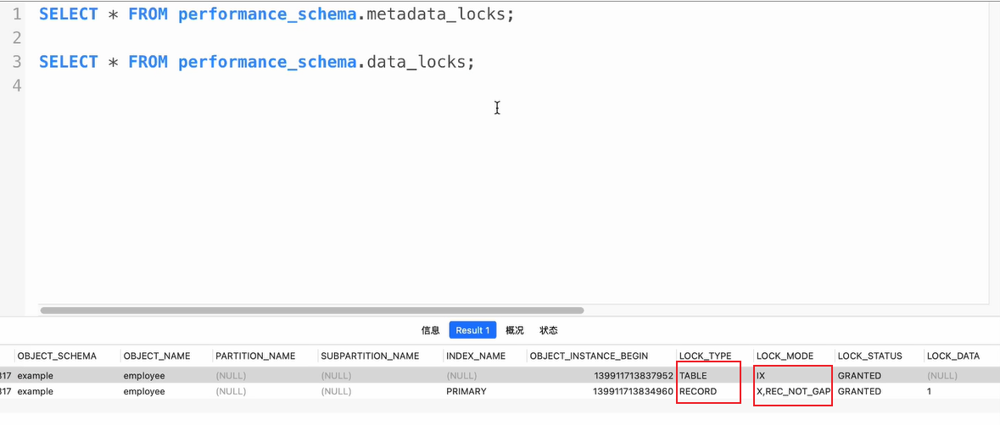

能看到加了行锁会出现两个类型的锁，table表示表锁即加了表锁，锁类型为IX意向锁写锁，record即记录行锁。


### 9.9 间隙锁、临键锁和记录锁

**间隙锁：**

* 间隙锁(Gap Locks)是MySQL InnoDB存储引擎提供的一种锁定机制。
* 它锁定的不是具体的行记录，而是两个索引之间的间隙(或者说区间)，这样可以防止新的记录插入到该间隙，确保数据的一致性和事务的隔离性。
* 间隙锁常常与记录锁(Record Locks)一起使用，共同形成Next-Key锁，保护索引记录的范围查询和扫描操作。
* 以下是间隙锁的主要类型:
	* 区间-区间间隙锁:锁定两个索引键之间的间隙，或者是第一个索引键之前的间隙
	* 区间-记录间隙锁:锁定一个索引键和一个记录之间的间隙。
	* 记录-区间间隙锁:锁定一个记录和一个索引键之间的间隙，
* 间隙锁的存在，主要是为了**解决幻读问题**。所谓幻读，是指在一个事务内读取某个范围的记录，另外一个事务在该范围内插入了新的记录，当第一个事务再次读取该范围的记录时，会发现有些原本不存在的记录，这就是幻读。
* 举例来说，假设我们有一个存储学生信息的表，有一个事务A要查询年龄在10-20之间的学生，它在查询前会对这个区间加锁。此时如果有另一个事务B想要插入一个年龄为15的学生由于这个年龄的范围已经被事务A锁定，所以事务B必须等待，直到事务A完成，释放锁。这样就避免了幻读的产生。
* 值得注意的是，由于间隙锁会锁定范围，如果并发事务较多且涉及的数据范围有交集，可能会引发性能问题甚至死锁。因此，在设计数据库和选择隔离级别时，需要综合考虑数据一致性和并发性能。

**什么是临键锁?**

* Next-Key 可以理解为一种特殊的间隙锁，也可以理解为一种特殊的**算法**。通过临建锁可以解决幻读的问题。
* 每个数据行上的非唯一索引列上都会存在一把临键锁.(除开unique/primary)
* 当某个事务持有该数据行的临键锁时，会**锁住一段左开右闭区间的数据**。
* 需要强调的一点是，**InnoDB 中行级锁是基于索引实现的**，临键锁只与**非唯一索引列**有关，在唯一索引列(包括主键列)上不存在临键锁。

对于表user：

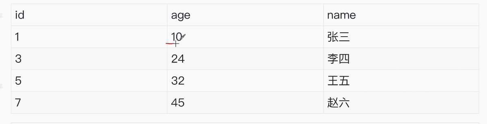

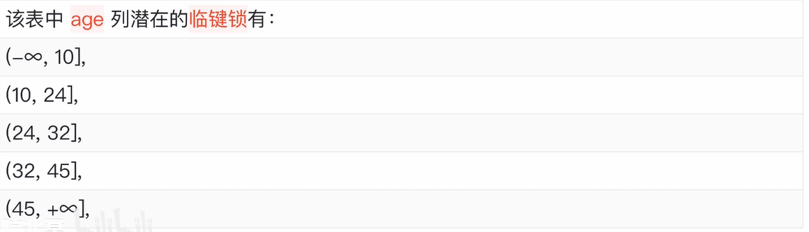

**测试：**

```sql
start transaction;
select * from user where age = 24 for update;	# 此时给age = 24的行进行加锁，其锁的是（24，32]之内所有的行
insert into user values(100,26,‘zjx’); 			# 此时插入被阻塞，（24，32]之内所有的行都被锁了
commit;
```


**记录锁：**

* **行锁（Row Lock）**：行锁是对数据库中表的单个行记录进行加锁，确保在事务执行过程中，其他事务无法修改或删除该行数据。行锁是数据库并发控制的重要手段之一，能够减少锁冲突，提高并发性能。
* **记录锁（Record Lock）**：在更细分的层面上，记录锁**可以被看作是行锁的一种具体实现**。它锁定的是**索引记录**，即表中的某一行数据。记录锁确保了在锁定期间，其他事务无法对该行数据进行修改或删除。
* 记录锁则明确依赖于索引的存在。在索引存在的情况下，记录锁能够精确地锁定目标行记录，减少锁冲突和死锁的发生。同时，记录锁也是InnoDB存储引擎实现可重复读（REPEATABLE READ）隔离级别下防止幻读的重要手段之一。

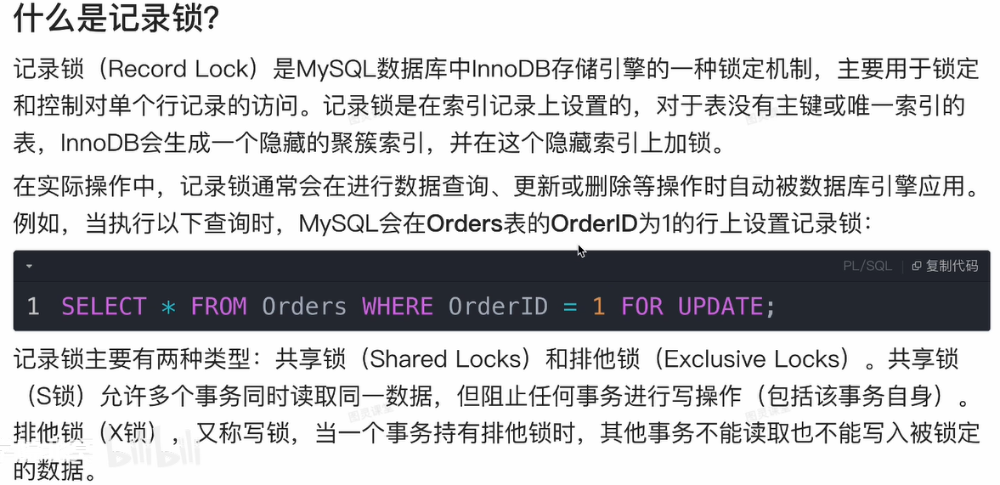


### 9.10 MVCC+锁

MVCC（多版本并发控制）和锁是实现数据库事务隔离性四个级别（读未提交、读已提交、可重复读、串行化）的重要机制。它们各自在不同的隔离级别中发挥着不同的作用，以下是它们如何实现这四个隔离级别的详细说明：

1. **读未提交**（Read Uncommitted）

* **实现方式**：在这个隔离级别下，事务可以读取到其他事务未提交的数据。这种级别通常不直接依赖于MVCC，因为MVCC的主要目的是通过维护数据的多个版本来避免直接读取未提交的数据。而读未提交则直接绕过了这种保护，允许读取未提交的数据。此级别主要通过不施加任何锁或版本控制来实现，因此可能会遇到脏读问题。

2. **读已提交**（Read Committed）

* **MVCC实现**：在MVCC中，每个事务开始时都会创建一个Read View（读视图），用于确定哪些数据版本对当前事务可见。在读已提交级别下，这个Read View会在每次SELECT查询时重新创建，以确保只能看到在查询执行时已经提交的数据版本。
* **锁实现**：虽然MVCC可以减少锁的需求，但在读已提交级别下，对于写操作（如UPDATE、DELETE）仍然需要加锁以确保数据的一致性。这些锁通常是行级锁或更细粒度的锁，以确保在修改数据时不会与其他事务的读或写操作发生冲突。

3. **可重复读**（Repeatable Read）

* **MVCC实现**：在可重复读级别下，事务开始时创建的Read View在整个事务期间保持不变。这意味着，在事务执行期间，无论其他事务如何修改数据，当前事务读取的数据都是事务开始时的数据快照。这通过MVCC中的版本链和Read View机制来实现，确保事务能够重复读取到相同的数据版本。
* **锁实现**：在可重复读级别下，除了必要的写锁外，还可能使用更复杂的锁策略（如两阶段锁协议）来确保事务的一致性。然而，由于MVCC的存在，大多数读操作可以避免加锁，从而提高了并发性能。

4. **串行化**（Serializable）

* **实现方式**：串行化是最高级别的隔离性，它通过强制事务串行执行来避免脏读、不可重复读和幻读等并发问题。在这种级别下，事务在执行过程中会获得足够的锁（通常是表级锁或更粗粒度的锁），以确保在事务结束之前，其他事务无法修改相同的数据。
* **MVCC与锁的结合**：虽然MVCC在串行化级别下可能不是主要的并发控制机制（因为串行化主要依赖于锁），但它仍然可以在某些数据库系统中作为辅助机制来优化性能。例如，在读取数据时，MVCC可以提供数据的旧版本而无需加锁，从而减少锁的竞争和等待时间。然而，在写入数据时，仍然需要加锁以确保数据的一致性和隔离性。


# 面试

**关系型数据库和非关系型数据库**：

关系型数据库的优点

* 采用了关系模型来组织数据
* 可以保持数据的一致性
* 数据更新的开销比较小
* 支持复杂查询（带where子句的查询）

非关系型数据库的优点

* 不需要经过sql层的解析，读写效率高
* 基于键值对，数据的扩展性高
* 可以支持多种类型数据的存储，如图片文档


**非关系型数据库（NOSQL）**：

* 采用**键值对**的形式进行存储
* 读写性能高，分为内存性数据库以及文档型数据库
* 应用场景：
	* 日志系统
	* 地理位置存储
	* 数据量大
	* 高可用


**随机IO**：

​		随机IO（Random I/O）是计算机存储系统领域中的一个重要概念，主要涉及数据的读取和写入方式。具体来说，随机IO指的是以随机的顺序访问存储介质上的数据，即**数据访问地址是不连续的，随机分布在磁盘的地址空间中。**

随机IO的特点和影响:

1. **数据访问顺序随机**：随机IO中，数据块的访问顺序不是固定的，可能是分散的，这要求存储设备能够在不同的存储位置之间快速切换。
2. **性能影响**：由于磁头或读写臂需要在磁盘上频繁移动以访问不同的数据块，随机IO通常比顺序IO更耗时，尤其是在硬盘驱动器（HDD）上，因为HDD的寻道时间是影响性能的关键因素之一。
3. **应用场景**：随机IO常见于数据库查询、多任务操作系统以及用户交互式应用中，其中数据访问模式往往是不可预测的。例如，在MySQL数据库中，随机IO通常发生在索引查找、数据更新等操作中。


**为什么使用索引**：

* 通过创建唯一性索引，可以保证数据库表中每一行数据的唯一性
	* **唯一性保证**：唯一性索引确保表中每行数据在该索引列（或列组合）上的**值是唯一的**。这有助于维护数据的完整性和一致性，**防止重复记录的插入**。
* 索引底层为B+树可以加快数据的检索速度，这也是创建索引的最重要的原因
	* **加快检索速度**：B+树索引通过构建一个平衡的多路搜索树结构，将数据按照某个列的值进行排序，并构建索引。这使得数据库能够快速定位到目标数据，尤其是在处理大量数据时，能显著减少查找时间。
	* **优化I/O操作**：B+树结构使得数据检索过程中磁盘I/O次数降低，因为数据按块存储，且索引结构的设计使得数据访问更加高效。
* 帮助服务器避免排序和临时表
	* **减少排序操作**：在查询过程中，如果查询条件中的列被索引，并且查询涉及排序操作，那么数据库可以利用索引的有序性来避免额外的排序步骤，直接返回排序后的结果。
	* **减少临时表使用**：在一些复杂的查询中，如多表连接或子查询，数据库可能会使用临时表来存储中间结果。如果这些查询中的列被索引，那么数据库可以更高效地处理这些查询，减少临时表的使用，从而提高性能。
* 将随机IO变为顺序IO
	* **优化I/O模式**：在磁盘读写操作中，顺序IO通常比随机IO更快。B+树索引的结构使得在查找过程中，数据的访问往往是顺序的，特别是在进行范围查询时，这有助于减少磁盘寻道时间，提高IO效率。
* 可以加速表与表之间的连接，特别是实现数据的参考完整性方面
	* **加速表连接**：在数据库查询中，经常需要连接多个表来获取所需的数据。如果连接条件中的列被索引，那么数据库可以利用这些索引来优化连接操作，减少连接过程中需要扫描的数据量，从而提高查询效率。
	* **维护数据参考完整性**：通过创建外键约束并为其添加索引，可以确保关联表之间的数据一致性。这有助于维护数据库的完整性，防止因数据不一致而导致的错误。


**InooDB为什么要使用自增ID作为主键**

* 如果表使用自增主键，那么每次插入新的记录，记录就会顺序添加到当前索引节点的后续位置，当一页写满，就会自动开辟一个新的页
* 如果使用非
