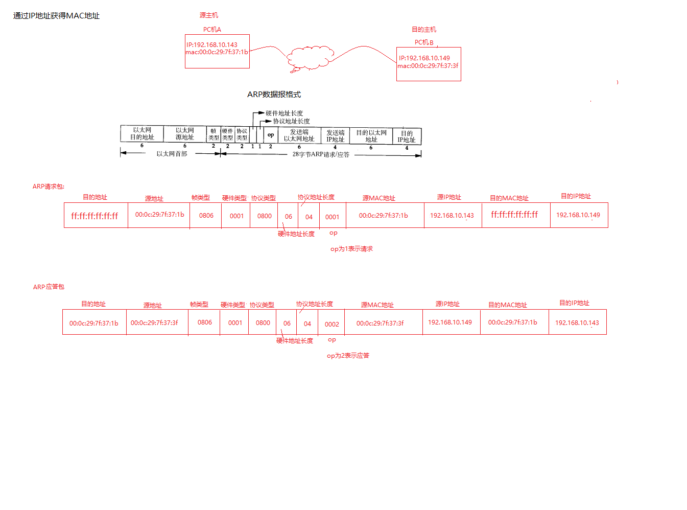
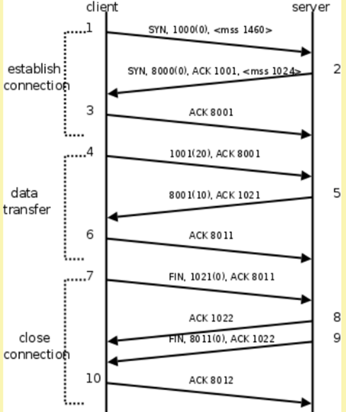
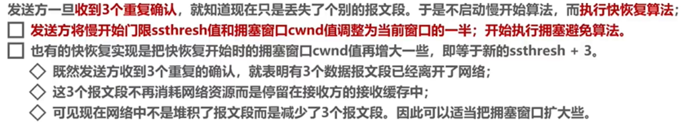

# 1 网络原理


## 1.1协议

### 1.1.1、文件传输

* 第一次:传输文件名，接收方接收到文件名，应答OK给传输方;
* 第二次:发送文件的尺寸，接收方接收到该数据再次应答一个OK;
* 第三次:传输文件内容。同样，接收方接收数据完成后应答 OK表示文件内容接收成功。


### 1.1.2、典型协议

传输层 常见协议有TCP/UDP协议。

应用层 常见的协议有HTTP协议，FTP协议。

网络层 常见协议有IP协议、ICMP协议、IGMP协议。

网络接口层（数据链路层）常见协议有ARP协议、RARP协议。

* **TCP**[传输控制协议](http://baike.baidu.com/view/544903.htm)（Transmission Control Protocol）是一种面向连接的、可靠的、基于字节流的[传输层](http://baike.baidu.com/view/239605.htm)通信协议。
* **UDP**用户数据报协议（User Datagram Protocol）是[OSI](http://baike.baidu.com/view/113948.htm)参考模型中一种无连接的[传输层](http://baike.baidu.com/view/239605.htm)协议，提供面向事务的简单不可靠信息传送服务。
* **HTTP**[超文本传输协议](http://baike.baidu.com/view/468465.htm)（Hyper Text Transfer Protocol）是[互联网](http://baike.baidu.com/view/6825.htm)上应用最为广泛的一种[网络协议](http://baike.baidu.com/view/16603.htm)。
* **FTP**文件传输协议（File Transfer Protocol）
* **IP**协议是[因特网](http://baike.baidu.com/view/1706.htm)互联协议（Internet Protocol）
* **ICMP**协议是Internet控制[报文](http://baike.baidu.com/view/175122.htm)协议（Internet Control Message Protocol）它是[TCP/IP协议族](http://baike.baidu.com/view/2221037.htm)的一个子协议，用于在IP[主机](http://baike.baidu.com/view/23880.htm)、[路由](http://baike.baidu.com/view/18655.htm)器之间传递控制消息。
* **IGMP**协议是 Internet 组管理协议（Internet Group Management Protocol），是因特网协议家族中的一个组播协议。该协议运行在主机和组播路由器之间。
* **ARP**协议是正向[地址解析协议](http://baike.baidu.com/view/149421.htm)（Address Resolution Protocol），通过已知的IP，寻找对应主机的[MAC地址](http://baike.baidu.com/view/69334.htm)。
* **RARP**是反向地址转换协议，通过MAC地址确定IP地址。


### 1.1.3、OSI模型

​	OSI是Open System Interconnection的缩写, 意为开放式系统互联. [国际标准化组织](https://baike.so.com/doc/5340499-5575942.html)(ISO)制定了OSI模型, 该模型定义了不同计算机互联的标准, 是设计和描述计算机网络通信的基本框架.

网络分层 OSI 7层模型: 物数网传会表应 

* 物理层---双绞线，光纤（传输介质），将模拟信号转换为数字信号
* 数据链路层---数据校验，定义了网络传输的基本单位-帧 
* 网络层---定义网络，两台机器之间传输的路径选择点到点的传输
* 传输层---传输数据 TCP，UDP，端到端的传输 
* 会话层---通过传输层建立数据传输的通道. 
* 表示层---编解码，翻译工作.
* 应用层---为客户提供各种应用服务，email服务，ftp服务，ssh服务 


### 1.1.4、网络通信过程

​	通信过程: 其实就是发送端层层打包, 接收方层层解包.

​    注意: 这些操作不是用户自己做的, 而是底层帮我们做好的


### 1.1.5、网络应用程序设计模式

**C/S模式**

​     传统的网络应用设计模式，客户机(client)/服务器(server)模式。需要在通讯两端各自部署客户机和服务器来完成数据通信。

**B/S模式**

​	浏览器()/服务器(server)模式。只需在一端部署服务器，而另外一端使用每台PC都默认配置的浏览器即可完成数据的传输。

**优缺点**

​     对于C/S模式来说，其优点明显。客户端位于目标主机上可以保证性能，将数据缓存至客户端本地，从而**提高数据传输效率**。且，一般来说客户端和服务器程序由一个开发团队创作，所以他们之间**所采用的协议相对灵活**。可以在标准协议的基础上根据需求裁剪及定制。例如，腾讯公司所采用的通信协议，即为ftp协议的修改剪裁版。

​     因此，传统的网络应用程序及较大型的网络应用程序都首选C/S模式进行开发。如，知名的网络游戏魔兽世界。3D画面，数据量庞大，使用C/S模式可以提前在本地进行大量数据的缓存处理，从而提高观感。

​     C/S模式的缺点也较突出。由于客户端和服务器都需要有一个开发团队来完成开发。**工作量**将成倍提升，开发周期较长。另外，从用户角度出发，需要将客户端安插至用户主机上，对用户主机的**安全性构成威胁**。这也是很多用户不愿使用C/S模式应用程序的重要原因。

​     B/S模式相比C/S模式而言，由于它没有独立的客户端，**使用标准浏览器作为客户端**，其工作**开发量较小**。**只需开发服务器端即可**。另外由于其采用浏览器显示数据，因此移植性非常好，**不受平台限制**。如早期的偷菜游戏，在各个平台上都可以完美运行。

​     B/S模式的缺点也较明显。由于使用第三方浏览器，因此**网络应用支持受限**。另外，没有客户端放到对方主机上，**缓存数据不尽如人意**，从而传输数据量受到限制。应用的观感大打折扣。第三，必须与浏览器一样，采用标准http协议进行通信，**协议选择不灵活**。

​     因此在开发过程中，模式的选择由上述各自的特点决定。根据实际需求选择应用程序设计模式。


**C/S设计模式优缺点：**

**优点:**

* 客户端在本机上可以保证性能, 可以将数据缓存到本地, 提高数据的传输效率, 提高用户体验效果.
* 客户端和服务端程序都是由同一个开发团队开发, 协议选择比较灵活.

**缺点:**

* 服务器和客户端都需要开发，工作量相对较大, 调试困难, 开发周期长;
* 从用户的角度看, 需要将客户端安装到用户的主机上, 对用户主机的安    全构成威胁.

**B/S设计模式优缺点：**

**优点:**

* 无需安装客户端, 可以使用标准的浏览器作为客户端;
* 只需要开发服务器，工作量相对较小;
* 由于采用标准的客户端, 所以移植性好, 不受平台限制.
* 相对安全，不用安装软件

**缺点:**

* 由于没有客户端, **数据缓冲不尽人意, 数据传输有限制,** 用户体验较差;
* 通信协议选择**只能使用HTTP协议**，协议选择不够灵活;


### 1.1.6 以太网帧协议

从网卡上发送出去的数据都是以太网帧格式，以太网帧格式就是包装在网络接口层(数据链路层)的协议。


### 1.1.7、ARP协议

通过IP地址获得MAC地址

对于主机来说，发送数据需要对数据进行封装，应用层首先要发送一个数据，传输层会将数据进行分段（数据过大时划分报文段），网络层对报文段添加首部形成IP数据报（分组），其中主要包括源主机地址与目的主机地址（根据DNS得到），到了链路层在进行封装加上MAC地址，其中除了源MAC地址，还需要目的MAC地址，那么源地址知道，**目的MAC地址**怎么获得呢（ARP协议解决）。
每一台主机和路由器上都有一个**ARP高速缓存**，其中存放的是某一个IP地址及其对应MAC地址的映射。因此只需要查询ARP高速缓存就能得到目的IP地址对应的MAC地址。而当ARP高速缓存中没有目的IP地址及其对应的MAC地址，那么便需要**ARP协议。**

* ARP协议
	* 首先会**广播一个ARP请求**，源主机会发送一个数据帧，其中包含源IP地址、目的IP地址，源MAC地址，目的物理地址（全1）。
	* 当数据帧从主机到集线器再到交换机，交换机原本不会随意的转发分组（帧），但是全F为广播分组的，那么交换机会将广播分组从所有端口发送出去。其他主机收到广播，由于IP地址不对应，会丢弃该数据，而当目的主机接收到了该分组后会**回应一个单播（只发送给一个主机）ARP响应分组**。其包括目的IP地址及其MAC地址，那么会完成**数据链路层的封装**。



### 1.1.8、IP协议


* 数据报内容：

	* 协议版本: ipv4, ipv6

	* 16位总长度: 最大65536

	* 8位生存时间ttl(网络连接下一跳的次数): 为了防止网络阻塞

	* 32位源ip地址, 共个4字节！我们熟悉的ip都是点分十进制的，4字节, 每字节对应一个点分位，最大为255 ，实际上就是整形数！

	* 32位目的ip地址 

	* 8位协议: 用来区分上层协议是TCP, UDP, ICMP还是IGMP协议.

	* 16位首部校验和: 只校验IP首部, 数据的校验由更高层协议负责.

* 通过IP 地址来确定网络环境中的唯一的一台主机:
* 主机上使用端口号未区分不同的应用程序
* IP+端口唯一确定唯一台主机上的一个应用程序


### 1.1.9、TCP协议


* 数据报：

	* 序号: TCP是安全可靠的, 每个数据包都带有序号, 当数据包丢失的时候, 需要重传, 要使用序号进行重传. 控制数据有序, **丢包重传.**

	*  确认序号: 使用确认序号可以知道对方是否已经收到了, 通过确认序号可以知道哪个序号的数据需要重传.

	* 16位窗口大小--滑动窗口(主要进行**流量控制**)

​		**面向连接的，稳定的, 安全的, 可靠的**。与UDP协议一样也有源端口号和目的端口号，通讯的双方由IP地址和端口号标识。32位序号、32位确认序号、窗口大小稍后详细解释。4位首部长度和IP协议头类似，表示TCP协议头的长度，以4字节为单位，因此TCP协议头最长可以是4x15=60字节，如果没有选项字段，TCP协议头最短20字节。URG、ACK、PSH、RST、SYN、FIN是六个控制位，本节稍后将解释SYN、ACK、FIN、RST四个位，其它位的解释从略。16位检验和将TCP协议头和数据都计算在内


### 1.1.10、UDP协议


​		一般的网络通信都是像TFTP协议这样，通信的双方分别是客户端和服务器，客户端主动发起请求（上面的例子就是客户端发起的请求帧），而服务器被动地等待、接收和应答请求。客户端的IP地址和端口号唯一标识了该主机上的TFTP客户端进程，服务器的IP地址和端口号唯一标识了该主机上的TFTP服务进程，由于客户端是主动发起请求的一方，它必须知道服务器的IP地址和TFTP服务进程的端口号，所以，一些常见的网络协议有默认的服务器端口，例如HTTP服务默认TCP协议的80端口，FTP服务默认TCP协议的21端口，TFTP服务默认UDP协议的69端口（如上例所示）。在使用客户端程序时，必须指定服务器的主机名或IP地址，如果不明确指定端口号则采用默认端口，请读者查阅ftp、tftp等程序的man page了解如何指定端口号。/etc/services中列出了所有well-known的服务端口和对应的传输层协议，这是由IANA（Internet Assigned Numbers Authority）规定的，其中有些服务既可以用TCP也可以用UDP，为了清晰，IANA规定这样的服务采用相同的TCP或UDP默认端口号，而另外一些TCP和UDP的相同端口号却对应不同的服务。

​		UDP协议**不面向连接，也不保证传输的可靠性**，例如：

​		发送端的UDP协议层只管把应用层传来的数据封装成段交给IP协议层就算完成任务了，如果因为网络故障该段无法发到对方，UDP协议层也**不会给应用层返回任何错误信息**。

​		接收端的UDP协议层只管把收到的数据根据端口号交给相应的应用程序就算完成任务了，如果发送端发来多个数据包并且在网络上经过不同的路由，到达接收端时顺序已经错乱了，UDP协议层也**不保证按发送时的顺序交给应用层**。

​		通常接收端的UDP协议层将收到的数据放在一个固定大小的缓冲区中等待应用程序来提取和处理，如果应用程序提取和处理的速度很慢，而**发送端发送的速度很快**，就会**丢失数据包，UDP协议层并不报告这种错误**。

​		因此，使用UDP协议的应用程序必须考虑到这些可能的问题并实现适当的解决方案，例如等待应答、超时重发、为数据包编号、流量控制等。一般使用UDP协议的应用程序实现都比较简单，只是发送一些对可靠性要求不高的消息，而不发送大量的数据。例如，基于UDP的TFTP协议一般只用于传送小文件（所以才叫trivial的ftp），而基于TCP的FTP协议适用于     各种文件的传输。TCP协议又是如何用面向连接的服务来代替应用程序解决传输的可靠性问题呢。


### 1.1.11、FTP协议

​		从A上传文件到服务器B，需要在A和B之间制定一个双方都认可的规则,这个规则就称为文件传输协议,该协议是ftp协议的一个初级版本,后经过不断的完善,优化最终形成了一个完成的ftp协议.


8. 


## 1.2 TCP/UDP连接

### 1.2.1、三次握手

**为什么TCP是面向连接的安全可靠的传输？**

* TCP是面向连接的安全的数据传输, 在客户端与服务端建立建立的时候要经过三次握手的过程, 在客户端与服务端断开连接的时候要经历四次挥手的过程, 下图是客户端与服务端三次握手建立连接, 数据传输和断开连接四次挥手的全过程.
* TCP时序：




建立连接：客户端使用connect进行连接。经历**三次握手**才能建立连接

```c++
第一次：
客户端发送连接请求报文段，无应用层数据，此时，SYN = 1，表明这是请求报文/确认报文，seq即序号，随机生成x位。
第二次：
服务器端为该TCP连接分配缓存和变量，并向客户端返回确认报文段，允许连接，无应用层数据。
SYN = 1，ACK = 1，说明确认号有效，确认号ack = x+1
第三次：
客户端为该TCP连接分配缓存和变量，并向服务器端返回确认的确认，可以携带数据。
SYN=0，ACK=1，seq=x+1，ack=y+1
```


* **第一次握手**：请求连接
	* 刚开始客户端处于closed状态，服务端处于Listen状态，进行三次握手。
	* 客户端首先发送给服务器端SYN信号，表示要建立连接；
	* 1000为累加的初始化序列号seq=x，是随机的；
	* (0)表示数据长度，此时没有数据，SYN = 1时，报文段不能携带数据，但是要消耗掉一个符号；
	* mss表示客户端能接收的服务器发送的数据长度最多为1460，超过就会截断
	* **发送完SYN请求之后，客户端为SYN_SENT状态。**
* **第二次握手**：确认客户端请求
	* 服务器端接收SYN请求报文后，同意连接，会发送自己的SYN报文作为应答。
	* 此时**服务器端会为该TCP连接分配资源**（缓存和变量）
	* 8000为初始化序列号seq = y，和确认序列号ack = x(1000) + 1,以及确认号ACK = 1，表示确认序列号有效。
	* mss表示服务端能接收的客户端所发送的数据长度最多为1024.超过就会截断。
	* 此时服务器处于SYN_Receive（确认接收状态），客户端处于SYN_sent（发送等待状态）

* **第三次握手**：确认服务端确认
	* 客户端收到服务端的SYN+ACK之后，也会发送一个ACK报文，ACK=1，ack = y+1，表示接收到了服务端的SYN报文
	* 此时**客户端**处于ESTABLISHED(确认连接状态)，**为该TCP连接分配资源**（缓存和变量）


**个人理解：**

* seq（ISN）的作用只是单纯的提供系列号数值，作为SYN同步序列号的数据，当对方返回ack = seq+1，也就是说对方收到了你之前的连接请求（报文），你俩的通信过程一直是ok的。


**其余问题：**

* **ISN不固定，是动态生成的**，其随时间而变化，因此每个连接都将具有不同的ISN（初始序号）
	* 三次握手的其中一个重要功能就是客户端和服务端交换ISN，以便让对方知道接下来接收数据的时候如何按序列号组装数据，如果是固定的，攻击者很容易猜出后续的确认号。
* 三次握手中，**第一次、第二次不能携带数据**，而第三次发送SYN报文后，客户端已经处于建立连接的状态。对于客户端来说，他已经建立起来连接了，且已经知道了服务器的接收、发送能力是正常的了，所以能携带数据。
	* SYN = 1时，报文段不携带数据，SYN = 0时，可以携带数据。

* 三次握手和四次挥手的过程都是在内核实现的.


**SYN泛洪攻击：**

​		**服务器端的资源分配是第二次挥手，客户端分配资源是在第三次挥手。**

​		SYN洪泛攻击发生在OSI第四层，这种方式利用TCP协议的特性，就是三次握手，其攻击发生在第二次握手。

​		SYN攻击就是Client在短时间内伪造大量不存在的IP地址，并向服务端不断发送SYN包，SYN是TCP三次握手中的第一个数据包，而当服务器返回ACK后，由于源地址不存在，该攻击者就不对其进行再确认，那这个TCP连接就处于挂起状态，也就是所谓的半连接状态，服务器收不到再确认的话，还会重复发送ACK给攻击者。这样更加会浪费服务器的资源。攻击者就对服务器发送非常大量的这种TCP连接，由于每一个都没法完成三次握手，所以在服务器上，这些TCP连接会因为挂起状态而消耗CPU和内存，最后服务器可能死机，就无法为正常用户提供服务了。


### 1.2.2、四次挥手

```c++
1. 客户端发送连接释放报文段，停止发送数据，主动关闭TCP连接。
	FIN=1， seq=u
2. 服务器端回送一个确认报文段，客户到服务器这个方向的连接就释放了--半关闭状态。
	ACK=1，seq=v， ack=u+1  #半关闭即客户端虽然不再发送了，但是服务器还可以发送
3. 服务器端发完数据，就发出连接释放报文段，主动关闭TCP连接。
	FIN=1，ACK=1，seq=w，ack=u+1
4. 客户端回送一个确认报文段，再等到时间等待计时器设置的2MSL(最长报文段寿命)后，连接彻底关闭。
	ACK=1，seq=u+1，ack=w+1
```


客户端和服务端都可以主动发起四次挥手。

在socket编程中，任何一方执行close()操作即可产生挥手操作。

假设客户端先发起：

**第一次挥手：**客户端请求释放连接

* 客户端发送连接请求，发送一个FIN报文（连接释放报文段），报文标识为FIN（FIN = 1），初始序列号随机（seq = u）
* 发送后客户端停止发送数据，主动关闭TCP连接，进入FIN_WAIT1状态，等待服务端确认
* 此时客户端处于FIN_WAIT1（终止等待状态），服务端处于建立连接阶段。

**第二次挥手：**服务器端确认

* 服务端收到FIN请求报文后，会发送ACK报文，将接收到的客户端的序列号值（seq）+作为ACK报文的序列号值，表明已经收到客户端的报文了。
* 服务端收到连接释放报文后发送确认报文端，ACK标识=1，确认号ack = u+1，自己的序列值seq = v（v随机）。
* 此时服务端处于CLOSE_WAIT（关闭等待状态），而客户端在接收到确认后，进入FIN-WAIT-2(终止等待状态2)，等待服务器端发出连接释放报文段。

**第三次挥手：**服务器端请求释放连接

* 如果服务端可想断开连接了，和客户端第一次挥手一样，发送FIN报文，指定一个序列号seq = w，确认号ACK，序列值ack = u+1。
* 此时服务端处于LAST_ACK（关闭连接状态），等待客户端确认

**第四次挥手：**客户端确认

* 客户端收到FIN后，发送ACK报文作为应答，且将服务器端发送的FIN序列号值seq+1作为ACK的序列号值ack
* 此时客户端处于TIME_WAIT状态，需要**一阵子（2MSL）**以确保服务端收到自己的ACK报文，服务端收到ACK报文之后，会CLOSE。而之后，经过等待计时器设置时间到2MSL后，客户端进入CLOSE状态。


同步总流程：

* 在具体通信过程中，数据的传输也伴随这SYN与ACK
* 而下一次的seq都是上一次的+1.
* 当发送数据时，是发送到对方的读缓冲区，这都是内核完成的。


**2MSL：**

* 原因1：

​		让四次挥手的过程更可靠，**确保最后一个发送给对方的 ACK 到达;若对方没有收到 ACK应答，对方会再次发送FIN 请求关闭，**此时在 2MSL时间内被动关闭方仍然可以发送 ACK给对方.

* 原因2：

​       **TIME_WAIT一定是出现在主动关闭的一方**, 也就是说2MSL是针对主动关闭一方来说的;由于TCP有可能存在丢包重传, **丢包重传若发给了已经断开连接之后相同的socket-pair(该连接是新建的, 与原来的socket-pair完全相同, 双方使用的是相同的IP和端口),** 这样会对之后的连接造成困扰, 严重可能引起程序异常.因此需要2MSL。


### **1.2.3、TCP拥塞控制**

**出现拥塞的条件:**

* 对资源需求的总和>可用资源
* 网络中有许多资源同时呈现供应不足----->网络性能变坏 ------>网络吞吐量将随输入负荷增大而下降
	* 如果**发送端发送的速度较快**，**接收端接收到数据后处理的速度较慢**，而**接收缓冲区的大小是固定**的，就会导致接收缓冲区满而丢失数据。TCP协议通过“**滑动窗口**（Sliding Window）”机制解决这一问题。
* 拥塞控制（流量控制）:
	* 防止过多的数据注入到网络

* 滑动窗口：


**拥塞控制算法**：

四大算法：

1. 慢启动
2. 拥塞避免
3. 快重传
4. 快恢复

#### 1.2.3.1.  慢启动

概念：

* TCP刚建立连接时，一点一点提速，试探网络的承受能力，以免扰乱网络通道的秩序。

算法：

* 连接建好的，开始先初始化**拥塞窗口cwnd**大小为1，表明可以传输一个MSS大小的数据
* 每当收到一个ACK，cwnd的大小+1，呈线性上升。
* 每当过了一个往返延迟时间RTT（传输轮次），cwnd大小直接翻倍，乘以2，呈指数上升
* 当窗口大小达到慢开始门限（ssthresh），则进入拥塞避免，窗口大小的增长速率减小，但是还在增长。


#### 1.2.3.2. 拥塞避免算法

当**窗口大小达到慢开始门限（ssthresh），则进入拥塞避免：**

* 收到一个ACK，则cwnd = cwnd +1/cwnd
* 每当过了一个RTT，cwnd大小加1。

**拥塞发生状态时的算法**

​	一般来说，TCP拥塞控制**默认认为网络丢包是由于网络拥塞导致的**。因此，一般的TCP拥塞控制算法**以丢包为网络拥塞状态的信号**。

**丢包的两种判定方式**：

* 超时重传RTO
	* 超时重传RTO超时，TCP会重传数据包
		* 由于发生丢包，将慢启动阈值ssthresh设置为当前cwnd的一半，即ssthresh = cwnd/2
		* cwnd重置为1
		* 进入慢启动过程
		* 由于丢包就要一切重来，不稳定，**此方法已经丢弃不用**
* **收到三个重复确认ACK**
	* 收到三个重复确认ACK，TCP开启快速重传算法，而不用等到RTO超时在重传
		* cwnd大小缩小为当前的一半
		* ssthresh设置为缩小后的cwnd大小
		* 进入快速重传算法


#### 1.2.3.3.  快重传：


​		发送方一旦收到3个连续的重复确认，就将相应的报文段**立即重传，而不是等该报文段的超时重传计时器超时再重传**。对于个别丢失的报文段，发送方不会出现超时重传，也就不会误认为出现了拥塞(进而降低拥塞窗口cwnd为1)。使用快重传可以使整个网络的吞吐量提高约20%。


#### 1.2.3.4. 快恢复



​	TCP Reno有快恢复算法，在进入快恢复之前，cwnd和ssthresh已经被更改为原有cwnd的一半，

* cwnd = cwnd + 3MSS（收到了3个重复的ACK）
* 重传DACKs指定的数据包
* 如果再收到DACKs，cwnd大小+1.
* **如果收到了新的ACK，表明重传的包成功了，退出快速恢复算法，将cwnd设置为ssthresh，然后进入拥塞避免算法**。


### 1.2.4、MTU

mss和MTU

MTU: 最大传输单元

MTU:通信术语最大传输单元（Maximum Transmission Unit，MTU）

​		是指一种通信协议的某一层上面所能通过的最大数据包大小（以字节为    单位). 最大传输单元这个参数通常与通信接口有关（网络接口卡、串   口等), 这个值如果设置为太大会导致丢包重传的时候重传的数据量较大, 图中的最大值是1500, 其实是一个经验值.


mss: 最大报文长度, 只是在建立连接的时候, 告诉对方我最大能够接收多少       数据, 在数据通信的过程中就没有mss了.


### 1.2.5、粘包/拆包

概念：

* 一个完整的业务被TCP拆分为多个包进行发送，也可能把多个小的包封装成一个大的数据包发送。

原因：

* 对方发送了两次数据，第一次读数据时吧第一次发的数据没读完，剩余的数据放在第二次读走了。
	* 应用程序写入数据的字节大于套接字发送缓冲区的大小
	* 进行MSS大小的TCP分段
	* 以太网的payload大于MTU进行IP分片

缺点：

* 会对后面的数据判断有问题

解决方案：

* **方案1: 包头+数据**

	如4位的数据长度+数据 -----------> 00101234567890 

	其中0010表示数据长度, 1234567890表示10个字节长度的数据.

	另外, 发送端和接收端可以协商更为复杂的报文结构, 这个报文结构就相当于双方约定的一个协议.

* 方案2: 添加结尾标记.

​		如结尾最后一个字符为\n \$等.进行分割

* 方案3: 数据包定长

	 如发送方和接收方约定, 每次只发送128个字节的内容, 接收方接收定长128个字节就可以了.


## 1.3 HTTP

HTTP（超文本传输协议）是一种用于在客户端（如浏览器）与服务器之间传输超文本（如HTML）及多种类型数据的应用层协议。它支持**网页内容的请求与传输、资源获取、API接口通信，通过缓存控制优化性能，并可通过HTTPS实现安全通信。**随着版本更新（如HTTP/2、HTTP/3），HTTP协议不断提升效率与安全性。

### 1.3.**1 完整的HTTP请求**

url访问-->域名解析-->发起TCP的3次握手--->建立TCP连接后发起http请求---->服务器相应http请求，浏览器得到html代码--->浏览器解析html代码，并请求html代码中的资源--->浏览器对页面进行渲染呈现给用户


### 1.3.2 http请求格式

**http请求消息：**

* http协议请求报文格式:
	* **请求行**(第1行) :GET /test.txt HTTP/1.1  说明请求类型txt,要访问的资源text.txt,以及使用的 http版本1.1
	* **请求头**(2~9) :健值对,说明服务器使用的附加信息,都是键值对,比如表明浏览器类型
	*  **空行** (10):\r\n  不能省略-而且是\r\n,包括请求行和请求头都是以\r\n 结尾
	* **请求数据**(1) :表明请求的特定数据内容,可以省略-如登陆时,会将用户名和密码内容作为请求数据


**http响应消息：**

* 服务器给客户端发送的数据

*  http协议响应消息格式:

	* **状态行**（第一行）：  200 表示成功, 404 表示请求的资源不存在
	* **消息报头** （第2 -11行）：健值对
	* **空行**（第12行） \r\n
	* **响应正文**（第13-18行）： 服务器给客户端回复的数据

	


### 1.3.3 http**请求类型**


例：

```html
<HTML>
<TITLE>Index</TITLE>
<BODY>
<P>Welcome to J. David's webserver.
<H1>post demo
<FORM METHOD="post">
User: <INPUT TYPE="text" NAME="user">
Psswd: <INPUT TYPE="password" NAME="user">
<INPUT TYPE="submit">
</FORM>
</BODY>
</HTML>
```

**使用get：**

* **请求的参数会被附加到URL上**，这意味着它们会暴露在浏览器历史记录、网络日志、服务器日志等中。因此，对于敏感信息（如密码或身份验证令牌），GET方法通常是不安全的。
* get一般用来获取数据，比如向服务器请求数据，要不然数据过多时提交数据url没办法存这么多。


**使用post：**

* **请求的参数不会出现在URL中，而是作为请求体的一部分发送**。这使得POST请求在处理敏感信息时更加安全。
* post是修改数据，比如向服务器提交数据


### 1.3.4长连接和短连接

HTTP长连接（Persistent Connection）和短连接（Short Connection）在HTTP协议中用于管理客户端和服务器之间的连接状态。以下是它们之间的主要区别：

**HTTP短连接**

HTTP短连接是HTTP/1.0中默认的连接方式。**每次HTTP请求/响应完成后，连接都会被关闭**。这意味着**对于每个新的HTTP请求，都需要重新建立一个新的TCP连接，这通常涉及三次握手和四次挥手的开销**。

**特点**：

* 每个请求/响应后连接都会关闭。
* 需要为每个请求重新建立TCP连接。
* 效率较低，因为TCP连接建立和关闭的开销较大。
* 适用于不频繁或轻量级的请求。


**HTTP长连接**

HTTP长连接，也被称为持久连接或HTTP keep-alive连接，是HTTP/1.1中的默认行为。**在一个TCP连接上可以连续发送多个请求，而不必等待之前请求的响应。只要任意一端没有明确提出关闭连接，该连接就保持打开状态。**

**特点**：

* 可以在同一个TCP连接上连续发送多个HTTP请求，而不需要重新建立连接。
* 通过减少TCP连接建立和关闭的开销，提高了效率。
* 减少了网络拥堵和延迟，因为TCP连接可以更快地被重新利用。
* 适用于频繁或重量级的请求。

**使用方式**：

* 客户端在HTTP请求头中包含`Connection: keep-alive`字段来告知服务器它希望保持连接。
* 服务器在响应头中同样包含`Connection: keep-alive`字段来确认它同意保持连接。
* 双方可以通过设置`Keep-Alive: timeout=value`来指定连接的空闲超时时间。

**注意事项**：

* 长连接并不意味着连接会一直持续下去。如果空闲时间超过了设置的超时时间，或者任意一方主动关闭了连接，连接就会断开。
* 在某些情况下，例如网络条件不佳或服务器资源紧张时，服务器可能会选择关闭连接，而不是保持空闲连接。
* 客户端和服务器都应该能够正确处理连接断开的情况，以便在需要时重新建立连接。

**总结**：
HTTP长连接通过减少TCP连接建立和关闭的开销来提高效率，适用于频繁或重量级的请求。而HTTP短连接则需要在每次请求/响应后都关闭连接，效率较低。在实际应用中，应根据具体的应用场景和需求来选择使用哪种连接方式。


### 1.3.5 web服务器

```c
选择使用epoll模型作为web服务器:
1 创建socket
2 设置端口复用
3 绑定
4 监听
5 创建epoll树
6 将监听文件描述符上epoll树
7 while(1)
  {
  	nready = epoll_wait();
  	if(nready<0)
  	{
  	
  	}
  	
  	for(i=0; i<nready; i++)
  	{
	  	//若是有新的客户端连接到来,则接受新的客户端连接, 然后上epoll树
	  	if(lfd==events[i].data.fd)
	  	{
	  		cfd = accept();
	  		epoll_ctl(epfd, cfd, EPOLL_CTL_ADD, &ev);
	  	}
	  	else
	  	{ 	
	  		http_request(cfd);
	  	}
  	}
  	
  }	
  
 //处理客户端的请求
 int http_request(int cfd)
 {
 	//读取数据
 	//先读取一行, 可以获得浏览器想请求的文件
 	//然后循环将剩余的数据读完
 	
 	//查看本地是否有这个文件
 		---若没有这个文件, 则组织应答信息并且将404.jpg文件内容发送给浏览器
 		---若有个这个文件, 则判断文件类型
 			----若是普通文件, 则组织应答消息并且将文件内容发送给浏览器
 			----若是目录, 则组织应答消息, 响应正文部分将目录下的所有文件组织
 			成文件列表的形式生成html文件(每个文件都是一个超连接), 然后发送给浏览器 
 }
	
	
read函数读通信文件描述符是阻塞的, 所以在while中循环读的时候若读完数据了会引起阻塞;
所以应该将通信文件描述符设置为非阻塞.

char *path = getenv("HOME");

遍历目录的函数:
1 opendir readdir closedir
2
	int scandir(const char *dirp, struct dirent ***namelist,
                int (*filter)(const struct dirent *),
                int (*compar)(const struct dirent **, const struct dirent **));

#include <stdio.h>
#include <stdlib.h>
#include <dirent.h>
int main(void)
{
   struct dirent **namelist;
   int n;

   n = scandir(".", &namelist, NULL, alphasort);
   if (n < 0)
       perror("scandir");
   else {
       while (n--) {
           printf("%s\n", namelist[n]->d_name);
           free(namelist[n]);
       }
       free(namelist);
   }
}


<html><head><title>Index of ./</title></head>
<body bgcolor="#99cc99"><h4>Index of ./</h4>
<ul type=circle>
	<--文件列表部分-->
	<li>
		<a href=filename>filename</a>
	</li>
</ul>
<address><a href="http://www.itcast.com/">xhttpd</a></address>
</body></html>

SIGPIPE信号的产生: 若服务端传输数据的时候, 浏览器连接关闭, 此时由于是正在写一个
没有读端的连接, 此时内核会给web服务端发送SIGPIPE信号.
```


```c
//web服务端程序--使用epoll模型
#include <unistd.h>
#include <sys/epoll.h>
#include <fcntl.h>
#include <sys/stat.h>
#include <string.h>
#include <signal.h>
#include <dirent.h>
#include "pub.h"
#include "wrap.h"

int http_request(int cfd,int epfd);

int main()
{
	//改变当前进程的工作目录
	char path[255] = {0};
	sprintf(path, "%s/%s", getenv("HOME"), "webpath");
	chdir(path);
	
	//创建socket--设置端口复用---bind
	int lfd = tcp4bind(9999, NULL);
	
	//设置监听
	Listen(lfd, 128);

	//创建epoll树
	int epfd = epoll_create(1024);
	if(epfd<0)
	{
		perror("epoll_create error");
		close(lfd);
		return -1;
	}
	
	//将监听文件描述符lfd上树
	struct epoll_event ev;
	ev.data.fd = lfd;
	ev.events = EPOLLIN;
	epoll_ctl(epfd, EPOLL_CTL_ADD, lfd, &ev);
	
	int i;
	int cfd;
	int nready;
	int sockfd;
	struct epoll_event events[1024];
	while(1)
	{
		//等待事件发生
		nready = epoll_wait(epfd, events, 1024, -1);
		if(nready<0)
		{
			if(errno==EINTR)
			{
				continue;
			}
			break;
		}
		
		for(i=0; i<nready; i++)
		{
			sockfd = events[i].data.fd;
			//有客户端连接请求
			if(sockfd==lfd)
			{
				//接受新的客户端连接
				cfd = Accept(lfd, NULL, NULL);
				
				//设置cfd为非阻塞
				int flag = fcntl(cfd, F_GETFL);
				flag |= O_NONBLOCK;
				fcntl(cfd, F_SETFL, flag);
				
				//将新的cfd上树
				ev.data.fd = cfd;
				ev.events = EPOLLIN;
				epoll_ctl(epfd, EPOLL_CTL_ADD, cfd, &ev);
			}
			else 
			{
				//有客户端数据发来
				http_request(cfd，epfd);
			}			
		}		
	}
}

int send_header(int cfd, char *code, char *msg, char *fileType, int len)
{
	char buf[1024] = {0};
	sprintf(buf, "HTTP/1.1 %s %s\r\n", code, msg);
	sprintf(buf+strlen(buf), "Content-Type:%s\r\n", fileType);
	if(len>0)
	{
		sprintf(buf+strlen(buf), "Content-Length:%d\r\n", len);
	}
	strcat(buf, "\r\n");
	Write(cfd, buf, strlen(buf));
	return 0;
}

int send_file(int cfd, char *fileName)
{
	//打开文件
	int fd = open(fileName, O_RDONLY);
	if(fd<0)
	{
		perror("open error");
		return -1;
	}
	
	//循环读文件, 然后发送
	int n;
	char buf[1024];
	while(1)
	{
		memset(buf, 0x00, sizeof(buf));
		n = read(fd, buf, sizeof(buf));
		if(n<=0)
		{
			break;
		}
		else 
		{
			Write(cfd, buf, n);
		}
	}
}

int http_request(int cfd,int epfd)
{
	int n;
	char buf[1024];
	//读取请求行数据, 分析出要请求的资源文件名
	memset(buf, 0x00, sizeof(buf));
	n = Readline(cfd, buf, sizeof(buf));
    if(n<=0){  //读为0时，对方关闭连接或者读异常
        perror("connect is closed");
        closed(cfd);
        epoll_ctl(epfd,EPOLL_CTL_DEL,cfd,NULL); //下树
        return -1;
    }
	printf("buf==[%s]\n", buf);
	//GET /hanzi.c HTTP/1.1
	char reqType[16] = {0};
	char fileName[255] = {0};
	char protocal[16] = {0};
	sscanf(buf, "%[^ ] %[^ ] %[^ \r\n]", reqType, fileName, protocal);
	printf("[%s]\n", reqType);
	printf("[%s]\n", fileName);
	printf("[%s]\n", protocal);
	
	char *pFile = fileName+1;
	printf("[%s]\n", pFile);
	
	//循环读取完剩余的数据
	while((n=Readline(cfd, buf, sizeof(buf)))>0);
	
	//判断文件是否存在
	struct stat st;
	if(stat(pFile, &st)<0)
	{
		printf("file not exist\n");
		
		//发送头部信息
		send_header(cfd, "404", "NOT FOUND", get_mime_type(".html"), 0);
		
		//发送文件内容
		send_file(cfd, "error.html");	
	}
	else //若文件存在
	{
		//判断文件类型
		//普通文件
		if(S_ISREG(st.st_mode))
		{
			printf("file exist\n");
			//发送头部信息
			send_header(cfd, "200", "OK", get_mime_type(pFile), st.st_size);
			
			//发送文件内容
			send_file(cfd, pFile);
		}
		//目录文件
		else if(S_ISDIR(st.st_mode))
		{
			
		}
	}
}
```


## 1.4 HTTPS

1.4.1 概念

* **HTTPS**：HTTPS（HyperText Transfer Protocol Secure，安全超文本传输协议）在HTTP的基础上加入了**SSL/TLS协议**，提供了数据加密、完整性校验和身份验证，使得数据传输更加安全。HTTPS通过加密技术保护数据的机密性，防止数据在传输过程中被窃取或篡改。
* HTTPS默认使用443端口进行通信。
* HTTPS通过SSL/TLS协议建立了一个加密的通道，这个通道是安全的，可以确保数据传输过程中的安全性和完整性。HTTPS的连接过程相对复杂，包括SSL/TLS握手阶段，用于协商加密方式和密钥等。
* HTTPS网址以`https://`开头，表明该网站使用了加密连接。浏览器在访问HTTPS网站时，通常会显示一个锁形图标，表示网站连接是安全的。


## 1.5 DNS

### 1.5.**1 概念**

官方解释：DNS（域名系统)，因特网作为**域名和IP地址相互映射**的一个分布式数据库，能够使用户更方便的访问互联网，而不用去记住能更被机器直接读取的IP数据。

**域名解析：**通过主机名，最终得到主机名对应的IP地址的过程，**使用UDP协议**

* UDP协议快，UDP的DNS协议只需要一个请求，一个应答就可以了，虽然UDP协议传输内容不能超过512字节，但是客户端向DNS查询域名，一般返回的内容都不超过512字节。


# 2 socket编程

​		socket（插座）

​		传统的进程间通信借助内核提供的IPC机制进行, 但是只能限于本机通信, 若要跨机通信, 就必须使用网络通信.( 本质上借助内核-内核提供了**socket伪文件的机制实现通信**----**实际上是使用文件描述符**), 这就需要用到内核提供给用户的socket API函数库.

既然提到socket伪文件, 所以可以使用文件描述符相关的函数read write

* 可以对比pipe管道讲述socket文件描述符的区别 
* 使用socket会建立一个socket pair

如下图, **一个文件描述符操作两个缓冲区**, 这点跟管道是不同的, 管道是两个文件描述符操作一个内核缓冲区.

* 这里是建立了两个链接，关闭一个另一个也可以工作。


## 2.1 socket编程预备知识

​		在TCP/IP协议中，“IP地址+TCP或UDP端口号”唯一标识网络通讯中的一个进程。**“IP地址+端口号”就对应一个socket**。欲**建立连接的两个进程各自有一个socket来标识**，那么这**两个socket组成的socket pair就唯一标识一个连接**。因此可以用Socket来描述网络连接的一对一关系。

​		**在网络通信中，套接字一定是成对出现的。**一端的发送缓冲区对应对端的接收缓冲区。我们使用同一个文件描述符索发送缓冲区和接收缓冲区。


### 2.1.1 网络字节序:

* 大端和小端的概念
	* 大端: 低位地址存放高位数据, 高位地址存放低位数据
	* 小端: 低位地址存放低位数据, 高位地址存放高位数据

大端和小端的使用使用场合：  

* 大端和小端只是对数据类型长度是两个及以上的, 如int  short, 对于单字节    没限制。
*  在网络中经常需要考虑大端和小端的是IP和端口.

**网络传输用的是大端法, 如果机器用的是小端法, 则需要进行大小端的转换.**

​		内存中的多字节数据相对于内存地址有大端和小端之分，磁盘文件中的多字节数据相对于文件中的偏移地址也有大端小端之分。网络数据流同样有大端小端之分，那么如何定义网络数据流的地址呢？发送主机通常将发送缓冲区中的数据按内存地址从低到高的顺序发出，接收主机把从网络上接到的字节依次保存在接收缓冲区中，也是按内存地址从低到高的顺序保存，因此，网络数据流的地址应这样规定：先发出的数据是低地址，后发出的数据是高地址。

​		TCP/IP协议规定，网络数据流应采用大端字节序，即低地址高字节。例如UDP段格式，地址0-1是16位的源端口号，如果这个端口号是1000（0x3e8），则地址0是0x03，地址1是0xe8，也就是先发0x03，再发0xe8，这16位在发送主机的缓冲区中也应该是低地址存0x03，高地址存0xe8。但是，如果发送主机是小端字节序的，这16位被解释成0xe803，而不是1000。因此，发送主机把1000填到发送缓冲区之前需要做字节序的转换。同样地，接收主机如果是小端字节序的，接到16位的源端口号也要做字节序的转换。如果主机是大端字节序的，发送和接收都不需要做转换。同理，32位的IP地址也要考虑网络字节序和主机字节序的问题。


大小端转换的函数:

```c
#include <arpa/inet.h>
uint32_t htonl(uint32_t hostlong);  //本地字节序转网络字节序的长整型
uint16_t htons(uint16_t hostshort); //本地字节序转网络字节序的短整型
uint32_t ntohl(uint32_t netlong);  //网络字节序转本地字节序的长整型
uint16_t ntohs(uint16_t netshort); //网络字节序转本地字节序的短整型
```

​		如果主机是小端字节序，这些函数将参数做相应的大小端转换然后返回，如果主机是大端字节序，这些函数不做转换，将参数原封不动地返回。


IP地址转换函数:

```c
int inet_pton(int af, const char *src, void *dst);
inet_pton(AF_INET, "127.0.0.1", &serv.sin_addr.s_addr);  
```

* p->表示点分十进制的字符串形式
* to->到
* n->表示network网络
* 函数说明: 
	* **将字符串形式的点分十进制IP转换为大端模式的网络IP(整形4字节数)**
* 参数说明:
	* af: AF_INET
	* src: 字符串形式的点分十进制的IP地址
	* dst: 存放转换后的变量的地址

> 手工也可以计算: 如192.168.232.145, 先将4个正数分别转换为16进制数, 
> 192--->0xC0 168--->0xA8  232--->0xE8  145--->0x91
> 最后按照大端字节序存放: 0x91E8A8C0, 这个就是4字节的整形值.

```c
const char *inet_ntop(int af, const void *src, char *dst, socklen_t size);
```

* 函数说明: 
	* **网络IP转换为字符串形式的点分十进制的IP**
* 参数说明:
	* af: AF_INET
	* src: 网络的整形的IP地址
	* dst: 转换后的IP地址,一般为字符串数组
	* size: dst的长度
* 返回值: 
	* 成功--返回指向dst的指针
	* 失败--返回NULL, 并设置errno 

> 例如: IP地址为010aa8c0, 转换为点分十进制的格式:
>
> 01---->1  0a---->10  a8---->168  c0---->192
>
> 由于从网络中的IP地址是高端模式, 所以转换为点分十进制后应该为:     192.168.10.1


### 2.1.2 socket结构体

socket编程用到的重要的结构体:struct sockaddr


**TCP/UDP通信过程中主要使用：**

* struct sockaddr：IPv4
* struct aockaddr_in：IPv6

**本地socket通信主要使用：**

* struct sockaddr_un
* struct sockaddr_in6

```c
struct sockaddr结构说明:
   struct sockaddr {
        sa_family_t sa_family;
        char     sa_data[14];
   }
   
struct sockaddr_in结构:
struct sockaddr_in {
         sa_family_t    sin_family; /* address family: AF_INET */ AF_INET
         in_port_t      sin_port;   /* port in network byte order */ 端口号
         struct in_addr sin_addr;   /* internet address */ ip地址
   };
   /* Internet address. */
   struct in_addr {
         uint32_t  s_addr;     /* address in network byte order */
   };	 //网络字节序IP--大端模式

struct sockaddr_in6 {
	unsigned short int sin6_family; 		/* AF_INET6 */
	__be16 sin6_port; 					/* Transport layer port # */
	__be32 sin6_flowinfo; 				/* IPv6 flow information */
	struct in6_addr sin6_addr;			/* IPv6 address */
	__u32 sin6_scope_id; 				/* scope id (new in RFC2553) */
};
```

​		IPv4和IPv6的地址格式定义在netinet/in.h中，**IPv4地址用sockaddr_in结构体表示**，包括16位端口号和32位IP地址，**IPv6地址用sockaddr_in6结构体表示**，包括16位端口号、128位IP地址和一些控制字段。

​		UNIX Domain Socket的地址格式定义在sys/un.h中，用sock-addr_un结构体表示。各种socket地址结构体的开头都是相同的，前16位表示整个结构体的长度（并不是所有UNIX的实现都有长度字段，如Linux就没有），后16位表示地址类型。IPv4、IPv6和Unix Domain Socket的地址类型分别定义为常数AF_INET、AF_INET6、AF_UNIX。这样，只要取得某种sockaddr结构体的首地址，不需要知道具体是哪种类型的sockaddr结构体，就可以根据地址类型字段确定结构体中的内容。因此，socket API可以接受各种类型的sockaddr结构体指针做参数，例如bind、accept、connect等函数，这些函数的参数应该设计成void *类型以便接受各种类型的指针。


### 2.1.3 socket API

使用socket的API函数编写服务端和客户端程序的步骤图示: 


​	  

#### 1. socket

```c
#include <sys/types.h> /* See NOTES */
#include <sys/socket.h>
int socket(int domain, int type, int protocol);
```

* 函数描述: **创建socket**
* 参数说明:
	* domain: 协议版本
		* AF_INET IPV4
		* AF_INET6 IPV6
		* AF_UNIX AF_LOCAL 本地套接字使用
	* type:协议类型
		* SOCK_STREAM 流式, 默认使用的协议是TCP协议
		* SOCK_DGRAM 报式, 默认使用的是UDP协议
	* protocal: 
		* 一般填0, 表示使用对应类型的默认协议.
* 返回值: 
	* 成功: **返回一个大于0的监听文件描述符**
	* 失败: 返回-1, 并设置errno

当**调用socket函数以后, 返回一个监听文件描述符,** **内核会提供**与该文件描述符相对应的**读和写缓冲区**, 同时还有**两个队列**, 分别是**请求连接队列和已连接队列.**


​	socket()**打开一个网络通讯端口**，如果成功的话，就像open()一样**返回一个文件描述符**，应用程序可以像读写文件一样用read/write在网络上收发数据，如果socket()调用出错则返回-1。对于IPv4，domain参数指定为AF_INET。对于TCP协议，type参数指定为SOCK_STREAM，表示面向流的传输协议。如果是UDP协议，则type参数指定为SOCK_DGRAM，表示面向数据报的传输协议。protocol参数的介绍从略，指定为0即可。

* 在TCP/IP网络编程中，服务器通常首先会创建一个套接字（socket），并绑定到一个特定的IP地址和端口上。然后，服务器会调用`listen()`函数来监听这个套接字上的连接请求。`listen()`函数会将套接字从默认的主动模式（Active Mode）切换到监听模式（Listen Mode），并返回一个监听文件描述符`lfd`。
* 在监听模式下，`lfd`并不会直接发生变化，但它会进入一种特殊的状态，等待客户端的连接请求。当客户端向服务器发送连接请求时，这个请求并不会直接修改`lfd`的值或状态，而是会被操作系统的网络栈接收到，并存储在内核的某个队列中。
* 此时，如果服务器调用`accept()`函数来接受连接请求，`accept()`函数会阻塞等待（除非设置了非阻塞模式），直到有客户端连接请求到来。一旦有客户端连接请求到来，`accept()`函数会从内核的队列中取出这个请求，并创建一个新的套接字来与客户端通信。这个新的套接字的文件描述符会被返回给`accept()`函数的调用者，而原始的监听文件描述符`lfd`则继续保持监听状态，等待下一个客户端连接请求的到来。
* 因此，可以说**当有客户端请求连接时，监听文件描述符`lfd`本身并没有发生变化，但它会进入一种“就绪”状态，表示有客户端连接请求到来。服务器可以通过调用`accept()`函数来接受这个连接请求，并创建一个新的套接字来与客户端通信。**


#### 2. bind

```c
int bind(int sockfd, const struct sockaddr *addr, socklen_t addrlen);
```

函数描述: **将socket文件描述符和IP,PORT绑定**

参数说明:

* sockfd: 调用socket函数返回的文件描述符
* addr: 本地服务器的IP地址和PORT, 

* addrlen: addr变量的占用的内存大小 
* 返回值: 
	* 成功: 返回0
	* 失败: 返回-1, 并设置errno

​		服务器程序所监听的网络地址和端口号通常是固定不变的，客户端程序得知服务器程序的地址和端口号后就可以向服务器发起连接，因此**服务器需要调用bind绑定一个固定的网络地址和端口号**。

​		bind()的作用是**将参数sockfd和addr绑定在一起**，使sockfd这个用于网络通讯的**文件描述符监听addr所描述的地址和端口号。**struct sockaddr *是一个通用指针类型，addr参数实际上可以接受多种协议的sockaddr结构体，而它们的长度各不相同，所以需要第三个参数addrlen指定结构体的长度。

```c
struct sockaddr_in serv;
serv.sin_family = AF_INET;
serv.sin_port = htons(8888);
//serv.sin_addr.s_addr = htonl(INADDR_ANY);
//INADDR_ANY: 表示使用本机任意有效的可用IP
inet_pton(AF_INET, "127.0.0.1", &serv.sin_addr.s_addr);
```

​		首先将整个结构体清零，然后设置地址类型为AF_INET，**网络地址为INADDR_ANY**，这个宏表示本地的任意IP地址，因为服务器可能有多个网卡，每个网卡也可能绑定多个IP地址，这样设置可以在所有的IP地址上监听，直到与某个客户端建立了连接时才确定下来到底用哪个IP地址，端口号为8888。


#### 3. listen

```
int listen(int sockfd, int backlog);
```

* 函数描述: **将套接字由主动态变为被动态**
* 参数说明:
	* sockfd: 调用socket函数返回的文件描述符
	* backlog: 同时请求连接的最大个数(还未建立连接) 
* 返回值:
	* 成功: 返回0
	* 失败: 返回-1, 并设置errno

​		典型的服务器程序可以同时服务于多个客户端，当有客户端发起连接时，服务器调用的accept()返回并接受这个连接，如果有大量的客户端发起连接而服务器来不及处理，尚未accept的客户端就处于连接等待状态，listen()声明sockfd处于监听状态，并且最多允许有backlog个客户端处于连接待状态，如果接收到更多的连接请求就忽略。listen()成功返回0，失败返回-1。


#### 4. accept

```c
int accept(int sockfd, struct sockaddr *addr, socklen_t *addrlen); 
```

* 函数说明:**获得一个连接, 若当前没有连接则会阻塞等待.**
	* 也就说有可能再accpet之前，已经有客户端和服务器端的链接，链接队列不为0。
	* 调用accpet只是从链接队列中取出一个可用链接，并**不是新建一个链接**。

* 函数参数
  * sockfd: 调用socket函数返回的文件描述符
  * addr: **传出参数**, 保存客户端的地址信息(IP+port)
  * addrlen: **传入传出参数**, addr变量所占内存空间大小
* 返回值:
  * 成功: **返回一个新的通信文件描述符,用于和客户端通信**
  * 失败: 返回-1, 并设置errno值.

accept函数是一个阻塞函数, 若没有新的连接请求, 则一直阻塞.

*  从已连接队列中获取一个新的连接, 并获得一个新的文件描述符, 该文件描述符用于和客户端通信. (内核会负责将请求队列中的连接拿到已连接队列中)

​		**三次握手完成后，服务器调用accept()接受连接**，如果服务器调用accept()时还没有客户端的连接请求，就阻塞等待直到有客户端连接上来。addr是一个传出参数，accept()返回时传出客户端的地址和端口号。addrlen参数是一个传入传出参数，传入的是调用者提供的缓冲区addr的长度以避免缓冲区溢出问题，传出的是客户端地址结构体的实际长度（有可能没有占满调用者提供的缓冲区）。如果给addr参数传NULL，表示不关心客户端的地址。

* 新的文件描述符的分配通常是基于当前已打开的文件描述符的数量和状态进行的。具体来说，**系统会查找一个未被使用的最小文件描述符，并将其分配给新的socket连接**。这样做的目的是为了高效地管理和使用系统资源。


#### 5. connect

```c
int connect(int sockfd, const struct sockaddr *addr, socklen_t addrlen);
```

* 函数说明: **连接服务器**
* 函数参数:
	* sockfd: 调用socket函数返回的文件描述符
	* addr: 服务端的地址信息
	* addrlen: addr变量的内存大小
* 返回值:
	* 成功: 返回0
	* 失败: 返回-1, 并设置errno值

​		客户端需要调用connect()连接服务器，connect和bind的参数形式一致，区别在于bind的参数是自己的地址，而connect的参数是对方的地址。connect()成功返回0，出错返回-1。


#### 6. write/read

接下来就可以使用write和read函数进行读写操作了.

除了使用read/write函数以外, 还可以使用recv和send函数

读取数据和发送数据:

```c
ssize_t read(int fd, void *buf, size_t count);
ssize_t write(int fd, const void *buf, size_t count);
ssize_t recv(int sockfd, void *buf, size_t len, int flags);
ssize_t send(int sockfd, const void *buf, size_t len, int flags); 
```

对应recv和send这两个函数flags直接填0就可以了。

**注意**: 

* **如果写缓冲区已满, write也会阻塞, read读操作的时候, 若读缓冲区没有数据会引起阻塞.**
* 在一个socket中，虽然**只有一个监听文件描述符**用于监听连接请求，但可能**会有多个通信文件描述符用于与不同的客户端进行通信**。


**read:**

`read`函数（在Unix-like系统的I/O操作中）通常会返回以下类型的值，每种值都代表不同的意义：

1. 大于0的值：
	* 表示从文件或socket中成功读取的字节数。例如，如果`read`返回5，那么它已经从文件或socket中读取了5个字节的数据。
2. 等于0的值：
	* 在文件操作中，返回0通常表示已经到达了文件的末尾（End Of File, EOF）。这意味着没有更多的数据可以读取。
	* 在socket操作中，返回0可能意味着对端已经关闭了连接（例如，在TCP连接中，接收到了FIN包），并且缓冲区中没有剩余的数据可读。
3. 等于-1：
	* 表示读取操作发生了错误。你可以检查全局变量`errno`来获取具体的错误代码，并使用`perror`或`strerror`等函数来获取错误的描述信息。

对于socket编程，特别是当使用非阻塞socket时，`read`返回-1并且`errno`被设置为`EAGAIN`或`EWOULDBLOCK`是一个常见的情况。这表示当前没有数据可读，但这是一个非致命错误，并且你可以稍后再次尝试读取。


## 2.2 TCP通信

### 1 服务端开发

**服务端开发流程:**
	1 创建socket,返回一个文件描述符lfd---socket()
		--该文件描述符用于监听客户端连接
	2 将lfd和IP  PORT进行绑定----bind()
	3 将lfd由主动变为被动监听----listen()
	4 接受一个新的连接,得到一个文件描述符cfd----accept()
		---该文件描述符是用于和客户端进行通信的
	5 while(1)
	  {
	  	接收数据---read或者recv
	  	发送数据---write或者send
	  }
	6 关闭文件描述符----close(lfd)  close(cfd);
	

```c
#include<stdio.h>
#include<stdlib.h>
#include<string.h>
#include<sys/types.h>
#include<unistd.h>
#include<arpa/inet.h>
#include<netinet/in.h>
#include <ctype.h>

int main(){
	//创建socket,返回用于监听的文件描述符
    int lfd = socket(AF_INET,SOCK_STREAM,0); //IPV4,TCP
    if(lfd < 0){
        perror("socket error");
        return -1;
    }
    //绑定：服务器端绑定固定的IP+port
    struct sockaddr_in serv; //结构体对象
    serv.sin_family = AF_INET;  //结构体属性赋值：网址类型
    serv.sin_port =  htons(8888); //端口号：本机字节序转换为网络字节序
    serv.sin_addr.s_addr = htonl(INADDR_ANY); //使用本机任意可用IP
    int ret = bind(lfd,(struct sockaddr *)&serv,sizeof(serv)); //绑定
    if(ret<0){
		perror("bind error");
        return -1;
    }
    //监听
    listen(lfd,128);
    
    //接收客户端链接:返回一个用于与客户端通信的文件描述符
    struct sockaddr_in client;
    socklen_t len  = sizeof(client);  //获取client的IP
    char SIP[16];
    memset(SIP,0x00,sizeof(SIP));
    int cfd = accept(lfd,(struct sockaddr *)&client,&len); //len是一个输入输出参数，
   	printf("client:-->IP:[%s],PORT-->[%d]\n",
         inet_ntop(AF_INET,&client.sin_addr.s_addr,SIP,sizeof(SIP)), //网络字节序转换为本地字节序:IP
         ntohs(client.sin_port)); //port
    printf("lfd == [%d],cfd == [%d]\n",lfd,cfd);
    
    //接收数据
    int i = 0;
    int n = 0;
    char buf[1024];  //buf模拟缓冲区
    while(1){
        //while持续读数据
		memset(buf,0x00,sizeof(buf));
        n = read(cfd,buf,sizeof(buf));  //从客户端连接读取数据到缓冲区
        if(n<=0){  //客户端关闭链接或者读取失败
            printf("read error or connect close,n = [%d]\n",n);
            break;  //断开循环
        }
        printf("n == [%d],buf == [%s] \n",n,buf);
        
        for(i = 0;i<n;i++){
            buf[i] = toupper(buf[i]); //转换数据
        }
        
        //发送数据
        write(cfd,buf,n);  //将缓冲区读取客户端（read）的数据又发送给客户端。这里是为了演示TCP通信的双向性
    }
    
    //关闭监听文件描述符和通信文件描述符
    close(lfd);
    close(cfd);
}
```

自测：

* 先打开./server，启动服务端程序
* 连接服务器。打开127.0.0.1，端口号为8888.当该客户端发送数据时，服务器端会接收到。


### 2 客户端开发

**客户端的开发流程:**
	1 创建socket, 返回一个文件描述符cfd---socket()
		---该文件描述符是用于和服务端通信
	2 连接服务端---connect() 
	3 while(1)
	  {
	  	//发送数据---write或者send
	  	//接收数据---read或者recv
	  }

​	4 close(cfd)


```c
#include<stdio.h>
#include<stdlib.h>
#include<string.h>
#include<sys/types.h>
#include<unistd.h>
#include<arpa/inet.h>
#include<netinet/in.h>
#include <ctype.h>

int main(){
	//创建socket,返回用于链接服务器的文件描述符
    int cfd = socket(AF_INET,SOCK_STREAM,0); //IPV4,TCP
    if(cfd < 0){
        perror("socket error");
        return -1;
    }
    
    //链接服务器:成功返回0
    struct sockaddr_in serv; //结构体对象
    serv.sin_family = AF_INET;  //结构体属性赋值：网址类型
    serv.sin_port =  htons(8888); //服务器端口
    inet_pton(AF_INET,"127.0.0.1",&serv.sin_addr.s_addr); //地址转换
    printf("[%x]\n",serv.sin_addr.s_addr);
    int ret = connect(cfd,(struct sockaddr *)&serv,sizeof(serv));
    if(ret<0){
        perror("connect error");
        return -1;
    }
    
    //接收数据
    int i = 0;
    int n = 0;
    char buf[1024];
    while(1){
        //读标准输入数据
		memset(buf,0x00,sizeof(buf));
        n = read(STDIN_FILENO,buf,sizeof(buf));
        
        //发送数据
        write(cfd,buf,n); //往缓冲区写数据，内核负责发送数据
        
        //读服务器端发送的数据
       	memset(buf,0x00,sizeof(buf));
        n = read(cfd,buf,sizeof(buf));
        if(n<=0){  //服务器端断开连接
            printf("read error or server close,n = [%d]\n",n);
            break;  //断开循环            
        }
        printf("n == [%d],buf == [%s]\n",n,buf);
    }
    
    //关闭通信套接字
    close(cfd);
    
}
```

通信流程：客户端端口是随机的


## 2.3 UDP通信

TCP：传输控制协议, 面向连接的，稳定的，可靠的，安全的数据流传递

* 稳定和可靠: 丢包重传
* 数据有序: 序号和确认序号
* 流量控制: 滑动窗口 

UDP：用户数据报协议 

* 面向无连接的，不稳定，不可靠，不安全的数据报传递---更像是收发短信
* UDP传输不需要建立连接，传输效率更高，在稳定的局域网内环境相对可靠


### 1 API

#### **1. recvfrom**

```c
ssize_t recvfrom(int sockfd, void *buf, size_t len, int flags,
                        struct sockaddr *src_addr, socklen_t *addrlen);
```

* 函数说明: 
	* **接收消息**
* 参数说明:
	* sockfd：套接字
		* udp不面向连接，没有监听，也不会有监听文件描述符
	* buf：要接受的缓冲区
	* len：缓冲区的长度
	* flags：标志位 一般填0
	* src_addr：原地址 传出参数 
	* addrlen：发送方地址长度 
* 返回值
	* 成功: 返回读到的字节数 
	* 失败: 返回 -1 设置errno 
* 调用该函数相当于TCP通信的recv+accept函数


#### 2. sendto

```c
ssize_t sendto(int sockfd, const void *buf, size_t len, int flags,
                      const struct sockaddr *dest_addr, socklen_t addrlen);
```

* 函数说明: 
	* 发送数据
* 参数说明:
	* sockfd 套接字
	* dest_addr 目的地址
	* addrlen 目的地址长度
* 返回值
	* 成功: 返回写入的字节数
	* 失败: 返回-1，设置errno


### 2 服务端开发

1. 创建套接字socket type=SOCK_DGRAM

	​	udp_socket = socket(AF_INET,SOCK_DGRAM,0);

2. 绑定ip和端口 

3. while(1){

	收发消--recvfrom

	发消息--sendto

	 }

4. 关闭套接字--close


```c
#include<stdio.h>
#include<stdlib.h>
#include<string.h>
#include<sys/types.h>
#include<unistd.h>
#include<arpa/inet.h>
#include<netinet/in.h>
#include <ctype.h>


int main(){
	//创建socket
	int cfd = socket(AF_INET,SOCK_DGRAM,0);
	if(cfd < 0){
		perror("socket error");
		return -1;
	}
	
	//绑定：服务器端绑定固定的IP+port
    struct sockaddr_in serv; //结构体对象
    bzero(&serv,sizeof(serv));
    serv.sin_family = AF_INET;  //结构体属性赋值：网址类型
    serv.sin_port =  htons(8888); //端口号：本机字节序转换为网络字节序
    serv.sin_addr.s_addr = htonl(INADDR_ANY); //使用本机任意可用IP
    int ret = bind(lfd,(struct sockaddr *)&serv,sizeof(serv)); //绑定
    if(ret<0){
		perror("bind error");
        return -1;
    }

    //数据处理    
    int i;
    int n;
    socklen_t len;
    char buf[1024] = {0};
    struct sockaddr_in client;
    while(1){
        //读取数据
        memset(buf,0x00,sizeof(buf));
        len = sizeof(client);  //获取client的IP
        n = recvfrom(cfd,buf,sizeof(buf),0,(strucu sockaddr *)&client,&len);
        
        //将大写转换为小写
        for(i = 0;i<n;i++){
            buf[i] = toupper(buf[i]);
        }
        printf("[%d]:n == [%d],buf == [%s]\n",ntohs(client.sin_port),n,buf); //端口号，数据长度，数据
        //发送数据
        sendto（cfd,buf,n,0,(struct sockaddr *)&client,len);
    }

    close(cfd);
    return 0;
}
```

测试udp命令：nc -u 127.1 8888


查看进程状态：netstat -anp | grep 8888


### 3 客户端开发

1. 创建套接字--socket

2. while(1) {

	收发消--recvfrom

	发消息--sendto

	 }

3. 关闭套接字--close


```c
#include<stdio.h>
#include<stdlib.h>
#include<string.h>
#include<sys/types.h>
#include<unistd.h>
#include<arpa/inet.h>
#include<netinet/in.h>
#include <ctype.h>


int main(){
	//创建socket
	int cfd = socket(AF_INET,SOCK_DGRAM,0);
	if(cfd < 0){
		perror("socket error");
		return -1;
	}
	

    //数据处理    
    int n;
    socklen_t len;
    char buf[1024] = {0};
    struct sockaddr_in server;
   	serv.sin_family = AF_INET;  //结构体属性赋值：网址类型
    serv.sin_port =  htons(8888); //服务器端口
    inet_pton(AF_INET,"127.0.0.1",&serv.sin_addr.s_addr); //地址转换
    len = sizeof(server);
    while(1){       
        //读取标准输入数据
        memset(buf,0x00,sizeof(buf));
        n = read(STDIN_FILENO,buf,sizeof(buf));
        
        //发送数据
        sendto（cfd,buf,n,0,(struct sockaddr *)&server,len);
        
        //读取数据
        memset(buf,0x00,sizeof(buf));
        n = recvfrom(cfd,buf,sizeof(buf),0,NULL,NULL);
		
        printf("n == [%d],buf == [%s]",n,buf);
    }

    close(cfd);
    return 0;
}
```

**UDP中先启动客户端和服务端都可以**


## 2.4 TCP/UDP总结


**套接字区别**：

在TCP和UDP通信过程中，服务器端和客户端都会创建套接字（socket）来进行网络通信，但它们在角色、使用方式和内部状态上存在一些差异。下面分别解释TCP和UDP中服务器端和客户端套接字的不同之处。

**TCP中的服务器端和客户端套接字**

**服务器端套接字**：

1. **绑定（Binding）**：服务器套接字必须绑定到一个特定的IP地址和端口号上，这样客户端才能找到它并与之通信。
2. **监听（Listening）**：服务器套接字在绑定后会开始监听来自客户端的连接请求。
3. **接受连接（Accepting Connections）**：当有客户端请求连接时，服务器套接字会接受这个连接，并返回一个新的套接字用于与该客户端的通信。这个新的套接字和原始的服务器套接字是分开的，它们各自有独立的文件描述符。
4. **数据传输**：服务器使用接受连接后返回的新套接字与客户端进行数据传输。

**客户端套接字**：

1. **连接（Connecting）**：客户端套接字会尝试连接到服务器套接字上指定的IP地址和端口号。
2. **数据传输**：连接成功后，客户端套接字会用于与服务器进行数据传输。

**UDP中的服务器端和客户端套接字**

**服务器端套接字**：

1. **绑定（Binding）**：与TCP类似，UDP服务器套接字也需要绑定到一个特定的IP地址和端口号上。
2. **数据传输**：与TCP不同，UDP是无连接的，因此不需要显式的连接请求或接受连接。服务器套接字可以立即开始接收来自任何客户端的数据包。

**客户端套接字**：

1. **发送数据（Sending Data）**：客户端套接字可以直接向服务器套接字的IP地址和端口号发送数据包，而无需建立连接。
2. **接收数据（Receiving Data）**：客户端套接字也可以接收来自服务器套接字的数据包。但需要注意的是，由于UDP是无连接的，所以接收数据并不依赖于之前的发送操作。

**共同点**

* 无论是TCP还是UDP，服务器端和客户端都会使用套接字进行网络通信。
* 套接字在TCP和UDP中都是一个抽象的网络接口，用于发送和接收数据。

**不同点**

* **连接性**：TCP是面向连接的协议，而UDP是无连接的协议。因此，在TCP中，服务器和客户端套接字之间存在显式的连接关系；而在UDP中，它们之间没有连接关系。
* **数据传输方式**：TCP提供可靠的数据传输服务，通过确认、重传和流量控制等机制确保数据的完整性和顺序性；而UDP则提供不可靠的数据传输服务，不保证数据的完整性和顺序性。
* **套接字状态**：在TCP中，服务器端套接字在监听状态下可以接受多个客户端的连接请求，并为每个连接创建一个新的套接字；而在UDP中，服务器端套接字可以同时与多个客户端进行通信，但不需要为每个客户端创建新的套接字。


**TCP/UDP主要区别：**

1. 连接性质：
	* TCP是面向连接的协议。在数据传送之前，需要先建立连接，数据传输结束后需要释放连接。这种连接方式使得TCP能够确保数据的安全、可靠地到达目的端。
	* UDP是面向无连接的协议。它不需要建立连接，直接发送数据报。因此，UDP的传输效率较高，但可靠性不如TCP。
2. 数据传输：
	* TCP提供可靠交付的服务。它采用一系列机制（如校验和、序列号、确认应答、超时重传等）来确保数据无差错、不丢失、不重复，并且按序到达。
	* UDP不提供可靠交付服务。它只负责将数据报发送出去，不关心接收端是否成功接收。因此，UDP的传输可能会出现数据丢包的情况。
3. 传输效率：
	* 由于TCP需要建立连接、进行数据传输和释放连接等多个步骤，其传输效率相对较低。但它适用于对数据传输可靠性要求较高的场景。
	* UDP不需要建立连接，直接发送数据报，因此其传输效率较高。它适用于对高速传输和实时性要求较高的通信领域，如视频传输等。
4. 应用层协议：
	* 基于TCP的应用层协议有HTTP、HTTPS、SSH、Telnet、FTP、SMTP等，这些协议通常需要确保数据的完整性和可靠性。
	* UDP则更多地被用于广播、实时通信等对传输效率要求较高的场景，如早期的QQ、视频传输等。
5. Socket接口：
	* Socket是网络通信的基石，是支持TCP/IP协议的网络通信的基本操作单元。当使用Socket进行编程时，可以根据需要选择使用TCP或UDP协议。
	* 使用TCP协议时，**Socket需要进行连接管理（如三次握手和四次挥手），确保数据传输的可靠性。**
	* 使用UDP协议时，**Socket则不需要进行连接管理，直接发送数据报即可。**


## 2.5 本地socket通信

### 1 API

**socket**

通过查询: man 7 unix 可以查到unix本地域socket通信相关信息:

```c
#include <sys/socket.h>
#include <sys/un.h>
int socket(int domain, int type, int protocol);
```

* 函数说明: 创建本地域socket
* 函数参数:  
	* domain: **AF_UNIX or AF_LOCAL** 本地套接字使用
	* type: SOCK_STREAM或者SOCK_DGRAM
	* protocol: 0 表示使用默认协议

* 函数返回值:
	* 成功: 返回文件描述符.
	* 失败: 返回-1, 并设置errno值.

 创建socket成功以后, 会在内核创建缓冲区, 下图是客户端和服务端内核缓冲区示意图。


**bind**

```c
int bind(int sockfd, const struct sockaddr *addr, socklen_t addrlen);
```

* 函数说明: 绑定套接字
* 函数参数:
	* socket: 由socket函数返回的文件描述符
	* addr: 本地地址
	* addlen: 本地地址长度
* 函数返回值:
	* 成功: 返回文件描述符.
	* 失败: 返回-1, 并设置errno值.

```c
struct sockaddr_un {
    sa_family_t sun_family;  /* AF_UNIX or AF_LOCAL*/
    char sun_path[108];      /* pathname */
};
```


### 2 通信流程

**本地套接字服务器的流程：**

* 可以使用TCP的方式, 必须按照tcp的流程 
* 也可以使用UDP的方式, 必须按照udp的流程 

 

**tcp的本地套接字服务器流程：**

* 创建套接字 socket(**AF_UNIX,**SOCK_STREAM,0)
* **绑定 struct sockaddr_un &强转**
* 侦听 listen 
* 获得新连接 accept 
* 循环通信 read-write 
* 关闭文件描述符 close

**tcp本地套接字客户端流程：**

* 调用socket创建套接字
* **调用bind函数将socket文件描述和socket文件进行绑定.**
	* 不是必须的, 若无显示绑定会进行隐式绑定，但服务器不知道谁连接了.
* 调用connect函数连接服务端
* 循环通信read-write
* 关闭文件描述符 close

服务端：

```c
#include<stdio.h>
#include<stdlib.h>
#include<string.h>
#include<sys/types.h>
#include<unistd.h>
#include<arpa/inet.h>
#include<netinet/in.h>
#include <ctype.h>
#include <sys/socket.h>
#include <sys/un.h>

int main(){
	//创建socket,返回用于监听的文件描述符
    int lfd = socket(AF_UNIX,SOCK_STREAM,0); //IPV4,TCP
    if(lfd < 0){
        perror("socket error");
        return -1;
    }
    
    //绑定：服务器端绑定本地地址
    struct sockaddr_un serv; //结构体对象
    bzero(&serv,sizeof(serv));
    serv.sin_family = AF_UNIX;  //结构体属性赋值：网址类型-->Unix域套接字
    strcpy(serv.sun_path,"./serv.sock");  //绑定的文件路经
    int ret = bind(lfd,(struct sockaddr *)&serv,sizeof(serv)); //绑定
    if(ret<0){
		perror("bind error");
        return -1;
    }
    
    //监听
    listen(lfd,128);
    
    //接收客户端链接:返回一个用于与客户端通信的文件描述符
    struct sockaddr_in client;
    socklen_t len  = sizeof(client);  //获取client的IP
    char SIP[16];
    memset(SIP,0x00,sizeof(SIP));
    int cfd = accept(lfd,(struct sockaddr *)&client,&len); //len是一个输入输出参数，
    if(cfd<0){
        perror("accept error");
        return -1;
    }
   	printf("client:-->IP:[%s],PORT-->[%d]\n",
         inet_ntop(AF_INET,&client.sin_addr.s_addr,SIP,sizeof(SIP)), //网络字节序转换为本地字节序:IP
         ntohs(client.sin_port)); //port
    printf("lfd == [%d],cfd == [%d]\n",lfd,cfd);
    
    //接收数据
    int i = 0;
    int n = 0;
    char buf[1024];  //buf模拟缓冲区
    while(1){
        //while持续读数据
		memset(buf,0x00,sizeof(buf));
        n = read(cfd,buf,sizeof(buf));  //从客户端连接读取数据到缓冲区
        if(n<=0){  //客户端关闭链接或者读取失败
            printf("read error or connect close,n = [%d]\n",n);
            break;  //断开循环
        }
        printf("n == [%d],buf == [%s] \n",n,buf);
        
        for(i = 0;i<n;i++){
            buf[i] = toupper(buf[i]); //转换大写数据
        }
        
        //发送数据
        write(cfd,buf,n);  //将缓冲区读取客户端（read）的数据又发送给客户端。这里是为了演示TCP通信的双向性
    }
    
    //关闭监听文件描述符和通信文件描述符
    close(lfd);
    close(cfd);
}
```


客户端：

```c
#include<stdio.h>
#include<stdlib.h>
#include<string.h>
#include<sys/types.h>
#include<unistd.h>
#include<arpa/inet.h>
#include<netinet/in.h>
#include <ctype.h>

int main(){
	//创建socket,返回用于链接服务器的文件描述符
    int cfd = socket(AF_UNIX,SOCK_STREAM,0); //IPV4,TCP
    if(cfd < 0){
        perror("socket error");
        return -1;
    }
    
    
    //删除client.sock文件
    unlink("client.sock");
    
    //绑定
    struct sockaddr_un client; //结构体对象
    client.sun_family = AF_UNIX;  //结构体属性赋值：网址类型
    strcpy(client.sun_path,"./client.sock");  //绑定的文件路经
    int ret = connect(cfd,(struct sockaddr *)&client,sizeof(client));
    if(ret<0){
        perror("bind error");
        return -1;
    }
    
    //链接服务器:成功返回0
    struct sockaddr_un serv; //结构体对象
    serv.sun_family = AF_UNIX;  //结构体属性赋值：网址类型
    strcpy(serv.sun_path,"./serv.sock");  //绑定的文件路经
    int ret = connect(cfd,(struct sockaddr *)&serv,sizeof(serv));
    if(ret<0){
        perror("connect error");
        return -1;
    }
    
    //接收数据
    int i = 0;
    int n = 0;
    char buf[1024];
    while(1){
        //读标准输入数据
		memset(buf,0x00,sizeof(buf));
        n = read(STDIN_FILENO,buf,sizeof(buf));
        
        //发送数据
        write(cfd,buf,n); //往缓冲区写数据，内核负责发送数据
        
        //读服务器端发送的数据
       	memset(buf,0x00,sizeof(buf));
        n = read(cfd,buf,sizeof(buf));
        if(n<=0){  //服务器端断开连接
            printf("read error or server close,n = [%d]\n",n);
            break;  //断开循环            
        }
        printf("n == [%d],buf == [%s]\n",n,buf);
    }
    
    //关闭通信套接字
    close(cfd);
    
}
```


## 2.6 TCP/UDP/本地socket

Socket TCP/UDP通信和本地Socket（通常指的是在同一台机器上进行的Socket通信）在基本概念和结构上并没有本质的区别，它们都基于Socket编程模型，允许应用程序之间进行网络通信。然而，它们在使用场景、配置和性能方面可能存在一些差异。以下是对这两种通信方式的详细比较：

一、Socket TCP/UDP通信

1. **通信协议**：Socket TCP/UDP通信可以基于不同的通信协议进行数据传输，最常见的是TCP（传输控制协议）和UDP（用户数据报协议）。TCP提供可靠、面向连接的通信服务，而UDP提供不可靠、无连接的通信服务。
2. **连接性**：TCP是面向连接的协议，在通信之前需要在通信双方之间建立连接（通过三次握手），并在通信结束后释放连接（通过四次挥手）。UDP则是无连接的协议，通信双方不需要建立连接，直接发送和接收数据报。
3. **数据传输**：TCP以字节流的方式传输数据，将数据分成大小不同的段发送给接收缓存。UDP则以数据报的方式传输数据，每个数据报都有独立的头部和数据部分。
4. **可靠性与效率**：TCP提供可靠的数据传输服务，通过段编号、确认号、重传机制等确保数据的完整性和顺序性。UDP则不保证数据的可靠传输，UDP不建立持久的连接，而是直接发送和接收数据报。可能会出现数据丢包、乱序等情况，但由于其无连接和简单性，传输效率通常比TCP高。

二、本地Socket通信

1. **使用场景**：本地Socket通信主要用于**在同一台机器上的不同应用程序之间进行通信**。由于它们位于同一台机器上，因此通常不需要考虑网络延迟、丢包等问题。
2. **配置**：在本地Socket通信中，通常**不需要配置IP地址和端口号等网络参数**，而是绑定到一个**本地文件**（通常是一个套接字文件）上进行监听，客户端通过连接这个文件来与服务端进行通信。因为它们已经位于同一台机器上。然而，在某些情况下（如使用IPv6或需要跨多个网络接口进行通信），可能仍然需要指定这些参数。
3. **性能**：由于本地Socket通信**不需要经过网络传输层和网络层的处理**，因此通常具有更高的性能和更低的延迟。此外，由于它们位于同一台机器上，因此可以更容易地实现高效的内存共享和进程间通信（IPC）机制。


在Unix 和Unix-like系统（如 Linux）中，`socket` 编程提供了不同的地址族（address families）来创建和绑定套接字。这些地址族决定了套接字所使用的协议和网络接口。

1. **`AF_UNIX` 或 `AF_LOCAL`**：这是 Unix 域套接字（Unix domain socket）的地址族。Unix 域套接字允许在同一台机器上的两个进程之间进行通信，而不需要经过网络堆栈。它们通常用于在进程间传递数据，因为它们比基于网络的套接字更快，因为它们不涉及网络协议栈的开销。Unix 域套接字使用文件系统中的路径名作为套接字地址。
2. **`AF_INET`**：这是 IPv4 地址族的标识符。使用此地址族，套接字可以绑定到 IPv4 地址和端口，以便与其他机器上的进程进行通信。
3. **`AF_INET6`**：这是 IPv6 地址族的标识符。与 `AF_INET` 类似，但用于 IPv6 地址和端口。

以下是创建和绑定 Unix 域套接字与 TCP/UDP 套接字的基本步骤之间的比较：

**Unix 域套接字**

1. 创建一个套接字：`socket(AF_UNIX, SOCK_STREAM | SOCK_DGRAM, 0);`（取决于你想要的套接字类型）
2. 创建一个套接字地址结构（如 `struct sockaddr_un`）并设置其路径名。
3. 使用 `bind()` 函数将套接字绑定到指定的路径名。
4. 如果需要，使用 `listen()`、`accept()` 等函数来处理连接。

**TCP/UDP 套接字（IPv4 或 IPv6）**

1. 创建一个套接字：`socket(AF_INET | AF_INET6, SOCK_STREAM | SOCK_DGRAM, IPPROTO_TCP | IPPROTO_UDP);`
2. 创建一个套接字地址结构（如 `struct sockaddr_in` 或 `struct sockaddr_in6`）并设置其 IP 地址和端口号。
3. 使用 `bind()` 函数将套接字绑定到指定的 IP 地址和端口号。
4. 如果创建的是 TCP 套接字，使用 `listen()`、`accept()` 等函数来处理连接。


# 3 线程池


## 3.1 设计思想

**什么是线程池?** 

* 是一个抽象的概念, 若干个线程组合到一起, 形成线程池.

**为什么需要线程池?** 

* 多线程版服务器一个客户端就需要创建一个线程! 若客户端太多, 显然不太合适.

**什么时候需要创建线程池呢？**

* 简单的说，如果一个应用需要频繁的创建和销毁线程，而任务执行的时间又非常短，这样线程创建和销毁的带来的开销就不容忽视，这时也是线程池该出场的机会了。如果线程创建和销毁时间相比任务执行时间可以忽略不计，则没有必要使用线程池了。

* 实现的时候类似于生产者和消费者.

 **线程池和任务池:**

* 任务池相当于共享资源, 所以需要使用互斥锁, 当任务池中没有任务的时候需要让线程阻塞, 所以需要使用条件变量.

 **如何让线程执行不同的任务?**

* 使用回调函数, 在任务中设置任务执行函数, 这样可以起到不同的任务执行不同的函数.


* 主线程负责添加任务，子线程负责取任务然后执行任务
* 每个任务池的任务中都有一个不同的操作，即不同的回调函数。
* 当任务池已满，主线程应该阻塞等待子线程处理任务。
* 当任务池空，子线程应该阻塞等待主线程往任务池中添加任务。


## 3.2 示例：简易线程池

**简易线程池：**

结构体信息：

* 任务池
	* 不同任务的回调函数
* 线程池
	* 任务及任务队列信息
	* 多线程信息
	* 锁+条件变量（任务为空/任务不为空）的声明

具体操作：

* 创建线程池结构体全局共享变量

* **线程池创建**
	* 结构体变量存储空间申请
	* 结构体变量初始化
	* 任务池存储空间申请(molloc)
	* 锁和条件变量初始化
	* 创建多线程
		* 申请子线程ID空间(molloc)
		* 创建多线程并设置分离属性
* **主线程添加任务**
	* 对共享资源“任务”加锁
	* 判断实际任务数量
		* 当任务数满时，利用条件变量阻塞主线程，等待子线程处理“任务”
		* 否则任务数未满，则创建任务并添加到任务池中（任务ID，任务地址，**任务的回调函数**）
	* 有任务，解除锁
	* 发送”任务数不为空“的条件变量信号，通知唤醒子线程处理任务
* **子线程执行任务**：子线程执行回调函数
	* 尝试对共享资源“任务”加锁
	* 判断任务数量
		* 任务池中没有‘任务’时，利用条件变量阻塞子线程等待主线程生产‘任务’
		* 任务池中有任务时，处理任务，并通知主线程继续生产“任务”
	* 释放锁
	* 执行**任务的回调函数**
* 摧毁线程池

**注意：**任务有任务的回调函数，子线程有子线程的回调函数，子线程执行自己的子线程回调函数中调用任务回调函数，即可在不同的线程中执行不同的任务。


简易代码：

**threadpollsimple.h**

```c
#ifndef _THREADPOOL_H
#define _THREADPOOL_H  //防止头文件重复

#include <stdio.h>
#include <stdlib.h>
#include <string.h>
#include <sys/types.h>
#include <unistd.h>
#include <pthread.h>

//任务池，可以是结构体或者链表
typedef struct _PoolTask 
{
    int tasknum;//模拟任务编号
    void *arg;//回调函数参数，一般回调函数的参数都设置为void *，表示可以接收任何参数
    void (*task_func)(void *arg);//任务的回调函数
}PoolTask;

//线程池
typedef struct _ThreadPool
{
    int max_job_num;//最大任务个数
    int job_num;//实际任务个数
    PoolTask *tasks;//任务队列结构体数组，每个线程都可以创建很多任务形成队列，队列存储在malloc出的内存中
    int job_push;//入队位置，主线程添加任务指针
    int job_pop;// 出队位置。子线程取任务指针

    int thr_num;//线程池内线程个数
    pthread_t *threads;//线程池内线程数组，保存线程ID
    int shutdown;//是否关闭线程池，标识
    pthread_mutex_t pool_lock;//线程池的锁，锁的式任务（共享资源）
    pthread_cond_t empty_task;//任务队列为空的条件
    pthread_cond_t not_empty_task;//任务队列不为空的条件
}ThreadPool;

void create_threadpool(int thrnum,int maxtasknum);//创建线程池--thrnum  代表线程个数，maxtasknum 最大任务个数
void destroy_threadpool(ThreadPool *pool);//摧毁线程池
void addtask(ThreadPool *pool);//添加任务到线程池
void taskRun(void *arg);//任务回调函数

#endif
```


**threadpollsimple.c**

```c
//简易版线程池
#include "threadpoolsimple.h"

ThreadPool *thrPool = NULL; //全局变量，主线程和子线程都得用

int beginnum = 1000;

void *thrRun(void *arg)
{
    //printf("begin call %s-----\n",__FUNCTION__);
    ThreadPool *pool = (ThreadPool*)arg;
    int taskpos = 0;//任务位置
    PoolTask *task = (PoolTask *)malloc(sizeof(PoolTask));

    while(1)
	{
        //获取任务，先要尝试加锁
        pthread_mutex_lock(&thrPool->pool_lock);

		//无任务并且线程池不是要摧毁
        while(thrPool->job_num <= 0 && !thrPool->shutdown )
		{
			//如果没有任务，线程会阻塞
            pthread_cond_wait(&thrPool->not_empty_task,&thrPool->pool_lock); //等待接收主线程的‘任务数不为空’信号
        }
        
        if(thrPool->job_num)
		{
            //有任务需要处理
            taskpos = (thrPool->job_pop++)%thrPool->max_job_num;
    //printf("task out %d...tasknum===%d tid=%lu\n",taskpos,thrPool>tasks[taskpos].tasknum,pthread_self());
			//为什么要拷贝？避免任务被修改，生产者会添加任务
            memcpy(task,&thrPool->tasks[taskpos],sizeof(PoolTask));
            task->arg = task;
            thrPool->job_num--;
            //task = &thrPool->tasks[taskpos];
            pthread_cond_signal(&thrPool->empty_task);//通知生产者，任务空了
        }

        if(thrPool->shutdown)  //只会销毁当前子线程，并不会影响其他子线程
		{
            //代表要摧毁线程池，此时线程退出即可
            //pthread_detach(pthread_self());//临死前分家
            pthread_mutex_unlock(&thrPool->pool_lock);
            free(task);
			pthread_exit(NULL);
        }

        //释放锁
        pthread_mutex_unlock(&thrPool->pool_lock);
        task->task_func(task->arg);//执行回调函数
    }
    
    //printf("end call %s-----\n",__FUNCTION__);
}

//创建线程池
void create_threadpool(int thrnum,int maxtasknum)
{
    printf("begin call %s-----\n",__FUNCTION__);
    thrPool = (ThreadPool*)malloc(sizeof(ThreadPool));

    thrPool->thr_num = thrnum;  //线程个数
    thrPool->max_job_num = maxtasknum; //最大任务数
    thrPool->shutdown = 0;//是否摧毁线程池，1代表摧毁
    thrPool->job_push = 0;//任务队列添加的位置
    thrPool->job_pop = 0;//任务队列出队的位置
    thrPool->job_num = 0;//初始化的任务个数为0

    thrPool->tasks = (PoolTask*)malloc((sizeof(PoolTask)*maxtasknum));//申请任务池空间，最大的任务队列

    //初始化锁和条件变量
    pthread_mutex_init(&thrPool->pool_lock,NULL);
    pthread_cond_init(&thrPool->empty_task,NULL);
    pthread_cond_init(&thrPool->not_empty_task,NULL);

    int i = 0;
    thrPool->threads = (pthread_t *)malloc(sizeof(pthread_t)*thrnum);//申请保存线程ID的内存。n个线程id的空间
	
	pthread_attr_t attr;
	pthread_attr_init(&attr);
	pthread_attr_setdetachstate(&attr, PTHREAD_CREATE_DETACHED);  //创建线程并分离
    for(i = 0;i < thrnum;i++)
	{
        pthread_create(&thrPool->threads[i],&attr,thrRun,(void*)thrPool);//创建多个线程，回调函数thrRun
    }
    //printf("end call %s-----\n",__FUNCTION__);
}
//摧毁线程池
void destroy_threadpool(ThreadPool *pool)
{
    pool->shutdown = 1;//开始自爆
    pthread_cond_broadcast(&pool->not_empty_task);//可以唤醒所有子线程并诱杀 

    int i = 0;
    for(i = 0; i < pool->thr_num ; i++)
	{
        pthread_join(pool->threads[i],NULL);  //设置分离属性即可去掉此步骤
    }

    pthread_cond_destroy(&pool->not_empty_task);
    pthread_cond_destroy(&pool->empty_task);
    pthread_mutex_destroy(&pool->pool_lock);

    free(pool->tasks);
    free(pool->threads);
    free(pool);
}

//添加任务到线程池
void addtask(ThreadPool *pool)
{
    //printf("begin call %s-----\n",__FUNCTION__);
    pthread_mutex_lock(&pool->pool_lock);  //加锁

	//实际任务总数大于最大任务个数则阻塞等待(等待任务被处理)
    while(pool->max_job_num <= pool->job_num)
	{
        pthread_cond_wait(&pool->empty_task,&pool->pool_lock);
    }

    int taskpos = (pool->job_push++)%(pool->max_job_num);  //模拟一个循环队列,
    //（当前入队位置+1）%最大任务数 == 0,所以不论此时入队在那个位置，都会回到队列0的位置
    //printf("add task %d  tasknum===%d\n",taskpos,beginnum);
    pool->tasks[taskpos].tasknum = beginnum++;  //任务初始编号，begin随机，tasks是任务对列数组
    pool->tasks[taskpos].arg = (void*)&pool->tasks[taskpos]; //任务地址
    pool->tasks[taskpos].task_func = taskRun;  //任务回调函数
    pool->job_num++;

    pthread_mutex_unlock(&pool->pool_lock);

    pthread_cond_signal(&pool->not_empty_task);//通知子线程.任务数不为空
    //printf("end call %s-----\n",__FUNCTION__);
}

//任务回调函数
void taskRun(void *arg)
{
    PoolTask *task = (PoolTask*)arg;
    int num = task->tasknum;
    printf("task %d is runing %lu\n",num,pthread_self());

    sleep(1);
    printf("task %d is done %lu\n",num,pthread_self());
}


int main()
{
    create_threadpool(3,20);  //创建3个子线程。最大20个任务数，并初始化一些任务
    int i = 0;
    for(i = 0;i < 50 ; i++)
	{
        addtask(thrPool);//传入结构体对象，模拟主线程添加任务
    }

    sleep(20);
    destroy_threadpool(thrPool);

    return 0;
}

```


## 3.3 示例：复杂线程池

**复杂线程池：**

可以根据任务池中任务数的数量动态的管理线程数，任务多时增加线程数量，任务少时减少线程数量。


**代码：**

**threadpoll.h**

```c++
#ifndef __THREADPOOL_H_
#define __THREADPOOL_H_

typedef struct threadpool_t threadpool_t;

/**
 * @function threadpool_create
 * @descCreates a threadpool_t object.
 * @param thr_num  thread num
 * @param max_thr_num  max thread size
 * @param queue_max_size   size of the queue.
 * @return a newly created thread pool or NULL
 */
threadpool_t *threadpool_create(int min_thr_num, int max_thr_num, int queue_max_size);

/**
 * @function threadpool_add
 * @desc add a new task in the queue of a thread pool
 * @param pool     Thread pool to which add the task.
 * @param function Pointer to the function that will perform the task.
 * @param argument Argument to be passed to the function.
 * @return 0 if all goes well,else -1
 */
int threadpool_add(threadpool_t *pool, void*(*function)(void *arg), void *arg);

/**
 * @function threadpool_destroy
 * @desc Stops and destroys a thread pool.
 * @param pool  Thread pool to destroy.
 * @return 0 if destory success else -1
 */
int threadpool_destroy(threadpool_t *pool);

/**
 * @desc get the thread num  获取子线程数量
 * @pool pool threadpool
 * @return # of the thread
 */
int threadpool_all_threadnum(threadpool_t *pool);

/**
 * desc get the busy thread num
 * @param pool threadpool
 * return # of the busy thread
 */
int threadpool_busy_threadnum(threadpool_t *pool);

#endif
```


threadpoll.cpp

```c++
#include <stdlib.h>
#include <pthread.h>
#include <unistd.h>
#include <assert.h>
#include <stdio.h>
#include <string.h>
#include <signal.h>
#include <errno.h>
#include "threadpool.h"

#define DEFAULT_TIME 10                 /*10s检测一次*/
#define MIN_WAIT_TASK_NUM 10            /*如果queue_size > MIN_WAIT_TASK_NUM 添加新的线程到线程池*/ 
#define DEFAULT_THREAD_VARY 10          /*每次创建和销毁线程的个数*/
#define true 1
#define false 0

typedef struct 
{
    void *(*function)(void *);          /* 函数指针，回调函数 */
    void *arg;                          /* 上面函数的参数 */
} threadpool_task_t;                    /* 各子线程任务结构体 */

/* 描述线程池相关信息 */
struct threadpool_t 
{
    pthread_mutex_t lock;               /* 用于锁住本结构体 */    
    pthread_mutex_t thread_counter;     /* 记录忙状态线程个数的琐 -- busy_thr_num */

    pthread_cond_t queue_not_full;      /* 当任务队列满时，添加任务的线程阻塞，等待此条件变量 */
    pthread_cond_t queue_not_empty;     /* 任务队列里不为空时，通知等待任务的线程 */

    pthread_t *threads;                 /* 存放线程池中每个线程的tid。数组 */
    pthread_t adjust_tid;               /* 存管理线程tid */
    threadpool_task_t *task_queue;      /* 任务队列(数组首地址) */

    int min_thr_num;                    /* 线程池最小线程数 */
    int max_thr_num;                    /* 线程池最大线程数 */
    int live_thr_num;                   /* 当前存活线程个数 */
    int busy_thr_num;                   /* 忙状态线程个数 */
    int wait_exit_thr_num;              /* 要销毁的线程个数 */

    int queue_front;                    /* task_queue队头下标 */
    int queue_rear;                     /* task_queue队尾下标 */
    int queue_size;                     /* task_queue队中实际任务数 */
    int queue_max_size;                 /* task_queue队列可容纳任务数上限 */

    int shutdown;                       /* 标志位，线程池使用状态，true或false */
};

void *threadpool_thread(void *threadpool);

void *adjust_thread(void *threadpool);

int is_thread_alive(pthread_t tid);
int threadpool_free(threadpool_t *pool);

//threadpool_create(3,100,100);  
threadpool_t *threadpool_create(int min_thr_num, int max_thr_num, int queue_max_size)
{
    int i;
    threadpool_t *pool = NULL;
    do 
	{
        if((pool = (threadpool_t *)malloc(sizeof(threadpool_t))) == NULL) 
		{  
            printf("malloc threadpool fail");
            break;                                      /*跳出do while*/
        }

        pool->min_thr_num = min_thr_num;
        pool->max_thr_num = max_thr_num;
        pool->busy_thr_num = 0;
        pool->live_thr_num = min_thr_num;               /* 活着的线程数 初值=最小线程数 */
        pool->wait_exit_thr_num = 0;
        pool->queue_size = 0;                           /* 有0个产品 */
        pool->queue_max_size = queue_max_size;
        pool->queue_front = 0;
        pool->queue_rear = 0;
        pool->shutdown = false;                         /* 不关闭线程池 */

        /* 根据最大线程上限数， 给工作线程数组开辟空间, 并清零 */
        pool->threads = (pthread_t *)malloc(sizeof(pthread_t)*max_thr_num); 
        if (pool->threads == NULL) 
		{
            printf("malloc threads fail");
            break;
        }
        memset(pool->threads, 0, sizeof(pthread_t)*max_thr_num);

        /* 队列开辟空间 */
        pool->task_queue = (threadpool_task_t *)malloc(sizeof(threadpool_task_t)*queue_max_size);
        if (pool->task_queue == NULL) 
		{
            printf("malloc task_queue fail\n");
            break;
        }

        /* 初始化互斥琐、条件变量 */
        if (pthread_mutex_init(&(pool->lock), NULL) != 0
                || pthread_mutex_init(&(pool->thread_counter), NULL) != 0
                || pthread_cond_init(&(pool->queue_not_empty), NULL) != 0
                || pthread_cond_init(&(pool->queue_not_full), NULL) != 0)
        {
            printf("init the lock or cond fail\n");
            break;
        }

		//启动工作线程
		pthread_attr_t attr;
		pthread_attr_init(&attr);
		pthread_attr_setdetachstate(&attr, PTHREAD_CREATE_DETACHED);
        for (i = 0; i < min_thr_num; i++) 
		{
            pthread_create(&(pool->threads[i]), &attr, threadpool_thread, (void *)pool);/*pool指向当前线程池*/
            printf("start thread 0x%x...\n", (unsigned int)pool->threads[i]);
        }

		//创建管理者线程
        pthread_create(&(pool->adjust_tid), &attr, adjust_thread, (void *)pool);

        return pool;

    } while (0);

	/* 前面代码调用失败时,释放poll存储空间 */
    threadpool_free(pool);

    return NULL;
}

/* 向线程池中 添加一个任务 */
//threadpool_add(thp, process, (void*)&num[i]);   /* 向线程池中添加任务 process: 小写---->大写*/

int threadpool_add(threadpool_t *pool, void*(*function)(void *arg), void *arg)
{
    pthread_mutex_lock(&(pool->lock));

    /* ==为真，队列已经满， 调wait阻塞 */
    while ((pool->queue_size == pool->queue_max_size) && (!pool->shutdown)) 
	{
        pthread_cond_wait(&(pool->queue_not_full), &(pool->lock));
    }

    if (pool->shutdown) 
	{
        pthread_cond_broadcast(&(pool->queue_not_empty));
        pthread_mutex_unlock(&(pool->lock));
        return 0;
    }

    /* 清空 工作线程 调用的回调函数 的参数arg */
    if (pool->task_queue[pool->queue_rear].arg != NULL) 
	{
        pool->task_queue[pool->queue_rear].arg = NULL;
    }

    /*添加任务到任务队列里*/
    pool->task_queue[pool->queue_rear].function = function;
    pool->task_queue[pool->queue_rear].arg = arg;
    pool->queue_rear = (pool->queue_rear + 1) % pool->queue_max_size;       /* 队尾指针移动, 模拟环形 */
    pool->queue_size++;

    /*添加完任务后，队列不为空，唤醒线程池中 等待处理任务的线程*/
    pthread_cond_signal(&(pool->queue_not_empty));
    pthread_mutex_unlock(&(pool->lock));

    return 0;
}

/* 线程池中各个工作线程 */
void *threadpool_thread(void *threadpool)
{
    threadpool_t *pool = (threadpool_t *)threadpool;
    threadpool_task_t task;

    while (true) 
	{
        /* Lock must be taken to wait on conditional variable */
        /*刚创建出线程，等待任务队列里有任务，否则阻塞等待任务队列里有任务后再唤醒接收任务*/
        pthread_mutex_lock(&(pool->lock));

        /*queue_size == 0 说明没有任务，调 wait 阻塞在条件变量上, 若有任务，跳过该while*/
        while ((pool->queue_size == 0) && (!pool->shutdown)) 
		{  
            printf("thread 0x%x is waiting\n", (unsigned int)pthread_self());
            pthread_cond_wait(&(pool->queue_not_empty), &(pool->lock));//暂停到这

            /*清除指定数目的空闲线程，如果要结束的线程个数大于0，结束线程*/
            if (pool->wait_exit_thr_num > 0) 
			{
                pool->wait_exit_thr_num--;

                /*如果线程池里线程个数大于最小值时可以结束当前线程*/
                if (pool->live_thr_num > pool->min_thr_num) 
				{
                    printf("thread 0x%x is exiting\n", (unsigned int)pthread_self());
                    pool->live_thr_num--;
                    pthread_mutex_unlock(&(pool->lock));
					//pthread_detach(pthread_self());
                    pthread_exit(NULL);
                }
            }
        }

        /*如果指定了true，要关闭线程池里的每个线程，自行退出处理---销毁线程池*/
        if (pool->shutdown) 
		{
            pthread_mutex_unlock(&(pool->lock));
            printf("thread 0x%x is exiting\n", (unsigned int)pthread_self());
            //pthread_detach(pthread_self());
            pthread_exit(NULL);     /* 线程自行结束 */
        }

        /*从任务队列里获取任务, 是一个出队操作*/
        task.function = pool->task_queue[pool->queue_front].function;
        task.arg = pool->task_queue[pool->queue_front].arg;

        pool->queue_front = (pool->queue_front + 1) % pool->queue_max_size;       /* 出队，模拟环形队列 */
        pool->queue_size--;

        /*通知可以有新的任务添加进来*/
        pthread_cond_broadcast(&(pool->queue_not_full));

        /*任务取出后，立即将 线程池琐 释放*/
        pthread_mutex_unlock(&(pool->lock));

        /*执行任务*/ 
        printf("thread 0x%x start working\n", (unsigned int)pthread_self());
        pthread_mutex_lock(&(pool->thread_counter));                            /*忙状态线程数变量琐*/
        pool->busy_thr_num++;                                                   /*忙状态线程数+1*/
        pthread_mutex_unlock(&(pool->thread_counter));

        (*(task.function))(task.arg);                                           /*执行回调函数任务*/
        //task.function(task.arg);                                              /*执行回调函数任务*/

        /*任务结束处理*/ 
        printf("thread 0x%x end working\n", (unsigned int)pthread_self());
        pthread_mutex_lock(&(pool->thread_counter));
        pool->busy_thr_num--;                                       /*处理掉一个任务，忙状态数线程数-1*/
        pthread_mutex_unlock(&(pool->thread_counter));
    }

    pthread_exit(NULL);
}

/* 管理线程 */
void *adjust_thread(void *threadpool)
{
    int i;
    threadpool_t *pool = (threadpool_t *)threadpool;
    while (!pool->shutdown) 
	{

        sleep(DEFAULT_TIME);                                    /*定时 对线程池管理*/

        pthread_mutex_lock(&(pool->lock));
        int queue_size = pool->queue_size;                      /* 关注 任务数 */
        int live_thr_num = pool->live_thr_num;                  /* 存活 线程数 */
        pthread_mutex_unlock(&(pool->lock));

        pthread_mutex_lock(&(pool->thread_counter));
        int busy_thr_num = pool->busy_thr_num;                  /* 忙着的线程数 */
        pthread_mutex_unlock(&(pool->thread_counter));

        /* 创建新线程 算法： 任务数大于最小线程池个数, 且存活的线程数少于最大线程个数时 如：30>=10 && 40<100*/
        if (queue_size >= MIN_WAIT_TASK_NUM && live_thr_num < pool->max_thr_num) 
		{
            pthread_mutex_lock(&(pool->lock));  
            int add = 0;

            /*一次增加 DEFAULT_THREAD 个线程*/
            for (i = 0; i < pool->max_thr_num && add < DEFAULT_THREAD_VARY
                    && pool->live_thr_num < pool->max_thr_num; i++) 
			{
                if (pool->threads[i] == 0 || !is_thread_alive(pool->threads[i])) 
				{
                    pthread_create(&(pool->threads[i]), NULL, threadpool_thread, (void *)pool);
                    add++;
                    pool->live_thr_num++;
                }
            }

            pthread_mutex_unlock(&(pool->lock));
        }

        /* 销毁多余的空闲线程 算法：忙线程X2 小于 存活的线程数 且 存活的线程数 大于 最小线程数时*/
        if ((busy_thr_num * 2) < live_thr_num  &&  live_thr_num > pool->min_thr_num) 
		{
            /* 一次销毁DEFAULT_THREAD个线程, 隨機10個即可 */
            pthread_mutex_lock(&(pool->lock));
            pool->wait_exit_thr_num = DEFAULT_THREAD_VARY;      /* 要销毁的线程数 设置为10 */
            pthread_mutex_unlock(&(pool->lock));

            for (i = 0; i < DEFAULT_THREAD_VARY; i++) 
			{
                /* 通知处在空闲状态的线程, 他们会自行终止*/
                pthread_cond_signal(&(pool->queue_not_empty));
            }
        }
    }

    return NULL;
}

int threadpool_destroy(threadpool_t *pool)
{
    int i;
    if (pool == NULL) 
	{
        return -1;
    }
    pool->shutdown = true;

    /*先销毁管理线程*/
    //pthread_join(pool->adjust_tid, NULL);

    for (i = 0; i < pool->live_thr_num; i++) 
	{
        /*通知所有的空闲线程*/
        pthread_cond_broadcast(&(pool->queue_not_empty));
    }

    /*for (i = 0; i < pool->live_thr_num; i++) 
	{
        pthread_join(pool->threads[i], NULL);
    }*/

    threadpool_free(pool);

    return 0;
}

int threadpool_free(threadpool_t *pool)
{
    if (pool == NULL) 
	{
        return -1;
    }

    if (pool->task_queue) 
	{
        free(pool->task_queue);
    }

    if (pool->threads) 
	{
        free(pool->threads);
        pthread_mutex_lock(&(pool->lock));
        pthread_mutex_destroy(&(pool->lock));
        pthread_mutex_lock(&(pool->thread_counter));
        pthread_mutex_destroy(&(pool->thread_counter));
        pthread_cond_destroy(&(pool->queue_not_empty));
        pthread_cond_destroy(&(pool->queue_not_full));
    }

    free(pool);
    pool = NULL;

    return 0;
}

int threadpool_all_threadnum(threadpool_t *pool)
{
    int all_threadnum = -1;

    pthread_mutex_lock(&(pool->lock));
    all_threadnum = pool->live_thr_num;
    pthread_mutex_unlock(&(pool->lock));

    return all_threadnum;
}

int threadpool_busy_threadnum(threadpool_t *pool)
{
    int busy_threadnum = -1;

    pthread_mutex_lock(&(pool->thread_counter));
    busy_threadnum = pool->busy_thr_num;
    pthread_mutex_unlock(&(pool->thread_counter));

    return busy_threadnum;
}

int is_thread_alive(pthread_t tid)
{
    int kill_rc = pthread_kill(tid, 0);     //发0号信号，测试线程是否存活
    if (kill_rc == ESRCH) 
	{
        return false;
    }

    return true;
}

/*测试*/ 

#if 1
/* 线程池中的线程，模拟处理业务 */
void *process(void *arg)
{
    printf("thread 0x%x working on task %d\n ",(unsigned int)pthread_self(),*(int *)arg);
    sleep(1);
    printf("task %d is end\n", *(int *)arg);

    return NULL;
}

int main(void)
{
    /*threadpool_t *threadpool_create(int min_thr_num, int max_thr_num, int queue_max_size);*/
    threadpool_t *thp = threadpool_create(3,100,100);   /*创建线程池，池里最小3个线程，最大100，队列最大100*/
    printf("pool inited");

    //int *num = (int *)malloc(sizeof(int)*20);
    int num[20], i;
    for (i = 0; i < 20; i++) 
	{
        num[i]=i;
        printf("add task %d\n",i);
        threadpool_add(thp, process, (void*)&num[i]);   /* 向线程池中添加任务 */
    }

    sleep(10);                                          /* 等子线程完成任务 */
    threadpool_destroy(thp);

    return 0;
}

#endif
```


# 4 高并发服务器

## 4.1、概念

**服务器支持多个客户端**

由于accept和read函数都会阻塞, 如当read的时候, 不能调用accept接受新的连接, 当accept阻塞等待的时候不能read读数据.


##  4.2、**服务器并发**

### 4.1.1 多进程

* 使用多进程, 可以让父进程接受新连接, 让子进程处理与客户端通信

*  思路: 
	* 让父进程accept接受新连接, 然后fork子进程, 让子进程处理通信, 
	* 子进程处理完成后退出, 父进程使用SIGCHLD信号回收子进程.
* 伪代码

```c
1 创建socket()，得到一个用于监听的文件描述符lfd --->socket()
2 将lfd和IP+port 进行绑定在一起  -----bind()
3 设置监听 -----listen()
4 数据处理，进入
	wihle(1)
	{
		//等待有新的客户端连接
		cfd = accpet();
		//fork一个子进程，让子进程处理数据
		pid = fork();
		if(pid<0){
			exit(-1);}
		else if(pid > 0){
			//父进程：父进程并不用处理数据，只是监听-->关闭cfd
			close(cfd);
        }
		else id(pid == 0){
			//子进程:子进程只是用来处理数据，不用监听
			close(lfd);
    		
    		//收发数据
    		while(1){
                //读数据
                n = read(cfd,buf,sizeof(buf));
                if(n<0){
                    break; //关闭连接
                }
                //发送数据
                write(cfd,buf,n);
            }
            close(cfd);
            //下面的必须有，防止进程不断创建
            exit(0);
            //break
        }	
  }
```

**注意：**accept或者read函数是阻塞函数，会被信号打断，此时不应该视为一个错误，

具体代码实现（服务器自测）：

```c
#include<stdio.h>
#include<stdlib.h>
#include<string.h>
#include<sys/types.h>
#include<unistd.h>
#include<arpa/inet.h>
#include<netinet/in.h>
#include <ctype.h>
#include<string.h>

int main(){
	//创建socket,返回用于监听的文件描述符
    int lfd = socket(AF_INET,SOCK_STREAM,0); //IPV4,TCP
    if(lfd < 0){
        perror("socket error");
        return -1;
    }
    //绑定：服务器端绑定固定的IP+port
    struct sockaddr_in serv; //结构体对象
    bzero(&serv,sizeof(serv));
    serv.sin_family = AF_INET;  //结构体属性赋值：网址类型
    serv.sin_port =  htons(8888); //设置端口号：本机字节序转换为网络字节序
    serv.sin_addr.s_addr = htonl(INADDR_ANY); //使用本机任意可用IP
    int ret = bind(lfd,(struct sockaddr *)&serv,sizeof(serv)); //绑定
    if(ret<0){
		perror("bind error");
        return -1;
    }
    //设置监听
    listen(lfd,128);
    
    //进程处理
    int cfd;
    pid_t pid;
    while(1){
        //获取新连接
        cfd = accept(lfd,NULL,NULL);
        //接收一个新连接，创建子进程，让子进程
        pid = fork(); 
        if(pid < 0){
			perror("fork error");
            return -1;
        }
        else if(pid > 0){
            //父进程：父进程并不用处理数据，只是监听-->关闭cfd
			close(cfd);
        }
        else if(pid == 0){
            //子进程:子进程只是用来处理数据，不用监听,关闭监听文件描述符
			close(lfd);
    		
            int n;
            int i;
            char buf[1024];
    		//收发数据
    		while(1){
                //读数据
                n = read(cfd,buf,sizeof(buf));
                if(n<=0){
                    printf("read error or connect closed, n == [%d]\n ",n);
                    break; //读失败/对方关闭连接
                }
                for(i = 0;i<n;i++){
                    buf[i] = toupper(buf[i]);
                }
                //发送数据
                write(cfd,buf,n);
            }           
            close(cfd);
            //下面的必须有，防止进程不断创建
            exit(0);
        }
    }
    //关闭监听
    close(lfd);
    return 0;
}
```

自测：


**单服务器对应多客户端：**

```C
#include<stdio.h>
#include<stdlib.h>
#include<string.h>
#include<sys/types.h>
#include<unistd.h>
#include<arpa/inet.h>
#include<netinet/in.h>
#include <ctype.h>
#include<string.h>

int main(){
	//创建socket,返回用于监听的文件描述符
    int lfd = socket(AF_INET,SOCK_STREAM,0); //IPV4,TCP
    if(lfd < 0){
        perror("socket error");
        return -1;
    }
    //绑定：服务器端绑定固定的IP+port
    struct sockaddr_in serv; //结构体对象
    bzero(&serv,sizeof(serv));
    serv.sin_family = AF_INET;  //结构体属性赋值：网址类型
    serv.sin_port =  htons(8888); //设置端口号：本机字节序转换为网络字节序
    serv.sin_addr.s_addr = htonl(INADDR_ANY); //使用本机任意可用IP
    int ret = bind(lfd,(struct sockaddr *)&serv,sizeof(serv)); //绑定
    if(ret<0){
		perror("bind error");
        return -1;
    }
    //设置监听
    listen(lfd,128);
    
    //进程处理
    int cfd;
    pid_t pid;
    struct sockaddr_in client;
    while(1){
       	//接收客户端链接:返回一个用于与客户端通信的文件描述符
   		socklen_t len  = sizeof(client);  //获取client的IP
    	char SIP[16];
    	memset(SIP,0x00,sizeof(SIP));
    	cfd = accept(lfd,(struct sockaddr *)&client,&len); //len是一个输入输出参数，
   		printf("client:-->IP:[%s],PORT-->[%d]\n",
         		inet_ntop(AF_INET,&client.sin_addr.s_addr,SIP,sizeof(SIP)), //网络字节序转换为主机字节序:IP
         		ntohs(client.sin_port)); //port
    	printf("lfd == [%d],cfd == [%d]\n",lfd,cfd);
        
        //创建子进程，让子进程处理数据收发
        pid = fork(); 
        if(pid < 0){
			perror("fork error");
            return -1;
        }
        else if(pid > 0){
            //父进程：父进程并不用处理数据，只是监听-->关闭cfd
			close(cfd);
        }
        else if(pid == 0){
            //子进程:子进程只是用来处理数据，不用监听,关闭监听文件描述符
			close(lfd);
    		
            int n;
            int i;
            char buf[1024];
    		//收发数据
    		while(1){
                //读数据
                memset(bud,0x00,sizeof(buf));
                n = read(cfd,buf,sizeof(buf));
                if(n<=0){
                    printf("read error or connect closed, n == [%d]\n ",n);
                    break; //读失败/对方关闭连接
                }
                //输出客户端的IP+port
                printf("client:-->IP:[%s],PORT-->[%d]\n",
         				inet_ntop(AF_INET,&client.sin_addr.s_addr,SIP,sizeof(SIP)),//IP
         				ntohs(client.sin_port)); //port：不同的子进程会有不同的端口
                //输出客户端发送的数据
                printf("n == [%d],buf == [%s] \n",n,buf);
                //将数据转换为大写
                for(i = 0;i<n;i++){
                    buf[i] = toupper(buf[i]);
                }
                //发送数据
                write(cfd,buf,n);
            }           
            close(cfd);
            //下面的必须有，防止进程不断创建
            exit(0);
        }
    }
    //关闭监听
    close(lfd);
    return 0;
}
```

自测：


### 4.1.2 多线程

* 使用多线程, 让主线程接受新连接, 让子线程处理与客户端通信;
* 思路： 
	* 使用多线程要将线程设置为分离属性, 让线程在退出之后自己回收资源.
* 代码:

```c
1 创建socket()，得到一个用于监听的文件描述符lfd --->socket()
2 将lfd和IP+port 进行绑定在一起  -----bind()
3 设置监听 -----listen()
4 数据处理，进入
	wihle(1)
	{
		//等待有新的客户端连接
		cfd = accpet();  //主线程定义：cfd可以被所有子线程共享
		//pth_create一个子进程，让子进程处理数据
		pthread_create(&threadID,NULL,thread_wrok,&cfd);
    
    	//设置线程为分离属性
    	pthread_detach(threadID);
    
    	//子线程执行函数
    	void *thread_work(void *arg){
            //获得参数：通信文件描述符
            int cfd = *(int *)arg;
            
            while(1){
				//读数据
                n = read(cfd,buf,sizeof(buf));
                if(n<0){
                    break; //关闭连接
                }
                //发送数据
                write(cfd,buf,n);                
            }
        }		    	
        close(cfd);
        //下面的必须有，防止进程不断创建
        exit(0);
        //break
        }	
  }
```


具体代码：

```c
#include<stdio.h>
#include<stdlib.h>
#include<string.h>
#include<sys/types.h>
#include<unistd.h>
#include<arpa/inet.h>
#include<netinet/in.h>
#include <ctype.h>
#include<string.h>
#include<pthread.h>

//子线程回调函数
void *thread_work(void *arg){
	int cfd = *(int *)arg;
    
    int i;
    int n;
    char buf[1024];
    
    while(1){
         //读数据
         memset(buf,0x00,sizeof(buf));
         n = read(cfd,buf,sizeof(buf));
         if(n<=0){
              printf("read error or connect closed, n == [%d]\n ",n);
              break; //读失败/对方关闭连接:退出子线程
          }
         for(i = 0;i<n;i++){
              buf[i] = toupper(buf[i]);
         }
        //输出客户端发送的数据
         printf("n == [%d],buf == [%s] \n",n,buf);
        
        //发送数据
        write(cfd,buf,n);
    }
    //关闭通信文件描述符
    close(cfd,buf,n);
    pthread_exit(NULL);
}


int main(){
	//创建socket,返回用于监听的文件描述符
    int lfd = socket(AF_INET,SOCK_STREAM,0); //IPV4,TCP
    if(lfd < 0){
        perror("socket error");
        return -1;
    }
    
    //设置端口复用:避免端口被占用
    int opt = 1;
    setsockopt(lfd, SOL_SOCKET, SO_REUSEADDR, &opt, sizeof(int));
    
    //绑定：服务器端绑定固定的IP+port
    struct sockaddr_in serv; //结构体对象
    bzero(&serv,sizeof(serv));
    serv.sin_family = AF_INET;  //结构体属性赋值：网址类型
    serv.sin_port =  htons(8888); //设置端口号：本机字节序转换为网络字节序
    serv.sin_addr.s_addr = htonl(INADDR_ANY); //使用本机任意可用IP
    int ret = bind(lfd,(struct sockaddr *)&serv,sizeof(serv)); //绑定
    if(ret<0){
		perror("bind error");
        return -1;
    }
    //设置监听
    listen(lfd,128);
    
    int cfd;
    struct sockaddr_in client;
    char SIP[16];
    pthread_t threadID; //获取子线程ID
    while(1){
		//接收客户端链接:返回一个用于与客户端通信的文件描述符
   		socklen_t len  = sizeof(client);  //获取client的IP
    	memset(SIP,0x00,sizeof(SIP));
    	cfd = accept(lfd,(struct sockaddr *)&client,&len); //len是一个输入输出参数，
   		printf("client:-->IP:[%s],PORT-->[%d]\n",
         		inet_ntop(AF_INET,&client.sin_addr.s_addr,SIP,sizeof(SIP)), //网络字节序转换为主机字节序:IP
         		ntohs(client.sin_port)); //port
    	printf("lfd == [%d],cfd == [%d]\n",lfd,cfd);
        
        //创建子线程
        pthread_create(&threadID,NULL,thread_work,&cfd);
        
        //子线程分离
        pthread_detach(threadID); 
    }
    //关闭监听文件描述符
    close(lfd);
    return 0;

}
```

线程自测：


注意：

* 子线程不能关闭lfd
	* 因为**子线程与父线程共享监听文件描述符**，而不是复制
* 主线程不能关闭cfd
	* 因为**子线程与父线程共享通信文件描述符**，而不是复制


### 4.1.3 其他

如何不使用多进程或者多线程完成多个客户端的连接请求

* 可以将accept和read函数设置为非阻塞, 调用fcntl函数可以将文件描述符设置为非阻塞, 让后再while循环中忙轮询.


### 4.1.4 端口复用

**端口复用：**

解决端口复用的问题: bind error: Address already in use, 发生这种情况是在服务端主动关闭连接以后, 接着立刻启动就会报这种错误.

setsockopt函数

```c
函数原型：int setsockopt(int sock, 			//将要被设置选项的套接字
						int level, 			//选项所在的协议层
						int optname, 		//需要访问的选项名
						const void *optval, //指向包含新选项值得缓冲
						socklen_t optlen)	//现选项的长度
返 回 值：成功返回0；失败返回-1
int opt = 1;
setsockopt(lfd, SOL_SOCKET, SO_REUSEADDR, &opt, sizeof(int));
setsockopt(lfd, SOL_SOCKET, SO_REUSEPORT, &opt, sizeof(int));
```

​    		函数说明可参看<<UNIX环境高级编程>>

* 由于错误是bind函数报出来的, 该函数调用要放在bind之前, socket之后调用.


### 4.1.5 半关闭

**半关闭的概念:**

​        如果一方close, 另一方没有close, 则认为是半关闭状态, 处于半关闭状态的时候, 可以接收数据, 但是不能发送数据. 相当于把文件描述符的写缓冲区操作关闭了.

​    注意: 半关闭一定是出现在主动关闭的一方。

* **shutdown函数**

	* 长连接和端连接的概念:

		* **连接建立之后一直不关闭**为长连接;

		*  **连接收发数据完毕之后就关闭**为短连接;

 **shutdown和close的区别:**

* shutdown能够把文件描述符上的读或者写操作关闭（半关闭），**不考虑文件描述符的引用计数**，是直接彻底关闭
	* 半关闭其实是在用户层面生表现出来的，即用户能读数据不能发送数据。但是内核仍然会对接收的数据发送确认。

* 而close关闭文件描述符只是将连接的引用计数的值减1, 当减到0就真正关闭文件描述符了.

​    如: 调用dup函数或者dup2函数可以复制一个文件描述符, close其中一个并不影响另一个文件描述符, 而shutdown就不同了, 一旦shutdown了其中一个文件描述符, 对所有的文件描述符都有影响 。


### 4.1.6 心跳包

​		心跳包就是在客户端和服务器间**定时通知对方自己状态的一个自己定义的命令字**，按照一定的时间间隔发送，类似于心跳，所以叫做心跳包。

* **检查与对方的网络连接是否正常**
	* 由应用程序自己发送心跳包来检测连接是否正常，服务器每隔一定时间向客户端发送一个短小的数据包，然后启动一个线程，在线程中不断检测客户端的回应， 如果在一定时间内没有收到客户端的回应，即认为客户端已经掉线；同样，如果客户端在一定时间内没有收到服务器的心跳包，则认为连接不可用
	* 用于检测TCP的异常断开。基本原因是服务器端不能有效的判断客户端是否在线，也就是说，服务器无法区分客户端是长时间在空闲，还是已经掉线的情况。所谓的心跳包就是客户端定时发送简单的信息给服务器端告诉它我还在而已。代码就是每隔几分钟发送一个固定信息给服务端，服务端收到后回复一个固定信息如果服务端几分钟内没有收到客户端信息则视客户端断开。
	* 检测到连接异常需要重建连接
* **一般心跳包用于长连接.**

方法1：

```c
keepAlive = 1;
setsockopt(listenfd, SOL_SOCKET, SO_KEEPALIVE, (void*)&keepAlive, sizeof(keepAlive));
```

​		由于不能实时的检测网络情况, 一般不用这种方法

方法2: 

* 在应用程序中自己定义心跳包, 使用灵活, 能实时把控.


注意：

* 心跳包是一直发送的但是需要和数据区分开


# 5 高并发服务器模型

## 5.1、概念

在一个进程中，一个服务端仅支持一个客户端连接，如何支持一个进程中服务端可以支持多个客户端连接

* 多线程

如果不使用多线程，来实现一个进程中服务端可以支持多个客户端连接：

* 高并发：多路复用


## 5.2、select

### 5.2.1 原理

**多路IO复用**技术: `select`

* **同时监听多个文件描述符**, 将监控的操作交给内核去处理,
* `select` 是最早的一种 I/O 多路复用机制，它通过一个**位掩码（bitmap）**来监控多个文件描述符的状态。位掩码中的每一位对应一个文件描述符，通过设置或清除这些位，`select` 能够监控指定文件描述符的可读、可写和异常状态

**注意：**

虽然内核会挑选最小的文件秒描述符用于新的连接，但是**文件描述符的变化数值并不是递增**的：

* **文件描述符的关闭**：当一个文件或套接字被关闭时，其对应的文件描述符会被释放并可以被其他文件或套接字重新使用。因此，如果有一个文件描述符被关闭，那么下一个打开的文件或套接字可能会使用这个被释放的文件描述符。
* **文件描述符的复制**：通过`dup()`、`dup2()`或`fcntl(F_DUPFD)`等系统调用，可以将一个已存在的文件描述符复制到一个新的文件描述符上。这可能导致文件描述符的数值不连续。
* **文件描述符的限制**：每个进程都有一个文件描述符表，用于管理该进程打开的所有文件或套接字。这个表的大小是有限制的，通常受操作系统和内核配置的限制。当文件描述符表满时，进程可能无法再打开新的文件或套接字，除非它关闭一些已打开的文件或套接字来释放文件描述符。


### 5.2.2 API

函数原型：

```c
int select(int nfds, fd_set * readfds, fd_set *writefds, fd_set *exceptfds, struct timeval *timeout);
```

函数作用：

* **委托内核监控该文件描述符对应的读、写或者错误事件的发生.**

参数说明: 

* nfds: 告诉内核要监控文件描述符的范围，一般取值为最大的文件描述符+1

	* 内核会挑选最小的文件描述符给新的连接

	* 这通常设置为 `readfds`、`writefds` 和 `exceptfds` 中最大的文件描述符加 1。

* readfds: **读集合**, 是一个传入传出参数

  * 指向 `fd_set` 结构的指针
  * 传入: 指的是告诉内核哪些文件描述符需要监控
  * 传出: 指的是内核告诉应用程序哪些文件描述符发生了变化
  	* 把所有的文件描述符记录在readfds集合中，那个有变化就置1

* writefds: **写集合**，写文件描述符集合(传入传出参数)

  * 指向 `fd_set` 结构的指针，
  * 一般写事件是主动的，读事件是被动的，需要被监听

* execptfds: **异常集合**，异常文件描述符集合(传入传出参数)

* timeout: 

  * NULL--表示永久阻塞, 直到有事件发生

  * 0 --表示不阻塞, 立刻返回, 不管是否有监控的事件发生

  * \>0--表示阻塞的时长，若没有超过时长，则会一直阻塞

  	​    --在时长内，有事件发生了就返回（若有事件发生，内核会将该事件同步到参数readfds中）

  	​	--若超过时长，则立刻返回

* 返回值: 

  * 成功，返回值>0，**返回发生变化的文件描述符的个数**，即就绪的个数
  	* 当`select`系统调用返回大于0的值时，这表示在指定的超时时间内，至少有一个文件描述符在`readfds`（读）、`writefds`（写）或`exceptfds`（异常）集合中变得就绪。
  
  * 失败，返回-1, 并设置errno值.


通过select可以知道有几个文件描述符发生变化，但是不知道那些文件描述符变化。**可以通过以下宏来确定**

```c
fd_set set;
void FD_CLR(int fd, fd_set *set);  //将fd从set集合中清除.
int FD_ISSET(int fd, fd_set *set);  //功能描述: 判断fd是否在集合中
									//返回值: 如果fd在set集合中, 返回1, 否则返回0.
void FD_SET(int fd, fd_set *set);  //将fd设置到set集合中
void FD_ZERO(fd_set *set);  //清空文件描述符集
```


`FD_ISSET`可以判断客户端是否有数据发送过来，发送的在服务端的读缓冲区:

* 当 `select` 返回时，它会修改传入的 `fd_set` 集合，以指示哪些文件描述符已经准备好进行读、写或异常处理。具体来说，`select` 会将那些准备好进行**相应操作的文件描述符在相应的 `fd_set` 集合中设置相应的位**（readfds（读）、writefds（写）、exceptfds（异常），在那个集合中被设置，也就准备啥操作）。
* 程序可以**使用 `FD_ISSET` 宏来检查特定的文件描述符是否在 `select` 返回后已经被设置在相应的 `fd_set` 集合中**。如果 `FD_ISSET` 返回非零值（即真），则表明该文件描述符已经准备好进行指定的操作（在本例中是读操作）。

`FD_ISSET`原理:

1. **位操作和集合**：在C/C++中，位操作是一种高效的处理整数中单个位的方法。`fd_set`类型通常是一个位数组（或位向量），用于存储一组文件描述符的状态。每个文件描述符在`fd_set`中都有一个对应的位，当该位被设置为1时，表示对应的文件描述符处于“就绪”状态（例如，可读、可写或异常）。

2. **计算索引和位偏移**：`FD_ISSET`宏接受两个参数：一个文件描述符（`fd`）和一个指向`fd_set`的指针（`set`）。该宏首先会计算文件描述符在`fd_set`中的索引（通常是通过文件描述符除以一个常量，如`NFDBITS`）和位偏移（通常是通过文件描述符对`NFDBITS`取模）。

3. **检查位状态**：一旦有了索引和位偏移，`FD_ISSET`就可以通过位操作来检查`fd_set`中对应位置上的位是否被设置为1。这通常是通过将`fd_set`中对应位置的整数与一个只在该位上为1的整数进行**按位与**操作来完成的。如果**结果为非零，则表示该位被设置为1，即文件描述符处于“就绪”状态。**

4. **返回结果**：如果文件描述符在`fd_set`中被标记为“就绪”，则`FD_ISSET`返回非零值（通常是`true`或`1`）。否则，它返回零（或`false`）。

	* 当文件描述符**在`fd_set`集合中处于“就绪”状态时，这通常意味着该文件描述符所关联的资源（如套接字、管道、文件等）已经准备好进行某种类型的I/O操作，或者已经发生了某种特定的事件。**

	* 对于`readfds`集合：

		* 如果某个文件描述符的位被设置为1，这通常表示该文件描述符对应的资源已经准备好被读取，即该资源中有数据可供读取。这并不一定意味着有客户端发送了数据，但确实表示在某个时间点（可能是之前）有数据被写入到了这个资源中，并且现在可以安全地读取这些数据而不会阻塞。

		对于`writefds`集合：

		* 如果某个文件描述符的位被设置为1，这表示该文件描述符对应的资源已经准备好被写入，即现在可以安全地向该资源写入数据而不会阻塞。

		对于`exceptfds`集合：

		* 如果某个文件描述符的位被设置为1，这表示该文件描述符对应的资源上发生了异常条件，例如带外（out-of-band）数据到达（对于套接字）或出现了错误。

* **文件描述符是在建立连接和通信时就加入到集合当中**，`readfds`、`writefds` 和 `exceptfds` 是指向文件描述符集合的指针，这些集合由 `fd_set` 类型的变量表示。这些集合用于告诉 `select()` 哪些文件描述符应该被监视，以及监视它们的什么类型的事件。
* 在建立连接后，文件描述符会被加入到`select`的监视集合（如`readfds`）中，但这并不意味着文件描述符本身的值会改变。文件描述符是一个非负整数，用于在程序中引用打开的文件或套接字。**每个文件描述符在集合中对应一个状态位，其改为1，就代表就绪**，并不会直接更改文件描述符的值。


### 5.2.3 使用步骤

**准备文件描述符集**：

* 调用者需要初始化三个文件描述符集（readfds、writefds、exceptfds），并将需要监控的文件描述符加入相应的集。

**设置超时时间**：

* 调用者可以设置一个 `timeval` 结构体来指定 `select` 调用的超时时间。如果超时为 NULL，则 `select` 将无限期阻塞，直到某个文件描述符准备好。

**调用 `select`**：

* 调用 `select(int nfds, fd_set *readfds, fd_set *writefds, fd_set *exceptfds, struct timeval *timeout)`，其中 `nfds` 是文件描述符的最大值加一。
* 内核将检查所有文件描述符的状态，并在有任何文件描述符状态发生变化时返回。

**处理返回结果**：

* 返回值是一个整数，表示状态改变的文件描述符数量。调用者需要遍历原始的文件描述符集，通过 `FD_ISSET` 宏来检查哪些文件描述符的状态已经改变，并进行相应的处理。


select TCP开发流程：

```c
1 创建socket()，得到一个用于监听的文件描述符lfd --->socket()
2 设置端口复用 -----setsockopt()
3 将lfd和IP+port 进行绑定在一起  -----bind()
4 设置监听----listen()
5 将监听文件描述符加入到可读事件中去
  fd_set readfds;  //定义读文件描述符集合
  FD_ZERO(&readfds); //清空（初始化）文件描述符集变量
  FD_SET(lfd,&readfds);  //将lfd加入到readfds集合中；
  maxfd = lfd + 1;
  while(1){  //内核持续不断的监控
      tmpfds = readfds; //保留原始的readfds集合的状态，以便在后续的循环迭代中重复使用
      nready = select(maxfd,&tmpfds,NULL,NULL,NULL);  //一直阻塞,等待事件发生
      if(nready < 0){
          if(errno == EINTR){  //被信号中断,此信号可以使阻塞解除并立即返回
				continue; 
          }
          break;
      }
      
  	  //可读事件发生：有客户端连接请求到来—————>判断文件描述符是否在集合当中。在即是否有变化
      if(FD_ISSSET(lfd,&tmpfds)){  //发生文件描述符变化都会保存在readfds中，
          //接收新的客户端连接请求
          cfd = accept(lfd,NULL,NULL);
          //将通信文件描述也加入readfds中，让内核管理监听
          FD_SET(cfd,&tmpfds);
          //修改内核监控的文件描述符的范围
          if(maxfd < cfd){
              maxfd = cfd;
          }
          if(--nready == 0){
				continue;
          }
      }
      //有客户端数据发来
      //初始的i就是lfd，是内核分配的最小的一个
      for(i =lfd +1;i<=maxfd;i++){
		if(FD_ISSET(i,&tmpfds)){ //如果文件描述符在读集合中，就表示会读数据
           	while(1){
                //read数据
                n = read(i,buf,sizeof(buf));
                if(n<0){
                    close(i); //关闭连接
                    //将文件描述符i从内核中去除
                    FD_CLR(i,&tmpfds);
                }
                //write应答数据给客户端
                write(i,buf,n);
           }
        }
      }
      close(lfd);
      
      return 0;
  }
```


代码示例:

```c
#include<stdio.h>
#include<stdlib.h>
#include<string.h>
#include<sys/types.h>
#include<unistd.h>
#include<arpa/inet.h>
#include<netinet/in.h>
#include<ctype.h>
#include<string.h>
#include <sys/select.h>
#include<errno.h>

int main(){
	//创建socket,返回用于监听的文件描述符
    int lfd = socket(AF_INET,SOCK_STREAM,0); //IPV4,TCP
    if(lfd < 0){
        perror("socket error");
        return -1;
    }
    
    //设置端口复用:避免端口被占用
    int opt = 1;
    setsockopt(lfd, SOL_SOCKET, SO_REUSEADDR, &opt, sizeof(int));
    
    //绑定：服务器端绑定固定的IP+port
    struct sockaddr_in serv; //结构体对象
    bzero(&serv,sizeof(serv));
    serv.sin_family = AF_INET;  //结构体属性赋值：网址类型
    serv.sin_port =  htons(8888); //设置端口号：本机字节序转换为网络字节序
    serv.sin_addr.s_addr = htonl(INADDR_ANY); //使用本机任意可用IP
    int ret = bind(lfd,(struct sockaddr *)&serv,sizeof(serv)); //绑定
    if(ret<0){
		perror("bind error");
        return -1;
    }
    
    //设置监听
    listen(lfd,128);
    
    //定义读文件描述符集合
    fd_set readfds;  
    fd_set tmpfds;  //临时
    //清空（初始化）文件描述符集变量
  	FD_ZERO(&readfds);
    //将lfd加入到readfds集合中,委托内核监控
  	FD_SET(lfd,&readfds); 

    //进入循环,等待事件发生
    int nready;  //阻塞事件
  	int maxfd = lfd + 1;//最大文件描述符
    struct sockaddr_in client; //客户端对象
    char SIP[16];  //IP
    int cfd;
    int n;
    int i;
    int socked;
	char buf[1024];
 	while(1){  //内核持续不断的监控
          tmpfds = readfds; //保留原始的readfds集合的状态，以便在后续的循环迭代中重复使用
          nready = select(maxfd,&tmpfds,NULL,NULL,NULL);
          if(nready < 0){
              if(errno == EINTR){  //被信号中断
                 continue;
              }
              break;
          }
          //有客户端连接请求到来———>readfds集合中的文件描述符状态发生改变,判断文件描述符是否在集合当中。在即是否有变化
          if(FD_ISSET(lfd,&tmpfds)){  //发生文件描述符变化都会保存在readfds中，
                //接收客户端链接:返回一个用于与客户端通信的文件描述符
                socklen_t len  = sizeof(client);  //获取client的IP
                memset(SIP,0x00,sizeof(SIP));
                cfd = accept(lfd,(struct sockaddr *)&client,&len); //len是一个输入输出参数，
                printf("client:-->IP:[%s],PORT-->[%d]\n",
                     inet_ntop(AF_INET,&client.sin_addr.s_addr,SIP,sizeof(SIP)), //网络字节序转换为主机字节序:IP
                     ntohs(client.sin_port)); //port
                printf("lfd == [%d],cfd == [%d]\n",lfd,cfd);
              
                //将通信文件描述cfd也加入readfds中，让内核管理监听
                FD_SET(cfd,&tmpfds);
                //修改内核监控的文件描述符的范围
                if(maxfd < cfd){
                    maxfd = cfd;
                }
                if(--nready == 0){
                    continue;
                }
           }
          //有客户端数据发来
          //初始的i就是lfd，是内核分配的最小的一个
          for(i =lfd +1;i<= maxfd;i++){
              socked = i;
          	  if(FD_ISSET(socked,&tmpfds)){ //如果文件描述符在读集合中，且状态位发生了改变,就表示会读数据
                    //read数据
                    memset(buf,0x00,sizeof(buf));
                    n = read(socked,buf,sizeof(buf));
					printf("client-->data:[%s]\n",buf);
                    if(n<=0){
                        close(socked); //关闭连接,内核不再监控
                        //将文件描述符i从内核中去除
                        FD_CLR(socked,&readfds);
                    }
                    //write应答数据给客户端
                    else{
                    	printf("n == [%d],buf == [%s] \n",n,buf);
                        int k;
                        for(k = 0;k<n;k++){
              				buf[k] = toupper(buf[k]);
         				}
                  		write(socked,buf,n);
                    }
               }
           }
	}        
    close(lfd);
    return 0;
}   
```


#### 5.2.3.3 示例：复杂线程池


### 5.2.4 优缺点

* `select` 对于处理少量文件描述符是有效的，但对于大量文件描述符，它可能会变得低效。在这种情况下，可能会考虑使用 `poll` 或 `epoll`（在 Linux 上）等更现代的机制。

**select优点:**

* 一个进程可以支持多个客户端
* select支持跨平台

**select缺点:**

* 代码编写困难
* 会涉**及到用户区到内核区的来回拷贝**
* 当**客户端多个连接, 但少数活跃的情况, select效率较低**
* **最大支持1024个客户端连接（最大连接数由内核决定）**
	* select最大支持1024个客户端连接不是有文件描述符表最多可以支持1024个文件描述符限制的, 而是由FD_SETSIZE=1024限制的. 

例如: 作为极端的一种情况, 3-1023文件描述符全部打开, 但是只有1023有发送数据, select就显得效率低下

* FD_SETSIZE=1024  fd_set使用了该宏, 当然可以修改内核, 然后再重新编译内核, 一般不建议这么做.


### 5.2.5 总结

select可以实现多路复用的原理主要基于以下几个方面：

1. 监视多个文件描述符：**select函数能够监视多个文件描述符的属性变化**，这些属性变化包括数据到来可读（read-fds）、文件描述符可写（write-fds）以及文件描述符异常（except-fds）。其创建了read-fds，write-fds、except-fds队列。
2. 事件队列：select函数内部维护了一个或多个事件队列。**当调用select函数时，会将需要监听的文件描述符集合以及超时时间作为参数传入。内核将这些文件描述符加入到一个队列中，并监听其上是否有数据可读、可写、是否发生错误等事件。**
3. 回调机制：**当`select`函数返回时，它会告诉应用程序哪些文件描述符（file descriptors, 简称fds）已经就绪（ready）**。这是通过三个参数来实现的：三个指向`fd_set`类型的指针，分别用于指示哪些fds是可读的、可写的或者出现了异常条件。
	* `fd_set`是一个位图（bitmap），每一位代表一个文件描述符。在调用`select`之前，应用程序会设置这些位图来指定它感兴趣的fds。当`select`返回时，它会修改这些位图来指示哪些fds已经就绪。
4. **找到就绪的文件描述符，并根据其上的事件类型进行相应的处理**。这个过程实际上是通过回调函数来实现的，回调函数负责唤醒当前阻塞的进程。
5. 阻塞与非阻塞：在**没有文件描述符就绪**的情况下，**select函数会阻塞等待**（让出CPU的使用权）。一旦**有文件描述符就绪或者超时**，**select函数就会返回**。这种阻塞与非阻塞的机制使得select函数能够高效地处理多个文件描述符的输入/输出事件。

综上所述，select实现多路复用的原理主要是**通过监视多个文件描述符的属性变化、维护事件队列、使用回调机制以及阻塞与非阻塞的机制来高效地处理多个输入/输出事件。**这种技术通常用于网络编程和文件系统操作，以提高系统的性能和资源利用率。

另外，在服务器编程中，单个服务器进程经常需要同时处理来自多个客户端的连接。每个连接通常都有一个与之关联的文件描述符（在UNIX和类UNIX系统中，套接字也是文件描述符的一种）。服务器进程使用`select`、`poll`或`epoll`（在Linux上）等系统调用来监视这些文件描述符，以便在数据可读、可写或发生异常时得到通知。

当`select`（或类似的系统调用）返回时，它告诉进程哪些文件描述符已经就绪。进程然后遍历这些就绪的文件描述符，并分别对它们执行相应的操作（如读取数据、发送响应等）。**通过这种方式，进程可以高效地处理多个并发的I/O操作，而无需为每个连接都创建一个新的进程或线程。使用文件描述符（在UNIX和类UNIX系统中）来管理这些连接（socket编程）。**


```
select可以实现一个进程/线程中的多路复用：
1 调用select之前，使用FD_ZERO宏来清空一个或多个fd_set集合（这些集合通常被称为读集合、写集合和异常集合）
2 当有新的连接建立时，会将新的文件描述符（新的监听文件描述符和通信文件描述符）加入到(FD_SET)集合中，每一个通信文件描述符在fd_set集合中都有一个对应状态位(读、写、异常)。
3 调用select函数，并传入上述的fd_set集合，select函数会阻塞，直到至少有一个文件描述符就绪（即发生了读、写或异常事件），或者超时时间到达。
4 当某个文件描述符的特定事件(读、写、异常)发生时，修改其对应状态位的值为1。
5 通过fd_ISSET查找文件描述符对应状态位的值，是1，就代表事件就绪（读、写，异常）。
6 对于每个就绪的文件描述符，执行相应的操作，如读取数据、发送响应或处理异常。
```


## 5.3、poll

### 5.3.1 原理

`poll` 和 `select` 类似，也是用于监控多个文件描述符的状态，但它使用一个结构数组来存储文件描述符及其事件状态，从而避免了 `select` 的位掩码限制，并且支持更大数量的文件描述符。


### 5.3.2 API

```c
int poll(struct pollfd *fds, nfds_t nfds, int timeout);
struct pollfd 
{
   int fd;        //要监控的文件描述符
   short events;   //输入参数，表示告诉内核要监控的事件-读事件，写事件，异常事件
   short revents;    //输出参数，表示内核告诉应用程序有那些文件描述符有事件发生
};
```

函数说明: 跟select类似, 监控多路IO, 但**poll不能跨平台**.

参数说明:

* fds: 传入传出参数，**指针**, **实际上是一个结构体数组**

	* fds.fd: 要监控的文件描述符，如果fd=-1表示不再监控

	* fds.events: 

		* POLLIN：可读事件

		* POLLOUT：可写事件

		* POLLERR：异常事件
* nfds: **数组实际有效内容的个数**，即内核监控的范围，数组下标的最大值+1.
* timeout: **超时时间, 单位是毫秒.**

	* -1:永久阻塞, 直到监控的事件发生

	* 0: 不管是否有事件发生, 立刻返回

	* \>0: 直到监控的事件发生或者超时
* 返回值: 

	* 成功:**返回就绪事件的个数**
		* 0,没有文件描述符发生变化
		* \>0:发生文件描述符变化的个数
	* 失败: 返回-1


### 5.3.3 使用步骤

poll开发服务端流程：

```c
1 创建socket()，得到一个用于监听的文件描述符lfd --->socket()
2 设置端口复用 -----setsockopt()
3 将lfd和IP+port 进行绑定在一起  -----bind()
4 监听文件描述符委托内核进行监控->在poll中第一个参数是结构体类型，因此需要先定义一个结构体数组
--struct pollfd client[1024];  //结构体数组，每个节点都是一个结构体
	client[0].fd = lfd;    //将文件描述符放到第一个/最后一个位置方便查找使用
	client[0].events = POLLIN;  //监控读事件
	
	int maxi = 0;
	for(i = 1,i<1024;i++){
		client[i].fd = -1;  //先不监控其他的，类似状态位，值为-1时，该位置为空，没有文件描述符
	}
	int k;  //可读事件循环因子
	while(1){  //持续监控
		nready = poll(client,maxi+1,-1);  //一开始只有一个lfd，永久阻塞, 直到监控的事件发生
        if(nready<0){
            if(errno == EINTR){ //被信号打断
                continue;  //不应该视为错误，继续执行
            }
            break;
        }
        //有客户端连接请求到来
        if(client[0].revents == POLLIN){ //如果有可读事件发生
            k++; //累计可读事件
            //接收新的客户端连接
            cfd = accept(lfd,NULL,NULL);
            
            //寻找在client数组中可用的位置
            for(i = 0;i<1024;i++){
                if(client[i].fd == -1){  //当cfd == -1，即该位置是空闲的，没被监听
                    client[i].fd = cfd;  //该位置可用，用来保存新的文件描述符
                    client[i].events = POLLIN;  //读事件
                    break;
                }
            }
            //客户端连接数达到最大值
            if(i==1024){  //没找到有空闲的位置
                close(cfd);  //拒绝服务
                continue;  //服务器端继续执行
            }
            if(maxi < i){
                maxi = i; //更新文件描述符最大值，即修改client数组下标最大值
            }
            if(--nready == 0){ //只有一个客户端程序连接
                continue;
            }
   		}
        
       //有客户端发送数据过来
       for(i = 1;i<maxi;i++){
			if(client[k].fd == -1){  //有的连接被close掉了，数组fd为-1，但是位置在中间
                continue; //
            }
        	if(client[k].revents == POLLIN){ //有读事件，文件描述符发生变化
         		//read数据
                n = read(socked,buf,sizeof(buf));
                if(n<0){ //读异常
					close(socked);
                    cilent[i].fd = -1;
                }else{ //正常读
                    write(socked,buf,n);
                }        	
        	}
       }
       close(lfd);        
	}
```

**具体实现：**

```c
#include<stdio.h>
#include<stdlib.h>
#include<string.h>
#include<sys/types.h>
#include<unistd.h>
#include<arpa/inet.h>
#include<netinet/in.h>
#include<ctype.h>
#include<string.h>
#include <sys/poll.h>
#include<errno.h>

int main(){
    int i;
    int n;
    int lfd;
    int cfd;
    int ret;
    int nready;
    int maxi;
    char buf[1024];
    int socked;
    fd_set tmpfds,rdfds;
    struct sockaddr_in svraddr,cliaddr;
    
	//创建socket,返回用于监听的文件描述符
    lfd = socket(AF_INET,SOCK_STREAM,0); //IPV4,TCP
    if(lfd < 0){
        perror("socket error");
        return -1;
    }
    
    //设置端口复用:避免端口被占用
    int opt = 1;
    setsockopt(lfd, SOL_SOCKET, SO_REUSEADDR, &opt, sizeof(int));
    
    //绑定：服务器端绑定固定的IP+port
    struct sockaddr_in serv; //结构体对象
    bzero(&serv,sizeof(serv));
    serv.sin_family = AF_INET;  //结构体属性赋值：网址类型
    serv.sin_port =  htons(8888); //设置端口号：本机字节序转换为网络字节序
    serv.sin_addr.s_addr = htonl(INADDR_ANY); //使用本机任意可用IP
    int ret = bind(lfd,(struct sockaddr *)&serv,sizeof(serv)); //绑定
    if(ret<0){
		perror("bind error");
        return -1;
    }
    
    //设置监听
    ret = listen(lfd,128);
    //结构体
	struct pollfd client[1024];
	for(i = 1;i<1024;i++){
		client[i].fd = -1;  //先不监控其他的，类似状态位，值为-1时，该位置为空，没有文件描述符
	}
    
    //将监控文件描述符委托给内核空间----监控读事件
    client[0].fd = lfd;    //将文件描述符放到第一个方便查找使用
	client[0].events = POLLIN;  //监控读事件
    
    maxi = 0;  //maxi表示内核监控的范围
    while(1){
		nready = poll(client,maxi+1,-1);  //一开始只有一个lfd，永久阻塞, 直到监控的事件发生
        if(nready<0){
            if(errno == EINTR){ //被信号打断
                continue;  //不应该视为错误，继续执行
            }
            perror("poll error")
            exit(-1);
        }
    }
    
	//有客户端连接请求到来
    if(client[0].revents == POLLIN){ //如果有可读事件发生
        //接收新的客户端连接
        cfd = accept(lfd,NULL,NULL);
            
        //寻找在client数组中可用的位置
        for(i = 0;i<1024;i++){
            if(client[i].fd == -1){  //当cfd == -1，即该位置是空闲的，没被监听
                client[i].fd = cfd;  //该位置可用，用来保存新的文件描述符
                client[i].events = POLLIN;  //读事件
                break;
             }
         }
        
        //客户端连接数达到最大值,没有空闲位置
        if(i==1024){  //没找到有空闲的位置
            close(cfd);  //拒绝服务
            continue;  //服务器端继续执行
        }
        if(maxi < i){
            maxi = i; //更新文件描述符最大值，即修改client数组下标最大值
        }
        if(--nready == 0){ //只有一个客户端程序连接
            continue;
        }
   	}
    
            
  	//有客户端发送数据过来
  	for(i = 1;i<maxi;i++){
        //若fd == -1，表示连接已经关闭或者没有连接
		if(client[i].fd == -1){  //有的连接被close掉了，数组fd为-1，但是位置在中间
            continue; //
        }
        if(client[i].revents == POLLIN){ //有读事件，文件描述符发生变化
            sockfd = client[i].fd;
            memset(buf,0x00,sizeof(buf));
            n = read(sockfd,buf,sizeof(buf));
            if(n<0){ //读异常
                close(socked);
                cilent[i].fd = -1;
            }else{ //正常读
                printf("read over,n = [%d],buf = [%s]\n",n,buf);
                write(sockfd,buf,n);
            }
            if(--nready == 0){ //只有一个客户端程序连接
           		break;
        	}
        }
   	}
	close(lfd);        
}
```


### 5.3.4 总结

1、当poll函数返回的时候, 结构体当中的fd和events没有发生变化, 究竟有没有事件发生由revents来判断, 所以**poll是请求和返回分离.**

2、struct pollfd结构体中的**fd成员若赋值为-1, 则poll不会监控.**

3、相对于select, poll没有本质上的改变; 但是**poll可以突破1024的限制.**

* 在/proc/sys/fs/file-max查看一个进程可以打开的socket描述符上限.

* 如果需要可以修改配置文件: /etc/security/limits.conf

* 加入如下配置信息, 然后重启终端即可生效.

	* \* soft nofile 1024

	* \* hard nofile 100000
		* soft和hard分别表示ulimit命令可以修改的最小限制和最大限制

```
poll处理过程：
1. 准备 pollfd 结构数组
首先，定义一个 pollfd 结构数组来表示需要监控的文件描述符及其感兴趣的事件类型。每个数组元素包含一个文件描述符和其对应的事件类型。
2. 添加文件描述符到 pollfd 结构数组
当有新的连接建立时，将新的文件描述符添加到 pollfd 结构数组中。对于每个文件描述符，设置其感兴趣的事件类型，如可读事件、可写事件或异常事件。
3. 调用poll函数
调用poll函数，并传入 pollfd 结构数组、数组的大小以及超时时间。poll 将阻塞直到至少有一个文件描述符的事件就绪，或者超时时间到达。
4. 检查文件描述符的状态
poll返回后，遍历 pollfd 结构数组，检查每个文件描述符的状态。通过检查每个元素的 revents 字段来确定哪些文件描述符的事件已就绪。根据文件描述符的状态（如读、写、异常），决定需要执行的操作。
5. 处理就绪的文件描述符
对于每个就绪的文件描述符，执行相应的操作。例如，如果某个文件描述符有可读事件，就读取数据；如果有可写事件，就发送数据；如果有异常事件，则处理异常情况。根据需要，可能会调整pollfd结构数组，如添加新文件描述符或移除关闭的文件描述符。
```

**补充说明**

* **超时时间**：`poll` 的超时时间以毫秒为单位。如果超时设置为负值，`poll` 将无限期阻塞，直到有事件发生。
* **事件类型**：`poll` 支持多种事件类型，包括可读事件（POLLIN）、可写事件（POLLOUT）和异常事件（POLLERR）。
* **文件描述符的数量**：`poll` 不受文件描述符数量的限制，适用于监控大量文件描述符的情况。相较于 `select`，`poll` 更灵活，性能也更好，但当文件描述符数量非常多时，遍历整个数组的开销仍然存在。
* **多线程场景**：在多线程场景中，`poll` 可以与其他同步机制结合使用，以确保线程安全。

`poll` 是一种更灵活、更高效的 I/O 多路复用机制，相对于 `select`，它适用于处理更大量的文件描述符，适合高并发网络应用中的使用。理解和掌握 `poll` 的使用方法有助于编写高效的事件驱动程序。


### 5.3.5 比较

**原理：**

select和poll都是Linux系统下的I/O多路复用机制，它们的主要功能都是同时监听多个文件描述符的I/O事件，从而**在单线程模型下处理多个并发连接**。不过，它们之间也存在一些显著的差异：

不同点：

1. 描述符数量限制：**select函数所支持的最大描述符数量由内核设定**，一般情况下默认值为1024。而**poll函数能够处理的描述符数量没有固定上限**，但也会受到系统资源限制。
2. 提供的事件标志位：**select函数仅支持三种事件标志：可读、可写和异常**。而**poll函数支持更多的事件标志，包括可读、可写、异常、连接断开、优先级带数据和错误事件等**。
3. 实现方式：select函数和poll函数在实现机制上有很大区别，主要表现在对文件描述符集合的维护上。**select函数在每次调用时都需要将文件描述符集合从用户空间拷贝到内核空间，效率较低**。而**poll函数则采用了与文件描述符分离的机制，避免了大量的数据拷贝操作，效率更高**。
4. 兼容性：select函数是传统的多路复用机制，可以在大多数UNIX系统上使用。而poll函数是POSIX标准中才定义的I/O多路复用机制，不是所有平台都支持。

相同点：

1. 功能：两者都实现了非阻塞式IO，可以同时监听多个文件描述符的I/O事件，从而在单线程模型下处理多个并发连接。
2. 异步I/O：两者都支持异步I/O操作，可以在事件发生时通过系统调用通知用户程序。
3. 适用场景：两者都适用于需要处理大量并发连接的场景，如服务器端的网络编程。

总的来说，select和poll各有优缺点，需要根据具体应用场景和系统平台特点选择合适的方法。对于需要处理大量文件描述符的场景，poll函数可能更加适合；而对于需要跨平台使用的场景，select函数可能更加适合。


**实现方式**

select和poll在实现方式上存在一些显著的区别，这些区别主要体现在对文件描述符集合的维护和处理上。

1. select实现方式：

select函数在调用时需要传入三个文件描述符集合（读集合、写集合、异常集合）作为参数。这三个集合都是fd_set类型，它是一个位数组，每一位代表一个文件描述符的状态。在select函数返回之前，内核会遍历这三个集合中对应的位，检查它们是否就绪（即是否可以进行读、写或异常操作）。

select函数的一个主要缺点是，每次调用时都需要将文件描述符集合从用户空间拷贝到内核空间，并在select函数返回时再将结果从内核空间拷贝回用户空间。这种频繁的数据拷贝操作会导致较大的开销，特别是在文件描述符数量较多时。

1. poll实现方式：

poll函数与select函数类似，也是用来监听多个文件描述符的状态变化。但是，poll函数使用了一个pollfd结构的数组来替代select函数的三个文件描述符集合。**每个pollfd结构包含了一个文件描述符和对应的事件掩码**（表示关心的事件类型）。

与select函数不同，poll函数在调用时不需要将文件描述符集合从用户空间拷贝到内核空间。相反，它使用了一个与文件描述符分离的机制，即将文件描述符的集合存储在用户空间，并通过一个指针传递给内核。内核在需要时可以直接访问这个用户空间的数组，而无需进行数据拷贝。这种机制避免了大量的数据拷贝操作，从而提高了效率。

然而，poll函数也存在一些缺点。例如，当需要监听的文件描述符数量很大时，pollfd数组可能会占用较多的内存空间。此外，由于poll函数也是通过轮询的方式来检查文件描述符的状态变化，因此在文件描述符数量较多时，其性能也会受到一定的影响。

总的来说，select和poll在实现方式上的主要区别在于对文件描述符集合的维护和处理上。select函数通过位数组来表示文件描述符集合，并在每次调用时进行数据拷贝；而poll函数则使用了一个与文件描述符分离的数组来存储文件描述符和事件掩码，并通过指针传递给内核来避免数据拷贝。这两种机制各有优缺点，需要根据具体的应用场景来选择合适的方法。


## 5.4、epoll

### 5.4.1 原理

将检测文件描述符的变化委托给内核去处理, 然后内核将发生变化的文件描述符对应的事件返回给应用程序.通过**事件通知机制**


**epoll的底层实现为红黑二叉树**

`epoll` 的实现基于红黑树（Red-Black Tree），每个节点主要存储了文件描述符及其相关的事件信息。虽然具体的实现细节可能会随着内核版本的变化而有所不同，但总体上每个节点通常会包含以下主要信息：


**每个节点存储的信息**

1. **文件描述符（File Descriptor, FD）**：
	* 每个节点关联一个具体的文件描述符，这是 `epoll` 监控的对象。
2. **事件（Events）**：
	* 文件描述符上感兴趣的事件类型，如可读、可写、异常等。具体的事件类型包括 `EPOLLIN`、`EPOLLOUT`、`EPOLLERR` 等。
3. **用户数据（User Data）**：
	* `epoll_event` 结构体中的 `data` 字段。这是一个联合体，可以存储用户自定义的数据，例如指针、整数或文件描述符。这允许用户在事件发生时检索与文件描述符相关的上下文信息。
4. **回调函数指针**（有时在特定实现中会使用）：
	* 指向用于处理该文件描述符的回调函数，具体实现中不一定存在，视实现而定。

**红黑树节点结构示意：**

```c
struct epoll_node {
    int fd;                      // 文件描述符
    uint32_t events;             // 感兴趣的事件
    epoll_data_t data;           // 用户数据
    struct rb_node rb;           // 红黑树节点结构
};
```

* **fd**：文件描述符。
* **events**：感兴趣的事件类型，位掩码。
* **data**：用户自定义的数据，可以是一个指针、整数等。
* **rb**：红黑树节点结构，用于在红黑树中维护节点的平衡和顺序。


**`epoll` 的红黑树管理**

* **插入节点**：当使用 `epoll_ctl` 添加新的文件描述符时，内核会将这个文件描述符的信息插入到红黑树中。红黑树的特性保证了插入操作的时间复杂度为 O(log N)。
* **删除节点**：当使用 `epoll_ctl` 删除文件描述符时，内核会从红黑树中移除对应的节点。
* **查找节点**：当事件发生时，内核通过红黑树快速查找到对应的文件描述符及其相关信息，并将事件信息存储到就绪事件列表中。

**高效性**

* **红黑树的优势**：红黑树是一种自平衡二叉搜索树，能够保证在最坏情况下，基本操作（插入、删除、查找）的**时间复杂度都是 O(log N)。**这使得 `epoll` 能够高效地管理大量文件描述符。
* **事件通知机制**：当有事件发生时，内核会遍历红黑树，查找并将就绪的文件描述符信息存储到一个就绪事件列表中，供 `epoll_wait` 调用时返回给用户。


### 5.4.2 API

```c
#inlcude<sys/epoll.h>
int epoll_create(int size);
```

* 函数说明: 
	* **创建一个epoll树**，此时只有一个根节点，使用 `epoll_create` 或 `epoll_create1` 函数创建一个 `epoll` 实例。这个实例会返回一个 `epoll` 文件描述符，用于后续的所有操作。

* 参数说明:
	* size: 最大节点数, 此参数在linux 2.6.8已被忽略, **容量可以自动扩充**，但**必须传递一个大于0的数**.

* 返回值:

	* 成功: 返回一个大于0的文件描述符, 代表整个**树的树根节点**.

	* 失败: 返回-1, 并设置errno值.

​                                                                             


```c
int epoll_ctl(int epfd, int op, int fd, struct epoll_event *event);
```

函数说明: 

* 将要监听的节点在epoll树上添加,即**将fd上epoll树， 或者从树上删除和修改**，使用 `epoll_ctl` 函数将需要监控的文件描述符添加到 `epoll` 实例中，并指定感兴趣的事件类型（如可读、可写、异常事件）。`epoll_ctl` 还可以用于修改和删除文件描述符。

参数说明:

* epfd: epoll树根节点，即那个文件描述符
* op:
	* EPOLL_CTL_ADD: 添加事件节点到树上
	* EPOLL_CTL_DEL: 从树上删除事件节点
	* EPOLL_CTL_MOD: 修改树上对应的事件节点

* fd: 事件节点对应的文件描述符

* event: 要操作的事件节点

	* event.events常用的有:

		* EPOLLIN: 读事件

		* EPOLLOUT: 写事件

		* EPOLLERR: 错误事件

		* EPOLLET: 边缘触发模式

		* event.fd: 委托内核要监控的事件对应的文件描述符

```c
    typedef union epoll_data {
		void *ptr;
		int   fd;
        uint32_t u32;
        uint64_t u64;
     }epoll_data_t;
	struct epoll_event {  //事件节点
		uint32_t   events;   /* Epoll events */
		epoll_data data;    /* User data variable */
	};
	
	struct epoll_event ev;
	ev.events = EPOLLIN;
	ev.data.fd = fd;
	epoll_ctl(epfd,EPOLL_CTL_ADD,fd,&ev);
```

添加成功后，会创建一个二叉树：


```c
int epoll_wait(int epfd, struct epoll_event *events, int maxevents, int timeout);
```

* 函数说明:
	* 等待内核返回事件发生，`epoll_wait` 会阻塞直到有一个或多个事件发生，或者超时时间到达。它返回一个就绪事件的数组，应用程序可以遍历这个数组来处理就绪的事件。
* 参数说明:
	* epfd: epoll树根
	* events: 传出参数, 其实是一个事件**结构体数组**（存储就绪事件）
	* maxevents: events结构体数组大小
	* timeout:
		* -1: 表示永久阻塞
		* 0: 立即返回
		* \>0: 表示超时等待事件
	* 返回值:
		* 成功: **返回发生事件的个数**
		* 失败: 若timeout=0, 没有事件发生则返回; 返回-1, 设置errno值, 

   的events是一个传出参数, 调用epoll_ctl传递给内核什么值, 当epoll_wait返回的时候, 内核就传回什么值,不会对struct event的结构体变量的值做任何修改.

​                                                                

这里知道events数组，知道maxevents结构题数组大小就可以很快的遍历数组。

当 `epoll_wait` 返回后，遍历 `events` 结构体数组，处理每个就绪的事件：

1. **遍历就绪事件**：根据 `epoll_wait` 的返回值（就绪事件的数量），遍历 `events` 数组。
2. **检查事件类型**：通过检查 `events[i].events` 字段，确定文件描述符上发生的具体事件类型。
3. **处理事件**：根据事件类型对每个就绪的文件描述符执行相应的操作，例如读取数据、写入数据或关闭连接。
4. **阻塞条件**：epoll_wait会在没有文件描述符就绪且`timeout`参数指定为阻塞（即-1或大于0的值）时发生阻塞。


### 5.4.3 使用步骤

```c
1 创建socket()，得到一个用于监听的文件描述符lfd --->socket()
2 设置端口复用 -----setsockopt()
3 将lfd和IP+port 进行绑定在一起  -----bind()
4 设置监听----listen()
5 创建树根
	int epfd = epoll_create();
	//将监听文件描述符及对应事件上树
	struct epoll_event ev;
	ev.events = EPOLLIN; //可读事件
	ev.data.fd = lfd;
	epoll_ctl(epfd,EPOLL_CTL_ADD,lfd,&ev);
	
	//进入while循环等待事件发生
	struct epoll_event events[1024];
	while(1){
		nready = epoll_wait(epfd,events,1024,-1); //nready为事件变化的个数,此时是阻塞的
        if(nready <0){
            if(errno == EINTR){
                continue;
            }
           break;
        }
        for(i = 0;i<nready;i++){ //监控有变化的事件
            //有客户端连接到来
            sockfd = events[i].data.fd;
            if(sockfd == lfd){
                cfd = accept(lfd,NULL,NULL);
                //将cfd对应的读事件上epoll树
                ev.data.fd = cfd;
                ev.events = EPOLLIN;
                epoll_ctl(epfd,EPOLL_CTL_ADD,cfd,&ev);
                continue;
            }
            //有客户端发送数据
            n = read(sockfd,buf,sizeof(buf));
            if(n <= 0){
                close(socked); //关闭连接
                //下树
                epoll_ctl(epfd,EPOLL_CTL_DEL,sockfd,NULL);
                perror("read error or client colsed");
                continue;
            }
            else{
                write(socked,buf,n);
            }
        }
        colse(lfd);
        return 0;
    }

```

具体实现：

```c
#include<stdio.h>
#include<stdlib.h>
#include<string.h>
#include<sys/types.h>
#include<unistd.h>
#include<arpa/inet.h>
#include<netinet/in.h>
#include<ctype.h>
#include<string.h>
#include <sys/epoll.h>
#include<errno.h>

int main(){
	int ret;
	int n;
	int i;
    int k;
	int lfd;
	int cfd;
    int epfd;
	int socked;
	char buf[1024];
	socklen_t socklen;
	struct sockaddr_in svraddr;
	struct epoll_event ev;
	struct epoll_event events[1024];
	
	//创建socket,返回用于监听的文件描述符
    lfd = socket(AF_INET,SOCK_STREAM,0); //IPV4,TCP
    if(lfd < 0){
        perror("socket error");
        return -1;
    }
    
    //设置端口复用:避免端口被占用
    int opt = 1;
    setsockopt(lfd, SOL_SOCKET, SO_REUSEADDR, &opt, sizeof(int));
    
    //绑定：服务器端绑定固定的IP+port
    struct sockaddr_in serv; //结构体对象
    bzero(&serv,sizeof(serv));
    serv.sin_family = AF_INET;  //结构体属性赋值：网址类型
    serv.sin_port =  htons(8888); //设置端口号：本机字节序转换为网络字节序
    serv.sin_addr.s_addr = htonl(INADDR_ANY); //使用本机任意可用IP
    int ret = bind(lfd,(struct sockaddr *)&serv,sizeof(serv)); //绑定
    if(ret<0){
		perror("bind error");
        return -1;
    }
    
    //设置监听
    listen(lfd,128);
    
    //创建epoll树
    epfd = epoll_create(1024);
    if(epfd<0){
		perror("create epoll error");
        return -1;
    }
    
    //lfd上epoll树
    ev.data.fd = lfd;
    ev.events = EPOLLIN;
    epoll_ctl(epfd,EPOLL_CTL_ADD,lfd,&ev);
    
    while(1){
        nready = epoll_wait(epfd,events,1024,-1); //根节点，结构体数组（就绪事件数量），数组大小，永久阻塞等待事件发生
        if(nready<0){
            perror("epoll_wait error");
            if(error == EINIR){
				continue;
            }
			break;
        }
        
        for(i = 0;i<nready;i++){ //处理事件
            //有客户端连接请求
            sockfd = events[i].data.fd;
            if(socked == lfd){  //lfd使用来监听的，当lfd变化，则代表有新的连接
				cfd = accept(lfd,NULL,NULL);
                //将新的cfd上树
                ev.data.fd = cfd;
                ev.events = EPOLLIN;
                epoll_ctl(epfd,EPOLL_CTL_ADD,cfd,&ev);
                continue;
            }
            
            //有数据发送过来
            memset(buf,0x00,sizeof(buf));
            n = read(sockfd,buf,sizeof(buf));
            if(n<0){  //对方关闭连接
                close(sockfd);
                //将socked对应的事件就节点从epoll树上删除
                epoll_ctl(epfd,EPOLL_CTL_DEL,sockfd,NULL);
                perror("read error or client colsed");
                continue;
            }
            else{
                for(k = 0;k<n;k++){
					buf[k] = toupper(buf[i]);
                }
                write(socked,buf,n);
            }
        }
    }
    
    close(epfd); //关闭树根
    close(lfd);
    return 0;
}
```


### 5.4.4 epoll两种工作模式

**ET/LT模式**

epoll中的ET（Edge Triggered，边沿触发）模式和LT（Level Triggered，水平触发）模式在文件描述符事件的处理上存在显著的区别。

* **LT模式**：

是epoll的**默认工作模式**，它相当于一个效率较高的poll。在这种模式下，当epoll_wait检测到文件描述符上有事件发生并将此事件通知应用程序后，**应用程序可以选择不立即处理该事件**。如果应用程序没有处理这个事件，那么在**下一次调用epoll_wait时，epoll_wait还会再次向应用程序通告这个事件，直到该事件被处理**。这种机制使得LT模式在处理事件时具有更大的灵活性，但也可能导致一些不必要的通知和开销。

* **ET模式**：

**是epoll的高效工作模式**，它**只支持非阻塞socket**。在ET模式下，当epoll_wait检测到文件描述符上有事件发生并将此事件通知应用程序后，**应用程序必须立即处理该事件**。如果应用程序没有处理这个事件，那么在下一次调用epoll_wait时，epoll_wait将不会再次通告这个事件，即使该事件仍然处于未处理状态。这种机制使得ET模式在处理事件时具有更高的效率，但要求应用程序能够确保尽可能完整地处理每个事件，以避免遗漏。

当`epoll_wait`返回后，你的应用程序会遍历这个事件列表，并对每个事件进行相应的处理。在ET（边沿触发）模式下，你需要确保在一个`epoll_wait`周期内处理完所有的数据，因为ET模式只在状态变化时通知一次。在LT（水平触发）模式下，你可以分多次处理数据，因为LT模式会持续通知直到事件被完全处理。

* **总的来说：**

LT模式和ET模式的主要区别在于事件通知的方式和应用程序处理事件的灵活性。LT模式提供了更大的灵活性，但可能带来一些不必要的开销；而ET模式则具有更高的效率，但要求应用程序能够确保完整地处理每个事件。在选择使用哪种模式时，需要根据具体的应用场景和需求进行权衡。


**测试：**

**LT模式**：

发送10个数据先读取两个数据，数据一次性没有读完，缓存中还有可读数据，那么会在调用epoll_wait之后还会不断的通知剩余事件

```c
# n = read(sockfd,buf,sizeof(buf));
n = recv(sockfd,buf,2,0); //发送10个数据，先读两个
```

数据一次性没有读完，缓存中还有可读数据，连续读取：


**ET模式：**

```c
//将新的cfd上树
ev.data.fd = cfd;
ev.events = EPOLLIN | EPOLLET; //设置ET模式，需要在上树之前就设置好
epoll_ctl(epfd,EPOLL_CTL_ADD,cfd,&ev);

n = recv(sockfd,buf,2,0); //发送10个数据，先读两个
```

一次性读取两个，且epoll_wait之后不再返回并通知，直到下次有新的数据发来。


那么如何在ET模式下，如何在epoll_wait返回一次的情况下读完数据。


1. **循环读**：确保在一个epollwait循环内持续读取文件描述符，直到数据读取完成
2. **非阻塞：**需要使用非阻塞的I/O(fcntl设置`O_NONBLOCK`标志),并且在一个循环中持续读取，直到`read`或`recv`调用返回0（表示没有更多数据）或返回-1并设置`EAGAIN`或`EWOULDBLOCK`错误（表示当前没有数据可读，但未来可能有）。
	* 当`cfd`处于阻塞模式时，调用`read`或`recv`等读取**函数会阻塞进程，直到有数据可读或发生错误**。然而，在ET模式下，如果`read`或`recv`调用因为某些原因（如只读取了部分数据）而返回，但后续没有更多的数据可读，那么该文件描述符上的事件将不会被再次触发，因为ET模式只在状态变化时通知一次。这可能导致应用程序无法继续读取剩余的数据，从而导致**死锁或饥饿**。
	* 通过将`cfd`设置为非阻塞模式，可以确保`read`或`recv`调用不会阻塞进程，从而允许应用程序在一个`epoll_wait`周期内持续读取数据，直到没有更多的数据可读。这符合ET模式的设计初衷，并可以提高应用程序的性能和响应性。

```c
        for(i = 0;i<nready;i++){ //处理事件
            //有客户端连接请求
            sockfd = events[i].data.fd;
            if(socked == lfd){  //lfd使用来监听的，当lfd变化，则代表有新的连接
				cfd = accept(lfd,NULL,NULL);
                //将新的cfd上树
                ev.data.fd = cfd;
                ev.events = EPOLLIN|EPOLLET; //设置ET模式
                epoll_ctl(epfd,EPOLL_CTL_ADD,cfd,&ev);
                
                //将cfd设置位非阻塞
                int flag = fcntl(cfd,F_GETFL);
                flag,| = O_NONBLOCK;
                fcntl(cfd,F_SETFL,flag);
                continue;
            }
            
            ......
            while(1){
                n = read(sockfd,buf,2);  //返回-1，这里会一直循环读数据
                if(n==-1){ //读完数据
                    break; //结束循环
                }
                if(n == 0 || (n<0 && n!= -1)){ //对方关闭连接
                    close(sockfd);
                    //将socked对应的事件就节点从epoll树上删除
                    epoll_ctl(epfd,EPOLL_CTL_DEL,sockfd,NULL);
                    perror("read error or client colsed");
                    break;
                }
                ......
            }
```


**两种阻塞的不同：**

在epoll的上下文中，`epoll_wait`函数是用来阻塞当前进程，直到有注册的事件在监控的文件描述符上发生。但是，这与`read`或`recv`等I/O操作的阻塞行为是不同的。

1. **epoll_wait的阻塞**：
	当你调用`epoll_wait`时，它会阻塞当前进程，直到以下情况之一发生：
	* 至少有一个注册的事件在监控的文件描述符上发生。
	* 等待超时（如果指定了超时时间）。
	* 收到一个信号。
		在这种情况下，阻塞是发生在`epoll_wait`这一系统调用级别，而不是具体的文件描述符（如socket）的I/O操作上。
2. **read/recv的阻塞**：
	当文件描述符（如socket）被设置为阻塞模式时，`read`或`recv`等I/O操作会阻塞进程，直到以下条件之一满足：
	* 有足够的数据可读。
	* 连接被关闭（返回0）。
	* 发生错误。
		这是发生在具体的文件描述符的I/O操作级别。

对于epoll的ET（边沿触发）模式，将文件描述符设置为非阻塞模式是很重要的，因为ET模式期望应用程序在一个`epoll_wait`周期内处理完所有触发的事件。如果`read`或`recv`被阻塞，那么它可能会错过一些已经触发但尚未处理的事件，这会导致数据丢失或其他不可预期的行为。

因此，虽然`epoll_wait`本身会阻塞以等待事件发生，但具体的I/O操作（如`read`或`recv`）是否阻塞，取决于文件描述符的设置（阻塞或非阻塞）以及你使用的epoll模式（LT或ET）。


### 5.4.5 epoll反应堆


**epoll反应堆的基本思想**：
epoll反应堆借鉴了封装的思想，当某个事件发生时，自动处理这个事情。具体实现上，它将文件描述符、对应的事件以及事件产生时的处理函数封装到一起。这样，当某个文件描述符的事件发生时，回调函数会自动被触发。

回调函数、文件描述符、事件类型等信息被**封装在结构体**当中，结构体由指针ptr指向，会和ptr同时上树，当调用epoll_wait时，结构体信息会原封不动的返回。当得到该结点之后，就能拿到ptr，就会调用回调函数。


**epoll反应堆的实现原理**：

* epoll的核心数据结构是一个红黑树和一个双向链表。红黑树用于存储所有被监控的文件描述符，而双向链表则用于存储就绪的文件描述符。
* 当应用程序需要监控某个文件描述符时，可以通过epoll API向内核注册一个epoll事件，同时指定事件类型和回调函数。
* 当有文件描述符就绪时，内核会将其加入到双向链表中，并通知应用程序。应用程序随后通过epoll API获取就绪的文件描述符，并调用相应的回调函数进行处理。


**epoll反应堆的优点**：

* **高效性**：由于采用了红黑树和双向链表的数据结构，epoll可以快速地查找和处理就绪的文件描述符，性能高于传统的select和poll机制。
* **扩展性**：epoll所支持的文件描述符上限远大于select和poll，这使得它能够轻松应对大量并发连接。
* **可靠性**：采用事件通知机制，确保应用程序及时处理就绪的文件描述符，避免漏掉事件。


**与普通epoll模型的区别**：

* epoll反应堆和普通epoll的不同主要体现在以下几个方面：
	1. 事件处理方式：
		* 普通epoll：在检测到有事件发生时，需要应用程序主动去轮询并处理这些事件。
		* epoll反应堆：采用了一种更为高效的事件处理方式，即反应堆模型。当有事件发生时，反应堆会**自动调度并执行相应的回调函数，从而实现了事件驱动的编程模型**。
	2. 数据结构和存储：
		* 普通epoll：使用红黑树来存储所有被监控的文件描述符，并使用双向链表来存储就绪的文件描述符。
		* epoll反应堆：在普通epoll的基础上，**进一步利用了epoll_event结构体中的data.ptr（泛型指针），该指针可以携带与文件描述符相关联的信息和回调函数。**这使得在事件发生时，可以快速地找到并执行相应的回调函数。
	3. 效率和性能：
		* 普通epoll：已经相比select和poll有了显著的性能提升，特别是在处理大量并发连接时。
		* epoll反应堆：通过优化事件处理方式和数据结构，进一步提高了效率和性能。特别是在处理复杂网络环境时，反应堆模型能够更好地管理写回操作和监听事件的切换，从而减少了不必要的资源浪费。
	4. 使用场景：
		* 普通epoll：适用于需要监控大量文件描述符并处理并发连接的情况。
		* epoll反应堆：更适用于那些需要高效处理大量并发连接，并且对性能和响应速度有更高要求的场景，如高性能服务器、实时通信系统等。


**epoll关系与工作流程**：

* 当应用程序通过epoll接口注册文件描述符和感兴趣的事件时，这些文件描述符会被添加到红黑树中。
* 内核会监控这些文件描述符的状态变化。一旦某个文件描述符就绪（例如，数据可读或可写），内核会将其添加到双向链表中。
* 应用程序通过调用epoll的等待函数（如`epoll_wait`）来检查是否有就绪的文件描述符。如果有，这些就绪的文件描述符会从双向链表中返回给应用程序。
* 应用程序随后可以对这些就绪的文件描述符进行相应的读或写操作。


```c
// epoll基于非阻塞I/O事件驱动
#include <stdio.h>
#include <stdlib.h>
#include <string.h>
#include <sys/types.h>
#include <unistd.h>
#include <arpa/inet.h>
#include <netinet/in.h>
#include <sys/epoll.h>
#include <fcntl.h>
#include <errno.h>
#include <time.h>
#include <ctype.h>
#include "wrap.h"

#define MAX_EVENTS  1024                                    //监听上限数
#define BUFLEN      4096

void recvdata(int fd, int events, void *arg);
void senddata(int fd, int events, void *arg);

/* 描述就绪文件描述符相关信息 */
struct myevent_s {
    int fd;                                                 //要监听的文件描述符
    int events;                                             //对应的监听事件
    void *arg;                                              //泛型参数
    void (*call_back)(int fd, int events, void *arg);       //回调函数
    int status;                                             //是否在监听:1->在红黑树上(监听), 0->不在(不监听)
    char buf[BUFLEN];
    int len;
    long last_active;                                       //记录每次加入红黑树 g_efd 的时间值
};

int g_efd;                                                  //全局变量, 保存epoll_create返回的文件描述符
int g_lfd;													//全局变量, 保存监听的文件描述符
struct myevent_s g_events[MAX_EVENTS+1];                    //自定义结构体类型数组. +1-->listen fd


/*将结构体 myevent_s 成员变量 初始化*/
void eventset(struct myevent_s *ev, int fd, void (*call_back)(int, int, void *), void *arg)
{
    ev->fd = fd;
    ev->call_back = call_back;
    ev->events = 0;
    ev->arg = arg;
    ev->status = 0;
    //memset(ev->buf, 0, sizeof(ev->buf));
    //ev->len = 0;
    ev->last_active = time(NULL);    //调用eventset函数的时间 unix时间戳

    return;
}

/* 向 epoll监听的红黑树 添加一个 文件描述符 */
void eventadd(int efd, int events, struct myevent_s *ev)
{
    struct epoll_event epv = {0, {0}};
    int op;
    epv.data.ptr = ev;  					//指针指向结构体数组
    epv.events = ev->events = events;       //EPOLLIN 或 EPOLLOUT

    if(ev->status == 1) 
	{                                          //已经在红黑树 g_efd 里
        op = EPOLL_CTL_MOD;                    //修改其属性
    } 
	else 
	{                                //不在红黑树里
        op = EPOLL_CTL_ADD;          //将其加入红黑树 g_efd, 并将status置1
        ev->status = 1;
    }

    if (epoll_ctl(efd, op, ev->fd, &epv) < 0)                       //实际添加/修改
	{
        printf("event add failed [fd=%d], events[%d]\n", ev->fd, events);
	}
    else
	{
        printf("event add OK [fd=%d], op=%d, events[%0X]\n", ev->fd, op, events);
	}

    return ;
}

/* 从epoll 监听的 红黑树中删除一个 文件描述符*/
void eventdel(int efd, struct myevent_s *ev)
{
    struct epoll_event epv = {0, {0}};

    if (ev->status != 1)                                        //不在红黑树上
        return ;

    epv.data.ptr = ev;
    ev->status = 0;                                             //修改状态
    epoll_ctl(efd, EPOLL_CTL_DEL, ev->fd, &epv);                //从红黑树 efd 上将 ev->fd 摘除

    return ;
}

/*  当有文件描述符就绪, epoll返回, 调用该函数 与客户端建立链接 */
// 回调函数 - 监听的文件描述符发送读事件时被调用
void acceptconn(int lfd, int events, void *arg)
{
    struct sockaddr_in cin;
    socklen_t len = sizeof(cin);
    int cfd, i;

    cfd = Accept(lfd, (struct sockaddr *)&cin, &len);

	//使用do while(0)的目的是为了避免使用goto语句
    do 
	{
        for (i = 0; i < MAX_EVENTS; i++)                                //从全局数组g_events中找一个空闲元素
		{
            if (g_events[i].status == 0)                                //类似于select中找值为-1的元素
			{
                break;  //找到第一个能用的                                                //跳出 for
			}
		}

        if (i == MAX_EVENTS) 
		{
            printf("%s: max connect limit[%d]\n", __func__, MAX_EVENTS);
            break;   //避免goto, 跳出do while(0) 不执行后续代码
        }

		//将cfd设置为非阻塞
        int flags = 0;
		flags = fcntl(cfd, F_GETFL, 0);
		flags |= O_NONBLOCK;
        if ((flags = fcntl(cfd, F_SETFL, flags)) < 0) 
		{
            printf("%s: fcntl nonblocking failed, %s\n", __func__, strerror(errno));
            break;//避免goto
        }

        /* 给cfd设置一个 myevent_s 结构体, 回调函数 设置为 recvdata */
        eventset(&g_events[i], cfd, recvdata, &g_events[i]);   

		//将cfd添加到红黑树g_efd中,监听读事件
        eventadd(g_efd, EPOLLIN, &g_events[i]); 

    }while(0);

    printf("new connect [%s:%d][time:%ld], pos[%d]\n", 
            inet_ntoa(cin.sin_addr), ntohs(cin.sin_port), g_events[i].last_active, i);
    return ;
}

// 回调函数 - 通信的文件描述符发生读事件时候被调用
void recvdata(int fd, int events, void *arg)
{
    int len;
    struct myevent_s *ev = (struct myevent_s *)arg;

	//读取客户端发来的数据
	memset(ev->buf, 0x00, sizeof(ev->buf));
    len = Read(fd, ev->buf, sizeof(ev->buf));//读文件描述符, 数据存入myevent_s成员buf中

    eventdel(g_efd, ev); //将该节点从红黑树上摘除

    if (len > 0) 	
	{
        ev->len = len;
        ev->buf[len] = '\0';                                //手动添加字符串结束标记
        printf("C[%d]:%s\n", fd, ev->buf);

        eventset(ev, fd, senddata, ev);                     //设置该 fd 对应的回调函数为 senddata
        eventadd(g_efd, EPOLLOUT, ev);                      //将fd加入红黑树g_efd中,监听其写事件
    } 
	else if (len == 0) 
	{
        Close(ev->fd);
        /* ev-g_events 地址相减得到偏移元素位置 */
        printf("[fd=%d] pos[%ld], closed\n", fd, ev-g_events);
    } 
	else 
	{
        Close(ev->fd);
        printf("read [fd=%d] error[%d]:%s\n", fd, errno, strerror(errno));
    }

    return;
}

// 回调函数 - 通信的文件描述符发生写事件时候被调用
void senddata(int fd, int events, void *arg)
{
    int len;
    struct myevent_s *ev = (struct myevent_s *)arg;

	//将小写转换为大写发送给客户端
	int i=0;
	for(i=0; i<ev->len; i++)
	{
		ev->buf[i] = toupper(ev->buf[i]);
	}

	//发送数据给客户端
    len = Write(fd, ev->buf, ev->len);
    if (len > 0) 
	{
        printf("send[fd=%d]-->[%d]:[%s]\n", fd, len, ev->buf);
        eventdel(g_efd, ev);                                //从红黑树g_efd中移除
        eventset(ev, fd, recvdata, ev);                     //将该fd的 回调函数改为 recvdata
        eventadd(g_efd, EPOLLIN, ev);                       //从新添加到红黑树上， 设为监听读事件
    } 
	else 
	{
        Close(ev->fd);                                      //关闭链接
        eventdel(g_efd, ev);                                //从红黑树g_efd中移除
        printf("send[fd=%d] error %s\n", fd, strerror(errno));
    }

    return;
}

/*创建 socket, 初始化lfd */

void initlistensocket()
{
	//创建socket
    g_lfd = Socket(AF_INET, SOCK_STREAM, 0);

	//对事件结构体赋值
    /* void eventset(struct myevent_s *ev, int fd, void (*call_back)(int, int, void *), void *arg);  */
    eventset(&g_events[MAX_EVENTS], g_lfd, acceptconn, &g_events[MAX_EVENTS]);//仅仅是对g_events[MAX_EVENTS]进行设置

	//将监听文件描述符上树
    eventadd(g_efd, EPOLLIN, &g_events[MAX_EVENTS]);

	//绑定
    struct sockaddr_in servaddr;
	memset(&servaddr, 0, sizeof(servaddr));
	servaddr.sin_family = AF_INET;
	servaddr.sin_addr.s_addr = htonl(INADDR_ANY);
	servaddr.sin_port = htons(8888);
	Bind(g_lfd, (struct sockaddr *)&servaddr, sizeof(servaddr));

	Listen(g_lfd, 20);

    return;
}

int main(int argc, char *argv[])
{
    g_efd = epoll_create(MAX_EVENTS+1);                 //创建红黑树,返回给全局 g_efd 
	if(g_efd<0)
	{
		perror("create epoll error");
		return -1;
	}

	//socket-bind-listen-将监听文件描述符上树
    initlistensocket();

    struct epoll_event events[MAX_EVENTS+1];            //保存已经满足就绪事件的文件描述符数组 

    int checkpos = 0, i;
    while (1) 
	{
        /* 超时验证，每次测试100个链接，不测试listenfd 当客户端60秒内没有和服务器通信，则关闭此客户端链接 */
        long now = time(NULL);                          //当前时间
		//一次循环检测100个。 使用checkpos控制检测对象
        for (i = 0; i < 100; i++, checkpos++) 
		{
            if (checkpos == MAX_EVENTS)
			{
                checkpos = 0;
			}

            if (g_events[checkpos].status != 1)         //不在红黑树 g_efd 上
			{
                continue;
			}

            long duration = now - g_events[checkpos].last_active;       //客户端不活跃的世间

            if (duration >= 60) 
			{
                Close(g_events[checkpos].fd);                           //关闭与该客户端链接
                printf("[fd=%d] timeout\n", g_events[checkpos].fd);
                eventdel(g_efd, &g_events[checkpos]);                   //将该客户端 从红黑树 g_efd移除
            }
        }

        /*监听红黑树g_efd, 将满足的事件的文件描述符加至events数组中, 1秒没有事件满足, 返回 0*/
        int nfd = epoll_wait(g_efd, events, MAX_EVENTS+1, 1000);
        if (nfd < 0) 
		{
            printf("epoll_wait error, exit\n");
            break;
        }

        for (i = 0; i < nfd; i++) 
		{
            /*使用自定义结构体myevent_s类型指针,接收联合体data的void *ptr成员*/
            struct myevent_s *ev = (struct myevent_s *)events[i].data.ptr;  

			//读就绪事件
            if ((events[i].events & EPOLLIN) && (ev->events & EPOLLIN)) 
			{
                //ev->call_back(ev->fd, events[i].events, ev->arg);
                ev->call_back(ev->fd, events[i].events, ev);
            }
			//写就绪事件
            if ((events[i].events & EPOLLOUT) && (ev->events & EPOLLOUT))
			{
                //ev->call_back(ev->fd, events[i].events, ev->arg);
                ev->call_back(ev->fd, events[i].events, ev);
            }
        }
    }

    /*关闭文件描述符 */
	Close(g_efd);
	Close(g_lfd);

    return 0;
}
```


### 6 总结

1 epoll判断是否有文件描述符发生变化是通过以下步骤完成：

* **新增连接**：当有新的连接到来时，`epoll_wait` 返回监听文件描述符 `lfd` 的读事件，通过 `accept` 获取新的通信文件描述符 `cfd`，并将 `cfd` 添加到 `epoll` 实例中监控。
* **数据传输**：当某个通信文件描述符 `cfd` 上有数据可读或可写时，`epoll_wait` 返回该文件描述符的事件，服务器读取或写入数据后继续监控。
* **连接关闭**：当某个连接关闭或出错时，服务器在读取数据时发现并处理，关闭文件描述符并将其从 `epoll` 实例中移除。

**注意：**通过树结构，epoll可以精准的知道那些文件描述符发生变化并返回。


2 某个通信文件描述符 `cfd` 上有数据可读或可写时，`epoll_wait` 是怎么返回该文件描述符的事件的：

`epoll_wait` 返回事件的机制是通过填充一个 `epoll_event` 结构体数组来实现的。**该数组包含了所有发生事件的文件描述符及其事件类型。**当你调用 `epoll_wait` 时，内核会检查所有注册到 `epoll` 实例的文件描述符，并将有事件发生的文件描述符和相应的事件类型填充到这个数组中。

当某个通信文件描述符 `cfd` 上有数据可读或可写时，**`epoll_wait` 会返回一个包含该文件描述符及其事件的 `epoll_event` 结构体**。你可以通过遍历 `epoll_wait` 返回的事件数组，检查每个事件并处理相应的文件描述符。这种机制使得 `epoll` 能高效地处理大量文件描述符的 I/O 事件，特别适合高并发的网络服务器。


3 某个通信文件描述符 cfd 上有数据可读或可写时，cfd不是早已经入epoll树了吗，当其对应的连接有数据可读或者可写时，到底怎么变化的才会通过epoll_wait来返回有变化的文件描述符及其对应事件类型：

当某个通信文件描述符（`cfd`）已经加入 `epoll` 实例后，它的**状态会被内核监控**。当连接上有数据可读或可写时，内核会记录这个事件，并在调用 `epoll_wait` 时**将这些发生了事件的文件描述符返回给用户空间**。具体来说，**文件描述符本身不会发生变化，变化的是其状态和内核对其事件的记录。**

在 `epoll` 中，**文件描述符的状态变化和事件记录通过内核数据结构和事件队列来管理**：

1. **检测事件发生**：内核会监控所有通过epoll注册的文件描述符，并检测是否有注册的事件发生。
2. **更新事件队列**：一旦有事件发生，内核会将与事件相关的文件描述符信息（通常是一个`epitem`结构体，它包含了文件描述符、事件信息以及可能的回调函数等）从红黑树中检索出来，并将其添加到epoll的事件队列中。这个事件队列通常是由**双向链表**实现的，以便于快速插入和删除。
3. **通知应用程序**：内核会标记epoll的文件描述符为可读，以通知应用程序有事件发生。在某些实现中，这可能会通过唤醒正在`epoll_wait`上阻塞的进程来实现。
4. **应用程序调用`epoll_wait`**：当应用程序调用`epoll_wait`函数时，它会检查epoll的事件队列中是否有就绪的文件描述符。
5. **返回就绪的文件描述符**：如果有就绪的文件描述符，`epoll_wait`会将它们从事件队列中取出，并填充到用户提供的`epoll_event`结构体数组中，然后返回给应用程序。每个`epoll_event`结构体通常包含触发事件的文件描述符和具体的事件类型。
6. **处理事件**：应用程序根据返回的事件类型对相应的文件描述符进行读、写或其他操作。


**为什么还要填充到epoll_events中，直接遍历双向链表不行吗？**

1. **用户空间与内核空间的隔离**：操作系统通常将内存空间分为用户空间和内核空间。内核直接管理内核空间的内存，而用户程序则运行在用户空间中。**直接访问内核空间的数据结构（如双向链表）是不安全的，也可能导致系统不稳定**。因此，内核需要通过一种安全的方式将信息传递给用户空间。
2. **数据封装与抽象**：通过`epoll_event`结构体，内核可以对用户空间提供一个清晰、一致的接口。这样，用户程序不需要了解内核内部数据结构的细节，只需要关注`epoll_event`中提供的信息即可。这种**封装和抽象简化了用户程序的开发，并提高了系统的健壮性**。
3. **性能优化**：虽然直接遍历双向链表看似简单，但实际上，将数据从内核空间复制到用户空间通常比在用户空间内部处理数据要昂贵得多（涉及系统调用、内存拷贝等）。通过将就绪事件一次性填充到`epoll_event`数组中，可以**减少内核空间与用户空间之间的数据交换次数，从而提高性能。**
4. **灵活性**：`epoll_event`结构体不仅包含文件描述符和事件类型，还可以包含其他用户定义的数据。这**使得用户可以在处理事件时携带更多的上下文信息，提高了编程的灵活性。**
5. **兼容性与标准化**：`epoll_wait`函数和`epoll_event`结构体是Linux系统调用的一部分，它们提供了一种标准化的方式来处理I/O多路复用。这种标准化不仅使得不同的应用程序可以更容易地互相兼容，也简化了系统维护和升级的过程。


**epoll工作机制：**

**文件描述符的注册**：文件描述符在通过 `epoll_ctl` 被添加到 `epoll` 实例后，内核开始监控该文件描述符的指定事件。

**内核监控事件**：内核在后台持续监控注册的文件描述符，当检测到某个文件描述符上发生了指定的事件（如可读、可写或异常）时，会将该事件记录下来。

**事件通知**：当调用 `epoll_wait` 时，**内核**将把所有已记录的事件填充到提供的事件数组中，并返回事件的数量。

**处理事件**：用户程序通过遍历 `epoll_wait` 返回的事件数组，处理每个发生事件的文件描述符。


**epoll_ctl的疑问**

你在用户空间调用`epoll_ctl`来注册文件描述符和事件时，这些信息会被传递到内核空间，并由epoll内部的数据结构（如红黑树和就绪列表）来管理。这些数据结构允许epoll在O(1)时间复杂度内查找和管理大量的文件描述符和事件。

当事件发生时（例如，socket上有数据可读），内核会检查这些事件是否已经被注册到epoll实例，并将它们添加到就绪列表中。然后，当你调用`epoll_wait`时，内核会检查就绪列表，并返回一个包含所有就绪事件的列表给用户空间。

所以，虽然你使用`epoll_ctl`来注册文件描述符和事件，但实际的事件查找和就绪列表的管理是由内核在epoll内部完成的。


## 5.5 总结

`select`、`poll` 和 `epoll` 都涉及内核空间和用户空间之间的数据变化。它们的工作原理类似，都是用于监视一组文件描述符（sockets，文件，等等），并在其中任何一个上面发生事件时通知用户程序。下面是它们之间的主要区别和共同点：


### 5.5.1 共同点：

1. **监视文件描述符**：`select`、`poll` 和 `epoll` 都可以用来监视一组文件描述符，以检查是否有事件发生。
2. **内核与用户空间通信**：这三个机制都涉及内核空间和用户空间之间的通信，当**有事件发生时，内核会通知用户程序**。


### 5.5.2 区别：

1. **效率**：
	* `select` 和 `poll` 是基于**轮询的机制**，**需要遍历整个文件描述符集合来检查状态变化**，因此在大量文件描述符的情况下效率较低。
	* `epoll` 利用**事件通知机制**，**在有事件发生时直接通知用户程序**，避免了遍历整个文件描述符集合，因此效率更高，尤其在高并发情况下性能更优。
2. **文件描述符数量限制**：
	* `select` 的文件描述符集合有一个固定的大小限制，通常是 1024。
	* `poll` 的文件描述符集合大小由 `nfds` 参数指定，但是同样存在一定的限制。
	* `epoll` 则没有固定的限制，可以处理数以万计的文件描述符。
3. **调用方式**：
	* `select` 和 `poll` 的调用方式类似，都是调用一个函数来等待事件发生，然后返回事件发生的文件描述符。
	* `epoll` 则使用了事件驱动的方式，通过 `epoll_ctl` 来注册要监视的文件描述符，然后通过 `epoll_wait` 等待事件发生。
4. **复杂度**：
	* `epoll` 在使用上相对于 `select` 和 `poll` 有一定的复杂性，因为它需要用户程序处理更多的状态和事件。

虽然它们有不同的工作原理和性能特点，但它们都是用于实现 I/O 复用的经典机制，可以在网络编程中使用，根据具体的应用场景选择合适的机制。


