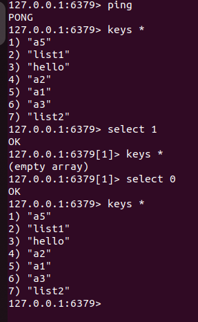

**redis**：

非关系型数据库（内存数据库）**一般应用于服务器**

# 1 基本概念

* Redis 是一种基于内存的数据库，对数据的读写操作都是在内存中完成，因此**读写速度非常快**，常用于**缓存，消息队列、分布式锁等场景**。

* Redis 提供了多种数据类型来支持不同的业务场景，，比如 String(字符串)、Hash(哈希)、 List (列表)、Set(集合)、Zset(有序集合)、Bitmaps（位图）、HyperLogLog（基数统计）、GEO（地理信息）、Stream（流），并且对数据类型的操作都是**原子性**的，因为执行命令由**单线程**负责的，不存在并发竞争的问题。

* Redis 还支持**事务 、持久化、Lua 脚本、多种集群方案（主从复制模式、哨兵模式、切片机群模式）、发布/订阅模式，内存淘汰机制、过期删除机制**等等

* **redis作为mysql的缓存**
	* 将该用户访问的数据缓存在 Redis 中，这样下一次再访问这些数据的时候就可以直接从缓存中获取了，**操作 Redis 缓存就是直接操作内存，所以速度相当快。**当mysql中的数据改变之后，同步改变redis缓存的数据即可，不过这里会有redis和mysql双写一致性的问题。
	* **单台设备的 Redis 的 QPS**（Query Per Second，每秒钟处理完请求的次数） **是 MySQL 的 10 倍**，edis 单机的 QPS 能轻松破 10w，而 MySQL 单机的 QPS 很难破 1w。因此访问redis能承受的请求远远大于直接访问mysql的


**redis中数据的组织格式**：

* 键值对
	* key：必须是字符串
	* value：可选的
		* **string类型**
			* 字符串
		* **List类型**
			* 集合，存储多个string字符串
		* **Set类型**
			* 集合
				* stl集合
					* 默认是升序的，元素不允许重复
				* redis集合
					* 元素不重复，数据是无序的
		* **SortedSet类型**
			* 排序集合，集合中的每个元素分为两部分
				* [分数，成员]---->[64，"tom"]---->按照分数排序，值越大越靠前
		* **Hash类型**
			* 和map数据组织方式一样：key：value
				* Qt->QHash，Qmap
				* Map---->红黑树
				* hash---->数组---->对查找速度要求很高时用hash，比map快


**redis存放是键值对，如果不同类型的键值重复怎么办，比如用户id是1，商品的id也是1**

* 在key的基础上**拼接其它字符串**


**案例：**

```sql
set hello:test:user '{"id":1,"name":"张三","age":18}'   # 字符串列表
set hello:test:shop '{"id":1,"name":"可乐"}'   # 字符串列表
```

随着 Redis 版本的更新，后面又支持了四种数据类型：**BitMap（2.2 版新增）、HyperLogLog（2.8 版新增）、GEO（3.2 版新增）、Stream（5.0 版新增）**。


# 2 安装及使用

**安装**

```shell
sudo apt install lsb-release curl gpg

curl -fsSL https://packages.redis.io/gpg | sudo gpg --dearmor -o /usr/share/keyrings/redis-archive-keyring.gpg

echo "deb [signed-by=/usr/share/keyrings/redis-archive-keyring.gpg] https://packages.redis.io/deb $(lsb_release -cs) main" | sudo tee /etc/apt/sources.list.d/redis.list

sudo apt-get update

sudo apt-get install redis
```

使用：

```shell
# 客户端
redis-cli  # 默认连接本地，绑定6379默认端口的服务器
redis-cli -p 端口号
redis-cli -h IP地址 -p 端口
redis-cli -a 密码
```

启动：

```shell
# 服务器 -启动
/etc/init.d/redis-server start  # 根据配置文件的设置启动
redis-server ./redis.conf
service redis-server start
service redis-server restart  	# 重启
service redis-server stop  		# 关闭
ping [MSG] 						# 客户端测试命令
```


## **2.1 redis类型使用**

* 通用命令

```sql
keys *         			# 查询有多少个键值
DEL key1 key2 ... 	 	# 删除键值对 
exists keys 			#检测key值是否存在
expire key seconds 		#给定 key 设置生存时间,当 key 过期时(生存时间为0),它会被自动删除。
TTL key 				#设置了时间，以秒为单位，返回给定 key 的剩余生存时间(TTL, time to live)。
persist key 			#取消生存时间
```


### 2.1.1 **string类型**

* 值是普通字符串，不过根据字符串的格式不同，又可以分为3类:
	* string:普通字符串
	* int:整数类型，可以做自增、自减操作
	* float:浮点类型，可以做自增、自减操作

* 不管是哪种格式，**底层都是动态字节数组（SDS）形式存储**，只不过是编码方式不同。字符串类型的最大空间不能超过512m.
	* **SDS 不仅可以保存文本数据，还可以保存二进制数据（图片、音频、视频、压缩文件）**，因为 SDS 使用 len 属性的值而不是空字符来判断字符串是否结束，并且 SDS 的所有 API 都会以处理二进制的方式来处理 SDS 存放在 buf[] 数组里的数据。
	* **SDS 获取字符串长度的时间复杂度是 O(1)**。SDS 结构里用 len 属性记录了字符串长度，所以复杂度为 O(1)
	* **Redis 的 SDS API 是安全的，拼接字符串不会造成缓冲区溢出**。SDS 在拼接字符串之前会检查 SDS 空间是否满足要求，如果空间不够会自动扩容。


```sql
key--->string
value --->string  		# string类型

						# 设置一个键值对-->string:string
set hello world  		# key:hello value:world
set hello:test:user '{"id":1,"id":2,"id":3}'   # 字符串列表
setnx key value			# 没有这个key则插入，有就不插入
setex key 10 value		# 插入并设置有效期
get hello				# 通过get取value值

mset a1 b1 a2 b2 a3 b3	# 设置多个键值对
mget a1 a2 a3  			# 查询多个key值对应的value值

append a1 1234567 		# 在key对应的value值后面添加字符串
get a1

strlen a1     			# 获取key值a1对应的value值的字符串长度

#将key值a1对应的数字字符串的值减一
#前提是，a1对应的value值必须时数字字符串
DECR a4
INCR a4       			# 将key值a1自增（+1）
decrby a4 100 			# 将key值a1对应的数字字符串的值减100，
incrby a4 100 			# 将key值a1指定步长自增
INCRBYFLOAT a4
```


### 2.2.2 **List类型**

* 值为list集合**（双向链表/压缩列表结构）**，既可以支持正向检索，也可以支持反向检索
	* 如果列表的元素个数小于 512 个，列表每个元素的值都小于 64 字节，Redis 会使用**压缩列表**作为 List 类型的底层数据结构；
	* 如果列表的元素不满足上面的条件，Redis 会使用**双向链表**作为 List 类型的底层数据结构；
* **Redis 3.2 版本之后，List 数据类型底层数据结构就只由 quicklist 实现了**，**替代了双向链表和压缩列表**。


```sql
key -->string
value -->list
#设置一个键值对，--->string:list

lpush list1 1 2 3 4 5 6			# 将一个或多个value值放到表头,倒序插入
lrange list1 0 -1				# 遍历list1键值中的value值，start为起始位置，stop为结束位置

rpush list2 1 2 3 4 5 6			# 将一个或多个value值放到头部,正序插入，当key不存在时，会创建该列表并插入数据
lrange list2 0 -1

lpop list1						# 删除最左侧元素
rpop list1						# 删除最右侧元素
blpop							# 在没有元素时等待指定时间
brpop							#

lindex list2 3					# 取list键值中的某个位置对应的value值，位置从0开始

llen list2						# 取list键值的长度

rpushx list2 7					# 将值value插入到列表key的表尾，key列表必须存在并且是一个列表

lrem key count value			# 根据参数 count 的值,移除列表中与参数 value 相等的元素。
lrem list2 2 2					# count>0:从表头开始向表尾搜索,移除与value相等的元素,数量为count.删除两个2
lrem list2 -2 2					# count<0:从表尾开始向表头搜索,移除与value相等的元素,数量为count的绝对值.删除两个2
lrem list2 0 2					# count=0:移除表中所有与value相等的值。
```


### 2.2.3 **SET类型**

Set 类型的底层数据结构是由**哈希表或整数集合**实现的：

* 如果集合中的元素个数小于 512 个，所有值小于 64 字节，Redis 会使用**整数集合**作为set类型的底层数据结构；

* 如果集合中的元素不满足上面条件，则 Redis 使用**哈希表**作为 Set 类型的底层数据结构。
* 值为hash表，和mulitsetset类似，无序、元素不可重复、查找快、支持交集、并集、差集等功能。

```sql
key -->string
value -->set
#设置一个键值对，--->string:set

sadd key member						# 将一个或多个元素加入到集合key当中，已经存在的member元素被忽略（不允许重复）
sadd set1 1 2 3 3 2 1 aa bb cc		

smembers key						# 遍历集合，集合是无序的
smembers set1

sdiff key1 key2						# 求两个集合的差集，A-A∩B，前面减后面，输出前面集合的不同值
sdiff st1 st2						# st1[1,2,3,aa,bb,cc]-st2[7,8,9,aa,bb,cc] = [1,2,3]
sinter key1 key2					# 求两个集合的交集
sunion key1 key2					# 求两个集合的并集，重复的只显示一次

sdiffstore destination				# 将求得到的两个集合的差集，保存在destination这个新集合当中
sdiffstore key3 key1 key2			# 将key1与key2的差集保存在key3中
sinterstore key3 key1 key2			# 将key1与key2的交集保存在key3中
sunionstore key3 key1 key2			# 将key1与key2的并集保存在key3中

spop								#移除一个元素
smove
srem key value						# 删除value值这个元素
```


### 2.2.4 **SortedSet类型**

* Zset 类型的底层数据结构是由**压缩列表或跳表**实现的：
	* 如果有序集合的元素个数小于128个，所有值小于 64 字节，Redis 会使用**压缩列表**作为 Hash 类型的底层数据结构；
	* 否则采用**跳表**作为zset的底层数据结构
* 可排序集合，和set和map类似，可排序、元素不可重复、查找快。
* **在 Redis 7.0 中，压缩列表数据结构已经废弃了，交由 listpack 数据结构来实现了。**


```sql
key--->string
value--->sorted([socre,member],[socre,member])

                            		#添加元素
zadd key member                     #将一个或多个member元素加入到集合key集合中，已经存在的将被忽略
zadd sset 12 tom 34 lisa 78 jreey

zrange key start end				#遍历元素
zrange sset 0 -1					
zrange sset 0 -1 withscores			#通过score排序，默认是升序
zrevrange sset 0 -1 withscores		#返回指定区间的集合，默认为降序

zcount key min max 					#指定分数区间内的元素个数
zcount sset1 10 50

zrank sset tom 						#返回tom的排名
zerm sset tom						#删除有序集 key 中的一个或多个成员,不存在的成员将被忽略
zscore key member 					#返回有序集 key 中,成员 member 的 score 值

zrank key member					# 获取sorted set 中的指定元素的排名
zcard key member					# 获取sorted set中的元素个数
zincrby key increment member		# 让sorted set中的指定元素自增，步长为指定的increment值
zrange key min max					# 按照score排序后，获取指定排名范围内的元素
ZDIFF,ZINTER,ZUNION				    # 求差集、交集、并集
```


### 2.2.5 **hash类型**

Hash 类型的底层数据结构是由**压缩列表或哈希表**实现的：

* 如果哈希类型元素个数小于 512 个，所有值小于 64 字节，Redis 会使用**压缩列表**作为 Hash 类型的底层数据结构；
* 否则采用**哈希表**。也叫散列，value是一个无序字典，类似hashmap结构，值为哈希表。
* **在 Redis 7.0 中，压缩列表数据结构已经废弃了，交由 listpack 数据结构来实现了**。


 

```sql
key---string
value--->hash([key,value],[key,value],[key,value]...)

                                        #添加数据
hset key field value					#将一个或多个member元素加入到集合key集合中，已有key被覆盖value，没有会创建新的
hset user username zhangsan
hset user password 123456
hset user name zhang3
hset user:3 name zhang4
hmset user name zhang3 password 123456	#一次性插入
hsetnx key filed value 					#将哈希表 key 中的域 field 的值设置为 value 
										#当且仅当键值不存在。若键值已经存在,该操作无效。

hget user name 							#获取hash数据
hmget user name password username       #一次性获取
hgetall user 							#返回哈希表 key 中，所有的域和值,

hdel key field 							#删除哈希表key中的一个或多个指定域,不存在的域将被忽略。
hdel user username password

hexisets user username 					#查看哈希表 key 中,给定域 field 是否存在。不存在返回0，存在返回1

hincrby key field increment 			#为哈希表key中的域field的值加上增量increment,increment可以为负数
hkeys key 								#返回哈希表key 中的所有域（键值）。
hvals key								#返回哈希表key 中的所有域值（value值）。
hlen key								#返回哈希表的元素个数。
```


## 2.2 redis配置文件

配置文件是给**redis服务器**使用的

* 配置文件位置：
	* 源目录-->etc/redis/redis.conf
	* 复制配置文件进行操作

```shell
#此操作必须在管理员模式下
sudo mkdir myredis
sudo cp /etc/redis/redis.conf /home/user_wang/myredis
```

* 文件配置项

```shell
# redis服务器绑定谁之后，谁就能访问redis服务器
# 将bind注释，即任何电脑可以访问redis服务器（监听的地址）
#bind bind 127.0.0.1 -1::0::1
 bind 127.0.0.1  168.199.236.166 ...
#保护模式,如果需要远程客户端访问服务器，该模式要关闭
#proteced-mode yes
proteced-mode no
#绑定的端口号
port 6379
#连接超时,参数为0，即关闭连接超时
timeout 0
#服务器启动之后不是守护进程
#改为deamonize yes
deamonize no
#如果服务器是守护进程，就会生成一个pid文件
# ./ ->redis服务器启动的目录
#pidfile var/run/redis-server.redis
pidfile ./redis.pid
#日志级别 
loglevel notice
#如果服务器是守护进程，才会写日志文件
#logfile /var/log/redis/redis-server.log
logfile "" -> 这是没写
logfile "./redis.log"
#数据库数量，默认为16个数据库
database 16
	-切换数据库：select dbID [dbID --0 ~ 16-1]
```


对于redis来说16[0~15]数据库都是独立的。默认使用的0数据库

```sql
select 1 #切换数据库
key *
selec 0
keys *
```




## 2.3 redis数据持久化

redis是内存数据库，但是也做了一个**数据从内存到磁盘的数据同步**的持久化，即在磁盘上有一个**持久化文件**，防止停电影响内存数据丢失。

持久化的两种方式：

* rdb方式
	* 默认的持久化方式，默认打开
	* 磁盘的持久化文件xxx.rdb
	* 将内存数据以二进制的方式直接写入磁盘文件
	* rdb文件比较小，恢复的时候时间短效率高
	* 保存数据的方式以用户设定的频率-->容易丢数据
	* 数据同步频率低，数据完整性较低
* aof方式
	* 默认是关闭的
	* 磁盘的持久化文件xxx.aof
	* 直接将生成数据的命令写入磁盘文件
	* 文件比较大，恢复时间长
	* 保存数据的方式以某种频率-->每隔1sec同步一下数据（同步频率比rdb高）
	* 数据完整性高

**配置修改：**


```sql
# rdb同步频率
# 3600 秒（一小时），如果至少执行了 1 次更改
# 300 秒（5 分钟），如果至少执行了 100 次更改
# 60 秒内，如果至少执行了 10000 次更改
save 3600 1 300 100 60 10000
# rdb文件名称
dbfilename dump.rdb
# 生成的持久化文件保存在那个目录下
# dir /var/lib/redis 默认目录
dir ./
# 是不是要打开aof模式，打开改为yes
appendonly no
# aof文件名称
appendfilename "appendonly.aof"
# aof更新频率
appendfsync everysec
```


* aof和rdb写的是不同磁盘文件，**可以同时打开**，也**可以同时关闭**
* 两种模式同时开启时，要进行数据恢复
	* 考虑效率使用rdb
	* 考虑数据的完整性使用aof


## 2.4 hiredis

**1.下载及安装**

https://github.com/redis/hiredis/releases


```shell
tar -zxf hiredis-1.2.0.tar.gz
cd ./hiredis-0.14.1/
make
make install
```


**2.基本概念**

* 连接数据库

```c
// 连接数据库
redisContext *redisConnect(const char *ip, int port);
redisContext *redisConnectWithTimeout(const char *ip, 
                                      int port, const struct timeval tv);
```

* 执行redis命令函数

```c
// 执行redis命令
void *redisCommand(redisContext *c, const char *format, ...);
// redisCommand 函数实际的返回值类型
typedef struct redisReply {
    /* 命令执行结果的返回类型 */
    int type; 
    /* 存储执行结果返回为整数 */
    long long integer;
    /* str变量的字符串值长度 */
    size_t len;
    /* 存储命令执行结果返回是字符串, 或者错误信息 */
    char *str;
    /* 返回结果是数组, 代表数据的大小 */
    size_t elements;
    /* 存储执行结果返回是数组*/
    struct redisReply **element;
} redisReply;
redisReply a[100];
element[i]->str
```

| 状态表示                 | 含义                                                         |
| ------------------------ | ------------------------------------------------------------ |
| REDIS_REPLY_STRING==1    | 返回值是字符串,字符串储存在redis->str当中,字符串长度为redi   |
| REDIS_REPLY_ARRAY== 2    | 返回值是数组，数组大小存在redis->elements里面，数组值存储在redis->element[i]里面。数组里面存储的是指向redisReply的指针，数组里面的返回值可以通过redis->element[i]->str来访问，数组的结果里全是type==REDIS_REPLY_STRING的redisReply对象指针。 |
| REDIS_REPLY_INTEGER == 3 | 返回整数long long，从integer字段获取值                       |
| REDIS_REPLY_NIL==4       | 返回值为空表示执行结果为空                                   |
| REDIS_REPLY_STATUS ==5   | 返回命令执行的状态，比如set foo bar 返回的状态为OK，存储在str当中 reply->str == "OK" 。 |
| REDIS_REPLY_ERROR ==6    | 命令执行错误,错误信息存放在 reply->str当中。                 |

* 释放资源

```c
// 释放资源
void freeReplyObject(void *reply);
void redisFree(redisContext *c);
```


**3.使用**

```c
#include <stdio.h>
#include <hiredis.h>

int main(){
	//1.连接redis服务器
    redisContext *c = redisConnect("127.0.0.1", 6379);
    if(c->err!=0){
		return -1;
    }
    //2.执行redis命令
    void *ptr = redisCommand(c,"hmset user name zhang3 password 123456");  //数据库，命令(插入)
    redisReply *ply = (redisReply*)ptr; 	//类型转换
    if(ply->tye == 5){
		//状态输出
        printf("状态：%s\n",ply->str);
    }
    freeReplyObject(ply);
    
    //3.从数据库中读数据
    ptr = redisCommand(c,"hgetall user");  //命令（一次性读hash所有键值对）
    ply = (redisReply*)ptr;
    if(ply->type == 2){
		//遍历key值与value值
        for(int i = 0;i<ply->element;i+=2){
			printf("keys: %s,value: %s \n",ply->element[i]->str,ply->element[i+1]->str);
        }
    }
    freeReplyObject(ply);
    redisFree(c);
}
```


# 3 项目实战

## 3.1 session/cookie

**session**：

* Session是一种在**服务器端存储用户信息**的机制。当用户首次访问网站并与服务器建立连接时，服务器会为用户创建一个会话（Session），并分配一个唯一的会话ID（Session ID）。这个会话ID通常通过Cookie发送到客户端（浏览器），但也可以在URL中作为参数传递。之后，每当用户发送请求时，浏览器会自动包含会话ID（如果通过Cookie发送的话），服务器通过这个ID来检索与该用户相关的会话数据。
* Session的数据主要来源于用户在与服务器的交互过程中产生的各种信息。当用户首次访问网站并与服务器建立连接时，服务器会为用户创建一个会话（Session），并分配一个唯一的会话ID（Session ID）。此后，服务器会根据用户的请求和操作，在Session中存储和更新相关的数据。
	* **用户身份信息**：当用户登录网站时，服务器会在Session中存储用户的身份信息，如用户名、密码（通常存储的是经过加密或散列处理后的密码）、用户角色等。这些信息用于验证用户的身份和权限，以便在后续的请求中提供个性化的服务或限制对某些资源的访问。
	* **用户偏好设置**：服务器可以存储用户的偏好设置，如语言选择、主题风格、字体大小等。这些信息通常是在用户首次访问网站时通过问卷调查或用户自行设置的方式获取的，并存储在Session中以便在用户下次访问时自动应用这些设置。
	* **会话状态信息**：在需要保持用户登录状态的场景中，服务器会使用Session来存储会话状态信息，如会话ID、登录时间、最后活动时间等。这些信息用于跟踪用户的会话状态，以便在用户的不同请求之间维持会话状态。
	* **业务数据**：在某些业务场景中，服务器可能需要在Session中存储一些与业务相关的数据，如购物车中的商品信息、表单填写进度等。这些数据通常是在用户与网站进行交互时产生的，并存储在Session中以便在用户后续的操作中使用。


**cookie：**

* Cookie是一种在**客户端（浏览器）存储数据**的机制。服务器可以向客户端发送一个或多个Cookie，这些Cookie会被存储在浏览器的特定位置。之后，每当浏览器向服务器发送请求时，它会自动包含所有匹配的Cookie（根据请求的URL和域等条件）。这样，服务器就可以读取这些Cookie来识别用户、跟踪会话状态或存储用户偏好等信息。
* **Cookie最初的数据是由服务器端生成的**。具体来说，当Web服务器接收到客户端（通常是浏览器）的请求时，它可以根据需要生成一个或多个Cookie，并将这些Cookie包含在响应头中发送给客户端。客户端浏览器在接收到这些Cookie后，会按照指定的规则将其存储在本地，以便在后续的请求中自动包含这些Cookie。
* Cookie的使用也需要注意安全性问题。由于Cookie存储在客户端，因此它们容易被第三方脚本或恶意软件访问和篡改。为了保护用户的隐私和安全，开发者需要采取适当的安全措施，如使用**HTTPS加密传输**、设置HttpOnly和Secure属性等，来防止Cookie被未经授权的访问和修改。

Cookie的主要优点包括：

* **持久性**：通过设置过期时间，Cookie可以在用户的浏览器上保存很长时间，甚至跨多个会话。
* **跨域支持**：Cookie可以设置域属性，允许跨子域或跨站点的访问（尽管这带来了安全风险）。

然而，Cookie也有其局限性：

* **安全性**：由于数据存储在客户端，Cookie容易被窃取或篡改。敏感信息应该通过HTTPS传输，并避免存储在Cookie中。
* **大小限制**：大多数浏览器对单个Cookie的大小有限制（通常为4KB），并且对每个域名下的Cookie总数也有限制。


**Session与Cookie的结合使用**：

在实际开发中，Session和Cookie经常一起使用。服务器使用Session存储敏感的用户数据，并通过Cookie发送一个会话ID给客户端。客户端在之后的请求中携带这个会话ID，服务器通过会话ID检索对应的Session数据。这种方式结合了Session的安全性和Cookie的便利性，既保护了敏感信息，又实现了用户状态的跨请求跟踪。


**案例：**短信验证码登录。


本来验证码保存在session中，可以以redis代替session，对于验证码，采用简单string类型。


# 4 分布式锁

## 4.1 概念

​		在分布式系统中，不同的服务可能运行在不同的服务器上，因此需要一种机制来确保同一时间只有一个进程可以访问共享资源。Redis 分布式锁利用 Redis 的原子性和高可用性来实现这一功能。

**分布式锁:**

* 满足分布式系统或集群模式下**多进程可见**并且**互斥**的锁。
* 高可用和高并发

**注意事项：**

* **锁的过期时间**：设置合理的过期时间，以避免持有锁的进程崩溃导致锁无法释放。
* **锁的重试机制**：在获取锁失败时，可以设置重试机制，直到成功获取锁。
* **锁的可重入性**：如果业务逻辑需要多次获取同一把锁，需要实现可重入的锁机制。
* **锁的安全性**：确保在分布式环境中，锁的获取和释放是原子操作，避免多个进程同时获取到锁

**高级特性：**

* **RedLock 算法**：一种更安全的分布式锁实现，通过尝试在多个 Redis 节点上获取和释放锁来提高锁的安全性。
* **哨兵和集群模式**：在 Redis 的哨兵模式或集群模式下，需要确保锁的获取和释放操作在不同的节点上是同步的。


## 4.2 分布式锁的实现


### 4.2.1 setnx

实现分布式锁需要两个基本步骤：获取锁和释放锁


* **获取锁：**
	* 互斥：确保只有一个线程获取锁
	* 非阻塞：尝试一次，成功返回true，失败返回false

```sql
setnx lock thread1		# setnx本事就是互斥的
set lock thread1 EX 10 NX 	# NX：互斥，EX：超时时间
```

* 释放锁
	* 手动释放

```sql
del lock
```


* 如果加了锁后服务器宕机了，没办法手动释放锁了

```sql
setnx lock thread1
expire lock 5   		# 设置5秒，避免宕机引起的死锁
set lock thread1 EX 10 NX 	# NX：不存在set就加set，有了就不加
```


### 4.2.2 多线程分布式锁

#### 4.2.2.1 阻塞恢复误删

当不同的线程在执行时，上一个线程获取了锁但是被阻塞，阻塞时间过长，超时释放了锁。当该线程业务恢复时，释放锁时会释放掉其他线程的锁。


**分布式锁误删解决：**

* **连接 Redis**：使用 `redisConnect` 函数连接到 Redis 服务器。
* **加锁 (`lock` 方法)**：通过 `SETNX` 命令尝试设置锁，如果成功则设置过期时间。
* **解锁 (`unlock` 方法)**：调用 `DEL` 命令释放锁。
* **UUID 生成**：通过 `uuid` 库生成一个唯一的**锁标识符**，在释放锁时进行判断，以避免多个线程同时释放锁。
	* 在 `unlock` 方法中，通过 `GET` 命令获取当前锁的值，检查它是否与当前实例的 `lockValue` 相同。只有当它们匹配时，才能安全地删除该锁。

```c++
#include <iostream>
#include <string>
#include <chrono>
#include <thread>
#include <hiredis/hiredis.h>
#include <uuid/uuid.h>

class RedisDistributedLock {
public:
    RedisDistributedLock(redisContext* context, const std::string& lockName, int expiration)
        : context(context), lockName(lockName), expiration(expiration) {}

    bool lock() {
        // 生成一个唯一的锁标识符
        std::string lockValue = generateUUID();
        // 尝试设置锁-->加入标识进行对比，当释放锁时通过对比标识可以避免误放其他线程的锁
        redisReply* reply = static_cast<redisReply*>(redisCommand(context, "SETNX %s %s", lockName.c_str(), lockValue.c_str()));
        
        if (reply == nullptr) {
            throw std::runtime_error("Error in Redis command");
        }

        if (reply->integer == 1) { // 锁获取成功
            redisCommand(context, "EXPIRE %s %d", lockName.c_str(), expiration);
            this->lockValue = lockValue; // 保存锁标识符
            freeReplyObject(reply);
            return true;
        }

        freeReplyObject(reply);
        return false; // 锁已被其他请求获取
    }

    void unlock() {
        // 检查锁的拥有者
        redisReply* reply = static_cast<redisReply*>(redisCommand(context, "GET %s", lockName.c_str()));
        if (reply == nullptr) {
            throw std::runtime_error("Error in Redis command");
        }

        // 只有当前持有者才能释放锁
        if (reply->str != nullptr && lockValue == reply->str) {
            redisCommand(context, "DEL %s", lockName.c_str());
            std::cout << "Lock released!" << std::endl;
        } else {
            std::cout << "Cannot release lock, not the owner!" << std::endl;
        }

        freeReplyObject(reply);
    }

private:
    redisContext* context;
    std::string lockName;
    int expiration;
    std::string lockValue;

    std::string generateUUID() {
        uuid_t uuid;
        uuid_generate(uuid);
        char uuidStr[37];
        uuid_unparse(uuid, uuidStr);
        return std::string(uuidStr);
    }
};

int main() {
    // 连接到 Redis
    redisContext* context = redisConnect("127.0.0.1", 6379);
    if (context == nullptr || context->err) {
        if (context) {
            std::cerr << "Error: " << context->errstr << std::endl;
            redisFree(context);
        } else {
            std::cerr << "Can't allocate redis context" << std::endl;
        }
        return 1;
    }

    RedisDistributedLock lock(context, "my_lock", 10); // 锁名和过期时间
    if (lock.lock()) {
        std::cout << "Lock acquired!" << std::endl;
        
        // 进行需要加锁的操作
        std::this_thread::sleep_for(std::chrono::seconds(5));
        
        lock.unlock();
        std::cout << "Lock released!" << std::endl;
    } else {
        std::cout << "Failed to acquire lock." << std::endl;
    }

    redisFree(context);
    return 0;
}
```


#### 4.2.2.2 判断后阻塞

线程1在释放锁时，先判断标识后释放锁（两个动作）。当刚好判断完成后还没释放就陷入阻塞，阻塞时间过长进行超时释放锁后，线程2获取到了锁。但是在线程2加锁执行业务时，线程1恢复，继续释放锁的动作，由于线程1已经完成判断（不会再进行标识判断），会进行误删掉线程2的锁。


**解决方案：**保证判断和释放锁的**原子性**（lua脚本解决redis的分布式锁的原子性）

* 保证判断锁标识和释放锁的原子性 --->lua脚本
* Redis提供了Lua脚本功能，在一个脚本中编写多条Redis命令，确保多条命令执行时的原子性。


##### **lua脚本基本语法：**

* **脚本编写：**

```lua
# 执行redis命令
redis.call('命令名称','key','其他参数',.....)
# 执行set name jack
redis.call('set','name','jack')
# 执行get name
local name = redis.call('set','name','jack')
# 返回
return name
```

* **脚本执行：**例如，我们要执行 redis.call('set','name',jack')这个脚本，语法如下:

```lua
# 调用脚本
# 无参数
EVAL "return redis.call('set','name','jack')" 0   # 0是脚本需要的key类型的参数个数
```


如果脚本中的key、value不想写死，可以作为参数传递。key类型参数会放入KEYS数组，其它参数会放入ARGV数组，在
脚本中可以从KEYS和ARGV数组获取这些参数:

```lua
# 调用脚本
EVAL "return redis.call('set',KEYS[1],ARGV[1])" 1 name Rose
```


##### **lua脚本实现分布式锁的释放**


锁和线程的ID都是动态变化的，不能写死

```lua
-- 获取锁中的线程标识
local id = redis.call('get',KEYS[1])
-- 比较线程标识与锁中的标识是否一致
if(id == ARGV[1]) then
    -- 释放锁 del key
    return redis('del',KEYS[1]);
end
return 0;
```

**c++执行lua脚本：**

* **Lua 脚本** (`release_lock_script`)：脚本检查 Redis 中锁的值是否与提供的 `thread_id` 一致，若一致则删除锁键，否则不执行任何操作。
* **`release_lock` 函数**：在 C++ 中执行 Lua 脚本的函数。通过 `EVAL` 命令执行 Lua 脚本并传入锁的键名 (`lock_key`) 和线程标识 (`thread_id`)。
* **主程序流程**：连接到 Redis，调用 `release_lock` 尝试释放锁，并根据结果输出相应的消息。

```c++
#include <iostream>
#include <hiredis/hiredis.h>
#include <string>

// 定义 Redis 服务器连接信息
const char* REDIS_HOST = "127.0.0.1";
const int REDIS_PORT = 6379;

// Lua 脚本：获取并比较锁中的线程标识，然后决定是否释放锁
const std::string release_lock_script = R"(
    if redis.call("get", KEYS[1]) == ARGV[1] then
        return redis.call("del", KEYS[1])
    else
        return 0
    end
)";

// 函数：使用 Lua 脚本释放 Redis 锁
bool release_lock(redisContext* context, const std::string& lock_key, const std::string& thread_id) {
    // 调用 Redis EVAL 命令来执行 Lua 脚本
    redisReply* reply = static_cast<redisReply*>(redisCommand(
        context,
        "EVAL %s 1 %s %s",
        release_lock_script.c_str(),  // Lua 脚本
        lock_key.c_str(),             // 锁的键名
        thread_id.c_str()             // 当前线程的唯一标识符
    ));

    if (reply == nullptr) {
        std::cerr << "Error executing Lua script: " << context->errstr << std::endl;
        return false;
    }

    // 检查脚本返回值：1 表示锁已释放，0 表示未释放
    bool success = reply->integer == 1;
    freeReplyObject(reply);
    return success;
}

int main() {
    // 连接到 Redis 服务器
    redisContext* context = redisConnect(REDIS_HOST, REDIS_PORT);
    if (context == nullptr || context->err) {
        if (context) {
            std::cerr << "Connection error: " << context->errstr << std::endl;
            redisFree(context);
        } else {
            std::cerr << "Connection error: can't allocate redis context" << std::endl;
        }
        return EXIT_FAILURE;
    }

    // 定义锁的键名和当前线程标识符
    std::string lock_key = "my_lock_key";
    std::string thread_id = "unique_thread_id";  // 假设这是当前线程的唯一标识符

    // 尝试释放锁
    if (release_lock(context, lock_key, thread_id)) {
        std::cout << "Lock released successfully." << std::endl;
    } else {
        std::cout << "Failed to release lock (lock may be held by another thread or not exist)." << std::endl;
    }

    // 断开连接并清理
    redisFree(context);
    return EXIT_SUCCESS;
}
```


**基于setnx的分布式锁存在以下问题：**

* 不可重入：同一个线程无法多次获取同一把锁
* 不可重试：获取锁只尝试一次就返回false，没有重试机制
* 超时释放：锁超时释放虽然可以避免死锁，但如果是业务执行耗时较长，也会导致锁释放，存在安全隐患
* 主从一致性：如果Redis提供了主从集群主从同步存在延迟，当主宕机时，如果从并同步主中的锁数据，则会出现锁实现

java中有redission可以解决这些问题。


# 5 消息队列

消息队列(Message Queue)，字面意思就是存放消息的队列。最简单的消息队列模型包括3个角色:

* 消息队列:存储和管理消息，也被称为消息代理(Message Broker)
* 生产者:发送消息到消息队列
* 消费者:从消息队列获取消息并处理消息


redis提供了三种不同的方式实现消息队列

* **list（双向链表）结构**:基于List结构模拟消息队列
* **Pubsub（发布订阅）:**基本的点对点消息模型
* **Stream:**比较完善的消息队列模型


## 5.1 list双向链表

* 消息队列(Message Queue)，字面意思就是存放消息的队列。而Redis的list数据结构是一个**双向链表**，很容易模拟出队列效果。
* 队列是入口和出口不在一边，因此我们可以利用:LPUSH 结合 RPOP、或者 RPUSH 结合 LPOP来实现**先入先出**。
* 不过要注意的是，当队列中没有消息时RPOP或LPOP操作会返回null，并不像JVM的阻塞队列那样会阻塞并等待消息因此这里应该使用**BRPOP或者BLPOP**来实现阻塞效果。
	* BRPOP和BLPOP就是比LPUSH和RPUSH多了一个阻塞效果，因为对队列的操作是循环引用的
		* 当队列中消息满时，应该阻塞写端，让读端去读消息
		* 当队列中消息为空时，应该阻塞读端，让写端去写消息


BRPOP**实例：**

```sql
# 消费者：
BRPOP l1 20    # 消费者监听一个名为l1的队列，时间为20s，此时空队列pop操作阻塞，直到有消息被push进队列

# 生产者
LPUSH l1 e1 e2 # 生产者往队列中存元素e1，e2
```

此时，只要监听时间没到就会立刻取出消息e1。当再次获取就是会获取e2，队列为空，再次获取就会阻塞。


* 基于List的消息队列有哪些优缺点?
* **优点:**
	* 利用Redis存储，不受限于IVM内存上限
	* 支持Redis的持久化机制，数据安全性有保证
		* 因为list本身就不是消息队列，只是利用这么一个双向链表来完成消息队列，而数据是可以持久化的
	* 可以满足消息有序性
* 缺点：
	* 无法避免消息丢失
	* 只支持单消费者


## 5.2 PubSub发布/订阅

Pubsub(发布订阅)是Redis2.0版本引入的消息传递模型。顾名思义，消费者可以订阅一个或多个channel(频道），生产者向对应channel发送消息后，所有订阅者都能收到相关消息（**一对多**），订阅是默认阻塞的，当消息队列为空时阻塞等待。

* `SUBSCRIBE channel[channe]`:消费者可以订阅一个或多个频道
* `PUBLISH channel msg` :生产者向一个频道发送消息
* `PSUBSCRlBE pattern[pattern]`:订阅与pattern格式匹配的所有频道


```sql
# 消费者1
SUBSCRIBE order.q1				# 订阅order.q1频道
# 消费者2
SUBSCRIBE order.*				# 订阅order的所有频道

# 生产者发送消息
PUBLISH order.q1 hello 			# 向order.q1频道发送消息：hello，此时所有频道符合的消费者都能收到消息

```


```sql
# 生产者发送消息
PUBLISH order.q2 hello				# order.q2只能由消费者2收到
```


发布订阅模式的优缺点：

**优点：**

* 采用发布订阅模型，支持多生产、多消费

**缺点：**

* **不支持数据持久化**
	* pubsub就是用来发送数据的，当**数据发布后没有消费者进行订阅，消息就直接丢失了**，不会保存在redis里面。
* 无法避免消息丢失
* 消息堆积有上限，超出时数据丢失
	* 本身队列没有消费者订阅是不会保存数据的，但是消费者(客户端)在接收数据时会有一个缓冲区，当消费者处理消息较慢时，消息就会堆积，超出上限就会丢失。

**如下图：**

两个消费者都监听(订阅)时，q1频道消费者订阅数为2。

两个消费者都监听（订阅）时，q2频道消费者订阅数为1。

两个消费者都不监听（不订阅）时，q1频道**消费者订阅数为0，消息丢失。**


## 5.3 Stream

Stream 是 Redis 5.0 引入的一种**新数据类型（与string、hash等数据类型类似，是用来存储数据的，因此支持数据持久化）**，可以实现一个功能非常完善的消息队列。

* **xadd：消息发送**


例：

```sql
## 创建名为 users 的队列，并向其中发送一个消息，内容是:{name=jack,age=21},并且使用Redis自动生成ID
XADD users * name jack age 21
"1644805700523-0"			# 返回消息ID
```

* **XLEN：查看消息队列中的消息数量**

```sql
# 查看消息队列中的消息数量
XLEN users 
```

* **XREAD：读消息**


### 5.3.1 单消费模式

```sql
# 从users队列中读取一个消息，从第一个消息开始读
XREAD COUNT 1 STREAMS users 0					# 对于读消息指令是一直可以读的，因为读了之后消息不会删除永久存在
# 从users队列中读取一个消息，读取最新消息
XREAD COUNT 1 STREAMS users $					# 当所有消息都读过了就不在在最新消息了
# 从users队列中读取一个消息，读取最新消息,如果没有就阻塞等待直到最新消息到来
XREAD COUNT 1 BLOCK 0 STREAMS users $	
```


在业务开发中，我们可以循环的**调用XREAD阻塞方式来查询最新消息**，从而实现持续监听队列的效果，伪代码如下:

```C++
while(true){
    // 尝试读取队列中的消息，最多阻塞2秒
    Object msg = redis.execute("XREAD COUNT 1 BLOCK 2000 STREAMS users $");
    if(msg == null){
		continue;
    }
    // 处理消息
    handleMessage(msg);
}
```

* 当我们指定起始ID为$时，代表读取最新的消息，如果我们**处理一条消息的过程中**，**又有超过1条以上的消息到达队列**，则下次获取时也**只能获取到最新的一条**，会**出现漏读消息**的问题。

* 注意！这里，xread...$是读取这条命令**之后**接收到的最新消息。**执行命令之前发布的消息将不会被包含在结果中**。

例如下面：当消费者在处理消息3时，消息3未被处理完成时，消息4和消息5也被发送，但是利用xread...$无法读取到4和5，只能在消息3处理完成后，生产者再次发送消息6，才会被消费者1读到。


单消费者stream类型消息队列的XREAD命令：

* 消息可回溯
* 一个消息可以被多个消费者读取
* 可以阻塞读取
* 有消息漏读的风险


### 5.3.2 消费组模式

消费者组(Consumer Group):将多个消费者划分到一个组中，监听同一个队列。具备下列特点:

* **消息分流：**队列中的消息会分流给组内的不同消费者，而不是重复消费，从而加快消息处理的速度
* **消息标示：**消费者组会维护一个标示，记录最后一个被处理的消息，哪怕消费者宕机重启，还会从标示之后读取消息。确保每一个消息都会被消费。
* **消息确认：**消费者获取消息后，消息处于pending（待处理）状态，并存入一个pending-list。当处理完成后需要通过XACK来确认消息，标记消息为已处理，才会从pending-list移除。

这样就能解决单消费者消息漏读的风险。


#### 5.3.2.1 常用指令：

* **创建消费者组：**由生产者创建消费者组

```sql
XGROUP CREATE key groupName ID [MKSTREAM]
# key：队列名称
# groupName：组名称
# ID：起始ID标识，$代表队列中最后一个消息，0则代表队列中第一个消息
# MKSTREAM：队列不存在时自动创建队列

XGROUP CREATE s1 g1 0		# 创建队列(流)为s1，组名为g1，ID从0开始的队列和消费者组
```

* **删除指定的消费者组：**

```sql
XGROUP DESTORY key groupName
```

* **给指定的消费组添加消费者**

```sql
XGROUP CREATECONSUMER key groupname consumername
```

* **删除消费者组的消费者**

```sql
XGROUP DELCONSUMER key groupname consumername
```

* **从消费者组读取消息**：
	* 需要显式地通过 `XREADGROUP` 命令加入消费者组并开始读取消息
	* `XREADGROUP` 命令不仅用于读取消息，还用于在消费者组中声明消息的**所有权**（即哪个消费者正在处理哪些消息）。

```sql
XREADGROUP GROUP group consumer [COUNT count] [BLOCK milliseconds] [NOACK] STREAMS key [key ...] ID [ID ...]
# group:消费组名称
# consumer:消费者名称，如果消费者不存在，会自动创建一个消费者
# count:本次查询的最大数量
# BLOCK milliseconds:当没有消息时最长等待时间
# NOACK:无需手动ACK，活得消息后自动确认
# key：队列名称
# ID：获取消息的起始ID标识
	# ">":从下一个未消费的消息开始
	# 其它:根据指定id从pending-list中获取已消费但未确认的消息，例如0，是从pending-list中的第一个消息开始

# 消费者组名g1,消费者名c1(可以随便起),读取1条消息，没有消息时最长等待2000ms，队列名称S1,读取队列中没被消费的消息
XREADGROUP GROUP g1 c1 COUNT 1 BLOCK 2000 STREAMS S1 >
```

* **确认读取消息**

```sql
XACK key group ID 
# key：队列名称
# group:消费组名称
# ID：消息的ID
```

* **读取pending-list中的消息**

```sql
XPENDING s1 g1 - + 10
# 读取队列s1，消费者组g1，最小(-)到最大(+)的10条消息
# 返回pending-list中所有未确认的消息
```


#### 5.3.2.2 操作案例

**操作案例**如下：

```sql
# 生产者
# 创建队列(流)为s1，组名为g1，ID从0开始的队列和消费者组
# 队列s1已存在的话，会创建消费者组g1与队列s1关联，可以读取s1队列中的消息
XGROUP CREATE s1 g1 0		

#消费者
# 创建消费者组g1且与队列s1绑定之后，消费者就可以读取s1队列中的消息
# 消费者组名g1,消费者名c1(可以随便起),读取1条消息，没有消息时最长等待2000ms，队列名称S1,读取消费者组中没被消费的消息
XREADGROUP GROUP g1 c1 COUNT 1 BLOCK 2000 STREAMS S1 >

# 消费者确认读取到消息
# 确认在s1队列中，g1消费者组中的消费者读取了ID为1646339018049-0、1646339018050-0的消息
XACK s1 g1 1646339018049-0 1646339018050-0
```

如下图，每个消费者每次读取的都是未处理的消息：


**消息确认：**

* 同一个消费者组的消费者，只有他是最后一个读取消息的，他就可以确认整个消费者组读取的消息
* 当确认时，消费者**没有进行确认就宕机**了，此消息会**一直在pending-list**中。


**读取pending-list中的消息：**读取操作的消费者为c1，未处理消息有一条，消息ID164...


因为此时pending-list中消息数量为1，读取时可以这么读取：将>改为0，即读取pending-list中未被处理的消息，读取完成后就可以进行确认。

```sql
XREADGROUP GROUP g1 c1 COUNT 1 BLOCK 2000 STREAMS S1 0
```


#### 5.3.2.3 消费者监听消息

消费者监听消息的基本思路:

```c++
while(true){
    // 尝试读取队列中的消息，最多阻塞2秒
    Object msg = redis.call("XREADGROUP GROUP g1 c1 COUNT 1 BLOCK 2000 STREAMS S1 >");
    if(msg == null){	//null说明没有消息，继续下一次
		continue;
    }
    try{
        // 处理完消息一定要进行ACK
        handleMessage(msg);  
    } catch(Exception e){
		while(true){  	//这里加循环的目的是保证再出现异常时不断去重复，一定要把pending-list中的消息进行处理
            Object msg = redis.call("XREADGROUP GROUP g1 c1 COUNT 1 BLOCK 2000 STREAMS S1 0");
            if(msg == null){ 	//null说明没有异常消息，所有消息已经确认，结束循环
                break;
            }
            try{
                // 说明有异常，再次处理
                handleMessage(msg);
            }catch(Exception e){
                // 再次出现异常，记录日志，继续循环
                continue;
            }
        }
    }
}
```


#### 5.3.2.4 消费者组总结

STREAM类型消息队列的XREADGROUP命令特点

* 消息可回溯：消息不会丢失一直在pending-list中
* 可以多消费者争抢消息，加快消费速度
* 可以阻塞读取
* 没有消息漏读的风险：可以标记上次读取到那里了，下次继续读取pending-list中消息
* 有消息确认机制，保证消息至少被消费一次


## 5.4 队列应用

基于redis的stream结构作为消息队列，作为异步秒杀下单。

需求：

* 创建一个stream类型的消息队列，名为stream.orders
* 修改之前的秒杀下单lua脚本，在认定有抢购资格后，直接向stream.orders中添加消息，内容包含voucherld、userld、orederld
* 项目启动时，开启一个线程任务，尝试获取stream.oreders中的消息，完成下单

```sql
XGROUP CREATE stream.orders g1 0 MKSTREAM  # 创建stream.orders队列 g1消息组 ，ID从0开始

```


# 6 分布式缓存

分布式缓存只要是为了解决单节点问题：

* **数据丢失问题**：redis时内存存储，服务器存储可能会丢失数据
* **高并发问题：**单节点并发能力并不能满足618这样的高并发场景
* **故障恢复问题：**redis宕机后则服务不可用，需要一种自动的故障恢复手段，redis不仅可以做缓存还可以做session
* **存储能力问题：**单节点的存储能力有限


## 6.1 redis持久化

redis是内存数据库，但是也做了一个**数据从内存到磁盘的数据同步**的持久化，即在磁盘上有一个**持久化文件**，防止停电影响内存数据丢失。

持久化的两种方式：**RDB和AOF**

### 6.1.1 RDB

* RDB全称Redis Database Backupfile(Redis数据备份文件)，也被叫做**Redis数据快照**。简单来说就是**把内存中的所有数据都记录到磁盘中**。当Redis实例故障重启后，从磁盘读取快照文件，恢复数据。
* RBD使用方式：
	* **save：**由**主线程来执行RDB**，由于redis是单线程，执行了save后会阻塞其他命令的执行,直到保存到磁盘持久化结束。
		* save方式需要将数据保存在磁盘上，但是磁盘的读写是比较慢的，因此save方式适用redis进程马上要停机时，后面不在使用了。可以使用save方式
	* **bgsave：**开启**子进程执行RDB**，避免主进程受到影响，执行bgsave会立刻返回，由子进程异步单独的去保存数据。
		* bgsave开始时会fork主进程得到子进程，子进程**共享**主进程的内存数据。完成fork后读取内存数掘并写入 RDB 文件


**fork创建子进程的流程：**

* 数据通常保存在物理内存中，进程无法直接操作物理内存，操作系统会为每个进程维护一个虚拟内存与物理内存的**映射表**（页表），进程通过进行页表的映射关系（MTU寻址）找到物理内存，就能实现对物理内存数据的操作。

* 执行fork时，会创建一个子进程，其不会将主进程的内存数据做拷贝实现共享，而是**将主进程的页表进行复制**，即将映射关系进行拷贝，此时**子进程就和父进程有相同的映射关系**，因此通过页表可以映射到和父进程一样的物理内存（**共享内存**）。此时子进程就可以读取自己内存的数据，也就是父进程内存的数据，再将其写入RDB文件，替换旧的RDB文件。


**配置：**


### 6.1.2 AOF


