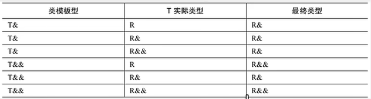

<!-- tabs:start -->

#### **智能指针：**

智能指针就是⼀个**类**，当超出了类的 作⽤域时，**类会⾃动调⽤析构函数**，析构函数会⾃动释放资源。所以智能指针的作⽤原理就是 在函数结束时⾃动释放内存空间，不需要⼿动释放内存空间。

* **unique_ptr：**uniuqe_ptr独享它指向的对象，同时只有一个unique_ptr指向同一个对象，当unique_ptr被销毁时，指向的对象也被销毁。**不能使用拷贝构造函数，不可用于隐式转换初始化**,**只允许移动**（构造函数禁止了拷贝构造函数和赋值函数）。不能用unique_ptr管理不是new分配的内存。
* **shared_ptr：**shared_ptr**共享它指向的对象，多个shared_ptr指向相同（关联）的对象**，在**内部采用计数机制**来实现，shared_ptr超出作用域时，引用计数减1，当引用计数为0时，则表示没有任何shared_ptr与对象关联，则释放该对象。
	* **shared_ptr什么情况下会自增：**
		* **初始化、拷贝、赋值**
		* **作为函数参数和返回值**：该函数内部创建的`shared_ptr`在返回时仍然有效，并且被外部接收，那么接收到的`shared_ptr`将是一个新的实例。
* **`std::weak_ptr`**：是一种不拥有其所指对象的智能指针，这意味着它不会增加对象的共享所有权计数。用于解决shared_ptr的循环引用问题
	* 循环引用：两个对象互相使用一个shared_ptr成员变量指向对方


#### **多态：**


#### **类型推导：**


#### **值传递，指针传递，引用传递：**

* 值传递和指针传递都有一个向函数调用栈帧的拷贝过程。**值传递**传递的是所拷贝**实参的副本**，是临时变量，因此不会影响原本的实参。

* **指针传递**拷贝的是**实参的地址**，函数内部可以通过指针变量指向该地址去访问，因此可以改变实数据。

* 引用传递没有拷贝过程，其就是实参的别名，底层指向同一片内存空间,后续对形参的操作都会通过间接寻址操作到实参。

	

#### **左值右值：**

* **左值：**程序运行过程中，有持久的存储位置（表达式结束后仍旧存在），可以出现在赋值运算符的左边。（结构体/类的实例、++i）
* **右值：**临时性的、不再需要的表达式结果，不可以被取地址，不能出现在赋值运算符的左边。（常量值、函数返回值、i++)

* **左值引用：**可以理解为是**对左值的引用**。对于左值引用，等号右边的值必须可以取地址，也就是说必须是左值。
* **右值引用：**可以理解为是对右值的引用。**通过移动语义来避免无谓拷贝问题**，通过**move语义可以将临时生成的左值中的资源无代价的转移到另一个对象中去**，通过**完美转发**来解决不能按照参数实际类型来转发的问题。这样可以避免内存空间的释放和分配，能够延长变量值的声明周期。
* **移动语义：**转移所有权，转移资源而不进行深拷贝。移动语义通常用于那些比较大的对象，搭配移动构造函数或移动赋值运算符来使用。通过move实现，std:move 的作用只有一个，无论输入参数是左值还是右值，都强制转成右值。


#### **完美转发：**

**完美转发：**完美转发是指在函数调用过程中，将参数的类型信息保持不变地传递给另一个函数。传统的函数调用中，参数的类型信息会丢失，只能传递参数的值。而完美转发可以保持参数的类型信息不变，从而可以在调用函数中使用原始参数的类型信息。


#### **万能引用：**



* 万能引用与右值引用的区别就是发生了**类型推导**，T&&和auto&&的初始化过程中都会发生类型推导，初始化的源对象为左值，则目标对象会推导出左值引用；源对象为右值，则目标对象会推导出右值引用；
* 整个推导过程中，只要有左值引用参与进来（不管是类模板型还是实际类型），最后的推到结果都是一个左值。只有模板类型为右值引用，实际类型是一个非引用类型或者右值引用类型时，才会推导出来一个右值引用。
* 万能引用最典型的用途是**完美转发**


```c++
void foo(int &&i){} //右值引用
int &&x = test();	//右值引用
template<class T>
void foo(T &&i){} 	//万能引用
auto &&x = test();	//万能引用
```


#### **列表初始化：**

* 在构造函数的冒号后面使用初始化列表
* 初始化列表是**给数据成员分配内存空间时就进行初始化**
* 初始化顺序是由类的成员声明顺序决定的，而不是初始化列表顺序

**成员列表初始化：**

* 初始化一个**const成员**时
* 初始化一个**引用成员**时
* 当**调用一个基类的构造函数**，而它拥有一组参数
* 当**调用**一个成员类的构造函数，其拥有一组参数。
	* **成员对象**：对象作为类的成员，如果他有构造函数，且构造函数参数不为空，必须使用列表初始化


#### **static:**

* **修饰局部变量:**当 static 用于修饰局部变量时，这个变量的存储位置会在程序执行期间保持不变，且只在程序执行到该变量的声明处时初始化一次。即使函数被多次调用， static 局部变量也**只在第一次调用时初始化，之后的调用将不会重新初始化它。**
* **修饰全局变量或函数:**当 static 用于修饰全局变量或函数时，限制了这些变量或函数的作用域，它们**只能在定义它们的文件内部访问**。有助于避免在不同文件之间的命名冲突。
* **修饰类的成员变量或函数:**在类内部，static 成员变量或函数**属于类本身，而不是类的任何特定对象**。这意味着所有对象共享同一个 static 成员变量，无需每个对象都存储一份拷贝。 static 成员函数可以在没有类实例的情况下调用。


<!-- tabs:end -->