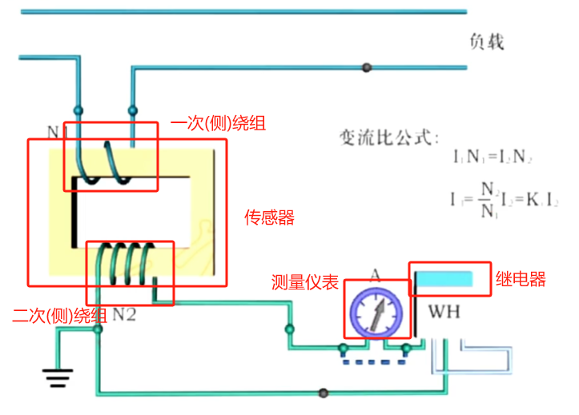
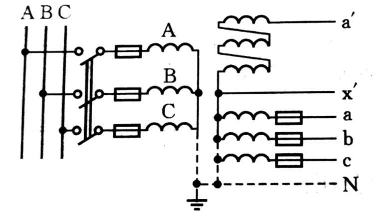
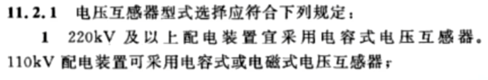

# 互感器

互感器是变压器的一种，其负载是**测量**仪表或者**保护**装置

旨在向测量仪器、仪表和保护或控制装置或者类似电器传送信息信号的变压器。

电流、电压的测量很有必要，互感器的作用在于：

1. 是测量仪表和保护装置标准化、小型化
   - 通俗理解为给仪表省钱，**将**一次回路的**大电压**、大电流、**转换为**二次回路标准的**小电压**、小电流
2. 隔离高压电路，保证二次设备和工作人员安全
   - 互感器的一次侧和二次侧（两侧）没有电的联系，即二次设备和高压部分是隔离的，保证了工作人员和设备的安全

# 1 电流互感器

## 1.1 电磁式电流互感器

### 1.1.1 种类

- 测量用电流互感器：为测量仪器和仪表传送信息信号的电流互感器。
  - 特点：
    - 小电流时具有较高准确度（收电费）。
    - 大电流时尽快饱和（避免故障）
- 保护用电流互感器：为保护和控制装置传送信息信号的电流互感器。
  - 特点：
    - 正常工作范围内不需要很高的精度
    - 工作范围要宽
    - 发生饱和的电流要大，发生故障时互感器不会损坏

### 1.1.2  工作原理

电磁式电流互感器工作原理：大电流转为小电流

- 一次侧绕组匝数少，二次侧绕组匝数多，和**升压变压器**的结构完全相同。
- 一次侧绕组匝数少，串联在被测回路中，因此可以认为互感器的一次侧电流完全取决与被测电路。这里的被测电路是高压线路，高压线路的电流是固定的，基本不变，此时的互感器可以认为是一个理想的电流源，因此**电流互感器的二次侧不允许开路运行**。
  - 一次侧电流不变，一次侧的磁动势也不变，磁通也不变，如果二次侧开路，没有二次侧反向的磁动势与一次侧相抵消，铁芯中的磁通密度突然增加，互感器铁芯饱和，会增加损耗，引起发热，且磁通发生畸变，二次侧会测出高电压。
- 二次侧绕组匝数多，和测量仪表及继电器相连，这些负载的阻抗很小，正常情况下，二次侧近似在短路情况下运行。
- 二次侧接地是为了保证在一次侧绕组击穿时，高压电传到二次侧，电流互感器的二次侧绕组和外壳都应接地。

### 1.1.3 二次侧的接线方式

#### 1.1.3.1 单相式接线

- 只能反映一相的电流，一般用在三相对称的线路中，用来测量电流或者负荷保护

#### 1.1.3.2 三相三继电器式接线（完全星形接线）

- 每一相都接一个电流继电器，并且接为星形，可以反应每个相的短路故障

#### 1.1.3.3 两相两继电器式接线

- 只在A相和C相装两个电流互感器，在加一个继电器
- B相短路故障，三相电路的相量和为0，流过继电器的电流是A相和C相电流的相量和

#### 1.1.3.4 两相一继电器

- 两个电流互感器和一个继电器，将电流互感器的非同名端相连。那么流入继电器的电流就是A相和C相电流的相量差
- 不同类型短路故障流过继电器的电流也不同

### 1.1.4 误差

引起互感器测量误差的因素有：

- 互感器的一次侧电流：一次侧电流越大，铁芯饱和越严重，电流误差越大
- 二次负荷阻抗：二次侧串接的仪器越多，阻抗越来越大，二次侧电流减小，二次侧的去磁作用会减弱，铁芯中的合成磁势增加，铁芯饱和，准确度下降

### 1.1.5 准确级

- **测量用电流互感器**准确级选择应符合下列原则：

  - 测量用电流互感器准确级,以该准确级在额定电流下所规定的最大允许电流误差的百分数来标称，标准准确级宜采用 0.1级、0.2级、0.5级、1级、3级和5级；供特殊用途的宜采用 0.2S级及 0.5S级。

  - 对于0.1级、0.2级、0.5级和1级测量用电流互感器，二次负荷为额定负荷值的25%~100%之间的任一值时，其额定频率下的电流误差和相位误差不应超过表所列限值。

  - 准确级越小，准确度越高 

- 保护用电流传感器

### 1.1.6 在主线中的配置

### 1.1.7 分类

根据电流互感器一次侧的绕组可以分为单匝式和多匝式

#### 1.1.7.1 单匝式

- 一次只有一匝线圈，可以利用互感器本身装有的铜杆，或者直接利用母线作为其一次绕组
- 一次电流很小时，误差很大，一般用在电流较大的场合(400A)

#### **1.1.7.2 多匝式**

- 即使一次电流较小，仍有较高的准确度
- 过电压或者短路电流通过时，一次绕组匝间可能出现过电压

## 1.2 电子式电流互感器

# 2 电压互感器

## 2.1 电磁式电流互感器

### 2.1.1 种类

- 测量用电压互感器：为测量仪器和仪表传送信息信号的电压互感器。
  - 特点：
    - 
- 保护用电压互感器：为保护和控制装置传送信息信号的电流互感器。
  - 特点：
    - 

### 2.1.2 工作原理

在正常使用情况下,其二次电压与一次电压实质上成正比,且其相位差在连接方法正确时接近于零的互感器。下图为电磁式电压互感器。

- 一次侧绕组比较多，二次侧绕组匝数比较少，相当于一个降压变压器
- 额定电压比(电压互感器的)：电压互感器的额定一次电压与额定二次电压之比
- 二次侧接的都是电压线圈，线径细、匝数多、阻抗较大，因此二次侧电流很小，近似于开路运行
- 电压互感器可以理解为一个理想的电压源，二次侧不允许短路

### 2.1.2 接线方式

- 测量用电压互感器主要用于测量相电压、线电压、零序电压

#### 2.1.2.1 单相式接线

- 分别可以用来测量线电压和相电压
- 一次侧和二次侧都有熔断器，
  - 一次绕组经过熔断器接入高压电网，目的是当电压互感器发生故障的时候，熔断器熔断，使电压互感器与系统隔离，避免电网受到故障的影响
  - 装在二次绕组侧的熔断器，则主要起到过负荷保护的作用，为了保证安全，二次侧绕组也必须有一点与大地相连

#### 2.1.2.2 V-V形

- V-V形接线只能测出两个线电压
- 两只电压互感器，就可以完成对三相电路的测量，无法测到相电压（相线对大地的电压），但对于高压计量来说，一般只需要测线电压，因此一般用于中性点非有效接地系统的电压测量

#### 2.1.2.3 三相三柱式

- 可以得到全部的线电压，不能用于测相电压

#### 2.1.2.4 三相五柱式

- 一次侧绕组和二次侧绕组都是中性点接地的星形连接
- 可以测量相电压

### 2.1.3 误差

- 误差来源主要包含
  - 电压器本身：互感器本身所产生的误差称为空载误差，误差大小取决与铁芯的材料以及制造工艺，可以采用高磁导率的冷轧硅钢片做铁心，以减小磁阻。
  - 所接的负载：负载误差，二次绕组并联的仪表越来越多，阻抗越来越小，电压源的电源内阻抗分压作用更明显，误差也就更大

### 2.1.4 准确级

将电压误差也得限制在一定范围内：

### 2.1.5 配置

