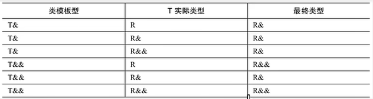

<!-- tabs:start -->

#### **智能指针：**

智能指针就是⼀个**类**，当超出了类的 作⽤域时，**类会⾃动调⽤析构函数**，析构函数会⾃动释放资源。所以智能指针的作⽤原理就是 在函数结束时⾃动释放内存空间，不需要⼿动释放内存空间。智能指针能像普通指针一样使用，就是因为里面重载了`*`(解引用)运算符和`->`（访问）运算符,*返回普通对象，->返回指针对象。

* **unique_ptr：**uniuqe_ptr独享它指向的对象，同时只有一个unique_ptr指向同一个对象，当unique_ptr被销毁时，指向的对象也被销毁。**不能使用拷贝构造函数，不可用于隐式转换初始化**,**只允许移动**（构造函数禁止了拷贝构造函数和赋值函数）。不能用unique_ptr管理不是new分配的内存。
* **shared_ptr：**shared_ptr**共享它指向的对象，多个shared_ptr指向相同（关联）的对象**，在**内部采用计数机制**来实现，shared_ptr超出作用域时，引用计数减1，当引用计数为0时，则表示没有任何shared_ptr与对象关联，则释放该对象。
	* **shared_ptr什么情况下会自增：**
		* **初始化、拷贝、赋值**
		* **作为函数参数和返回值**：该函数内部创建的`shared_ptr`在返回时仍然有效，并且被外部接收，那么接收到的`shared_ptr`将是一个新的实例。
* **`std::weak_ptr`**：是一种不拥有其所指对象的智能指针，这意味着它不会增加对象的共享所有权计数。用于解决shared_ptr的循环引用问题
	* 循环引用：两个对象互相使用一个shared_ptr成员变量指向对方


#### **多态：**

指的是一个接口可以有多个不同的实现。多态主要通过基类的指针或引用，来调用子类的重写函数实现。多态分为**编译时多态(静态多态)和运行时多态(动态多态)**。

* 静态多态：编译时多态，主要通过**函数重载和运算符重载、模板实现**。

	* **模板**：可以在编译时根据提供的类型信息生成特定类型的代码。
	* **函数重载**：就是在同一作用域下定义多个同名函数，只要它们的参数列表（参数的数量、类型或顺序）不同即可。编译器在编译时根据函数调用时提供的参数类型来确定应该调用哪个函数。
	* **运算符重载：**允许为已有的运算符赋予多重含义，即同一个运算符作用于不同类型的数据时可以有不同的行为。这也是在编译时根据操作数的类型来决定的。


* 动态多态：运行时多态，用基类指针指向派生类对象，结合虚函数技术，调用派生类的成员函数。
	* **虚表：**当我在类中声明至少一个虚函数时，编译器会在**编译期**间通过类的构造函数生成一个**虚函数表**(virtual table)，来**支持动态绑定和多态性**。虚表中存放的是**函数指针**，虚表是存放虚函数地址的数组。虚表是可以继承的，子类重写虚函数时，就可以替换其中的函数指针。在编译连接直到生成一个可执行文件之后，类A和伴随类A的虚函数表都会保存到可执行文件中，再可执行文件执行时，会一起放到内存中。
	* **虚函数表指针：**在对象被创建时，建立虚虚函数指针，在含有虚函数的类**实例化对象**时，对象地址的**前四个字节**存储的**指向虚表的指针**，因此虚函数指针的存放位置和申请对象的位置有关，new的话就是在堆中，对象在栈中就是在栈中。
		* 对于有虚函数的类在编译时，编译器会向类的**构造函数中添加为虚函数指针赋值的语句**，当创建类的对象时，会执行构造函数，便会使**vptr指向类的vpbl**。

* 通过虚表和虚函数指针的作用，通过父类指针来指向子类对象时，指针调用虚函数调用的便是子类的虚函数。在继承层次中，由于先构造父类，因此会先将基类的虚表地址赋值给父类的虚函数表指针。在子类构造初始化时，又会初始化将子类的虚表地址赋值给子类的虚函数指针。


#### **STL：**

**算法：**包括sort、find、for_each等常用的算法，其根据不同的容器有不同的实现方法。

**迭代器：**

* 迭代器是一种**行为类似指针的对象**，而指针的行为中最常见也最重要的便是内容提领（derference）和成员访问（member access）
* 因此，迭代器最重要的编程工作就是根据不同的容器操完成对**对operator*（解引用操作符）和operator->（成员访问操作符）、++、==进行重载**，形成针对每个容器的特定操作接口。


**空间配置器：**隐含在容器构造里面的，为容器开辟空间，一般有二级空间配置器，当开辟内存<=128bytes时，即视为开辟**小块内存，调用二级空间配置器**，当开辟内存>128bytes时，即视为开辟**大块内存，调用一级空间配置器**，一级空间配置器allocator采用malloc和free来管理内存，二级空间配置器allocator采用了基于freelist 自由链表原理的内存池机制实现内存管理。

* GC2.9 alloc的行为模式：**16个freelist**如下:(0~15)

	* 从#0开始维护8个byte，#1维护16个byte，#2维护24个byte......每一个都比前一个多8个字节
	* 当容器需要内存时，内存分配器负责分配大小，那么容器的内存大小就会被内存对齐被重新分配大小，比如50就会被分配为56（8的倍数），此时分配器就会查找那个链表可以对56进行负责。如果能负责的那个链表并没有管理其他内存块，类似下图也就是说下面没有挂其他链表，是空的。那么空间配置器allocators便会**使用malloc**向内存申请内存块，申请完毕后将内存切块串成**单链表**挂在节点下面。


**适配器：**一种修饰**容器、仿函数、或迭代器**接口的东西。

* stl提供的queue和stack，虽然看似容器，其实只能算作一种容器适配器，因为他们底部完全借助deque，所有的操作都由底层deque供应。


**仿函数：**行为类似函数，**可作为算法的某种策略**，从实现的角度看，仿函数是一种重载了operator()的class/class template，一般函数指针可以视为狭义的仿函数。

* 一般的函数可以实现变量的相加相减。**仿函数可以用来实现自己定义的类对象的相加相减，**类的属性可能是一个人，一个房子等等

**容器：**

序列式容器：vector、list、deque、stack、queue，关联式容器：map、set

* vector:**vector维护一个线性空间**,**vector支持随机存取，提供的是随机访问迭代器。**迭代器就是普通指针。vector缺省alloc作为空间配置器，并以此另外定义了一个data_allocator,为的是更方便以元素大小为配置单位。
	* vector由于维护的连续线性空间，其扩容只能申请一片更大的内存，再将原有的内容复制过去，这样原有的迭代器就会失效。
* list：list维护一个双向链表，提供了双向迭代器，允许向前和向后遍历链表。对任何元素的插入和删除移除永远都是常数时间。list空间管理采用**alloc空间配置器**，为了方便以节点大小为配置单位，还定义了一个**list_node_alloctor函数**可以一次性配置多个节点。
	* list维护一个双向链表，因此迭代器不会像vector的普通指针一样，其也需要进行构造（模板）
	* slit单向链表：list是双向链表、slit是单向链表，两者的主要区别是：list的迭代器是双向的，后者的迭代器是单向的，slist不如list灵活但是其所耗空间小，操作快。
* deque：底层为**双端数组**，可以在两端进行插入和删除。deque和vector一样也**支持随机存取**，deque和vector不同点是，deque维护的空间不是连续的，其是动态的以分段的连续空间组合而成，随时可以增加一段新的空间并链接起来，其分段空间由中控器来控制，中控器也是一片连续空间，里面存放的都是指针，指向一段deque的连续空间。
	* deque的迭代器不仅要实现++，--更要判断自己是否已经处于在缓冲区的边缘，如果是，一旦前进或者后退就必须跳跃至另一个上一个或者下一个缓冲区。deque维护**一个指向的map的指针和start、finish两个迭代器、分别指向第一个缓冲区的第一个元素和最后一个缓冲区的最后一个元素**。
* stack：是一种先入后出的数据结构，只有一个出口，只允许在栈顶新增元素，移除元素
* queue：底层为**双端队列**，先进先出
	* stack和queue都不允许遍历，因此都没有迭代器，stack和queue都可以选择list和deque作为底层结构。
	*  priority_queue：提供了一个**基于优先级堆的最大堆**。这意味着队列中的每个元素都有一个优先级，元素按照优先级的降序（最大堆）或升序（最小堆，但标准 `priority_queue` 默认是最大堆）被排列。优先级最高的元素总是在队列的顶部。
* set：底层为红黑树，所有**元素的键值都会自动排序**(从小至大)，其通过重新着色、自旋等操作，来保证最坏的情况下基本动态集合操作的时间复杂度保持在O(logn)。set的**元素只有键值**，set**不允许相同的两个键值**。
	* set的iterator是一种const_iterator，**不能通过迭代器修改set元素的值**，因为set元素值就是其键值，关系到set元素的排序规则，set的插入删除操作，不会导致迭代器失效。
	* **multiset特性：**唯一的不同是允许键值重复。插入重复元素时，并不需要移动已经存在的元素，而是将新元素作为一个新的节点**插入到子树的右节点一直插入重复元素，所有相同值的元素形成一种"链状"结构，主要向右延伸**。
* map：底层是**红黑树**，所有的元素的键值都会自动排序，**所有元素都是pair，同时拥有实值和键值**，不允许两个元素具有相同的键值
	* **不能通过迭代器改变map的键值，但是可以修改实值**。
	* set和map的迭代器都是**双向迭代器**
	* s.find() :查找键值key是否存在，返回的是该键的元素的迭代器，若不存在返回s.end()的迭代器;


#### **值传递，指针传递，引用传递：**

* 值传递和指针传递都有一个向函数调用栈帧的拷贝过程。**值传递**传递的是所拷贝**实参的副本**，是临时变量，因此不会影响原本的实参。

* **指针传递**拷贝的是**实参的地址**，函数内部可以通过指针变量指向该地址去访问，因此可以改变实数据。

* 引用传递没有拷贝过程，其就是实参的别名，底层指向同一片内存空间,后续对形参的操作都会通过间接寻址操作到实参。

	

#### **左值右值：**

* **左值：**程序运行过程中，有持久的存储位置（表达式结束后仍旧存在），可以出现在赋值运算符的左边。（结构体/类的实例、++i）
* **右值：**临时性的、不再需要的表达式结果，不可以被取地址，不能出现在赋值运算符的左边。（常量值、函数返回值、i++)

* **左值引用：**可以理解为是**对左值的引用**。对于左值引用，等号右边的值必须可以取地址，也就是说必须是左值。
* **右值引用：**可以理解为是对右值的引用。**通过移动语义来避免无谓拷贝问题**，通过**move语义可以将临时生成的左值中的资源无代价的转移到另一个对象中去**，通过**完美转发**来解决不能按照参数实际类型来转发的问题。这样可以避免内存空间的释放和分配，能够延长变量值的声明周期。
* **移动语义：**转移所有权，转移资源而不进行深拷贝。移动语义通常用于那些比较大的对象，搭配移动构造函数或移动赋值运算符来使用。通过move实现，std:move 的作用只有一个，无论输入参数是左值还是右值，都强制转成右值。


#### **完美转发：**

**完美转发：**完美转发是指在函数调用过程中，将参数的类型信息保持不变地传递给另一个函数。传统的函数调用中，参数的类型信息会丢失，只能传递参数的值。而完美转发可以保持参数的类型信息不变，从而可以在调用函数中使用原始参数的类型信息。


#### **万能引用：**



* 万能引用与右值引用的区别就是发生了**类型推导**，T&&和auto&&的初始化过程中都会发生类型推导，初始化的源对象为左值，则目标对象会推导出左值引用；源对象为右值，则目标对象会推导出右值引用；
* 整个推导过程中，只要有左值引用参与进来（不管是类模板型还是实际类型），最后的推到结果都是一个左值。只有模板类型为右值引用，实际类型是一个非引用类型或者右值引用类型时，才会推导出来一个右值引用。
* 万能引用最典型的用途是**完美转发**


```c++
void foo(int &&i){} //右值引用
int &&x = test();	//右值引用
template<class T>
void foo(T &&i){} 	//万能引用
auto &&x = test();	//万能引用
```


#### **列表初始化：**

* 在构造函数的冒号后面使用初始化列表
* 初始化列表是**给数据成员分配内存空间时就进行初始化**
* 初始化顺序是由类的成员声明顺序决定的，而不是初始化列表顺序

**成员列表初始化：**

* 初始化一个**const成员**时
* 初始化一个**引用成员**时
* 当**调用一个基类的构造函数**，而它拥有一组参数
* 当**调用**一个成员类的构造函数，其拥有一组参数。
	* **成员对象**：对象作为类的成员，如果他有构造函数，且构造函数参数不为空，必须使用列表初始化


#### **static:**

* **修饰局部变量:**当 static 用于修饰局部变量时，这个变量的存储位置会在程序执行期间保持不变，且只在程序执行到该变量的声明处时初始化一次。即使函数被多次调用， static 局部变量也**只在第一次调用时初始化，之后的调用将不会重新初始化它。**
* **修饰全局变量或函数:**当 static 用于修饰全局变量或函数时，限制了这些变量或函数的作用域，它们**只能在定义它们的文件内部访问**。有助于避免在不同文件之间的命名冲突。
* **修饰类的成员变量或函数:**在类内部，static 成员变量或函数**属于类本身，而不是类的任何特定对象**。这意味着所有对象共享同一个 static 成员变量，无需每个对象都存储一份拷贝。 static 成员函数可以在没有类实例的情况下调用。


<!-- tabs:end -->