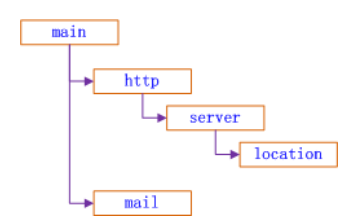

<!-- tabs:start -->

#### **Nginx数据转发：**

* **nginx配合fastcgi数据转发流程**：
	* 假设程序猿写了一个登录程序login.c ，然后将login.c 编译为可执行程序( login)
	* 使用 spawn-fcgi 进程管理器启动 login 程序, 得到一进程（fastCGI进程），也就是说login就是处理请求的fastCGI进程
	* 此时，spawn-fcgi 进程和fastCGI进程是父子进程，spawn-fcgi 进程启动时会捎带启动fastCGI进程
	* nginx不处理请求，然后转发数据给spawn-fcgi ，而spawn-fcgi 发送给fastCGI，然后fastCGI进程去处理数据
		* nginx需要**分析出客户端请求对应的指令**，提前**配置请求对应的locaton**，包括转发地址和包含fastCGI配置文件
		* sapwn-fcgi启动，sapwn-fcgi需要绑定地址和端口，和nginx转发地址(fastcgi_pass)保证一致
		* fastcgi程序编写
			* 首先需要接收服务器发送来的数据
			* 对接收的数据进行处理
			* 再将数据发送给web服务器
	* fastCGI处理完成请求，由fastCGI进程直接`回应请求`给nginx不再经过spawn-fcgi

#### fastDFS三个角色
追踪器(Tracker)-管理者-守护进程：

* 管理存储节点，不需要和用户进行交互。最先启动追踪器。
* 追踪者有很多，是一个集群，避免单点故障，多个Tracker轮询工作

存储节点-storage -守护进程：

* 存储节点线性扩展，存储文件，并在用户请求时传递文件。第二个启动的角色，启动后，会单独开一个**线程**：

	* 汇报当前存储节点的容量和剩余容量

	* 汇报数据的同步情况

	* 汇报数据被下载的次数

客户端-不是守护进程：

* 文件上传和文件下载，用户通过客户端进行操作。

#### 文件上传流程

客户端：

* **首先连接追踪器**，询问存储节点的信息

* 我要上传数据时，那个存储节点有足够的容量

* 追踪器查询，得到结果

* 追踪器将查到的存储节点的IP+端口号发送给客户端
* 通过得到IP和端口号连接存储节点
* 将文件发给存储节点
* 上传成功后会得到一个**文件ID**

#### 文件下载流程

* 客户端连接追踪器，询问存储节点的信息
	* 问一下，要下载的文件在哪一个存储节点
	* 追踪器查询，得到结果
	* 追踪器将查到的存储节点的IP+端口号发送给客户端
	* 通过得到IP和端口号连接存储节点
	* 下载文件，文件下载需要通过上传时得到的文件ID才能实现下载

#### redis持久化

​       redis是内存数据库，但是也做了一个**数据从内存到磁盘的数据同步**的持久化，即在磁盘上有一个**持久化文件**，防止停电影响内存数据丢失。

持久化的两种方式：

* rdb方式
	* 默认的持久化方式，默认打开
	* 磁盘的持久化文件xxx.rdb
	* 将内存数据以二进制的方式直接写入磁盘文件
	* rdb文件比较小，恢复的时候时间短效率高
	* 保存数据的方式以用户设定的频率-->容易丢数据
	* 数据同步频率低，数据完整性较低
* aof方式
	* 默认是关闭的
	* 磁盘的持久化文件xxx.aof
	* 直接将生成数据的命令写入磁盘文件
	* 文件比较大，恢复时间长
	* 保存数据的方式以某种频率-->每隔1sec同步一下数据（同步频率比rdb高）
	* 数据完整性高

#### 为什么redis

高效的内存存储和处理能力，支持丰富的数据结构，适合存储文件元数据等键值对。同时，Redis的持久化选项和集群扩展能力能够满足项目对高并发和高可用的要求。

**主从复制**：Redis 支持无缝的数据复制，使得数据可以从一个 Redis 服务器复制到多个从服务器，从而提高数据的可用性。

**哨兵（Sentinel）系统**：用于管理多个 Redis 服务器，实现故障转移和系统消息通知。

**集群**：通过 Redis 集群，可以在多个服务器间自动分割数据，提供更高的性能和数据容量。

#### 如何确保文件存储的高可用性和可靠性？

FastDFS支持冗余备份和负载均衡。文件可以根据需求进行多个副本的存储，这样即使某个Storage Server故障，文件仍然可以从备份服务器读取。

此外，Tracker Server会根据存储节点的负载情况动态调度，确保系统的高可用性。

#### Nginx配置文件的组织格式：

* **http -> 模块**, http相关的通信设置
	* http里面可以有多个**server模块** -> 每个server对应的是一台web服务器
		* 每个server也可以有多个**location模块**-->每个location对应处理一个客户端的请求，不同的location对应不同的客户端的请求

* location /{ // 反向代理服务器转发指令

	​			proxy_pass http://linux.com;   // 域名

	}

	upstream linux.com       // 代理模块对域名进行解析
	{
	    server 192.168.166.130:80 weight=1; # weight表示处理权重，权重较低，四次请求处理一次
	    server 192.168.166.134:80 weight=3; # 权重较高，四次请求处理三次
	}

* mail -> 模块, 处理邮件相关的动作

#### nginx负载均衡

负责均衡过程：负载均衡只需**设置一个服务器转发的域名，在代理模块中，服务器域名对应许多服务器地址**

* 当通过80端口将请求发送给反向代理服务器，反向代理服务器域名：localhost
* 反向代理服务器不处理请求，而是将请求扔给upstream模块
* upstream模块中有很多server，反向代理服务器在转发消息时，第一次转发会将消息给第一个server，第二次给第二个server，当只有两个服务器时，第三次转发会将消息给第一个server，实现**自动轮询**
	* Nginx内部通过**轮询算法**实现请求的分配。具体实现过程大致如下：
		* **初始化**：Nginx启动时，会读取配置文件中的`upstream`模块定义，初始化服务器列表，并为每个服务器分配一个初始权重（如果未明确指定，则默认为1）。
		* **请求处理**：当客户端请求到达Nginx时，Nginx会根据轮询算法从服务器列表中选择一个服务器来处理请求。
			* 首先，Nginx会遍历服务器列表，根据服务器的当前权重（考虑到可能的权重调整和服务器故障情况）选择当前权重最高的服务器。
			* 如果所有服务器的当前权重都相同，则按照服务器列表的顺序依次选择。
		* **权重调整**：在请求处理过程中，Nginx会根据服务器的实际响应情况动态调整服务器的权重。例如，如果某个服务器响应时间较长或频繁失败，Nginx可能会降低其权重，以减少分配给该服务器的请求数量。
		* **故障处理**：如果Nginx检测到某个服务器出现故障（如连接失败、超时等），则会自动将该服务器从当前轮询中剔除，直到该服务器恢复正常

#### **为什么选择FastCGI来处理动态请求**

* 与传统的 CGI 相比，FastCGI 最大的优点是**它支持长时间运行的进程**。这意味着应用服务器会启动一个持久的进程来处理多个请求，而不是像 CGI 那样为每个请求启动一个新进程。
* FastCGI **支持独立于 Web 服务器的进程管理。可以作为独立服务运行**，而不必集成到 Web 服务器进程中。Nginx 可以与这些 FastCGI 服务器通过 socket 通信，高效地处理动态请求。这种分离保证了 Web 服务器的稳定性和可管理性。
* fastCGI程序，**通过一个fastCGI进程管理器启动和管理**，不是由web服务器直接启动。

#### 服务端部署

* nginx配置;
	* 节点IP，将服务器ip和分布式节点ip进行更改配置
* 对于每一个登录的模块功能都可以开发为一个cgi，最终编译为可执行文件。

<!-- tabs:end -->