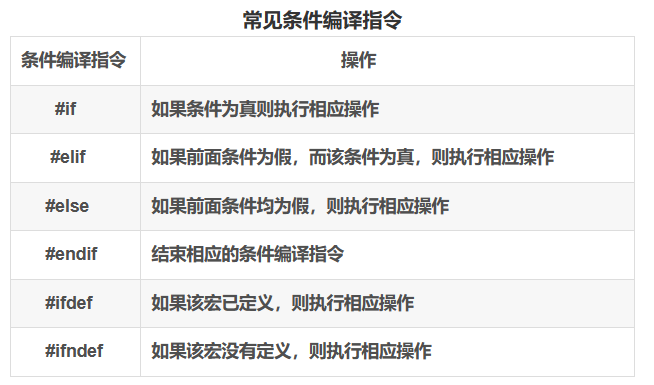
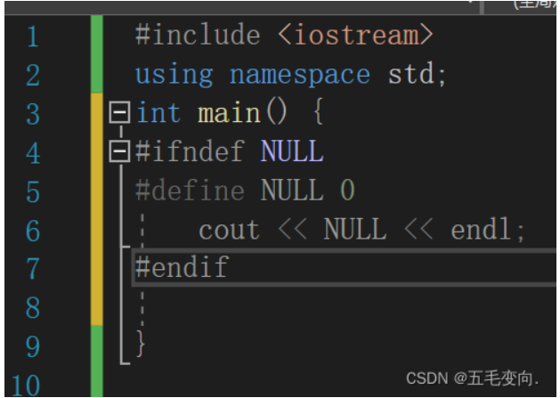
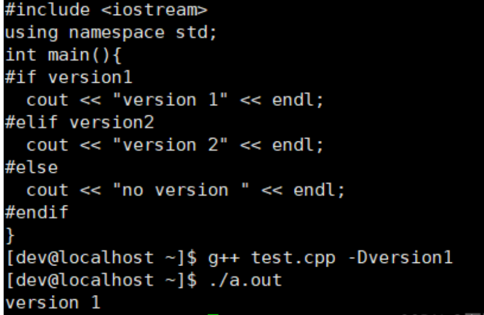
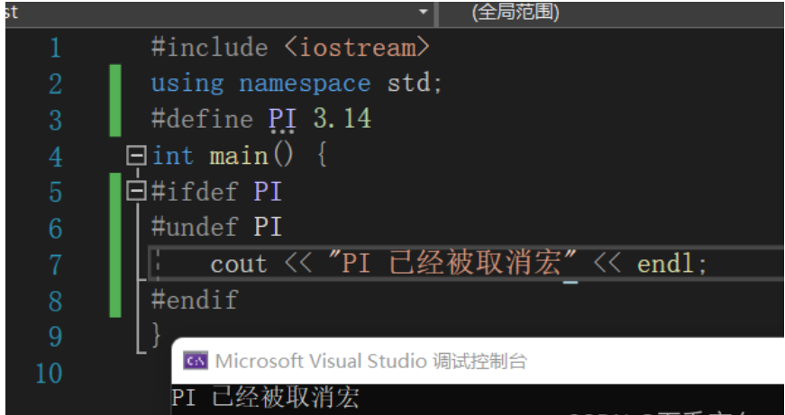
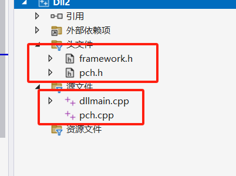
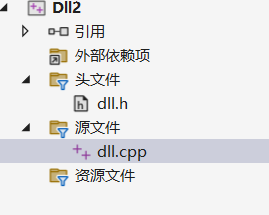
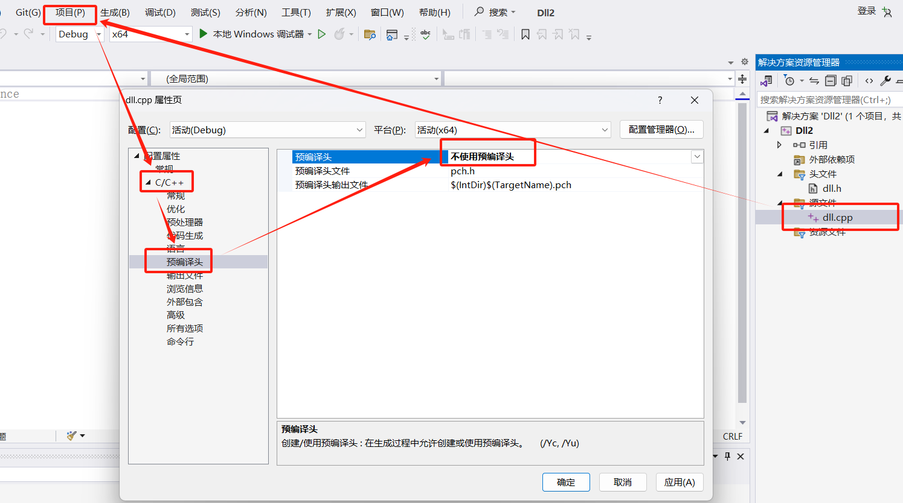
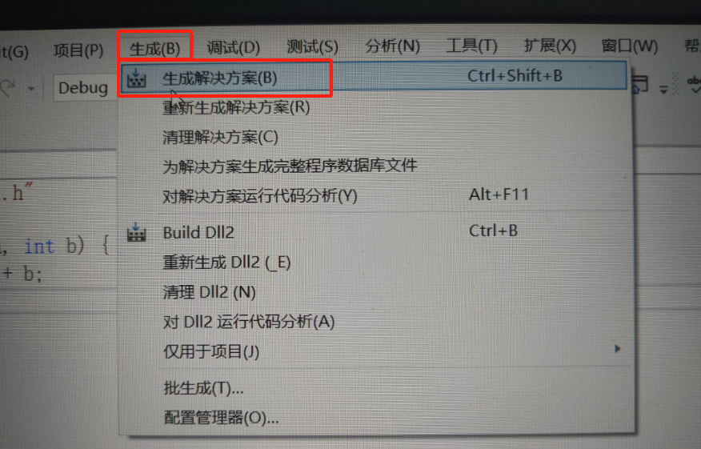
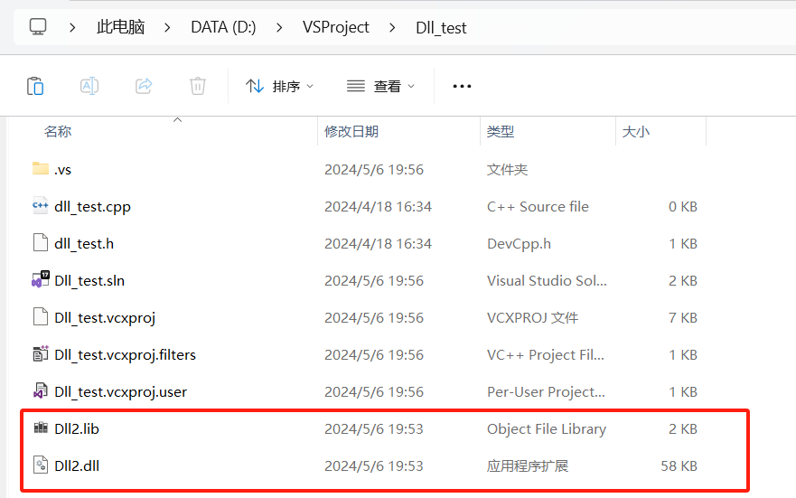
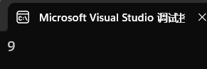

# 一、条件编译

​		条件编译是指预处理的时候根据条件编译的指令有条件的选择源程序中的一部分代码送给编译器进行编译，进行有选择性的操作，防止宏替换的内容重复包含。




## 1、#if  #else #endif

```c++
#if 表达式
 
// code
 
#else
 
// code
 
#endif
```

如果表达式为真则#if后程序段被调用

```c++
#include<iostream>
using namespace std;
int main(){
#if 1
	cout << "#if 1 的输出" << endl;
#else
	cout << "#if 0 的输出" << endl; 
#endif
}
```


## 2、#ifndef  #define  #endif

```c++
#ifdef 标识符
#define 标识符 替换列表
 
// code
 
#endef 
```

* 一般用于检测程序中是否已经定义了名字为某标识符的宏
	* **如果没有定义该宏，则定义该宏**，并选中从 #define 开始到 #endif 之间的程序段；
* 如果已定义，则不再重复定义该符号，且相应程序段不被选中。



这里能看到，define了NULL，但是本身NULL在c++中是已经定义过的，所以，不会选中 #define 开始到 #endif 之间的程序段，看起来是灰色的。

* 该条件编译指令更重要的一个应用是**防止头文件重复包含。**


如果 f.c 源文件中包含 f1.h 和 f2.h 两个头文件，而 f1.h 头文件及 f2.h 头文件中均包含 f3.h 头文件，则 f.c 源文件因为包含了 f1.h 和 f2.h 两个头文件，所以中重复包含 f3.h 头文件。可采用条件编译指令，来避免头文件的重复包含问题。

```c++
#ifndef _HEADNAME_H_
 
#define _HEADNAME_H_
 
    //头文件内容
 
#endif
```


## 3、#if  #elif  #else  #endif

```c++
#if 条件表达式1
 
    // code1
 
#elif 条件表达式2
 
    //code 2
 
#else
        
    //code 3
 
#endif
```

1.  功能为：先判断条件1的值，如果为真，则程序段 1 被选中编译；
2. 如果为假，而条件表达式 2 的值为真，则程序段 2 被选中编译；
3. 其他情况，程序段 3 被选中编译。



## 4、#ifdef  #endif

```C
#ifdef 标识符
    
    //code
 
#endif
```

1. 如果检测到已定义该标识符，则选择执行相应程序段被选中编译；
2. 否则，该程序段会被忽略。

```C
#include <iostream>
using namespace std;
#define PI 3.14
int main() {
#ifdef PI 
#undef PI
	cout << "PI 已经被取消宏" << endl;
#endif 
}
```




# 二、动态链接库

## 1、windows

**1.1. 利用vs创建DLL动态链接库**


**1.2. 删除掉自动生成的头文件和源文件**



**1.3. 添加自己的头文件和源文件**



**1.4. 选中dll.cpp,在属性页不使用预编译头**




**1.5 文件导出代码**

dll.h

```c
extern "C" _declspec(dllexport) int add(int a, int b);
```

关键字：

* extern
	* 以c语言的编译方式对函数进行导出
* _declspec(dllexport)
	* 导出dll文件

dll.cpp

```c++
#include "dll.h"
int add(int a, int b) {
	return a + b;
}
```


**1.6. 生成解决方案**




生成后，会出现dll动态库文件，找到自己的项目目录其中Debug中存放了生成的.dll文件


**1.7. 在别的项目文件中使用链接库**

首先将.dll文件与.lib文件复制到新项目的路径下：



* **静态调用**

	* 静态调用需要使用生成的.dll文件和.lib文件

	* 关键字:

		* **_declspec(dllimport)**
			* 导入dll文件的关键字

		* **comment**
			* 导入lib文件的关键字

dll_test.h文件

```c++
extern "C" _declspec(dllimport) int add(int a, int b);

#pragma comment(lib,"DLL2.lib")
```

dll_test.cpp文件

```c++
#include "dll_test.h"  //包含头文件
#include<iostream>
using namespace std;

int main() {

	cout << add(4, 5) << endl;
	return 0;
}
```




* **动态调用**
	* 需要dll文件和操作系统(windows.h)提供的API
	* API：
		* LoadLibrary：获取句柄
			* 参数默认为指针类型，L进行类型转换
		* GetProcAddress:获取入口地址
			* 两个参数：第一个是句柄，第二个为调用的函数名称
		* FreeLibrary

dll_test.h

```c++
#include<Windows.h>

//获取句柄
HINSTANCE hdll = LoadLibrary(L"DLL2.dll");  //前缀L进行转换类型
//获取函数的入口地址
typedef int(*p_add)(int a, int b); //新建一个函数指针
p_add addFunction = (p_add)GetProcAddress(hdll, "add"); //获取入口地址
```

dll_test.cpp

```c++
#include "dll_test.h"
#include<iostream>
using namespace std;

int main() {

	cout << addFunction(4, 5) << endl;
	return 0;
}
```


## 2、Linux

参考cmake。
