# 1.CMake概述

CMake 是一个项目构建工具，并且是**跨平台**的。关于项目构建我们所熟知的还有Makefile（通过 make 命令进行项目的构建），大多是IDE软件都集成了make，比如：VS 的 nmake、linux 下的 GNU make、Qt 的 qmake等，如果自己动手写 makefile，会发现，makefile 通常依赖于当前的编译平台，而且编写 makefile 的工作量比较大，解决依赖关系时也容易出错。

而 CMake 恰好能解决上述问题， 其允许开发者指定整个工程的编译流程，在根据编译平台，自动生成本地化的Makefile和工程文件，最后用户只需make编译即可，所以可以把CMake看成一款自动生成 Makefile的工具，其编译流程如下图：


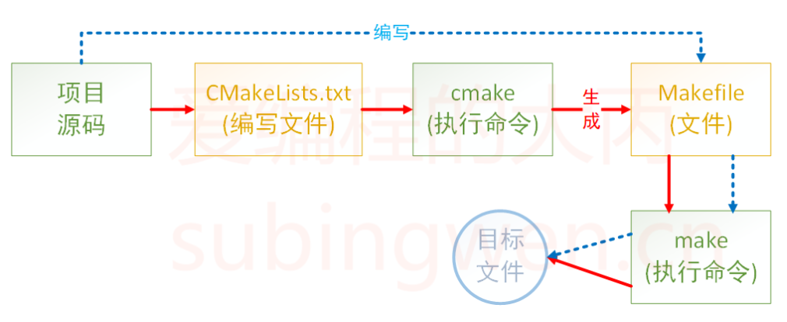


介绍完CMake的作用之后，再来总结一下它的优点：

* 跨平台
* 能够管理大型项目
* 简化编译构建过程和编译过程
* 可扩展：可以为 cmake 编写特定功能的模块，扩充 cmake 功能


# 2.CMake安装

camke安装前最好安装好qt及其依赖：

```shell
sudo apt update									# 更新apt安装源	
sudo apt install qt5-default qtcreator			# 安装Qt组件和Qt Creator
```

2.1、去官网下载

[Download CMake](https://cmake.org/download/)

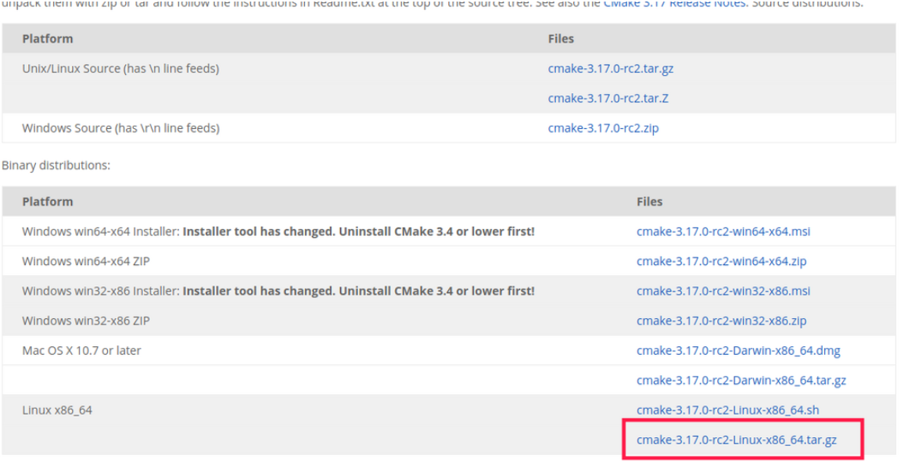


2.2、解压并进入目录

将其复制到/opt目录下

```shell
sudo cp cmake-3.30.2.tar.gz /opt
cd /opt
sudo tar -zxvf cmake-3.30.2.tar.gz
#编译
./configure
make -j4
sudo make install
```

configure编译时报错：找不到qt安装的路径

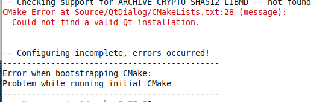

```shell
//解决方案-->设置qt安装路径
export CMAKE_PREFIX_PATH=/home/wang/Qt5.14.2/Tools/qtcreator
```

2.3、创建软连接

```shell
cd cmake-3.30.2/bin
sudo ln -s /opt/cmake-3.30.2/bin/cmake /usr/bin/cmake
```

2.4、查看安装版本

```shell
cmake -version
```

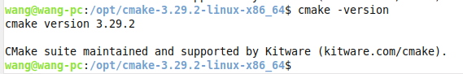

### 2.1 **vscode配置cmake**

**安装扩展文件**

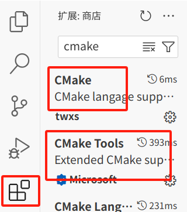

**2、配置相关文件**

**Ctrl+Shift+p**：输入C/Cpp:Edit Configurations生成配置文件 **c_cpp_properties.json**

**Ctrl+Shift+p**：输入Open launch.json生成配置文件**launch.json**

**Ctrl+Shift+p**:输入Tasks: Configure task生成配置文件 **tasks.json**

**Ctrl+Shift+p**:打开配置文件 **settings.json**

配置完成

# 3.CMake编译

在vscode中写入程序：

add.cpp

```c++
#include"head.h"

int add(int a,int b){
    return a+b;
}
```

sub.cpp

```c++
#include"head.h"

int sub(int a,int b){
    return a-b;
}
```

head.h

```c++
#ifndef _HEAD_H
#define _HEAD_H
int add(int a,int b);
int sub(int a,int b);

#endif
```

main.cpp

```c++
#include"head.h"
#include<iostream>
using namespace std;

int main(){

    cout << add(5,10) << endl;
    cout << sub(10,5) << endl;
    return 0;
}
```

文件目录：

```
$ tree
.
├── add.cpp
├── head.h
├── main.cpp
└── sub.cpp
```


## 3.1 CMakeLists.txt

**CMakeLists.txt语法：**

* **注释：**

CMake 使用 **#[[ ]]** 形式进行块注释。

```cmake
#[[ 这是一个 CMakeLists.txt 文件。
这是一个 CMakeLists.txt 文件.
这是一个 CMakeLists.txt 文件]]
cmake_minimum_required(VERSION 3.0.0)
```


* **添加 CMakeLists.txt 文件**

	* **cmake_minimum_required：**指定使用的 cmake 的最低版本

	* **project：**定义工程名称，并可指定工程的版本、工程描述、web主页地址、支持的语言（默认情况支持所有语言），如果不需要这些都是可以忽略的，只需要指定出工程名字即可。

	```cmake
	# PROJECT 指令的语法是：
	project(<PROJECT-NAME> [<language-name>...])
	project(<PROJECT-NAME>  #[[项目名称]]
	       [VERSION <major>[.<minor>[.<patch>[.<tweak>]]]] #[[项目版本]]
	       [DESCRIPTION <project-description-string>] #项目描述
	       [HOMEPAGE_URL <url-string>]  #网站地址
	       [LANGUAGES <language-name>...]) #项目编写语言。默认都支持
	```

	* **add_executable：**定义工程会生成一个可执行程序
		* 这里的可执行程序名和project中的项目名没有任何关系
		* 源文件名可以是一个也可以是多个，如有多个可用空格或;间隔

	```cmake
	add_executable(可执行程序名 源文件名称)
	# 样式1
	add_executable(app add.cpp main.cpp sub.cpp)
	# 样式2
	add_executable(app add.cpp;main.cpp;sub.cpp)
	```

	例子：

```cmake
cmake_minimum_required(VERSION 3.15)
project(test)  
add_executable(app add.cpp main.cpp sub.cpp)
```


#### **执行cmake命令**

```cmake
# cmake 命令原型
$ cmake CMakeLists.txt文件所在路径
```

```cmake
$ tree
.
├── add.cpp
├── CMakeLists.txt
├── head.h
├── main.cpp
└── sub.cpp

0 directories, 7 files
robin@OS:~/Linux/3Day/calc$ cmake .   #CMakeLists.txt在当前路径下（.）
```


常见的编译方法通过g++：

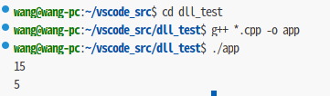

通过CMakeLists.txt来编译：

1、当前路径下创建CMakeLists.txt文件

```c++
touch CMakeLists.txt  //区分大小写，一个单词也不能错
```

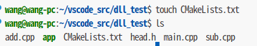

2、写入指令

```cmake
cmake_minimum_required(VERSION 3.15)
project(test)  
add_executable(app add.cpp main.cpp sub.cpp)
```

3、编译

```
cmake .
```

由于编译会生成新的文件，创建一个新目录来放置生成的文件，此时CMakeLists.txt在上一级目录(..)

```cmake
mkdir bulid
cd bulid
cmake .. 
```

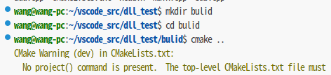

生成的新文件如下：

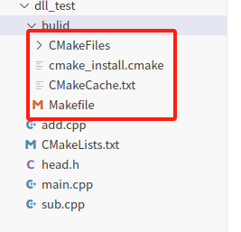

4、通过Makefile文件生成可执行程序

```cmake
make
./app
```


#### set命令

**1、定义变量**

​		当源文件需要反复被使用，每次都直接将它们的名字写出来确实是很麻烦，此时我们就需要定义一个变量，将文件名对应的字符串存储起来，在cmake里定义变量需要使用set

```cmake
# SET 指令的语法是：
# [] 中的参数为可选项, 如不需要可以不写
SET(VAR [VALUE] [CACHE TYPE DOCSTRING [FORCE]])
```

* VAR：变量名
* VALUE：变量值

```cmake
# 方式1: 各个源文件之间使用空格间隔
# set(SRC_LIST add.cpp main.cpp sub.cpp)

# 方式2: 各个源文件之间使用分号 ; 间隔
set(SRC_LIST add.c;div.c;main.c;mult.c;sub.c)
add_executable(app  ${SRC_LIST})
```


**2、指定使用的c++标准**

```shell
$ g++ *.cpp -std=c++11 -o app
```

上面的例子中通过参数-std=c++11指定出要使用c++11标准编译程序，C++标准对应有一宏叫做DCMAKE_CXX_STANDARD。在CMake中想要指定C++标准有**两种方式**：

* 在 CMakeLists.txt 中通过 set 命令指定

```cmake
#增加-std=c++11
set(CMAKE_CXX_STANDARD 11)
#增加-std=c++14
set(CMAKE_CXX_STANDARD 14)
#增加-std=c++17
set(CMAKE_CXX_STANDARD 17)
```

* 在执行 cmake 命令的时候指定出这个宏的值

```shell
#增加-std=c++11
cmake CMakeLists.txt文件路径 -DCMAKE_CXX_STANDARD=11
#增加-std=c++14
cmake CMakeLists.txt文件路径 -DCMAKE_CXX_STANDARD=14
#增加-std=c++17
cmake CMakeLists.txt文件路径 -DCMAKE_CXX_STANDARD=17
```


**3、指定输出的路径**

在CMake中**指定可执行程序输出的路径**，也对应一个宏，叫做EXECUTABLE_OUTPUT_PATH，它的值还是通过set命令进行设置:

```cmake
set(HOME /home/robin/Linux/Sort)
set(EXECUTABLE_OUTPUT_PATH ${HOME}/bin)
```

* 第一行：定义一个变量用于存储一个绝对路径

* 第二行：将拼接好的路径值设置给EXECUTABLE_OUTPUT_PATH宏
	* 如果这个路径中的子目录不存在，会自动生成，无需自己手动创建

​		由于可执行程序是基于 cmake 命令生成的 makefile 文件然后再执行 make 命令得到的，所以如果此处指定可执行程序生成路径的时候使用的是相对路径 ./xxx/xxx，那么这个路径中的 ./ 对应的就是 makefile 文件所在的那个目录。


CMakeLists.txt：

```cmake
cmake_minimum_required(VERSION 3.15)  #[[最低版本]]
project(test)   #[[工程名称]]
set(SRC add.cpp main.cpp sub.cpp)  #[[集合，命名]]
set(HOME /home/wang/vscode_src/dll_test)  #[[输出路径]]
set(EXECUTABLE_OUTPUT_PATH ${HOME}/bulid)
set(CMAKE_CXX_STANDARD 11) #[[c++11标准]]
add_executable(app ${SRC}) 
```


#### 多文件cmake

如果一个项目里边的源文件很多，在编写CMakeLists.txt文件的时候不可能将项目目录的各个文件一一罗列出来，这样太麻烦也不现实。所以，在CMake中为我们提供了搜索文件的命令，可以使用aux_source_directory命令或者file命令。

1、aux_source_directory

aux_source_directory 命令可以查找某个路径下的所有源文件，命令格式为：

```cmake
aux_source_directory(< dir > < variable >)
```

* dir：要搜索的目录
* variable：将从dir目录下搜索到的源文件列表存储到该变量中

```cmake
cmake_minimum_required(VERSION 3.0)
project(CALC)
include_directories(${PROJECT_SOURCE_DIR}/include)
# 搜索 src 目录下的源文件
aux_source_directory(${CMAKE_CURRENT_SOURCE_DIR}/src SRC_LIST)
add_executable(app  ${SRC_LIST})
```

* PROJECT_SOURCE_DIR,是**CMakeLists.txt**/源文件所在的路径

**CMakeLists.txt：**

```cmake
cmake_minimum_required(VERSION 3.15)
project(test)
aux_source_directory(${PROJECT_SOURCE_DIR} SRC) #搜索当前路径下的源文件
add_executable(app ${SRC})
```


2、file

```cmake
file(GLOB/GLOB_RECURSE 变量名 要搜索的文件路径和文件类型)
file(GLOB MAIN_SRC ${CMAKE_CURRENT_SOURCE_DIR}/src/*.cpp)
file(GLOB MAIN_HEAD ${CMAKE_CURRENT_SOURCE_DIR}/include/*.h)
```

* GLOB: 将指定目录下搜索到的满足条件的所有文件名生成一个列表，并将其存储到变量中。
* GLOB_RECURSE：递归搜索指定目录，将搜索到的满足条件的文件名生成一个列表，并将其存储到变量中。
* CMAKE_CURRENT_SOURCE_DIR 宏表示当前访问的 CMakeLists.txt 文件所在的路径。
* 关于要搜索的文件路径和类型可加双引号，也可不加:

**CMakeLists.txt：**

```cmake
cmake_minimum_required(VERSION 3.15)
project(test)
file(GLOB MAIN_SRC ${CMAKE_CURRENT_SOURCE_DIR}/*.cpp)
add_executable(app ${SRC})
```


#### 分文件cmake

文件目录：

```
$ tree
.
├── build
├── CMakeLists.txt
├── include
│   └── head.h
└── src
    ├── add.cpp
    ├── main.cpp
    └── sub.cpp

3 directories, 7 files
```

**CMakeLists.txt：**

```cmake
cmake_minimum_required(VERSION 3.0)
project(CALC)  #工程名称
set(CMAKE_CXX_STANDARD 11)  # c++版本
set(HOME /home/robin/Linux/calc) # 可执行文件输出路径
set(EXECUTABLE_OUTPUT_PATH ${HOME}/bin/) #
include_directories(${PROJECT_SOURCE_DIR}/include) #头文件 
file(GLOB SRC_LIST ${CMAKE_CURRENT_SOURCE_DIR}/src/*.cpp) #查找源文件
add_executable(app  ${SRC_LIST}) 
```


### 静态库编译

指令：

```cmake
add_library(库名称 STATIC 源文件1 [源文件2] ...) 
```

在Linux中，静态库名字分为三部分：lib+库名字+.a，此处只需要指定出库的名字就可以了，另外两部分在生成该文件的时候会自动填充。

在Windows中虽然库名和Linux格式不同，但也只需指定出名字即可。

|        | windows | linux | 可执行权限 |
| :----: | :-----: | :---: | :--------: |
| 静态库 |  .lib   |  .a   |     无     |
| 动态库 |  .dll   |  .so  |   **有**   |

**CMakeLists.txt：**

```cmake
cmake_minimum_required(VERSION 3.0)
project(CALC)
include_directories(${PROJECT_SOURCE_DIR}/include) #头文件
file(GLOB SRC_LIST ${CMAKE_CURRENT_SOURCE_DIR}/src/*.cpp) #源文件
add_library(calc STATIC ${SRC_LIST})  #动态库生成
```

这样最终就会生成对应的静态库文件libcalc.a。

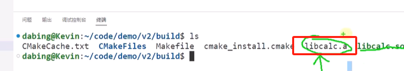


### 动态库编译

指令：

```cmake
add_library(库名称 SHARED 源文件1 [源文件2] ...) 
```

在Linux中，动态库名字分为三部分：lib+库名字+.so，此处只需要指定出库的名字就可以了，另外两部分在生成该文件的时候会自动填充。

**CMakeLists.txt：**

```cmake
cmake_minimum_required(VERSION 3.0)
project(CALC)
include_directories(${PROJECT_SOURCE_DIR}/include) #头文件
file(GLOB SRC_LIST ${CMAKE_CURRENT_SOURCE_DIR}/src/*.cpp) #源文件
add_library(calc SHARED ${SRC_LIST})  #动态库生成
```

这样最终就会生成对应的动态库文件libcalc.so。

编译流程：

```cmake
cmake ..
make
```

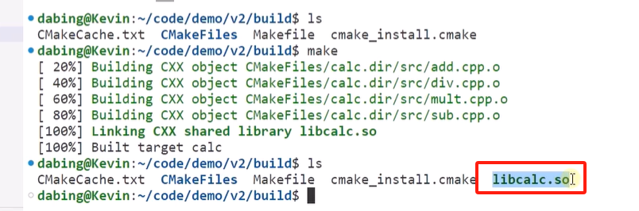


### 指定库输出路径

1、EXECUTABLE_OUTPUT_PATH宏

* **只适用于动态库**
* 对于生成的库文件来说和可执行程序一样都可以指定输出路径。由于在Linux下生成的动态库默认是有执行权限的，所以可以按照生成可执行程序的方式去指定它生成的目录：

```cmake
cmake_minimum_required(VERSION 3.0)
project(CALC)
include_directories(${PROJECT_SOURCE_DIR}/include)
file(GLOB SRC_LIST "${CMAKE_CURRENT_SOURCE_DIR}/src/*.cpp")
# 设置动态库生成路径
set(EXECUTABLE_OUTPUT_PATH ${PROJECT_SOURCE_DIR}/lib)
add_library(calc SHARED ${SRC_LIST})
```


2、LIBRARY_OUTPUT_PATH宏

* **适用于静态库和动态库**
* 由于在Linux下生成的静态库默认不具有可执行权限，所以在指定静态库生成的路径的时候就不能使用EXECUTABLE_OUTPUT_PATH宏了，而应该使用LIBRARY_OUTPUT_PATH，这个宏对应静态库文件和动态库文件都适用。

```cmake
cmake_minimum_required(VERSION 3.0)
project(CALC)
include_directories(${PROJECT_SOURCE_DIR}/include)
file(GLOB SRC_LIST "${CMAKE_CURRENT_SOURCE_DIR}/src/*.cpp")
# 设置动态库/静态库生成路径
set(LIBRARY_OUTPUT_PATH ${PROJECT_SOURCE_DIR}/lib)
# 生成动态库
#add_library(calc SHARED ${SRC_LIST})
# 生成静态库
add_library(calc STATIC ${SRC_LIST})
```


### 库文件包含

