### **图像拼接**

图像拼接的基本流程包括图像预处理、图像配准（特征匹配）、图像合成（特征融合）

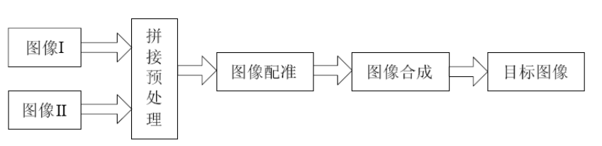


**图像预处理：**

消除影响图像 配准精度的无关信息，提升图像配准效率。

* 图像去噪
* 几何校正
* 均匀颜色

**图像配准：**

将多幅图像进行匹配、叠加的过程。应当能够估计待拼接图像之间可能存在的缩放、旋转、仿射变换、投影变换以及亮度和颜色等变化。

找到待配准图像与参考图像的模板或特征点的对应位置，然后根据对应关系建立参考图像与待配准图像之间的**转换数学模型，将待配准图像转换到参考图像的坐标系中，**确定两图像之间的重叠区域。精确配准的关键是寻找一个能很好描述两幅图像转换关系的数据模型。

* **基于模板匹配方法**
	* 差值平方和 (TM_SQDIFF): 通过计算模板与搜索区域中所有对应位置像素点的像素平方差之和来衡量两者相似度。计算结果越小表示越相似，当计算结果为0时表示两者完全相同。
	* 归一化差值平方和 (TM_SQDIFF_NORMED): 与差值平方和类似，但加了一个归一化操作，以确保当模板和搜索区域的亮度都乘以某个系数后，**相似度值**保持不变。
	* **相关系数** (TM_CCORR): 采用模板和搜索区域的相关系数作为衡量指标，相关系数越大表示两者越相似。
	* 归一化相关系数 (TM_CCORR_NORMED): 对比相关系数，多了一个归一化操作，也是为了确保亮度变化时相似度保持稳定。
	* 去均值相关系数 (TM_CCOEFF): 与相关系数类似，但在计算时模板和搜索区域都减去各自的均值。
* **基于边缘匹配方法**
	* 边缘提取: 利用算法提取图像的边缘特征，然后对这些边缘特征进行匹配分析，以找到最佳的配准参数。
		* 常用的边缘检测算子：
			* robert cross
			* sobel
			* Kirsch
			* 拉普拉斯
			* Canny
	* 交互方差分析: 在提取边缘图像后，通过计算交互方差来搜索配准参数，以达到最佳的匹配效果。
	* Lipschitz指数特征点提取: 利用Lipschitz指数找到边缘的突变点作为特征点，然后进行图像配准。
* **基于特征匹配方法**
	* 特征检测与描述
		* **SIFT**（Scale-Invariant Feature Transform）：检测图像中的关键点，并计算其局部描述子，具有尺度和旋转不变性。
		* **SURF**（Speeded Up Robust Features）：加速版的SIFT算法，计算速度更快，适合实时应用。
		* **ORB**（Oriented FAST and Rotated BRIEF）：结合FAST特征检测和BRIEF特征描述的算法，具有较高的计算效率和较好的匹配性能。
	* 特征匹配
		* **BFMatcher**（Brute-Force Matcher）：暴力匹配算法，通过逐个比较描述子，找到距离最近的匹配对。
		* **FLANN**（Fast Library for Approximate Nearest Neighbors）：基于近似最近邻搜索的快速匹配算法，适合大规模特征点匹配。
	* 配准方法
		* **RANSAC**（Random Sample Consensus）：通过随机抽样的方法，估计图像之间的变换模型，剔除误匹配点，提高配准的精度。
		* **ICP**（Iterative Closest Point）：通过迭代的方式最小化两个点集之间的距离，用于精细配准。
	
*  **基于密集方法**
	
	* 光流法
		* **Lucas-Kanade 光流法**: 通过追踪图像中的局部区域运动来估计光流场。
		* **Pyramidal Lucas-Kanade**: 通过金字塔图像进行多尺度估计，以处理较大位移。
	
	
	* 相位相关法
		* **相位相关法（Phase Correlation）**: 通过傅里叶变换和逆变换计算图像之间的相位差，适用于全局平移变换。

* **基于学习的方法**
	* **深度学习**: 使用卷积神经网络（CNN）等深度学习方法进行特征提取和匹配，近年来成为图像配准领域的研究热点。


**图像拼接：**

矫正差异，消除缝隙，消除图像配准算法产生的误差累积、色彩差异。

* **直接拼接**
	* 当前算法在图像融合时，简单地将变换后的第二张图像与第一张图像直接拼接在一起。这种方法没有考虑重叠区域的颜色和亮度差异，也没有进行复杂的过渡处理，可能会在拼接处产生明显的接缝

* 基于能量谱的最佳拼接线搜寻
	* 基于能量谱进行最优拼接线搜寻的技术，其本质是图像梯度谱的结合，用结构和特征谱来确定图像区域的显著特征。


* 基于图割的最佳拼接线搜寻
	* 将图像间重叠区域的图像像素 点视为图结构中的节点。在图像的重叠区域内，寻找一条能够精准、有效连接两幅图像的、使其实现无缝拼接的线。则将最佳拼接线寻优问题转化为图割理论中的寻找最优节点连接带权限问题。
* 渐变融合

  * 渐变融合方法通过对重叠区域进行加权平均，使两幅图像在拼接处平滑过渡。这种方法计算简单且易于实现，但可能会出现模糊或重影效果。

* 多频段融合

  * 多频段融合方法（如拉普拉斯金字塔融合）通过将图像分解为多个频段，并在每个频段上进行融合，然后再合成最终图像。该方法能够处理复杂的光照和颜色变化，效果较好，但计算复杂度较高。


### QT

**测试图像**：


#### 图像预处理

**图像去噪**：

1. 中值滤波

```c++
#include <QApplication>
#include <QImage>
#include <QLabel>
#include <opencv2/opencv.hpp>
#include <opencv2/imgproc/imgproc.hpp>
#include <opencv2/highgui/highgui.hpp>

// 将cv::Mat转换为QImage
QImage cvMatToQImage(const cv::Mat& mat) {
    switch (mat.type()) {
    case CV_8UC4:
        return QImage(mat.data, mat.cols, mat.rows, mat.step, QImage::Format_ARGB32);
    case CV_8UC3:
        return QImage(mat.data, mat.cols, mat.rows, mat.step, QImage::Format_RGB888).rgbSwapped();
    case CV_8UC1:
        return QImage(mat.data, mat.cols, mat.rows, mat.step, QImage::Format_Grayscale8);
    default:
        break;
    }
    return QImage();
}

int main(int argc, char *argv[]) {
    QApplication app(argc, argv);

    // 读取图像
    cv::Mat src = cv::imread("/home/wang/Desktop/test1.jpg");
    if (src.empty()) {
        qDebug() << "Error: Image cannot be loaded!";
        return -1;
    }

    cv::Mat dst;
    // 中值滤波
    cv::medianBlur(src, dst, 5);

    // 将处理后的图像转换为QImage
    QImage qimg = cvMatToQImage(dst);
    QLabel lbl;
    // 显示图像
    lbl.setPixmap(QPixmap::fromImage(qimg));
    lbl.show();

    return app.exec();
}
```


**几何校正**

旋转：

```c++
// 旋转图像
cv::Mat rotateImage(const cv::Mat& src, double angle) {
    cv::Mat dst;
    // 计算旋转中心
    cv::Point2f pt(src.cols / 2.0, src.rows / 2.0);
    // 获取旋转矩阵
    cv::Mat r = cv::getRotationMatrix2D(pt, angle, 1.0);
    // 进行仿射变换
    cv::warpAffine(src, dst, r, cv::Size(src.cols, src.rows));
    return dst;
}
    // 旋转图像
    cv::Mat dst = rotateImage(src, 45.0);
```

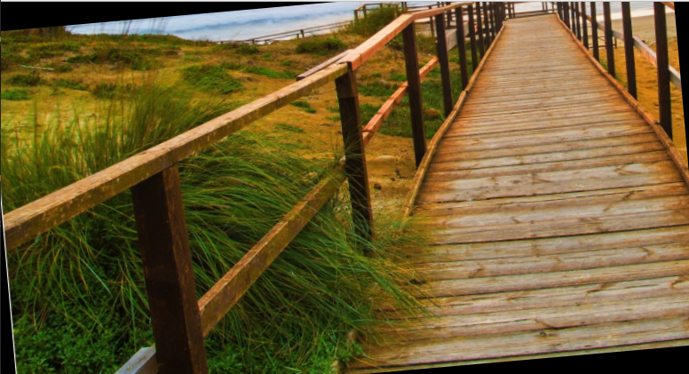


**颜色校正**

CLAHE

```c++
// 直方图均衡化
cv::Mat equalizeColorImage(const cv::Mat& src) {
    cv::Mat ycrcb;
    // 将图像从BGR转换到YCrCb色彩空间
    cv::cvtColor(src, ycrcb, cv::COLOR_BGR2YCrCb);

    // 分离通道
    std::vector<cv::Mat> channels;
    cv::split(ycrcb, channels);
    // 对亮度通道进行直方图均衡化
    cv::equalizeHist(channels[0], channels[0]);
    // 合并通道
    cv::merge(channels, ycrcb);

    cv::Mat dst;
    // 将图像从YCrCb转换回BGR
    cv::cvtColor(ycrcb, dst, cv::COLOR_YCrCb2BGR);
    return dst;
}
    //直方图均衡化
    cv::Mat dst = equalizeColorImage(src);
```

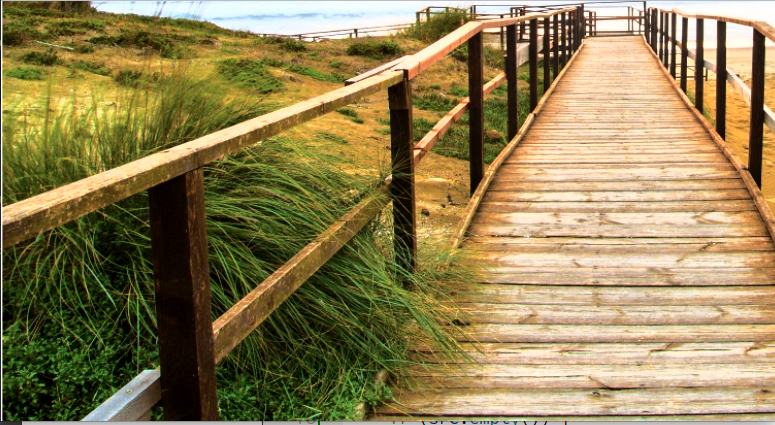


**边缘检测**

**Canny**：cv库自带

```c++
    cv::Mat edges;
    // Canny边缘检测
    cv::Canny(src, edges, 50, 150);  //阈值50~150
```

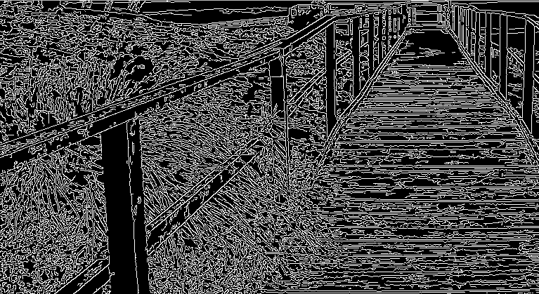

**形态学处理：**

膨胀和腐蚀：

```c++
// 形态学操作
cv::Mat morphologyEx(const cv::Mat& src, int operation, int kernelSize) {
    cv::Mat dst;
    // 获取结构元素
    cv::Mat element = cv::getStructuringElement(cv::MORPH_RECT, cv::Size(kernelSize, kernelSize));
    // 进行形态学操作
    cv::morphologyEx(src, dst, operation, element);
    return dst;
}

int main(int argc, char *argv[]) {
    QApplication app(argc, argv);

    // 读取图像，并以灰度模式加载
    cv::Mat src = cv::imread("/home/wang/Desktop/test1.jpg", cv::IMREAD_GRAYSCALE);
    if (src.empty()) {
        qDebug() << "Error: Image cannot be loaded!";
        return -1;
    }

    // 膨胀操作
    cv::Mat dilated = morphologyEx(src, cv::MORPH_DILATE, 5);
    // 腐蚀操作
    cv::Mat eroded = morphologyEx(src, cv::MORPH_ERODE, 5);
}
```

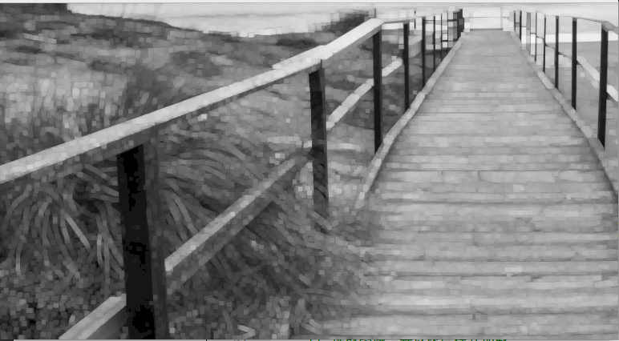


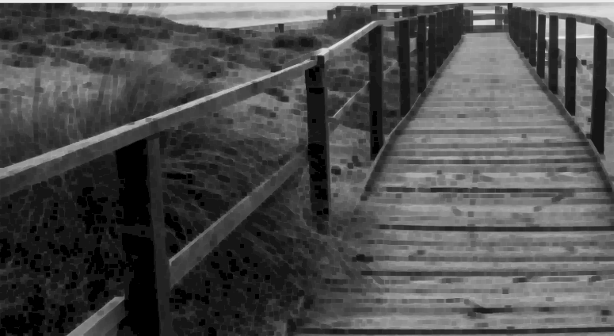


#### **图像配准**

**基于模板匹配方法**

**差分平法和**：

```c++
    cv::Mat img = cv::imread("/home/wang/Desktop/test1.jpg", cv::IMREAD_GRAYSCALE);
    cv::Mat templ = cv::imread("/home/wang/Desktop/test2.jpg", cv::IMREAD_GRAYSCALE);
    if (img.empty() || templ.empty()) {
        qDebug() << "Error: Image or template cannot be loaded!";
        return -1;
    }

    // 确保img2尺寸小于等于img1
    if (img2.cols > img1.cols || img2.rows > img1.rows) {
        cv::resize(img2, img2, cv::Size(img1.cols, img1.rows));
    }

    // 创建输出结果矩阵
    cv::Mat result;
    int result_cols = img1.cols - img2.cols + 1;
    int result_rows = img1.rows - img2.rows + 1;
    result.create(result_rows, result_cols, CV_32FC1);

    // 进行匹配
    cv::matchTemplate(img1, img2, result, cv::TM_SQDIFF);
    cv::normalize(result, result, 0, 1, cv::NORM_MINMAX, -1, cv::Mat());

    // 找到最小值位置
    double minVal, maxVal;
    cv::Point minLoc, maxLoc;
    cv::minMaxLoc(result, &minVal, &maxVal, &minLoc, &maxLoc);

    // 绘制匹配结果
    cv::rectangle(img1, minLoc, cv::Point(minLoc.x + img2.cols, minLoc.y + img2.rows), cv::Scalar::all(0), 2, 8, 0);
    cv::imshow("Matched Result", img1);
    cv::waitKey(0);

    return 0;
}
```

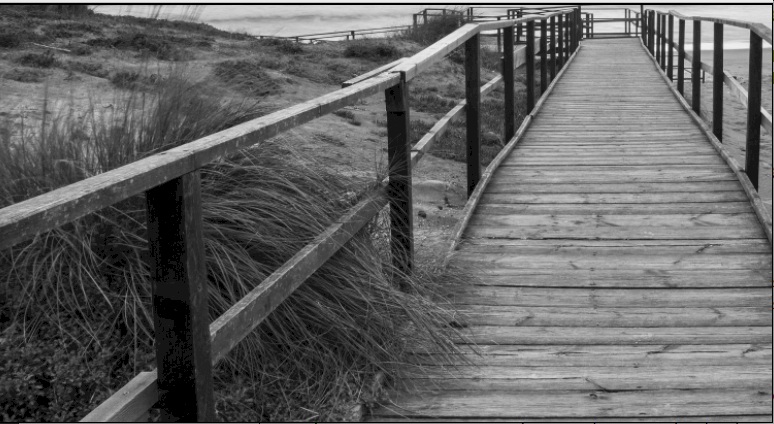

**基于边缘匹配方法**

**Canny+ORB+BFMacher**

```c++
#include <opencv2/opencv.hpp>

int main() {
    // 读取图像
    cv::Mat img1 = cv::imread("jm1.jpg", cv::IMREAD_GRAYSCALE);
    cv::Mat img2 = cv::imread("jm2.jpg", cv::IMREAD_GRAYSCALE);

    // 边缘检测
    cv::Mat edges1, edges2;
    cv::Canny(img1, edges1, 100, 200);
    cv::Canny(img2, edges2, 100, 200);

    // 特征检测和匹配
    std::vector<cv::KeyPoint> keypoints1, keypoints2;
    cv::Mat descriptors1, descriptors2;

    // 使用ORB检测边缘特征点
    cv::Ptr<cv::ORB> orb = cv::ORB::create();
    orb->detectAndCompute(edges1, cv::noArray(), keypoints1, descriptors1);
    orb->detectAndCompute(edges2, cv::noArray(), keypoints2, descriptors2);

    // 使用BFMatcher匹配特征点
    cv::BFMatcher matcher(cv::NORM_HAMMING);
    std::vector<cv::DMatch> matches;
    matcher.match(descriptors1, descriptors2, matches);

    // 绘制匹配结果
    cv::Mat img_matches;
    cv::drawMatches(img1, keypoints1, img2, keypoints2, matches, img_matches);
    cv::imshow("Matched Result", img_matches);
    cv::waitKey(0);

    return 0;
}

```

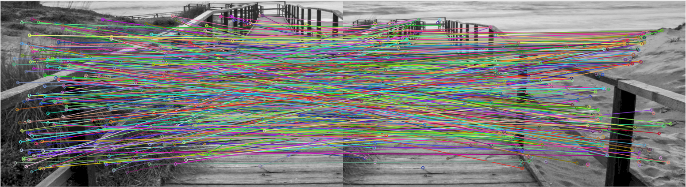


**基于特征匹配方法**

**ORB特征检测+BFMatcher进行特征匹配**：

```c++
int main(int argc, char *argv[]) {
    QApplication app(argc, argv);

    // 读取图像
    cv::Mat img1 = cv::imread("/home/wang/Desktop/test1.jpg");
    cv::Mat img2 = cv::imread("/home/wang/Desktop/test2.jpg");
    if (img1.empty() || img2.empty()) {
        qDebug() << "Error: Image cannot be loaded!";
        return -1;
    }

    // ORB特征检测
    cv::Ptr<cv::ORB> orb = cv::ORB::create();
    std::vector<cv::KeyPoint> keypoints1, keypoints2;
    cv::Mat descriptors1, descriptors2;
    orb->detectAndCompute(img1, cv::noArray(), keypoints1, descriptors1);
    orb->detectAndCompute(img2, cv::noArray(), keypoints2, descriptors2);

    // 暴力匹配
    cv::BFMatcher matcher(cv::NORM_HAMMING);
    std::vector<cv::DMatch> matches;
    matcher.match(descriptors1, descriptors2, matches);

    // 筛选匹配点
    double max_dist = 0; double min_dist = 100;
    for (int i = 0; i < descriptors1.rows; i++) {
        double dist = matches[i].distance;
        if (dist < min_dist) min_dist = dist;
        if (dist > max_dist) max_dist = dist;
    }
    std::vector<cv::DMatch> good_matches;
    for (int i = 0; i < descriptors1.rows; i++) {
        if (matches[i].distance <= std::max(2*min_dist, 30.0)) {
            good_matches.push_back(matches[i]);
        }
    }

    // 将两个图像水平拼接在一起
    cv::Mat img_matches;
    cv::hconcat(img1, img2, img_matches);

    // 在拼接后的图像中标记匹配的特征点
    for (size_t i = 0; i < good_matches.size(); i++) {
        cv::Point2f pt1 = keypoints1[good_matches[i].queryIdx].pt;
        cv::Point2f pt2 = keypoints2[good_matches[i].trainIdx].pt + cv::Point2f(img1.cols, 0);
        cv::line(img_matches, pt1, pt2, cv::Scalar(0, 255, 0), 2);
        cv::circle(img_matches, pt1, 5, cv::Scalar(0, 0, 255), -1);
        cv::circle(img_matches, pt2, 5, cv::Scalar(0, 0, 255), -1);
    }

    // 显示匹配结果
    QImage qimg = cvMatToQImage(img_matches);
    QLabel lbl;
    lbl.setPixmap(QPixmap::fromImage(qimg));
    lbl.show();

    return app.exec();
}
```


**SIFI检测+FLANN匹配**：

```c++
    cv::Mat img1 = cv::imread("/home/wang/Desktop/test1.jpg");
    cv::Mat img2 = cv::imread("/home/wang/Desktop/test2.jpg");

    // 创建SIFT对象并检测关键点
    cv::Ptr<cv::SIFT> sift = cv::SIFT::create();
    std::vector<cv::KeyPoint> kp1, kp2;
    cv::Mat desc1, desc2;
    sift->detectAndCompute(img1, cv::noArray(), kp1, desc1);
    sift->detectAndCompute(img2, cv::noArray(), kp2, desc2);

    // 使用FLANN匹配器进行特征匹配
    cv::FlannBasedMatcher matcher;
    std::vector<std::vector<cv::DMatch>> knn_matches;
    matcher.knnMatch(desc1, desc2, knn_matches, 2);

    // 筛选优质匹配点对
    std::vector<cv::DMatch> good_matches;
    for (size_t i = 0; i < knn_matches.size(); ++i) {
        if (knn_matches[i][0].distance < 0.65 * knn_matches[i][1].distance) {
            good_matches.push_back(knn_matches[i][0]);
        }
    }

    // 可视化匹配结果并保存
    cv::Mat img_matches;
    cv::drawMatches(img1, kp1, img2, kp2, good_matches, img_matches);
    // 使用 Qt 的界面来显示图像
    cv::namedWindow("Matches", cv::WINDOW_NORMAL); // 创建窗口
    cv::imshow("Matches", img_matches); // 显示图像
    cv::waitKey(0); // 等待用户按键
    return app.exec();
```

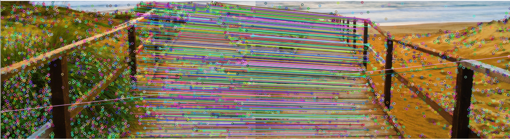


#### 图像融合

**1. SIFT特征匹配 + FLANN +RANSAC+直接拼接法**

**特征检测与匹配**：使用SIFT检测特征点在图像中检测尺度不变的关键点,，同时对每个关键点计算描述子，这些描述子是用于特征匹配的特征向量。

**配准**： 使用 FLANN（K-近邻匹配） 进行特征匹配，对每个描述子，在另一幅图像中找到两个最近邻的描述子。

**距离比率测试**: 。筛选优质匹配点对，如果最近邻的距离小于次近邻距离的 65%，则认为这是一个好的匹配点

**计算单应性矩阵**: 寻找图像之间的变换关系，使用 RANSAC 算法从匹配的点对中估计透视变换矩阵（单应性矩阵），以减少误匹配对结果的影响。

**透视变换**: 使用计算出的单应性矩阵将第二张图像变换到第一张图像的坐标系中。

**拼接图像**: 将变换后的第二张图像与第一张图像拼接在一起。

```c++
    cv::Mat img1 = cv::imread("/home/wang/Desktop/test1.jpg");
    cv::Mat img2 = cv::imread("/home/wang/Desktop/test2.jpg");

    // 创建SIFT对象并检测关键点
    cv::Ptr<cv::SIFT> sift = cv::SIFT::create();
    std::vector<cv::KeyPoint> kp1, kp2;
    cv::Mat desc1, desc2;
    sift->detectAndCompute(img1, cv::noArray(), kp1, desc1);
    sift->detectAndCompute(img2, cv::noArray(), kp2, desc2);

    // 使用FLANN匹配器进行特征匹配
    cv::FlannBasedMatcher matcher;
    std::vector<std::vector<cv::DMatch>> knn_matches;
    matcher.knnMatch(desc1, desc2, knn_matches, 2);

    // 筛选优质匹配点对
    std::vector<cv::DMatch> good_matches;
    for (size_t i = 0; i < knn_matches.size(); ++i) {
        if (knn_matches[i][0].distance < 0.65 * knn_matches[i][1].distance) {
            good_matches.push_back(knn_matches[i][0]);
        }
    }

    // 寻找图像之间的变换关系
        std::vector<cv::Point2f> points1, points2;
        for (size_t i = 0; i < good_matches.size(); i++) {
            points1.push_back(kp1[good_matches[i].queryIdx].pt);
            points2.push_back(kp2[good_matches[i].trainIdx].pt);
        }
        cv::Mat H = cv::findHomography(points2, points1, cv::RANSAC);

        // 计算图像2到图像1的透视变换
        cv::Mat result;
        cv::warpPerspective(img2, result, H, cv::Size(img1.cols + img2.cols, img1.rows));

        // 将img1拷贝到result的左半部分
        cv::Mat half(result, cv::Rect(0, 0, img1.cols, img1.rows));
        img1.copyTo(half);

        //显示拼接结果
        QImage qimg = cvMatToQImage(result);
        QLabel lbl;
        lbl.setPixmap(QPixmap::fromImage(qimg));
        lbl.show();

        return app.exec();
}
```

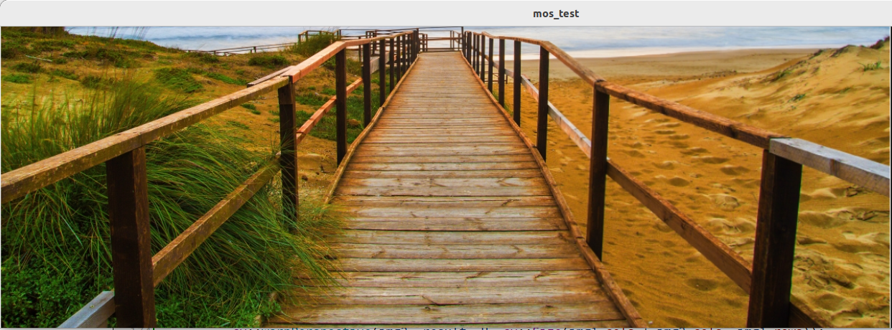


**2.  基于能量谱的最佳拼接线搜索**

**具体算法**

1. **边缘检测和特征匹配**：使用Canny边缘检测提取边缘，然后用ORB检测边缘上的特征点，并使用FLANN进行特征点匹配。
2. **图像配准**：使用RANSAC方法估计图像之间的单应矩阵（变换模型）。
3. **最佳拼接线搜索**：计算能量图，通过动态规划寻找最小能量路径，确定最佳拼接线。
4. **图像融合**：根据最佳拼接线进行图像融合。

```c++
// 检测Canny边缘并进行特征检测和匹配
void detectAndMatchFeatures(const cv::Mat& img1, const cv::Mat& img2,
                            std::vector<cv::KeyPoint>& kp1, std::vector<cv::KeyPoint>& kp2,
                            cv::Mat& descriptors1, cv::Mat& descriptors2,
                            std::vector<cv::DMatch>& good_matches) {
    // Canny边缘检测
    cv::Mat edges1, edges2;
    cv::Canny(img1, edges1, 100, 200);
    cv::Canny(img2, edges2, 100, 200);

    // 使用ORB检测边缘特征点
    cv::Ptr<cv::ORB> orb = cv::ORB::create();
    orb->detectAndCompute(edges1, cv::noArray(), kp1, descriptors1);
    orb->detectAndCompute(edges2, cv::noArray(), kp2, descriptors2);

    // 使用FLANN匹配特征点
    cv::FlannBasedMatcher matcher(new cv::flann::LshIndexParams(12, 20, 2));
    std::vector<std::vector<cv::DMatch>> knn_matches;
    matcher.knnMatch(descriptors1, descriptors2, knn_matches, 2);

    // 筛选优质匹配点对
    for (size_t i = 0; i < knn_matches.size(); ++i) {
        if (knn_matches[i][0].distance < 0.75 * knn_matches[i][1].distance) {
            good_matches.push_back(knn_matches[i][0]);
        }
    }
}

// 计算能量图
cv::Mat computeEnergyMap(const cv::Mat& img) {
    cv::Mat gray, gradientX, gradientY, absGradientX, absGradientY, energy;
    cv::cvtColor(img, gray, cv::COLOR_BGR2GRAY);
    cv::Sobel(gray, gradientX, CV_16S, 1, 0);
    cv::Sobel(gray, gradientY, CV_16S, 0, 1);
    cv::convertScaleAbs(gradientX, absGradientX);
    cv::convertScaleAbs(gradientY, absGradientY);
    cv::addWeighted(absGradientX, 0.5, absGradientY, 0.5, 0, energy);
    return energy;
}

// 寻找最佳拼接线
cv::Mat findSeam(const cv::Mat& img1, const cv::Mat& img2, const cv::Mat& H) {
    cv::Mat result;
    cv::warpPerspective(img2, result, H, cv::Size(img1.cols + img2.cols, img1.rows));
    cv::Mat half(result, cv::Rect(0, 0, img1.cols, img1.rows));
    img1.copyTo(half);

    // 计算能量图
    cv::Mat energy = computeEnergyMap(result);

    // 寻找最小能量路径（动态规划）
    cv::Mat seam(result.size(), CV_8U, cv::Scalar(255));
    for (int i = 1; i < energy.rows; ++i) {
        for (int j = 1; j < energy.cols - 1; ++j) {
            int min_val = std::min(energy.at<uchar>(i-1, j-1),
                                   std::min(energy.at<uchar>(i-1, j),
                                            energy.at<uchar>(i-1, j+1)));
            energy.at<uchar>(i, j) += min_val;
        }
    }

    // 回溯找到最小能量路径
    int min_idx = 0;
    for (int j = 1; j < energy.cols - 1; ++j) {
        if (energy.at<uchar>(energy.rows - 1, j) < energy.at<uchar>(energy.rows - 1, min_idx)) {
            min_idx = j;
        }
    }
    seam.at<uchar>(energy.rows - 1, min_idx) = 0;
    for (int i = energy.rows - 2; i >= 0; --i) {
        int offset = 0;
        if (min_idx > 0 && energy.at<uchar>(i, min_idx - 1) < energy.at<uchar>(i, min_idx)) {
            offset = -1;
        }
        if (min_idx < energy.cols - 1 && energy.at<uchar>(i, min_idx + 1) < energy.at<uchar>(i, min_idx + offset)) {
            offset = 1;
        }
        min_idx += offset;
        seam.at<uchar>(i, min_idx) = 0;
    }

    return seam;
}

int main() {
    // 读取图像
    cv::Mat img1 = cv::imread("/home/wang/Desktop/test1.jpg");
    cv::Mat img2 = cv::imread("/home/wang/Desktop/test2.jpg");

    // 确保图像读取成功
    if (img1.empty() || img2.empty()) {
        std::cerr << "图像读取失败！" << std::endl;
        return -1;
    }

    // 检测和匹配特征
    std::vector<cv::KeyPoint> kp1, kp2;
    cv::Mat descriptors1, descriptors2;
    std::vector<cv::DMatch> good_matches;
    detectAndMatchFeatures(img1, img2, kp1, kp2, descriptors1, descriptors2, good_matches);

    // 计算单应矩阵
    std::vector<cv::Point2f> points1, points2;
    for (size_t i = 0; i < good_matches.size(); ++i) {
        points1.push_back(kp1[good_matches[i].queryIdx].pt);
        points2.push_back(kp2[good_matches[i].trainIdx].pt);
    }
    cv::Mat H = cv::findHomography(points2, points1, cv::RANSAC);

    // 寻找最佳拼接线
    cv::Mat seam = findSeam(img1, img2, H);

    // 融合图像
    cv::Mat result;
    cv::warpPerspective(img2, result, H, cv::Size(img1.cols + img2.cols, img1.rows));
    cv::Mat half(result, cv::Rect(0, 0, img1.cols, img1.rows));
    img1.copyTo(half);

    // 应用拼接线融合
    for (int i = 0; i < seam.rows; ++i) {
        for (int j = 0; j < seam.cols; ++j) {
            if (seam.at<uchar>(i, j) == 0) {
                result.at<cv::Vec3b>(i, j) = img1.at<cv::Vec3b>(i, j);
            }
        }
    }

    // 显示结果
    cv::imshow("moc_test", result);
    cv::waitKey(0);

    return 0;
}
```

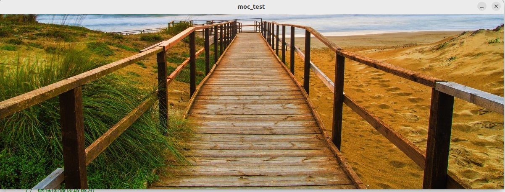


