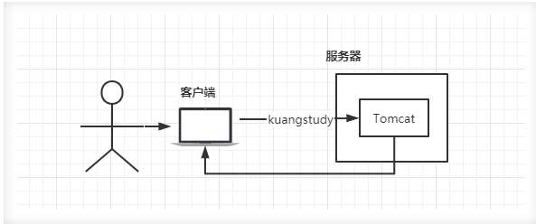
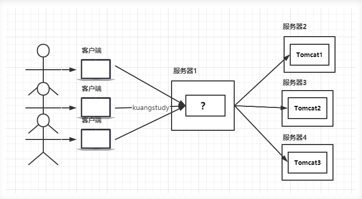
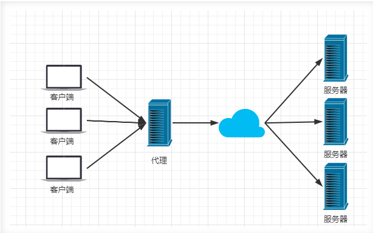
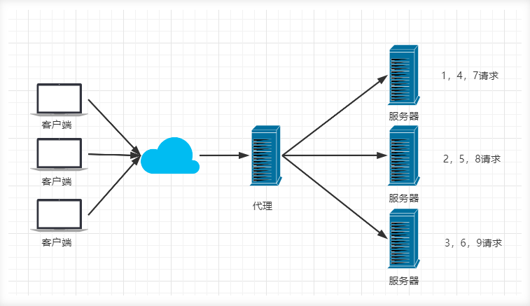
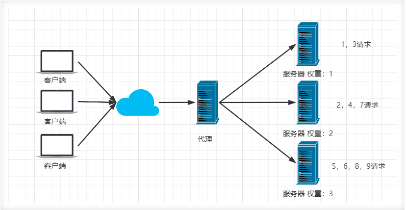
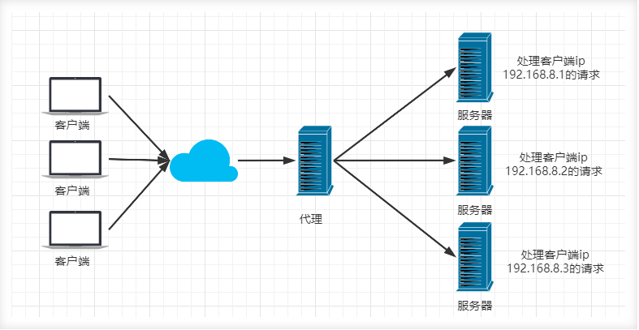
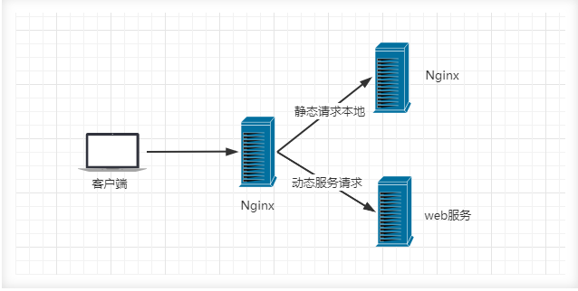

# 一、Nginx目的

项目刚刚上线的时候，并发量小，用户使用的少，所以在低并发的情况下，一个jar包启动应用就够了，然后内部tomcat返回内容给用户。

但是慢慢的，使用我们平台的用户越来越多了，并发量慢慢增大了，这时候一台服务器满足不了我们的需求了，于是我们**横向扩展**，又增加了服务器。这个时候几个项目启动在不同的服务器上，用户要访问，就需要增加一个代理服务器了，通过代理服务器来帮我们转发和处理请求。（因为**session是不共享的**，你在这台服务器有你的登录信心，另一台就没有了，所以不能一台一台访问）

我们希望这个代理服务器可以帮助我们接收用户的请求，然后将用户的请求按照规则帮我们转发到不同的服务器节点之上。这个过程用户是无感知的，用户并不知道是哪个服务器返回的结果，我们还希望他可以按照服务器的性能提供不同的权重选择。保证最佳体验！所以我们使用了Nginx。

**反向代理**：通过nginx代理服务器，将用户请求代理到其他后台服务器上。

**负载均衡：**后台服务器可能存储大小不同，因此需要nginx结合权重尽可能更好的分配请求，大存储服务器分配多的请求，小存储服务器分配少的请求。

# 二、什么是nginx

- Nginx (engine x) 是一个**高性能的HTTP和反向代理web服务器**，同时也提供了（邮件）IMAP/POP3/SMTP服务。

- 其特点是**占有内存少，并发能力强，**事实上nginx的并发能力在同类型的网页服务器中表现较好，中国大陆使用nginx网站用户有：百度、京东、新浪、网易、腾讯、淘宝等。在全球活跃的网站中有12.18%的使用比率，大约为2220万个网站

- Nginx 是一个安装非常的简单、配置文件非常简洁（还能够支持perl语法）、Bug非常少的服务。Nginx 启动特别容易，并且几乎可以做到7*24不间断运行，即使运行数个月也不需要重新启动。你还能够不间断服务的情况下进行软件版本的升级。
- Nginx代码完全用C语言从头写成。官方数据测试表明能够支持高达 50,000 个并发连接数的响应。

# 三、Nginx作用

- **Http代理、反向代理**：作为web服务器最常用的功能之一，尤其是反向代理。

- 负载均衡
- 动静分离

## 3.1 正向代理与反向代理

### 3.1.1 正向代理

**代理客户端的就是正向代理**，常用的操作就是VPN，电脑上开启VPN就相当与在电脑上做了一个代理，代理服务器会帮你请求外部资源，

- 案例：比如你连接新加坡节点访问GPT，那么就是你的电脑先请求新加坡服务器，香港服务器在请求美国服务器。

### 3.1.2 反向代理

**代理服务器的就是反向代理**，**用户是无法感知**具体访问的是哪台服务器的。

- 案例：比如我们访问百度官网只需要访问域名：http/baidu.com，度服务器可能上海有，北京有，西安有等等，但是我们并看不到背后是哪台服务器为我们服务

## 3.2 负载均衡

Nginx提供的负载均衡策略有2种：内置策略和扩展策略。内置策略为**轮询，加权轮询，Ip hash**。扩展策略，就天马行空，只有你想不到的没有他做不到的。

### 3.2.1 轮询

将请求依次循环分配给服务器。

### 3.2.2 加权轮询

### 3.2.3 IPhash

对客户端请求的ip进行hash操作，然后根据hash结果将同一个客户端ip的请求分发给同一台服务器进行处理，可以解决session不共享的问题。

### 3.3 动静分离

动静分离，在我们的软件开发中，有些请求是需要后台处理的，有些请求是不需要经过后台处理的（如：css、html、jpg、js等等文件），这些不需要经过后台处理的文件称为静态文件。让动态网站里的动态网页根据一定规则把不变的资源和经常变的资源区分开来，动静资源做好了拆分以后，我们就可以根据静态资源的特点将其做缓存操作。提高资源响应的速度。

