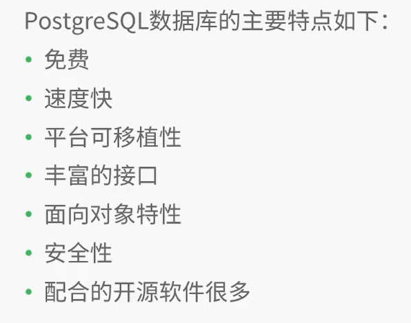


# 1 安装

## ubuntu

**安装：**

* 首先更新源：

```shell
sudo apt-get update
```

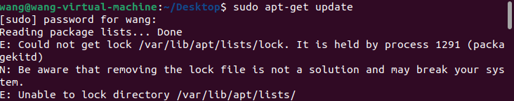

遇到这个问题,即apt端口被占用了：

```shell
ps afx | grep apt
sudo kill -9 进程号
```

* 下载postgresql

```shell
sudo apt-get install postgresql
```

* 下载成功后，查看下载版本

```shell
psql --version
```

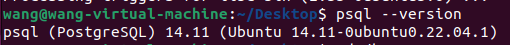

安装成功后，postgresql会自动创建：一个数据库用户`postgres`（默认无密码）、一个数据>库`postgres`、一个Linux用户`postgres`

* 修改一下Linux用户`postgres`的密码

```shell
sudo passwd postgres
```

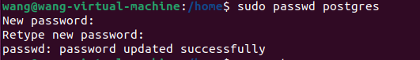


**进入数据库：**

postgres用户--->psql--->命令行

* 首先切换到Linux用户`postgres`

```shell
su postgres
```

* 进入数据库命令行

```shell
psql
```

输出：

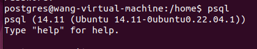

* Postgresql的服务默认是开启的，如果没有，可以使用以下命令：


```shell
sudo /etc/init.d/postgresql start   # 开启服务
sudo service postgresql start
sudo /etc/init.d/postgresql stop    # 关闭服务
sudo service postgresql stop
sudo /etc/init.d/postgresql restart # 重启服务
sudo service postgresql restart
```

* 查看`Postgresql`的数据库目录（数据存储在哪）

```shell
postgres=# SHOW data_directory;
```

输出：`/var/lib/postgresql/14/main`就是数据库目录

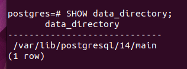


**修改数据库目录：**

* 创建一个数据库目录（你需要的位置）

```shell
mkdir 目录
```

例如我创建的是:

```shell
mkdir /home/user_wang/pg_db
```

* 关闭Postgresql服务

```shell
sudo service postgresql stop
```

* 复制数据（从**默认数据库目录**复制到**你指定的数据库目录**）

```shell
sudo cp -rf  postgresql的默认数据库目录 你指定的数据库目录
```

我执行的是:

```shell
sudo cp -rf /var/lib/postgresql/14/main /home/user_wang/pg_db
```

* 权限设置

	```
	sudo chown -R postgres:postgres 你指定的数据库目录
	sudo chmod 700 你指定的数据库目录
	```

	我执行的是

	```shell
	sudo chown -R postgres:postgres /home/user_wang/pg_db
	sudo chmod 700 /home/user_wang/pg_db
	```

* 修改postgresql的`data_directory `（配置文件中指定的数据库目录）

```shell
sudo vi /etc/postgresql/14/main/postgresql.conf
```

将**data_directory = '/var/lib/postgresql/9.5/main' # use data in another directory**修改为：

```shell
data_directory = '你指定的数据库目录'
```

我执行的是

```shell
data_directory = '/home/user_wang/pg_db'
```

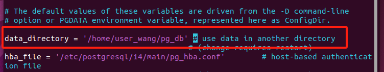

* 启动Postgresql服务

```shell
sudo service postgresql start
```


## 麒麟桌面操作系统

**1、首先下载源码postgres**

这里可以选择自己合适的目录

```bash
wget http://ftp.postgresql.org/pub/source/v13.1/postgresql-13.1.tar.bz2
```


**2、解压**

```cpp
tar xjvf  postgresql-13.1.tar.bz2
```


**3、进入文件夹**

解压会解压到当前目录下

```bash
cd postgresql-13.1/
```


**4、 创建安装路径**，一般我们都是安装在/opt/文件夹下面
这里一定要用root用户去创建

```bash
sudo su
mkdir -p /opt/pgsql-13.1
```

* 创建好后一定是root:root 用户：用户组


**5、配置**

这里还是在安装好后刚才的目录下

```bash
./configure --prefix=/opt/pgsql-13.1 --without-readline
```

**注意**：

* 配置没有报错才算成功，如果有报错下载对应库重新配置（zlib等）
* ./configure也在解压后的文件中，请不要更换目录


**6、编译**

**编译和安装一定要在root下**

```bash
sudo -s 
make -j8
```


**7、安装**

```bash
make install
```

安装完成后，检查/opt/pgsql-13.1下面一定要有bin、lib文件夹，这会和后面的环境配置相对应。

注：没有的话切换root用户，然后在你刚才的解压目录下重新编译

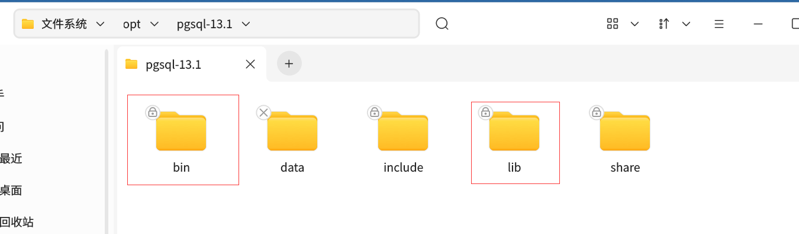


**接下来是重点：**
我们要创建一个linux用户postgres，用来启动postgres服务，具体如下：
**1、创建postgres用户**

```bash
#登录root用户
sudo su
#添加用户
useradd postgres
#添加密码
passwd postgres
```


**2、**用户创建好以后就可以**设置**刚才/opt/pgsql-13.1的**用户属性**了

```bash
#首先创建一个文件夹，作为数据库的数据存储点
sudo su
mkdir /opt/pgsql-13.1/data
chown -R postgres /opt/pgsql-13.1
```


**3、设置环境变量**

```bash
sudo su
vim /etc/profile
```

在末尾打开后增加

```c
PATH=$PATH:/opt/pgsql-13.1/bin
export PATH
LD_LIBRARY_PATH=/opt/pgsql-13.1/lib
export LD_LIBRARY_PATH
export PGDATA=/opt/pgsql-13.1/data
```


**4、添加后source一下**

```bash
source /etc/profile
```


**5、进入postgres**

```bash
su - postgres
```

注意，这时候命令行只有一个$符号，我们只需要输入bash后就可以了

```bash
bash
ls -l
postgres --version
initdb
pg_ctl start
psql -h 127.0.0.1
```

如下登录进来了

```c
postgres@kylin-D2000:/opt/pgsql-13.1$ psql -h 127.0.0.1 
psql (12.9 (Ubuntu 12.9-0kylin0.20.04.1k1), 服务器 13.1)
警告：psql 主版本12,服务器主版本为13.
     一些psql功能可能无法正常使用.
输入 "help" 来获取帮助信息.

postgres=#
```


# 2 远程连接

**1.查找配置文件位置**

```shell
sudo find /  -name postgresql.conf
```

/opt/pgsql-13.1/data/postgresql.conf


**2.修改配置文件 postgresql.conf 及 pg_hba.conf**

```
sudo vim /opt/pgsql-13.1/data/postgresql.conf
```

* 找到 `#listen_addresses = ‘localhost’ `取消注释改为` listen_addresses = ‘*’ `监听整个网络

* 找到` #password_encryption = md5 `取消注释 `password_encryption = md5`

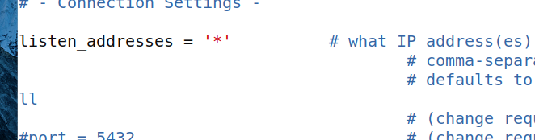


```shell
sudo vim /opt/pgsql-13.1/data/pg_hba.conf
```

* 在文件末尾加入`host all all 0.0.0.0/0 md5` 整个网络可以访问

* 或 `host all all 192.168.0.0/24 md5 `只有192.168.0.X网段可以访问

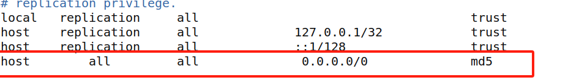

**3.重启Postgresql服务**

```shell
service postgresql restart
```


# 3 指令

**常用命令：**

```sql
\? 所有命令帮助
\l 列出所有数据库
\d 列出数据库中所有表
\dt 列出数据库中所有表
\d [table_name] 显示指定表的结构
\di 列出数据库中所有 index 索引
\dv 列出数据库中所有 view 视图
\h sql命令帮助
\q 退出连接
\c [database_name] 切换到指定的数据库
\c 显示当前数据库名称和用户
\conninfo 显示客户端的连接信息
\du 显示所有用户
\dn 显示数据库中的schema
\encoding 显示字符集
select version(); 显示版本信息
\i testdb.sql 执行sql文件
\x 扩展展示结果信息，相当于MySQL的\G
\o /tmp/test.txt 将下一条sql执行结果导入文件中
```


## 3.1 数据库操作

**连接数据库：**

```sql
psql -U postgres -d db_test
```

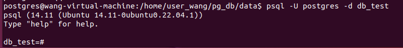


**退出 PostgreSQL Shell**：

```sql
\q
exit
```


**创建数据库：**

```sql
create database db_test with owner = postgres encoding = 'utf=8';
create database db_student;
```

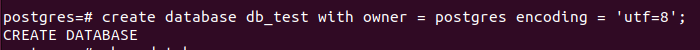


**查询数据库：**

```sql
select datname from pg_database;
```

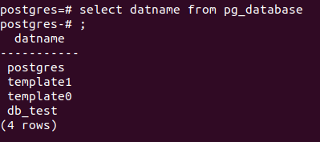

```sql
\l
```

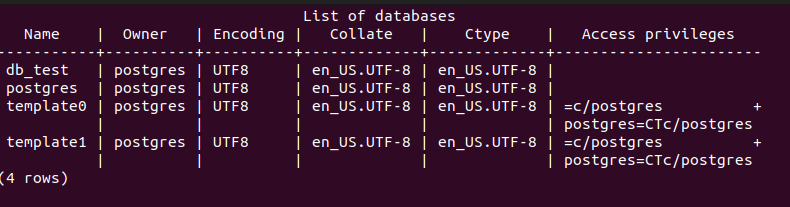


**切换/使用数据库：**

```sql
\c db_student
```

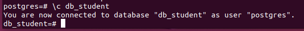


**修改数据库：**

```sql
alter database db_student rename to db_rename;  //修改数据库名称
```

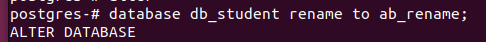


```sql
alter database db_rename connection limit 20; //修改最大连接数为20
```

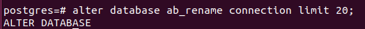


**删除数据库：**

```sql
drop database db_rename;
```

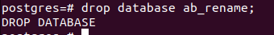


## 3.2 表操作

**创建表：**

```sql
create table student (  //后续所有student均为表名
  id int primary key,
  name varchar(50),
  age int,
  sex char(5));
create table student_room(
	r_id bigint primary key,
    r_name varchar(20) unique,
    r_num int not null);
```

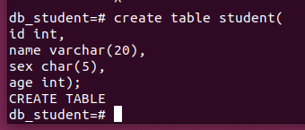


**查询数据库中的表:**

```sql
\dt
```

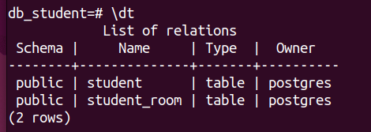

**查询表结构：**

```
\d 表名称
```

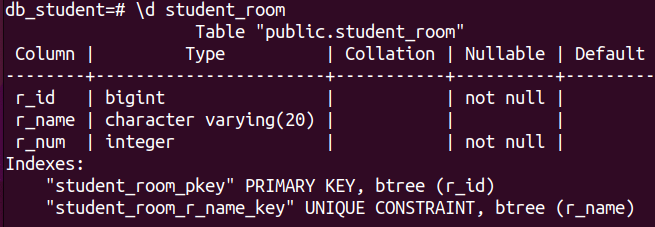

**查询表中数据：**

```sql
select * from student;  #查询全表
select 字段名1,字段名2  from 表名;  #查询多个字段
select 字段名 as 别名 from 表名;  #起别名
select 字段名*12 from 表名; #某一字段的运算
```

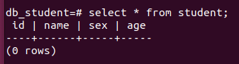


**插入数据：**

```sql
insert into student (id,name,sex,age) values(001,'章建雄','男',18);
insert into student (id,name,sex,age) values(001,'章建雄','男',18),
											(002,'张飞','男',18);
```

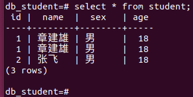


**更新数据：**

```sql
update student set name = '张不飞' where id = 2;
```

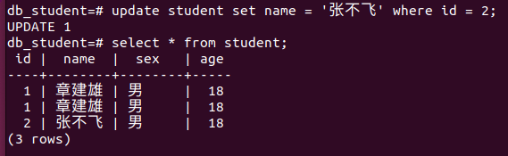


**删除数据：**

```sql
delete from student where id = 1;
```

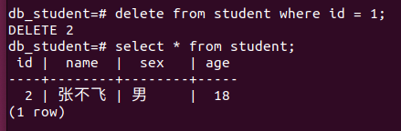


**创建索引：**

```sql
create index 索引名称 on 表名(字段名);
create index student_index on student(id);
```

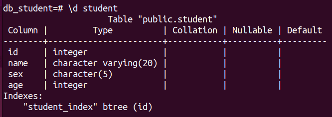

**查看索引：**

```sql
select * from pg_indexes where tablename = 'student';
```

* **pg_indexes**是一个视图，可以通过它获取某个表的索引信息

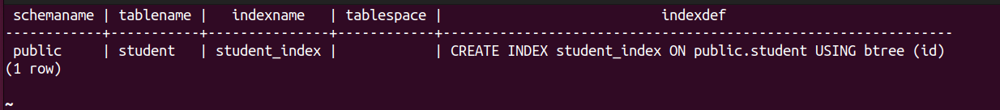


**删除索引：**

```sql
drop index 索引名称;
drop index student_index;
```

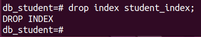


## 3.3 基本数值类型

### **数值类型：**

```sql
create table temp(
	x samllint,
	y int,
	z real,
	n numeric(5,2));
```

|   符号类型   |                | 精度范围                            |
| :----------: | :------------- | :---------------------------------- |
|   整数类型   | smallint       | 小范围整数：-32768~32767            |
|              | int（integer） | 普通大小整数：-214783648~2147483647 |
| 任意精度类型 | real           | 6位十进制数字精度（0.000001）       |
|              | numeric(m,n)   | 任意精度类型（精度为m,范围为n）     |

表结构：

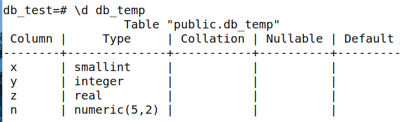

```sql
insert into db_temp values(1,2,36.55,364.665);
select * from db_temp;
insert into db_temp values(1,2,36.55,8654.5555);
```

表内容：

* 当设置numeric(5,2)，精度为5，范围为2,**最大存储长度为5位**，**小数点不算一位**。
	* 当小数点后的数值位数超过5时，便会四舍五入。
	* 当小数点前的数值位数超过5时，便会报错。

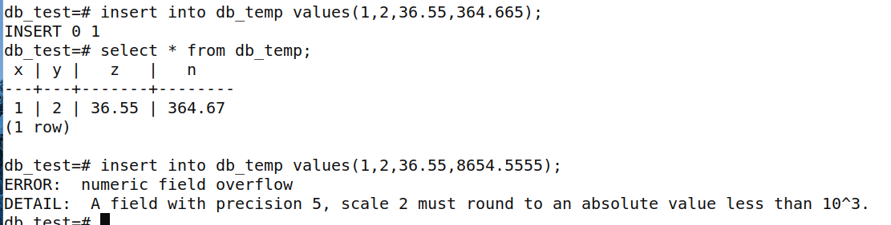


### **时间类型：**


```sql
create table date_temp(
t time,
d date,
td timestamp);
insert into date_temp values('15:33:00','2024-05-23','2024-05-23 15:33:05');
```

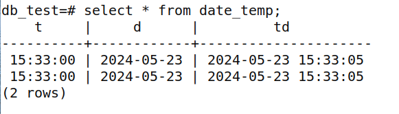


### 字符串类型


```sql
create table string_temp(
    n char(10),
    ch varchar(20),
    str text);
insert into string_temp values('章建雄','大傻逼','10000000001');
```

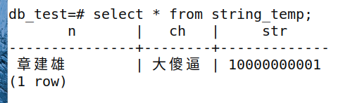

* varchar的长度可变，而char的长度不可变，对于postgresql数据库来说varchar和char的区别仅仅在于前者是变长，而后者是定长，最大长度都是10485760（1GB）

* varchar不指定长度，可以存储最大长度（1GB）的字符串，而char不指定长度，默认则为1，这点需要注意。

* text类型：在postgresql数据库里边，text和varchar几乎无性能差别，区别仅在于存储结构的不同

* 对于char的使用，应该在确定字符串长度的情况下使用，否则应该选择varchar或者text


## 3.4 运算符&条件查询

### **算术运算符**

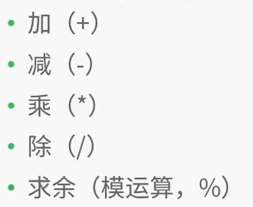

```sql
select 3+2,3-2,3*2,3/2,3%2;
```

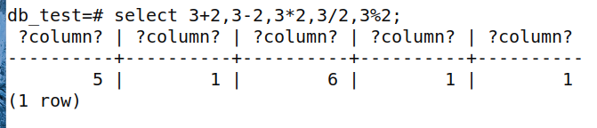


### 比较运算符

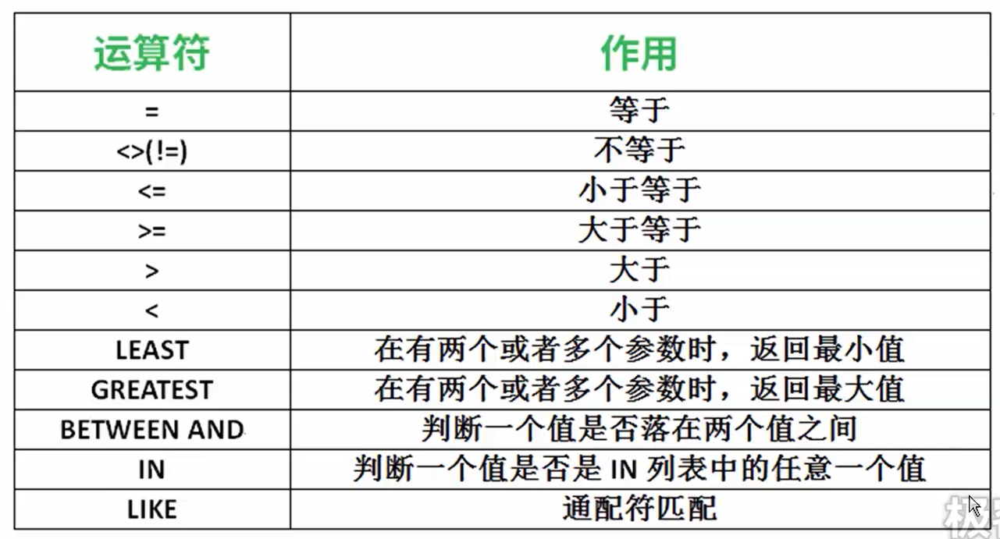

```sql
select 1=0,'2'=2,'b'='b',null=null,null=1;
```

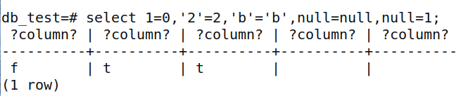

```sql
select 'good'<>'god',1<>2,2>1,4!=4,2>=1,1>=1;
```

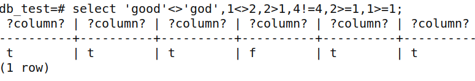

```sql
select 2 between 1 and 3,2 between 3 and 5,5 between 5 and 6;  //between and 是闭区间
```

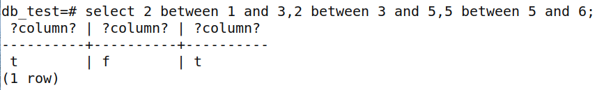

```sql
select 2 in (2,3,4), 2 in (3,4,5);
```

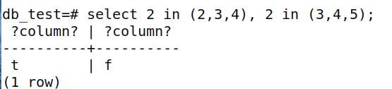

```sql
select 'abc' like 'a%','abc' like '_b_','abc' not like '%d';
```

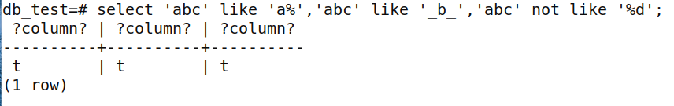


### 逻辑运算符


```sql
select not '1',not 'y',not '0',not 'n';  //sql中，1和y都当true处理，0和n都当false处理
```

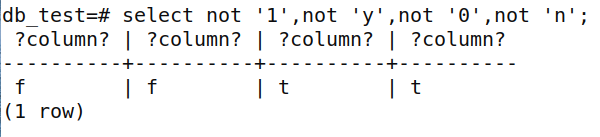

```sql
select '1' and 'y','1' and '0','0' and 'n';  //同真为真，不同为假，全假为假
```

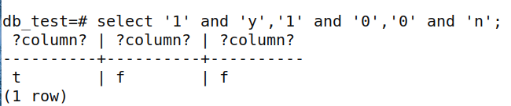

```sql
select '1' or 'y','1' or '0','0' or 'n';  //有真为真，全假为假
```

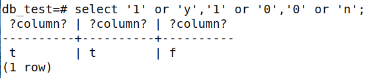

总结：


### **运算符优先级：**

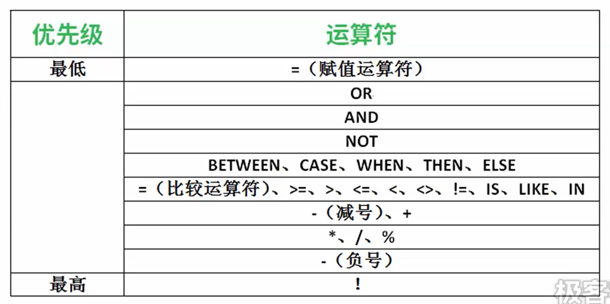


### 条件查询

```sql
select
	字段名
from
	表名
where
	条件;
	
select title,id from citymessage where num>10000;

select * from citymessage where num between 8000 and 20000;  #8000到20000之间的数据
select * from citymessage where num>=8000 and num <= 20000;

select 字段名 from 表名 where is null;

select * from citymessage where num>2000 and (id=47 or id=48); #查询id为47,48然后人数大于2000的数据

select * from citymessage where id = 44 or id = 45 or id = 46; #查询id为44,45,46的数据
select * from citymessage where id in (44,45,46);  #查询id为44,45,46的数据

select * from citymessage where id not in (44,45,46); # not in 便表示不在in的几个数据的其他数据

select * from citymessage where title like '%甘肃%'; #查询title里有甘肃两个字的数据
select * from citymessage where title like '_肃%'; #找到第二个字是肃的数据
select * from 表名 where 字段名 like '%\_%'; #找到字符里面有下划线(_)的，一定要先转义再查询

select * from 表名 order by 字段名; #升序查询
select * from 表名 order by 字段名 desc;  #降序查询

select * from citymessage order by id asc,num asc; #多段排序，先把id按照升序进行排列，当id一样的情况下，在对num进行升序排列

#表citymessage中找出num在2000和8000之间，且id按照降序排列的数据，指令顺序不能乱，排序总在最后执行
select 
	* 
from 
	citymessage
where 
	num between 2000 and 8000 
order by 
	id desc;
```

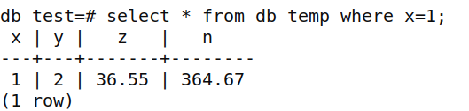

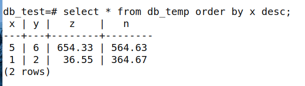


## 3.5 函数

### 数值函数:

多行函数在使用时：
①必须先进行分组在进行计算。没有分组则计算整张表。
②分组函数自动处理null，不需提前对null进行处理。
③count(字段名)统计的是改字段下所有不为null的字符串个数，count(*)统计该表总行数。

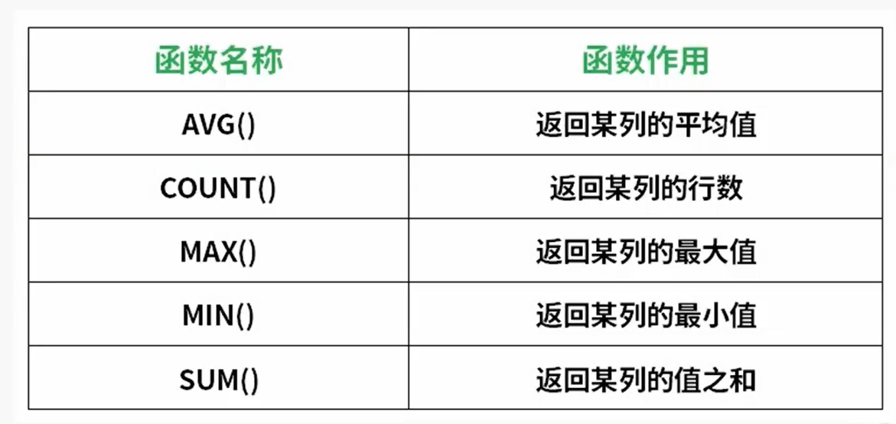

```sql
select count(x) from db_temp;
select max(id) from citymessage;
select min(id) from citymessage;
select avg(id) from citymessage;
select sum(id) from citymessage;
```

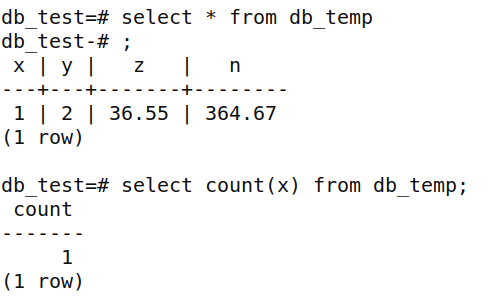


### 字符串函数


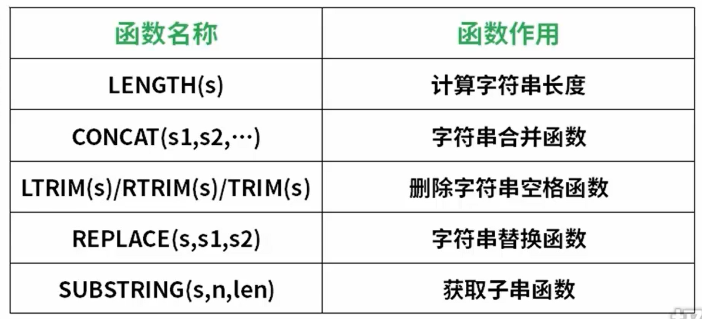


