## 分布式文件系统

### 1 FastDFS基本概念

fastDFS是利于C语言实现的一个**分布式文件系统**，它对文件进行管理，功能包括：文件存储、文件同步、文件访问（文件上传、文件下载）等，解决了大容量存储和负载均衡的问题。

#### 1.1.服务器：

​		硬件：一台配置高的计算器

​		软件：电脑必须有一个能解析http协议的软件

#### 1.2.常见的服务器：

1. tomcat服务器	

2. weblogic

3. IIS

4. nginx:

   小巧且高效的HTTP服务器(解析HTTP协议)

   可以做一个高效的负载均衡反向代理

   邮件服务器

​       nginx处理并发可以到w的级别，如果不够用，那可以利用集群。

#### 1.3.客户端

 1. ##### 网络架构

	​	b/s：必须使用http协议

	​	c/s：协议可以随意选择

	​    本项目:Qt+http+nginx+c/s

 2. ##### 服务器

​		Nignx：

​				能处理静态请求-->HTML、jpg能准备好的文件。

​				动态请求无法处理。

​				服务器集群之后，每台服务器上的东西肯定相同。

​		fastCGI：

​				帮助服务器处理动态请求。

4. ##### 反向代理服务器

​		客户端并不能直接访问web服务器，直接访问到的是反向代理服务器。

​		客户端静态请求发送给反向代理服务器，反向代理将客户请求转发给web服务器。

​		原因：当很多用户直接访问web服务器，每一个服务器的ip地址不同，虽然后台做了集群，但**用户的分配是不均匀的**，当一台服务器同时受到很多用户直接访问，其他服务器闲置，那么无法控制客户的请求路径，便在web服务器前面加一个反向代理服务器，通过反向代理服务器来均分用户的请求，来让每台服务器的负载均衡，保证资源平均分配。

5. ##### 关系型数据库

  存储文件属性信息

  用户的属性信息

6. ##### redis-非关系型数据库（内存数据库）

  作用提高程序效率，直接操作内存比操作数据库效率高

  存储的是服务器经常要从关系型数据库中读取的数据

7. ##### FastDFS-分布式文件系统

  存储文件内容

  供用户上传下载

  提供了扩容和备份功能

  提供了文件的上传和下载服务器

8. ##### FastDFS 与 HDFS比较

  说到分布式文件存储，肯定会有人想到HDFS，他们两者主要定位和应用场景是不一样的。

  Hadoop中的文件系统HDFS主要解决**并行计算中分布式存储数据的问题**。其单个数据文件通常很大，采用了分块（切分）存储的方式，所以是大数据大文件存储来使用的场景。
  FastDFS主要用于互联网网站，为文件上传和下载提供在线服务。所以在负载均衡、动态扩容等方面都支持得比较好，FastDFS不会对文件进行分块存储。FastDFS用于存储中小文件都是不错的，比如用户头像啊，一些较小的音视频文件啊等等都行。

#### 1.4.分布式文件系统

​	分布式文件系统将文件存储在不同的主机上，即通过搭建一个网络，将各个主机部署在同一网络中，并设立一个管理者。各主机之间通过IP+PORT进行访问。


> 分布式文件系统：
>
> 1.需要有一个网络
>
> 2.多台主机：不需要再同一个地点
>
> 3.需要管理者
>
> 4.编写应用层的管理程序

#### 1.5.fastDFS

##### 1.5.1.fastDFS特性：

> 冗余备份：纵向扩容->数据备份
>
> 线性扩容：横向扩容->容量扩充
>
> 搭建文件服务器集群，提供文件**上传**和**下载**功能

##### 1.5.2.fastDFS框架中的三个角色：

​	1.追踪器(Tracker)-管理者-守护进程

​			管理存储节点

​			用户不需要和管理者进行交互

​	2.存储节点-storage -守护进程

​			存储节点线性扩展

​			存储文件，并在用户请求时传递文件

​	3.客户端-不是守护进程

​			文件上传和文件下载，用户通过客户端进行操作

##### 1.5.3.三角色之间的关系

上传信息：


下载信息：

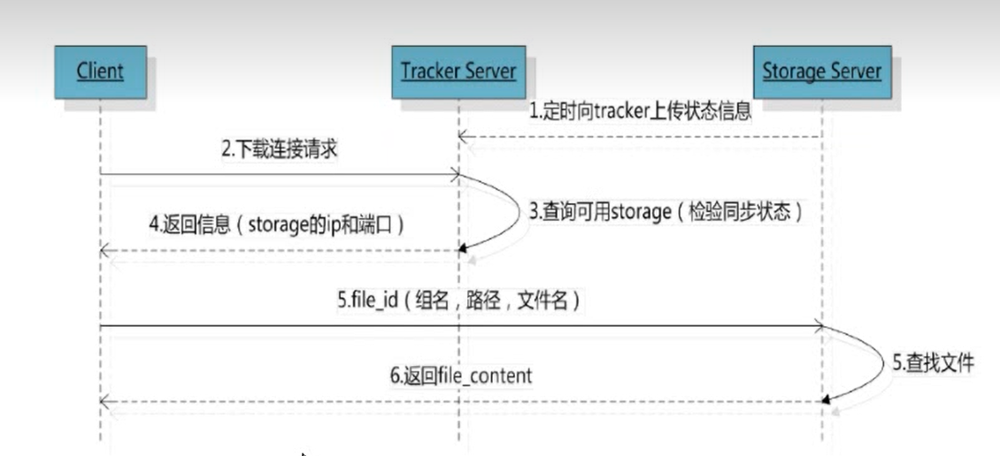

###### 1.5.3.1.追踪器

* 追踪器作为管理者，最先启动追踪器

###### 1.5.3.2.存储节点

* 第二个启动的角色

* 启动后，会单独开一个**线程**：

	* 汇报当前存储节点的容量和剩余容量

	* 汇报数据的同步情况

	* 汇报数据被下载的次数

###### 1.5.3.3.客户端

* 最后启动

	* 上传

	  * **首先连接追踪器**，询问存储节点的信息

	  * 我要上传数据时，那个存储节点有足够的容量

	  * 追踪器查询，得到结果

	  * 追踪器将查到的存储节点的IP+端口号发送给客户端
	  * 通过得到IP和端口号连接存储节点
	  * 将文件发给存储节点
	  * 上传成功后会得到一个**文件ID**
	
	* 下载
	
		* 连接追踪器，询问存储节点的信息
			* 问一下，要下载的文件在哪一个存储节点
			* 追踪器查询，得到结果
			* 追踪器将查到的存储节点的IP+端口号发送给客户端
			* 通过得到IP和端口号连接存储节点
			* 下载文件，文件下载需要通过上传时得到的文件ID才能实现下载

###### 1.5.3.4.fastDFS集群

**4.1 追踪者集群**

* 为什么集群
	* 避免单点故障
* 多个Tracker如何工作
	* 轮询工作
* 如何实现集群
	* 修改配置文件
	* 追踪器集群没有横向/纵向扩容之分

**4.2 存储节点集群**

* fastDFS管理存储节点的方式
	* 通过分组的方式完成
* 集群方式
	* 横向扩容-增加容量
		* 添加一台新的主机->容量增加
			* 需要添加新的分组(group)，新的主机属于新的分组，不能是原来的组，一台一个组
	* 纵向扩容
		* 将新的主机放在现有的组中
		* 组内的主机数增加
			* 组内主机的关系就是**相互备份**的关系，每个主机存储的数据相同，
			* 因此**这个组的容量按照最小容量进行定义**
			* 同一组内的主机需要通信，不同的组之间不需要
* 如何实现
	* 修改配置文件

### 2 FastDFS

#### 2.1.安装流程

先安装：libfastcommon

再安装fastdfs


安装完成后分别进行：

```linux
./make.sh
sudo ./make.sh install
```

检验是否安装成功:

```linux
ls /usr/bin/fdfs_*
fdfs_test
```

安装完成：


​		这里其实通过观察可以看到目前并没有在fastDFS的安装目录里面，fastDFS安装的所有的配置文件和可执行程序都在：**/usr/bin**中，但是还是能找到并显示信息。

其实在linux中：

```linux
echo $PATH
```

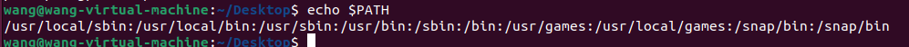

能看到很多目录，其实linux会在这些目录进行搜索，/usr/bin也在其中，但是如果不在这些目录中便搜索不到。

#### 2.2 . fdstDFS配置文件

**存放目录：/etc/fdfs**

> client.conf.sample  storage.conf.sample  storage_ids.conf.sample  tracker.conf.sample

##### 2.2.1 追踪器配置文件修改

tracker.conf.sample.

2.1.1 首先在同目录下复制该文件

> ```shell
> # sudo cp tracker.conf.sample tracker.conf
> ```

2.1.2 打开该文件并进行修改

> sudo vim tracker.conf

其中：

```shell
1. disabled = false:  
# 表示当前文件是否可用，disabled不可用，false双重否定，即文件可用。
2. bind_addr = 当前主机地址：
# 将追踪器与部署的主机IP地址进程绑定,也可以不指定，会自动绑定当前主机IP
3. port = 22122
# 追踪器监听默认端口号
4. base_path=/home/yuqing/fastdfs
# 追踪器日志信息的默认存放目录，可以更改
```

##### 2.2.2 存储节点配置文件修改

storage.conf.sample.

2.2.1 首先在同目录下复制该文件

> ```shell
> sudo cp storage.conf.sample storage.conf
> ```

2.2.2 打开该文件并进行修改

> ```shell
> sudo vim storage.conf
> ```

其中：

```shell
1. group_name=group1
# 当前主机是存储节点，表明主机是那个组
2. bind_addr=
# 当前存储节点和所应该的主机进行IP地址的绑定，不写fastDFS会自动绑定
3. port=23000
# 存储节点绑定的端口，由客户端绑定使用
4. base_path=/home/yuqing/fastdfs
# 存储节点写log日志的路径，可更改
5. store_path_count=1
  # storage_path_count = 2
# 作为存储节点提供的存储文件的路径个数
6. store_path0=/home/wang/user_wang/FastDFS/DFS/storage
  # store_path1 = /home/wang/user_wang/FastDFS/DFS/storage1
# 当存储节点为1个时，对应的存储路径
7. tracker_server=192.168.209.121:22122
   tracker_server=192.168.209.122:22122 
# 追踪器的地址信息，要与之前追踪器的bind_addr相对应
# 这里的多绑定是因为追踪器是轮询的需要都写上
```

存储节点和追踪器进行比较，储存节点类似客户端，追踪器类似服务器。

##### 2.2.3 客户端配置文件修改

storage.conf.sample.

1 首先在同目录下复制该文件

> ```shell
> sudo cp client.conf.sample client.conf
> ```

2 打开该文件并进行修改

> ```shell
> sudo vim client.conf
> ```

其中：

```shell
1. base_path=/home/yuqing/fastdfs
# 客户端写log日志的目录
# 当前用户对于路径中的文件有读写权限
2. tracker_server=192.168.0.197:22122
# 要连接追踪器的地址，需要与追踪器地址对应
```

##### 2.2.4 分布式的部署


> 1. 首先在客户端安装FastDFS，对于客户端来说只需要更改client.conf
> 2. 追踪器安装FastDFS，对于追踪器来说只需要更改tracker.conf
> 3. 存储节点安装FastDFS，对于存储节点来说只需要更改storage.conf
> 4. 对于只有一台主机时，存储节点和追踪器的地址相同
> 5. 对于不同的主机，必须在一个网络环境中(公网或大型局域网)才能互相访问。
> 6. 实际搭建中，不同的主机IP不同。


##### 2.2.5 fastDFS的启动

1. 第一个启动追踪器 -守护进程

```shell
# 启动程序在 /usr/bin/fdfs_*
# 启动
fdfs_trackerd 追踪器的配置文件（/etc/fdfs/tracker.conf)
# 例：fdfs_tER.CONrackerd /etc/fdfs/tracker.conf
# 当无法启动tracker时：sudo service fdfs_trackerd start
# 关闭
fdfs_trackerd 追踪器的配置文件（/etc/fdfs/tracker.conf) stop
# 重启
fdfs_trackerd 追踪器的配置文件（/etc/fdfs/tracker.conf) restart
```

2. 第二个启动存储节点-守护进程

```shell
# 启动程序在 /usr/bin/fdfs_*
# 启动
fdfs_storaged 追踪器的配置文件（/etc/fdfs/storage.conf)
# 关闭
fdfs_storaged 追踪器的配置文件（/etc/fdfs/storage.conf) stop
# 重启
fdfs_storaged 追踪器的配置文件（/etc/fdfs/storage.conf) restart
```


3. 第三个启动客户端 -普通进程

```shell
# 上传
fdfs_upload_file 客户端的配置文件（/etc/fdfs/client.conf) 要上传的文件
# 例子：fdfs_upload_appender /etc/fdfs/client.conf ~/Desktop/test/test.txt
# 上传后文件会重命名，保证文件名的唯一性，避免冲突
# 下载
fdfs_download_file 客户端的配置文件（/etc/fdfs/client.conf) 上传成功之后得到的字符串
# 字符串即下面的wkimg.....372.txt
# 例子：sudo fdfs_download_file /etc/fdfs/client.conf group1/M00/00/00/wKi.....372.txt
```

上传成功：这里的M00是映射目录不用管，文件保存在/00/00/文件


> * group1
>
> 	* 文件上传到了存储节点的哪一个组
>
> * M00
>
> 	* 和存储节点的配置项有映射（几个存储路径就有几个M）
>
> 		* store_path0=/home/wang/user_wang/FastDFS/DFS/storage/data -->M00
>
> 			store_path1 = /home/wang/user_wang/FastDFS/DFS/storage1/data -->M01
>
> * 00/00
>
> 	* 实际路径

4.FastDFS状态查询

```c++
fdfs_monitor /etc/fdfs/client.conf
```


状态位ACTIVE即正常启动。如果不是active，解决方法如下：

```c++
//从集群中删除
fdfs_monitor /etc/fdfs/client.conf delete group1 10.120.151.114
//在114服务器中，删除数据文件夹
rm -rf /home/wang/user_wang/FastDFS/DFS/storage/data
//重启114结点
fdfs_storaged /etc/fdfs/storaged.conf
```

#####  2.2.6 上传下载代码实现

1.使用多进程方式实现

* exec函数族函数
	* execl
	* execlp
* 先创建父进程
	* 子进程 ->执行execlp("fdfs_upload_file","xx",arg,NULL)，有结果输出，默认输出到终端
		* 不让其写道终端-->重定向dup2(old,new)
			* old-->标准输出
			* new -->管道的写端
			* 文件描述符
			* 数据块读到内存-->子进程
				* 数据最终要给到父进程（进程间通信）
		* pipe(匿名管道)-->处理有血缘关系的进程-->读端写端
			* 在子进程创建之前创建，父子进程同时拥有管道
	* 父进程
		* 读管道-->读入内存
		* 在将内存数据写入数据库

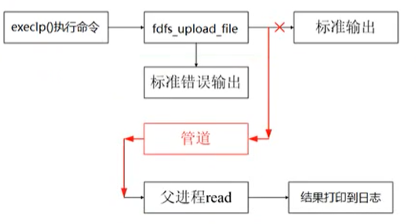

2. 使用fastDFS API实现。

* fastDFS的下载由fdfs_upload_file.c支持，想要下载的API，则需要更改文件。

* 安装目录位于/home/user_wang/FastDFS/Fastdfs-5.10/client/**fdfs_upload_file.c**
* 目标：将文件的main函数改为API

```c
#include <stdio.h>
#include <stdlib.h>
#include <string.h>
#include <string.h>
#include <errno.h>
#include <sys/types.h>
#include <sys/stat.h>
#include <fcntl.h>
#include <wait.h>
#include "fdfs_client.h"
#include "logger.h"

static void usage(char *argv[])
{
	printf("Usage: %s <config_file> <local_filename> " \
		"[storage_ip:port] [store_path_index]\n", argv[0]);
}

int upload_file(const char *conFile,const char *myFile,char * fileID)   //配置文件名称，上传文件名称,文件ID
{
	char *conf_filename;
	char *local_filename;
	char group_name[FDFS_GROUP_NAME_MAX_LEN + 1];
	ConnectionInfo *pTrackerServer;
	int result;
	int store_path_index;
	ConnectionInfo storageServer;

	if ((result=fdfs_client_init(conFile)) != 0)
	{
		return result;
	}

	pTrackerServer = tracker_get_connection();
	if (pTrackerServer == NULL)
	{
		fdfs_client_destroy();
		return errno != 0 ? errno : ECONNREFUSED;
	}

	*group_name = '\0';
	if ((result=tracker_query_storage_store(pTrackerServer, \
	                &storageServer, group_name, &store_path_index)) != 0)
	{
		fdfs_client_destroy();
		fprintf(stderr, "tracker_query_storage fail, " \
			"error no: %d, error info: %s\n", \
			result, STRERROR(result));
		return result;
	}

	result = storage_upload_by_filename1(pTrackerServer, \
			&storageServer, store_path_index, \
			myFile, NULL, \
			NULL, 0, group_name, fileID);
	if (result == 0)
	{
		printf("%s\n",fileID);
	}
	else
	{
		fprintf(stderr, "upload file fail, " \
			"error no: %d, error info: %s\n", \
			result, STRERROR(result));
	}

	tracker_disconnect_server_ex(pTrackerServer, true);
	fdfs_client_destroy();

	return result;
}

//使用多进程方式实现
int upload_file_2(const char *conFile,const char * myFile,char * fileID,int bufsize){
	//1.创建匿名管道
    int fd[2];
    int ret = pipe(fd);
    if(ret == -1){
        peror("pipe error");
        exit(0);
    }
    
    //2.创建子进程
    pid_t pid = fork();
    if(pid == 0){
        //3.标准输出重定向 -->管道写端
        //dup2(old,new);  //将new重定向到old
        dup2(fd[1],STDOUT_FILENO);
        //4.写操作关闭读端
        close(fd[0]);
        //5.执行excelp命令
        excelp("fdfs_upolad_file","xxx",conFile,myFile,NULL);
        perror("execlp error");
        
    }else{
        //6.父进程读管道，关闭写端
        close(fd[1]);
        char buf[1024];
        read(fd[0],fileID,bufsize);
        //7.回收子进程pcb
        wait(NULL);
    }
}
```

调用：


### 3 Redis

非关系型数据库（内存数据库）**一般应用于服务器**

#### 3.1 基本概念

关系型数据库-sql

* 操作数据必须要使用sql
* 数据存储在磁盘
* 存储的数据量大
	* mysql
	* oracle
	* sqlite--文件数据库
	* sql server

**非关系型数据库**-nosql

* 执行不使用sql语句，使用命令行
* 不需要数据库表
	* **数据以键值对的方式存储（key,value），key值必须是字符串**

**redis**：

* 除了非关系型数据库的特性，数据默认存储在内存，还有以下特性：
  * 速度快，效率高，（机械盘的读取速率和固态的读取速率差的很远）
  * 存储的数据量小
  * redis存储访问频率高的数据
  * redis共享内存
  	* 服务器端使用redis
  	* 客户端共享内存
  * redis使用时需要用**接口**使客户端连接redis服务器
  	* hiredis


> RBDMS：关系型数据库
>
> 1. 所有的数据默认存储在关系型数据库中
>
> 2. 客户端访问服务器，有一些数据，服务器需要频繁的查询数据
>
> 	* 服务器首先将数据存关系型数据库读出--->第一次
> 		* 将数据写入带redis中
> 		* redis中修改了数据，也会同步到关系型数据库中，但是也必须通过服务器才能同步，不能直接同步
> 	* 客户端第二次访问服务器
> 		* 服务器从redis中直接读数据
>
> 	

**redis的两个角色：**

* 服务器和客户端

**redis中数据的组织格式**：

* 键值对
	* key：必须是字符串
	* value：可选的
		* **string类型**
			* 字符串
		* **List类型**
			* 集合，存储多个string字符串
		* **Set类型**
			* 集合
				* stl集合
					* 默认是升序的，元素不允许重复
				* redis集合
					* 元素不重复，数据是无序的
		* **SortedSet类型**
			* 排序集合，集合中的每个元素分为两部分
				* [分数，成员]---->[64，"tom"]---->按照分数排序，值越大越靠前
		* **Hash类型**
			* 和map数据组织方式一样：key：value
				* Qt->QHash，Qmap
				* Map---->红黑树
				* hash---->数组---->对查找速度要求很高时用hash，比map快


#### 3.2 安装及使用

**安装**

```shell
sudo apt install lsb-release curl gpg

curl -fsSL https://packages.redis.io/gpg | sudo gpg --dearmor -o /usr/share/keyrings/redis-archive-keyring.gpg

echo "deb [signed-by=/usr/share/keyrings/redis-archive-keyring.gpg] https://packages.redis.io/deb $(lsb_release -cs) main" | sudo tee /etc/apt/sources.list.d/redis.list

sudo apt-get update

sudo apt-get install redis
```

使用：

```shell
# 客户端
redis-cli  # 默认连接本地，绑定6379默认端口的服务器
redis-cli -p 端口号
redis-cli -h IP地址 -p 端口
```

启动：

```shell
# 服务器 -启动
/etc/init.d/redis-server start  # 根据配置文件的设置启动
redis-server ./redis.conf
service redis-server start
service redis-server restart  	# 重启
service redis-server stop  		# 关闭
ping [MSG] 						# 客户端测试命令
```


**使用**

* **string类型**

```sql
key--->string
value --->string  		# string类型

						# 设置一个键值对-->string:string
set hello world  		# key:hello value:world
get hello				# 通过get取value值

mset a1 b1 a2 b2 a3 b3	# 设置多个键值对
keys *         			# 查询有多少个键值
mget a1 a2 a3  			# 查询多个key值对应的value值

append a1 1234567 		# 在key对应的value值后面添加字符串
get a1

strlen a1     			# 获取key值a1对应的value值的字符串长度

#将key值a1对应的数字字符串的值减一
#前提是，a1对应的value值必须时数字字符串
DECR a4
INCR a4       			# 将key值a1对应的数字字符串的值加一
decrby a4 100 			# 将key值a1对应的数字字符串的值减100
incrby a4 100 			# 将key值a1对应的数字字符串的值加100
```


* **List类型**

```sql
key -->string
value -->list
#设置一个键值对，--->string:list

lpush list1 1 2 3 4 5 6			# 将一个或多个value值放到表头,倒序插入
lrange list1 0 -1				# 遍历list1键值中的value值，start为起始位置，stop为结束位置

rpush list2 1 2 3 4 5 6			# 将一个或多个value值放到头部,正序插入，当key不存在时，会创建该列表并插入数据
lrange list2 0 -1

lpop list1						# 删除最左侧元素
rpop list1						# 删除最右侧元素

lindex list2 3					# 取list键值中的某个位置对应的value值，位置从0开始

llen list2						# 取list键值的长度

rpushx list2 7					# 将值value插入到列表key的表尾，key列表必须存在并且是一个列表

lrem key count value			# 根据参数 count 的值,移除列表中与参数 value 相等的元素。
lrem list2 2 2					# count>0:从表头开始向表尾搜索,移除与value相等的元素,数量为count.删除两个2
lrem list2 -2 2					# count<0:从表尾开始向表头搜索,移除与value相等的元素,数量为count的绝对值.删除两个2
lrem list2 0 2					# count=0:移除表中所有与value相等的值。
```

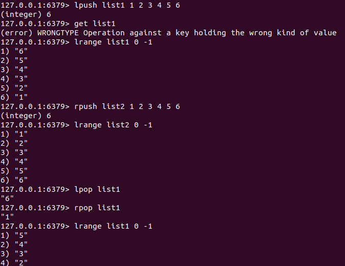

* **SET类型**

```sql
key -->string
value -->set
#设置一个键值对，--->string:set

sadd key member						# 将一个或多个元素加入到集合key当中，已经存在的member元素被忽略（不允许重复）
sadd set1 1 2 3 3 2 1 aa bb cc		

smembers key						# 遍历集合，集合是无序的
smembers set1

sdiff key1 key2						# 求两个集合的差集，A-A∩B，前面减后面，输出前面集合的不同值
sdiff st1 st2						# st1[1,2,3,aa,bb,cc]-st2[7,8,9,aa,bb,cc] = [1,2,3]
sinter key1 key2					# 求两个集合的交集
sunion key1 key2					# 求两个集合的并集，重复的只显示一次

sdiffstore destination				# 将求得到的两个集合的差集，保存在destination这个新集合当中
sdiffstore key3 key1 key2			# 将key1与key2的差集保存在key3中
sinterstore key3 key1 key2			# 将key1与key2的交集保存在key3中
sunionstore key3 key1 key2			# 将key1与key2的并集保存在key3中

spop								#移除一个元素
smove
srem key value						# 删除value值这个元素
```

* **SortedSet类型**

```sql
key--->string
value--->sorted([socre,member],[socre,member])

                            		#添加元素
zadd key member                     #将一个或多个member元素加入到集合key集合中，已经存在的将被忽略
zadd sset 12 tom 34 lisa 78 jreey

zrange key start end				#遍历元素
zrange sset 0 -1					
zrange sset 0 -1 withscores			#通过score排序，默认是升序
zrevrange sset 0 -1 withscores		#返回指定区间的集合，默认为降序

zcount key min max 					#指定分数区间内的元素个数
zcount sset1 10 50

zrank sset tom 						#返回tom的排名
zerm sset tom						#移除有序集 key 中的一个或多个成员,不存在的成员将被忽略
zscore key member 					#返回有序集 key 中,成员 member 的 score 值

```

* **hash类型**

 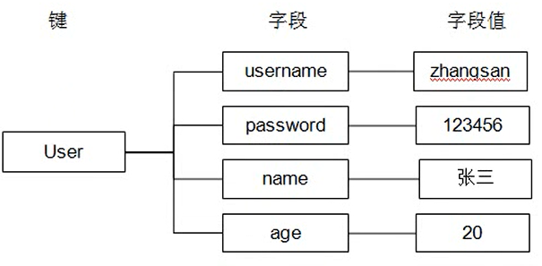

```sql
key---string
value--->hash([key,value],[key,value],[key,value]...)

                                        #添加数据
hset key field value					#将一个或多个member元素加入到集合key集合中，已有key被覆盖value，没有会创建新的
hset user username zhangsan
hset user password 123456
hset user name zhang3
hmset user name zhang3 password 123456	#一次性插入
hsetnx key filed value 					#将哈希表 key 中的域 field 的值设置为 value 
										#当且仅当域 field 不存在。若域 field 已经存在,该操作无效。

hget user name 							#获取hash数据
hmget user name password username       #一次性获取
hgetall user 							#返回哈希表 key 中，所有的域和值,

hdel key field 							#删除哈希表key中的一个或多个指定域,不存在的域将被忽略。
hdel user username password

hexisets user username 					#查看哈希表 key 中,给定域 field 是否存在。不存在返回0，存在返回1

hincrby key field increment 			#为哈希表key中的域field的值加上增量increment,increment可以为负数
hkeys key 								#返回哈希表key 中的所有域（键值）。
hvals key								#返回哈希表key 中的所有域值（value值）。
hlen key								#返回哈希表的元素个数。
```


* key相关命令


```sqlite
del keys
del user
```

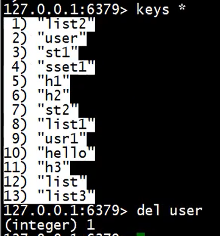

```sql
exists keys 				#检测key值是否存在
expire key seconds 			#给定 key 设置生存时间,当 key 过期时(生存时间为0),它会被自动删除。
TTL key 					#设置了时间，以秒为单位，返回给定 key 的剩余生存时间(TTL, time to live)。
persist key 				#取消生存时间
```


#### 3.3 redis配置文件

配置文件是给**redis服务器**使用的

* 配置文件位置：
	* 源目录-->etc/redis/redis.conf
	* 复制配置文件进行操作

```shell
#此操作必须在管理员模式下
sudo mkdir myredis
sudo cp /etc/redis/redis.conf /home/user_wang/myredis
```

* 文件配置项

```shell
# redis服务器绑定谁之后，谁就能访问redis服务器
# 将bind注释，即任何电脑可以访问redis服务器
#bind bind 127.0.0.1 -1::0::1
 bind 127.0.0.1  168.199.236.166 ...
#保护模式,如果需要远程客户端访问服务器，该模式要关闭
#proteced-mode yes
proteced-mode no
#绑定的端口号
port 6379
#连接超时,参数为0，即关闭连接超时
timeout 0
#服务器启动之后不是守护进程
#改为deamonize yes
deamonize no
#如果服务器是守护进程，就会生成一个pid文件
# ./ ->redis服务器启动的目录
#pidfile var/run/redis-server.redis
pidfile ./redis.pid
#日志级别 
loglevel notice
#如果服务器是守护进程，才会写日志文件
#logfile /var/log/redis/redis-server.log
logfile "" -> 这是没写
logfile "./redis.log"
#数据库数量，默认为16个数据库
database 16
	-切换数据库：select dbID [dbID --0 ~ 16-1]
```


对于redis来说16[0~15]数据库都是独立的。默认使用的0数据库

```sql
select 1 #切换数据库
key *
selec 0
keys *
```


#### 3.4 redis数据持久化

redis是内存数据库，但是也做了一个**数据从内存到磁盘的数据同步**的持久化，即在磁盘上有一个**持久化文件**，防止停电影响内存数据丢失。

持久化的两种方式：

* rdb方式
	* 默认的持久化方式，默认打开
	* 磁盘的持久化文件xxx.rdb
	* 将内存数据以二进制的方式直接写入磁盘文件
	* rdb文件比较小，恢复的时候时间短效率高
	* 保存数据的方式以用户设定的频率-->容易丢数据
	* 数据同步频率低，数据完整性较低
* aof方式
	* 默认是关闭的
	* 磁盘的持久化文件xxx.aof
	* 直接将生成数据的命令写入磁盘文件
	* 文件比较大，恢复时间长
	* 保存数据的方式以某种频率-->每隔1sec同步一下数据（同步频率比rdb高）
	* 数据完整性高

**配置修改：**


```sql
# rdb同步频率
# 3600 秒（一小时），如果至少执行了 1 次更改
# 300 秒（5 分钟），如果至少执行了 100 次更改
# 60 秒内，如果至少执行了 10000 次更改
save 3600 1 300 100 60 10000
# rdb文件名称
dbfilename dump.rdb
# 生成的持久化文件保存在那个目录下
# dir /var/lib/redis 默认目录
dir ./
# 是不是要打开aof模式，打开改为yes
appendonly no
# aof文件名称
appendfilename "appendonly.aof"
# aof更新频率
appendfsync everysec
```

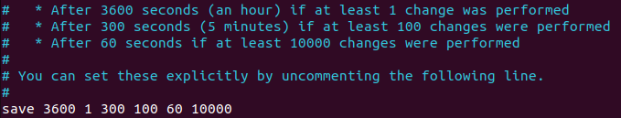


* aof和rdb写的是不同磁盘文件，**可以同时打开**，也**可以同时关闭**
* 两种模式同时开启时，要进行数据恢复
	* 考虑效率使用rdb
	* 考虑数据的完整性使用aof


#### 3.5 hiredis

**1.下载及安装**

https://github.com/redis/hiredis/releases


```shell
tar -zxf hiredis-1.2.0.tar.gz
cd ./hiredis-0.14.1/
make
make install
```


**2.基本概念**

* 连接数据库

```c
// 连接数据库
redisContext *redisConnect(const char *ip, int port);
redisContext *redisConnectWithTimeout(const char *ip, 
                                      int port, const struct timeval tv);
```

* 执行redis命令函数

```c
// 执行redis命令
void *redisCommand(redisContext *c, const char *format, ...);
// redisCommand 函数实际的返回值类型
typedef struct redisReply {
    /* 命令执行结果的返回类型 */
    int type; 
    /* 存储执行结果返回为整数 */
    long long integer;
    /* str变量的字符串值长度 */
    size_t len;
    /* 存储命令执行结果返回是字符串, 或者错误信息 */
    char *str;
    /* 返回结果是数组, 代表数据的大小 */
    size_t elements;
    /* 存储执行结果返回是数组*/
    struct redisReply **element;
} redisReply;
redisReply a[100];
element[i]->str
```

| 状态表示                 | 含义                                                         |
| ------------------------ | ------------------------------------------------------------ |
| REDIS_REPLY_STRING==1    | 返回值是字符串,字符串储存在redis->str当中,字符串长度为redi   |
| REDIS_REPLY_ARRAY== 2    | 返回值是数组，数组大小存在redis->elements里面，数组值存储在redis->element[i]里面。数组里面存储的是指向redisReply的指针，数组里面的返回值可以通过redis->element[i]->str来访问，数组的结果里全是type==REDIS_REPLY_STRING的redisReply对象指针。 |
| REDIS_REPLY_INTEGER == 3 | 返回整数long long，从integer字段获取值                       |
| REDIS_REPLY_NIL==4       | 返回值为空表示执行结果为空                                   |
| REDIS_REPLY_STATUS ==5   | 返回命令执行的状态，比如set foo bar 返回的状态为OK，存储在str当中 reply->str == "OK" 。 |
| REDIS_REPLY_ERROR ==6    | 命令执行错误,错误信息存放在 reply->str当中。                 |

* 释放资源

```c
// 释放资源
void freeReplyObject(void *reply);
void redisFree(redisContext *c);
```


**3.使用**

```c
#include <stdio.h>
#include <hiredis.h>

int main(){
	//1.连接redis服务器
    redisContext *c = redisConnect("127.0.0.1", 6379);
    if(c->err!=0){
		return -1;
    }
    //2.执行redis命令
    void *ptr = redisCommand(c,"hmset user name zhang3 password 123456");  //数据库，命令(插入)
    redisReply *ply = (redisReply*)ptr; 	//类型转换
    if(ply->tye == 5){
		//状态输出
        printf("状态：%s\n",ply->str);
    }
    freeReplyObject(ply);
    
    //3.从数据库中读数据
    ptr = redisCommand(c,"hgetall user");  //命令（一次性读hash所有键值对）
    ply = (redisReply*)ptr;
    if(ply->type == 2){
		//遍历key值与value值
        for(int i = 0;i<ply->element;i+=2){
			printf("keys: %s,value: %s \n",ply->element[i]->str,ply->element[i+1]->str);
        }
    }
    freeReplyObject(ply);
    redisFree(c);
}
```


### 4 Nginx

#### 4.1、概念

**1.Nginx介绍**

* C语言
* 开源框架
* Tengine - 淘宝基于nginx修改的

**2.Nginx能干什么?**

* 作为web服务器
	* **解析 HTTP 协议**：Nginx 支持 HTTP/1.0、HTTP/1.1 和 HTTP/2（通过 `ngx_http_v2_module` 模块），可以处理 HTTP 和 HTTPS 协议，接收来自客户端的请求并返回响应。
	* **处理静态请求**：Nginx 高效地提供静态文件服务（如 HTML、CSS、JavaScript、图片等），通过磁盘上的文件直接响应请求，非常适合用作前端文件的缓存服务器。
	* **处理动态请求**：虽然 Nginx 本身不直接处理 PHP、Python、Ruby 等语言编写的动态内容，但它可以通过 FastCGI、uWSGI、SCGI 或反向代理等机制与这些后端应用程序进行交互。例如，对于 PHP 请求，Nginx 可以将请求转发给 PHP-FPM（FastCGI Process Manager）处理，然后再将处理结果返回给客户端。
* 反向代理服务器
	* **负载均衡**：Nginx 可以作为反向代理服务器，将请求分发给多个后端服务器（也称为上游服务器），并根据一定的负载均衡算法（如轮询、最少连接数、IP 哈希等）来决定由哪个后端服务器处理请求。
	* **故障转移**：在负载均衡模式下，如果某个后端服务器宕机，Nginx 会自动将请求转发给其他健康的服务器，增强了系统的可靠性和容错性。
* 邮件服务器
	* 解析邮件相关的协议: pop3/smtp/imap
* HTTP 缓存
  * **代理缓存**：Nginx 支持将来自上游服务器的响应内容缓存到本地磁盘，当相同的请求再次到达时，可以直接从缓存中提供响应，而无需再次向后端服务器请求，这可以显著降低服务器的负载和响应时间。


3.Nginx的优势?

* 高内聚，低耦合
  * 模块之间依赖程度越高，越高内聚。
  * 功能越独立，耦合越低。


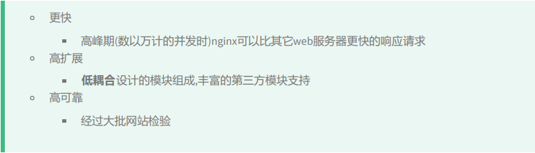

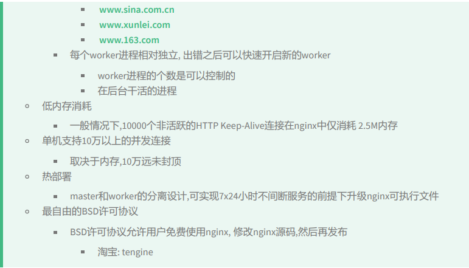


* 10000个非活跃的HTTP-Alive也只需要建立几个线程轮询工作，不需要10000个线程


#### 4.2、正向代理和反向代理

**正向代理**：

* 为用户服务，提供上网操作
	* 机场（梯子/VPN）

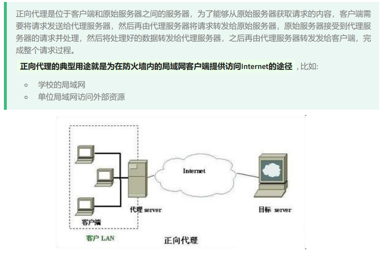

**反向代理服务器：**

* 用户的访问是无法控制的，有的服务器被访问的多，有的少被访问的少，为了进行基本的平均分配-->反向代理服务器
* 按照一定规则来分配资源，只是做了转发请求的工作，不对请求进行处理
* tracker和反向代理服务器的区别是，tracker返回的是主机的端口和ip而不是数据
* 对用户来说，只知道反向代理服务器的地址，并不知道背后的服务器的地址
	* 老鸨


#### 4.3、域名和服务器

* 什么是域名（DNS）？

	*  www.baidu.com

	*  jd.com 
	* taobao.com 

* 什么是IP地址？ 
	* 点分十进制的字符串 
	* 11.22.34.45 3. 
* 域名和IP地址的关系？
	*  域名绑定IP ，不是IP绑定域名
		* 一个域名只能绑定一个IP
		*  一个IP地址被多个域名绑定

**DNS解析过程：**

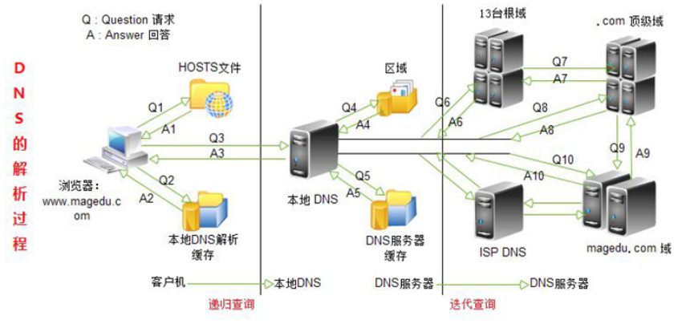


**URL与URI**：


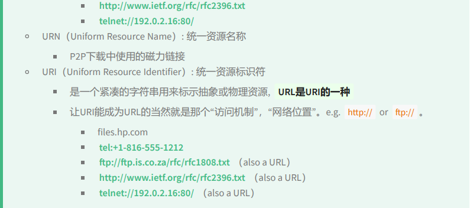


#### **4.4、Nginx安装**


**安装：**

**1、OpenSSL:**

```shell
地址：
    https://www.openssl.org/source/old/
解压：
	tar -xzf openssl-1.1.1d.tar.gz
	cd openssl-1.1.1
编译：
	./config shared zlib  --prefix=/usr/local/openssl && make && make install
配置：
	./config -t
	make depend
创建符号链接：
	cd /usr/local
	ln -s openssl ssl
文件配置：
	echo "/usr/local/openssl/lib" >> /etc/ld.so.conf
	ldconfig
添加OpenSSL的环境变量：
	cd /etc
	vim profile
	在文件末尾加入：
		export OPENSSL=/usr/local/openssl/bin
 		export PATH=$OPENSSL:$PATH:$HOME/bin
查看版本：
	openssl version
```

**2、Zlib：**

```shell
地址：
	https://www.zlib.net/
解压：
	tar zvfx zlib-1.2.11.tar.gz
编译：
	cd zlib-1.2.11
	./configure
    make 
    make check
    sudo make install
```

安装成功后，可以在`/usr/local/lib`下找到 `libz.a`。libz.a是一个静态库，为了使用zlib的接口，我们必须在连接我们的程序时，libz.a链接进来。只需在 链接命令后加`-lz /usr/llocal/lib/libz.a` 即可。

**3、Pcre**

```shell
# 下载：
    wget http://downloads.sourceforge.net/project/pcre/pcre/8.35/pcre-8.35.tar.gz
# 解压：
	bzip2 -d prce-8.35.bz2
# 编译：
	cd prce-8.35
	./configure
    make 
    make check
    sudo make install
```

安装报错：


这里用指令：

```shell
 make -Wall -Werror
 sudo make install -Wall -Werror
```


**4、Nginx**

```shell
# 解压：
	tar zvfx nginx-1.10.1.tar.gz
# 编译：
	cd zvfx nginx-1.10.1
# nginx工作时候需要依赖三个库
# 三个参数=这三个库对应的源码安装目录
# 根据自己的电脑的库安装包的位置进行指定
# 链接OpenSSL和Prce和Zlib,这里注意目录全是源码目录而不是安装目录
	./configure --with-openssl=/home/wang/user_wang/Nginx/openssl/openssl-1.0.1t --with-pcre=/home/wang/user_wang/Nginx/prce/pcre-8.35/pcre-8.35 --with-zlib=/home/wang/user_wang/Nginx/Zlib/zlib-1.2.11
    sudo make 
    make check
    sudo make install
# 这里如果遇到权限问题可以用sudo编译，但是编译后最好都解锁权限
	sudo chmod -R 777 folder
```

make报错解决：

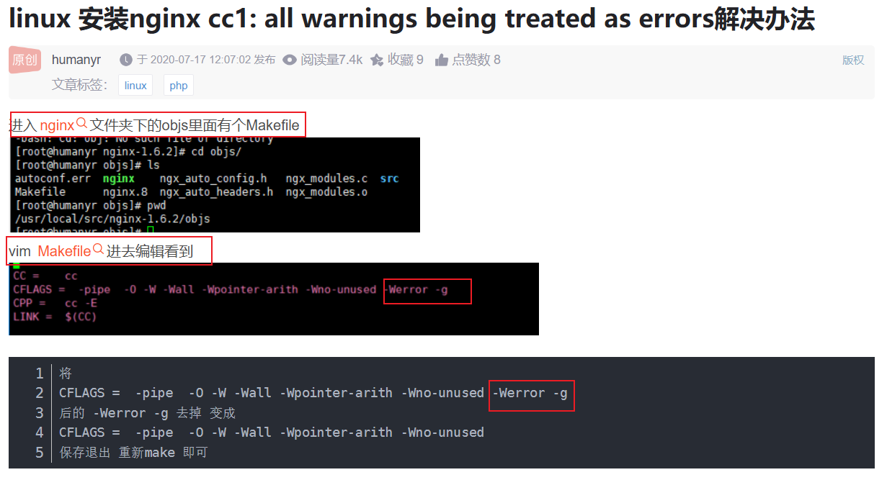

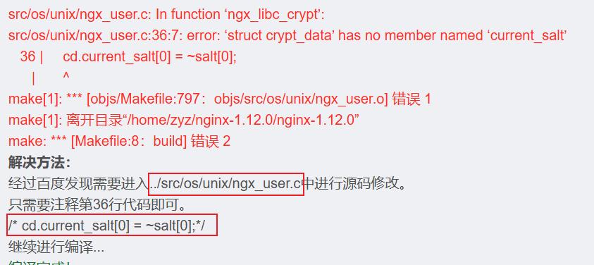

nginx的make install 基本上都是文件操作：


#### 4.5、Nginx 相关的指令

* Nginx的默认安装目录

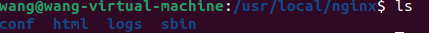

```shell
/usr/local/nginx
conf -> 存储配置文件的目录
html -> 默认的存储网站(服务器)静态资源的目录 [图片, html, js, css]
logs -> 存储log日志
sbin -> 启动nginx的可执行程序
```

* Nginx可执行程序的路径

```shell
/usr/local/nginx/sbin/nginx
# 快速启动的方式
# 1. 将/usr/local/nginx/sbin/添加到环境变量PATH中
# 2. /usr/local/nginx/sbin/nginx创建软连接, 放到PATH对应的路径中, 比如: /usr/bin
sudo ln -s /usr/local/nginx/sbin/nginx /usr/bin/nginx
```

* 启动Nginx - 需要管理器权限

```shell
# 假设软连接已经创建完毕
sudo nginx # 启动
```

* 关闭Nginx

```shell
# 第一种, 马上关闭
sudo nginx -s stop
# 第二种, 等nginx作为当前操作之后关闭
sudo nginx -s quit
```

* 重新加载Nginx

```shell
sudo nginx -s reload # 修改了nginx的配置文件之后, 需要执行该命令
```

* 测试是否安装成功
	* 进程有master管理和worker工作


#### 4.6、Nginx配置文件

1、Nginx配置文件的位置

```shell
/usr/local/nginx/conf/nginx.conf
```

2、Nginx配置文件的组织格式

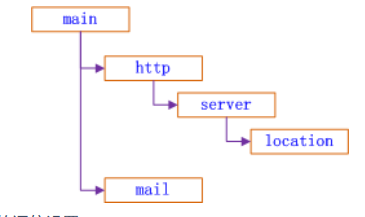

* http -> 模块, http相关的通信设置
	* http里面可以有多个server模块 -> 每个server对应的是一台web服务器
		* 每个server也可以有多个location模块-->每个location对应处理一个客户端的请求，不同的location对应不同的客户端的请求

* location处理流程       

	* 客户端 (浏览器), 请求:
		* http://192.168.10.100:80/login.html

	* web服务器收到请求后处理客户端的请求

		* 服务器要处理的指令如何从url中提取?
			- 去掉协议: http

			- 去掉IP/域名+端口: 192.168.10.100:80

			- 最后如果是文件名, 去掉该名字: login.html

			- 剩下的：/

			- 服务器端要处理的location指令就是：/

			- location /{

				​			处理动作

				}

* mail -> 模块, 处理邮件相关的动作

**3、nginx.conf**

```nginx
user  nobody;			# 启动之后的worker进程属于谁 修改为root
						# 如果是nobody会错误提示: nginx操作xxx文件时候失败, 原因: Permission denied（没有权限）
    					# 将nobody -> root
#user root
worker_processes  1;   	# 设置worker进程的个数, 最大 == cpu的核数 (推荐)

error_log  logs/error.log;				# 错误日志, /usr/local/nginx
#error_log  logs/error.log  notice;		# 日志级别
#error_log  logs/error.log  info;

#pid        logs/nginx.pid;				#	pid文件，里边是nginx的进程ID

events {
    use epoll; 							# 多路IO转接模型使用epoll
    worker_connections  1024;			# 每个工作进程的最大连接数
}

http {
    include       mime.types;
    default_type  application/octet-stream;

    #log_format  main  '$remote_addr - $remote_user [$time_local] "$request" '
    #                  '$status $body_bytes_sent "$http_referer" '
    #                  '"$http_user_agent" "$http_x_forwarded_for"';

    #access_log  logs/access.log  main;

    sendfile        on;
    #tcp_nopush     on;

    #keepalive_timeout  0;
    keepalive_timeout  65;

    #gzip  on;

    server {										# 每个server模块可以看做一台web服务器
        listen       80;							# web服务器监听的端口, http协议的默认端口
        server_name  localhost;						# 对应一个域名, 客户端通过该域名访问服务器

        charset utf-8;								# 字符串编码 koi8-r为俄罗斯编码

        #access_log  logs/host.access.log  main;

        location / {								# 模块, 处理客户端的请求
            root   html;
            index  index.html index.htm;
       	#error_page  404              /404.html;

        # redirect server error pages to the static page /50x.html
        #
        error_page   500 502 503 504  /50x.html;
        location = /50x.html {
            root   html;
        }
}
```


#### 4.7、Niginx使用

**静态网页存储目录**

* 默认的存储目录:

	```shell
	/usr/local/nginx/html
	```

* 自己新建目录

	```shell
	应该在 /usr/local/nginx/ 下创建自己的目录
	mkdir /usr/local/nginx/mydir 
	```


**练习**

* 在Nginx服务器上进行网页部署, 实现如下访问:
* 在/usr/local/nginx/创建新的目录, yundisk用来存储静态网页
* 此时将nginx作为后端服务器而不是代理服务器，每一个请求对应一个location。nginx作为代理服务器需要和fastCGI结合，详细参考第五章FastCGI。


**练习1：**访问地址: http://192.168.80.254/login.html      请求login.html文件

* login.html放到什么位置?  -->yundisk

	```nginx
	/ -> 服务器的资源根目录 ./usr/local/nginx/yundisk
	login.html-> 放到yundisk中,yundisk放在nginx下
	```


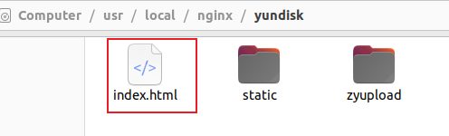

* 服务器要处理的动作-->在/usr/local/nginx/conf/nginx.conf中更改

	```nginx
	# 对应这个请求，服务器要添加一个location
	location /
	{ 
	    # 找一个静态网页
	    root yundisk; # root代表着资源根目录在哪，相对于/usr/local/nginx/来找
	    # 当客户端的请求是一个目录, nginx需要找一个默认显示的网页
	    index index.html index.htm;
	} 
	# 配置之后重启nginx
	sudo nginx -s reload
	```

* 这里要注意，nginx在reload时，由于pid文件就会随着nginx退出自动被清理掉，因此可能会报错该路径下没有pid文件：


* 因此有两个解决方案：

	* 在该路径下建一个空的pid文件
	* 执行以下指令：


```shell
	pkill -9 nginx
	sudo nginx 
	sudo nginx -s reload
```


* 重启nginx之后，链接自己的ip地址，加上loginx.html后缀即可访问loginx.html静态网页
	* http://192.168.166.130/index.html     --->192.168.166.130是我的虚拟机地址

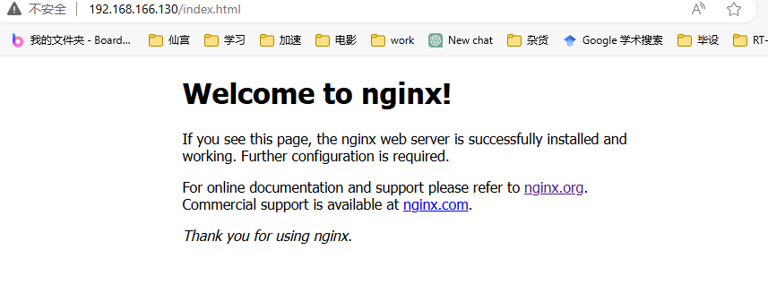

**练习2：**访问地址: http://192.168.80.254/hello/reg.html

* hello是什么?

	* 目录   --> 目前还是root yundisk，因此都在yundisk中创建hello目录，把reg.html和static拷贝进去

* reg.html放到哪儿?

	* hello目录中

* 如何添加location

	```nginx
	location /hello/
	{
	    root yundisk;
	    index xx.html;
	}
	```

	启动nginx并访问：http://192.168.166.130/hello/index.html
	
	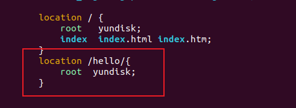
	
	


**练习3**：访问地址: http://192.168.80.254/upload/ 浏览器显示upload.html

* 直接访问一个目录, 得到一默认网页

	* upload是一个目录, uplaod.html应该再upload目录中

		```nginx
		ocation /upload/
		{
		    root yundisk;
		    index upload.html;
		}
		```


#### 4.8、反向代理设置


**准备工作：**

* 1个个客户端
	* window浏览器
* 1个反向代理服务器
	* window作为反向代理服务器
	* https://nginx.org/ (nginx-windows下载网址)
* 2个web服务器
	* ubuntu - wang: 192.168.166.130
	* kylin-wang:192.168.166.134

windows下启动nginx：

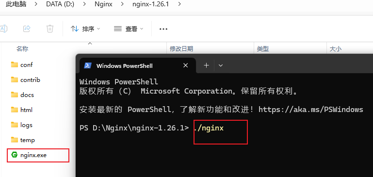

启动之后访问localhost即可：**localhost/localhost:80**


**反向代理**：

* 反向代理服务器即将数据通过反向代理服务器发送给其他服务器
	* 代理一台服务器
		* 客户端访问ubuntu.com
			* ubuntu.com作为反向代理服务器并不解析数据，制作转发
		* 反向代理服务器转发给ubuntu.wang.com地址对应的服务器
			* ubuntu.wang.com对应192.168.166.130:80服务器地址
	* 代理第二台服务器同理
	* 这里为了保证window作为反向代理服务器只有一台，将127.0.0.1分别设置域名ubuntu.com/kylin.com


```nginx
# 找window上对应的nginx的配置文件 - conf/nginx.conf
	# 代理几台服务器就需要几个server模块
		# 客户端访问的url: http://192.168.1.100/login.html
	# 代理第一台电脑
    server {
        listen 80; 				# 客户端访问反向代理服务器时，反向代理服务器监听的端口
        server_name ubuntu.com; # 客户端访问反向代理服务器, 需要的一个域名
        location / {
            # 反向代理服务器转发指令，转发指令/, 前缀http://固定
            proxy_pass http://ubuntu.wang.com;	# 通过此域名需要找到服务器
            }
    }
    # 因此需要添加一个代理模块来对应服务器ip
    upstream ubuntu.wang.com
    {
        server 192.168.166.130:80;
    }
    # 代理第二台电脑
    server {
        listen 80; # 客户端访问反向代理服务器, 代理服务器监听的端口
        server_name kylin.com; # 客户端访问反向代理服务器, 需要一个域名
        location / {  //转发某个请求，最终地址解析出来一个/符号
            # 反向代理服务器转发指令, http:// 固定
            proxy_pass http://kylin.wang.com;  #转发地址kylin.wang.com
    	}
    }
    # 添加一个代理模块
    upstream kylin.wang.com
    {
        server 192.168.166.134:80;
    }
    location /
    {
        root yundisk;
        index index.html;
    }
```

最终windows下nginx.conf的修改如下：

```nginx
#user  nobody;
worker_processes  1;
events {
    worker_connections  1024;
}

http {
    include       mime.types;
    default_type  application/octet-stream;

    sendfile        on;
    #tcp_nopush     on;

    #keepalive_timeout  0;
    keepalive_timeout  65;

    #gzip  on;

	server {
        	listen 80; 				
        	server_name ubuntu.com; 
        	location / {
            		proxy_pass http://ubuntu.wang.com;
            	}
   	 }
    	upstream ubuntu.wang.com
    	{
       	 	server 192.168.166.130:80;
   	 }
    	# 代理第二台电脑
    	server {
        	listen 80;
       		server_name kylin.com;
        	location / {
            		proxy_pass http://kylin.wang.com;
    		}
    	}
    	# 添加一个代理模块
    	upstream kylin.wang.com
    	{
        	server 192.168.166.134:80;
    	}
    }
```

为了保证本地的ubuntu.com/kylin.com都指向同一ip，本地hosts文件修改：

* 找到c:\windows\system32\drivers\etc\hosts文件

* 末尾加上:

	```
	127.0.0.1 ubuntu.com
	127.0.0.1 kylin.com
	```

这样就能保证为127.0.0.1配置多个域名，最终以windows作为反向代理服务器。

**注意：**测试时，**保证服务器的nginx和windows的nginx同时启动**，测试才有效

* 服务器的nginx进行事件响应与处理
* window的nginx仅作为反向代理服务器进行转发


#### **4.9、负载均衡设置**

* 负载均衡只需设置一个服务器转发的域名，在代理模块中，服务器域名对应许多服务器地址

* 负责均衡过程：

	* 当通过80端口将请求发送给反向代理服务器，反向代理服务器域名：localhost
	* 反向代理服务器不处理请求，而是将请求扔给upstream模块
	* upstream模块中有很多server，反向代理服务器在转发消息时，第一次转发会将消息给第一个server，第二次给第二个server，当只有两个服务器时，第三次转发会将消息给第一个server，实现**自动轮询**
		* Nginx内部通过**轮询算法**实现请求的分配。具体实现过程大致如下：
			* **初始化**：Nginx启动时，会读取配置文件中的`upstream`模块定义，初始化服务器列表，并为每个服务器分配一个初始权重（如果未明确指定，则默认为1）。
			* **请求处理**：当客户端请求到达Nginx时，Nginx会根据轮询算法从服务器列表中选择一个服务器来处理请求。
				* 首先，Nginx会遍历服务器列表，根据服务器的当前权重（考虑到可能的权重调整和服务器故障情况）选择当前权重最高的服务器。
				* 如果所有服务器的当前权重都相同，则按照服务器列表的顺序依次选择。
			* **权重调整**：在请求处理过程中，Nginx会根据服务器的实际响应情况动态调整服务器的权重。例如，如果某个服务器响应时间较长或频繁失败，Nginx可能会降低其权重，以减少分配给该服务器的请求数量。
			* **故障处理**：如果Nginx检测到某个服务器出现故障（如连接失败、超时等），则会自动将该服务器从当前轮询中剔除，直到该服务器恢复正常。

	

```nginx
server {
    listen 80; # 客户端访问反向代理服务器, 代理服务器监听的端口
    server_name localhost; # 客户端访问反向代理服务器, 需要一个域名
    location / {
        # 反向代理服务器转发指令, http:// 固定的头
        proxy_pass http://linux.com;
    }
    location /hello/ {
        # 反向代理服务器转发指令, http:// 固定的头
        proxy_pass http://linux.com;
    }
    location /upload/ {
        # 反向代理服务器转发指令, http:// 固定的头
        proxy_pass http://linux.com;
     }
}
# 添加一个代理模块
upstream linux.com
{
    server 192.168.166.130:80 weight=1; # weight表示处理权重，权重较低，四次请求处理一次
    server 192.168.166.134:80 weight=3; # 权重较高，四次请求处理三次
}
```

*  转发之后web服务器需要做什么?
	* 对转发的请求/事件进行处理

```nginx
# 两台服务器分别进行处理
# 192.168.166.130
location /
{
    root xxx;
    index xxx;
}
location /hello/
{
    root xx;
    index xxx;
}
location /upload/
{
    root xxx;
    index xx;
}
# 192.168.166.134
location /
{
    root xxx;
    index xxx;
}
location /hello/
{
    root xx;
    index xxx;
}
location /upload/
{
    root xxx;
    index xx;
}
```

#### 4.10 **总结：**

* nginx作为：

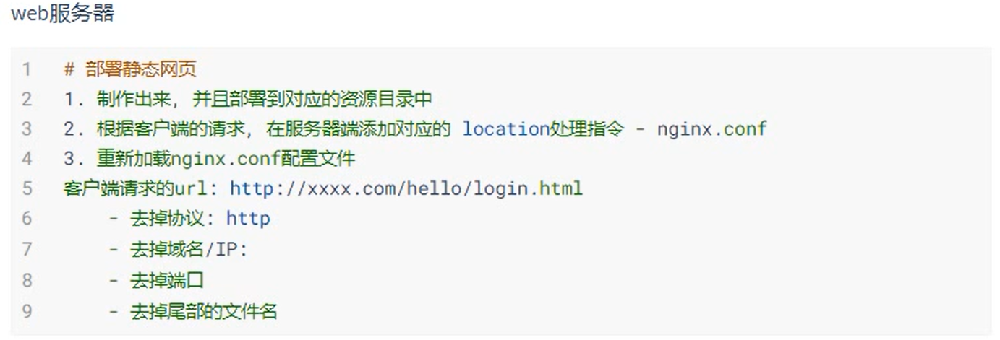


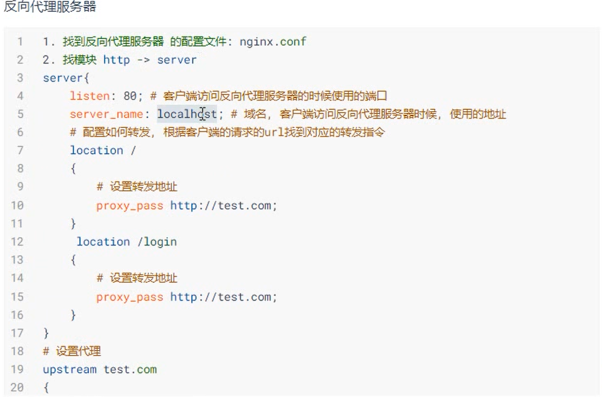

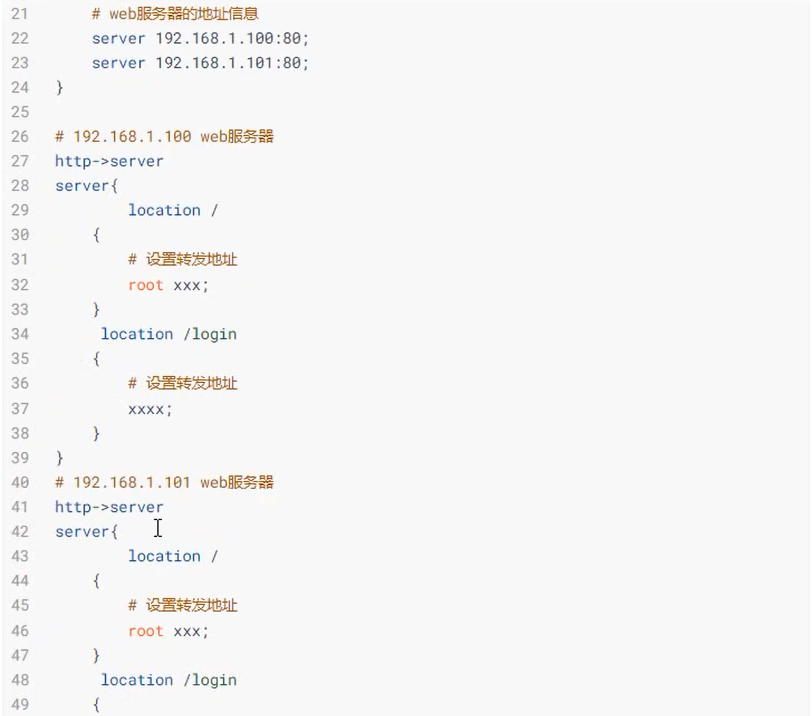

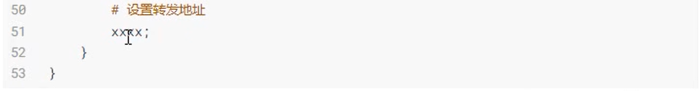

* **Nginx作为web服务器处理请求**

1. 静态请求 

	> 客户端访问服务器的静态网页, 不涉及任何数据的处理, 如下面的URL:

	```http
	http://localhsot/login.html
	```

2. 动态请求

	> 客户端会将数据提交给服务器

	```http
	# 使用get方式提交数据得到的url
	http://localhost/login?user=zhang3&passwd=123456&age=12&sex=man
		- http: 协议
		- localhost: 域名
		- /login: 服务器端要处理的指令
		- ? : 连接符, 后边的内容是客户端给服务器提交的数据
		- & : 分隔符
	动态的url如何找服务器端处理的指令?
	    - 去掉协议
	    - 去掉域名/IP
	    - 去掉端口
	    - 去掉?和它后边的内容
	    # 如果看到的是请求行, 如何找处理指令?
	POST /upload/UploadAction HTTP/1.1
	GET /?username=tom&phone=123&email=hello%40qq.com&date=2018-01-01&sex=male&class=3&rule=on HTTP/1.1
	1. 找请求行的第二部分
		- 如果是post, 处理指令就是请求行的第二部分
		- 如果是get, 处理指令就是请求行的第二部分, ? 以前的内容
		- 找到只好写一个location
	```


### 5 FastCGI

#### 5.1 CGI

​		通用网关接口（Common Gateway Interface/CGI）描述了客户端和服务器程序之间传输数据的一种标准，可以 让一个客户端，从网页浏览器向执行在网络服务器上的程序请求数据。CGI 独立于任何语言的，CGI 程序可以用 任何脚本语言或者是完全独立编程语言实现，只要这个语言可以在这个系统上运行。

* CGI是通用网关接口,描述了客户端和服务器程序之间传输数据的一种标准 
* CGl进程是用来帮助http股务器处理**动态请求**的数据
* CGl进程会频繁的被服务器创建和销毁

**客户端与服务器通信流程：**

**对于普通服务器：**

1. 客户端与服务器通信：
	* 当用户在浏览器中输入一个URL或点击一个链接时，浏览器会解析这个URL，并根据其协议部分（如http或https）决定如何发送请求。
	* **浏览器作为客户端，会向服务器发送一个HTTP请求**，请求中包含URL的其余部分（如主机名、端口、路径和查询字符串）。
2. 服务器接收请求：
	* **服务器接收到HTTP请求后，会解析这个请求，包括URL中的各个部分**。
	* 服务器本身确实**只能解析和处理HTTP请求的格式**，但它可以基于请求的内容（如URL的路径部分）来决定如何响应这个请求。
3. 服务器与CGI程序交互：
	* 如果服务器需要处理一些动态内容，它可能会**调用一个CGI程序来处理这些数据**
	* CGI程序是一个独立的程序，运行在服务器上，可以处理来自服务器的数据，并生成HTML或其他格式的输出，然后**发送回服务器**。
	* 服务器接收到CGI程序的输出后，会将其作为HTTP响应**发送给客户端**（浏览器）。
4. 浏览器显示响应：
	* 浏览器接收到服务器的HTTP响应后，会解析这个响应，并显示其中的内容（如HTML页面）。

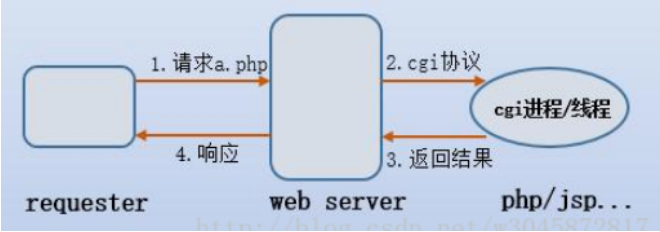


**对于nginx服务器：**

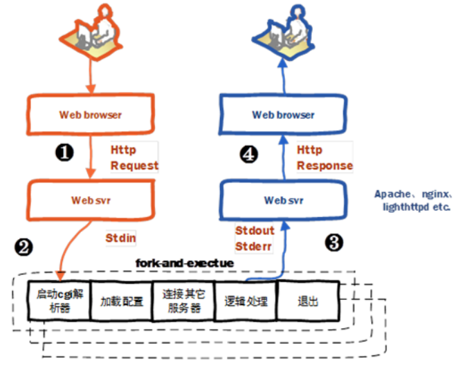

`(http://localhost/login?user=zhang3&passwd=123456&age=12&sex=man)`

1. 用户通过浏览器访问服务器, 发送了一个请求, 请求的URL如上
2. 服务器接收数据, 对接收的数据进行解析
3. nginx对于一些登录数据不知道如何处理, nginx将数据发送给了CGI程序
	* 服务器端会创建一个CGI进程
		* 这里由于服务端创建CGI进程，所以属于父子进程，可以直接使用标准输入和输出
4. CGI进程执行
	* 加载配置, 如果有需求加载配置文件获取数据 
	* 连接其他服务器: 比如数据库（有时候数据库和服务器并不在同一个主机上）
	* 逻辑处理: 
	* 得到结果, 将结果发送给服务器 
	* 退出
5. 服务器将CGI处理结果发送给客户端
	* 在服务器端CGI进程会被**频繁的创建销毁**
	* 服务器开销大, 效率低


#### 5.2 FastCGI

* 概念
	* 运行在服务器端的代码,帮助服务器处理客户端提交的动态请求
	* **快速通用网关接口**（Fast Common Gateway Interface／FastCGI）是通用网关接口（CGI）的改进，描述了客户端 和服务器程序之间传输数据的一种标准。 **FastCGI致力于减少Web服务器与 CGI 程式 之间互动的开销，从而使服务器 可以同时处理更多的Web请求 。**与为每个请求创建一个新的进程不同，FastCGI使用持续的进程来处理 一连串的请求。这些进程由FastCGI进程管理器管理，而不是web服务器。
	
* fastCGI与CGI的区别

  * CGI 就是所谓的**短生存期应用程序**，FastCGI 就是所谓的**长生存期应用程序**。

  * FastCGI像是一个常驻(long-live)型的 CGI，它可以一直执行着，不会每次都要花费时间去fork一次

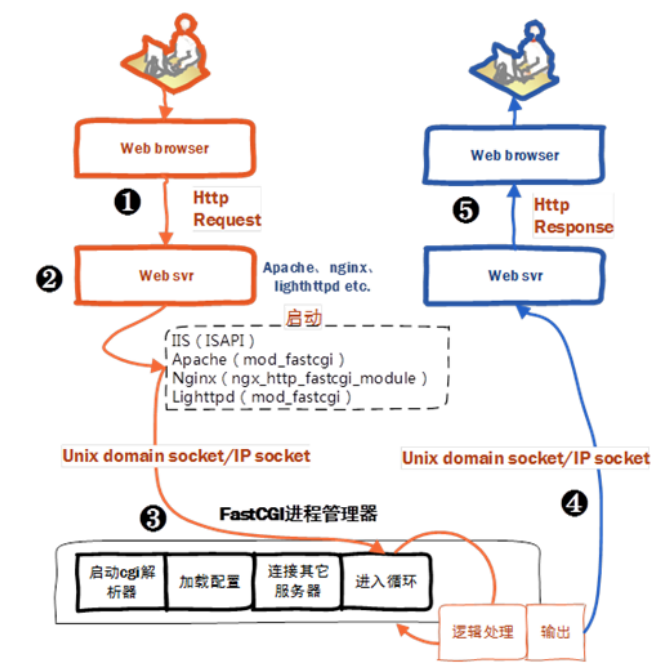

`http://localhost/login?user=zhang3&passwd=123456&age=12&sex=man`

1.  用户通过浏览器访问服务器, 发送了一个请求, 请求的url如上

2.  nginx服务器接收数据, 对接收的数据进行解析

3. nginx对于一些登录数据不知道如何处理, nginx将数据发送给了fastcgi程序

	* 通过本地套接字（Unix domain socket）

	* 网络套接字通信  (IP socket)
		* FastCGI进程就是为了服务器端服务
		* web进程和FastCGI进程之间并没有血缘关系，属于独立的进程，所以需要套接字通信

4. fastCGI程序如何启动

	* 不是由web服务器直接启动
	* 通过一个fastCGI进程管理器启动

5. fastCGI启动

	* 加载配置 - 可选（数据存储量较小时，可以用配置文件，较大时需要链接数据库）
	* 连接服务器 - 数据库
	* 循环处理
		* 服务器有请求 -> 处理
			* 将处理结果发送给服务器
				* 本地套接字通信
				* 网络套接字通信
		* 服务器没有请求 -> 阻塞

6. 服务器将fastCGI的处理结果发送给客户端


#### 5.3 FastCGI安装

* 安装FastCGI

	```shell
	sudo ./configure
	sudo make
		- 编译时一定会报错：fcgio.cpp:50:14: error: 'EOF' was not declared in this scope
		- 这是因为没有包含对应的头文件:
			- stdio.h - c
			- cstdio -> c++
	find ./ -name fcgio.cpp
	sudo vi ./libfcgi/fcgio.cpp
		- 加入 #indlue "stdio.h"
	sudo make
	sudo make install
	```

*  安装spawn-fcgi

	```shell
	sudo ./configure
	sudo make
	sudo make install
	```


#### 5.4 nginx&FastCGI

* **nginx** 不能像apache那样直接执行外部可执行程序，但nginx可以作为代理服务器，将请求转发给后端服务器， 这也是nginx的主要作用之一。其中nginx就支持FastCGI代理，接收客户端的请求，然后将请求转发给后端fastcgi 进程。
	* nginx收到的动态请求才会交给fastcgi 进程，静态请求nginx只要有处理程序可以自己处理。

* **fastcgi**进程由FastCGI进程管理器管理，而不是nginx。这样就需要一个FastCGI管理，管理 我们编写fastcgi程序。我们使用spawn-fcgi作为FastCGI进程管理器。
	* fastCGl是为Nginx服务器服务的,用来处理客户端提交的数据，
	* 客户数据首先发送数据给web服务器。再发送给fastGCI

* **spawn-fcgi**是一个通用的FastCGI进程管理器，简单小巧，原先是属于lighttpd的一部分，后来由于使用比较广 泛，所以就迁移出来作为独立项目了。spawn-fcgi使用pre-fork 模型， 功能主要是打开监听端口，绑定地址，然 后fork-and-exec创建我们编写的fastcgi应用程序进程，退出完成工作 。fastcgi应用程序初始化，然后进入死循环 侦听socket的连接请求。

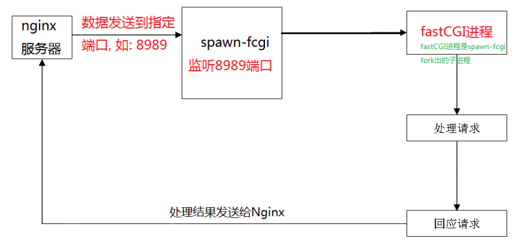


`http://localhost/login?user=zhang3&passwd=123456&age=12&sex=man`

* 点击url，客户端开始访问，发送请求
* nginx接收请求，而nginx无法处理请求，发送数据给在spawn-fcgi
* spawn-fcgi - 通信过程中的服务器角色
	* 被动接收数据
	* 在spawn-fcgi启动的时候给其绑定IP和端口
*  fastCGI程序
	* 假设程序猿写了一个登录程序 login.c ，然后将login.c 编译为可执行程序( login )
	* 使用 spawn-fcgi 进程管理器启动 login 程序, 得到一进程（fastCGI进程）
	* 此时，spawn-fcgi 进程和fastCGI进程是父子进程
	* nginx发送数据给spawn-fcgi ，而spawn-fcgi 发送给fastCGI，然后去处理数据
	* fastCGI去处理请求，处理完成，由fastCGI进程直接`回应请求`给nginx不经过spawn-fcgi


#### 5.5 nginx数据转发

* **nginx配合fastcgi数据转发流程**：
	* 假设程序猿写了一个登录程序login.c ，然后将login.c 编译为可执行程序( login)
	* 使用 spawn-fcgi 进程管理器启动 login 程序, 得到一进程（fastCGI进程），也就是说login就是处理请求的fastCGI进程
	* 此时，spawn-fcgi 进程和fastCGI进程是父子进程，spawn-fcgi 进程启动时会捎带启动fastCGI进程
	* nginx不处理请求，然后转发数据给spawn-fcgi ，而spawn-fcgi 发送给fastCGI，然后fastCGI进程去处理数据
		* nginx需要**分析出客户端请求对应的指令**，提前**配置请求对应的locaton**，包括转发地址和包含fastCGI配置文件
		* sapwn-fcgi启动，sapwn-fcgi需要绑定地址和端口，和nginx转发地址(fastcgi_pass)保证一致
		* fastcgi程序编写
			* 首先需要接收服务器发送来的数据
			* 对接收的数据进行处理
			* 再将数据发送给web服务器
	* fastCGI处理完成请求，由fastCGI进程直接`回应请求`给nginx不再经过spawn-fcgi

1. **nginx转发：**

	* nginx作为代理服务器的数据转发 - 需要修改nginx的配置文件 nginx.conf

	```nginx
	通过请求的url http://localhost/login?user=zhang3&passwd=123456&age=12&sex=man 转换为一个
	指令:
	    - 去掉协议
	    - 去掉域名/IP + 端口
	    - 如果尾部有文件名 去掉
	    - 去掉 ? + 后边的字符串
	    - 剩下的就是服务器要处理的指令: /login
	 location /login
	{
	    # 转发这个数据给fastCGI进程
	    fastcgi_pass 地址信息:端口;
	    include fastcgi.conf;
	    # fastcgi.conf应和nginx.conf在同一级目录: /usr/local/nginx/conf
	    # 这个文件中定义了一些http通信的时候用到环境变量, nginx对其进行初始化
	}
	地址信息:
	    - localhost   一般nginx和fastcgi程序会部署再同一台电脑上，在本机的传输效率最高，用localhost即可。
	    - 127.0.0.1
	    - 192.168.1.100
	端口: 找一个空闲的没有被占用的端口即可
	
	```

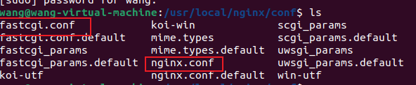

2. **sapwn-fcgi启动**

	```shell
	# 前提条件: 程序猿的fastCGI程序已经编写完毕 -> 可执行文件 login
	spawn-fcgi -a IP地址 -p 端口 -f fastcgi可执行程序
	    - IP地址: 应该和nginx的fastcgi_pass配置项对应
	        - nginx: localhost -> IP: 127.0.0.1
	        - nginx: 127.0.0.1 -> IP: 127.0.0.1
	        - nginx: 192.168.1.100 -> IP: 192.168.1.100
		- 端口:
			- 应该和nginx的fastcgi_pass中的端口一致
	```

3. **FastCGI接口与Web服务器交互**

	* 配置文件目录：`/home/user_wang/FastCGI/fcgi-2.4.1-SNAP-0910052249/examples/echo.c`（找到自己的安装目录）
		* 文件中通过getchar和putchar来获取和发送数据，而getchar和puchar函数看似是操作的终端，其实内部操作的文件描述符直接和niginx进行通信
			* 当Web服务器（如Nginx）接收到一个请求，并且这个请求需要由FastCGI应用处理时，Nginx会根据其配置（如`fastcgi_pass`指令）将请求转发给FastCGI进程管理器
			* FastCGI进程管理器负责维护一个或多个FastCGI应用程序进程的池。当Web服务器转发请求时，管理器会选择一个空闲的FastCGI应用程序进程来处理这个请求。
			* FastCGI应用程序（如你的`echo.c`示例）通过标准输入（stdin）和标准输出（stdout）与Web服务器进行通信。尽管这些操作在应用程序中可能看起来像是文件I/O操作（如使用`getchar`和`putchar`），但实际上它们是通过FastCGI协议与Web服务器交互的（**重定向**）。
				* **`getchar`和`putchar`函数的输入输出已经被重定向，在底层涉及到文件描述符的操作**
	
			* 当FastCGI应用程序处理完请求后，它会将结果写入标准输出。Web服务器会从FastCGI应用程序的标准输出中读取响应数据，并将其发送回客户端（如浏览器）。
	
	
	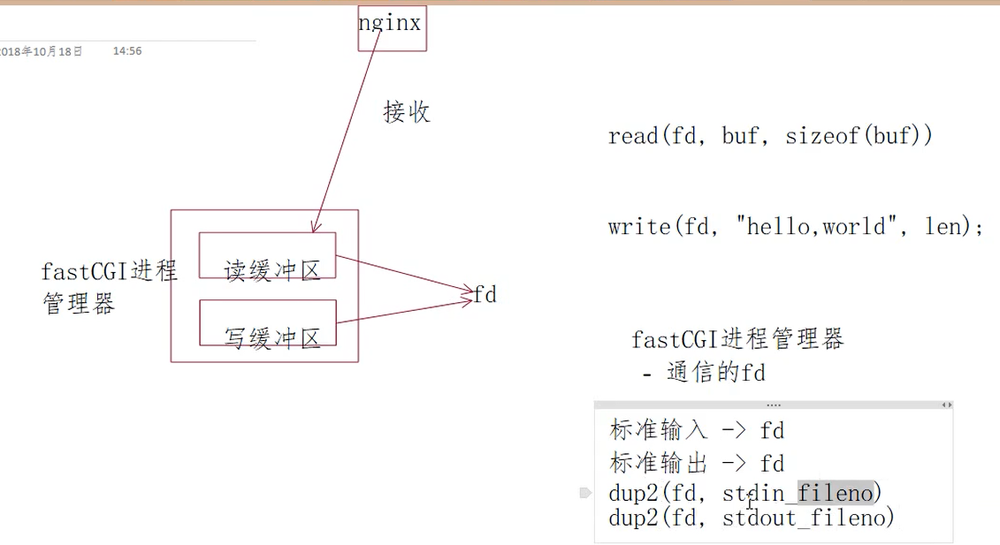
	
	* FastCGI程序编写流程
		* 包含头文件：fcgi_stdio.h/fcgi_config.h/unistd.h
		* 循环处理
			* 如果nginx没有发送请求--》阻塞
			* 如果nginx有发送请求--->解除阻塞
				* 1 接收数据
					* 1.1 用户按照get方式提交数据
						* 数据在请求行的第二段（url）--->获取数据：`QUERY_STRING`宏
	
					* 1.2 用户按照post方式提交数据
						* 先获取数据长度:`CONTENT_LENGTH`宏，根据数据长度判断是否循环处理（太长了一次只能取一小段）
	
				* 2 按照业务流程处理请求
				* 3 将数据结果发送给nginx
	
	
	```c
	http://localhost/login?user=zhang3&passwd=123456&age=12&sex=man
	// home/wang/user_wang/FastCGI/fcgi-2.4.1-SNAP-0910052249/examples/echo.c
	// 要包含的头文件
	#include "fcgi_config.h"	// 可选
	#include "fcgi_stdio.h"   // 必须的, 编译的时候找不到这个头文件, 先find找到path , 然后gcc -I -path
	
	// 编写代码的流程
	int main ()
	{
		// FCGI_Accept()是一个阻塞函数, nginx给fastcgi程序发送数据的时候解除阻塞
	    while (FCGI_Accept() >= 0) {
	        // 1. 接收数据
			// 1.1 get方式提交数据 - 数据在请求行的第二部分
			// user=zhang3&passwd=123456&age=12&sex=man
	        char *text = getenv("QUERY_STRING");
	        // 1.2 post方式提交数据：http采用post方式提交数据时才会有content-length，get方法没有content-length
	        char *contentLength = getenv("CONTENT_LENGTH");  //getenv:LINUX函数，用来获取环境变量
	        int len;
	        // 根据长度大小判断是否需要循环
	        // 2. 按照业务流程进行处理
	        // 3. 将处理结果发送给nginx
	        // 数据回发的时候, 需要告诉nginx处理结果的格式 - 假设是html格式
			printf("Content-type: text/html\r\n");
			printf("<html>处理结果</html>");
	
	        if (contentLength != NULL) {
	            len = strtol(contentLength, NULL, 10);	//转换contentLength（格式必须为字符串）为10进制
	        }
	        else {
	            len = 0;
	        }
	
	        if (len <= 0) {
		    printf("No data from standard input.<p>\n");
	        }
	        else {
	            int i, ch;
	
		    printf("Standard input:<br>\n<pre>\n");
	            // fread(buf,stdin)
	            for (i = 0; i < len; i++) {
	                if ((ch = getchar()) < 0) {  	// 接收数据：getchar从函数上看操作的是终端，其实这里已经进行了重定向
	                    printf("Error: Not enough bytes received on standard input<p>\n");
	                    break;
					}
	                putchar(ch);					// 发送数据
	            }
	        }
	    } /* while */
	    return 0;
	}
	```
	

fastCGI环境变量 - fastcgi.conf：

| 环境变量           | 说明                                           |
| ------------------ | ---------------------------------------------- |
| SCRIPT_FILENAME    | 脚本文件请求的路径                             |
| **QUERY_STRING**   | 请求的参数;如?app=123                          |
| **REQUEST_METHOD** | 请求的动作(GET,POST)                           |
| **CONTENT_TYPE**   | 请求头中的Content-Type字段                     |
| **CONTENT_LENGTH** | 请求头中的Content-length字段                   |
| SCRIPT_NAME        | 脚本名称                                       |
| REQUEST_URI        | 请求的地址不带参数                             |
| DOCUMENT_URI       | 与$uri相同                                     |
| DOCUMENT_ROOT      | 网站的根目录。在server配置中root指令中指定的值 |
| SERVER_PROTOCOL    | 请求使用的协议，通常是HTTP/1.0或HTTP/1.1       |
| GATEWAY_INTERFACE  | cgi 版本                                       |
| SERVER_SOFTWARE    | nginx 版本号，可修改、隐藏                     |
| REMOTE_ADDR        | 客户端IP                                       |
| REMOTE_PORT        | 客户端端口                                     |
| SERVER_ADDR        | 服务器IP地址                                   |
| SERVER_PORT        | 服务器端口                                     |
| SERVER_NAME        | 服务器名，域名在server配置中指定的server_name  |

1. 客户端使用Post提交数据常用方式

	> - Http协议规定 POST 提交的数据必须放在消息主体（entity-body）中，但协议并没有规定数据必须使用什么编码方式。
	>
	> - 开发者完全可以自己决定消息主体的格式
	>
	> - 数据发送出去，还要服务端解析成功才有意义, 服务端通常是根据请求头（headers）中的 
	>
	> 	Content-Type 字段来获知请求中的消息主体是用何种方式编码，再对主体进行解析。

	常用的四种方式

	- **application/x-www-form-urlencoded**

		```http
		# 请求行
		POST http://www.example.com HTTP/1.1
		# 请求头
		Content-Type: application/x-www-form-urlencoded;charset=utf-8
		# 空行
		# 请求数据(向服务器提交的数据)
		title=test&user=kevin&passwd=32222
		```

	- **application/json**

		```http
		POST / HTTP/1.1
		Content-Type: application/json;charset=utf-8
		{"title":"test","sub":[1,2,3]}
		```

	- **text/xml**

		```http
		POST / HTTP/1.1
		Content-Type: text/xml
		<?xml version="1.0" encoding="utf8"?>
		<methodcall>
		    <methodname color="red">examples.getStateName</methodname>
		    <params>
		    	<value><i4>41</i4></value>
		    </params>
		</methodcall>
		
		<font color="red">nihao, shijie</font>
		```

	- multipart/form-data

		```http
		POST / HTTP/1.1
		Content-Type: multipart/form-data
		# 发送的数据
		------WebKitFormBoundaryPpL3BfPQ4cHShsBz \r\n
		Content-Disposition: form-data; name="file"; filename="qw.png"
		Content-Type: image/png\r\n; md5="xxxxxxxxxx"
		\r\n
		.............文件内容................
		.............文件内容................
		------WebKitFormBoundaryPpL3BfPQ4cHShsBz--
		Content-Disposition: form-data; name="file"; filename="qw.png"
		Content-Type: image/png\r\n; md5="xxxxxxxxxx"
		\r\n
		.............文件内容................
		.............文件内容................
		------WebKitFormBoundaryPpL3BfPQ4cHShsBz--
		```

2. strtol 函数使用

	```c
	// 将数字类型的字符串 -> 整形数
	long int strtol(const char *nptr, char **endptr, int base);
		- 参数nptr: 要转换的字符串 - 数字类型的字符串: "123", "0x12", "0776"
		- 参数endptr: 测试时候使用, 一般指定为NULL
		- 参数base: 进制的指定
			- 10 , nptr = "123456", 如果是"0x12"就会出错
	        - 8  , nptr = "0345"
	        - 16,  nptr = "0x1ff"
	
	char* p = "123abc";
	char* pt = NULL;
	strtol(p, &pt, 10);
	 - 打印pt的值: "abc"
	```

	

#### 5.6 http协议

1. 请求消息(Request)  - 客户端(浏览器)发送给服务器的数据格式

	> 四部分: 请求行, 请求头, 空行, 请求数据 
	>
	> - 请求行: 说明请求类型, 要访问的资源, 以及使用的http版本
	> - 请求头: 说明服务器要使用的附加信息
	> - 空行: 空行是必须要有的, 即使没有请求数据
	> - 请求数据: 也叫主体, 可以添加任意的其他数据

	- Get方式提交数据

		> 第一行: 请求行
		>
		> 第2-9行:   请求头(键值对)
		>
		> 第10行: 空行
		>
		> get方式提交数据, 没有第四部分, 提交的数据在请求行的第二部分, 提交的数据会全部显示在地址栏中

		```http
		GET /?username=tom&phone=123&email=hello%40qq.com&date=2018-01-01&sex=male&class=3&rule=on HTTP/1.1
		Host: 192.168.26.52:6789
		Connection: keep-alive
		Cache-Control: max-age=0
		Upgrade-Insecure-Requests: 1
		User-Agent: Mozilla/5.0 (Windows NT 10.0; Win64; x64) AppleWebKit/537.36 (KHTML, like Gecko) Chrome/70.0.3538.67 Safari/537.36
		Accept: text/html,application/xhtml+xml,application/xml;q=0.9,image/webp,image/apng,*/*;q=0.8
		Accept-Encoding: gzip, deflate
		Accept-Language: zh,zh-CN;q=0.9,en;q=0.8
		
		```

	- Post方式提交数据

		> 第一行: 请求行
		>
		> 第2 -12行: 请求头 (键值对)
		>
		> 第13行: 空行
		>
		> 第14行: 提交的数据

		```http
		POST / HTTP/1.1
		Host: 192.168.26.52:6789
		Connection: keep-alive
		Content-Length: 84
		Cache-Control: max-age=0
		Upgrade-Insecure-Requests: 1
		Origin: null
		Content-Type: application/x-www-form-urlencoded
		User-Agent: Mozilla/5.0 (Windows NT 10.0; Win64; x64) AppleWebKit/537.36 (KHTML, like Gecko) Chrome/70.0.3538.67 Safari/537.36
		Accept: text/html,application/xhtml+xml,application/xml;q=0.9,image/webp,image/apng,*/*;q=0.8
		Accept-Encoding: gzip, deflate
		Accept-Language: zh,zh-CN;q=0.9,en;q=0.8
		
		username=tom&phone=123&email=hello%40qq.com&date=2018-01-01&sex=male&class=3&rule=on
		```

2. 响应消息(Response) -> 服务器给客户端发送的数据

	> - 四部分: 状态行, 消息报头, 空行, 响应正文
	> 	- 状态行: 包括http协议版本号, 状态码, 状态信息
	> 	- 消息报头: 说明客户端要使用的一些附加信息
	> 	- 空行: 空行是必须要有的
	> 	- 响应正文: 服务器返回给客户端的文本信息
	>
	> 第一行:状态行
	>
	> 第2 -11行: 响应头(消息报头)
	>
	> 第12行: 空行
	>
	> 第13-18行: 服务器给客户端回复的数据

	```http
	HTTP/1.1 200 Ok
	Server: micro_httpd
	Date: Fri, 18 Jul 2014 14:34:26 GMT
	/* 告诉浏览器发送的数据是什么类型 */
	Content-Type: text/plain; charset=iso-8859-1 (必选项)
	/* 发送的数据的长度 */
	Content-Length: 32  
	Location:url
	Content-Language: zh-CN
	Last-Modified: Fri, 18 Jul 2014 08:36:36 GMT
	Connection: close
	
	#include <stdio.h>
	int main(void)
	{
	    printf("hello world!\n");
	    return 0;
	}
	```

3. http状态码

	> 状态代码有三位数字组成，第一个数字定义了响应的类别，共分五种类别:
	>
	> - 1xx：指示信息--表示请求已接收，继续处理
	> - 2xx：成功--表示请求已被成功接收、理解、接受
	> - 3xx：重定向--要完成请求必须进行更进一步的操作
	> - 4xx：客户端错误--请求有语法错误或请求无法实现
	> - 5xx：服务器端错误--服务器未能实现合法的请求


#### 5.7 部署

**5.7.1 静态网页部署：**

* 静态网页部署：首先将静态网页全部复制进：`usr/local/nginx/`中，和html同级

	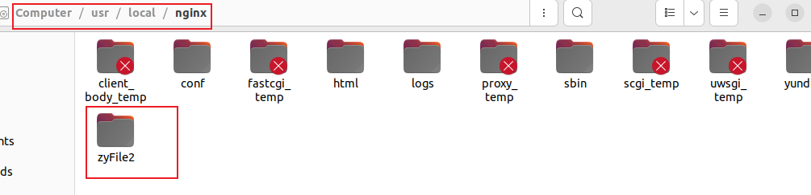

	zyFile2中包含以下静态文件：

	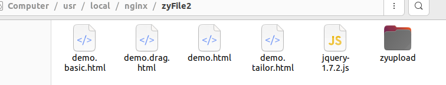

* 更改配置文件：`usr/local/nginx/conf/nginx.conf`

	```nginx
	loaction / {
		root zyFile2;
		index index.html;
	}
	```

* 访问`192.168.166.130/demo.html`（我的虚拟机地址/要访问的静态网页）

	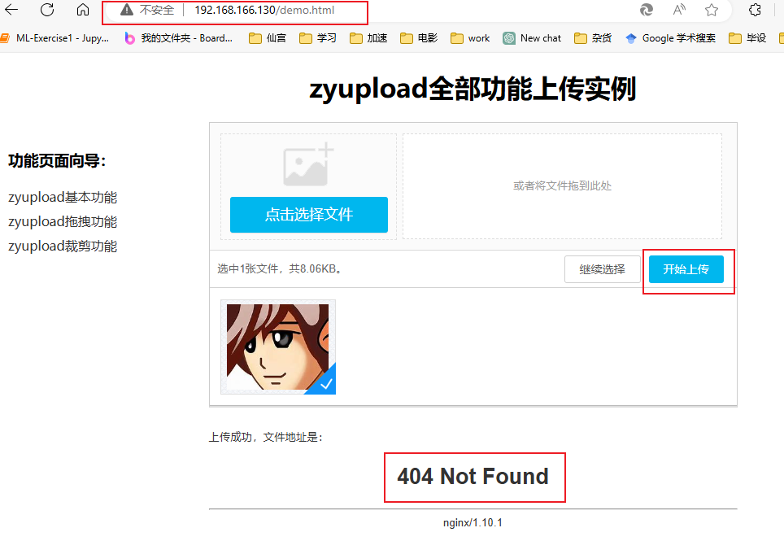

* 当点击上传后会出现上传失败404
	* 此时打开` /usr/local/nginx/logs/error.log`错误日志
	* 能看到，此时采用的POST提交方式，

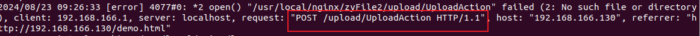

* 打开访问的demo.html：其中`/upload/UploadAction`对应上传目录，`HTTP 1.1`对用http版本

```html
<script type="text/javascript">
			$(function(){
				// 初始化插件
				$("#zyupload").zyUpload({
					width            :   "650px",                 // 宽度
					height           :   "400px",                 // 宽度
					itemWidth        :   "140px",                 // 文件项的宽度
					itemHeight       :   "115px",                 // 文件项的高度
					url              :   "/upload/UploadAction",  // 上传文件的路径
					fileType         :   ["jpg","png","txt","js","exe"],// 上传文件的类型
					fileSize         :   51200000,                // 上传文件的大小
					multiple         :   true,                    // 是否可以多个文件上传
					dragDrop         :   true,                    // 是否可以拖动上传文件
					tailor           :   true,                    // 是否可以裁剪图片
					del              :   true,                    // 是否可以删除文件
					finishDel        :   false,  				  // 是否在上传文件完成后删除预览
```

* 如果嫌弃/upload/UploadAction太长，也可以修改，但是同时也得修改nginx.conf

	```nginx
	#demo.html：修改上传路径
	url              :   "/Myupload/",  #上传文件的路径
	
	#nginx.conf：添加该路径转发
	location /Myupload{ 
		fastcgi_pass 127.0.0.1:10000;
	    include fastcgi.conf;
	}
	
	#不修改上传路径的话在nginx.conf添加：
	        location /upload/UploadAction/
	        {
	                fastcgi_pass 127.0.0.1:10000;
	                include fastcgi.conf;
	        }
	添加完成后重启nginx
	```

**5.7.2 开始编译**

网页部署完毕，且nginx.conf对应事件(location)添加完成即可开始编译部署

编译所需动态文件：

```nginx
find ./ -name "lib*.so"
	./libfcgi/.libs/libfcgi++.so
	./libfcgi/.libs/libfc
```

1. 首先将`home/wang/user_wang/FastCGI/fcgi-2.4.1-SNAP-0910052249/examples/echo.c`生成可执行文件

```shell
sudo chmod -R 777 fcgi-2.4.1-SNAP-0910052249
gcc echo.c -o app -lfcgi
ldd app   # 查看可执行文件运行所需要的动态库
```

如果ldd报错找不到：

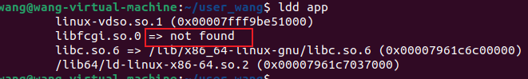

```shell
# 寻找libfcgi.so
sudo find / -name "libfcgi.so"
	- /usr/local/lib/libfcgi.so
# 启动时链接libfcgi.so
sudo vi /etc/ld.so.conf   		
# 将 /usr/local/lib 路径复制进如这个文件
sudo ldconfig 	# 复制完成后执行该命令
```

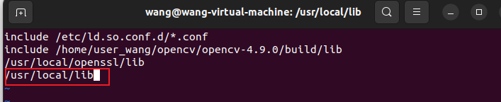

执行完以上命令，再次查看`ldd app`

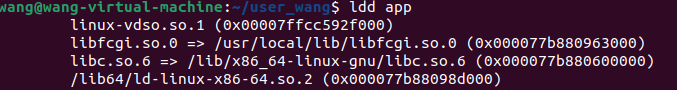

2. 利用进程管理器spawn-fcgi启动app

	```shell
	spawn-fcgi -a 127.0.0.1 -p 10000 -f ./app		
	```

	启动成功会显示子进程PID：

	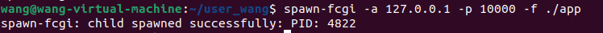

此时重新上传便会有返回值（一系列环境变量），不在报错404，此时部署成功。但是还没有正经的上传逻辑

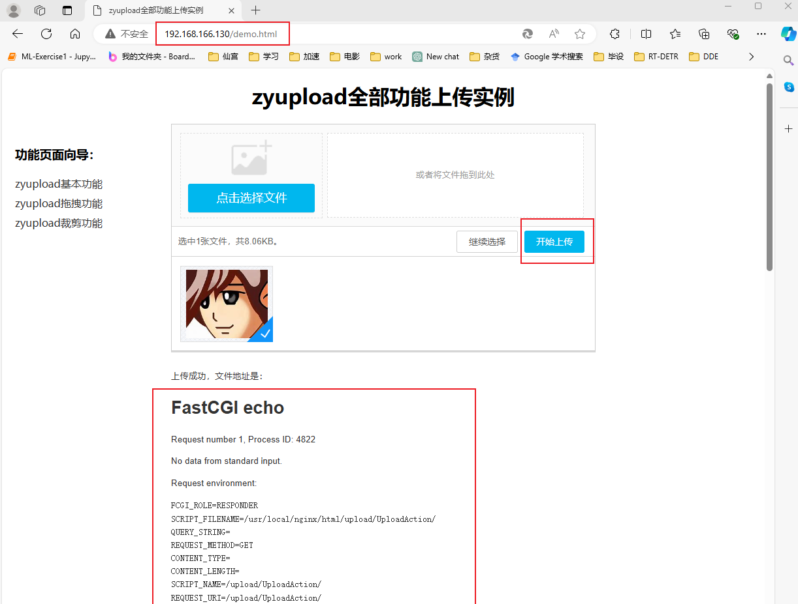

而对于下面的返回值，get提交方法和post提交方法的返回值也略有不同。

#### 5.8 复习

1. fastCGI

	1. 是什么?

		- 运行在服务器端的代码, 帮助服务器处理客户端提交的动态请求

	2. 干什么

		- 帮助服务器处理客户端提交的动态请求

	3. 怎么用?

		- nginx如何转发数据

			```nginx
			# 分析出客户端请求对应的指令 -- /test
			location /test
			{
			    # 转发出去
			    fastcgi_pass 地址:端口;
			    include fastcgi.conf;
			}
			```

		- fastcgi如何接收数据

			```shell
			# 启动, 通过spawn-fcgi启动
			spawn-fcgi -a IP -p port -f ./fcgi
			# 编写fastCGI程序的时候
			 - 接收数据: 调用读终端的函数就是接收数据
			 - 发送数据: 调用写终端的函数就是发送数据
			```

		- fastcgi如何处理数据

			```c
			// 编写登录的fastCgI程序
			int main()
			{
			    while(FCGI_Accept() >= 0)
			    {
			        // 1. 接收登录信息 -> 环境变量中
			        // post -> 读数据块的长度 CONTENT-LENGTH
			        // get -> 从请求行的第二部分读 QUEERY_STRING
			        // 2. 处理数据
			        // 3. 回发结果 -> 格式假设是json
			        printf("Content-type: application/json");
			        printf("{\"status\":\"OK\"}")
			    }
			}
			```


### 6 Nginx+FastDFS

#### 6.1 文件上传下载流程

* **上传：**
	* 客户端首先上传文件
	* nginx服务器会将文件发送给本地fastcgi程序
	* fastcgi会循环读文件，每循环读一次数据，会将读到的数据写入磁盘
		* 后端的分布式文件系统（fastDFS）包含追踪器、存储节点，对于分布式文件系统，此时的客户端是fastcgi
	* fastcgi通过获取分布式文件系统的磁盘信息，将本地磁盘的数据上传到fastDFS的存储节点
		* fastcgi首先向tracker发起连接请求，tracker查询可用节点（storage），有可用节点将查询结果（节点IP/post）返回给fastcgi，fastcgi得到结果开始上传
		* 上传完毕后节点会生成文件ID，并在保存进本地磁盘后将FileID返回给fastcgi
		* fastcgi链接数据库将FileID和数据存入数据库
	* 存入数据库后，删除nginx服务器本地磁盘的文件数据


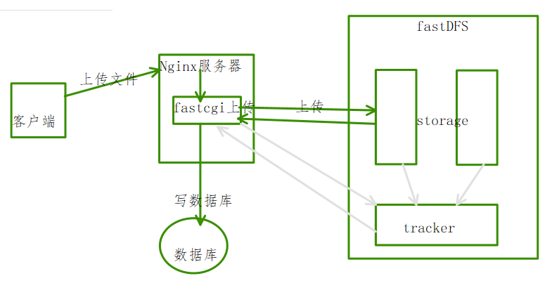

**下载：**

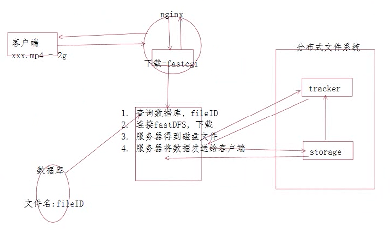

**优化**：

下载优化思路:

* 直接让客户端连接fastDFS的存储节点, 实现文件下载
	* 举例, 访问一个url直接下载:<http://192.168.247.147/group1/M00/00/00/wKj3k1tMBKuARhwBAAvea_OGt2M471.jpg> 


1. 客户端发送请求使用的协议: http
	* fastDFS能不能解析http协议
2. 客户端怎么知道文件就存储在对应的那个存储节点上?
	* 上传的时候将fileID和存储节点IP地址都存储在数据库，那么通过fileID便可以知道存储节点的IP地址
	* 上传的动作是nginx服务器的fastcgi程序做的，所以其有fileID，因此客户端只需要链接nginx服务器让其调用fastcgi来查询数据库即可，最终将存储节点的IP地址返回给客户端
3. 客户端得到存储节点的IP地址，重新发起连接
	* fastDFS存储节点并不能解析http请求，只有nginx可以，因此**需要在nginx安装fastDFS插件**，这样nginx就可以和fastDFS进行通信


#### 6.2 nginx&fastDFS整合

##### **6.2.1 安装fastdfs-nginx-module_v1.16**

1. 在存储节点上安装Nginx，将软件安装包拷贝到fastDFS存储节点对应的主机上

```shell
# 1. 找fastDFS的存储节点
# 2. 在存储节点对应的主机上安装Nginx, 安装的时候需要一并将插件装上
#	- (余庆提供插件的代码   +   nginx的源代码 ) * 交叉编译 = Nginx  
```

2. 在存储节点对应的主机上安装Nginx, 作为web服务器

```shell
- fastdfs-nginx-module_v1.16.tar.gz 解压缩
# 1. 进入nginx的源码安装目录(自己下载源码解压安装的地方不是usr/local下面的)
cd /home/wang/user_wang/Nginx/nginx/nginx-1.10.1
# 2. 检测环境, 生成makefile
# ./configure --add-module=fastdfs插件的源码目录/src
./configure --add-module=/home/wang/user_wang/nginx_fastdfs/fastdfs-nginx-module_v1.16/fastdfs-nginx-module/src
# 同时还得安装依赖
./configure --add-module=/home/wang/user_wang/nginx_fastdfs/fastdfs-nginx-module_v1.16/fastdfs-nginx-module/src --with-openssl=/home/wang/user_wang/Nginx/openssl/openssl-1.0.1t --with-pcre=/home/wang/user_wang/Nginx/prce/pcre-8.35/pcre-8.35 --with-zlib=/home/wang/user_wang/Nginx/Zlib/zlib-1.2.11
make
sudo make install
```

make过程中的错误:

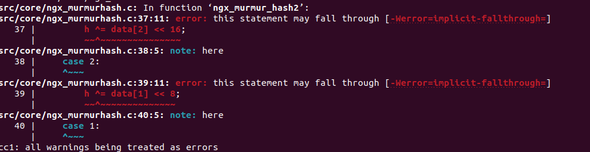

```shell
# 解决方案
# 寻找fdfs_define.h
find / -name "fdfs_define.h"
	- /usr/include/fastdfs/fdfs_define.h  # 寻找到的路径
find / -name "common_define.h"	
	- /usr/include/fastcommon/common_define.h
# 打开此路径下得Makefile文件
vi objs/Makefile
如下图加入两个文件的搜索路径，并将CFLAGS中的-Werror去掉
```

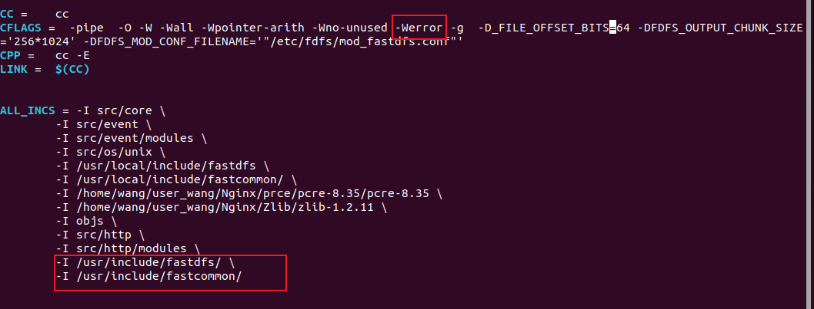

安装成功, 启动Nginx, 发现没有 worker进程

```shell
robin@OS:/usr/local/nginx/sbin$ ps aux|grep nginx
root      65111  0.0  0.0  39200   696 ?Ss   10:32   0:00 nginx: master process ./nginx
robin     65114  0.0  0.0  16272   928 pts/9  S+   10:32   0:00 grep --color=auto nginx
```

解决方案：

* 将`fastdfs-nginx-module_v1.16`下src中的mod_fastdfs.conf拷贝到 etc/fdfs

```shell
sudo cp mod_fastdfs.conf /etc/fdfs
```

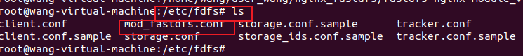

* 修改mod_fdfs.conf文件, 参考当前存储节点的storage.conf进行修改


   ```shell
# 存储log日志的目录
base_path=/home/wang/user_wang/FastDFS/DFS/storage
# 连接tracker地址信息
tracker_server=192.168.166.130:22122
# 存储节点绑定的端口
storage_server_port=23000
# 当前存储节点所属的组
group_name=group1
# 客户端下载文件的时候, 这个下载的url中是否包含组的名字（这里即group1） true就包含，fales不出现
// 上传的fileID: group1/M00/00/00/wKj3h1vJRPeAA9KEAAAIZMjR0rI076.cpp
// 完整的url: http://192.168.166.130/group1/M00/00/00/wKj3h1vJRPeAA9KEAAAIZMjR0rI076.cpp
url_have_group_name = true
# 存储节点上存储路径的个数
store_path_count=1
# 存储路径的详细信息
store_path0=/home/wang/user_wang/FastDFS/DFS/storage
   ```

4. 重写启动Nginx, 还是没有worker进程, 查看log错误日志

	```shell
	# ERROR - file: ini_file_reader.c, line: 631, include file "http.conf" not exists, line: "#include http.conf"
	从 /etc/fdfs 下找的时候不存在
		- 从fastDFS源码安装目录找/conf    # /home/wang/user_wang/FastDFS/fastdfs-5.10/conf
		- sudo cp http.conf /etc/fdfs
	# ERROR - file: shared_func.c, line: 968, file /etc/fdfs/mime.types not exist
		- 从nginx的源码安装包中找/conf    # /home/wang/user_wang/Nginx/nginx/nginx-1.10.1/conf/mime.types
		- sudo cp mime.types /etc/fdfs
	```

	经过以上步骤配置完毕，重启nginx：

	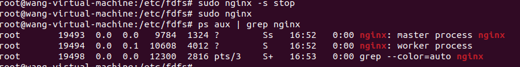

	

5. 通过浏览器请求服务器下载文件: 404 Not Found

	```http
	http://192.168.166.130/group1/M00/00/00/wKimgmX6_SeEYTmfAAAAAAAAAAA372.txt
	# 错误信息
	open() "/usr/local/nginx/zyFile2/group1/M00/00/00/wKj3h1vJSOqAM6RHAAvqH_kipG8229.jpg" failed (2: No such file or directory), client: 192.168.247.1, server: localhost, request: "GET /group1/M00/00/00/wKj3h1vJSOqAM6RHAAvqH_kipG8229.jpg HTTP/1.1", host: "192.168.247.135"
	服务器在查找资源时候, 找的位置不对, 需要给服务器指定一个正确的位置, 如何指定?
		- 资源在哪? 在存储节点的存储目录中 store_path0
		- 如何告诉服务器资源在这? 在服务器端添加location处理
	locatioin /group1/M00/00/00/wKj3h1vJSOqAM6RHAAvqH_kipG8229.jpg
	location /group1/M00/00/00/
	location /group1/M00/
	location /group1/M00/
	{
		# 告诉服务器资源的位置
		root /home/wang/user_wang/FastDFS/DFS/storage/data;
		ngx_fastdfs_module;
	}	
	```

配置成功之后重新启动：

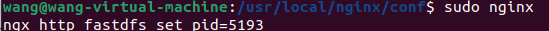

访问结果：“nihao”是.txt文件的内容，浏览器支持打开图像和特定类型的文件

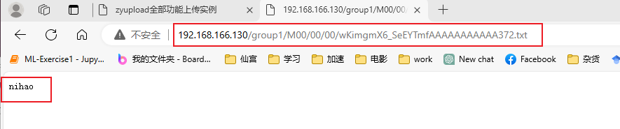


### 7. MYSQL

#### 7.1 安装mysql

在Ubuntu虚拟机上安装MySQL的步骤相对直接，以下是详细的安装步骤和说明：

**一、更新软件包列表**

首先，确保你的Ubuntu虚拟机上的软件包列表是最新的。这可以通过运行以下命令来完成：

```bash
sudo apt-get update
```

**二、安装MySQL Server**

使用`apt-get`命令安装MySQL Server。这个命令会自动处理依赖关系并下载必要的软件包。

```bash
sudo apt-get install mysql-server
```

在安装过程中，系统会提示你设置root用户的密码。请确保设置一个强密码以保护你的数据库。

**三、验证安装**

安装完成后，你可以通过运行以下命令来检查MySQL服务是否正在运行：

```bash
sudo systemctl status mysql
```

或者，对于较旧的Ubuntu版本，你可能需要使用以下命令：

```bash
sudo service mysql status
```

如果MySQL服务正在运行，你将看到表示服务正在运行的消息。

**四、安全设置**

为了增强MySQL服务器的安全性，建议运行`mysql_secure_installation`脚本。这个脚本会帮助你执行一些安全相关的任务，如设置root密码、删除匿名用户、禁止root远程登录等。

```bash
sudo mysql_secure_installation
```

按照脚本的提示进行操作。如果你不确定某个选项，通常选择默认选项（通常是“Y”或“是”）是安全的。

**五、远程访问配置**

如果你需要从其他计算机远程访问MySQL服务器，你需要确保MySQL服务器配置为监听所有接口（不仅仅是localhost）。这通常涉及到修改MySQL的配置文件（如`/etc/mysql/mysql.conf.d/mysqld.cnf`），并找到`bind-address`行，将其值从`127.0.0.1`更改为`0.0.0.0`。

```bash
sudo nano /etc/mysql/mysql.conf.d/mysqld.cnf
```

找到类似下面的行并修改它：

```ini
bind-address = 0.0.0.0
```

修改后，保存文件并重启MySQL服务以使更改生效：

```bash
sudo systemctl restart mysql
```

或者，对于较旧的Ubuntu版本：

```bash
sudo service mysql restart
```

**六、配置用户权限**

默认情况下，MySQL的root用户可能只能从localhost访问。如果你需要允许root用户从任何主机访问，你可以登录到MySQL并使用以下SQL命令更新用户权限：

```sql
USE mysql;  
UPDATE user SET Host='%' WHERE User='root';  
FLUSH PRIVILEGES;
```

但是，出于安全考虑，通常建议创建一个新的用户并授予适当的权限，而不是使用root用户进行远程连接。

**七、测试连接**

最后，你可以尝试从另一台计算机使用MySQL客户端工具（如MySQL Workbench、Navicat或命令行客户端）连接到你的MySQL服务器，以验证一切是否按预期工作。

在Ubuntu系统上配置MySQL密码的步骤相对直接，以下是一般的配置过程：

1. **登录MySQL**

	使用以下命令登录到MySQL服务器（可能需要输入当前root用户的密码，如果之前未设置则直接回车）：

	```bash
	sudo mysql -u root -p
	```

	如果之前设置了密码，输入后按回车即可登录；如果没有设置密码，则直接按回车。

2. **修改密码**

	登录后，使用以下SQL命令来更改root用户的密码：

	```sql
	ALTER USER 'root'@'localhost' IDENTIFIED WITH mysql_native_password BY '新密码';
	```

	请将`'新密码'`替换为你想要设置的新密码。注意，根据你的MySQL版本和配置，这条命令的具体形式可能有所不同。在某些版本中，可能需要使用`FLUSH PRIVILEGES;`来刷新权限，但在较新版本的MySQL中，使用`ALTER USER`命令后通常不需要再执行此操作。

	如果提示密码策略不满足要求（如密码长度不足），你可以通过执行以下命令来查看当前的密码策略：

	```sql
	SHOW VARIABLES LIKE 'validate_password%';
	```

	然后，根据策略要求调整你的密码，并重新执行上述的`ALTER USER`命令。

3. **退出MySQL**

	密码修改完成后，使用以下命令退出MySQL：

	```sql
	exit;
	```


#### 7.2 数据库操作

1. 创建一个名称为cloud_disk的数据库 

	```mysql
	CREATE DATABASE cloud_disk;
	```

2. 删除数据库cloud_disk 

	```mysql
	drop database cloud_disk;
	```

3. 使用数据库 cloud_disk 

	```mysql
	use cloud_disk;
	```

#### 7.3 数据库建表

1. 用户信息表  --  user

	| 字段       | 解释                     |
	| ---------- | ------------------------ |
	| id         | 用户序号，自动递增，主键 |
	| name       | 用户名字                 |
	| nickname   | 用户昵称                 |
	| phone      | 手机号码                 |
	| email      | 邮箱                     |
	| password   | 密码                     |
	| createtime | 时间                     |

	```mysql
	CREATE TABLE user (
	    id BIGINT NOT NULL PRIMARY KEY AUTO_INCREMENT,
	    name VARCHAR (128) NOT NULL,
	    nickname VARCHAR (128) NOT NULL,
	    password VARCHAR (128) NOT NULL,
	    phone VARCHAR (15) NOT NULL,
	    createtime VARCHAR (128),
	    email VARCHAR (100),
	    CONSTRAINT uq_nickname UNIQUE (nickname),
	    CONSTRAINT uq_name UNIQUE (NAME)
	);
	```

2. 文件信息表  - user_file_list

	| 字段     | 解释                                                         |
	| -------- | :----------------------------------------------------------- |
	| md5      | 文件md5, 识别文件的唯一表示(身份证号)                        |
	| file_id  | 文件id-/group1/M00/00/00/xxx.png                             |
	| url      | 文件url 192.168.1.2:80/group1/M00/00/00/xxx.png - 下载的时候使用 |
	| size     | 文件大小, 以字节为单位                                       |
	| type     | 文件类型： png, zip, mp4……                                   |
	| fileName | 文件名                                                       |
	| count    | 文件引用计数， 默认为1    每增加一个用户拥有此文件，此计数器+1 |

	```mysql
	CREATE TABLE user_file_list (
	    user VARCHAR (128) NOT NULL,
	    md5 VARCHAR (200) NOT NULL,
	    createtime VARCHAR (128),
	    filename VARCHAR (128),
	    shared_status INT,
	    pv INT
	);
	```

3. 用户文件列表  -  user_file_list 

	| 字段          | 解释                               |
	| ------------- | ---------------------------------- |
	| user          | 文件所属用户                       |
	| md5           | 文件md5                            |
	| createtime    | 文件创建时间                       |
	| filename      | 文件名字                           |
	| shared_status | 共享状态, 0为没有共享， 1为共享    |
	| pv            | 文件下载量，默认值为0，下载一次加1 |

	```mysql
	CREATE TABLE user_file_list (
	    user VARCHAR (128) NOT NULL,
	    md5 VARCHAR (200) NOT NULL,
	    createtime VARCHAR (128),
	    filename VARCHAR (128),
	    shared_status INT,
	    pv INT
	);
	```

4. 用户文件数量表  -  user_file_count 

	| 字段  | 解释           |
	| ----- | -------------- |
	| user  | 文件所属用户   |
	| count | 拥有文件的数量 |

	```mysql
	CREATE TABLE user_file_count (
	    user VARCHAR (128) NOT NULL PRIMARY KEY,
	    count INT
	);
	```

5. 共享文件列表  -  share_file_list 

	| 字段       | 解释                               |
	| ---------- | ---------------------------------- |
	| user       | 文件所属用户                       |
	| md5        | 文件md5                            |
	| createtime | 文件共享时间                       |
	| filename   | 文件名字                           |
	| pv         | 文件下载量，默认值为1，下载一次加1 |

	```mysql
	CREATE TABLE share_file_list (
	    user VARCHAR (128) NOT NULL,
	    md5 VARCHAR (200) NOT NULL,
	    createtime VARCHAR (128),
	    filename VARCHAR (128),
	    pv INT
	);
	```


### 8.服务端代码部署

#### 8.1 cloud_disk部署

```shell
cd cloud_disk
```

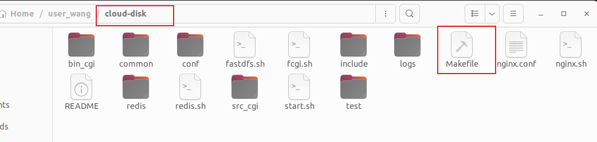

```shell
make clean
mkae 
make install
```

在make时会报错：

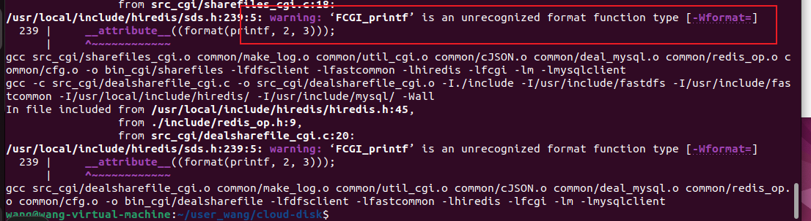

节点ip配置：

* 打开conf下的cfj.json

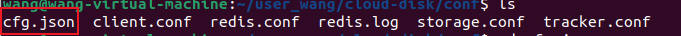

* 将服务器ip和分布式节点ip进行更改配置

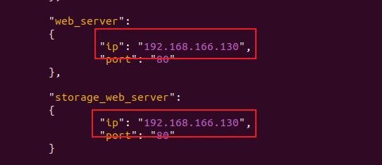

* 对于cfg.json文件的解析是通过编写API尽心解析的：

	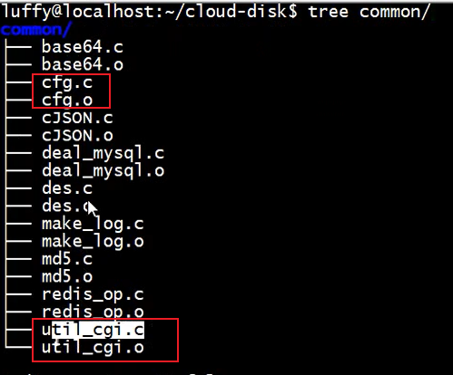

* 对于每一个登录的模块功能都可以开发为一个cgi，最终编译为可执行文件。其中.sh文件都是指令执行的脚本

* 在该目录下还有配置好的nginx.conf文件，同样配置其相关路径：

	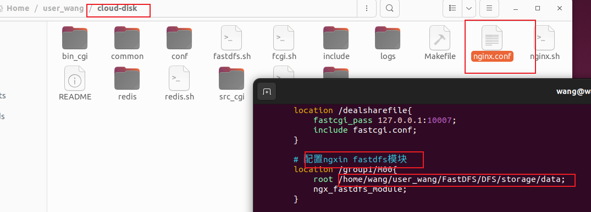

* 而nginx.conf中转发的ip和端口在fcgi.sh中也已经对应好了（文件要发给nginx，nginx转发给fcgi，fcgi需要绑定对应的ip/port和进程）：

	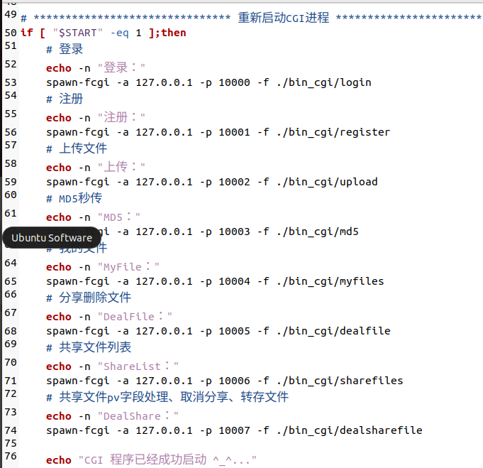


### 9. 登录和注册协议

#### 9.1 注册协议

1. 客户端

	```http
	# URL
	http://192.168.1.100:80/reg
	# post数据格式
	{
		userName:xxxx,
	    nickName:xxx,
	    firstPwd:xxx,
	    phone:xxx,
	    email:xxx
	}
	```

2. 服务器端 - Nginx

	- 服务器端的配置

		```nginx
		location /reg
		{
		    # 转发数据
		    fastcgi_pass localhost:10000;
		    include fastcgi.conf;
		}
		```

	- 编写fastcgi程序

		```c
		int main()
		{
		    while(FCGI_Accept() >= 0)
		    {
		        // 1. 根据content-length得到post数据块的长度
		        // 2. 根据长度将post数据块读到内存
		        // 3. 解析json对象, 得到用户名, 密码, 昵称, 邮箱, 手机号
		        // 4. 连接数据库 - mysql, oracle
		        // 5. 查询, 看有没有用户名, 昵称冲突 -> {"code":"003"}
		        // 6. 有冲突 - 注册失败, 通知客户端
		        // 7. 没有冲突 - 用户数据插入到数据库中
		        // 8. 成功-> 通知客户端 -> {"code":"002"}
		        // 9. 通知客户端回传的字符串的格式
		        printf("content-type: application/json\r\n");
		        printf("{\"code\":\"002\"}");
		    }
		}
		```

	- 服务器回复的数据格式:

		| 成功         | {"code":"002"} |
		| ------------ | -------------- |
		| 该用户已存在 | {"code":"003"} |
		| 失败         | {"code":"004"} |

#### 9.2 登录协议

1. 客户端

	```http
	#URL
	http://127.0.0.1:80/login
	# post数据格式
	{
	    user:xxxx,
	    pwd:xxx
	}
	```

2. 服务器端

	- Nginx服务器配置

		```nginx
		location /login
		{
		    # 转发数据
		    fastcgi_pass localhost:10001;
		    include fastcgi.conf;
		}
		```

	- 服务器回复数据格式

		```json
		// 成功
		{
		    "code": "000",
		    "token": "xxx"
		}
		// 失败
		{
		    "code": "001",
		    "token": "faild"
		}
		```

#### 9.3 单例模式

1. 单例模式的优点: 

	- 在内存中只有一个对象, 节省内存空间 
	- 避免频繁的创建销毁对象,可以提高性能 
	- 避免对共享资源的多重占用 
	- 可以全局访问 

2. 单例模式的适用场景: 

	- 需要频繁实例化然后销毁的对象 

	- 创建对象耗时过多或者耗资源过多,但又经常用到的对象 

		```c++
		struct More
		{
		    int number;
		    ...(100)
		}
		```

	- 有状态的工具类对象 

	- 频繁访问数据库或文件的对象 

	- 要求只有一个对象的场景  

3. 如何保证单例对象只有一个?

	```c
	// 在类外部不允许进行new操作
	class Test
	{
	public:
		// 1. 默认构造
		// 2. 默认析构
		// 3. 默认的拷贝构造
	}
	// 1. 构造函数私有化
	// 2. 拷贝构造私有化
	```

4. 单例模式实现方式?

	- 懒汉模式 - 单例对象在使用的时候被创建出来, 线程安全问题需要考虑

		```c++
		class Test
		{
		public:
			static Test* getInstance()
			{
				if(m_test == NULL)
		        {
		     		m_test = new Test();       
		        }
		        return m_test;
			}
		private:
			Test();
			Test(const Test& t);
			// 静态变量使用之前必须初始化
			static Test* m_test;
		}
		Test* Test::m_test = NULL;	// 初始化
		```

	- 饿汉模式 - 单例对象在使用之前被创建出来

		```c++
		class Test
		{
		public:
			static Test* getInstance()
			{
				return m_test;
			}
		private:
			Test();
			Test(const Test& t);
			// 静态变量使用之前必须初始化
			static Test* m_test;
		}
		Test* Test::m_test = new Test();	// 初始化
		```


1. QRegExp类

	```c++
	QRegExp::QRegExp();
	QRegExp::QRegExp(const QString &pattern, Qt::CaseSensitivity cs = Qt::CaseSensitive, PatternSyntax syntax = RegExp)
	    - pattern: 正则表达式, 该对象继续数据校验的规则
	bool QRegExp::exactMatch(const QString &str) const
	    - str: 被校验的字符串
	    - 返回值: 匹配成功: true, 失败:false
	// 重新给正则对象指定匹配规则
	void QRegExp::setPattern(const QString &pattern)
	    - pattern: 正则表达式
	```

	

2. QSS参考资料

	- <https://blog.csdn.net/liang19890820/article/details/51691212

3. 通过样式函数给控件设置样式

	```c++
	void setStyleSheet(const QString &styleSheet)
		- 参数styleSheet: 样式字符串, css格式
		- 在QT中参照帮助文档也可以
	```

	

4. sourceInsight

	

	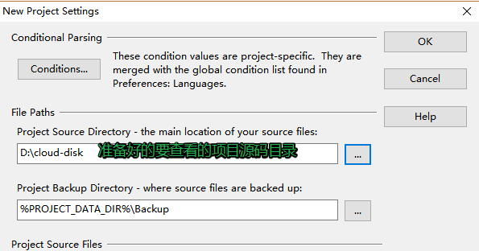

	

	


```c
// 刷新窗口
// 什么时候被回调?
// 1. 窗口第一次现实的时候
// 2. 窗口被覆盖, 又重新显示
// 3. 最大化, 最小化
// 4. 手动重绘 - > 调用一个api : [slot] void QWidget::update()
// 函数内部写的绘图动作 -> QPainter
[virtual protected] void QWidget::paintEvent(QPaintEvent *event);
	- QPainter(QPaintDevice *device) -> 参数应该this

// 这个点是窗口左上角坐标
void move(int x, int y);
void move(const QPoint &);

```

Qt中使用正则表达式进行数据校验:

```c++
// 使用的类: QRegExp
// 1. 构造对象
QRegExp::QRegExp();
QRegExp::QRegExp(const QString &pattern, Qt::CaseSensitivity cs = Qt::CaseSensitive, PatternSyntax syntax = RegExp);
	- pattern: 正则表达式
// 2. 如何使用正则对象进行数据校验
bool QRegExp::exactMatch(const QString &str) const;
	- 参数str: 要校验的字符串
	- 返回值: 匹配成功: true, 失败: false
// 3. 给正则对象指定匹配规则或者更换匹配规则
void QRegExp::setPattern(const QString &pattern);
	- 参数pattern: 新的正则表达式
```

Qt中处理json

```c++
// QJsonDocument
// 1. 将字符串-> json对象/数组; 2. json对象,数组 -> 格式化为字符串
// QJsonObject -> 处理json对象的   {}
// QJsonArray  -> 处理json数组		[]
// QJsonValue  -> 包装数据的, 字符串, 布尔, 整形, 浮点型, json对象, json数组
```

1. 内存中的json数据 -> 写磁盘

	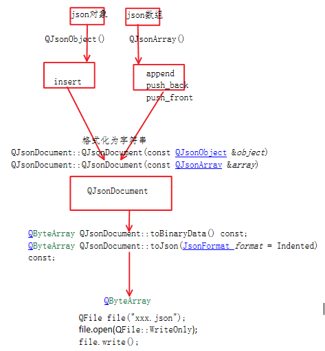

2. 磁盘中的json字符串 -> 内存

	


### 10. QT开发

#### 10.1 登录界面：

##### 10.1.1 窗口移动

**功能需求：**

主要功能和目前主流移动功能类似，点击拖动页面/界面的上面可以移动窗口，但是点击拖动其他窗口位置没反应

如图即：鼠标点击并拖动窗口上半部分时才会移动：

实现一个自定义的标题栏（`MyTitleBar`），用于控制一个父窗口（登录窗口）的移动

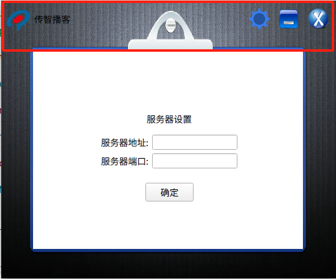

**处理流程：**通过处理鼠标事件来实现

1. 要有两个窗口
	* 一个父窗口Login
	* 一个子窗口，主要操作子窗口MyTitleBar
2. 定义自己的窗口类MyTitleBar
	* 需要有一个继承自`QWidget`或`QMainWindow`的类。在这个类中，重写一些鼠标事件处理函数。
3. 重写鼠标事件处理函数
	* 需要重写`mousePressEvent`、`mouseMoveEvent`和`mouseReleaseEvent`这三个函数
	* 在`mousePressEvent`中，检查鼠标按下时是否在窗口的可拖动区域（例如顶部），并记录下当前的位置。
	  * 记录鼠标按下时**鼠标光标相对于父窗口左上角的偏移量(坐标)**。让后续在鼠标移动时能够计算出窗口应该移动到的位置。
	    * 通过将鼠标的全局位置减去窗口的左上角位置来获得的
	* 在`mouseMoveEvent`中，如果检测到鼠标拖拽动作（即鼠标按钮仍被按下），则更新窗口的位置。
	  * 鼠标相对于窗口原始位置的偏移，因此在移动鼠标时，窗口会按照预期的方式跟随鼠标移动。
3. 鼠标拖动窗口移动, 左上角坐标求解方法:
	* 在鼠标按下还没有移动的时候求差值

		* 差值 = 鼠标当前位置 - 屏幕左上角的点
	* 鼠标移动过程中

		* 屏幕左上角的点 = 鼠标当前位置 - 差值


mytitlebar.h

```c++
#ifndef MYTITLEBAR_H
#define MYTITLEBAR_H

#include <QWidget>

namespace Ui {
class MyTitleBar;
}

class MyTitleBar : public QWidget
{
    Q_OBJECT

public:
    explicit MyTitleBar(QWidget *parent = 0);
    ~MyTitleBar();

    void setMyParent(QWidget* parent);

signals:
    void showSetWindow();		// 展示界面
    void showMinWindow();		// 缩小界面
    void closeMyWindow();		// 关闭界面

protected:
    // 鼠标移动 -> 让窗口跟随鼠标懂
    void mouseMoveEvent(QMouseEvent *event);
    // 鼠标按下 -> 求相对距离
    void mousePressEvent(QMouseEvent *event);

private:
    Ui::MyTitleBar *ui;
    QWidget* m_parent = NULL;
    QPoint m_pt;
};

#endif // MYTITLEBAR_H

```

mytitlebar.cpp

```c++
#include "mytitlebar.h"
#include "ui_mytitlebar.h"
#include <QMouseEvent>

MyTitleBar::MyTitleBar(QWidget *parent) :
    QWidget(parent),
    ui(new Ui::MyTitleBar)
{
    ui->setupUi(this);
    // m_parent = parent;

    connect(ui->setBtn, &QToolButton::clicked, this, [=]()
    {
        emit showSetWindow();
    });
    connect(ui->minBtn, &QToolButton::clicked, this, [=]()
    {
        emit showMinWindow();
    });
    connect(ui->closeBtn, &QToolButton::clicked, this, [=]()
    {
        emit closeMyWindow();
    });
    // 设置logo
    ui->logo->setPixmap(QPixmap(":/images/logo.ico").scaled(40, 40));
}

MyTitleBar::~MyTitleBar()
{
    delete ui;
}

void MyTitleBar::setMyParent(QWidget *parent)
{
    m_parent = parent;
}

void MyTitleBar::mouseMoveEvent(QMouseEvent *event)
{
    // 鼠标移动到了什么位置? -> 通过参数globalPos();
    // 得到位置之后 -> 让窗口跟随鼠标移动 -> move();
    // 移动的应该是外部的login窗口
    // event->globalPos()鼠标移动到了屏幕的什么位置, 要求的是窗口左上角的点
    // 左上角的位置 = 当前鼠标位置 - 相对位置;
    // 判断持续状态, 鼠标左键
    if(event->buttons() & Qt::LeftButton)   //鼠标左键被按下
    {
         m_parent->move(event->globalPos() - m_pt);   //鼠标当前位置-位置的差值
    }
}

void MyTitleBar::mousePressEvent(QMouseEvent *event)
{
    // 如果是鼠标左键, 瞬间状态
    if(event->button() == Qt::LeftButton)
    {
        // 相对位置 = 当前鼠标位置 - 左上角的位置;
        m_pt = event->globalPos() - m_parent->geometry().topLeft();  //m_parent->pos()
    }
}
```


* **`globalPos() - m_pt`**
	* **`event->globalPos()`**：这个函数返回的是鼠标在屏幕上的全局坐标。当你移动鼠标时，这个坐标会实时更新，表示鼠标当前在屏幕上的位置。
	* **`m_pt`**：这个变量是在鼠标按下时（通常是在 `mousePressEvent` 方法中）计算并保存的。它记录了鼠标按下时，鼠标的全局坐标与窗口左上角的全局坐标之间的差值（即相对位置）。这个**差值在拖动过程中是不变的**，因为它只与鼠标按下时的状态有关。
	* **`globalPos() - m_pt`**：这个表达式计算的是当前鼠标的全局坐标与鼠标按下时窗口左上角的全局坐标之间的新差值。换句话说，它给出了如果窗口保持鼠标按下时的相对位置不变，现在应该将窗口的左上角移动到屏幕上的哪个位置。
	* **`move(...)`**：`move` 方法是 `QWidget` 类的一个成员函数，用于移动窗口到指定的屏幕位置。
* 总结来说，`globalPos() - m_pt` 计算的是当前鼠标位置与窗口应该跟随移动到的目标位置之间的差值(左上角的新坐标)，而 `move` 方法则根据这个差值来更新窗口的位置。


##### 10.1.2 标题栏动作

```c++
signals:
    void showSetWindow();		// 展示界面
    void showMinWindow();		// 缩小界面
    void closeMyWindow();		// 关闭界面
    
connect(ui->setBtn, &QToolButton::clicked, this, [=]()   //发送信号-标题栏
    {
        emit showSetWindow();
    });
connect(ui->minBtn, &QToolButton::clicked, this, [=]()
    {
        emit showMinWindow();
    });
connect(ui->closeBtn, &QToolButton::clicked, this, [=]()
    {
        emit closeMyWindow();
    });

    
```

login.h

```c++
#ifndef LOGIN_H
#define LOGIN_H

#include <QDialog>

namespace Ui {
class Login;
}

class Login : public QDialog
{
    Q_OBJECT

public:
    explicit Login(QWidget *parent = 0);
    ~Login();
protected:
    void paintEvent(QPaintEvent *event);

private slots:

    void on_regAccount_clicked();

    void on_regButton_clicked();
    
private:
    Ui::Login *ui;
};

#endif // LOGIN_H

```

login.cpp

```c++
#include "login.h"
#include "ui_login.h"
#include <QPainter>
#include <QRegExp>
#include <QMessageBox>
#include <QNetworkAccessManager>
#include <QNetworkRequest>
#include <QNetworkReply>
#include <QJsonObject>
#include <QJsonDocument>
#include <QJsonArray>

Login::Login(QWidget *parent) :
    QDialog(parent),
    ui(new Ui::Login)
{
    ui->setupUi(this);
    // 去边框
    this->setWindowFlags(Qt::FramelessWindowHint | windowFlags());

    // 给titbar对象设置父亲
    ui->myToolBar->setMyParent(this);

    // 处理接受的titlebar的信号
    connect(ui->myToolBar, &MyTitleBar::showSetWindow, [=]()
    {
        ui->stackedWidget->setCurrentWidget(ui->setPage);
    });
    connect(ui->myToolBar, &MyTitleBar::showMinWindow, [=]()
    {
        // 窗口最小化
        this->showMinimized();
    });
    connect(ui->myToolBar, &MyTitleBar::closeMyWindow, [=]()
    {
        if(ui->stackedWidget->currentWidget() == ui->setPage)
        {
            ui->stackedWidget->setCurrentIndex(0);  // 登录窗口
            // 清空控件中的用户数据
        }
        else if(ui->stackedWidget->currentWidget() == ui->regPage)
        {
            ui->stackedWidget->setCurrentIndex(0);  // 登录窗口
            // 清空控件中的用户数据
        }
        else
        {
            this->close();
        }
    });
}

Login::~Login()
{
    delete ui;
}

void Login::paintEvent(QPaintEvent *event)
{
    // 画背景图的操作
    QPainter p(this);   // 绘图设备为当前窗口
    p.drawPixmap(0, 0, this->width(), this->height(), QPixmap(":/images/login_bk.jpg"));
}

void Login::on_regAccount_clicked()
{
    ui->stackedWidget->setCurrentIndex(1);
}


void Login::on_regButton_clicked()
{
    // 处理的动作
    // 1. 从控件中取出用户输入的数据
    QString userName = ui->reg_userName->text();
    QString nickName = ui->reg_NickName->text();
    QString passwd = ui->reg_passwd->text();
    QString confirmPwd = ui->reg_confirmPwd->text();
    QString email = ui->reg_mail->text();
    QString phone = ui->reg_phone->text();
    // 2. 数据校验
    QRegExp regexp;
    // 校验用户名,密码
    QString USER_REG   = "^[a-zA-Z0-9_@#-\\*]\\{3,16\\}$";
    regexp.setPattern(USER_REG);
    bool bl = regexp.exactMatch(userName);
    if(bl == false)
    {
        QMessageBox::warning(this, "ERROR", "用户名格式不正确!");
        return;
    }
    // regexp.setPattern();
    // 3. 用户信息发送给服务器
    //  - 如何发送: 使用http协议发送, 使用post方式
    //  - 数据格式: json对象
    QNetworkAccessManager* pManager = new QNetworkAccessManager(this);
    QNetworkRequest request;
    QString url = QString("http://%1:%2/reg").arg(ui->lineEdit_9->text()).arg(ui->lineEdit_10->text());
    request.setUrl(url);
    request.setHeader(QNetworkRequest::ContentTypeHeader, "application/json");    // 描述post数据的格式
    // 将用户提交的数据拼接成功json对象字符串
    /*
        {
            userName:xxxx,
            nickName:xxx,
            firstPwd:xxx,
            phone:xxx,
            email:xxx
        }
    */
    QJsonObject obj;
    // insert(const QString &key, const QJsonValue &value)
    obj.insert("userName", userName); // QJsonValue(userName)
    obj.insert("nickName", nickName);
    obj.insert("firstPwd", passwd);
    obj.insert("phone", phone);
    obj.insert("email", email);
    // obj -> doc
    QJsonDocument doc(obj);
    // doc -> qbytearray
    QByteArray json = doc.toJson();
    QNetworkReply* reply = pManager->post(request, json);
    // 4. 接收服务器发送的响应数据
    connect(reply, &QNetworkReply::readyRead, this, [=](){
        // 5. 对服务器响应进行分析处理, 成功or失败
        // 5.1 接收数据 {"code":"003"}
        QByteArray all = reply->readAll();
        // 5.2 需要知道服务器往回发送的字符串的格式 -> 解析
        // qbytearray -> doc
        QJsonDocument doc = QJsonDocument::fromJson(all);
        // doc -> obj
        QJsonObject myobj = doc.object();
        QString status = myobj.value("code").toString();
        // 5.3 判读成功, 失败, 给用户提示
        if("002" == status)
        {
            // 成功
        }
        else if("003" == status)
        {
            // 用户已经存在
        }
        else
        {
            // 失败
        }
    });

}
```


#### 10.2 用户注册：

**功能需求：**通过用户注册的信息进行数据检验，并进行存储

##### 10.2.1 QT程序开发

* 数据检验：对于用户名、密码、等都需要**正则表达式**进行数据检验

```c++
#include<QRegExp>
//2.1构造对象
QRegExp::QRegExp();												//数据检验类
QRegExp::QRegExp(const QString &-pattern, Qt::CaseSensitivity cs = Qt::CaseSensitive,
                     QRegExp::PatternSyntax syntax = RegExp)	//构造函数
        -pattern：正则表达式
//2.2使用正则表达式进行数据检验
bool QRegExp::exactMatch(const QString &str) const				//校验函数
    -str:要检验的字符串
    -返回值：匹配成功：true，匹配失败：false
//3.给正则对象指定匹配规则或者更换匹配规则（用户名、密码等匹配时正则表达式都不同）
void QRegExp::setPattern(const QString &pattern)
     -pattern:新的正则表达式
```

* QT中处理json

```c++
// QJsonDocument
// 1. 将字符串-> json对象/数组; 2. json对象,数组 -> 格式化为字符串
// QJsonObject -> 处理json对象的 {}
// QJsonArray -> 处理json数组 []
// QJsonValue -> 包装数据的, 字符串, 布尔, 整形, 浮点型, json对象, json数组
```

1.内存中的json数据 -> 写磁盘

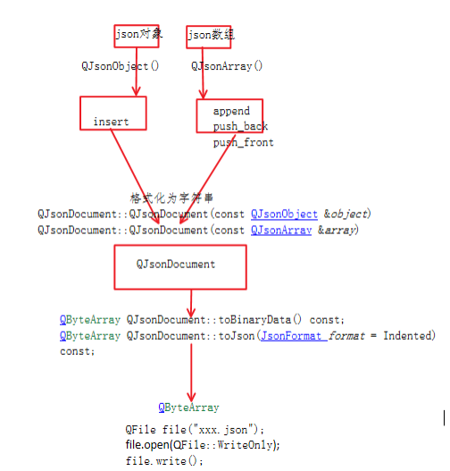


2.磁盘中的json字符串 -> 内存

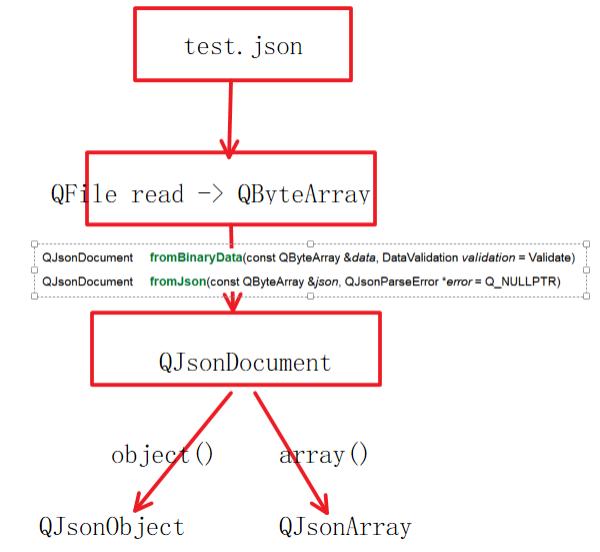


**注册代码：**

```c++
void login::login_button(){
	//1.从控件中取出用户输入的数据
    QString userName = ui->reg_userName->text();
    QString nickName = ui->reg_nickName->text();
    QString passwd 	 = ui->reg_passwd->text();
    QString confirmpd= ui->reg_confirmpd->text();
    QString email	 = ui->reg_email->text();
    QString phone	 = ui->reg_phone->text();
    //2.数据校验：使用正则表达式
	QRegExp regexp;
    //检验用户名
    QString USER_REG = "^[a-zA-Z0-9_@#-\\*]\\{3,16\\}$";  	//正则表达式
    regexp.setPattern(USER_REG);							//匹配规则
    bool bl = repexp.exactMatch(userName);
    if(bl = false){
        QMessageBox::warning(this,"ERROR","用户名格式不正确");
        return;
    }
    //其他的检验类似
    
    
    //3.用户信息发送给服务器
    	-->使用http协议进行发送（post）
        -->数据格式：json格式（json对象或者数组）
    #include<QNetworkAccessManager>
    #include<QNetworkRequest>
    #include<QNetworkReply>
    #include<QJsonDocument>
    //创建对象        
	QNetworkAccessManager * pManager = new QNetworkAccessManager(this);	
    //request对象
    QNetworkRequest request;
    QString url = QString("http://%1:%2//reg").arg(ui->ip->text()).arg(ui->port->text());
    request.setUrl(url);		//设置http协议格式
    //描述post数据块的格式:json格式
    request.setHeader(QNetworkRequest::ContentTypeHeader,"application/json");
    //将用户提交的数据拼接为josn对象字符串
    /*# post数据格式
    {
        userName :xxxx，
        nickName :xxx,
        firstPwd :xxx,
        phone :xxx,
        email:xxx
    }*/
	QJsonExp obj;//json存放的键值对
    obj.insert("userName"，userName);
    obj.insert("nickName"，nickName);
    obj.insert("firstPwd"，firstPwd;
    obj.insert("phone"，phone);
    obj.insert("email"，email);
    //obj->doc
    JsonDocument doc(obj);
   	//obj->qbytearrayy
    QByteArray json = doc.toJson();
	QNetworkReply* reply =pManager->post(request,json);
    
    //采用post方法发送
    QNetworkRequest * reply = pManager->post(request,data);		

    
    //4.接收服务器发送的响应数据
    connect(reply,&QNetworkReply::readyRead,this,[=](){
        //5.对服务器响应进行分析处理，成功or失败
        //5.1 接收数据
        QByteArray all = reply->readAll();
        //5.2 需要知道服务器往回发送的字符串的格式 ->解析
        //qbytearray ->doc
        QJsonDocument doc =QsonDocument::fromJson(all);
        // doc -> obj
        QJsonobject objl= doc.object();
        myobj.value("code");
        //5.3 判读成功，失败，给用户提示
    })   
}
```


##### 10.2.2 nginx配置

**客户端**：

对于客户端来说，当http协议固定好后，请求的URL格式如下：

```nginx
# URL
http://192.168.1.100:80/reg# 
# post数据格式
{
    userName :xxxx，
    nickName :xxx,
    firstPwd :xxx,
    phone :xxx,
    email:xxx
}
```


**服务端-Nginx**

* 转发配置：对于URL解析后的动作进行处理

```nginx
location /reg
{
	#转发数据
	fastcgi_pass localhost:10000;
	include fastcgi.conf;
}
```

* 编写fastcgi程序：除了nginx的配置还需要配套的cgi程序进行处理

```c++
int main()
{
	while(FCGI_Accept >= 0)
	{
		//1.根据content-length得到post的数据长度
		//2.根据长度将post数据块读到内存
		//3.解析json对象，得到用户名，密码等
		//4.连接数据库-mysql
		//5.查询，看有没有用户名，昵称冲突-->{"code":"003"}
		//6.有冲突，注册失败
		//7.没有冲突-用户数据插入到数据库中
		//8.成功-> 通知客户端-->{"code":"002"}
        printf("content-type:application/json\r\n");
        printf("{\"code\":\"002\"}")
	}
}
```

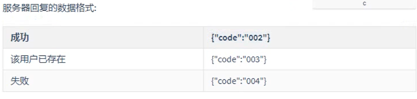


### 11.项目总结

##1. Location语法

1. 语法规则

	```nginx
	location [=|~|~*|^~] /uri/ 
	{ 
	    … 
	}
	正则表达式中的特殊字符:
	- . () {} [] * + ?
	```

2. Location优先级说明

	- 在nginx的location和配置中location的顺序没有太大关系。
	- 与location表达式的类型有关。
	- **相同类型的表达式，字符串长的会优先匹配**。

3. location表达式类型

	- ~ 表示执行一个正则匹配，区分大小写

	- ~* 表示执行一个正则匹配，不区分大小写
	- ^~  表示普通字符匹配。使用前缀匹配。如果匹配成功，则不再匹配其他location。
	- = 进行普通字符精确匹配。也就是完全匹配。

4. 匹配模式及优先级顺序(高 -> 低):

	| location = /uri                               | =开头表示精确匹配，只有完全匹配上才能生效。   一旦匹配成功，则不再查找其他匹配项。 |
	| --------------------------------------------- | ------------------------------------------------------------ |
	| location ^~ /uri                              | ^~ 开头对URL路径进行前缀匹配，并且在正则之前。   一旦匹配成功，则不再查找其他匹配项。   需要考虑先后顺序, 如:       <http://localhost/helloworld/test/a.html> |
	| location   ~   pattern   location  ~* pattern | ~  开头表示区分大小写的正则匹配。   ~*开头表示不区分大小写的正则匹配。 |
	| location /uri                                 | 不带任何修饰符，也表示前缀匹配，但是在正则匹配之后。         |
	| location   /                                  | 通用匹配，任何未匹配到其它location的请求都会匹配到，相当于switch中的default。 |

	```nginx
	客户端: http://localhost/helloworld/test/a.html
	客户端: http://localhost/helloworld/test/
	/helloworld/test/a.html
	/helloworld/test/
	
	location /
	{
	}
	location /helloworld/
	{
	}
	location /helloworld/test/
	{
	}
	
	
	location =/helloworld/test/
	{
	    root xxx;
	}
	
	
	http://localhost/helloworld/test/a.html
	location ^~ /helloworld/test/
	{
	}
	
	
	location ^~ /login/
	{
	}
	http://localhost/helloworld/test/a.JPG
	location ~* \.[jpg|png]
	{
	}
	
	http://192.168.1.100/login/hello/world/login.html
	/login/hello/world/login.html
	location /
	{
	}
	location /login/
	{
	}
	location /login/hello/
	{
	}
	location /login/hello/world/
	{
	}
	location ~ /group[1-9]/M0[0-9]
	{
	}
	```

	

#### 11.1 项目总结

1. 客户端
	- Qt
		- 了解了Qt中http通信
2. nginx反向代理服务器
	- 为web服务器服务
	- web服务器需要集群
3. web服务器 - nginx
	- 处理静态请求 - > 访问服务器文件
	- 动态请求 -> 客户端给服务器提交的数据
		- 借助fastCGI进行处理
			- 讲的是单线程处理方式 - API
			- 也可以多线程处理 -> 另外的API
			- 使用spawn-fcgi启动
4. mysql
	- 关系型数据库 - 服务器端
	- 存储什么?
		- 项目中所有用到的数据
5. redis
	- 非关系型数据库 - 服务器端使用
	- 数据默认在内存, 不需要sql语句, 不需要数据库表
	- 键值对存储, 操作数据使用的是命令
	- 和关系型数据库配合使用
	- 存储服务器端经常访问的数据
6. fastDFS
	- 分布式文件系统
	- 追踪器, 存储节点, 客户端
	- 存储节点的集群
		- 横向扩容 -> 增加容量
			- 添加新组, 将新主机放到该组中
		- 纵向扩容 -> 备份
			- 将主机放到已经存在的组中
		- 存储用户上传的所有的文件
		- 给用户提供下载服务器

#### 11.2 项目提炼

1. 做的是文件服务器
	- 电商网站
	- 旅游网站
	- 租房
	- 装修公司
	- 医院
	- 短视频网站
2. 需要什么?
	- 首先需要的是fastDFS
		- 配置环境
		- 扩容
	- 操作fastDFS - 客户端
		- web
		- 桌面终端 - Qt
	- 数据库操作
		- mysql
		- oralce
	- 有一个web服务器 - Nginx
		- 静态资源部署
		- 动态请求 - 编写fastCGI程序
			- 注册
			- 登录
			- 上传
			- 下载
			- 秒传
			- 文件列表的获取
	- redis
		- 存储服务器访问比较频繁的数据

#### 11.3 存储节点反向代理

```nginx
上图的反向代理服务器代理的是每个存储节点上部署的Nginx
	- 每个存储节点上的Nginx的职责: 解析用户的http请求, 帮助用户快速下载文件
客户端上传了一个文件, 被存储到了fastDFS上, 得到一个文件ID
	/group1/M00/00/00/wKgfbViy2Z2AJ-FTAaM3Asg3Z0782.mp4"
因为存储节点有若干个, 所有下载的时候不知道对应的存储节点的访问地址
给存储节点上的nginx web服务器添加反向代理服务器之后, 下载的访问地址: 
	- 只需要知道nginx反向代理服务器的地址就可以了: 192.168.31.109
	- 访问的url: 
	   http://192.168.31.109/group1/M00/00/00/wKgfbViy2Z2AJ-FTAaM3Asg3Z0782.mp4
客户端的请求发送给了nginx反向代理服务器
	- 反向代理服务器不处理请求, 只转发, 转发给存储节点上的nginx服务器
反向代理服务器的配置 - nginx.conf
	- 找出处理指令: 去掉协议, iP/域名, 末尾文件名, ?和后边的字符串
		- /group1/M00/00/00/ - 完整的处理指令 
	- 添加location
server{
	location  /group1/M00 
    {
		# 数据转发, 设置转发地址
    	proxy_pass http://test.com;
    }
	location  /group2/M00 
    {
		# 数据转发, 设置转发地址
    	proxy_pass http://test1.com;
    }
}
upstream test.com
{
    # fastDFS存储节点的地址, 因为存储节点上安装了nginx, 安装的nginx作为web服务器的角色
    server 192.168.31.100;
    server 192.168.31.101;
    server 192.168.31.102;
}
upstream test1.com
{
    # fastDFS存储节点的地址, 因为存储节点上安装了nginx, 安装的nginx作为web服务器的角色
    server 192.168.32.100;
    server 192.168.33.101;
    server 192.168.34.102;
}
	
# ===================================
存储节点上的web服务器的配置
存储节点1
    location  /group1/M00 
    {
        # 请求处理
    	root 请求的资源的根目录; // 存储节点的store_path0对应的路径+data
    	ngx_fastdfs_module;
    }
    location  /group1/M01 
    {
        # 请求处理
    	root 请求的资源的根目录;
    	ngx_fastdfs_module;
    }
存储节点2
	location  /group2/M00 
    {
        # 请求处理
    	root 请求的资源的根目录;
    	ngx_fastdfs_module;
    }
    location  /group2/M01 
    {
        # 请求处理
    	root 请求的资源的根目录;
    	ngx_fastdfs_module;
    }
存储节点3
	location  /group3/M00 
    {
        # 请求处理
    	root 请求的资源的根目录;
    	ngx_fastdfs_module;
    }
    location  /group3/M01 
    {
        # 请求处理
    	root 请求的资源的根目录;
    	ngx_fastdfs_module;
    }
```

