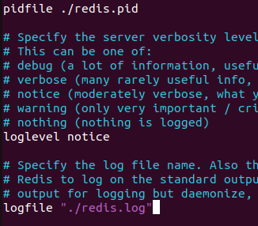

## 分布式文件系统

### 1 FastDFS基本概念

fastDFS是利于C语言实现的一个**分布式文件系统**，它对文件进行管理，功能包括：文件存储、文件同步、文件访问（文件上传、文件下载）等，解决了大容量存储和负载均衡的问题。

#### 1.1.服务器：

​		硬件：一台配置高的计算器

​		软件：电脑必须有一个能解析http协议的软件

#### 1.2.常见的服务器：

1. tomcat服务器	

2. weblogic

3. IIS

4. nginx:

   小巧且高效的HTTP服务器(解析HTTP协议)

   可以做一个高效的负载均衡反向代理

   邮件服务器

​       nginx处理并发可以到w的级别，如果不够用，那可以利用集群。

#### 1.3.客户端

 1. ##### 网络架构

	​	b/s：必须使用http协议

	​	c/s：协议可以随意选择

	​    本项目:Qt+http+nginx+c/s

 2. ##### 服务器

​		Nignx：

​				能处理静态请求-->HTML、jpg能准备好的文件。

​				动态请求无法处理。

​				服务器集群之后，每台服务器上的东西肯定相同。

​		fastCGI：

​				帮助服务器处理动态请求。

4. ##### 反向代理服务器

​		客户端并不能直接访问web服务器，直接访问到的是反向代理服务器。

​		客户端静态请求发送给反向代理服务器，反向代理将客户请求转发给web服务器。

​		原因：当很多用户直接访问web服务器，每一个服务器的ip地址不同，虽然后台做了集群，但**用户的分配是不均匀的**，当一台服务器同时受到很多用户直接访问，其他服务器闲置，那么无法控制客户的请求路径，便在web服务器前面加一个反向代理服务器，通过反向代理服务器来均分用户的请求，来让每台服务器的负载均衡，保证资源平均分配。

5. ##### 关系型数据库

  存储文件属性信息

  用户的属性信息

6. ##### redis-非关系型数据库（内存数据库）

  作用提高程序效率，直接操作内存比操作数据库效率高

  存储的是服务器经常要从关系型数据库中读取的数据

7. ##### FastDFS-分布式文件系统

  存储文件内容

  供用户上传下载

  提供了扩容和备份功能

  提供了文件的上传和下载服务器

8. ##### FastDFS 与 HDFS比较

  说到分布式文件存储，肯定会有人想到HDFS，他们两者主要定位和应用场景是不一样的。

  Hadoop中的文件系统HDFS主要解决**并行计算中分布式存储数据的问题**。其单个数据文件通常很大，采用了分块（切分）存储的方式，所以是大数据大文件存储来使用的场景。
  FastDFS主要用于互联网网站，为文件上传和下载提供在线服务。所以在负载均衡、动态扩容等方面都支持得比较好，FastDFS不会对文件进行分块存储。FastDFS用于存储中小文件都是不错的，比如用户头像啊，一些较小的音视频文件啊等等都行。

#### 1.4.分布式文件系统

​	分布式文件系统将文件存储在不同的主机上，即通过搭建一个网络，将各个主机部署在同一网络中，并设立一个管理者。各主机之间通过IP+PORT进行访问。


> 分布式文件系统：
>
> 1.需要有一个网络
>
> 2.多台主机：不需要再同一个地点
>
> 3.需要管理者
>
> 4.编写应用层的管理程序

#### 1.5.fastDFS

##### 1.5.1.fastDFS特性：

> 冗余备份：纵向扩容->数据备份
>
> 线性扩容：横向扩容->容量扩充
>
> 搭建文件服务器集群，提供文件**上传**和**下载**功能

##### 1.5.2.fastDFS框架中的三个角色：

​	1.追踪器(Tracker)-管理者-守护进程

​			管理存储节点

​			用户不需要和管理者进行交互

​	2.存储节点-storage -守护进程

​			存储节点线性扩展

​			存储文件，并在用户请求时传递文件

​	3.客户端-不是守护进程

​			文件上传和文件下载，用户通过客户端进行操作

##### 1.5.3.三角色之间的关系

上传信息：


下载信息：


###### 1.5.3.1.追踪器

* 追踪器作为管理者，最先启动追踪器

###### 1.5.3.2.存储节点

* 第二个启动的角色

* 启动后，会单独开一个**线程**：

	* 汇报当前存储节点的容量和剩余容量

	* 汇报数据的同步情况

	* 汇报数据被下载的次数

###### 1.5.3.3.客户端

* 最后启动

	* 上传

	  * **首先连接追踪器**，询问存储节点的信息

	  * 我要上传数据时，那个存储节点有足够的容量

	  * 追踪器查询，得到结果

	  * 追踪器将查到的存储节点的IP+端口号发送给客户端
	  * 通过得到IP和端口号连接存储节点
	  * 将文件发给存储节点
	  * 上传成功后会得到一个**文件ID**
	
	* 下载
	
		* 连接追踪器，询问存储节点的信息
			* 问一下，要下载的文件在哪一个存储节点
			* 追踪器查询，得到结果
			* 追踪器将查到的存储节点的IP+端口号发送给客户端
			* 通过得到IP和端口号连接存储节点
			* 下载文件，文件下载需要通过上传时得到的文件ID才能实现下载

###### 1.5.3.4.fastDFS集群

**4.1 追踪者集群**

* 为什么集群
	* 避免单点故障
* 多个Tracker如何工作
	* 轮询工作
* 如何实现集群
	* 修改配置文件
	* 追踪器集群没有横向/纵向扩容之分

**4.2 存储节点集群**

* fastDFS管理存储节点的方式
	* 通过分组的方式完成
* 集群方式
	* 横向扩容-增加容量
		* 添加一台新的主机->容量增加
			* 需要添加新的分组(group)，新的主机属于新的分组，不能是原来的组，一台一个组
	* 纵向扩容
		* 将新的主机放在现有的组中
		* 组内的主机数增加
			* 组内主机的关系就是**相互备份**的关系，每个主机存储的数据相同，
			* 因此**这个组的容量按照最小容量进行定义**
			* 同一组内的主机需要通信，不同的组之间不需要
* 如何实现
	* 修改配置文件

### 2 FastDFS

#### 2.1.安装流程

先安装：libfastcommon

再安装fastdfs


安装完成后分别进行：

```linux
./make.sh
sudo ./make.sh install
```

检验是否安装成功:

```linux
ls /usr/bin/fdfs_*
fdfs_test
```

安装完成：


​		这里其实通过观察可以看到目前并没有在fastDFS的安装目录里面，fastDFS安装的所有的配置文件和可执行程序都在：**/usr/bin**中，但是还是能找到并显示信息。

其实在linux中：

```linux
echo $PATH
```


能看到很多目录，其实linux会在这些目录进行搜索，/usr/bin也在其中，但是如果不在这些目录中便搜索不到。

#### 2.2 . fdstDFS配置文件

**存放目录：/etc/fdfs**

> client.conf.sample  storage.conf.sample  storage_ids.conf.sample  tracker.conf.sample

##### 2.2.1 追踪器配置文件修改

tracker.conf.sample.

2.1.1 首先在同目录下复制该文件

> ```shell
> # sudo cp tracker.conf.sample tracker.conf
> ```

2.1.2 打开该文件并进行修改

> sudo vim tracker.conf

其中：

```shell
1. disabled = false:  
# 表示当前文件是否可用，disabled不可用，false双重否定，即文件可用。
2. bind_addr = 当前主机地址：
# 将追踪器与部署的主机IP地址进程绑定,也可以不指定，会自动绑定当前主机IP
3. port = 22122
# 追踪器监听默认端口号
4. base_path=/home/yuqing/fastdfs
# 追踪器日志信息的默认存放目录，可以更改
```

##### 2.2.2 存储节点配置文件修改

storage.conf.sample.

2.2.1 首先在同目录下复制该文件

> ```shell
> # sudo storage.conf.sample storage.conf
> ```

2.2.2 打开该文件并进行修改

> sudo vim storage.conf

其中：

```shell
1. group_name=group1
# 当前主机是存储节点，表明主机是那个组
2. bind_addr=
# 当前存储节点和所应该的主机进行IP地址的绑定，不写fastDFS会自动绑定
3. port=23000
# 存储节点绑定的端口，由客户端绑定使用
4. base_path=/home/yuqing/fastdfs
# 存储节点写log日志的路径，可更改
5. store_path_count=1
  # storage_path_count = 2
# 作为存储节点提供的存储文件的路径个数
6. store_path0=/home/wang/user_wang/FastDFS/DFS/storage
  # store_path1 = /home/wang/user_wang/FastDFS/DFS/storage1
# 当存储节点为1个时，对应的存储路径
7. tracker_server=192.168.209.121:22122
   tracker_server=192.168.209.122:22122 
# 追踪器的地址信息，要与之前追踪器的bind_addr相对应
# 这里的多绑定是因为追踪器是轮询的需要都写上
```

存储节点和追踪器进行比较，储存节点类似客户端，追踪器类似服务器。

##### 2.2.3 客户端配置文件修改

storage.conf.sample.

1 首先在同目录下复制该文件

> ```shell
> # sudo client.conf.sample client.conf
> ```

2 打开该文件并进行修改

> sudo vim client.conf

其中：

```shell
1. base_path=/home/yuqing/fastdfs
# 客户端写log日志的目录
# 当前用户对于路径中的文件有读写权限
2. tracker_server=192.168.0.197:22122
# 要连接追踪器的地址，需要与追踪器地址对应
```

##### 2.2.4 分布式的部署


> 1. 首先在客户端安装FastDFS，对于客户端来说只需要更改client.conf
> 2. 追踪器安装FastDFS，对于追踪器来说只需要更改tracker.conf
> 3. 存储节点安装FastDFS，对于存储节点来说只需要更改storage.conf
> 4. 对于只有一台主机时，存储节点和追踪器的地址相同
> 5. 对于不同的主机，必须在一个网络环境中(公网或大型局域网)才能互相访问。
> 6. 实际搭建中，不同的主机IP不同。


##### 2.2.5 fastDFS的启动

1. 第一个启动追踪器 -守护进程

```shell
# 启动程序在 /usr/bin/fdfs_*
# 启动
fdfs_trackerd 追踪器的配置文件（/etc/fdfs/tracker.conf)
# 例：fdfs_tER.CONrackerd /etc/fdfs/tracker.conf
# 当无法启动tracker时：sudo service fdfs_trackerd start
# 关闭
fdfs_trackerd 追踪器的配置文件（/etc/fdfs/tracker.conf) stop
# 重启
fdfs_trackerd 追踪器的配置文件（/etc/fdfs/tracker.conf) restart
```

2. 第二个启动存储节点-守护进程

```shell
# 启动程序在 /usr/bin/fdfs_*
# 启动
fdfs_storaged 追踪器的配置文件（/etc/fdfs/storage.conf)
# 关闭
fdfs_storaged 追踪器的配置文件（/etc/fdfs/storage.conf) stop
# 重启
fdfs_storaged 追踪器的配置文件（/etc/fdfs/storage.conf) restart
```


3. 第三个启动客户端 -普通进程

```shell
# 上传
fdfs_upload_file 客户端的配置文件（/etc/fdfs/client.conf) 要上传的文件
# 例子：fdfs_upload_appender /etc/fdfs/client.conf ~/Desktop/test/test.txt
# 上传后文件会重命名，保证文件名的唯一性，避免冲突
# 下载
fdfs_download_file 客户端的配置文件（/etc/fdfs/client.conf) 上传成功之后得到的字符串
# 字符串即下面的wkimg.....372.txt
# 例子：sudo fdfs_download_file /etc/fdfs/client.conf group1/M00/00/00/wKi.....372.txt
```

上传成功：这里的M00是映射目录不用管，文件保存在/00/00/文件


> * group1
>
> 	* 文件上传到了存储节点的哪一个组
>
> * M00
>
> 	* 和存储节点的配置项有映射（几个存储路径就有几个M）
>
> 		* store_path0=/home/wang/user_wang/FastDFS/DFS/storage/data -->M00
>
> 			store_path1 = /home/wang/user_wang/FastDFS/DFS/storage1/data -->M01
>
> * 00/00
>
> 	* 实际路径

4.FastDFS状态查询

```c++
fdfs_monitor /etc/fdfs/client.conf
```


状态位ACTIVE即正常启动。如果不是active，解决方法如下：

```c++
//从集群中删除
fdfs_monitor /etc/fdfs/client.conf delete group1 10.120.151.114
//在114服务器中，删除数据文件夹
rm -rf /home/wang/user_wang/FastDFS/DFS/storage/data
//重启114结点
fdfs_storaged /etc/fdfs/storaged.conf
```

#####  2.2.6 上传下载代码实现

1.使用多进程方式实现

* exec函数族函数
	* execl
	* execlp
* 先创建父进程
	* 子进程 ->执行execlp("fdfs_upload_file","xx",arg,NULL)，有结果输出，默认输出到终端
		* 不让其写道终端-->重定向dup2(old,new)
			* old-->标准输出
			* new -->管道的写端
			* 文件描述符
			* 数据块读到内存-->子进程
				* 数据最终要给到父进程（进程间通信）
		* pipe(匿名管道)-->处理有血缘关系的进程-->读端写端
			* 在子进程创建之前创建，父子进程同时拥有管道
	* 父进程
		* 读管道-->读入内存
		* 在将内存数据写入数据库


2. 使用fastDFS API实现。

* fastDFS的下载由fdfs_upload_file.c支持，想要下载的API，则需要更改文件。

* 安装目录位于/home/user_wang/FastDFS/Fastdfs-5.10/client/**fdfs_upload_file.c**
* 目标：将文件的main函数改为API

```c
#include <stdio.h>
#include <stdlib.h>
#include <string.h>
#include <string.h>
#include <errno.h>
#include <sys/types.h>
#include <sys/stat.h>
#include <fcntl.h>
#include <wait.h>
#include "fdfs_client.h"
#include "logger.h"

static void usage(char *argv[])
{
	printf("Usage: %s <config_file> <local_filename> " \
		"[storage_ip:port] [store_path_index]\n", argv[0]);
}

int upload_file(const char *conFile,const char *myFile,char * fileID)   //配置文件名称，上传文件名称,文件ID
{
	char *conf_filename;
	char *local_filename;
	char group_name[FDFS_GROUP_NAME_MAX_LEN + 1];
	ConnectionInfo *pTrackerServer;
	int result;
	int store_path_index;
	ConnectionInfo storageServer;

	if ((result=fdfs_client_init(conFile)) != 0)
	{
		return result;
	}

	pTrackerServer = tracker_get_connection();
	if (pTrackerServer == NULL)
	{
		fdfs_client_destroy();
		return errno != 0 ? errno : ECONNREFUSED;
	}

	*group_name = '\0';
	if ((result=tracker_query_storage_store(pTrackerServer, \
	                &storageServer, group_name, &store_path_index)) != 0)
	{
		fdfs_client_destroy();
		fprintf(stderr, "tracker_query_storage fail, " \
			"error no: %d, error info: %s\n", \
			result, STRERROR(result));
		return result;
	}

	result = storage_upload_by_filename1(pTrackerServer, \
			&storageServer, store_path_index, \
			myFile, NULL, \
			NULL, 0, group_name, fileID);
	if (result == 0)
	{
		printf("%s\n",fileID);
	}
	else
	{
		fprintf(stderr, "upload file fail, " \
			"error no: %d, error info: %s\n", \
			result, STRERROR(result));
	}

	tracker_disconnect_server_ex(pTrackerServer, true);
	fdfs_client_destroy();

	return result;
}

//使用多进程方式实现
int upload_file_2(const char *conFile,const char * myFile,char * fileID,int bufsize){
	//1.创建匿名管道
    int fd[2];
    int ret = pipe(fd);
    if(ret == -1){
        peror("pipe error");
        exit(0);
    }
    
    //2.创建子进程
    pid_t pid = fork();
    if(pid == 0){
        //3.标准输出重定向 -->管道写端
        //dup2(old,new);  //将new重定向到old
        dup2(fd[1],STDOUT_FILENO);
        //4.写操作关闭读端
        close(fd[0]);
        //5.执行excelp命令
        excelp("fdfs_upolad_file","xxx",conFile,myFile,NULL);
        perror("execlp error");
        
    }else{
        //6.父进程读管道，关闭写端
        close(fd[1]);
        char buf[1024];
        read(fd[0],fileID,bufsize);
        //7.回收子进程pcb
        wait(NULL);
    }
}
```

调用：


### 3 Redis

非关系型数据库（内存数据库）**一般应用于服务器**

#### 3.1 基本概念

关系型数据库-sql

* 操作数据必须要使用sql
* 数据存储在磁盘
* 存储的数据量大
	* mysql
	* oracle
	* sqlite--文件数据库
	* sql server

**非关系型数据库**-nosql

* 执行不使用sql语句，使用命令行
* 不需要数据库表
	* **数据以键值对的方式存储（key,value），key值必须是字符串**

**redis**：

* 除了非关系型数据库的特性，数据默认存储在内存，还有以下特性：
  * 速度快，效率高，（机械盘的读取速率和固态的读取速率差的很远）
  * 存储的数据量小
  * redis存储访问频率高的数据
  * redis共享内存
  	* 服务器端使用redis
  	* 客户端共享内存
  * redis使用时需要用**接口**使客户端连接redis服务器
  	* hiredis


> RBDMS：关系型数据库
>
> 1. 所有的数据默认存储在关系型数据库中
>
> 2. 客户端访问服务器，有一些数据，服务器需要频繁的查询数据
>
> 	* 服务器首先将数据存关系型数据库读出--->第一次
> 		* 将数据写入带redis中
> 		* redis中修改了数据，也会同步到关系型数据库中，但是也必须通过服务器才能同步，不能直接同步
> 	* 客户端第二次访问服务器
> 		* 服务器从redis中直接读数据
>
> 	

**redis的两个角色：**

* 服务器和客户端

**redis中数据的组织格式**：

* 键值对
	* key：必须是字符串
	* value：可选的
		* **string类型**
			* 字符串
		* **List类型**
			* 集合，存储多个string字符串
		* **Set类型**
			* 集合
				* stl集合
					* 默认是升序的，元素不允许重复
				* redis集合
					* 元素不重复，数据是无序的
		* **SortedSet类型**
			* 排序集合，集合中的每个元素分为两部分
				* [分数，成员]---->[64，"tom"]---->按照分数排序，值越大越靠前
		* **Hash类型**
			* 和map数据组织方式一样：key：value
				* Qt->QHash，Qmap
				* Map---->红黑树
				* hash---->数组---->对查找速度要求很高时用hash，比map快


#### 3.2 安装及使用

**安装**

```shell
sudo apt install lsb-release curl gpg

curl -fsSL https://packages.redis.io/gpg | sudo gpg --dearmor -o /usr/share/keyrings/redis-archive-keyring.gpg

echo "deb [signed-by=/usr/share/keyrings/redis-archive-keyring.gpg] https://packages.redis.io/deb $(lsb_release -cs) main" | sudo tee /etc/apt/sources.list.d/redis.list

sudo apt-get update

sudo apt-get install redis
```

使用：

```shell
# 客户端
redis-cli  # 默认连接本地，绑定6379默认端口的服务器
redis-cli -p 端口号
redis-cli -h IP地址 -p 端口
```

启动：

```shell
# 服务器 -启动
/etc/init.d/redis-server start  # 根据配置文件的设置启动
redis-server ./redis.conf
service redis-server start
service redis-server restart  	# 重启
service redis-server stop  		# 关闭
ping [MSG] 						# 客户端测试命令
```


**使用**

* **string类型**

```sql
key--->string
value --->string  		# string类型

						# 设置一个键值对-->string:string
set hello world  		# key:hello value:world
get hello				# 通过get取value值

mset a1 b1 a2 b2 a3 b3	# 设置多个键值对
keys *         			# 查询有多少个键值
mget a1 a2 a3  			# 查询多个key值对应的value值

append a1 1234567 		# 在key对应的value值后面添加字符串
get a1

strlen a1     			# 获取key值a1对应的value值的字符串长度

#将key值a1对应的数字字符串的值减一
#前提是，a1对应的value值必须时数字字符串
DECR a4
INCR a4       			# 将key值a1对应的数字字符串的值加一
decrby a4 100 			# 将key值a1对应的数字字符串的值减100
incrby a4 100 			# 将key值a1对应的数字字符串的值加100
```


* **List类型**

```sql
key -->string
value -->list
#设置一个键值对，--->string:list

lpush list1 1 2 3 4 5 6			# 将一个或多个value值放到表头,倒序插入
lrange list1 0 -1				# 遍历list1键值中的value值，start为起始位置，stop为结束位置

rpush list2 1 2 3 4 5 6			# 将一个或多个value值放到头部,正序插入，当key不存在时，会创建该列表并插入数据
lrange list2 0 -1

lpop list1						# 删除最左侧元素
rpop list1						# 删除最右侧元素

lindex list2 3					# 取list键值中的某个位置对应的value值，位置从0开始

llen list2						# 取list键值的长度

rpushx list2 7					# 将值value插入到列表key的表尾，key列表必须存在并且是一个列表

lrem key count value			# 根据参数 count 的值,移除列表中与参数 value 相等的元素。
lrem list2 2 2					# count>0:从表头开始向表尾搜索,移除与value相等的元素,数量为count.删除两个2
lrem list2 -2 2					# count<0:从表尾开始向表头搜索,移除与value相等的元素,数量为count的绝对值.删除两个2
lrem list2 0 2					# count=0:移除表中所有与value相等的值。
```


* **SET类型**

```sql
key -->string
value -->set
#设置一个键值对，--->string:set

sadd key member						# 将一个或多个元素加入到集合key当中，已经存在的member元素被忽略（不允许重复）
sadd set1 1 2 3 3 2 1 aa bb cc		

smembers key						# 遍历集合，集合是无序的
smembers set1

sdiff key1 key2						# 求两个集合的差集，A-A∩B，前面减后面，输出前面集合的不同值
sdiff st1 st2						# st1[1,2,3,aa,bb,cc]-st2[7,8,9,aa,bb,cc] = [1,2,3]
sinter key1 key2					# 求两个集合的交集
sunion key1 key2					# 求两个集合的并集，重复的只显示一次

sdiffstore destination				# 将求得到的两个集合的差集，保存在destination这个新集合当中
sdiffstore key3 key1 key2			# 将key1与key2的差集保存在key3中
sinterstore key3 key1 key2			# 将key1与key2的交集保存在key3中
sunionstore key3 key1 key2			# 将key1与key2的并集保存在key3中

spop								#移除一个元素
smove
srem key value						# 删除value值这个元素
```

* **SortedSet类型**

```sql
key--->string
value--->sorted([socre,member],[socre,member])

                            		#添加元素
zadd key member                     #将一个或多个member元素加入到集合key集合中，已经存在的将被忽略
zadd sset 12 tom 34 lisa 78 jreey

zrange key start end				#遍历元素
zrange sset 0 -1					
zrange sset 0 -1 withscores			#通过score排序，默认是升序
zrevrange sset 0 -1 withscores		#返回指定区间的集合，默认为降序

zcount key min max 					#指定分数区间内的元素个数
zcount sset1 10 50

zrank sset tom 						#返回tom的排名
zerm sset tom						#移除有序集 key 中的一个或多个成员,不存在的成员将被忽略
zscore key member 					#返回有序集 key 中,成员 member 的 score 值

```

* **hash类型**

 

```sql
key---string
value--->hash([key,value],[key,value],[key,value]...)

                                        #添加数据
hset key field value					#将一个或多个member元素加入到集合key集合中，已有key被覆盖value，没有会创建新的
hset user username zhangsan
hset user password 123456
hset user name zhang3
hmset user name zhang3 password 123456	#一次性插入
hsetnx key filed value 					#将哈希表 key 中的域 field 的值设置为 value 
										#当且仅当域 field 不存在。若域 field 已经存在,该操作无效。

hget user name 							#获取hash数据
hmget user name password username       #一次性获取
hgetall user 							#返回哈希表 key 中，所有的域和值,

hdel key field 							#删除哈希表key中的一个或多个指定域,不存在的域将被忽略。
hdel user username password

hexisets user username 					#查看哈希表 key 中,给定域 field 是否存在。不存在返回0，存在返回1

hincrby key field increment 			#为哈希表key中的域field的值加上增量increment,increment可以为负数
hkeys key 								#返回哈希表key 中的所有域（键值）。
hvals key								#返回哈希表key 中的所有域值（value值）。
hlen key								#返回哈希表的元素个数。
```


* key相关命令


```sqlite
del keys
del user
```


```sql
exists keys 				#检测key值是否存在
expire key seconds 			#给定 key 设置生存时间,当 key 过期时(生存时间为0),它会被自动删除。
TTL key 					#设置了时间，以秒为单位，返回给定 key 的剩余生存时间(TTL, time to live)。
persist key 				#取消生存时间
```


#### 3.3 redis配置文件

配置文件时给**redis服务器**使用的

* 配置文件位置：
	* 源目录-->etc/redis/redis.conf
	* 复制配置文件进行操作

```shell
#此操作必须在管理员模式下
sudo mkdir myredis
sudo cp /etc/redis/redis.conf /home/user_wang/myredis
```

* 文件配置项

```shell
# redis服务器绑定谁之后，谁就能访问redis服务器
# 将bind注释，即任何电脑可以访问redis服务器
#bind bind 127.0.0.1 -1::0::1
 bind 127.0.0.1  168.199.236.166 ...
#保护模式,如果需要远程客户端访问服务器，该模式要关闭
#proteced-mode yes
proteced-mode no
#绑定的端口号
port 6379
#连接超时,参数为0，即关闭连接超时
timeout 0
#服务器启动之后不是守护进程
#改为deamonize yes
deamonize no
#如果服务器是守护进程，就会生成一个pid文件
# ./ ->redis服务器启动的目录
#pidfile var/run/redis-server.redis
pidfile ./redis.pid
#日志级别 
loglevel notice
#如果服务器是守护进程，才会写日志文件
#logfile /var/log/redis/redis-server.log
logfile "" -> 这是没写
logfile "./redis.log"
#数据库数量，默认为16个数据库
database 16
	-切换数据库：select dbID [dbID --0 ~ 16-1]
```



对于redis来说16[0~15]数据库都是独立的。默认使用的0数据库

```sql
select 1 #切换数据库
key *
selec 0
keys *
```


#### 3.4 redis数据持久化

redis是内存数据库，但是也做了一个**数据从内存到磁盘的数据同步**的持久化，即在磁盘上有一个**持久化文件**，防止停电影响内存数据丢失。

持久化的两种方式：

* rdb方式
	* 默认的持久化方式，默认打开
	* 磁盘的持久化文件xxx.rdb
	* 将内存数据以二进制的方式直接写入磁盘文件
	* rdb文件比较小，恢复的时候时间短效率高
	* 保存数据的方式以用户设定的频率-->容易丢数据
	* 数据同步频率低，数据完整性较低
* aof方式
	* 默认是关闭的
	* 磁盘的持久化文件xxx.aof
	* 直接将生成数据的命令写入磁盘文件
	* 文件比较大，恢复时间长
	* 保存数据的方式以某种频率-->每隔1sec同步一下数据（同步频率比rdb高）
	* 数据完整性高

**配置修改：**


```sql
# rdb同步频率
# 3600 秒（一小时），如果至少执行了 1 次更改
# 300 秒（5 分钟），如果至少执行了 100 次更改
# 60 秒内，如果至少执行了 10000 次更改
save 3600 1 300 100 60 10000
# rdb文件名称
dbfilename dump.rdb
# 生成的持久化文件保存在那个目录下
# dir /var/lib/redis 默认目录
dir ./
# 是不是要打开aof模式，打开改为yes
appendonly no
# aof文件名称
appendfilename "appendonly.aof"
# aof更新频率
appendfsync everysec
```


* aof和rdb写的是不同磁盘文件，**可以同时打开**，也**可以同时关闭**
* 两种模式同时开启时，要进行数据恢复
	* 考虑效率使用rdb
	* 考虑数据的完整性使用aof


#### 3.5 hiredis

**1.下载及安装**

https://github.com/redis/hiredis/releases


```shell
tar -zxf hiredis-1.2.0.tar.gz
cd ./hiredis-0.14.1/
make
make install
```


**2.基本概念**

* 连接数据库

```c
// 连接数据库
redisContext *redisConnect(const char *ip, int port);
redisContext *redisConnectWithTimeout(const char *ip, 
                                      int port, const struct timeval tv);
```

* 执行redis命令函数

```c
// 执行redis命令
void *redisCommand(redisContext *c, const char *format, ...);
// redisCommand 函数实际的返回值类型
typedef struct redisReply {
    /* 命令执行结果的返回类型 */
    int type; 
    /* 存储执行结果返回为整数 */
    long long integer;
    /* str变量的字符串值长度 */
    size_t len;
    /* 存储命令执行结果返回是字符串, 或者错误信息 */
    char *str;
    /* 返回结果是数组, 代表数据的大小 */
    size_t elements;
    /* 存储执行结果返回是数组*/
    struct redisReply **element;
} redisReply;
redisReply a[100];
element[i]->str
```

| 状态表示                 | 含义                                                         |
| ------------------------ | ------------------------------------------------------------ |
| REDIS_REPLY_STRING==1    | 返回值是字符串,字符串储存在redis->str当中,字符串长度为redi   |
| REDIS_REPLY_ARRAY== 2    | 返回值是数组，数组大小存在redis->elements里面，数组值存储在redis->element[i]里面。数组里面存储的是指向redisReply的指针，数组里面的返回值可以通过redis->element[i]->str来访问，数组的结果里全是type==REDIS_REPLY_STRING的redisReply对象指针。 |
| REDIS_REPLY_INTEGER == 3 | 返回整数long long，从integer字段获取值                       |
| REDIS_REPLY_NIL==4       | 返回值为空表示执行结果为空                                   |
| REDIS_REPLY_STATUS ==5   | 返回命令执行的状态，比如set foo bar 返回的状态为OK，存储在str当中 reply->str == "OK" 。 |
| REDIS_REPLY_ERROR ==6    | 命令执行错误,错误信息存放在 reply->str当中。                 |

* 释放资源

```c
// 释放资源
void freeReplyObject(void *reply);
void redisFree(redisContext *c);
```


**3.使用**

```c
#include <stdio.h>
#include <hiredis.h>

int main(){
	//1.连接redis服务器
    redisContext *c = redisConnect("127.0.0.1", 6379);
    if(c->err!=0){
		return -1;
    }
    //2.执行redis命令
    void *ptr = redisCommand(c,"hmset user name zhang3 password 123456");  //数据库，命令(插入)
    redisReply *ply = (redisReply*)ptr; 	//类型转换
    if(ply->tye == 5){
		//状态输出
        printf("状态：%s\n",ply->str);
    }
    freeReplyObject(ply);
    
    //3.从数据库中读数据
    ptr = redisCommand(c,"hgetall user");  //命令（一次性读hash所有键值对）
    ply = (redisReply*)ptr;
    if(ply->type == 2){
		//遍历key值与value值
        for(int i = 0;i<ply->element;i+=2){
			printf("keys: %s,value: %s \n",ply->element[i]->str,ply->element[i+1]->str);
        }
    }
    freeReplyObject(ply);
    redisFree(c);
}
```


### 4 Nginx

#### 4.1、概念

**1.Nginx介绍**

* C语言
* 开源框架
* Tengine - 淘宝基于nginx修改的

**2.Nginx能干什么?**

* 作为web服务器
	* 解析http协议
* 反向代理服务器
	* 
* 邮件服务器
	* 解析邮件相关的协议: pop3/smtp/imap

3.Nginx的优势?

* 高内聚，低耦合
  * 模块之间依赖程度越高，越高内聚。
  * 功能越独立，耦合越低。


* 10000个非活跃的HTTP-Alive也只需要建立几个线程轮询工作，不需要10000个线程


#### 4.2、正向代理和反向代理

**正向代理**：

* 为用户服务，提供上网操作
	* 机场（梯子/VPN）


**反向代理服务器：**

* 用户的访问是无法控制的，有的服务器被访问的多，有的少被访问的少，为了进行基本的平均分配-->反向代理服务器
* 按照一定规则来分配资源，只是做了转发请求的工作，不对请求进行处理
* tracker和反向代理服务器的区别是，tracker返回的是主机的端口和ip而不是数据
* 对用户来说，只知道反向代理服务器的地址，并不知道背后的服务器的地址
	* 老鸨


#### 4.3、域名和服务器

* 什么是域名（DNS）？

	*  www.baidu.com

	*  jd.com 
	* taobao.com 

* 什么是IP地址？ 
	* 点分十进制的字符串 
	* 11.22.34.45 3. 
* 域名和IP地址的关系？
	*  域名绑定IP ，不是IP绑定域名
		* 一个域名只能绑定一个IP
		*  一个IP地址被多个域名绑定

**DNS解析过程：**


**URL与URI**：


#### **4.4、Nginx安装**


**安装：**

**1、OpenSSL:**

```shell
地址：
    https://www.openssl.org/source/old/
解压：
	tar -xzf openssl-1.1.1d.tar.gz
	cd openssl-1.1.1
编译：
	./config shared zlib  --prefix=/usr/local/openssl && make && make install
配置：
	./config -t
	make depend
创建符号链接：
	cd /usr/local
	ln -s openssl ssl
文件配置：
	echo "/usr/local/openssl/lib" >> /etc/ld.so.conf
	ldconfig
添加OpenSSL的环境变量：
	cd /etc
	vim profile
	在文件末尾加入：
		export OPENSSL=/usr/local/openssl/bin
 		export PATH=$OPENSSL:$PATH:$HOME/bin
查看版本：
	openssl version
```

**2、Zlib：**

```shell
地址：
	https://www.zlib.net/
解压：
	tar zvfx zlib-1.2.11.tar.gz
编译：
	cd zlib-1.2.11
	./configure
    make 
    make check
    sudo make install
```

安装成功后，可以在`/usr/local/lib`下找到 `libz.a`。libz.a是一个静态库，为了使用zlib的接口，我们必须在连接我们的程序时，libz.a链接进来。只需在 链接命令后加`-lz /usr/llocal/lib/libz.a` 即可。

**3、Pcre**

```shell
# 下载：
    wget http://downloads.sourceforge.net/project/pcre/pcre/8.35/pcre-8.35.tar.gz
# 解压：
	bzip2 -d prce-8.40.bz2
# 编译：
	cd prce-8.40
	./configure
    make 
    make check
    sudo make install
```

安装报错：


这里用指令：

```shell
 make -Wall -Werror
 sudo make install -Wall -Werror
```


**4、Nginx**

```shell
# 解压：
	tar zvfx nginx-1.10.1.tar.gz
# 编译：
	cd zvfx nginx-1.10.1
# nginx工作时候需要依赖三个库
# 三个参数=这三个库对应的源码安装目录
# 根据自己的电脑的库安装包的位置进行指定
# 链接OpenSSL和Prce和Zlib,这里注意目录全是源码目录而不是安装目录
	./configure --with-openssl=/home/wang/user_wang/Nginx/openssl/openssl-1.0.1t --with-pcre=/home/wang/user_wang/Nginx/prce/pcre-8.35 --with-zlib=/home/wang/user_wang/Nginx/Zlib/zlib-1.2.11
    sudo make 
    make check
    sudo make install
# 这里如果遇到权限问题可以用sudo编译，但是编译后最好都解锁权限
	sudo chmod -R 777 folder
```

make报错解决：


nginx的make install 基本上都是文件操作：


#### 4.5、Nginx 相关的指令

* Nginx的默认安装目录


```shell
/usr/local/nginx
conf -> 存储配置文件的目录
html -> 默认的存储网站(服务器)静态资源的目录 [图片, html, js, css]
logs -> 存储log日志
sbin -> 启动nginx的可执行程序
```

* Nginx可执行程序的路径

```shell
/usr/local/nginx/sbin/nginx
# 快速启动的方式
# 1. 将/usr/local/nginx/sbin/添加到环境变量PATH中
# 2. /usr/local/nginx/sbin/nginx创建软连接, 放到PATH对应的路径中, 比如: /usr/bin
sudo ln -s /usr/local/nginx/sbin/nginx /usr/bin/nginx
```

* 启动Nginx - 需要管理器权限

```shell
# 假设软连接已经创建完毕
sudo nginx # 启动
```

* 关闭Nginx

```shell
# 第一种, 马上关闭
sudo nginx -s stop
# 第二种, 等nginx作为当前操作之后关闭
sudo nginx -s quit
```

* 重新加载Nginx

```shell
sudo nginx -s reload # 修改了nginx的配置文件之后, 需要执行该命令
```

* 测试是否安装成功
	* 进程有master管理和worker工作


#### 4.6、Nginx配置文件

1、Nginx配置文件的位置

```shell
/usr/local/nginx/conf/nginx.conf
```

2、Nginx配置文件的组织格式


* http -> 模块, http相关的通信设置
	* http里面可以有多个server模块 -> 每个server对应的是一台web服务器
		* 每个server也可以有多个location模块-->每个location对应处理一个客户端的请求，不同的location对应不同的客户端的请求

* location处理流程       

	* 客户端 (浏览器), 请求:
		* http://192.168.10.100:80/login.html

	* web服务器收到请求后处理客户端的请求

		* 服务器要处理的指令如何从url中提取?
			- 去掉协议: http

			- 去掉IP/域名+端口: 192.168.10.100:80

			- 最后如果是文件名, 去掉该名字: login.html

			- 剩下的：/

			- 服务器端要处理的location指令就是：/

			- location /{

				​			处理动作

				}

* mail -> 模块, 处理邮件相关的动作

**3、nginx.conf**

```nginx
user  nobody;			# 启动之后的worker进程属于谁 修改为root
						# 如果是nobody会错误提示: nginx操作xxx文件时候失败, 原因: Permission denied（没有权限）
    					# 将nobody -> root
#user root
worker_processes  1;   	# 设置worker进程的个数, 最大 == cpu的核数 (推荐)

error_log  logs/error.log;				# 错误日志, /usr/local/nginx
#error_log  logs/error.log  notice;		# 日志级别
#error_log  logs/error.log  info;

#pid        logs/nginx.pid;				#	pid文件，里边是nginx的进程ID

events {
    use epoll; 							# 多路IO转接模型使用epoll
    worker_connections  1024;			# 每个工作进程的最大连接数
}

http {
    include       mime.types;
    default_type  application/octet-stream;

    #log_format  main  '$remote_addr - $remote_user [$time_local] "$request" '
    #                  '$status $body_bytes_sent "$http_referer" '
    #                  '"$http_user_agent" "$http_x_forwarded_for"';

    #access_log  logs/access.log  main;

    sendfile        on;
    #tcp_nopush     on;

    #keepalive_timeout  0;
    keepalive_timeout  65;

    #gzip  on;

    server {										# 每个server模块可以看做一台web服务器
        listen       80;							# web服务器监听的端口, http协议的默认端口
        server_name  localhost;						# 对应一个域名, 客户端通过该域名访问服务器

        charset utf-8;								# 字符串编码 koi8-r为俄罗斯编码

        #access_log  logs/host.access.log  main;

        location / {								# 模块, 处理客户端的请求
            root   html;
            index  index.html index.htm;
       	#error_page  404              /404.html;

        # redirect server error pages to the static page /50x.html
        #
        error_page   500 502 503 504  /50x.html;
        location = /50x.html {
            root   html;
        }
}
```


#### 4.7、Niginx使用

**静态网页存储目录**

* 默认的存储目录:

	```shell
	/usr/local/nginx/html
	```

* 自己新建目录

	```shell
	应该在 /usr/local/nginx/ 下创建自己的目录
	mkdir /usr/local/nginx/mydir 
	```


**练习**

* 在Nginx服务器上进行网页部署, 实现如下访问:
* 在/usr/local/nginx/创建新的目录, yundisk用来存储静态网页


**练习1：**访问地址: http://192.168.80.254/login.html      请求login.html文件

* login.html放到什么位置?  -->yundisk

	```nginx
	/ -> 服务器的资源根目录 ./usr/local/nginx/yundisk
	login.html-> 放到yundisk中,yundisk放在nginx下
	```


* 服务器要处理的动作-->在/usr/local/nginx/conf/nginx.conf中更改

	```nginx
	# 对应这个请求，服务器要添加一个location
	location /
	{ 
	    # 找一个静态网页
	    root yundisk; # root代表着资源根目录在哪，相对于/usr/local/nginx/来找
	    # 当客户端的请求是一个目录, nginx需要找一个默认显示的网页
	    index index.html index.htm;
	} 
	# 配置之后重启nginx
	sudo nginx -s reload
	```

* 这里要注意，nginx在reload时，由于pid文件就会随着nginx退出自动被清理掉，因此可能会报错该路径下没有pid文件：


* 因此有两个解决方案：

	* 在该路径下建一个空的pid文件


	* 执行以下指令：
	
		```shell
		pkill -9 nginx
		sudo nginx 
		sudo nginx -s reload
		```


* 重启nginx之后，链接自己的ip地址，加上loginx.html后缀即可访问loginx.html静态网页
	* http://192.168.166.130/index.html     --->192.168.166.130是我的虚拟机地址


**练习2：**访问地址: http://192.168.80.254/hello/reg.html

* hello是什么?

	* 目录   --> 目前还是root yundisk，因此都在yundisk中创建hello目录，把reg.html和static拷贝进去

* reg.html放到哪儿?

	* hello目录中

* 如何添加location

	```nginx
	location /hello/
	{
	    root yundisk;
	    index xx.html;
	}
	```

	启动nginx并访问：http://192.168.166.130/hello/index.html
	
	
	
	


**练习3**：访问地址: http://192.168.80.254/upload/ 浏览器显示upload.html

* 直接访问一个目录, 得到一默认网页

	* upload是一个目录, uplaod.html应该再upload目录中

		```nginx
		ocation /upload/
		{
		    root yundisk;
		    index upload.html;
		}
		```


#### 4.8、反向代理设置


**准备工作：**

* 1个个客户端
	* window浏览器
* 1个反向代理服务器
	* window作为反向代理服务器
	* https://nginx.org/ (nginx-windows下载网址)
* 2个web服务器
	* ubuntu - wang: 192.168.166.130
	* kylin-wang:192.168.166.134

windows下启动nginx：


启动之后访问localhost即可：**localhost/localhost:80**


**反向代理**：

* 反向代理服务器即将数据通过反向代理服务器发送给其他服务器
	* 代理一台服务器
		* 客户端访问ubuntu.com
			* ubuntu.com作为反向代理服务器并不解析数据，制作转发
		* 反向代理服务器转发给ubuntu.wang.com地址对应的服务器
			* ubuntu.wang.com对应192.168.166.130:80服务器地址
	* 代理第二台服务器同理
	* 这里为了保证window作为反向代理服务器只有一台，将127.0.0.1分别设置域名ubuntu.com/kylin.com


```nginx
# 找window上对应的nginx的配置文件 - conf/nginx.conf
	# 代理几台服务器就需要几个server模块
		# 客户端访问的url: http://192.168.1.100/login.html
	# 代理第一台电脑
    server {
        listen 80; 				# 客户端访问反向代理服务器时，反向代理服务器监听的端口
        server_name ubuntu.com; # 客户端访问反向代理服务器, 需要的一个域名
        location / {
            # 反向代理服务器转发指令，转发指令/, 前缀http://固定
            proxy_pass http://ubuntu.wang.com;	# 通过此域名需要找到服务器
            }
    }
    # 因此需要添加一个代理模块来对应服务器ip
    upstream ubuntu.wang.com
    {
        server 192.168.166.130:80;
    }
    # 代理第二台电脑
    server {
        listen 80; # 客户端访问反向代理服务器, 代理服务器监听的端口
        server_name kylin.com; # 客户端访问反向代理服务器, 需要一个域名
        location / {  //转发某个请求，最终地址解析出来一个/符号
            # 反向代理服务器转发指令, http:// 固定
            proxy_pass http://kylin.wang.com;  #转发地址kylin.wang.com
    	}
    }
    # 添加一个代理模块
    upstream kylin.wang.com
    {
        server 192.168.166.134:80;
    }
    location /
    {
        root yundisk;
        index index.html;
    }
```

最终windows下nginx.conf的修改如下：

```nginx
#user  nobody;
worker_processes  1;
events {
    worker_connections  1024;
}

http {
    include       mime.types;
    default_type  application/octet-stream;

    sendfile        on;
    #tcp_nopush     on;

    #keepalive_timeout  0;
    keepalive_timeout  65;

    #gzip  on;

	server {
        	listen 80; 				
        	server_name ubuntu.com; 
        	location / {
            		proxy_pass http://ubuntu.wang.com;
            	}
   	 }
    	upstream ubuntu.wang.com
    	{
       	 	server 192.168.166.130:80;
   	 }
    	# 代理第二台电脑
    	server {
        	listen 80;
       		server_name kylin.com;
        	location / {
            		proxy_pass http://kylin.wang.com;
    		}
    	}
    	# 添加一个代理模块
    	upstream kylin.wang.com
    	{
        	server 192.168.166.134:80;
    	}
    }
```

为了保证本地的ubuntu.com/kylin.com都指向同一ip，本地hosts文件修改：

* 找到c:\windows\system32\drivers\etc\hosts文件

* 末尾加上:

	```
	127.0.0.1 ubuntu.com
	127.0.0.1 kylin.com
	```

这样就能保证为127.0.0.1配置多个域名，最终以windows作为反向代理服务器。

**注意：**测试时，**保证服务器的nginx和windows的nginx同时启动**，测试才有效

* 服务器的nginx进行事件响应与处理
* window的nginx仅作为反向代理服务器进行转发


#### **4.9、负载均衡设置**

* 负载均衡只需设置一个服务器转发的域名，在代理模块中，服务器域名对应许多服务器地址

* 负责均衡过程：

	* 当通过80端口将请求发送给反向代理服务器，反向代理服务器域名：localhost
	* 反向代理服务器不处理请求，而是将请求扔给upstream模块
	* upstream模块中有很多server，反向代理服务器在转发消息时，第一次转发会将消息给第一个server，第二次给第二个server，当只有两个服务器时，第三次转发会将消息给第一个server，实现**自动轮询**
		* Nginx内部通过轮询算法实现请求的分配。具体实现过程大致如下：
			* **初始化**：Nginx启动时，会读取配置文件中的`upstream`模块定义，初始化服务器列表，并为每个服务器分配一个初始权重（如果未明确指定，则默认为1）。
			* **请求处理**：当客户端请求到达Nginx时，Nginx会根据轮询算法从服务器列表中选择一个服务器来处理请求。
				* 首先，Nginx会遍历服务器列表，根据服务器的当前权重（考虑到可能的权重调整和服务器故障情况）选择当前权重最高的服务器。
				* 如果所有服务器的当前权重都相同，则按照服务器列表的顺序依次选择。
			* **权重调整**：在请求处理过程中，Nginx会根据服务器的实际响应情况动态调整服务器的权重。例如，如果某个服务器响应时间较长或频繁失败，Nginx可能会降低其权重，以减少分配给该服务器的请求数量。
			* **故障处理**：如果Nginx检测到某个服务器出现故障（如连接失败、超时等），则会自动将该服务器从当前轮询中剔除，直到该服务器恢复正常。

	

```nginx
server {
    listen 80; # 客户端访问反向代理服务器, 代理服务器监听的端口
    server_name localhost; # 客户端访问反向代理服务器, 需要一个域名
    location / {
        # 反向代理服务器转发指令, http:// 固定的头
        proxy_pass http://linux.com;
    }
    location /hello/ {
        # 反向代理服务器转发指令, http:// 固定的头
        proxy_pass http://linux.com;
    }
    location /upload/ {
        # 反向代理服务器转发指令, http:// 固定的头
        proxy_pass http://linux.com;
     }
}
# 添加一个代理模块
upstream linux.com
{
    server 192.168.166.130:80 weight=1; # weight表示处理权重，权重较低，四次请求处理一次
    server 192.168.166.134:80 weight=3; # 权重较高，四次请求处理三次
}
```

*  转发之后web服务器需要做什么?
	* 对转发的请求/事件进行处理

```nginx
# 两台服务器分别进行处理
# 192.168.166.130
location /
{
    root xxx;
    index xxx;
}
location /hello/
{
    root xx;
    index xxx;
}
location /upload/
{
    root xxx;
    index xx;
}
# 192.168.166.134
location /
{
    root xxx;
    index xxx;
}
location /hello/
{
    root xx;
    index xxx;
}
location /upload/
{
    root xxx;
    index xx;
}
```


### 5、FastCGI
