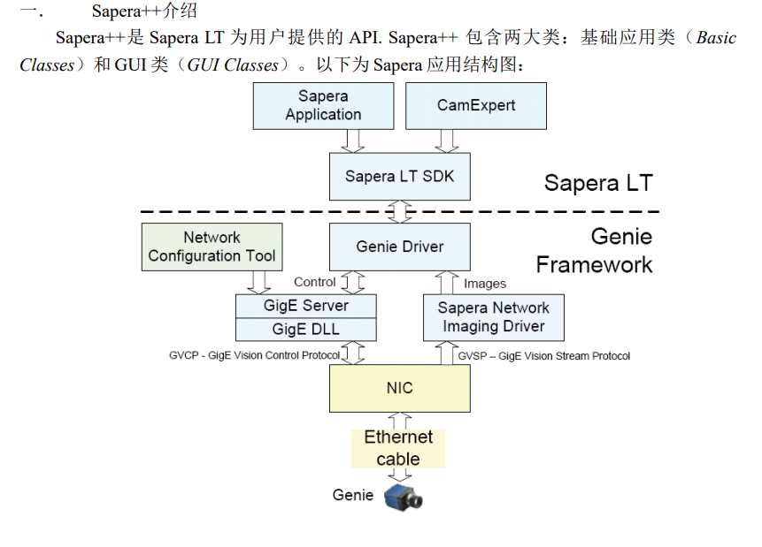
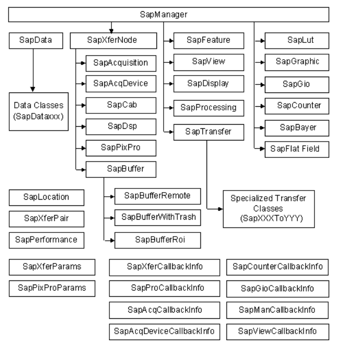
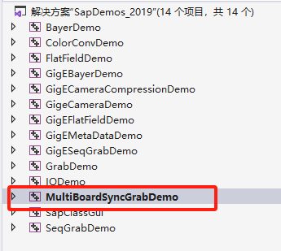
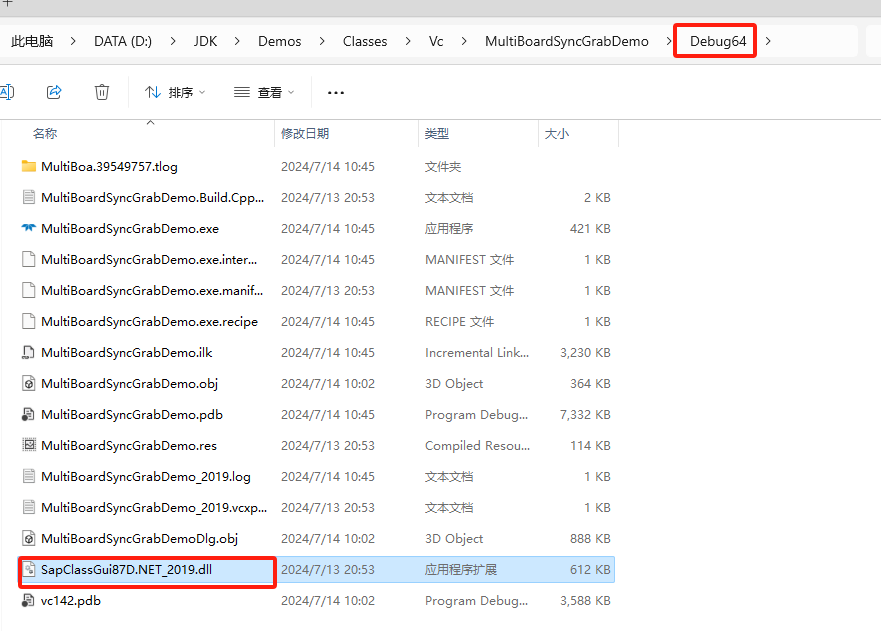
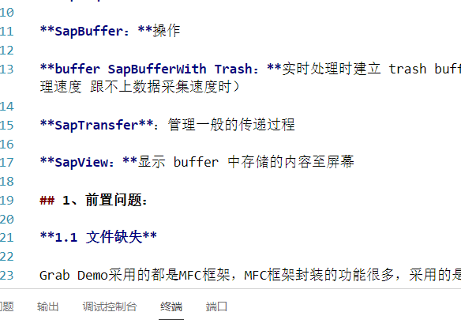

# Sapera Grab Demo





常用类： 

**SapAcqDevice：**读写、控制相机 

**SapBuffer：**操作 

**buffer SapBufferWith Trash：**实时处理时建立 trash buffer 用于存放转换数据（常用于处理速度 跟不上数据采集速度时） 

**SapTransfer**：管理一般的传递过程 

**SapView：**显示 buffer 中存储的内容至屏幕

## 1、前置问题：

**1.1 文件缺失**

Grab Demo采用的都是MFC框架，MFC框架封装的功能很多，采用的是消息机制。

将想要运行的项目设置为启动项目，会自动加粗：



缺少此文件，将此文件加入：



**2.缓存数据时，CCD拍摄过快，程序的处理速度跟不上数据传输速度**

SapBufferRoi和SapBufferWithTrash结合使用

**3.保存数据到内存时，CCD拍摄过快，容易漏帧**

**使用多线程**: 使用多线程来异步处理图像数据。一个线程可以专注于数据捕获，另一个线程处理和存储数据。这样可以减少因数据处理导致的延迟。


## 2、开发类

### 2.1 SapBufferRoi类

SapBufferRoi 类的目的是在现有 SapBuffer 对象内**创建矩形感兴趣区域** （ROI）。对于对象中的所有缓冲区资源，ROI 具有**相同的原点和维度**。可以使用相同的 SapBuffer 作为父级创建此类的多个实例;但是，采集硬件决定了采集图像时的最大同时 ROI 数量。此类的一个典型用法是，当只需要图像的子集时，可以降低采集带宽要求。

* SapBufferRoi 创建ROI时设定为和板子的**整个缓冲区**具有相同的原点和维度，即ROI感兴趣区域就是整个板子的缓冲区；那么操作SapBufferRoi就是操作板子的整个缓冲区

```c++
//类
class MySapBufferRoi : public SapBufferRoi
{
public:
    MySapBufferRoi(
        SapBuffer* pParent, 
        int xmin = 0, 
        int ymin = 0,
        int width = -1, 
        int height = -1
    ): SapBufferRoi(pParent, xmin, ymin, width, height) {}
	virtual CORBUFFER GetTrash() const { return m_hTrashChild; }
};
//初始化：传入一个缓冲区指针，xmin, ymin, width, height已经在构造函数中设定好了
m_Buffers[0] = new MySapBufferRoi(m_Buffer);
```


### 2.2 **SapBufferWithTrash类**

SapBufferWithTrash 类派生自 SapBuffer。它创建了一个附加资源，称为在实时应用程序中传输数据时使用的垃圾缓冲区。垃圾桶缓冲区是 SapTransfer 类在**数据传输速度快于对缓冲区执行的处理任务时使用的紧急缓冲区**。当处理速度不够快，无法跟上传入的数据时，图像会暂时传输到垃圾箱缓冲区，直到重新建立稳定性。


#### 2.2.1 两类结合

CCD相机的采集是非常快的，为了避免处理数据的速度低于数据传输速度，漏掉几帧，整体采集流程如下：

**数据采集**：

* 采集数据时，数据传输到 `SapBufferWithTrash` 对象中。如果处理速度足够快，数据将直接传输到定义的缓冲区中。

**处理速度不足**：

* 如果处理速度不足以跟上传输速度，数据将暂时存储在垃圾缓冲区中。
* 垃圾缓冲区起到了缓冲作用，确保传输数据不会丢失。

**恢复正常处理**：

* 一旦处理速度恢复正常，数据可以从垃圾缓冲区中读取，并继续进行处理。

**降低带宽要求**：

* `MySapBufferRoi` 通过定义 ROI 只采集和处理图像的一部分，降低了数据传输和处理的带宽要求，提高了处理效率。

**总结：**

* 通过使用 `SapBufferWithTrash` 和 `MySapBufferRoi`，代码可以有效地管理数据传输和处理，确保在数据传输速度超过处理速度时，不会丢失数据。

* 实际上，垃圾缓冲区的存在使得数据传输能够继续进行，而不会因为缓冲区被占满而丢失数据。处理任务一旦赶上传输速度，就可以从垃圾缓冲区中读取数据，保证数据的完整性

* `MySapBufferRoi` 基于 `SapBuffer` 创建一个矩形感兴趣区域（ROI），该区域具有相同的原点和维度。

	通过定义 ROI，可以只采集图像的一部分，从而降低数据传输和处理的带宽要求。

	这有助于减少需要处理的数据量，提高处理效率。在处理速度较慢的情况下，可以仅处理 ROI 部分，从而减少数据丢失的风险。

```c++
//创建一个 SapBufferWithTrash 对象，用于在数据传输速度超过处理速度时临时存储数据。
m_Buffer = new SapBufferWithTrash();
//创建一个 MySapBufferRoi 对象，基于m_Buffer，定义一个矩形感兴趣区域。这样可以只采集和处理图像的子集，降低带宽要求。
m_Buffers[0] = new MySapBufferRoi(m_Buffer);
//创建一个 SapAcqToBuf 对象，用于将数据从采集对象 m_Acq[0] 传输到缓冲区 m_Buffers[0]。
//XferCallback是传输完成时调用的回调函数。
m_Xfer[0] = new SapAcqToBuf(m_Acq[0], m_Buffers[0], XferCallback, this);
```


多半同步中以单触发信号来同时触发两个相机进行拍摄


### 2.3 SAPCLASSBASIC_CLASS

`SAPCLASSBASIC_CLASS` 宏用于声明类，以确保这些类在动态库中的正确导入和导出。这使得其他代码可以访问动态库中的这些类及其相关的函数。

具体来说：

1. **声明和实现分离**: `SAPCLASSBASIC_CLASS` 在头文件中用于声明类，使得这些类可以被导出或导入。实际的实现代码通常在 DLL 的源文件中。
2. **动态库的接口**: 通过使用 `SAPCLASSBASIC_CLASS`，你可以定义一个接口，使得动态库中的类可以被其他程序访问。这个宏帮助处理链接时的符号可见性。
3. **访问动态库中的函数**: 当你在动态库中定义一个类时，使用 `SAPCLASSBASIC_CLASS` 声明的类可以调用该动态库中的函数和方法。这些函数和方法的实现是在 DLL 文件中。

**例子**

假设你有一个动态库 `libexample.dll`，它包含一个类 `ExampleClass`。你可以使用 `SAPCLASSBASIC_CLASS` 来声明这个类：

```c++
// In the DLL header file
class SAPCLASSBASIC_CLASS ExampleClass {
public:
    void ExampleMethod();
};
```

在 DLL 的实现文件中，你会提供 `ExampleClass` 的具体实现：

```c++
// In the DLL source file
void ExampleClass::ExampleMethod() {
    // Implementation code
}
```

在使用这个 DLL 的客户端代码中，你可以通过包含上述声明头文件来访问 `ExampleClass` 和它的方法：

```c++
// In the client code
#include "example.h"

int main() {
    ExampleClass example;
    example.ExampleMethod();  // Calling the method from the DLL
    return 0;
}
```

**总结**

使用 `SAPCLASSBASIC_CLASS` 来声明类是为了处理类在动态库中的导入和导出，从而使这些类的实例可以在其他程序中使用，并且可以调用动态库中定义的函数。

在 `.h` 头文件中使用 `class SAPCLASSBASIC_CLASS SapXferContextInfo;` ，**告诉编译器 `SapXferContextInfo` 是一个类，但具体的实现会在动态库的源文件中提供。**


## 3、问题及解决方案

### 3.1、帧率获取

相机通过外部信号进行触发（TTL高电平），每一个高电平都是一帧数据，并通过acq传送给buffer。

**3.1.1 解决方案：**

**1、设置定时器**

* 在 `OnGrab` 中启动定时器，使用 `SetTimer` 函数来创建一个定时器，例如每隔 100 毫秒更新一次帧率：

```c++
void CMultiBoardSyncGrabDemoDlg::OnGrab() 
{
    m_statusWnd.SetWindowText(_T(""));

    if (m_Xfer[0]->Grab() && m_Xfer[1]->Grab())
    {
        // 启动定时器，每隔100毫秒触发一次
        SetTimer(IDT_UPDATE_FRAMERATE, 100, nullptr);
        .....

        UpdateMenu();    
    }
}
```

* 重写 `OnTimer` 函数以处理定时器消息，并在其中获取并更新帧率：

```c++
void CMultiBoardSyncGrabDemoDlg::OnTimer(UINT_PTR nIDEvent)
{
    if (nIDEvent == IDT_UPDATE_FRAMERATE)
    {
        UpdateDisplayFrameRate();
    }

    CDialogEx::OnTimer(nIDEvent);
}
```

* 修改 `UpdateDisplayFrameRate` 函数以获取最新的帧率并更新显示框：

```c++
void CMultiBoardSyncGrabDemoDlg::UpdateDisplayFrameRate()
{
    SapXferFrameRateInfo* pFrameRateInfo = m_Xfer[0]->GetFrameRateStatistics();

    if (pFrameRateInfo)
    {
        // 获取实时帧率
        if (pFrameRateInfo->IsLiveFrameRateAvailable())
        {
            int liveFrameRate = pFrameRateInfo->GetLiveFrameRate();
            CString strFrameCount;
            strFrameCount.Format(_T("%d"), liveFrameRate);
            m_editFrameCount.SetWindowText(strFrameCount);
        }
    }
}
```

* 在对话框销毁时，确保停止定时器：

```c++
void CMultiBoardSyncGrabDemoDlg::OnDestroy()
{
    CDialogEx::OnDestroy();
    // 停止定时器
    KillTimer(IDT_UPDATE_FRAMERATE);
}
```

* 前置条件

```c++
BEGIN_MESSAGE_MAP(CMultiBoardSyncGrabDemoDlg, CDialogEx)
    ON_WM_TIMER()										//添加定时器处理函数
END_MESSAGE_MAP()
#define IDT_UPDATE_FRAMERATE  1001 						//头文件中定义定时器 ID
```


### 3.2、异步存储

对于存储数据，由于帧率过快，直接存储在数据处理速度小于数据传输速度时容易漏帧，因此采用线程进行异步存储：

```c++
//线程函数-->保存buffe1数据
UINT CMultiBoardSyncGrabDemoDlg::ThreadProc(LPVOID lpParam) {
	CMultiBoardSyncGrabDemoDlg* pDlg = reinterpret_cast<CMultiBoardSyncGrabDemoDlg*>(lpParam);
		void* pData = nullptr;
		if (pDlg->m_Buffers[0] && pDlg->m_Buffers[0]->GetAddress(&pData))
		{
			int bufferSize = pDlg->m_Buffers[0]->GetWidth() * pDlg->m_Buffers[0]->GetHeight() * pDlg->m_Buffers[0]->GetBytesPerPixel();

			// 将缓冲区数据复制到内存中
			std::vector<char> data(bufferSize);
			std::memcpy(data.data(), pData, bufferSize);
			bufferData[0].push_back(data);

			float pFrameRateInfo = pDlg->m_Buffers[0]->GetFrameRate();
			float rate = pFrameRateInfo;
			// 当帧数达到 16384 时，将数据写入文件
			if (rate == 50)
			{
				WriteBuffersToFile(0);
				rate = 0;
			}
	}
	return 0;
}
//保存buffer2数据
UINT CMultiBoardSyncGrabDemoDlg::ThreadProc2(LPVOID lpParam) {
	CMultiBoardSyncGrabDemoDlg* pDlg = reinterpret_cast<CMultiBoardSyncGrabDemoDlg*>(lpParam);
	void* pData = nullptr;
	if (pDlg->m_Buffers[1] && pDlg->m_Buffers[1]->GetAddress(&pData))
	{
		int bufferSize = pDlg->m_Buffers[1]->GetWidth() * pDlg->m_Buffers[1]->GetHeight() * pDlg->m_Buffers[1]->GetBytesPerPixel();

		// 将缓冲区数据复制到内存中
		std::vector<char> data(bufferSize);
		std::memcpy(data.data(), pData, bufferSize);
		bufferData[1].push_back(data);
		float pFrameRateInfo = pDlg->m_Buffers[1]->GetFrameRate();
		float rate = pFrameRateInfo;
		// 当帧数达到 16384 时，将数据写入文件
		if (rate == 50)
		{
			WriteBuffersToFile(1);
			rate = 0;
		}
	}
	return 0;
}
```

调用：

* `AfxBeginThread` 是一个在 Microsoft Foundation Classes (MFC) 库中使用的函数，用于创建一个新的线程.
* `AfxBeginThread` 通常需要两个参数：
	1. **线程函数的地址**：这是一个指向函数的指针，该函数定义了线程开始执行时应执行的代码。
	2. **线程参数**：这是一个可选参数，可以传递给线程函数，用于提供初始化数据或配置信息。
* **AfxBeginThread创建的线程在默认情况下会自动销毁**。这是因为AfxBeginThread函数在内部创建了一个CWinThread对象，并设置其m_bAutoDelete成员变量为TRUE（默认为自动删除）。当线程执行完毕并退出时，如果m_bAutoDelete为真，则CWinThread对象的析构函数会被调用，进而销毁该对象。

```c++
//OnGrab中调用线程
//AfxBeginThread
void CMultiBoardSyncGrabDemoDlg::OnGrab() 
{
   m_statusWnd.SetWindowText(_T(""));

	if( m_Xfer[0]->Grab() && m_Xfer[1]->Grab())
	{
		Bufferdata_thread1 = AfxBeginThread(ThreadProc, this);  //启动线程1
		Bufferdata_thread2 = AfxBeginThread(ThreadProc2, this);  //启动线程1
		if (Bufferdata_thread1 == NULL) {
			AfxMessageBox(_T("线程创建失败！"));
		}

		UpdateMenu();	
	}
}
```


