# 一、基本类

一般选择QT的MinGw版本

QMainWindow与QDialog都继承了Qwidget，相比于空白的Qwidget，都新增了派生类的新功能。

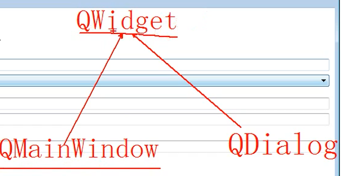


## 1 Qwidget：

Qwidget创建成功后：

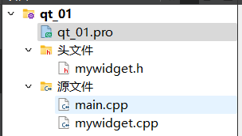

其中：

**qt_01.pro:**

打开这个文件便能打开整个项目目录，qt_01与项目同名

```c++
QT       += core gui
greaterThan(QT_MAJOR_VERSION, 4): QT += widgets //大于4版本加入widgets模块
CONFIG += c++17

SOURCES += \ //源文件
    main.cpp \
    mywidget.cpp
    
HEADERS += \ //头文件
    mywidget.h
    
# Default rules for deployment.
qnx: target.path = /tmp/$${TARGET}/bin  
else: unix:!android: target.path = /opt/$${TARGET}/bin
!isEmpty(target.path): INSTALLS += target
```

头文件

**mywidget.h**：

```c++
#ifndef MYWIDGET_H
#define MYWIDGET_H
#include <QWidget>
class MyWidget : public QWidget //继承父类Qwiget
{
    Q_OBJECT  //Q_OBJECT宏 支持信号和槽

public:
    MyWidget(QWidget *parent = nullptr);  
    ~MyWidget();
};
#endif // MYWIDGET_H
```

源文件：

**main.cpp**

```C++
#include "mywidget.h"
#include <QApplication>  //应用程序类
//argc：命令行变量的数量 *argv[]命令行变量数组
int main(int argc, char *argv[])
{
    // a 应用程序对象，在QT程序中有且只有一个
    QApplication a(argc, argv);
    //通过窗口类实例化一个对象w
    MyWidget w;
    //串口必须show()显示调用
    w.show();
    //a.exec()进入消息循环机制->阻塞界面
    return a.exec();
}
```

**MyWidget.cpp**

```c++
#include "mywidget.h"
MyWidget::MyWidget(QWidget *parent) // MyWidget 类的构造函数的声明。它接受一个指向 QWidget 的指针作为参数
    : QWidget(parent)  //构造函数的初始化列表部分，初始化基类 QWidget 和 MyWidget 中的任何成员变量
{
}
MyWidget::~MyWidget() //析构
{
}
```

### 1.1 常用控件

**QPushButton**

* qt界面的坐标系是以左上角为(0,0)点，x以右侧为正，y以下侧为正。

* QPushButton集成了QAbstractButton,其继承了QAbstractButton的四个函数方法：

	* clicked
	* pressed
	* released
	* toggled

* Qwidget的槽函数：

​                                                    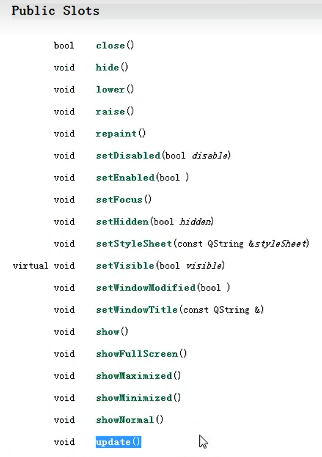

```c++
MyWidget::MyWidget(QWidget *parent)
    : QWidget(parent)
{
    //按钮1
    QPushButton *btu = new QPushButton;
    btu->show();//show()方法默认用顶层方式弹出，会自己创建个新窗口进行展示
    btu->setParent(this);//this指针指向当前界面
    btu->setText("你好"); //按钮显示文本
    btu->move(20,20);

    //按钮2
    QPushButton *btn2 = new QPushButton;
    btn2->setParent(this); //绑定当前界面
    btn2->move(100,100);//移动
    resize(600,400);//重置窗口大小
    btn2->resize(20,30);//重置按钮大小

    setWindowTitle("QT程序"); //设置窗口标题
    setFixedSize(600,400); //窗口大小固定

    //信号槽
    //connect(信号的发送者，发送的信号，信号的接收者，处理的槽函数)
    //点击按钮关闭窗口 click点击信号，close关闭窗口槽函数，this指向当前窗口
    connect(btu,&QPushButton::clicked,this,&QWidget::close); 
}
```

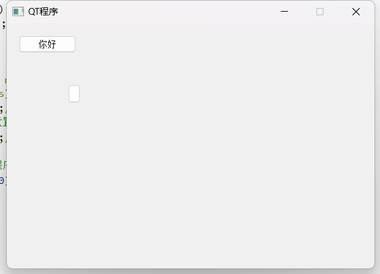

**lambda的应用：**

```c++
    //lambda表达式的应用
    QPushButton *btn = new QPushButton("aaa",this);
    [=](){                    //第一个()是声明
        btn->setText("bbb");  //[=]值传递，将该btn拷贝给*btn，会修改aaa为bbb
    }();                      //第二个()是调用
    
    QPushButton *btn2 = new QPushButton("aaa",this);
	//当进行信号和槽链接时，控件内会进入一个锁的状态
	connect(btn2,&QPushButton::clicked,this,[=](){ 
        //此时必须用=值传递，两个btn2经过拷贝会指向同一片空间，如果使用[&]会bao
		btn2->setText("bbb");   //点击一下按钮，按钮中的值会从aaa变为bbb
    });

	//点击按钮关闭窗口
	connect(btn2,&QPushButton::clicked,this,[=](){ 
		this->close(); 
        stu->treat("宫保鸡丁");
    });
```

由于[&]，连接时的锁机制，当需要更改参数时也加上mutable可以修改值拷贝过来的：

```c++
	QPushButton *btn2 = new QPushButton("aaa",this);
	int m = 10;
	connect(btn2,&QPushbutton::clicked,this,[m]() mutable{
		m = 20;
		QDebug() << m ; //m = 20
	});
```


## 2 QMainWindow

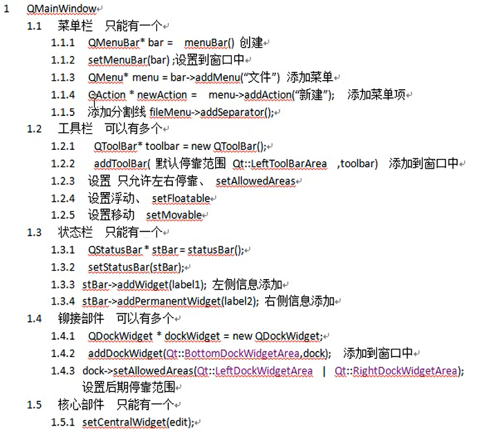

### 2.1 常用控件

```C++
#include "mainwindow.h"
#include <QDebug>
#include <QMenuBar>
#include <QToolBar>
#include <QPushButton>
#include <QStatusBar>
#include <QLabel>
#include <QDockWidget>
#include <QTextEdit>
#include <QDialog>
#include <QColorDialog>
#include <QFileDialog>
#include <QMessageBox>
#include <QFontDialog>
#pragma execution_character_set("utf-8")

MainWindow::MainWindow(QWidget *parent)
    : QMainWindow(parent)
{
    //重置窗口大小
    resize(600,400);

    //菜单栏创建 菜单兰至多有一个 <QMenuBar>
    QMenuBar *bar = menuBar();
    //将菜单栏放图窗口
    setMenuBar(bar);
    //创建菜单
    QMenu * fileMenu = bar->addMenu("文件");
    QMenu * editMenu = bar->addMenu("编辑");
    //创建菜单项
    QAction *newaction = fileMenu->addAction("新建");
    //资源文件的使用 语法： ":+前缀名 + 文件名"
    newaction->setIcon(QIcon(":/image/D:/image/item/OIP-C.jpg")); //插入电脑图片
    //添加分隔符
    fileMenu->addSeparator();
    //fileMenu->addAction("打开");
    QAction *openaction = fileMenu->addAction("打开");
    openaction->setIcon(QIcon(":/image/image/test.png")); //插入导入资源文件


    //对话框 <QDialog>
    //点击新建按钮，弹出一个对话框
    connect(newaction,&QAction::triggered,this,[=](){
        //对话框
        //模态对话框（不可以对其他窗口进行操作）
        //模态创建 阻塞
        QDialog dlg(this);  //创建在栈区
        dlg.resize(400,400); //对话框大小
        dlg.exec(); //让对话框停止
        qDebug() << "模态对话框弹出了" ;
    });
    
    connect(openaction,&QAction::triggered,this,[=](){
        //非模态对话框 同时可以对其他框进行操作
        QDialog *dlg2 = new QDialog(this);  //必须创建在堆区，要不然后show完就会被释放掉
        dlg2->resize(200,200);
        dlg2->show(); 
        dlg2->setAttribute(Qt::WA_DeleteOnClose); //55号属性 关闭弹窗时释放内存
        qDebug() << "非模态对话框";
        
        //消息对话框 <QMessageBox> 暂时在点击打开后显示
        QMessageBox::critical(this,"critical","错误"); //错误对话框
        QMessageBox::information(this,"info","信息"); //信息对话框
        //参数1 父窗口 参数2：标题 参数3：提示内容 参数4：关联按键 参数5：默认关联回车按键
        //QMessageBox::question(this,"ques","提问",QMessageBox::Save|QMessageBox::Cancel); //提问消息框
       if(QMessageBox::Save==QMessageBox::question(this,"ques","提问",QMessageBox::Save|QMessageBox::Cancel))		   {
            qDebug() << "选择的是保存";
        }else{
            qDebug() <<"选择的是取消";
        } //判断用户选择的是sava还是cancel
        
        QMessageBox::warning(this,"warning","警告");//警告对话框
        //其他标准对话框
        
        //颜色对话框 <QColorDialog>
        // QColorDialog::getColor(QT::red));  //默认为红色
        QColor color = QColorDialog::getColor(QColor(255,0,0));//红色 rbg
        //文件对话框 <QFileDialog>
        //文件对话框 参数1：父窗口 参数2：标题 参数3：默认打开路径 参数4：过滤文件格式
        QString filename = QFileDialog::getOpenFileName(this,"打开文件","C:/Users/25313/Desktop","(*.txt)");
        qDebug() << filename;
        //字体对话框 <QFontDialog>
        bool flag;
        QFont font = QFontDialog::getFont(&flag,QFont("宋体",36)); //字体，字号
        qDebug() << "字号" << font.pointSize() <<"字体" << font.family().toUtf8().data //不加双引号
            << "是否加粗" << font.bold() << "是否倾斜" << font.italic();
    });


    //工具栏 可以有多个<QToolBar>
    QToolBar * toolBar = new QToolBar(this);
    //放入窗口
    //addToolBar(toolBar);//默认为界面上部
    addToolBar(Qt::LeftToolBarArea, toolBar); //调正到左边
    //后期设置 只允许 左右停靠
    //toolBar->setAllowedAreas(Qt::LeftToolBarArea|Qt::RightToolBarArea);
    //设置浮动
    toolBar->setFloatable(false);
    //设置移动
    toolBar->setMovable(false);
    //工具栏设置内容
    toolBar->addAction(newaction);
    toolBar->addSeparator(); //添加分割线
    toolBar->addAction(openaction);
    //工具栏中添加控件
    QPushButton *btn = new QPushButton("aa",this);
    toolBar->addWidget(btn);


    //状态栏 最多有一个 <QStatusBar>
    QStatusBar *staBar = statusBar();
    //添加到窗口
    setStatusBar(staBar);
    //放标签空间:QLabel显示文本
    QLabel *label = new QLabel("左侧提示信息",this);
    staBar->addWidget(label);
    QLabel *label1 = new QLabel("右侧提示信息",this);
    staBar->addPermanentWidget(label1);

    //铆接部件（浮动窗口）可以有多个<QDockWidget>
    QDockWidget * dockwidget = new QDockWidget("浮动",this);
    addDockWidget(Qt::TopDockWidgetArea,dockwidget);  //设置顶部停靠
    addDockWidget(Qt::BottomDockWidgetArea,dockwidget);  //设置底部停靠
    //设置后期停靠 上下停靠
    dockwidget->setAllowedAreas(Qt::TopDockWidgetArea|Qt::BottomDockWidgetArea);

    //设置中心部件 只能有一个 <QTexEdit>
    QTextEdit *edit = new QTextEdit("new report",this);
    setCentralWidget(edit);

}
MainWindow::~MainWindow()
{
}
```

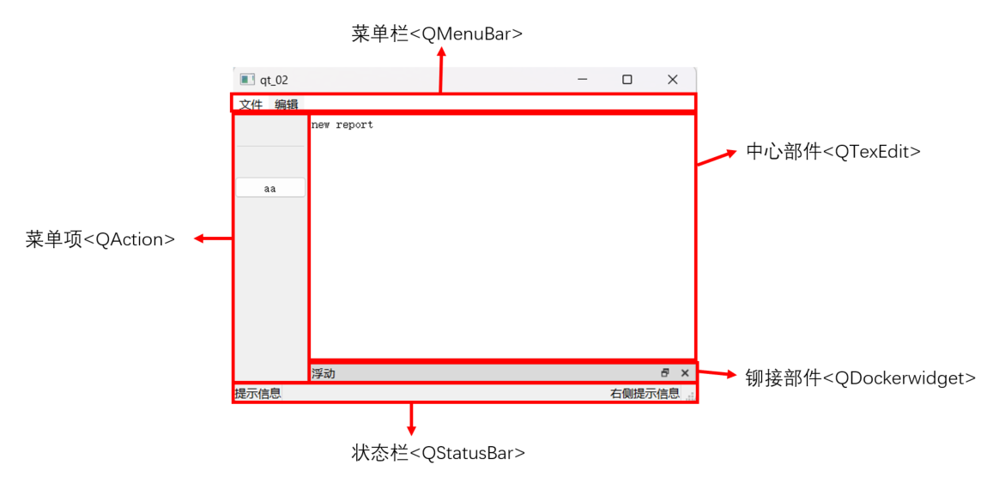


### 2.2 添加图像资源文件

1、先将图像文件夹放到项目路径下

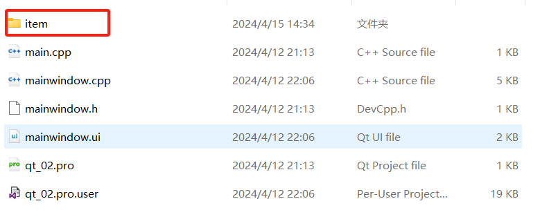


2、添加新文件

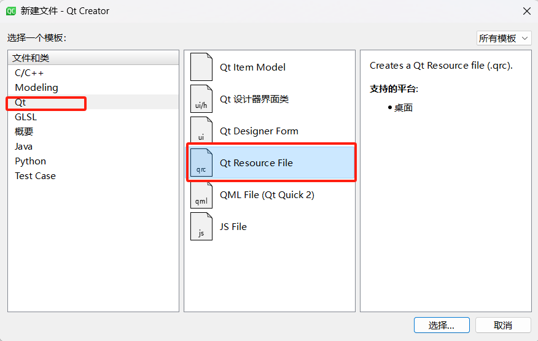


3、将图像导入：

​				qrc文件打开方式：右键----->open in Editor。

​				添加前缀：添加前缀路径。

​				添加文件：选中图像文件。

​				添加完成后点击编译，即可正确导入。

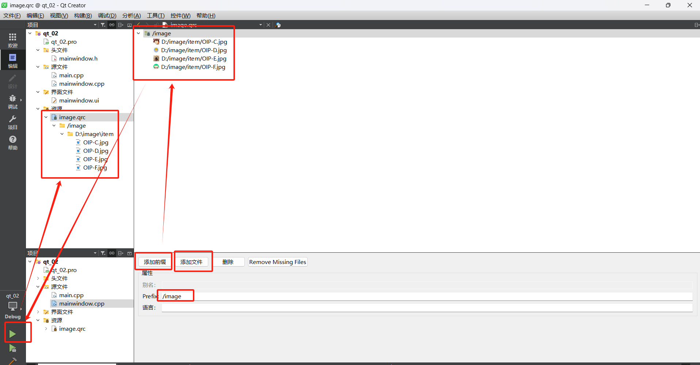


## 3 Qt对象模型

### 3.1 对象树

qt的对象都是new出来的，并不用显示的释放delete，这是由于**对象树**的存在。

* Qt中创建对象的时候会提供一个Parent对象指针
* QObject是以对象树的形式组织起来的
	* 当你创建一个 QObject对象时，会看到 QObject的构造函数接收一个QObject指针作为参数，这个参数就是parent，也就是父对象指针。这相当于，在创建QObject对象时，可以提供一个其父对象，我们创建的这个QObject,对象会自动添加到其父对象的 children()列表。
	* 当父对象析构的时候，这个列表中的所有对象也会折构。(注意，这里的父对象并不是继承意义上的父类)中


### 3.2 Qt元对象系统

元对象系统
元对象:可以将类中所有的信息全部都保存到这个元对象中
1.成员变量
2.成员函数


## 4 信号与信号槽

### 4.1 概念

* 信号和槽是qt通信的基础，信号是在某种情况下被发送的信号，槽就是对信号进行响应的函数。

* 槽函数与信号进行关联，当信号被发射时，关联的槽函数被自动执行。

* 信号和槽的关联是是使用connect()函数实现的

	* connect()函数继承自槽函数Qobject，在实际调用时可以忽略前面的限定符
	* 发送信号的对象（sender）和接收信号的对象（receiver）都必须是`QObject`或其子类的实例
	* 信号和槽的参数必须匹配。这包括参数的类型和数量。

	```c++
	QObject::connect(sender, signal(),receiver, slot());
	```

	例：

	```c++
	QPushButton *button = new QPushButton("Click me");  
	QObject::connect(button, &QPushButton::clicked, this, &MyClass::on_buttonClicked());  
	// 槽函数定义  
	void MyClass::on_buttonClicked()  
	{  
	    // 处理按钮点击事件  
	} 	// 利用QT编写客户端，采用UDP/TCP通信完成客户端与服务器的数据传输。
	```


**信号和槽的本质：**

* 信号和槽机制是Qt实现**事件驱动编程**的一种方式。在传统的回调函数中，你需要将函数指针作为参数传递给另一个函数，并在适当的时候由该函数调用回调函数。而在Qt中，你**不需要显式地传递函数指针，而是通过connect函数将信号和槽连接起来，当信号被触发时，Qt的元对象系统会负责调用相应的槽函数。**这种方式使得代码更加清晰、易于管理。


**信号和槽的优点：**

* **跨线程通信的能力：**信号和槽机制还支持跨线程通信。当信号和槽分属不同的线程时，Qt会自动处理线程之间的通信问题，确保线程安全。具体来说，如果信号在A线程中发出，而槽在B线程中，**Qt会将信号参数序列化后发送到B线程的事件队列中**，**并在B线程的事件循环中调用槽。**


### 4.2 连接方式


* 自动连接（Auto Connection）

	```c++
	connect(sender, SIGNAL(signalName()), receiver, SLOT(slotName()));
	```

* **直接连接:**槽函数在发送信号的线程中被直接调用。

	```c++
	connect(sender, SIGNAL(signalName()), receiver, SLOT(slotName()), Qt::DirectConnection);
	```

* 队列连接:槽函数在接收信号的对象所属的线程中被调用。

	```c++
	connect(sender, SIGNAL(signalName()), receiver, SLOT(slotName()), Qt::QueuedConnection);
	```

* 阻塞连接:这是一个特殊的队列连接，发送信号的线程会被阻塞，直到槽函数完成执行。它仅在跨线程通信时使用。适用于需要同步操作的场景

	```c++
	connect(sender, SIGNAL(signalName()), receiver, SLOT(slotName()), Qt::BlockingQueuedConnection);
	```

* 唯一连接：这种连接方式确保信号与槽之间的连接唯一，如果已经存在相同的连接，则不会再次连接。有助于避免重复连接的错误。

	```c++
	connect(sender, SIGNAL(signalName()), receiver, SLOT(slotName()), Qt::UniqueConnection);
	```

* **Lambda 表达式连接**：可以在需要时内联实现槽函数。

	```c++
	connect(sender, &Sender::signalName, this, [=]() {
	    // 这里是槽函数的代码
	});
	```


### 4.3 案例

**案例：**

> 下课后老师触发饿了信号
>
> 学生相应信号并请老师吃饭

**步骤：**

* 首先创建新文件：学生类与教师类
* class会自动生成cpp文件与.h文件
* 信号和槽函数的参数类型必须一一对应。

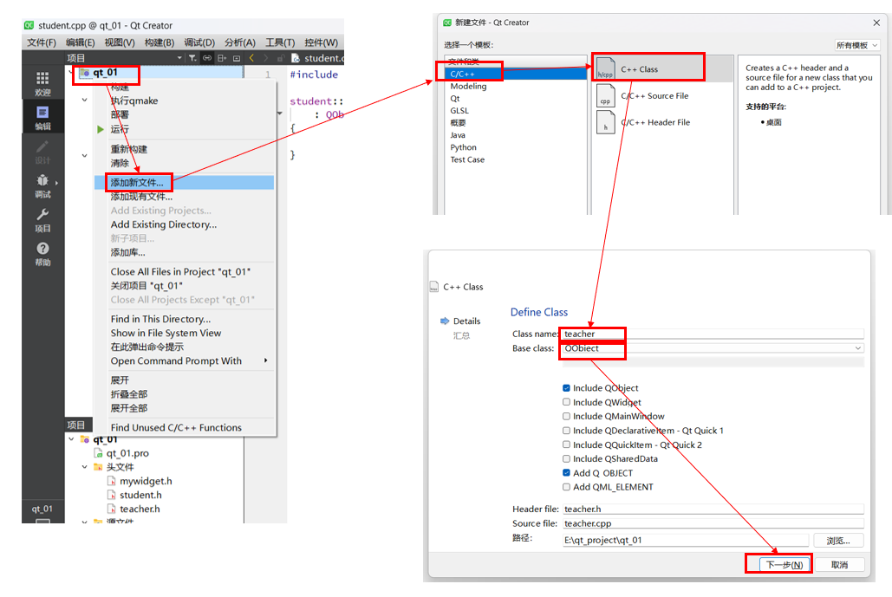

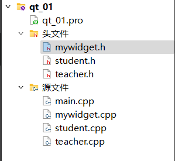


**核心思想：**

* 创建老师类
	* 老师发送信号hungry()
		* 源文件：自定义信号，写到signals下，返回值是void，只需要声明不需要实现，可以有参数，可以发生重载
* 创建学生类
	* 学生响应信号
		* 头文件声明函数treat()
		* 源文件实现函数请吃饭
* myweight:
	* 头文件分别声明老师和学生对象指针，同时声明下课函数classover()来提交老师的信号hungry()
	* 源文件：
		* 先实现下课函数classover来提交信号
		* 再通过this指针来分配学生与老师具体实例对象，并利用connect()接收自定义信号
		* 在connect连接时，如果自定义信号有重载，必须用函数指针根据参数列表指定对应重载函数

**代码：**

**teacher.h**

```c++
#ifndef TEACHER_H
#define TEACHER_H
#include <QObject>
class teacher : public QObject
{
    Q_OBJECT
public:
    explicit teacher(QObject *parent = nullptr);
    
//自定义信号，必须写到signals下
signals:
    //返回值是void
    //只需要声明不需要实现
    //可以有参数 可以发生重载
    void hungry(); //老师的饥饿信号，单纯声明
    
    void hungry(QString foodName); //重载，老师想吃foodName
};
#endif // TEACHER_H
```

**student.h**

```c++
#ifndef STUDENT_H
#define STUDENT_H

#include <QObject>

class student : public QObject
{
    Q_OBJECT
public:
    explicit student(QObject *parent = nullptr);
    
    //自定义槽函数 写到public slots QT5.0版本以上 可以写成全局函数或者public作用域下 或者1ambda表达式
    //返回值是void
    //需要声明，也需要实现
    //可以有参数 可以发生重载
    void treat(); //学生的干饭函数，这里只是声明
    void treat(QString foodName); //请老师吃foodname
signals:
};
#endif // STUDENT_H
```

**student.cpp**

```c++
#include "student.h"
#include<QDebug>
student::student(QObject *parent)
    : QObject{parent}
{   
}
void student::treat(){  //这里实现干饭函数
    qDebug() << "请老师吃饭"
}
void student::tread(QString foodName){
    //QString 转 char* 通过.toUtf8转为QByteArray类型，通过.data()转为char*
    qDebug() << "请老师吃" << foodName.toUtf8().data();
}
```

**myweight.h**

```C++
#ifndef MYWIDGET_H
#define MYWIDGET_H

#include <QWidget>
#include "student.h"
#include "teacher.h"

class MyWidget : public QWidget
{
    Q_OBJECT

public:
    MyWidget(QWidget *parent = nullptr);
    ~MyWidget();

    student *stu; //创建学生对象
    teacher *tea; //创建老师对象，创建在这里便可以通过this指针调用
    //下课
    void classover(); //声明下课函数
};
#endif // MYWIDGET_H
```

**myweight.cpp**

```c++
#include "mywidget.h"
MyWidget::MyWidget(QWidget *parent)
    : QWidget(parent)
{
    this->tea = new teacher(this); //实例化对象
    this->stu = new student(this);

    //连接信号槽
    void(teacher::*teachersignal)(QString) = &teacher::hungry; //函数指针->指定有参
    void(student::*studentsignal)(QString) = &student::treat;
    connect(tea,teacherdignal,stu,studentsignal);
    
    //指定无参
    void(teacher::*teachersignal)() = &teacher::hungry; //函数指针->指定有参
    void(student::*studentsignal)() = &student::treat;
    connect(tea,teacherdignal,stu,studentsignal); //连接老师信号与学生槽函数
    //信号连接信号   
    QPushButton *btn = new QPushButton("下课",this); //下课按钮。来触发老师信号。然后老师饿了信号触发学生请吃饭槽函数
    connect(btn,&QPushButton::clicked,tea,teachersignal);    
    
    //classover(); //调用下课机制
    disconnect(tea,teacherdignal,stu,studentsignal);  //断开老师信号与学生槽函数
        
    //一个信号可以绑定多个槽函数
    //多个信号可以连接同一个槽函数
   	//信号和槽函数的参数类型必须一一对应（有信号重载时）
    //信号的参数可以大于槽函数参数的个数

}
void MyWidget::classover(){
    //触发自定义信号
    emit this->tea->hungry("屎"); //emit提交
}
MyWidget::~MyWidget()
{
}
```

**main.cpp**

项目中还是只有一个main函数，上述所有操作，最终还是要在main函数中声明MyWidget实例化对象进行调用。

```c++
#include "mywidget.h"
#include <QApplication>  //应用程序类

//argc：命令行变量的数量 *argv[]命令行变量数组
int main(int argc, char *argv[])
{
    // a 应用程序对象，在QT程序中有且只有一个
    QApplication a(argc, argv);
    //通过窗口类实例化一个对象w
    MyWidget w;
    //串口必须show()显示调用
    //w.show();
    //a.exec()进入消息循环机制->阻塞界面
    return a.exec();
}
//输出结果：请老师吃shi
```


## 5 QT界面布局

### 5.1 Buttons

* **Push Button**

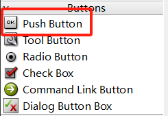

​	push button 一般作为按钮即可，但是同样可以对其添加图片，点击按钮，在右下角的属性中对icon进行操作：

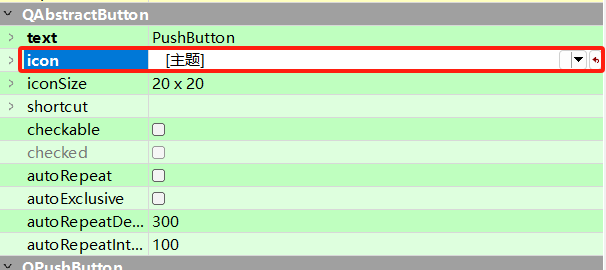

* **Tool Button**

一般都选择tool button 按钮用来显示图片，操作相同。

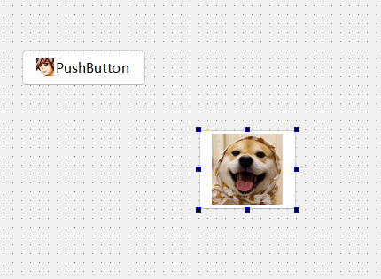

同时选中属性中的auto rise可以去除除图片外的按钮背景：


* **radio button**

	对于radio button一定要放在group box中：放进去后点击垂直布局：

	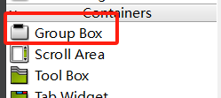

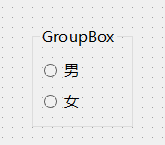

而对于男和女两个选择按钮来说在属性界面能看到button系统默认的名字，可以更改以便于后面进行操作：

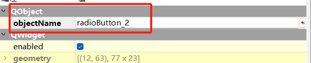

```c++
    //设置单选按钮 默认选中男
    ui->radioButton->setCheckable(true);
    //选中男后 打印信息
    connect(ui->radioButton,&QRadioButton::clicked,[=](){
        qDebug() << "选中了男";
    });
    //选中女后 打印信息
    connect(ui->radioButton_2,&QRadioButton::clicked,[=](){
        qDebug() << "选中了女";
    });
```

* **check** **Button**

此按钮同样放在Group box中：点击垂直布局

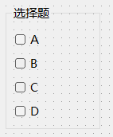

```c++
	//返回选中状态
    //多选按钮 2是选中 0是未选中
    connect(ui->checkBox,&QCheckBox::stateChanged,[=](int state){
        qDebug() << state ;
    });
```


### 5.2 item Widgets

* **List Widget**

```C++
	//利用listwidget写诗
    QListWidgetItem *item = new QListWidgetItem("楚河汉界");
    //将一行诗放入到listwidget中
    ui->listWidget->addItem(item);
    //居中显示
    item->setTextAlignment(Qt::AlignHCenter);

    //QStringlist可以一次性直接显示
    QStringList list;
    list << "拟好" << "二比" << "请你吃大粪";
    ui->listWidget->addItems(list);
```

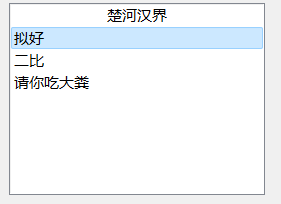

* **Tree Widget**

```c++
	//treeswidget
    //设置水评表头
    ui->treeWidget->setHeaderLabels(QStringList()<<"英雄"<<"英雄介绍");
    QTreeWidgetItem *item1 = new QTreeWidgetItem(QStringList() << "力量");
    QTreeWidgetItem *item2 = new QTreeWidgetItem(QStringList() << "敏捷");
    QTreeWidgetItem *item3 = new QTreeWidgetItem(QStringList() << "智力");
    //加载顶层节点
    ui->treeWidget->addTopLevelItem(item1);
    ui->treeWidget->addTopLevelItem(item2);
    ui->treeWidget->addTopLevelItem(item3);
    //加载子节点
    QStringList hero;
    hero <<"张建雄" << "前排，可以一次性鹿十次不眨眼";
    QTreeWidgetItem *lp = new QTreeWidgetItem(hero);
    item1->addChild(lp);
```

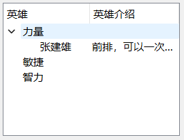

* Table Widget

```c++
//table widget
    //先设置列数
    ui->tableWidget->setColumnCount(3);//3列
    //设置水平表头
    ui->tableWidget->setHorizontalHeaderLabels(QStringList() << "姓名"<<"性别"<<"年龄");
    //设置行数
    ui->tableWidget->setRowCount(5);//5行
    //设置正文
    ui->tableWidget->setItem(0,0,new QTableWidgetItem("亚瑟"));//从第0行第0列开始
    QStringList namelist,sexlist;
    namelist << "亚瑟" << "赵云" <<"zhangfei" << "jihi" <<"jij";
    sexlist << "nan" << "nan" <<"nan" <<"mam" <<"mam";
    for(int i = 0;i<5;i++){
        int col = 0;
        ui->tableWidget->setItem(i,col++,new QTableWidgetItem(namelist[i]));  
        ui->tableWidget->setItem(i,col++,new QTableWidgetItem(sexlist[i]));//sexlist.at(i)
        //int 转 Qstring
        ui->tableWidget->setItem(i,col++,new QTableWidgetItem(QString::number(i+10)));
```

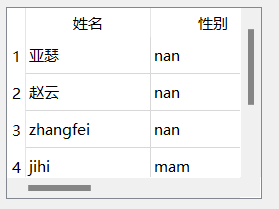

### 5.3 登录界面布局

[qt登录界面布局-CSDN博客](https://blog.csdn.net/hahahammp/article/details/131149978?spm=1001.2014.3001.5501)

### 5.4 Containers

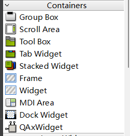

* **Stacked Widget**
	* 栈控件的使用很强大，可以通过按钮随意切换其他控件.

例：
首先在空白页面插入stacked widget，然后再每一页中键入其他控件这里将前面的[scroll](https://so.csdn.net/so/search?q=scroll&spm=1001.2101.3001.7020) Area、tool box、tab widget分别插入，栈控件

默认只有两页可以右键默认添加新页。

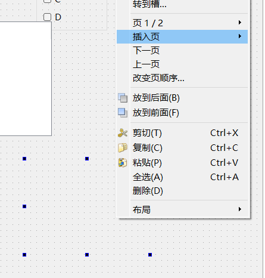

插入之后每一页都有一个索引，能看到目前这个控件的索引为0：


可以配合按钮进行页面切换：

```c++
//栈控件的使用 配合按钮使用
    //page按钮
    connect(ui->pushButton_2,&QPushButton::clicked,[=](){
        ui->stackedWidget->setCurrentIndex(1);
    });
    //tab按钮
    connect(ui->pushButton_3,&QPushButton::clicked,[=](){
        ui->stackedWidget->setCurrentIndex(2);
    });
    //radio按钮
    connect(ui->pushButton_4,&QPushButton::clicked,[=](){
        ui->stackedWidget->setCurrentIndex(0);
    });
```

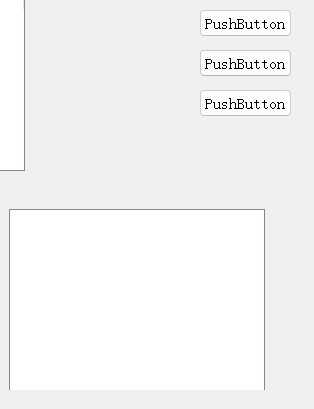

### 5.5 Input Widegets

* **Combo Box**

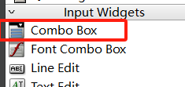

```c++
    //combo box下拉框
    ui->comboBox->addItem("义子");
    ui->comboBox->addItem("章建熊");
    ui->comboBox->addItem("他是我义子");
```

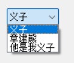

* **Label**
	* 改控件不仅可以显示文本，还可以显示图片和动态图片。

```c++
//静态图片
ui->label->setPixmap(QPixmap("E:/photo/handsome.jpg"));
//显示动态图片
QMovie *movie  = new QMovie("地址");
ui->label->setMovie(movie);
//播放动图
movie->start();
```


### 5.6 控件封装

首先添加新文件

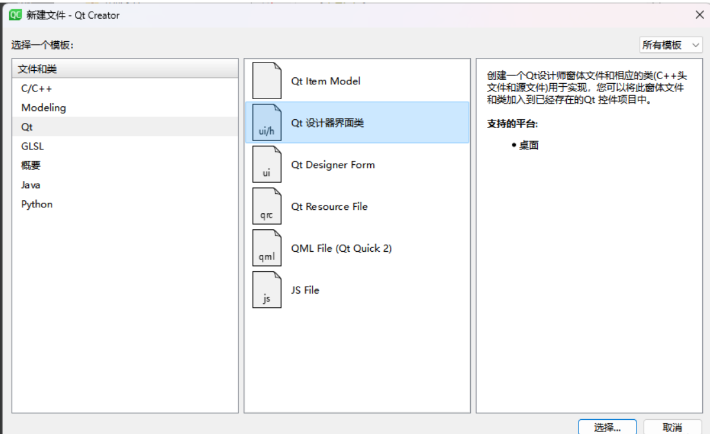

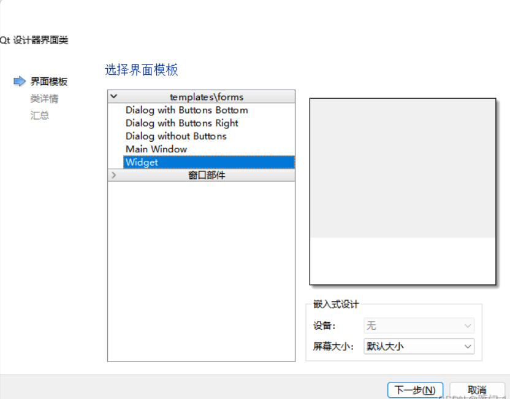

这样可以添加一个新的ui文件。文件名可以随意起，我起个samrt。

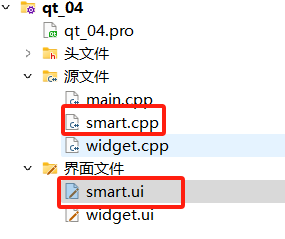

然后对samrt.ui文件进行设计和封装，比如我先设计为这样,horizontalSlider拉杆和spinBox数字：


然后我再主界面中（widget.ui）挑选出同样大小的区域添加一个widget区域：

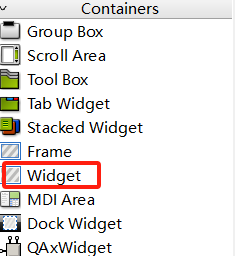

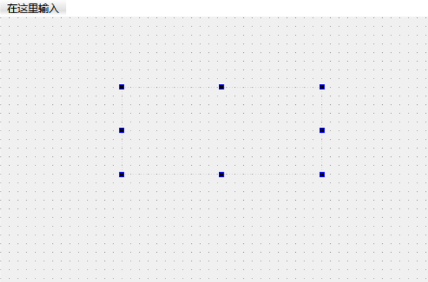

然后右键点击该区域，选中提升为，然后填写提升的类名称，这里注意一定要把要组装的ui文件的名称写对,然后进行添加，添加完成后点击提升。

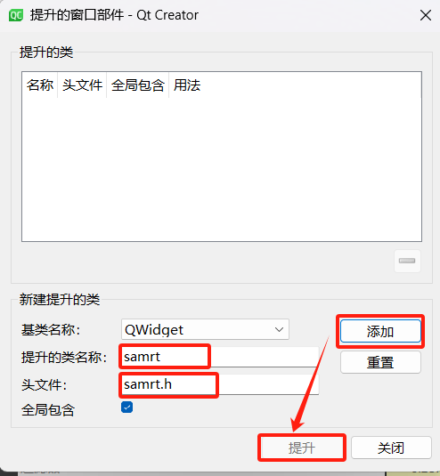

此时，运行widget.cpp会出现。smart封装好的部件：

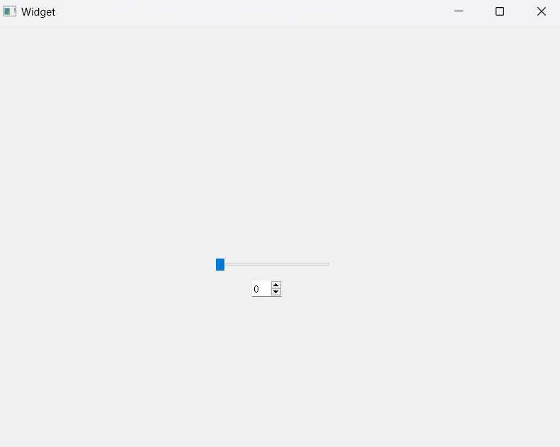

接下来将滑动按钮和数字显示封装在一起，这里注意要在被封装的smart.cpp中写代码，不要再widget.cpp中：

```c++
// QspinBox数字移动->滑动移动
void(QSpinBox::*pro)(int) = &QSpinBox::valueChanged;
connect(ui->spinBox,pro,ui->horizontalSlider,&QSlider::setValue);
// 滑动移动->数字移动
connect(ui->horizontalSlider,&QSlider::valueChanged,ui->spinBox,&QSpinBox::setValue);
```

此时，滑动窗口数字便会移动：


当然也可以通过按钮来获取当前值和调整当前值,再widget.ui中添加：

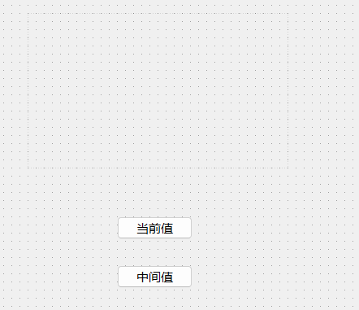

**smart.cpp**

```c++
//设置接口
//设置数字
void smart::setNum(int num){
    ui->spinBox->setValue(num);
}
//获取数字
int smart::getNum(){
    return ui->spinBox->value();
}
```

**smart.h**

```c++
class smart : public QWidget
{
    Q_OBJECT

public:
    explicit smart(QWidget *parent = nullptr);
    ~smart();
    //设置数字
    void setNum(int num);
    //获取数字
    int getNum();
```

**Qwidget.cpp**

```c++
//点击获取 获取当前控件的值
    connect(ui->pushButton,&QPushButton::clicked,[=](){
        qDebug()<<ui->widget->getNum();
    });
    //设置到一半
    connect(ui->pushButton_2,&QPushButton::clicked,[=](){
        ui->widget->setNum(50);
    });
```

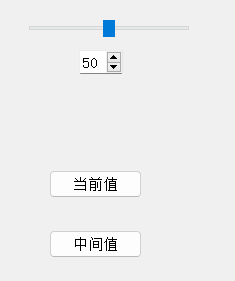


### 5.7 鼠标事件QLabel

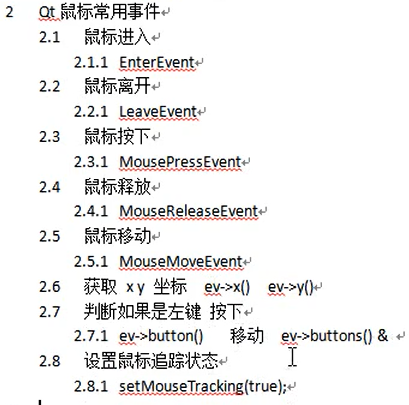


鼠标事件继承的父类中的函数都是虚函数，因此都需要重写

* 进入事件：enterEvent(QEvent *)
* 离开事件：leaveEvent(QEvent *)

首先创建新文件。名字可以随便，但是必须继承父类QWidget

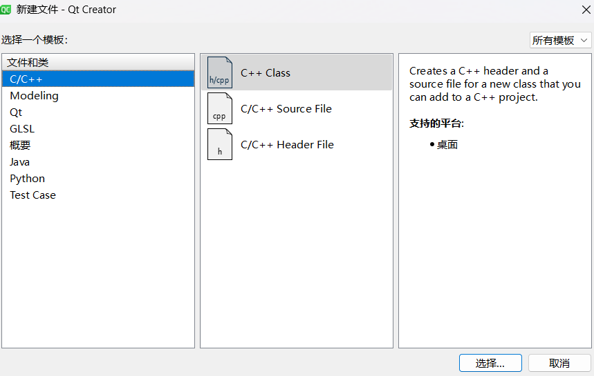

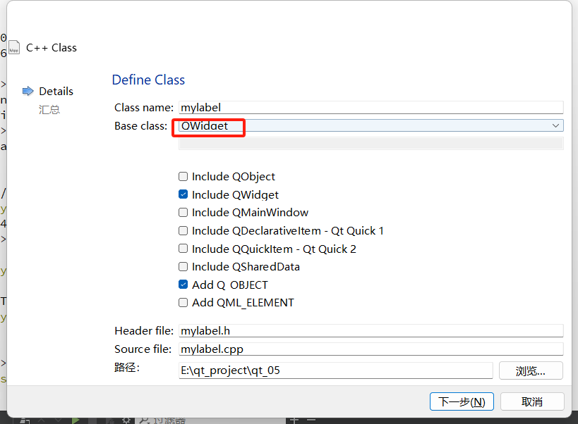

首先需要包含Label类

**mylabel.h:**

```c++
#include <QLabel> //原本是#include <QWidget>
class mylabel : public QLabel  //原本是public QWidegt
{
    Q_OBJECT
public:
    explicit mylabel(QWidget *parent = nullptr);
    //鼠标进入事件捕获
    void enterEvent(QEvent *);
    //鼠标离开事件捕获
    void leaveEvent(QEvent *);
    //鼠标移动事件
    void mouseMoveEvent(QMouseEvent *ev);
    //鼠标按下事件
    void mousePressEvent(QMouseEvent *ev);
    //鼠标释放事件
    void mouseReleaseEvent(QMouseEvent *ev);
signals:

};
```

**mylabel.cpp**

```c++
#include<QString>
#include<QMouseEvent>

mylabel::mylabel(QWidget *parent)
    : QLabel{parent}
{
    setMouseTracking(true); //鼠标追踪事件，只要鼠标移动，就可以输出坐标，
                            // 后面的代码中，如果不设置鼠标追踪事件，必须鼠标左键按下移动才能输出
}
mylabel::mylabel(QWidget *parent)
    : QLabel{parent}  //原本是：QWidegt{parent}
{
}
//鼠标进入事件捕获
void mylabel::enterEvent(QEvent *){
    qDebug() << "鼠标进入了" ;
}
//鼠标离开事件捕获
void mylabel::leaveEvent(QEvent *){
    qDebug() << "鼠标离开了" ;
}
//鼠标移动事件
void mylabel::mouseMoveEvent(QMouseEvent *ev){ 
    //if(ev->buttons()& Qt::LeftButton){ //鼠标移动不能只是单纯判断一个键，这是一个过程
        QString str = QString("鼠标移动, x = %1, y = %2").arg(ev->x()).arg(ev->y());
        qDebug() << str;
   // }  //当进行鼠标追踪时，便不用进行左右键的判断
}
//鼠标按下事件
void mylabel::mousePressEvent(QMouseEvent *ev){
    if (ev->button() == Qt::LeftButton) { //只判断鼠标左键
        QString str = QString("鼠标按下, x = %1, y = %2").arg(ev->x()).arg(ev->y());
        qDebug() << str;
    }
}
//鼠标释放事件
void mylabel::mouseReleaseEvent(QMouseEvent *ev){
    if (ev->button() == Qt::LeftButton) {
        QString str = QString("鼠标释放, x = %1, y = %2").arg(ev->x()).arg(ev->y());
        qDebug() << str;
    }
}
```

对于widget.ui文件需要将label控件提升为mylabel类

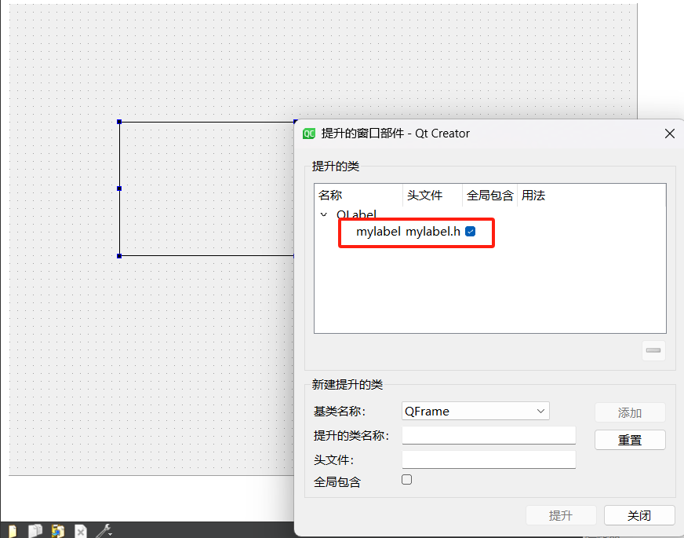

此时点击运行：

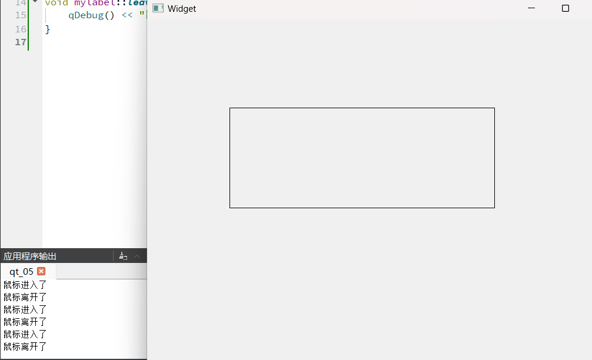

**事件分发器**


* 其实对于所有事件，并不是直接就开始运行，而是通过分发器来进行分发
* 对于鼠标事件，其分发器就是bool event(QEvent)


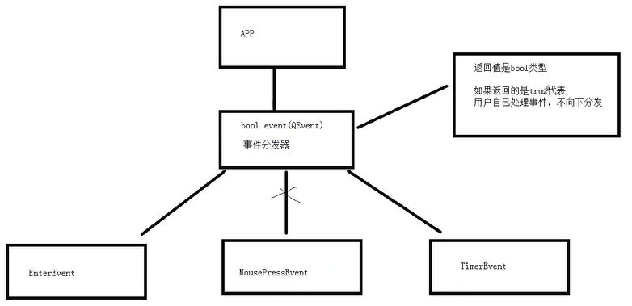

**mylabel.h**

```c++
    //事件分发器
    virtual bool event(QEvent *e) override;
```

**mylabel.cpp**

```c++
//事件分发器
bool mylabel::event(QEvent *e){
    if(e->type() == QEvent::MouseButtonPress){
        //如果是鼠标按下，拦截事件，不向下分发
        QMouseEvent *ev = static_cast<QMouseEvent*>(e);  //将QEvent转换为子类QMouseEvent
        QString str = QString("分发器 按下, x = %1, y = %2").arg(ev->x()).arg(ev->y());
        qDebug() << str;
        return true;  //返回true是拦截
    }
    //其他事件 抛给父类去处理
    return QLabel::event(e);
}
```


### 5.8 定时器事件

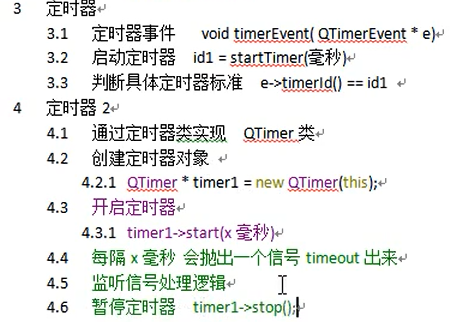

需求:每过一秒钟，让数字+1

不同的定时器有不同的返回唯一标识timeid()，是int类型，通过不同的标识可以绑定到不同的控件

**widget.h**

```c++
#include <QLabel>  //用到QLabel就必须包含进去
class Widget : public QWidget
{
    Q_OBJECT
public:
    Widget(QWidget *parent = nullptr);
    ~Widget();
    
    //添加定时器事件
    void timerEvent(QTimerEvent *);    
    //定时器标识符
    int id1;
    int id2;
private:
    Ui::Widget *ui;
};
```

**widget.cpp**

```c++
Widget::Widget(QWidget *parent)
    : QWidget(parent)
    , ui(new Ui::Widget)
{
    ui->setupUi(this);
    //开启定时器
    id1 = startTimer(1000); //单位 毫秒 1s加一次
    id2 = startTimer(2000);
}

void Widget::timerEvent(QTimerEvent *e){
    if(e->timerId() == id1){
        static int num = 1; //只初始化一次，可以进行累加
        ui->label_2->setText(QString::number(num++)); //将num转换为string
    }

    if(e->timerId() == id2){
        static int num2 = 1;
        ui->label_3->setText(QString::number(num2++)); //2s加一次
    }
}
```

<QTimer>: 除了自己写定时器，QT也有定时器的相关类：

**widget.cpp**

```c++
#include <QPushButton>

Widget::Widget(QWidget *parent)
    : QWidget(parent)
    , ui(new Ui::Widget)
{
    ui->setupUi(this);
    //开启定时器
    id1 = startTimer(1000); //单位 毫秒
    id2 = startTimer(2000);

    //创建定时器对象
    QTimer *tem1 = new QTimer(this);
    tem1->start(500);

    //每隔0.5秒会抛出一个timeout信号
    connect(tem1,&QTimer::timeout,[=](){
        static int num5 = 1;
        ui->label_4->setText(QString::number(num5++)); //0.5s加一次
    });
    
    //点击按钮停止计数
    connect(ui->pushButton,&QPushButton::clicked,[=](){
        tem1->stop();
    });
}
```

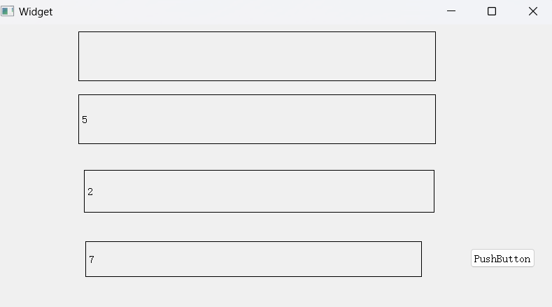

**事件过滤器：**

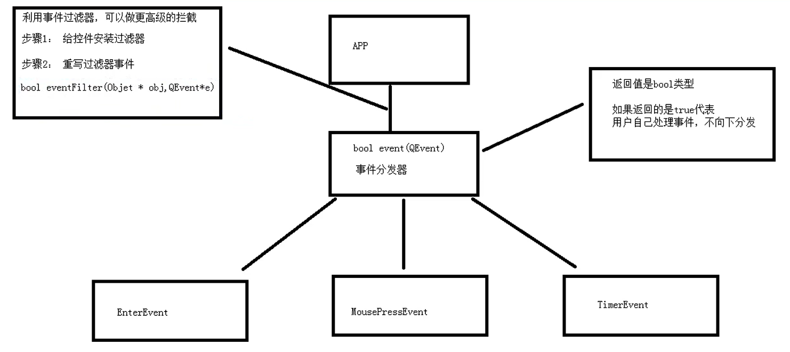


**Widget.h:**

```
    //重写过滤器事件
    bool eventFilter(QObject *,QEvent *);
```

**Widget.cpp:**

```c++
Widget::Widget(QWidget *parent)
    : QWidget(parent)
    , ui(new Ui::Widget)
{
    ui->setupUi(this);
    //开启定时器
    id1 = startTimer(1000); //单位 毫秒 
    
    //给控件安装过滤器
    ui->label->installEventFilter(this);
}
//重写过滤器事件
//可能会拦截很多控件，obj用来区分控件
bool Widget::eventFilter(QObject *obj,QEvent *e){
    if(obj == ui->label){
        if(e->type() == QEvent::MouseButtonPress){
            //如果是鼠标按下，拦截事件，不想下分发
            QMouseEvent *ev = static_cast<QMouseEvent*>(e);  //将QEvent转换为子类QMouseEvent
            QString str = QString("事件过滤器 按下, x = %1, y = %2").arg(ev->x()).arg(ev->y());
            qDebug() << str;
            return true;
    }
    }
    return QWidget::eventFilter(obj,e);
}
```


## 6 QT智能指针


### 6.1 **QSharedPointer**：

* 提供共享所有权的智能指针，多个 `QSharedPointer` 可以指向同一个对象，当最后一个 `QSharedPointer` 被销毁时，指向的对象也会被自动删除。

* 适用于需要在多个地方共享一个对象的场景。

	```c++
	#include <QSharedPointer>
	
	class MyObject {
	public:
	    MyObject() { qDebug() << "MyObject created"; }
	    ~MyObject() { qDebug() << "MyObject destroyed"; }
	    void doSomething() { qDebug() << "Doing something"; }
	};
	
	int main(int argc, char *argv[]) {
	    QCoreApplication a(argc, argv);
	
	    QSharedPointer<MyObject> ptr1(new MyObject());
	    {
	        QSharedPointer<MyObject> ptr2 = ptr1;  // 共享对象
	        ptr2->doSomething();
	    }  // ptr2 作用域结束，对象并未销毁
	
	    ptr1->doSomething();  // ptr1 仍然可以使用对象
	    // 当 ptr1 作用域结束时，对象才会被销毁
	    return a.exec();
	}
	```


### 6.2 **QScopedPointer**：

* 提供独占所有权的智能指针，当 `QScopedPointer` 超出作用域时，指向的对象会自动被删除。

* 适用于需要确保对象在特定作用域结束时自动销毁的场景。

	```c++
	#include <QScopedPointer>
	
	class MyObject {
	public:
	    MyObject() { qDebug() << "MyObject created"; }
	    ~MyObject() { qDebug() << "MyObject destroyed"; }
	    void doSomething() { qDebug() << "Doing something"; }
	};
	
	int main(int argc, char *argv[]) {
	    QCoreApplication a(argc, argv);
	
	    {
	        QScopedPointer<MyObject> ptr(new MyObject());
	        ptr->doSomething();
	    }  // 作用域结束，ptr 自动销毁对象
	
	    return a.exec();
	}
	```


### 6.3 **QPointer**：

* 是一个指向 **QObject** 派生类的弱指针，可以用于跟踪 QObject 对象。当 QObject 被销毁时，`QPointer` 会自动将其指针值设置为 `nullptr`，从而避免使用悬空指针。

* 适用于需要**跟踪 QObject 对象生命周期**的场景。

	```c++
	#include <QPointer>
	#include <QObject>
	
	class MyObject : public QObject {
	    Q_OBJECT
	public:
	    MyObject() { qDebug() << "MyObject created"; }
	    ~MyObject() { qDebug() << "MyObject destroyed"; }
	    void doSomething() { qDebug() << "Doing something"; }
	};
	
	int main(int argc, char *argv[]) {
	    QCoreApplication a(argc, argv);
	
	    QPointer<MyObject> ptr(new MyObject());
	
	    if (ptr) {
	        ptr->doSomething();
	    }
	
	    delete ptr.data();  // 删除对象，ptr 自动变为 nullptr
	
	    if (ptr) {
	        ptr->doSomething();  // 不会执行，因为 ptr 已经是 nullptr
	    } else {
	        qDebug() << "Pointer is null";
	    }
	
	    return a.exec();
	}
	```


### 6.4 c++指针

* **std::unique_ptr** (C++11标准库)：
	* 提供独占所有权的智能指针，确保同一时间只有一个 `std::unique_ptr` 可以指向某个对象，当 `std::unique_ptr` 被销毁时，对象也会被自动删除。
	* 适用于明确需要独占所有权且无需共享的场景。

* **std::shared_ptr** (C++11标准库)：

	* 提供共享所有权的智能指针，多个 `std::shared_ptr` 可以指向同一个对象，并通过引用计数管理对象的生命周期。

	* 适用于跨模块或线程共享对象的场景。


# 二、QT通信

## 1 QT串口通信

### 1.1 界面配置

首先创建一个通信界面：

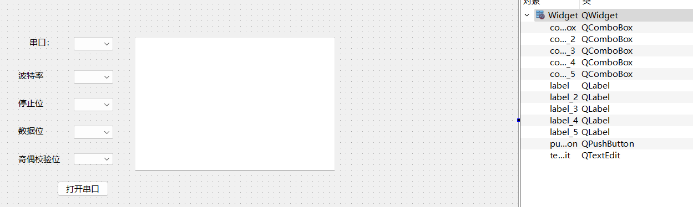

然后将QT += serialport写入.pro文件，**写入完成后一定要构建一次代码**。


然后将串口通信需要的类<QSerialPort>和<QSerialPortinfo>写入头文件**widget.h**：

* QSerialPort：提供可通过的端口
* QSerialPortinfo：提供已存在的端口信息


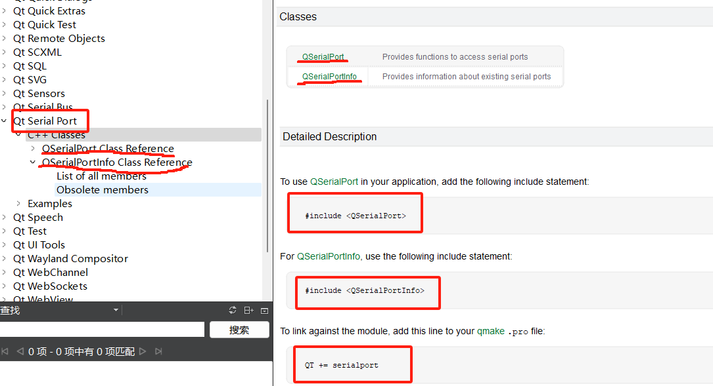


### 1.2 代码开始：

1. 首先转到该按钮的槽函数，整个通信的步骤如下所示：


```c++
//配置串口数据并打开
void Widget::on_pushButton_clicked()  //按钮绑定
{
    //1.选择你要打开的端口
    
    //2、设置波特率
    
    //3、设置奇偶校验位
    
    //4、设置停止位
    
    //5、打开串口
       
}
```

 2.获取可用串口，绑定在comoBox上：

```c++
    //首先获取设备上可用的端口号
    QList<QSerialPortInfo> list = QSerialPortInfo::availablePorts();
    for(int i =0;i<list.size();i++){
        ui->comboBox->addItem(list.at(i).portName());  //显示在串口中
    }
```

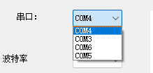

3.设置QSerialPort类对象指针来进行操作：

widget.h:

```c++
private:
    Ui::Widget *ui;

    QSerialPort *serial;
};
```

widget.cpp:

```c++
//创建一个串口类对象
serial = new QSerialPort;
//配置串口数据并打开
void Widget::on_pushButton_clicked()  //按钮绑定
{
    //1.选择你要打开的端口
    //2、设置波特率
    //3、设置奇偶校验位
    //4、设置停止位
    //5、打开串口
}
```

* 选择要打开的端口

	```c++
	serial->setPort(QSerialPortInfo(ui->comboBox->currentText()));
	```

* 设置波特率：将光标放到setBaudRate处，点击该处字符串：

 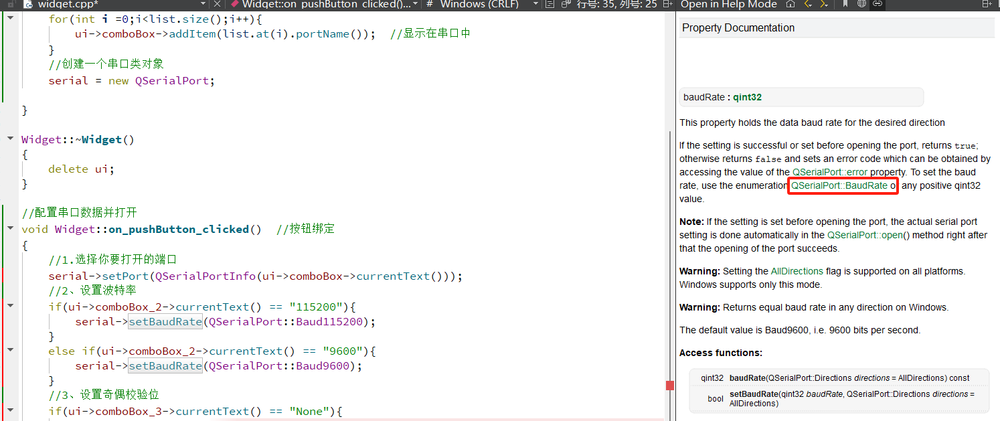

	会出现每个波特率对应的QSerialPort：
	
	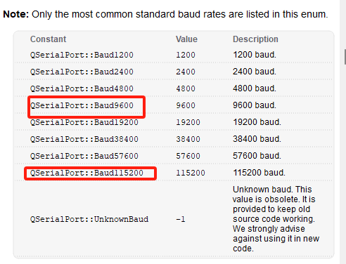

```c++
    if(ui->comboBox_2->currentText() == "115200"){
        serial->setBaudRate(QSerialPort::Baud115200);
    }
    else if(ui->comboBox_2->currentText() == "9600"){
        serial->setBaudRate(QSerialPort::Baud9600);
    }
```

* 设置奇偶校验位，方法同样在setParity处点击F1，寻找枚举类型点击Parity

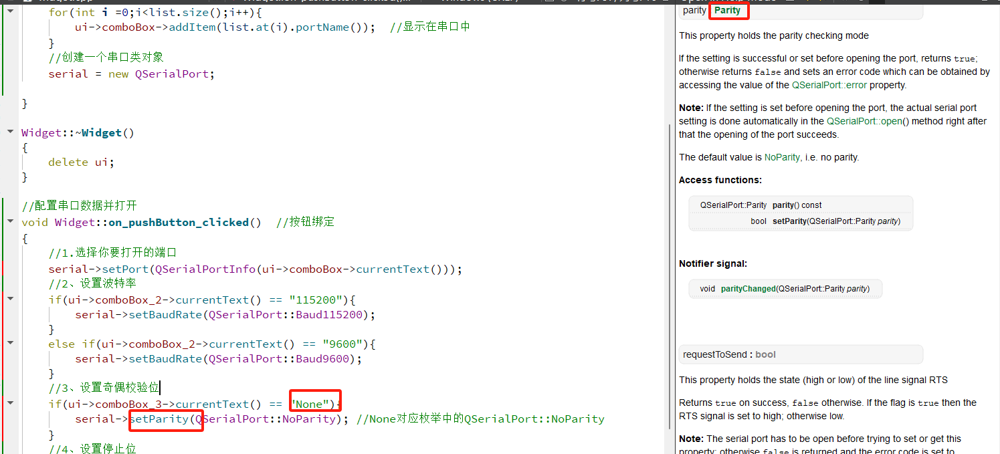

其中None对应的枚举类型为：

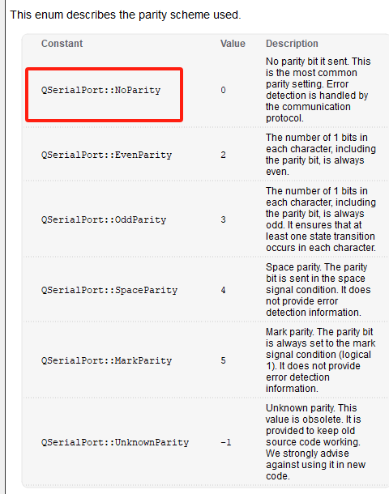

```c++
    //3、设置奇偶校验位
    if(ui->comboBox_3->currentText() == "None"){
        serial->setParity(QSerialPort::NoParity); //None对应枚举中的QSerialPort::NoParity
    }
    else if(ui->comboBox_3->currentText() == "Even"){
        serial->setParity(QSerialPort::EvenParity); //None对应枚举中的QSerialPort::EvenParity
    }
    else if(ui->comboBox_3->currentText() == "Odd"){
        serial->setParity(QSerialPort::OddParity); //None对应枚举中的QSerialPort::OddParity
    }
```

* 停止位的设置：

和上面一样：

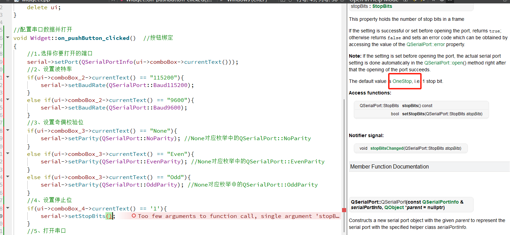

对应的枚举类型：

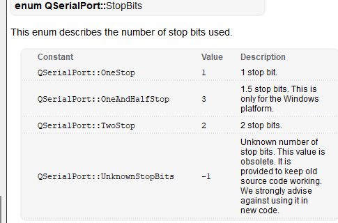

```c++
    //4、设置停止位
    if(ui->comboBox_4->currentText() == "1"){
        serial->setStopBits(QSerialPort::OneStop);
    }
    else if(ui->comboBox_4->currentText() == "1.5"){
        serial->setStopBits(QSerialPort::OneAndHalfStop);
    }
    else if(ui->comboBox_4->currentText() == "2"){
        serial->setStopBits(QSerialPort::TwoStop);
    }
```

* 打开串口：

```c++
//5、打开串口
bool info =  serial->open(QIODevice::ReadWrite);
if(info == true){
    qDebug() << "sucess" ;
}else{
    qDebug() << "fail" ;
}
```

这样一个发送信号写好了：

```C++
//配置串口数据并打开
void Widget::on_pushButton_clicked()  //按钮绑定
{
    //1.选择你要打开的端口
    serial->setPort(QSerialPortInfo(ui->comboBox->currentText()));
    //2、设置波特率
    if(ui->comboBox_2->currentText() == "115200"){
        serial->setBaudRate(QSerialPort::Baud115200);
    }
    else if(ui->comboBox_2->currentText() == "9600"){
        serial->setBaudRate(QSerialPort::Baud9600);
    }
    //3、设置奇偶校验位
    if(ui->comboBox_3->currentText() == "None"){
        serial->setParity(QSerialPort::NoParity); //None对应枚举中的QSerialPort::NoParity
    }
    else if(ui->comboBox_3->currentText() == "Even"){
        serial->setParity(QSerialPort::EvenParity); //None对应枚举中的QSerialPort::EvenParity
    }
    else if(ui->comboBox_3->currentText() == "Odd"){
        serial->setParity(QSerialPort::OddParity); //None对应枚举中的QSerialPort::OddParity
    }
    //4、设置停止位
    if(ui->comboBox_4->currentText() == "1"){
        serial->setStopBits(QSerialPort::OneStop);
    }
    else if(ui->comboBox_4->currentText() == "1.5"){
        serial->setStopBits(QSerialPort::OneAndHalfStop);
    }
    else if(ui->comboBox_4->currentText() == "2"){
        serial->setStopBits(QSerialPort::TwoStop);
    }
    //5、打开串口
    bool info =  serial->open(QIODevice::ReadWrite);
    if(info == true){
        qDebug() << "sucess" ;
    }else{
        qDebug() << "failuse" ;
    } 
}
```

当发送信号写完之后便准备**接收**：

widget.h:

```c++
private slots:
    void on_pushButton_clicked();
    void recvSLOTS(void);  //声明一个接收的槽函数
```

widget.cpp:

先将信号与槽函数绑定

```c++
//接收数据
connect(serial,&QSerialPort::readyRead,this,&Widget::recvSLOTS);
//接收数据的槽函数
void Widget::recvSLOTS(){
    //1读取数据
    QByteArray data = serial->readAll();
    //2、显示
    ui->textEdit->append(data);
}
```

### 1.3 代码完成：

最终的widget.h代码：

```c++
#ifndef WIDGET_H
#define WIDGET_H

#include <QSerialPort>
#include <QSerialPortInfo>
#include <QWidget>
#include <QDebug>

QT_BEGIN_NAMESPACE
namespace Ui { class Widget; }
QT_END_NAMESPACE

class Widget : public QWidget
{
    Q_OBJECT

public:
    Widget(QWidget *parent = nullptr);
    ~Widget();

private slots:
    void on_pushButton_clicked();
    void recvSLOTS(void);

private:
    Ui::Widget *ui;

    QSerialPort *serial;
};
#endif // WIDGET_H
```

widget.cpp：

```c++
#include "widget.h"
#include "ui_widget.h"
#include <QIODevice>

Widget::Widget(QWidget *parent)
    : QWidget(parent)
    , ui(new Ui::Widget)
{
    ui->setupUi(this);

    //首先获取设备上可用的端口号
    QList<QSerialPortInfo> list = QSerialPortInfo::availablePorts();
    for(int i =0;i<list.size();i++){
        ui->comboBox->addItem(list.at(i).portName());  //显示在串口中
    }
    //创建一个串口类对象
    serial = new QSerialPort;
    //接收数据
    connect(serial,&QSerialPort::readyRead,this,&Widget::recvSLOTS);
}

Widget::~Widget()
{
    delete ui;
}

//配置串口数据并打开
void Widget::on_pushButton_clicked()  //按钮绑定
{
    //1.选择你要打开的端口
    serial->setPort(QSerialPortInfo(ui->comboBox->currentText()));
    //2、设置波特率
    if(ui->comboBox_2->currentText() == "115200"){
        serial->setBaudRate(QSerialPort::Baud115200);
    }
    else if(ui->comboBox_2->currentText() == "9600"){
        serial->setBaudRate(QSerialPort::Baud9600);
    }
    //3、设置奇偶校验位
    if(ui->comboBox_3->currentText() == "None"){
        serial->setParity(QSerialPort::NoParity); //None对应枚举中的QSerialPort::NoParity
    }
    else if(ui->comboBox_3->currentText() == "Even"){
        serial->setParity(QSerialPort::EvenParity); //None对应枚举中的QSerialPort::EvenParity
    }
    else if(ui->comboBox_3->currentText() == "Odd"){
        serial->setParity(QSerialPort::OddParity); //None对应枚举中的QSerialPort::OddParity
    }
    //4、设置停止位
    if(ui->comboBox_4->currentText() == "1"){
        serial->setStopBits(QSerialPort::OneStop);
    }
    else if(ui->comboBox_4->currentText() == "1.5"){
        serial->setStopBits(QSerialPort::OneAndHalfStop);
    }
    else if(ui->comboBox_4->currentText() == "2"){
        serial->setStopBits(QSerialPort::TwoStop);
    }
    //5、打开串口
    bool info =  serial->open(QIODevice::ReadWrite);
    if(info == true){
        qDebug() << "sucess" ;
    }else{
        qDebug() << "failuse" ;
    }
   
}
//接收数据的槽函数
void Widget::recvSLOTS(){
    //1读取数据
    QByteArray data = serial->readAll();
    //2、显示
    ui->textEdit->append(data);
}
```

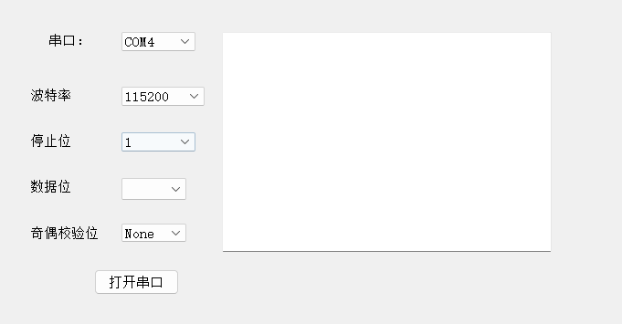


## 2 QT网络通信

​		在标准C++ 没有提供专门用于套接字通信的类，所以只能使用操作系统提供的基于C的 API函数，基于这些C的 API函数我们也可以封装自己的 C++类，C++ 套接字类的封装，但是 Qt 就不一样了，它是 C++的一个框架并且里边提供了用于套接字通信的类（TCP、UDP），这样就使得我们的操作变得更加简单了(当然，在qt中使用标准c的API进行套接字通信也是完全没有问题的 )。

* tcp是面向连接的，发送前必须建立连接，有三次握手、四次挥手，UDP是无连接的。
* TCP有确认重传机制和差错校验、拥塞控制，提供可靠服务，UDP没有拥塞控制，网络出现拥塞时不会使源主机的发送速率降低。
* TCP是点对点的，UDP支持一对多。

### 2.1 TCP通信

#### 2.1.1 通信流程

​	**TCP服务器：**

1. 服务器先创建套接字：socket
2. 再绑定一个固定IP和端口：bind
3. 设置监听：listen
	* 让套接字进入监听状态，并指定队列中最大连接数。监听传入的连接请求
		* 在TCP/IP网络通信中，当服务器监听（`listen`）在特定的端口上时，它并不会立即与尝试连接的客户端建立连接。相反，服务器会维护一个**连接队列**（也称为**监听队列**或未完成连接队列），用于存放那些已经到达但尚未被服务器接受的客户端连接请求。
		* 这个连接队列的工作机制大致如下：
			1. **监听状态**：服务器通过调用`listen()`函数进入监听状态，并指定一个监听队列的大小（这个大小限制了可以同时等待处理的连接请求的最大数量）。
			2. **连接请求到达**：当一个客户端尝试与服务器建立连接时，它会向服务器的IP地址和端口号发送一个**连接请求（SYN包）**。这个请求会被操作系统的网络协议栈捕获，并放入到服务器的监听队列中等待处理。
			3. **接受连接**：服务器通过调用`accept()`函数来从监听队列中取出（或“接受”）一个连接请求。如果监听队列非空，`accept()`会立即返回一个已连接的套接字（也称为已建立的套接字），该套接字可以用于与客户端之间的数据交换。如果监听队列为空，`accept()`可能会阻塞（即等待），直到有新的连接请求到达并被放入队列中。
			4. **数据交换**：一旦服务器接受了客户端的连接请求，它就可以通过返回的已连接套接字与客户端进行数据的读写操作了。
			5. **关闭连接**：当数据传输完成或需要关闭连接时，服务器和客户端都会调用`close()`函数来关闭各自的套接字，释放相关资源。

4. 等待客户端连接：accept()
  * `accept()`函数会创建一个新的套接字（称为已连接套接字），用于与客户端进行通信。原始套接字（即监听套接字）则继续留在监听状态，接受来自其他客户端的连接请求。

5. 客户端连接之后，接收和发送数据：read/write
6. 最终，关闭套接字：close
	* 先关闭连接套接字，再关闭监听套接字


​	**TCP客户端：**

* 先创建套接字：socket
* 再建立连接：connect
* 进行数据通信：write/read
* 关闭套接字：close


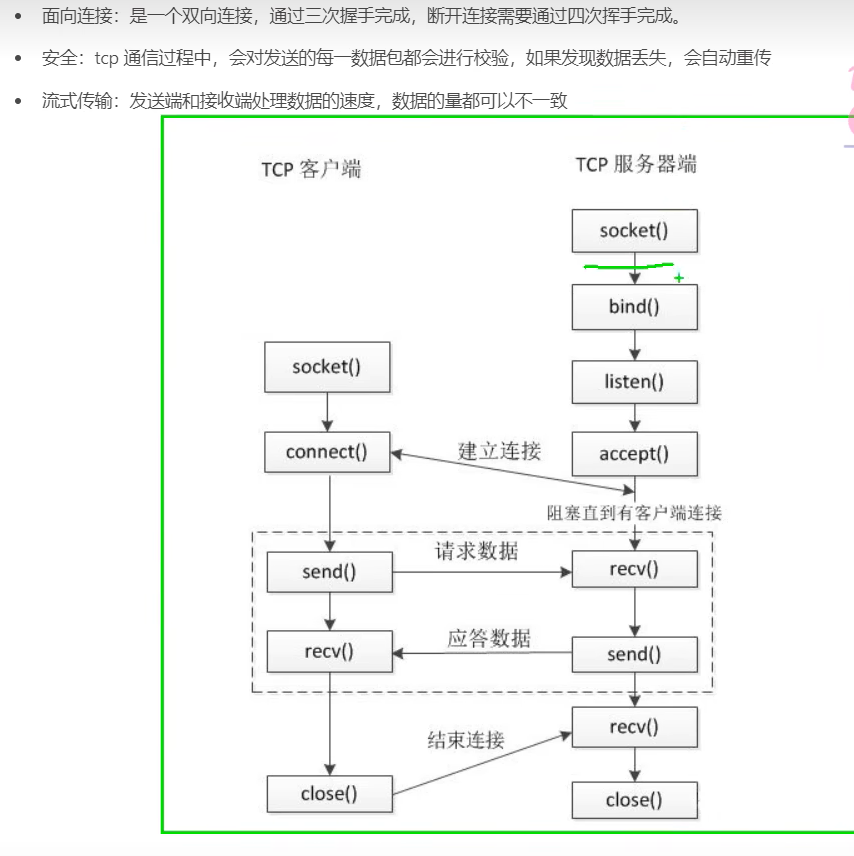

使用Qt提供的类进行基于TCP的套接字通信需要用两个类：

* **QTcpServer**：服务类，同于监听客户端连接以及客户端建立连接
* **QTcpSocket**：通信的套接字类，客户端、服务器都需要使用
* 两个类都属于网络模块Network，而network与Qfile都属于QIOdevice类的子类。

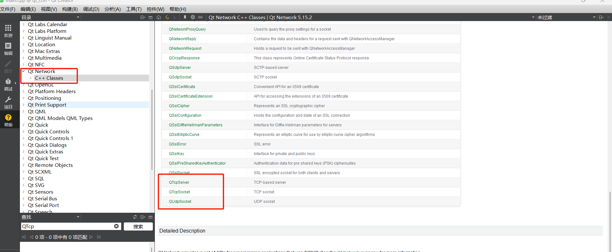


#### 2.1.2  QTcpServer

首先将network包含进.pro文件，**点击构建。**

其父类

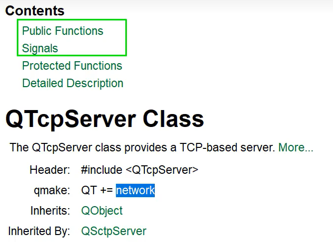

**步骤：**

**1、设置监听对象**

> QTcpServer**构造函数:**
>
> QTcpServer::QTcpServer(QObject *parent = Q_NULLPTR)

* 其构造函数参数用指定一个父对象，**对象树**通过将当前结点连接在父对象的下面，当父对象析构时也会将子节点析构，主要用来**设置监听对象**。

```c++
QTcpServer::QTcpServer(QObject *parent = Q_NULLPTR)
```

**2、给监听的套接字设置监听**

```c++
bool QTcpServer::listen(const QHostAddress &address = QHostAddress::Any, quint16 port = 0); 
// 判断当前对象是否在监听, 是返回true，没有监听返回false
bool QTcpServer::isListening() const; 
// 如果当前对象正在监听，返回监听的服务器地址信息, 否则返回 QHostAddress::Null
QHostAddress QTcpServer::serverAddress() const; //返回绑定的IP地址
// 如果服务器正在侦听连接，则返回服务器的端口; 否则返回0
quint16 QTcpServer::serverPort() const //返回绑定的端口号
```

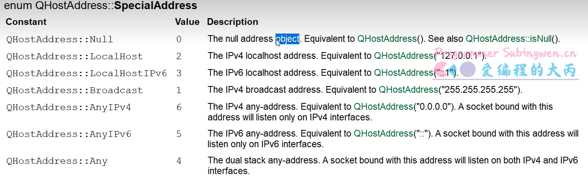

* listen()函数参数：可以监听所绑定的进程（IP+port）
	* address：通过类QHostAddress可以封装IPv4、IPv6格式的IP地址，QHostAddress::Any表示自动绑定
		* IP定位主机，port定位端口，可以连接任何具体进程
	* port：如果指定为0表示随机绑定一个可用端口，因此必须指定端口，因为客户端也要绑定端口，因此不能随机。
	* 返回值：绑定成功返回true，失败返回false

**3、获取与客户端连接用于通信的QTcpSocket套接字对象**

​        得到和客户端建立连接之后用于通信的QTcpSocket套接字对象，它是QTcpServer的一个子对象，当QTcpServer对象析构的时候会自动析构这个子对象，当然也可自己手动析构，建议用完之后自己手动析构这个通信的QTcpSocket对象。

```c++
QTcpSocket *QTcpServer::nextPendingConnection(); //返回对象指针，指向一片堆内存
```

* QTcpServer是父对象，QTcpSocket是子节点，两个不是继承关系，但是QTcpSocket析构后也会自动析构QTcpSocket

**4、阻塞等待客户端的连接请求**

阻塞等待客户端发起的连接请求，不推荐在单线程程序中使用，建议使用非阻塞方式处理新连接，即使用信号**newConnection() 。**

```c++
bool QTcpServer::waitForNewConnection(int msec = 0, bool *timedOut = Q_NULLPTR);
```

* 参数：
	* msec：指定阻塞的最大时长，单位为毫秒（ms）
	* timeout：传出参数，如果操作超时timeout为true，没有超时timeout为false

信号：

当接受新连接导致错误时，将发射如下信号。socketError参数描述了发生的错误相关的信息。

```c++
[signal] void QTcpServer::acceptError(QAbstractSocket::SocketError socketError);
```

每次有新连接可用时都会发出 newConnection() 信号。

```c++
[signal] void QTcpServer::newConnection();
```


#### 2.1.3  QTcpSocket

QTcpSocket是一个套接字通信类，不管是客户端还是服务器端都需要使用。在Qt中发送和接收数据也属于IO操作（网络IO），先来看一下这个类的继承关系：


**1、首先获取套接字对象**

```c++
QTcpSocket::QTcpSocket(QObject *parent = Q_NULLPTR);
```

**2、连接服务器**

需要指定服务器端绑定的IP和端口信息。

* 绑定时机：服务器端进行监听listen()时

```c++
[virtual] void QAbstractSocket::connectToHost(const QString &hostName, quint16 port, OpenMode openMode = ReadWrite, NetworkLayerProtocol protocol = AnyIPProtocol);

[virtual] void QAbstractSocket::connectToHost(const QHostAddress &address, quint16 port, OpenMode openMode = ReadWrite);
```

* 参数：
	* hostName：IP地址，也可以用QHostAddress进行封装，
	* quint16 port：服务器端绑定的端口
	*  OpenMode：打开方式（读/写），即对维护的那一段内存有什么样的权限。

**3、接收数据：read**

在Qt中不管调用读操作函数接收数据，还是调用写函数发送数据，**操作的对象都是本地的由Qt框架维护的一块内存（读写缓冲区）。**

使用QTcpSocket套接字进行通信时，无论是数据的发送和接受，都不是操作网络中的数据，而是操作本地数据。当QT框架接收到数据时，QT框架**会维护一段内存**，当**一端读数据时，读的是维护的内存中的数据**，而不是网络中的数据。同样发送数据时，QT会将数据先写入维护的那段内存，然后再进行发送。

因此，调用了发送函数数据不一定会马上被发送到网络中，调用了接收函数也不是直接从网络中接收数据，关于底层的相关操作是不需要使用者来维护的。

```c++
// 指定可接收的最大字节数 maxSize 的数据到指针 data 指向的内存中
qint64 QIODevice::read(char *data, qint64 maxSize);
// 指定可接收的最大字节数 maxSize，返回接收的字符串
QByteArray QIODevice::read(qint64 maxSize);
// 将当前可用操作数据全部读出，通过返回值返回读出的字符串
QByteArray QIODevice::readAll();
```

**4、发送数据：write**

```c++
// 发送指针 data 指向的内存中的 maxSize 个字节的数据
qint64 QIODevice::write(const char *data, qint64 maxSize);
// 发送指针 data 指向的内存中的数据，字符串以 \0 作为结束标记
qint64 QIODevice::write(const char *data);
// 发送参数指定的字符串
qint64 QIODevice::write(const QByteArray &byteArray);
```

**5、信号**

在使用QTcpSocket进行套接字通信的过程中，如果该类对象发射出readyRead()信号，说明对端发送的数据达到了，之后就可以调用 read 函数接收数据了。

```c++
[signal] void QIODevice::readyRead();
```

调用connectToHost()函数并成功建立连接之后发出connected()信号。

```c++
[signal] void QAbstractSocket::connected();
```

在套接字断开连接时发出disconnected()信号。

```c++
[signal] void QAbstractSocket::disconnected();
```


#### 2.1.4  通信开始

**服务器端通信流程**

* **创建套接**字服务器QTcpServer对象
* 通过QTcpServer对象**设置监听**，即：QTcpServer::listen()
* 基于QTcpServer::newConnection()信号**检测是否有新的客户端连接**
* 如果有新的客户端连接调用QTcpSocket *QTcpServer::nextPendingConnection()**得到通信的套接字对象**
* 使用通信的套接字对象QTcpSocket和客户端进行**通信**
	* 通信：read和write，不操作网络数据，操作内存缓冲区中的数据

**客户端通信流程：**

* 创建通信的套接字类QTcpSocket对象
* 使用服务器端绑定的IP和端口连接服务器QAbstractSocket::connectToHost()
* 使用QTcpSocket对象和服务器进行通信


**服务器代码：**

界面：

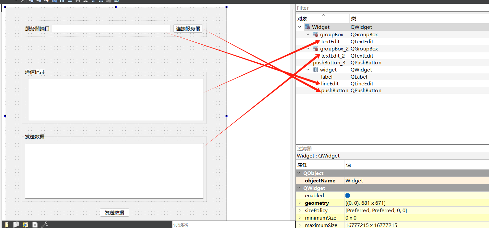


1、添加父类进去.pro文件，创建**QtcpServer对象**指针

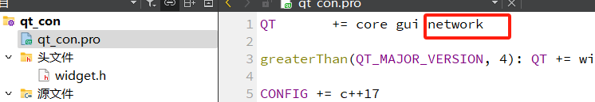

2、设置监听，由pushButton（连接服务器）按钮跳转槽函数：

```c++
    ui->lineEdit->setText("8899"); //设置默认端口号进行测试
    //创建监听的服务器对象
    m_s = new QTcpServer(this); //this绑定在当前对象树下，不用指针的管理释放

//监听设置
void Widget::on_pushButton_clicked() //连接服务器按钮,按下按钮是设置监听
{
    unsigned short port = ui->lineEdit->text().toUShort(); //读出服务器端口，并转换为UShort无符号短整型
    //开始监听
    m_s->listen(QHostAddress::Any,port); //绑定本地的任意IP地址，并指定端口8899
    ui->pushButton->setDisabled(true); //将连接服务器按钮设置为不可见
}
```

3、检测是否有新的客户端连接

```c++
    connect(m_s,&QTcpServer::newConnection,this,[=](){ //当有客户端连接时发送newConnection信号
        QTcpSocket * tcp = m_s->nextPendingConnection();  //用匿名函数来获取通信的套接字对象

        //检测是否可以接收数据 ->将接收数据显示在textEdit中
        connect(tcp,&QTcpSocket::readyRead,this,[=](){
            QByteArray data = tcp->readAll();
            ui->textEdit->append("客户端say:" + data);
        });
    });
```

4、开始网络通信：

给客户端回复数据：由发送数据跳转槽函数

```c++
void Widget::on_pushButton_3_clicked()  //发送数据按钮
{
    QString msg = ui->textEdit_2->toPlainText(); //以纯文本的方式，读取要发送的数据
    m_tcp->write(msg.toUtf8()); //通过套接字将文本编辑框取到的字符串传递给write函数，再通过write发送数据
    ui->textEdit->append("服务器端say:" + msg);
} 
```

这里由于发送数据时原tcp定义在类中，不是全局变量无法获取到套接字，因此定义为全局变量m_tcp：

widget.h中添加：

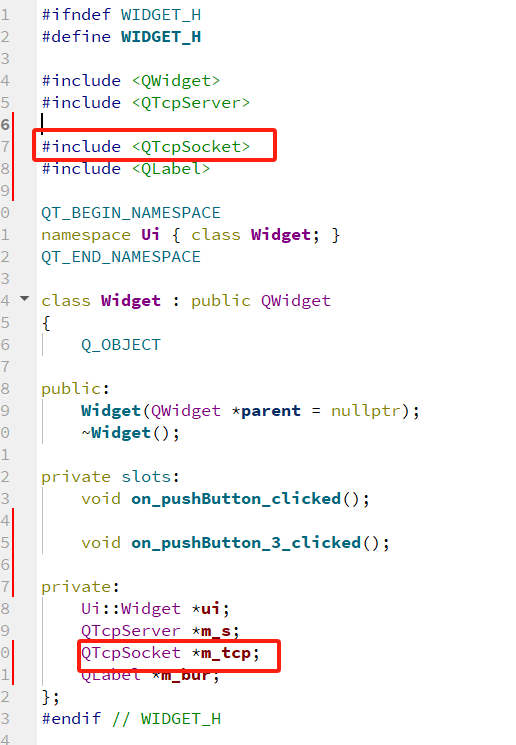

将第三步是否有新的客户端连接中的tcp改为m_tcp：

```C
    connect(m_s,&QTcpServer::newConnection,this,[=](){ //当有客户端连接时发送newConnection信号
        QTcpSocket * m_tcp = m_s->nextPendingConnection();  //用匿名函数来获取通信的套接字对象

        //检测是否可以接收数据 ->将接收数据显示在textEdit（通信记录）中
        connect(m_tcp,&QTcpSocket::readyRead,this,[=](){
            QByteArray data = m_tcp->readAll();
            ui->textEdit->append("客户端say:" + data);

        });
    });
```

然后为界面添加状态栏：

先在mainWindow.h中声明状态栏父类QLabel，再声明变量m_bur;

```c++
#inlcude<QLabel>
private:
QLabel *m_bur;
```

mainWindow.cpp:

首先是未连接状态：

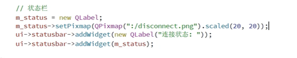

其次是连接状态，图像会变：

```c++
m_status->setPixmap(QPixmap("./connect,ong").scaled(20,20));
```

5、当断开连接时：

```C++
        //判断是否断开连接，
        connect(m_tcp,&QTcpSocket::disconnected,this,[=](){
            m_tcp->close(); //关闭套接字
            m_tcp->deleteLater(); //释放m_tcp指针
        });
```


**客户端：**

先将服务器端项目复制一份重命名，项目文件名称与.pro文件名称相同，删除.user文件。然后双击打开.pro文件进行配置

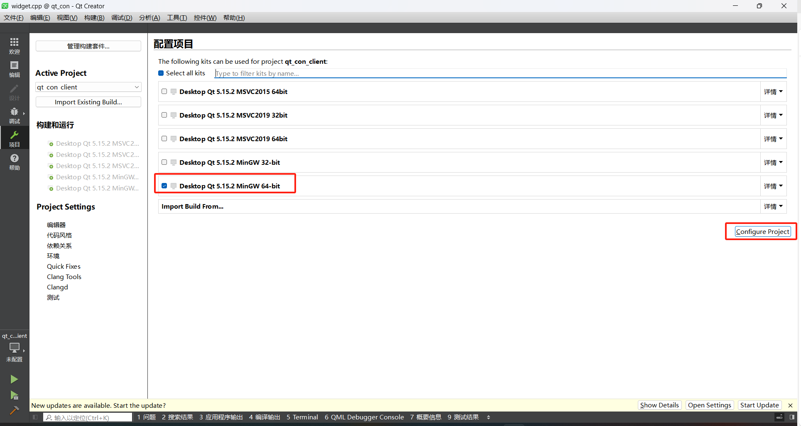

客户端并不需要QTcpServer，进行删除。

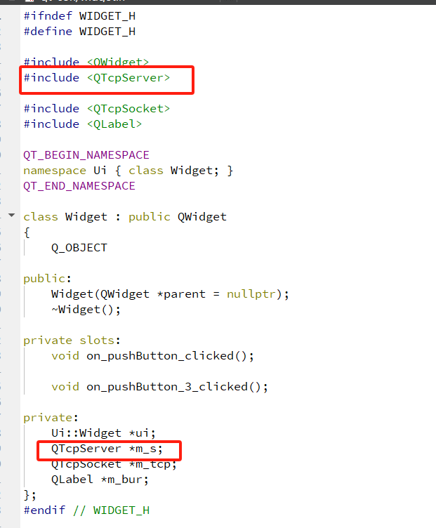

然后用QTcpsocket创建客户端套接字对象

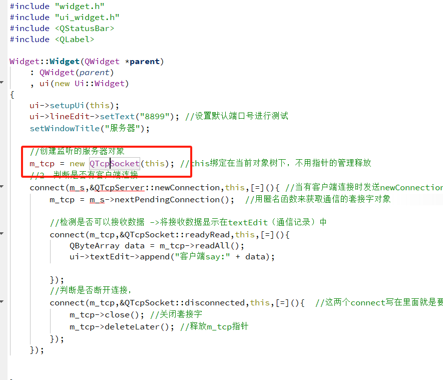

客户端界面：

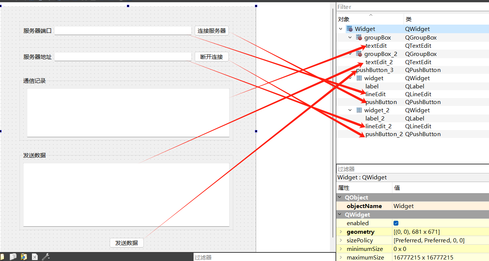


**服务器端代码：**

.h

```c++
#ifndef WIDGET_H
#define WIDGET_H
#include <QWidget>
#include <QTcpServer>
#include <QTcpSocket>
#include <QLabel>

QT_BEGIN_NAMESPACE
namespace Ui { class Widget; }
QT_END_NAMESPACE

class Widget : public QWidget
{
    Q_OBJECT

public:
    Widget(QWidget *parent = nullptr);
    ~Widget();

private slots:
    void on_pushButton_clicked();

    void on_pushButton_3_clicked();

private:
    Ui::Widget *ui;
    QTcpServer *m_s;
    QTcpSocket *m_tcp;
    QLabel *m_bur;
};
#endif // WIDGET_H
```

.cpp

```c++
#include "widget.h"
#include "ui_widget.h"
#include <QStatusBar>
#include <QLabel>

Widget::Widget(QWidget *parent)
    : QWidget(parent)
    , ui(new Ui::Widget)
{
    ui->setupUi(this);
    ui->lineEdit->setText("8899"); //设置默认端口号进行测试
    setWindowTitle("服务器");

    //1、创建监听的服务器对象
    m_s = new QTcpServer(this); // this绑定在当前对象树下，不用指针的管理释放
    //3、判断是否有客户端连接
    connect(m_s,&QTcpServer::newConnection,this,[=](){ //当有客户端连接时发送newConnection信号
        m_tcp = m_s->nextPendingConnection();    	   //用匿名函数来获取通信的套接字对象

        //检测是否可以接收数据 ->将接收数据显示在textEdit（通信记录）中
        connect(m_tcp,&QTcpSocket::readyRead,this,[=](){
            QByteArray data = m_tcp->readAll();
            ui->textEdit->append("客户端say:" + data);

        });
        //判断是否断开连接，
        connect(m_tcp,&QTcpSocket::disconnected,this,[=](){//这两个connect写在里面就是要等m_tcp实例化后才能进行操作
            m_tcp->close(); //关闭套接字
            m_tcp->deleteLater(); //释放m_tcp指针
        });
    });
}

Widget::~Widget()
{
    delete ui;
}

//2、监听设置
void Widget::on_pushButton_clicked() //监听按钮,按下按钮是设置监听
{
    unsigned short port = ui->lineEdit->text().toUShort(); //读出服务器端口，并转换为UShort无符号短整型
    //开始监听
    m_s->listen(QHostAddress::Any,port); //绑定本地的任意IP地址，并指定端口8899
    ui->pushButton->setDisabled(true); //监听服务器按钮设置为不可见
}

//4、发送数据开始通信
void Widget::on_pushButton_3_clicked()  //发送数据按钮
{
    QString msg = ui->textEdit_2->toPlainText(); //以纯文本的方式，读取要发送的数据
    m_tcp->write(msg.toUtf8()); //通过套接字将文本编辑框取到的字符串传递给
    ui->textEdit->append("服务器端say:" + msg); //将发送的数据显示在通信记录中
}
```

客户端代码：

.h

```c++
#ifndef WIDGET_H
#define WIDGET_H
#include <QWidget>
#include <QTcpSocket>
#include <QLabel>

QT_BEGIN_NAMESPACE
namespace Ui { class Widget; }
QT_END_NAMESPACE

class Widget : public QWidget
{
    Q_OBJECT

public:
    Widget(QWidget *parent = nullptr);
    ~Widget();

private slots:
    void on_pushButton_clicked();

    void on_pushButton_3_clicked();

    void on_pushButton_2_clicked();

private:
    Ui::Widget *ui;
    QTcpSocket *m_tcp;
    QLabel *m_bur;
};
#endif // WIDGET_H
```

.cpp

```c++
#include "widget.h"
#include "ui_widget.h"
#include <QStatusBar>
#include <QLabel>
#include<QHostAddress>


Widget::Widget(QWidget *parent)
    : QWidget(parent)
    , ui(new Ui::Widget)
{
    ui->setupUi(this);
    ui->lineEdit_2->setText("127.0.0.1"); //设置默认IP地址
    ui->lineEdit->setText("8899"); //设置默认端口号进行测试
    setWindowTitle("客户端");
    ui->pushButton_2->setDisabled(true);   //刚开始断开链接的按钮是不可用的
    //创建套接字对象
    m_tcp = new QTcpSocket(this); //this绑定在当前对象树下，不用指针的管理释放
    
    //检测是否可以接收数据 ->将接收数据显示在textEdit（通信记录）中
    connect(m_tcp,&QTcpSocket::readyRead,this,[=](){ //当m_tcp发射出readRead()信号
        QByteArray data = m_tcp->readAll();  //调用readALL();读数据并用data接收
        ui->textEdit->append("服务器say:" + data); //显示
        });
    
    //判断服务器是否断开连接，
    connect(m_tcp,&QTcpSocket::disconnected,this,[=](){  //当m_tcp发出disconnected信号，服务器端断开连接
        m_tcp->close(); //关闭套接字
        m_tcp->deleteLater(); //释放m_tcp指针
        ui->textEdit->append("服务器和客户端断开链接");
        ui->pushButton->setDisabled(false);  //断开连接后，连接按钮可再次点击
        ui->pushButton_2->setDisabled(true); //断开连接按钮无法点击
    });
    
    connect(m_tcp,&QTcpSocket::connected,this,[=](){
        ui->textEdit->append("已经成功和服务器连接");
        ui->pushButton->setDisabled(true);  //连接成功后，连接按钮无法点击
        ui->pushButton_2->setDisabled(true); //断开连接按钮无法点击
    });

}

Widget::~Widget()
{
    delete ui;
}

//1、监听设置
void Widget::on_pushButton_clicked() //点击连接服务器按钮来连接服务器
{
    QString ip = ui->lineEdit_2->text(); //读出窗口的IP地址
    unsigned short port = ui->lineEdit->text().toUShort(); //读出端口，并转换为UShort无符号短整型
    //开始连接
    m_tcp->connectToHost(QHostAddress(ip),port); //连接服务器函数connectToHost，将ip地址包装进QHostAddress()
}


void Widget::on_pushButton_3_clicked()  //发送数据按钮
{
    QString msg = ui->textEdit_2->toPlainText(); //以纯文本的方式，读取要发送的数据
    m_tcp->write(msg.toUtf8()); //发送给服务器
    ui->textEdit->append("客户端say:" + msg); //将发送的数据显示在通信记录中
}

void Widget::on_pushButton_2_clicked()
{
    m_tcp->close(); //断开连接后。关闭套接字
    ui->pushButton->setDisabled(false);    //断开连接，连接服务器按钮可用
    ui->pushButton_2->setDisabled(true);  //断开连接，断开按钮可用
}
```

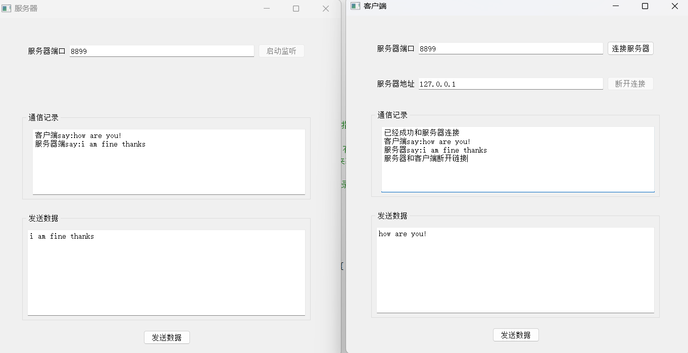


知识点：

​		127.0.0.1 地址称为本地回环地址，是一种特殊的网络地址，用于让单独的计算机进行自我回路测试和通信。这个地址在 IP 协议中被定义为环回地址。

​		网络设备使用 127.0.0.1 地址来测试其网络接口的工作状态。设备可以将回送数据包发送到这个地址，然后再将该数据包返回给自己，从而测试网络接口的状态和性能。

### 2.2  UDP通信

* 首先设置UDP套接字
* 绑定固定地址，再通过地址发送数据
* 通信完成后关闭套接字

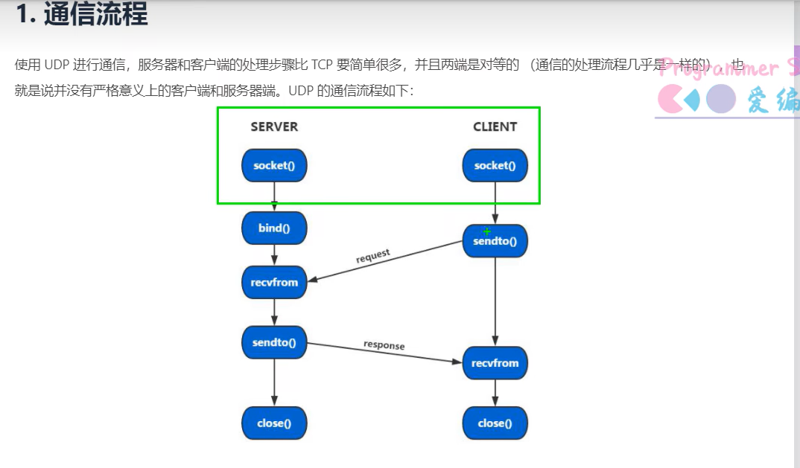

#### windows和liunx通信

在Windows和Linux上，关于TCP Socket通信的底层实现确实存在一些差异，但这些差异主要体现在操作系统层面，而不是直接体现在“套接字”和“文件描述符”这两个术语的使用上。实际上，在Linux和Windows上，无论是使用Qt框架还是直接调用系统API，进行TCP Socket通信时都会涉及到套接字（Socket）和文件描述符（File Descriptor）的概念，尽管它们在不同的操作系统中可能有不同的实现细节。

**套接字**（Socket）

套接字是网络通信中的一个端点，它允许两个或多个进程之间进行通信。套接字通过网络协议栈（如TCP/IP）进行数据的收发。在Windows和Linux上，套接字都是网络通信的基础。

**文件描述符（File Descriptor）**

文件描述符是一个非负整数，它是一个索引值，指向内核中每个进程打开文件的记录表。在Unix-like系统（包括Linux）中，一切皆文件，包括套接字、管道、目录等，因此它们都可以通过文件描述符来访问。在Windows中，虽然不直接使用“文件描述符”这个术语，但Windows句柄（Handle）在概念上与文件描述符相似，它们都用于标识和访问底层资源。

**Windows 上的 Qt TCP Socket 通信**

在Windows上，使用Qt进行TCP Socket通信时，Qt封装了底层的Windows Sockets（Winsock）API。当你创建一个`QTcpServer`或`QTcpSocket`对象时，Qt会在内部为你创建一个套接字（Socket），并管理与之相关的资源。尽管你不需要直接处理文件描述符或Winsock句柄，但Qt在背后确实使用了它们。

**Linux 上的 Socket TCP 通信**

在Linux上，进行TCP Socket通信时，你会直接与系统调用（如`socket()`, `bind()`, `listen()`, `accept()`, `read()`, `write()`, `close()`）打交道。这些系统调用返回或接受文件描述符作为参数，用于标识和访问套接字。在Linux中，套接字通过文件描述符来管理，这使得套接字与文件、管道等其他I/O资源在底层有了统一的接口。

**总结**

无论是Windows上的Qt TCP Socket通信还是Linux上的Socket TCP通信，它们都是基于套接字的网络通信方式。在Windows上，Qt为你封装了底层的复杂性；而在Linux上，你通常会直接与系统调用打交道，使用文件描述符来管理套接字。尽管术语和API有所不同，但它们的根本目的是相同的：在网络上的两个或多个进程之间建立通信链路，并传输数据。


### 2.3 多线程网络通信

[Qt中多线程的使用 | 爱编程的大丙 (subingwen.cn)](https://subingwen.cn/qt/thread/)

#### 2.3.1 QThread

Qt中提供了一个线程类QThread，通过这个类就可以创建子线程了，Qt中一共提供了两种创建子线程的方式，对于qt多线程发送文件和接收文件都要在**子线程**操作：

* **方法1：**通过QThread创建子类（子线程）
	* 这种方法涉及创建`QThread`的一个子类，并重写其`run()`方法。在这个`run()`方法中，你将执行需要在新线程中运行的代码，比如文件发送或接收。
* **方法2：**通过Qbject派生工作类
	* 创建一个继承自`QObject`的类，用于封装实际的文件发送和接收逻辑，并通过`moveToThread()`将这个类的实例移动到`QThread`中。


**方法1案例：**

```c++
// 1. 创建一个线程类的子类，让其继承QT中的线程类 QThread，比如:
class MyThread:public QThread
{
    ......
}
// 2.重写父类的 run() 方法，在该函数内部编写子线程要处理的具体的业务流程
class MyThread:public QThread
{
    ......
 protected:
    void run()
    {
        ........
    }
}
//3. 在主线程中创建子线程对象，new 一个就可以了
MyThread * subThread = new MyThread;
//4. 启动子线程, 调用 start() 方法
subThread->start();
```

* 不能在类的外部调用run() 方法启动子线程，在外部调用start()相当于让run()开始运行

* 当子线程被创建出来之后，父子线程之间的通信可以通过信号槽的方式，注意事项:

	* 在Qt中在子线程中不要操作程序中的窗口类型对象, 不允许, 如果操作了程序就挂了
	* 只有主线程才能操作程序中的窗口对象, 默认的线程就是主线程, 自己创建的就是子线程


**方法2案例：**

```c++
//1. 创建一个新的类，让这个类从QObject派生
class MyWork:public QObject
{
    .......
}
//2. 在这个类中添加一个公共的成员函数，函数体就是我们要在子线程中执行的业务逻辑
class MyWork:public QObject
{
public:
    .......
    // 函数名自己指定, 叫什么都可以, 参数可以根据实际需求添加
    void working();
}
//3. 在主线程中创建一个QThread对象, 这就是子线程的对象
QThread* sub = new QThread;
//4. 在主线程中创建工作的类对象（千万不要指定给创建的对象指定父对象）
MyWork* work = new MyWork(this);    // error
MyWork* work = new MyWork;          // ok
//5.将MyWork对象移动到创建的子线程对象中, 需要调用QObject类提供的moveToThread()方法
	// void QObject::moveToThread(QThread *targetThread);
	// 如果给work指定了父对象, 这个函数调用就失败了
	// 提示： QObject::moveToThread: Cannot move objects with a parent
work->moveToThread(sub);	// 移动到子线程中工作
```

* 启动子线程，调用 start(), 这时候线程启动了, 但是移动到线程中的对象并没有工作

* 调用MyWork类对象的工作函数，让这个函数开始执行，这时候是在移动到的那个子线程中运行的

	

**moveToThread** 的解释：

* **定义**：在Qt框架中，moveToThread是一个方法，用于将QObject派生类的对象移动到指定的QThread线程中执行。这主要用于多线程编程中，以解决如UI线程阻塞、提高程序响应速度等问题。
* **使用场景**：在Qt的多线程编程中，只有继承了QObject类的对象才能使用moveToThread方法进行线程切换。使用此方法可以使得对象在指定的线程中运行，从而避免在UI线程或其他关键线程中执行耗时的操作。
* **注意事项**：在执行moveToThread之前，需要确保目标线程已经启动。在目标线程中访问该对象时，通常需要使用信号槽机制或QMetaObject::invokeMethod来进行调用，以确保线程安全。


#### 2.3.2 QT 线程析构

* 线程的析构（第二种方法-->**手动析构**）：

* 线程对象在工作完成后调用 `quit()` 退出事件循环，接着调用 `wait()` 等待线程执行完所有的工作。然后手动（`delete`）删除 `QThread` 对象.

```C++
#include <QCoreApplication>
#include <QThread>
#include <QDebug>

class Worker : public QObject {
    Q_OBJECT
public slots:
    void doWork() {
        qDebug() << "Doing work in thread:" << QThread::currentThread();
        QThread::sleep(2);  // 模拟长时间任务
        emit workFinished();
    }

signals:
    void workFinished();
};

int main(int argc, char *argv[]) {
    QCoreApplication a(argc, argv);

    QThread* thread = new QThread;
    Worker* worker = new Worker;

    worker->moveToThread(thread);
	
    // 自动释放析构
    QObject::connect(thread, &QThread::started, worker, &Worker::doWork);
    QObject::connect(worker, &Worker::workFinished, thread, &QThread::quit);
    QObject::connect(thread, &QThread::finished, worker, &QObject::deleteLater);
    QObject::connect(thread, &QThread::finished, thread, &QObject::deleteLater);
	thread->start();
    //等待线程结束
    thread->wait();  // 等待线程执行完所有工作
    delete thread;  // 手动删除线程对象
    
    return a.exec();
}
```


​	      

**不要直接从主线程销毁 `QThread` 对象**：直接调用 `delete` 来销毁正在运行的线程对象是危险的，可能导致未定义行为。最好使用 `quit()` 结束线程的事件循环，然后使用 `wait()` 确保线程退出后再删除对象。

**使用 `moveToThread` 时的注意**：当一个对象被移动到某个线程后，该对象的槽函数会在目标线程中执行。如果目标线程结束，槽函数的执行也会被中止，因此要确保线程生命周期与槽函数的执行周期相匹配。


#### 2.3.3 常用API：

**常用共用成员函数：**

```c++
// QThread 类常用 API
// 构造函数
QThread::QThread(QObject *parent = Q_NULLPTR);
// 判断线程中的任务是不是处理完毕了
bool QThread::isFinished() const;
// 判断子线程是不是在执行任务
bool QThread::isRunning() const;

// Qt中的线程可以设置优先级
// 得到当前线程的优先级
Priority QThread::priority() const;
void QThread::setPriority(Priority priority);
优先级:
    QThread::IdlePriority         --> 最低的优先级
    QThread::LowestPriority
    QThread::LowPriority
    QThread::NormalPriority
    QThread::HighPriority
    QThread::HighestPriority
    QThread::TimeCriticalPriority --> 最高的优先级
    QThread::InheritPriority      --> 子线程和其父线程的优先级相同, 默认是这个
// 退出线程, 停止底层的事件循环
// 退出线程的工作函数
void QThread::exit(int returnCode = 0);
// 调用线程退出函数之后, 线程不会马上退出因为当前任务有可能还没有完成, 调回用这个函数是
// 等待任务完成, 然后退出线程, 一般情况下会在 exit() 后边调用这个函数
bool QThread::wait(unsigned long time = ULONG_MAX);
```


**信号槽：**

```c++
// 和调用 exit() 效果是一样的
// 代用这个函数之后, 再调用 wait() 函数
[slot] void QThread::quit();
// 启动子线程
[slot] void QThread::start(Priority priority = InheritPriority);
// 线程退出, 可能是会马上终止线程, 一般情况下不使用这个函数
[slot] void QThread::terminate();

// 线程中执行的任务完成了, 发出该信号
// 任务函数中的处理逻辑执行完毕了
[signal] void QThread::finished();
// 开始工作之前发出这个信号, 一般不使用
[signal] void QThread::started();
```


**静态函数：**

```c++
// 返回一个指向管理当前执行线程的QThread的指针
[static] QThread *QThread::currentThread();
// 返回可以在系统上运行的理想线程数 == 和当前电脑的 CPU 核心数相同
[static] int QThread::idealThreadCount();
// 线程休眠函数
[static] void QThread::msleep(unsigned long msecs);	// 单位: 毫秒
[static] void QThread::sleep(unsigned long secs);	// 单位: 秒
[static] void QThread::usleep(unsigned long usecs);	// 单位: 微秒

```


**任务处理函数**：

```c++
// 子线程要处理什么任务, 需要写到 run() 中
[virtual protected] void QThread::run();
```


#### 2.3.4 客户端设计

1. 首先创建sendfile发送文件类继承自object类

2. 在类中创建两个工作函数（业务逻辑），分别是连接服务器connectServer和发送文件SendFile

3. 创建线程对象和任务对象

	```c++
	//创建线程对象
	QThread *t = new QThread;
	//创建任务对象
	sendFile *worker = new sendFile;
	```

4. 将任务对象移动到创建的子线程对象中

	```c++
	 worker->moveToThread(t);
	```

5. 编写处理连接服务器和发送文件的函数

	* 连接服务器

		* 获取输入的IP和port

		* 当前窗口点击连接服务器发送了一个任务开始的信号给任务对象，让任务对象的工作函数开始执行

			```c++
			//连接服务器信号发射函数
			void MainWindow::on_pushButton_clicked()
			{
			    QString ip = ui->lineEdit->text();
			    unsigned short port = ui->lineEdit_2->text().toUShort();
			    emit startconnect(port,ip); //发送信号让任务对象的工作函数开始执行
			}
			```

		* 绑定信号和槽函数，信号是从当前窗口(主线程)发出，由子线程中的任务对象worker接收

			```c++
			connect(this,&MainWindow::startconnect,worker,&sendFile::connectServer);
			```

		* 实现具体的槽函数：连接服务器（TCP连接）

			```c++
			//子线程的任务对象连接服务器
			void sendFile::connectServer(unsigned short port, QString ip)
			{
			    m_tcp= new QTcpSocket;
			    m_tcp->connectToHost(QHostAddress(ip),port);
			    //检测连接是否成功
			    connect(m_tcp,&QTcpSocket::connected,this,&sendFile::connectOK);
			    connect(m_tcp,&QTcpSocket::disconnected,this,[=](){
			        m_tcp->close();
			        m_tcp->deleteLater();
			        //发送信号给主线程,服务器和客户端断开连接
			        emit oversconnect();
			    });
			}
			```

		* 接着处理任务对象连接服务器发送的信号

			```c++
			    //处理worker发送的信号
			    //接收到任务对象函数的连接成功信号
			    connect(worker,&sendFile::connectOK,this,[=](){
			        QMessageBox::information(this,"连接服务器","已经成功连接服务器，恭喜");
			    });
			    //接收到任务对象函数的连接失败信号
			    connect(worker,&sendFile::oversconnect,this,[=](){
			        //资源释放
			        t->quit();
			        t->wait();
			        worker->deleteLater();
			        t->deleteLater();
			    });
			    //根据信号的百分比，来更新进度条的数据
			    connect(worker,&sendFile::curPercent,ui->progressBar,&QProgressBar::setValue);
			```

6. 启动线程

7. 在子线程中调用任务对象的工作函数

	

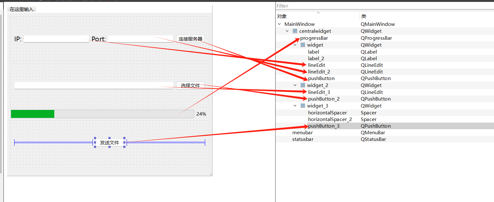

添加c++ class类文件，**父类一定要选Object。**

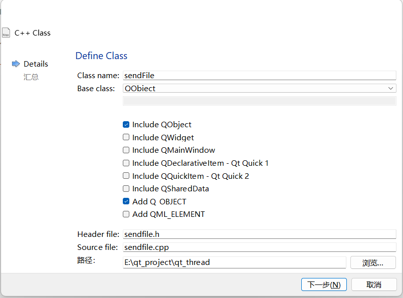


**sendFile.h**

```C++
#ifndef SENDFILE_H
#define SENDFILE_H
#include <QString>

#include <QObject>

class sendFile : public QObject
{
    Q_OBJECT
public:
    explicit sendFile(QObject *parent = nullptr);
    //任务对象的操作函数
    //连接服务器
    void connectServer(unsigned short port,QString ip);
    //发送文件
    void SendFile(QString path);
    
    
signals:

};

#endif // SENDFILE_H
```

sendFile.cpp

```c++
#include "sendfile.h"
#include <QHostAddress>
#include <QFileInfo>
#include <QFile>

sendFile::sendFile(QObject *parent)
    : QObject{parent}
{

}

//子线程的任务对象连接服务器
void sendFile::connectServer(unsigned short port, QString ip)
{
    m_tcp= new QTcpSocket;
    m_tcp->connectToHost(QHostAddress(ip),port);
    //检测连接是否成功
    connect(m_tcp,&QTcpSocket::connected,this,&sendFile::connectOK);
    connect(m_tcp,&QTcpSocket::disconnected,this,[=](){
        m_tcp->close();
        m_tcp->deleteLater();
        //发送信号给主线程,服务器和客户端断开连接
        emit oversconnect();
    });
}
//发送文件
void sendFile::SendFile(QString path)
{
    //怎么让服务器知道文件发送完毕
    //通过将文件大小发送给服务器，服务器接收时进行累加，累加到和原本一样大时，接收完毕
    QFile file(path);
    QFileInfo info(path);  //通过路径获取文件
    int filesize = info.size(); //获取文件大小

    file.open(QFile::ReadOnly);

    while(!file.atEnd())  //读文件
    {
        static int num = 0;  //文件大小只需要在发送文件之前发送一次即可，即在while的第一次便发给服务器
        if(num == 0){
            m_tcp->write((char*)&filesize,4); //将整型转换为字符串型，并指定文件大小
        }
        QByteArray line = file.readLine();
        num += line.size(); //对发送的数据进行累加
        int percent = (num *100/filesize); //计算累加数据的百分比
        emit curPercent(percent); //将百分比发送给主线程

        m_tcp->write(line); //通过套接字对象发送数据给服务器
    }
}

```

mainwindow.h

```c++
#ifndef MAINWINDOW_H
#define MAINWINDOW_H

#include <QMainWindow>

QT_BEGIN_NAMESPACE
namespace Ui { class MainWindow; }
QT_END_NAMESPACE

class MainWindow : public QMainWindow
{
    Q_OBJECT

public:
    MainWindow(QWidget *parent = nullptr);
    ~MainWindow();

private slots:
    void on_pushButton_clicked();

    void on_pushButton_2_clicked();

    void on_pushButton_3_clicked();

signals:
    void startconnect(unsigned short,QString);  //添加启动任务对象中函数的信号，即根据ip和port连接后开始任务操作
    void sendFile1(QString path); //子线程中的任务对象，点击发送文件按钮发出发送文件的信号
private:
    Ui::MainWindow *ui;
};
#endif // MAINWINDOW_H

```

mainwindow.cpp

```c++
#include "mainwindow.h"
#include "ui_mainwindow.h"
#include <QThread>
#include "sendfile.h"
#include <QMessageBox>
#include <QFileDialog>
MainWindow::MainWindow(QWidget *parent)
    : QMainWindow(parent)
    , ui(new Ui::MainWindow)
{
    ui->setupUi(this);

    //先给ip添加默认地址与port
    ui->lineEdit->setText("127.0.0.1");
    ui->lineEdit_2->setText("8989");
    //进度条0-100
    ui->progressBar->setRange(0,100); //进度条范围
    ui->progressBar->setValue(0); //初始值为0

    //创建线程对象
    QThread *t = new QThread;
    //创建任务对象
    sendFile *worker = new sendFile;
    //将任务对象worker移动到子线程中去，worker对象的操作就会在子线程中
    //此时worker对象的操作有connectServer和SendFile
    worker->moveToThread(t);

    //当前窗口点击连接服务器发送了一个任务开始的信号给任务对象
    //任务对象绑定连接服务器函数
    //因此，信号是从当前窗口(主线程)发出，由子线程中的任务对象worker接收
    connect(this,&MainWindow::startconnect,worker,&sendFile::connectServer);

    //发送文件信号
    connect(this,&MainWindow::sendFile1,worker,&sendFile::SendFile);

    //处理worker发送的信号
    //连接成功信号
    connect(worker,&sendFile::connectOK,this,[=](){
        QMessageBox::information(this,"连接服务器","已经成功连接服务器，恭喜");
    });
    //连接失败信号
    connect(worker,&sendFile::oversconnect,this,[=](){
        //资源释放
        t->quit();
        t->wait();
        worker->deleteLater();
        t->deleteLater();
    });

    //根据信号的百分比，来更新进度条的数据
    connect(worker,&sendFile::curPercent,ui->progressBar,&QProgressBar::setValue);

    //启动线程
    t->start();
}

MainWindow::~MainWindow()
{
    delete ui;
}

//连接服务器
void MainWindow::on_pushButton_clicked()
{
    QString ip = ui->lineEdit->text();
    unsigned short port = ui->lineEdit_2->text().toUShort();
    emit startconnect(port,ip); //发送信号让任务对象的工作函数开始执行
}

//选择文件
void MainWindow::on_pushButton_2_clicked()
{
    QString path = QFileDialog::getOpenFileName();
    if(path.isEmpty()){
        QMessageBox::warning(this,"打开文件","选择的文件路径不能为空");
    }
    ui->lineEdit_3->setText(path);
}

//发送文件：并不是在主线程做的，而是子线程中做的
void MainWindow::on_pushButton_3_clicked()
{
    emit sendFile1(ui->lineEdit_3->text());  //发送信号，参数为文件路径
}
```


#### 2.3.5  服务器端设计

基于子线程去接收文件

1、需要创建一个线程类的子类，让其继承QT中的线程类 QThread，比如

```c++
class MyThread:public QThread
{
    ......
}
```

2、重写父类的 run() 方法，在该函数内部编写子线程要处理的具体的业务流程

```c++
class MyThread:public QThread
{
    ......
 protected:
    void run()
    {
        ........
    }
}
```

3、在主线程中创建子线程对象，new 一个就可以了

```c++
MyThread * subThread = new MyThread;
```

4、启动子线程, 调用 start() 方法，调用了start方法。就能调用线程种的run()

```c++
MyThread * subThread = new MyThread;
```


**界面设计**：监听特定的端口号


**设计流程：**

* 服务端设计recvfile线程来接收文件，因此添加recvfile类文件，因此原本的recvfile类继承自Object，但是作为线程类的话就得继承QThread

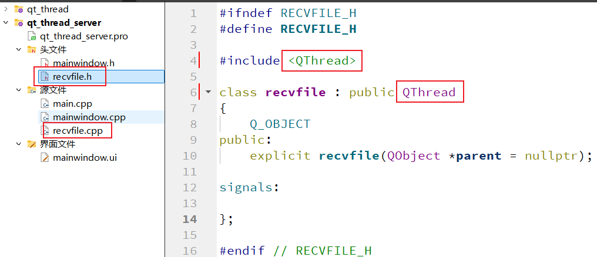

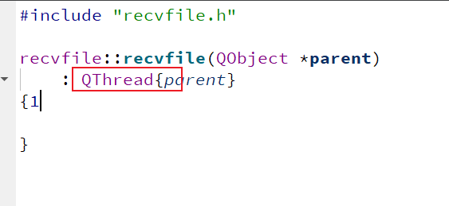


**设计完毕：**

.pro

```c++
QT       += core gui network

greaterThan(QT_MAJOR_VERSION, 4): QT += widgets

CONFIG += c++17

# You can make your code fail to compile if it uses deprecated APIs.
# In order to do so, uncomment the following line.
#DEFINES += QT_DISABLE_DEPRECATED_BEFORE=0x060000    # disables all the APIs deprecated before Qt 6.0.0

SOURCES += \
    main.cpp \
    mainwindow.cpp \
    recvfile.cpp

HEADERS += \
    mainwindow.h \
    recvfile.h

FORMS += \
    mainwindow.ui

# Default rules for deployment.
qnx: target.path = /tmp/$${TARGET}/bin
else: unix:!android: target.path = /opt/$${TARGET}/bin
!isEmpty(target.path): INSTALLS += target

```

recvfile.h:子线程类

```c++
#ifndef RECVFILE_H
#define RECVFILE_H

#include <QThread>
#include <QTcpSocket>

class recvfile : public QThread
{
    Q_OBJECT
public:
    explicit recvfile(QTcpSocket *tcp,QObject *parent = nullptr);
    void run() override;
private:
    QTcpSocket *m_p;        //类指针用来保存tcp传进来的地址
signals:
    void over();            // 信号用来给主线程发送表示数据接收完毕

};

#endif // RECVFILE_H

```

recvfile.cpp

```c++
#include "recvfile.h"
#include <QFile>
recvfile::recvfile(QTcpSocket *tcp,QObject *parent)
    : QThread{parent}
{
    m_p= tcp;   //将tcp保存下来,就能使用用于通信的套接字对象了
}

//子线程接收数据
void recvfile::run(){
    QFile* file = new QFile("recv.txt");
    file->open(QFile::WriteOnly);

    // 接收数据->当通信套接字发出readyread信号就说明客户端有数据到达了
    connect(m_p,&QTcpSocket::readyRead,this,[=](){
        //先读取文件大小->前四个字节
        static int count = 0;  //static只初始化一次
        static int total = 0;
        if(count == 0){         // 当count == 0时，就代表第一次读数据，文件大小为0
            m_p->read((char*)&total,4); //文件总大小
        }
        // 读取剩余数据
        QByteArray all = m_p->readAll();
        count += all.size();
        file->write(all);

        // 判断数据是否接收完毕了
        if(count == total){
            m_p->close();
            m_p->deleteLater();
            file->close();
            file->deleteLater();
            emit over();    // 接收完毕发送over信号给主线程
        }
    });

    // 网络通信时，必须在最后调用exec，进入事件循环，保证子线程不退出
    exec();
}
```


mainwindow.h:主线程类

```c++
#ifndef MAINWINDOW_H
#define MAINWINDOW_H

#include <QMainWindow>
#include <QTcpServer>

QT_BEGIN_NAMESPACE
namespace Ui { class MainWindow; }
QT_END_NAMESPACE

class MainWindow : public QMainWindow
{
    Q_OBJECT

public:
    MainWindow(QWidget *parent = nullptr);
    ~MainWindow();

private slots:
    void on_pushButton_clicked();  // 监听按钮

private:
    Ui::MainWindow *ui;
    QTcpServer *m_s;
};
#endif // MAINWINDOW_H

```

mainwindow.cpp

```c++
#include "mainwindow.h"
#include "ui_mainwindow.h"

#include <QMessageBox>
#include <QTcpSocket>
#include "recvfile.h"

MainWindow::MainWindow(QWidget *parent)
    : QMainWindow(parent)
    , ui(new Ui::MainWindow)
{
    ui->setupUi(this);

    m_s = new QTcpServer(this); //实例化 socket tcp对象
    // 判断是否有客户端连接
    connect(m_s,&QTcpServer::newConnection,this,[=](){ //当有客户端连接时发送newConnection信号
        QTcpSocket *tcp = m_s->nextPendingConnection();//用匿名函数来获取通信的套接字对象
        // 子线程recvfile类开始操作->先将通过连接建立的套接字给子线程，那么子线程就拥有通信套接字->通过参数传递给子线程
        // 创建线程对象
        recvfile *subThread  = new recvfile(tcp);
        subThread->start();     // 启动线程
        // 访问子线程对象，由于子线程对象在匿名函数里面创建，那么就需要在匿名函数种访问
        // 当子线程发送over信号，就代表子线程结束了，主线程进行善后
        connect(subThread,&recvfile::over,this,[=](){
            subThread->exit();      //子线程退出
            subThread->wait();
            subThread->deleteLater();//析构
            QMessageBox::information(this,"文件接收","文件接收完毕");
        });

    });

}

MainWindow::~MainWindow()
{
    delete ui;
}

// 监听按钮操作
void MainWindow::on_pushButton_clicked()
{
    unsigned short port = ui->lineEdit->text().toUShort();		// 获取填写的端口
    m_s->listen(QHostAddress::Any,port);        //绑定本地的任意IP地址，并指定端口8899
    ui->pushButton->setDisabled(true);			// 点击后变为不可见

}
```


**调试：**

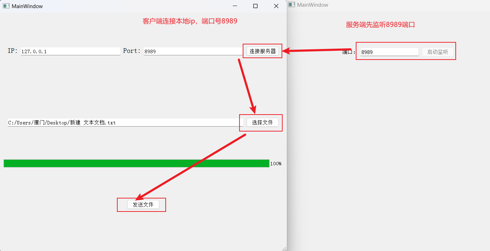
