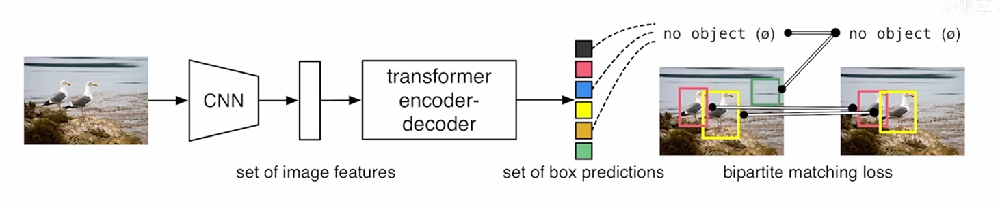
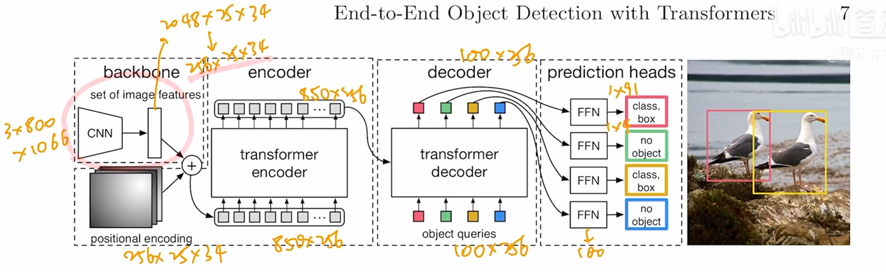

### DETR-摘要

DETR是一种基于Transformer架构的端到端目标检测模型，由Facebook AI Research（FAIR）提出。与传统的目标检测方法不同，DETR**不再使用锚框（anchor boxes）或者候选区域（region proposals）来进行目标检测**。相反，它通过**将整个图像输入到Transformer中，直接并行输出预测集，即Transformer一次性解码出图片中所有物体的预测结果。**这种并行特性使得DETR非常高效。

DETR将目标检测任务看作**集合预测问题**，对于一张图片，它会固定预测一定数量的物体（原作是100个，在代码中可更改）。模型根据这些物体对象与图片中全局上下文的关系直接并行输出预测集。DETR的主要构成部分包括backbone、transformer以及head模块。

此外，DETR的一个显著特点是它不需要预定义的先验anchor，也不需要NMS（非极大值抑制）的后处理策略，就可以实现端到端的目标检测。然而，DETR在大目标检测上性能较好，但在小目标检测上稍差，而且基于match的loss导致学习很难收敛（即难以学习到最优的情况）。

总的来说，相比于YOLO：

* DETR通过**去除proposal和anchor**，不用在去费尽心思设计anchor，不会再用到NMS，不会有那么多超参数需要去调整，简化了目标检测的pipeline，提高了检测效率。
* DETR提出了一个**新的目标函数**：
	* 目标函数通过二分图匹配的方式可以让模型去输出一组独一无二的预测。每个物体理论上只有一个框的生成。
* DETR使用了**encoder和decoder的框架**
	* encoder对cnn提取的特征进行优化
	* decoder除了接收encoder优化后的全局信息，还有，还有一组learnd object query的输入（Q），有点类似anchor的意思。通过将全局信息和输入Q结合在一起，利用注意力机制操作，能够让模型直接输出最够的一组预测框（**并行出框**）。
		* 这里并行出框的意义在：
			* 能提高输出速率，比较于顺序出框，速度快，有利于检测任务的实时性。
			* 目标的预测并不会依赖于其他目标，每个物体有其自己的特征。


### DETR-导言

DETR本质上就是一个集合预测问题，但是目前好用的目标检测其器都是利用间接的方式来处理集合预测的问题。比如说proposql（R-CNN系列）、anchors（YOLO、Focal loss）、物体中心点（center net、FOCAS）。这希望方法都没有直接的去做集合预测的任务，而是设计一个替代的回归/分类的任务去解决这个目标检测问题。但是这些检测器的性能很大程度上受限于后处理步骤，即NMS,这些方法都会生成很多预测框，做很多重复预测的工作。因此采用NMS去抑制这些重复框，对于模型的调参、优化来说都变得更复杂。

**DETR预测流程：**



* 通过cnn提取特征
* 将特征拉直送往transformer encoder进一步学习全局信息（特征）
	* 当使用了encoder，每一个点每一个特征都会和图片里的其他特征都会有交互，这样就大概知道那一块是那个物体，这样对于同一个物体来说就应该出一个框。因此全局的建模有利于去除冗余的框。
* decoder进行输出预测框
	* 框的数量由object Query决定，通过在decoder中全局信息和Q的交互（对应nlp中KV与Q的内积），做自注意力的操作，得出最后的输出预测框
* 最后的输出预测框匹配
	* 最后的输出预测框利用匈牙利算法通过二分匹配来匹配Ground truth（把问题看作集合预测），通过计算每个框和Ground truth之间的match loss。最终决定那个框和Ground truth最匹配，然后会和普通的目标检测相同来计算分类loss，再算一个bounding box的loss。最终没有匹配的剩下的框会被标记位没有物体（背景类）。


### DETR-集合预测

大多数的检测器，都是根据已有的一些初始的这些猜测，去做预测，而且最终模型的性能和初始的猜测非常相关。

* 对于two-stage的初始猜测，就是中间的proposal
* 对于single-stage来说其初始猜测就是anchor/物体的中心点

对于集合预测，刚开始的可学习的NMS、和自相关网络都可以做到类似transformer的自注意力机制，来进行集合预测，但是性能都不太好。这里可以用一些手工设计的人工特征来帮助模型进行学习。

因此，**DETR**希望可以：

1. 不再依赖人工先验的知识
2. 不希望检测太过复杂


**基于集合的目标函数**

* DETR的目标函数使得每个物体只有一个预测框，且不再需要NMS。
* 对loss的计算是**先做了一个最优匹配，再去完成一个对loss的计算**。

​		DETR的输出是一个固定的集合，即固定n个输出（预测框数量），而预测框的数量是要比要预测的物体数量多很多。但是如果每次都有100个输出，而一个图片的ground truth的banding box可能只有几个，怎么进行匹配？因此将这个匹配问题转换为一个二分图匹配问题。

* 二分图匹配问题：


```python
* 前置条件：
	* 二分图匹配问题的目标是让工人如何能以最小的支出完成这些工作。
	* 有三个工人abc，现在我要完成三个工作xyz。
	* 每个工人都有自己擅长的工作，有长处有短处，因此每个人完成这些工作的时间和金钱不一样。
* 解决方法：
	* 将问题转换为一个损失矩阵（cost matrix），每个位置代表了工人要完成此任务所需要的时间或者金钱。
	* 最终通过矩阵找到一个唯一解，可以使得每个人都分配自己擅长的工作，最终完成任务所需要的价钱最低。
```

​		因此，对于DETR，可以将100个预测框看作工人，把ground truth框看作工作xyz。而每个位置里面放的值就是loss。loss通常通过计算预测框与真实框之间的**分类损失**和**边界框准确率损失**来实现。也就是遍历所有预测框，用所有的预测框（100个）和ground truth框去计算这两个loss，然后放入cost matrix。如图：


​		最终得出的最优匹配，使得预测框与真实框之间的某种“损失”或“代价”最小。DETR中采用**匈牙利算法**得出最优解。如图：


​		因此对于最终的匹配结果，就是**一个预测框和一个ground truth框这样一对一**的关系。因此这样就不需要后续的NMS。这样**知道了那些框对应ground truth框，就可以计算一个真正的目标函数**。然后利用loss去做反向传播去更新模型的参数。最终的目标函数如式，包含一个分类loss和一个出框loss：


为了保证分类loss和banding box loss取值空间一样，分类loss去掉了log。而banding box loss不仅使用了一个L1 loss，还结合了GIOU loss。

* 因为DETR比较适合大物体预测，因此banding box loss比较大，因此结合GIOU loss，GIOU loss和物体的大小不相干。


### DETR-网络框架



网络处理流程：

1. **CNN来提取特征**

* 首先利用CNN卷积神经网络来提取特征（3x800x1066----卷积---->2048x25x34）（set of image feadtures），为了保证输入transformer的维度还会进行1x1卷积降维(256x25x34)。

* 由于transformer没有位置信息的，因此**特征集合需要和位置编码结合**在一起作为transformer的输入（positional encoding）(256x25x34)。对于结合后的特征输入需要拉直即将25x34展平为一个维度（850x256）。
* 850即序列长度，256即transformer的head dimension（头维度）
	* 在Transformer模型中，Multi-head Attention（多头注意力）是一种关键机制，允许模型在不同的表示子空间（即不同的“头”）中同时关注不同的信息。Head Dimension（头维度）是指每个头在注意力计算中使用的隐藏状态的维度。通过多头注意力，模型能够并行地关注输入序列中的不同部分，这有助于捕获输入序列中的复杂依赖关系。
	* 假设一个Transformer模型的隐藏状态维度为512，如果使用了8个头，那么每个头的维度（即Head Dimension）就是512 ÷ 8 = 64。这意味着在多头注意力计算中，每个头都会使用一个64维的子空间来处理输入数据。

2. **transformer进行处理**

* 这里采用了6层的encoder的叠加进行处理输入特征，输入维度和输出维度相同

3. **Decoder预测框输出**

* Decoder不仅会接收encoder传来的全局特征，还有一组object queries（100x256）输入。
	* Object Queries是一组可学习的嵌入（Learnable Embeddings），用于表示**可能的对象位置或类别**
* Decoder通过**自注意力机制和交叉注意力机制**（cross-attention）**来更新Object Queries**,自注意力机制允许Object Queries之间相互交互并共享信息，而交叉注意力机制则允许Object Queries查看和交互Encoder输出的全局特征。这种机制允许每个Object Query基于整个图像的全局上下文来更新自己，从而预测一个特定的对象边界框和类别。
* 利用这两组数据去反复的做自注意力操作。这里的object queries其实使Learnable embedding是可以学习的，利用Queries做自注意力操作，可以去除冗余框，全局特征互相通信之后，就可以知道每个Query可能得到什么样一个框，避免重复框。100限制了模型的输出是100，256对应encoder的输出，方便后面一起做惩罚。（decoder也是6层，且每层的输入和输出维度是一样的）
* 最终decoder输出100x256的特征

4. **检测头**

* 检测头prediction heads，就是正常的FFN。将decoder输出的特征给全连接层FFN，FFN会分别进行两个预测：
	* 物体类别的预测
	* 框的预测（x，y，w，h）：中心点和宽高

5. **最优匹配**

* 根据预测出来的框，去做最优匹配，利用匹配出来的框，使用匈牙利算法计算最终的目标函数，再进行反向传播，梯度更新。


### **Deformable DETR**-摘要

**可变形DETR**

* DETR训练慢，效率低（图像较大时无法处理）
	* 当图片较大时，transformer的做法仍然是将图像进行分片，假设size：100x100的图像被patch成10000的输入序列向量，那么对于transformer来说是一个很重的任务。
* Deformable DETR注意力机制对输入序列进行了采样，在小范围内对周围点进行采样从而计算，提升了计算速率。但是对周围点的采样并没有分析是否和目标采样点有没有关系。
* 能够好的应用到小目标检测中


### EMA

在各种计算机视觉任务中，通道或空间注意机制对于产生更多可识别的特征表示具有显着的有效性。然而，通过通道降维来建模跨通道关系可能会对提取深度视觉表征带来副作用。本文提出了一种新型的高效多尺度注意力(EMA)模块。为了保留每个通道上的信息和减少计算开销，我们将部分通道重构为批处理维度，并将通道维度分组为多个子特征，使空间语义特征在每个特征组内均匀分布。

具体而言，除了编码全局信息以重新校准每个并行分支中的通道权重外，还通过跨维交互进一步聚合两个并行分支的输出特征，以捕获像素级成对关系。

当我们将cnn扩展到多个卷积层时，它表现出显著的增强学习特征表示的能力。然而，它会导致**堆栈**更多的深度卷积副本，并且需要消耗大量的内存和计算资源，这是构建深度cnn的主要缺点。

作为通道注意力的代表，挤压-激励(Squeeze-and-excitation, SE)明确地模拟了跨维交互作用，用于提取通道注意力[3]。