# Qt封装DLL

环境：Qt 5.14.2+window11

## 1.代码迁移与lib项目建立

​	首先无论代码结构多么复杂，程序入口始终在main中，当调用的代码为独立的函数即可开始迁移，例如代码结构如下，main函数中分别是写文件和读文件代码函数：

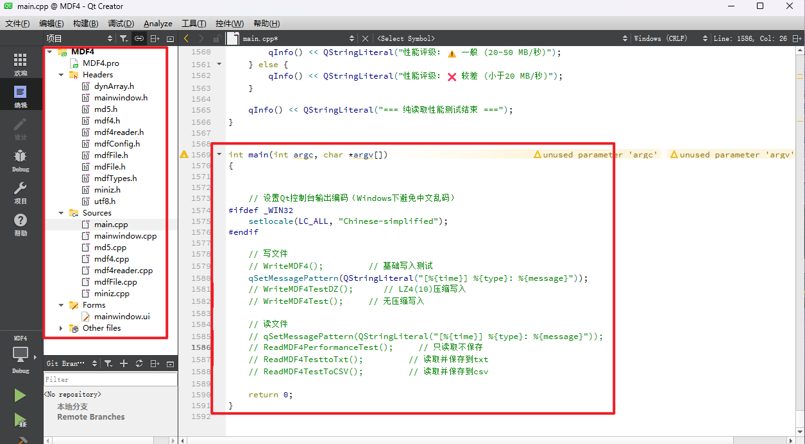

### 1.1 lib库建立

文件-->新建文件或项目：

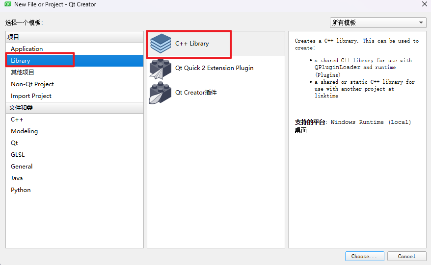

名字随便起，不要中文！！

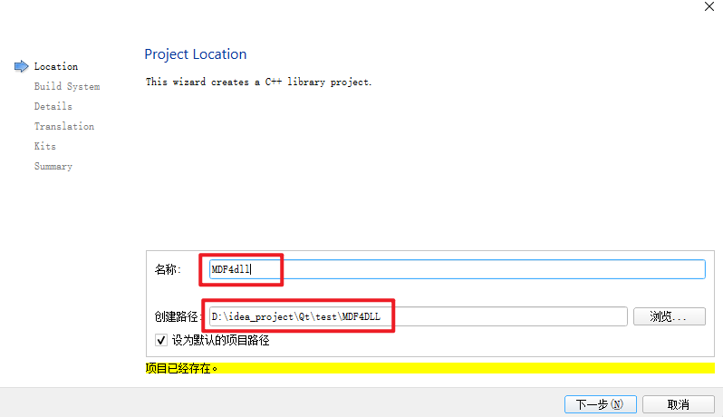

然后直接无脑下一步：我这里用的MinGW64编译

### 1.2 代码迁移

新建的文件，会生成.h/.cpp/_global.h文件，不要动这些文件，将原有项目代码迁移过来：

迁移步骤：将代码文件复制到项目路径下，右键项目-->添加现有文件，选中所有文件进行添加。

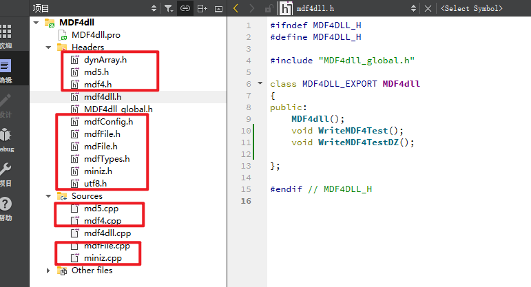

### 1.3 代码修改

迁移完成后，将要导出的函数名卸载.h文件中：

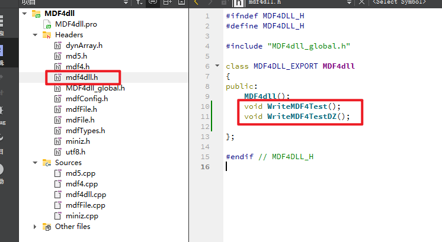

将函数实现添加到.cpp中：一定要用类名::，不要写独立函数

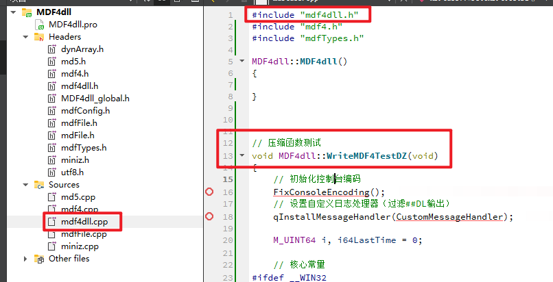

修改完成进行debug即可，不用理会弹窗。

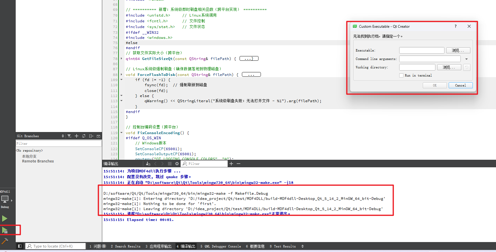

此时会在debug路径下生成.dll和.a文件

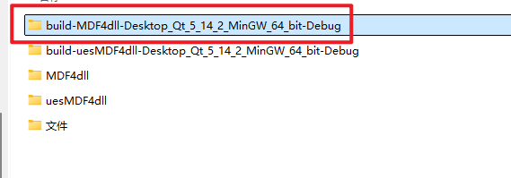

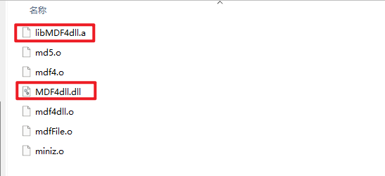

## 2. dll调用

任意创建一个新项目

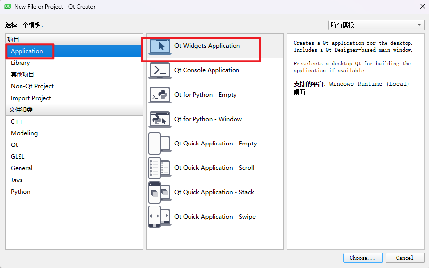

创建完成后先debug一下，然后将dll和a文件分别复制到debug路径和项目下，因为要保证和.exe在同一路径下：

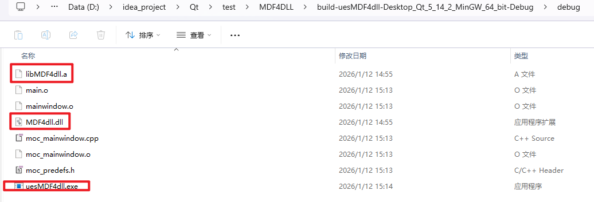

将.h文件也放进项目路径下并加入项目中（添加现有文件）：

将dll和a文件复制到项目路径下后，还得通过qt添加到项目中：右键项目-->添加库..

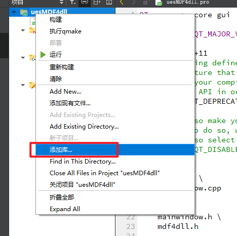

选择外部库：

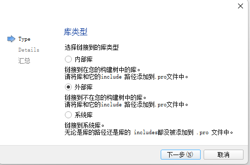

将.a文件导入，这里切记不要选择添加后缀：

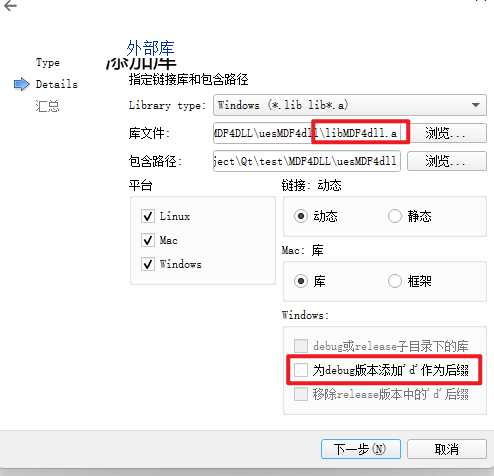

添加完成后pro文件会自动生成：

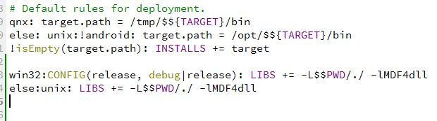

最终，利用导入的头文件，去声明类对象进行调用即可：

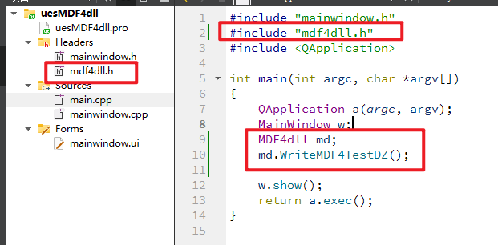