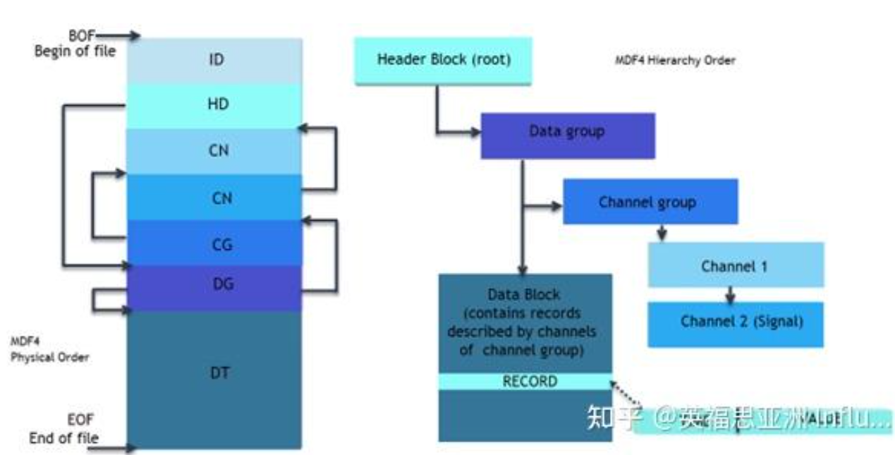
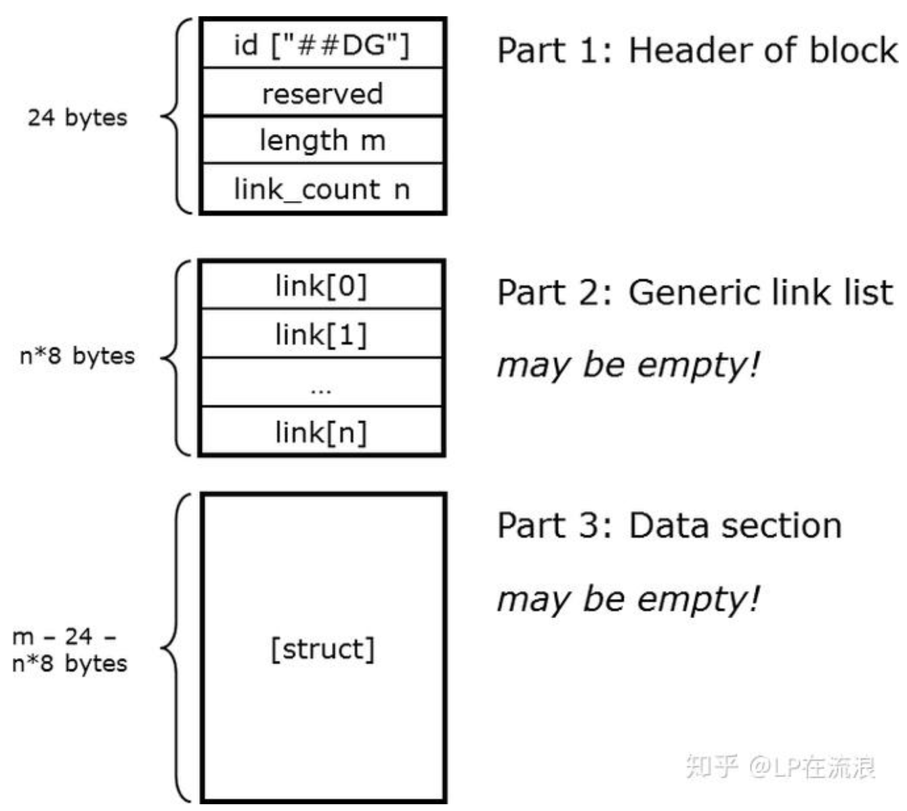
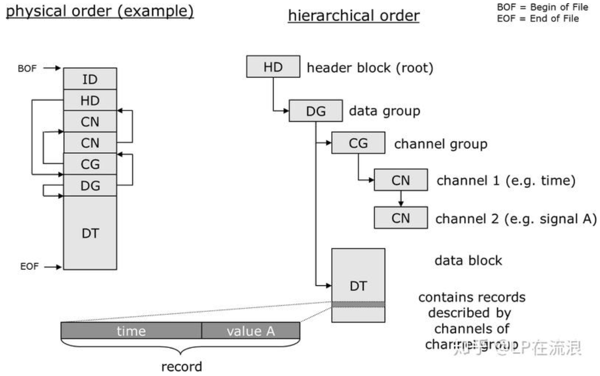
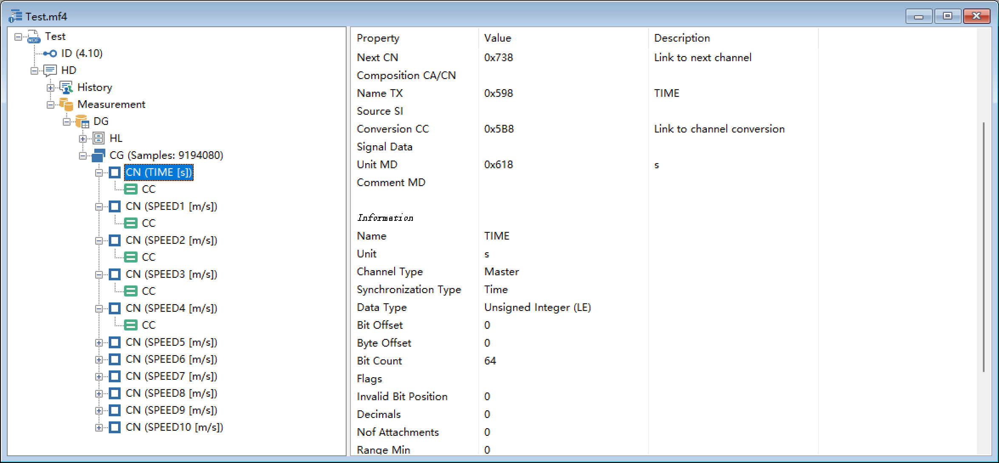
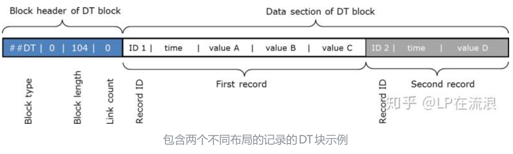
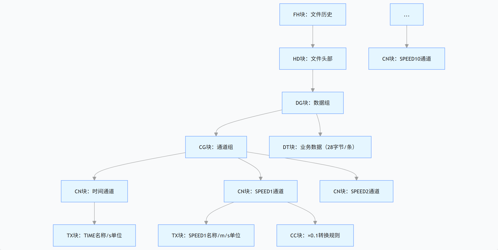

# MDF4

# 1 MDF4数据标准

## 1.1 MDF4数据结构

ASAM MDF文件（文件扩展名：*.mf4）以二进制块的形式组成，其中每个块均由多个连续字节构成，这些字节可以看作是数据的记录或结构。

块多种不同的类型，每个块类型定义了都有其用途和内容，它们的命名均以两个大写字母缩写表示，这个名称也用于块的标识（“BlockID”）。 下表列出了部分ASAM MDF中的块类型描述。




| 块   | 名字                        | 描述                                                         |
| ---- | --------------------------- | ------------------------------------------------------------ |
| ID   | Identification Block识别块  | 识别文件为 MDF 文件并指定其版本。长度是 64 字节 ，在 MDF4 文件格式中具有固定位置，并且只出现一次。 |
| HD   | Header Block起始块          | 包含 MDF 文件的一般说明。 充当文件根目录，链接到每个数据。（仅出现一次，并且在 MDF 文件中具有固定位置。 |
| CN   | Channel Block通道块         | 它包含描述数据结构和信号的通道，即测量信号以及如何存储信号值的信息。 |
| CG   | Channel Group Block频道组块 | 描述记录的布局， 即始终联合测量的通道。                      |
| DG   | Data Group Block数据组块    | 包含数据块的描述，可能指的是一个或多个通道组，包括数据块和通道组的测量数据 |
| DT   | Data Block数据块            | 它用信号值（例如CAN帧）来记录数据记录。                      |

除了ID块，每个MDF块都分为标题、内部链接和相应的数据段这三个部分。

- 常规标题部分包含块标识（块ID），块长度和后续链接部分中的链接数。
- 链接部分包含指向其他块的指针，即文件中的绝对字节位置，形成了树状的块层次。 对于某些块类型，链接部分可能为空。
- 数据段包含MDF块的其他属性，具体取决于块类型。




在MDF 4.0中引入链接部分的好处是，即使存在未知的MDF块，比如未来MDF版本中引入的新MDF块，也可以对MDF块进行重新组织，因为链接到其文件位置已包含其他块的块，即使块类型的内容未知，也可以进行更改。

```
MDF4文件
├── 文件头（HD Block）
├── 数据组1（DG Block）
│   ├── 通道组1（CG Block）
│   │   ├── 通道1（CN Block）
│   │   ├── 通道2（CN Block）
│   │   └── ...
│   └── 数据记录（DT/DZ Block）
├── 数据组2（DG Block）
├── 元数据（AT/MD Blocks）
└── 附件（FH Blocks）
```

| 块类型 | 标识符   | 描述       |
| :----- | :------- | :--------- |
| HD     | **##HD** | 文件头块   |
| DG     | **##DG** | 数据组块   |
| CG     | **##CG** | 通道组块   |
| CN     | **##CN** | 通道块     |
| CC     | **##CC** | 通道转换块 |
| CD     | **##CD** | 通道数据块 |
| DT     | **##DT** | 数据块     |
| DZ     | **##DZ** | 压缩数据块 |
| AT     | **##AT** | 附件块     |
| FH     | **##FH** | 文件历史块 |


## 1.2 **通道**

1. **通道组（CG）**：一组同时采样的通道
2. **记录**：通道组在某一个采样时刻的所有通道值
3. **布局**：记录中每个通道值的位置由 `byte_offset` 和 `bit_count` 定义

假设每个通道8字节：

```c++
// 布局定义
通道1：偏移0-7，64位时间
通道2：偏移8-15，64位速度
通道3：偏移16-19，32位温度

// 记录缓冲区：24字节
+--------+--------+--------+
| 时间   | 速度   | 温度   |
+--------+--------+--------+
0        8        16       24
```

通道特点：

**写入时**：按顺序填充各个字段
**读取时**：根据各通道的偏移和类型提取数据

**唯一标识**：每个通道在通道组内有唯一的字节偏移

**类型信息**：每个通道有明确的数据类型定义

**大小匹配**：每个通道的位计数定义了数据大小

**转换规则**：每个通道有对应的转换规则（CCBLOCK）

**记录对齐**：所有通道共享相同的记录布局


**一条记录 = 所有通道的采样值**：

​	一个通道组（CG）内的所有通道共享相同的记录布局。每条记录包含该组内所有通道在同一时刻（或同一记录索引）的值。每个通道在记录中的位置由该通道的字节偏移（`cn_byte_offset`）、位偏移（`cn_bit_offset`）和位计数（`cn_bit_count`）确定。

​	在写入时，我们按照每个通道定义的位置将值填充到记录缓冲区中，然后将整个记录写入数据流。读取时，根据每个通道的位置信息从记录中提取原始值，再根据转换规则（如线性转换）转换为物理值。

​	因此，在一条记录中，各个通道的值是连续存储的，通过偏移量来区分。

**总结：MDF4中，一个通道组的所有通道值被打包成一条记录，每个通道在记录中的位置由其字节偏移和位计数确定，写入时按位置（偏移量顺序）填充，读取时按位置（偏移量顺序）提取。**


## 1.3 块层次结构

MDF文件以“文件标识”（ID）块开头，该块的长度为64个字节。这是唯一没有通用标题并且与以前的MDF 2.x和3.x格式兼容的块，其主要目的是将文件标识为MDF文件和指定MDF版本。

在ID块之后，直接有一个“标题”（HD）块，其中包含MDF文件的一般说明，例如测量开始时间或指向全局文件注释的链接。 HD块可以看作是MDF结构的核心，因为它指向几个列表的开始，最重要的是指向“数据组”（DG）块的链接列表。

ID和HD块是唯二的仅出现一次并且在MDF文件中具有固定位置的块类型。所有其他块类型具有任意文件位置，并且可能具有多个。其他块与文件中MDF块的物理顺序无关，块之间的链接通常是树状层次结构，而HD块位于其顶部。如前所述，此结构中最重要的“分支”就是数据组（DG块）的列表。




每个DG块均引用存储在所谓的“记录”中的普通测量数据。记录可以包含在一个单独的“数据”（DT）块中，也可以使用“数据列表”（DL）块分布在多个DT块中。从MDF 4.1开始，甚至可以压缩测量数据（使用DZ块）。

每个DG块不仅指向一个数据块，而且还收集用于理解和解码数据所需的所有信息。一个重要的任务是描述存储在数据块中的记录的布局。为此，DG块使用通道组（CG）块和通道（CN）块作为下一级打开自己的子树。




## 1.4 记录布局

​	在MDF4文件中，数据是以记录（Record）为单位存储的。每个通道组（Channel Group）中的通道（Channel）按照在记录中的布局进行排列。

每个记录包含同时采集或采样的信号值，即所有信号值都具有相同的时间域。 记录的布局由记录的频道组的频道定义。 如果数据块包含不同布局的记录（即来自不同通道组的记录），则每个记录必须以“记录ID”开头，它将记录与当前数据组中的某个通道组相关联。

例如，下图显示了一个简单的DT块，其中有两个记录具有不同的布局。 注意，这个例子中DT块没有链接部分（链接计数为零），并且数据部分中的记录没有任何存储间隙。 ID 1的记录布局由一个频道组组成，ID 2的记录布局由另一频道组组成。 两个频道组都必须是DT块的父数据组的子级。




| 总线通道   | 数据所在位置的总线通道                  |
| ---------- | --------------------------------------- |
| ID         | CAN ID                                  |
| IDE        | ID 类型（常规、扩展                     |
| DLC        | CAN 帧DLC                               |
| DataLength | 实际数据长度（可能与CAN FD 的DLC 不同） |
| DataBytes  | CAN 帧的数据字节                        |
| DIR        | 方向（接收，发送）                      |


代码参考链接

[turbolab.de/mdf_libf.htm](https://www.turbolab.de/mdf_libf.htm)


# 2 源码解析：

## 2.1 mdf4.h

### 1 概要：

**1 核心结构体（MDF4 块数据定义）**

MDF4 文件由一系列 “块（Block）” 组成，所有块都遵循统一结构规范，核心结构体分为两类：

**1. 通用块头部（所有块的统一前缀）**

```cpp
struct m4BlockHdr
{
  M_UINT16 hdr_hdr;   // 固定为 '##'，标识 MDF4 块
  M_UINT16 hdr_id;    // 块类型 ID（如 M4ID_HD）
  M_UINT32 hdr_gap;   // 保留字段，必须为 0
  M_UINT64 hdr_len;   // 块总字节长度
  M_UINT64 hdr_links; // 块的链接数量（MDF4 通过链接实现块间关联）
};
```

这是 MDF4 规范的核心设计，所有业务块都以该头部为前缀，保证解析的统一性。

**2. 日期时间结构体（跨平台兼容）**

```cpp
struct M_DATE
{
  M_UINT64 time_ns;        // 纳秒级时间戳（从 1970-01-01 00:00:00 开始）
  M_INT16  tz_offset_min;  // 时区偏移（分钟，范围 [-720,720]）
  M_INT16  dst_offset_min; // 夏令时偏移（分钟）
  M_UINT8  time_flags;     // 时间标志位（本地时间/UTC时间等）
  // Qt 跨平台时间转换方法（替代 Windows FILETIME/SYSTEMTIME）
  static void set(M_DATE &d, const QDateTime &dt);
  static void now(M_DATE &d);
  static void get(const M_DATE &d, QDateTime &dt);
};
```

提供纳秒级高精度时间存储，通过 Qt 实现跨平台（Windows/Linux/macOS）时间转换，避免平台相关 API 依赖。

**3. 业务块结构体（对应 MDF4 标准块）**

每个结构体对应 MDF4 规范中的一种业务块，存储该块的核心业务数据，关键结构体如下：

| 结构体名     | 对应块类型       | 功能说明                                              |
| ------------ | ---------------- | ----------------------------------------------------- |
| `m4HDRecord` | 头部块（HD）     | 存储测量文件的全局信息（开始时间、角度 / 距离基准等） |
| `m4FHRecord` | 文件历史块（FH） | 存储文件创建 / 修改的历史记录（工具、时间等）         |
| `m4CHRecord` | 通道层级块（CH） | 按树形结构组织通道（逻辑分组，与数据存储无关）        |
| `m4ATRecord` | 附件块（AT）     | 存储文件附件（内嵌 / 外部引用，支持 gzip 压缩）       |
| `m4EVRecord` | 事件块（EV）     | 存储测量过程中的事件（触发、标记、中断等）            |
| `m4DGRecord` | 数据组块（DG）   | 管理一组通道组，对应测量数据的逻辑分组                |
| `m4CGRecord` | 通道组块（CG）   | 管理一组同采样率的通道，对应数据记录的结构            |
| `m4SIRecord` | 源信息块（SI）   | 存储通道 / 采集的源信息（ECU、总线、IO 设备等）       |
| `m4CNRecord` | 通道块（CN）     | 存储单个通道的信息（数据类型、偏移、转换规则等）      |
| `m4CCRecord` | 通道转换块（CC） | 存储原始数据到物理数据的转换规则（线性、查表等）      |
| `m4CARecord` | 通道数组块（CA） | 存储数组类型通道（曲线、地图等多维数据）              |
| `m4DTRecord` | 数据块（DT）     | 存储原始测量数据（二进制流，按 CG 块定义的结构组织）  |
| `m4DZRecord` | 压缩数据块（DZ） | 存储压缩后的测量数据（支持 Deflate/LZ4/ZStd）         |

**三、核心类层次结构（MDF4 操作实现）**

代码采用**面向对象设计**，通过类层次封装 MDF4 块的读写和管理，核心类如下：

1. 基类：`m4Block`

所有 MDF4 块类的**纯虚基类**，定义了块的通用接口和成员，核心功能：

- 通用成员：块头部（`m4BlockHdr`）、链接数组（`dynArray<M_LINK>`）、关联文件指针（`m_File`）、块偏移（`m_At`）。
- 纯虚接口：`getSize()`（获取块数据大小）、`getData()`（获取块数据）、`readData()`（读取块数据），由具体块类实现。
- 通用操作：链接管理（`setLink`/`getLink`）、块写入（`WriteHdr`/`Save`）、块创建（`Create`）、块读取（`Read`）。

2. 模板实现类：`m4BlockImpl`

```cpp
template<class R,class T=quint8,int ID=R::RID>
class m4BlockImpl : public m4Block,public R
```

模板类，继承 `m4Block` 和对应业务结构体（如 `m4FHRecord`），**封装通用块的读写逻辑**，避免重复代码：

- 模板参数：`R`（业务结构体类型）、`T`（可变部分数据类型）、`ID`（块 ID）。
- 核心实现：`readData()`（读取固定结构体数据 + 可变部分数据）、`getData()`（返回块数据指针）、`setCommentBlk()`（设置注释块链接）。

3. 具体块类（继承 `m4BlockImpl` 或 `m4Block`）

每个具体块类对应一种 MDF4 业务块，实现纯虚接口并提供专属操作，关键类如下：

| 类名          | 对应块类型         | 核心功能                                                 |
| ------------- | ------------------ | -------------------------------------------------------- |
| `M4TXBlock`   | 文本块（TX）       | 存储 UTF-8 文本，支持文本追加和读写                      |
| `M4MDBlock`   | 元数据块（MD）     | 存储 XML 格式元数据，支持注释和扩展信息                  |
| `M4HDBlock`   | 头部块（HD）       | 管理文件全局信息，关联 FH/AT/DG/EV 块的链式列表          |
| `M4FHBlock`   | 文件历史块（FH）   | 管理文件创建 / 修改历史，支持注释设置                    |
| `M4CGBlock`   | 通道组块（CG）     | 管理通道列表（`M4CNBlock`），计算记录大小                |
| `M4CNBlock`   | 通道块（CN）       | 配置通道参数（数据类型、偏移、转换规则）                 |
| `M4CCBlock`   | 通道转换块（CC）   | 支持多种转换规则（线性 `M4CCLinear`、查表 `M4CCN2T` 等） |
| `M4DGBlock`   | 数据组块（DG）     | 管理通道组列表（`M4CGBlock`），创建数据读写流            |
| `M4DataBlock` | 数据块（DT/SD/RD） | 管理二进制测量数据，支持缓冲区分配和写入                 |
| `M4DZBlock`   | 压缩数据块（DZ）   | 管理压缩数据，支持压缩 / 解压操作                        |

4. **流操作类**（数据批量读写）

用于高效读写大量测量数据，核心类：

- `m4DataStream`：通用数据流转，支持 DT/DL 块的批量读写、数据排序、压缩块解压。
- `m4DZStream`：压缩数据流转，支持 DZ 块的压缩写入（Deflate/LZ4/ZStd）。
- `m4SCDataStream`：单列数据流转，支持单通道数据的高效读取（适用于大数据量解析）。

5. **核心文件类**：`MDF4File`

```cpp
class MDF4File : public mDirectFile
```

MDF4 文件的**入口类**，继承底层文件操作类（`mDirectFile`），负责文件的整体管理：

- 核心成员：文件标识（`mdfFileId`）、头部块（`M4HDBlock`）、记录计数（`idCounts`）、库版本（`m_uiVersion`）。
- 核心功能：
  1. 文件操作：`Create`（创建 MDF4 文件）、`Open`（打开 MDF4 文件）、`Close`（关闭文件）。
  2. 块管理：`addDataGroup`（添加数据组）、`addChannelGroup`（添加通道组）、`LoadBlock`（加载指定块）。
  3. 数据操作：`WriteStream`（创建数据写入流）、`ReadStream`（创建数据读取流）、`CreateSRBlock`（创建样本缩减块）。
  4. 辅助功能：计算通道数据最小 / 最大值、数据压缩 / 解压、跨平台时间设置。


### 2 详细介绍：

**m4Block（所有 MDF4 块的纯虚基类）**

- **作用**：定义 MDF4 块的通用属性和接口，所有具体块类（如 M4HDBlock、M4DGBlock）均继承此类。

| 核心属性 | 类型             | 说明                                           |
| -------- | ---------------- | ---------------------------------------------- |
| m_File   | mDirectFile*     | 关联的文件操作对象指针                         |
| m_At     | M_LINK           | 块在文件中的字节偏移位置                       |
| m_Hdr    | m4BlockHdr       | 块的通用头部（含块 ID、长度、链接数等）        |
| m_Links  | dynArray<M_LINK> | 动态数组，存储当前块指向其他块的链接（偏移量） |

| 核心方法                                               | 说明                                                         |
| ------------------------------------------------------ | ------------------------------------------------------------ |
| m4Block(size_t initLinks=0)                            | 构造函数：初始化链接数，设置块头默认值（如 `##` 标识）       |
| virtual M_SIZE getSize() = 0                           | 纯虚方法：返回块数据部分大小（不含头），子类必须实现         |
| virtual PVOID getData(int Index, M_SIZE &szRemain) = 0 | 纯虚方法：获取块数据指针，Index 为数据段索引，szRemain 返回剩余数据大小 |
| hasLink(size_t linkNo)                                 | 检查指定索引的链接是否存在                                   |
| setLink(size_t linkNo, M_LINK at)                      | 设置指定索引的链接值                                         |
| WriteHdr()                                             | 将块头写入文件                                               |
| Save(bool bVar=true, bool bFixed=true)                 | 保存块数据到文件                                             |
| Create(mDirectFile *f, int bWrite=0)                   | 在文件中预留块空间，可选立即写入                             |


#### 1.文本 / 元数据块

**M4TXBlock（##TX 文本块）**

**作用**：存储 UTF8 编码的文本（如通道名称、注释）。

| 核心属性 | 类型                | 说明                                 |
| -------- | ------------------- | ------------------------------------ |
| m_utf8   | utf8out/byte_buffer | 存储 UTF8 文本（根据编译宏选择类型） |

| 核心方法               | 说明               |
| ---------------------- | ------------------ |
| M4TXBlock(M_UTF8 Text) | 用 UTF8 文本初始化 |
| Append(M_UTF8 pszText) | 追加 UTF8 文本     |

**M4MDBlock（##MD 元数据块）**

**作用**：存储元数据（XML / 纯文本），继承自 M4TXBlock。

| 核心属性 | 类型                        | 说明                            |
| -------- | --------------------------- | ------------------------------- |
| m_Doc    | MSXML2::IXMLDOMDocument3Ptr | XML 文档指针（仅 XML 宏开启时） |

| 核心方法                                                | 说明                              |
| ------------------------------------------------------- | --------------------------------- |
| M4MDBlock(M_UNICODE rootName, M_UNICODE txText)         | XML 模式构造函数                  |
| common_element(M_UNICODE elemName, M_UNICODE elemValue) | 添加通用 XML 元素（如作者、项目） |

**衍生 MD 块（XML 宏开启时）**

- M4HDComment：HD 块的注释，封装作者、部门、项目等属性；
- M4FHComment：FH 块的注释，封装工具名称、版本、用户名等；
- M4ATComment：AT 块的注释。

#### 2. 文件 / 全局信息块

**M4FHBlock（##FH 文件历史块）**

**作用**：记录 MDF 文件的创建 / 修改历史（如时间、工具信息），继承自 `m4BlockImpl<m4FHRecord>`。

| 核心方法                  | 说明                             |
| ------------------------- | -------------------------------- |
| M4FHBlock(MDF4File *File) | 构造函数：创建时自动插入当前时间 |
| setComment(m4Block &md)   | 设置注释（仅支持 MD 块）         |

**M4HDBlock（##HD 根块）**

**作用**：MDF4 文件的根块，管理全局信息（开始时间、数据组 / 事件 / 附件链表），继承自 `m4BlockImpl<m4HDRecord>`。

| 核心属性    | 类型       | 说明               |
| ----------- | ---------- | ------------------ |
| m_fhNext    | M4FHBlock* | 文件历史块链表头   |
| m_atNext    | M4ATBlock* | 附件块链表头       |
| m_dgNext    | M4DGBlock* | 数据组块链表头     |
| m_evNext    | M4EVBlock* | 事件块链表头       |
| m_bPrepared | bool       | 是否已准备写入文件 |

| 核心方法                    | 说明           |
| --------------------------- | -------------- |
| addHistory(M4FHBlock *fh)   | 添加文件历史块 |
| addDataGroup(M4DGBlock *dg) | 添加数据组块   |
| Prepare()                   | 准备写入文件   |
| Close()                     | 保存并关闭块   |

#### 3. 通道 / 数据组织块

**M4SIBlock（##SI 源信息块）**

**作用**：描述通道 / 采集的数据源（如 ECU、CAN 总线、IO 设备），继承自 `m4BlockImpl<m4SIRecord>`。

| 核心方法                                     | 说明                                               |
| -------------------------------------------- | -------------------------------------------------- |
| M4SIBlock(M_UINT8 siType, M_UINT8 siBusType) | 构造函数：指定源类型（如 ECU）、总线类型（如 CAN） |
| setSimulated(bool bSim)                      | 设置是否为仿真源                                   |
| setName(M_UTF8 Name)                         | 设置源名称                                         |

**M4CNBlock（##CN 通道块）**

**作用**：描述单个通道的属性（类型、数据格式、转换规则），继承自 `m4BlockImpl<m4CNRecord>`。

| 核心方法                                                     | 说明                                                         |
| ------------------------------------------------------------ | ------------------------------------------------------------ |
| M4CNBlock(M_UINT8 Type, M_UINT8 SyncType=CN_S_NONE)          | 构造函数：指定通道类型（如主通道、普通通道）、同步类型（如时间、角度） |
| setLocation(M_UINT8 DataType, M_UINT64 startBit, M_UINT32 nBits) | 设置数据在记录中的位偏移和长度                               |
| setConversion(M4CCBlock &cc)                                 | 设置原始数据到物理值的转换规则                               |
| setInvalidation(M_UINT32 iBit, bool bOn=true)                | 设置无效位位置                                               |

**M4CGBlock（##CG 通道组块）**

**作用**：管理一组同采样率的通道，定义记录格式，继承自 `m4BlockImpl<m4CGRecord>`。

| 核心属性 | 类型       | 说明               |
| -------- | ---------- | ------------------ |
| m_cnNext | M4CNBlock* | 通道块链表头       |
| m_cgNext | M4CGBlock* | 下一个通道组块指针 |

| 核心方法                                      | 说明                                          |
| --------------------------------------------- | --------------------------------------------- |
| M4CGBlock(M_UINT64 recId=0, bool bVLSD=false) | 构造函数：指定记录 ID、是否为变长数据（VLSD） |
| addChannel(M4CNBlock *cn)                     | 向通道组添加通道                              |
| setRecordSize(M_UINT32 ds, M_UINT32 is=0)     | 设置记录大小（数据字节 + 无效位字节）         |
| getRecordSize(M_UINT8 recIdSize=0)            | 获取记录总大小（含记录 ID）                   |

**M4DGBlock（##DG 数据组块）**

**作用**：管理一组通道组和关联的数据块，是 MDF4 数据组织的核心，继承自 `m4BlockImpl<m4DGRecord>`。

| 核心属性    | 类型       | 说明           |
| ----------- | ---------- | -------------- |
| m_cgNext    | M4CGBlock* | 通道组块链表头 |
| m_nDataSize | M_UINT64   | 数据总大小     |

| 核心方法                                             | 说明                                         |
| ---------------------------------------------------- | -------------------------------------------- |
| M4DGBlock(M_UINT8 recIdSize=0)                       | 构造函数：指定记录 ID 大小（0/1/2/4/8 字节） |
| addChannelGroup(M4CGBlock *cg)                       | 添加通道组                                   |
| WriteStream(M_UINT32 blkSize, M_UINT32 dlSize=5)     | 创建数据写入流（m4DataStream）               |
| DZWriteStream(M_UINT32 blkSize, M_UINT32 recordSize) | 创建压缩数据写入流（m4DZStream）             |

#### **4. 转换规则块**

**M4CCBlock 及子类**

**作用**：定义原始数据到物理值的转换规则，继承自 `m4BlockImpl<m4CCRecord, M_REAL>`。

| 核心方法                           | 说明                                   |
| ---------------------------------- | -------------------------------------- |
| M4CCBlock(M_UINT8 ccType)          | 构造函数：指定转换类型（如线性、查表） |
| setRange(M_REAL rMin, M_REAL rMax) | 设置物理值范围                         |
| setPrecision(M_UINT8 p)            | 设置浮点显示精度                       |

**子类（不同转换类型）**

| 子类            | 转换类型               | 核心方法                                   |
| --------------- | ---------------------- | ------------------------------------------ |
| M4CCIdentity    | 恒等转换（1:1）        | -                                          |
| M4CCLinear      | 线性转换（R=I*P1+P0）  | setFactor ()/setOffset ()：设置系数 / 偏移 |
| M4CCRational    | 有理转换（多项式分式） | setParam ()：设置 6 个参数                 |
| M4CCFormula     | 公式转换（MCD-2 MC）   | setFormula ()：设置公式文本                |
| M4CCN2NInterpol | 数值查表（插值）       | addPair ()：添加键值对                     |
| M4CCN2T         | 数值到文本查表         | addEntry ()：添加键 - 文本对               |

**5. 数据块（M4DataBlock 及子类）**

**作用**：管理二进制数据的读写，继承自 m4Block。

| 核心属性  | 类型   | 说明           |
| --------- | ------ | -------------- |
| m_blkSize | M_SIZE | 缓冲区大小     |
| m_wrtSize | M_SIZE | 已写入数据大小 |
| m_Buffer  | void*  | 数据缓冲区指针 |

| 核心方法                                          | 说明                            |
| ------------------------------------------------- | ------------------------------- |
| M4DataBlock(M_UINT16 blkId, M_UINT32 uiBlockSize) | 构造函数：指定块 ID、缓冲区大小 |
| DoWrite(M_UINT32 nBytes, const void *Memory)      | 写入数据到缓冲区                |
| ReallocBuffer(M_UINT32 uiBlockSize)               | 重新分配缓冲区                  |
| Reserve(mDirectFile *f)                           | 在文件中预留块空间              |

**子类（对应不同数据块类型）**

- M4DTBlock：通用数据块（DT）；
- M4DVBlock：单通道组数据块（DV）；
- M4DIBlock：无效数据块（DI）；
- M4RDBlock：缩减数据块（RD）；
- M4SDBlock：变长信号数据块（SD）。

**6. 其他功能块**

| 类名                  | 块类型          | 核心作用                                                     |
| --------------------- | --------------- | ------------------------------------------------------------ |
| M4EVBlock             | ##EV 事件块     | 记录测量事件（触发、标记），setScope () 设置事件作用域       |
| M4ATBlock             | ##AT 附件块     | 管理嵌入 / 外部附件（支持压缩 / MD5），EmbedFile () 嵌入文件 |
| M4CHBlock             | ##CH 通道层级块 | 定义通道树形层级结构                                         |
| M4CABlock             | ##CA 通道数组块 | 建模数组（曲线、MAP 维度）                                   |
| M4SRBlock             | ##SR 采样缩减块 | 描述降采样规则                                               |
| M4DZBlock/M4DZBlockWr | ##DZ 压缩数据块 | 管理压缩数据（Deflate/LZ4/ZStd）                             |
| M4DLBlock             | ##DL 数据列表块 | 拆分大数据块为小数据块链表                                   |
| M4LDBlock             | ##LD 列表数据块 | 分离数据和无效位信息                                         |
| M4HLBlock             | ##HL 头列表块   | 作为 DL 块链表的头，描述压缩类型                             |

#### 5 数据流辅助类

**1. m4DataStream**

**作用**：简化 MDF4 数据块的读写，支持压缩 / 转置。

| 核心属性              | 类型         | 说明             |
| --------------------- | ------------ | ---------------- |
| m_db                  | M4DataBlock* | 数据块指针       |
| m_di                  | M4DataBlock* | 无效数据块指针   |
| m_dl                  | M4DLBlock*   | 数据列表块指针   |
| m_ZipCompressionLevel | int          | 压缩级别         |
| m_bSepInvalid         | bool         | 是否分离无效数据 |

| 核心方法                                   | 说明                     |
| ------------------------------------------ | ------------------------ |
| Write(M_UINT32 nBytes, const void *Memory) | 写入数据（支持无效数据） |
| Flush()                                    | 刷新数据到文件           |
| Close()                                    | 关闭流，释放资源         |
| Read ()（仅读模式）                        | 读取数据                 |
| Seek ()/Tell ()（仅读模式）                | 流定位                   |

**2. m4DZStream**

**作用**：m4DataStream 子类，专门处理压缩数据（DZ 块）。

| 核心属性      | 类型         | 说明                                 |
| ------------- | ------------ | ------------------------------------ |
| m_dz          | M4DZBlockWr* | 压缩数据块指针                       |
| m_dz_zip_type | int          | 压缩类型（0=Deflate，3=LZ4，5=ZStd） |
| m_dz_compress | int          | ZStd 压缩级别（1-20）                |

| 核心方法      | 说明           |
| ------------- | -------------- |
| Write()       | 写入数据并压缩 |
| InitZIPType() | 初始化压缩类型 |

**3. 扩展流类**

- m4DataStreamEx/m4DZStreamEx：向现有通道组添加数据；
- m4SCDataStream：单列模式读取（仅读单个通道数据）。

#### 6 核心文件操作类（MDF4File）

**作用**：MDF4 文件总控类，管理文件创建 / 打开 / 保存，以及块组织、采样缩减、数据统计。

| 核心属性    | 类型      | 说明                       |
| ----------- | --------- | -------------------------- |
| m_Id        | mdfFileId | 文件 ID 结构体             |
| m_Hdr       | M4HDBlock | HD 根块                    |
| m_recCnt    | idCounts  | 记录计数映射               |
| m_uiVersion | M_UINT16  | MDF 版本号（如 410=4.1.0） |

| 核心方法                                         | 说明                     |
| ------------------------------------------------ | ------------------------ |
| Create(M_FILENAME strPathName, int iVersion=400) | 创建新 MDF4 文件         |
| Open(M_FILENAME strPathName)                     | 打开现有文件（仅读模式） |
| addDataGroup(M4DGBlock *dg)                      | 添加数据组               |
| CreateSRBlock(M4DGBlock* dg, M4CGBlock* cg)      | 创建采样缩减块（降采样） |
| CalculateMinMax(M4DGBlock *dg, M4CGBlock *cg)    | 计算通道最小 / 最大值    |
| Save()                                           | 保存文件                 |


# 3 文件写入测试结果

**1. 各通道数据**

| 通道编号 | 数据类型       | 数据特征                  | 映射范围（UINT16：0~65535） |
| -------- | -------------- | ------------------------- | --------------------------- |
| Speed1   | 正弦波         | 标准正弦曲线，1Hz 频率    | -1~1 → 0~65535              |
| Speed2   | 余弦波         | 标准余弦曲线，1Hz 频率    | -1~1 → 0~65535              |
| Speed3   | 方波           | 高低电平交替，1Hz 频率    | 0（低）/65535（高）         |
| Speed4   | 三角波         | 线性上升下降，1Hz 频率    | 0~65535 线性波动            |
| Speed5   | 锯齿波         | 线性上升 + 陡降，1Hz 频率 | 0~65535 线性上升后复位      |
| Speed6   | 固定范围随机数 | 10000~50000 之间随机波动  | 10000~50000                 |
| Speed7   | 恒定值         | 固定 32768（中间值）      | 32768                       |
| Speed8   | 正弦叠加噪声   | 正弦波 + 小幅随机噪声     | 正弦值 ±5000 波动 → 0~65535 |
| Speed9   | 余弦衰减波     | 余弦波振幅逐渐衰减        | 余弦值 × 衰减系数 → 0~65535 |
| Speed10  | 可变占空比方波 | 占空比从 20% 渐变到 80%   | 0（低）/65535（高）         |


**2 数据存储在 MDF4 的哪个块中**

| 块类型                       | 存储的具体值                                                 | 值的格式 / 样子（直观示例）                                  |
| ---------------------------- | ------------------------------------------------------------ | :----------------------------------------------------------- |
| HD（文件头部块）             | 1. 文件全局注释（XML 格式，含数据说明、作者 / 项目等）2. 文件创建时间（纳秒时间戳）3. MDF4 版本号（4.10） | 1. 注释：`<HDcomment><TX>10通道speed数据（每通道2字节），目标3GB</TX>...</HDcomment>`2. 时间戳：64 位无符号整数（如`1745678901000000000`）3. 版本：纯数字`410` |
| FH（文件历史块）             | 1. 文件历史注释（XML 格式，含测试说明、工具信息）2. 文件创建的纳秒时间戳 | 1. 注释：`<FHcomment><TX>10通道speed数据写入测试（3GB）</TX>...</FHcomment>`2. 时间戳：64 位无符号整数（如`1745678901000000000`） |
| DG（数据组块）               | 1. 关联的 CG 块 / DT 块标识2. 数据组基础配置（无业务数据）   | 1. 标识：数字（如 CG 块 ID=`1`）2. 配置：数字（如块大小 =`1024`） |
| CG（通道组块）               | 1. 单条记录字节数（28 字节）2. 累计写入的总记录数3. 关联的所有 CN 块（时间 + 10 个 speed） | 1. 记录大小：32 位整数`28`2. 总记录数：32 位整数（如`11574082`，对应 3GB 数据）3. 关联标识：数字（指向各 CN 块） |
| CN（通道块）                 | 【时间通道】1. 通道类型（主通道 / 时间）2. 数据偏移（0 字节）、长度（8 字节）3. 转换规则（×0.001）【speed 通道】1. 通道类型（固定长度）2. 数据偏移（8/10/12…26 字节）、长度（2 字节）3. 转换规则（×0.1） | 1. 类型：枚举值（如`CN_T_MASTER`= 主通道）2. 偏移 / 长度：数字（如时间通道偏移`0`、长度`8`；SPEED1 偏移`8`、长度`2`）3. 转换规则：两个浮点数（`0.001/0.0` 或 `0.1/0.0`） |
| DT/DZ（数据块 / 压缩数据块） | 单条记录：RECORD_SIZE = 8（时间通道） + 10×2（10个Speed通道）= 28字节 | 随机                                                         |
| TX（文本块）                 | 通道名称、单位等文本                                         | 1. 时间通道：名称 =`TIME`、单位 =`s`2. speed 通道：名称 =`SPEED1`~`SPEED10`、单位 =`m/s` |
| CC（转换块）                 | 原始值转物理值的线性规则（斜率 + 截距）                      | 1. 时间通道：斜率`0.001`、截距`0.0`2. speed 通道：斜率`0.1`、截距`0.0` |




1. **数据格式**：核心业务数据是固定 28 字节 / 条的二进制数据，前 8 字节为自增时间戳（小端 64 位无符号整数），后 20 字节为 10 个 2 字节的 speed 值（小端 16 位无符号整数），原始值可通过线性转换规则转为物理值（时间：秒，速度：m/s）。
2. 存储位置：
   - 业务数据：无压缩时存在**DT 块**，压缩时存在**DZ 块**（均依附于 DG 块）；
   - 解析规则：由 HD/FH/DG/CG/CN/TX/CC 等元数据块定义，是解析 DT/DZ 块数据的 “说明书”。
3. **关键关联**：CG 块定义单条记录大小，CN 块定义每个通道在记录中的偏移 / 长度 / 转换规则，DT/DZ 块存储原始二进制数据，三者结合才能正确解析出时间和 speed 的物理值。


## 3.1 无压缩情况：

```c++
[Debug] "MDF4文件创建成功：D:/Test.mf4"
[Info] "数据流创建成功，块大小：2097152 字节，每块记录数：74898"
[Debug] "=== 监控点 1 ==="
[Debug] "累计纯业务数据：0.10 GB (102.00 MB)"
[Debug] "对应文件总大小：0.20 GB (202.02 MB)"
[Debug] "本次监控周期文件大小增量：200.01 MB"
[Debug] "本次监控周期文件大小增长率：9955.2633 %%"
[Debug] "额外数据（元数据+空白）：100.02 MB（占比：49.51 %%）"
[Debug] "本次监控周期耗时：64.12 秒"
[Debug] "实际写入速率：3.12 MB/s"
[Debug] "通道写入速率：120000 字节/秒/通道（目标：20字节/秒/通道）"
[Debug] "=== 监控点 2 ==="
[Debug] "累计纯业务数据：0.20 GB (204.00 MB)"
[Debug] "对应文件总大小：0.40 GB (408.03 MB)"
[Debug] "本次监控周期文件大小增量：206.01 MB"
[Debug] "本次监控周期文件大小增长率：101.9755 %%"
[Debug] "额外数据（元数据+空白）：204.03 MB（占比：50.00 %%）"
[Debug] "本次监控周期耗时：63.96 秒"
[Debug] "实际写入速率：3.22 MB/s"
[Debug] "通道写入速率：120000 字节/秒/通道（目标：20字节/秒/通道）"
[Debug] "=== 监控点 3 ==="
[Debug] "累计纯业务数据：0.30 GB (306.00 MB)"
[Debug] "对应文件总大小：0.60 GB (614.04 MB)"
[Debug] "本次监控周期文件大小增量：206.01 MB"
[Debug] "本次监控周期文件大小增长率：50.4889 %%"
[Debug] "额外数据（元数据+空白）：308.04 MB（占比：50.17 %%）"
[Debug] "本次监控周期耗时：64.06 秒"
[Debug] "实际写入速率：3.22 MB/s"
[Debug] "通道写入速率：120000 字节/秒/通道（目标：20字节/秒/通道）"
[Debug] "=== 监控点 4 ==="
[Debug] "累计纯业务数据：0.40 GB (408.00 MB)"
[Debug] "对应文件总大小：0.80 GB (820.04 MB)"
[Debug] "本次监控周期文件大小增量：206.01 MB"
[Debug] "本次监控周期文件大小增长率：33.5499 %%"
[Debug] "额外数据（元数据+空白）：412.05 MB（占比：50.25 %%）"
[Debug] "本次监控周期耗时：64.02 秒"
[Debug] "实际写入速率：3.22 MB/s"
[Debug] "通道写入速率：120000 字节/秒/通道（目标：20字节/秒/通道）"
[Debug] "=== 监控点 5 ==="
[Debug] "累计纯业务数据：0.50 GB (510.00 MB)"
[Debug] "对应文件总大小：1.00 GB (1026.05 MB)"
[Debug] "本次监控周期文件大小增量：206.01 MB"
[Debug] "本次监控周期文件大小增长率：25.1216 %%"
[Debug] "额外数据（元数据+空白）：516.05 MB（占比：50.30 %%）"
[Debug] "本次监控周期耗时：63.92 秒"
[Debug] "实际写入速率：3.22 MB/s"
[Debug] "通道写入速率：120000 字节/秒/通道（目标：20字节/秒/通道）"
[Debug] "=== 监控点 6 ==="
[Debug] "累计纯业务数据：0.60 GB (612.00 MB)"
[Debug] "对应文件总大小：1.20 GB (1232.06 MB)"
[Debug] "本次监控周期文件大小增量：206.01 MB"
[Debug] "本次监控周期文件大小增长率：20.0777 %%"
[Debug] "额外数据（元数据+空白）：620.06 MB（占比：50.33 %%）"
[Debug] "本次监控周期耗时：64.03 秒"
[Debug] "实际写入速率：3.22 MB/s"
[Debug] "通道写入速率：120000 字节/秒/通道（目标：20字节/秒/通道）"
[Debug] "=== 监控点 7 ==="
[Debug] "累计纯业务数据：0.70 GB (714.00 MB)"
[Debug] "对应文件总大小：1.40 GB (1438.07 MB)"
[Debug] "本次监控周期文件大小增量：206.01 MB"
[Debug] "本次监控周期文件大小增长率：16.7205 %%"
[Debug] "额外数据（元数据+空白）：724.07 MB（占比：50.35 %%）"
[Debug] "本次监控周期耗时：64.11 秒"
[Debug] "实际写入速率：3.21 MB/s"
[Debug] "通道写入速率：120000 字节/秒/通道（目标：20字节/秒/通道）"
[Debug] "=== 监控点 8 ==="
[Debug] "累计纯业务数据：0.80 GB (816.00 MB)"
[Debug] "对应文件总大小：1.61 GB (1644.07 MB)"
[Debug] "本次监控周期文件大小增量：206.01 MB"
[Debug] "本次监控周期文件大小增长率：14.3253 %%"
[Debug] "额外数据（元数据+空白）：828.08 MB（占比：50.37 %%）"
[Debug] "本次监控周期耗时：64.10 秒"
[Debug] "实际写入速率：3.21 MB/s"
[Debug] "通道写入速率：120000 字节/秒/通道（目标：20字节/秒/通道）"
[Debug] "=== 监控点 9 ==="
[Debug] "累计纯业务数据：0.90 GB (918.00 MB)"
[Debug] "对应文件总大小：1.81 GB (1850.08 MB)"
[Debug] "本次监控周期文件大小增量：206.01 MB"
[Debug] "本次监控周期文件大小增长率：12.5302 %%"
[Debug] "额外数据（元数据+空白）：932.08 MB（占比：50.38 %%）"
[Debug] "本次监控周期耗时：64.10 秒"
[Debug] "实际写入速率：3.21 MB/s"
[Debug] "通道写入速率：120000 字节/秒/通道（目标：20字节/秒/通道）"
[Debug] "=== 监控点 10 ==="
[Debug] "累计纯业务数据：1.00 GB (1020.00 MB)"
[Debug] "对应文件总大小：2.01 GB (2056.09 MB)"
[Debug] "本次监控周期文件大小增量：206.01 MB"
[Debug] "本次监控周期文件大小增长率：11.1350 %%"
[Debug] "额外数据（元数据+空白）：1036.09 MB（占比：50.39 %%）"
[Debug] "本次监控周期耗时：64.02 秒"
[Debug] "实际写入速率：3.22 MB/s"
[Debug] "通道写入速率：120000 字节/秒/通道（目标：20字节/秒/通道）"
[Debug] "=== 监控点 11 ==="
[Debug] "累计纯业务数据：1.10 GB (1122.00 MB)"
[Debug] "对应文件总大小：2.21 GB (2262.09 MB)"
[Debug] "本次监控周期文件大小增量：206.01 MB"
[Debug] "本次监控周期文件大小增长率：10.0193 %%"
[Debug] "额外数据（元数据+空白）：1140.10 MB（占比：50.40 %%）"
[Debug] "本次监控周期耗时：64.10 秒"
[Debug] "实际写入速率：3.21 MB/s"
[Debug] "通道写入速率：120000 字节/秒/通道（目标：20字节/秒/通道）"
[Debug] "=== 监控点 12 ==="
[Debug] "累计纯业务数据：1.20 GB (1224.00 MB)"
[Debug] "对应文件总大小：2.41 GB (2468.10 MB)"
[Debug] "本次监控周期文件大小增量：206.01 MB"
[Debug] "本次监控周期文件大小增长率：9.1068 %%"
[Debug] "额外数据（元数据+空白）：1244.10 MB（占比：50.41 %%）"
[Debug] "本次监控周期耗时：64.05 秒"
[Debug] "实际写入速率：3.22 MB/s"
[Debug] "通道写入速率：120000 字节/秒/通道（目标：20字节/秒/通道）"
[Debug] "=== 监控点 13 ==="
[Debug] "累计纯业务数据：1.29 GB (1325.99 MB)"
[Debug] "对应文件总大小：2.61 GB (2674.10 MB)"
[Debug] "本次监控周期文件大小增量：206.00 MB"
[Debug] "本次监控周期文件大小增长率：8.3467 %%"
[Debug] "额外数据（元数据+空白）：1348.11 MB（占比：50.41 %%）"
[Debug] "本次监控周期耗时：64.04 秒"
[Debug] "实际写入速率：3.22 MB/s"
[Debug] "通道写入速率：120000 字节/秒/通道（目标：20字节/秒/通道）"
[Debug] "=== 监控点 14 ==="
[Debug] "累计纯业务数据：1.39 GB (1427.99 MB)"
[Debug] "对应文件总大小：2.81 GB (2880.10 MB)"
[Debug] "本次监控周期文件大小增量：206.00 MB"
[Debug] "本次监控周期文件大小增长率：7.7037 %%"
[Debug] "额外数据（元数据+空白）：1452.11 MB（占比：50.42 %%）"
[Debug] "本次监控周期耗时：64.10 秒"
[Debug] "实际写入速率：3.21 MB/s"
[Debug] "通道写入速率：120000 字节/秒/通道（目标：20字节/秒/通道）"
[Debug] "=== 监控点 15 ==="
[Debug] "累计纯业务数据：1.49 GB (1529.99 MB)"
[Debug] "对应文件总大小：3.01 GB (3086.11 MB)"
[Debug] "本次监控周期文件大小增量：206.00 MB"
[Debug] "本次监控周期文件大小增长率：7.1527 %%"
[Debug] "额外数据（元数据+空白）：1556.11 MB（占比：50.42 %%）"
[Debug] "本次监控周期耗时：64.12 秒"
[Debug] "实际写入速率：3.21 MB/s"
[Debug] "通道写入速率：120000 字节/秒/通道（目标：20字节/秒/通道）"
[Debug] "=== 监控点 16 ==="
[Debug] "累计纯业务数据：1.59 GB (1631.99 MB)"
[Debug] "对应文件总大小：3.21 GB (3292.11 MB)"
[Debug] "本次监控周期文件大小增量：206.00 MB"
[Debug] "本次监控周期文件大小增长率：6.6752 %%"
[Debug] "额外数据（元数据+空白）：1660.12 MB（占比：50.43 %%）"
[Debug] "本次监控周期耗时：64.07 秒"
[Debug] "实际写入速率：3.22 MB/s"
[Debug] "通道写入速率：120000 字节/秒/通道（目标：20字节/秒/通道）"
[Debug] "=== 监控点 17 ==="
[Debug] "累计纯业务数据：1.69 GB (1733.99 MB)"
[Debug] "对应文件总大小：3.42 GB (3498.12 MB)"
[Debug] "本次监控周期文件大小增量：206.00 MB"
[Debug] "本次监控周期文件大小增长率：6.2575 %%"
[Debug] "额外数据（元数据+空白）：1764.12 MB（占比：50.43 %%）"
[Debug] "本次监控周期耗时：64.09 秒"
[Debug] "实际写入速率：3.21 MB/s"
[Debug] "通道写入速率：120000 字节/秒/通道（目标：20字节/秒/通道）"
[Debug] "=== 监控点 18 ==="
[Debug] "累计纯业务数据：1.79 GB (1835.99 MB)"
[Debug] "对应文件总大小：3.62 GB (3704.12 MB)"
[Debug] "本次监控周期文件大小增量：206.00 MB"
[Debug] "本次监控周期文件大小增长率：5.8890 %%"
[Debug] "额外数据（元数据+空白）：1868.13 MB（占比：50.43 %%）"
[Debug] "本次监控周期耗时：64.08 秒"
[Debug] "实际写入速率：3.21 MB/s"
[Debug] "通道写入速率：120000 字节/秒/通道（目标：20字节/秒/通道）"
[Debug] "=== 监控点 19 ==="
[Debug] "累计纯业务数据：1.89 GB (1937.99 MB)"
[Debug] "对应文件总大小：3.82 GB (3910.12 MB)"
[Debug] "本次监控周期文件大小增量：206.00 MB"
[Debug] "本次监控周期文件大小增长率：5.5614 %%"
[Debug] "额外数据（元数据+空白）：1972.13 MB（占比：50.44 %%）"
[Debug] "本次监控周期耗时：64.11 秒"
[Debug] "实际写入速率：3.21 MB/s"
[Debug] "通道写入速率：120000 字节/秒/通道（目标：20字节/秒/通道）"
[Debug] "=== 监控点 20 ==="
[Debug] "累计纯业务数据：1.99 GB (2039.99 MB)"
[Debug] "对应文件总大小：4.02 GB (4116.12 MB)"
[Debug] "本次监控周期文件大小增量：206.00 MB"
[Debug] "本次监控周期文件大小增长率：5.2684 %%"
[Debug] "额外数据（元数据+空白）：2076.13 MB（占比：50.44 %%）"
[Debug] "本次监控周期耗时：63.91 秒"
[Debug] "实际写入速率：3.22 MB/s"
[Debug] "通道写入速率：120000 字节/秒/通道（目标：20字节/秒/通道）"
[Debug] "=== 监控点 21 ==="
[Debug] "累计纯业务数据：2.09 GB (2141.99 MB)"
[Debug] "对应文件总大小：4.22 GB (4322.12 MB)"
[Debug] "本次监控周期文件大小增量：206.00 MB"
[Debug] "本次监控周期文件大小增长率：5.0048 %%"
[Debug] "额外数据（元数据+空白）：2180.13 MB（占比：50.44 %%）"
[Debug] "本次监控周期耗时：64.03 秒"
[Debug] "实际写入速率：3.22 MB/s"
[Debug] "通道写入速率：120000 字节/秒/通道（目标：20字节/秒/通道）"
[Debug] "=== 监控点 22 ==="
[Debug] "累计纯业务数据：2.19 GB (2243.99 MB)"
[Debug] "对应文件总大小：4.42 GB (4528.13 MB)"
[Debug] "本次监控周期文件大小增量：206.00 MB"
[Debug] "本次监控周期文件大小增长率：4.7662 %%"
[Debug] "额外数据（元数据+空白）：2284.13 MB（占比：50.44 %%）"
[Debug] "本次监控周期耗时：64.09 秒"
[Debug] "实际写入速率：3.21 MB/s"
[Debug] "通道写入速率：120000 字节/秒/通道（目标：20字节/秒/通道）"
[Debug] "=== 监控点 23 ==="
[Debug] "累计纯业务数据：2.29 GB (2345.99 MB)"
[Debug] "对应文件总大小：4.62 GB (4734.13 MB)"
[Debug] "本次监控周期文件大小增量：206.00 MB"
[Debug] "本次监控周期文件大小增长率：4.5494 %%"
[Debug] "额外数据（元数据+空白）：2388.14 MB（占比：50.45 %%）"
[Debug] "本次监控周期耗时：64.04 秒"
[Debug] "实际写入速率：3.22 MB/s"
[Debug] "通道写入速率：120000 字节/秒/通道（目标：20字节/秒/通道）"
[Debug] "=== 监控点 24 ==="
[Debug] "累计纯业务数据：2.39 GB (2447.99 MB)"
[Debug] "对应文件总大小：4.82 GB (4940.13 MB)"
[Debug] "本次监控周期文件大小增量：206.00 MB"
[Debug] "本次监控周期文件大小增长率：4.3514 %%"
[Debug] "额外数据（元数据+空白）：2492.14 MB（占比：50.45 %%）"
[Debug] "本次监控周期耗时：64.04 秒"
[Debug] "实际写入速率：3.22 MB/s"
[Debug] "通道写入速率：120000 字节/秒/通道（目标：20字节/秒/通道）"
[Debug] "=== 监控点 25 ==="
[Debug] "累计纯业务数据：2.49 GB (2549.99 MB)"
[Debug] "对应文件总大小：5.03 GB (5146.13 MB)"
[Debug] "本次监控周期文件大小增量：206.00 MB"
[Debug] "本次监控周期文件大小增长率：4.1699 %%"
[Debug] "额外数据（元数据+空白）：2596.14 MB（占比：50.45 %%）"
[Debug] "本次监控周期耗时：64.10 秒"
[Debug] "实际写入速率：3.21 MB/s"
[Debug] "通道写入速率：120000 字节/秒/通道（目标：20字节/秒/通道）"
[Debug] "=== 监控点 26 ==="
[Debug] "累计纯业务数据：2.59 GB (2651.99 MB)"
[Debug] "对应文件总大小：5.23 GB (5352.13 MB)"
[Debug] "本次监控周期文件大小增量：206.00 MB"
[Debug] "本次监控周期文件大小增长率：4.0030 %%"
[Debug] "额外数据（元数据+空白）：2700.14 MB（占比：50.45 %%）"
[Debug] "本次监控周期耗时：64.05 秒"
[Debug] "实际写入速率：3.22 MB/s"
[Debug] "通道写入速率：120000 字节/秒/通道（目标：20字节/秒/通道）"
[Debug] "=== 监控点 27 ==="
[Debug] "累计纯业务数据：2.69 GB (2753.99 MB)"
[Debug] "对应文件总大小：5.43 GB (5558.13 MB)"
[Debug] "本次监控周期文件大小增量：206.00 MB"
[Debug] "本次监控周期文件大小增长率：3.8489 %%"
[Debug] "额外数据（元数据+空白）：2804.14 MB（占比：50.45 %%）"
[Debug] "本次监控周期耗时：63.99 秒"
[Debug] "实际写入速率：3.22 MB/s"
[Debug] "通道写入速率：120000 字节/秒/通道（目标：20字节/秒/通道）"
[Debug] "=== 监控点 28 ==="
[Debug] "累计纯业务数据：2.79 GB (2855.99 MB)"
[Debug] "对应文件总大小：5.63 GB (5764.12 MB)"
[Debug] "本次监控周期文件大小增量：206.00 MB"
[Debug] "本次监控周期文件大小增长率：3.7063 %%"
[Debug] "额外数据（元数据+空白）：2908.14 MB（占比：50.45 %%）"
[Debug] "本次监控周期耗时：64.04 秒"
[Debug] "实际写入速率：3.22 MB/s"
[Debug] "通道写入速率：120000 字节/秒/通道（目标：20字节/秒/通道）"
[Debug] "=== 监控点 29 ==="
[Debug] "累计纯业务数据：2.89 GB (2957.99 MB)"
[Debug] "对应文件总大小：5.83 GB (5970.12 MB)"
[Debug] "本次监控周期文件大小增量：206.00 MB"
[Debug] "本次监控周期文件大小增长率：3.5738 %%"
[Debug] "额外数据（元数据+空白）：3012.13 MB（占比：50.45 %%）"
[Debug] "本次监控周期耗时：64.04 秒"
[Debug] "实际写入速率：3.22 MB/s"
[Debug] "通道写入速率：120000 字节/秒/通道（目标：20字节/秒/通道）"
[Debug] "=== 监控点 30 ==="
[Debug] "累计纯业务数据：2.99 GB (3059.99 MB)"
[Debug] "对应文件总大小：6.03 GB (6176.12 MB)"
[Debug] "本次监控周期文件大小增量：206.00 MB"
[Debug] "本次监控周期文件大小增长率：3.4505 %%"
[Debug] "额外数据（元数据+空白）：3116.13 MB（占比：50.45 %%）"
[Debug] "本次监控周期耗时：64.08 秒"
[Debug] "实际写入速率：3.21 MB/s"
[Debug] "通道写入速率：120000 字节/秒/通道（目标：20字节/秒/通道）"
[Info] "=== 写入完成，开始收尾处理 ==="
```


## 3.2 有压缩情况

**C++MDF4压缩算法：**

| 压缩算法 | 参数 5 对应的级别特性 | 所处区间定位          | 工程价值                               |
| -------- | --------------------- | --------------------- | -------------------------------------- |
| Deflate  | 中等偏下压缩级别      | 0-9 区间的中间值      | 比 1-4 级压缩率更高，比 6-9 级速度更快 |
| LZ4_HC   | 低 - 中等压缩级别     | 1-12 区间的偏下位置   | 兼顾 LZ4 的高速特性，压缩率优于低等级  |
| ZStd     | 中等压缩级别          | -7 到 22 区间的中间值 | 速度与压缩率双重平衡，通用性最强       |

```cpp
// m4DZStream 类中的核心算法标识变量
int m_dz_zip_type; // 0 = ZIP, 3 = LZ4, 5 = ZStd
```

| `m_dz_zip_type` 取值 | 对应压缩算法   | 说明                                         |
| -------------------- | -------------- | -------------------------------------------- |
| 0                    | ZIP（Deflate） | 基础通用压缩算法，兼容性强                   |
| 3                    | LZ4            | 工业级高速压缩，适合海量测量数据（速度优先） |
| 5                    | ZStd           | 平衡型算法，兼顾压缩速度与压缩率             |

**压缩算法修改：**


**算法原理：**

压缩数据体是基于你指定的算法（LZ4/ZIP）生成的编码格式，而非原始的 28 字节记录格式：

 LZ4 算法（代码中m_dz_zip_type=3）：

- 形态：采用「字典编码 + 长重复数据匹配」格式，核心是 “重复标记 + 偏移量 + 数据长度” + “非重复原始字节” 的混合结构；
- 对应你的数据：比如 Speed7 的固定值 32768、Speed1 的正弦波重复片段，会被压缩为 “标记（表示后续是重复数据） + 偏移量（首次出现的位置） + 长度（重复的字节数）”，而非存储重复的 2 字节原始值；非重复数据（如递增时间戳）会以原始字节少量存储，最终形成紧凑的字节流。

用ZIP/Deflate 算法（代码中m_dz_zip_type=0）：

- 形态：采用「LZ77 编码 + 霍夫曼编码」双层编码，先通过 LZ77 生成 “偏移 + 长度” 的中间码，再通过霍夫曼编码对中间码和非重复数据进行二进制压缩，形成更紧凑的字节流（压缩比比 LZ4 高，速度比 LZ4 慢）；

与原始数据的区别：

- 原始数据：按 “时间戳（8 字节）+ Speed1（2 字节）+ ... + Speed10（2 字节）” 的固定结构排列，有大量冗余（重复值、规律波形）；
- 压缩后数据体：无固定记录结构，是去除冗余后的紧凑字节流，只有通过对应算法解压后，才能还原为原始的 28 字节记录格式。


**压缩条件：**

- MDF4数据块大小=1024
- 每100MB数据写入，则监控一次
- 单条记录字节数：28
- 每块记录数：36
- 通道字节数：2字节
- 采样率：60000条/s（120000字节）
- 转换规则：物理值 = 原始值 * 0.1 + 0.0


**压缩函数：**

| 函数名            | 流类型         | 对应 MDF4 块 | 核心特点             | 适用场景                         | 所需参数（含核心参数标注）                                   |
| ----------------- | -------------- | ------------ | -------------------- | -------------------------------- | ------------------------------------------------------------ |
| `WriteStream`     | 普通无压缩流   | DT 块        | 接口完整，可选参数多 | 复杂无压缩场景，需自定义索引等   | 1. blkSize（必传，核心）：DT 数据块大小（字节）2. dlSize（可选，默认 5）：MDF4 数据长度字段配置3. dtID（可选，默认 M4ID_DT）：DT 块标识4. InvBlkSize（可选，默认 0）：反向数据块大小5. diID（可选，默认 0）：DI 索引块标识 |
| `DZWriteStream`   | 标准 DZ 压缩流 | DZ 块        | 接口完整，可选参数多 | 复杂压缩场景，需自定义索引等     | 1. blkSize（必传，核心）：DZ 压缩块原始数据大小（字节）2. recordSize（必传，核心）：单条业务记录字节数3. dlSize（可选，默认 5）：MDF4 数据长度字段配置4. dtID（可选，默认 M4ID_DT）：关联 DT 块标识5. InvBlkSize（可选，默认 0）：反向压缩块大小6. InvRecordSize（可选，默认 0）：反向记录大小7. diID（可选，默认 0）：DI 索引块标识 |
| `WriteStreamEx`   | 扩展无压缩流   | DT 块        | 接口简洁，无冗余参数 | 简单无压缩场景，优先易用性       | 1. blkSize（必传，核心）：DT 数据块大小（字节）2. dlSize（可选，默认 5）：MDF4 数据长度字段配置 |
| `DZWriteStreamEx` | 扩展 DZ 压缩流 | DZ 块        | 接口简洁，无冗余参数 | 简单压缩场景（首选），如批量归档 | 1. blkSize（必传，核心）：DZ 压缩块原始数据大小（字节）2. recordSize（必传，核心）：单条业务记录字节数3. dlSize（可选，默认 5）：MDF4 数据长度字段配置 |


### 3.2.1 zip(1)

```c++
[Debug] "MDF4文件创建成功：D:/Test.mf4"
[Info] "数据流创建成功，块大小：1024 字节，每块记录数：36"
[Debug] "=== 监控点 1 ==="
[Debug] "累计纯业务数据：0.10 GB (100.00 MB)"
[Debug] "对应文件总大小：0.14 GB (141.20 MB)"
[Debug] "本次监控周期文件大小增量：141.19 MB"
[Debug] "本次监控周期文件大小增长率：1552498.0495 %%"
[Debug] "额外数据（元数据+空白）：41.20 MB（占比：29.18 %%）"
[Debug] "本次监控周期耗时：28.03 秒"
[Debug] "实际写入速率：5.04 MB/s"
[Debug] "通道写入速率：120000 字节/秒/通道（目标：20字节/秒/通道）"
[Debug] "=== 监控点 2 ==="
[Debug] "累计纯业务数据：0.20 GB (200.00 MB)"
[Debug] "对应文件总大小：0.22 GB (226.16 MB)"
[Debug] "本次监控周期文件大小增量：84.97 MB"
[Debug] "本次监控周期文件大小增长率：60.1759 %%"
[Debug] "额外数据（元数据+空白）：26.16 MB（占比：11.57 %%）"
[Debug] "本次监控周期耗时：26.51 秒"
[Debug] "实际写入速率：3.21 MB/s"
[Debug] "通道写入速率：120000 字节/秒/通道（目标：20字节/秒/通道）"
[Debug] "=== 监控点 3 ==="
[Debug] "累计纯业务数据：0.29 GB (300.00 MB)"
[Debug] "对应文件总大小：0.30 GB (311.06 MB)"
[Debug] "本次监控周期文件大小增量：84.89 MB"
[Debug] "本次监控周期文件大小增长率：37.5367 %%"
[Debug] "额外数据（元数据+空白）：11.06 MB（占比：3.55 %%）"
[Debug] "本次监控周期耗时：26.44 秒"
[Debug] "实际写入速率：3.21 MB/s"
[Debug] "通道写入速率：120000 字节/秒/通道（目标：20字节/秒/通道）"
[Debug] "=== 监控点 4 ==="
[Debug] "累计纯业务数据：0.39 GB (400.00 MB)"
[Debug] "对应文件总大小：0.39 GB (395.96 MB)"
[Debug] "本次监控周期文件大小增量：84.90 MB"
[Debug] "本次监控周期文件大小增长率：27.2955 %%"
[Debug] "额外数据（元数据+空白）：-4.04 MB（占比：-1.02 %%）"
[Debug] "本次监控周期耗时：30.61 秒"
[Debug] "实际写入速率：2.77 MB/s"
[Debug] "通道写入速率：120000 字节/秒/通道（目标：20字节/秒/通道）"
[Debug] "=== 监控点 5 ==="
[Debug] "累计纯业务数据：0.49 GB (500.00 MB)"
[Debug] "对应文件总大小：0.47 GB (480.97 MB)"
[Debug] "本次监控周期文件大小增量：85.00 MB"
[Debug] "本次监控周期文件大小增长率：21.4673 %%"
[Debug] "额外数据（元数据+空白）：-19.04 MB（占比：-3.96 %%）"
[Debug] "本次监控周期耗时：28.31 秒"
[Debug] "实际写入速率：3.00 MB/s"
[Debug] "通道写入速率：120000 字节/秒/通道（目标：20字节/秒/通道）"
[Debug] "=== 监控点 6 ==="
[Debug] "累计纯业务数据：0.59 GB (600.00 MB)"
[Debug] "对应文件总大小：0.55 GB (566.11 MB)"
[Debug] "本次监控周期文件大小增量：85.14 MB"
[Debug] "本次监控周期文件大小增长率：17.7028 %%"
[Debug] "额外数据（元数据+空白）：-33.89 MB（占比：-5.99 %%）"
[Debug] "本次监控周期耗时：35.01 秒"
[Debug] "实际写入速率：2.43 MB/s"
[Debug] "通道写入速率：120000 字节/秒/通道（目标：20字节/秒/通道）"
[Debug] "=== 监控点 7 ==="
[Debug] "累计纯业务数据：0.68 GB (700.00 MB)"
[Debug] "对应文件总大小：0.64 GB (651.26 MB)"
[Debug] "本次监控周期文件大小增量：85.15 MB"
[Debug] "本次监控周期文件大小增长率：15.0418 %%"
[Debug] "额外数据（元数据+空白）：-48.74 MB（占比：-7.48 %%）"
[Debug] "本次监控周期耗时：47.09 秒"
[Debug] "实际写入速率：1.81 MB/s"
[Debug] "通道写入速率：120000 字节/秒/通道（目标：20字节/秒/通道）"
[Debug] "=== 监控点 8 ==="
[Debug] "累计纯业务数据：0.78 GB (800.00 MB)"
[Debug] "对应文件总大小：0.72 GB (736.41 MB)"
[Debug] "本次监控周期文件大小增量：85.15 MB"
[Debug] "本次监控周期文件大小增长率：13.0743 %%"
[Debug] "额外数据（元数据+空白）：-63.59 MB（占比：-8.64 %%）"
[Debug] "本次监控周期耗时：39.16 秒"
[Debug] "实际写入速率：2.17 MB/s"
[Debug] "通道写入速率：120000 字节/秒/通道（目标：20字节/秒/通道）"
[Debug] "=== 监控点 9 ==="
[Debug] "累计纯业务数据：0.88 GB (900.00 MB)"
[Debug] "对应文件总大小：0.80 GB (821.55 MB)"
[Debug] "本次监控周期文件大小增量：85.14 MB"
[Debug] "本次监控周期文件大小增长率：11.5620 %%"
[Debug] "额外数据（元数据+空白）：-78.45 MB（占比：-9.55 %%）"
[Debug] "本次监控周期耗时：27.54 秒"
[Debug] "实际写入速率：3.09 MB/s"
[Debug] "通道写入速率：120000 字节/秒/通道（目标：20字节/秒/通道）"
[Debug] "=== 监控点 10 ==="
[Debug] "累计纯业务数据：0.98 GB (1000.00 MB)"
[Debug] "对应文件总大小：0.89 GB (906.71 MB)"
[Debug] "本次监控周期文件大小增量：85.16 MB"
[Debug] "本次监控周期文件大小增长率：10.3655 %%"
[Debug] "额外数据（元数据+空白）：-93.29 MB（占比：-10.29 %%）"
[Debug] "本次监控周期耗时：25.82 秒"
[Debug] "实际写入速率：3.30 MB/s"
[Debug] "通道写入速率：120000 字节/秒/通道（目标：20字节/秒/通道）"
[Debug] "=== 监控点 11 ==="
[Debug] "累计纯业务数据：1.07 GB (1100.00 MB)"
[Debug] "对应文件总大小：0.97 GB (991.87 MB)"
[Debug] "本次监控周期文件大小增量：85.16 MB"
[Debug] "本次监控周期文件大小增长率：9.3920 %%"
[Debug] "额外数据（元数据+空白）：-108.13 MB（占比：-10.90 %%）"
[Debug] "本次监控周期耗时：28.20 秒"
[Debug] "实际写入速率：3.02 MB/s"
[Debug] "通道写入速率：120000 字节/秒/通道（目标：20字节/秒/通道）"
[Debug] "=== 监控点 12 ==="
[Debug] "累计纯业务数据：1.17 GB (1200.00 MB)"
[Debug] "对应文件总大小：1.05 GB (1077.02 MB)"
[Debug] "本次监控周期文件大小增量：85.15 MB"
[Debug] "本次监控周期文件大小增长率：8.5850 %%"
[Debug] "额外数据（元数据+空白）：-122.98 MB（占比：-11.42 %%）"
[Debug] "本次监控周期耗时：25.89 秒"
[Debug] "实际写入速率：3.29 MB/s"
[Debug] "通道写入速率：120000 字节/秒/通道（目标：20字节/秒/通道）"
[Debug] "=== 监控点 13 ==="
[Debug] "累计纯业务数据：1.27 GB (1300.00 MB)"
[Debug] "对应文件总大小：1.13 GB (1162.16 MB)"
[Debug] "本次监控周期文件大小增量：85.13 MB"
[Debug] "本次监控周期文件大小增长率：7.9045 %%"
[Debug] "额外数据（元数据+空白）：-137.85 MB（占比：-11.86 %%）"
[Debug] "本次监控周期耗时：25.86 秒"
[Debug] "实际写入速率：3.29 MB/s"
[Debug] "通道写入速率：120000 字节/秒/通道（目标：20字节/秒/通道）"
[Debug] "=== 监控点 14 ==="
[Debug] "累计纯业务数据：1.37 GB (1400.00 MB)"
[Debug] "对应文件总大小：1.22 GB (1247.29 MB)"
[Debug] "本次监控周期文件大小增量：85.14 MB"
[Debug] "本次监控周期文件大小增长率：7.3256 %%"
[Debug] "额外数据（元数据+空白）：-152.71 MB（占比：-12.24 %%）"
[Debug] "本次监控周期耗时：26.30 秒"
[Debug] "实际写入速率：3.24 MB/s"
[Debug] "通道写入速率：120000 字节/秒/通道（目标：20字节/秒/通道）"
[Debug] "=== 监控点 15 ==="
[Debug] "累计纯业务数据：1.46 GB (1500.00 MB)"
[Debug] "对应文件总大小：1.30 GB (1332.45 MB)"
[Debug] "本次监控周期文件大小增量：85.16 MB"
[Debug] "本次监控周期文件大小增长率：6.8278 %%"
[Debug] "额外数据（元数据+空白）：-167.55 MB（占比：-12.57 %%）"
[Debug] "本次监控周期耗时：26.06 秒"
[Debug] "实际写入速率：3.27 MB/s"
[Debug] "通道写入速率：120000 字节/秒/通道（目标：20字节/秒/通道）"
[Debug] "=== 监控点 16 ==="
[Debug] "累计纯业务数据：1.56 GB (1600.00 MB)"
[Debug] "对应文件总大小：1.38 GB (1417.63 MB)"
[Debug] "本次监控周期文件大小增量：85.18 MB"
[Debug] "本次监控周期文件大小增长率：6.3926 %%"
[Debug] "额外数据（元数据+空白）：-182.37 MB（占比：-12.86 %%）"
[Debug] "本次监控周期耗时：25.90 秒"
[Debug] "实际写入速率：3.29 MB/s"
[Debug] "通道写入速率：120000 字节/秒/通道（目标：20字节/秒/通道）"
[Debug] "=== 监控点 17 ==="
[Debug] "累计纯业务数据：1.66 GB (1700.00 MB)"
[Debug] "对应文件总大小：1.47 GB (1502.77 MB)"
[Debug] "本次监控周期文件大小增量：85.14 MB"
[Debug] "本次监控周期文件大小增长率：6.0054 %%"
[Debug] "额外数据（元数据+空白）：-197.23 MB（占比：-13.12 %%）"
[Debug] "本次监控周期耗时：26.22 秒"
[Debug] "实际写入速率：3.25 MB/s"
[Debug] "通道写入速率：120000 字节/秒/通道（目标：20字节/秒/通道）"
[Debug] "=== 监控点 18 ==="
[Debug] "累计纯业务数据：1.76 GB (1800.00 MB)"
[Debug] "对应文件总大小：1.55 GB (1587.92 MB)"
[Debug] "本次监控周期文件大小增量：85.16 MB"
[Debug] "本次监控周期文件大小增长率：5.6666 %%"
[Debug] "额外数据（元数据+空白）：-212.08 MB（占比：-13.36 %%）"
[Debug] "本次监控周期耗时：27.39 秒"
[Debug] "实际写入速率：3.11 MB/s"
[Debug] "通道写入速率：120000 字节/秒/通道（目标：20字节/秒/通道）"
[Debug] "=== 监控点 19 ==="
[Debug] "累计纯业务数据：1.86 GB (1900.00 MB)"
[Debug] "对应文件总大小：1.63 GB (1673.11 MB)"
[Debug] "本次监控周期文件大小增量：85.19 MB"
[Debug] "本次监控周期文件大小增长率：5.3649 %%"
[Debug] "额外数据（元数据+空白）：-226.89 MB（占比：-13.56 %%）"
[Debug] "本次监控周期耗时：26.80 秒"
[Debug] "实际写入速率：3.18 MB/s"
[Debug] "通道写入速率：120000 字节/秒/通道（目标：20字节/秒/通道）"
[Debug] "=== 监控点 20 ==="
[Debug] "累计纯业务数据：1.95 GB (2000.00 MB)"
[Debug] "对应文件总大小：1.72 GB (1758.29 MB)"
[Debug] "本次监控周期文件大小增量：85.18 MB"
[Debug] "本次监控周期文件大小增长率：5.0910 %%"
[Debug] "额外数据（元数据+空白）：-241.71 MB（占比：-13.75 %%）"
[Debug] "本次监控周期耗时：26.83 秒"
[Debug] "实际写入速率：3.18 MB/s"
[Debug] "通道写入速率：120000 字节/秒/通道（目标：20字节/秒/通道）"
[Debug] "=== 监控点 21 ==="
[Debug] "累计纯业务数据：2.05 GB (2100.00 MB)"
[Debug] "对应文件总大小：1.80 GB (1843.45 MB)"
[Debug] "本次监控周期文件大小增量：85.16 MB"
[Debug] "本次监控周期文件大小增长率：4.8432 %%"
[Debug] "额外数据（元数据+空白）：-256.55 MB（占比：-13.92 %%）"
[Debug] "本次监控周期耗时：26.11 秒"
[Debug] "实际写入速率：3.26 MB/s"
[Debug] "通道写入速率：120000 字节/秒/通道（目标：20字节/秒/通道）"
[Debug] "=== 监控点 22 ==="
[Debug] "累计纯业务数据：2.15 GB (2200.00 MB)"
[Debug] "对应文件总大小：1.88 GB (1928.62 MB)"
[Debug] "本次监控周期文件大小增量：85.17 MB"
[Debug] "本次监控周期文件大小增长率：4.6201 %%"
[Debug] "额外数据（元数据+空白）：-271.38 MB（占比：-14.07 %%）"
[Debug] "本次监控周期耗时：26.45 秒"
[Debug] "实际写入速率：3.22 MB/s"
[Debug] "通道写入速率：120000 字节/秒/通道（目标：20字节/秒/通道）"
[Debug] "=== 监控点 23 ==="
[Debug] "累计纯业务数据：2.25 GB (2300.00 MB)"
[Debug] "对应文件总大小：1.97 GB (2013.78 MB)"
[Debug] "本次监控周期文件大小增量：85.17 MB"
[Debug] "本次监控周期文件大小增长率：4.4159 %%"
[Debug] "额外数据（元数据+空白）：-286.22 MB（占比：-14.21 %%）"
[Debug] "本次监控周期耗时：25.91 秒"
[Debug] "实际写入速率：3.29 MB/s"
[Debug] "通道写入速率：120000 字节/秒/通道（目标：20字节/秒/通道）"
[Debug] "=== 监控点 24 ==="
[Debug] "累计纯业务数据：2.34 GB (2400.00 MB)"
[Debug] "对应文件总大小：2.05 GB (2098.93 MB)"
[Debug] "本次监控周期文件大小增量：85.15 MB"
[Debug] "本次监控周期文件大小增长率：4.2284 %%"
[Debug] "额外数据（元数据+空白）：-301.07 MB（占比：-14.34 %%）"
[Debug] "本次监控周期耗时：25.40 秒"
[Debug] "实际写入速率：3.35 MB/s"
[Debug] "通道写入速率：120000 字节/秒/通道（目标：20字节/秒/通道）"
[Debug] "=== 监控点 25 ==="
[Debug] "累计纯业务数据：2.44 GB (2500.00 MB)"
[Debug] "对应文件总大小：2.13 GB (2184.09 MB)"
[Debug] "本次监控周期文件大小增量：85.15 MB"
[Debug] "本次监控周期文件大小增长率：4.0570 %%"
[Debug] "额外数据（元数据+空白）：-315.92 MB（占比：-14.46 %%）"
[Debug] "本次监控周期耗时：25.64 秒"
[Debug] "实际写入速率：3.32 MB/s"
[Debug] "通道写入速率：120000 字节/秒/通道（目标：20字节/秒/通道）"
[Debug] "=== 监控点 26 ==="
[Debug] "累计纯业务数据：2.54 GB (2600.00 MB)"
[Debug] "对应文件总大小：2.22 GB (2269.26 MB)"
[Debug] "本次监控周期文件大小增量：85.18 MB"
[Debug] "本次监控周期文件大小增长率：3.8999 %%"
[Debug] "额外数据（元数据+空白）：-330.74 MB（占比：-14.57 %%）"
[Debug] "本次监控周期耗时：25.80 秒"
[Debug] "实际写入速率：3.30 MB/s"
[Debug] "通道写入速率：120000 字节/秒/通道（目标：20字节/秒/通道）"
[Debug] "=== 监控点 27 ==="
[Debug] "累计纯业务数据：2.64 GB (2700.00 MB)"
[Debug] "对应文件总大小：2.30 GB (2354.41 MB)"
[Debug] "本次监控周期文件大小增量：85.15 MB"
[Debug] "本次监控周期文件大小增长率：3.7522 %%"
[Debug] "额外数据（元数据+空白）：-345.59 MB（占比：-14.68 %%）"
[Debug] "本次监控周期耗时：25.87 秒"
[Debug] "实际写入速率：3.29 MB/s"
[Debug] "通道写入速率：120000 字节/秒/通道（目标：20字节/秒/通道）"
[Debug] "=== 监控点 28 ==="
[Debug] "累计纯业务数据：2.73 GB (2800.00 MB)"
[Debug] "对应文件总大小：2.38 GB (2439.59 MB)"
[Debug] "本次监控周期文件大小增量：85.18 MB"
[Debug] "本次监控周期文件大小增长率：3.6177 %%"
[Debug] "额外数据（元数据+空白）：-360.42 MB（占比：-14.77 %%）"
[Debug] "本次监控周期耗时：25.68 秒"
[Debug] "实际写入速率：3.32 MB/s"
[Debug] "通道写入速率：120000 字节/秒/通道（目标：20字节/秒/通道）"
[Debug] "=== 监控点 29 ==="
[Debug] "累计纯业务数据：2.83 GB (2900.00 MB)"
[Debug] "对应文件总大小：2.47 GB (2524.77 MB)"
[Debug] "本次监控周期文件大小增量：85.18 MB"
[Debug] "本次监控周期文件大小增长率：3.4916 %%"
[Debug] "额外数据（元数据+空白）：-375.24 MB（占比：-14.86 %%）"
[Debug] "本次监控周期耗时：25.37 秒"
[Debug] "实际写入速率：3.36 MB/s"
[Debug] "通道写入速率：120000 字节/秒/通道（目标：20字节/秒/通道）"
[Debug] "=== 监控点 30 ==="
[Debug] "累计纯业务数据：2.93 GB (3000.00 MB)"
[Debug] "对应文件总大小：2.55 GB (2609.91 MB)"
[Debug] "本次监控周期文件大小增量：85.14 MB"
[Debug] "本次监控周期文件大小增长率：3.3724 %%"
[Debug] "额外数据（元数据+空白）：-390.09 MB（占比：-14.95 %%）"
[Debug] "本次监控周期耗时：25.77 秒"
[Debug] "实际写入速率：3.30 MB/s"
[Debug] "通道写入速率：120000 字节/秒/通道（目标：20字节/秒/通道）"
[Info] "=== 写入完成，开始收尾处理 ==="
```


### 3.2.2 zip(10)

```c++
[Debug] "=== 监控点 1 ==="
[Debug] "累计纯业务数据：0.10 GB (100.00 MB)"
[Debug] "对应文件总大小：0.14 GB (140.35 MB)"
[Debug] "本次监控周期文件大小增量：140.34 MB"
[Debug] "本次监控周期文件大小增长率：1543167.8586 %%"
[Debug] "额外数据（元数据+空白）：40.35 MB（占比：28.75 %%）"
[Debug] "本次监控周期耗时：30.19 秒"
[Debug] "实际写入速率：4.65 MB/s"
[Debug] "通道写入速率：120000 字节/秒/通道（目标：20字节/秒/通道）"
[Debug] "=== 监控点 2 ==="
[Debug] "累计纯业务数据：0.20 GB (200.00 MB)"
[Debug] "对应文件总大小：0.22 GB (224.74 MB)"
[Debug] "本次监控周期文件大小增量：84.40 MB"
[Debug] "本次监控周期文件大小增长率：60.1333 %%"
[Debug] "额外数据（元数据+空白）：24.74 MB（占比：11.01 %%）"
[Debug] "本次监控周期耗时：26.05 秒"
[Debug] "实际写入速率：3.24 MB/s"
[Debug] "通道写入速率：120000 字节/秒/通道（目标：20字节/秒/通道）"
[Debug] "=== 监控点 3 ==="
[Debug] "累计纯业务数据：0.29 GB (300.00 MB)"
[Debug] "对应文件总大小：0.30 GB (309.06 MB)"
[Debug] "本次监控周期文件大小增量：84.32 MB"
[Debug] "本次监控周期文件大小增长率：37.5178 %%"
[Debug] "额外数据（元数据+空白）：9.06 MB（占比：2.93 %%）"
[Debug] "本次监控周期耗时：26.18 秒"
[Debug] "实际写入速率：3.22 MB/s"
[Debug] "通道写入速率：120000 字节/秒/通道（目标：20字节/秒/通道）"
[Debug] "=== 监控点 4 ==="
[Debug] "累计纯业务数据：0.39 GB (400.00 MB)"
[Debug] "对应文件总大小：0.38 GB (393.37 MB)"
[Debug] "本次监控周期文件大小增量：84.31 MB"
[Debug] "本次监控周期文件大小增长率：27.2781 %%"
[Debug] "额外数据（元数据+空白）：-6.63 MB（占比：-1.69 %%）"
[Debug] "本次监控周期耗时：27.35 秒"
[Debug] "实际写入速率：3.08 MB/s"
[Debug] "通道写入速率：120000 字节/秒/通道（目标：20字节/秒/通道）"
[Debug] "=== 监控点 5 ==="
[Debug] "累计纯业务数据：0.49 GB (500.00 MB)"
[Debug] "对应文件总大小：0.47 GB (477.84 MB)"
[Debug] "本次监控周期文件大小增量：84.47 MB"
[Debug] "本次监控周期文件大小增长率：21.4722 %%"
[Debug] "额外数据（元数据+空白）：-22.17 MB（占比：-4.64 %%）"
[Debug] "本次监控周期耗时：36.41 秒"
[Debug] "实际写入速率：2.32 MB/s"
[Debug] "通道写入速率：120000 字节/秒/通道（目标：20字节/秒/通道）"
[Debug] "=== 监控点 6 ==="
[Debug] "累计纯业务数据：0.59 GB (600.00 MB)"
[Debug] "对应文件总大小：0.55 GB (562.42 MB)"
[Debug] "本次监控周期文件大小增量：84.58 MB"
[Debug] "本次监控周期文件大小增长率：17.7014 %%"
[Debug] "额外数据（元数据+空白）：-37.58 MB（占比：-6.68 %%）"
[Debug] "本次监控周期耗时：53.27 秒"
[Debug] "实际写入速率：1.59 MB/s"
[Debug] "通道写入速率：120000 字节/秒/通道（目标：20字节/秒/通道）"
[Debug] "=== 监控点 7 ==="
[Debug] "累计纯业务数据：0.68 GB (700.00 MB)"
[Debug] "对应文件总大小：0.63 GB (647.02 MB)"
[Debug] "本次监控周期文件大小增量：84.60 MB"
[Debug] "本次监控周期文件大小增长率：15.0426 %%"
[Debug] "额外数据（元数据+空白）：-52.98 MB（占比：-8.19 %%）"
[Debug] "本次监控周期耗时：35.31 秒"
[Debug] "实际写入速率：2.40 MB/s"
[Debug] "通道写入速率：120000 字节/秒/通道（目标：20字节/秒/通道）"
[Debug] "=== 监控点 8 ==="
[Debug] "累计纯业务数据：0.78 GB (800.00 MB)"
[Debug] "对应文件总大小：0.71 GB (731.60 MB)"
[Debug] "本次监控周期文件大小增量：84.58 MB"
[Debug] "本次监控周期文件大小增长率：13.0721 %%"
[Debug] "额外数据（元数据+空白）：-68.40 MB（占比：-9.35 %%）"
[Debug] "本次监控周期耗时：39.37 秒"
[Debug] "实际写入速率：2.15 MB/s"
[Debug] "通道写入速率：120000 字节/秒/通道（目标：20字节/秒/通道）"
[Debug] "=== 监控点 9 ==="
[Debug] "累计纯业务数据：0.88 GB (900.00 MB)"
[Debug] "对应文件总大小：0.80 GB (816.19 MB)"
[Debug] "本次监控周期文件大小增量：84.59 MB"
[Debug] "本次监控周期文件大小增长率：11.5619 %%"
[Debug] "额外数据（元数据+空白）：-83.81 MB（占比：-10.27 %%）"
[Debug] "本次监控周期耗时：42.13 秒"
[Debug] "实际写入速率：2.01 MB/s"
[Debug] "通道写入速率：120000 字节/秒/通道（目标：20字节/秒/通道）"
[Debug] "=== 监控点 10 ==="
[Debug] "累计纯业务数据：0.98 GB (1000.00 MB)"
[Debug] "对应文件总大小：0.88 GB (900.80 MB)"
[Debug] "本次监控周期文件大小增量：84.62 MB"
[Debug] "本次监控周期文件大小增长率：10.3671 %%"
[Debug] "额外数据（元数据+空白）：-99.20 MB（占比：-11.01 %%）"
[Debug] "本次监控周期耗时：35.62 秒"
[Debug] "实际写入速率：2.38 MB/s"
[Debug] "通道写入速率：120000 字节/秒/通道（目标：20字节/秒/通道）"
[Debug] "=== 监控点 11 ==="
[Debug] "累计纯业务数据：1.07 GB (1100.00 MB)"
[Debug] "对应文件总大小：0.96 GB (985.46 MB)"
[Debug] "本次监控周期文件大小增量：84.66 MB"
[Debug] "本次监控周期文件大小增长率：9.3979 %%"
[Debug] "额外数据（元数据+空白）：-114.54 MB（占比：-11.62 %%）"
[Debug] "本次监控周期耗时：30.08 秒"
[Debug] "实际写入速率：2.81 MB/s"
[Debug] "通道写入速率：120000 字节/秒/通道（目标：20字节/秒/通道）"
[Debug] "=== 监控点 12 ==="
[Debug] "累计纯业务数据：1.17 GB (1200.00 MB)"
[Debug] "对应文件总大小：1.04 GB (1070.07 MB)"
[Debug] "本次监控周期文件大小增量：84.61 MB"
[Debug] "本次监控周期文件大小增长率：8.5855 %%"
[Debug] "额外数据（元数据+空白）：-129.93 MB（占比：-12.14 %%）"
[Debug] "本次监控周期耗时：29.36 秒"
[Debug] "实际写入速率：2.88 MB/s"
[Debug] "通道写入速率：120000 字节/秒/通道（目标：20字节/秒/通道）"
[Debug] "=== 监控点 13 ==="
[Debug] "累计纯业务数据：1.27 GB (1300.00 MB)"
[Debug] "对应文件总大小：1.13 GB (1154.69 MB)"
[Debug] "本次监控周期文件大小增量：84.63 MB"
[Debug] "本次监控周期文件大小增长率：7.9085 %%"
[Debug] "额外数据（元数据+空白）：-145.31 MB（占比：-12.58 %%）"
[Debug] "本次监控周期耗时：29.32 秒"
[Debug] "实际写入速率：2.89 MB/s"
[Debug] "通道写入速率：120000 字节/秒/通道（目标：20字节/秒/通道）"
[Debug] "=== 监控点 14 ==="
[Debug] "累计纯业务数据：1.37 GB (1400.00 MB)"
[Debug] "对应文件总大小：1.21 GB (1239.29 MB)"
[Debug] "本次监控周期文件大小增量：84.60 MB"
[Debug] "本次监控周期文件大小增长率：7.3268 %%"
[Debug] "额外数据（元数据+空白）：-160.71 MB（占比：-12.97 %%）"
[Debug] "本次监控周期耗时：29.39 秒"
[Debug] "实际写入速率：2.88 MB/s"
[Debug] "通道写入速率：120000 字节/秒/通道（目标：20字节/秒/通道）"
[Debug] "=== 监控点 15 ==="
[Debug] "累计纯业务数据：1.46 GB (1500.00 MB)"
[Debug] "对应文件总大小：1.29 GB (1323.93 MB)"
[Debug] "本次监控周期文件大小增量：84.64 MB"
[Debug] "本次监控周期文件大小增长率：6.8294 %%"
[Debug] "额外数据（元数据+空白）：-176.07 MB（占比：-13.30 %%）"
[Debug] "本次监控周期耗时：26.59 秒"
[Debug] "实际写入速率：3.18 MB/s"
[Debug] "通道写入速率：120000 字节/秒/通道（目标：20字节/秒/通道）"
[Debug] "=== 监控点 16 ==="
[Debug] "累计纯业务数据：1.56 GB (1600.00 MB)"
[Debug] "对应文件总大小：1.38 GB (1408.57 MB)"
[Debug] "本次监控周期文件大小增量：84.64 MB"
[Debug] "本次监控周期文件大小增长率：6.3929 %%"
[Debug] "额外数据（元数据+空白）：-191.43 MB（占比：-13.59 %%）"
[Debug] "本次监控周期耗时：26.39 秒"
[Debug] "实际写入速率：3.21 MB/s"
[Debug] "通道写入速率：120000 字节/秒/通道（目标：20字节/秒/通道）"
[Debug] "=== 监控点 17 ==="
[Debug] "累计纯业务数据：1.66 GB (1700.00 MB)"
[Debug] "对应文件总大小：1.46 GB (1493.19 MB)"
[Debug] "本次监控周期文件大小增量：84.62 MB"
[Debug] "本次监控周期文件大小增长率：6.0077 %%"
[Debug] "额外数据（元数据+空白）：-206.81 MB（占比：-13.85 %%）"
[Debug] "本次监控周期耗时：26.22 秒"
[Debug] "实际写入速率：3.23 MB/s"
[Debug] "通道写入速率：120000 字节/秒/通道（目标：20字节/秒/通道）"
[Debug] "=== 监控点 18 ==="
[Debug] "累计纯业务数据：1.76 GB (1800.00 MB)"
[Debug] "对应文件总大小：1.54 GB (1577.85 MB)"
[Debug] "本次监控周期文件大小增量：84.66 MB"
[Debug] "本次监控周期文件大小增长率：5.6699 %%"
[Debug] "额外数据（元数据+空白）：-222.15 MB（占比：-14.08 %%）"
[Debug] "本次监控周期耗时：26.06 秒"
[Debug] "实际写入速率：3.25 MB/s"
[Debug] "通道写入速率：120000 字节/秒/通道（目标：20字节/秒/通道）"
[Debug] "=== 监控点 19 ==="
[Debug] "累计纯业务数据：1.86 GB (1900.00 MB)"
[Debug] "对应文件总大小：1.62 GB (1662.54 MB)"
[Debug] "本次监控周期文件大小增量：84.69 MB"
[Debug] "本次监控周期文件大小增长率：5.3674 %%"
[Debug] "额外数据（元数据+空白）：-237.46 MB（占比：-14.28 %%）"
[Debug] "本次监控周期耗时：26.70 秒"
[Debug] "实际写入速率：3.17 MB/s"
[Debug] "通道写入速率：120000 字节/秒/通道（目标：20字节/秒/通道）"
[Debug] "=== 监控点 20 ==="
[Debug] "累计纯业务数据：1.95 GB (2000.00 MB)"
[Debug] "对应文件总大小：1.71 GB (1747.18 MB)"
[Debug] "本次监控周期文件大小增量：84.64 MB"
[Debug] "本次监控周期文件大小增长率：5.0907 %%"
[Debug] "额外数据（元数据+空白）：-252.82 MB（占比：-14.47 %%）"
[Debug] "本次监控周期耗时：26.94 秒"
[Debug] "实际写入速率：3.14 MB/s"
[Debug] "通道写入速率：120000 字节/秒/通道（目标：20字节/秒/通道）"
[Debug] "=== 监控点 21 ==="
[Debug] "累计纯业务数据：2.05 GB (2100.00 MB)"
[Debug] "对应文件总大小：1.79 GB (1831.81 MB)"
[Debug] "本次监控周期文件大小增量：84.63 MB"
[Debug] "本次监控周期文件大小增长率：4.8437 %%"
[Debug] "额外数据（元数据+空白）：-268.20 MB（占比：-14.64 %%）"
[Debug] "本次监控周期耗时：26.11 秒"
[Debug] "实际写入速率：3.24 MB/s"
[Debug] "通道写入速率：120000 字节/秒/通道（目标：20字节/秒/通道）"
[Debug] "=== 监控点 22 ==="
[Debug] "累计纯业务数据：2.15 GB (2200.00 MB)"
[Debug] "对应文件总大小：1.87 GB (1916.46 MB)"
[Debug] "本次监控周期文件大小增量：84.65 MB"
[Debug] "本次监控周期文件大小增长率：4.6211 %%"
[Debug] "额外数据（元数据+空白）：-283.55 MB（占比：-14.80 %%）"
[Debug] "本次监控周期耗时：25.84 秒"
[Debug] "实际写入速率：3.28 MB/s"
[Debug] "通道写入速率：120000 字节/秒/通道（目标：20字节/秒/通道）"
[Debug] "=== 监控点 23 ==="
[Debug] "累计纯业务数据：2.25 GB (2300.00 MB)"
[Debug] "对应文件总大小：1.95 GB (2001.09 MB)"
[Debug] "本次监控周期文件大小增量：84.63 MB"
[Debug] "本次监控周期文件大小增长率：4.4160 %%"
[Debug] "额外数据（元数据+空白）：-298.92 MB（占比：-14.94 %%）"
[Debug] "本次监控周期耗时：26.34 秒"
[Debug] "实际写入速率：3.21 MB/s"
[Debug] "通道写入速率：120000 字节/秒/通道（目标：20字节/秒/通道）"
[Debug] "=== 监控点 24 ==="
[Debug] "累计纯业务数据：2.34 GB (2400.00 MB)"
[Debug] "对应文件总大小：2.04 GB (2085.77 MB)"
[Debug] "本次监控周期文件大小增量：84.68 MB"
[Debug] "本次监控周期文件大小增长率：4.2317 %%"
[Debug] "额外数据（元数据+空白）：-314.24 MB（占比：-15.07 %%）"
[Debug] "本次监控周期耗时：26.01 秒"
[Debug] "实际写入速率：3.26 MB/s"
[Debug] "通道写入速率：120000 字节/秒/通道（目标：20字节/秒/通道）"
[Debug] "=== 监控点 25 ==="
[Debug] "累计纯业务数据：2.44 GB (2500.00 MB)"
[Debug] "对应文件总大小：2.12 GB (2170.40 MB)"
[Debug] "本次监控周期文件大小增量：84.63 MB"
[Debug] "本次监控周期文件大小增长率：4.0575 %%"
[Debug] "额外数据（元数据+空白）：-329.61 MB（占比：-15.19 %%）"
[Debug] "本次监控周期耗时：25.76 秒"
[Debug] "实际写入速率：3.28 MB/s"
[Debug] "通道写入速率：120000 字节/秒/通道（目标：20字节/秒/通道）"
[Debug] "=== 监控点 26 ==="
[Debug] "累计纯业务数据：2.54 GB (2600.00 MB)"
[Debug] "对应文件总大小：2.20 GB (2255.06 MB)"
[Debug] "本次监控周期文件大小增量：84.67 MB"
[Debug] "本次监控周期文件大小增长率：3.9010 %%"
[Debug] "额外数据（元数据+空白）：-344.94 MB（占比：-15.30 %%）"
[Debug] "本次监控周期耗时：26.16 秒"
[Debug] "实际写入速率：3.24 MB/s"
[Debug] "通道写入速率：120000 字节/秒/通道（目标：20字节/秒/通道）"
[Debug] "=== 监控点 27 ==="
[Debug] "累计纯业务数据：2.64 GB (2700.00 MB)"
[Debug] "对应文件总大小：2.28 GB (2339.69 MB)"
[Debug] "本次监控周期文件大小增量：84.62 MB"
[Debug] "本次监控周期文件大小增长率：3.7526 %%"
[Debug] "额外数据（元数据+空白）：-360.32 MB（占比：-15.40 %%）"
[Debug] "本次监控周期耗时：26.11 秒"
[Debug] "实际写入速率：3.24 MB/s"
[Debug] "通道写入速率：120000 字节/秒/通道（目标：20字节/秒/通道）"
[Debug] "=== 监控点 28 ==="
[Debug] "累计纯业务数据：2.73 GB (2800.00 MB)"
[Debug] "对应文件总大小：2.37 GB (2424.33 MB)"
[Debug] "本次监控周期文件大小增量：84.64 MB"
[Debug] "本次监控周期文件大小增长率：3.6178 %%"
[Debug] "额外数据（元数据+空白）：-375.67 MB（占比：-15.50 %%）"
[Debug] "本次监控周期耗时：26.37 秒"
[Debug] "实际写入速率：3.21 MB/s"
[Debug] "通道写入速率：120000 字节/秒/通道（目标：20字节/秒/通道）"
[Debug] "=== 监控点 29 ==="
[Debug] "累计纯业务数据：2.83 GB (2900.00 MB)"
[Debug] "对应文件总大小：2.45 GB (2508.91 MB)"
[Debug] "本次监控周期文件大小增量：84.58 MB"
[Debug] "本次监控周期文件大小增长率：3.4889 %%"
[Debug] "额外数据（元数据+空白）：-391.09 MB（占比：-15.59 %%）"
[Debug] "本次监控周期耗时：25.95 秒"
[Debug] "实际写入速率：3.26 MB/s"
[Debug] "通道写入速率：120000 字节/秒/通道（目标：20字节/秒/通道）"
[Debug] "=== 监控点 30 ==="
[Debug] "累计纯业务数据：2.93 GB (3000.00 MB)"
[Debug] "对应文件总大小：2.53 GB (2593.55 MB)"
[Debug] "本次监控周期文件大小增量：84.64 MB"
[Debug] "本次监控周期文件大小增长率：3.3737 %%"
[Debug] "额外数据（元数据+空白）：-406.45 MB（占比：-15.67 %%）"
[Debug] "本次监控周期耗时：26.37 秒"
[Debug] "实际写入速率：3.21 MB/s"
[Debug] "通道写入速率：120000 字节/秒/通道（目标：20字节/秒/通道）"
[Info] "=== 写入完成，开始收尾处理 ==="
```


### 3.2.3 lz4(1)

```c++
[Debug] "MDF4文件创建成功：D:/Test.mf4"
[Info] "数据流创建成功，块大小：1024 字节，每块记录数：36"
[Debug] "=== 监控点 1 ==="
[Debug] "累计纯业务数据：0.10 GB (100.00 MB)"
[Debug] "对应文件总大小：0.14 GB (141.20 MB)"
[Debug] "本次监控周期文件大小增量：141.19 MB"
[Debug] "本次监控周期文件大小增长率：1552481.6275 %%"
[Debug] "额外数据（元数据+空白）：41.20 MB（占比：29.18 %%）"
[Debug] "本次监控周期耗时：27.87 秒"
[Debug] "实际写入速率：5.07 MB/s"
[Debug] "通道写入速率：120000 字节/秒/通道（目标：20字节/秒/通道）"
[Debug] "=== 监控点 2 ==="
[Debug] "累计纯业务数据：0.20 GB (200.00 MB)"
[Debug] "对应文件总大小：0.22 GB (226.16 MB)"
[Debug] "本次监控周期文件大小增量：84.96 MB"
[Debug] "本次监控周期文件大小增长率：60.1745 %%"
[Debug] "额外数据（元数据+空白）：26.16 MB（占比：11.57 %%）"
[Debug] "本次监控周期耗时：25.52 秒"
[Debug] "实际写入速率：3.33 MB/s"
[Debug] "通道写入速率：120000 字节/秒/通道（目标：20字节/秒/通道）"
[Debug] "=== 监控点 3 ==="
[Debug] "累计纯业务数据：0.29 GB (300.00 MB)"
[Debug] "对应文件总大小：0.30 GB (311.06 MB)"
[Debug] "本次监控周期文件大小增量：84.90 MB"
[Debug] "本次监控周期文件大小增长率：37.5384 %%"
[Debug] "额外数据（元数据+空白）：11.06 MB（占比：3.55 %%）"
[Debug] "本次监控周期耗时：25.59 秒"
[Debug] "实际写入速率：3.32 MB/s"
[Debug] "通道写入速率：120000 字节/秒/通道（目标：20字节/秒/通道）"
[Debug] "=== 监控点 4 ==="
[Debug] "累计纯业务数据：0.39 GB (400.00 MB)"
[Debug] "对应文件总大小：0.39 GB (395.96 MB)"
[Debug] "本次监控周期文件大小增量：84.91 MB"
[Debug] "本次监控周期文件大小增长率：27.2958 %%"
[Debug] "额外数据（元数据+空白）：-4.04 MB（占比：-1.02 %%）"
[Debug] "本次监控周期耗时：25.58 秒"
[Debug] "实际写入速率：3.32 MB/s"
[Debug] "通道写入速率：120000 字节/秒/通道（目标：20字节/秒/通道）"
[Debug] "=== 监控点 5 ==="
[Debug] "累计纯业务数据：0.49 GB (500.00 MB)"
[Debug] "对应文件总大小：0.47 GB (480.96 MB)"
[Debug] "本次监控周期文件大小增量：85.00 MB"
[Debug] "本次监控周期文件大小增长率：21.4675 %%"
[Debug] "额外数据（元数据+空白）：-19.04 MB（占比：-3.96 %%）"
[Debug] "本次监控周期耗时：25.95 秒"
[Debug] "实际写入速率：3.28 MB/s"
[Debug] "通道写入速率：120000 字节/秒/通道（目标：20字节/秒/通道）"
[Debug] "=== 监控点 6 ==="
[Debug] "累计纯业务数据：0.59 GB (600.00 MB)"
[Debug] "对应文件总大小：0.55 GB (566.11 MB)"
[Debug] "本次监控周期文件大小增量：85.14 MB"
[Debug] "本次监控周期文件大小增长率：17.7025 %%"
[Debug] "额外数据（元数据+空白）：-33.89 MB（占比：-5.99 %%）"
[Debug] "本次监控周期耗时：25.46 秒"
[Debug] "实际写入速率：3.34 MB/s"
[Debug] "通道写入速率：120000 字节/秒/通道（目标：20字节/秒/通道）"
[Debug] "=== 监控点 7 ==="
[Debug] "累计纯业务数据：0.68 GB (700.00 MB)"
[Debug] "对应文件总大小：0.64 GB (651.26 MB)"
[Debug] "本次监控周期文件大小增量：85.15 MB"
[Debug] "本次监控周期文件大小增长率：15.0420 %%"
[Debug] "额外数据（元数据+空白）：-48.74 MB（占比：-7.48 %%）"
[Debug] "本次监控周期耗时：25.90 秒"
[Debug] "实际写入速率：3.29 MB/s"
[Debug] "通道写入速率：120000 字节/秒/通道（目标：20字节/秒/通道）"
[Debug] "=== 监控点 8 ==="
[Debug] "累计纯业务数据：0.78 GB (800.00 MB)"
[Debug] "对应文件总大小：0.72 GB (736.41 MB)"
[Debug] "本次监控周期文件大小增量：85.15 MB"
[Debug] "本次监控周期文件大小增长率：13.0742 %%"
[Debug] "额外数据（元数据+空白）：-63.59 MB（占比：-8.64 %%）"
[Debug] "本次监控周期耗时：25.83 秒"
[Debug] "实际写入速率：3.30 MB/s"
[Debug] "通道写入速率：120000 字节/秒/通道（目标：20字节/秒/通道）"
[Debug] "=== 监控点 9 ==="
[Debug] "累计纯业务数据：0.88 GB (900.00 MB)"
[Debug] "对应文件总大小：0.80 GB (821.55 MB)"
[Debug] "本次监控周期文件大小增量：85.14 MB"
[Debug] "本次监控周期文件大小增长率：11.5618 %%"
[Debug] "额外数据（元数据+空白）：-78.45 MB（占比：-9.55 %%）"
[Debug] "本次监控周期耗时：25.69 秒"
[Debug] "实际写入速率：3.31 MB/s"
[Debug] "通道写入速率：120000 字节/秒/通道（目标：20字节/秒/通道）"
[Debug] "=== 监控点 10 ==="
[Debug] "累计纯业务数据：0.98 GB (1000.00 MB)"
[Debug] "对应文件总大小：0.89 GB (906.71 MB)"
[Debug] "本次监控周期文件大小增量：85.16 MB"
[Debug] "本次监控周期文件大小增长率：10.3657 %%"
[Debug] "额外数据（元数据+空白）：-93.29 MB（占比：-10.29 %%）"
[Debug] "本次监控周期耗时：26.36 秒"
[Debug] "实际写入速率：3.23 MB/s"
[Debug] "通道写入速率：120000 字节/秒/通道（目标：20字节/秒/通道）"
[Debug] "=== 监控点 11 ==="
[Debug] "累计纯业务数据：1.07 GB (1100.00 MB)"
[Debug] "对应文件总大小：0.97 GB (991.87 MB)"
[Debug] "本次监控周期文件大小增量：85.16 MB"
[Debug] "本次监控周期文件大小增长率：9.3922 %%"
[Debug] "额外数据（元数据+空白）：-108.13 MB（占比：-10.90 %%）"
[Debug] "本次监控周期耗时：25.71 秒"
[Debug] "实际写入速率：3.31 MB/s"
[Debug] "通道写入速率：120000 字节/秒/通道（目标：20字节/秒/通道）"
[Debug] "=== 监控点 12 ==="
[Debug] "累计纯业务数据：1.17 GB (1200.00 MB)"
[Debug] "对应文件总大小：1.05 GB (1077.02 MB)"
[Debug] "本次监控周期文件大小增量：85.15 MB"
[Debug] "本次监控周期文件大小增长率：8.5848 %%"
[Debug] "额外数据（元数据+空白）：-122.98 MB（占比：-11.42 %%）"
[Debug] "本次监控周期耗时：25.79 秒"
[Debug] "实际写入速率：3.30 MB/s"
[Debug] "通道写入速率：120000 字节/秒/通道（目标：20字节/秒/通道）"
[Debug] "=== 监控点 13 ==="
[Debug] "累计纯业务数据：1.27 GB (1300.00 MB)"
[Debug] "对应文件总大小：1.13 GB (1162.15 MB)"
[Debug] "本次监控周期文件大小增量：85.13 MB"
[Debug] "本次监控周期文件大小增长率：7.9046 %%"
[Debug] "额外数据（元数据+空白）：-137.85 MB（占比：-11.86 %%）"
[Debug] "本次监控周期耗时：25.61 秒"
[Debug] "实际写入速率：3.32 MB/s"
[Debug] "通道写入速率：120000 字节/秒/通道（目标：20字节/秒/通道）"
[Debug] "=== 监控点 14 ==="
[Debug] "累计纯业务数据：1.37 GB (1400.00 MB)"
[Debug] "对应文件总大小：1.22 GB (1247.29 MB)"
[Debug] "本次监控周期文件大小增量：85.14 MB"
[Debug] "本次监控周期文件大小增长率：7.3258 %%"
[Debug] "额外数据（元数据+空白）：-152.71 MB（占比：-12.24 %%）"
[Debug] "本次监控周期耗时：26.13 秒"
[Debug] "实际写入速率：3.26 MB/s"
[Debug] "通道写入速率：120000 字节/秒/通道（目标：20字节/秒/通道）"
[Debug] "=== 监控点 15 ==="
[Debug] "累计纯业务数据：1.46 GB (1500.00 MB)"
[Debug] "对应文件总大小：1.30 GB (1332.45 MB)"
[Debug] "本次监控周期文件大小增量：85.16 MB"
[Debug] "本次监控周期文件大小增长率：6.8275 %%"
[Debug] "额外数据（元数据+空白）：-167.56 MB（占比：-12.58 %%）"
[Debug] "本次监控周期耗时：25.84 秒"
[Debug] "实际写入速率：3.30 MB/s"
[Debug] "通道写入速率：120000 字节/秒/通道（目标：20字节/秒/通道）"
[Debug] "=== 监控点 16 ==="
[Debug] "累计纯业务数据：1.56 GB (1600.00 MB)"
[Debug] "对应文件总大小：1.38 GB (1417.63 MB)"
[Debug] "本次监控周期文件大小增量：85.18 MB"
[Debug] "本次监控周期文件大小增长率：6.3927 %%"
[Debug] "额外数据（元数据+空白）：-182.38 MB（占比：-12.86 %%）"
[Debug] "本次监控周期耗时：25.69 秒"
[Debug] "实际写入速率：3.32 MB/s"
[Debug] "通道写入速率：120000 字节/秒/通道（目标：20字节/秒/通道）"
[Debug] "=== 监控点 17 ==="
[Debug] "累计纯业务数据：1.66 GB (1700.00 MB)"
[Debug] "对应文件总大小：1.47 GB (1502.76 MB)"
[Debug] "本次监控周期文件大小增量：85.14 MB"
[Debug] "本次监控周期文件大小增长率：6.0056 %%"
[Debug] "额外数据（元数据+空白）：-197.24 MB（占比：-13.13 %%）"
[Debug] "本次监控周期耗时：25.41 秒"
[Debug] "实际写入速率：3.35 MB/s"
[Debug] "通道写入速率：120000 字节/秒/通道（目标：20字节/秒/通道）"
[Debug] "=== 监控点 18 ==="
[Debug] "累计纯业务数据：1.76 GB (1800.00 MB)"
[Debug] "对应文件总大小：1.55 GB (1587.92 MB)"
[Debug] "本次监控周期文件大小增量：85.16 MB"
[Debug] "本次监控周期文件大小增长率：5.6668 %%"
[Debug] "额外数据（元数据+空白）：-212.08 MB（占比：-13.36 %%）"
[Debug] "本次监控周期耗时：25.61 秒"
[Debug] "实际写入速率：3.33 MB/s"
[Debug] "通道写入速率：120000 字节/秒/通道（目标：20字节/秒/通道）"
[Debug] "=== 监控点 19 ==="
[Debug] "累计纯业务数据：1.86 GB (1900.00 MB)"
[Debug] "对应文件总大小：1.63 GB (1673.11 MB)"
[Debug] "本次监控周期文件大小增量：85.19 MB"
[Debug] "本次监控周期文件大小增长率：5.3647 %%"
[Debug] "额外数据（元数据+空白）：-226.89 MB（占比：-13.56 %%）"
[Debug] "本次监控周期耗时：25.59 秒"
[Debug] "实际写入速率：3.33 MB/s"
[Debug] "通道写入速率：120000 字节/秒/通道（目标：20字节/秒/通道）"
[Debug] "=== 监控点 20 ==="
[Debug] "累计纯业务数据：1.95 GB (2000.00 MB)"
[Debug] "对应文件总大小：1.72 GB (1758.29 MB)"
[Debug] "本次监控周期文件大小增量：85.18 MB"
[Debug] "本次监控周期文件大小增长率：5.0910 %%"
[Debug] "额外数据（元数据+空白）：-241.72 MB（占比：-13.75 %%）"
[Debug] "本次监控周期耗时：25.82 秒"
[Debug] "实际写入速率：3.30 MB/s"
[Debug] "通道写入速率：120000 字节/秒/通道（目标：20字节/秒/通道）"
[Debug] "=== 监控点 21 ==="
[Debug] "累计纯业务数据：2.05 GB (2100.00 MB)"
[Debug] "对应文件总大小：1.80 GB (1843.44 MB)"
[Debug] "本次监控周期文件大小增量：85.16 MB"
[Debug] "本次监控周期文件大小增长率：4.8431 %%"
[Debug] "额外数据（元数据+空白）：-256.56 MB（占比：-13.92 %%）"
[Debug] "本次监控周期耗时：26.01 秒"
[Debug] "实际写入速率：3.27 MB/s"
[Debug] "通道写入速率：120000 字节/秒/通道（目标：20字节/秒/通道）"
[Debug] "=== 监控点 22 ==="
[Debug] "累计纯业务数据：2.15 GB (2200.00 MB)"
[Debug] "对应文件总大小：1.88 GB (1928.61 MB)"
[Debug] "本次监控周期文件大小增量：85.17 MB"
[Debug] "本次监控周期文件大小增长率：4.6202 %%"
[Debug] "额外数据（元数据+空白）：-271.39 MB（占比：-14.07 %%）"
[Debug] "本次监控周期耗时：25.65 秒"
[Debug] "实际写入速率：3.32 MB/s"
[Debug] "通道写入速率：120000 字节/秒/通道（目标：20字节/秒/通道）"
[Debug] "=== 监控点 23 ==="
[Debug] "累计纯业务数据：2.25 GB (2300.00 MB)"
[Debug] "对应文件总大小：1.97 GB (2013.78 MB)"
[Debug] "本次监控周期文件大小增量：85.17 MB"
[Debug] "本次监控周期文件大小增长率：4.4160 %%"
[Debug] "额外数据（元数据+空白）：-286.22 MB（占比：-14.21 %%）"
[Debug] "本次监控周期耗时：25.58 秒"
[Debug] "实际写入速率：3.33 MB/s"
[Debug] "通道写入速率：120000 字节/秒/通道（目标：20字节/秒/通道）"
[Debug] "=== 监控点 24 ==="
[Debug] "累计纯业务数据：2.34 GB (2400.00 MB)"
[Debug] "对应文件总大小：2.05 GB (2098.93 MB)"
[Debug] "本次监控周期文件大小增量：85.15 MB"
[Debug] "本次监控周期文件大小增长率：4.2284 %%"
[Debug] "额外数据（元数据+空白）：-301.07 MB（占比：-14.34 %%）"
[Debug] "本次监控周期耗时：25.41 秒"
[Debug] "实际写入速率：3.35 MB/s"
[Debug] "通道写入速率：120000 字节/秒/通道（目标：20字节/秒/通道）"
[Debug] "=== 监控点 25 ==="
[Debug] "累计纯业务数据：2.44 GB (2500.00 MB)"
[Debug] "对应文件总大小：2.13 GB (2184.08 MB)"
[Debug] "本次监控周期文件大小增量：85.15 MB"
[Debug] "本次监控周期文件大小增长率：4.0569 %%"
[Debug] "额外数据（元数据+空白）：-315.92 MB（占比：-14.46 %%）"
[Debug] "本次监控周期耗时：25.80 秒"
[Debug] "实际写入速率：3.30 MB/s"
[Debug] "通道写入速率：120000 字节/秒/通道（目标：20字节/秒/通道）"
[Debug] "=== 监控点 26 ==="
[Debug] "累计纯业务数据：2.54 GB (2600.00 MB)"
[Debug] "对应文件总大小：2.22 GB (2269.26 MB)"
[Debug] "本次监控周期文件大小增量：85.18 MB"
[Debug] "本次监控周期文件大小增长率：3.8998 %%"
[Debug] "额外数据（元数据+空白）：-330.74 MB（占比：-14.57 %%）"
[Debug] "本次监控周期耗时：25.56 秒"
[Debug] "实际写入速率：3.33 MB/s"
[Debug] "通道写入速率：120000 字节/秒/通道（目标：20字节/秒/通道）"
[Debug] "=== 监控点 27 ==="
[Debug] "累计纯业务数据：2.64 GB (2700.00 MB)"
[Debug] "对应文件总大小：2.30 GB (2354.41 MB)"
[Debug] "本次监控周期文件大小增量：85.15 MB"
[Debug] "本次监控周期文件大小增长率：3.7523 %%"
[Debug] "额外数据（元数据+空白）：-345.60 MB（占比：-14.68 %%）"
[Debug] "本次监控周期耗时：25.85 秒"
[Debug] "实际写入速率：3.29 MB/s"
[Debug] "通道写入速率：120000 字节/秒/通道（目标：20字节/秒/通道）"
[Debug] "=== 监控点 28 ==="
[Debug] "累计纯业务数据：2.73 GB (2800.00 MB)"
[Debug] "对应文件总大小：2.38 GB (2439.59 MB)"
[Debug] "本次监控周期文件大小增量：85.18 MB"
[Debug] "本次监控周期文件大小增长率：3.6178 %%"
[Debug] "额外数据（元数据+空白）：-360.42 MB（占比：-14.77 %%）"
[Debug] "本次监控周期耗时：25.81 秒"
[Debug] "实际写入速率：3.30 MB/s"
[Debug] "通道写入速率：120000 字节/秒/通道（目标：20字节/秒/通道）"
[Debug] "=== 监控点 29 ==="
[Debug] "累计纯业务数据：2.83 GB (2900.00 MB)"
[Debug] "对应文件总大小：2.47 GB (2524.77 MB)"
[Debug] "本次监控周期文件大小增量：85.18 MB"
[Debug] "本次监控周期文件大小增长率：3.4916 %%"
[Debug] "额外数据（元数据+空白）：-375.24 MB（占比：-14.86 %%）"
[Debug] "本次监控周期耗时：25.73 秒"
[Debug] "实际写入速率：3.31 MB/s"
[Debug] "通道写入速率：120000 字节/秒/通道（目标：20字节/秒/通道）"
[Debug] "=== 监控点 30 ==="
[Debug] "累计纯业务数据：2.93 GB (3000.00 MB)"
[Debug] "对应文件总大小：2.55 GB (2609.91 MB)"
[Debug] "本次监控周期文件大小增量：85.14 MB"
[Debug] "本次监控周期文件大小增长率：3.3723 %%"
[Debug] "额外数据（元数据+空白）：-390.09 MB（占比：-14.95 %%）"
[Debug] "本次监控周期耗时：25.52 秒"
[Debug] "实际写入速率：3.34 MB/s"
[Debug] "通道写入速率：120000 字节/秒/通道（目标：20字节/秒/通道）"
[Info] "=== 写入完成，开始收尾处理 ==="
```


### 3.2.4 lz4(10)

```c++
[Debug] "MDF4文件创建成功：D:/Test.mf4"
[Info] "数据流创建成功，块大小：1024 字节，每块记录数：36"
[Debug] "=== 监控点 1 ==="
[Debug] "累计纯业务数据：0.10 GB (100.00 MB)"
[Debug] "对应文件总大小：0.14 GB (140.35 MB)"
[Debug] "本次监控周期文件大小增量：140.34 MB"
[Debug] "本次监控周期文件大小增长率：1543172.1267 %%"
[Debug] "额外数据（元数据+空白）：40.35 MB（占比：28.75 %%）"
[Debug] "本次监控周期耗时：29.64 秒"
[Debug] "实际写入速率：4.74 MB/s"
[Debug] "通道写入速率：120000 字节/秒/通道（目标：20字节/秒/通道）"
[Debug] "=== 监控点 2 ==="
[Debug] "累计纯业务数据：0.20 GB (200.00 MB)"
[Debug] "对应文件总大小：0.22 GB (224.75 MB)"
[Debug] "本次监控周期文件大小增量：84.40 MB"
[Debug] "本次监控周期文件大小增长率：60.1334 %%"
[Debug] "额外数据（元数据+空白）：24.75 MB（占比：11.01 %%）"
[Debug] "本次监控周期耗时：26.23 秒"
[Debug] "实际写入速率：3.22 MB/s"
[Debug] "通道写入速率：120000 字节/秒/通道（目标：20字节/秒/通道）"
[Debug] "=== 监控点 3 ==="
[Debug] "累计纯业务数据：0.29 GB (300.00 MB)"
[Debug] "对应文件总大小：0.30 GB (309.06 MB)"
[Debug] "本次监控周期文件大小增量：84.32 MB"
[Debug] "本次监控周期文件大小增长率：37.5164 %%"
[Debug] "额外数据（元数据+空白）：9.06 MB（占比：2.93 %%）"
[Debug] "本次监控周期耗时：26.31 秒"
[Debug] "实际写入速率：3.20 MB/s"
[Debug] "通道写入速率：120000 字节/秒/通道（目标：20字节/秒/通道）"
[Debug] "=== 监控点 4 ==="
[Debug] "累计纯业务数据：0.39 GB (400.00 MB)"
[Debug] "对应文件总大小：0.38 GB (393.37 MB)"
[Debug] "本次监控周期文件大小增量：84.31 MB"
[Debug] "本次监控周期文件大小增长率：27.2782 %%"
[Debug] "额外数据（元数据+空白）：-6.63 MB（占比：-1.69 %%）"
[Debug] "本次监控周期耗时：26.33 秒"
[Debug] "实际写入速率：3.20 MB/s"
[Debug] "通道写入速率：120000 字节/秒/通道（目标：20字节/秒/通道）"
[Debug] "=== 监控点 5 ==="
[Debug] "累计纯业务数据：0.49 GB (500.00 MB)"
[Debug] "对应文件总大小：0.47 GB (477.83 MB)"
[Debug] "本次监控周期文件大小增量：84.46 MB"
[Debug] "本次监控周期文件大小增长率：21.4722 %%"
[Debug] "额外数据（元数据+空白）：-22.17 MB（占比：-4.64 %%）"
[Debug] "本次监控周期耗时：25.74 秒"
[Debug] "实际写入速率：3.28 MB/s"
[Debug] "通道写入速率：120000 字节/秒/通道（目标：20字节/秒/通道）"
[Debug] "=== 监控点 6 ==="
[Debug] "累计纯业务数据：0.59 GB (600.00 MB)"
[Debug] "对应文件总大小：0.55 GB (562.42 MB)"
[Debug] "本次监控周期文件大小增量：84.59 MB"
[Debug] "本次监控周期文件大小增长率：17.7020 %%"
[Debug] "额外数据（元数据+空白）：-37.58 MB（占比：-6.68 %%）"
[Debug] "本次监控周期耗时：25.77 秒"
[Debug] "实际写入速率：3.28 MB/s"
[Debug] "通道写入速率：120000 字节/秒/通道（目标：20字节/秒/通道）"
[Debug] "=== 监控点 7 ==="
[Debug] "累计纯业务数据：0.68 GB (700.00 MB)"
[Debug] "对应文件总大小：0.63 GB (647.02 MB)"
[Debug] "本次监控周期文件大小增量：84.60 MB"
[Debug] "本次监控周期文件大小增长率：15.0425 %%"
[Debug] "额外数据（元数据+空白）：-52.98 MB（占比：-8.19 %%）"
[Debug] "本次监控周期耗时：26.45 秒"
[Debug] "实际写入速率：3.20 MB/s"
[Debug] "通道写入速率：120000 字节/秒/通道（目标：20字节/秒/通道）"
[Debug] "=== 监控点 8 ==="
[Debug] "累计纯业务数据：0.78 GB (800.00 MB)"
[Debug] "对应文件总大小：0.71 GB (731.60 MB)"
[Debug] "本次监控周期文件大小增量：84.58 MB"
[Debug] "本次监控周期文件大小增长率：13.0717 %%"
[Debug] "额外数据（元数据+空白）：-68.40 MB（占比：-9.35 %%）"
[Debug] "本次监控周期耗时：25.89 秒"
[Debug] "实际写入速率：3.27 MB/s"
[Debug] "通道写入速率：120000 字节/秒/通道（目标：20字节/秒/通道）"
[Debug] "=== 监控点 9 ==="
[Debug] "累计纯业务数据：0.88 GB (900.00 MB)"
[Debug] "对应文件总大小：0.80 GB (816.18 MB)"
[Debug] "本次监控周期文件大小增量：84.59 MB"
[Debug] "本次监控周期文件大小增长率：11.5618 %%"
[Debug] "额外数据（元数据+空白）：-83.82 MB（占比：-10.27 %%）"
[Debug] "本次监控周期耗时：25.90 秒"
[Debug] "实际写入速率：3.27 MB/s"
[Debug] "通道写入速率：120000 字节/秒/通道（目标：20字节/秒/通道）"
[Debug] "=== 监控点 10 ==="
[Debug] "累计纯业务数据：0.98 GB (1000.00 MB)"
[Debug] "对应文件总大小：0.88 GB (900.80 MB)"
[Debug] "本次监控周期文件大小增量：84.61 MB"
[Debug] "本次监控周期文件大小增长率：10.3669 %%"
[Debug] "额外数据（元数据+空白）：-99.20 MB（占比：-11.01 %%）"
[Debug] "本次监控周期耗时：25.78 秒"
[Debug] "实际写入速率：3.28 MB/s"
[Debug] "通道写入速率：120000 字节/秒/通道（目标：20字节/秒/通道）"
[Debug] "=== 监控点 11 ==="
[Debug] "累计纯业务数据：1.07 GB (1100.00 MB)"
[Debug] "对应文件总大小：0.96 GB (985.45 MB)"
[Debug] "本次监控周期文件大小增量：84.65 MB"
[Debug] "本次监控周期文件大小增长率：9.3977 %%"
[Debug] "额外数据（元数据+空白）：-114.55 MB（占比：-11.62 %%）"
[Debug] "本次监控周期耗时：25.49 秒"
[Debug] "实际写入速率：3.32 MB/s"
[Debug] "通道写入速率：120000 字节/秒/通道（目标：20字节/秒/通道）"
[Debug] "=== 监控点 12 ==="
[Debug] "累计纯业务数据：1.17 GB (1200.00 MB)"
[Debug] "对应文件总大小：1.04 GB (1070.06 MB)"
[Debug] "本次监控周期文件大小增量：84.61 MB"
[Debug] "本次监控周期文件大小增长率：8.5855 %%"
[Debug] "额外数据（元数据+空白）：-129.94 MB（占比：-12.14 %%）"
[Debug] "本次监控周期耗时：25.99 秒"
[Debug] "实际写入速率：3.26 MB/s"
[Debug] "通道写入速率：120000 字节/秒/通道（目标：20字节/秒/通道）"
[Debug] "=== 监控点 13 ==="
[Debug] "累计纯业务数据：1.27 GB (1300.00 MB)"
[Debug] "对应文件总大小：1.13 GB (1154.68 MB)"
[Debug] "本次监控周期文件大小增量：84.62 MB"
[Debug] "本次监控周期文件大小增长率：7.9084 %%"
[Debug] "额外数据（元数据+空白）：-145.32 MB（占比：-12.59 %%）"
[Debug] "本次监控周期耗时：26.14 秒"
[Debug] "实际写入速率：3.24 MB/s"
[Debug] "通道写入速率：120000 字节/秒/通道（目标：20字节/秒/通道）"
[Debug] "=== 监控点 14 ==="
[Debug] "累计纯业务数据：1.37 GB (1400.00 MB)"
[Debug] "对应文件总大小：1.21 GB (1239.28 MB)"
[Debug] "本次监控周期文件大小增量：84.60 MB"
[Debug] "本次监控周期文件大小增长率：7.3269 %%"
[Debug] "额外数据（元数据+空白）：-160.72 MB（占比：-12.97 %%）"
[Debug] "本次监控周期耗时：25.84 秒"
[Debug] "实际写入速率：3.27 MB/s"
[Debug] "通道写入速率：120000 字节/秒/通道（目标：20字节/秒/通道）"
[Debug] "=== 监控点 15 ==="
[Debug] "累计纯业务数据：1.46 GB (1500.00 MB)"
[Debug] "对应文件总大小：1.29 GB (1323.92 MB)"
[Debug] "本次监控周期文件大小增量：84.63 MB"
[Debug] "本次监控周期文件大小增长率：6.8293 %%"
[Debug] "额外数据（元数据+空白）：-176.08 MB（占比：-13.30 %%）"
[Debug] "本次监控周期耗时：26.03 秒"
[Debug] "实际写入速率：3.25 MB/s"
[Debug] "通道写入速率：120000 字节/秒/通道（目标：20字节/秒/通道）"
[Debug] "=== 监控点 16 ==="
[Debug] "累计纯业务数据：1.56 GB (1600.00 MB)"
[Debug] "对应文件总大小：1.38 GB (1408.56 MB)"
[Debug] "本次监控周期文件大小增量：84.64 MB"
[Debug] "本次监控周期文件大小增长率：6.3930 %%"
[Debug] "额外数据（元数据+空白）：-191.45 MB（占比：-13.59 %%）"
[Debug] "本次监控周期耗时：26.05 秒"
[Debug] "实际写入速率：3.25 MB/s"
[Debug] "通道写入速率：120000 字节/秒/通道（目标：20字节/秒/通道）"
[Debug] "=== 监控点 17 ==="
[Debug] "累计纯业务数据：1.66 GB (1700.00 MB)"
[Debug] "对应文件总大小：1.46 GB (1493.18 MB)"
[Debug] "本次监控周期文件大小增量：84.62 MB"
[Debug] "本次监控周期文件大小增长率：6.0077 %%"
[Debug] "额外数据（元数据+空白）：-206.83 MB（占比：-13.85 %%）"
[Debug] "本次监控周期耗时：25.67 秒"
[Debug] "实际写入速率：3.30 MB/s"
[Debug] "通道写入速率：120000 字节/秒/通道（目标：20字节/秒/通道）"
[Debug] "=== 监控点 18 ==="
[Debug] "累计纯业务数据：1.76 GB (1800.00 MB)"
[Debug] "对应文件总大小：1.54 GB (1577.84 MB)"
[Debug] "本次监控周期文件大小增量：84.66 MB"
[Debug] "本次监控周期文件大小增长率：5.6699 %%"
[Debug] "额外数据（元数据+空白）：-222.16 MB（占比：-14.08 %%）"
[Debug] "本次监控周期耗时：25.86 秒"
[Debug] "实际写入速率：3.27 MB/s"
[Debug] "通道写入速率：120000 字节/秒/通道（目标：20字节/秒/通道）"
[Debug] "=== 监控点 19 ==="
[Debug] "累计纯业务数据：1.86 GB (1900.00 MB)"
[Debug] "对应文件总大小：1.62 GB (1662.53 MB)"
[Debug] "本次监控周期文件大小增量：84.69 MB"
[Debug] "本次监控周期文件大小增长率：5.3673 %%"
[Debug] "额外数据（元数据+空白）：-237.48 MB（占比：-14.28 %%）"
[Debug] "本次监控周期耗时：26.90 秒"
[Debug] "实际写入速率：3.15 MB/s"
[Debug] "通道写入速率：120000 字节/秒/通道（目标：20字节/秒/通道）"
[Debug] "=== 监控点 20 ==="
[Debug] "累计纯业务数据：1.95 GB (2000.00 MB)"
[Debug] "对应文件总大小：1.71 GB (1747.16 MB)"
[Debug] "本次监控周期文件大小增量：84.64 MB"
[Debug] "本次监控周期文件大小增长率：5.0907 %%"
[Debug] "额外数据（元数据+空白）：-252.84 MB（占比：-14.47 %%）"
[Debug] "本次监控周期耗时：27.30 秒"
[Debug] "实际写入速率：3.10 MB/s"
[Debug] "通道写入速率：120000 字节/秒/通道（目标：20字节/秒/通道）"
[Debug] "=== 监控点 21 ==="
[Debug] "累计纯业务数据：2.05 GB (2100.00 MB)"
[Debug] "对应文件总大小：1.79 GB (1831.79 MB)"
[Debug] "本次监控周期文件大小增量：84.63 MB"
[Debug] "本次监控周期文件大小增长率：4.8437 %%"
[Debug] "额外数据（元数据+空白）：-268.21 MB（占比：-14.64 %%）"
[Debug] "本次监控周期耗时：26.86 秒"
[Debug] "实际写入速率：3.15 MB/s"
[Debug] "通道写入速率：120000 字节/秒/通道（目标：20字节/秒/通道）"
[Debug] "=== 监控点 22 ==="
[Debug] "累计纯业务数据：2.15 GB (2200.00 MB)"
[Debug] "对应文件总大小：1.87 GB (1916.44 MB)"
[Debug] "本次监控周期文件大小增量：84.65 MB"
[Debug] "本次监控周期文件大小增长率：4.6212 %%"
[Debug] "额外数据（元数据+空白）：-283.56 MB（占比：-14.80 %%）"
[Debug] "本次监控周期耗时：26.14 秒"
[Debug] "实际写入速率：3.24 MB/s"
[Debug] "通道写入速率：120000 字节/秒/通道（目标：20字节/秒/通道）"
[Debug] "=== 监控点 23 ==="
[Debug] "累计纯业务数据：2.25 GB (2300.00 MB)"
[Debug] "对应文件总大小：1.95 GB (2001.07 MB)"
[Debug] "本次监控周期文件大小增量：84.63 MB"
[Debug] "本次监控周期文件大小增长率：4.4161 %%"
[Debug] "额外数据（元数据+空白）：-298.93 MB（占比：-14.94 %%）"
[Debug] "本次监控周期耗时：26.24 秒"
[Debug] "实际写入速率：3.23 MB/s"
[Debug] "通道写入速率：120000 字节/秒/通道（目标：20字节/秒/通道）"
[Debug] "=== 监控点 24 ==="
[Debug] "累计纯业务数据：2.34 GB (2400.00 MB)"
[Debug] "对应文件总大小：2.04 GB (2085.75 MB)"
[Debug] "本次监控周期文件大小增量：84.68 MB"
[Debug] "本次监控周期文件大小增长率：4.2315 %%"
[Debug] "额外数据（元数据+空白）：-314.25 MB（占比：-15.07 %%）"
[Debug] "本次监控周期耗时：26.92 秒"
[Debug] "实际写入速率：3.15 MB/s"
[Debug] "通道写入速率：120000 字节/秒/通道（目标：20字节/秒/通道）"
[Debug] "=== 监控点 25 ==="
[Debug] "累计纯业务数据：2.44 GB (2500.00 MB)"
[Debug] "对应文件总大小：2.12 GB (2170.38 MB)"
[Debug] "本次监控周期文件大小增量：84.63 MB"
[Debug] "本次监控周期文件大小增长率：4.0574 %%"
[Debug] "额外数据（元数据+空白）：-329.63 MB（占比：-15.19 %%）"
[Debug] "本次监控周期耗时：26.83 秒"
[Debug] "实际写入速率：3.15 MB/s"
[Debug] "通道写入速率：120000 字节/秒/通道（目标：20字节/秒/通道）"
[Debug] "=== 监控点 26 ==="
[Debug] "累计纯业务数据：2.54 GB (2600.00 MB)"
[Debug] "对应文件总大小：2.20 GB (2255.05 MB)"
[Debug] "本次监控周期文件大小增量：84.67 MB"
[Debug] "本次监控周期文件大小增长率：3.9011 %%"
[Debug] "额外数据（元数据+空白）：-344.96 MB（占比：-15.30 %%）"
[Debug] "本次监控周期耗时：25.79 秒"
[Debug] "实际写入速率：3.28 MB/s"
[Debug] "通道写入速率：120000 字节/秒/通道（目标：20字节/秒/通道）"
[Debug] "=== 监控点 27 ==="
[Debug] "累计纯业务数据：2.64 GB (2700.00 MB)"
[Debug] "对应文件总大小：2.28 GB (2339.67 MB)"
[Debug] "本次监控周期文件大小增量：84.62 MB"
[Debug] "本次监控周期文件大小增长率：3.7526 %%"
[Debug] "额外数据（元数据+空白）：-360.34 MB（占比：-15.40 %%）"
[Debug] "本次监控周期耗时：25.85 秒"
[Debug] "实际写入速率：3.27 MB/s"
[Debug] "通道写入速率：120000 字节/秒/通道（目标：20字节/秒/通道）"
[Debug] "=== 监控点 28 ==="
[Debug] "累计纯业务数据：2.73 GB (2800.00 MB)"
[Debug] "对应文件总大小：2.37 GB (2424.31 MB)"
[Debug] "本次监控周期文件大小增量：84.64 MB"
[Debug] "本次监控周期文件大小增长率：3.6176 %%"
[Debug] "额外数据（元数据+空白）：-375.70 MB（占比：-15.50 %%）"
[Debug] "本次监控周期耗时：26.48 秒"
[Debug] "实际写入速率：3.20 MB/s"
[Debug] "通道写入速率：120000 字节/秒/通道（目标：20字节/秒/通道）"
[Debug] "=== 监控点 29 ==="
[Debug] "累计纯业务数据：2.83 GB (2900.00 MB)"
[Debug] "对应文件总大小：2.45 GB (2508.89 MB)"
[Debug] "本次监控周期文件大小增量：84.58 MB"
[Debug] "本次监控周期文件大小增长率：3.4889 %%"
[Debug] "额外数据（元数据+空白）：-391.11 MB（占比：-15.59 %%）"
[Debug] "本次监控周期耗时：26.07 秒"
[Debug] "实际写入速率：3.24 MB/s"
[Debug] "通道写入速率：120000 字节/秒/通道（目标：20字节/秒/通道）"
[Debug] "=== 监控点 30 ==="
[Debug] "累计纯业务数据：2.93 GB (3000.00 MB)"
[Debug] "对应文件总大小：2.53 GB (2593.53 MB)"
[Debug] "本次监控周期文件大小增量：84.64 MB"
[Debug] "本次监控周期文件大小增长率：3.3736 %%"
[Debug] "额外数据（元数据+空白）：-406.48 MB（占比：-15.67 %%）"
[Debug] "本次监控周期耗时：26.50 秒"
[Debug] "实际写入速率：3.19 MB/s"
[Debug] "通道写入速率：120000 字节/秒/通道（目标：20字节/秒/通道）"
[Info] "=== 写入完成，开始收尾处理 ==="
```


### 3.2.5 zstd(1)

```c++
[Debug] "MDF4文件创建成功：D:/Test.mf4"
[Info] "数据流创建成功，块大小：1024 字节，每块记录数：36"
[Debug] "=== 监控点 1 ==="
[Debug] "累计纯业务数据：0.10 GB (100.00 MB)"
[Debug] "对应文件总大小：0.14 GB (141.20 MB)"
[Debug] "本次监控周期文件大小增量：141.19 MB"
[Debug] "本次监控周期文件大小增长率：1552481.6275 %%"
[Debug] "额外数据（元数据+空白）：41.20 MB（占比：29.18 %%）"
[Debug] "本次监控周期耗时：27.87 秒"
[Debug] "实际写入速率：5.07 MB/s"
[Debug] "通道写入速率：120000 字节/秒/通道（目标：20字节/秒/通道）"
[Debug] "=== 监控点 2 ==="
[Debug] "累计纯业务数据：0.20 GB (200.00 MB)"
[Debug] "对应文件总大小：0.22 GB (226.16 MB)"
[Debug] "本次监控周期文件大小增量：84.96 MB"
[Debug] "本次监控周期文件大小增长率：60.1745 %%"
[Debug] "额外数据（元数据+空白）：26.16 MB（占比：11.57 %%）"
[Debug] "本次监控周期耗时：25.52 秒"
[Debug] "实际写入速率：3.33 MB/s"
[Debug] "通道写入速率：120000 字节/秒/通道（目标：20字节/秒/通道）"
[Debug] "=== 监控点 3 ==="
[Debug] "累计纯业务数据：0.29 GB (300.00 MB)"
[Debug] "对应文件总大小：0.30 GB (311.06 MB)"
[Debug] "本次监控周期文件大小增量：84.90 MB"
[Debug] "本次监控周期文件大小增长率：37.5384 %%"
[Debug] "额外数据（元数据+空白）：11.06 MB（占比：3.55 %%）"
[Debug] "本次监控周期耗时：25.59 秒"
[Debug] "实际写入速率：3.32 MB/s"
[Debug] "通道写入速率：120000 字节/秒/通道（目标：20字节/秒/通道）"
[Debug] "=== 监控点 4 ==="
[Debug] "累计纯业务数据：0.39 GB (400.00 MB)"
[Debug] "对应文件总大小：0.39 GB (395.96 MB)"
[Debug] "本次监控周期文件大小增量：84.91 MB"
[Debug] "本次监控周期文件大小增长率：27.2958 %%"
[Debug] "额外数据（元数据+空白）：-4.04 MB（占比：-1.02 %%）"
[Debug] "本次监控周期耗时：25.58 秒"
[Debug] "实际写入速率：3.32 MB/s"
[Debug] "通道写入速率：120000 字节/秒/通道（目标：20字节/秒/通道）"
[Debug] "=== 监控点 5 ==="
[Debug] "累计纯业务数据：0.49 GB (500.00 MB)"
[Debug] "对应文件总大小：0.47 GB (480.96 MB)"
[Debug] "本次监控周期文件大小增量：85.00 MB"
[Debug] "本次监控周期文件大小增长率：21.4675 %%"
[Debug] "额外数据（元数据+空白）：-19.04 MB（占比：-3.96 %%）"
[Debug] "本次监控周期耗时：25.95 秒"
[Debug] "实际写入速率：3.28 MB/s"
[Debug] "通道写入速率：120000 字节/秒/通道（目标：20字节/秒/通道）"
[Debug] "=== 监控点 6 ==="
[Debug] "累计纯业务数据：0.59 GB (600.00 MB)"
[Debug] "对应文件总大小：0.55 GB (566.11 MB)"
[Debug] "本次监控周期文件大小增量：85.14 MB"
[Debug] "本次监控周期文件大小增长率：17.7025 %%"
[Debug] "额外数据（元数据+空白）：-33.89 MB（占比：-5.99 %%）"
[Debug] "本次监控周期耗时：25.46 秒"
[Debug] "实际写入速率：3.34 MB/s"
[Debug] "通道写入速率：120000 字节/秒/通道（目标：20字节/秒/通道）"
[Debug] "=== 监控点 7 ==="
[Debug] "累计纯业务数据：0.68 GB (700.00 MB)"
[Debug] "对应文件总大小：0.64 GB (651.26 MB)"
[Debug] "本次监控周期文件大小增量：85.15 MB"
[Debug] "本次监控周期文件大小增长率：15.0420 %%"
[Debug] "额外数据（元数据+空白）：-48.74 MB（占比：-7.48 %%）"
[Debug] "本次监控周期耗时：25.90 秒"
[Debug] "实际写入速率：3.29 MB/s"
[Debug] "通道写入速率：120000 字节/秒/通道（目标：20字节/秒/通道）"
[Debug] "=== 监控点 8 ==="
[Debug] "累计纯业务数据：0.78 GB (800.00 MB)"
[Debug] "对应文件总大小：0.72 GB (736.41 MB)"
[Debug] "本次监控周期文件大小增量：85.15 MB"
[Debug] "本次监控周期文件大小增长率：13.0742 %%"
[Debug] "额外数据（元数据+空白）：-63.59 MB（占比：-8.64 %%）"
[Debug] "本次监控周期耗时：25.83 秒"
[Debug] "实际写入速率：3.30 MB/s"
[Debug] "通道写入速率：120000 字节/秒/通道（目标：20字节/秒/通道）"
[Debug] "=== 监控点 9 ==="
[Debug] "累计纯业务数据：0.88 GB (900.00 MB)"
[Debug] "对应文件总大小：0.80 GB (821.55 MB)"
[Debug] "本次监控周期文件大小增量：85.14 MB"
[Debug] "本次监控周期文件大小增长率：11.5618 %%"
[Debug] "额外数据（元数据+空白）：-78.45 MB（占比：-9.55 %%）"
[Debug] "本次监控周期耗时：25.69 秒"
[Debug] "实际写入速率：3.31 MB/s"
[Debug] "通道写入速率：120000 字节/秒/通道（目标：20字节/秒/通道）"
[Debug] "=== 监控点 10 ==="
[Debug] "累计纯业务数据：0.98 GB (1000.00 MB)"
[Debug] "对应文件总大小：0.89 GB (906.71 MB)"
[Debug] "本次监控周期文件大小增量：85.16 MB"
[Debug] "本次监控周期文件大小增长率：10.3657 %%"
[Debug] "额外数据（元数据+空白）：-93.29 MB（占比：-10.29 %%）"
[Debug] "本次监控周期耗时：26.36 秒"
[Debug] "实际写入速率：3.23 MB/s"
[Debug] "通道写入速率：120000 字节/秒/通道（目标：20字节/秒/通道）"
[Debug] "=== 监控点 11 ==="
[Debug] "累计纯业务数据：1.07 GB (1100.00 MB)"
[Debug] "对应文件总大小：0.97 GB (991.87 MB)"
[Debug] "本次监控周期文件大小增量：85.16 MB"
[Debug] "本次监控周期文件大小增长率：9.3922 %%"
[Debug] "额外数据（元数据+空白）：-108.13 MB（占比：-10.90 %%）"
[Debug] "本次监控周期耗时：25.71 秒"
[Debug] "实际写入速率：3.31 MB/s"
[Debug] "通道写入速率：120000 字节/秒/通道（目标：20字节/秒/通道）"
[Debug] "=== 监控点 12 ==="
[Debug] "累计纯业务数据：1.17 GB (1200.00 MB)"
[Debug] "对应文件总大小：1.05 GB (1077.02 MB)"
[Debug] "本次监控周期文件大小增量：85.15 MB"
[Debug] "本次监控周期文件大小增长率：8.5848 %%"
[Debug] "额外数据（元数据+空白）：-122.98 MB（占比：-11.42 %%）"
[Debug] "本次监控周期耗时：25.79 秒"
[Debug] "实际写入速率：3.30 MB/s"
[Debug] "通道写入速率：120000 字节/秒/通道（目标：20字节/秒/通道）"
[Debug] "=== 监控点 13 ==="
[Debug] "累计纯业务数据：1.27 GB (1300.00 MB)"
[Debug] "对应文件总大小：1.13 GB (1162.15 MB)"
[Debug] "本次监控周期文件大小增量：85.13 MB"
[Debug] "本次监控周期文件大小增长率：7.9046 %%"
[Debug] "额外数据（元数据+空白）：-137.85 MB（占比：-11.86 %%）"
[Debug] "本次监控周期耗时：25.61 秒"
[Debug] "实际写入速率：3.32 MB/s"
[Debug] "通道写入速率：120000 字节/秒/通道（目标：20字节/秒/通道）"
[Debug] "=== 监控点 14 ==="
[Debug] "累计纯业务数据：1.37 GB (1400.00 MB)"
[Debug] "对应文件总大小：1.22 GB (1247.29 MB)"
[Debug] "本次监控周期文件大小增量：85.14 MB"
[Debug] "本次监控周期文件大小增长率：7.3258 %%"
[Debug] "额外数据（元数据+空白）：-152.71 MB（占比：-12.24 %%）"
[Debug] "本次监控周期耗时：26.13 秒"
[Debug] "实际写入速率：3.26 MB/s"
[Debug] "通道写入速率：120000 字节/秒/通道（目标：20字节/秒/通道）"
[Debug] "=== 监控点 15 ==="
[Debug] "累计纯业务数据：1.46 GB (1500.00 MB)"
[Debug] "对应文件总大小：1.30 GB (1332.45 MB)"
[Debug] "本次监控周期文件大小增量：85.16 MB"
[Debug] "本次监控周期文件大小增长率：6.8275 %%"
[Debug] "额外数据（元数据+空白）：-167.56 MB（占比：-12.58 %%）"
[Debug] "本次监控周期耗时：25.84 秒"
[Debug] "实际写入速率：3.30 MB/s"
[Debug] "通道写入速率：120000 字节/秒/通道（目标：20字节/秒/通道）"
[Debug] "=== 监控点 16 ==="
[Debug] "累计纯业务数据：1.56 GB (1600.00 MB)"
[Debug] "对应文件总大小：1.38 GB (1417.63 MB)"
[Debug] "本次监控周期文件大小增量：85.18 MB"
[Debug] "本次监控周期文件大小增长率：6.3927 %%"
[Debug] "额外数据（元数据+空白）：-182.38 MB（占比：-12.86 %%）"
[Debug] "本次监控周期耗时：25.69 秒"
[Debug] "实际写入速率：3.32 MB/s"
[Debug] "通道写入速率：120000 字节/秒/通道（目标：20字节/秒/通道）"
[Debug] "=== 监控点 17 ==="
[Debug] "累计纯业务数据：1.66 GB (1700.00 MB)"
[Debug] "对应文件总大小：1.47 GB (1502.76 MB)"
[Debug] "本次监控周期文件大小增量：85.14 MB"
[Debug] "本次监控周期文件大小增长率：6.0056 %%"
[Debug] "额外数据（元数据+空白）：-197.24 MB（占比：-13.13 %%）"
[Debug] "本次监控周期耗时：25.41 秒"
[Debug] "实际写入速率：3.35 MB/s"
[Debug] "通道写入速率：120000 字节/秒/通道（目标：20字节/秒/通道）"
[Debug] "=== 监控点 18 ==="
[Debug] "累计纯业务数据：1.76 GB (1800.00 MB)"
[Debug] "对应文件总大小：1.55 GB (1587.92 MB)"
[Debug] "本次监控周期文件大小增量：85.16 MB"
[Debug] "本次监控周期文件大小增长率：5.6668 %%"
[Debug] "额外数据（元数据+空白）：-212.08 MB（占比：-13.36 %%）"
[Debug] "本次监控周期耗时：25.61 秒"
[Debug] "实际写入速率：3.33 MB/s"
[Debug] "通道写入速率：120000 字节/秒/通道（目标：20字节/秒/通道）"
[Debug] "=== 监控点 19 ==="
[Debug] "累计纯业务数据：1.86 GB (1900.00 MB)"
[Debug] "对应文件总大小：1.63 GB (1673.11 MB)"
[Debug] "本次监控周期文件大小增量：85.19 MB"
[Debug] "本次监控周期文件大小增长率：5.3647 %%"
[Debug] "额外数据（元数据+空白）：-226.89 MB（占比：-13.56 %%）"
[Debug] "本次监控周期耗时：25.59 秒"
[Debug] "实际写入速率：3.33 MB/s"
[Debug] "通道写入速率：120000 字节/秒/通道（目标：20字节/秒/通道）"
[Debug] "=== 监控点 20 ==="
[Debug] "累计纯业务数据：1.95 GB (2000.00 MB)"
[Debug] "对应文件总大小：1.72 GB (1758.29 MB)"
[Debug] "本次监控周期文件大小增量：85.18 MB"
[Debug] "本次监控周期文件大小增长率：5.0910 %%"
[Debug] "额外数据（元数据+空白）：-241.72 MB（占比：-13.75 %%）"
[Debug] "本次监控周期耗时：25.82 秒"
[Debug] "实际写入速率：3.30 MB/s"
[Debug] "通道写入速率：120000 字节/秒/通道（目标：20字节/秒/通道）"
[Debug] "=== 监控点 21 ==="
[Debug] "累计纯业务数据：2.05 GB (2100.00 MB)"
[Debug] "对应文件总大小：1.80 GB (1843.44 MB)"
[Debug] "本次监控周期文件大小增量：85.16 MB"
[Debug] "本次监控周期文件大小增长率：4.8431 %%"
[Debug] "额外数据（元数据+空白）：-256.56 MB（占比：-13.92 %%）"
[Debug] "本次监控周期耗时：26.01 秒"
[Debug] "实际写入速率：3.27 MB/s"
[Debug] "通道写入速率：120000 字节/秒/通道（目标：20字节/秒/通道）"
[Debug] "=== 监控点 22 ==="
[Debug] "累计纯业务数据：2.15 GB (2200.00 MB)"
[Debug] "对应文件总大小：1.88 GB (1928.61 MB)"
[Debug] "本次监控周期文件大小增量：85.17 MB"
[Debug] "本次监控周期文件大小增长率：4.6202 %%"
[Debug] "额外数据（元数据+空白）：-271.39 MB（占比：-14.07 %%）"
[Debug] "本次监控周期耗时：25.65 秒"
[Debug] "实际写入速率：3.32 MB/s"
[Debug] "通道写入速率：120000 字节/秒/通道（目标：20字节/秒/通道）"
[Debug] "=== 监控点 23 ==="
[Debug] "累计纯业务数据：2.25 GB (2300.00 MB)"
[Debug] "对应文件总大小：1.97 GB (2013.78 MB)"
[Debug] "本次监控周期文件大小增量：85.17 MB"
[Debug] "本次监控周期文件大小增长率：4.4160 %%"
[Debug] "额外数据（元数据+空白）：-286.22 MB（占比：-14.21 %%）"
[Debug] "本次监控周期耗时：25.58 秒"
[Debug] "实际写入速率：3.33 MB/s"
[Debug] "通道写入速率：120000 字节/秒/通道（目标：20字节/秒/通道）"
[Debug] "=== 监控点 24 ==="
[Debug] "累计纯业务数据：2.34 GB (2400.00 MB)"
[Debug] "对应文件总大小：2.05 GB (2098.93 MB)"
[Debug] "本次监控周期文件大小增量：85.15 MB"
[Debug] "本次监控周期文件大小增长率：4.2284 %%"
[Debug] "额外数据（元数据+空白）：-301.07 MB（占比：-14.34 %%）"
[Debug] "本次监控周期耗时：25.41 秒"
[Debug] "实际写入速率：3.35 MB/s"
[Debug] "通道写入速率：120000 字节/秒/通道（目标：20字节/秒/通道）"
[Debug] "=== 监控点 25 ==="
[Debug] "累计纯业务数据：2.44 GB (2500.00 MB)"
[Debug] "对应文件总大小：2.13 GB (2184.08 MB)"
[Debug] "本次监控周期文件大小增量：85.15 MB"
[Debug] "本次监控周期文件大小增长率：4.0569 %%"
[Debug] "额外数据（元数据+空白）：-315.92 MB（占比：-14.46 %%）"
[Debug] "本次监控周期耗时：25.80 秒"
[Debug] "实际写入速率：3.30 MB/s"
[Debug] "通道写入速率：120000 字节/秒/通道（目标：20字节/秒/通道）"
[Debug] "=== 监控点 26 ==="
[Debug] "累计纯业务数据：2.54 GB (2600.00 MB)"
[Debug] "对应文件总大小：2.22 GB (2269.26 MB)"
[Debug] "本次监控周期文件大小增量：85.18 MB"
[Debug] "本次监控周期文件大小增长率：3.8998 %%"
[Debug] "额外数据（元数据+空白）：-330.74 MB（占比：-14.57 %%）"
[Debug] "本次监控周期耗时：25.56 秒"
[Debug] "实际写入速率：3.33 MB/s"
[Debug] "通道写入速率：120000 字节/秒/通道（目标：20字节/秒/通道）"
[Debug] "=== 监控点 27 ==="
[Debug] "累计纯业务数据：2.64 GB (2700.00 MB)"
[Debug] "对应文件总大小：2.30 GB (2354.41 MB)"
[Debug] "本次监控周期文件大小增量：85.15 MB"
[Debug] "本次监控周期文件大小增长率：3.7523 %%"
[Debug] "额外数据（元数据+空白）：-345.60 MB（占比：-14.68 %%）"
[Debug] "本次监控周期耗时：25.85 秒"
[Debug] "实际写入速率：3.29 MB/s"
[Debug] "通道写入速率：120000 字节/秒/通道（目标：20字节/秒/通道）"
[Debug] "=== 监控点 28 ==="
[Debug] "累计纯业务数据：2.73 GB (2800.00 MB)"
[Debug] "对应文件总大小：2.38 GB (2439.59 MB)"
[Debug] "本次监控周期文件大小增量：85.18 MB"
[Debug] "本次监控周期文件大小增长率：3.6178 %%"
[Debug] "额外数据（元数据+空白）：-360.42 MB（占比：-14.77 %%）"
[Debug] "本次监控周期耗时：25.81 秒"
[Debug] "实际写入速率：3.30 MB/s"
[Debug] "通道写入速率：120000 字节/秒/通道（目标：20字节/秒/通道）"
[Debug] "=== 监控点 29 ==="
[Debug] "累计纯业务数据：2.83 GB (2900.00 MB)"
[Debug] "对应文件总大小：2.47 GB (2524.77 MB)"
[Debug] "本次监控周期文件大小增量：85.18 MB"
[Debug] "本次监控周期文件大小增长率：3.4916 %%"
[Debug] "额外数据（元数据+空白）：-375.24 MB（占比：-14.86 %%）"
[Debug] "本次监控周期耗时：25.73 秒"
[Debug] "实际写入速率：3.31 MB/s"
[Debug] "通道写入速率：120000 字节/秒/通道（目标：20字节/秒/通道）"
[Debug] "=== 监控点 30 ==="
[Debug] "累计纯业务数据：2.93 GB (3000.00 MB)"
[Debug] "对应文件总大小：2.55 GB (2609.91 MB)"
[Debug] "本次监控周期文件大小增量：85.14 MB"
[Debug] "本次监控周期文件大小增长率：3.3723 %%"
[Debug] "额外数据（元数据+空白）：-390.09 MB（占比：-14.95 %%）"
[Debug] "本次监控周期耗时：25.52 秒"
[Debug] "实际写入速率：3.34 MB/s"
[Debug] "通道写入速率：120000 字节/秒/通道（目标：20字节/秒/通道）"
[Info] "=== 写入完成，开始收尾处理 ==="
```


### 3.2.6 zstd(20)

```c++
[Debug] "MDF4文件创建成功：D:/Test.mf4"
[Info] "数据流创建成功，块大小：1024 字节，每块记录数：36"
[Debug] "=== 监控点 1 ==="
[Debug] "累计纯业务数据：0.10 GB (100.00 MB)"
[Debug] "对应文件总大小：0.14 GB (140.35 MB)"
[Debug] "本次监控周期文件大小增量：140.34 MB"
[Debug] "本次监控周期文件大小增长率：1543146.8645 %%"
[Debug] "额外数据（元数据+空白）：40.35 MB（占比：28.75 %%）"
[Debug] "本次监控周期耗时：30.13 秒"
[Debug] "实际写入速率：4.66 MB/s"
[Debug] "通道写入速率：120000 字节/秒/通道（目标：20字节/秒/通道）"
[Debug] "=== 监控点 2 ==="
[Debug] "累计纯业务数据：0.20 GB (200.00 MB)"
[Debug] "对应文件总大小：0.22 GB (224.74 MB)"
[Debug] "本次监控周期文件大小增量：84.39 MB"
[Debug] "本次监控周期文件大小增长率：60.1329 %%"
[Debug] "额外数据（元数据+空白）：24.74 MB（占比：11.01 %%）"
[Debug] "本次监控周期耗时：26.76 秒"
[Debug] "实际写入速率：3.15 MB/s"
[Debug] "通道写入速率：120000 字节/秒/通道（目标：20字节/秒/通道）"
[Debug] "=== 监控点 3 ==="
[Debug] "累计纯业务数据：0.29 GB (300.00 MB)"
[Debug] "对应文件总大小：0.30 GB (309.06 MB)"
[Debug] "本次监控周期文件大小增量：84.32 MB"
[Debug] "本次监控周期文件大小增长率：37.5178 %%"
[Debug] "额外数据（元数据+空白）：9.06 MB（占比：2.93 %%）"
[Debug] "本次监控周期耗时：26.59 秒"
[Debug] "实际写入速率：3.17 MB/s"
[Debug] "通道写入速率：120000 字节/秒/通道（目标：20字节/秒/通道）"
[Debug] "=== 监控点 4 ==="
[Debug] "累计纯业务数据：0.39 GB (400.00 MB)"
[Debug] "对应文件总大小：0.38 GB (393.37 MB)"
[Debug] "本次监控周期文件大小增量：84.31 MB"
[Debug] "本次监控周期文件大小增长率：27.2784 %%"
[Debug] "额外数据（元数据+空白）：-6.64 MB（占比：-1.69 %%）"
[Debug] "本次监控周期耗时：27.20 秒"
[Debug] "实际写入速率：3.10 MB/s"
[Debug] "通道写入速率：120000 字节/秒/通道（目标：20字节/秒/通道）"
[Debug] "=== 监控点 5 ==="
[Debug] "累计纯业务数据：0.49 GB (500.00 MB)"
[Debug] "对应文件总大小：0.47 GB (477.83 MB)"
[Debug] "本次监控周期文件大小增量：84.46 MB"
[Debug] "本次监控周期文件大小增长率：21.4723 %%"
[Debug] "额外数据（元数据+空白）：-22.17 MB（占比：-4.64 %%）"
[Debug] "本次监控周期耗时：26.43 秒"
[Debug] "实际写入速率：3.20 MB/s"
[Debug] "通道写入速率：120000 字节/秒/通道（目标：20字节/秒/通道）"
[Debug] "=== 监控点 6 ==="
[Debug] "累计纯业务数据：0.59 GB (600.00 MB)"
[Debug] "对应文件总大小：0.55 GB (562.42 MB)"
[Debug] "本次监控周期文件大小增量：84.59 MB"
[Debug] "本次监控周期文件大小增长率：17.7023 %%"
[Debug] "额外数据（元数据+空白）：-37.58 MB（占比：-6.68 %%）"
[Debug] "本次监控周期耗时：26.32 秒"
[Debug] "实际写入速率：3.21 MB/s"
[Debug] "通道写入速率：120000 字节/秒/通道（目标：20字节/秒/通道）"
[Debug] "=== 监控点 7 ==="
[Debug] "累计纯业务数据：0.68 GB (700.00 MB)"
[Debug] "对应文件总大小：0.63 GB (647.02 MB)"
[Debug] "本次监控周期文件大小增量：84.60 MB"
[Debug] "本次监控周期文件大小增长率：15.0423 %%"
[Debug] "额外数据（元数据+空白）：-52.98 MB（占比：-8.19 %%）"
[Debug] "本次监控周期耗时：26.27 秒"
[Debug] "实际写入速率：3.22 MB/s"
[Debug] "通道写入速率：120000 字节/秒/通道（目标：20字节/秒/通道）"
[Debug] "=== 监控点 8 ==="
[Debug] "累计纯业务数据：0.78 GB (800.00 MB)"
[Debug] "对应文件总大小：0.71 GB (731.59 MB)"
[Debug] "本次监控周期文件大小增量：84.58 MB"
[Debug] "本次监控周期文件大小增长率：13.0718 %%"
[Debug] "额外数据（元数据+空白）：-68.41 MB（占比：-9.35 %%）"
[Debug] "本次监控周期耗时：26.80 秒"
[Debug] "实际写入速率：3.16 MB/s"
[Debug] "通道写入速率：120000 字节/秒/通道（目标：20字节/秒/通道）"
[Debug] "=== 监控点 9 ==="
[Debug] "累计纯业务数据：0.88 GB (900.00 MB)"
[Debug] "对应文件总大小：0.80 GB (816.18 MB)"
[Debug] "本次监控周期文件大小增量：84.59 MB"
[Debug] "本次监控周期文件大小增长率：11.5621 %%"
[Debug] "额外数据（元数据+空白）：-83.82 MB（占比：-10.27 %%）"
[Debug] "本次监控周期耗时：27.83 秒"
[Debug] "实际写入速率：3.04 MB/s"
[Debug] "通道写入速率：120000 字节/秒/通道（目标：20字节/秒/通道）"
[Debug] "=== 监控点 10 ==="
[Debug] "累计纯业务数据：0.98 GB (1000.00 MB)"
[Debug] "对应文件总大小：0.88 GB (900.79 MB)"
[Debug] "本次监控周期文件大小增量：84.61 MB"
[Debug] "本次监控周期文件大小增长率：10.3669 %%"
[Debug] "额外数据（元数据+空白）：-99.21 MB（占比：-11.01 %%）"
[Debug] "本次监控周期耗时：26.54 秒"
[Debug] "实际写入速率：3.19 MB/s"
[Debug] "通道写入速率：120000 字节/秒/通道（目标：20字节/秒/通道）"
[Debug] "=== 监控点 11 ==="
[Debug] "累计纯业务数据：1.07 GB (1100.00 MB)"
[Debug] "对应文件总大小：0.96 GB (985.45 MB)"
[Debug] "本次监控周期文件大小增量：84.66 MB"
[Debug] "本次监控周期文件大小增长率：9.3981 %%"
[Debug] "额外数据（元数据+空白）：-114.55 MB（占比：-11.62 %%）"
[Debug] "本次监控周期耗时：25.98 秒"
[Debug] "实际写入速率：3.26 MB/s"
[Debug] "通道写入速率：120000 字节/秒/通道（目标：20字节/秒/通道）"
[Debug] "=== 监控点 12 ==="
[Debug] "累计纯业务数据：1.17 GB (1200.00 MB)"
[Debug] "对应文件总大小：1.04 GB (1070.06 MB)"
[Debug] "本次监控周期文件大小增量：84.61 MB"
[Debug] "本次监控周期文件大小增长率：8.5856 %%"
[Debug] "额外数据（元数据+空白）：-129.94 MB（占比：-12.14 %%）"
[Debug] "本次监控周期耗时：26.32 秒"
[Debug] "实际写入速率：3.21 MB/s"
[Debug] "通道写入速率：120000 字节/秒/通道（目标：20字节/秒/通道）"
[Debug] "=== 监控点 13 ==="
[Debug] "累计纯业务数据：1.27 GB (1300.00 MB)"
[Debug] "对应文件总大小：1.13 GB (1154.68 MB)"
[Debug] "本次监控周期文件大小增量：84.62 MB"
[Debug] "本次监控周期文件大小增长率：7.9083 %%"
[Debug] "额外数据（元数据+空白）：-145.32 MB（占比：-12.59 %%）"
[Debug] "本次监控周期耗时：26.49 秒"
[Debug] "实际写入速率：3.19 MB/s"
[Debug] "通道写入速率：120000 字节/秒/通道（目标：20字节/秒/通道）"
[Debug] "=== 监控点 14 ==="
[Debug] "累计纯业务数据：1.37 GB (1400.00 MB)"
[Debug] "对应文件总大小：1.21 GB (1239.29 MB)"
[Debug] "本次监控周期文件大小增量：84.60 MB"
[Debug] "本次监控周期文件大小增长率：7.3270 %%"
[Debug] "额外数据（元数据+空白）：-160.72 MB（占比：-12.97 %%）"
[Debug] "本次监控周期耗时：26.61 秒"
[Debug] "实际写入速率：3.18 MB/s"
[Debug] "通道写入速率：120000 字节/秒/通道（目标：20字节/秒/通道）"
[Debug] "=== 监控点 15 ==="
[Debug] "累计纯业务数据：1.46 GB (1500.00 MB)"
[Debug] "对应文件总大小：1.29 GB (1323.92 MB)"
[Debug] "本次监控周期文件大小增量：84.63 MB"
[Debug] "本次监控周期文件大小增长率：6.8293 %%"
[Debug] "额外数据（元数据+空白）：-176.08 MB（占比：-13.30 %%）"
[Debug] "本次监控周期耗时：26.69 秒"
[Debug] "实际写入速率：3.17 MB/s"
[Debug] "通道写入速率：120000 字节/秒/通道（目标：20字节/秒/通道）"
[Debug] "=== 监控点 16 ==="
[Debug] "累计纯业务数据：1.56 GB (1600.00 MB)"
[Debug] "对应文件总大小：1.38 GB (1408.55 MB)"
[Debug] "本次监控周期文件大小增量：84.63 MB"
[Debug] "本次监控周期文件大小增长率：6.3927 %%"
[Debug] "额外数据（元数据+空白）：-191.45 MB（占比：-13.59 %%）"
[Debug] "本次监控周期耗时：25.66 秒"
[Debug] "实际写入速率：3.30 MB/s"
[Debug] "通道写入速率：120000 字节/秒/通道（目标：20字节/秒/通道）"
[Debug] "=== 监控点 17 ==="
[Debug] "累计纯业务数据：1.66 GB (1700.00 MB)"
[Debug] "对应文件总大小：1.46 GB (1493.17 MB)"
[Debug] "本次监控周期文件大小增量：84.62 MB"
[Debug] "本次监控周期文件大小增长率：6.0076 %%"
[Debug] "额外数据（元数据+空白）：-206.83 MB（占比：-13.85 %%）"
[Debug] "本次监控周期耗时：25.99 秒"
[Debug] "实际写入速率：3.26 MB/s"
[Debug] "通道写入速率：120000 字节/秒/通道（目标：20字节/秒/通道）"
[Debug] "=== 监控点 18 ==="
[Debug] "累计纯业务数据：1.76 GB (1800.00 MB)"
[Debug] "对应文件总大小：1.54 GB (1577.84 MB)"
[Debug] "本次监控周期文件大小增量：84.66 MB"
[Debug] "本次监控周期文件大小增长率：5.6700 %%"
[Debug] "额外数据（元数据+空白）：-222.17 MB（占比：-14.08 %%）"
[Debug] "本次监控周期耗时：26.32 秒"
[Debug] "实际写入速率：3.22 MB/s"
[Debug] "通道写入速率：120000 字节/秒/通道（目标：20字节/秒/通道）"
[Debug] "=== 监控点 19 ==="
[Debug] "累计纯业务数据：1.86 GB (1900.00 MB)"
[Debug] "对应文件总大小：1.62 GB (1662.53 MB)"
[Debug] "本次监控周期文件大小增量：84.69 MB"
[Debug] "本次监控周期文件大小增长率：5.3674 %%"
[Debug] "额外数据（元数据+空白）：-237.48 MB（占比：-14.28 %%）"
[Debug] "本次监控周期耗时：26.14 秒"
[Debug] "实际写入速率：3.24 MB/s"
[Debug] "通道写入速率：120000 字节/秒/通道（目标：20字节/秒/通道）"
[Debug] "=== 监控点 20 ==="
[Debug] "累计纯业务数据：1.95 GB (2000.00 MB)"
[Debug] "对应文件总大小：1.71 GB (1747.16 MB)"
[Debug] "本次监控周期文件大小增量：84.64 MB"
[Debug] "本次监控周期文件大小增长率：5.0908 %%"
[Debug] "额外数据（元数据+空白）：-252.84 MB（占比：-14.47 %%）"
[Debug] "本次监控周期耗时：26.50 秒"
[Debug] "实际写入速率：3.19 MB/s"
[Debug] "通道写入速率：120000 字节/秒/通道（目标：20字节/秒/通道）"
[Debug] "=== 监控点 21 ==="
[Debug] "累计纯业务数据：2.05 GB (2100.00 MB)"
[Debug] "对应文件总大小：1.79 GB (1831.79 MB)"
[Debug] "本次监控周期文件大小增量：84.63 MB"
[Debug] "本次监控周期文件大小增长率：4.8437 %%"
[Debug] "额外数据（元数据+空白）：-268.21 MB（占比：-14.64 %%）"
[Debug] "本次监控周期耗时：25.90 秒"
[Debug] "实际写入速率：3.27 MB/s"
[Debug] "通道写入速率：120000 字节/秒/通道（目标：20字节/秒/通道）"
[Debug] "=== 监控点 22 ==="
[Debug] "累计纯业务数据：2.15 GB (2200.00 MB)"
[Debug] "对应文件总大小：1.87 GB (1916.44 MB)"
[Debug] "本次监控周期文件大小增量：84.65 MB"
[Debug] "本次监控周期文件大小增长率：4.6213 %%"
[Debug] "额外数据（元数据+空白）：-283.56 MB（占比：-14.80 %%）"
[Debug] "本次监控周期耗时：26.68 秒"
[Debug] "实际写入速率：3.17 MB/s"
[Debug] "通道写入速率：120000 字节/秒/通道（目标：20字节/秒/通道）"
[Debug] "=== 监控点 23 ==="
[Debug] "累计纯业务数据：2.25 GB (2300.00 MB)"
[Debug] "对应文件总大小：1.95 GB (2001.08 MB)"
[Debug] "本次监控周期文件大小增量：84.63 MB"
[Debug] "本次监控周期文件大小增长率：4.4162 %%"
[Debug] "额外数据（元数据+空白）：-298.93 MB（占比：-14.94 %%）"
[Debug] "本次监控周期耗时：28.59 秒"
[Debug] "实际写入速率：2.96 MB/s"
[Debug] "通道写入速率：120000 字节/秒/通道（目标：20字节/秒/通道）"
[Debug] "=== 监控点 24 ==="
[Debug] "累计纯业务数据：2.34 GB (2400.00 MB)"
[Debug] "对应文件总大小：2.04 GB (2085.75 MB)"
[Debug] "本次监控周期文件大小增量：84.68 MB"
[Debug] "本次监控周期文件大小增长率：4.2315 %%"
[Debug] "额外数据（元数据+空白）：-314.25 MB（占比：-15.07 %%）"
[Debug] "本次监控周期耗时：27.19 秒"
[Debug] "实际写入速率：3.11 MB/s"
[Debug] "通道写入速率：120000 字节/秒/通道（目标：20字节/秒/通道）"
[Debug] "=== 监控点 25 ==="
[Debug] "累计纯业务数据：2.44 GB (2500.00 MB)"
[Debug] "对应文件总大小：2.12 GB (2170.38 MB)"
[Debug] "本次监控周期文件大小增量：84.63 MB"
[Debug] "本次监控周期文件大小增长率：4.0575 %%"
[Debug] "额外数据（元数据+空白）：-329.62 MB（占比：-15.19 %%）"
[Debug] "本次监控周期耗时：26.44 秒"
[Debug] "实际写入速率：3.20 MB/s"
[Debug] "通道写入速率：120000 字节/秒/通道（目标：20字节/秒/通道）"
[Debug] "=== 监控点 26 ==="
[Debug] "累计纯业务数据：2.54 GB (2600.00 MB)"
[Debug] "对应文件总大小：2.20 GB (2255.05 MB)"
[Debug] "本次监控周期文件大小增量：84.67 MB"
[Debug] "本次监控周期文件大小增长率：3.9010 %%"
[Debug] "额外数据（元数据+空白）：-344.96 MB（占比：-15.30 %%）"
[Debug] "本次监控周期耗时：25.86 秒"
[Debug] "实际写入速率：3.27 MB/s"
[Debug] "通道写入速率：120000 字节/秒/通道（目标：20字节/秒/通道）"
[Debug] "=== 监控点 27 ==="
[Debug] "累计纯业务数据：2.64 GB (2700.00 MB)"
[Debug] "对应文件总大小：2.28 GB (2339.67 MB)"
[Debug] "本次监控周期文件大小增量：84.62 MB"
[Debug] "本次监控周期文件大小增长率：3.7524 %%"
[Debug] "额外数据（元数据+空白）：-360.34 MB（占比：-15.40 %%）"
[Debug] "本次监控周期耗时：26.13 秒"
[Debug] "实际写入速率：3.24 MB/s"
[Debug] "通道写入速率：120000 字节/秒/通道（目标：20字节/秒/通道）"
[Debug] "=== 监控点 28 ==="
[Debug] "累计纯业务数据：2.73 GB (2800.00 MB)"
[Debug] "对应文件总大小：2.37 GB (2424.31 MB)"
[Debug] "本次监控周期文件大小增量：84.64 MB"
[Debug] "本次监控周期文件大小增长率：3.6178 %%"
[Debug] "额外数据（元数据+空白）：-375.69 MB（占比：-15.50 %%）"
[Debug] "本次监控周期耗时：26.40 秒"
[Debug] "实际写入速率：3.21 MB/s"
[Debug] "通道写入速率：120000 字节/秒/通道（目标：20字节/秒/通道）"
[Debug] "=== 监控点 29 ==="
[Debug] "累计纯业务数据：2.83 GB (2900.00 MB)"
[Debug] "对应文件总大小：2.45 GB (2508.89 MB)"
[Debug] "本次监控周期文件大小增量：84.58 MB"
[Debug] "本次监控周期文件大小增长率：3.4890 %%"
[Debug] "额外数据（元数据+空白）：-391.11 MB（占比：-15.59 %%）"
[Debug] "本次监控周期耗时：26.09 秒"
[Debug] "实际写入速率：3.24 MB/s"
[Debug] "通道写入速率：120000 字节/秒/通道（目标：20字节/秒/通道）"
[Debug] "=== 监控点 30 ==="
[Debug] "累计纯业务数据：2.93 GB (3000.00 MB)"
[Debug] "对应文件总大小：2.53 GB (2593.53 MB)"
[Debug] "本次监控周期文件大小增量：84.64 MB"
[Debug] "本次监控周期文件大小增长率：3.3736 %%"
[Debug] "额外数据（元数据+空白）：-406.47 MB（占比：-15.67 %%）"
[Debug] "本次监控周期耗时：26.01 秒"
[Debug] "实际写入速率：3.25 MB/s"
[Debug] "通道写入速率：120000 字节/秒/通道（目标：20字节/秒/通道）"
[Info] "=== 写入完成，开始收尾处理 ==="
```


### 总结：

**各算法对应文件总大小对比表（单位：MB）**

| 累计纯业务数据（MB） | zip(1)  | zip(10) | lz4(1)  | lz4(10) | zstd(1) | zstd(20) |
| -------------------- | ------- | ------- | ------- | ------- | ------- | -------- |
| 100                  | 141.20  | 140.35  | 141.20  | 140.35  | 141.20  | 140.35   |
| 200                  | 226.16  | 224.74  | 226.16  | 224.75  | 226.16  | 224.74   |
| 300                  | 311.06  | 309.06  | 311.06  | 309.06  | 311.06  | 309.06   |
| 400                  | 395.96  | 393.37  | 395.96  | 393.37  | 395.96  | 393.37   |
| 500                  | 480.97  | 477.84  | 480.96  | 477.83  | 480.96  | 477.83   |
| 600                  | 566.11  | 562.42  | 566.11  | 562.42  | 566.11  | 562.42   |
| 700                  | 651.26  | 647.02  | 651.26  | 647.02  | 651.26  | 647.02   |
| 800                  | 736.41  | 731.60  | 736.41  | 731.60  | 736.41  | 731.59   |
| 900                  | 821.55  | 816.19  | 821.55  | 816.18  | 821.55  | 816.18   |
| 1000                 | 906.71  | 900.80  | 906.71  | 900.80  | 906.71  | 900.79   |
| 1100                 | 991.87  | 985.46  | 991.87  | 985.45  | 991.87  | 985.45   |
| 1200                 | 1077.02 | 1070.07 | 1077.02 | 1070.06 | 1077.02 | 1070.06  |
| 1300                 | 1162.16 | 1154.69 | 1162.15 | 1154.68 | 1162.15 | 1154.68  |
| 1400                 | 1247.29 | 1239.29 | 1247.29 | 1239.28 | 1247.29 | 1239.29  |
| 1500                 | 1332.45 | 1323.93 | 1332.45 | 1323.92 | 1332.45 | 1323.92  |
| 1600                 | 1417.63 | 1408.57 | 1417.63 | 1408.56 | 1417.63 | 1408.55  |
| 1700                 | 1502.77 | 1493.19 | 1502.76 | 1493.18 | 1502.76 | 1493.17  |
| 1800                 | 1587.92 | 1577.85 | 1587.92 | 1577.84 | 1587.92 | 1577.84  |
| 1900                 | 1673.11 | 1662.54 | 1673.11 | 1662.53 | 1673.11 | 1662.53  |
| 2000                 | 1758.29 | 1747.18 | 1758.29 | 1747.16 | 1758.29 | 1747.16  |
| 2100                 | 1843.45 | 1831.81 | 1843.44 | 1831.79 | 1843.44 | 1831.79  |
| 2200                 | 1928.62 | 1916.46 | 1928.61 | 1916.44 | 1928.61 | 1916.44  |
| 2300                 | 2013.78 | 2001.09 | 2013.78 | 2001.07 | 2013.78 | 2001.08  |
| 2400                 | 2098.93 | 2085.77 | 2098.93 | 2085.75 | 2098.93 | 2085.75  |
| 2500                 | 2184.09 | 2170.40 | 2184.08 | 2170.38 | 2184.08 | 2170.38  |
| 2600                 | 2269.26 | 2255.06 | 2269.26 | 2255.05 | 2269.26 | 2255.05  |
| 2700                 | 2354.41 | 2339.69 | 2354.41 | 2339.67 | 2354.41 | 2339.67  |
| 2800                 | 2439.59 | 2424.33 | 2439.59 | 2424.31 | 2439.59 | 2424.31  |
| 2900                 | 2524.77 | 2508.91 | 2524.77 | 2508.89 | 2524.77 | 2508.89  |
| 3000                 | 2609.91 | 2593.55 | 2609.91 | 2593.53 | 2609.91 | 2593.53  |

**各算法对应实际写入速率实测值（单位：MB/s）**

| 累计纯业务数据（MB） | zip(1) | zip(10) | lz4(1) | lz4(10) | zstd(1) | zstd(20) |
| -------------------- | ------ | ------- | ------ | ------- | ------- | -------- |
| 100                  | 5.04   | 4.65    | 5.07   | 4.74    | 5.07    | 4.66     |
| 200                  | 3.21   | 3.24    | 3.33   | 3.22    | 3.33    | 3.15     |
| 300                  | 3.21   | 3.22    | 3.32   | 3.20    | 3.32    | 3.17     |
| 400                  | 2.77   | 3.08    | 3.32   | 3.20    | 3.32    | 3.10     |
| 500                  | 3.00   | 2.32    | 3.28   | 3.28    | 3.28    | 3.20     |
| 600                  | 2.43   | 1.59    | 3.34   | 3.28    | 3.34    | 3.21     |
| 700                  | 1.81   | 2.40    | 3.29   | 3.20    | 3.29    | 3.22     |
| 800                  | 2.17   | 2.15    | 3.30   | 3.27    | 3.30    | 3.16     |
| 900                  | 3.09   | 2.01    | 3.31   | 3.27    | 3.31    | 3.04     |
| 1000                 | 3.30   | 2.38    | 3.23   | 3.28    | 3.23    | 3.19     |
| 1100                 | 3.02   | 2.81    | 3.31   | 3.32    | 3.31    | 3.26     |
| 1200                 | 3.29   | 2.88    | 3.30   | 3.26    | 3.30    | 3.21     |
| 1300                 | 3.29   | 2.89    | 3.32   | 3.24    | 3.32    | 3.19     |
| 1400                 | 3.24   | 2.88    | 3.26   | 3.27    | 3.26    | 3.18     |
| 1500                 | 3.27   | 3.18    | 3.30   | 3.25    | 3.30    | 3.17     |
| 1600                 | 3.29   | 3.21    | 3.32   | 3.25    | 3.32    | 3.30     |
| 1700                 | 3.25   | 3.23    | 3.35   | 3.30    | 3.35    | 3.26     |
| 1800                 | 3.11   | 3.25    | 3.33   | 3.27    | 3.33    | 3.22     |
| 1900                 | 3.18   | 3.17    | 3.33   | 3.15    | 3.33    | 3.24     |
| 2000                 | 3.18   | 3.14    | 3.30   | 3.10    | 3.30    | 3.19     |
| 2100                 | 3.26   | 3.24    | 3.27   | 3.15    | 3.27    | 3.27     |
| 2200                 | 3.22   | 3.28    | 3.32   | 3.24    | 3.32    | 3.17     |
| 2300                 | 3.29   | 3.21    | 3.33   | 3.23    | 3.33    | 2.96     |
| 2400                 | 3.35   | 3.26    | 3.35   | 3.15    | 3.35    | 3.11     |
| 2500                 | 3.32   | 3.28    | 3.30   | 3.15    | 3.30    | 3.20     |
| 2600                 | 3.30   | 3.24    | 3.33   | 3.28    | 3.33    | 3.27     |
| 2700                 | 3.29   | 3.24    | 3.29   | 3.27    | 3.29    | 3.24     |
| 2800                 | 3.32   | 3.21    | 3.30   | 3.20    | 3.30    | 3.21     |
| 2900                 | 3.36   | 3.26    | 3.31   | 3.24    | 3.31    | 3.24     |
| 3000                 | 3.30   | 3.21    | 3.34   | 3.19    | 3.34    | 3.25     |

**综合性能汇总表**

| 压缩算法 | 压缩级别 | 最终累计纯业务数据 | 最终文件总大小（MB/GB） | 平均实际写入速率（MB/s） | 每周期文件增量（大致范围，MB）  |
| -------- | -------- | ------------------ | ----------------------- | ------------------------ | ------------------------------- |
| zip      | 1        | 3000.00 MB         | 2609.91 MB / 2.55 GB    | 3.05（波动 1.81~5.04）   | 84.90~85.18（后期稳定 85 左右） |
| zip      | 10       | 3000.00 MB         | 2593.55 MB / 2.53 GB    | 2.98（波动 1.59~4.65）   | 84.31~84.69（后期稳定 84 左右） |
| lz4      | 1        | 3000.00 MB         | 2609.91 MB / 2.55 GB    | 3.30（波动 3.23~5.07）   | 84.90~85.19（后期稳定 85 左右） |
| lz4      | 10       | 3000.00 MB         | 2593.53 MB / 2.53 GB    | 3.23（波动 3.10~4.74）   | 84.31~84.69（后期稳定 84 左右） |
| zstd     | 1        | 3000.00 MB         | 2609.91 MB / 2.55 GB    | 3.30（波动 3.23~5.07）   | 84.90~85.19（后期稳定 85 左右） |
| zstd     | 20       | 3000.00 MB         | 2593.53 MB / 2.53 GB    | 3.19（波动 2.96~4.66）   |                                 |


### 建议

1. 当前 DZ 块大小设置为 1024 字节，可适当调大至**4096/8192 字节**，减少磁盘 IO 次数，进一步提升写入速率；
2. 崩溃的 lz4 (1)/zstd (1)，可尝试调整`DTStream`的刷盘策略（降低强制刷盘频率），大概率能解决内存异常问题；
3. 若需进一步提升压缩率，可在 lz4 (10) 基础上，测试**增大单块记录数**，利用批量压缩的特性进一步减小文件体积。


- 代码中当前设置 `DTStream->m_dz_zip_type = 3`（LZ4 算法），LZ4 是**速度优先**算法，压缩率偏低；而 `ZStd（m_dz_zip_type=5）` 是平衡压缩率和速度的算法，压缩率远高于 LZ4，略高于传统 ZIP（Deflate），是减小文件大小的最优选择。同时，代码中 `SetZipCompressionLevel(10)` 对 LZ4 无效（LZ4 仅支持少量等级，无 10 级配置），属于无效设置。
- 问题分析：代码中当前 `uiBlkSize = 1024`，压缩算法的核心是利用数据冗余，**更大的块大小能容纳更多业务记录，更好地挖掘数据重复规律**，从而提高压缩率；过小的块会导致压缩块头开销占比过高，且无法充分利用跨记录的数据冗余。
  - 块大小不宜过大（如超过 16MB），否则会增加内存占用（缓冲区大小同步增大），建议在 4MB-8MB 之间调整。

```c++
// 原代码
// const quint32 uiBlkSize = 1024000; // 1MB（偏小，压缩冗余利用率低）

// 修改后：增大到4MB（平衡内存占用和压缩率，可按需调整到8MB）
const quint32 uiBlkSize = 4 * 1024 * 1024; // 4194304 字节
```


python：

无压缩：2G->2.8G

压缩：2.8G->0.8G


## 3.3 lz4批量压缩


**增大`uiBlkSize`本质是让单块内的重复数据更集中、压缩算法效能更易发挥，同时摊薄固定块头开销，最终显著提升压缩比，降低文件总体积**


### 3.3.1 8×1024

```c++
[Debug] "MDF4文件创建成功：D:/Test.mf4"
[Info] "数据流创建成功，块大小：8192 字节，每块记录数：292"
[Debug] "=== 监控点 1 ==="
[Debug] "累计纯业务数据：0.10 GB (100.00 MB)"
[Debug] "对应文件总大小：0.10 GB (99.45 MB)"
[Debug] "本次监控周期文件大小增量：99.44 MB"
[Debug] "本次监控周期文件大小增长率：1093436.4409 %%"
[Debug] "额外数据（元数据+空白）：-0.55 MB（占比：-0.55 %%）"
[Debug] "本次监控周期耗时：12.50 秒"
[Debug] "实际写入速率：7.96 MB/s"
[Debug] "通道写入速率：120000 字节/秒/通道（目标：20字节/秒/通道）"
[Debug] "=== 监控点 2 ==="
[Debug] "累计纯业务数据：0.20 GB (200.00 MB)"
[Debug] "对应文件总大小：0.14 GB (142.45 MB)"
[Debug] "本次监控周期文件大小增量：43.00 MB"
[Debug] "本次监控周期文件大小增长率：43.2363 %%"
[Debug] "额外数据（元数据+空白）：-57.55 MB（占比：-40.40 %%）"
[Debug] "本次监控周期耗时：9.22 秒"
[Debug] "实际写入速率：4.66 MB/s"
[Debug] "通道写入速率：120000 字节/秒/通道（目标：20字节/秒/通道）"
[Debug] "=== 监控点 3 ==="
[Debug] "累计纯业务数据：0.29 GB (300.00 MB)"
[Debug] "对应文件总大小：0.18 GB (185.44 MB)"
[Debug] "本次监控周期文件大小增量：43.00 MB"
[Debug] "本次监控周期文件大小增长率：30.1842 %%"
[Debug] "额外数据（元数据+空白）：-114.56 MB（占比：-61.77 %%）"
[Debug] "本次监控周期耗时：9.16 秒"
[Debug] "实际写入速率：4.70 MB/s"
[Debug] "通道写入速率：120000 字节/秒/通道（目标：20字节/秒/通道）"
[Debug] "=== 监控点 4 ==="
[Debug] "累计纯业务数据：0.39 GB (400.00 MB)"
[Debug] "对应文件总大小：0.22 GB (228.44 MB)"
[Debug] "本次监控周期文件大小增量：43.00 MB"
[Debug] "本次监控周期文件大小增长率：23.1856 %%"
[Debug] "额外数据（元数据+空白）：-171.56 MB（占比：-75.10 %%）"
[Debug] "本次监控周期耗时：9.58 秒"
[Debug] "实际写入速率：4.49 MB/s"
[Debug] "通道写入速率：120000 字节/秒/通道（目标：20字节/秒/通道）"
[Debug] "=== 监控点 5 ==="
[Debug] "累计纯业务数据：0.49 GB (500.00 MB)"
[Debug] "对应文件总大小：0.27 GB (271.45 MB)"
[Debug] "本次监控周期文件大小增量：43.01 MB"
[Debug] "本次监控周期文件大小增长率：18.8286 %%"
[Debug] "额外数据（元数据+空白）：-228.55 MB（占比：-84.20 %%）"
[Debug] "本次监控周期耗时：9.18 秒"
[Debug] "实际写入速率：4.68 MB/s"
[Debug] "通道写入速率：120000 字节/秒/通道（目标：20字节/秒/通道）"
[Debug] "=== 监控点 6 ==="
[Debug] "累计纯业务数据：0.59 GB (600.00 MB)"
[Debug] "对应文件总大小：0.31 GB (314.48 MB)"
[Debug] "本次监控周期文件大小增量：43.03 MB"
[Debug] "本次监控周期文件大小增长率：15.8514 %%"
[Debug] "额外数据（元数据+空白）：-285.52 MB（占比：-90.79 %%）"
[Debug] "本次监控周期耗时：9.43 秒"
[Debug] "实际写入速率：4.56 MB/s"
[Debug] "通道写入速率：120000 字节/秒/通道（目标：20字节/秒/通道）"
[Debug] "=== 监控点 7 ==="
[Debug] "累计纯业务数据：0.68 GB (700.00 MB)"
[Debug] "对应文件总大小：0.35 GB (357.51 MB)"
[Debug] "本次监控周期文件大小增量：43.03 MB"
[Debug] "本次监控周期文件大小增长率：13.6826 %%"
[Debug] "额外数据（元数据+空白）：-342.49 MB（占比：-95.80 %%）"
[Debug] "本次监控周期耗时：9.21 秒"
[Debug] "实际写入速率：4.67 MB/s"
[Debug] "通道写入速率：120000 字节/秒/通道（目标：20字节/秒/通道）"
[Debug] "=== 监控点 8 ==="
[Debug] "累计纯业务数据：0.78 GB (800.00 MB)"
[Debug] "对应文件总大小：0.39 GB (400.53 MB)"
[Debug] "本次监控周期文件大小增量：43.03 MB"
[Debug] "本次监控周期文件大小增长率：12.0350 %%"
[Debug] "额外数据（元数据+空白）：-399.47 MB（占比：-99.73 %%）"
[Debug] "本次监控周期耗时：9.63 秒"
[Debug] "实际写入速率：4.47 MB/s"
[Debug] "通道写入速率：120000 字节/秒/通道（目标：20字节/秒/通道）"
[Debug] "=== 监控点 9 ==="
[Debug] "累计纯业务数据：0.88 GB (900.00 MB)"
[Debug] "对应文件总大小：0.43 GB (443.56 MB)"
[Debug] "本次监控周期文件大小增量：43.03 MB"
[Debug] "本次监控周期文件大小增长率：10.7420 %%"
[Debug] "额外数据（元数据+空白）：-456.44 MB（占比：-102.90 %%）"
[Debug] "本次监控周期耗时：8.78 秒"
[Debug] "实际写入速率：4.90 MB/s"
[Debug] "通道写入速率：120000 字节/秒/通道（目标：20字节/秒/通道）"
[Debug] "=== 监控点 10 ==="
[Debug] "累计纯业务数据：0.98 GB (1000.00 MB)"
[Debug] "对应文件总大小：0.48 GB (486.59 MB)"
[Debug] "本次监控周期文件大小增量：43.03 MB"
[Debug] "本次监控周期文件大小增长率：9.7012 %%"
[Debug] "额外数据（元数据+空白）：-513.41 MB（占比：-105.51 %%）"
[Debug] "本次监控周期耗时：8.80 秒"
[Debug] "实际写入速率：4.89 MB/s"
[Debug] "通道写入速率：120000 字节/秒/通道（目标：20字节/秒/通道）"
[Debug] "=== 监控点 11 ==="
[Debug] "累计纯业务数据：1.07 GB (1100.00 MB)"
[Debug] "对应文件总大小：0.52 GB (529.62 MB)"
[Debug] "本次监控周期文件大小增量：43.03 MB"
[Debug] "本次监控周期文件大小增长率：8.8432 %%"
[Debug] "额外数据（元数据+空白）：-570.38 MB（占比：-107.70 %%）"
[Debug] "本次监控周期耗时：9.01 秒"
[Debug] "实际写入速率：4.77 MB/s"
[Debug] "通道写入速率：120000 字节/秒/通道（目标：20字节/秒/通道）"
[Debug] "=== 监控点 12 ==="
[Debug] "累计纯业务数据：1.17 GB (1200.00 MB)"
[Debug] "对应文件总大小：0.56 GB (572.65 MB)"
[Debug] "本次监控周期文件大小增量：43.03 MB"
[Debug] "本次监控周期文件大小增长率：8.1249 %%"
[Debug] "额外数据（元数据+空白）：-627.35 MB（占比：-109.55 %%）"
[Debug] "本次监控周期耗时：9.08 秒"
[Debug] "实际写入速率：4.74 MB/s"
[Debug] "通道写入速率：120000 字节/秒/通道（目标：20字节/秒/通道）"
[Debug] "=== 监控点 13 ==="
[Debug] "累计纯业务数据：1.27 GB (1300.00 MB)"
[Debug] "对应文件总大小：0.60 GB (615.69 MB)"
[Debug] "本次监控周期文件大小增量：43.03 MB"
[Debug] "本次监控周期文件大小增长率：7.5150 %%"
[Debug] "额外数据（元数据+空白）：-684.31 MB（占比：-111.15 %%）"
[Debug] "本次监控周期耗时：8.86 秒"
[Debug] "实际写入速率：4.86 MB/s"
[Debug] "通道写入速率：120000 字节/秒/通道（目标：20字节/秒/通道）"
[Debug] "=== 监控点 14 ==="
[Debug] "累计纯业务数据：1.37 GB (1400.00 MB)"
[Debug] "对应文件总大小：0.64 GB (658.72 MB)"
[Debug] "本次监控周期文件大小增量：43.03 MB"
[Debug] "本次监控周期文件大小增长率：6.9890 %%"
[Debug] "额外数据（元数据+空白）：-741.28 MB（占比：-112.53 %%）"
[Debug] "本次监控周期耗时：9.32 秒"
[Debug] "实际写入速率：4.62 MB/s"
[Debug] "通道写入速率：120000 字节/秒/通道（目标：20字节/秒/通道）"
[Debug] "=== 监控点 15 ==="
[Debug] "累计纯业务数据：1.46 GB (1500.00 MB)"
[Debug] "对应文件总大小：0.69 GB (701.75 MB)"
[Debug] "本次监控周期文件大小增量：43.04 MB"
[Debug] "本次监控周期文件大小增长率：6.5332 %%"
[Debug] "额外数据（元数据+空白）：-798.25 MB（占比：-113.75 %%）"
[Debug] "本次监控周期耗时：10.90 秒"
[Debug] "实际写入速率：3.95 MB/s"
[Debug] "通道写入速率：120000 字节/秒/通道（目标：20字节/秒/通道）"
[Debug] "=== 监控点 16 ==="
[Debug] "累计纯业务数据：1.56 GB (1600.00 MB)"
[Debug] "对应文件总大小：0.73 GB (744.78 MB)"
[Debug] "本次监控周期文件大小增量：43.03 MB"
[Debug] "本次监控周期文件大小增长率：6.1320 %%"
[Debug] "额外数据（元数据+空白）：-855.22 MB（占比：-114.83 %%）"
[Debug] "本次监控周期耗时：9.52 秒"
[Debug] "实际写入速率：4.52 MB/s"
[Debug] "通道写入速率：120000 字节/秒/通道（目标：20字节/秒/通道）"
[Debug] "=== 监控点 17 ==="
[Debug] "累计纯业务数据：1.66 GB (1700.00 MB)"
[Debug] "对应文件总大小：0.77 GB (787.82 MB)"
[Debug] "本次监控周期文件大小增量：43.03 MB"
[Debug] "本次监控周期文件大小增长率：5.7777 %%"
[Debug] "额外数据（元数据+空白）：-912.19 MB（占比：-115.79 %%）"
[Debug] "本次监控周期耗时：9.52 秒"
[Debug] "实际写入速率：4.52 MB/s"
[Debug] "通道写入速率：120000 字节/秒/通道（目标：20字节/秒/通道）"
[Debug] "=== 监控点 18 ==="
[Debug] "累计纯业务数据：1.76 GB (1800.00 MB)"
[Debug] "对应文件总大小：0.81 GB (830.85 MB)"
[Debug] "本次监控周期文件大小增量：43.03 MB"
[Debug] "本次监控周期文件大小增长率：5.4622 %%"
[Debug] "额外数据（元数据+空白）：-969.15 MB（占比：-116.65 %%）"
[Debug] "本次监控周期耗时：9.24 秒"
[Debug] "实际写入速率：4.66 MB/s"
[Debug] "通道写入速率：120000 字节/秒/通道（目标：20字节/秒/通道）"
[Debug] "=== 监控点 19 ==="
[Debug] "累计纯业务数据：1.86 GB (1900.00 MB)"
[Debug] "对应文件总大小：0.85 GB (873.89 MB)"
[Debug] "本次监控周期文件大小增量：43.04 MB"
[Debug] "本次监控周期文件大小增长率：5.1800 %%"
[Debug] "额外数据（元数据+空白）：-1026.12 MB（占比：-117.42 %%）"
[Debug] "本次监控周期耗时：8.98 秒"
[Debug] "实际写入速率：4.79 MB/s"
[Debug] "通道写入速率：120000 字节/秒/通道（目标：20字节/秒/通道）"
[Debug] "=== 监控点 20 ==="
[Debug] "累计纯业务数据：1.95 GB (2000.00 MB)"
[Debug] "对应文件总大小：0.90 GB (916.92 MB)"
[Debug] "本次监控周期文件大小增量：43.03 MB"
[Debug] "本次监控周期文件大小增长率：4.9245 %%"
[Debug] "额外数据（元数据+空白）：-1083.08 MB（占比：-118.12 %%）"
[Debug] "本次监控周期耗时：9.00 秒"
[Debug] "实际写入速率：4.78 MB/s"
[Debug] "通道写入速率：120000 字节/秒/通道（目标：20字节/秒/通道）"
[Debug] "=== 监控点 21 ==="
[Debug] "累计纯业务数据：2.05 GB (2100.00 MB)"
[Debug] "对应文件总大小：0.94 GB (959.95 MB)"
[Debug] "本次监控周期文件大小增量：43.03 MB"
[Debug] "本次监控周期文件大小增长率：4.6933 %%"
[Debug] "额外数据（元数据+空白）：-1140.05 MB（占比：-118.76 %%）"
[Debug] "本次监控周期耗时：8.98 秒"
[Debug] "实际写入速率：4.79 MB/s"
[Debug] "通道写入速率：120000 字节/秒/通道（目标：20字节/秒/通道）"
[Debug] "=== 监控点 22 ==="
[Debug] "累计纯业务数据：2.15 GB (2200.00 MB)"
[Debug] "对应文件总大小：0.98 GB (1002.99 MB)"
[Debug] "本次监控周期文件大小增量：43.03 MB"
[Debug] "本次监控周期文件大小增长率：4.4829 %%"
[Debug] "额外数据（元数据+空白）：-1197.02 MB（占比：-119.34 %%）"
[Debug] "本次监控周期耗时：8.89 秒"
[Debug] "实际写入速率：4.84 MB/s"
[Debug] "通道写入速率：120000 字节/秒/通道（目标：20字节/秒/通道）"
[Debug] "=== 监控点 23 ==="
[Debug] "累计纯业务数据：2.25 GB (2300.00 MB)"
[Debug] "对应文件总大小：1.02 GB (1046.02 MB)"
[Debug] "本次监控周期文件大小增量：43.03 MB"
[Debug] "本次监控周期文件大小增长率：4.2904 %%"
[Debug] "额外数据（元数据+空白）：-1253.98 MB（占比：-119.88 %%）"
[Debug] "本次监控周期耗时：9.35 秒"
[Debug] "实际写入速率：4.60 MB/s"
[Debug] "通道写入速率：120000 字节/秒/通道（目标：20字节/秒/通道）"
[Debug] "=== 监控点 24 ==="
[Debug] "累计纯业务数据：2.34 GB (2400.00 MB)"
[Debug] "对应文件总大小：1.06 GB (1089.06 MB)"
[Debug] "本次监控周期文件大小增量：43.04 MB"
[Debug] "本次监控周期文件大小增长率：4.1143 %%"
[Debug] "额外数据（元数据+空白）：-1310.95 MB（占比：-120.37 %%）"
[Debug] "本次监控周期耗时：9.43 秒"
[Debug] "实际写入速率：4.56 MB/s"
[Debug] "通道写入速率：120000 字节/秒/通道（目标：20字节/秒/通道）"
[Debug] "=== 监控点 25 ==="
[Debug] "累计纯业务数据：2.44 GB (2500.00 MB)"
[Debug] "对应文件总大小：1.11 GB (1132.09 MB)"
[Debug] "本次监控周期文件大小增量：43.03 MB"
[Debug] "本次监控周期文件大小增长率：3.9514 %%"
[Debug] "额外数据（元数据+空白）：-1367.91 MB（占比：-120.83 %%）"
[Debug] "本次监控周期耗时：9.00 秒"
[Debug] "实际写入速率：4.78 MB/s"
[Debug] "通道写入速率：120000 字节/秒/通道（目标：20字节/秒/通道）"
[Debug] "=== 监控点 26 ==="
[Debug] "累计纯业务数据：2.54 GB (2600.00 MB)"
[Debug] "对应文件总大小：1.15 GB (1175.13 MB)"
[Debug] "本次监控周期文件大小增量：43.04 MB"
[Debug] "本次监控周期文件大小增长率：3.8016 %%"
[Debug] "额外数据（元数据+空白）：-1424.88 MB（占比：-121.25 %%）"
[Debug] "本次监控周期耗时：9.14 秒"
[Debug] "实际写入速率：4.71 MB/s"
[Debug] "通道写入速率：120000 字节/秒/通道（目标：20字节/秒/通道）"
[Debug] "=== 监控点 27 ==="
[Debug] "累计纯业务数据：2.64 GB (2700.00 MB)"
[Debug] "对应文件总大小：1.19 GB (1218.16 MB)"
[Debug] "本次监控周期文件大小增量：43.03 MB"
[Debug] "本次监控周期文件大小增长率：3.6618 %%"
[Debug] "额外数据（元数据+空白）：-1481.85 MB（占比：-121.65 %%）"
[Debug] "本次监控周期耗时：9.28 秒"
[Debug] "实际写入速率：4.64 MB/s"
[Debug] "通道写入速率：120000 字节/秒/通道（目标：20字节/秒/通道）"
[Debug] "=== 监控点 28 ==="
[Debug] "累计纯业务数据：2.73 GB (2800.00 MB)"
[Debug] "对应文件总大小：1.23 GB (1261.19 MB)"
[Debug] "本次监控周期文件大小增量：43.04 MB"
[Debug] "本次监控周期文件大小增长率：3.5329 %%"
[Debug] "额外数据（元数据+空白）：-1538.81 MB（占比：-122.01 %%）"
[Debug] "本次监控周期耗时：9.47 秒"
[Debug] "实际写入速率：4.54 MB/s"
[Debug] "通道写入速率：120000 字节/秒/通道（目标：20字节/秒/通道）"
[Debug] "=== 监控点 29 ==="
[Debug] "累计纯业务数据：2.83 GB (2900.00 MB)"
[Debug] "对应文件总大小：1.27 GB (1304.23 MB)"
[Debug] "本次监控周期文件大小增量：43.03 MB"
[Debug] "本次监控周期文件大小增长率：3.4120 %%"
[Debug] "额外数据（元数据+空白）：-1595.78 MB（占比：-122.35 %%）"
[Debug] "本次监控周期耗时：8.84 秒"
[Debug] "实际写入速率：4.87 MB/s"
[Debug] "通道写入速率：120000 字节/秒/通道（目标：20字节/秒/通道）"
[Debug] "=== 监控点 30 ==="
[Debug] "累计纯业务数据：2.93 GB (3000.00 MB)"
[Debug] "对应文件总大小：1.32 GB (1347.26 MB)"
[Debug] "本次监控周期文件大小增量：43.03 MB"
[Debug] "本次监控周期文件大小增长率：3.2995 %%"
[Debug] "额外数据（元数据+空白）：-1652.75 MB（占比：-122.67 %%）"
[Debug] "本次监控周期耗时：8.87 秒"
[Debug] "实际写入速率：4.85 MB/s"
[Debug] "通道写入速率：120000 字节/秒/通道（目标：240000字节/秒/通道）"
[Info] "=== 写入完成，开始收尾处理 ==="
```


### 3.3.2 16×1024

```c++
[Debug] "=== 监控点 1 ==="
[Debug] "累计纯业务数据：0.10 GB (100.00 MB)"
[Debug] "对应文件总大小：0.09 GB (91.22 MB)"
[Debug] "本次监控周期文件大小增量：91.21 MB"
[Debug] "本次监控周期文件大小增长率：1002992.0721 %%"
[Debug] "额外数据（元数据+空白）：-8.78 MB（占比：-9.62 %%）"
[Debug] "本次监控周期耗时：10.01 秒"
[Debug] "实际写入速率：9.11 MB/s"
[Debug] "通道写入速率：120000 字节/秒/通道（目标：20字节/秒/通道）"
[Debug] "=== 监控点 2 ==="
[Debug] "累计纯业务数据：0.20 GB (200.00 MB)"
[Debug] "对应文件总大小：0.13 GB (131.15 MB)"
[Debug] "本次监控周期文件大小增量：39.93 MB"
[Debug] "本次监控周期文件大小增长率：43.7691 %%"
[Debug] "额外数据（元数据+空白）：-68.85 MB（占比：-52.50 %%）"
[Debug] "本次监控周期耗时：7.77 秒"
[Debug] "实际写入速率：5.14 MB/s"
[Debug] "通道写入速率：120000 字节/秒/通道（目标：20字节/秒/通道）"
[Debug] "=== 监控点 3 ==="
[Debug] "累计纯业务数据：0.29 GB (300.00 MB)"
[Debug] "对应文件总大小：0.17 GB (171.07 MB)"
[Debug] "本次监控周期文件大小增量：39.92 MB"
[Debug] "本次监控周期文件大小增长率：30.4359 %%"
[Debug] "额外数据（元数据+空白）：-128.93 MB（占比：-75.37 %%）"
[Debug] "本次监控周期耗时：7.45 秒"
[Debug] "实际写入速率：5.36 MB/s"
[Debug] "通道写入速率：120000 字节/秒/通道（目标：20字节/秒/通道）"
[Debug] "=== 监控点 4 ==="
[Debug] "累计纯业务数据：0.39 GB (400.00 MB)"
[Debug] "对应文件总大小：0.21 GB (210.99 MB)"
[Debug] "本次监控周期文件大小增量：39.92 MB"
[Debug] "本次监控周期文件大小增长率：23.3347 %%"
[Debug] "额外数据（元数据+空白）：-189.01 MB（占比：-89.59 %%）"
[Debug] "本次监控周期耗时：7.58 秒"
[Debug] "实际写入速率：5.27 MB/s"
[Debug] "通道写入速率：120000 字节/秒/通道（目标：20字节/秒/通道）"
[Debug] "=== 监控点 5 ==="
[Debug] "累计纯业务数据：0.49 GB (500.00 MB)"
[Debug] "对应文件总大小：0.25 GB (250.92 MB)"
[Debug] "本次监控周期文件大小增量：39.93 MB"
[Debug] "本次监控周期文件大小增长率：18.9266 %%"
[Debug] "额外数据（元数据+空白）：-249.08 MB（占比：-99.27 %%）"
[Debug] "本次监控周期耗时：7.54 秒"
[Debug] "实际写入速率：5.29 MB/s"
[Debug] "通道写入速率：120000 字节/秒/通道（目标：20字节/秒/通道）"
[Debug] "=== 监控点 6 ==="
[Debug] "累计纯业务数据：0.59 GB (600.00 MB)"
[Debug] "对应文件总大小：0.28 GB (290.87 MB)"
[Debug] "本次监控周期文件大小增量：39.95 MB"
[Debug] "本次监控周期文件大小增长率：15.9209 %%"
[Debug] "额外数据（元数据+空白）：-309.13 MB（占比：-106.28 %%）"
[Debug] "本次监控周期耗时：7.59 秒"
[Debug] "实际写入速率：5.26 MB/s"
[Debug] "通道写入速率：120000 字节/秒/通道（目标：20字节/秒/通道）"
[Debug] "=== 监控点 7 ==="
[Debug] "累计纯业务数据：0.68 GB (700.00 MB)"
[Debug] "对应文件总大小：0.32 GB (330.82 MB)"
[Debug] "本次监控周期文件大小增量：39.95 MB"
[Debug] "本次监控周期文件大小增长率：13.7341 %%"
[Debug] "额外数据（元数据+空白）：-369.19 MB（占比：-111.60 %%）"
[Debug] "本次监控周期耗时：7.45 秒"
[Debug] "实际写入速率：5.36 MB/s"
[Debug] "通道写入速率：120000 字节/秒/通道（目标：20字节/秒/通道）"
[Debug] "=== 监控点 8 ==="
[Debug] "累计纯业务数据：0.78 GB (800.00 MB)"
[Debug] "对应文件总大小：0.36 GB (370.76 MB)"
[Debug] "本次监控周期文件大小增量：39.95 MB"
[Debug] "本次监控周期文件大小增长率：12.0750 %%"
[Debug] "额外数据（元数据+空白）：-429.24 MB（占比：-115.77 %%）"
[Debug] "本次监控周期耗时：7.73 秒"
[Debug] "实际写入速率：5.17 MB/s"
[Debug] "通道写入速率：120000 字节/秒/通道（目标：20字节/秒/通道）"
[Debug] "=== 监控点 9 ==="
[Debug] "累计纯业务数据：0.88 GB (900.00 MB)"
[Debug] "对应文件总大小：0.40 GB (410.71 MB)"
[Debug] "本次监控周期文件大小增量：39.95 MB"
[Debug] "本次监控周期文件大小增长率：10.7742 %%"
[Debug] "额外数据（元数据+空白）：-489.29 MB（占比：-119.13 %%）"
[Debug] "本次监控周期耗时：7.72 秒"
[Debug] "实际写入速率：5.18 MB/s"
[Debug] "通道写入速率：120000 字节/秒/通道（目标：20字节/秒/通道）"
[Debug] "=== 监控点 10 ==="
[Debug] "累计纯业务数据：0.98 GB (1000.00 MB)"
[Debug] "对应文件总大小：0.44 GB (450.66 MB)"
[Debug] "本次监控周期文件大小增量：39.95 MB"
[Debug] "本次监控周期文件大小增长率：9.7272 %%"
[Debug] "额外数据（元数据+空白）：-549.34 MB（占比：-121.90 %%）"
[Debug] "本次监控周期耗时：7.56 秒"
[Debug] "实际写入速率：5.28 MB/s"
[Debug] "通道写入速率：120000 字节/秒/通道（目标：20字节/秒/通道）"
[Debug] "=== 监控点 11 ==="
[Debug] "累计纯业务数据：1.07 GB (1100.00 MB)"
[Debug] "对应文件总大小：0.48 GB (490.61 MB)"
[Debug] "本次监控周期文件大小增量：39.95 MB"
[Debug] "本次监控周期文件大小增长率：8.8647 %%"
[Debug] "额外数据（元数据+空白）：-609.39 MB（占比：-124.21 %%）"
[Debug] "本次监控周期耗时：7.43 秒"
[Debug] "实际写入速率：5.37 MB/s"
[Debug] "通道写入速率：120000 字节/秒/通道（目标：20字节/秒/通道）"
[Debug] "=== 监控点 12 ==="
[Debug] "累计纯业务数据：1.17 GB (1200.00 MB)"
[Debug] "对应文件总大小：0.52 GB (530.56 MB)"
[Debug] "本次监控周期文件大小增量：39.95 MB"
[Debug] "本次监控周期文件大小增长率：8.1427 %%"
[Debug] "额外数据（元数据+空白）：-669.45 MB（占比：-126.18 %%）"
[Debug] "本次监控周期耗时：7.52 秒"
[Debug] "实际写入速率：5.31 MB/s"
[Debug] "通道写入速率：120000 字节/秒/通道（目标：20字节/秒/通道）"
[Debug] "=== 监控点 13 ==="
[Debug] "累计纯业务数据：1.27 GB (1300.00 MB)"
[Debug] "对应文件总大小：0.56 GB (570.51 MB)"
[Debug] "本次监控周期文件大小增量：39.95 MB"
[Debug] "本次监控周期文件大小增长率：7.5295 %%"
[Debug] "额外数据（元数据+空白）：-729.50 MB（占比：-127.87 %%）"
[Debug] "本次监控周期耗时：7.66 秒"
[Debug] "实际写入速率：5.21 MB/s"
[Debug] "通道写入速率：120000 字节/秒/通道（目标：20字节/秒/通道）"
[Debug] "=== 监控点 14 ==="
[Debug] "累计纯业务数据：1.37 GB (1400.00 MB)"
[Debug] "对应文件总大小：0.60 GB (610.45 MB)"
[Debug] "本次监控周期文件大小增量：39.95 MB"
[Debug] "本次监控周期文件大小增长率：7.0025 %%"
[Debug] "额外数据（元数据+空白）：-789.55 MB（占比：-129.34 %%）"
[Debug] "本次监控周期耗时：7.66 秒"
[Debug] "实际写入速率：5.21 MB/s"
[Debug] "通道写入速率：120000 字节/秒/通道（目标：20字节/秒/通道）"
[Debug] "=== 监控点 15 ==="
[Debug] "累计纯业务数据：1.46 GB (1500.00 MB)"
[Debug] "对应文件总大小：0.64 GB (650.41 MB)"
[Debug] "本次监控周期文件大小增量：39.95 MB"
[Debug] "本次监控周期文件大小增长率：6.5447 %%"
[Debug] "额外数据（元数据+空白）：-849.59 MB（占比：-130.62 %%）"
[Debug] "本次监控周期耗时：7.97 秒"
[Debug] "实际写入速率：5.01 MB/s"
[Debug] "通道写入速率：120000 字节/秒/通道（目标：20字节/秒/通道）"
[Debug] "=== 监控点 16 ==="
[Debug] "累计纯业务数据：1.56 GB (1600.00 MB)"
[Debug] "对应文件总大小：0.67 GB (690.36 MB)"
[Debug] "本次监控周期文件大小增量：39.95 MB"
[Debug] "本次监控周期文件大小增长率：6.1426 %%"
[Debug] "额外数据（元数据+空白）：-909.64 MB（占比：-131.76 %%）"
[Debug] "本次监控周期耗时：7.83 秒"
[Debug] "实际写入速率：5.10 MB/s"
[Debug] "通道写入速率：120000 字节/秒/通道（目标：20字节/秒/通道）"
[Debug] "=== 监控点 17 ==="
[Debug] "累计纯业务数据：1.66 GB (1700.00 MB)"
[Debug] "对应文件总大小：0.71 GB (730.31 MB)"
[Debug] "本次监控周期文件大小增量：39.95 MB"
[Debug] "本次监控周期文件大小增长率：5.7870 %%"
[Debug] "额外数据（元数据+空白）：-969.69 MB（占比：-132.78 %%）"
[Debug] "本次监控周期耗时：7.77 秒"
[Debug] "实际写入速率：5.14 MB/s"
[Debug] "通道写入速率：120000 字节/秒/通道（目标：20字节/秒/通道）"
[Debug] "=== 监控点 18 ==="
[Debug] "累计纯业务数据：1.76 GB (1800.00 MB)"
[Debug] "对应文件总大小：0.75 GB (770.26 MB)"
[Debug] "本次监控周期文件大小增量：39.95 MB"
[Debug] "本次监控周期文件大小增长率：5.4702 %%"
[Debug] "额外数据（元数据+空白）：-1029.74 MB（占比：-133.69 %%）"
[Debug] "本次监控周期耗时：7.96 秒"
[Debug] "实际写入速率：5.02 MB/s"
[Debug] "通道写入速率：120000 字节/秒/通道（目标：20字节/秒/通道）"
[Debug] "=== 监控点 19 ==="
[Debug] "累计纯业务数据：1.86 GB (1900.00 MB)"
[Debug] "对应文件总大小：0.79 GB (810.21 MB)"
[Debug] "本次监控周期文件大小增量：39.95 MB"
[Debug] "本次监控周期文件大小增长率：5.1868 %%"
[Debug] "额外数据（元数据+空白）：-1089.79 MB（占比：-134.51 %%）"
[Debug] "本次监控周期耗时：7.80 秒"
[Debug] "实际写入速率：5.12 MB/s"
[Debug] "通道写入速率：120000 字节/秒/通道（目标：20字节/秒/通道）"
[Debug] "=== 监控点 20 ==="
[Debug] "累计纯业务数据：1.95 GB (2000.00 MB)"
[Debug] "对应文件总大小：0.83 GB (850.16 MB)"
[Debug] "本次监控周期文件大小增量：39.95 MB"
[Debug] "本次监控周期文件大小增长率：4.9308 %%"
[Debug] "额外数据（元数据+空白）：-1149.84 MB（占比：-135.25 %%）"
[Debug] "本次监控周期耗时：8.10 秒"
[Debug] "实际写入速率：4.93 MB/s"
[Debug] "通道写入速率：120000 字节/秒/通道（目标：20字节/秒/通道）"
[Debug] "=== 监控点 21 ==="
[Debug] "累计纯业务数据：2.05 GB (2100.00 MB)"
[Debug] "对应文件总大小：0.87 GB (890.11 MB)"
[Debug] "本次监控周期文件大小增量：39.95 MB"
[Debug] "本次监控周期文件大小增长率：4.6992 %%"
[Debug] "额外数据（元数据+空白）：-1209.89 MB（占比：-135.93 %%）"
[Debug] "本次监控周期耗时：7.82 秒"
[Debug] "实际写入速率：5.11 MB/s"
[Debug] "通道写入速率：120000 字节/秒/通道（目标：20字节/秒/通道）"
[Debug] "=== 监控点 22 ==="
[Debug] "累计纯业务数据：2.15 GB (2200.00 MB)"
[Debug] "对应文件总大小：0.91 GB (930.06 MB)"
[Debug] "本次监控周期文件大小增量：39.95 MB"
[Debug] "本次监控周期文件大小增长率：4.4884 %%"
[Debug] "额外数据（元数据+空白）：-1269.94 MB（占比：-136.54 %%）"
[Debug] "本次监控周期耗时：7.38 秒"
[Debug] "实际写入速率：5.41 MB/s"
[Debug] "通道写入速率：120000 字节/秒/通道（目标：20字节/秒/通道）"
[Debug] "=== 监控点 23 ==="
[Debug] "累计纯业务数据：2.25 GB (2300.00 MB)"
[Debug] "对应文件总大小：0.95 GB (970.01 MB)"
[Debug] "本次监控周期文件大小增量：39.95 MB"
[Debug] "本次监控周期文件大小增长率：4.2955 %%"
[Debug] "额外数据（元数据+空白）：-1329.99 MB（占比：-137.11 %%）"
[Debug] "本次监控周期耗时：7.82 秒"
[Debug] "实际写入速率：5.11 MB/s"
[Debug] "通道写入速率：120000 字节/秒/通道（目标：20字节/秒/通道）"
[Debug] "=== 监控点 24 ==="
[Debug] "累计纯业务数据：2.34 GB (2400.00 MB)"
[Debug] "对应文件总大小：0.99 GB (1009.96 MB)"
[Debug] "本次监控周期文件大小增量：39.95 MB"
[Debug] "本次监控周期文件大小增长率：4.1185 %%"
[Debug] "额外数据（元数据+空白）：-1390.04 MB（占比：-137.63 %%）"
[Debug] "本次监控周期耗时：7.60 秒"
[Debug] "实际写入速率：5.26 MB/s"
[Debug] "通道写入速率：120000 字节/秒/通道（目标：20字节/秒/通道）"
[Debug] "=== 监控点 25 ==="
[Debug] "累计纯业务数据：2.44 GB (2500.00 MB)"
[Debug] "对应文件总大小：1.03 GB (1049.91 MB)"
[Debug] "本次监控周期文件大小增量：39.95 MB"
[Debug] "本次监控周期文件大小增长率：3.9556 %%"
[Debug] "额外数据（元数据+空白）：-1450.09 MB（占比：-138.11 %%）"
[Debug] "本次监控周期耗时：7.58 秒"
[Debug] "实际写入速率：5.27 MB/s"
[Debug] "通道写入速率：120000 字节/秒/通道（目标：20字节/秒/通道）"
[Debug] "=== 监控点 26 ==="
[Debug] "累计纯业务数据：2.54 GB (2600.00 MB)"
[Debug] "对应文件总大小：1.06 GB (1089.87 MB)"
[Debug] "本次监控周期文件大小增量：39.95 MB"
[Debug] "本次监控周期文件大小增长率：3.8053 %%"
[Debug] "额外数据（元数据+空白）：-1510.14 MB（占比：-138.56 %%）"
[Debug] "本次监控周期耗时：7.73 秒"
[Debug] "实际写入速率：5.17 MB/s"
[Debug] "通道写入速率：120000 字节/秒/通道（目标：20字节/秒/通道）"
[Debug] "=== 监控点 27 ==="
[Debug] "累计纯业务数据：2.64 GB (2700.00 MB)"
[Debug] "对应文件总大小：1.10 GB (1129.82 MB)"
[Debug] "本次监控周期文件大小增量：39.95 MB"
[Debug] "本次监控周期文件大小增长率：3.6657 %%"
[Debug] "额外数据（元数据+空白）：-1570.19 MB（占比：-138.98 %%）"
[Debug] "本次监控周期耗时：7.90 秒"
[Debug] "实际写入速率：5.06 MB/s"
[Debug] "通道写入速率：120000 字节/秒/通道（目标：20字节/秒/通道）"
[Debug] "=== 监控点 28 ==="
[Debug] "累计纯业务数据：2.73 GB (2800.00 MB)"
[Debug] "对应文件总大小：1.14 GB (1169.77 MB)"
[Debug] "本次监控周期文件大小增量：39.95 MB"
[Debug] "本次监控周期文件大小增长率：3.5360 %%"
[Debug] "额外数据（元数据+空白）：-1630.23 MB（占比：-139.36 %%）"
[Debug] "本次监控周期耗时：7.59 秒"
[Debug] "实际写入速率：5.26 MB/s"
[Debug] "通道写入速率：120000 字节/秒/通道（目标：20字节/秒/通道）"
[Debug] "=== 监控点 29 ==="
[Debug] "累计纯业务数据：2.83 GB (2900.00 MB)"
[Debug] "对应文件总大小：1.18 GB (1209.72 MB)"
[Debug] "本次监控周期文件大小增量：39.95 MB"
[Debug] "本次监控周期文件大小增长率：3.4156 %%"
[Debug] "额外数据（元数据+空白）：-1690.28 MB（占比：-139.72 %%）"
[Debug] "本次监控周期耗时：7.78 秒"
[Debug] "实际写入速率：5.13 MB/s"
[Debug] "通道写入速率：120000 字节/秒/通道（目标：20字节/秒/通道）"
[Debug] "=== 监控点 30 ==="
[Debug] "累计纯业务数据：2.93 GB (3000.00 MB)"
[Debug] "对应文件总大小：1.22 GB (1249.67 MB)"
[Debug] "本次监控周期文件大小增量：39.95 MB"
[Debug] "本次监控周期文件大小增长率：3.3025 %%"
[Debug] "额外数据（元数据+空白）：-1750.33 MB（占比：-140.06 %%）"
[Debug] "本次监控周期耗时：7.90 秒"
[Debug] "实际写入速率：5.06 MB/s"
[Debug] "通道写入速率：120000 字节/秒/通道（目标：20字节/秒/通道）"
[Info] "=== 写入完成，开始收尾处理 ==="
13:46:32: 程序异常结束。
13:46:32: The process was ended forcefully.
13:46:32: D:\idea_project\Qt\Qt59\build-Test2-Desktop_Qt_5_14_2_MinGW_32_bit-Debug\debug\Test2.exe crashed.
```


### 3.3.3 40×1024

```c++

13:47:06: Starting D:\idea_project\Qt\Qt59\build-Test2-Desktop_Qt_5_14_2_MinGW_32_bit-Debug\debug\Test2.exe ...
[Debug] "MDF4文件创建成功：D:/Test.mf4"
[Info] "数据流创建成功，块大小：40960 字节，每块记录数：1462"
[Debug] "=== 监控点 1 ==="
[Debug] "累计纯业务数据：0.10 GB (100.00 MB)"
[Debug] "对应文件总大小：0.08 GB (83.52 MB)"
[Debug] "本次监控周期文件大小增量：83.51 MB"
[Debug] "本次监控周期文件大小增长率：918290.9920 %%"
[Debug] "额外数据（元数据+空白）：-16.48 MB（占比：-19.73 %%）"
[Debug] "本次监控周期耗时：8.95 秒"
[Debug] "实际写入速率：9.33 MB/s"
[Debug] "通道写入速率：120000 字节/秒/通道（目标：20字节/秒/通道）"
[Debug] "=== 监控点 2 ==="
[Debug] "累计纯业务数据：0.20 GB (200.00 MB)"
[Debug] "对应文件总大小：0.12 GB (121.88 MB)"
[Debug] "本次监控周期文件大小增量：38.36 MB"
[Debug] "本次监控周期文件大小增长率：45.9317 %%"
[Debug] "额外数据（元数据+空白）：-78.12 MB（占比：-64.09 %%）"
[Debug] "本次监控周期耗时：6.55 秒"
[Debug] "实际写入速率：5.85 MB/s"
[Debug] "通道写入速率：120000 字节/秒/通道（目标：20字节/秒/通道）"
[Debug] "=== 监控点 3 ==="
[Debug] "累计纯业务数据：0.29 GB (300.00 MB)"
[Debug] "对应文件总大小：0.16 GB (160.24 MB)"
[Debug] "本次监控周期文件大小增量：38.35 MB"
[Debug] "本次监控周期文件大小增长率：31.4683 %%"
[Debug] "额外数据（元数据+空白）：-139.76 MB（占比：-87.22 %%）"
[Debug] "本次监控周期耗时：6.58 秒"
[Debug] "实际写入速率：5.83 MB/s"
[Debug] "通道写入速率：120000 字节/秒/通道（目标：20字节/秒/通道）"
[Debug] "=== 监控点 4 ==="
[Debug] "累计纯业务数据：0.39 GB (400.00 MB)"
[Debug] "对应文件总大小：0.19 GB (198.59 MB)"
[Debug] "本次监控周期文件大小增量：38.35 MB"
[Debug] "本次监控周期文件大小增长率：23.9346 %%"
[Debug] "额外数据（元数据+空白）：-201.41 MB（占比：-101.42 %%）"
[Debug] "本次监控周期耗时：6.54 秒"
[Debug] "实际写入速率：5.86 MB/s"
[Debug] "通道写入速率：120000 字节/秒/通道（目标：20字节/秒/通道）"
[Debug] "=== 监控点 5 ==="
[Debug] "累计纯业务数据：0.49 GB (500.00 MB)"
[Debug] "对应文件总大小：0.23 GB (236.95 MB)"
[Debug] "本次监控周期文件大小增量：38.36 MB"
[Debug] "本次监控周期文件大小增长率：19.3180 %%"
[Debug] "额外数据（元数据+空白）：-263.05 MB（占比：-111.01 %%）"
[Debug] "本次监控周期耗时：6.87 秒"
[Debug] "实际写入速率：5.58 MB/s"
[Debug] "通道写入速率：120000 字节/秒/通道（目标：20字节/秒/通道）"
[Debug] "=== 监控点 6 ==="
[Debug] "累计纯业务数据：0.59 GB (600.00 MB)"
[Debug] "对应文件总大小：0.27 GB (275.33 MB)"
[Debug] "本次监控周期文件大小增量：38.37 MB"
[Debug] "本次监控周期文件大小增长率：16.1943 %%"
[Debug] "额外数据（元数据+空白）：-324.67 MB（占比：-117.92 %%）"
[Debug] "本次监控周期耗时：9.90 秒"
[Debug] "实际写入速率：3.87 MB/s"
[Debug] "通道写入速率：120000 字节/秒/通道（目标：20字节/秒/通道）"
[Debug] "=== 监控点 7 ==="
[Debug] "累计纯业务数据：0.68 GB (700.00 MB)"
[Debug] "对应文件总大小：0.31 GB (313.70 MB)"
[Debug] "本次监控周期文件大小增量：38.37 MB"
[Debug] "本次监控周期文件大小增长率：13.9369 %%"
[Debug] "额外数据（元数据+空白）：-386.30 MB（占比：-123.14 %%）"
[Debug] "本次监控周期耗时：11.63 秒"
[Debug] "实际写入速率：3.30 MB/s"
[Debug] "通道写入速率：120000 字节/秒/通道（目标：20字节/秒/通道）"
[Debug] "=== 监控点 8 ==="
[Debug] "累计纯业务数据：0.78 GB (800.00 MB)"
[Debug] "对应文件总大小：0.34 GB (352.07 MB)"
[Debug] "本次监控周期文件大小增量：38.37 MB"
[Debug] "本次监控周期文件大小增长率：12.2324 %%"
[Debug] "额外数据（元数据+空白）：-447.93 MB（占比：-127.23 %%）"
[Debug] "本次监控周期耗时：10.76 秒"
[Debug] "实际写入速率：3.57 MB/s"
[Debug] "通道写入速率：120000 字节/秒/通道（目标：20字节/秒/通道）"
[Debug] "=== 监控点 9 ==="
[Debug] "累计纯业务数据：0.88 GB (900.00 MB)"
[Debug] "对应文件总大小：0.38 GB (390.44 MB)"
[Debug] "本次监控周期文件大小增量：38.37 MB"
[Debug] "本次监控周期文件大小增长率：10.8992 %%"
[Debug] "额外数据（元数据+空白）：-509.56 MB（占比：-130.51 %%）"
[Debug] "本次监控周期耗时：11.73 秒"
[Debug] "实际写入速率：3.27 MB/s"
[Debug] "通道写入速率：120000 字节/秒/通道（目标：20字节/秒/通道）"
[Debug] "=== 监控点 10 ==="
[Debug] "累计纯业务数据：0.98 GB (1000.00 MB)"
[Debug] "对应文件总大小：0.42 GB (428.82 MB)"
[Debug] "本次监控周期文件大小增量：38.37 MB"
[Debug] "本次监控周期文件大小增长率：9.8280 %%"
[Debug] "额外数据（元数据+空白）：-571.18 MB（占比：-133.20 %%）"
[Debug] "本次监控周期耗时：11.14 秒"
[Debug] "实际写入速率：3.44 MB/s"
[Debug] "通道写入速率：120000 字节/秒/通道（目标：20字节/秒/通道）"
[Debug] "=== 监控点 11 ==="
[Debug] "累计纯业务数据：1.07 GB (1100.00 MB)"
[Debug] "对应文件总大小：0.46 GB (467.19 MB)"
[Debug] "本次监控周期文件大小增量：38.37 MB"
[Debug] "本次监控周期文件大小增长率：8.9489 %%"
[Debug] "额外数据（元数据+空白）：-632.81 MB（占比：-135.45 %%）"
[Debug] "本次监控周期耗时：9.15 秒"
[Debug] "实际写入速率：4.19 MB/s"
[Debug] "通道写入速率：120000 字节/秒/通道（目标：20字节/秒/通道）"
[Debug] "=== 监控点 12 ==="
[Debug] "累计纯业务数据：1.17 GB (1200.00 MB)"
[Debug] "对应文件总大小：0.49 GB (505.56 MB)"
[Debug] "本次监控周期文件大小增量：38.37 MB"
[Debug] "本次监控周期文件大小增长率：8.2134 %%"
[Debug] "额外数据（元数据+空白）：-694.44 MB（占比：-137.36 %%）"
[Debug] "本次监控周期耗时：6.66 秒"
[Debug] "实际写入速率：5.76 MB/s"
[Debug] "通道写入速率：120000 字节/秒/通道（目标：20字节/秒/通道）"
[Debug] "=== 监控点 13 ==="
[Debug] "累计纯业务数据：1.27 GB (1300.00 MB)"
[Debug] "对应文件总大小：0.53 GB (543.94 MB)"
[Debug] "本次监控周期文件大小增量：38.37 MB"
[Debug] "本次监控周期文件大小增长率：7.5903 %%"
[Debug] "额外数据（元数据+空白）：-756.06 MB（占比：-139.00 %%）"
[Debug] "本次监控周期耗时：6.81 秒"
[Debug] "实际写入速率：5.64 MB/s"
[Debug] "通道写入速率：120000 字节/秒/通道（目标：20字节/秒/通道）"
[Debug] "=== 监控点 14 ==="
[Debug] "累计纯业务数据：1.37 GB (1400.00 MB)"
[Debug] "对应文件总大小：0.57 GB (582.31 MB)"
[Debug] "本次监控周期文件大小增量：38.37 MB"
[Debug] "本次监控周期文件大小增长率：7.0543 %%"
[Debug] "额外数据（元数据+空白）：-817.69 MB（占比：-140.42 %%）"
[Debug] "本次监控周期耗时：6.51 秒"
[Debug] "实际写入速率：5.89 MB/s"
[Debug] "通道写入速率：120000 字节/秒/通道（目标：20字节/秒/通道）"
[Debug] "=== 监控点 15 ==="
[Debug] "累计纯业务数据：1.46 GB (1500.00 MB)"
[Debug] "对应文件总大小：0.61 GB (620.68 MB)"
[Debug] "本次监控周期文件大小增量：38.37 MB"
[Debug] "本次监控周期文件大小增长率：6.5900 %%"
[Debug] "额外数据（元数据+空白）：-879.32 MB（占比：-141.67 %%）"
[Debug] "本次监控周期耗时：6.46 秒"
[Debug] "实际写入速率：5.94 MB/s"
[Debug] "通道写入速率：120000 字节/秒/通道（目标：20字节/秒/通道）"
[Debug] "=== 监控点 16 ==="
[Debug] "累计纯业务数据：1.56 GB (1600.00 MB)"
[Debug] "对应文件总大小：0.64 GB (659.06 MB)"
[Debug] "本次监控周期文件大小增量：38.37 MB"
[Debug] "本次监控周期文件大小增长率：6.1826 %%"
[Debug] "额外数据（元数据+空白）：-940.95 MB（占比：-142.77 %%）"
[Debug] "本次监控周期耗时：6.56 秒"
[Debug] "实际写入速率：5.85 MB/s"
[Debug] "通道写入速率：120000 字节/秒/通道（目标：20字节/秒/通道）"
[Debug] "=== 监控点 17 ==="
[Debug] "累计纯业务数据：1.66 GB (1700.00 MB)"
[Debug] "对应文件总大小：0.68 GB (697.43 MB)"
[Debug] "本次监控周期文件大小增量：38.37 MB"
[Debug] "本次监控周期文件大小增长率：5.8222 %%"
[Debug] "额外数据（元数据+空白）：-1002.57 MB（占比：-143.75 %%）"
[Debug] "本次监控周期耗时：6.44 秒"
[Debug] "实际写入速率：5.96 MB/s"
[Debug] "通道写入速率：120000 字节/秒/通道（目标：20字节/秒/通道）"
[Debug] "=== 监控点 18 ==="
[Debug] "累计纯业务数据：1.76 GB (1800.00 MB)"
[Debug] "对应文件总大小：0.72 GB (735.80 MB)"
[Debug] "本次监控周期文件大小增量：38.37 MB"
[Debug] "本次监控周期文件大小增长率：5.5021 %%"
[Debug] "额外数据（元数据+空白）：-1064.20 MB（占比：-144.63 %%）"
[Debug] "本次监控周期耗时：6.78 秒"
[Debug] "实际写入速率：5.66 MB/s"
[Debug] "通道写入速率：120000 字节/秒/通道（目标：20字节/秒/通道）"
[Debug] "=== 监控点 19 ==="
[Debug] "累计纯业务数据：1.86 GB (1900.00 MB)"
[Debug] "对应文件总大小：0.76 GB (774.18 MB)"
[Debug] "本次监控周期文件大小增量：38.37 MB"
[Debug] "本次监控周期文件大小增长率：5.2154 %%"
[Debug] "额外数据（元数据+空白）：-1125.83 MB（占比：-145.42 %%）"
[Debug] "本次监控周期耗时：6.61 秒"
[Debug] "实际写入速率：5.81 MB/s"
[Debug] "通道写入速率：120000 字节/秒/通道（目标：20字节/秒/通道）"
[Debug] "=== 监控点 20 ==="
[Debug] "累计纯业务数据：1.95 GB (2000.00 MB)"
[Debug] "对应文件总大小：0.79 GB (812.55 MB)"
[Debug] "本次监控周期文件大小增量：38.37 MB"
[Debug] "本次监控周期文件大小增长率：4.9564 %%"
[Debug] "额外数据（元数据+空白）：-1187.45 MB（占比：-146.14 %%）"
[Debug] "本次监控周期耗时：6.96 秒"
[Debug] "实际写入速率：5.52 MB/s"
[Debug] "通道写入速率：120000 字节/秒/通道（目标：20字节/秒/通道）"
[Debug] "=== 监控点 21 ==="
[Debug] "累计纯业务数据：2.05 GB (2100.00 MB)"
[Debug] "对应文件总大小：0.83 GB (850.92 MB)"
[Debug] "本次监控周期文件大小增量：38.37 MB"
[Debug] "本次监控周期文件大小增长率：4.7226 %%"
[Debug] "额外数据（元数据+空白）：-1249.08 MB（占比：-146.79 %%）"
[Debug] "本次监控周期耗时：6.89 秒"
[Debug] "实际写入速率：5.57 MB/s"
[Debug] "通道写入速率：120000 字节/秒/通道（目标：20字节/秒/通道）"
[Debug] "=== 监控点 22 ==="
[Debug] "累计纯业务数据：2.15 GB (2200.00 MB)"
[Debug] "对应文件总大小：0.87 GB (889.30 MB)"
[Debug] "本次监控周期文件大小增量：38.37 MB"
[Debug] "本次监控周期文件大小增长率：4.5098 %%"
[Debug] "额外数据（元数据+空白）：-1310.71 MB（占比：-147.39 %%）"
[Debug] "本次监控周期耗时：6.86 秒"
[Debug] "实际写入速率：5.59 MB/s"
[Debug] "通道写入速率：120000 字节/秒/通道（目标：20字节/秒/通道）"
[Debug] "=== 监控点 23 ==="
[Debug] "累计纯业务数据：2.25 GB (2300.00 MB)"
[Debug] "对应文件总大小：0.91 GB (927.67 MB)"
[Debug] "本次监控周期文件大小增量：38.37 MB"
[Debug] "本次监控周期文件大小增长率：4.3149 %%"
[Debug] "额外数据（元数据+空白）：-1372.33 MB（占比：-147.93 %%）"
[Debug] "本次监控周期耗时：6.62 秒"
[Debug] "实际写入速率：5.80 MB/s"
[Debug] "通道写入速率：120000 字节/秒/通道（目标：20字节/秒/通道）"
[Debug] "=== 监控点 24 ==="
[Debug] "累计纯业务数据：2.34 GB (2400.00 MB)"
[Debug] "对应文件总大小：0.94 GB (966.04 MB)"
[Debug] "本次监控周期文件大小增量：38.38 MB"
[Debug] "本次监控周期文件大小增长率：4.1368 %%"
[Debug] "额外数据（元数据+空白）：-1433.96 MB（占比：-148.44 %%）"
[Debug] "本次监控周期耗时：6.61 秒"
[Debug] "实际写入速率：5.81 MB/s"
[Debug] "通道写入速率：120000 字节/秒/通道（目标：20字节/秒/通道）"
[Debug] "=== 监控点 25 ==="
[Debug] "累计纯业务数据：2.44 GB (2500.00 MB)"
[Debug] "对应文件总大小：0.98 GB (1004.42 MB)"
[Debug] "本次监控周期文件大小增量：38.37 MB"
[Debug] "本次监控周期文件大小增长率：3.9723 %%"
[Debug] "额外数据（元数据+空白）：-1495.59 MB（占比：-148.90 %%）"
[Debug] "本次监控周期耗时：6.68 秒"
[Debug] "实际写入速率：5.74 MB/s"
[Debug] "通道写入速率：120000 字节/秒/通道（目标：20字节/秒/通道）"
[Debug] "=== 监控点 26 ==="
[Debug] "累计纯业务数据：2.54 GB (2600.00 MB)"
[Debug] "对应文件总大小：1.02 GB (1042.79 MB)"
[Debug] "本次监控周期文件大小增量：38.37 MB"
[Debug] "本次监控周期文件大小增长率：3.8205 %%"
[Debug] "额外数据（元数据+空白）：-1557.21 MB（占比：-149.33 %%）"
[Debug] "本次监控周期耗时：6.68 秒"
[Debug] "实际写入速率：5.75 MB/s"
[Debug] "通道写入速率：120000 字节/秒/通道（目标：20字节/秒/通道）"
[Debug] "=== 监控点 27 ==="
[Debug] "累计纯业务数据：2.64 GB (2700.00 MB)"
[Debug] "对应文件总大小：1.06 GB (1081.17 MB)"
[Debug] "本次监控周期文件大小增量：38.37 MB"
[Debug] "本次监控周期文件大小增长率：3.6799 %%"
[Debug] "额外数据（元数据+空白）：-1618.84 MB（占比：-149.73 %%）"
[Debug] "本次监控周期耗时：6.56 秒"
[Debug] "实际写入速率：5.85 MB/s"
[Debug] "通道写入速率：120000 字节/秒/通道（目标：20字节/秒/通道）"
[Debug] "=== 监控点 28 ==="
[Debug] "累计纯业务数据：2.73 GB (2800.00 MB)"
[Debug] "对应文件总大小：1.09 GB (1119.54 MB)"
[Debug] "本次监控周期文件大小增量：38.37 MB"
[Debug] "本次监控周期文件大小增长率：3.5493 %%"
[Debug] "额外数据（元数据+空白）：-1680.46 MB（占比：-150.10 %%）"
[Debug] "本次监控周期耗时：6.69 秒"
[Debug] "实际写入速率：5.74 MB/s"
[Debug] "通道写入速率：120000 字节/秒/通道（目标：20字节/秒/通道）"
[Debug] "=== 监控点 29 ==="
[Debug] "累计纯业务数据：2.83 GB (2900.00 MB)"
[Debug] "对应文件总大小：1.13 GB (1157.91 MB)"
[Debug] "本次监控周期文件大小增量：38.37 MB"
[Debug] "本次监控周期文件大小增长率：3.4277 %%"
[Debug] "额外数据（元数据+空白）：-1742.09 MB（占比：-150.45 %%）"
[Debug] "本次监控周期耗时：6.76 秒"
[Debug] "实际写入速率：5.67 MB/s"
[Debug] "通道写入速率：120000 字节/秒/通道（目标：20字节/秒/通道）"
[Debug] "=== 监控点 30 ==="
[Debug] "累计纯业务数据：2.93 GB (3000.00 MB)"
[Debug] "对应文件总大小：1.17 GB (1196.29 MB)"
[Debug] "本次监控周期文件大小增量：38.37 MB"
[Debug] "本次监控周期文件大小增长率：3.3141 %%"
[Debug] "额外数据（元数据+空白）：-1803.72 MB（占比：-150.78 %%）"
[Debug] "本次监控周期耗时：6.66 秒"
[Debug] "实际写入速率：5.76 MB/s"
[Debug] "通道写入速率：120000 字节/秒/通道（目标：20字节/秒/通道）"
[Info] "=== 写入完成，开始收尾处理 ==="
```


### 3.3.4 100×1024 

```c++
[Debug] "MDF4文件创建成功：D:/Test.mf4"
[Info] "数据流创建成功，块大小：102400 字节，每块记录数：3657"
[Debug] "=== 监控点 1 ==="
[Debug] "累计纯业务数据：0.10 GB (100.00 MB)"
[Debug] "对应文件总大小：0.08 GB (79.19 MB)"
[Debug] "本次监控周期文件大小增量：79.18 MB"
[Debug] "本次监控周期文件大小增长率：870661.2940 %%"
[Debug] "额外数据（元数据+空白）：-20.81 MB（占比：-26.28 %%）"
[Debug] "本次监控周期耗时：9.91 秒"
[Debug] "实际写入速率：7.99 MB/s"
[Debug] "通道写入速率：120000 字节/秒/通道（目标：20字节/秒/通道）"
[Debug] "=== 监控点 2 ==="
[Debug] "累计纯业务数据：0.20 GB (200.00 MB)"
[Debug] "对应文件总大小：0.11 GB (116.83 MB)"
[Debug] "本次监控周期文件大小增量：37.64 MB"
[Debug] "本次监控周期文件大小增长率：47.5281 %%"
[Debug] "额外数据（元数据+空白）：-83.17 MB（占比：-71.19 %%）"
[Debug] "本次监控周期耗时：6.64 秒"
[Debug] "实际写入速率：5.67 MB/s"
[Debug] "通道写入速率：120000 字节/秒/通道（目标：20字节/秒/通道）"
[Debug] "=== 监控点 3 ==="
[Debug] "累计纯业务数据：0.29 GB (300.00 MB)"
[Debug] "对应文件总大小：0.15 GB (154.46 MB)"
[Debug] "本次监控周期文件大小增量：37.63 MB"
[Debug] "本次监控周期文件大小增长率：32.2127 %%"
[Debug] "额外数据（元数据+空白）：-145.54 MB（占比：-94.23 %%）"
[Debug] "本次监控周期耗时：6.63 秒"
[Debug] "实际写入速率：5.68 MB/s"
[Debug] "通道写入速率：120000 字节/秒/通道（目标：20字节/秒/通道）"
[Debug] "=== 监控点 4 ==="
[Debug] "累计纯业务数据：0.39 GB (400.00 MB)"
[Debug] "对应文件总大小：0.19 GB (192.09 MB)"
[Debug] "本次监控周期文件大小增量：37.63 MB"
[Debug] "本次监控周期文件大小增长率：24.3633 %%"
[Debug] "额外数据（元数据+空白）：-207.91 MB（占比：-108.24 %%）"
[Debug] "本次监控周期耗时：6.63 秒"
[Debug] "实际写入速率：5.67 MB/s"
[Debug] "通道写入速率：120000 字节/秒/通道（目标：20字节/秒/通道）"
[Debug] "=== 监控点 5 ==="
[Debug] "累计纯业务数据：0.49 GB (500.00 MB)"
[Debug] "对应文件总大小：0.22 GB (229.73 MB)"
[Debug] "本次监控周期文件大小增量：37.64 MB"
[Debug] "本次监控周期文件大小增长率：19.5932 %%"
[Debug] "额外数据（元数据+空白）：-270.27 MB（占比：-117.65 %%）"
[Debug] "本次监控周期耗时：6.53 秒"
[Debug] "实际写入速率：5.77 MB/s"
[Debug] "通道写入速率：120000 字节/秒/通道（目标：20字节/秒/通道）"
[Debug] "=== 监控点 6 ==="
[Debug] "累计纯业务数据：0.59 GB (600.00 MB)"
[Debug] "对应文件总大小：0.26 GB (267.37 MB)"
[Debug] "本次监控周期文件大小增量：37.64 MB"
[Debug] "本次监控周期文件大小增长率：16.3852 %%"
[Debug] "额外数据（元数据+空白）：-332.63 MB（占比：-124.41 %%）"
[Debug] "本次监控周期耗时：6.94 秒"
[Debug] "实际写入速率：5.42 MB/s"
[Debug] "通道写入速率：120000 字节/秒/通道（目标：20字节/秒/通道）"
[Debug] "=== 监控点 7 ==="
[Debug] "累计纯业务数据：0.68 GB (700.00 MB)"
[Debug] "对应文件总大小：0.30 GB (305.01 MB)"
[Debug] "本次监控周期文件大小增量：37.64 MB"
[Debug] "本次监控周期文件大小增长率：14.0782 %%"
[Debug] "额外数据（元数据+空白）：-394.99 MB（占比：-129.50 %%）"
[Debug] "本次监控周期耗时：6.77 秒"
[Debug] "实际写入速率：5.56 MB/s"
[Debug] "通道写入速率：120000 字节/秒/通道（目标：20字节/秒/通道）"
[Debug] "=== 监控点 8 ==="
[Debug] "累计纯业务数据：0.78 GB (800.00 MB)"
[Debug] "对应文件总大小：0.33 GB (342.65 MB)"
[Debug] "本次监控周期文件大小增量：37.64 MB"
[Debug] "本次监控周期文件大小增长率：12.3408 %%"
[Debug] "额外数据（元数据+空白）：-457.35 MB（占比：-133.48 %%）"
[Debug] "本次监控周期耗时：6.51 秒"
[Debug] "实际写入速率：5.78 MB/s"
[Debug] "通道写入速率：120000 字节/秒/通道（目标：20字节/秒/通道）"
[Debug] "=== 监控点 9 ==="
[Debug] "累计纯业务数据：0.88 GB (900.00 MB)"
[Debug] "对应文件总大小：0.37 GB (380.29 MB)"
[Debug] "本次监控周期文件大小增量：37.64 MB"
[Debug] "本次监控周期文件大小增长率：10.9851 %%"
[Debug] "额外数据（元数据+空白）：-519.71 MB（占比：-136.66 %%）"
[Debug] "本次监控周期耗时：6.77 秒"
[Debug] "实际写入速率：5.56 MB/s"
[Debug] "通道写入速率：120000 字节/秒/通道（目标：20字节/秒/通道）"
[Debug] "=== 监控点 10 ==="
[Debug] "累计纯业务数据：0.98 GB (1000.00 MB)"
[Debug] "对应文件总大小：0.41 GB (417.93 MB)"
[Debug] "本次监控周期文件大小增量：37.64 MB"
[Debug] "本次监控周期文件大小增长率：9.8979 %%"
[Debug] "额外数据（元数据+空白）：-582.07 MB（占比：-139.27 %%）"
[Debug] "本次监控周期耗时：6.62 秒"
[Debug] "实际写入速率：5.68 MB/s"
[Debug] "通道写入速率：120000 字节/秒/通道（目标：20字节/秒/通道）"
[Debug] "=== 监控点 11 ==="
[Debug] "累计纯业务数据：1.07 GB (1100.00 MB)"
[Debug] "对应文件总大小：0.44 GB (455.57 MB)"
[Debug] "本次监控周期文件大小增量：37.64 MB"
[Debug] "本次监控周期文件大小增长率：9.0066 %%"
[Debug] "额外数据（元数据+空白）：-644.43 MB（占比：-141.46 %%）"
[Debug] "本次监控周期耗时：6.97 秒"
[Debug] "实际写入速率：5.40 MB/s"
[Debug] "通道写入速率：120000 字节/秒/通道（目标：20字节/秒/通道）"
[Debug] "=== 监控点 12 ==="
[Debug] "累计纯业务数据：1.17 GB (1200.00 MB)"
[Debug] "对应文件总大小：0.48 GB (493.21 MB)"
[Debug] "本次监控周期文件大小增量：37.64 MB"
[Debug] "本次监控周期文件大小增长率：8.2623 %%"
[Debug] "额外数据（元数据+空白）：-706.79 MB（占比：-143.30 %%）"
[Debug] "本次监控周期耗时：6.61 秒"
[Debug] "实际写入速率：5.70 MB/s"
[Debug] "通道写入速率：120000 字节/秒/通道（目标：20字节/秒/通道）"
[Debug] "=== 监控点 13 ==="
[Debug] "累计纯业务数据：1.27 GB (1300.00 MB)"
[Debug] "对应文件总大小：0.52 GB (530.85 MB)"
[Debug] "本次监控周期文件大小增量：37.64 MB"
[Debug] "本次监控周期文件大小增长率：7.6320 %%"
[Debug] "额外数据（元数据+空白）：-769.15 MB（占比：-144.89 %%）"
[Debug] "本次监控周期耗时：6.51 秒"
[Debug] "实际写入速率：5.78 MB/s"
[Debug] "通道写入速率：120000 字节/秒/通道（目标：20字节/秒/通道）"
[Debug] "=== 监控点 14 ==="
[Debug] "累计纯业务数据：1.37 GB (1400.00 MB)"
[Debug] "对应文件总大小：0.56 GB (568.49 MB)"
[Debug] "本次监控周期文件大小增量：37.64 MB"
[Debug] "本次监控周期文件大小增长率：7.0905 %%"
[Debug] "额外数据（元数据+空白）：-831.51 MB（占比：-146.26 %%）"
[Debug] "本次监控周期耗时：6.43 秒"
[Debug] "实际写入速率：5.86 MB/s"
[Debug] "通道写入速率：120000 字节/秒/通道（目标：20字节/秒/通道）"
[Debug] "=== 监控点 15 ==="
[Debug] "累计纯业务数据：1.46 GB (1500.00 MB)"
[Debug] "对应文件总大小：0.59 GB (606.14 MB)"
[Debug] "本次监控周期文件大小增量：37.64 MB"
[Debug] "本次监控周期文件大小增长率：6.6212 %%"
[Debug] "额外数据（元数据+空白）：-893.87 MB（占比：-147.47 %%）"
[Debug] "本次监控周期耗时：6.40 秒"
[Debug] "实际写入速率：5.88 MB/s"
[Debug] "通道写入速率：120000 字节/秒/通道（目标：20字节/秒/通道）"
[Debug] "=== 监控点 16 ==="
[Debug] "累计纯业务数据：1.56 GB (1600.00 MB)"
[Debug] "对应文件总大小：0.63 GB (643.78 MB)"
[Debug] "本次监控周期文件大小增量：37.64 MB"
[Debug] "本次监控周期文件大小增长率：6.2100 %%"
[Debug] "额外数据（元数据+空白）：-956.23 MB（占比：-148.53 %%）"
[Debug] "本次监控周期耗时：6.39 秒"
[Debug] "实际写入速率：5.89 MB/s"
[Debug] "通道写入速率：120000 字节/秒/通道（目标：20字节/秒/通道）"
[Debug] "=== 监控点 17 ==="
[Debug] "累计纯业务数据：1.66 GB (1700.00 MB)"
[Debug] "对应文件总大小：0.67 GB (681.42 MB)"
[Debug] "本次监控周期文件大小增量：37.64 MB"
[Debug] "本次监控周期文件大小增长率：5.8468 %%"
[Debug] "额外数据（元数据+空白）：-1018.59 MB（占比：-149.48 %%）"
[Debug] "本次监控周期耗时：6.42 秒"
[Debug] "实际写入速率：5.86 MB/s"
[Debug] "通道写入速率：120000 字节/秒/通道（目标：20字节/秒/通道）"
[Debug] "=== 监控点 18 ==="
[Debug] "累计纯业务数据：1.76 GB (1800.00 MB)"
[Debug] "对应文件总大小：0.70 GB (719.06 MB)"
[Debug] "本次监控周期文件大小增量：37.64 MB"
[Debug] "本次监控周期文件大小增长率：5.5239 %%"
[Debug] "额外数据（元数据+空白）：-1080.94 MB（占比：-150.33 %%）"
[Debug] "本次监控周期耗时：6.42 秒"
[Debug] "实际写入速率：5.86 MB/s"
[Debug] "通道写入速率：120000 字节/秒/通道（目标：20字节/秒/通道）"
[Debug] "=== 监控点 19 ==="
[Debug] "累计纯业务数据：1.86 GB (1900.00 MB)"
[Debug] "对应文件总大小：0.74 GB (756.70 MB)"
[Debug] "本次监控周期文件大小增量：37.64 MB"
[Debug] "本次监控周期文件大小增长率：5.2348 %%"
[Debug] "额外数据（元数据+空白）：-1143.30 MB（占比：-151.09 %%）"
[Debug] "本次监控周期耗时：6.27 秒"
[Debug] "实际写入速率：6.01 MB/s"
[Debug] "通道写入速率：120000 字节/秒/通道（目标：20字节/秒/通道）"
[Debug] "=== 监控点 20 ==="
[Debug] "累计纯业务数据：1.95 GB (2000.00 MB)"
[Debug] "对应文件总大小：0.78 GB (794.34 MB)"
[Debug] "本次监控周期文件大小增量：37.64 MB"
[Debug] "本次监控周期文件大小增长率：4.9742 %%"
[Debug] "额外数据（元数据+空白）：-1205.66 MB（占比：-151.78 %%）"
[Debug] "本次监控周期耗时：6.30 秒"
[Debug] "实际写入速率：5.97 MB/s"
[Debug] "通道写入速率：120000 字节/秒/通道（目标：20字节/秒/通道）"
[Debug] "=== 监控点 21 ==="
[Debug] "累计纯业务数据：2.05 GB (2100.00 MB)"
[Debug] "对应文件总大小：0.81 GB (831.98 MB)"
[Debug] "本次监控周期文件大小增量：37.64 MB"
[Debug] "本次监控周期文件大小增长率：4.7386 %%"
[Debug] "额外数据（元数据+空白）：-1268.02 MB（占比：-152.41 %%）"
[Debug] "本次监控周期耗时：6.44 秒"
[Debug] "实际写入速率：5.84 MB/s"
[Debug] "通道写入速率：120000 字节/秒/通道（目标：20字节/秒/通道）"
[Debug] "=== 监控点 22 ==="
[Debug] "累计纯业务数据：2.15 GB (2200.00 MB)"
[Debug] "对应文件总大小：0.85 GB (869.62 MB)"
[Debug] "本次监控周期文件大小增量：37.64 MB"
[Debug] "本次监控周期文件大小增长率：4.5243 %%"
[Debug] "额外数据（元数据+空白）：-1330.38 MB（占比：-152.98 %%）"
[Debug] "本次监控周期耗时：6.45 秒"
[Debug] "实际写入速率：5.84 MB/s"
[Debug] "通道写入速率：120000 字节/秒/通道（目标：20字节/秒/通道）"
[Debug] "=== 监控点 23 ==="
[Debug] "累计纯业务数据：2.25 GB (2300.00 MB)"
[Debug] "对应文件总大小：0.89 GB (907.26 MB)"
[Debug] "本次监控周期文件大小增量：37.64 MB"
[Debug] "本次监控周期文件大小增长率：4.3284 %%"
[Debug] "额外数据（元数据+空白）：-1392.74 MB（占比：-153.51 %%）"
[Debug] "本次监控周期耗时：6.53 秒"
[Debug] "实际写入速率：5.76 MB/s"
[Debug] "通道写入速率：120000 字节/秒/通道（目标：20字节/秒/通道）"
[Debug] "=== 监控点 24 ==="
[Debug] "累计纯业务数据：2.34 GB (2400.00 MB)"
[Debug] "对应文件总大小：0.92 GB (944.90 MB)"
[Debug] "本次监控周期文件大小增量：37.64 MB"
[Debug] "本次监控周期文件大小增长率：4.1489 %%"
[Debug] "额外数据（元数据+空白）：-1455.10 MB（占比：-153.99 %%）"
[Debug] "本次监控周期耗时：6.57 秒"
[Debug] "实际写入速率：5.73 MB/s"
[Debug] "通道写入速率：120000 字节/秒/通道（目标：20字节/秒/通道）"
[Debug] "=== 监控点 25 ==="
[Debug] "累计纯业务数据：2.44 GB (2500.00 MB)"
[Debug] "对应文件总大小：0.96 GB (982.54 MB)"
[Debug] "本次监控周期文件大小增量：37.64 MB"
[Debug] "本次监控周期文件大小增长率：3.9836 %%"
[Debug] "额外数据（元数据+空白）：-1517.46 MB（占比：-154.44 %%）"
[Debug] "本次监控周期耗时：6.45 秒"
[Debug] "实际写入速率：5.83 MB/s"
[Debug] "通道写入速率：120000 字节/秒/通道（目标：20字节/秒/通道）"
[Debug] "=== 监控点 26 ==="
[Debug] "累计纯业务数据：2.54 GB (2600.00 MB)"
[Debug] "对应文件总大小：1.00 GB (1020.19 MB)"
[Debug] "本次监控周期文件大小增量：37.64 MB"
[Debug] "本次监控周期文件大小增长率：3.8310 %%"
[Debug] "额外数据（元数据+空白）：-1579.82 MB（占比：-154.86 %%）"
[Debug] "本次监控周期耗时：8.37 秒"
[Debug] "实际写入速率：4.50 MB/s"
[Debug] "通道写入速率：120000 字节/秒/通道（目标：20字节/秒/通道）"
[Debug] "=== 监控点 27 ==="
[Debug] "累计纯业务数据：2.64 GB (2700.00 MB)"
[Debug] "对应文件总大小：1.03 GB (1057.83 MB)"
[Debug] "本次监控周期文件大小增量：37.64 MB"
[Debug] "本次监控周期文件大小增长率：3.6896 %%"
[Debug] "额外数据（元数据+空白）：-1642.18 MB（占比：-155.24 %%）"
[Debug] "本次监控周期耗时：11.14 秒"
[Debug] "实际写入速率：3.38 MB/s"
[Debug] "通道写入速率：120000 字节/秒/通道（目标：20字节/秒/通道）"
[Debug] "=== 监控点 28 ==="
[Debug] "累计纯业务数据：2.73 GB (2800.00 MB)"
[Debug] "对应文件总大小：1.07 GB (1095.47 MB)"
[Debug] "本次监控周期文件大小增量：37.64 MB"
[Debug] "本次监控周期文件大小增长率：3.5584 %%"
[Debug] "额外数据（元数据+空白）：-1704.54 MB（占比：-155.60 %%）"
[Debug] "本次监控周期耗时：13.16 秒"
[Debug] "实际写入速率：2.86 MB/s"
[Debug] "通道写入速率：120000 字节/秒/通道（目标：20字节/秒/通道）"
[Debug] "=== 监控点 29 ==="
[Debug] "累计纯业务数据：2.83 GB (2900.00 MB)"
[Debug] "对应文件总大小：1.11 GB (1133.11 MB)"
[Debug] "本次监控周期文件大小增量：37.64 MB"
[Debug] "本次监控周期文件大小增长率：3.4361 %%"
[Debug] "额外数据（元数据+空白）：-1766.89 MB（占比：-155.93 %%）"
[Debug] "本次监控周期耗时：8.23 秒"
[Debug] "实际写入速率：4.57 MB/s"
[Debug] "通道写入速率：120000 字节/秒/通道（目标：20字节/秒/通道）"
[Debug] "=== 监控点 30 ==="
[Debug] "累计纯业务数据：2.93 GB (3000.00 MB)"
[Debug] "对应文件总大小：1.14 GB (1170.75 MB)"
[Debug] "本次监控周期文件大小增量：37.64 MB"
[Debug] "本次监控周期文件大小增长率：3.3219 %%"
[Debug] "额外数据（元数据+空白）：-1829.25 MB（占比：-156.25 %%）"
[Debug] "本次监控周期耗时：6.60 秒"
[Debug] "实际写入速率：5.70 MB/s"
[Debug] "通道写入速率：120000 字节/秒/通道（目标：20字节/秒/通道）"
[Info] "=== 写入完成，开始收尾处理 ==="
```


### 3.3.5 4×1024×1024

```c++
[Debug] "MDF4文件创建成功：D:/Test.mf4"
[Info] "数据流创建成功，块大小：4194304 字节，每块记录数：149796"
[Debug] "=== 监控点 1 ==="
[Debug] "累计纯业务数据：0.10 GB (100.00 MB)"
[Debug] "对应文件总大小：0.07 GB (71.35 MB)"
[Debug] "本次监控周期文件大小增量：71.34 MB"
[Debug] "本次监控周期文件大小增长率：784415.1531 %%"
[Debug] "额外数据（元数据+空白）：-28.65 MB（占比：-40.16 %%）"
[Debug] "本次监控周期耗时：8.94 秒"
[Debug] "实际写入速率：7.98 MB/s"
[Debug] "通道写入速率：120000 字节/秒/通道（目标：20字节/秒/通道）"
[Debug] "=== 监控点 2 ==="
[Debug] "累计纯业务数据：0.20 GB (200.00 MB)"
[Debug] "对应文件总大小：0.11 GB (108.50 MB)"
[Debug] "本次监控周期文件大小增量：37.16 MB"
[Debug] "本次监控周期文件大小增长率：52.0786 %%"
[Debug] "额外数据（元数据+空白）：-91.50 MB（占比：-84.33 %%）"
[Debug] "本次监控周期耗时：6.03 秒"
[Debug] "实际写入速率：6.16 MB/s"
[Debug] "通道写入速率：120000 字节/秒/通道（目标：20字节/秒/通道）"
[Debug] "=== 监控点 3 ==="
[Debug] "累计纯业务数据：0.29 GB (300.00 MB)"
[Debug] "对应文件总大小：0.14 GB (145.66 MB)"
[Debug] "本次监控周期文件大小增量：37.16 MB"
[Debug] "本次监控周期文件大小增长率：34.2442 %%"
[Debug] "额外数据（元数据+空白）：-154.34 MB（占比：-105.96 %%）"
[Debug] "本次监控周期耗时：6.05 秒"
[Debug] "实际写入速率：6.14 MB/s"
[Debug] "通道写入速率：120000 字节/秒/通道（目标：20字节/秒/通道）"
[Debug] "=== 监控点 4 ==="
[Debug] "累计纯业务数据：0.39 GB (400.00 MB)"
[Debug] "对应文件总大小：0.18 GB (182.81 MB)"
[Debug] "本次监控周期文件大小增量：37.16 MB"
[Debug] "本次监控周期文件大小增长率：25.5090 %%"
[Debug] "额外数据（元数据+空白）：-217.19 MB（占比：-118.80 %%）"
[Debug] "本次监控周期耗时：6.22 秒"
[Debug] "实际写入速率：5.98 MB/s"
[Debug] "通道写入速率：120000 字节/秒/通道（目标：20字节/秒/通道）"
[Debug] "=== 监控点 5 ==="
[Debug] "累计纯业务数据：0.49 GB (500.00 MB)"
[Debug] "对应文件总大小：0.21 GB (219.97 MB)"
[Debug] "本次监控周期文件大小增量：37.16 MB"
[Debug] "本次监控周期文件大小增长率：20.3246 %%"
[Debug] "额外数据（元数据+空白）：-280.03 MB（占比：-127.31 %%）"
[Debug] "本次监控周期耗时：6.11 秒"
[Debug] "实际写入速率：6.08 MB/s"
[Debug] "通道写入速率：120000 字节/秒/通道（目标：20字节/秒/通道）"
[Debug] "=== 监控点 6 ==="
[Debug] "累计纯业务数据：0.59 GB (600.00 MB)"
[Debug] "对应文件总大小：0.25 GB (257.12 MB)"
[Debug] "本次监控周期文件大小增量：37.16 MB"
[Debug] "本次监控周期文件大小增长率：16.8915 %%"
[Debug] "额外数据（元数据+空白）：-342.88 MB（占比：-133.35 %%）"
[Debug] "本次监控周期耗时：6.49 秒"
[Debug] "实际写入速率：5.73 MB/s"
[Debug] "通道写入速率：120000 字节/秒/通道（目标：20字节/秒/通道）"
[Debug] "=== 监控点 7 ==="
[Debug] "累计纯业务数据：0.68 GB (700.00 MB)"
[Debug] "对应文件总大小：0.29 GB (294.28 MB)"
[Debug] "本次监控周期文件大小增量：37.16 MB"
[Debug] "本次监控周期文件大小增长率：14.4505 %%"
[Debug] "额外数据（元数据+空白）：-405.72 MB（占比：-137.87 %%）"
[Debug] "本次监控周期耗时：6.54 秒"
[Debug] "实际写入速率：5.68 MB/s"
[Debug] "通道写入速率：120000 字节/秒/通道（目标：20字节/秒/通道）"
[Debug] "=== 监控点 8 ==="
[Debug] "累计纯业务数据：0.78 GB (800.00 MB)"
[Debug] "对应文件总大小：0.32 GB (331.44 MB)"
[Debug] "本次监控周期文件大小增量：37.16 MB"
[Debug] "本次监控周期文件大小增长率：12.6260 %%"
[Debug] "额外数据（元数据+空白）：-468.56 MB（占比：-141.37 %%）"
[Debug] "本次监控周期耗时：6.17 秒"
[Debug] "实际写入速率：6.02 MB/s"
[Debug] "通道写入速率：120000 字节/秒/通道（目标：20字节/秒/通道）"
[Debug] "=== 监控点 9 ==="
[Debug] "累计纯业务数据：0.88 GB (900.00 MB)"
[Debug] "对应文件总大小：0.36 GB (368.59 MB)"
[Debug] "本次监控周期文件大小增量：37.16 MB"
[Debug] "本次监控周期文件大小增长率：11.2105 %%"
[Debug] "额外数据（元数据+空白）：-531.41 MB（占比：-144.17 %%）"
[Debug] "本次监控周期耗时：6.42 秒"
[Debug] "实际写入速率：5.79 MB/s"
[Debug] "通道写入速率：120000 字节/秒/通道（目标：20字节/秒/通道）"
[Debug] "=== 监控点 10 ==="
[Debug] "累计纯业务数据：0.98 GB (1000.00 MB)"
[Debug] "对应文件总大小：0.40 GB (405.75 MB)"
[Debug] "本次监控周期文件大小增量：37.16 MB"
[Debug] "本次监控周期文件大小增长率：10.0805 %%"
[Debug] "额外数据（元数据+空白）：-594.25 MB（占比：-146.46 %%）"
[Debug] "本次监控周期耗时：6.77 秒"
[Debug] "实际写入速率：5.49 MB/s"
[Debug] "通道写入速率：120000 字节/秒/通道（目标：20字节/秒/通道）"
[Debug] "=== 监控点 11 ==="
[Debug] "累计纯业务数据：1.07 GB (1100.00 MB)"
[Debug] "对应文件总大小：0.43 GB (442.90 MB)"
[Debug] "本次监控周期文件大小增量：37.16 MB"
[Debug] "本次监控周期文件大小增长率：9.1575 %%"
[Debug] "额外数据（元数据+空白）：-657.10 MB（占比：-148.36 %%）"
[Debug] "本次监控周期耗时：6.08 秒"
[Debug] "实际写入速率：6.11 MB/s"
[Debug] "通道写入速率：120000 字节/秒/通道（目标：20字节/秒/通道）"
[Debug] "=== 监控点 12 ==="
[Debug] "累计纯业务数据：1.17 GB (1200.00 MB)"
[Debug] "对应文件总大小：0.47 GB (480.06 MB)"
[Debug] "本次监控周期文件大小增量：37.16 MB"
[Debug] "本次监控周期文件大小增长率：8.3891 %%"
[Debug] "额外数据（元数据+空白）：-719.94 MB（占比：-149.97 %%）"
[Debug] "本次监控周期耗时：5.97 秒"
[Debug] "实际写入速率：6.22 MB/s"
[Debug] "通道写入速率：120000 字节/秒/通道（目标：20字节/秒/通道）"
[Debug] "=== 监控点 13 ==="
[Debug] "累计纯业务数据：1.27 GB (1300.00 MB)"
[Debug] "对应文件总大小：0.51 GB (517.22 MB)"
[Debug] "本次监控周期文件大小增量：37.16 MB"
[Debug] "本次监控周期文件大小增长率：7.7399 %%"
[Debug] "额外数据（元数据+空白）：-782.79 MB（占比：-151.35 %%）"
[Debug] "本次监控周期耗时：6.12 秒"
[Debug] "实际写入速率：6.07 MB/s"
[Debug] "通道写入速率：120000 字节/秒/通道（目标：20字节/秒/通道）"
[Debug] "=== 监控点 14 ==="
[Debug] "累计纯业务数据：1.37 GB (1400.00 MB)"
[Debug] "对应文件总大小：0.54 GB (554.37 MB)"
[Debug] "本次监控周期文件大小增量：37.16 MB"
[Debug] "本次监控周期文件大小增长率：7.1838 %%"
[Debug] "额外数据（元数据+空白）：-845.63 MB（占比：-152.54 %%）"
[Debug] "本次监控周期耗时：6.02 秒"
[Debug] "实际写入速率：6.18 MB/s"
[Debug] "通道写入速率：120000 字节/秒/通道（目标：20字节/秒/通道）"
[Debug] "=== 监控点 15 ==="
[Debug] "累计纯业务数据：1.46 GB (1500.00 MB)"
[Debug] "对应文件总大小：0.58 GB (591.53 MB)"
[Debug] "本次监控周期文件大小增量：37.16 MB"
[Debug] "本次监控周期文件大小增长率：6.7023 %%"
[Debug] "额外数据（元数据+空白）：-908.47 MB（占比：-153.58 %%）"
[Debug] "本次监控周期耗时：6.00 秒"
[Debug] "实际写入速率：6.20 MB/s"
[Debug] "通道写入速率：120000 字节/秒/通道（目标：20字节/秒/通道）"
[Debug] "=== 监控点 16 ==="
[Debug] "累计纯业务数据：1.56 GB (1600.00 MB)"
[Debug] "对应文件总大小：0.61 GB (628.68 MB)"
[Debug] "本次监控周期文件大小增量：37.16 MB"
[Debug] "本次监控周期文件大小增长率：6.2814 %%"
[Debug] "额外数据（元数据+空白）：-971.32 MB（占比：-154.50 %%）"
[Debug] "本次监控周期耗时：8.00 秒"
[Debug] "实际写入速率：4.64 MB/s"
[Debug] "通道写入速率：120000 字节/秒/通道（目标：20字节/秒/通道）"
[Debug] "=== 监控点 17 ==="
[Debug] "累计纯业务数据：1.66 GB (1700.00 MB)"
[Debug] "对应文件总大小：0.65 GB (665.84 MB)"
[Debug] "本次监控周期文件大小增量：37.16 MB"
[Debug] "本次监控周期文件大小增长率：5.9101 %%"
[Debug] "额外数据（元数据+空白）：-1034.16 MB（占比：-155.32 %%）"
[Debug] "本次监控周期耗时：9.52 秒"
[Debug] "实际写入速率：3.90 MB/s"
[Debug] "通道写入速率：120000 字节/秒/通道（目标：20字节/秒/通道）"
[Debug] "=== 监控点 18 ==="
[Debug] "累计纯业务数据：1.76 GB (1800.00 MB)"
[Debug] "对应文件总大小：0.69 GB (703.00 MB)"
[Debug] "本次监控周期文件大小增量：37.16 MB"
[Debug] "本次监控周期文件大小增长率：5.5803 %%"
[Debug] "额外数据（元数据+空白）：-1097.01 MB（占比：-156.05 %%）"
[Debug] "本次监控周期耗时：5.93 秒"
[Debug] "实际写入速率：6.27 MB/s"
[Debug] "通道写入速率：120000 字节/秒/通道（目标：20字节/秒/通道）"
[Debug] "=== 监控点 19 ==="
[Debug] "累计纯业务数据：1.86 GB (1900.00 MB)"
[Debug] "对应文件总大小：0.72 GB (740.15 MB)"
[Debug] "本次监控周期文件大小增量：37.16 MB"
[Debug] "本次监控周期文件大小增长率：5.2854 %%"
[Debug] "额外数据（元数据+空白）：-1159.85 MB（占比：-156.70 %%）"
[Debug] "本次监控周期耗时：5.92 秒"
[Debug] "实际写入速率：6.28 MB/s"
[Debug] "通道写入速率：120000 字节/秒/通道（目标：20字节/秒/通道）"
[Debug] "=== 监控点 20 ==="
[Debug] "累计纯业务数据：1.95 GB (2000.00 MB)"
[Debug] "对应文件总大小：0.76 GB (777.31 MB)"
[Debug] "本次监控周期文件大小增量：37.16 MB"
[Debug] "本次监控周期文件大小增长率：5.0201 %%"
[Debug] "额外数据（元数据+空白）：-1222.70 MB（占比：-157.30 %%）"
[Debug] "本次监控周期耗时：5.93 秒"
[Debug] "实际写入速率：6.27 MB/s"
[Debug] "通道写入速率：120000 字节/秒/通道（目标：20字节/秒/通道）"
[Debug] "=== 监控点 21 ==="
[Debug] "累计纯业务数据：2.05 GB (2100.00 MB)"
[Debug] "对应文件总大小：0.80 GB (814.46 MB)"
[Debug] "本次监控周期文件大小增量：37.16 MB"
[Debug] "本次监控周期文件大小增长率：4.7801 %%"
[Debug] "额外数据（元数据+空白）：-1285.54 MB（占比：-157.84 %%）"
[Debug] "本次监控周期耗时：5.89 秒"
[Debug] "实际写入速率：6.31 MB/s"
[Debug] "通道写入速率：120000 字节/秒/通道（目标：20字节/秒/通道）"
[Debug] "=== 监控点 22 ==="
[Debug] "累计纯业务数据：2.15 GB (2200.00 MB)"
[Debug] "对应文件总大小：0.83 GB (851.62 MB)"
[Debug] "本次监控周期文件大小增量：37.16 MB"
[Debug] "本次监控周期文件大小增长率：4.5620 %%"
[Debug] "额外数据（元数据+空白）：-1348.38 MB（占比：-158.33 %%）"
[Debug] "本次监控周期耗时：5.90 秒"
[Debug] "实际写入速率：6.30 MB/s"
[Debug] "通道写入速率：120000 字节/秒/通道（目标：20字节/秒/通道）"
[Debug] "=== 监控点 23 ==="
[Debug] "累计纯业务数据：2.25 GB (2300.00 MB)"
[Debug] "对应文件总大小：0.87 GB (888.77 MB)"
[Debug] "本次监控周期文件大小增量：37.16 MB"
[Debug] "本次监控周期文件大小增长率：4.3630 %%"
[Debug] "额外数据（元数据+空白）：-1411.23 MB（占比：-158.78 %%）"
[Debug] "本次监控周期耗时：5.90 秒"
[Debug] "实际写入速率：6.29 MB/s"
[Debug] "通道写入速率：120000 字节/秒/通道（目标：20字节/秒/通道）"
[Debug] "=== 监控点 24 ==="
[Debug] "累计纯业务数据：2.34 GB (2400.00 MB)"
[Debug] "对应文件总大小：0.90 GB (925.93 MB)"
[Debug] "本次监控周期文件大小增量：37.16 MB"
[Debug] "本次监控周期文件大小增长率：4.1806 %%"
[Debug] "额外数据（元数据+空白）：-1474.07 MB（占比：-159.20 %%）"
[Debug] "本次监控周期耗时：6.31 秒"
[Debug] "实际写入速率：5.89 MB/s"
[Debug] "通道写入速率：120000 字节/秒/通道（目标：20字节/秒/通道）"
[Debug] "=== 监控点 25 ==="
[Debug] "累计纯业务数据：2.44 GB (2500.00 MB)"
[Debug] "对应文件总大小：0.94 GB (963.09 MB)"
[Debug] "本次监控周期文件大小增量：37.16 MB"
[Debug] "本次监控周期文件大小增长率：4.0128 %%"
[Debug] "额外数据（元数据+空白）：-1536.92 MB（占比：-159.58 %%）"
[Debug] "本次监控周期耗时：6.63 秒"
[Debug] "实际写入速率：5.60 MB/s"
[Debug] "通道写入速率：120000 字节/秒/通道（目标：20字节/秒/通道）"
[Debug] "=== 监控点 26 ==="
[Debug] "累计纯业务数据：2.54 GB (2600.00 MB)"
[Debug] "对应文件总大小：0.98 GB (1000.24 MB)"
[Debug] "本次监控周期文件大小增量：37.16 MB"
[Debug] "本次监控周期文件大小增长率：3.8580 %%"
[Debug] "额外数据（元数据+空白）：-1599.76 MB（占比：-159.94 %%）"
[Debug] "本次监控周期耗时：5.97 秒"
[Debug] "实际写入速率：6.22 MB/s"
[Debug] "通道写入速率：120000 字节/秒/通道（目标：20字节/秒/通道）"
[Debug] "=== 监控点 27 ==="
[Debug] "累计纯业务数据：2.64 GB (2700.00 MB)"
[Debug] "对应文件总大小：1.01 GB (1037.40 MB)"
[Debug] "本次监控周期文件大小增量：37.16 MB"
[Debug] "本次监控周期文件大小增长率：3.7147 %%"
[Debug] "额外数据（元数据+空白）：-1662.61 MB（占比：-160.27 %%）"
[Debug] "本次监控周期耗时：5.91 秒"
[Debug] "实际写入速率：6.28 MB/s"
[Debug] "通道写入速率：120000 字节/秒/通道（目标：20字节/秒/通道）"
[Debug] "=== 监控点 28 ==="
[Debug] "累计纯业务数据：2.73 GB (2800.00 MB)"
[Debug] "对应文件总大小：1.05 GB (1074.55 MB)"
[Debug] "本次监控周期文件大小增量：37.16 MB"
[Debug] "本次监控周期文件大小增长率：3.5816 %%"
[Debug] "额外数据（元数据+空白）：-1725.45 MB（占比：-160.57 %%）"
[Debug] "本次监控周期耗时：6.10 秒"
[Debug] "实际写入速率：6.09 MB/s"
[Debug] "通道写入速率：120000 字节/秒/通道（目标：20字节/秒/通道）"
[Debug] "=== 监控点 29 ==="
[Debug] "累计纯业务数据：2.83 GB (2900.00 MB)"
[Debug] "对应文件总大小：1.09 GB (1111.71 MB)"
[Debug] "本次监控周期文件大小增量：37.16 MB"
[Debug] "本次监控周期文件大小增长率：3.4578 %%"
[Debug] "额外数据（元数据+空白）：-1788.29 MB（占比：-160.86 %%）"
[Debug] "本次监控周期耗时：6.30 秒"
[Debug] "实际写入速率：5.90 MB/s"
[Debug] "通道写入速率：120000 字节/秒/通道（目标：20字节/秒/通道）"
[Debug] "=== 监控点 30 ==="
[Debug] "累计纯业务数据：2.93 GB (3000.00 MB)"
[Debug] "对应文件总大小：1.12 GB (1148.87 MB)"
[Debug] "本次监控周期文件大小增量：37.16 MB"
[Debug] "本次监控周期文件大小增长率：3.3422 %%"
[Debug] "额外数据（元数据+空白）：-1851.14 MB（占比：-161.13 %%）"
[Debug] "本次监控周期耗时：5.97 秒"
[Debug] "实际写入速率：6.22 MB/s"
[Debug] "通道写入速率：120000 字节/秒/通道（目标：20字节/秒/通道）"
[Info] "=== 写入完成，开始收尾处理 ==="
```


### 总结：

​                                  **表格 1：不同块大小下 MDF4 文件总大小变化（单位：MB，保留 2 位小数）**

| 累计纯业务数据（MB） | 8×1024  | 16×1024 | 40×1024 | 100×1024 | 4×1024×1024 |
| -------------------- | ------- | ------- | ------- | -------- | ----------- |
| 100                  | 99.45   | 91.22   | 83.52   | 79.19    | 71.35       |
| 200                  | 142.45  | 131.15  | 121.88  | 116.83   | 108.50      |
| 300                  | 185.44  | 171.07  | 160.24  | 154.46   | 145.66      |
| 400                  | 228.44  | 210.99  | 198.59  | 192.09   | 182.81      |
| 500                  | 271.45  | 250.92  | 236.95  | 229.73   | 219.97      |
| 600                  | 314.48  | 290.87  | 275.33  | 267.37   | 257.12      |
| 700                  | 357.51  | 330.82  | 313.70  | 305.01   | 294.28      |
| 800                  | 400.53  | 370.76  | 352.07  | 342.65   | 331.44      |
| 900                  | 443.56  | 410.71  | 390.44  | 380.29   | 368.59      |
| 1000                 | 486.59  | 450.66  | 428.82  | 417.93   | 405.75      |
| 1100                 | 529.62  | 490.61  | 467.19  | 455.57   | 442.90      |
| 1200                 | 572.65  | 530.56  | 505.56  | 493.21   | 480.06      |
| 1300                 | 615.69  | 570.51  | 543.94  | 530.85   | 517.22      |
| 1400                 | 658.72  | 610.45  | 582.31  | 568.49   | 554.37      |
| 1500                 | 701.75  | 650.41  | 620.68  | 606.14   | 591.53      |
| 1600                 | 744.78  | 690.36  | 659.06  | 643.78   | 628.68      |
| 1700                 | 787.82  | 730.31  | 697.43  | 681.42   | 665.84      |
| 1800                 | 830.85  | 770.26  | 735.80  | 719.06   | 703.00      |
| 1900                 | 873.89  | 810.21  | 774.18  | 756.70   | 740.15      |
| 2000                 | 916.92  | 850.16  | 812.55  | 794.34   | 777.31      |
| 2100                 | 959.95  | 890.11  | 850.92  | 831.98   | 814.46      |
| 2200                 | 1002.99 | 930.06  | 889.30  | 869.62   | 851.62      |
| 2300                 | 1046.02 | 970.01  | 927.67  | 907.26   | 888.77      |
| 2400                 | 1089.06 | 1009.96 | 966.04  | 944.90   | 925.93      |
| 2500                 | 1132.09 | 1049.91 | 1004.42 | 982.54   | 963.09      |
| 2600                 | 1175.13 | 1089.87 | 1042.79 | 1020.19  | 1000.24     |
| 2700                 | 1218.16 | 1129.82 | 1081.17 | 1057.83  | 1037.40     |
| 2800                 | 1261.19 | 1169.77 | 1119.54 | 1095.47  | 1074.55     |
| 2900                 | 1304.23 | 1209.72 | 1157.91 | 1133.11  | 1111.71     |
| 3000                 | 1347.26 | 1249.67 | 1196.29 | 1170.75  | 1148.87     |


​                 **表格 2：不同块大小下 MDF4 文件实际写入速率变化（单位：MB/s，保留 2 位小数）**

| 累计纯业务数据（MB） | 8×1024 | 16×1024 | 40×1024 | 100×1024 | 4×1024×1024 |
| -------------------- | ------ | ------- | ------- | -------- | ----------- |
| 100                  | 7.96   | 9.11    | 9.33    | 7.99     | 7.98        |
| 200                  | 4.66   | 5.14    | 5.85    | 5.67     | 6.16        |
| 300                  | 4.70   | 5.36    | 5.83    | 5.68     | 6.14        |
| 400                  | 4.49   | 5.27    | 5.86    | 5.67     | 5.98        |
| 500                  | 4.68   | 5.29    | 5.58    | 5.77     | 6.08        |
| 600                  | 4.56   | 5.26    | 3.87    | 5.42     | 5.73        |
| 700                  | 4.67   | 5.36    | 3.30    | 5.56     | 5.68        |
| 800                  | 4.47   | 5.17    | 3.57    | 5.78     | 6.02        |
| 900                  | 4.90   | 5.18    | 3.27    | 5.56     | 5.79        |
| 1000                 | 4.89   | 5.28    | 3.44    | 5.68     | 5.49        |
| 1100                 | 4.77   | 5.37    | 4.19    | 5.40     | 6.11        |
| 1200                 | 4.74   | 5.31    | 5.76    | 5.70     | 6.22        |
| 1300                 | 4.86   | 5.21    | 5.64    | 5.78     | 6.07        |
| 1400                 | 4.62   | 5.21    | 5.89    | 5.86     | 6.18        |
| 1500                 | 3.95   | 5.01    | 5.94    | 5.88     | 6.20        |
| 1600                 | 4.52   | 5.10    | 5.85    | 5.89     | 4.64        |
| 1700                 | 4.52   | 5.14    | 5.96    | 5.86     | 3.90        |
| 1800                 | 4.66   | 5.02    | 5.66    | 5.86     | 6.27        |
| 1900                 | 4.79   | 5.12    | 5.81    | 6.01     | 6.28        |
| 2000                 | 4.78   | 4.93    | 5.52    | 5.97     | 6.27        |
| 2100                 | 4.79   | 5.11    | 5.57    | 5.84     | 6.31        |
| 2200                 | 4.84   | 5.41    | 5.59    | 5.84     | 6.30        |
| 2300                 | 4.60   | 5.11    | 5.80    | 5.76     | 6.29        |
| 2400                 | 4.56   | 5.26    | 5.81    | 5.73     | 5.89        |
| 2500                 | 4.78   | 5.27    | 5.74    | 5.83     | 5.60        |
| 2600                 | 4.71   | 5.17    | 5.75    | 4.50     | 6.22        |
| 2700                 | 4.64   | 5.06    | 5.85    | 3.38     | 6.28        |
| 2800                 | 4.54   | 5.26    | 5.74    | 2.86     | 6.09        |
| 2900                 | 4.87   | 5.13    | 5.67    | 4.57     | 5.90        |
| 3000                 | 4.85   | 5.06    | 5.76    | 5.70     | 6.22        |
