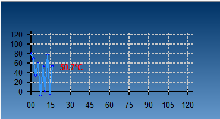

# 曲线图标绘制


1、基本网格



```c++
void MainWindow::drawTemperatureCurve(QGraphicsView *graphicsView, float temperature) {
    // 获取 graphicsView 的大小
    int viewWidth = graphicsView->width();
    int viewHeight = graphicsView->height();

    graphicsView->setHorizontalScrollBarPolicy(Qt::ScrollBarAlwaysOff);
    graphicsView->setVerticalScrollBarPolicy(Qt::ScrollBarAlwaysOff);

    QGraphicsScene *oldScene = graphicsView->scene();
    if (oldScene) {
        graphicsView->setScene(nullptr);
        delete oldScene;
    }

    // 创建场景
    QGraphicsScene *scene = new QGraphicsScene(graphicsView);
    graphicsView->setScene(scene);
    scene->setSceneRect(0, 0, viewWidth, viewHeight);

    int margin = 50;
    int xAxisLength = viewWidth - 2 * margin;
    int yAxisLength = viewHeight - 2 * margin;
    QPoint origin(margin, viewHeight - margin);

    // 绘制渐变背景
    QLinearGradient gradient(0, 0, 0, viewHeight);
    gradient.setColorAt(0.0, QColor("#003366"));
    gradient.setColorAt(1.0, QColor("#6699cc"));
    scene->setBackgroundBrush(QBrush(gradient));

    // 绘制坐标轴
    QPen axisPen(Qt::black, 2);
    scene->addLine(origin.x(), origin.y(), origin.x() + xAxisLength, origin.y(), axisPen);
    scene->addLine(origin.x(), origin.y(), origin.x(), origin.y() - yAxisLength, axisPen);

    // 横轴标签（小时 0~24）
    QStringList timeLabels = {"00", "15", "30", "45", "60", "75", "90", "105", "120"};
    for (int i = 0; i < timeLabels.size(); ++i) {
        int x = origin.x() + (xAxisLength / (timeLabels.size() - 1)) * i;
        scene->addLine(x, origin.y() - 5, x, origin.y() + 5, axisPen);
        QGraphicsTextItem *label = scene->addText(timeLabels[i], QFont("Arial", 8));
        label->setDefaultTextColor(Qt::black);
        label->setPos(x - label->boundingRect().width() / 2, origin.y() + 10);
    }

    // 纵轴标签（温度范围）
    QStringList tempLabels = {"0", "20", "40", "60", "80", "100", "120"};
    for (int i = 0; i < tempLabels.size(); ++i) {
        int y = origin.y() - (yAxisLength / (tempLabels.size() - 1)) * i;
        scene->addLine(origin.x() - 5, y, origin.x() + 5, y, axisPen);
        QGraphicsTextItem *label = scene->addText(tempLabels[i], QFont("Arial", 8));
        label->setDefaultTextColor(Qt::black);
        label->setPos(origin.x() - label->boundingRect().width() - 10, y - label->boundingRect().height() / 2);
    }

    // 添加网格线
    QPen gridPen(QColor(200, 200, 200), 2, Qt::DotLine);
    for (int i = 1; i < timeLabels.size(); ++i) {
        int x = origin.x() + (xAxisLength / (timeLabels.size() - 1)) * i;
        scene->addLine(x, origin.y(), x, origin.y() - yAxisLength, gridPen);
    }
    for (int i = 1; i < tempLabels.size(); ++i) {
        int y = origin.y() - (yAxisLength / (tempLabels.size() - 1)) * i;
        scene->addLine(origin.x(), y, origin.x() + xAxisLength, y, gridPen);
    }

    // 存储温度数据
    static QVector<QPointF> temperatureData;

    // 添加新的数据点
    temperatureData.append(QPointF(timeIndex, temperature));
    timeIndex += updateInterval; // 增加时间索引，200ms 对应 updateInterval 小时

    // 绘制平滑曲线
    QPainterPath path;
    for (int i = 0; i < temperatureData.size(); ++i) {
        float x = origin.x() + (xAxisLength / 120) * temperatureData[i].x();            //
        float y = origin.y() - (yAxisLength / 120.0) * temperatureData[i].y();
        if (i == 0) {
            path.moveTo(x, y);
        } else {
            path.lineTo(x, y);
        }

        // 添加数据点标记
        scene->addEllipse(x - 2, y - 2, 4, 4, QPen(Qt::blue), QBrush(Qt::blue));
    }

    // 设置曲线样式
    QPen curvePen(QColor(50, 150, 250), 2, Qt::SolidLine, Qt::RoundCap, Qt::RoundJoin);
    scene->addPath(path, curvePen);

    // 添加关键点标注
    if (!temperatureData.isEmpty()) {
        float lastX = origin.x() + (xAxisLength / 120.0) * temperatureData.last().x();   // 这里修改横坐标范围，这里直接按照你的刻度来
        float lastY = origin.y() - (yAxisLength / 120.0) * temperatureData.last().y();   // 这里修改纵坐标范围
        QString label = QString::number(temperatureData.last().y(), 'f', 1) + "°C";
        QGraphicsTextItem *tempLabel = scene->addText(label, QFont("Arial", 8, QFont::Bold));
        tempLabel->setDefaultTextColor(Qt::red);
        tempLabel->setPos(lastX + 5, lastY - 10);
    }
    // 添加横坐标单位（分钟）
    QGraphicsTextItem *timeUnitLabel = scene->addText("时间 (分钟)", QFont("Arial", 10));
    timeUnitLabel->setDefaultTextColor(Qt::black);
    timeUnitLabel->setPos(viewWidth / 2 - timeUnitLabel->boundingRect().width() / 2, origin.y() + 20);

        // 添加纵坐标单位（温度°C）
    QGraphicsTextItem *tempUnitLabel = scene->addText("温\n度\n°C", QFont("Arial", 10));
    tempUnitLabel->setDefaultTextColor(Qt::black);
    tempUnitLabel->setPos(origin.x() - 40, viewHeight / 2 - tempUnitLabel->boundingRect().height() / 2);
}

```

