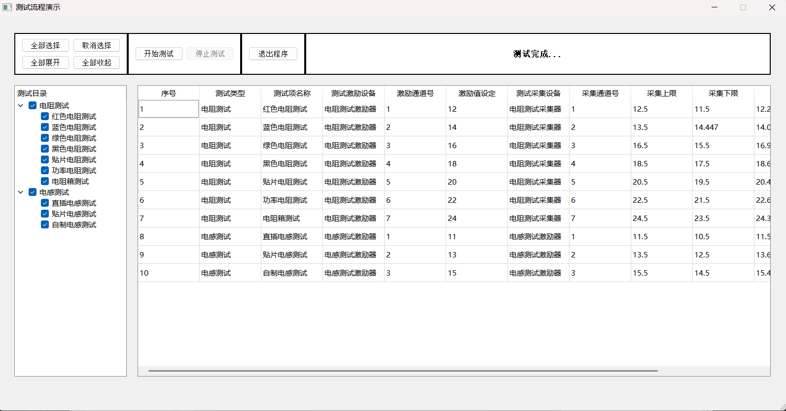

# TEST.cpp

需求控件：xlsx

环境：qt creator 5.12.5+MinGW（64bit）

## 代码：

.h

```c++
#ifndef MAINWINDOW_H
#define MAINWINDOW_H

#include <QMainWindow>
#include <QStandardItemModel>
#include <QTreeView>

QT_BEGIN_NAMESPACE
namespace Ui { class MainWindow; }
QT_END_NAMESPACE

class MainWindow : public QMainWindow
{
    Q_OBJECT

public:
    MainWindow(QWidget *parent = nullptr);
    ~MainWindow();

private:
    Ui::MainWindow *ui;
     QStandardItemModel *model;

     void loadCsv(const QString &path);
     void setupTree();
     void handleItemChanged(QStandardItem *item);
     void selectOrDeselectAll(Qt::CheckState state);

     QStringList selectedItems;     // 用来存储选中的目录项
     void saveToExcel();
     bool isStopped = false;        // 控制是否停止显示数据
     int currentTestRow = 0;        // 当前测试到的行号


private slots:
    void on_btnSelectAll_clicked();                 // 全部选择
    void on_btnDeselectAll_clicked();               // 取消选择
    void on_btnExpandAll_clicked();                 // 展开
    void on_btnCollapseAll_clicked();               // 收起
    void on_btnStartDisplay_clicked();              // 开始检测按钮
    void on_btnStopDisplay_clicked();               // 停止检测按钮


    void loadCsvHeader(const QString &filePath);    // 将数据加入表格
    void onTreeItemClicked(const QModelIndex &index);
    void loadCsvDataForItems(const QStringList &selectedItems);
    void updateSelectedItemsFromTree();


};
#endif // MAINWINDOW_H

```

.cpp

```c++
#include "mainwindow.h"
#include "ui_mainwindow.h"

#include <QFile>
#include <QTextStream>
#include <QSet>
#include <QDebug>
#include <QTableWidget>
#include <QTableWidgetItem>
#include <QStringList>
#include <QTimer>
#include <QtXlsx>
#include <QRandomGenerator>
#include <QColor>


MainWindow::MainWindow(QWidget *parent)
    : QMainWindow(parent)
    , ui(new Ui::MainWindow),
      model(new QStandardItemModel(this))
{
    ui->setupUi(this);

    //ui样式
    //黑框
    ui->widget_4->setStyleSheet(
        "QWidget#widget_4 {"
        "   border: 2px solid black;"
        "   background: white;"
        "}"
    );
    ui->widget_5->setStyleSheet(
        "QWidget#widget_5 {"
        "   border: 2px solid black;"
        "   background: white;"
        "}"
    );
    ui->widget_6->setStyleSheet(
        "QWidget#widget_6 {"
        "   border: 2px solid black;"
        "   background: white;"
        "}"
    );
    ui->widget_7->setStyleSheet(
        "QWidget#widget_7 {"
        "   border: 2px solid black;"
        "   background: white;"
        "}"
    );
    // 设置窗口固定大小（宽度, 高度）
    this->setFixedSize(1600, 800); // 例如 800x600 像素
    this->setWindowTitle("测试流程演示");
    // 设置 QTableWidget 为带网格的表格
    ui->tableWidget->setGridStyle(Qt::SolidLine);  // 设置网格线样式
    ui->tableWidget->setColumnCount(0);  // 默认没有列
    ui->tableWidget->setRowCount(0);  // 默认没有行
    // 禁用表格的行号显示
    ui->tableWidget->verticalHeader()->setVisible(false);
    ui->pushButton_6->setEnabled(false);        //停止检测按钮不可用
    //label
    ui->label->setText("空闲中...");
    // 设置文本居中（水平 + 垂直居中）
    ui->label->setAlignment(Qt::AlignCenter);
    // 设置字体（大小 + 加粗）
    QFont font = ui->label->font();
    font.setPointSize(10);  // 字体大小
    font.setBold(true);     // 加粗
    ui->label->setFont(font);


    //树形目录
    //读取csv文件填充树形结构
    //设置模型
    model->setHorizontalHeaderLabels(QStringList() << "测试目录");
    ui->treeView->setModel(model);
    ui->treeView->expandAll();


    // 加载 CSV 文件到目录
    qDebug() << "Current dir:" << QDir::currentPath();
    loadCsv("./excel.csv");
    connect(model, &QStandardItemModel::itemChanged, this, &MainWindow::handleItemChanged);
    // 启动时加载 CSV 文件的表头
    loadCsvHeader("./excel.csv");


    // 按钮操作目录信号和槽连接
    connect(ui->pushButton,&QPushButton::clicked,this,&MainWindow::on_btnSelectAll_clicked);
    connect(ui->pushButton_2,&QPushButton::clicked,this,&MainWindow::on_btnDeselectAll_clicked);
    connect(ui->pushButton_3,&QPushButton::clicked,this,&MainWindow::on_btnExpandAll_clicked);
    connect(ui->pushButton_4,&QPushButton::clicked,this,&MainWindow::on_btnCollapseAll_clicked);
    connect(ui->pushButton_5, &QPushButton::clicked, this, &MainWindow::on_btnStartDisplay_clicked);   // 开始检测
    connect(ui->pushButton_6, &QPushButton::clicked, this, &MainWindow::on_btnStopDisplay_clicked);     // 停止检测
    connect(ui->pushButton_7, &QPushButton::clicked, this, &QApplication::quit);

    // 连接选择目录项的信号
    connect(ui->treeView, &QTreeView::clicked, this, &MainWindow::onTreeItemClicked);
    //ui->treeView->setEditTriggers(QAbstractItemView::NoEditTriggers); // 防止点击后变成编辑状态
}

//****************************************目录加载***********************************************//
// 目录加载CSV文件
void MainWindow::loadCsv(const QString &path)
{
    QFile file(path);
    if (!file.open(QIODevice::ReadOnly | QIODevice::Text)) {
        qDebug() << "Failed to open CSV file.";
        return;
    }

    QTextStream in(&file);
    QList<QPair<QString, QString>> treeEntries;  // 保留顺序的 <父项, 子项> 列表

    bool isFirstLine = true;
    while (!in.atEnd()) {
        QString line = in.readLine();
        if (isFirstLine) {
            isFirstLine = false;  // 跳过表头
            continue;
        }

        QStringList fields = line.split(",");  // 不使用 SkipEmptyParts，防止丢列
        if (fields.size() < 3) continue;

        QString parent = fields[1].trimmed();
        QString child = fields[2].trimmed();
        treeEntries.append(qMakePair(parent, child));
    }

    // 构建树结构，保留原始顺序
    QMap<QString, QStandardItem*> parentMap;

    for (const auto &entry : treeEntries) {
        const QString &parent = entry.first;
        const QString &child = entry.second;

        QStandardItem *parentItem = nullptr;

        if (!parentMap.contains(parent)) {
            parentItem = new QStandardItem(parent);
            parentItem->setCheckable(true);
            parentItem->setTristate(true);
            model->appendRow(parentItem);
            parentMap[parent] = parentItem;
        } else {
            parentItem = parentMap[parent];
        }

        QStandardItem *childItem = new QStandardItem(child);
        childItem->setCheckable(true);
        parentItem->appendRow(childItem);

    }

    ui->treeView->expandAll();
}


// 目录处理复选框逻辑
void MainWindow::handleItemChanged(QStandardItem *item)
{
    qDebug() << "Item changed:" << item->text() << "State:" << item->checkState();
    if (!item) return;
    Qt::CheckState state = item->checkState();

    // 如果是子项，父项状态不做任何改变
    if (item->parent()) {
        // 更新父项状态
        QStandardItem *parent = item->parent();
        int checkedCount = 0;
        int uncheckedCount = 0;
        int totalCount = parent->rowCount();

        for (int i = 0; i < totalCount; ++i) {
            Qt::CheckState cs = parent->child(i)->checkState();
            if (cs == Qt::Checked) checkedCount++;
            else if (cs == Qt::Unchecked) uncheckedCount++;
        }

        if (checkedCount == totalCount)
            parent->setCheckState(Qt::Checked);
        else if (uncheckedCount == totalCount)
            parent->setCheckState(Qt::Unchecked);
        else
            parent->setCheckState(Qt::PartiallyChecked);
    } else {
        // 父项选中时，所有子项状态与父项一致
        if (state == Qt::Checked) {
            for (int i = 0; i < item->rowCount(); ++i) {
                item->child(i)->setCheckState(Qt::Checked);
            }
        } else if (state == Qt::Unchecked) {
            for (int i = 0; i < item->rowCount(); ++i) {
                item->child(i)->setCheckState(Qt::Unchecked);
            }
        }
    }
}

// 槽函数：全部选择
void MainWindow::on_btnSelectAll_clicked() {
    //全选
    selectOrDeselectAll(Qt::Checked);
    // 遍历所有父项，将父项及其子项都加入选中项
    selectedItems.clear();  // 清空已选项
    for (int row = 0; row < ui->treeView->model()->rowCount(); ++row) {
        QModelIndex parentIndex = ui->treeView->model()->index(row, 0);
        selectedItems.append(parentIndex.data().toString());
        for (int i = 0; i < ui->treeView->model()->rowCount(parentIndex); ++i) {
            QModelIndex childIndex = ui->treeView->model()->index(i, 0, parentIndex);
            selectedItems.append(childIndex.data().toString());
         }
    }
    //loadCsvDataForItems(selectedItems);  // 更新表格显示所有选中的项
}

// 槽函数：取消选择
void MainWindow::on_btnDeselectAll_clicked() {
    selectOrDeselectAll(Qt::Unchecked);
}

// 槽函数：全部展开
void MainWindow::on_btnExpandAll_clicked() {
    ui->treeView->expandAll();
}

// 槽函数：全部收起
void MainWindow::on_btnCollapseAll_clicked() {
    ui->treeView->collapseAll();
}

// 辅助函数：选择或取消选择所有项
void MainWindow::selectOrDeselectAll(Qt::CheckState state) {
    // 遍历模型，选择或取消选择所有项
    for (int row = 0; row < model->rowCount(); ++row) {
        QStandardItem *parentItem = model->item(row);
        parentItem->setCheckState(state);

        // 遍历所有子项并设置勾选状态
        for (int i = 0; i < parentItem->rowCount(); ++i) {
            parentItem->child(i)->setCheckState(state);
        }
    }
}
//*********************************************************************************************//


//*************************************表格操作*************************************************//

// 读取 CSV 文件并将第一行作为表头加载到 QTableWidget
void MainWindow::loadCsvHeader(const QString &filePath)
{
    QFile file(filePath);
    if (!file.open(QIODevice::ReadOnly | QIODevice::Text)) {
        qDebug() << "Failed to open CSV file.";
        return;
    }

    QTextStream in(&file);
    QStringList header;

    // 读取 CSV 文件的第一行作为表头
    bool isFirstLine = true;
    while (!in.atEnd()) {
        QString line = in.readLine();
        QStringList fields = line.split(",", QString::SkipEmptyParts);
        if (isFirstLine) {
            header = fields;  // 获取表头
            isFirstLine = false;
            break;  // 只读取第一行
        }
    }

    // 设置列数
    ui->tableWidget->setColumnCount(header.size());
    // 设置表头标题
    for (int col = 0; col < header.size(); ++col) {
        ui->tableWidget->setHorizontalHeaderItem(col, new QTableWidgetItem(header[col]));
    }
}

// 当用户点击目录项时，加载并显示对应的数据行
void MainWindow::onTreeItemClicked(const QModelIndex &index)
{
    if (!index.isValid()) return;

    QStandardItemModel *model = qobject_cast<QStandardItemModel *>(ui->treeView->model());
    QStandardItem *item = model->itemFromIndex(index);

//    Qt::CheckState state = item->checkState();

//    // 切换状态
//    if (state == Qt::Unchecked) {
//        item->setCheckState(Qt::Checked);
//    } else {
//        item->setCheckState(Qt::Unchecked);
//    }

    // 如果是父项，操作所有子项
    if (!item->parent()) {
        for (int i = 0; i < item->rowCount(); ++i) {
            QStandardItem *child = item->child(i);
            child->setCheckState(item->checkState());  // 同步状态
        }
    }

    updateSelectedItemsFromTree();  // 遍历所有复选框，重新统计
    // 加载所有选中的项的数据
    //loadCsvDataForItems(selectedItems);
}

void MainWindow::updateSelectedItemsFromTree()
{
    selectedItems.clear();
    QStandardItemModel *model = qobject_cast<QStandardItemModel *>(ui->treeView->model());

    for (int i = 0; i < model->rowCount(); ++i) {
        QStandardItem *parent = model->item(i);
        if (parent->checkState() == Qt::Checked) {
            selectedItems.append(parent->text());
        }

        for (int j = 0; j < parent->rowCount(); ++j) {
            QStandardItem *child = parent->child(j);
            if (child->checkState() == Qt::Checked) {
                selectedItems.append(child->text());
            }
        }
    }

    // 此处不直接加载数据，等点击“开始显示”按钮再加载
}


// 根据选中的目录项加载相关数据
void MainWindow::loadCsvDataForItems(const QStringList &selectedItems)
{
    QFile file("./excel.csv");
    if (!file.open(QIODevice::ReadOnly | QIODevice::Text)) {
        qDebug() << "Failed to open CSV file.";
        return;
    }

    QTextStream in(&file);
    QList<QStringList> tableData;

    bool isFirstLine = true;
    while (!in.atEnd()) {
        QString line = in.readLine();
        if (isFirstLine) {
            isFirstLine = false;
            continue;
        }

        QStringList fields = line.split(",", QString::SkipEmptyParts);
        for (const QString &item : selectedItems) {
            if (fields.contains(item)) {
                tableData.append(fields);
                break;
            }
        }
    }

    // **继续测试支持：保留当前行不清空已有数据**
    if (currentTestRow == 0) {
        ui->tableWidget->setRowCount(0);  // 仅首次开始时清空
    }

    // 从 currentTestRow 开始处理
    for (int row = currentTestRow; row < tableData.size(); ++row) {
        if (isStopped) {
            ui->pushButton_5->setText("继续测试");  // 设置为“继续测试”
            ui->label->setText("测试暂停...");
            currentTestRow = row;  // 保存中断的位置
            return;
        }

        // 以下为原始的填充表格代码
        int currentRowInTable = ui->tableWidget->rowCount();
        ui->tableWidget->insertRow(currentRowInTable);

        for (int col = 0; col < tableData[row].size(); ++col) {
            ui->tableWidget->setItem(currentRowInTable, col, new QTableWidgetItem(tableData[row][col]));
        }

        double upperLimit = ui->tableWidget->item(currentRowInTable, 8)->text().toDouble();
        double lowerLimit = ui->tableWidget->item(currentRowInTable, 9)->text().toDouble();

        double randomData = lowerLimit + QRandomGenerator::global()->generateDouble() * (upperLimit - lowerLimit) + 0.5;

        if (ui->tableWidget->columnCount() <= 10)
            ui->tableWidget->setColumnCount(12);  // 确保12列（含采集数据+结论）

        QTableWidgetItem *dataItem = new QTableWidgetItem(QString::number(randomData));
        ui->tableWidget->setItem(currentRowInTable, 10, dataItem);

        QTableWidgetItem *resultItem = new QTableWidgetItem();
        if (randomData >= lowerLimit && randomData <= upperLimit) {
            resultItem->setText("Pass");
            resultItem->setBackgroundColor(Qt::green);
        } else {
            resultItem->setText("Fail");
            resultItem->setBackgroundColor(Qt::red);
        }
        ui->tableWidget->setItem(currentRowInTable, 11, resultItem);

        // 延迟模拟
        QEventLoop loop;
        QTimer::singleShot(1000, &loop, &QEventLoop::quit);
        loop.exec();
    }

    // 测试结束
    currentTestRow = 0;
    if (!isStopped) {
        ui->pushButton_5->setText("开始测试");
        ui->label->setText("测试完成...");
        ui->pushButton_6->setEnabled(false);     // 停用停止按钮
        saveToExcel();  // 自动保存
    }
}

// 开始检测按钮点击时
void MainWindow::on_btnStartDisplay_clicked()
{
    // 点击后显示所有选中的目录项的数据
    if (selectedItems.isEmpty()) {
        ui->tableWidget->setRowCount(0);
        qDebug() << "No items selected.";
        return;  // 如果没有选中任何项，则不显示数据
    }

    ui->pushButton_6->setEnabled(true);     // 启用停止按钮
    isStopped = false;                      // 重置停止标志

    ui->pushButton_5->setText("开始测试");
    ui->label->setText("正在检测...");


    if (currentTestRow == 0) {
        ui->label->setText("开始测试...");
        ui->pushButton_5->setText("开始测试");
    } else {
        ui->label->setText("继续测试...");
        ui->pushButton_5->setText("继续测试");
    }

    loadCsvDataForItems(selectedItems);

    if(!isStopped){
      saveToExcel();
      ui->label->setText("测试完成...");
    }
}

// 停止显示按钮
void MainWindow::on_btnStopDisplay_clicked()
{
    isStopped = true;  // 设置为停止状态
    ui->label->setText("已停止...");
}
//*********************************************************************************************//


//**************************************数据excel***********************************************//
void MainWindow::saveToExcel()
{
    // 创建 Excel 文件
    QXlsx::Document xlsx;

    // 获取表格列数
    int rowCount = ui->tableWidget->rowCount();
    int colCount = ui->tableWidget->columnCount();

    // 写入表头
    for (int col = 0; col < colCount; ++col) {
        QString header = ui->tableWidget->horizontalHeaderItem(col)->text();
        xlsx.write(1, col + 1, header);  // 写入 Excel 第一行
    }

    // 写入数据
    for (int row = 0; row < rowCount; ++row) {
        for (int col = 0; col < colCount; ++col) {
            QTableWidgetItem *item = ui->tableWidget->item(row, col);
            if (item) {
                xlsx.write(row + 2, col + 1, item->text());  // 数据从第二行开始
            }
        }
    }

    // 保存 Excel 文件
    QString filePath = "result.xlsx";  // 保存文件的路径
    if (xlsx.saveAs(filePath)) {
        qDebug() << "Excel file saved successfully!";

        // 自动打开文件
        QProcess::startDetached("explorer", QStringList() << filePath);
    } else {
        qDebug() << "Failed to save Excel file!";
    }
}


MainWindow::~MainWindow()
{
    delete ui;
}

```


## 结果展示：

